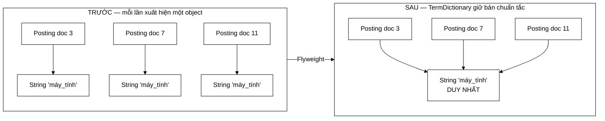

# 10 — Flyweight

**Nhóm:** Structural (mẫu cấu trúc) · **Trụ cột OOP:** Đóng gói · **SOLID:** S (Single Responsibility)

**Trong VnSearch:** `TermDictionary`

---

## 1. Hiểu trong 30 giây

Khi rất nhiều object có **cùng nội dung**, Flyweight giữ **một instance chuẩn tắc** cho mỗi nội dung phân biệt và cho tất cả cùng trỏ vào đó.



```
❌ Trước: 7.000.000 object String  ─┐
                                    ├─ cho 136.768 giá trị PHÂN BIỆT
✅ Sau:     136.768 object String  ─┘

   tỉ lệ chia sẻ trung bình ≈ 51 lần / một chuỗi
```

**Vì sao con số chênh nhau tới 51 lần** — đó là định luật Zipf ở dạng thực
dụng: một số ít term xuất hiện ở rất nhiều tài liệu.

```
   số lần xuất hiện
        │
   10^6 │█
        │█
   10^4 │██▄
        │████▄▄
   10^2 │████████▄▄▄▄
        │███████████████▄▄▄▄▄▄▄▄▄
     1  │████████████████████████████████████████
        └────────────────────────────────────────▶ term xếp theo tần suất
         "của" "và"            …                  term hiếm
         ▲                                        ▲
         chia sẻ hàng trăm nghìn lần               chia sẻ 1 lần
```

Câu thần chú: **"Nội dung giống nhau thì dùng chung một object."**

---

## 2. Vấn đề thật trong dự án

Chỉ mục có **136.768 term phân biệt**. Nhưng tokenizer tạo chuỗi **mới** mỗi lần gặp term đó:

```java
term = String.join("_", Arrays.copyOfRange(syllables, i, i + matchedLen));
//     ↑ LUÔN cấp phát một String mới, kể cả khi nội dung đã gặp 10.000 lần
```

Phép tính:

$$5011 \text{ tài liệu} \times \approx 1400 \text{ tiếng} \approx \mathbf{7\ \text{triệu}}\ \text{object } \texttt{String}$$

cho **136.768** giá trị phân biệt. Tỷ lệ trùng lặp $\approx 51:1$.

Mỗi `String` tốn:

```
16 byte (header object)
 8 byte (tham chiếu tới byte[])
 4 byte (hash cache)
16 + L byte (mảng byte[] chứa nội dung)
────────────────────────────
≈ 44 + L byte
```

Với term trung bình ~10 ký tự: $\approx 54$ byte × 7 triệu $\approx$ **378 MB** cấp phát, trong khi dữ liệu **thật sự phân biệt** chỉ $\approx 136768 \times 54 \approx$ **7,4 MB**.

Phần lớn số đó là rác GC ngắn hạn — nhưng áp lực cấp phát đó làm chậm quá trình dựng chỉ mục và gây các đợt GC dừng ứng dụng.

---

## 3. Cấu trúc trong mã

Toàn bộ pattern nằm gọn trong một phương thức:

```java
public final class TermDictionary {

    private final Map<String, String> pool;

    public TermDictionary() {
        this(1 << 18);   // 262.144 — đủ cho 136.768 term mà không phải rehash
    }

    /**
     * O(L) — trả về instance CHUẨN TẮC của chuỗi. Mọi lần gọi với nội dung
     * giống nhau đều trả về CÙNG MỘT object.
     */
    public String intern(String term) {
        if (term == null) return null;
        String existing = pool.putIfAbsent(term, term);
        return existing != null ? existing : term;
    }

    public int size() { return pool.size(); }

    /** Ước lượng bộ nhớ so với việc giữ riêng mỗi lần xuất hiện. */
    public long estimatedBytes() { ... }

    public void clear() { pool.clear(); }
}
```

Nơi dùng:

```java
// InvertedIndex.addDocument
String term = termDictionary.intern(token.term());
positionsByTerm.computeIfAbsent(term, k -> new ArrayList<>()).add(token.position());
```

Chuỗi mới do tokenizer tạo ra **trở thành rác ngay lập tức** nếu nội dung đã có trong pool — GC thu hồi nó ở thế hệ trẻ, rất rẻ. Cái được giữ lại là instance chuẩn tắc.

---

## 4. `Map<String, String>` — vì sao khoá và giá trị giống nhau

Đây là chỗ gây bối rối khi đọc lần đầu:

```java
private final Map<String, String> pool;
pool.putIfAbsent(term, term);   // khoá và giá trị là CÙNG một tham chiếu
```

Lý do: `Map` tra cứu bằng `equals()` (**so sánh nội dung**), nhưng ta cần lấy ra **instance** (tham chiếu cụ thể). `HashSet` không giúp được — nó có `contains()` nhưng **không có** phương thức *"trả về phần tử đã có trong tập"*.

Vậy `Map` được dùng như một *"tập có khả năng lấy lại phần tử"*:

| Bạn có | Bạn nhận được |
|---|---|
| Một `String` mới có nội dung `"máy_tính"` | Instance `"máy_tính"` **đầu tiên từng thấy** |

Sau đó `term1 == term2` là `true` — **so sánh tham chiếu**, nhanh hơn `equals()` và là điều kiện để tiết kiệm bộ nhớ thật sự.

---

## 5. `putIfAbsent` — một lần băm thay vì hai

```java
// ✅ Một lần băm
String existing = pool.putIfAbsent(term, term);
return existing != null ? existing : term;

// ❌ Hai lần băm — cùng kết quả, gấp đôi chi phí
if (pool.containsKey(term)) return pool.get(term);
pool.put(term, term);
return term;
```

Băm một `String` là $O(L)$ — phải duyệt hết ký tự. Với **7 triệu lần gọi**, tiết kiệm một lần băm mỗi lần gọi là con số thật.

Ngoài ra `putIfAbsent` là **thao tác nguyên tử** trên `ConcurrentHashMap` — bản hiện tại dùng `HashMap` (xem §7) nhưng viết theo cách này thì đổi sang phiên bản đồng thời chỉ là đổi một dòng khởi tạo.

> **Bài học chung:** khi API cung cấp một phương thức làm **tra cứu + cập nhật trong một thao tác** (`putIfAbsent`, `computeIfAbsent`, `merge`, `getOrDefault`), dùng nó. Nó vừa nhanh hơn vừa an toàn hơn về mặt đồng thời so với việc ghép hai lời gọi.

Dự án dùng nhất quán: `computeIfAbsent` trong `InvertedIndex`, `merge` trong `CandidateResolver.buildQueryTermFrequency`, `getOrDefault` trong `PageRankBoostScorer`.

---

## 6. Vì sao không dùng `String.intern()` có sẵn của JDK

Câu hỏi hiển nhiên, và câu trả lời là một quyết định thiết kế đáng bảo vệ:

```java
String term = token.term().intern();   // ← sao không dùng cái này?
```

| Tiêu chí | `String.intern()` của JDK | `TermDictionary` |
|---|---|---|
| Vùng nhớ | Bảng chuỗi **nội bộ JVM** | Heap thường |
| Giải phóng được | ❌ **Không**, cho tới khi lớp bị gỡ | ✅ `clear()` |
| Kích thước | Cấu hình cứng (`-XX:StringTableSize`) | Tự động theo `HashMap` |
| Đo được | ❌ Không có API | ✅ `size()`, `estimatedBytes()` |
| Ảnh hưởng phần còn lại của JVM | Có — dùng chung bảng với mọi thư viện | Không — cô lập |

Ba lý do cụ thể trong bối cảnh dự án:

**1. Không giải phóng được.** Mỗi lần **reindex** sinh ra một tập term mới. Với `String.intern()`, term của chỉ mục cũ nằm lại trong bảng chuỗi JVM **vĩnh viễn**. Sau vài lần reindex, rò rỉ bộ nhớ.

**2. Không đo được.** Dự án này lấy đo đạc làm nguyên tắc. `estimatedBytes()` và `size()` cho số liệu đưa thẳng vào báo cáo; bảng chuỗi JVM không có API tương đương.

**3. Ảnh hưởng toàn cục.** Bảng chuỗi JVM dùng chung với mọi thư viện trong tiến trình. Đổ 136.768 chuỗi vào đó gây áp lực lên vùng nhớ mà bạn không kiểm soát và không đo được.

> **Bài học OOP:** *"đã có sẵn trong thư viện chuẩn"* không tự động là lý do đủ. Hãy so sánh **vòng đời**, **khả năng đo đạc**, và **phạm vi ảnh hưởng** — ba tiêu chí thường quyết định, và cả ba đều bất lợi cho `String.intern()` ở đây.

---

## 7. Một hạn chế được nói thẳng

Javadoc ghi rõ:

> **Không thread-safe.** `InvertedIndex` chỉ dùng nó trong `addDocument`, mà việc dựng chỉ mục luôn **đơn luồng** (dựng xong một chỉ mục mới hoàn chỉnh rồi gán bằng tham chiếu `volatile`).

Đây là cách xử lý đúng cho một ràng buộc như vậy:

1. **Nêu rõ** giới hạn — không giả vờ nó không tồn tại.
2. **Nêu vì sao** giới hạn đó chấp nhận được ở đây.
3. **Nêu cơ chế** đảm bảo điều kiện đó (`volatile` reference swap).

So sánh với việc dùng `ConcurrentHashMap` "cho chắc": sẽ trả chi phí đồng bộ cho **7 triệu lần gọi** mà không cần thiết. Đó là **tối ưu hoá ngược** — trả giá cho một vấn đề không tồn tại.

> Đối chiếu: `Trie` **thật sự** bị truy cập đa luồng (gợi ý từ nhiều request HTTP đồng thời) nên nó dùng `ReentrantReadWriteLock`. Cùng dự án, hai lựa chọn khác nhau, mỗi lựa chọn khớp với ca sử dụng thật. **Đó là dấu hiệu của thiết kế có suy nghĩ** — không phải áp một quy tắc chung cho mọi chỗ.

Nếu về sau cần dựng chỉ mục song song, đổi một dòng:

```java
this.pool = new ConcurrentHashMap<>(expectedTerms);
```

`putIfAbsent` đã đúng ngữ nghĩa nguyên tử — đây chính là lợi ích của §5.

---

## 8. Flyweight "đầy đủ" khác gì bản này

Sách Gang of Four mô tả Flyweight với hai phần trạng thái:

| Loại trạng thái | Nghĩa | Ví dụ kinh điển (soạn thảo văn bản) |
|---|---|---|
| **Intrinsic** (nội tại) | Dùng chung được, không đổi | Hình dạng chữ `'a'` |
| **Extrinsic** (ngoại lai) | Riêng mỗi lần dùng, truyền vào | Vị trí, cỡ chữ, màu |

Trong `TermDictionary`:

- **Intrinsic:** nội dung chuỗi term (`"máy_tính"`) — dùng chung.
- **Extrinsic:** tần suất và vị trí của term **trong từng tài liệu** — lưu riêng trong `Posting`.

Đúng tinh thần Flyweight, chỉ ở dạng đơn giản hơn ví dụ trong sách vì trạng thái nội tại ở đây **chính là bản thân object** (một `String`), không cần lớp bọc riêng.

Nếu bị hỏi *"đây có phải Flyweight thật không?"*, trả lời: đây là biến thể **String interning** — dạng phổ biến nhất của Flyweight trong thực tế, dùng trong chính JVM, trong Lucene (`BytesRefHash`), và trong mọi công cụ tìm kiếm nghiêm túc.

---

## 9. Sai lầm thường gặp

**❌ Flyweight cho object thay đổi được.**
Chia sẻ chỉ an toàn khi object **bất biến**. `String` bất biến nên an toàn. Nếu chia sẻ một `List` thay đổi được, một người sửa là mọi người bị ảnh hưởng — lỗi kinh khủng để gỡ.

**❌ Pool không bao giờ xoá trong ứng dụng chạy dài.**
Đúng là vấn đề của `String.intern()` ở §6. `TermDictionary.clear()` tồn tại chính vì lý do này.

**❌ Dùng Flyweight khi tỷ lệ trùng lặp thấp.**
Nếu 7 triệu chuỗi mà có 6,9 triệu giá trị phân biệt, pool chỉ **tốn thêm** bộ nhớ (thêm một `HashMap` khổng lồ) mà không tiết kiệm gì. Ở đây tỷ lệ là **51:1** — hoàn toàn đáng.

**❌ Quên rằng `intern` cũng tốn chi phí.**
Mỗi lần gọi tốn $O(L)$ để băm. Đánh đổi: chi phí CPU băm ↔ tiết kiệm bộ nhớ và áp lực GC. Ở đây đáng vì áp lực GC là nút thắt của quá trình dựng chỉ mục; trong một vòng lặp tính toán thuần thì có thể không.

---

## 10. Câu hỏi bảo vệ đồ án

**H: Tiết kiệm được bao nhiêu bộ nhớ thực tế?**
Đ: Bộ nhớ **thường trú** giảm từ "số lần xuất hiện" xuống "số term phân biệt". Với chỉ mục 5.011 tài liệu: thay vì giữ tham chiếu tới 7 triệu chuỗi rải rác, chỉ giữ 136.768 instance — `estimatedBytes()` in ra con số cụ thể. Quan trọng không kém: **áp lực GC** trong lúc dựng chỉ mục giảm mạnh vì chuỗi tạm chết ngay ở thế hệ trẻ.

**H: `1 << 18` là gì và vì sao chọn số đó?**
Đ: $2^{18} = 262144$, gấp gần đôi 136.768 term. `HashMap` mặc định rehash khi tỷ lệ lấp đầy vượt 0,75 — mỗi lần rehash phải băm lại **toàn bộ** khoá. Cấp phát đủ ngay từ đầu tránh một chuỗi rehash tốn kém trong lúc dựng chỉ mục.

**H: Nếu term chỉ xuất hiện một lần thì có hại không?**
Đ: Có chi phí nhỏ — một entry `HashMap` thừa (~32 byte) cho một chuỗi không tiết kiệm được gì. Nhưng phân bố term tuân theo **định luật Zipf**: một số ít term chiếm phần lớn số lần xuất hiện. Tỷ lệ trùng lặp trung bình 51:1 nghĩa là lợi ích áp đảo chi phí của các term hiếm.

---

## 11. Tự kiểm tra

1. Chạy `TermDictionary.main()`. Vì sao `a == b` là `true` dù cả hai được tạo bằng `new String("máy_tính")`?
2. Nếu `intern` viết bằng `containsKey` + `get` + `put`, thêm bao nhiêu lần băm cho 7 triệu lần gọi?
3. Vì sao Flyweight **an toàn** với `String` nhưng **nguy hiểm** với `ArrayList`? Cho một kịch bản hỏng cụ thể.
4. Ước lượng bộ nhớ tiết kiệm được nếu corpus tăng lên 50.000 tài liệu, giả sử số term phân biệt tăng theo định luật Heaps ($V \approx k N^\beta$ với $\beta \approx 0{,}5$).

---

## Liên kết

- Mẫu trước: [09-ITERATOR-CURSOR.md](09-ITERATOR-CURSOR.md)
- Các mẫu bổ trợ: [11-MAU-BO-TRO.md](11-MAU-BO-TRO.md)
- Cấu trúc chỉ mục dùng nó: [InvertedIndex](../02-index/InvertedIndex.md)
- Tokenizer sinh ra các chuỗi tạm: [VietnameseTokenizer](../02-index/VietnameseTokenizer.md)
