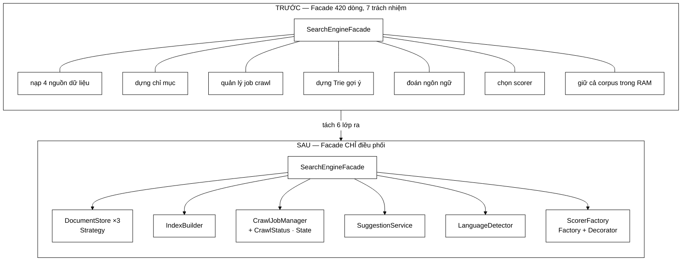

# 11 — Bảy mẫu bổ trợ

Bảy mẫu dưới đây **không được tính vào "10 pattern chủ đích"** vì chúng hoặc quá phổ biến (DI, Repository), hoặc là hệ quả tự nhiên của kiến trúc (Facade, Producer–Consumer). Nhưng chúng đều **có thật trong code** và đều dạy một bài học OOP riêng — nên đáng biết khi bảo vệ.

---

## 1. Facade — `SearchEngineFacade`

**Nhóm:** Structural · **Bài học:** Single Responsibility, và ranh giới giữa *điều phối* và *thực thi*

### Việc nó làm

Cho tầng REST API **một điểm vào duy nhất** cho toàn bộ pipeline `crawl → index → rank → phục vụ`, thay vì bắt controller tự nối 8 thành phần lại.

### Bài học: Facade **rất dễ** biến thành God Object



```
   TRƯỚC                              SAU
   ─────                              ───
   ┌───────────────────────┐          ┌──────────────────┐
   │ SearchEngineFacade    │          │ SearchEngineFacade│  ◀ chỉ điều phối
   │  420 dòng             │          └────────┬─────────┘
   │  ┌─ nạp dữ liệu       │                   │
   │  ├─ dựng chỉ mục      │     tách     ┌────┴────┬────────┬─────────┐
   │  ├─ quản lý job       │  ─────────▶  ▼         ▼        ▼         ▼
   │  ├─ dựng Trie         │           Document  Index    Crawl    Scorer
   │  ├─ đoán ngôn ngữ     │            Store    Builder  Job…     Factory
   │  ├─ chọn scorer       │
   │  └─ giữ corpus RAM    │           mỗi lớp MỘT lý do để thay đổi
   └───────────────────────┘
```

Đây là điều đáng nói nhất. Bản cũ dài **420 dòng** và gánh **bảy** trách nhiệm:

| Trách nhiệm cũ trong Facade | Nay ở đâu | Mẫu |
|---|---|---|
| Nạp dữ liệu từ 4 nguồn (chuỗi `else if`) | `DocumentStore` + 2 cài đặt | [Strategy](01-STRATEGY.md) |
| Dựng chỉ mục (tiền đề sort lặp ở 3 nơi) | `IndexBuilder` | — |
| Quản lý job crawl (`String status`) | `CrawlJobManager` + `CrawlStatus` | [State](06-STATE.md) |
| Dựng Trie gợi ý | `SuggestionService` | — |
| Đoán ngôn ngữ | `LanguageDetector` | — |
| Chọn scorer (chôn cứng `new TfIdfScorer()`) | `ScorerFactory` | [Factory](02-FACTORY.md) + [Decorator](03-DECORATOR.md) |
| Kết hợp tín hiệu xếp hạng | Chuỗi Decorator | [Decorator](03-DECORATOR.md) |

Javadoc hiện tại nói thẳng:

> Lớp này **KHÔNG chứa thuật toán DSA nào** — mọi logic lõi nằm trong các lớp chuyên trách.

**Bài kiểm tra nhận biết Facade đã thoái hoá thành God Object:** *"Facade có chứa thuật toán không, hay chỉ gọi lớp khác?"* Nếu có vòng lặp tính toán trong Facade, nó đã vượt vai trò.

### Hai chi tiết đúng còn lại

**Đọc tham chiếu một lần vào biến cục bộ:**

```java
// Nếu đọc lại ở cuối hàm, một lần reindex xen giữa có thể khiến
// kết quả CŨ bị ghi vào cache MỚI.
LRUCache<String, SearchResponse> cache = searchCache;
SearchIndex   currentIndex  = index;
RelevanceScorer currentScorer = scorer;
```

Đây là lỗi đồng thời tinh vi: trạng thái được thay bằng **hoán đổi tham chiếu `volatile`**, nên trong một lần thực thi `search()` phải chụp lấy một ảnh nhất quán.

**Dùng chung bộ phân giải ứng viên với bộ đánh giá:**

```java
// Dùng CHUNG bộ phân giải ứng viên với bộ đánh giá chất lượng, để những
// gì được ĐO đúng bằng những gì được PHỤC VỤ.
CandidateResolver.ResolvedQuery resolved = CandidateResolver.resolve(currentIndex, parsed);
```

Trước đây `CandidateResolver` là phương thức private trong Facade, nên bộ đánh giá phải **viết lại một bản sao**. Hai bản sao chắc chắn trôi lệch theo thời gian — và khi đó **mọi con số trong báo cáo đánh giá đều mất giá trị**, vì chúng đo một đường đi khác với đường mà hệ thống thực sự phục vụ người dùng.

---

## 2. Adapter — bộ ba chạm Jsoup, `Stack<T>` (TypeScript)

**Nhóm:** Structural · **Bài học:** cô lập thư viện ngoài

### Việc nó làm

Bọc một API bên ngoài sau interface của **mình**, để phần còn lại của hệ thống không phụ thuộc vào nó.

Jsoup chỉ xuất hiện ở **4 file**, và cả 4 đều nằm trong gói `crawler/`: `HtmlDownloader` (tải + phân tích), `ContentParser` (rút nội dung), `LinkExtractor` (rút liên kết), `CrawlerService` (giữ kiểu `Document` để chuyền giữa ba khối trên). Đo được:

| Thư viện ngoài | Số file chạm tới |
|---|---|
| Jsoup (phân tích HTML) | **4**, đều trong `crawler/` |
| Jackson (JSON) | **3** |

Con số tăng từ 2 lên 4 khi tách `HtmlExtractor` thành ba khối theo sơ đồ kiến trúc crawler. Đây là **đánh đổi có chủ ý**: mỗi khối trong sơ đồ ứng với đúng một lớp, đổi lại đường biên quanh Jsoup rộng thêm hai file. Đường biên vẫn nằm gọn trong một gói duy nhất, nên chi phí đổi thư viện gần như không đổi.

### Vì sao con số đó quan trọng

Nếu Jsoup xuất hiện ở 30 file rải khắp các gói, việc đổi sang thư viện khác (hoặc nâng cấp phiên bản có breaking change) là sửa 30 file. Với 4 file nằm cùng một gói, đó là một buổi chiều.

Đây là **chi phí đổi phụ thuộc** — một chỉ số kiến trúc đo được, và là lập luận tốt trong báo cáo vì nó là **con số**, không phải ý kiến.

> **Bài học OOP:** vẽ một đường biên quanh mọi thư viện ngoài. Bên trong đường biên, dùng API của thư viện; bên ngoài, chỉ dùng kiểu của bạn. Đường biên đó chính là Adapter.

`Stack<T>` ở frontend cũng vậy: bọc mảng JavaScript sau một API `push`/`pop`/`peek` rõ ràng, với bản sao phòng thủ ở `toArray()`.

---

## 3. Repository — `DocumentRepository`

**Nhóm:** Kiến trúc (Domain-Driven Design) · **Bài học:** tách truy cập dữ liệu khỏi logic nghiệp vụ

### Việc nó làm

Gom mọi câu SQL vào một lớp. Tầng trên gọi `findAll()`, `save(doc)` — không thấy JDBC, không thấy `PreparedStatement`, không thấy chuỗi SQL.

### Quan hệ với `DocumentStore`

Đây là điểm dễ nhầm, cần phân biệt rõ:

| | `DocumentRepository` | `DocumentStore` |
|---|---|---|
| Là gì | Lớp **cụ thể** — CRUD JDBC trên PostgreSQL | **Interface** — một nguồn corpus bất kỳ |
| Biết về | Bảng, cột, câu SQL | Chỉ biết "có sẵn không" và "nạp tất cả" |
| Mẫu | Repository | [Strategy](01-STRATEGY.md) |

`PostgresDocumentStore` **cài** `DocumentStore` và **dùng** `DocumentRepository` bên trong. Hai tầng trừu tượng chồng lên nhau, mỗi tầng một mục đích: Repository giấu **SQL**, Strategy giấu **loại nguồn dữ liệu**.

---

## 4. Value Object — 9 `record`

**Nhóm:** Kiến trúc · **Bài học:** biết khi nào **không** dùng

### Chín `record` trong dự án

`Posting`, `Token`, `ParsedQuery`, `CrawlEvent`, `FilterContext`, `ResolvedQuery`, `TermNode`, `PhraseNode`, `AndNode`, `OrNode`, `NotNode`… — object định danh bằng **giá trị**, không bằng danh tính.

Lợi ích miễn phí từ `record`: bất biến, `equals`/`hashCode` theo giá trị, `toString` hữu ích khi gỡ lỗi, an toàn đa luồng.

### Điểm đáng nói: biết khi nào **không** dùng

`PoolEntry` trong `eval/PoolBuilder` **không** là `record`, và có lý do: nó **sinh ra để được sửa tay** — người đánh giá mở file qrels ra và điền nhãn liên quan. Một `record` bất biến sẽ chống lại đúng ca sử dụng của nó.

> **Bài học OOP:** *"dùng nhiều pattern"* không phải mục tiêu. Nhận ra chỗ pattern **không** hợp và giải thích được vì sao là dấu hiệu hiểu sâu hơn.

---

## 5. Cache-Aside — `LRUCache` trong `search()`

**Nhóm:** Kiến trúc · **Bài học:** một lỗi đồng thời phản trực giác

### Việc nó làm

```java
SearchResponse cached = cache.get(cacheKey);
if (cached != null) {
    cacheHits.incrementAndGet();
    return cached;                        // trúng cache
}
cacheMisses.incrementAndGet();
... // tính toán
cache.put(cacheKey, response);            // ghi vào cache rồi trả về
```

Đo được: **34,5 ms → 12,8 ms** (nhanh gấp 2,7 lần).

### Bài học: `get` của LRU thực ra là một thao tác **ghi**

Đây là điểm phản trực giác đáng đưa vào báo cáo.

`LRUCache.get()` không chỉ đọc — nó phải **di chuyển phần tử vừa truy cập lên đầu danh sách liên kết** để cập nhật thứ tự "gần đây nhất". Đó là **sửa cấu trúc dữ liệu**.

Hệ quả: dùng `readLock()` cho `get()` là **sai** — hai luồng cùng "đọc" sẽ cùng sửa danh sách liên kết và làm hỏng nó. `get()` phải giành **write lock**.

> **Bài học chung:** khi phân loại thao tác thành đọc/ghi cho mục đích đồng bộ, hãy hỏi *"nó có sửa gì không?"* — chứ đừng hỏi *"tên nó là gì?"*.

Chi tiết đầy đủ: [LRUCache §3](../05-datastructures/LRUCache.md).

---

## 6. Producer–Consumer — Crawler + `UrlFrontier`

**Nhóm:** Đồng thời · **Bài học:** phát hiện kết thúc phân tán

### Việc nó làm

12 worker thread cùng lấy URL từ `UrlFrontier`, tải trang, trích xuất liên kết, rồi **đẩy URL mới trở lại** frontier. Mỗi worker vừa là **producer** vừa là **consumer**.

### Bài học: khi nào thì dừng?

Trong Producer–Consumer thông thường, producer đóng hàng đợi khi hết việc. Ở đây **không có producer riêng** — nên hàng đợi rỗng **không** có nghĩa là xong: một worker khác có thể đang tải trang và sắp đẩy 50 URL mới vào.

Lời giải là **phát hiện kết thúc phân tán**: đếm số worker đang hoạt động bằng `AtomicInteger`, và chỉ kết luận đã xong khi **frontier rỗng VÀ không worker nào đang hoạt động**.

```java
try {
    activeWorkers.incrementAndGet();
    ... // xử lý URL
} finally {
    activeWorkers.decrementAndGet();     // finally: không được bỏ sót dù có exception
}
```

Xác suất kết luận nhầm được tính ra: $\approx 10^{-15}$. Chi tiết: [CrawlerService §3](../01-crawler/CrawlerService.md).

> **Bài học OOP:** `try/finally` quanh bộ đếm tài nguyên **không phải tuỳ chọn**. Một exception bỏ sót `decrementAndGet` sẽ làm bộ đếm không bao giờ về 0, và crawler treo mãi mãi.

---

## 7. Dependency Injection — constructor injection khắp nơi

**Nhóm:** Kiến trúc · **Bài học:** constructor injection vs field injection

### Việc nó làm

```java
public SearchEngineFacade(Tokenizer tokenizer,
                          IndexBuilder indexBuilder,
                          SuggestionService suggestionService,
                          CrawlJobManager crawlJobManager,
                          ScorerFactory scorerFactory,
                          PageRankService pageRankService) { ... }
```

**6 phụ thuộc qua constructor.** `@Value` chỉ còn dùng cho cấu hình thuần (đường dẫn file, kích thước cache).

### Bốn lý do constructor injection thắng field injection

| # | Lý do | Field injection (`@Autowired` lên trường) |
|---|---|---|
| 1 | Object **không bao giờ nửa vời** | Có object nhưng trường còn `null` cho tới khi Spring tiêm xong |
| 2 | Trường khai báo được `final` | Không thể `final` → mất bất biến và an toàn đa luồng |
| 3 | Test dựng bằng `new` | Phải khởi động cả Spring context hoặc dùng reflection |
| 4 | **Constructor 12 tham số là tín hiệu báo động thấy được** | Giấu mất tín hiệu — lớp phình to mà không ai để ý |

Lý do 4 là lý do sâu nhất. Field injection **che giấu** việc một lớp đang gánh quá nhiều, vì thêm một phụ thuộc chỉ là thêm một trường ở đâu đó giữa file. Constructor injection làm điều đó **hiện lên trong chữ ký** — và một constructor dài là lời nhắc tự nhiên rằng đã đến lúc tách lớp.

### Bất biến được ép qua constructor

Ngoài lợi ích kể trên, constructor còn dùng để **ép một bất biến ngầm**:

```java
// BẤT BIẾN: query parser phải dùng CHÍNH tokenizer đã dùng lúc index.
this.queryParser = new QueryParser(tokenizer);
this.index       = new InvertedIndex(tokenizer);
```

Nếu hai lớp tự tạo tokenizer riêng, chúng **có thể** khác nhau, và hệ thống trả kết quả rỗng một cách im lặng. Việc cả hai nhận **cùng một instance** qua constructor biến bất biến đó thành thứ nhìn thấy được trong code.

---

## Bảng tổng hợp

| Mẫu | Nơi dùng | Bài học OOP cốt lõi |
|---|---|---|
| **Facade** | `SearchEngineFacade` | Facade rất dễ thành God Object — phải chỉ điều phối |
| **Adapter** | `HtmlDownloader` + `ContentParser` + `LinkExtractor`, `Stack<T>` | Cô lập thư viện ngoài; đo bằng "số file chạm tới" |
| **Repository** | `DocumentRepository` | Giấu SQL; khác với Strategy giấu loại nguồn |
| **Value Object** | 9 `record` | Biết khi nào **không** dùng (`PoolEntry`) |
| **Cache-Aside** | `LRUCache` trong `search()` | `get` của LRU thực ra là thao tác **ghi** |
| **Producer–Consumer** | Crawler + `UrlFrontier` | Phát hiện kết thúc phân tán; `try/finally` bắt buộc |
| **DI** | Constructor injection | Constructor dài là **tín hiệu báo động có ích** |

---

## Liên kết

- Mẫu trước: [10-FLYWEIGHT.md](10-FLYWEIGHT.md)
- Chỉ mục toàn bộ: [README.md](README.md)
- Tổng quan 10 pattern chủ đích: [README.md](README.md)
