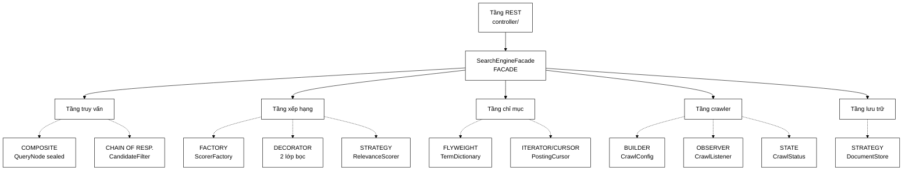

# Design Pattern & OOP trong VnSearch

Thư mục này có **hai loại tài liệu**:

| Loại | File | Dùng khi nào |
|---|---|---|
| **Học OOP** — mỗi pattern một trang | `00`…`11` | Muốn **hiểu** pattern, chuẩn bị bảo vệ |

---

## 📚 Loạt 12 trang học OOP

Bắt đầu từ trang 00 nếu bạn muốn hiểu nền tảng trước.

| # | Trang | Nhóm GoF | Trong dự án | Bài học OOP cốt lõi |
|---|---|---|---|---|
| 00 | [**OOP căn bản**](00-OOP-CO-BAN.md) | — | — | 4 trụ cột, SOLID, vì sao composition thắng kế thừa |
| 01 | [**Strategy**](01-STRATEGY.md) | Behavioral | `RelevanceScorer`, `Tokenizer`, `SearchIndex`, `DocumentStore` | Interface là **điều kiện cần** để làm thí nghiệm ablation |
| 02 | [**Factory**](02-FACTORY.md) | Creational | `ScorerFactory` | Chỉ **một chỗ** được biết tên lớp cụ thể |
| 03 | [**Decorator**](03-DECORATOR.md) | Structural | `PageRankBoostScorer`, `TitleBoostScorer` | Composition thắng kế thừa — chứng minh bằng $S+T$ vs $S \times 2^T$ |
| 04 | [**Composite**](04-COMPOSITE.md) | Structural | `QueryNode` + 5 nút | Nút lá và nút trong **cùng interface** → đệ quy tự nhiên |
| 05 | [**Chain of Responsibility**](05-CHAIN-OF-RESPONSIBILITY.md) | Behavioral | `CandidateFilter` + 2 lọc | Ranh giới với Composite được định nghĩa bằng **nguyên tắc** |
| 06 | [**State**](06-STATE.md) | Behavioral | `CrawlStatus` | Dữ liệu và hành vi trên nó nên ở **cùng một chỗ** |
| 07 | [**Observer**](07-OBSERVER.md) | Behavioral | `CrawlListener` | Đảo ngược chiều phụ thuộc; số liệu **có cấu trúc** ≠ dòng log |
| 08 | [**Builder**](08-BUILDER.md) | Creational | `CrawlConfig` | Đóng gói thật cần **bản sao phòng thủ** |
| 09 | [**Iterator / Cursor**](09-ITERATOR-CURSOR.md) | Behavioral | `PostingCursor` | Trừu tượng đúng chỗ **mở khoá** thuật toán nhanh hơn |
| 10 | [**Flyweight**](10-FLYWEIGHT.md) | Structural | `TermDictionary` | *"Thư viện chuẩn đã có"* chưa phải lý do đủ |
| 11 | [**Bảy mẫu bổ trợ**](11-MAU-BO-TRO.md) | — | Facade, Adapter, Repository, Value Object, Cache-Aside, Producer–Consumer, DI | Facade rất dễ thành God Object |

---

## 🗺️ Bản đồ: mẫu nào nằm ở tầng nào của hệ thống



```
   controller/  ──▶  SearchEngineFacade  ◀── FACADE
                            │
      ┌────────┬────────────┼────────────┬──────────┐
      ▼        ▼            ▼            ▼          ▼
   query/   ranking/     index/      crawler/   storage/
      │        │            │            │          │
  COMPOSITE  FACTORY    FLYWEIGHT     BUILDER   STRATEGY
  CHAIN      DECORATOR  ITERATOR      OBSERVER
             STRATEGY   /CURSOR       STATE
```

---

## 🗺️ Lộ trình đọc

**Nếu bạn mới học design pattern** — theo độ khó tăng dần:

```
00 (nền) → 06 State → 08 Builder → 07 Observer
        → 01 Strategy → 02 Factory → 03 Decorator
        → 04 Composite → 05 Chain
        → 09 Cursor → 10 Flyweight → 11 Bổ trợ
```

**Nếu bạn chuẩn bị bảo vệ và chỉ có một buổi tối** — bốn trang đắt nhất:

[03 Decorator](03-DECORATOR.md) (sửa lỗi thang đo 1000×) · [01 Strategy](01-STRATEGY.md) (lập luận khoa học) · [04 Composite](04-COMPOSITE.md) + [05 Chain](05-CHAIN-OF-RESPONSIBILITY.md) (ranh giới giữa hai mẫu — câu hỏi khó nhất)

**Nếu bạn muốn tra nhanh số liệu** → bảng tổng hợp ngay đầu trang này


---

## 🎯 Mỗi mẫu giải một vấn đề đo được

Đây là điểm mạnh cần nhấn khi bảo vệ: **không mẫu nào được thêm vào cho đẹp.**

| # | Pattern | Vấn đề đo được mà nó giải |
|---|---|---|
| 1 | Strategy | Ablation khoa học: BM25 hơn TF-IDF **5,3 % MRR** |
| 2 | Factory | BM25 tốt hơn nhưng **không ai dùng được** |
| 3 | Decorator | PageRank chỉ đóng góp **0,1 %** dù trọng số 30 % |
| 4 | Composite | Không có OR; `union` là **code chết** |
| 5 | Chain of Responsibility | 3 tầng lọc chôn cứng trong hàm 104 dòng |
| 6 | State | `status` là `String` — gõ sai không bị bắt |
| 7 | Observer | `printf` chôn trong worker, test bị spam |
| 8 | Builder | Sửa được giữa phiên crawl, không kiểm tra hợp lệ |
| 9 | Iterator/Cursor | Autoboxing **64 KB/lần**; 4005 bước → **48 bước** |
| 10 | Flyweight | **7 triệu** `String` cho 136.768 giá trị phân biệt |

---

## 🔍 Tra cứu ngược: muốn học khái niệm OOP nào?

| Khái niệm | Đọc trang nào |
|---|---|
| **Đóng gói** — bản sao phòng thủ | [08 Builder §4](08-BUILDER.md), [00 §2.1](00-OOP-CO-BAN.md) |
| **Trừu tượng hoá** — khi nào đáng tạo interface | [01 Strategy §6](01-STRATEGY.md), [00 §2.2](00-OOP-CO-BAN.md) |
| **Đa hình** — thay cho `if/else` theo kiểu | [01 Strategy](01-STRATEGY.md), [06 State §4](06-STATE.md) |
| **Composition vs Inheritance** | [03 Decorator §4.1](03-DECORATOR.md), [00 §2.4](00-OOP-CO-BAN.md) |
| **SRP** — một lý do để thay đổi | [11 Facade](11-MAU-BO-TRO.md), [00 §3.1](00-OOP-CO-BAN.md) |
| **Open/Closed** | [01 Strategy §4.4](01-STRATEGY.md), [05 Chain](05-CHAIN-OF-RESPONSIBILITY.md) |
| **Liskov** — hợp đồng vượt ngoài kiểu | [01 Strategy §4.3](01-STRATEGY.md), [04 Composite §7](04-COMPOSITE.md) |
| **Interface Segregation** — `default method` | [07 Observer §4.2](07-OBSERVER.md) |
| **Dependency Inversion / DI** | [11 §7](11-MAU-BO-TRO.md), [00 §3.1](00-OOP-CO-BAN.md) |
| **Bất biến & đa luồng** | [08 Builder §5](08-BUILDER.md), [07 Observer §4.3](07-OBSERVER.md) |
| **Fail fast** — ném ngoại lệ có thông điệp | [08 Builder §6](08-BUILDER.md), [02 Factory §4.3](02-FACTORY.md) |
| **Anti-pattern** — nhận diện | [00 §5](00-OOP-CO-BAN.md) |

---

## 🔗 Liên kết ra ngoài

- Mục lục toàn bộ tài liệu toán & thuật toán: [../README.md](../README.md)
- Từ điển ký hiệu toán: [../00-KY-HIEU-TOAN.md](../00-KY-HIEU-TOAN.md)
- Kiến trúc ba tầng: [../../ARCHITECTURE.md](../../ARCHITECTURE.md)
