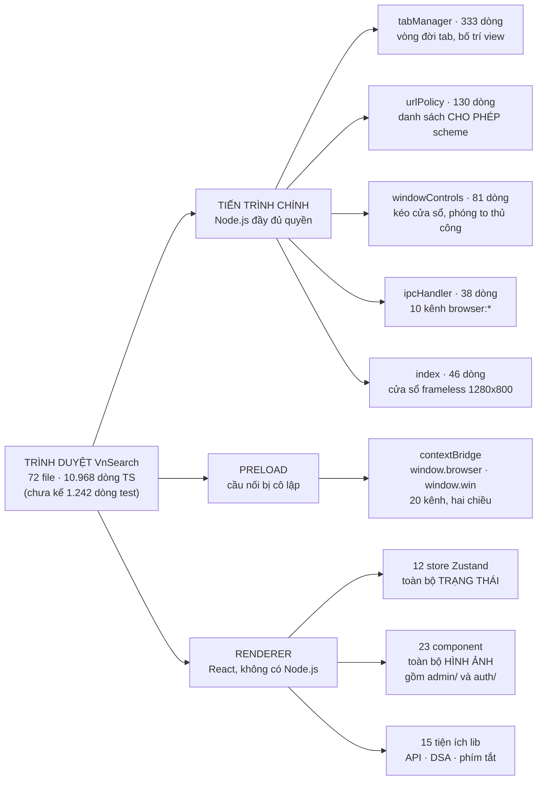
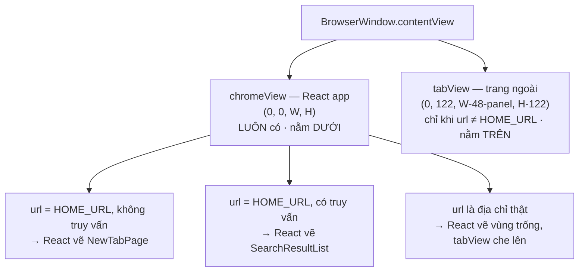
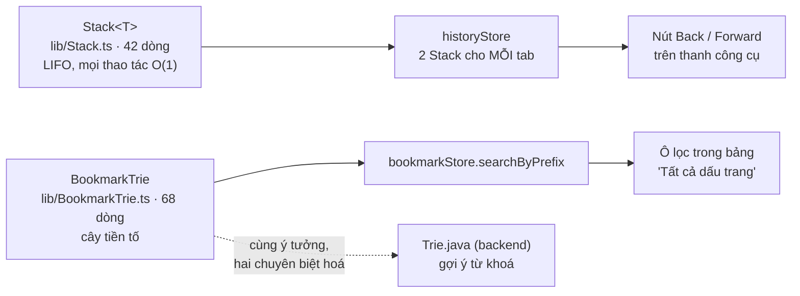
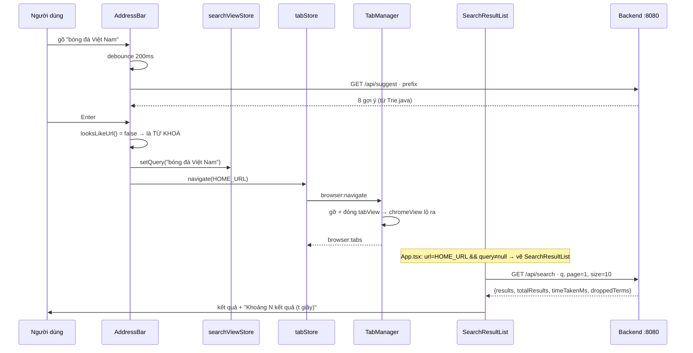
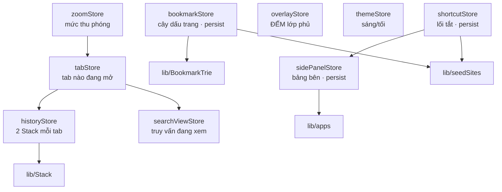

# Sơ đồ tư duy — Toàn tầng frontend (trình duyệt)

**Phạm vi:** 72 file trong `browser-app/src` — tiến trình chính (Electron), cầu nối (preload), và giao diện (React).

**Trang này trả lời:** ba tiến trình nói chuyện với nhau ra sao, **cấu trúc dữ liệu tự cài nằm ở đâu trong trình duyệt**, và một thao tác của người dùng đi qua những lớp nào trước khi thành pixel trên màn hình.

> ### Cách đọc
> - Sơ đồ vẽ bằng **Mermaid**; không hiện hình thì bấm khối *"Xem bản chữ (ASCII)"* ngay dưới.
> - Trang này là **bản đồ**. Muốn hướng dẫn thực hành, đánh giá kiến trúc, và công thức "muốn làm X thì sửa file nào" → đọc [**docs/FRONTEND.md**](../../FRONTEND.md) (tài liệu đầy đủ, 17 mục).
>
> 📖 **Trang đi sâu:** [Stack](Stack.md) · [BookmarkTrie](BookmarkTrie.md) · [Trie (bản Java)](../06-datastructures/Trie.md)

---

## 1. Bản đồ toàn cảnh — ba thế giới trong một cửa sổ



<details>
<summary><b>Xem bản chữ (ASCII)</b></summary>
```
TRÌNH DUYỆT VnSearch (72 file)
│
├── TIẾN TRÌNH CHÍNH (Node.js) ──── tabManager (333) ★ trái tim
│                              ├─── urlPolicy (130)
│                              ├─── windowControls (81)
│                              ├─── ipcHandler (38)
│                              └─── index (46)
│
├── PRELOAD ─────────────────── contextBridge: window.browser + window.win
│                               20 kênh, HỢP ĐỒNG DUY NHẤT giữa hai thế giới
│
└── RENDERER (React) ────────── store/ (12) · TRẠNG THÁI
                            ├── components/ (23) · HÌNH ẢNH, gồm admin/ + auth/
                            └── lib/ (15) · API + DSA tự cài
```

</details>

### Bảng tra nhanh

| # | Nhóm | Số file | Dòng | Vai trò một câu |
|---|---|---:|---:|---|
| 1 | `main/` | 6 | 628 | Sở hữu cửa sổ và mọi `WebContentsView` |
| 2 | `preload/` | 2 | 75 | Nơi *duy nhất* renderer chạm được vào Electron |
| 3 | `store/` | 14 | 1.169 | Nơi *duy nhất* giữ trạng thái — 12 store |
| 4 | `components/` | 23 | 7.173 | Nơi *duy nhất* vẽ ra pixel |
| 5 | `lib/` | 24 | 1.831 | Hàm thuần: gọi API, cấu trúc dữ liệu, phím tắt — 15 tiện ích |

---

## 2. Ý tưởng trung tâm — vỏ nằm dưới, trang nằm trên

Toàn bộ độ phức tạp của `tabManager.ts` sinh ra từ **một** quyết định: vỏ trình duyệt và trang web là **hai `WebContentsView` chồng lên nhau**, chứ không phải một.



<details>
<summary><b>Xem bản chữ (ASCII)</b></summary>
```
   ┌──────────────────────────────────────────────────┐
   │ TabBar 40px │ Toolbar 48px │ BookmarksBar 34px   │  ← chromeView, luôn thấy
   ├──────────────────────────────────────────────────┤     tổng = CHROME_HEIGHT = 122
   │ ╔════════════════════════════════╗ ░░░░ │ ▓▓▓▓  │
   │ ║  tabView (trang ngoài)         ║ Side │ Rail  │  ← tabView CHỒNG LÊN
   │ ║  y = 122                       ║ Panel│ 48px  │     chromeView
   │ ╚════════════════════════════════╝ 340px│       │
   └──────────────────────────────────────────────────┘
```

</details>

**Bốn hệ quả — bốn cơ chế trong mã:**

| # | Hệ quả | Cơ chế | File |
|---|---|---|---|
| 1 | Vỏ phải chừa đúng 122px | Hằng `CHROME_HEIGHT` chép ở hai nơi | `tabManager.ts:6` ↔ `App.tsx` |
| 2 | Bảng bên **neo**, không **phủ** | `setPanelWidth` → trang co lại | `App.tsx:44` → `tabManager.ts:235` |
| 3 | Menu đổ dài bị trang che | `setOverlay` → **gỡ tạm** trang khỏi cây view | `overlayStore` → `tabManager.ts:240` |
| 4 | Phím tắt chết khi ở trang ngoài | `before-input-event` chuyển tiếp về vỏ | `tabManager.ts:314` |

> Giải thích đầy đủ từng hệ quả: [FRONTEND.md §5](../../FRONTEND.md#5-ý-tưởng-trung-tâm--vỏ-nằm-dưới-trang-nằm-trên).

---

## 3. Cấu trúc dữ liệu tự cài nằm ở đâu

Trình duyệt không chỉ là giao diện — nó là chỗ **hai cấu trúc dữ liệu kinh điển** xuất hiện một cách tự nhiên, không hề gượng ép.



<details>
<summary><b>Xem bản chữ (ASCII)</b></summary>
```
Stack<T> (lib/Stack.ts)
   └─► historyStore: backStack + forwardStack cho MỖI tab
          └─► nút Back / Forward

BookmarkTrie (lib/BookmarkTrie.ts)
   └─► bookmarkStore.searchByPrefix()
          └─► ô lọc trong bảng "Tất cả dấu trang"
   ┈┈► so sánh với Trie.java (backend) — cùng ý tưởng, khác chuyên biệt hoá
```

</details>

| Cấu trúc | Dòng | Bên trong | Dùng ở đâu | Độ phức tạp |
|---|---:|---|---|---|
| [`Stack<T>`](Stack.md) | 42 | Mảng JS (như `ArrayList`) | Back/forward, mỗi tab một cặp | `push`/`pop`/`peek` đều $O(1)$ |
| [`BookmarkTrie`](BookmarkTrie.md) | 68 | `Map<ký tự, node>` | Lọc dấu trang theo tiền tố | `insert` $O(L)$, `searchByPrefix` $O(L+m)$ |

**Vì sao đáng để tự cài, thay vì gọi thẳng `array.push` / `Array.filter`:**

- **`Stack`** — mảng JS cho phép `arr[5] = x`, `arr.splice()`, `arr.shift()`, tức là mọi thao tác **phá vỡ ngữ nghĩa LIFO**. Lớp bao chỉ phơi ra 6 phương thức hợp lệ → TypeScript **ngăn dùng sai ngay lúc viết**. Nút Back/Forward là chỗ mà một thao tác sai làm lịch sử "loạn" theo cách người dùng cảm nhận được ngay.
- **`BookmarkTrie`** — bản TypeScript **song song** với `Trie.java` bên backend. Cùng ý tưởng (`children` là `Map<ký tự, node>`, cờ `isEndOfWord`), khác chuyên biệt hoá: bản Java mỗi nút giữ **một** từ khoá, bản TS mỗi nút giữ **danh sách** `bookmarkId` — vì nhiều dấu trang khác nhau có thể chung một từ trong tiêu đề. Hai bản đặt cạnh nhau là một so sánh cài đặt đắt giá cho báo cáo.

---

## 4. Vòng đời một truy vấn — từ phím gõ tới pixel



**Cửa quyết định** nằm ở một hàm 7 dòng — `looksLikeUrl()` (`AddressBar.tsx:10`):

| Gõ vào | Phán định | Đi đường nào |
|---|---|---|
| `https://vnexpress.net` | URL (có scheme) | Điều hướng thật → tạo `tabView` |
| `vnexpress.net` | URL (không khoảng trắng + có TLD) | Thêm `https://` → điều hướng |
| `bóng đá Việt Nam` | Từ khoá (có khoảng trắng) | `setQuery` → `SearchResultList` |
| `site:vnexpress.net kinh tế` | Từ khoá | `setQuery` → backend hiểu `site:` |

---

## 5. Bản đồ trạng thái — 12 store, phụ thuộc một chiều



<details>
<summary><b>Xem bản chữ (ASCII)</b></summary>
```
tabStore ──► historyStore ──► lib/Stack
    └──────► searchViewStore
zoomStore ──► tabStore
shortcutStore ──► sidePanelStore (mượn normalizeUrl)
bookmarkStore ──► lib/BookmarkTrie + lib/seedSites
sidePanelStore ─► lib/apps

overlayStore, themeStore: độc lập hoàn toàn
→ Đồ thị KHÔNG có chu trình.
```

</details>

**Một chi tiết đáng nhớ: `overlayStore` dùng SỐ ĐẾM, không dùng cờ đúng/sai.**

Vì lớp phủ có thể mở chồng nhau (menu chính mở panel con), nếu dùng cờ thì đóng cái trong cùng sẽ làm trang ngoài lộ ra trong khi cái ngoài vẫn đang mở:
```
mở popover ngoài  acquire  0→1  → gỡ trang xuống
mở panel con      acquire  1→2  → (không đổi)
đóng panel con    release  2→1  → (không đổi)   ← dùng cờ thì TRANG LỘ RA ở đây
đóng popover      release  1→0  → gắn trang lại
```

---

## 6. Xoá file này thì hỏng gì

| File | Xoá đi thì… |
|---|---|
| `main/tabManager.ts` | Không còn gì cả — không có tab, không có trang, cửa sổ trắng trơn |
| `main/windowControls.ts` | Cửa sổ frameless không kéo được, không thu/phóng/đóng được. Phải tắt bằng Task Manager |
| `preload/index.ts` | Renderer mất **toàn bộ** khả năng nói chuyện với Electron. Vỏ hiện ra nhưng bấm gì cũng không có phản ứng |
| `store/tabStore.ts` | Thanh tab trống, ô địa chỉ không biết đang ở đâu, mọi điều hướng chết |
| `store/historyStore.ts` | Nút Back/Forward luôn mờ. Trang vẫn duyệt được bình thường |
| `store/overlayStore.ts` | Menu và popover bị trang web che mất khi đang xem trang ngoài |
| `store/searchViewStore.ts` | Gõ từ khoá vào ô địa chỉ không ra trang kết quả — chỉ URL mới dùng được |
| `lib/Stack.ts` | `historyStore` không biên dịch → hỏng dây chuyền cả ứng dụng |
| `lib/BookmarkTrie.ts` | Ô lọc trong bảng "Tất cả dấu trang" chết; phần còn lại vẫn chạy |
| `lib/searchApi.ts` | Không tìm kiếm được, không gợi ý được, khu "Tin nóng" trống. Trình duyệt vẫn duyệt web bình thường |
| `lib/site.ts` | Mọi favicon giả biến mất → tab, kết quả, dấu trang mất dấu hiệu nhận dạng nguồn |
| `components/SideRail.tsx` | Mất cột phải, nhưng main **vẫn** trừ 48px khỏi bề ngang trang → chừa một dải trống bí ẩn |
| `index.css` | Mất toàn bộ biến màu → chữ đen trên nền đen ở chế độ tối |

---

## 7. Đi tiếp

| Muốn gì | Đọc |
|---|---|
| Hướng dẫn thực hành, 12 công thức "muốn làm X thì sửa file nào" | [FRONTEND.md §13](../../FRONTEND.md#13-hướng-dẫn-thực-hành--12-công-thức) |
| Đánh giá kiến trúc theo chuẩn doanh nghiệp, có bảng điểm | [FRONTEND.md §15](../../FRONTEND.md#15-đánh-giá-kiến-trúc-theo-chuẩn-doanh-nghiệp) |
| Hợp đồng IPC đầy đủ 16 kênh | [FRONTEND.md §7](../../FRONTEND.md#7-hợp-đồng-ipc--16-kênh) |
| Phân tích sâu hai ngăn xếp back/forward | [Stack.md](Stack.md) |
| So sánh Trie bản Java và bản TypeScript | [BookmarkTrie.md](BookmarkTrie.md) |
| Backend nói chuyện với frontend qua đâu | [api-examples.http](../../api-examples.http) |
