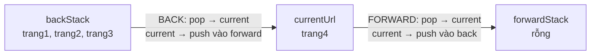

# Stack — hai ngăn xếp và bất biến của nút Back/Forward

**File nguồn:** `browser-app/src/renderer/src/lib/Stack.ts` và `store/historyStore.ts`
**Việc nó làm:** Điều hướng back/forward của trình duyệt, mỗi thao tác $O(1)$.

> 📖 Chưa quen ký hiệu toán? Đọc [00 — Từ điển ký hiệu toán](../00-KY-HIEU-TOAN.md) trước.

---

## 📌 Hiểu trong 30 giây

Nút Back/Forward của trình duyệt là **ví dụ giáo khoa hoàn hảo** của ngăn xếp (LIFO — vào sau ra trước).

Nhưng một ngăn xếp không đủ. Cần **hai**, và chúng phải tuân theo một bất biến chặt chẽ mà nếu vi phạm thì lịch sử điều hướng "loạn" theo cách người dùng cảm nhận được ngay.

```
backStack:  [trang1, trang2, trang3]     currentUrl: trang4     forwardStack: []
                                    ↑ đỉnh
```



**Ba thao tác, ba tác động khác nhau lên hai ngăn xếp** — bảng này là toàn bộ
bất biến:

| Thao tác | backStack | currentUrl | forwardStack |
|---|---|---|---|
| **Đi tới URL mới** | push current | ← URL mới | **XOÁ SẠCH** |
| **Back** | pop → current | ← giá trị pop | push current cũ |
| **Forward** | push current cũ | ← giá trị pop | pop |

```
   TRẠNG THÁI ĐẦU
   back: [1, 2, 3]   current: 4   forward: []

   ── Back ──▶
   back: [1, 2]      current: 3   forward: [4]

   ── Back ──▶
   back: [1]         current: 2   forward: [4, 3]

   ── Đi tới trang 9 (URL MỚI) ──▶
   back: [1, 2]      current: 9   forward: []        ◀── forward BỊ XOÁ
                                            ▲
                     đây là hàng dễ quên nhất, và cũng là hàng
                     mà người dùng nhận ra ngay nếu làm sai:
                     "sao bấm Forward lại về một trang lạ hoắc?"
```

**Vì sao đi tới URL mới phải xoá `forwardStack`.** Lịch sử là một **đường
thẳng**, không phải cây. Khi người dùng lùi lại rồi rẽ sang nhánh khác, nhánh
cũ **không còn tồn tại** trên đường đi hiện tại — giữ nó lại là để dành một
đường tiến tới nơi mà người dùng chưa từng đi.

- **Back**: pop `backStack`, đẩy `currentUrl` sang `forwardStack`.
- **Forward**: đối xứng.
- **Đi tới trang mới**: push `currentUrl` vào `backStack`, và **xoá sạch** `forwardStack`.

Quy tắc thứ ba là chỗ tinh tế nhất — §3.

---

## 1. Lớp `Stack<T>` — đóng gói tối thiểu

```ts
export class Stack<T> {
  private items: T[] = []

  push(item: T): void        { this.items.push(item) }
  pop(): T | undefined       { return this.items.pop() }
  peek(): T | undefined      { return this.items[this.items.length - 1] }
  isEmpty(): boolean         { return this.items.length === 0 }
  size(): number             { return this.items.length }
  clear(): void              { this.items = [] }

  /** Chi dung de hien thi debug/demo — khong lam thay doi stack. */
  toArray(): T[]             { return [...this.items] }
}
```

Bên trong dùng mảng JS làm bộ nhớ liên tục — giống `ArrayList` trong Java.

**Vì sao vẫn viết một lớp bao quanh khi mảng JS đã có `push`/`pop`.** Comment nói rõ:

> *"noi goi (historyStore) KHONG duoc goi truc tiep array.push/pop, ma phai qua cac method cua class nay, de dung dan the hien tinh dong goi cua cau truc Stack."*

**Hai lợi ích thật, không chỉ là hình thức:**

1. **Chặn thao tác không hợp lệ.** Mảng JS cho phép `arr[5] = x`, `arr.splice(2, 1)`, `arr.shift()` — những thao tác **phá vỡ ngữ nghĩa LIFO**. Lớp bao chỉ phơi 6 phương thức hợp lệ, nên trình biên dịch TypeScript **ngăn** mọi cách dùng sai ngay lúc viết code.

2. **`toArray()` trả về BẢN SAO.**
   ```ts
   toArray(): T[] { return [...this.items] }
   ```
   Toán tử `...` tạo mảng mới. Nếu trả thẳng `this.items`, người gọi có thể sửa mảng nội bộ từ bên ngoài — phá vỡ đóng gói hoàn toàn. Chi tiết một dòng nhưng đúng.

**Đây là một Adapter pattern nhỏ:** biến giao diện rộng của mảng thành giao diện hẹp của ngăn xếp. "Hẹp" ở đây là **tính năng**, không phải hạn chế.

---

## 2. Cấu trúc trạng thái mỗi tab

```ts
interface TabHistory {
  backStack: Stack<string>
  forwardStack: Stack<string>
  currentUrl: string
  /** Danh dau lan cap nhat URL tiep theo la do chinh goBack/goForward gay ra,
   *  de recordNavigation khong push lai vao stack mot cach sai lech. */
  suppressNextRecord: boolean
}
```

**Mỗi tab có lịch sử riêng** — `Record<string, TabHistory>` khoá theo `tabId`. Đúng với hành vi trình duyệt thật: đóng một tab không ảnh hưởng lịch sử tab khác.

**Ba thành phần đầu là mô hình chuẩn.** Thành phần thứ tư (`suppressNextRecord`) là để giải một vấn đề rất thực tế — §4.

---

## 3. Bất biến trung tâm và ba thao tác

> **Bất biến:** *Đọc `backStack` từ đáy lên đỉnh, rồi `currentUrl`, rồi `forwardStack` từ đỉnh xuống đáy — ta được đúng đường đi tuyến tính mà người dùng đã trải qua.*

$$\underbrace{[u_1, u_2, \dots, u_k]}_{\text{backStack (đáy}\to\text{đỉnh)}} \;\to\; \underbrace{u_{k+1}}_{\text{current}} \;\to\; \underbrace{[u_{k+2}, \dots, u_n]}_{\text{forwardStack (đỉnh}\to\text{đáy)}}$$

`currentUrl` là **con trỏ** trượt trên dãy này; hai ngăn xếp là hai nửa hai bên con trỏ.

### 3.1 `goBack` — con trỏ lùi một bước

```
Trước:  back=[A, B]  current=C  forward=[]
                  ↑ đỉnh

  1. pop B khỏi backStack
  2. push C vào forwardStack
  3. currentUrl = B

Sau:    back=[A]     current=B  forward=[C]
```

```ts
goBack: (tabId) => {
  const h = get().histories[tabId]
  if (!h || h.backStack.isEmpty()) return undefined
  const target = h.backStack.pop()!
  h.forwardStack.push(h.currentUrl)
  h.currentUrl = target
  h.suppressNextRecord = true      // ← xem §4
  return target
}
```

Ba thao tác, **tất cả $O(1)$**.

### 3.2 `goForward` — đối xứng hoàn toàn

```
Trước:  back=[A]     current=B  forward=[C]
Sau:    back=[A, B]  current=C  forward=[]
```

### 3.3 `recordNavigation` — và vì sao phải XOÁ forwardStack

```
Trước:  back=[A]  current=B  forward=[C]
Đi tới trang D mới:

  1. push B vào backStack
  2. CLEAR forwardStack          ← quan trọng nhất
  3. currentUrl = D

Sau:    back=[A, B]  current=D  forward=[]
```

**Vì sao phải xoá `forwardStack`.**

Người dùng đang ở B (đã back từ C). Giờ họ đi tới D. Đường đi thật của họ là:

$$A \to B \to D$$

Trang C **không còn nằm trên đường đi này**. Bấm Forward từ D mà nhảy sang C là **vô nghĩa** — C không phải "trang tiếp theo" của D theo bất kỳ nghĩa nào.

Đây chính là hành vi của **mọi** trình duyệt thật: đi tới một trang mới thì lịch sử forward biến mất. Bất biến §3 giải thích tại sao: `forwardStack` biểu diễn *"phần đường đi phía trước con trỏ"*, mà đi tới trang mới nghĩa là **rẽ sang một nhánh khác** — phần đường cũ không còn tồn tại.

**Nếu không xoá:** cấu trúc không còn là một đường thẳng mà thành một **cây** — và hai ngăn xếp không đủ để biểu diễn cây. Người dùng sẽ thấy nút Forward đưa họ tới trang hoàn toàn không liên quan.

---

## 4. `suppressNextRecord` — giải bài toán phản hồi vòng

Đây là phần khó nhất và cũng là phần thực tế nhất.

**Vấn đề.** Kiến trúc Electron có một vòng phản hồi:

```
Người dùng bấm Back
    ↓
historyStore.goBack()  → cập nhật stack, trả về URL đích
    ↓
gửi lệnh điều hướng qua IPC tới WebContents
    ↓
Trang thật sự chuyển
    ↓
WebContents phát sự kiện "did-navigate"
    ↓
recordNavigation(url mới)  ← ĐÂY! Nó tưởng đây là điều hướng MỚI
    ↓
push B vào backStack, clear forwardStack   ← SAI HOÀN TOÀN
```

`recordNavigation` **không phân biệt được** hai loại điều hướng:

| Loại | Phải làm gì |
|---|---|
| Người dùng gõ URL / bấm link | push + clear forward |
| Kết quả của chính `goBack`/`goForward` | **không làm gì với stack** |

Nếu không phân biệt, bấm Back một lần sẽ vừa lùi con trỏ vừa push lại — stack "loạn" và forward biến mất ngay sau khi vừa được tạo.

**Lời giải: một cờ một lần dùng.**

```ts
goBack: (tabId) => {
  ...
  h.suppressNextRecord = true       // ① đặt cờ trước khi phát lệnh điều hướng
  return target
}

recordNavigation: (tabId, newUrl) => {
  const h = get().histories[tabId]
  if (!h || newUrl === h.currentUrl) return
  if (h.suppressNextRecord) {
    // URL nay la ket qua cua goBack/goForward do chinh ta goi -> chi cap
    // nhat currentUrl, KHONG push them vao backStack
    h.suppressNextRecord = false    // ② tiêu thụ cờ NGAY
    h.currentUrl = newUrl
    return
  }
  // ③ điều hướng thật sự mới
  h.backStack.push(h.currentUrl)
  h.forwardStack.clear()
  h.currentUrl = newUrl
}
```

**Cờ được tiêu thụ ngay** (đặt lại `false` ở dòng đầu của nhánh) — đây là mấu chốt. Nếu không tiêu thụ, điều hướng **thật sự** tiếp theo cũng bị bỏ qua.

**Bảo vệ thứ hai:**

```ts
if (!h || newUrl === h.currentUrl) return
```

Nếu URL không đổi thì không phải điều hướng — chặn được cả trường hợp trang tự làm mới hay sự kiện phát trùng.

**Đây là mẫu thiết kế "cờ một lần dùng" (one-shot flag)**, xuất hiện ở mọi hệ thống có vòng phản hồi giữa mô hình và khung nhìn:

| Ngữ cảnh | Vấn đề tương tự |
|---|---|
| Ô nhập liệu có điều khiển | `setState` → render → sự kiện `onChange` → `setState`… |
| Đồng bộ hai chiều | A đổi → đẩy sang B → B phát sự kiện → đẩy lại A… |
| Trình duyệt | như trên |

Cách sửa luôn là: **đánh dấu nguồn gốc của thay đổi để phân biệt "do ta gây ra" với "do bên ngoài"**.

---

## 5. Vì sao không dùng lịch sử native của Electron

Comment nói rõ:

> *"Day KHONG dung lai lich su native cua Electron WebContents (`wc.goBack()`/`wc.canGoBack()`) — no la mot cau truc Stack doc lap, tu quan ly hoan toan o phia renderer, dung de minh hoa DSA cho bao cao."*

**Đánh giá thẳng thắn:**

| Tiêu chí | Native `wc.goBack()` | **Stack tự cài** |
|---|---|---|
| Số dòng code | ~5 | ~130 |
| Xử lý chuyển hướng, iframe, `history.pushState` | **đúng hoàn toàn** | **không xử lý** |
| Giá trị cho đồ án DSA | 0 | **cao** |
| Rủi ro lệch với trạng thái thật | không có | **có** |

Với **đồ án môn DSA**, lựa chọn này đúng: mục tiêu là chứng minh hiểu ngăn xếp và các bất biến của nó.

Với **đồ án tốt nghiệp** hoặc sản phẩm thật, đây là điểm cần cân nhắc lại — hoặc chuyển sang native, hoặc **giữ cả hai và đồng bộ**, hoặc ít nhất **nói rõ trong báo cáo** rằng đây là lựa chọn sư phạm có ý thức chứ không phải vì không biết có sẵn.

---

## 6. Độ phức tạp

| Thao tác | Thời gian | Ghi chú |
|---|---|---|
| `push`, `pop`, `peek` | **$O(1)$** | khấu hao — mảng JS nhân đôi khi đầy |
| `isEmpty`, `size` | $O(1)$ | |
| `clear` | $O(1)$ | gán mảng mới, GC lo phần còn lại |
| `toArray` | $O(n)$ | tạo bản sao |
| `goBack`, `goForward` | **$O(1)$** | 3 thao tác stack |
| `recordNavigation` | **$O(1)$** | push + clear |
| Bộ nhớ | $O(\text{độ sâu lịch sử})$ | mỗi tab riêng |

**`clear()` là $O(1)$ nhờ GC** — cùng kỹ thuật với [Trie §3](../06-datastructures/Trie.md): bỏ tham chiếu thay vì duyệt xoá.

> **Một hạn chế về bộ nhớ:** không có chặn trên độ sâu lịch sử. Người dùng duyệt 10.000 trang trong một tab thì `backStack` giữ 10.000 chuỗi URL. Trình duyệt thật giới hạn (Chrome: 50 mục/tab). Thêm chặn trên là một dòng trong `push`.

---

## 7. Chủ đề DSA thể hiện

| Chủ đề | Ở đâu |
|---|---|
| **Ngăn xếp (LIFO)** | `Stack<T>` |
| **Hai ngăn xếp mô hình hoá con trỏ trên dãy** | back/forward quanh `currentUrl` |
| **Bất biến cấu trúc** | đọc back + current + forward = đường đi tuyến tính |
| **Xoá nhánh khi rẽ hướng** | `forwardStack.clear()` |
| **Đóng gói** | lớp bao chặn thao tác phá ngữ nghĩa |
| **Trả bản sao phòng thủ** | `toArray()` dùng spread |
| **Cờ một lần dùng** | `suppressNextRecord` cắt vòng phản hồi |
| **Mảng động khấu hao** | `push` là $O(1)$ khấu hao |
| **`clear` $O(1)$ nhờ GC** | gán mảng mới |
| **Generic** | `Stack<T>` dùng được cho mọi kiểu |

---

## 8. Hạn chế đã biết

1. **Không giới hạn độ sâu** (§6).
2. **Không xử lý `history.pushState`.** SPA đổi URL mà không tải lại trang; Electron có thể không phát `did-navigate`, khiến stack lệch với thực tế.
3. **Không xử lý chuyển hướng.** Một URL chuyển hướng sang URL khác có thể tạo hai mục trong stack thay vì một.
4. **Không lưu bền vững.** Đóng ứng dụng là mất lịch sử.
5. **`suppressNextRecord` là cờ một lần dùng, không có timeout.** Nếu vì lý do nào đó điều hướng không xảy ra (mạng lỗi, người dùng bấm Stop), cờ vẫn còn `true` và **nuốt** điều hướng hợp lệ tiếp theo. Trình duyệt thật gắn cờ vào **định danh của lần điều hướng** thay vì một biến boolean toàn cục.
6. **Không có `canGoBack`/`canGoForward` phản ứng theo trạng thái Zustand.** Hai hàm đó tồn tại nhưng đọc trực tiếp từ đối tượng `Stack` bên trong `histories` — mà `Stack` không phải state của Zustand, nên **thay đổi của nó không kích hoạt re-render**. Nút Back/Forward có thể hiển thị trạng thái bật/tắt sai. Đây là một lỗi tinh vi của việc trộn cấu trúc dữ liệu tự quản với state phản ứng.

---

## 9. Liên kết

- Cấu trúc song song ở frontend: [BookmarkTrie.md](BookmarkTrie.md)
- Bản Java của cùng ý tưởng đóng gói: [MinHeap.md](../06-datastructures/MinHeap.md)
- `clear()` $O(1)$ nhờ GC: [Trie §3](../06-datastructures/Trie.md)
- Ký hiệu chưa hiểu: [00 — Từ điển ký hiệu toán](../00-KY-HIEU-TOAN.md)
