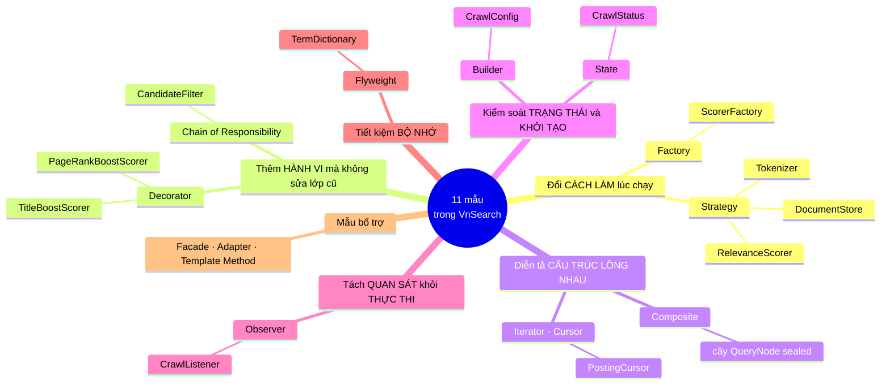

# 00 — OOP căn bản, đọc qua lăng kính VnSearch

> Trang này là **nền** cho 10 trang design pattern phía sau. Nếu bạn đã vững bốn trụ cột OOP và SOLID, có thể nhảy thẳng sang [01-STRATEGY.md](01-STRATEGY.md).

---

## 0. Bản đồ: 11 mẫu, mỗi mẫu chữa một loại đau khác nhau



```
                       11 mẫu — nhóm theo LOẠI THAY ĐỔI mà nó làm rẻ đi
   ┌──────────────────┬──────────────────┬──────────────────┬─────────────────┐
   │ Đổi CÁCH LÀM     │ Thêm HÀNH VI     │ Cấu trúc LỒNG    │ Trạng thái &    │
   │ lúc chạy         │ không sửa lớp cũ │ nhau             │ khởi tạo        │
   ├──────────────────┼──────────────────┼──────────────────┼─────────────────┤
   │ Strategy         │ Decorator        │ Composite        │ State           │
   │ Factory          │ Chain of Resp.   │ Iterator/Cursor  │ Builder         │
   └──────────────────┴──────────────────┴──────────────────┴─────────────────┘
   ┌──────────────────┬──────────────────┐
   │ Tách quan sát    │ Tiết kiệm RAM    │
   │ Observer         │ Flyweight        │
   └──────────────────┴──────────────────┘
```

---

## 1. Vì sao design pattern lại là chuyện của OOP

Một design pattern **không phải là một tính năng**. Nó là một **cách sắp xếp lớp và interface** để một loại thay đổi cụ thể trở nên rẻ.

Câu hỏi trung tâm của OOP không phải *"làm sao chạy được?"* mà là:

> **Khi yêu cầu thay đổi, tôi phải sửa bao nhiêu chỗ, và trình biên dịch có nhắc tôi sửa hết không?**

Mọi pattern trong dự án này đều trả lời đúng câu đó. Ví dụ cụ thể trong VnSearch:

| Thay đổi giả định | Trước tái cấu trúc | Sau |
|---|---|---|
| Đổi mô hình xếp hạng TF-IDF → BM25 | Sửa mã nguồn + biên dịch lại | Sửa **1 dòng** `application.properties` |
| Thêm nguồn dữ liệu thứ 5 (S3) | Thêm một nhánh `else if` trong `init()` | Thêm **1 lớp**, không sửa `init()` |
| Thêm bộ lọc kết quả theo ngày | Sửa thân hàm 104 dòng | Thêm **1 lớp + 1 dòng** vào danh sách |
| Thêm toán tử truy vấn `NEAR` | Không có chỗ để thêm | Thêm **1 record** implements `QueryNode` |

---

## 2. Bốn trụ cột — và chỗ chúng xuất hiện trong dự án

### 2.1 Đóng gói (Encapsulation)

**Ý tưởng:** trạng thái bên trong không lộ ra ngoài; người dùng lớp chỉ thấy hành vi.

Đóng gói **không phải** là "đặt `private` rồi sinh getter/setter cho mọi trường". Đó là anti-pattern. Đóng gói thật là **không cho phép người ngoài đặt object vào trạng thái sai**.

Ba mức độ, tăng dần, đều có trong VnSearch:

```java
// Mức 1 — private field. Cần, nhưng chưa đủ.
private final Map<String, String> pool;

// Mức 2 — không rò rỉ tham chiếu nội bộ ra ngoài.
public Map<Integer, WebDocument> getAllDocuments() {
    return Collections.unmodifiableMap(documents);   // InvertedIndex
}

// Mức 3 — object TỰ ÉP bất biến của mình, ném ngoại lệ ngay tại chỗ sai.
public void addDocument(WebDocument doc) {
    if (doc.getDocId() <= lastDocId) {
        throw new IllegalArgumentException("docId phải tăng dần...");
    }
    ...
}
```

Mức 3 là mức đáng nói trong báo cáo: bất biến *"posting list sắp xếp theo docId"* trước đây phụ thuộc vào việc **người gọi nhớ sort trước**. Quên một chỗ thì hệ thống trả kết quả sai **một cách im lặng**. Nay lớp tự bảo vệ mình.

> Xem thêm: [08-BUILDER.md](08-BUILDER.md) — `CrawlConfig` từ trường `public` sửa được giữa phiên crawl thành object bất biến hoàn toàn.

### 2.2 Trừu tượng hoá (Abstraction)

**Ý tưởng:** tách *cái gì* khỏi *làm thế nào*.

Dấu hiệu bạn đã trừu tượng hoá đúng: **xoá được cài đặt cụ thể và viết cài đặt khác mà không lớp nào phía trên phải sửa.**

VnSearch có **8 interface tự định nghĩa**:

| Interface | Tách *cái gì* khỏi *làm thế nào* |
|---|---|
| `RelevanceScorer` | "chấm điểm liên quan" ↔ TF-IDF hay BM25 |
| `Tokenizer` | "tách từ" ↔ quy hoạch động cực đại trọng số |
| `SearchIndex` | "tra posting list" ↔ trong RAM hay trên đĩa |
| `DocumentStore` | "nạp corpus" ↔ JSON hay PostgreSQL |
| `CandidateFilter` | "thu hẹp ứng viên" ↔ theo domain hay theo số lượng |
| `QueryNode` | "đánh giá một mệnh đề" ↔ term, AND, OR, NOT |
| `PostingCursor` | "duyệt posting list" ↔ mảng hay dữ liệu nén |
| `CrawlListener` | "phản ứng với sự kiện crawl" ↔ in log hay đẩy WebSocket |

**Cách kiểm tra một interface có đáng tồn tại không:** nếu chỉ có **một** cài đặt và bạn không hình dung nổi cài đặt thứ hai, interface đó có thể là over-engineering. Trong VnSearch, mỗi interface trên đều có ít nhất hai cài đặt thật hoặc một lý do đo đạc rõ ràng (xem [01-STRATEGY.md](01-STRATEGY.md) §Ablation).

### 2.3 Đa hình (Polymorphism)

**Ý tưởng:** cùng một lời gọi, hành vi khác nhau tuỳ object thật là gì.

```java
RelevanceScorer scorer = scorerFactory.create(pageRankScores);
double s = scorer.score(qtf, docId, index);
// Dòng trên KHÔNG biết nó đang gọi TF-IDF, BM25,
// hay một chuỗi Decorator ba tầng. Và nó không cần biết.
```

**Đa hình là thứ thay thế cho `if/else` phân nhánh theo kiểu.** Đây là bài kiểm tra nhanh nhất về chất lượng OOP của một codebase:

```java
// ❌ Không phải OOP — đây là lập trình thủ tục viết bằng cú pháp Java
if (type.equals("tfidf")) { ... }
else if (type.equals("bm25")) { ... }

// ✅ OOP — quyết định xảy ra MỘT lần ở Factory, sau đó là đa hình
RelevanceScorer scorer = factory.createBase();
```

Lưu ý quan trọng: `switch` trong `ScorerFactory` **không** vi phạm nguyên tắc này. Ở đâu đó phải có **đúng một chỗ** ánh xạ chuỗi cấu hình sang kiểu cụ thể — Factory chính là chỗ được chỉ định để chứa nó. Cái sai là rải `switch` đó ra khắp nơi.

### 2.4 Kế thừa (Inheritance) — và vì sao dự án này gần như không dùng

Đây là điểm hay đưa vào báo cáo, vì nó đi ngược trực giác của người mới học.

**Kế thừa là quan hệ ràng buộc chặt nhất trong OOP.** Lớp con phụ thuộc vào chi tiết cài đặt của lớp cha, và một thay đổi trong cha lan xuống mọi con. Nguyên tắc ngành:

> **Composition over Inheritance** — ưu tiên *chứa* hơn là *kế thừa*.

VnSearch **không có cây kế thừa nào sâu quá một cấp**. Thay vào đó dùng:

- **Interface + cài đặt** (`RelevanceScorer` → `BM25Scorer`) — chỉ chia sẻ *hợp đồng*, không chia sẻ cài đặt.
- **Composition** (`PageRankBoostScorer` **chứa** một `RelevanceScorer`) — xem [03-DECORATOR.md](03-DECORATOR.md).

Đối chiếu trực tiếp: nếu làm PageRank bằng kế thừa, ta cần `TfIdfWithPageRank`, `BM25WithPageRank`, `TfIdfWithPageRankAndTitle`, `BM25WithPageRankAndTitle`… — **bùng nổ tổ hợp** $2 \times 2^2 = 8$ lớp cho 2 scorer × 2 tín hiệu. Với Decorator: **4 lớp**, ghép được mọi tổ hợp lúc chạy.

Ngoại lệ duy nhất trong dự án là `enum CrawlStatus` với phương thức trừu tượng cài đè ở từng hằng — đó là kế thừa, nhưng là dạng **bị đóng kín** (không ai thêm hằng từ bên ngoài được), nên an toàn. Xem [06-STATE.md](06-STATE.md).

---

## 3. SOLID — năm nguyên tắc, đọc bằng ví dụ trong dự án

| Chữ | Tên | Nghĩa một câu | Ví dụ trong VnSearch |
|---|---|---|---|
| **S** | Single Responsibility | Một lớp chỉ có **một lý do để thay đổi** | `SearchEngineFacade` từ 7 trách nhiệm → chỉ điều phối |
| **O** | Open/Closed | **Mở** để mở rộng, **đóng** để sửa đổi | Thêm `CandidateFilter` không sửa `resolve()` |
| **L** | Liskov Substitution | Lớp con phải **thay thế được** lớp cha mà không phá hợp đồng | Mọi `SearchIndex` phải giữ bất biến "sắp xếp theo docId" |
| **I** | Interface Segregation | Interface **nhỏ**, đừng ép cài đặt viết hàm nó không cần | `CrawlListener` có 3 phương thức, đều `default` rỗng |
| **D** | Dependency Inversion | Phụ thuộc vào **trừu tượng**, không vào cụ thể | `TfIdfScorer` nhận `SearchIndex`, không nhận `InvertedIndex` |

### 3.1 Ba chữ đáng nói kỹ

**S — Single Responsibility.** Cách kiểm tra thực dụng: *"Mô tả lớp này bằng một câu, không dùng chữ **và**."* Nếu buộc phải dùng "và", lớp đang gánh nhiều việc.

- ❌ Trước: *"Facade nạp dữ liệu **và** dựng chỉ mục **và** quản lý job crawl **và** dựng Trie gợi ý **và** đoán ngôn ngữ **và** chọn scorer **và** phục vụ tìm kiếm."*
- ✅ Sau: *"Facade nối các phase lại thành một luồng tìm kiếm hoàn chỉnh."*

**L — Liskov.** Đây là nguyên tắc bị hiểu sai nhiều nhất. Nó **không** chỉ là "cùng chữ ký hàm" — trình biên dịch đã lo việc đó. Nó là **cùng hợp đồng ngữ nghĩa**.

Ví dụ trong dự án: `SearchIndex.getPostings` ghi rõ trong Javadoc là *trả về danh sách **sắp xếp tăng dần nghiêm ngặt theo docId***. Một cài đặt mới trả về đúng dữ liệu nhưng **không sắp xếp** sẽ **biên dịch bình thường** và **phá vỡ toàn bộ** two-pointer merge, binary search và delta encoding ở tầng trên. Đó là vi phạm Liskov.

> Bài học viết vào báo cáo: **hợp đồng của interface bao gồm cả những gì không diễn đạt được bằng kiểu.** Vì vậy phải viết vào Javadoc và phải có test.

**D — Dependency Inversion.** Cụ thể trong `SearchEngineFacade`:

```java
// Phụ thuộc tiêm qua CONSTRUCTOR, và đều là kiểu trừu tượng.
public SearchEngineFacade(Tokenizer tokenizer,          // interface
                          IndexBuilder indexBuilder,
                          SuggestionService suggestionService,
                          CrawlJobManager crawlJobManager,
                          ScorerFactory scorerFactory,
                          PageRankService pageRankService) { ... }
```

Vì sao **constructor injection** chứ không phải `@Autowired` lên trường:

1. Object **không bao giờ tồn tại ở trạng thái nửa vời** — có object nghĩa là đã đủ phụ thuộc.
2. Trường khai báo được `final` → bất biến, an toàn đa luồng.
3. **Test dựng được bằng `new`**, không cần cả Spring context.
4. Constructor 12 tham số là một **tín hiệu báo động thấy được** rằng lớp gánh quá nhiều — field injection giấu mất tín hiệu đó.

---

## 4. Composition — cơ chế đứng sau phần lớn pattern

Bốn pattern trong dự án đều là **cùng một kỹ thuật**, chỉ khác ý đồ:

```
Decorator :  A chứa 1 B, cùng kiểu với B   → thêm hành vi, giữ nguyên interface
Composite :  A chứa n B, cùng kiểu với B   → cây, nút trong và nút lá dùng chung interface
Strategy  :  A chứa 1 B, khác kiểu với A   → hoán đổi thuật toán
Chain     :  A chứa danh sách B            → truyền dữ liệu qua từng khâu
```

Điểm mấu chốt chung: **object chứa object khác qua *interface*, không qua *lớp cụ thể*.** Đó là toàn bộ bí quyết. Một khi trường được khai báo là `RelevanceScorer inner` chứ không phải `TfIdfScorer inner`, bạn tự do lắp bất cứ gì vào.

---

## 5. Anti-pattern — nhận diện qua ví dụ có thật

| Anti-pattern | Dấu hiệu | Trong VnSearch (bản cũ) |
|---|---|---|
| **God Object** | Một lớp biết mọi thứ, sửa gì cũng phải mở nó ra | `SearchEngineFacade` 420 dòng / 7 trách nhiệm |
| **Primitive Obsession** | Dùng `String`/`int` cho khái niệm miền có ràng buộc | `String status = "RUNNING"` |
| **Feature Envy** | Phương thức dùng dữ liệu của lớp khác nhiều hơn của chính nó | `looksVietnamese` nằm trong Facade |
| **Copy-Paste** | Cùng logic ở nhiều nơi, chắc chắn sẽ trôi lệch | `findTermFrequencyInDoc` × 3 bản |
| **Leaky Encapsulation** | Getter trả tham chiếu vào cấu trúc nội bộ | `getAllDocuments()` trả map thật |
| **Dead Code** | Có code, có test, không ai gọi | `PostingListMerger.union` |

Cả sáu đã được loại bỏ.

---

## 6. Lộ trình đọc 10 pattern

Sắp theo độ dễ hiểu, không theo số thứ tự:

**Nhóm 1 — dễ nhất, hiểu trước:**
[06-STATE](06-STATE.md) · [08-BUILDER](08-BUILDER.md) · [07-OBSERVER](07-OBSERVER.md)

**Nhóm 2 — cốt lõi của OOP, quan trọng nhất:**
[01-STRATEGY](01-STRATEGY.md) · [02-FACTORY](02-FACTORY.md) · [03-DECORATOR](03-DECORATOR.md)

**Nhóm 3 — cấu trúc, cần vẽ ra giấy:**
[04-COMPOSITE](04-COMPOSITE.md) · [05-CHAIN-OF-RESPONSIBILITY](05-CHAIN-OF-RESPONSIBILITY.md)

**Nhóm 4 — thiên về hiệu năng:**
[09-ITERATOR-CURSOR](09-ITERATOR-CURSOR.md) · [10-FLYWEIGHT](10-FLYWEIGHT.md)

**Bổ trợ:** [11-MAU-BO-TRO](11-MAU-BO-TRO.md) — Facade, Adapter, Repository, Value Object, Cache-Aside, Producer–Consumer, DI.

---

## 7. Tự kiểm tra

Trả lời được năm câu này thì bạn đã nắm phần nền:

1. Vì sao `Collections.unmodifiableMap` là đóng gói còn `private` + getter thì chưa đủ?
2. Nếu làm PageRank boost bằng **kế thừa** thay vì Decorator, cần bao nhiêu lớp cho 2 scorer × 3 tín hiệu bật/tắt? *(Gợi ý: $2 \times 2^3$.)*
3. `switch` trong `ScorerFactory` có vi phạm "đa hình thay cho if/else" không? Vì sao?
4. Một `SearchIndex` trả về posting list **không sắp xếp** sẽ biên dịch được. Nguyên tắc SOLID nào bị vi phạm, và làm sao phát hiện?
5. Vì sao constructor injection tốt hơn `@Autowired` lên trường, kể cả khi cả hai đều chạy đúng?

---

## Liên kết

- Tổng quan 10 pattern kèm số đo: [README.md](README.md)
- Mục lục toàn bộ tài liệu toán/thuật toán: [../README.md](../README.md)
