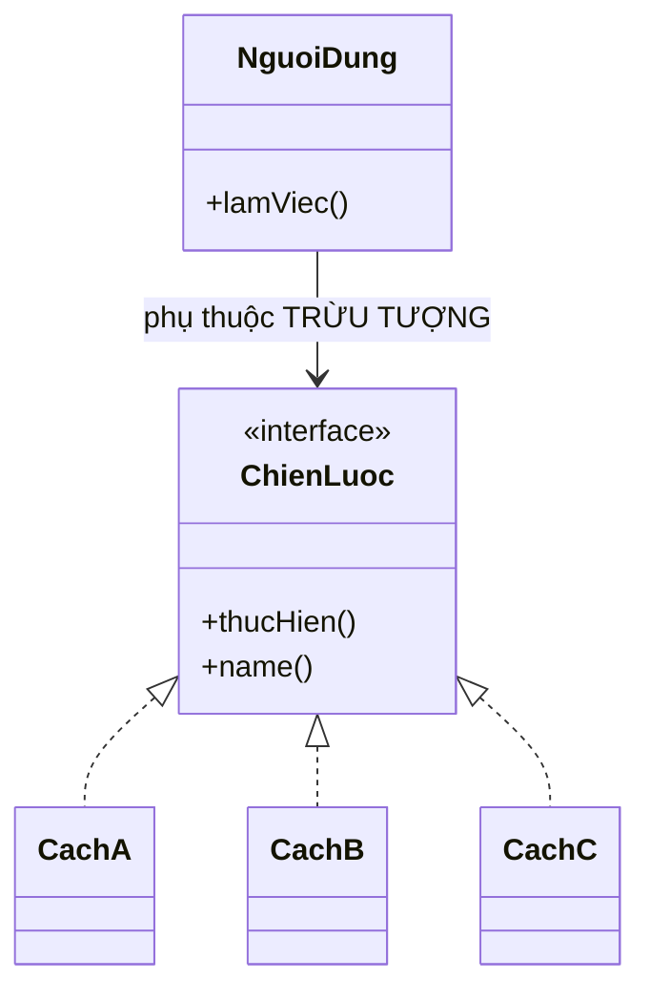
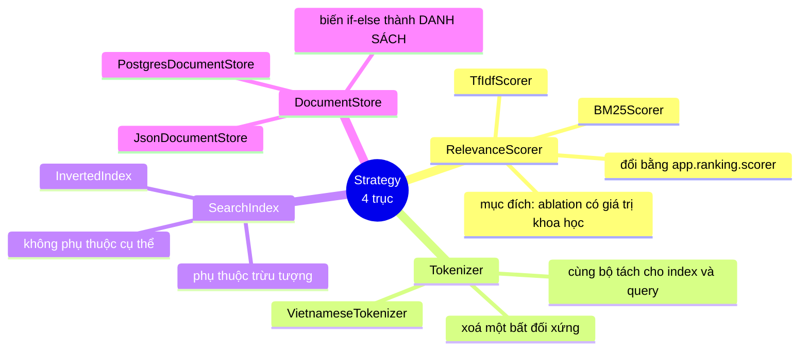

# 01 — Strategy

**Nhóm:** Behavioral (mẫu hành vi) · **Trụ cột OOP:** Trừu tượng hoá + Đa hình · **SOLID:** D (Dependency Inversion), O (Open/Closed)

**Trong VnSearch:** `RelevanceScorer`, `Tokenizer`, `SearchIndex`, `DocumentStore` — **bốn trục**, không chỉ một.

---

## 1. Hiểu trong 30 giây

Bạn có nhiều **cách khác nhau để làm cùng một việc**. Strategy tách mỗi cách thành một lớp riêng, tất cả cài chung một interface, và cho phép **đổi cách lúc chạy** mà nơi sử dụng không cần biết.



```
   Người dùng ──gọi──> [ interface Chiến lược ]
                              △
                    ┌─────────┼─────────┐
                 Cách A    Cách B    Cách C
```

Câu thần chú: **"Cùng một câu hỏi, nhiều câu trả lời — người hỏi không cần biết ai trả lời."**

### Bốn trục Strategy trong VnSearch, nhìn một lượt



```
                        Strategy — 4 trục
                               │
   ┌───────────────┬───────────┴───────────┬───────────────┐
   │               │                       │               │
RelevanceScorer  Tokenizer            SearchIndex   DocumentStore
   │               │                       │               │
TfIdfScorer     Vietnamese…          InvertedIndex   Postgres…
BM25Scorer                                           Json… (×2)
   │                                                       │
"đổi 1 biến số"                              "if-else → danh sách"
```

---

## 2. Vấn đề thật trong dự án

Đây là điểm cần nhấn trong báo cáo, vì động cơ **không phải là "cho đẹp"** mà là **khoa học**:

> Để so sánh TF-IDF và BM25 một cách có giá trị, phải chạy **cùng bộ truy vấn**, **cùng chỉ mục**, và **chỉ thay đúng một biến số** — mô hình tính điểm.
>
> Nếu mô hình tính điểm không tách được ra sau một interface, mọi phép so sánh đều lẫn thêm biến số khác và **mất giá trị khoa học**.

Đó là lập luận về **phương pháp thực nghiệm**, không phải về mã đẹp. Interface là **điều kiện cần** để làm thí nghiệm ablation.

Kết quả nó mở khoá (200 truy vấn known-item):

| Cấu hình | MRR | Success@1 |
|---|---|---|
| TF-IDF thuần | 0,8537 | 78,0 % |
| **BM25 thuần** | **0,8989** | **85,0 %** |

Chênh **5,3 % MRR** — một con số chỉ đo được vì có interface.

---

## 3. Cấu trúc trong mã

```java
public interface RelevanceScorer {

    /**
     * @param queryTermFrequency số lần mỗi term xuất hiện trong truy vấn
     * @param docId              tài liệu cần chấm điểm
     * @param index              chỉ mục chứa posting list và thống kê corpus
     */
    double score(Map<String, Integer> queryTermFrequency, int docId, SearchIndex index);

    /** Tên ngắn gọn, dùng làm nhãn trong bảng kết quả đánh giá. */
    String name();
}
```

Hai cài đặt:

```java
public final class TfIdfScorer implements RelevanceScorer { ... }   // cosine trên không gian vector
public final class BM25Scorer  implements RelevanceScorer { ... }   // hàm bão hoà, k1 và b
```

Nơi dùng **không biết** nó đang cầm cái nào:

```java
List<ResultRanker.RankedResult> ranked = resultRanker.rank(
        candidates, resolved.queryTermFrequency(), currentIndex,
        currentScorer,              // ← chỉ biết đây là một RelevanceScorer
        pageRankScores, topN);
```

### 3.1 Vì sao có `name()`

Một chi tiết nhỏ nhưng đáng nói khi bảo vệ: `name()` không phải để debug. Nó là **nhãn tự mô tả** dùng trực tiếp trong bảng kết quả đánh giá. Và vì các Decorator **tự ghép tên của lớp bên trong**, một cấu hình lồng nhau cho ra nhãn đầy đủ:

```java
scorer.name();   // "BM25(k1=1.2,b=0.75) + PR x0.30 + title x0.10"
```

Không ai phải viết tay chuỗi đó — cấu trúc object tự sinh ra nó. Xem [03-DECORATOR.md](03-DECORATOR.md).

---

## 4. Bốn trục Strategy, mỗi trục giải một vấn đề khác nhau

Đây là phần phân biệt một đồ án dùng pattern có suy nghĩ với một đồ án dùng cho có.

### 4.1 `RelevanceScorer` — ablation mô hình xếp hạng

Đã nói ở §2.

### 4.2 `Tokenizer` — xoá một bất đối xứng khó biện minh

Lập luận đắt nhất trong nhóm này:

> Bộ tách từ **cũng là một biến số** ảnh hưởng lớn tới chất lượng — đổi thuật toán ghép từ (tham lam → quy hoạch động) và đổi từ điển (154 → 49.793 mục) đã làm tốc độ tách từ nhanh 4,80 lần và sửa hẳn lớp câu nhập nhằng chồng lấp.
>
> Nhưng trước đây `VietnameseTokenizer` là **lớp cụ thể**, nên câu hỏi *"tokenizer nào tốt hơn"* **không đo được**, trong khi câu hỏi về scorer thì đo được. Interface xoá bỏ sự bất đối xứng đó.

```java
public interface Tokenizer {
    List<VietnameseTokenizer.Token> tokenize(String text);
    String name();
}
```

**Bất biến song hành, bắt buộc phải giữ:** chỉ mục và truy vấn **phải** dùng **cùng một** cài đặt tokenizer (cùng thuật toán *và* cùng từ điển). Nếu lúc index sinh ra `máy_tính` mà lúc truy vấn sinh ra `máy` + `tính` thì **không bao giờ khớp** — và lỗi này **im lặng**, không ném ngoại lệ nào, chỉ là kết quả rỗng khó hiểu.

Vì vậy `InvertedIndex` và `QueryParser` đều **nhận tokenizer qua constructor** thay vì tự tạo:

```java
public SearchEngineFacade(Tokenizer tokenizer, ...) {
    // BẤT BIẾN: query parser phải dùng CHÍNH tokenizer đã dùng lúc index.
    this.queryParser = new QueryParser(tokenizer);
    this.index = new InvertedIndex(tokenizer);
}
```

> **Bài học OOP:** Dependency Injection ở đây không chỉ là "cho dễ test". Nó là cơ chế **ép hai thành phần dùng chung một instance**, biến một bất biến ngầm thành một ràng buộc có thể thấy được trong chữ ký constructor.

### 4.3 `SearchIndex` — phụ thuộc vào trừu tượng, không vào cụ thể

Trước đây `CandidateResolver`, `TfIdfScorer`, `BM25Scorer`, `ResultRanker` đều nhận thẳng lớp cụ thể `InvertedIndex`. Ba hậu quả:

1. Không thay được bằng cài đặt khác (chỉ mục trên đĩa, chỉ mục nén, chỉ mục phân tán).
2. **Không giả lập được trong test** — muốn test scorer phải dựng chỉ mục thật với tokenizer thật.
3. Không đo được *"chỉ mục nén có chậm hơn không"* vì không có hai cài đặt để so.

Đây chính là **chữ D của SOLID**: mô-đun cấp cao (scorer) không được phụ thuộc mô-đun cấp thấp (cài đặt chỉ mục); cả hai phụ thuộc vào **trừu tượng**.

**Hợp đồng vượt ngoài kiểu** — điểm Liskov quan trọng, ghi rõ trong Javadoc:

> Với mọi term `t`, `getPostings(t)` trả về danh sách **sắp xếp tăng dần nghiêm ngặt theo `docId`**.

Bất biến này mở khoá **ba** thứ ở tầng trên:

| Mở khoá | Nếu mất bất biến |
|---|---|
| Two-pointer merge $O(m+n)$ | Phải sort lại $O(n\log n)$ **mỗi truy vấn** |
| Binary search $O(\log n)$ tra tần suất | Quét tuyến tính $O(n)$ |
| Delta encoding (nén VByte) | Hiệu hai docId liên tiếp có thể âm → không nén được |

### 4.4 `DocumentStore` — biến cấu trúc điều khiển thành dữ liệu

Đây là ví dụ đẹp nhất về Open/Closed trong dự án.

```java
// ❌ TRƯỚC — cấu trúc ĐIỀU KHIỂN. Thêm nguồn = thêm một nhánh.
if (postgresEnabled && loadFromPostgres()) { ... }
else if (Files.exists(indexDataPath))   { ... }
else if (Files.exists(crawledDataPath)) { ... }
else if (Files.exists(seedDataPath))    { ... }
```

```java
// ✅ SAU — DỮ LIỆU. Thêm nguồn = thêm một lớp.
for (DocumentStore store : buildStoreChain()) {
    if (!store.isAvailable()) continue;
    lastCrawledDocuments = store.loadAll();
    index = indexBuilder.build(lastCrawledDocuments);
    log.info("Đã nạp corpus từ {} ({} tài liệu)", store.describe(), lastCrawledDocuments.size());
    return;
}
```

```java
public interface DocumentStore extends AutoCloseable {
    boolean isAvailable();                      // có file? kết nối được CSDL? có bản ghi?
    List<WebDocument> loadAll() throws IOException;
    String describe();                          // mô tả nguồn, dùng cho log
    @Override default void close() { }
}
```

Chuỗi dự phòng được dựng ở **một chỗ duy nhất**:

```java
private List<DocumentStore> buildStoreChain() {
    List<DocumentStore> chain = new ArrayList<>();
    if (postgresEnabled) {
        chain.add(new PostgresDocumentStore(postgresUrl, postgresUser, postgresPassword));
    }
    chain.add(new JsonDocumentStore(crawledDataPath, "corpus đã crawl"));
    // Tầng cuối: mẫu seed đi kèm repo, để người vừa clone về chạy được NGAY.
    chain.add(new JsonDocumentStore(seedDataPath, "seed mẫu"));
    return chain;
}
```

Thêm nguồn thứ năm (S3, MongoDB, Redis) = **thêm một lớp**, không sửa `loadCorpus()`. Đó là định nghĩa của Open/Closed.

> **Chi tiết đáng khen về trải nghiệm:** tầng dự phòng cuối là ~40 tài liệu mẫu đi kèm repo, để người chấm vừa `git clone` là chạy được ngay, không cần crawl mạng thật hay cài PostgreSQL. Nhiều đồ án bỏ qua điều này và người chấm không chạy nổi.

---

## 5. Strategy khác gì các mẫu trông giống nó

| | Strategy | Decorator | Factory |
|---|---|---|---|
| **Ý đồ** | **Thay** thuật toán | **Thêm** hành vi vào thuật toán có sẵn | **Tạo** ra object |
| Số object cùng interface được nối | 1 (không nối) | Nhiều (lồng nhau) | 0 (nó chỉ sinh ra) |
| Có gọi object khác cùng interface không | Không | **Có** — gọi `inner` | Không |

Câu phân biệt nhanh: **Strategy *là* một cách làm. Decorator *bọc* một cách làm. Factory *chọn* một cách làm.**

Ba mẫu này trong VnSearch phối hợp với nhau: Factory tạo ra một Strategy, rồi bọc nó bằng các Decorator.

---

## 6. Sai lầm thường gặp

**❌ Tạo interface cho thứ chỉ có một cài đặt và sẽ mãi chỉ có một.**
Đó là over-engineering. Bài kiểm tra: *"Cài đặt thứ hai là gì, và ai cần nó?"* Nếu không trả lời được, đừng tạo interface.
Trong VnSearch mỗi interface đều trả lời được: `SearchIndex` → chỉ mục nén / giả lập cho test; `DocumentStore` → PostgreSQL đã có thật.

**❌ Để interface rò rỉ chi tiết của một cài đặt.**
Nếu `SearchIndex` có phương thức `getHashMapBucketCount()` thì nó đã bị buộc chặt vào cài đặt bằng HashMap — cài đặt trên đĩa không thể trả lời câu hỏi đó.

**❌ Người dùng vẫn phải biết mình đang cầm cài đặt nào.**
Nếu code có `if (scorer instanceof BM25Scorer)` thì Strategy đã thất bại — bạn vừa trả lại `if/else` mà pattern sinh ra để xoá.

---

## 7. Câu hỏi bảo vệ đồ án

**H: Sao không dùng `if/else` chọn scorer cho đơn giản?**
Đ: Vì mục tiêu không phải chọn scorer mà là **đo** scorer. `if/else` chạy đúng nhưng không cho phép chạy cùng một pipeline với hai mô hình khác nhau để so sánh có kiểm soát. Interface là điều kiện cần của thí nghiệm ablation, và con số 5,3 % MRR chỉ tồn tại nhờ nó.

**H: Bốn interface có phải là quá nhiều không?**
Đ: Mỗi cái giải một vấn đề khác nhau và có bằng chứng: `RelevanceScorer` cho ablation mô hình, `Tokenizer` xoá bất đối xứng đo đạc, `SearchIndex` gỡ 4 lớp khỏi phụ thuộc lớp cụ thể, `DocumentStore` biến chuỗi `else if` thành dữ liệu. Không cái nào chỉ có một cài đặt.

**H: `switch` trong `ScorerFactory` có mâu thuẫn với Strategy không?**
Đ: Không. Ở đâu đó phải có **đúng một chỗ** ánh xạ chuỗi cấu hình sang kiểu cụ thể. Factory là chỗ được chỉ định để chứa nó — xem [02-FACTORY.md](02-FACTORY.md). Cái sai là rải `switch` đó ra khắp nơi dùng.

---

## 8. Tự kiểm tra

1. Viết một `Tokenizer` giả lập trả về danh sách token cố định. Nó dùng để test cái gì mà `VietnameseTokenizer` thật không làm được?
2. Nếu bạn viết một `SearchIndex` đọc từ file nén và **quên sắp xếp** posting list, chương trình sẽ hỏng ở đâu? Trình biên dịch có bắt được không? Viết một test bắt được lỗi đó.
3. Thêm một `DocumentStore` đọc từ CSV. Bạn phải sửa bao nhiêu file có sẵn?

---

## Liên kết

- Tổng quan 10 pattern: [README.md](README.md)
- Mẫu tiếp theo (Factory chọn Strategy nào): [02-FACTORY.md](02-FACTORY.md)
- Toán học của hai scorer: [TfIdfScorer](../05-ranking/TfIdfScorer.md) · [BM25Scorer](../05-ranking/BM25Scorer.md)
