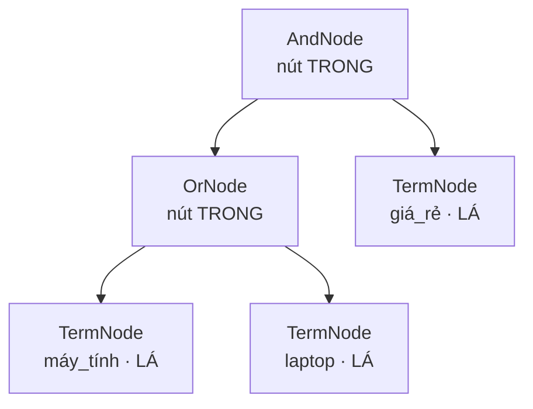
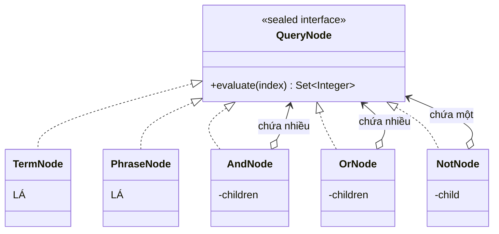
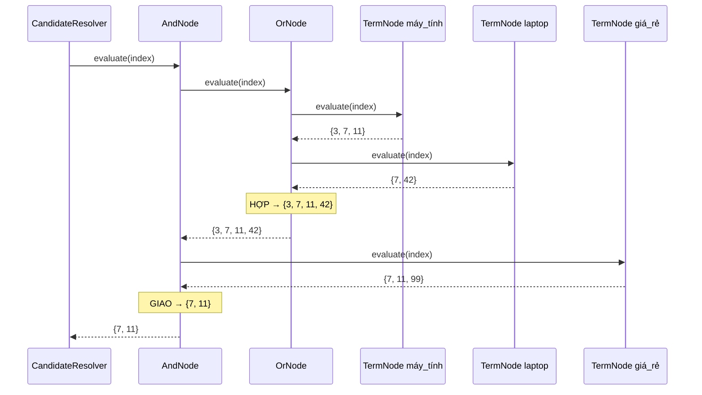

# 04 — Composite

**Nhóm:** Structural (mẫu cấu trúc) · **Trụ cột OOP:** Composition + Đa hình + Đệ quy · **SOLID:** O (Open/Closed), L (Liskov)

**Trong VnSearch:** `QueryNode` + 5 nút (`TermNode`, `PhraseNode`, `AndNode`, `OrNode`, `NotNode`)

---

## 1. Hiểu trong 30 giây

Composite cho phép **đối xử với một object đơn lẻ và một nhóm object y hệt nhau**, bằng cách để cả hai cài chung một interface.



```
(máy tính OR laptop) AND giá rẻ

              AndNode                    ← nút TRONG: chứa nhiều con
             ╱       ╲
        OrNode      TermNode(giá_rẻ)     ← nút LÁ
        ╱     ╲
  TermNode   TermNode
 (máy_tính)  (laptop)
```

Cấu trúc lớp làm nên điều đó — chú ý `QueryNode` là `sealed`:



**`sealed` là điểm khác biệt so với Composite trong sách.** Danh sách nút được
đóng lại ở compile-time, nên `switch` trên `QueryNode` được trình biên dịch
kiểm tra tính đầy đủ: thêm một loại nút mới mà quên xử lý ở đâu đó là **lỗi
biên dịch**, không phải lỗi lúc chạy.

### Một lời gọi `evaluate` lan xuống cây



Người gọi chỉ viết một dòng; toàn bộ đệ quy nằm trong cấu trúc, không nằm
trong lời gọi.

Người gọi chỉ viết `root.evaluate(index)` — không cần biết `root` là một term đơn hay một cây sâu 5 tầng.

Câu thần chú: **"Một cái và nhiều cái, gọi giống hệt nhau."**

---

## 2. Vấn đề thật trong dự án

### 2.1 Cấu trúc phẳng mã hoá sẵn một giả định

`ParsedQuery` là **ba danh sách phẳng**:

```java
public record ParsedQuery(List<String> mustTerms,
                          List<List<String>> phrases,
                          List<String> excludedTerms) { }
```

Cấu trúc này **mã hoá sẵn** giả định *"mọi `mustTerm` nối với nhau bằng AND"*. Nó không biểu diễn được:

```
(máy tính OR laptop) AND giá rẻ
NOT (quảng cáo OR khuyến mãi)
```

> **Bài học OOP:** cấu trúc dữ liệu là một **quyết định thiết kế**, không phải chi tiết kỹ thuật. Ba danh sách phẳng không chỉ *lưu* truy vấn — chúng *giới hạn* những truy vấn có thể tồn tại.

### 2.2 Và một cấu trúc bị bỏ phí hoàn toàn

Chi tiết này rất đáng nói khi bảo vệ:

> `PostingListMerger.union` **đã tồn tại**, **đã có test**, nhưng **không có đường nào gọi tới nó** từ tầng truy vấn.

Một hàm hợp posting list two-pointer $O(m+n)$, viết đúng, test đầy đủ — và là **code chết**, vì ngôn ngữ truy vấn không hỗ trợ OR. Composite làm nó sống lại.

---

## 3. Cấu trúc trong mã

```java
public sealed interface QueryNode
        permits TermNode, PhraseNode, AndNode, OrNode, NotNode {

    /** Đánh giá nút này, trả về danh sách docId SẮP XẾP TĂNG DẦN. */
    List<Integer> evaluate(SearchIndex index);

    /** Ước lượng số kết quả, dùng để sắp xếp shortest-first mà không phải đánh giá thật. */
    int estimatedSize(SearchIndex index);

    /** Biểu diễn dạng chuỗi, dùng để gỡ lỗi và làm nhãn trong báo cáo. */
    String describe();
}
```

Năm cài đặt, tất cả là `record`:

| Nút | Loại | Việc nó làm |
|---|---|---|
| `TermNode(String term)` | **Lá** | Trả posting list của một term |
| `PhraseNode(List<String> terms)` | **Lá** | Cụm từ liên tiếp đúng thứ tự |
| `AndNode(List<QueryNode> children)` | **Trong** | Giao của mọi con |
| `OrNode(List<QueryNode> children)` | **Trong** | Hợp của mọi con |
| `NotNode(QueryNode inner)` | **Trong** | Phủ định (chỉ hợp lệ trong ngữ cảnh AND) |

**Điểm mấu chốt:** `AndNode` chứa `List<QueryNode>` — kiểu **interface**, không phải `List<TermNode>`. Nhờ đó con của một `AndNode` có thể lại là một `AndNode`, cho **độ lồng nhau tuỳ ý**.

### 3.1 Nút lá — đơn giản nhất có thể

```java
public record TermNode(String term) implements QueryNode {

    @Override
    public List<Integer> evaluate(SearchIndex index) {
        return PostingListMerger.docIdsOf(index.getPostings(term));
    }

    @Override
    public int estimatedSize(SearchIndex index) {
        return index.getDocumentFrequency(term);   // df chính là số kết quả, O(1)
    }

    @Override
    public String describe() {
        return term;
    }
}
```

### 3.2 Nút trong — đệ quy tự nhiên

```java
public record OrNode(List<QueryNode> children) implements QueryNode {

    @Override
    public List<Integer> evaluate(SearchIndex index) {
        List<Integer> accumulator = List.of();
        for (QueryNode child : children) {
            accumulator = PostingListMerger.union(accumulator, child.evaluate(index));
            //                                                 ↑ đệ quy: con tự lo phần của nó
        }
        return accumulator;
    }
    ...
}
```

`OrNode` **không biết** con của nó là term, cụm từ, hay một `AndNode` lồng ba tầng. Nó chỉ gọi `child.evaluate(index)`. **Đó là toàn bộ sức mạnh của Composite.**

---

## 4. Ba quyết định thiết kế đáng nói

### 4.1 `AndNode` tự áp shortest-first

Cơ sở là bất đẳng thức $\lvert A \cap B\rvert \le \min(\lvert A\rvert, \lvert B\rvert)$ — giao không bao giờ lớn hơn tập nhỏ hơn:

```java
positives.sort(Comparator.comparingInt(node -> node.estimatedSize(index)));   // shortest-first

List<Integer> accumulator = positives.get(0).evaluate(index);
for (int i = 1; i < positives.size(); i++) {
    if (accumulator.isEmpty()) {
        return List.of();          // ∅ là phần tử HẤP THỤ của phép giao
    }
    accumulator = PostingListMerger.intersect(accumulator, positives.get(i).evaluate(index));
}
```

**Vì sao `estimatedSize` tồn tại như một phương thức riêng:** để sắp xếp shortest-first, ta cần biết con nào nhỏ nhất — nhưng **không được phép đánh giá thật** để biết, vì như vậy sẽ làm hai lần công việc. Với `TermNode`, `estimatedSize` chỉ là một phép tra document frequency $O(1)$.

> **Bài học OOP:** thêm một phương thức vào interface là quyết định phải cân nhắc. `estimatedSize` đáng có vì nó cho phép một **tối ưu hoá không thể làm được nếu thiếu nó**. Đối chiếu: một phương thức `getChildCount()` sẽ không đáng, vì không mở khoá gì.

Ước lượng của `OrNode` là **chặn trên** (tổng các con), của `AndNode` là **min các con** — đủ chính xác để sắp xếp, không cần chính xác tuyệt đối.

### 4.2 `NotNode` được xử lý đúng về mặt ngữ nghĩa

Đây là chỗ thiết kế cẩn thận nhất trong nhóm.

**Vấn đề:** phủ định thuần tuý cho ra **tập bù**. Với `NOT quảng_cáo` trên 5.011 tài liệu, kết quả là gần 5.000 tài liệu — vừa vô nghĩa với người dùng, vừa đắt (phải liệt kê toàn corpus rồi trừ đi).

Mọi hệ thống tìm kiếm thực tế đều yêu cầu phủ định **gắn với một mệnh đề khẳng định**: `A AND NOT B`, không phải `NOT B` đơn độc.

**Cách giải:** hai phương thức, một cái ném ngoại lệ có thông điệp rõ ràng.

```java
@Override
public List<Integer> evaluate(SearchIndex index) {
    throw new UnsupportedOperationException(
            "NOT chỉ hợp lệ trong ngữ cảnh AND (ví dụ 'A AND NOT B'); "
                    + "phủ định độc lập sẽ trả về gần như toàn bộ corpus.");
}

/** O(m+n) — trừ tập kết quả của inner khỏi candidates bằng two-pointer. */
public List<Integer> evaluateAgainst(List<Integer> candidates, SearchIndex index) {
    List<Integer> excluded = inner.evaluate(index);
    if (excluded.isEmpty()) return candidates;

    List<Integer> result = new ArrayList<>(candidates.size());
    int j = 0;
    for (int candidate : candidates) {
        // Vì cả hai sắp xếp tăng dần, con trỏ j chỉ tiến MỘT chiều: O(m+n), không phải O(m*n).
        while (j < excluded.size() && excluded.get(j) < candidate) j++;
        if (j >= excluded.size() || excluded.get(j) != candidate) result.add(candidate);
    }
    return result;
}
```

Và `AndNode` biết cách xử lý:

```java
List<QueryNode> positives = new ArrayList<>();
List<NotNode>   negatives = new ArrayList<>();
for (QueryNode child : children) {
    if (child instanceof NotNode not) negatives.add(not);
    else                              positives.add(child);
}
if (positives.isEmpty()) {
    throw new UnsupportedOperationException(
            "AND chỉ gồm các mệnh đề NOT thì không đánh giá được; cần ít nhất một mệnh đề khẳng định.");
}
// ... giao các positives trước, rồi trừ negatives SAU CÙNG
```

> **Câu hỏi có thể bị vặn:** *"`instanceof` chẳng phải anti-pattern sao?"*
> Trả lời: `instanceof` xấu khi dùng để **thay thế đa hình** (`if (x instanceof A) doA(); else if (x instanceof B) doB();`). Ở đây nó dùng để **phân loại con thành hai nhóm có thứ tự xử lý khác nhau** — một quyết định về *chiến lược đánh giá*, không phải về *hành vi của nút*. Và nhờ `sealed`, tập kiểu là hữu hạn và đóng, nên trình biên dịch kiểm soát được.

### 4.3 `sealed` + `record` — Java 17 làm gì cho ta

```java
public sealed interface QueryNode
        permits TermNode, PhraseNode, AndNode, OrNode, NotNode { }
```

`sealed` khai báo **kín** tập cài đặt. Ba lợi ích:

| Lợi ích | Ý nghĩa thực tế |
|---|---|
| `switch` có kiểm tra **đầy đủ nhánh** | Thêm loại nút mới → trình biên dịch **nhắc mọi chỗ cần sửa** |
| Không ai ngoài package thêm cài đặt | Bất biến "kết quả sắp xếp tăng dần" không bị phá từ bên ngoài |
| Đọc interface là thấy toàn bộ hệ thống | Không phải grep tìm `implements QueryNode` |

`record` cho: bất biến, `equals`/`hashCode`/`toString` tự sinh, và không có setter nào để ai đó sửa cây sau khi dựng.

> **Đối chiếu với `enum`:** `sealed interface` là *"enum cho các kiểu có dữ liệu khác nhau"*. `TermNode` giữ một `String`, `AndNode` giữ một `List` — không nhét vào `enum` được. Xem [06-STATE.md](06-STATE.md) để thấy chỗ `enum` đúng hơn.

---

## 5. Ranh giới với Chain of Responsibility

Đây là điểm thiết kế đáng chú ý nhất của cả dự án, và cần trả lời được khi bảo vệ. Chi tiết ở [05-CHAIN-OF-RESPONSIBILITY.md](05-CHAIN-OF-RESPONSIBILITY.md) §4, tóm tắt:

> **Nguyên tắc phân công:** một ràng buộc **có posting list** thì thuộc về **cây**; một ràng buộc **trên siêu dữ liệu** thì thuộc về **đường ống lọc**.

`site:vnexpress.net` **không phải một term** — nó không có posting list nào. Đưa nó vào cây sẽ buộc phải dựng một chỉ mục phụ `host → docIds`.

---

## 6. Tính năng mới cho người dùng

Composite không chỉ làm code đẹp — nó mở khoá cú pháp truy vấn mới:

```
laptop OR máy tính
```

Và làm sống lại `PostingListMerger.union` — hàm đã có test nhưng chưa từng được gọi.

---

## 7. Sai lầm thường gặp

**❌ Nút lá và nút trong có interface khác nhau.**
Nếu `TermNode` không cài `QueryNode` mà là một lớp riêng, `AndNode` sẽ phải phân biệt hai loại con → `instanceof` khắp nơi → mất toàn bộ lợi ích. **Cả hai phải cùng interface, đó là định nghĩa của Composite.**

**❌ Nút trong biết chi tiết của nút con.**
`OrNode` không được viết `if (child instanceof TermNode t) { ... t.term() ... }`. Nó chỉ gọi `child.evaluate(index)`.

**❌ Phá bất biến ở một nút.**
Mọi `evaluate()` phải trả về danh sách **sắp xếp tăng dần**. Một nút trả về danh sách chưa sắp xếp sẽ làm two-pointer ở nút cha cho kết quả **sai lặng lẽ** — không exception, chỉ là kết quả thiếu. Vi phạm Liskov, và là loại lỗi khó tìm nhất.

**❌ Composite cho cấu trúc không phải cây.**
Nếu dữ liệu của bạn là danh sách phẳng và sẽ mãi phẳng, Composite là over-engineering. Ở đây nó đúng vì truy vấn boolean **về bản chất là đệ quy** — biểu thức lồng biểu thức.

---

## 8. Câu hỏi bảo vệ đồ án

**H: Vì sao `NotNode.evaluate()` ném ngoại lệ? Không phải mọi cài đặt interface đều phải hoạt động sao?**
Đ: Đây là đánh đổi có ý thức và được ghi rõ trong Javadoc. Lựa chọn thay thế là trả về tập bù thật (gần 5.000 docId) — đúng về mặt toán học nhưng vô dụng và đắt. Ném ngoại lệ với thông điệp chỉ đúng cách dùng đúng (`A AND NOT B`) hữu ích hơn. Đây là ranh giới của Liskov: hợp đồng của `QueryNode` được hiểu là *"đánh giá trong ngữ cảnh hợp lệ"*.

**H: `estimatedSize` có thể sai không?**
Đ: Có, và không sao. Nó chỉ dùng để **sắp xếp**, không dùng để tính kết quả. `OrNode` trả chặn trên (tổng các con) — thực tế nhỏ hơn nếu các con chồng lấn. Sai lệch chỉ khiến thứ tự giao không tối ưu, không làm sai kết quả.

**H: Cây sâu quá có tràn stack không?**
Đ: `evaluate` đệ quy theo **chiều sâu cây**, mà chiều sâu do cú pháp truy vấn người dùng gõ quyết định — thực tế 2–3 tầng. Đây không phải đệ quy trên dữ liệu (5.011 tài liệu), nên không có rủi ro.

---

## 9. Tự kiểm tra

1. Vẽ cây cho `"trí tuệ nhân tạo" AND (Việt Nam OR Vietnam) AND NOT quảng cáo`. Đánh dấu nút lá và nút trong.
2. Thêm `NearNode(term1, term2, k)` — hai term cách nhau tối đa $k$ vị trí. Bạn phải sửa những file nào? *(Gợi ý: `permits` là một trong số đó — vì sao đó là điều **tốt**?)*
3. Nếu `OrNode.evaluate` trả về danh sách **chưa sắp xếp**, kết quả của `AndNode` cha sẽ sai như thế nào? Nó có ném exception không?
4. Vì sao `AndNode.estimatedSize` bỏ qua các con `NotNode`?

---

## Liên kết

- Mẫu trước (cũng chứa chính interface của mình, nhưng 1 thay vì n): [03-DECORATOR.md](03-DECORATOR.md)
- Mẫu tiếp theo, và ranh giới với mẫu này: [05-CHAIN-OF-RESPONSIBILITY.md](05-CHAIN-OF-RESPONSIBILITY.md)
- Two-pointer merge, có chứng minh bất biến vòng lặp: [PostingListMerger](../04-query/PostingListMerger.md)
