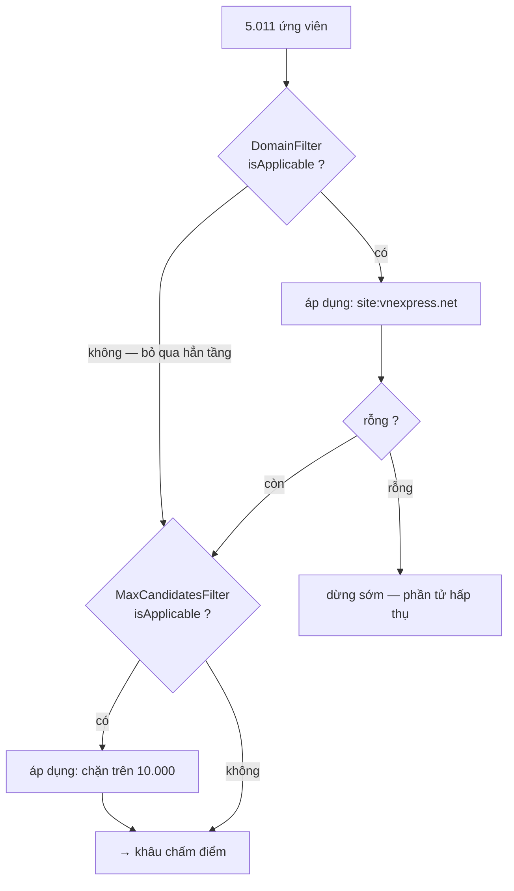
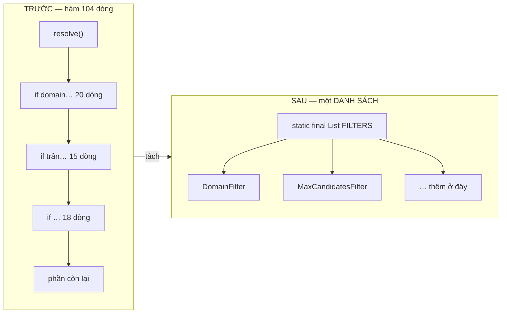

# 05 — Chain of Responsibility

**Nhóm:** Behavioral (mẫu hành vi) · **Trụ cột OOP:** Trừu tượng hoá + Composition · **SOLID:** O (Open/Closed), S (Single Responsibility)

**Trong VnSearch:** `CandidateFilter` + `DomainFilter` + `MaxCandidatesFilter`

---

## 1. Hiểu trong 30 giây

Thay vì một hàm dài xử lý nhiều bước, ta biến **mỗi bước thành một object**, xếp chúng thành **một danh sách**, rồi cho dữ liệu chạy qua từng khâu.



```
5011 ứng viên
     │
     ▼  DomainFilter        (site:vnexpress.net)
   ~800
     │
     ▼  MaxCandidatesFilter (chặn trên 10.000)
   ~800
     │
     ▼  → sang khâu chấm điểm
```

Câu thần chú: **"Thêm một bước = thêm một dòng vào danh sách, không sửa hàm nào."**

### Trước và sau — cùng một logic, hai hình dạng



Điều thay đổi không phải là số dòng mã, mà là **thêm một bước cần sửa gì**:
bên trái phải mở thân hàm ra sửa, bên phải chỉ thêm một phần tử vào danh sách.

---

## 2. Vấn đề thật trong dự án

`CandidateResolver.resolve` có **ba tầng lọc chôn cứng trong thân hàm 104 dòng**. Bốn hậu quả:

1. Muốn thêm bộ lọc mới (theo domain, theo ngày đăng, theo ngôn ngữ, theo độ dài) phải **sửa thân hàm** — vi phạm Open/Closed.
2. **Không test riêng từng tầng được** — muốn test lọc domain phải chạy cả pipeline.
3. **Không đo được** *"tầng nào loại bao nhiêu ứng viên, tốn bao nhiêu ms"*.
4. Đổi thứ tự lọc = viết lại thân hàm, dễ làm hỏng.

---

## 3. Cấu trúc trong mã

```java
public interface CandidateFilter {

    /**
     * Lọc danh sách ứng viên. Danh sách vào và ra đều SẮP XẾP TĂNG DẦN
     * theo docId — bất biến này phải được mọi cài đặt giữ.
     */
    List<Integer> apply(List<Integer> candidates, FilterContext context);

    /** Tên ngắn gọn, dùng làm nhãn khi đo chi phí từng tầng. */
    String name();

    /**
     * Bộ lọc này có việc gì để làm với truy vấn này không.
     * Cho phép bỏ qua hẳn một tầng thay vì chạy nó rồi phát hiện không có gì để lọc.
     */
    default boolean isApplicable(FilterContext context) { return true; }

    /** Dữ liệu dùng chung mà các tầng lọc cần. */
    record FilterContext(SearchIndex index, QueryParser.ParsedQuery parsed) { }
}
```

Chuỗi được khai báo ở **một chỗ duy nhất**:

```java
/**
 * Đường ống lọc, xếp theo nguyên tắc "rẻ và loại nhiều trước".
 *
 * Thêm một bộ lọc mới chỉ cần thêm một dòng ở đây — KHÔNG sửa resolve().
 */
private static final List<CandidateFilter> FILTERS = List.of(
        new DomainFilter(),
        new MaxCandidatesFilter());
```

Vòng chạy chuỗi — **7 dòng**, thay cho thân hàm 104 dòng:

```java
CandidateFilter.FilterContext context = new CandidateFilter.FilterContext(index, parsed);
for (CandidateFilter filter : FILTERS) {
    if (candidates.isEmpty()) break;                  // ∅ là phần tử HẤP THỤ
    if (!filter.isApplicable(context)) continue;
    candidates = filter.apply(candidates, context);
}
```

---

## 4. Ranh giới với Composite — điểm thiết kế đáng chú ý nhất

Đây là câu hỏi bảo vệ đắt giá nhất trong toàn bộ loạt tài liệu này. Hai pattern làm **hai việc khác hẳn nhau**, và việc phân công theo một **nguyên tắc rõ ràng** chứ không tuỳ tiện.

| | **Composite** (`QueryNode`) | **Chain of Responsibility** (`CandidateFilter`) |
|---|---|---|
| Lo việc gì | Truy hồi **boolean**: AND, OR, NOT, term, cụm từ | Ràng buộc **sau truy hồi** |
| Làm việc trên | **Posting list** | **Siêu dữ liệu** tài liệu |
| Hình dạng | **Cây** (đệ quy, lồng tuỳ ý) | **Danh sách phẳng** (tuần tự) |
| Ví dụ | `máy tính OR laptop` | `site:vnexpress.net` |

> **Nguyên tắc phân công:** một ràng buộc **có posting list** thì thuộc về **cây**; một ràng buộc **trên siêu dữ liệu** thì thuộc về **đường ống lọc**.

### 4.1 Áp dụng nguyên tắc: vì sao `site:` là filter, không phải node

`site:vnexpress.net` **không phải một term** — không có posting list nào tương ứng với nó. Đưa nó vào cây sẽ buộc phải dựng một **chỉ mục phụ `host → docIds`** chỉ để phục vụ một tính năng phụ. Ở tầng lọc, với vài chục ứng viên, kiểm tra trực tiếp là đủ và đơn giản hơn nhiều.

Javadoc của `DomainFilter` nói thẳng điều này:

```java
/**
 * Vì sao đây là một FILTER chứ không phải một nút trong cây truy vấn.
 *
 * Cây biểu thức (QueryNode) mô hình hoá quan hệ BOOLEAN giữa các term —
 * nó làm việc trên posting list. Nhưng site: không phải một term: nó là
 * một ràng buộc trên SIÊU DỮ LIỆU của tài liệu (URL), không có posting
 * list nào tương ứng.
 */
```

> **Bài học OOP:** khi hai pattern có vẻ dùng được cho cùng một việc, đừng chọn theo cảm tính. **Viết ra một nguyên tắc phân công**, rồi áp dụng nhất quán. Nguyên tắc quan trọng hơn lựa chọn — nó là thứ giữ cho hệ thống nhất quán khi có người thứ hai vào sửa.

---

## 5. Bốn chi tiết thiết kế đáng nói

### 5.1 Thứ tự có ý nghĩa — "rẻ và loại nhiều trước"

```
1. Giao posting list   5011 → ~50   (rẻ nhất, loại nhiều nhất)
2. Khớp cụm từ          ~50 → ~20   (đắt: binary search mỗi tài liệu)
3. Loại trừ             ~20 → ~19   (rẻ: tra HashSet)
```

Nếu đảo thứ tự — kiểm tra cụm từ **trước** khi giao — phải chạy `matchesPhrase` trên **5.011 tài liệu** thay vì 50, tức **chậm hơn khoảng 100 lần**.

Trong Chain of Responsibility, **thứ tự chính là dữ liệu** — nằm trong danh sách `FILTERS`, đổi được bằng cách đổi thứ tự dòng. Trong hàm 104 dòng, thứ tự nằm trong luồng điều khiển, đổi được nhưng dễ làm hỏng.

### 5.2 Phần tử hấp thụ — `break` khi rỗng

```java
if (candidates.isEmpty()) break;
```

Tập rỗng là **phần tử hấp thụ** của mọi phép lọc: $\emptyset$ lọc kiểu gì cũng ra $\emptyset$. Chạy tiếp là lãng phí thuần tuý.

Đây là cùng một ý tưởng toán học với `return List.of()` trong `AndNode` ([04-COMPOSITE.md](04-COMPOSITE.md) §4.1). Nhận ra tính chất đại số của phép toán rồi khai thác nó là một dạng tối ưu hoá **miễn phí và luôn đúng**.

### 5.3 `isApplicable` — bỏ qua hẳn tầng thay vì chạy rồi phát hiện vô ích

```java
// DomainFilter
@Override
public boolean isApplicable(FilterContext context) {
    return context.parsed().siteFilter() != null;
}
```

Truy vấn không có `site:` thì tầng này bị **bỏ qua hoàn toàn** — không duyệt danh sách, không cấp phát `ArrayList`.

So sánh với việc nhét kiểm tra vào đầu `apply()`: cũng chạy đúng, nhưng vẫn phải gọi hàm, và quan trọng hơn — **trộn hai câu hỏi khác nhau** (*"có nên chạy không?"* và *"chạy thì làm gì?"*) vào một phương thức. Tách ra là SRP ở mức phương thức.

### 5.4 `name()` không thừa

Nó cho phép **bọc timer quanh `apply`** để in bảng *"tầng nào loại bao nhiêu ứng viên, tốn bao nhiêu ms"* — đúng tinh thần đo đạc của dự án. Không có `name()`, bảng đó chỉ in được `class com.vnsearch.query.filter.DomainFilter@1a2b3c`.

---

## 6. Hai cài đặt

### 6.1 `DomainFilter` — tính năng người dùng thấy được

```java
@Override
public List<Integer> apply(List<Integer> candidates, FilterContext context) {
    String wanted = context.parsed().siteFilter();
    List<Integer> filtered = new ArrayList<>(candidates.size());
    for (int docId : candidates) {
        WebDocument doc = context.index().getDocument(docId);
        if (doc == null) continue;
        String host = hostOf(doc.getUrl());
        if (host != null && (host.equals(wanted) || host.endsWith("." + wanted))) {
            filtered.add(docId);
        }
    }
    return filtered;
}
```

Khớp theo **hậu tố**, nên `site:vnexpress.net` bắt được cả `vnexpress.net` lẫn `sport.vnexpress.net`. Và `hostOf` chuẩn hoá: bỏ `www.`, hạ chữ thường, nuốt URL hỏng thành `null`.

**Tính năng mới:** `công nghệ site:vnexpress.net`.

### 6.2 `MaxCandidatesFilter` — và một bài học về trung thực kỹ thuật

```java
/** Ngưỡng mặc định: đủ cao để không ảnh hưởng truy vấn bình thường. */
public static final int DEFAULT_MAX_CANDIDATES = 10_000;

@Override
public List<Integer> apply(List<Integer> candidates, FilterContext context) {
    if (candidates.size() <= maxCandidates) {
        return candidates;      // trường hợp phổ biến: không làm gì, không cấp phát
    }
    return List.copyOf(candidates.subList(0, maxCandidates));
}
```

Điều đáng học nằm trong Javadoc, không phải trong code:

> **Cách chuẩn của ngành** là **WAND** hoặc **MaxScore**: ước lượng chặn trên điểm của từng tài liệu và bỏ qua sớm những tài liệu không thể lọt top-K.
>
> Bộ lọc này là một chặn trên **đơn giản và an toàn**: giữ lại `maxCandidates` ứng viên đầu tiên. Vì posting list sắp xếp theo `docId` chứ không theo điểm, phép cắt này **KHÔNG bảo toàn top-K một cách chính xác** — đó là đánh đổi có ý thức.
>
> **Nói rõ hạn chế này quan trọng hơn việc giấu nó:** bộ lọc bảo vệ hệ thống khỏi truy vấn bất thường, **không phải** một tối ưu xếp hạng.

> **Bài học vượt ra ngoài OOP:** một tài liệu tự phê bình đáng tin hơn một tài liệu hoàn hảo. Người chấm sẽ tìm ra hạn chế này; tốt hơn là bạn tìm ra trước và giải thích được đánh đổi.

---

## 7. Chain of Responsibility ở đây là biến thể nào

Sách Gang of Four mô tả Chain of Responsibility ở dạng **mỗi handler giữ tham chiếu tới handler kế tiếp** và có thể **dừng chuỗi** khi đã xử lý xong:

```java
// Dạng cổ điển
abstract class Handler {
    protected Handler next;
    public void handle(Request r) {
        if (canHandle(r)) process(r);
        else if (next != null) next.handle(r);   // chuyền tiếp
    }
}
```

VnSearch dùng **biến thể pipeline**: chuỗi nằm trong một `List`, mọi tầng đều chạy, và mỗi tầng **biến đổi** dữ liệu thay vì tiêu thụ nó.

Nếu bị hỏi *"đây có đúng là Chain of Responsibility không?"*, trả lời:

| Đặc điểm cốt lõi | Có? |
|---|---|
| Nhiều đối tượng xử lý xếp thành chuỗi | ✅ |
| Người gửi không biết ai xử lý | ✅ — `resolve()` không biết có bao nhiêu tầng |
| Thêm/bớt/đổi thứ tự khâu mà không sửa người gửi | ✅ |
| Handler tự quyết định có tham gia không | ✅ — `isApplicable` |
| Chuỗi dừng sớm | ✅ — `break` khi rỗng |

Biến thể pipeline **rõ ràng hơn** cho bài toán này vì chuỗi được khai báo tập trung ở một chỗ, thay vì rải rác trong các trường `next`. Đó là một lựa chọn có lý do, không phải hiểu sai pattern.

---

## 8. Sai lầm thường gặp

**❌ Filter phá bất biến sắp xếp.**
Interface ghi rõ: *"danh sách vào và ra đều sắp xếp tăng dần theo docId"*. Một filter dùng `HashSet` để lọc rồi trả về sẽ **mất thứ tự** — và tầng sau (hoặc `NotNode.evaluateAgainst`) sẽ cho kết quả sai lặng lẽ. Cả hai cài đặt hiện tại đều duyệt tuần tự nên giữ thứ tự tự nhiên.

**❌ Filter phụ thuộc filter khác.**
Nếu `MaxCandidatesFilter` giả định `DomainFilter` đã chạy trước, chuỗi không còn sắp xếp lại được. Mỗi filter phải **tự đủ**.

**❌ Nhét mọi thứ vào chuỗi.**
Chain of Responsibility dành cho các bước **cùng loại, hoán đổi thứ tự được, có thể bật/tắt**. Truy hồi boolean không thuộc loại đó — nó đệ quy và có cấu trúc cây. Đó là lý do có nguyên tắc phân công ở §4.

---

## 9. Câu hỏi bảo vệ đồ án

**H: Chỉ có hai filter, có đáng dùng pattern không?**
Đ: Giá trị nằm ở **chi phí thêm cái thứ ba**, không ở số lượng hiện tại. Trước: sửa hàm 104 dòng, không test riêng được. Sau: thêm một lớp và một dòng. Và pattern này còn tạo ra **chỗ đúng** để đặt các ràng buộc siêu dữ liệu trong tương lai (lọc theo ngày, theo ngôn ngữ) — hiện đã có `LanguageDetector` sẵn sàng.

**H: Vì sao không cho `site:` vào cây truy vấn cho thống nhất?**
Đ: Vì nó không có posting list. Đưa vào cây buộc phải dựng chỉ mục phụ `host → docIds` chỉ để phục vụ một tính năng phụ. Nguyên tắc phân công ở §4 quyết định điều này, và nó được viết vào Javadoc của cả `DomainFilter` lẫn `CandidateResolver` để người sau không phá vỡ.

**H: `FILTERS` là `static final` — có ảnh hưởng đa luồng không?**
Đ: Không. `List.of()` là bất biến, và cả hai filter đều **không có trạng thái thay đổi được** (`DomainFilter` không có trường; `MaxCandidatesFilter` chỉ có một `int final`). Object bất biến chia sẻ an toàn giữa mọi luồng — cùng lập luận với `CrawlConfig` ở [08-BUILDER.md](08-BUILDER.md).

---

## 10. Tự kiểm tra

1. Viết `RecencyFilter` giữ lại tài liệu crawl trong 30 ngày gần nhất. Bạn phải sửa bao nhiêu file có sẵn?
2. Nếu đặt `MaxCandidatesFilter` **trước** `DomainFilter`, kết quả có thể sai như thế nào? *(Gợi ý: cắt 10.000 đầu tiên theo docId, rồi mới lọc domain.)*
3. Vì sao `MaxCandidatesFilter.apply` trả thẳng `candidates` khi không cần cắt, thay vì luôn `List.copyOf`?
4. Nêu một ràng buộc truy vấn **nên** là `QueryNode` và một ràng buộc **nên** là `CandidateFilter`. Áp dụng nguyên tắc ở §4 để biện minh.

---

## Liên kết

- Mẫu trước, và ranh giới với mẫu này: [04-COMPOSITE.md](04-COMPOSITE.md)
- Mẫu tiếp theo: [06-STATE.md](06-STATE.md)
- Phân tích filter-and-refine: [CandidateResolver](../04-query/CandidateResolver.md)
