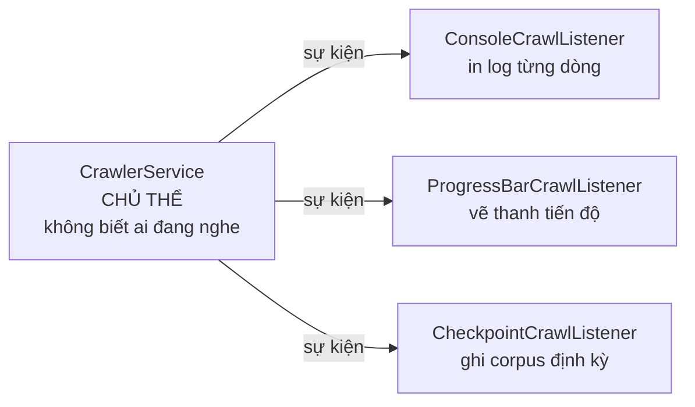
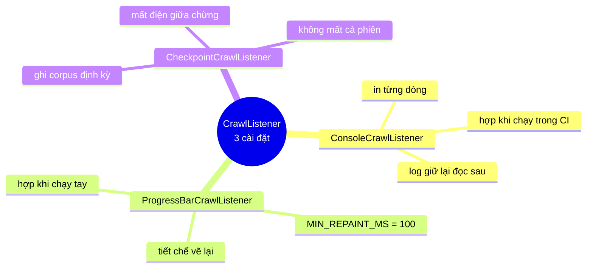

# 07 — Observer

**Nhóm:** Behavioral (mẫu hành vi) · **Trụ cột OOP:** Trừu tượng hoá + Đảo ngược phụ thuộc · **SOLID:** D, O, I (Interface Segregation)

**Trong VnSearch:** `CrawlListener` + `ConsoleCrawlListener` + `CrawlerService`

---

## 1. Hiểu trong 30 giây

Observer tách việc **quan sát** một quá trình khỏi việc **thực thi** nó. Người thực thi **phát sự kiện**; ai quan tâm thì **tự đăng ký**.



```
                        ┌──> ConsoleCrawlListener     (in log từng dòng)
CrawlerService ──phát──>├──> ProgressBarCrawlListener (vẽ thanh tiến độ)
   (chủ thể)            └──> CheckpointCrawlListener  (ghi corpus định kỳ)
```

### Ba cài đặt thật, ba lý do khác nhau



Điểm đáng chú ý: cả ba **cùng nghe một sự kiện** nhưng làm ba việc hoàn toàn
khác nhau — và `CrawlerService` không có một dòng `if` nào phân biệt chúng.
Thêm cái thứ tư là thêm một lớp, không sửa `CrawlerService`.

`ProgressBarCrawlListener` cho thấy vì sao Observer đáng giá ở đây: nó cần
**trạng thái riêng** (thời điểm vẽ lần cuối, để tiết chế xuống 10 lần/giây).
Nhồi logic đó vào `CrawlerService` là bắt lớp điều phối giữ hộ trạng thái hiển
thị — thứ nó không nên biết là có tồn tại.

Câu thần chú: **"Tôi la lên, ai quan tâm thì nghe. Tôi không cần biết có ai nghe không."**

---

## 2. Vấn đề thật trong dự án

Logic in tiến độ bị **chôn thẳng trong vòng lặp worker**:

```java
System.out.printf("[%d/%d] %s (depth=%d, %d links, frontier=%d, domains=%d)%n", ...);
```

Bốn hậu quả:

| # | Vấn đề | Vì sao đau |
|---|---|---|
| 1 | **Không tắt được khi chạy test** | Test crawler spam hàng nghìn dòng console |
| 2 | **Không đẩy lên WebSocket được** | UI không theo dõi tiến độ thời gian thực được |
| 3 | **Không ghi ra file được** | Không phân tích lại sau phiên crawl |
| 4 | **Không đo được** | Chỉ có **chuỗi**, không có số liệu có cấu trúc |

Vấn đề 4 là vấn đề sâu nhất. `printf` biến dữ liệu thành text — muốn tính *"tốc độ crawl trung bình theo domain"* phải **parse ngược lại chuỗi log**. Đó là mất mát thông tin không cần thiết.

> **Bài học OOP:** khi một lớp vừa làm việc chính vừa báo cáo kết quả theo một cách cố định, nó đang gánh hai trách nhiệm. Trách nhiệm thứ hai gần như luôn cần thay đổi trước.

---

## 3. Cấu trúc trong mã

```java
public interface CrawlListener {

    /** Một trang đã được tải và trích xuất thành công. */
    default void onPageCrawled(CrawlEvent event) { }

    /** Một URL thất bại sau khi đã hết số lần thử lại. */
    default void onError(String url, Exception error) { }

    /** Phiên crawl kết thúc (dù vì lý do gì: đủ trang, hết việc, hay hết giờ). */
    default void onFinished(int totalPages, long elapsedMs) { }

    /**
     * Số liệu có CẤU TRÚC về một trang vừa crawl — khác hẳn một dòng log
     * dạng chuỗi, dữ liệu này đo được và tổng hợp được.
     */
    record CrawlEvent(int pageNumber, int maxPages, String url, int depth,
                      int outlinks, int frontierSize, int domainCount) { }
}
```

Phía chủ thể (`CrawlerService`):

```java
private final List<CrawlListener> listeners = new CopyOnWriteArrayList<>();

private void notifyPageCrawled(CrawlListener.CrawlEvent event) {
    for (CrawlListener listener : listeners) {
        try {
            listener.onPageCrawled(event);
        } catch (Exception e) {
            // Một listener hỏng KHÔNG được làm chết cả phiên crawl.
            log.warn("Listener {} ném ngoại lệ", listener.getClass().getSimpleName(), e);
        }
    }
}
```

---

## 4. Bốn chi tiết thiết kế đáng nói

### 4.1 `record CrawlEvent` — số liệu có cấu trúc, không phải dòng log

So sánh trực tiếp:

```java
// ❌ Trước — thông tin bị nén thành chuỗi, không lấy lại được
System.out.printf("[%d/%d] %s (depth=%d, ...)%n", pageNumber, maxPages, url, depth, ...);

// ✅ Sau — dữ liệu giữ nguyên cấu trúc, mỗi listener tự quyết định làm gì
notifyPageCrawled(new CrawlListener.CrawlEvent(
        pageNumber, maxPages, url, depth, outlinks, frontierSize, domainCount));
```

Với event có cấu trúc, một listener thu số liệu tính được ngay:

- Tốc độ crawl theo thời gian (từ `pageNumber` và timestamp).
- Phân bố độ sâu BFS (từ `depth`).
- Frontier có phình ra không (từ `frontierSize`).
- Đa dạng domain (từ `domainCount`).

Không cái nào làm được từ chuỗi log mà không parse ngược.

> **Bài học OOP:** đừng vội chuyển dữ liệu thành chuỗi. Chuỗi là **định dạng trình bày**, và chuyển sang nó là thao tác **một chiều, mất thông tin**. Giữ dữ liệu ở dạng có kiểu càng lâu càng tốt; để lớp ngoài cùng quyết định cách trình bày.

### 4.2 Mọi phương thức là `default` rỗng — Interface Segregation

```java
default void onPageCrawled(CrawlEvent event) { }
default void onError(String url, Exception error) { }
default void onFinished(int totalPages, long elapsedMs) { }
```

Một listener chỉ quan tâm lúc kết thúc **không bị ép** viết hai phương thức rỗng:

```java
crawler.addListener(new CrawlListener() {
    @Override public void onFinished(int total, long ms) {
        log.info("Xong {} trang", total);
    }
});
```

Đó là **chữ I của SOLID** — không ép cài đặt phụ thuộc vào phương thức nó không dùng. Java 8 trở lên cho phép làm điều này bằng `default method`, thay cho mẹo "abstract adapter class" thời cũ.

### 4.3 `CopyOnWriteArrayList` — chọn cấu trúc đúng ca sử dụng

```java
private final List<CrawlListener> listeners = new CopyOnWriteArrayList<>();
```

Đặc tính của cấu trúc này: **ghi rất đắt** (sao chép cả mảng), **đọc miễn phí** (không khoá gì).

Ca sử dụng ở đây khớp chính xác:

| Thao tác | Tần suất |
|---|---|
| `addListener` (ghi) | Vài lần, lúc khởi tạo |
| Duyệt để phát sự kiện (đọc) | **Hàng nghìn lần**, từ **12 worker song song** |

Với `ArrayList` thường sẽ có `ConcurrentModificationException` hoặc phải `synchronized` toàn bộ vòng duyệt — biến việc phát sự kiện thành điểm nghẽn cho cả 12 worker.

> **Bài học chung:** chọn cấu trúc dữ liệu đồng thời theo **tỷ lệ đọc/ghi**, không theo thói quen. Cùng ý tưởng với `ReentrantReadWriteLock` trong `Trie` và `ConcurrentHashMap` trong `RobotsTxtParser`.

### 4.4 `try/catch` quanh **mỗi** listener

```java
for (CrawlListener listener : listeners) {
    try {
        listener.onPageCrawled(event);
    } catch (Exception e) {
        log.warn("Listener {} ném ngoại lệ", listener.getClass().getSimpleName(), e);
    }
}
```

Đây là quy tắc bắt buộc của Observer: **chủ thể không được tin listener**.

Listener là mã do **người khác** viết (hoặc chính bạn viết sau này). Một listener đẩy WebSocket gặp lỗi mạng **không được** làm chết một phiên crawl đã chạy 20 phút. `try/catch` **bên trong** vòng lặp cũng đảm bảo các listener còn lại vẫn nhận được sự kiện.

Lưu ý: bắt `Exception` chứ không phải `Throwable` — `OutOfMemoryError` và `StackOverflowError` **nên** làm chết chương trình, vì tiếp tục chạy sau chúng là không an toàn.

---

## 5. Cài đặt cụ thể

```java
public final class ConsoleCrawlListener implements CrawlListener {

    private static final Logger log = LoggerFactory.getLogger(ConsoleCrawlListener.class);
    private final int everyN;

    @Override
    public void onPageCrawled(CrawlEvent e) {
        if (e.pageNumber() % everyN != 0 && e.pageNumber() != e.maxPages()) {
            return;                        // chỉ in mỗi N trang, và luôn in trang cuối
        }
        log.info("[{}/{}] {} (depth={}, {} links, frontier={}, domains={})",
                e.pageNumber(), e.maxPages(), e.url(), e.depth(),
                e.outlinks(), e.frontierSize(), e.domainCount());
    }

    @Override
    public void onFinished(int totalPages, long elapsedMs) {
        double seconds = elapsedMs / 1000.0;
        log.info("Kết thúc crawl: {} trang trong {} giây ({} trang/giây)", ...);
    }
}
```

Ba điều đáng chú ý:

**1. Đây chính là hành vi cũ, giờ là một lựa chọn.** Cùng nội dung `printf` trước kia, nhưng nay nó là **một trong nhiều** listener có thể có.

**2. Test đơn giản là KHÔNG đăng ký nó.** Không cần cờ `quiet`, không cần chuyển hướng `System.out`. Không đăng ký thì không có output.

**3. Dùng SLF4J thay `System.out.printf`:** tắt được theo cấu hình, có phân mức (`info`/`warn`), có timestamp, định tuyến ra file được.

---

## 6. Observer đảo ngược chiều phụ thuộc

Đây là phần lý thuyết đáng nói khi bảo vệ.

```
❌ Trước:  CrawlerService ──phụ thuộc──> System.out (và định dạng in cụ thể)

✅ Sau:    CrawlerService ──phụ thuộc──> CrawlListener (interface)
                                              △
                                              │ cài đặt
                                       ConsoleCrawlListener
```

Mũi tên phụ thuộc **đảo chiều**: `ConsoleCrawlListener` phụ thuộc vào interface, chứ `CrawlerService` không phụ thuộc vào nó. Kết quả: **xoá `ConsoleCrawlListener` khỏi dự án, `CrawlerService` vẫn biên dịch.**

Đó là **Dependency Inversion Principle** ở dạng thuần khiết nhất — và cũng là cơ chế đứng sau mọi hệ thống plugin, mọi event bus, mọi callback trong UI.

---

## 7. Sai lầm thường gặp

**❌ Không có `try/catch`.** Một listener hỏng làm chết cả quá trình. Xem §4.4.

**❌ Listener làm việc nặng đồng bộ.**
`onPageCrawled` được gọi **trong** worker thread. Một listener ghi CSDL mỗi sự kiện sẽ **làm chậm crawler**. Listener nặng phải đẩy sang hàng đợi riêng và xử lý bất đồng bộ.

**❌ Rò rỉ bộ nhớ do quên gỡ đăng ký.**
Trong ứng dụng chạy dài, listener được đăng ký mà không bao giờ gỡ sẽ giữ tham chiếu sống mãi. Ở đây `CrawlerService` sống theo phiên crawl nên vấn đề không phát sinh — nhưng đây là lỗi kinh điển của Observer, đáng biết.

**❌ Event mang tham chiếu vào trạng thái đang thay đổi.**
`CrawlEvent` là `record` chứa toàn giá trị nguyên thuỷ và `String` bất biến — an toàn khi truyền qua nhiều luồng. Nếu nó chứa `List<String> outlinks` (tham chiếu vào danh sách worker đang sửa), một listener duyệt danh sách đó sẽ gặp lỗi đồng thời. **Đây là lý do `outlinks` được truyền dưới dạng `int` số lượng, không phải danh sách.**

---

## 8. Câu hỏi bảo vệ đồ án

**H: Sao không dùng Spring `ApplicationEventPublisher`?**
Đ: Được, nhưng nó buộc `CrawlerService` phụ thuộc vào Spring. Hiện `CrawlerService` chạy được **độc lập** trong `MultiDomainCrawlRunner` — một chương trình `main` thuần, không có Spring context. Interface tự định nghĩa giữ được tính độc lập đó, và với 3 loại sự kiện thì cơ chế đầy đủ của Spring là quá mức cần thiết.

**H: Vì sao `CrawlEvent` là `record` chứ không phải lớp thường?**
Đ: `record` cho **bất biến** miễn phí — sự kiện được truyền cho nhiều listener chạy trên nhiều luồng, một listener sửa được event sẽ ảnh hưởng các listener sau. Ngoài ra `record` tự sinh `toString()` hữu ích khi gỡ lỗi và `equals`/`hashCode` hữu ích khi test.

**H: Có bao nhiêu listener thực sự đang dùng?**
Đ: Hiện `ConsoleCrawlListener` là cài đặt duy nhất, nhưng giá trị nằm ở chỗ khác: (1) test **không đăng ký** nó → hết spam console; (2) `CrawlJobManager` đăng ký để cập nhật trạng thái job; (3) thêm listener WebSocket không phải sửa `CrawlerService`. Và điều quan trọng nhất là **định dạng dữ liệu đã đổi** — từ chuỗi sang số liệu có cấu trúc, mở đường cho mọi phân tích sau này.

---

## 9. Tự kiểm tra

1. Viết `MetricsCrawlListener` tính tốc độ crawl trung bình (trang/giây) theo từng phút. Bạn cần thêm trường nào vào `CrawlEvent`? *(Gợi ý: có cần không, hay `pageNumber` + thời điểm nhận là đủ?)*
2. Nếu bỏ `try/catch` và một listener ném `NullPointerException` ở trang thứ 3.000, chuyện gì xảy ra với 2.000 trang còn lại?
3. Vì sao `CopyOnWriteArrayList` hợp ở đây mà `ConcurrentHashMap` thì không? Còn `Collections.synchronizedList` thì sao?
4. Nếu `CrawlEvent` chứa `List<String> outlinks` thay vì `int outlinks`, vấn đề đồng thời gì có thể xảy ra?

---

## Liên kết

- Mẫu trước (cùng nằm trong `CrawlJobManager`): [06-STATE.md](06-STATE.md)
- Mẫu tiếp theo (cùng thuộc crawler): [08-BUILDER.md](08-BUILDER.md)
- Kiến trúc crawler đa luồng: [CrawlerService](../01-crawler/CrawlerService.md)
