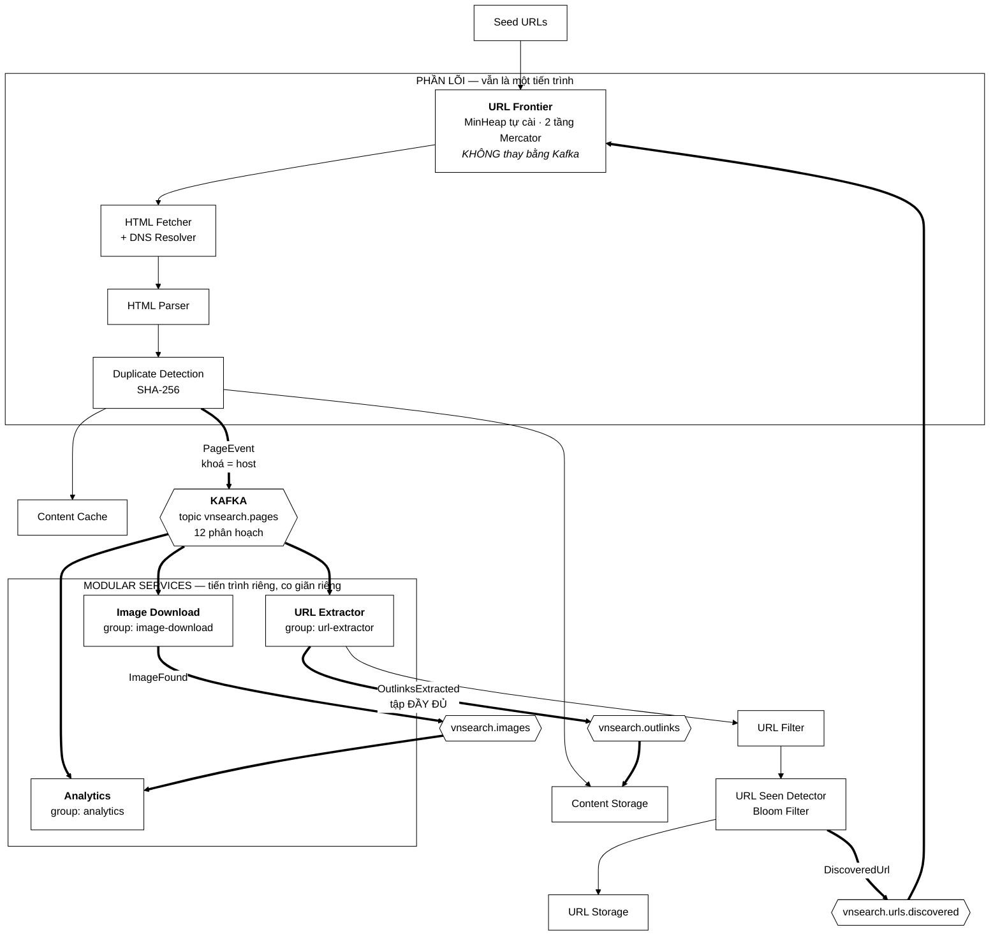
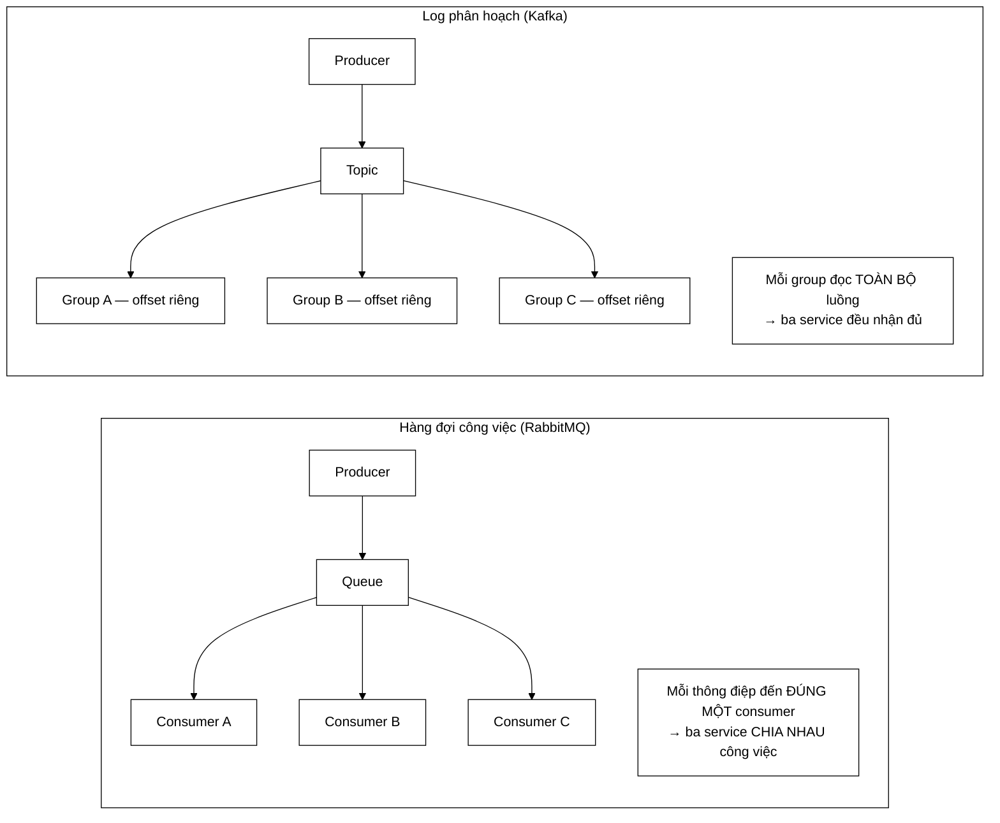
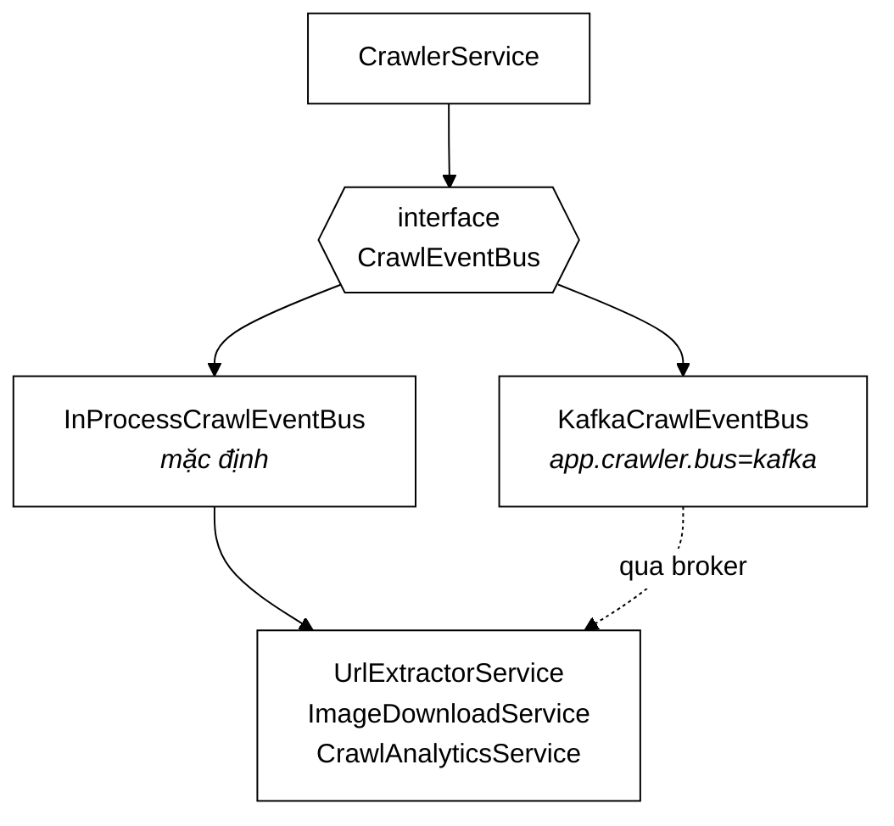

# Sơ đồ tư duy — Kafka và cụm Modular Services

> **Đọc trang này khi nào.** Bạn đã hiểu crawler một tiến trình
> ([`01-crawler/00-SO-DO-TU-DUY.md`](../01-crawler/00-SO-DO-TU-DUY.md)) và muốn
> biết vì sao phần sau khối *Duplicate Detection* lại bị cắt ra thành ba dịch
> vụ độc lập, nối với nhau bằng một hàng đợi thông điệp.

---

## 1. Bức tranh toàn cảnh



Bản ASCII cho ai đọc trên terminal:
```
   Seed URLs
       |
       v
  +---------------------------------------------------+
  |  PHẦN LÕI  (một tiến trình)                       |
  |                                                   |
  |  [URL Frontier] --> [Fetcher] --> [Parser]        |
  |    ^  MinHeap          |                          |
  |    |  2 tầng           v                          |
  |    |              [Duplicate Detection]           |
  +----|-------------------|--------------------------+
       |                   |
       |                   +---> Content Cache
       |                   +---> Content Storage <---------+
       |                   |                               |
       |                   v  PageEvent (khoá = host)      |
       |            ###############                        |
       |            #    KAFKA     #  vnsearch.pages       |
       |            ###############                        |
       |               |     |     |                       |
       |     +---------+     |     +---------+             |
       |     v               v               v             |
       |  [URL Extractor] [Image DL]   [Analytics]         |
       |     |               |               ^             |
       |     |               +-- ImageFound--+             |
       |     |                                             |
       |     +--> [URL Filter] --> [URL Seen?] --> Storage |
       |                              |                    |
       |          DiscoveredUrl       |    OutlinksExtracted
       +------------------------------+--------------------+
              (vòng lặp khép kín qua Kafka)
```

---

## 2. Câu hỏi trung tâm: **cắt ở đâu?**

Đây là quyết định thiết kế quan trọng nhất của cả phần này. Hai phương án đã
được cân nhắc và **một trong hai bị bác bỏ**.

### 2.1. Phương án bị bác bỏ — Kafka thay URL Frontier

Trực giác đầu tiên: "frontier là một hàng đợi, Kafka là một hàng đợi, thay
luôn". Sai, vì frontier **không phải** một hàng đợi thường. Nó phải làm hai
việc mà Kafka không làm được:

| Frontier phải làm | Kafka có làm được không |
|---|---|
| Hoãn theo host: chạm cùng một host tối đa 1 lần/giây | **Không.** Không có khái niệm "đưa cái này cho tôi sau 1 giây" |
| Sắp theo mức ưu tiên, không theo thứ tự ghi | **Không.** Mỗi phân hoạch trả đúng thứ tự đã ghi |

Và cái giá nếu vẫn làm: xoá mất `MinHeap` tự cài cùng cấu trúc hai tầng
Mercator — chính là **luận điểm DSA của đồ án**. Đây đúng là cái bẫy quen thuộc khi nghĩ tới Elasticsearch: đem một thư viện ngoài thế chỗ phần mình viết ra để chứng minh.

> Ô cam trong sơ đồ là ô **giữ nguyên**.

### 2.2. Phương án đã chọn — cắt sau Duplicate Detection

Nhìn vào những việc xảy ra **sau** khi một trang đã sạch:
```
bóc liên kết   ─┐
tải ảnh        ─┼─ ba việc ĐỘC LẬP NHAU, cùng cần một thứ: trang đã sạch
thống kê       ─┘
```

Ba việc này:
- không phụ thuộc kết quả của nhau;
- đều muốn đọc **toàn bộ** luồng trang, không phải chia nhau;
- có hồ sơ tài nguyên khác hẳn nhau (CPU / mạng / bộ nhớ).

Đó chính xác là hình dạng của bài toán **phát tán một-tới-nhiều**, và đó là
chỗ Kafka đúng.

---

## 3. Vì sao Kafka chứ không phải RabbitMQ

Câu hỏi này chắc chắn bị hỏi khi bảo vệ. Câu trả lời nằm ở **hình dạng của
luồng dữ liệu**, không phải ở việc công cụ nào "mạnh hơn".



| Tiêu chí | Kafka | RabbitMQ |
|---|---|---|
| **Phát tán tới 3 service** | Miễn phí: 3 consumer group | Phải nhân bản ra 3 hàng đợi và tự giữ đồng bộ |
| **Thêm service thứ 4** | Chỉ cần một `group.id` mới, **không sửa crawler** | Phải khai báo thêm hàng đợi + binding |
| **Chạy lại lịch sử** | Tua offset về đầu | Không: tiêu thụ xong là mất |
| **Phân hoạch theo khoá** | Có — nền tảng của phép chống trùng theo host | Không có khái niệm tương đương |
| Ack từng thông điệp | Không | Có |
| Hoãn / ưu tiên | Không | Có |

Hai dòng cuối là chỗ RabbitMQ mạnh hơn — và chúng là chuyện của **frontier**,
mà frontier thì ta đã quyết định giữ nguyên. Nên chúng không áp dụng ở đây.

**Năng lực "chạy lại" đáng giá bao nhiêu.** Sửa một luật lọc URL rồi tua
offset về đầu = bóc lại liên kết của cả một tuần crawl, **không tải lại một
trang nào**. Với một crawler thì đó là hàng giờ băng thông được tiết kiệm, và
là thứ một hàng đợi công việc về nguyên tắc không cho.

---

## 4. Bất biến trung tâm: **khoá phân hoạch = host**

Đây là chi tiết một dòng nhưng chống đỡ cả kiến trúc phân tán.

### 4.1. Vấn đề

`UrlSeenFilter` dùng một Bloom Filter **trong bộ nhớ tiến trình**. Một tiến
trình thì nó là nguồn sự thật duy nhất. Nhân lên N tiến trình thì mỗi bản có
một bộ lọc riêng — URL bản A đã ghi nhận thì bản B vẫn coi là mới. **Chống
trùng sập hoàn toàn.**

### 4.2. Ba cách chữa

| Cách | Đánh giá |
|---|---|
| Bloom Filter dùng chung trên Redis | Đúng, nhưng thêm một hệ thống phải vận hành và một vòng mạng trên đường nóng |
| Chấp nhận trùng, lọc lúc lập chỉ mục | Bác bỏ: phần lãng phí là **băng thông tải trang**, lọc muộn thì trang đã tải rồi |
| **Phân hoạch theo host** ✅ | Không thêm hệ thống nào, không thêm vòng mạng nào |

### 4.3. Vì sao cách thứ ba đủ
```
    Kafka:  thông điệp cùng khoá  ->  cùng phân hoạch
            một phân hoạch        ->  đúng MỘT consumer trong một group
            ─────────────────────────────────────────────────────────
    Suy ra: mọi URL của vnexpress.net  ->  luôn về ĐÚNG MỘT tiến trình
            ⇒ Bloom Filter của tiến trình đó là ĐẦY ĐỦ cho host ấy
```

**Phần thưởng kèm theo:** chính sách lịch sự cũng là thuộc tính theo host. Gom
một host về một tiến trình làm bộ hoãn 1 giây của `UrlFrontier` trở lại chính
xác trong môi trường nhiều tiến trình — không cần bộ điều phối phân tán nào.
Một quyết định, hai bài toán được giải.

> ⚠️ **Hệ quả phải nhớ.** Hàm băm của Kafka là `murmur2(key) % numPartitions`.
> Đổi số phân hoạch của một topic đang chạy = đổi mẫu số = **mọi host chuyển
> sang phân hoạch khác** và bộ lọc Bloom mất tính đúng. Đó là lý do
> `app.crawler.kafka.partitions` đặt sẵn **12** thay vì 3.

---

## 5. Vì sao có tới bốn topic

Câu hỏi hay bị hỏi: "`urls.discovered` và `outlinks` đều là danh sách URL của
một trang, sao không gộp?"

Vì chúng là **hai tập khác nhau**, và gộp lại thì một trong hai chắc chắn sai.

| | `vnsearch.urls.discovered` | `vnsearch.outlinks` |
|---|---|---|
| Đi tới | URL Frontier | Content Storage |
| Trả lời | "Nên crawl gì tiếp?" | "Trang này trỏ đi đâu?" |
| Đã lọc chưa | **Rồi** — qua URL Filter + URL Seen | **Chưa** — nguyên vẹn |
| Dùng cho | Vòng lặp crawl | PageRank |

**Vì sao PageRank cần tập CHƯA lọc.** `URL Seen Detector` loại mọi URL đã gặp
— mà đó chính là các trang **đã nằm trong corpus**, tức đúng những cạnh
PageRank cần đếm. Dùng tập đã lọc thì đồ thị mất gần hết cạnh nội bộ, mọi
trang có điểm gần như nhau, và PageRank thành một cột số vô nghĩa **mà vẫn
chạy trót lọt**.

Đó là loại hỏng tệ nhất: kết quả sai nhưng hệ thống vẫn xanh.

---

## 6. Hai chế độ, một đường mã



**Ba service KHÔNG biết Kafka tồn tại.** Chữ ký của `PageEventHandler.onPage`
không có `ConsumerRecord`, không có `Acknowledgment`, không có chú giải nào.
Toàn bộ phần dính broker nằm gọn trong `CrawlKafkaListeners` — một lớp chuyển
tiếp mỏng đến mức nhàm chán.

Ràng buộc đó **mua được ba thứ**:

1. **Test chạy không cần broker.** 521 bài test chạy trong khoảng 43 giây.
2. **Đồ án vẫn chạy trên một máy.** `run-crawl.bat` không đổi một dòng.
3. **Nó ép kiến trúc phải đúng.** Muốn cùng một service chạy được ở hai chế độ
   thì nó buộc phải sạch khỏi hạ tầng.

> Bản in-process **không phải** "bản rút gọn cho người nghèo". Nó là công cụ
> giữ cho phần lõi sạch.

---

## 7. Cái giá — nói thẳng

Không có gì miễn phí. Ba chi phí thật của việc tách service:

| Chi phí | Con số | Bù lại bằng gì |
|---|---|---|
| **Dựng DOM hai lần** | ~3–8 ms/trang | Một đường mã cho cả hai chế độ. Đường tắt "nếu in-process thì truyền thẳng `Document`" sẽ tạo một nhánh chỉ chạy ở môi trường thật — tức nhánh không được test |
| **Thông điệp lớn** | ~80 KB HTML/trang | Nén lz4 theo lô: còn ~11 KB. Trần nâng lên 4 MB, phải khớp cả producer lẫn broker |
| **Một hệ thống nữa phải vận hành** | Kafka + 1 chế độ hỏng mới | Chỉ trả khi bật `app.crawler.bus=kafka`. Mặc định không có gì đổi |

---

## 7b. Một lỗi mà chỉ broker thật mới thấy

Đây là bằng chứng cụ thể nhất cho lập luận ở §6 — vì sao phải có cả hai chế độ,
và vì sao chế độ in-process **không đủ**.

Lần chạy đầu tiên của `KafkaCrawlBusIT`:
```
UnrecognizedPropertyException: Unrecognized field "downloaded"
  (class ImageFound), not marked as ignorable
  (8 known properties: "pageUrl", "declaredHeight", "imageUrl", ...)
```

**Nguyên nhân.** `ImageFound` là một `record` với 8 component, cộng một phương
thức tiện ích `isDownloaded()`. Jackson coi **mọi** phương thức dạng `isXxx()`
là một thuộc tính đọc được, nên nó ghi ra JSON 9 trường:

```json
{ "pageUrl": "...", ..., "contentHash": null, "downloaded": false }
                                              └─ không phải component nào cả
```

Khi consumer đọc lại, Jackson gặp `"downloaded"` và không biết đặt nó vào đâu →
ném ngoại lệ.

**Hậu quả nếu lọt.** Mọi thông điệp ảnh chết ở consumer, thử lại 3 lần, rồi rơi
vào dead-letter topic. Cảnh báo `VnSearchDeadLetterGrowing` sẽ bắn — nhưng chỉ
sau khi đã mất toàn bộ dữ liệu ảnh của một phiên crawl.

**Vì sao bộ test in-process không thể thấy.** Ở chế độ đó, `bus.publishImage()`
truyền thẳng tham chiếu đối tượng sang handler. Không có bước serialize nào.
Không có gì để hỏng.
```
in-process:   ImageFound ──────────────────▶ handler      (không serialize)
Kafka:        ImageFound ──JSON──▶ broker ──JSON──▶ handler
                          ▲                  ▲
                          └── chỗ hỏng ──────┘
```

**Đã sửa hai lớp:**

1. `@JsonIgnore` trên mọi accessor dẫn xuất của cả bốn thông điệp.
2. **Kéo phép kiểm về bộ test nhanh** — `CrawlEventTest.JsonRoundTrip`, 8 bài,
   chạy trong vài mili-giây, không cần Docker. Trong đó
   `noDerivedFieldLeaksIntoTheJson` liệt kê chính xác tập trường được phép có
   trong mỗi thông điệp, nên thêm một accessor mà quên `@JsonIgnore` sẽ đỏ
   ngay ở `mvnw test`.

Điểm thứ hai mới là bài học thật. Một lỗi bị bắt bởi cổng chậm nhất và đắt nhất
thì lần sau vẫn sẽ bị bắt muộn — trừ khi ta chuyển phép kiểm về cổng rẻ nhất.

---

## 8. Bảng ánh xạ: khối trong sơ đồ ↔ lớp trong mã

| Khối | Lớp / tệp |
|---|---|
| Kafka (ô xanh) | [`CrawlEventBus`](../../../search-engine/src/main/java/com/vnsearch/crawler/bus/CrawlEventBus.java) → `InProcessCrawlEventBus` \| `KafkaCrawlEventBus` |
| Thông điệp | `PageEvent`, `DiscoveredUrl`, `OutlinksExtracted`, `ImageFound` |
| URL Extractor | [`UrlExtractorService`](../../../search-engine/src/main/java/com/vnsearch/crawler/modular/UrlExtractorService.java) |
| Image Download | [`ImageDownloadService`](../../../search-engine/src/main/java/com/vnsearch/crawler/modular/ImageDownloadService.java) — **mới** |
| Analytics Service | [`CrawlAnalyticsService`](../../../search-engine/src/main/java/com/vnsearch/crawler/modular/CrawlAnalyticsService.java) — **mới** |
| Nối dây Kafka | `KafkaCrawlConfig`, `CrawlKafkaListeners` |
| Đường quay về Frontier | `CrawlerService.acceptDiscoveredUrl` / `acceptOutlinks` |

---

## 9. Thực hành — chạy thử từng bước

### 9.1. Chế độ mặc định (không cần Kafka)

```bash
run-crawl.bat 200 2 data/thu-nghiem.json --fresh
```

Không có gì đổi so với trước. Ba Modular Service chạy in-process; số liệu nằm
trong `SimpleMeterRegistry` và in ra cuối phiên.

### 9.2. Bật chế độ phân tán

```bash
docker compose --profile kafka up -d --build
```

Mở <http://localhost:8081> (kafka-ui) → xem topic `vnsearch.pages` lớn dần
trong lúc crawl.

**Kiểm chứng bất biến khoá phân hoạch:** vào một topic → cột `Key` phải là
host, và mọi bản ghi cùng host phải cùng `Partition`.

### 9.3. Bật giám sát

```bash
docker compose --profile kafka --profile monitoring up -d --build
```

| Địa chỉ | Thứ cần nhìn |
|---|---|
| <http://localhost:3000> | Grafana (admin/admin) — bảng *VnSearch* |
| <http://localhost:9090/alerts> | Prometheus — 7 quy tắc, trạng thái từng cái |
| <http://localhost:9093> | Alertmanager — nhóm cảnh báo |

**Thí nghiệm đáng làm:** dừng backend (`docker compose stop backend`), chờ 2
phút, xem `VnSearchBackendDown` chuyển từ *Inactive* → *Pending* → *Firing*.
Đó là cả chuỗi quan sát chạy thật, không phải mô tả trên giấy.

### 9.4. Chạy test tích hợp Kafka

```bash
cd search-engine
./mvnw verify -Pkafka-it      # cần Docker đang chạy
```

---

## 10. Giới hạn đã biết của kiến trúc này

1. **Kafka một node, không sao lưu.** Đủ cho đồ án; cụm thật cần tối thiểu ba
   node hoặc một dịch vụ quản trị sẵn. Đã ghi ngay đầu `kafka.yaml`.
2. **Bloom Filter mất khi worker khởi động lại** → một số URL bị xếp hàng lại.
   Không mất dữ liệu, chỉ tốn băng thông. Đóng hẳn cần bộ lọc lưu bền.
3. **Số phân hoạch không tăng được sau khi chạy** mà không phá phép băm theo
   host. Đây là ràng buộc thật, không phải thiếu sót — nhưng nó chặn trần mở
   rộng ở 12 tiến trình.

---

## 11. Đọc tiếp

- [`01-crawler/00-SO-DO-TU-DUY.md`](../01-crawler/00-SO-DO-TU-DUY.md) — crawler một tiến trình, phần lõi
- [`../../DEVOPS.md`](../../DEVOPS.md) — hạ tầng, giám sát, CI/CD
- [`08-design-patterns/01-STRATEGY.md`](../08-design-patterns/01-STRATEGY.md) — `CrawlEventBus` là một Strategy nữa
