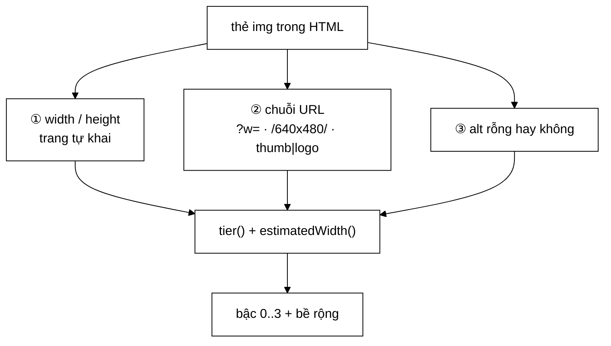

# ImageQuality — chọn một tấm ảnh đại diện cho trang

> **Lớp:** `crawler/modular/ImageQuality.java` (221 dòng, toàn bộ `static`)
> **Đọc trước:** [`00-SO-DO-TU-DUY.md`](00-SO-DO-TU-DUY.md) §2–§3
>
> **Bài toán.** Một trang báo có 40 thẻ ``. Chọn đúng **một** tấm làm ảnh
> đại diện, chỉ dựa vào những gì HTML nói — **không tải ảnh về**, không đọc
> pixel, không gọi mô hình thị giác nào.

---

## 1. Ràng buộc quyết định toàn bộ thiết kế

Thuật toán chạy **trên đường chạy nóng của crawler**, cho mỗi ảnh của mỗi
trang. Với 31.030 trang × ~40 ảnh ≈ **1,2 triệu lượt gọi**. Nên:

| Không được phép | Vì sao |
|---|---|
| Tải ảnh về để đo | Nhân đôi băng thông crawl, mở rộng bề mặt SSRF |
| Giải mã header ảnh | Vẫn phải tải ít nhất vài KB đầu mỗi ảnh |
| Gọi mô hình phân loại | Chi phí sai bậc độ lớn |



Còn lại đúng **ba nguồn thông tin**, tất cả đều đã có sẵn trong HTML:

```
   ① thuộc tính width/height trang tự khai
   ② chuỗi URL của ảnh
   ③ thuộc tính alt có rỗng hay không
```

Cả ba đều là **tín hiệu gián tiếp** và đều có thể sai. Thiết kế phải chịu được
việc từng tín hiệu vắng mặt — và đó là lý do có bậc "không biết" (§4).

---

## 2. Hàm quyết định

```java
public static boolean isBetter(ImageFound candidate, ImageFound current) {
    return compare(candidate, current) > 0;
}
```

`compare` xét ba tiêu chí theo thứ tự từ điển, dừng ngay khi phân định được:

$$
\text{compare}(a,b) =
\begin{cases}
\text{tier}(a) - \text{tier}(b) & \text{nếu khác bậc} \\[4pt]
w(a) - w(b) & \text{nếu cùng bậc, khác bề rộng} \\[4pt]
[\,\lnot\text{missingAlt}(a)\,] - [\,\lnot\text{missingAlt}(b)\,] & \text{còn lại}
\end{cases}
$$

Đây là **thứ tự từ điển trên bộ ba** $(\text{tier}, w, \text{hasAlt})$ — không
phải tổ hợp tuyến tính. Lý do đã nói ở
[sơ đồ tư duy §3](00-SO-DO-TU-DUY.md#3-vì-sao-chia-bậc-chứ-không-cộng-điểm):
ba đại lượng không cùng đơn vị nên không có tỉ giá nào đúng.

---

## 3. Bốn bậc

```java
TIER_SIZED_CONTENT = 3   // ảnh nội dung, BIẾT là đủ lớn
TIER_UNKNOWN       = 2   // ảnh nội dung, không có tín hiệu kích thước
TIER_SMALL         = 1   // có tín hiệu kích thước, nhưng nhỏ
TIER_DECORATIVE    = 0   // trang trí
```

Cây quyết định:

```
                    tier(image)
                         │
        ┌────────────────▼────────────────┐
        │ URL khớp DECORATIVE_EXTENSION   │  .svg .gif .ico .bmp
        │      HOẶC DECORATIVE_PATH ?     │  thumb|icon|logo|avatar|…
        └────────┬───────────────┬────────┘
              có │               │ không
                 ▼               ▼
            TIER_DECORATIVE   w = estimatedWidth(image)
                 = 0               │
                          ┌────────▼────────┐
                          │     w ≤ 0 ?     │
                          └───┬─────────┬───┘
                           có │         │ không
                              ▼         ▼
                       TIER_UNKNOWN   w ≥ 200 ?
                            = 2       ┌──┴──┐
                                   có │     │ không
                                      ▼     ▼
                          TIER_SIZED_CONTENT  TIER_SMALL
                                = 3              = 1
```

### 3.1. Hai tín hiệu âm, và độ phủ đo được

| Mẫu | Bắt gì | Độ phủ corpus |
|---|---|---:|
| `DECORATIVE_EXTENSION` | `.svg` `.gif` `.ico` `.bmp` | **12%** |
| `DECORATIVE_PATH` | `thumb` `icon` `logo` `avatar` `sprite` `placeholder` `blank` `banner` `badge` `button` `favicon` `watermark` `1x1` `pixel` `spacer` | **24,3%** |

- **`.svg`** là đồ hoạ vector — logo, icon, biểu đồ giao diện. Không bao giờ là
  ảnh bài báo.
- **`.gif`** ở web hiện đại hầu hết là ảnh động nhỏ hoặc **pixel theo dõi**
  1×1.
- `DECORATIVE_PATH` là tín hiệu âm **có độ phủ lớn nhất**, và là thứ **duy
  nhất** bắt được logo ở những trang không khai báo kích thước gì cả.

> **Vì sao khớp trên URL chứ không trên tên tệp.** Từ khoá có thể nằm ở bất kỳ
> đâu: `/assets/logo/header.png`, `/img/header-logo.png`, `?type=thumb`. Khớp
> trên toàn chuỗi đã hạ chữ thường bắt được cả ba.

---

## 4. Vì sao `TIER_UNKNOWN` nằm **giữa**, không nằm đáy

Đây là quyết định phản trực giác nhất của lớp này.

**60,7% ảnh trong corpus không có tín hiệu kích thước nào.** Không phải vì
chúng đáng ngờ — mà vì rất nhiều trang đơn giản là không khai `width`/`height`
và không dùng CDN gắn `?w=`.

Nếu xếp chúng xuống đáy:

```
   icon.png  khai width="120"     →  TIER_SMALL = 1
   anh-bai.jpg  không khai gì     →  TIER_UNKNOWN = 0  ← nếu xếp đáy
                                      ⇒ ICON THẮNG
```

Đặt `TIER_UNKNOWN = 2` (trên `TIER_SMALL = 1`) chữa đúng ca đó. Nguyên tắc
tổng quát: **thiếu thông tin không phải là bằng chứng xấu.** Một tín hiệu vắng
mặt chỉ nên làm ta *kém chắc chắn*, không nên bị tính là điểm trừ.

---

## 5. Ước lượng bề rộng — ba nguồn, xếp theo độ tin cậy

```java
static int estimatedWidth(ImageFound image) {
    if (image.declaredWidth() > 0) return image.declaredWidth();   // ①
    // ② tham số truy vấn của CDN
    // ③ kích thước nhúng trong đường dẫn
    return 0;                                                       // không suy ra được
}
```

| # | Nguồn | Mẫu | Ví dụ khớp |
|---|---|---|---|
| ① | Thuộc tính HTML | `declaredWidth()` | `` |
| ② | Tham số CDN | `[?&](?:w\|width\|rw\|mw)=(\d{2,4})` | `?w=680`, `&width=1200` |
| ③ | Nhúng trong đường dẫn | `[_\-/](\d{3,4})x(\d{3,4})[_\-./]` | `/640x480/`, `_1200x630.jpg` |

**Thứ tự ưu tiên có lý do:** ① là thứ **chính trang đó tự nói** về ảnh của
mình, đáng tin nhất. ② đáng tin gần bằng vì CDN ảnh của báo Việt Nam gắn `?w=`
rất đều tay và con số đó **chính là** bề rộng bản đã cắt. ③ chỉ là quy ước đặt
tên, có thể là kích thước gốc chứ không phải bản đang phục vụ.

**Về giới hạn số chữ số trong mẫu regex.** `\d{2,4}` ở ② và `\d{3,4}` ở ③ không
phải tuỳ tiện — chúng chặn việc bắt nhầm số khác trong URL: dấu thời gian, id
bài viết, năm tháng. Một URL kiểu `/2024/11/anh.jpg?v=1730000000` không có bề
rộng nào cả, và mẫu hẹp giữ cho nó trả về 0 thay vì `1730`.

---

## 6. Ngưỡng 200px đến từ đâu

`MIN_CONTENT_WIDTH = 200`, suy từ **đo trên corpus thật**:

```
   ảnh bài báo hẹp nhất gặp được   ~300–400 px
   logo đo được                     100×42  và  236×61
                                    ─────────────────────
   ngưỡng đặt ở              200 px  ← chừa biên an toàn cho ảnh chân dung hẹp
```

Chọn 200 chứ không phải 300: một ảnh chân dung dọc trong bài phỏng vấn có thể
hẹp hơn ảnh ngang thông thường. Đặt sát 300 sẽ đẩy nhầm chúng xuống
`TIER_SMALL`.

Chọn 200 chứ không phải 100: logo `236×61` sẽ lọt qua. Ngưỡng phải nằm **trên**
kích thước logo lớn nhất quan sát được.

> Đây là một hằng số **được hiệu chỉnh theo dữ liệu**, không phải hằng số phổ
> quát. Đổi corpus sang nguồn khác (báo nước ngoài, blog, thương mại điện tử)
> thì phải đo lại. Cách đo: xuất `estimatedWidth` của toàn kho ảnh, vẽ histogram,
> tìm chỗ trũng giữa hai cụm.

---

## 7. Bất biến: hoà thì giữ tấm cũ

```java
return compare(candidate, current) > 0;   // > 0, KHÔNG phải >= 0
```

Ở chế độ Kafka, thứ tự `ImageFound` của cùng một trang đến `ImageStore` là
**không xác định**. Quy tắc "hoà thì giữ tấm đã có" làm cho kết quả cuối cùng
**độc lập với thứ tự nạp**.

Chứng minh phác: gọi $\preceq$ là quan hệ "không hơn" sinh bởi `compare`. Vì
`compare` là hiệu từ điển của ba đại lượng **chỉ phụ thuộc bản thân ảnh**
(không phụ thuộc trạng thái kho), $\preceq$ là một **tiền thứ tự toàn phần**.
Phép `reduce` với toán tử "giữ phần tử lớn hơn hẳn, hoà thì giữ trái" trên một
tiền thứ tự toàn phần cho ra **cùng một lớp tương đương cực đại** bất kể thứ tự
duyệt. Nếu lớp cực đại có nhiều phần tử, quy tắc "giữ trái" chọn phần tử **đến
trước** — và tập ảnh của một trang là cố định, nên tập đến-trước cũng cố định
với mỗi lần crawl.

Đổi thành `>=` là mất ngay tính chất này: hai tấm ngang điểm sẽ liên tục thay
nhau, và tấm cuối cùng còn lại phụ thuộc tấm nào đến sau.

---

## 8. Điều lớp này **không** làm

Nói rõ để không ai đi tìm nhầm chỗ:

1. **Không phát hiện trùng ảnh.** Hai trang dùng chung một ảnh thì cả hai đều
   giữ nó. `contentHash` có trong `ImageFound` nhưng chỉ được điền khi
   `images.download=true`.
2. **Không xét nội dung ảnh.** Một tấm 1200px toàn màu trắng vẫn thắng.
3. **Không xét quan hệ với truy vấn.** Lớp này chạy lúc crawl, khi chưa có
   truy vấn nào. Việc gắn ảnh với truy vấn do `ImageSearchController` làm, qua
   thứ hạng của **trang** chứa ảnh.
4. **Không xử lý ca "cả trang chỉ toàn ảnh trang trí".** Tấm "tốt nhất" của
   trang đó vẫn là một cái logo. Ca này được chữa ở bước ③ của
   `ImageSearchController` — sắp xếp ổn định theo `missingAlt` để đẩy những
   trang như vậy xuống cuối lưới.

---

## 9. Đọc tiếp

- [`00-SO-DO-TU-DUY.md`](00-SO-DO-TU-DUY.md) — toàn tầng ảnh
- [`../05-datastructures/00-SO-DO-TU-DUY.md`](../05-datastructures/00-SO-DO-TU-DUY.md)
  — vì sao `ImageStore` dùng `ConcurrentHashMap` phẳng
- [`../../CONFIGURATION.md`](../../CONFIGURATION.md) §9 — ba khoá cấu hình ảnh
