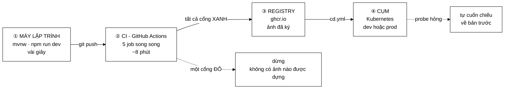
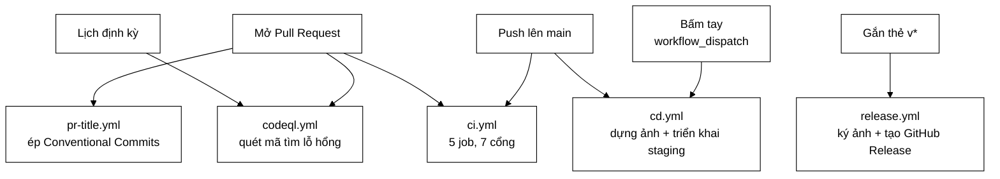
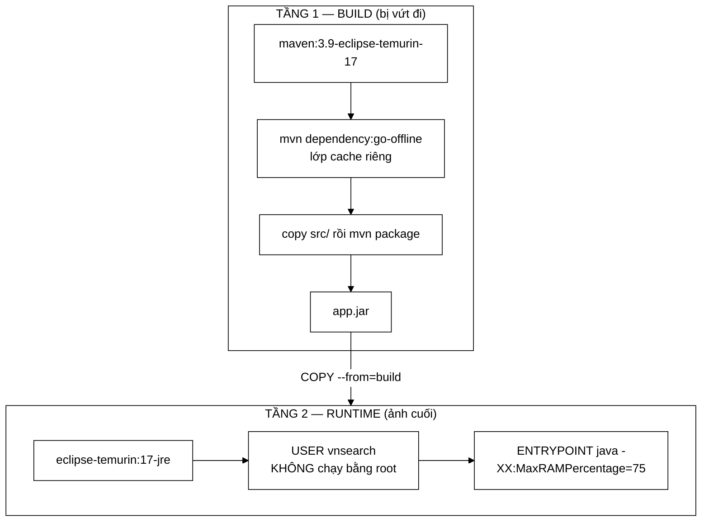
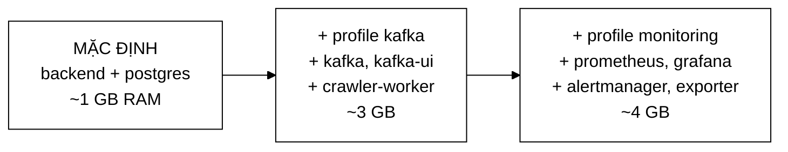
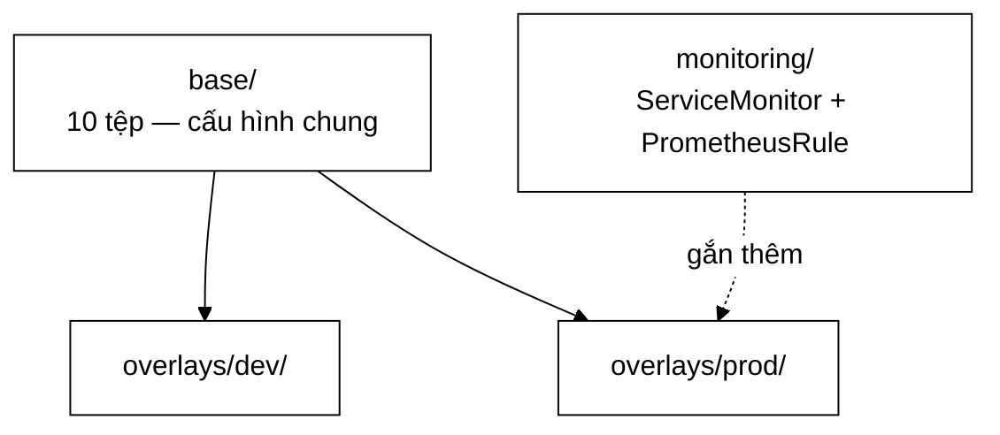
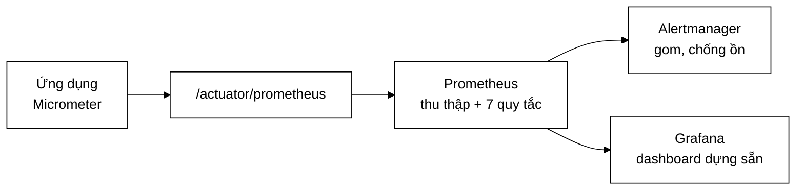
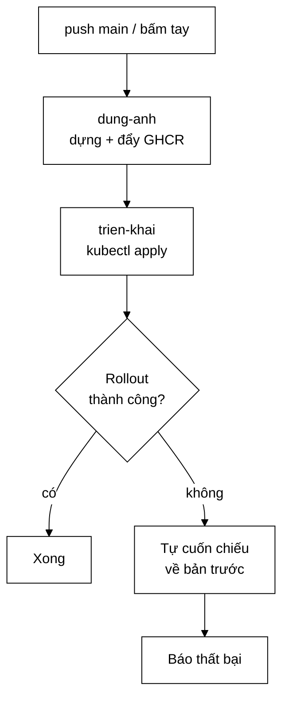

# Sơ đồ tư duy — từ commit tới cụm

> **Tài liệu này là gì?** Điểm vào của toàn bộ phần vận hành: **5 workflow**
> trong `.github/workflows/`, `Dockerfile` hai tầng, `docker-compose.yml` ba
> mức, **24 tệp** trong `deploy/`.
>
> **Câu hỏi trung tâm:** một dòng mã vừa gõ xong phải đi qua bao nhiêu cửa mới
> chạy được trên cụm — và **mỗi cửa chặn đúng loại lỗi nào**?
>
> Phần tổng quan ngắn hơn nằm ở [`DEVOPS.md`](../../DEVOPS.md). Trang này đi
> vào từng tệp.

---

## 1. Bức tranh lớn nhất — bốn chặng



```
  ①  MÁY            ②  CI                ③  REGISTRY        ④  CỤM
  ────────          ─────────            ───────────        ────────
  mvnw test         5 job song song      ghcr.io            kubectl
  npm run dev  ──▶  7 cổng chặn     ──▶  ảnh đã ký     ──▶  dev / prod
  vài giây          ~8 phút              theo digest        + tự cuốn chiếu
                         │
                         └── một cổng đỏ ⇒ DỪNG, không dựng ảnh
```

---

## 2. Năm workflow — ai chạy khi nào



| Workflow | Kích hoạt khi | Việc chính | Dòng |
|---|---|---|---:|
| `ci.yml` | PR, push `main` | **5 job song song**, 7 cổng chặn | ~21 KB |
| `cd.yml` | push `main`, bấm tay | Dựng ảnh → đẩy registry → triển khai + **cuốn chiếu nếu hỏng** | ~13 KB |
| `release.yml` | gắn thẻ `v*` | Kiểm tra → **ký ảnh** → tạo GitHub Release | ~10 KB |
| `codeql.yml` | PR, định kỳ | Phân tích tĩnh tìm lỗ hổng (chạy JDK 17) | ~3,7 KB |
| `pr-title.yml` | PR | Ép tiêu đề PR theo Conventional Commits | ~2 KB |

---

## 3. `ci.yml` — 5 job và 7 cổng chặn

```mermaid
%%{init:{'theme':'base','themeVariables':{'background':'#ffffff','primaryColor':'#ffffff','primaryTextColor':'#000000','primaryBorderColor':'#000000','secondaryColor':'#ffffff','secondaryTextColor':'#000000','secondaryBorderColor':'#000000','tertiaryColor':'#ffffff','tertiaryTextColor':'#000000','tertiaryBorderColor':'#000000','lineColor':'#000000','textColor':'#000000','mainBkg':'#ffffff','nodeBorder':'#000000','clusterBkg':'#ffffff','clusterBorder':'#000000','edgeLabelBackground':'#ffffff','actorBkg':'#ffffff','actorBorder':'#000000','actorTextColor':'#000000','actorLineColor':'#000000','signalColor':'#000000','signalTextColor':'#000000','labelBoxBkgColor':'#ffffff','labelBoxBorderColor':'#000000','labelTextColor':'#000000','loopTextColor':'#000000','noteBkgColor':'#ffffff','noteBorderColor':'#000000','noteTextColor':'#000000','sequenceNumberColor':'#ffffff','fontFamily':'ui-monospace, SFMono-Regular, Consolas, monospace'}}}%%
flowchart TD
    TRIG["PR hoặc push main"]

    TRIG --> B["backend<br/>Java 21"]
    TRIG --> F["frontend<br/>Electron + TS"]
    TRIG --> I["image<br/>Docker + Trivy"]
    TRIG --> K["kafka-integration<br/>Testcontainers"]
    TRIG --> N["infrastructure<br/>kubeconform + promtool"]

    B --> B1["640 test JUnit"]
    B --> B2["JaCoCo: line ≥ 68%, branch ≥ 65%"]
    B --> B3["SpotBugs: 0 bug"]
    B --> B4["Chất lượng xếp hạng"]

    F --> F1["typecheck"]
    F --> F2["eslint"]
    F --> F3["128 test Vitest"]

    I --> I1["Chặn lệch schema.sql"]
    I --> I2["Dựng ảnh"]
    I --> I3["Quét Trivy → tab Security"]

    K --> K1["Broker thật trong container"]

    N --> N1["Dựng cả 3 lớp kustomize"]
    N --> N2["Đối chiếu lược đồ K8s"]
    N --> N3["promtool: cấu hình + 7 quy tắc"]
    N --> N4["Kiểm định compose ở 3 mức"]
    N --> N5["Chặn lệch 2 bản quy tắc cảnh báo"]
```



### 3.1. Bảy cổng chặn, và mỗi cổng bắt loại lỗi nào

| # | Cổng | Bắt loại lỗi mà cổng khác **không** bắt được | Job |
|---|---|---|---|
| 1 | **640 test Java** | Logic từng khối sai | `backend` |
| 2 | **Độ phủ JaCoCo** | Mã mới **không có test** — line ≥ 68%, branch ≥ 65% | `backend` |
| 3 | **SpotBugs** | Lỗi mà test **không chạy tới**: null, tài nguyên rò, so sánh sai | `backend` |
| 4 | **Chất lượng xếp hạng** | Tìm kiếm **tệ đi** mà test đơn vị vẫn xanh | `backend` |
| 5 | **128 test Vitest** | Hành vi frontend, gồm ranh giới bảo mật `urlPolicy` | `frontend` |
| 6 | **Tích hợp Kafka** | Serialize hỏng, phân hoạch sai, thông điệp quá lớn — **chỉ broker thật mới thấy** | `kafka-integration` |
| 7 | **Kiểm định manifest** | YAML sai lược đồ, quy tắc cảnh báo sai cú pháp | `infrastructure` |

**Cổng 4 là cổng đáng học nhất.** Test đơn vị kiểm *hàm chấm điểm trả đúng số
không*; nó không kiểm *kết quả tìm kiếm có tốt lên hay không*. Một thay đổi
trọng số hoàn toàn có thể giữ mọi test xanh trong khi chất lượng tụt. Cổng này
chạy bộ đánh giá và so với ngưỡng — xem [`EVALUATION.md`](../../EVALUATION.md).

**Cổng 6 chỉ tồn tại vì có lỗi thật lọt qua.** Ở chế độ `memory`, bus gọi hàm
trực tiếp nên không có bước serialize nào. Mọi lỗi liên quan tới việc biến
thông điệp thành byte đều vô hình cho tới khi có broker thật.

### 3.2. Vì sao 5 job **song song** chứ không nối tiếp

```
   NỐI TIẾP (không dùng)              SONG SONG (đang dùng)
   ═══════════════════════            ══════════════════════
   backend    ████████ 4'             backend         ████████ 4'
   frontend        ██ 1'              frontend        ██ 1'
   image            ████ 2'           image           ████ 2'
   kafka                ████ 2'       kafka           ████ 2'
   infra                  █ 0,5'      infra           █ 0,5'
                                      ──────────────────────
   tổng ≈ 9,5 phút                    tổng ≈ 4 phút (job dài nhất)
```

Đổi lại: tốn nhiều runner hơn cùng lúc, và **không dừng sớm** — frontend vẫn
chạy hết dù backend đã đỏ. Đánh đổi này đúng vì thời gian chờ của người mở PR
đắt hơn phút runner.

`concurrency` với `cancel-in-progress: true` bù lại phần lãng phí: push lần hai
lên cùng nhánh sẽ **huỷ** lượt chạy đang dở.

---

## 4. `Dockerfile` — hai tầng, và vì sao



```
   TẦNG 1  maven:3.9-temurin-17      ~800 MB   ◀── có Maven, có mã nguồn,
      │    mvn package                             có toàn bộ .m2 cache
      │                                            KHÔNG đi vào ảnh cuối
      ▼    app.jar
   ┌───────────────┐
   │ COPY --from   │
   └───────┬───────┘
           ▼
   TẦNG 2  temurin-17-jre            ~200 MB   ◀── chỉ JRE + app.jar
           USER vnsearch                            không Maven
           MaxRAMPercentage=75                      không mã nguồn
```

**Ba quyết định trong tệp này:**

1. **`dependency:go-offline` tách thành lớp riêng** trước khi copy `src/`.
   Docker cache theo lớp; sửa một dòng Java **không** làm tải lại toàn bộ
   dependency.

2. **`USER vnsearch`** — không chạy bằng root. Kết hợp với
   `readOnlyRootFilesystem` ở K8s: một lỗ hổng RCE cũng không ghi được gì vào
   hệ thống tệp.

3. **`-XX:MaxRAMPercentage=75` chứ không `-Xmx`.** Trong container, JVM mặc
   định lấy 1/4 RAM **của máy chủ**, không phải của container — dẫn tới hoặc
   phí RAM, hoặc bị OOMKilled. Tham số này bảo JVM đọc giới hạn cgroup.

---

## 5. `docker-compose.yml` — ba mức, bật thêm bằng profile



| Lệnh | Được gì | RAM |
|---|---|---|
| `docker compose up -d --build` | backend + postgres | ~1 GB |
| `--profile kafka` | + Kafka, kafka-ui, crawler-worker riêng | ~3 GB |
| `--profile kafka --profile monitoring` | + Prometheus, Grafana, Alertmanager | ~4 GB |

> **Vì sao mặc định là mức nhẹ nhất.** Cùng nguyên tắc với
> `app.crawler.bus=memory`: thứ gì không cần để chạy dòng đầu tiên thì không
> được là điều kiện bắt buộc. Người mới clone repo phải chạy được ngay trên
> máy 8 GB.

---

## 6. Kubernetes — Kustomize ba lớp



```
   deploy/k8s/
   ├── base/                    ← nguồn duy nhất, KHÔNG deploy trực tiếp
   │   ├── namespace.yaml
   │   ├── backend.yaml         Deployment + Service + probe
   │   ├── postgres.yaml        StatefulSet
   │   ├── kafka.yaml
   │   ├── crawler-worker.yaml
   │   ├── ingress.yaml
   │   ├── configmap.yaml
   │   ├── secret.yaml          ← chỉ placeholder ở dev
   │   ├── schema.sql
   │   └── kustomization.yaml
   ├── overlays/
   │   ├── dev/                 1 bản sao · không HPA · ảnh build cục bộ
   │   └── prod/                3 bản sao · HPA 2–6 · ảnh ghim theo thẻ
   └── monitoring/              ServiceMonitor + 7 quy tắc cảnh báo
```

| | `overlays/dev` | `overlays/prod` |
|---|---|---|
| Số bản sao | 1 | 3, trải trên các node |
| Tự co giãn | tắt (kind không có metrics-server) | HPA, 2–6 pod ở 70% CPU |
| Bí mật | tệp placeholder trong Git | tạo ngoài luồng, **không bao giờ commit** |
| Ảnh | build cục bộ, `kind load` | thẻ ghim từ GHCR |
| Scorer | `tfidf` | `bm25` |

**Backend chạy dưới chính sách `restricted`:** không root, hệ thống tệp gốc chỉ
đọc, có `startupProbe`/`readinessProbe`/`livenessProbe`, có
`PodDisruptionBudget`, và một `NetworkPolicy` chỉ cho pod backend nói chuyện
với Postgres.

> **Vì sao cần cả ba loại probe.** `startupProbe` cho phép khởi động chậm (nạp
> chỉ mục mất hàng chục giây) mà không bị `liveness` giết oan;
> `readinessProbe` giữ pod ngoài load balancer cho tới khi chỉ mục sẵn sàng;
> `livenessProbe` khởi động lại pod đã treo. Thiếu `startupProbe` là gặp vòng
> lặp khởi động lại vô hạn trên corpus lớn.

---

## 7. Chuỗi quan sát — 4 chặng



### 7.1. Bảy quy tắc cảnh báo

| Cảnh báo | Bắn khi | Vì sao cần |
|---|---|---|
| `VnSearchBackendDown` | Không thu thập được thang đo | Chết hẳn |
| `VnSearchEmptyIndex` | Chỉ mục rỗng | Chạy nhưng **vô dụng** — `/api/health` trả 503 |
| `VnSearchSearchLatencyHigh` | p99 vượt ngưỡng | Chậm dần, không chết |
| `VnSearchHighErrorRate` | Tỉ lệ 5xx cao | Hỏng một phần |
| `VnSearchCrawlBusFailing` | Bus lỗi | Crawl đứng mà API vẫn xanh |
| `VnSearchKafkaConsumerLagHigh` | Consumer tụt hậu | Xử lý chậm hơn tốc độ sinh |
| `VnSearchDeadLetterGrowing` | Dead-letter tăng | Thông điệp hỏng đang bị vứt |

**`VnSearchEmptyIndex` là quy tắc đáng học nhất.** Nó bắt trạng thái mà cả
`up` lẫn tỉ lệ lỗi đều **không** bắt được: tiến trình sống, HTTP trả 200, chỉ
là không có gì để tìm. Nếu chỉ theo dõi "còn sống hay không", trạng thái này
im lặng hoàn toàn.

### 7.2. Vì sao đo phân vị chứ không đo trung bình

```
   Trung bình 20 ms — nghe rất tốt
   ├─────────────────────────────────────────────────────┐
   │ ████████████████████████████████░░░░░░░░░░░░░░░░░░░ │
   └─────────────────────────────────────────────────────┘
     p50 = 12 ms          p95 = 80 ms         p99 = 3 GIÂY
                                              ▲
                                              └── trung bình giấu mất phần này
```

Cấu hình đẩy **cả histogram** sang Prometheus chứ không chỉ giá trị phân vị đã
tính. Lý do toán học: **phân vị không cộng dồn được** — trung bình của hai p99
không phải p99 của tổng. Có histogram thì Prometheus gộp được phân vị từ nhiều
bản sao.

---

## 8. `cd.yml` — triển khai và cuốn chiếu



Bước cuốn chiếu có `if: failure()` — nó **chỉ** chạy khi bước triển khai hỏng.
Đây là chỗ dễ viết sai nhất trong cả tệp: thiếu điều kiện thì cuốn chiếu chạy
cả khi thành công.

---

## 9. Một cái bẫy đã làm treo mọi PR

`required_status_checks` của branch protection ghim theo **TÊN job**.

```
   .github/workflows/ci.yml          Cài đặt branch protection
   ────────────────────────          ─────────────────────────
   name: Backend (Java 17)     ═══   Backend (Java 17)   ✓ khớp

   đổi thành ↓                       quên đổi ↓
   name: Backend (Java 21)     ═/═   Backend (Java 17)   ✗ LỆCH
                                            │
                                            ▼
                            mọi PR treo mãi ở
                     "Expected — Waiting for status to be reported"
```

Không có lỗi nào hiện ra — PR chỉ đơn giản là **không bao giờ** đủ điều kiện
merge. Vì vậy việc đổi tên job phải làm **trước** khi bật branch protection,
hoặc phải cập nhật cả hai nơi cùng lúc.

---

## 10. Bảng ánh xạ: khối trong sơ đồ ↔ tệp trong repo

| Khối | Tệp |
|---|---|
| 5 job CI | `.github/workflows/ci.yml` |
| Triển khai + cuốn chiếu | `.github/workflows/cd.yml` |
| Ký ảnh, GitHub Release | `.github/workflows/release.yml` |
| Quét lỗ hổng mã nguồn | `.github/workflows/codeql.yml` |
| Ép Conventional Commits | `.github/workflows/pr-title.yml` |
| Ảnh hai tầng | `search-engine/Dockerfile` |
| Ba mức chạy cục bộ | `docker-compose.yml` |
| Manifest chung | `deploy/k8s/base/` (10 tệp) |
| Khác biệt môi trường | `deploy/k8s/overlays/{dev,prod}/` |
| Thu thập thang đo | `deploy/monitoring/prometheus.yml` |
| 7 quy tắc cảnh báo | `deploy/monitoring/alerts.yml` |
| Gom cảnh báo | `deploy/monitoring/alertmanager.yml` |
| Dashboard | `deploy/monitoring/grafana/` |
| Cụm thử cục bộ | `deploy/kind/{up,down}.sh`, `cluster.yaml` |

---

## 11. Thực hành — chạy từng chặng tại chỗ

```bash
# ① Chạy đúng những gì cổng backend chạy
cd search-engine
./mvnw -B clean verify            # 640 test + JaCoCo + SpotBugs

# ② Cổng frontend
cd browser-app
npm run typecheck && npm run lint && npm test

# ③ Dựng ảnh y như CI
docker build -t vnsearch:local search-engine/

# ④ Ba mức compose
docker compose up -d --build
docker compose --profile kafka up -d --build
docker compose --profile kafka --profile monitoring up -d --build

# ⑤ Cụm kind ba node
bash deploy/kind/up.sh
# thêm vào tệp hosts:  127.0.0.1 vnsearch.local
curl http://vnsearch.local/api/health
bash deploy/kind/down.sh
```

Địa chỉ khi bật đủ profile:

| Địa chỉ | Xem được gì |
|---|---|
| <http://localhost:8080> | Backend |
| <http://localhost:8081> | kafka-ui — topic, phân hoạch, độ trễ consumer |
| <http://localhost:3000> | Grafana (`admin`/`admin`) |
| <http://localhost:9090/alerts> | Prometheus — 7 quy tắc và trạng thái |
| <http://localhost:9093> | Alertmanager |

---

## 12. Đọc tiếp

- [`../../DEVOPS.md`](../../DEVOPS.md) — bản tổng quan ngắn hơn
- [`../../INFRASTRUCTURE.md`](../../INFRASTRUCTURE.md) — chi tiết hạ tầng
- [`../12-security/00-SO-DO-TU-DUY.md`](../12-security/00-SO-DO-TU-DUY.md) —
  các lớp phòng thủ, và cổng CVE đã chặn thật một lần phát hành
- [`../09-kafka/00-SO-DO-TU-DUY.md`](../09-kafka/00-SO-DO-TU-DUY.md) — vì sao
  cần cổng tích hợp Kafka riêng
