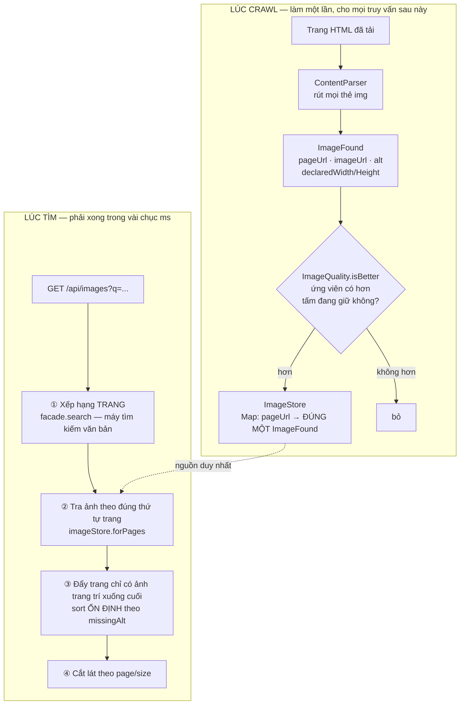

# Sơ đồ tư duy — tầng ảnh

> **Tài liệu này là gì?** Điểm vào của **6 lớp trong `crawler/modular/`** cộng
> `ImageSearchController`, `ImageStoreListener` và `ImageStorePreloader`. Đọc
> trang này trước, rồi mới sang [`ImageQuality.md`](ImageQuality.md).
>
> **Câu hỏi trung tâm của cả tầng:** một trang báo có 40 tấm ``, trong đó
> 39 tấm là logo, icon, nút bấm và pixel theo dõi. **Chọn tấm nào?** Và chọn
> **khi nào** — lúc crawl hay lúc người dùng tìm?

---

## 1. Bức tranh toàn cảnh



Dạng chữ:
```
  LÚC CRAWL (một lần)                    LÚC TÌM (mỗi truy vấn)
  ═══════════════════                    ══════════════════════
  trang HTML                             q = "hà nội"
      │                                       │
      ▼                                       ▼
  rút 40 thẻ                        ① xếp hạng TRANG (tái dùng
      │                                     máy tìm kiếm văn bản)
      ▼                                       │
  ImageQuality: 4 bậc                         ▼
      │  giữ đúng 1 tấm/trang             ② ImageStore.forPages
      ▼                                       │  theo ĐÚNG thứ tự
  ImageStore                                  ▼
  pageUrl → ImageFound  ──────────────►  ③ sort ổn định
                                              │
                                              ▼
                                          ④ cắt lát page/size
```

---

## 2. Quyết định kiến trúc quan trọng nhất: **lọc lúc crawl, không lọc lúc tìm**

Đây là chỗ đáng học nhất của cả tầng.

| | Lọc lúc **tìm** | Lọc lúc **crawl** ← đã chọn |
|---|---|---|
| Chi phí | Mỗi truy vấn duyệt lại 40 ảnh × 300 trang = 12.000 phép so | Một lần cho mỗi trang, lúc crawl |
| Bộ nhớ | Giữ **mọi** ảnh: `Map<String, Map<String, ImageFound>>` | Giữ **một** ảnh mỗi trang: `Map<String, ImageFound>` |
| Độ trễ truy vấn | Tăng theo số ảnh mỗi trang | Không phụ thuộc |
| Đổi thuật toán chấm | Có hiệu lực ngay | **Phải crawl lại** |

Cột phải thắng vì bài toán này **bất đối xứng**: một trang được crawl đúng một
lần nhưng được tìm thấy hàng nghìn lần. Cái giá phải trả — đổi thuật toán phải
crawl lại — được nói thẳng ở mục 6.

Hệ quả trực tiếp lên cấu trúc dữ liệu, ghi ngay trong `ImageStore.java:78`:
kiểu lồng hai tầng `Map<String, Map<String, ImageFound>>` đã bị thay bằng
`Map<String, ImageFound>` phẳng. Không còn tầng thứ hai vì **không còn gì để
đựng** — mỗi trang chỉ giữ đúng một tấm.

---

## 3. Vì sao chia **bậc** chứ không cộng điểm

Cám dỗ đầu tiên là chấm điểm cộng dồn:

$$\text{score} = w_1 \cdot \text{width} + w_2 \cdot [\text{có alt}] - w_3 \cdot [\text{là thumbnail}]$$

Cách này **sai về nguyên tắc**, không phải sai vì chọn nhầm trọng số. Các tín
hiệu không cùng đơn vị: "bề rộng tính bằng pixel" và "có thuộc tính alt hay
không" không quy đổi cho nhau được. Cộng chúng lại là ngầm khẳng định một tỉ
giá — và mọi tỉ giá đều tạo ra những đánh đổi vô nghĩa:

> Một **icon 300px** thắng một **ảnh bài 280px**.

Bậc thì cấm hẳn điều đó. Một ảnh trang trí **không bao giờ** vượt được một ảnh
nội dung, dù to đến đâu. Bề rộng chỉ được dùng để phân định **trong cùng một
bậc**.
```
    BẬC 3  ảnh nội dung, BIẾT là đủ lớn (≥ 200px)
    ────────────────────────────────────────────  ← ranh giới không vượt được
    BẬC 2  ảnh nội dung, không có tín hiệu kích thước   ← 60,7% corpus
    ────────────────────────────────────────────
    BẬC 1  có tín hiệu kích thước, nhưng NHỎ
    ────────────────────────────────────────────
    BẬC 0  trang trí: .svg/.gif/.ico, hoặc URL tự khai "thumb/logo/icon"
```

Chi tiết từng bậc, các mẫu regex và suy dẫn ngưỡng 200px:
[`ImageQuality.md`](ImageQuality.md).

---

## 4. Một chi tiết dễ bỏ sót: **bậc "không biết" nằm ở giữa, không nằm dưới đáy**

Trực giác nói: không có thông tin thì xếp cuối. Làm vậy là hỏng.

**60,7% ảnh trong corpus không có tín hiệu kích thước nào** — phần lớn là ảnh
bài viết bình thường trên những trang không khai `width`/`height` và không dùng
CDN gắn `?w=`. Xếp chúng xuống đáy nghĩa là một **icon `.png` có khai kích
thước** sẽ thắng một **ảnh bài thật không khai gì**.

Nên `TIER_UNKNOWN = 2`, nằm **trên** `TIER_SMALL = 1`. Thiếu thông tin không
phải là bằng chứng xấu.

---

## 5. Bất biến: kết quả **không phụ thuộc thứ tự thông điệp đến**

Ở chế độ Kafka, thứ tự các `ImageFound` của cùng một trang đến `ImageStore`
**không xác định** — chúng có thể đi qua nhiều phân hoạch, nhiều consumer.

`ImageQuality.compare` xử lý bằng một quy tắc nhỏ mà quan trọng: **hoà thì giữ
tấm đã có**.

```java
public static boolean isBetter(ImageFound candidate, ImageFound current) {
    return compare(candidate, current) > 0;   // > 0, KHÔNG phải >= 0
}
```

Ứng viên chỉ thắng khi **thực sự hơn** ở một tiêu chí. Nhờ vậy quan hệ "tấm nào
thắng" là một **thứ tự bộ phận ổn định**: với cùng một tập ảnh đầu vào, tấm
được giữ lại là như nhau bất kể thứ tự nạp. Đổi `>` thành `>=` là mất bất biến
này ngay — hai tấm ngang điểm sẽ thay nhau, và kết quả tuỳ thuộc tấm nào đến
sau.

Ba tiêu chí xét theo thứ tự, dừng ngay khi phân định được:
```
  ① bậc               ảnh nội dung > ảnh trang trí
  ② bề rộng ước lượng  trong cùng bậc, to hơn thắng
  ③ có alt             ảnh mang văn bản thay thế là ảnh truyền đạt nội dung
```

Tiêu chí ③ dựa trên đúng quy ước của chuẩn tiếp cận: ảnh **trang trí** được
quy định phải để trống `alt`. Nói cách khác, chính tác giả trang đã gán nhãn hộ.

---

## 6. Cái giá — nói thẳng

1. **Đổi thuật toán chấm ảnh là phải crawl lại.** Không có đường tắt: ảnh bị
   loại lúc crawl không được ghi lại ở đâu cả. Đây là hệ quả trực tiếp và
   không tránh được của quyết định ở mục 2.

2. **`ImageStore` nằm trong bộ nhớ một tiến trình,** trần `MAX_PAGES = 50.000`
   trang. Vượt trần thì trang mới bị bỏ, đếm trong `droppedPageLimit`. Với
   corpus 31.030 trang hiện tại thì còn dư, nhưng đây là trần cứng.

3. **Chỉ giữ một ảnh mỗi trang** nghĩa là một bài có 5 ảnh hay đều chỉ đóng góp
   một tấm vào lưới. Đổi lại: lưới không bị một trang duy nhất chiếm chỗ.

4. **Mặc định không tải nội dung ảnh** (`app.crawler.images.download=false`) —
   chỉ ghi siêu dữ liệu, thẻ `` trỏ thẳng máy chủ gốc. Ba lý do: băng
   thông, bề mặt SSRF, bản quyền. Hệ quả riêng tư: máy người dùng kết nối
   thẳng tới trang gốc nên trang đó **thấy được địa chỉ IP**. Xem
   [`SECURITY.md`](../../SECURITY.md).

---

## 7. Bảng ánh xạ: khối trong sơ đồ ↔ lớp trong mã

| Khối | Lớp | Việc |
|---|---|---|
| Rút thẻ `` | `ContentParser` | Trả về danh sách ảnh thô của trang |
| Thông điệp | `crawler/bus/ImageFound` | Record: `pageUrl`, `host`, `imageUrl`, `altText`, `declaredWidth/Height`, `contentHash` |
| **Chấm chất lượng** | **`crawler/modular/ImageQuality`** | 4 bậc + ước lượng bề rộng — [trang riêng](ImageQuality.md) |
| Kho ảnh | `crawler/modular/ImageStore` | `Map<String, ImageFound>`, trần 50.000 trang, 4 bộ đếm |
| Tải nội dung ảnh | `crawler/modular/ImageDownloadService` | Chỉ chạy khi `images.download=true` |
| Ghi/đọc đĩa | `crawler/modular/ImageStorage` | `data/crawled-documents.images.json` |
| Nạp lúc khởi động | `config/ImageStorePreloader` | Nạp kho ảnh vào RAM |
| Nghe bus | `config/ImageStoreListener` | Consumer group **riêng** — xem mục 8 |
| Phục vụ truy vấn | `controller/ImageSearchController` | 4 bước ở mục 1 |

---

## 8. Một lỗi mà chỉ chế độ Kafka mới thấy

`ImageStoreListener` phải có **consumer group riêng**
(`vnsearch-image-store`), không dùng chung với `vnsearch-analytics`.

Lý do nằm ở ngữ nghĩa của Kafka: các consumer **cùng một group chia nhau** các
phân hoạch, các group **khác nhau** thì mỗi group nhận **toàn bộ** luồng. Dùng
chung group thì kho ảnh và analytics mỗi bên chỉ nhận khoảng một nửa số ảnh —
và triệu chứng là "tab Hình ảnh thiếu khoảng nửa số kết quả" mà không có lỗi
nào.

Ở chế độ `memory` lỗi này **không lộ ra**, vì không có group nào cả. Đó là lý
do nó chỉ bị bắt khi chạy với broker thật.

---

## 9. Thực hành — chạy thử từng bước

```bash
# 1. Crawl nhỏ để có ảnh (chế độ mặc định, không cần Kafka)
run-crawl.bat 200 2

# 2. Khởi động backend
run-backend.bat

# 3. Tìm ảnh
curl -G "http://localhost:8080/api/images" \
  --data-urlencode "q=hà nội" --data-urlencode "size=5"

# 4. Xem thống kê kho ảnh
curl -H "X-API-Key: $ADMIN_API_KEY" http://localhost:8080/api/admin/stats
```

Phản hồi của bước 3 có `pagesScanned` — số **trang** đã quét để gom ảnh, luôn
tối đa 300 bất kể `page`. Con số đó không đổi giữa các lô chính là điều làm
phân trang đúng (mục 1, bước ①).

Dòng log lúc khởi động xác nhận kho ảnh đã nạp:
```
Da nap kho anh tu data/crawled-documents.images.json: 30823 anh tren 30823 trang (149 ms)
```

Hai số bằng nhau — đúng như bất biến "mỗi trang đúng một ảnh" ở mục 2.

---

## 10. Đọc tiếp

- [`ImageQuality.md`](ImageQuality.md) — 4 bậc, các mẫu regex, suy dẫn ngưỡng
- [`../10-kafka/00-SO-DO-TU-DUY.md`](../10-kafka/00-SO-DO-TU-DUY.md) — bus và
  Modular Services
- [`../01-crawler/00-SO-DO-TU-DUY.md`](../01-crawler/00-SO-DO-TU-DUY.md) — nơi
  `ContentParser` rút thẻ ``
- [`../../CONFIGURATION.md`](../../CONFIGURATION.md) §9 — ba khoá cấu hình ảnh
