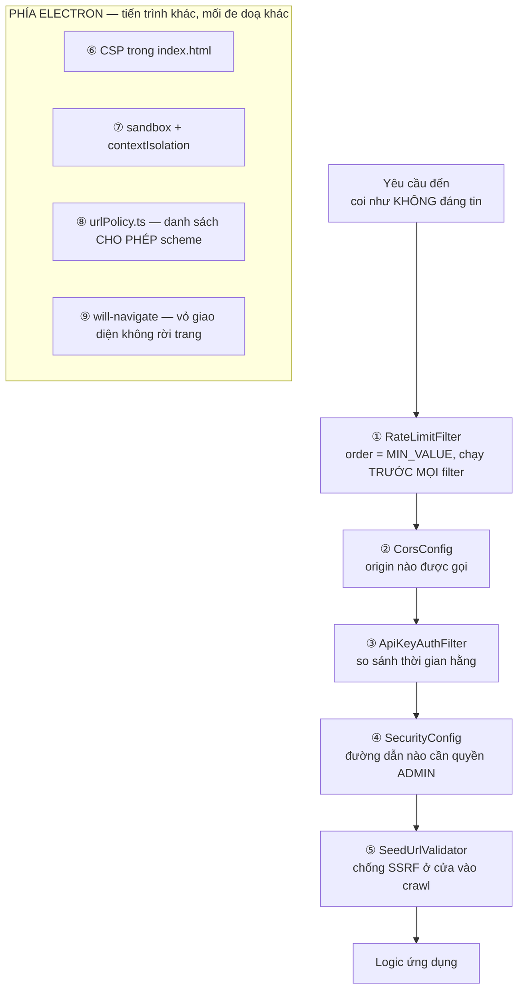
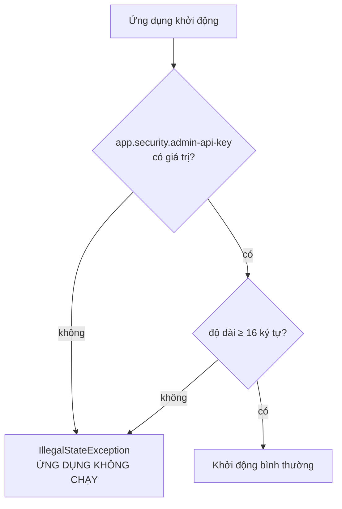
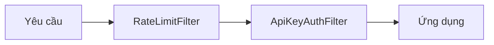
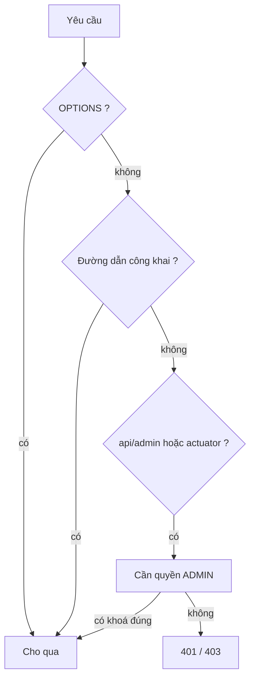
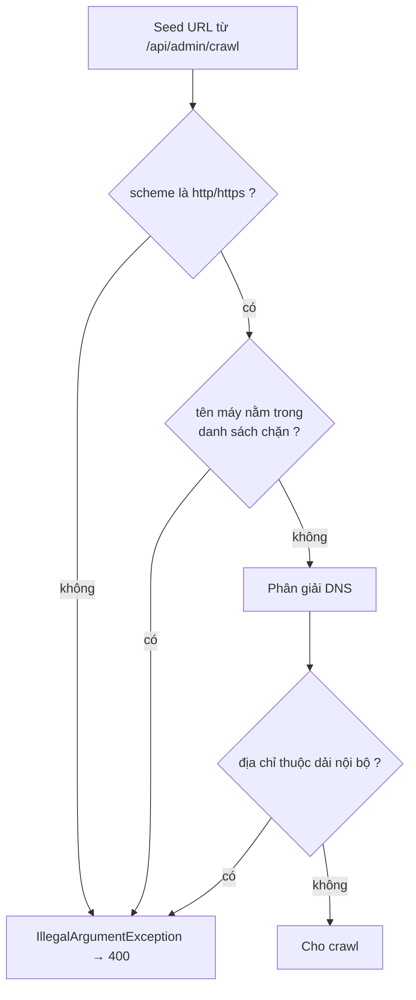
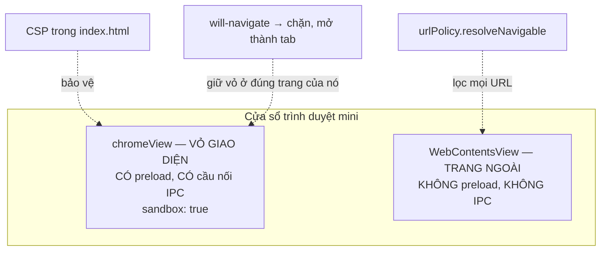

# Sơ đồ tư duy — các lớp phòng thủ

> **Tài liệu này là gì?** Điểm vào của toàn bộ phần bảo mật, **trải trên ba
> tiến trình**: Spring Security ở backend, CSP ở renderer, sandbox ở Electron.
>
> **Nguyên tắc xuyên suốt:** mỗi lớp chặn **một loại tấn công khác nhau**, và
> không lớp nào được phép là lớp duy nhất. Trang này chỉ ra mỗi lớp chặn gì, và
> **bỏ lớp đó thì hở đúng cái gì**.
>
> Bản tổng quan cộng danh sách lỗ hổng **còn mở** nằm ở
> [`SECURITY.md`](../../SECURITY.md).

---

## 1. Bức tranh toàn cảnh — phòng thủ theo chiều sâu



```
   ┌─────────────────────────── BACKEND ───────────────────────────┐
   │                                                                │
   │  yêu cầu                                                       │
   │     │                                                          │
   │     ▼                                                          │
   │  ① RateLimitFilter    ◀── chặn: vét cạn, DoS rẻ tiền           │
   │     │                     order = Integer.MIN_VALUE            │
   │     ▼                                                          │
   │  ② CorsConfig         ◀── chặn: trang web lạ gọi API hộ user   │
   │     │                                                          │
   │     ▼                                                          │
   │  ③ ApiKeyAuthFilter   ◀── chặn: người lạ gọi /api/admin        │
   │     │                     MessageDigest.isEqual, KHÔNG equals  │
   │     ▼                                                          │
   │  ④ SecurityConfig     ◀── chặn: nhầm lẫn phân quyền đường dẫn  │
   │     │                                                          │
   │     ▼                                                          │
   │  ⑤ SeedUrlValidator   ◀── chặn: SSRF vào mạng nội bộ           │
   │     │                                                          │
   │     ▼  logic ứng dụng                                          │
   └────────────────────────────────────────────────────────────────┘

   ┌────────────────────────── ELECTRON ───────────────────────────┐
   │  ⑥ CSP           ◀── chặn: XSS chạy được script               │
   │  ⑦ sandbox       ◀── chặn: XSS leo thang thành RCE            │
   │  ⑧ urlPolicy     ◀── chặn: file:// đọc tệp máy người dùng      │
   │  ⑨ will-navigate ◀── chặn: trang ngoài thừa hưởng cầu nối IPC  │
   └────────────────────────────────────────────────────────────────┘
```

---

## 2. Quyết định gây tranh cãi nhất: **từ chối khởi động khi thiếu khoá**



Ba cách xử lý khi thiếu khoá, và vì sao chọn cách khắc nghiệt nhất:

| Phương án | Hệ quả | |
|---|---|:---:|
| Sinh khoá ngẫu nhiên mỗi lần chạy | Chạy được, nhưng mọi lệnh `curl` đã lưu thành 401 sau mỗi lần khởi động lại | ✗ |
| Để `/api/admin` mở khi không có khoá | **Lỗ hổng SSRF hoàn chỉnh**, và không ai biết vì chẳng có gì báo | ✗ |
| **Từ chối khởi động** | Hỏng **ngay và ồn ào**, không thể vô tình chạy ở trạng thái không an toàn | ✓ |

**Vì sao đây không phải là chuyện nhỏ.** `POST /api/admin/crawl` khiến máy chủ
đi tải **một URL tuỳ ý** rồi đưa nội dung vào chỉ mục công khai. Không khoá thì
bất kỳ ai cũng dùng máy chủ của bạn làm proxy đọc mạng nội bộ — rồi đọc kết quả
qua `/api/search`. Đó là SSRF có kênh trả về, loại nặng nhất.

```
   KHÔNG có khoá:

   kẻ tấn công ──▶ POST /api/admin/crawl
                   { "seedUrls": ["http://169.254.169.254/latest/meta-data/"] }
                                          │
                              máy chủ đi tải hộ ──▶ endpoint metadata đám mây
                                          │
                   GET /api/search?q=... ◀┘  đọc lại nội dung vừa crawl
                              │
                              ▼
                   thông tin đăng nhập đám mây
```

Lớp ⑤ `SeedUrlValidator` chặn đúng đường đi đó, nhưng khoá là lớp đầu tiên —
và hai lớp phải cùng có.

---

## 3. `ApiKeyAuthFilter` — vì sao không dùng `String.equals`

```java
MessageDigest.isEqual(provided.getBytes(UTF_8), expected.getBytes(UTF_8))
```

`String.equals` **thoát ra ngay tại ký tự đầu tiên khác nhau**. Thời gian chạy
vì thế rò rỉ thông tin về **số ký tự đầu đã đúng**:

```
   khoá thật:  a7f3c9...

   thử "0..."  ─▶ sai ở ký tự 1 ─▶ trả lời sau ~10 ns
   thử "a..."  ─▶ sai ở ký tự 2 ─▶ trả lời sau ~12 ns   ◀── CHẬM HƠN MỘT CHÚT
   thử "a7..." ─▶ sai ở ký tự 3 ─▶ trả lời sau ~14 ns   ◀── chậm hơn nữa
```

Đo đủ nhiều lần để lọc nhiễu mạng, kẻ tấn công dò được **từng ký tự một**. Với
khoá 64 ký tự hex, chi phí giảm từ $16^{64}$ xuống còn $16 \times 64 = 1024$
lượt thử — tức từ bất khả thi xuống vài giây.

`MessageDigest.isEqual` **luôn duyệt hết độ dài**, nên thời gian trả lời không
phụ thuộc chỗ sai.

> Đây là loại lỗ hổng mà **test chức năng không bao giờ bắt được**: khoá đúng
> vẫn cho qua, khoá sai vẫn bị chặn. Chỉ có đọc mã mới thấy.

---

## 4. `RateLimitFilter` — gáo token, và vì sao đặt ở vị trí đầu tiên

### 4.1. Thuật toán gáo token

```
   dung tích = requestsPerMinute = 120 token
   tốc độ rót = 120 / 60.000 ms = 0,002 token mỗi mili-giây

   ┌────────────────┐
   │ ██████████████ │ ◀── rót đều đặn, tràn thì bỏ
   │ ██████████████ │
   │ ██████████████ │     mỗi request lấy 1 token
   └───────┬────────┘     cạn ⇒ 429 Too Many Requests
           │
           ▼ 1 token / request
```

```java
tokens = Math.min(capacity, tokens + elapsed * tokensPerMilli);
if (tokens < 1.0) return false;   // 429
tokens -= 1.0;
```

**Vì sao gáo token chứ không phải cửa sổ cố định.** Cửa sổ cố định cho phép
**gấp đôi tải ở ranh giới**: 120 request lúc 11:59:59 cộng 120 request lúc
12:00:01 là 240 request trong 2 giây, mà vẫn "đúng luật". Gáo token không có
ranh giới nào để lách vì nó rót liên tục.

**Vì sao `synchronized` chứ không CAS.** Phép cập nhật gồm ba bước phụ thuộc
nhau (rót → kiểm tra → trừ). Làm bằng CAS phải thử lại vòng lặp, và dưới tranh
chấp cao thì tệ hơn một khoá ngắn. Vùng tới hạn ở đây chỉ vài phép tính số học.

**`nowMillis` truyền từ ngoài vào** thay vì gọi `System.currentTimeMillis()`
bên trong — nhờ vậy test điều khiển được thời gian, không phải `Thread.sleep`.
Một bài test ngủ thật là một bài test chậm và chập chờn.

### 4.2. Vì sao `order = Integer.MIN_VALUE`



Giới hạn tần suất phải chạy **trước cả xác thực**. Nếu đặt sau, mỗi lần thử
khoá sai vẫn tốn một phép so sánh mật mã và một vòng qua chuỗi filter — tức là
kẻ tấn công vẫn ép được máy chủ làm việc. Chặn ở cửa ngoài cùng thì một yêu cầu
bị từ chối gần như không tốn gì.

`MAX_TRACKED_CLIENTS = 100_000` là trần chống **chính cơ chế này bị dùng để tấn
công**: nếu bảng gáo lớn vô hạn, kẻ tấn công giả hàng triệu địa chỉ để làm cạn
bộ nhớ máy chủ.

### 4.3. `trust-proxy` — công tắc nguy hiểm nhất trong cấu hình

```
   trust-proxy = false  (mặc định)         trust-proxy = true
   ───────────────────────────────         ──────────────────────────────
   dùng địa chỉ TCP thật                   tin header X-Forwarded-For

   ✓ đúng khi KHÔNG có proxy               ✓ đúng khi CÓ nginx / LB
   ✗ sai khi có proxy: mọi client          ✗ sai khi KHÔNG có proxy:
     trông như cùng một IP                   client tự khai IP mới mỗi
     ⇒ chặn nhầm người vô tội                request ⇒ VÔ HIỆU HOÁ hoàn toàn
```

Đặt sai theo hướng thứ hai là **tự tắt giới hạn tần suất mà không hề biết** —
mọi thứ trông vẫn hoạt động bình thường.

---

## 5. `SecurityConfig` — bảng phân quyền đường dẫn



| Đường dẫn | Quyền |
|---|---|
| `OPTIONS /**` | công khai — preflight CORS phải qua trước khi xác thực |
| `/api/search`, `/api/suggest`, `/api/health`, `/api/images`, `/api/feed` | công khai |
| `/actuator/health/**`, `/actuator/prometheus` | công khai |
| `/api/admin/**`, `/actuator/**` *(còn lại)* | **ADMIN** |

**Chú ý dòng cuối.** `/actuator/**` nằm trong nhóm cần ADMIN, chỉ hai đường dẫn
actuator cụ thể được mở. Đây là hàng rào thứ hai bên cạnh
`management.endpoints.web.exposure.include` — nếu ai đó nới cấu hình phơi bày
thành `*`, lớp này vẫn chặn `/actuator/env` và `/actuator/heapdump`.

> **Vì sao tắt CSRF.** API này **không dùng cookie phiên**; xác thực bằng header
> `X-API-Key`. CSRF khai thác việc trình duyệt **tự động gửi kèm** cookie —
> header thì không tự động gửi. Không có cookie thì không có bề mặt CSRF. Tắt
> nó ở đây là đúng, nhưng chỉ đúng **vì** không có cookie; thêm phiên vào sau
> này là phải bật lại.

---

## 6. `SeedUrlValidator` — chống SSRF, năm dải địa chỉ



Năm loại địa chỉ bị chặn, mỗi loại một lý do cụ thể:

| Kiểm tra | Dải | Chặn cái gì |
|---|---|---|
| `isLoopbackAddress()` | `127.0.0.0/8`, `::1` | Chính máy chủ — các dịch vụ chỉ nghe localhost |
| `isLinkLocalAddress()` | `169.254.0.0/16`, `fe80::/10` | **Endpoint metadata đám mây** — nơi lấy được thông tin đăng nhập |
| `isSiteLocalAddress()` | `10/8`, `172.16/12`, `192.168/16` | Mạng nội bộ |
| `isAnyLocalAddress()` | `0.0.0.0`, `::` | Địa chỉ nhập nhằng |
| `isUniqueLocalIpv6` + `isCarrierGradeNat` | `fc00::/7`, `100.64/10` | Hai dải mà JDK **không** tính là nội bộ |

**Hai dải cuối là phần dễ bỏ sót nhất.** `InetAddress` của JDK không coi
`100.64.0.0/10` (Carrier-Grade NAT) là nội bộ, nhưng trong nhiều môi trường đám
mây thì nó là. Phải tự viết thêm.

**Kiểm tra tên máy trước, kiểm tra địa chỉ sau** — hai bước riêng chứ không
gộp. Lý do: `localhost` và `*.localhost` chặn được ngay không cần chạm mạng,
còn một tên miền công khai **trỏ tới** `127.0.0.1` thì chỉ lộ ra sau khi phân
giải DNS.

> ⚠️ **Còn hở: DNS rebinding.** Giữa lúc kiểm tra và lúc tải, bản ghi DNS có
> thể đổi. Bịt hẳn cần phân giải một lần rồi kết nối thẳng tới địa chỉ đã kiểm.
> Xem [`SECURITY.md`](../../SECURITY.md).

---

## 7. Phía Electron — ba lớp, ba mối đe doạ khác nhau



| Lớp | Chặn | Bỏ đi thì hở gì |
|---|---|---|
| **CSP** `script-src 'self'` | XSS **chạy** được script | Một lỗ hổng XSS thành mã chạy trong vỏ giao diện |
| **`sandbox: true`** | XSS **leo thang** thành RCE | Mã tấn công có toàn quyền Node: đọc tệp, mở tiến trình con |
| **`will-navigate`** | Vỏ giao diện rời khỏi trang của nó | Trang ngoài **thừa hưởng cầu nối IPC** |
| **`urlPolicy`** | `file://`, `javascript:` | Đọc tệp trên máy người dùng |

**Bất biến nền tảng:** khung **duy nhất** có preload là vỏ giao diện, và nó
**không bao giờ** được điều hướng đi đâu. Nội dung web sống trong các tab, và
tab thì không có preload — nên không có đường nào từ trang ngoài chạm tới IPC.

```
        ┌──────────────────────────────────────┐
        │ chromeView (vỏ)                      │
        │   preload ✓   IPC ✓   sandbox ✓      │  ◀── không bao giờ rời trang
        │   ┌──────────────────────────────┐   │
        │   │ WebContentsView (trang ngoài)│   │
        │   │   preload ✗   IPC ✗          │   │  ◀── nội dung không tin được
        │   └──────────────────────────────┘   │
        └──────────────────────────────────────┘
```

### 7.1. Một đánh đổi được ghi thẳng vào CSP

```
img-src 'self' data: https:
```

`https:` được thêm vào để tab Hình ảnh hiện được ảnh từ máy chủ gốc. Cái giá:
mỗi thẻ `` là một kết nối thẳng từ máy người dùng tới trang gốc, nên trang
đó **thấy được địa chỉ IP**. `referrerPolicy="no-referrer"` giấu được trang
giới thiệu nhưng **không** giấu được IP.

Bịt hẳn cần một endpoint proxy ảnh ở backend, dùng lại phép chống SSRF của
`SeedUrlValidator`. Khi đó `img-src` quay về `'self'`.

Chọn `https:` chứ **không** phải `*`: ảnh qua http trần có thể bị sửa trên
đường truyền.

---

## 8. Bảng ánh xạ: lớp phòng thủ ↔ tệp

| Lớp | Tệp |
|---|---|
| ① Giới hạn tần suất | `config/RateLimitFilter.java` |
| ② CORS | `config/CorsConfig.java` |
| ③ Xác thực khoá | `config/ApiKeyAuthFilter.java` |
| ④ Phân quyền đường dẫn | `config/SecurityConfig.java` |
| ⑤ Chống SSRF | `crawler/SeedUrlValidator.java` |
| Xử lý ngoại lệ | `config/GlobalExceptionHandler.java` |
| ⑥ CSP | `browser-app/src/renderer/index.html` |
| ⑦ sandbox, contextIsolation | `browser-app/src/main/tabManager.ts` |
| ⑧ Danh sách cho phép scheme | `browser-app/src/main/urlPolicy.ts` |
| ⑨ Chặn điều hướng vỏ | `browser-app/src/main/tabManager.ts` |
| Cổng chặn CVE | `.github/workflows/ci.yml`, `codeql.yml` |

---

## 9. Thực hành — thử từng lớp

```bash
# ③ Không có khoá ⇒ 401
curl -i http://localhost:8080/api/admin/stats

# ③ Khoá sai ⇒ 401 (thời gian trả lời KHÔNG đổi theo độ giống)
curl -i -H "X-API-Key: sai-hoan-toan" http://localhost:8080/api/admin/stats

# ⑤ SSRF vào loopback ⇒ 400
curl -X POST -H "Content-Type: application/json" -H "X-API-Key: $ADMIN_API_KEY" \
  -d '{"seedUrls":["http://127.0.0.1:8080/"],"maxDepth":1,"maxPages":1}' \
  http://localhost:8080/api/admin/crawl

# ⑤ SSRF vào metadata đám mây ⇒ 400
curl -X POST -H "Content-Type: application/json" -H "X-API-Key: $ADMIN_API_KEY" \
  -d '{"seedUrls":["http://169.254.169.254/"],"maxDepth":1,"maxPages":1}' \
  http://localhost:8080/api/admin/crawl

# ① Vượt giới hạn tần suất ⇒ 429 sau ~120 lượt trong một phút
for i in $(seq 1 130); do curl -s -o /dev/null -w "%{http_code} " \
  "http://localhost:8080/api/health"; done; echo

# ② Từ chối khởi động khi thiếu khoá
ADMIN_API_KEY= ./mvnw spring-boot:run    # IllegalStateException, cố ý
```

Test của lớp ⑧ chạy trong CI:
`browser-app/src/main/urlPolicy.test.ts`.

---

## 10. Đọc tiếp

- [`../../SECURITY.md`](../../SECURITY.md) — tổng quan, ghi chú vá CVE, và
  **danh sách lỗ hổng còn mở**
- [`../12-devops/00-SO-DO-TU-DUY.md`](../12-devops/00-SO-DO-TU-DUY.md) — cổng
  chặn CVE trong CI/CD
- [`../../CONFIGURATION.md`](../../CONFIGURATION.md) §3 — năm khoá cấu hình
  bảo mật
- [`../../FRONTEND.md`](../../FRONTEND.md) §15.10 — các mục bảo mật phía
  Electron
