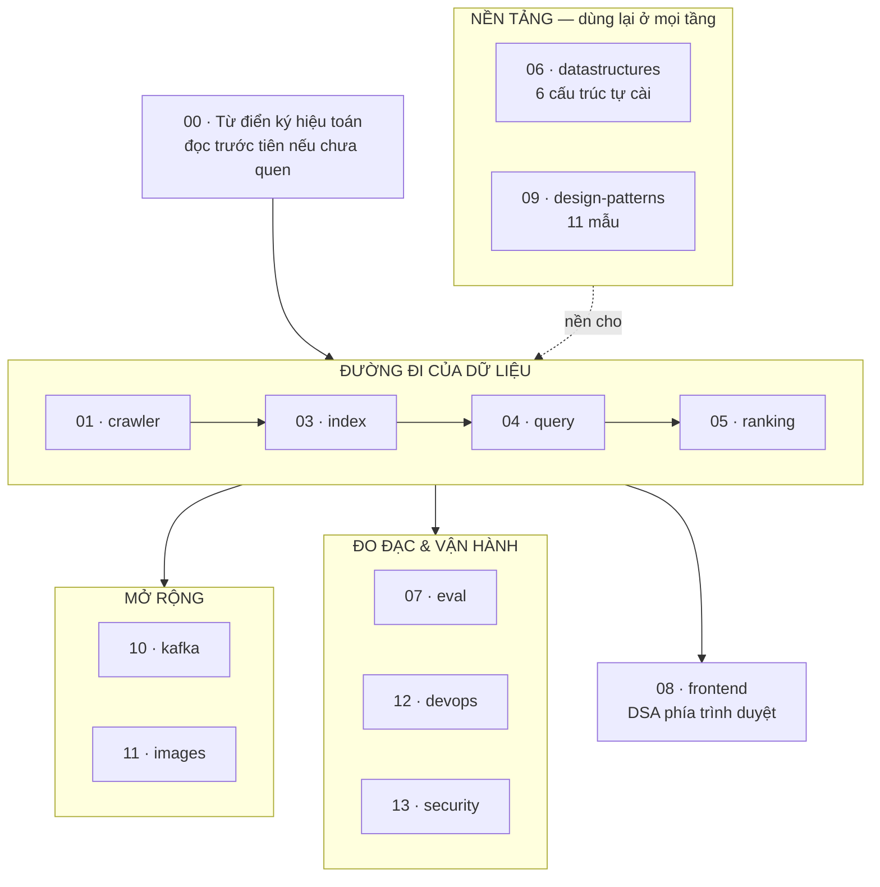

# Math — Toàn bộ thuật toán & công thức toán của VnSearch

Tài liệu này quét **toàn bộ mã nguồn** của dự án và tổng hợp mọi thuật toán, công thức toán học, cấu trúc dữ liệu và design pattern được dùng. Mỗi file mã nguồn có nội dung toán học đáng kể đều có một trang `.md` riêng, phân tích:

- **Bài toán** cần giải và vì sao cách ngây thơ không đủ
- **Công thức** đầy đủ, kèm chứng minh hoặc suy dẫn
- **Bảng giá trị** cụ thể với các hằng số thật trong code
- **Ví dụ tính tay** từng bước
- **Độ phức tạp** thời gian & bộ nhớ
- **Chủ đề DSA** mà đoạn code đó thể hiện
- **Hạn chế đã biết**, nói thẳng

**44 tài liệu** phân tích mã nguồn, chia theo 11 nhóm, cộng **14 tài liệu** về design pattern và OOP ở nhóm 9.

### Bản đồ 12 nhóm — đi theo đường dữ liệu



```
   00 ký hiệu toán  ◀── đọc trước tiên

   ĐƯỜNG DỮ LIỆU :  01 crawler ──▶ 03 index ──▶ 04 query ──▶ 05 ranking
                         │                                        │
   NỀN TẢNG      :  06 datastructures  ·  09 design-patterns  ────┘
                         │
   MỞ RỘNG       :  10 kafka  ·  11 images
   ĐO & VẬN HÀNH :  07 eval   ·  12 devops  ·  13 security
   GIAO DIỆN     :  08 frontend
```

> 🗺️ **Mỗi nhóm đều mở đầu bằng một SƠ ĐỒ TƯ DUY** — vẽ ra mối liên hệ giữa các file của cả tầng đó thành hình, kèm bảng tra nhanh từng file và bảng *"xoá file này thì hỏng gì"*. **Đọc sơ đồ tư duy của nhóm trước, rồi mới vào các trang đi sâu.** Mọi sơ đồ đều có sẵn bản chữ (ASCII) bấm mở được, phòng khi trình xem không hiển thị Mermaid.

> 📖 **Đọc [00 — Từ điển ký hiệu toán](00-KY-HIEU-TOAN.md) trước tiên** nếu chưa quen ký hiệu.

---

## 📑 Mục lục

### 0. Từ điển ký hiệu — [`00-KY-HIEU-TOAN.md`](00-KY-HIEU-TOAN.md)

Mọi ký hiệu lạ xuất hiện trong 35 tài liệu phân tích mã nguồn còn lại đều được giải thích ở đây, bằng tiếng Việt thường, kèm ví dụ số lấy từ chính corpus 5.011 trang.

### 1. Thu thập dữ liệu — [`01-crawler/`](01-crawler/)

| Tài liệu | File nguồn | Nội dung chính |
|---|---|---|
| 🗺️ [**Sơ đồ tư duy — toàn tầng crawler**](01-crawler/00-SO-DO-TU-DUY.md) | cả 43 file `crawler/` (20 gốc + 9 frontier + 8 bus + 6 modular) | **Bắt đầu từ đây.** Mối liên hệ giữa các file vẽ ra thành hình: bản đồ 5 nhóm, đồ thị phụ thuộc, vòng đời một URL qua 8 cửa, frontier hai tầng chạy tay từng bước, bảng "xoá file này thì hỏng gì" |
| [BloomFilter](01-crawler/BloomFilter.md) | `datastructure/BloomFilter.java` | **Suy dẫn $p \approx (1-e^{-kn/m})^k$**, tối ưu $k^*=(m/n)\ln 2$ bằng đạo hàm, double hashing Kirsch–Mitzenmacher, 1,1 MB vs 108 MB |
| [UrlFrontier](01-crawler/UrlFrontier.md) | `crawler/frontier/` (9 lớp) | **Mercator hai tầng**, chống bỏ đói bằng chọn ngẫu nhiên có trọng số, $O(D) \to O(\log n)$, trần thông lượng $=H$ |
| [CrawlerService](01-crawler/CrawlerService.md) | `crawler/CrawlerService.java` | BFS đa luồng, **phát hiện kết thúc phân tán**, $P(\text{nhầm}) \approx 10^{-15}$, ba lớp bảo vệ |
| [RobotsTxtParser](01-crawler/RobotsTxtParser.md) | `crawler/RobotsTxtParser.java` | **Longest-prefix-match**, máy trạng thái hai cờ, cache 17 phút → 10 giây |
| [UrlCanonicalizer](01-crawler/UrlCanonicalizer.md) | `crawler/UrlCanonicalizer.java` | **Quan hệ tương đương và dạng chuẩn tắc**, choke point, an toàn vs đầy đủ |
| [ContentParser & LinkExtractor](01-crawler/ContentParser-LinkExtractor.md) | `crawler/ContentParser.java`, `crawler/LinkExtractor.java` | Duyệt DOM, sinh 239.691 cạnh đồ thị, vì sao boilerplate làm hỏng $\sqrt{\lvert d\rvert}$ |
| [ContentSeenFilter](01-crawler/ContentSeenFilter.md) | `crawler/ContentSeenFilter.java` | **Nghịch lý ngày sinh** cho SHA-256, vì sao KHÔNG dùng Bloom Filter ở đây, quan hệ tương đương khi chuẩn hoá |

### 3. Tách từ & lập chỉ mục — [`03-index/`](03-index/)

> Nhóm `02-tokenize/` cũ đã được **gộp vào đây**: `VietnameseTokenizer.java` vốn nằm trong package `index/`, nên tài liệu về nó thuộc về nhóm này. Vì vậy mục lục không có số 2.

| Tài liệu | File nguồn | Nội dung chính |
|---|---|---|
| 🗺️ [**Sơ đồ tư duy — toàn tầng chỉ mục**](03-index/00-SO-DO-TU-DUY.md) | cả 14 file `index/` | **Bắt đầu từ đây.** Hai đường đi của dữ liệu, hình dạng thật của chỉ mục trong bộ nhớ, một bất biến mở khoá bốn kỹ thuật, ba tầng ý tưởng nén, galloping search vẽ ra |
| [VietnameseTokenizer](03-index/VietnameseTokenizer.md) | `index/VietnameseTokenizer.java` | **QHĐ cực đại trọng số**, NFC/NFD Unicode, bẫy chữ `đ`, hai biến đếm độc lập |
| [InvertedIndex](03-index/InvertedIndex.md) | `index/InvertedIndex.java` | **Bất biến quan trọng nhất dự án**, binary search, chỉ mục kép có/không dấu, `>>>` chống tràn |
| [IndexPersistence](03-index/IndexPersistence.md) | `index/IndexPersistence.java` | Trạng thái dẫn xuất phải cập nhật ở **mọi** đường vào, chuỗi dự phòng 4 tầng |
| [**VByteCodec**](03-index/VByteCodec.md) | `index/VByteCodec.java` | **Delta + variable-byte**, mã hoá theo đoạn, thao tác bit, đóng gói 2 giá trị vào một `long` |
| [**CompressedPostings**](03-index/CompressedPostings.md) | `index/CompressedPostings.java` | **Nén chỉ mục 341,5 MB → 94,7 MB**, prefix sum kiểu CSR, chứng minh một trường là thừa |
| [**TermDictionary**](03-index/TermDictionary.md) | `index/TermDictionary.java` | **Flyweight**, 7 triệu → 136.768 `String`, định luật Zipf/Heaps, vì sao không dùng `String.intern()` |

### 4. Xử lý truy vấn — [`04-query/`](04-query/)

| Tài liệu | File nguồn | Nội dung chính |
|---|---|---|
| 🗺️ [**Sơ đồ tư duy — toàn tầng truy vấn**](04-query/00-SO-DO-TU-DUY.md) | cả 12 file `query/` | **Bắt đầu từ đây.** Cây biểu thức Composite, ranh giới Composite ↔ Chain, two-pointer vs HashSet, `relaxAndRetry` |
| [PostingListMerger](04-query/PostingListMerger.md) | `query/PostingListMerger.java` | **Two-pointer + chứng minh bất biến vòng lặp**, shortest-first, 10,0 ms vs 27,0 ms |
| [QueryParser](04-query/QueryParser.md) | `query/QueryParser.java` | **Bất biến "cùng một tokenizer"**, regex giữ phần ngoài ngoặc kép |
| [CandidateResolver](04-query/CandidateResolver.md) | `query/CandidateResolver.java` | **Filter-and-refine**, phần tử hấp thụ $\emptyset$, bài học "một cài đặt duy nhất" |

### 5. Xếp hạng — [`05-ranking/`](05-ranking/)

| Tài liệu | File nguồn | Nội dung chính |
|---|---|---|
| 🗺️ [**Sơ đồ tư duy — toàn tầng xếp hạng**](05-ranking/00-SO-DO-TU-DUY.md) | cả 10 file `ranking/` | **Bắt đầu từ đây.** Chuỗi Decorator lắp ghép, **lỗi thang đo 1000×**, tín hiệu nào thật sự mạnh, cửa sổ trượt |
| [TfIdfScorer](05-ranking/TfIdfScorer.md) | `ranking/TfIdfScorer.java` | **Mô hình không gian vector**, cosine, idf = self-information, phân tích sai số $\sqrt{\lvert d\rvert}$ |
| [BM25Scorer](05-ranking/BM25Scorer.md) | `ranking/BM25Scorer.java` | **Hàm bão hoà có tiệm cận $k_1+1$**, điểm nửa bão hoà, IDF Robertson–Sparck Jones |
| [PageRankService](05-ranking/PageRankService.md) | `ranking/PageRankService.java` | **Chuỗi Markov, Perron–Frobenius, chứng minh $\sum\text{PR}=1$**, hội tụ $C\,d^{\,k}$, 53 vòng |
| [ResultRanker](05-ranking/ResultRanker.md) | `ranking/ResultRanker.java` | **Cửa sổ trượt $O(n)$**, top-K, và **phân tích lỗi thang đo 1000×** |
| [**QuerySyllables**](05-ranking/QuerySyllables.md) | `ranking/QuerySyllables.java` | **Ánh xạ nhiều-một và mất thông tin**, điểm bất động, kẹp trần chống nhồi từ khoá |

### 6. Cấu trúc dữ liệu — [`06-datastructures/`](06-datastructures/)

| Tài liệu | File nguồn | Nội dung chính |
|---|---|---|
| 🗺️ [**Sơ đồ tư duy — toàn bộ cấu trúc tự cài**](06-datastructures/00-SO-DO-TU-DUY.md) | cả 6 cấu trúc | **Bắt đầu từ đây.** Cấu trúc nào dùng ở tầng nào, bảng **"vì sao không dùng thư viện có sẵn"**, cấu trúc nào được tái sử dụng |
| [MinHeap](06-datastructures/MinHeap.md) | `datastructure/MinHeap.java` | **Chứng minh công thức chỉ số**, siftUp/siftDown, **top-K streaming $O(n\log k)$** |
| [Trie](06-datastructures/Trie.md) | `datastructure/Trie.java` | $O(L)$ **không phụ thuộc $M$**, tách khoá tra cứu khỏi chuỗi hiển thị, DFS quay lui |
| [LRUCache](06-datastructures/LRUCache.md) | `datastructure/LRUCache.java` | HashMap + DLL, **sentinel xoá mọi nhánh `if`**, vì sao `get` phải khoá **ghi** |
| [SparseMatrix](06-datastructures/SparseMatrix.md) | `datastructure/SparseMatrix.java` | **$\rho = \bar k/N \propto 1/N$**, 191,5 MB → 3,7 MB, lưu ở dạng đã chuyển vị |
| [**ArrayPostingCursor**](06-datastructures/ArrayPostingCursor.md) | `index/ArrayPostingCursor.java` | **Galloping search**, chứng minh $O(m\log\frac{n}{m})$ bằng Jensen, sentinel, 4005 → 48 bước |

### 7. Đánh giá chất lượng — [`07-eval/`](07-eval/)

| Tài liệu | File nguồn | Nội dung chính |
|---|---|---|
| 🗺️ [**Sơ đồ tư duy — toàn tầng đánh giá**](07-eval/00-SO-DO-TU-DUY.md) | cả 9 file `eval/` | **Bắt đầu từ đây.** Lấy đâu ra "đáp án đúng", hai phương pháp bù nhau, **vì sao một bảng số chưa đủ để nói A tốt hơn B** |
| [EvaluationMetrics](07-eval/EvaluationMetrics.md) | `eval/EvaluationMetrics.java` | **P/R/F1/AP/MAP/nDCG/MRR** — công thức, ví dụ tính tay, vì sao trung bình điều hoà |
| [KnownItemQueryGenerator](07-eval/KnownItemQueryGenerator.md) | `eval/KnownItemQueryGenerator.java` | **Lật ngược bài toán**, bẫy $\text{df}=1$, cửa sổ df, tính tái lập |
| [PoolBuilder](07-eval/PoolBuilder.md) | `eval/PoolBuilder.java` | **TREC pooling**, giảm 150.330 → ~900 lượt phán xét (167×) |

### 8. Phía trình duyệt — [`08-frontend/`](08-frontend/)

| Tài liệu | File nguồn | Nội dung chính |
|---|---|---|
| 🗺️ [**Sơ đồ tư duy — toàn tầng frontend**](08-frontend/00-SO-DO-TU-DUY.md) | cả 50 file `browser-app/src/` | **Bắt đầu từ đây.** Ba tiến trình nói chuyện ra sao, vỏ nằm dưới trang nằm trên, DSA tự cài nằm ở đâu, bản đồ 9 store, bảng "xoá file này thì hỏng gì" |
| [Stack](08-frontend/Stack.md) | `lib/Stack.ts`, `store/historyStore.ts` | **Hai ngăn xếp + bất biến back/forward**, cờ một lần dùng cắt vòng phản hồi |
| [BookmarkTrie](08-frontend/BookmarkTrie.md) | `lib/BookmarkTrie.ts` | **Cùng cấu trúc, hai chuyên biệt hoá** — so sánh chi tiết Java vs TypeScript |
| 📘 [**FRONTEND.md**](../FRONTEND.md) | cả `browser-app/` | **Tài liệu đầy đủ 17 mục** — kiến trúc, hợp đồng IPC, 5 luồng xử lý, **12 công thức hướng dẫn sửa code**, và **đánh giá kiến trúc theo chuẩn doanh nghiệp có bảng điểm** |

### 9. Design Pattern & chấm điểm — [`09-design-patterns/`](09-design-patterns/)

| Tài liệu | Nội dung chính |
|---|---|
| 🗺️ [**Sơ đồ tư duy — toàn bộ design pattern**](09-design-patterns/00-SO-DO-TU-DUY.md) | **Bắt đầu từ đây.** 10 mẫu chia theo nhóm GoF, mẫu nào ở tầng nào, bộ ba Strategy → Factory → Decorator, ba mẫu sửa lỗi **đo được bằng số** |
| [**README**](09-design-patterns/README.md) | Chỉ mục loạt bài học OOP, lộ trình đọc, tra cứu ngược theo khái niệm |

**Loạt 12 trang học OOP — mỗi mẫu một trang:**

| # | Trang | Trong dự án |
|---|---|---|
| 00 | [OOP căn bản](09-design-patterns/00-OOP-CO-BAN.md) | 4 trụ cột, SOLID, composition vs kế thừa |
| 01 | [Strategy](09-design-patterns/01-STRATEGY.md) | `RelevanceScorer`, `Tokenizer`, `SearchIndex`, `DocumentStore` |
| 02 | [Factory](09-design-patterns/02-FACTORY.md) | `ScorerFactory` |
| 03 | [Decorator](09-design-patterns/03-DECORATOR.md) | `PageRankBoostScorer`, `TitleBoostScorer` |
| 04 | [Composite](09-design-patterns/04-COMPOSITE.md) | `QueryNode` + 5 nút |
| 05 | [Chain of Responsibility](09-design-patterns/05-CHAIN-OF-RESPONSIBILITY.md) | `CandidateFilter` + 2 lọc |
| 06 | [State](09-design-patterns/06-STATE.md) | `CrawlStatus` |
| 07 | [Observer](09-design-patterns/07-OBSERVER.md) | `CrawlListener` |
| 08 | [Builder](09-design-patterns/08-BUILDER.md) | `CrawlConfig` |
| 09 | [Iterator / Cursor](09-design-patterns/09-ITERATOR-CURSOR.md) | `PostingCursor` |
| 10 | [Flyweight](09-design-patterns/10-FLYWEIGHT.md) | `TermDictionary` |
| 11 | [Bảy mẫu bổ trợ](09-design-patterns/11-MAU-BO-TRO.md) | Facade, Adapter, Repository, Value Object, Cache-Aside, Producer–Consumer, DI |

---

### 10. Kafka & cụm Modular Services — [`10-kafka/`](10-kafka/)

Phần **phân tán** của crawler: vì sao cắt pipeline ngay sau khối *Duplicate
Detection*, và vì sao `URL Frontier` thì **không** bị thay bằng Kafka.

| Tài liệu | Nội dung chính |
|---|---|
| 🗺️ [**Sơ đồ tư duy — Kafka & Modular Services**](10-kafka/00-SO-DO-TU-DUY.md) | **Bắt đầu từ đây.** Cắt ở đâu và vì sao, Kafka vs RabbitMQ có bảng so sánh, **bất biến khoá phân hoạch = host** (giải cả chống trùng lẫn politeness), vì sao bốn topic chứ không hai, và **bảng chi phí nói thẳng** |
| 📘 [**DEVOPS.md**](../DEVOPS.md) | Ba mức triển khai, chuỗi quan sát 4 chặng, 9 quy tắc cảnh báo, co giãn theo **độ dài hàng đợi** thay vì CPU, CI 6 cổng chặn + CD có quay lui |

**Ba service mới, mỗi cái một lý do tồn tại:**

| Service | Vai trò | Điểm đáng đọc |
|---|---|---|
| `UrlExtractorService` | Bóc liên kết → URL Filter → URL Seen → Frontier | Tách hai tập URL: tập cho **vòng lặp crawl** khác tập cho **PageRank** |
| `ImageDownloadService` | Bóc ảnh khỏi DOM | **Mới hoàn toàn.** Mặc định chỉ lấy siêu dữ liệu — ba lý do: băng thông, SSRF, bản quyền |
| `CrawlAnalyticsService` | Thang đo Prometheus | **Mới hoàn toàn.** Vì sao `host` **không** được làm nhãn Prometheus (nổ cardinality) |

### 11. Thu thập và tìm kiếm ảnh — [`11-images/`](11-images/)

Một trang báo có 40 thẻ ``, 39 tấm là logo và icon. **Chọn tấm nào, và
chọn lúc nào?**

| Tài liệu | Nguồn | Nội dung chính |
|---|---|---|
| 🗺️ [**Sơ đồ tư duy — toàn tầng ảnh**](11-images/00-SO-DO-TU-DUY.md) | 6 file `crawler/modular/` + `ImageSearchController` | **Bắt đầu từ đây.** Quyết định **lọc lúc crawl chứ không lúc tìm** và bảng đánh đổi, 4 bước phục vụ truy vấn, bất biến "kết quả không phụ thuộc thứ tự thông điệp", **một lỗi chỉ chế độ Kafka mới thấy** |
| [**ImageQuality**](11-images/ImageQuality.md) | `crawler/modular/ImageQuality.java` | **Bốn bậc thay cho điểm cộng dồn** — vì sao cộng tuyến tính là sai *về nguyên tắc*; ước lượng bề rộng từ URL bằng 3 nguồn; **suy dẫn ngưỡng 200px từ đo đạc**; vì sao bậc "không biết" nằm giữa chứ không nằm đáy (60,7% corpus) |

### 12. CI/CD và hạ tầng — [`12-devops/`](12-devops/)

| Tài liệu | Nguồn | Nội dung chính |
|---|---|---|
| 🗺️ [**Sơ đồ tư duy — từ commit tới cụm**](12-devops/00-SO-DO-TU-DUY.md) | `.github/workflows/`, `deploy/`, `Dockerfile` | **Bắt đầu từ đây.** Bảy cổng chặn và **thứ tự đặt chúng**, Docker nhiều tầng, Kustomize base/overlays, chuỗi quan sát 4 chặng |

### 13. Bảo mật — [`13-security/`](13-security/)

| Tài liệu | Nguồn | Nội dung chính |
|---|---|---|
| 🗺️ [**Sơ đồ tư duy — các lớp phòng thủ**](13-security/00-SO-DO-TU-DUY.md) | `config/`, `SeedUrlValidator`, `urlPolicy.ts`, CSP | **Bắt đầu từ đây.** Chuỗi filter Spring Security, vì sao **từ chối khởi động** khi thiếu khoá, chống SSRF, sandbox Electron |

## 🎓 Tra cứu theo chủ đề DSA

### Cấu trúc dữ liệu

| Cấu trúc | Nơi dùng | Tài liệu |
|---|---|---|
| **Bảng băm (HashMap/HashSet)** | Chỉ mục đảo, chống trùng URL, từ điển | [InvertedIndex](03-index/InvertedIndex.md), [UrlFrontier](01-crawler/UrlFrontier.md) |
| **Binary heap / hàng đợi ưu tiên** | Thứ tự crawl, top-K kết quả | [MinHeap](06-datastructures/MinHeap.md), [UrlFrontier](01-crawler/UrlFrontier.md) |
| **Trie (cây tiền tố)** | Gợi ý từ khoá, tìm bookmark | [Trie](06-datastructures/Trie.md), [BookmarkTrie](08-frontend/BookmarkTrie.md) |
| **Danh sách liên kết đôi** | Thứ tự LRU | [LRUCache](06-datastructures/LRUCache.md) |
| **Ngăn xếp (LIFO)** | Back/forward trình duyệt | [Stack](08-frontend/Stack.md) |
| **Cấu trúc xác suất** | Khử trùng lặp URL | [BloomFilter](01-crawler/BloomFilter.md) |
| **Kho chuỗi dùng chung** (Flyweight) | Khóa term của chỉ mục | [TermDictionary](03-index/TermDictionary.md) |
| **Con trỏ có nhảy cóc** (skip cursor) | Duyệt posting list không cấp phát | [ArrayPostingCursor](06-datastructures/ArrayPostingCursor.md) |
| **Mã có độ dài thay đổi** (VByte) | Nén chỉ mục | [VByteCodec](03-index/VByteCodec.md) |
| **CSR / prefix sum (`rowPtr`)** | Nén posting list, ma trận thưa | [CompressedPostings](03-index/CompressedPostings.md), [SparseMatrix](06-datastructures/SparseMatrix.md) |
| **Ma trận thưa** | Đồ thị liên kết web | [SparseMatrix](06-datastructures/SparseMatrix.md) |
| **Chỉ mục đảo** | Tra tài liệu chứa term | [InvertedIndex](03-index/InvertedIndex.md) |
| **Adjacency list** | Đồ thị 239.691 cạnh | [SparseMatrix](06-datastructures/SparseMatrix.md) |
| **Đồ thị ẩn** | Web — đỉnh/cạnh sinh dần khi fetch | [CrawlerService](01-crawler/CrawlerService.md) |

### Thuật toán

| Thuật toán | Độ phức tạp | Tài liệu |
|---|---|---|
| **BFS có ưu tiên** | $O(P(D + b\log n_d))$ | [CrawlerService](01-crawler/CrawlerService.md) |
| **Binary search** | $O(\log n)$ | [InvertedIndex](03-index/InvertedIndex.md), [TfIdfScorer](05-ranking/TfIdfScorer.md) |
| **Two-pointer merge** | $O(m+n)$ tuyệt đối | [PostingListMerger](04-query/PostingListMerger.md) |
| **Top-K streaming** | $O(n\log k)$, bộ nhớ $O(k)$ | [MinHeap](06-datastructures/MinHeap.md) |
| **Cửa sổ trượt** | $O(n)$ thay vì $O(n\cdot w)$ | [ResultRanker](05-ranking/ResultRanker.md) |
| **Longest Matching (tham lam)** | $O(n)$ | [VietnameseTokenizer](03-index/VietnameseTokenizer.md) |
| **Power iteration** | $O(\text{iter}\cdot(\text{nnz}+N))$ | [PageRankService](05-ranking/PageRankService.md) |
| **Longest-prefix-match** | $O(R\cdot L)$ | [RobotsTxtParser](01-crawler/RobotsTxtParser.md) |
| **DFS có quay lui** | $O(m)$ | [Trie](06-datastructures/Trie.md) |
| **Double hashing** | $O(k)$ | [BloomFilter](01-crawler/BloomFilter.md) |
| **Galloping / exponential search** | $O(\log d)$ — không phụ thuộc $n$ | [ArrayPostingCursor](06-datastructures/ArrayPostingCursor.md) |
| **Delta encoding + prefix sum** | $O(n)$ | [VByteCodec](03-index/VByteCodec.md) |

### Kỹ thuật tối ưu

| Kỹ thuật | Hiệu quả đo được | Tài liệu |
|---|---|---|
| **Hàng đợi hai tầng theo host** | $O(n\log n) \to O(\log n)$ | [UrlFrontier](01-crawler/UrlFrontier.md) |
| **Ma trận thưa** | 191,5 MB → 3,7 MB — **52×** | [SparseMatrix](06-datastructures/SparseMatrix.md) |
| **Bloom Filter thay HashSet** | 108 MB → 1,1 MB — **95×** | [BloomFilter](01-crawler/BloomFilter.md) |
| **Delta + VByte nén chỉ mục** | 341,5 MB → **94,7 MB** — nhỏ **3,60 lần** | [CompressedPostings](03-index/CompressedPostings.md) |
| **Galloping skip pointer** | 4.005 bước → **48 bước** — 83× | [ArrayPostingCursor](06-datastructures/ArrayPostingCursor.md) |
| **Flyweight cho term** | ~7 triệu → **136.768** `String` — 51× | [TermDictionary](03-index/TermDictionary.md) |
| **Hoãn công việc đắt** | 500 snippet → 10 — **50×** | [ResultRanker](05-ranking/ResultRanker.md) |
| **Two-pointer thay HashSet** | 27,0 ms → 10,0 ms — **2,7×** | [PostingListMerger](04-query/PostingListMerger.md) |
| **Cache LRU** | 34,5 ms → 12,8 ms — **2,7×** | [LRUCache](06-datastructures/LRUCache.md) |
| **Top-K thay sort toàn bộ** | $O(n\log n) \to O(n\log k)$ — **2,7×** | [MinHeap](06-datastructures/MinHeap.md) |
| **Giá trị tổng hợp tăng dần** | $O(N) \to O(1)$ | [InvertedIndex](03-index/InvertedIndex.md) |
| **Memoization robots.txt** | 17 phút → 10 giây — **102×** | [RobotsTxtParser](01-crawler/RobotsTxtParser.md) |
| **Shortest-first intersect** | ~30 % với 3 term | [PostingListMerger](04-query/PostingListMerger.md) |
| **Thoát sớm ba tầng** | bỏ qua toàn bộ pipeline | [CandidateResolver](04-query/CandidateResolver.md) |
| **Cache `lengthNorm` ngoài vòng lặp** | tiết kiệm $q-1$ phép chia/tài liệu | [BM25Scorer](05-ranking/BM25Scorer.md) |

### Bất biến quan trọng

| Bất biến | Mở khoá gì | Tài liệu |
|---|---|---|
| **Posting list sắp theo `docId`** | two-pointer $O(m+n)$ **và** binary search $O(\log n)$ | [InvertedIndex §4](03-index/InvertedIndex.md) |
| **Cùng tokenizer lúc index và query** | Truy vấn khớp được khoá chỉ mục | [QueryParser §1](04-query/QueryParser.md) |
| **URL luôn chuẩn hoá tại cửa vào** | Không có 2 biến thể cùng trang | [UrlCanonicalizer §5](01-crawler/UrlCanonicalizer.md) |
| **$\sum \text{PR}(j) = 1$** | Điểm PageRank có nghĩa xác suất | [PageRankService §3](05-ranking/PageRankService.md) |
| **Heap: cha $\le$ con** | Gốc luôn nhỏ nhất, $O(\log n)$ | [MinHeap §2](06-datastructures/MinHeap.md) |
| **LRU: back + current + forward = đường đi tuyến tính** | Back/forward đúng ngữ nghĩa | [Stack §3](08-frontend/Stack.md) |
| **Cache $\le$ capacity sau mỗi `put`** | `if` thay vì `while` khi đuổi | [LRUCache §4.3](06-datastructures/LRUCache.md) |

### Đa luồng

| Kỹ thuật | Tài liệu |
|---|---|
| **`AtomicInteger` cho bộ đếm** | [CrawlerService §7](01-crawler/CrawlerService.md) |
| **`volatile` cho tham chiếu gán lại** | [CrawlerService §7](01-crawler/CrawlerService.md) |
| **`synchronized` cho nguyên tử đa cấu trúc** | [UrlFrontier §8](01-crawler/UrlFrontier.md) |
| **Không giữ khoá khi ngủ** | [UrlFrontier §8](01-crawler/UrlFrontier.md) |
| **Khoá đọc–ghi, và bẫy "`get` thực ra là ghi"** | [LRUCache §3](06-datastructures/LRUCache.md) |
| **Phát hiện kết thúc phân tán** | [CrawlerService §3](01-crawler/CrawlerService.md) |
| **`CountDownLatch` + `await` có thời hạn** | [CrawlerService §4](01-crawler/CrawlerService.md) |
| **`ConcurrentHashMap` cho cache theo domain** | [RobotsTxtParser §2.2](01-crawler/RobotsTxtParser.md) |
| **Object bất biến chia sẻ an toàn** | [Decorator](09-design-patterns/03-DECORATOR.md) |

---

## 🧩 10 Design Pattern trong dự án

| # | Pattern | Nơi dùng | Vấn đề đo được mà nó giải |
|---|---|---|---|
| 1 | **Strategy** | `RelevanceScorer`, `Tokenizer`, `SearchIndex`, `DocumentStore` | Ablation khoa học: BM25 hơn TF-IDF **5,3 % MRR** |
| 2 | **Factory** | `ScorerFactory` | BM25 tốt hơn nhưng **không ai dùng được** |
| 3 | **Decorator** | `PageRankBoostScorer`, `TitleBoostScorer` | PageRank chỉ đóng góp **0,1 %** dù trọng số 30 % |
| 4 | **Composite** | `QueryNode` + 5 nút | Không có OR; `union` là **code chết** |
| 5 | **Chain of Responsibility** | `CandidateFilter` + 2 lọc | 3 tầng lọc chôn cứng trong hàm 104 dòng |
| 6 | **State** | `CrawlStatus` | `status` là `String` — gõ sai không bị bắt |
| 7 | **Observer** | `CrawlListener` | `printf` chôn trong worker, test bị spam |
| 8 | **Builder** | `CrawlConfig` | Sửa được giữa phiên crawl, không kiểm tra |
| 9 | **Iterator/Cursor** | `PostingCursor` | Autoboxing 64 KB/lần; 4005 bước → **48 bước** |
| 10 | **Flyweight** | `TermDictionary` | **7 triệu** `String` cho 136.768 giá trị |

**Bổ trợ:** Facade · Adapter · Repository · Value Object (9 `record`) · Cache-Aside · Producer–Consumer · DI.

Phân tích đầy đủ kèm mã thật: [**loạt 12 trang design pattern**](09-design-patterns/README.md)

---

## 📐 Bảng công thức nhanh

| Công thức | Ý nghĩa | Tài liệu |
|---|---|---|
| $w(t,d) = \bigl(1+\log_{10} f\bigr)\log_{10}\frac{N}{\text{df}}$ | Trọng số TF-IDF | [TfIdfScorer](05-ranking/TfIdfScorer.md) |
| $\cos(\vec q,\vec d) = \frac{\vec q\cdot\vec d}{\lVert\vec q\rVert\lVert\vec d\rVert}$ | Cosine similarity | [TfIdfScorer](05-ranking/TfIdfScorer.md) |
| $S(f) = \frac{f(k_1+1)}{f+K}$, $\lim = k_1+1$ | Bão hoà tần suất BM25 | [BM25Scorer](05-ranking/BM25Scorer.md) |
| $\text{IDF} = \ln\!\left(1+\frac{N-\text{df}+0{,}5}{\text{df}+0{,}5}\right)$ | IDF Robertson–Sparck Jones | [BM25Scorer](05-ranking/BM25Scorer.md) |
| $K = k_1\bigl(1-b+b\frac{\lvert d\rvert}{\text{avgdl}}\bigr)$ | Chuẩn hoá độ dài BM25 | [BM25Scorer](05-ranking/BM25Scorer.md) |
| $\text{PR}(j) = \frac{1-d}{N} + d\sum_{i\to j}\frac{\text{PR}(i)}{\text{outDeg}(i)}$ | PageRank | [PageRankService](05-ranking/PageRankService.md) |
| $\mathbb{E}[\text{số bước}] = \frac{1}{1-d} = 6{,}67$ | Độ dài đường lướt trung bình | [PageRankService](05-ranking/PageRankService.md) |
| $\lVert\varepsilon_k\rVert_1 \le C\,d^{\,k}$ | Hội tụ PageRank | [PageRankService](05-ranking/PageRankService.md) |
| $p \approx (1-e^{-kn/m})^k$ | False positive Bloom Filter | [BloomFilter](01-crawler/BloomFilter.md) |
| $k^* = \frac{m}{n}\ln 2$, $m = \lceil\frac{-n\ln p}{(\ln 2)^2}\rceil$ | Tham số tối ưu Bloom Filter | [BloomFilter](01-crawler/BloomFilter.md) |
| $h_i(x) = (h_1 + i\,h_2) \bmod m$ | Double hashing | [BloomFilter](01-crawler/BloomFilter.md) |
| $\rho = \frac{\text{nnz}}{N^2} = \frac{\bar k}{N}$ | Độ thưa ma trận | [SparseMatrix](06-datastructures/SparseMatrix.md) |
| $\lvert A\cap B\rvert \le \min(\lvert A\rvert,\lvert B\rvert)$ | Cơ sở shortest-first | [PostingListMerger](04-query/PostingListMerger.md) |
| $\text{cha}(i)=\lfloor\frac{i-1}{2}\rfloor$, con $=2i+1, 2i+2$ | Heap trải phẳng | [MinHeap](06-datastructures/MinHeap.md) |
| $h = \lfloor\log_2 n\rfloor$ | Chiều cao heap | [MinHeap](06-datastructures/MinHeap.md) |
| $\text{level} = \text{clamp}(\text{depth} - \mathbb{1}[\texttt{.vn}] - \mathbb{1}[bl \ge 5])$ | Mức ưu tiên crawl | [UrlFrontier](01-crawler/UrlFrontier.md) |
| thông lượng $\le H$ (số host hoạt động) | Trần politeness | [UrlFrontier](01-crawler/UrlFrontier.md) |
| $\alpha r + \beta p + \gamma t$ | Kết hợp điểm (**có vấn đề thang đo**) | [ResultRanker §6](05-ranking/ResultRanker.md) |
| $DCG@k = \sum\frac{2^{\text{rel}_i}-1}{\log_2(i+1)}$ | nDCG | [EvaluationMetrics](07-eval/EvaluationMetrics.md) |
| $F_1 = \frac{2PR}{P+R}$ | Trung bình điều hoà | [EvaluationMetrics](07-eval/EvaluationMetrics.md) |
| $MRR = \frac{1}{\lvert Q\rvert}\sum\frac{1}{\text{rank}}$ | Mean Reciprocal Rank | [EvaluationMetrics](07-eval/EvaluationMetrics.md) |
| $AP = \frac{1}{\lvert R\rvert}\sum P@i \cdot \mathbb{1}[\text{rel}_i]$ | Average Precision | [EvaluationMetrics](07-eval/EvaluationMetrics.md) |
| $\text{stripDiacritics}(s) = s \iff s$ không dấu | Điểm bất động | [Trie](06-datastructures/Trie.md), [ResultRanker](05-ranking/ResultRanker.md) |

---

## 📊 Số liệu thực nghiệm chính

| Hạng mục | Số liệu |
|---|---|
| Corpus | **5.011 trang** thật từ 6 báo điện tử Việt Nam, 52 host |
| Chỉ mục | **136.768** term phân biệt, **1.043,3** token/tài liệu |
| Đồ thị liên kết | **239.691** cạnh (42.002 chéo domain), độ thưa **0,9546 %** |
| Crawl | 3,2 phút, **26,2 trang/giây** (trần lý thuyết 52) |
| Dựng chỉ mục | 6,8 – 9,5 giây |
| PageRank | **53 vòng lặp**, 0,2 giây |
| Truy vấn | **1,59 ms** (đã làm nóng JVM; trước tối ưu: 3,84 ms) |
| Chất lượng | MRR **0,8758**, Success@1 **81,5 %** (cấu hình đang dùng); tốt nhất BM25+PR+title: **0,9093** |
| Kiểm thử | **233 test**, tất cả xanh |

---

## 📁 Về phạm vi tài liệu

Tài liệu bao phủ **mọi file có nội dung toán học hoặc thuật toán**. Các file sau **không có** trang riêng vì chúng là dữ liệu thuần, khai báo, hoặc vỏ bọc mỏng:

- **DTO & model**: `WebDocument`, `SearchResult`, `SearchResponse`, `Posting` (đã phân tích trong [InvertedIndex §2](03-index/InvertedIndex.md))
- **Cấu hình Spring**: `CorsConfig`, `GlobalExceptionHandler`, `VnSearchApplication`
- **Controller**: `SearchController`, `SuggestController`, `AdminController` — chỉ ràng buộc tham số rồi uỷ quyền cho Facade
- **Runner / script**: `MultiDomainCrawlRunner`, `EvaluationRunner`, `QrelsEvaluationRunner`, `PostgresImportRunner`, `GinBaselineRunner` — điều phối và sinh báo cáo, không có thuật toán riêng
- **Lớp keo dán**: `SearchEngineFacade` (phân tích ở [11-MAU-BO-TRO §1](09-design-patterns/11-MAU-BO-TRO.md)), `EvaluationHarness` (ở [PoolBuilder §2](07-eval/PoolBuilder.md))
- **Truy cập CSDL**: `DocumentRepository` — CRUD JDBC chuẩn, phần GIN đã có `docs/GIN-BASELINE.md` riêng
- **Frontend**: `tabManager.ts`, `ipcHandler.ts`, các store Zustand — bố cục UI và IPC
- **Interface thuần và lớp thực thi mẫu thiết kế**: `Tokenizer`, `SearchIndex`, `DocumentStore`, `CandidateFilter`, `QueryNode` + 5 nút, `PostingCursor`, `CrawlListener`, `ScorerFactory`, `CrawlStatus`, `CrawlConfig`, hai Decorator, hai Filter, `IndexBuilder`, `SuggestionService`, `CrawlJobManager`, `LanguageDetector`, `SnippetBuilder` — chúng **không chứa toán học mới**, nhưng mỗi cái có một trang riêng trong [`09-design-patterns/`](09-design-patterns/README.md) phân tích **vấn đề thiết kế** mà nó giải

**Đối chiếu nhanh — mọi file `.java` có nội dung thuật toán đều đã có trang:**

| Gói | File có trang riêng |
|---|---|
| `datastructure/` | BloomFilter, LRUCache, MinHeap, SparseMatrix, Trie — **5/5** ✅ |
| `index/` | InvertedIndex, IndexPersistence, VietnameseTokenizer, VByteCodec, CompressedPostings, TermDictionary, ArrayPostingCursor — **7/7** ✅ |
| `crawler/` | CrawlerService, ContentParser + LinkExtractor, ContentSeenFilter, RobotsTxtParser, UrlCanonicalizer — **5 trang** ✅<br/>Chưa có trang riêng: DnsResolver, HtmlDownloader, ContentStorage, UrlFilter, UrlSeenFilter, UrlStorage — đều được mô tả trong [CrawlerService.md](01-crawler/CrawlerService.md) |
| `query/` | PostingListMerger, QueryParser, CandidateResolver — **3/3** ✅ |
| `ranking/` | TfIdfScorer, BM25Scorer, PageRankService, ResultRanker, QuerySyllables — **5/5** ✅ |
| `eval/` | EvaluationMetrics, KnownItemQueryGenerator, PoolBuilder — **3/3** ✅ |
| Frontend | Stack, BookmarkTrie — **2/2** ✅ |

---

## 🔍 Cách đọc

**Nếu bạn muốn hiểu toàn bộ đường đi của dữ liệu**, đọc theo thứ tự:

[CrawlerService](01-crawler/CrawlerService.md) → [VietnameseTokenizer](03-index/VietnameseTokenizer.md) → [InvertedIndex](03-index/InvertedIndex.md) → [QueryParser](04-query/QueryParser.md) → [PostingListMerger](04-query/PostingListMerger.md) → [TfIdfScorer](05-ranking/TfIdfScorer.md) → [ResultRanker](05-ranking/ResultRanker.md)

**Nếu bạn ôn thi DSA**, năm tài liệu đặc nhất:

[MinHeap](06-datastructures/MinHeap.md) · [BloomFilter](01-crawler/BloomFilter.md) · [PageRankService](05-ranking/PageRankService.md) · [LRUCache](06-datastructures/LRUCache.md) · [PostingListMerger](04-query/PostingListMerger.md)

**Nếu bạn quan tâm toán học thuần**, ba tài liệu có chứng minh đầy đủ:

[PageRankService](05-ranking/PageRankService.md) (Perron–Frobenius, bảo toàn tổng) · [BloomFilter](01-crawler/BloomFilter.md) (tối ưu bằng đạo hàm) · [BM25Scorer](05-ranking/BM25Scorer.md) (tiệm cận, điểm nửa bão hoà)

**Nếu bạn viết báo cáo đồ án**, bắt đầu từ:

[loạt 12 trang học OOP](09-design-patterns/README.md)

**Nếu bạn muốn hiểu OOP qua chính dự án này**, đọc [09-design-patterns/README.md](09-design-patterns/README.md) — mỗi design pattern một trang, kèm mã thật, lỗi mà nó sửa, và câu hỏi bảo vệ.

**Nếu bạn muốn cải thiện dự án** — năm việc trong danh sách cũ **đều đã làm xong**: Factory cho scorer, State enum cho `CrawlJob`, thread-safety của `Trie`, **mở rộng từ điển từ ghép** (154 → **49.793 mục**, kèm chuyển tách từ sang quy hoạch động), và **kiểm định thống kê** cho chênh lệch MRR (`SignificanceTest`).

Ba việc còn lại, xếp theo giá trị:

1. **WAND / MaxScore** thay cho `MaxCandidatesFilter` — tối ưu top-K chính xác, và là khoảng trống thuật toán lớn nhất còn lại
2. **Skip pointer thật trên posting list đã nén** — hiện `PostingCursor` gallop trên `ArrayList`, còn bản VByte phải giải nén toàn bộ mới duyệt được. Đi cùng WAND thì mới phát huy tác dụng
3. **SimHash** cho khử trùng lặp **gần đúng** — `ContentSeenFilter` hiện chỉ bắt trùng chính xác

Chi tiết: [SO-SANH-PHUONG-AN.md](../SO-SANH-PHUONG-AN.md)

---

## 🔗 Quan hệ với các tài liệu khác trong `docs/`

Tài liệu trong `docs/` chia theo **câu hỏi cần trả lời**, không theo thư mục mã nguồn:

| Tài liệu | Trả lời câu hỏi |
|---|---|
| **`Math/`** (thư mục này) | *Thuật toán bên trong hoạt động ra sao?* — **một trang cho mỗi file nguồn**: công thức, chứng minh, ví dụ tính tay, hạn chế |
| [`../DSA-REPORT.md`](../DSA-REPORT.md) | *Nó nhanh cỡ nào?* — bảng Big-O tổng hợp và **số đo thực nghiệm** |
| [`../ARCHITECTURE.md`](../ARCHITECTURE.md) | *Các mảnh ghép lại thành hệ thống thế nào?* |
| [`../BACKEND.md`](../BACKEND.md) | *Ứng dụng Spring được lắp ra sao?* — bean, cấu hình, vòng đời request |
| [`../INFRASTRUCTURE.md`](../INFRASTRUCTURE.md) | *Chạy ở đâu, ai canh nó?* — Docker, Kubernetes, giám sát |
| [`../DEVOPS.md`](../DEVOPS.md) | *Mã đi từ máy tới cụm bằng cách nào?* — CI/CD, bảy cổng chặn |
| [`../SECURITY.md`](../SECURITY.md) | *Chống lại cái gì, và **còn hở chỗ nào**?* |
| [`../FRONTEND.md`](../FRONTEND.md) | *Trình duyệt mini hoạt động ra sao?* |
| [`../SO-SANH-PHUONG-AN.md`](../SO-SANH-PHUONG-AN.md) | *Phương án nào đã bị bác bỏ, vì sao?* — 13 bài toán |
| [`../EVALUATION.md`](../EVALUATION.md) | *Chất lượng tìm kiếm đo bằng gì?* *(sinh tự động)* |
| [`../GIN-BASELINE.md`](../GIN-BASELINE.md) | *So với PostgreSQL GIN thì sao?* *(sinh tự động)* |
