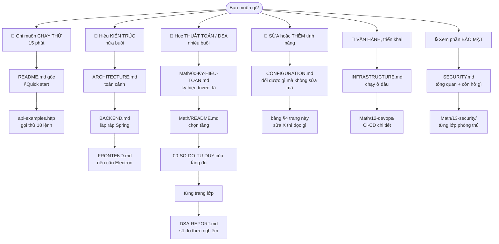

# Bản đồ tài liệu VnSearch

> **Trang này là gì?** Chỗ bắt đầu cho người **chưa từng đọc dòng mã nào** của
> dự án. Nó không giải thích thuật toán — nó nói cho bạn biết **đọc gì, theo
> thứ tự nào, và bỏ qua được cái gì**.
>
> Kho tài liệu này có **69 tệp, hơn 40.000 dòng**. Đọc tuần tự từ đầu đến cuối
> là cách chắc chắn bỏ cuộc. Hãy chọn một lộ trình bên dưới.

---

## 0. Ba mươi giây: dự án này là gì

Một **máy tìm kiếm tiếng Việt viết từ đầu** — crawler, chỉ mục đảo, xếp hạng,
REST API, cộng một trình duyệt mini để tra. Mọi cấu trúc dữ liệu lõi đều **tự
cài**, không dùng thư viện tìm kiếm có sẵn: chỉ mục đảo, nén VByte, PageRank,
Trie, Bloom filter, MinHeap, bộ tách từ tiếng Việt.
```
   ┌──────────┐      ┌──────────┐      ┌──────────┐      ┌──────────┐
   │ Crawler  │─────▶│  Index   │─────▶│ Ranking  │─────▶│ REST API │
   │ 43 lớp   │      │ 14 lớp   │      │ 10 lớp   │      │ 6 endpoint│
   └──────────┘      └──────────┘      └──────────┘      └────┬─────┘
        │                                                      │
        │ Kafka (tuỳ chọn)                            ┌────────▼────────┐
        └──▶ 3 Modular Service                        │  browser-app    │
             + kho ảnh                                │  Electron+React │
                                                      └─────────────────┘
```

Quy mô: **21.162 dòng Java** (main) + **7.025 dòng TypeScript**, 528 test Java
và 53 test Vitest, corpus **31.030 trang**.

---

## 1. Chọn lộ trình theo việc bạn định làm



Dạng chữ, cho nơi không dựng được Mermaid:
```
CHẠY THỬ     →  ../README.md §Quick start  →  api-examples.http
KIẾN TRÚC    →  ARCHITECTURE.md  →  BACKEND.md  →  FRONTEND.md
THUẬT TOÁN   →  Math/00-KY-HIEU-TOAN.md  →  Math/README.md
                →  <tầng>/00-SO-DO-TU-DUY.md  →  trang từng lớp  →  DSA-REPORT.md
SỬA / THÊM   →  CONFIGURATION.md  →  bảng §4 dưới đây
VẬN HÀNH     →  INFRASTRUCTURE.md  →  Math/12-devops/
BẢO MẬT      →  SECURITY.md  →  Math/13-security/
```

---

## 2. Lộ trình chi tiết cho người mới hoàn toàn

Nếu bạn không chắc mình muốn gì, đi đúng thứ tự này. Mỗi bước có **mốc kiểm
tra** — làm được thì đi tiếp, không làm được thì dừng lại ở đó.

| # | Bước | Đọc | Mốc kiểm tra |
|---|---|---|---|
| 1 | Chạy được backend | [`../README.md`](../README.md) §Quick start | `curl localhost:8080/api/health` trả `{"status":"UP"}` |
| 2 | Gọi được API | [`api-examples.http`](api-examples.http) | Tìm `hà nội` ra kết quả |
| 3 | Mở được giao diện | `run-frontend.bat` | Cửa sổ trình duyệt mini hiện lên |
| 4 | Hiểu các mảnh ghép | [`ARCHITECTURE.md`](ARCHITECTURE.md) §1–§3 | Vẽ lại được sơ đồ 4 khối từ trí nhớ |
| 5 | Hiểu một truy vấn đi qua đâu | [`BACKEND.md`](BACKEND.md) §8 | Kể được 6 chặng từ HTTP tới kết quả |
| 6 | Hiểu chỉ mục đảo | [`Math/03-index/00-SO-DO-TU-DUY.md`](Math/03-index/00-SO-DO-TU-DUY.md) | Giải thích được vì sao tra term là $O(\log n)$ |
| 7 | Hiểu xếp hạng | [`Math/05-ranking/00-SO-DO-TU-DUY.md`](Math/05-ranking/00-SO-DO-TU-DUY.md) | Nói được TF-IDF khác BM25 ở đâu |
| 8 | Đọc số đo | [`DSA-REPORT.md`](DSA-REPORT.md) §3 | Hiểu 1 trong 6 lỗi hiệu năng |

**Đến bước 8 là đủ để bảo vệ phần "hiểu hệ thống".** Từ đó trở đi là đào sâu.

---

## 3. Toàn bộ tài liệu, theo nhóm

### 3.1. Tài liệu gốc — trả lời câu hỏi lớn

| Tệp | Trả lời câu hỏi | Dòng |
|---|---|---:|
| [`ARCHITECTURE.md`](ARCHITECTURE.md) | Các mảnh ghép lại thành hệ thống thế nào? | ~960 |
| [`BACKEND.md`](BACKEND.md) | Ứng dụng Spring Boot lắp ra sao — bean, cấu hình, vòng đời request? | ~590 |
| [`FRONTEND.md`](FRONTEND.md) | Trình duyệt mini Electron + React hoạt động thế nào? | ~1.850 |
| [`CONFIGURATION.md`](CONFIGURATION.md) | **Đổi được gì mà không phải sửa mã?** | — |
| [`INFRASTRUCTURE.md`](INFRASTRUCTURE.md) | Chạy ở đâu, ai canh nó? Docker, Kubernetes, giám sát | ~490 |
| [`DEVOPS.md`](DEVOPS.md) | Mã đi từ máy tới cụm bằng cách nào? CI/CD, 7 cổng chặn | ~530 |
| [`SECURITY.md`](SECURITY.md) | Chống lại cái gì, và **còn hở chỗ nào**? | ~580 |
| [`DSA-REPORT.md`](DSA-REPORT.md) | Big-O và số đo thực nghiệm | ~1.670 |
| [`SO-SANH-PHUONG-AN.md`](SO-SANH-PHUONG-AN.md) | 13 bài toán, các phương án đã bác bỏ, và vì sao | ~1.120 |
| [`EVALUATION.md`](EVALUATION.md) | Đo chất lượng tìm kiếm: MRR, P@k, nDCG | ~290 |
| [`GIN-BASELINE.md`](GIN-BASELINE.md) | Đọ sức với full-text search của PostgreSQL | ~150 |
| [`api-examples.http`](api-examples.http) | 18 lệnh gọi thật, chạy được ngay — kèm 4 ca lỗi | — |

### 3.2. `Math/` — một trang cho mỗi lớp

Đây là phần dày nhất. **Đừng đọc tuần tự.** Vào
[`Math/README.md`](Math/README.md) chọn tầng, mỗi tầng bắt đầu bằng
`00-SO-DO-TU-DUY.md`.

| Tầng | Nội dung |
|---|---|
| [`00-KY-HIEU-TOAN.md`](Math/00-KY-HIEU-TOAN.md) | **Đọc trước tiên** nếu chưa quen ký hiệu toán |
| [`01-crawler/`](Math/01-crawler/00-SO-DO-TU-DUY.md) | Bloom filter, URL Frontier hai tầng, robots.txt, chuẩn hoá URL |
| [`03-index/`](Math/03-index/00-SO-DO-TU-DUY.md) | Tách từ tiếng Việt, chỉ mục đảo, nén VByte, từ điển term |
| [`04-query/`](Math/04-query/00-SO-DO-TU-DUY.md) | Phân tích truy vấn, cây AST, hợp/giao posting list |
| [`05-ranking/`](Math/05-ranking/00-SO-DO-TU-DUY.md) | TF-IDF, BM25, PageRank, top-K |
| [`06-datastructures/`](Math/06-datastructures/00-SO-DO-TU-DUY.md) | 6 cấu trúc tự cài, và vì sao không dùng thư viện |
| [`07-eval/`](Math/07-eval/00-SO-DO-TU-DUY.md) | Lấy đâu ra "đáp án đúng" để chấm điểm |
| [`08-frontend/`](Math/08-frontend/00-SO-DO-TU-DUY.md) | DSA phía trình duyệt: Stack, BookmarkTrie |
| [`09-design-patterns/`](Math/09-design-patterns/README.md) | 11 mẫu thiết kế, **và lỗi mà mỗi mẫu đã chữa** |
| [`10-kafka/`](Math/10-kafka/00-SO-DO-TU-DUY.md) | Kafka và cụm Modular Services |
| [`11-images/`](Math/11-images/00-SO-DO-TU-DUY.md) | Thu thập, chấm chất lượng và tìm kiếm ảnh |
| [`12-devops/`](Math/12-devops/00-SO-DO-TU-DUY.md) | CI/CD, Docker, Kubernetes, giám sát — chi tiết từng tệp |
| [`13-security/`](Math/13-security/00-SO-DO-TU-DUY.md) | Spring Security, chuỗi filter, CSP, sandbox Electron |

> **Không có nhóm `02-`.** Nhóm `02-tokenize/` cũ đã gộp vào `03-index/` vì
> `VietnameseTokenizer.java` vốn nằm trong package `index/`. Đánh số giữ
> nguyên để các liên kết cũ không chết.

---

## 4. Bảng tra nhanh: muốn sửa X thì đọc gì

Đây là bảng dùng nhiều nhất sau tuần đầu.

| Muốn làm | Đọc | Sửa ở đâu |
|---|---|---|
| Đổi mô hình chấm điểm TF-IDF ⇄ BM25 | [`CONFIGURATION.md`](CONFIGURATION.md) | `app.ranking.scorer` — **không cần sửa mã** |
| Chỉnh trọng số PageRank / tiêu đề | [`Math/05-ranking/ResultRanker.md`](Math/05-ranking/ResultRanker.md) | `app.ranking.beta`, `app.ranking.gamma` |
| Thêm một endpoint REST | [`BACKEND.md`](BACKEND.md) §5 | `controller/`, nhớ cập nhật `api-examples.http` |
| Thêm một nguồn báo để crawl | [`Math/01-crawler/00-SO-DO-TU-DUY.md`](Math/01-crawler/00-SO-DO-TU-DUY.md) | seed trong `run-crawl.bat` + `seedSites.ts` phía giao diện |
| Đổi cách tách từ tiếng Việt | [`Math/03-index/VietnameseTokenizer.md`](Math/03-index/VietnameseTokenizer.md) | `index/MaxWeightSegmenter.java` |
| Thêm một kênh IPC cho trình duyệt | [`FRONTEND.md`](FRONTEND.md) §7 + §13.1 | **4 nơi** phải khớp — bảng ở §13.1 |
| Thêm một store Zustand | [`FRONTEND.md`](FRONTEND.md) §9 + §13.2 | `renderer/src/store/` |
| Bật crawl phân tán bằng Kafka | [`Math/10-kafka/`](Math/10-kafka/00-SO-DO-TU-DUY.md) §9 | `docker compose --profile kafka` |
| Thêm một cổng chặn trong CI | [`Math/12-devops/`](Math/12-devops/00-SO-DO-TU-DUY.md) | `.github/workflows/ci.yml` |
| Siết một quy tắc bảo mật | [`Math/13-security/`](Math/13-security/00-SO-DO-TU-DUY.md) | `config/SecurityConfig.java` |
| Đo lại chất lượng tìm kiếm | [`EVALUATION.md`](EVALUATION.md) | chạy `EvaluationRunner` |

---

## 5. Bốn cái bẫy khiến người mới mất buổi đầu tiên

Gom lại đây vì cả bốn đều **không báo lỗi** — chúng chỉ im lặng làm sai.

1. **`/api/suggest` dùng `prefix`, không phải `q`.** Endpoint duy nhất lệch
   khỏi quy ước. Gõ `?q=` nhận `400`.

2. **Chỉ mục cũ hơn corpus.** Backend **ưu tiên** `data/index.json`. Sau một
   phiên crawl, tệp corpus mới hơn nhưng chỉ mục thì không — mọi truy vấn chạy
   bình thường, chỉ là trang vừa crawl không tìm ra. Chữa bằng một lần
   `POST /api/admin/reindex`. Xem [`BACKEND.md`](BACKEND.md) §6.3.

3. **Thiếu `ADMIN_API_KEY` thì ứng dụng từ chối khởi động.** Đây là **cố ý**,
   không phải lỗi: `/api/admin/**` tải được URL tuỳ ý, chạy không khoá là một
   lỗ hổng SSRF hoàn chỉnh. Xem [`SECURITY.md`](SECURITY.md).

4. **Số đo trong `DSA-REPORT.md` thuộc nhiều mốc corpus khác nhau.** 5.011 /
   30.001 / 30.017 / 31.030 là bốn mốc, không phải bốn cách đếm cùng một thứ.
   Bảng quy chiếu nằm ngay đầu [`DSA-REPORT.md`](DSA-REPORT.md).

---

## 6. Quy ước trong toàn bộ tài liệu

| Ký hiệu | Nghĩa |
|---|---|
| 🗺️ | Sơ đồ tư duy — điểm vào của một tầng, đọc trước các trang lẻ |
| ★ | Tệp quan trọng nhất trong nhóm |
| ✅ / ~~gạch ngang~~ | Hạn chế **đã được sửa** — giữ lại để thấy quá trình |
| ⚠️ | Bẫy đã có người vấp thật |
| `file.java:123` | Trỏ thẳng dòng mã — bấm được trong hầu hết trình soạn thảo |

**Mọi sơ đồ Mermaid đều kèm một bản ASCII.** Lý do: GitHub dựng được Mermaid,
nhưng bản in PDF và một số trình xem thì không — mà tài liệu này còn dùng để
nộp.

---

## 7. Tài liệu này có gì **chưa** làm

Nói trước để bạn không đi tìm:

- **Chưa có tài liệu tiếng Anh.** Chỉ `../README.md` gốc là tiếng Anh.
- **Chưa có JavaDoc dựng sẵn dạng web.** Chú thích trong mã rất dày — đó mới
  là nguồn chi tiết nhất cho từng hàm, `Math/` chỉ giải thích *vì sao*.
- **Chưa có video hay ảnh chụp màn hình quy trình.** Ảnh duy nhất là
  `Math/01-crawler/BloomFilter output.png`.
