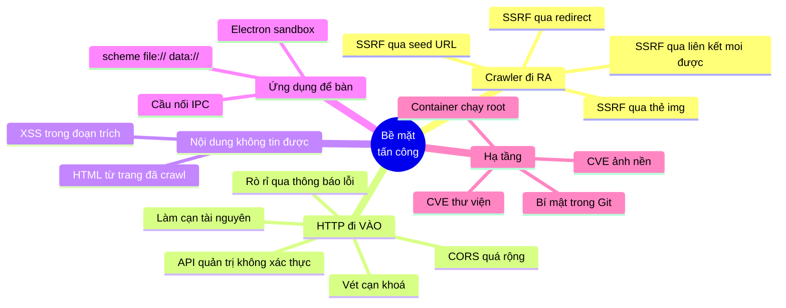
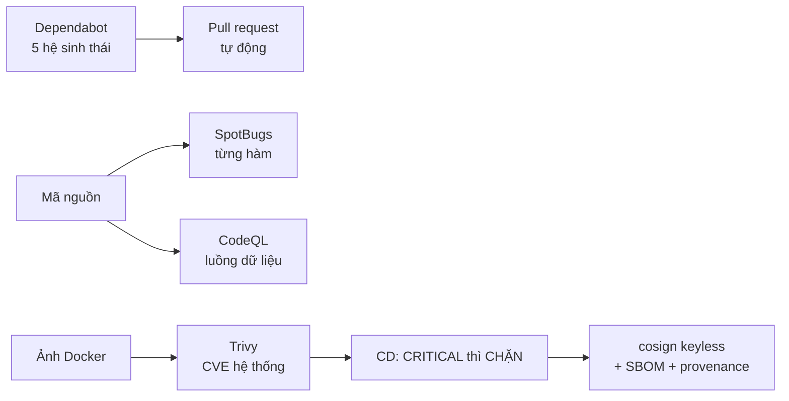

# Bảo mật — chống lại cái gì, bằng cách nào

> **Tài liệu này trả lời:** hệ thống này có những bề mặt tấn công nào, mỗi bề
> mặt được chặn ở đâu, và **những gì vẫn còn hở**.
>
> Mục cuối cùng là mục quan trọng nhất. Một tài liệu bảo mật chỉ liệt kê thứ
> mình làm tốt là một tài liệu marketing.

---

## Mục lục

1. [Bản đồ tư duy các bề mặt tấn công](#1-bản-đồ-tư-duy-các-bề-mặt-tấn-công)
2. [SSRF — bề mặt nguy hiểm nhất](#2-ssrf--bề-mặt-nguy-hiểm-nhất)
3. [Xác thực API quản trị](#3-xác-thực-api-quản-trị)
3b. [Tài khoản và vai trò](#3b-tài-khoản-và-vai-trò)
4. [Giới hạn tần suất](#4-giới-hạn-tần-suất)
5. [Phân quyền theo đường dẫn](#5-phân-quyền-theo-đường-dẫn)
6. [CORS](#6-cors)
7. [Rò rỉ thông tin qua thông báo lỗi](#7-rò-rỉ-thông-tin-qua-thông-báo-lỗi)
8. [XSS trong đoạn trích](#8-xss-trong-đoạn-trích)
9. [Bảo mật Electron](#9-bảo-mật-electron)
10. [Cứng hoá container và cụm](#10-cứng-hoá-container-và-cụm)
11. [Quản lý bí mật](#11-quản-lý-bí-mật)
12. [Chuỗi cung ứng](#12-chuỗi-cung-ứng)
13. [NHỮNG GÌ CÒN HỞ](#13-những-gì-còn-hở)

---

## 1. Bản đồ tư duy các bề mặt tấn công


```
   ┌─────────────── HAI HƯỚNG, HAI LOẠI PHÒNG THỦ ───────────────┐
   │                                                              │
   │   ĐI RA (crawler)              ĐI VÀO (HTTP)                │
   │   ─────────────────            ──────────────────           │
   │   Ta CHỦ ĐỘNG gửi request      Người khác gửi request tới   │
   │   tới địa chỉ do NGƯỜI KHÁC    ta                           │
   │   chỉ định                                                   │
   │                                                              │
   │   → SSRF: danh sách CHO PHÉP   → Xác thực + giới hạn tần suất│
   │     + kiểm tra SAU phân giải     + phân quyền + không rò rỉ  │
   │       DNS, ở TỪNG chặng                                      │
   └──────────────────────────────────────────────────────────────┘
```

---

## 2. SSRF — bề mặt nguy hiểm nhất

**SSRF (Server-Side Request Forgery)** là bề mặt lớn nhất của dự án này, vì bản
chất công việc của crawler là *gửi request tới địa chỉ do người khác chỉ định*.

### 2.1. Bốn đường vào, và cả bốn đều phải chặn
```
   ①  Seed URL từ POST /api/admin/crawl
          → SeedUrlValidator
   ②  Chuyển hướng HTTP 3xx từ một trang hợp lệ
          → HtmlDownloader, kiểm TỪNG chặng
   ③  Liên kết do LinkExtractor moi ra từ trang đã tải
          → HtmlDownloader, cùng phép kiểm
   ④  Thẻ  trong trang đã tải
          → ImageDownloadService KHÔNG tự mở kết nối (mặc định)
```

Đường ② là đường tinh vi nhất và là lỗ hổng thật đã được vá:
```
   seed: https://trang-cua-toi.com/     ✅ IP công cộng, qua kiểm tra
              │  HTTP 302
              ▼
        http://169.254.169.254/latest/meta-data/iam/
              ↑ Jsoup TỰ đi theo — nếu bật followRedirects thì
                KHÔNG ai kiểm chặng này
```

`169.254.169.254` là endpoint metadata của AWS/GCP/Azure. Đọc được nó là đọc
được **thông tin đăng nhập IAM của máy chủ**.

Cách vá: **tắt `followRedirects` của Jsoup và tự đi từng chặng**, để chạy đúng
một phép kiểm tra **trước mỗi lần mở kết nối**. Chặng thứ mười được soi kỹ như
chặng đầu. Trần 5 chặng chặn vòng lặp chuyển hướng.

### 2.2. Phép kiểm tra: danh sách CHO PHÉP + kiểm SAU phân giải DNS

```java
// SeedUrlValidator.isBlockedAddress — dùng lại bởi HtmlDownloader
address.isLoopbackAddress()      // 127.0.0.0/8, ::1
  || address.isLinkLocalAddress()  // 169.254.0.0/16 metadata, fe80::/10
  || address.isSiteLocalAddress()  // 10/8, 172.16/12, 192.168/16
  || address.isAnyLocalAddress()   // 0.0.0.0, ::
  || address.isMulticastAddress()
  || isUniqueLocalIpv6(address)    // fc00::/7   — không có sẵn phép kiểm
  || isCarrierGradeNat(address);   // 100.64.0.0/10 (RFC 6598)
```

**Bốn quyết định đáng giải thích:**

| Quyết định | Vì sao |
|---|---|
| Kiểm **sau** khi phân giải DNS, không kiểm chuỗi | `http://xyz.com` có thể trỏ tới `127.0.0.1`. So sánh chuỗi không thấy gì cả |
| Dùng `InetAddress.isXxx()` sẵn có | Chúng xử lý đúng cả IPv4 lẫn IPv6, kể cả dạng IPv4 trong vỏ IPv6 (`::ffff:127.0.0.1`) — biến thể mà phép so sánh chuỗi tự viết gần như chắc chắn bỏ sót |
| Thêm `fc00::/7` và `100.64.0.0/10` | JDK không coi hai dải này là nội bộ, nhưng trong một mạng đám mây chúng vẫn trỏ tới hạ tầng không công khai |
| Chỉ chấp nhận `http`/`https` | Chặn `file:`, `gopher:`, `jar:` — những scheme mà một redirect có thể trả về |

### 2.3. Mọi thông báo từ chối đều GIỐNG HỆT nhau

Đây là chi tiết dễ bỏ qua nhất, và nó quan trọng:

```java
private static final String REJECTED = "..."; // MỘT chuỗi duy nhất

// host không phân giải được  → REJECTED
// host trỏ vào mạng nội bộ   → REJECTED
// host trong danh sách chặn  → REJECTED
```

Nếu ba ca này trả về ba câu khác nhau, kẻ gọi phân biệt được *"host này không
tồn tại"* với *"host này tồn tại và ở trong mạng nội bộ"* — tức **một phép quét
mạng nội bộ, dùng đúng chính lớp chặn SSRF làm công cụ**.

### 2.4. Vì sao ảnh mặc định KHÔNG được tải

`app.crawler.images.download=false`. `ImageDownloadService` mặc định **chỉ ghi
siêu dữ liệu**, không mở kết nối nào. Ba lý do, và lý do thứ hai là bảo mật: một
thẻ `` trong trang đã crawl là một đường
SSRF nữa, và nó **không đi qua** `AdminController`.

### 2.5. Rủi ro còn lại: DNS rebinding

Phép kiểm tra phân giải tên miền qua `DnsResolver`, còn Jsoup **tự phân giải lần
nữa** lúc mở socket. Về lý thuyết bản ghi DNS có thể đổi giữa hai lần đó.

Cửa sổ này hẹp — `DnsResolver` có cache nên phần lớn lần tải dùng lại đúng địa
chỉ vừa kiểm tra — nhưng **đóng hẳn** thì phải ghim IP rồi tự đặt header `Host`,
việc này phá SNI của HTTPS.

> Ghi nhận là **rủi ro còn lại**, không phải chỗ bị bỏ sót. Đây là khác biệt
> giữa một phòng thủ được hiểu và một phòng thủ được sao chép.

---

## 3. Xác thực API quản trị

`/api/admin/**` điều khiển crawler và **có thể tải URL tuỳ ý** — nếu để công
khai, đó là một lỗ hổng SSRF đầy đủ chứ không chỉ là "API không được bảo vệ".

### 3.1. Khoá API dùng cho CÔNG CỤ, tài khoản dùng cho CON NGƯỜI

> **Ghi chú lịch sử.** Mục này trước đây viết: *"Hệ thống này không có người
> dùng nào cả"* — và đó là sự thật đúng ở thời điểm ấy. Từ khi có bảng điều
> khiển quản trị, câu hỏi *"tài khoản nào là admin, tài khoản nào là người dùng
> thường?"* trở thành một câu hỏi có nghĩa, và câu trả lời "không có tài khoản
> nào, chỉ có một cái khoá" không còn đủ. Hệ tài khoản được thêm vào ở
> [§3b](#3b-tài-khoản-và-vai-trò); **khoá API vẫn giữ nguyên**, cho đúng việc mà
> nó làm tốt.

Hai cơ chế xác thực song song, mỗi cái cho một loại bên gọi:

| | Khoá API (`X-API-Key`) | Tài khoản (`Authorization: Bearer`) |
|---|---|---|
| Ai dùng | công cụ: `curl`, job định kỳ, script triển khai | con người ngồi trước màn hình |
| Danh tính | **không có** — mọi lời gọi giống hệt nhau | có: ghi được "ai đã làm gì" |
| Hết hạn | không bao giờ | 12 giờ |
| Thu hồi | phải đổi cấu hình + khởi động lại | một lần bấm "đăng xuất", hiệu lực tức thì |
| Vai trò | luôn là ADMIN đầy đủ | USER hoặc ADMIN |

Giữ cả hai chứ không bỏ khoá API đi, vì khoá tĩnh là thứ **duy nhất** dùng được
ở nơi không có ai đăng nhập — và nó là **lối vào dự phòng khi kho tài khoản
hỏng**. Một hệ thống mà cách duy nhất để vào là đăng nhập, và tệp tài khoản vừa
hỏng, là một hệ thống tự khoá mình ra ngoài.

### 3.2. So sánh chuỗi thời gian hằng số

```java
MessageDigest.isEqual(provided, expectedKey)   // ĐÚNG
provided.equals(expectedKey)                    // SAI
```

`String.equals` thoát ra **ngay tại ký tự đầu tiên khác nhau**, nên thời gian
chạy rò rỉ *độ dài tiền tố đúng* của khoá đoán. Đo đủ chênh lệch này qua nhiều
request, kẻ tấn công đoán được từng ký tự một:
```
   không gian tìm kiếm:  62^32  →  62 × 32
```

`MessageDigest.isEqual` luôn duyệt hết độ dài.

### 3.3. Thiếu khoá thì ứng dụng KHÔNG khởi động

```java
throw new IllegalStateException("Thieu app.security.admin-api-key ...");
```

Phương án còn lại — sinh một khoá ngẫu nhiên rồi in ra log — nghe thân thiện hơn
nhưng tạo ra một hệ thống **có vẻ** đang chạy bình thường trong khi không ai
biết khoá là gì, và lần triển khai sau lại sinh khoá khác.

> **Hỏng to còn hơn hỏng âm thầm.** Một hệ thống "có bảo vệ" mà bảo vệ bằng khoá
> mặc định ai cũng biết thì **nguy hiểm hơn** hệ thống không bảo vệ, vì nó tạo
> cảm giác an toàn sai.

Có thêm kiểm tra độ dài tối thiểu 16 ký tự.

---

## 3b. Tài khoản và vai trò

### Hai vai trò, và ranh giới giữa chúng

```
   KHÁCH                 NGƯỜI DÙNG (USER)        QUẢN TRỊ (ADMIN)
   chưa đăng nhập        đã đăng nhập             đã đăng nhập + vai trò ADMIN
   ─────────────────     ──────────────────       ────────────────────────────
   tìm kiếm              tìm kiếm                 tìm kiếm
   xem kết quả           xem kết quả              + đọc số liệu sử dụng
   gửi sự kiện           + /api/auth/me           + điều khiển crawler
   (ẩn danh)             + hành vi được quy       + quản lý tài khoản
                           về tài khoản
```

Tìm kiếm **không đòi đăng nhập** — đó là chức năng chính của một máy tìm kiếm,
và bắt đăng nhập để dùng nó là một quyết định sản phẩm tồi. Đăng nhập chỉ mở
thêm những thứ *cần biết bạn là ai*.

### Băm mật khẩu: BCrypt cost 12, không phải SHA-256

Đây là chỗ dễ làm sai nhất và hậu quả nặng nhất:

| | SHA-256 | BCrypt (đang dùng) |
|---|---|---|
| Thiết kế để | **nhanh** | **chậm có kiểm soát** |
| GPU phổ thông | hàng tỉ hash/giây | vài nghìn/giây ở cost 12 |
| Salt | phải tự thêm (và nhiều người quên) | tự sinh, nhúng trong chuỗi hash |
| Tệp hash bị lộ | mọi mật khẩu yếu vỡ trong vài phút | phá ngoại tuyến trở nên vô vọng |

Salt là thứ chặn *bảng tra ngược*: không có salt, hai người đặt cùng mật khẩu
sẽ có cùng hash — phá một lần được cả hai, lại còn lộ ra là họ trùng mật khẩu.

Cost 12 tốn khoảng 100–250 ms mỗi lần băm. Đó là **cố ý**: không đáng kể với
một người đăng nhập một lần mỗi phiên, nhưng nhân với hàng tỉ lần thử thì thành
bức tường.

### Luật mật khẩu: chỉ ràng buộc độ dài

Tối thiểu 8 ký tự, tối đa 200. **Không** bắt "phải có chữ hoa, số và ký tự đặc
biệt" — những luật đó nghe chặt nhưng đẩy người dùng tới đúng một khuôn dễ đoán
(`Password1!`), trong khi một cụm bốn từ ngẫu nhiên dài 20 ký tự vừa dễ nhớ hơn
vừa khó phá hơn nhiều lần. Đây là khuyến nghị của NIST từ 2017.

Trần 200 ký tự để chặn tấn công làm nghẽn bằng cách gửi chuỗi khổng lồ cho
BCrypt băm. (BCrypt vốn chỉ dùng 72 byte đầu.)

### Chống dò mật khẩu: khoá tạm THEO TÀI KHOẢN

`RateLimitFilter` giới hạn theo **địa chỉ**, nên nó không chặn được kiểu tấn
công ngược lại: một mạng botnet thử *một* mật khẩu phổ biến trên *hàng nghìn*
tài khoản, mỗi địa chỉ chỉ gửi vài request. Bộ đếm trong `UserService` giới hạn
theo **tài khoản** — 5 lần sai thì khoá 15 phút — nên nó bịt đúng chỗ kia bỏ sót.

Khoá **tạm** chứ không vĩnh viễn: khoá vĩnh viễn biến một cuộc dò mật khẩu
thành một cuộc **tấn công từ chối dịch vụ** nhắm vào người dùng thật — chỉ cần
gõ sai vài lần trên tài khoản của người khác là khoá được họ ra ngoài mãi mãi.

### Thông báo lỗi cố tình mơ hồ

Sai tên và sai mật khẩu trả về **cùng một câu**. Phân biệt hai ca biến trang
đăng nhập thành công cụ *liệt kê tài khoản*: kẻ tấn công thử một danh sách tên
và biết chính xác tên nào có thật.

Đi kèm một chi tiết dễ bỏ sót: khi tên **không tồn tại**, `UserService` vẫn băm
một chuỗi giả trước khi từ chối. Không làm vậy thì ca đó trả về gần như tức thì
còn ca "sai mật khẩu" tốn ~200 ms — và chênh lệch thời gian đó tự nó là một máy
dò tên tài khoản, làm cho thông báo mơ hồ ở trên thành vô nghĩa.

### Không có đường nào tự cấp vai trò ADMIN

`UserService.register` **không nhận tham số vai trò** — nó luôn tạo `USER`.
Nhận vai trò từ thân request đăng ký là lỗ hổng leo thang quyền kinh điển: chỉ
cần thêm `"role":"ADMIN"` vào JSON là xong. Vai trò chỉ đặt được qua
`createAccount` (hàm nội bộ, dùng cho tài khoản mồi) hoặc
`POST /api/admin/users/{tên}/role` — endpoint đã cần vai trò ADMIN sẵn có.

Hai bảo vệ nữa của việc đổi vai trò:

- **Không tự hạ quyền chính mình.** Người quản trị cuối cùng hạ vai trò của
  chính họ sẽ khoá hệ thống từ bên trong.
- **Đổi vai trò đóng mọi phiên của người đó.** Không làm vậy thì quyền bị thu
  hồi *trên giấy* nhưng phiên cũ vẫn mang vai trò cũ thêm nhiều giờ.

### Token phiên: vì sao KHÔNG dùng JWT

| | JWT | Token mờ (đang dùng) |
|---|---|---|
| Xác minh | không cần trạng thái | tra bảng băm trong bộ nhớ |
| **Đăng xuất** | **không có hiệu lực ngay** — phải dựng danh sách đen, tức lại cần trạng thái | xoá một dòng, tức thì |
| Hạ vai trò | vô hiệu tới khi token cũ hết hạn | có hiệu lực ở request kế tiếp |
| Nhiều bản sao | chạy được ngay | cần kho dùng chung (Redis) |

Cái lợi duy nhất của JWT — xác minh không cần trạng thái — chỉ có giá trị khi có
nhiều dịch vụ hoặc nhiều bản sao. Hệ thống này là **một** tiến trình phục vụ
**một** ứng dụng khách, và nó thật sự cần thu hồi tức thì (đây là trang điều
khiển được crawler).

Token là **256 bit từ `SecureRandom`**, mã Base64-URL. Không dùng
`java.util.Random` (đoán được trạng thái sau vài mẫu) hay `UUID.randomUUID()`
(chỉ 122 bit, có cấu trúc cố định).

Hệ quả phải chấp nhận và **nói thẳng**: khởi động lại máy chủ là mọi người bị
đăng xuất. Chỗ để sửa khi cần là thay bảng băm bằng Redis, không phải đổi sang JWT.

### Token lưu bền, khoá API thì không

Hai bí mật, hai cách đối xử — và sự khác biệt là có lý do:

| | Khoá quản trị | Token phiên |
|---|---|---|
| Lưu ở đâu | **chỉ trong bộ nhớ** | `localStorage` |
| Hết hạn | không | 12 giờ |
| Thu hồi | không | được, tức thì |
| Quyền | luôn ADMIN đầy đủ | đúng vai trò của tài khoản |

Một bí mật vĩnh viễn, không thu hồi được, quyền cao nhất thì không đáng nằm lại
trên đĩa để đổi lấy việc đỡ gõ. Một token hết hạn và huỷ được thì đáng — và cái
giá của việc không lưu nó là bắt người dùng đăng nhập lại mỗi lần mở ứng dụng.

Rủi ro còn lại: `localStorage` đọc được bởi mọi mã chạy trong renderer, nên một
lỗ hổng XSS sẽ lấy được token. Thứ chặn điều đó là **CSP nghiêm ngặt** trong
`index.html` cộng với việc renderer không bao giờ nạp mã từ xa (§9) — chứ không
phải bản thân `localStorage`.

### Xoá tài khoản khác vô hiệu hoá

| | Vô hiệu hoá | Xoá hẳn |
|---|---|---|
| Bản ghi | giữ nguyên | mất |
| Tên tài khoản | vẫn bị chiếm | được giải phóng |
| Hồi lại | bật lại là xong | không |
| Số liệu theo tên | vẫn thuộc về người đó | người đăng ký lại đúng tên đó sẽ **gộp chung một dòng** |

Dòng cuối là lý do **vô hiệu hoá mới là mặc định đúng**, còn xoá chỉ dành cho
dọn tài khoản rác. Xoá cũng dọn luôn bộ đếm khoá tạm của tên đó — giữ lại thì
tên vừa xoá mang theo một "án treo" vô hình sang chủ mới.

Chặn tự xoá chính mình, cùng lý do với đổi vai trò nhưng hậu quả nặng hơn:
người quản trị cuối cùng tự xoá thì không còn tài khoản nào nâng lại được.

### Đổi mật khẩu: ba quyết định

**1. Vẫn phải nhập mật khẩu hiện tại.** Nghe thừa — người gọi đã có token hợp
lệ. Nhưng đó chính là kịch bản cần chặn: một chiếc **token bị đánh cắp** (máy
bỏ quên không khoá, token lấy qua XSS). Không hỏi mật khẩu cũ thì kẻ cầm token
đổi được mật khẩu và **khoá chính chủ nhân ra ngoài** — biến một phiên bị lộ
tạm thời thành mất tài khoản vĩnh viễn. Mật khẩu là thứ token không chứa.

**2. Sai mật khẩu hiện tại cũng tính vào bộ đếm khoá tạm.** Không tính thì
endpoint này thành một máy dò mật khẩu không giới hạn cho bất kỳ ai có một
token — vòng qua đúng lớp bảo vệ mà trang đăng nhập đã dựng.

**3. Đóng mọi phiên KHÁC, giữ phiên đang dùng.** Lý do phổ biến nhất để đổi mật
khẩu là *nghi có người khác đang dùng tài khoản của mình*; không đóng thì kẻ kia
vẫn ở trong và người dùng tưởng mình đã an toàn. Nhưng đá luôn cả người vừa đổi
ra khỏi thiết bị họ đang ngồi thì chỉ gây khó chịu mà không thêm an toàn nào.

Ba mức đóng phiên, ba nút khác nhau:

```
   /logout          chỉ phiên tại đây          "tôi rời máy"
   /password        mọi phiên TRỪ phiên này    "tôi nghi bị lộ ở nơi khác"
   /logout-all      MỌI phiên, kể cả phiên này "đóng hết, tôi sẽ đăng nhập lại"
```

### Kiểm tra dữ liệu ở giao diện KHÔNG phải lớp bảo vệ

`browser-app/src/renderer/src/lib/validation.ts` lặp lại luật tên tài khoản và
độ dài mật khẩu của máy chủ. Nó tồn tại **chỉ để người dùng biết mình gõ sai
ngay khi gõ**, thay vì bấm nút, chờ một vòng mạng, rồi mới đọc được lỗi. Một
request `curl` bỏ qua hoàn toàn tệp đó.

Ràng buộc kèm theo: luật ở giao diện phải **khớp** với máy chủ. Chặt hơn thì
chặn oan giá trị hợp lệ; lỏng hơn thì lời hứa "gõ thế này là được" bị máy chủ
bác bỏ — trường hợp sau tệ hơn, vì nó dạy người dùng đừng tin thông báo của
giao diện.

Một ngoại lệ có chủ ý: màn hình **đăng nhập** không kiểm luật độ dài mật khẩu.
Luật có thể đã đổi kể từ lúc người đó tạo tài khoản, và chặn họ đăng nhập vì
mật khẩu cũ "không đạt chuẩn mới" là chặn nhầm hoàn toàn.

### Tài khoản quản trị đầu tiên

| Cách | Vấn đề |
|---|---|
| Mật khẩu mặc định trong mã (`admin/admin`) | **Loại bỏ ngay.** Mọi bản triển khai cùng một mật khẩu ai cũng biết |
| Người đăng ký ĐẦU TIÊN tự động thành admin | Kẻ nào tìm thấy máy chủ trước chủ nhân thì chiếm được quyền |
| **Biến môi trường, không có mặc định** (chọn) | Phải cấu hình thêm một bước |

```bash
export BOOTSTRAP_ADMIN_PASSWORD='...'   # không có giá trị mặc định
```

Thiếu biến này thì **cảnh báo, không chặn khởi động** — khác với `ADMIN_API_KEY`.
Hai thứ khác nhau: thiếu khoá API nghĩa là endpoint quản trị *không có gì bảo
vệ* (phải chặn), còn thiếu tài khoản mồi chỉ nghĩa là *chưa ai đăng nhập được
bằng tài khoản* — máy tìm kiếm vẫn phục vụ bình thường và khoá API vẫn là lối
vào. Chặn khởi động ở đây sẽ làm hỏng chức năng chính vì một tính năng phụ chưa
cấu hình.

Tài khoản mồi **không bị ghi đè** nếu đã tồn tại: ghi đè nghĩa là mỗi lần khởi
động lại đặt mật khẩu về giá trị trong biến môi trường, nuốt mất mọi lần người
quản trị tự đổi mật khẩu.

### Kho tài khoản: tệp JSON, ghi nguyên tử

`data/users.json`, đọc vào bộ nhớ lúc khởi động (tỉ lệ đọc/ghi hàng nghìn trên
một, nên đọc phải là tra bảng băm chứ không phải mở tệp).

Ghi thì **ra tệp tạm rồi đổi tên**: ghi đè trực tiếp có một cửa sổ chết người —
tiến trình bị giết giữa lúc ghi để lại JSON **cụt**, và lần khởi động sau mất
toàn bộ tài khoản. Phép đổi tên là nguyên tử ở mức hệ thống tệp, nên tệp đích
luôn hoặc là bản cũ nguyên vẹn, hoặc là bản mới nguyên vẹn.

Một bản ghi hỏng (con người sửa tay nhầm) bị **bỏ qua** chứ không làm sập cả
kho; một vai trò lạ trong tệp bị hạ về `USER` — hướng an toàn, vì mất quyền thì
người thật báo ngay, còn *thừa* quyền thì không ai phát hiện.

### Quyền riêng tư đổi khi có tài khoản

Trước khi có tài khoản, số liệu sử dụng là ẩn danh **theo thiết kế**: mã phiên
ngẫu nhiên không chỉ tới ai. Nay với người đã đăng nhập, quản trị viên đọc được
*người này đã tìm bao nhiêu lần*. Đó là một quyền lực thật, và ranh giới được
đặt như sau:

- bảng xếp hạng người dùng chỉ hiện **tên và số lượt**, không hiện truy vấn của
  từng người — nó trả lời "ai dùng nhiều", không trả lời "người này tìm gì";
- người **không đăng nhập** vẫn hoàn toàn ẩn danh;
- danh tính lấy từ **ngữ cảnh bảo mật của request**, không phải từ một trường
  trong thân JSON — nếu tin lời tự khai thì ai cũng gán được hành vi cho người
  khác bằng một dòng `curl`.

---

## 4. Giới hạn tần suất

Một truy vấn không được cache có thể phải chấm điểm hàng nghìn ứng viên. Không
có giới hạn nào thì **một vòng lặp `curl` đơn giản cũng đủ làm CPU đạt trần** —
không cần lỗi nào cả, chỉ cần gọi API đúng cách nhưng quá nhanh.

### 4.1. Token bucket, không phải đếm theo cửa sổ cố định
```
   Cửa sổ cố định:  |....120....||....120....|   ← 240 req quanh ranh giới
                              ^^ biên
   Token bucket:    gáo chứa tối đa N token, đổ lại N/60 token mỗi giây
                    → tốc độ trung bình bị chặn ở MỌI thời điểm
```

Đếm theo phút lịch có lỗi **biên cửa sổ**: 120 request lúc 10:00:59 và 120
request nữa lúc 10:01:00 đều hợp lệ — tức 240 request trong một giây.

### 4.2. Ba chi tiết đúng đắn

| Chi tiết | Vì sao |
|---|---|
| Đặt **trước** chuỗi filter Spring Security (`order = Integer.MIN_VALUE`) | Một trận request không hợp lệ phải bị chặn **trước** khi tốn chi phí phân giải xác thực |
| Đăng ký qua `FilterRegistrationBean`, không phải `@Component` | Nếu không, Spring Boot gắn nó vào chuỗi filter servlet **hai lần** |
| `X-Forwarded-For` chỉ đọc khi `trust-proxy=true` | Header này do **client** gửi. Tin nó vô điều kiện = đổi header mỗi request là mỗi request thành một "địa chỉ" mới với gáo đầy — bộ giới hạn bị **vô hiệu hoàn toàn** |

### 4.3. Trần bộ nhớ là bắt buộc

`MAX_TRACKED_CLIENTS = 100_000`. Không có trần thì chính bộ giới hạn tần suất
**trở thành một lỗ rò rỉ bộ nhớ**: mỗi địa chỉ giả mạo thêm một mục vào bảng, và
bảng không bao giờ được dọn. Chạm trần thì bảng bị xoá sạch — thô, nhưng chặn
trên bộ nhớ là điều bắt buộc, còn độ chính xác của hạn mức thì không.

### 4.4. Giới hạn đã biết

- **Theo từng tiến trình.** Chạy hai bản sao thì hạn mức thực tế nhân đôi. Dùng
  chung hạn mức đòi hỏi một kho đếm ngoài (Redis).
- **Định danh bằng địa chỉ IP**, mà IP giả mạo được và nhiều người dùng có thể
  dùng chung một NAT. Đây là phép chặn **thô**, không phải phép chống lạm dụng
  tinh vi.

---

## 5. Phân quyền theo đường dẫn
```
   CÔNG KHAI                        CẦN X-API-Key
   ─────────────────────────        ─────────────────────────
   GET  /api/search                 POST /api/admin/crawl
   GET  /api/suggest                POST /api/admin/reindex
   GET  /api/health                 GET  /api/admin/stats
   GET  /api/images                 GET  /api/admin/crawl/{id}/status
   GET  /api/feed                   GET  /api/admin/analytics
   POST /api/events                 POST /api/admin/analytics/reset
   GET  /actuator/health/**         GET  /actuator/**  (còn lại)
   GET  /actuator/prometheus
   ─────────────────────────────────────────────────────────
   MỌI THỨ KHÁC → denyAll()
```

**`.anyRequest().denyAll()`** là dòng quan trọng nhất: mặc định là **từ chối**.
Thêm một endpoint đọc dữ liệu mà quên khai báo thì nó trả 401 — ồn ào, dễ thấy,
sửa ngay. Đây đúng là lý do `/api/images` trả 401 ở lần chạy đầu tiên.

**Vì sao CSRF được tắt có chủ ý.** Đây là API không trạng thái, xác thực bằng
**header** chứ không bằng cookie. Tấn công CSRF dựa trên việc trình duyệt *tự
động* đính kèm thông tin xác thực; header `X-API-Key` thì không bao giờ được
đính kèm tự động, nên không có gì để giả mạo.

**Vì sao `/actuator/prometheus` công khai.** Bộ thu thập số liệu không gửi được
header tuỳ ý trong cấu hình mặc định, và endpoint này chỉ phơi bày số liệu tổng
hợp. Trong một triển khai thật, nó nên bị chặn ở **tầng mạng** — ranh giới mà
ứng dụng không tự đặt được.

### Số liệu sử dụng: một tài nguyên, hai chiều, hai mức quyền

Đây là chỗ duy nhất trong hệ thống mà **quyền được đặt theo *chiều* của dữ liệu
chứ không theo đường dẫn**, nên nó đáng được nói riêng.

```
   GHI  POST /api/admin? KHÔNG          ĐỌC  GET /api/admin/analytics
   POST /api/events  ─ công khai        ─ vai trò ADMIN
   ┌──────────────────────────┐         ┌──────────────────────────┐
   │ mọi người dùng đều phải  │         │ số liệu tổng hợp phơi ra │
   │ báo được hành vi, nếu    │  ────▶  │ TOÀN BỘ truy vấn mà mọi  │
   │ không thì không còn số   │         │ người dùng đã gõ         │
   │ liệu nào để đọc          │         │                          │
   └──────────────────────────┘         └──────────────────────────┘
```

Đóng chiều ghi lại thì chỉ quản trị viên đóng góp được số liệu — tức là không
còn số liệu nào đáng đọc. Mở chiều đọc ra thì bất kỳ ai cũng xem được người
khác đang tìm gì. Ranh giới đúng nằm **giữa hai chiều**, không phải ở một
trong hai.

Ba điều làm cho việc mở chiều ghi chấp nhận được:

| Rủi ro của một endpoint ghi công khai | Cái chặn nó |
|---|---|
| Làm ngập bằng request | `RateLimitFilter` đã bọc sẵn `/api/*` — 120 req/phút mỗi địa chỉ |
| Chuỗi khổng lồ làm phình bộ nhớ | Bean Validation chặn độ dài tại controller, `UsageAnalyticsService` cắt lại lần nữa |
| Nhồi khoá lạ cho tới khi hết heap | Mọi bảng thống kê đều có **trần** (5.000 truy vấn, 5.000 liên kết, 20.000 phiên); chạm trần thì bỏ khoá mới và bật cờ `truncated` |

Hệ quả phải chấp nhận và **phải nói ra**: số liệu này *không đáng tin để ra
quyết định pháp lý hay tính tiền* — ai cũng gửi được sự kiện giả. Nó đủ tin cho
đúng việc nó phục vụ: nhìn xu hướng sử dụng của chính ứng dụng mình.

**Quyền riêng tư.** Không nhận và không lưu địa chỉ IP, không cookie. Mã phiên
là chuỗi ngẫu nhiên do máy khách sinh — nó gom các hành động của một phiên lại
với nhau nhưng không chỉ tới một con người. Bảng điều khiển cần biết *có bao
nhiêu phiên*, không cần biết *ai*.

**Ràng buộc theo phương thức, không theo đường dẫn.** Dòng khai báo là
`requestMatchers(HttpMethod.POST, "/api/events")`. Nếu sau này có ai thêm một
`GET /api/events` (chẳng hạn để đọc lại nhật ký sự kiện), nó sẽ **không** tự
động thừa hưởng quyền công khai — nó rơi vào `denyAll()` và trả 401 ngay lần
gọi đầu.

### Bảng phân quyền hiển thị ngay trong sản phẩm

Bảng điều khiển quản trị của browser-app có một khối *Phân quyền truy cập* liệt
kê đúng bảng trên, kèm vai trò của phiên đang chạy. Đây là bản **chép lại** của
`SecurityConfig` cho người đọc, nên nó có nguy cơ lệch khỏi bản gốc — đánh đổi
lấy việc người vận hành nhìn thấy ranh giới quyền ngay tại nơi họ đang đứng.

Điều quan trọng hơn cần nhớ: **ẩn hay hiện nút ở giao diện không phải là phân
quyền.** Nút vào khu vực quản trị luôn hiển thị kể cả khi chưa đăng nhập — ẩn
nó đi không chặn được gì (một lệnh `curl` không có khoá vẫn nhận 401) mà còn
giấu mất lối vào của chính người có quyền.

### Actuator: không bao giờ dùng `*`

```properties
management.endpoints.web.exposure.include=health,metrics,prometheus
```

Nhóm mặc định còn chứa `/actuator/env` (phơi bày **mọi** biến môi trường, kể cả
`ADMIN_API_KEY` và mật khẩu CSDL) và `/actuator/heapdump` (tải về **toàn bộ bộ
nhớ tiến trình**). `show-details=never` cho health để không lộ chi tiết nội bộ.

---

## 6. CORS

```java
.allowedOriginPatterns(allowedOrigins, "file://*", "null")
.allowedMethods("GET", "POST", "OPTIONS")
.allowedHeaders("Accept", "Content-Type", "X-API-Key")
.allowCredentials(false)
.maxAge(3600);
```

**Vì sao goc `"null"` phải nằm trong danh sách.** Nhìn qua thì đây là mục đáng
ngờ nhất — goc `null` cũng được gửi bởi iframe sandbox và trang `data:`. Nhưng
bỏ nó đi thì **bản đóng gói của browser-app ngừng hoạt động**: renderer lúc đó
được nạp qua `file://`, và Chromium gửi `Origin: null` cho mọi request đi ra từ
một trang `file://`.

Ba điều làm đánh đổi đó chấp nhận được:

1. **`allowCredentials(false)`** — đây mới là thứ biến một cấu hình CORS rộng
   thành một lỗ hổng. Không có nó, trình duyệt **tự động** đính kèm cookie của
   nạn nhân. Ghi tường minh dù đó là mặc định, để một lần sửa sau này phải là
   quyết định có ý thức.
2. **Chỉ hai phương thức thật sự tồn tại.** Trước đây danh sách có cả `PUT` và
   `DELETE` trong khi toàn bộ API không có lấy một endpoint nào dùng chúng.
3. **Danh sách header cụ thể thay cho `"*"`.**

> **CORS không phải lớp bảo vệ của `/api/admin/**`** — lớp đó là
> `ApiKeyAuthFilter`. CORS chỉ quyết định **trình duyệt nào đọc được phản hồi**;
> một lệnh `curl` không bị CORS ràng buộc chút nào.

---

### Một lỗi đã gặp: quên `Authorization` trong `allowedHeaders`

Danh sách ban đầu chỉ có `Accept`, `Content-Type`, `X-API-Key`. Khi thêm đăng
nhập bằng token, header `Authorization` **không** được thêm vào — và hậu quả là
toàn bộ tầng đăng nhập không dùng được từ trình duyệt.

Nó hỏng theo kiểu khó lần nhất:

```
   trình duyệt  ──preflight OPTIONS──▶  bị CHẶN ngay tại đây
                                        máy chủ không nhận được gì
                                        log hoàn toàn sạch
   curl         ──────GET────────────▶  200 OK
                                        (curl không bị CORS ràng buộc)
```

Nên: mọi phép thử bằng `curl` đều xanh, mọi bài kiểm thử MockMvc đều xanh (chúng
gọi thẳng controller, không qua trình duyệt), **đăng nhập vẫn chạy** (POST
`/login` chỉ gửi `Content-Type`) — chỉ những request *mang token* mới hỏng. Triệu
chứng người dùng thấy là "đăng nhập thành công rồi bảng điều khiển báo không kết
nối được máy chủ".

Chỉ mở ứng dụng thật và nhìn màn hình mới thấy. `CorsPreflightTest` giờ ghim lại:
nó gửi đúng request preflight mà trình duyệt gửi.

> **Bài học rộng hơn:** `curl` và MockMvc không thay thế được việc chạy ứng dụng
> thật. Cả hai đều bỏ qua trình duyệt, mà trình duyệt mới là nơi CORS tồn tại.

---

## 7. Rò rỉ thông tin qua thông báo lỗi

**Nguyên tắc: lỗi của NGƯỜI GỌI thì nói rõ, lỗi của HỆ THỐNG thì giấu.**

Trước đây mọi ngoại lệ đều được trả nguyên văn:

```java
return errorResponse(INTERNAL_SERVER_ERROR, "Loi he thong: " + e.getMessage());
```

`e.getMessage()` của một `SQLException` chứa **chuỗi kết nối và tên bảng**; của
một `IOException` chứa **đường dẫn tuyệt đối trên máy chủ**. Đó là bản đồ miễn
phí cho người đang dò hệ thống.

Nay:

| Loại lỗi | Trả về | Vì sao |
|---|---|---|
| `MissingServletRequestParameter`, `MethodArgumentNotValid`, `IllegalArgument` | **Nói rõ nguyên nhân** | Người gọi cần biết họ gửi sai chỗ nào; thông tin đó không tiết lộ gì về nội bộ |
| Mọi ngoại lệ khác | **Mã tham chiếu 8 ký tự** + câu chung | Chi tiết đầy đủ, kể cả stack trace, vào **log** kèm đúng mã đó |

Người vận hành tra log bằng mã; người ngoài không biết thêm gì. Người dùng báo
lỗi vẫn có thứ để đọc cho bộ phận hỗ trợ — điều mà một câu *"Đã có lỗi xảy ra"*
trần không làm được.

---

## 8. XSS trong đoạn trích

Đoạn trích được sinh từ **HTML của trang đã crawl** — nội dung hoàn toàn không
tin được — rồi được bôi sáng bằng thẻ `<mark>` và trả về cho giao diện render.

`SnippetBuilder.escapeHtml` thoát các ký tự đặc biệt **trước** khi chèn thẻ bôi
sáng. Thứ tự đó là toàn bộ vấn đề: thoát sau khi chèn thì chính thẻ `<mark>` của
mình cũng bị thoát; chèn mà không thoát thì `<script>` của trang đích chạy trong
ngữ cảnh của giao diện.

---

## 9. Bảo mật Electron

Ứng dụng để bàn có một bề mặt mà backend không có: **nó chạy mã của trang web
ngay trên máy người dùng**.

### 9.1. Hai loại khung, hai mức tin cậy
```
   chromeView (vỏ giao diện)         tab views (nội dung web ngoài)
   ├─ preload: CÓ                    ├─ preload: KHÔNG
   ├─ contextIsolation: true         ├─ contextIsolation: true
   ├─ nodeIntegration: false         ├─ nodeIntegration: false
   ├─ sandbox: TRUE                  └─ (không có cầu nối IPC)
   ├─ will-navigate: CHẶN
   └─ setWindowOpenHandler: deny
```

`chromeView` là khung **duy nhất** có preload, tức khung duy nhất chạm được tới
IPC. Nội dung web ngoài sống trong các tab, và các tab **không có preload**.

### 9.2. `sandbox: true`

Trước đây là `false` — mặc định nguy hiểm nhất trong tệp đó. Tắt sandbox nghĩa
là nếu có một lỗ hổng XSS trong giao diện, mã của kẻ tấn công chạy trong một
tiến trình có **toàn quyền Node**: đọc được tệp, mở được tiến trình con.

Không có gì phải đánh đổi: preload chỉ dùng `ipcRenderer` và `contextBridge`, cả
hai đều có sẵn trong preload đã sandbox. Đã kiểm cả `@electron-toolkit/preload`
— nó chỉ đụng tới `electron` và `process.platform`/`versions`/`env`, đều được
phép.

### 9.3. Danh sách CHO PHÉP scheme

Lỗ hổng đã vá — bản trước dùng đúng một dòng:

```ts
const target = /^[a-z]+:\/\//i.test(url) ? url : `https://${url}`
```

Nó chỉ hỏi *"có scheme không"*, không hỏi *"scheme NÀO"*. Hệ quả:
```
   file:///C:/Users/<tên>/.ssh/id_rsa    → mở tệp cục bộ trong tab
   file://<máy-chủ-mạng>/ổ-chia-sẻ/      → chạm vào SMB nội bộ
```

Và một trang web bất kỳ kích hoạt được đường đó: `setWindowOpenHandler` gọi
`createTab(url)` với URL do **trang đích** chỉ định, nên `window.open('file:///…')`
là đủ.

> Đây **cùng một loại lỗi với SSRF ở backend** — tin vào một chuỗi do bên ngoài
> cung cấp — và được vá bằng cùng một cách: **danh sách CHO PHÉP**, chứ không
> phải danh sách chặn. Danh sách chặn phải đoán trước mọi scheme nguy hiểm
> (`file:`, `data:`, `blob:`, `javascript:`, `chrome:`, `devtools:`, `ms-msdt:`…)
> và sẽ luôn thiếu cái tiếp theo.

`urlPolicy.ts` được tách thành module **thuần**, không import `electron`, vì hai
lý do: nó phải kiểm thử được (22 bài Vitest canh nó trong CI), và nó phải là
**nguồn sự thật duy nhất** — thanh địa chỉ ở renderer cũng chuẩn hoá URL, nhưng
renderer **không phải** ranh giới bảo mật; mọi thứ nó gửi qua IPC đều phải bị coi
là không đáng tin.

### 9.4. Ba lớp còn lại

| Biện pháp | Chặn gì |
|---|---|
| `will-navigate` trên vỏ giao diện | Vỏ điều hướng sang trang ngoài thì trang đó **thừa hưởng cầu nối IPC** |
| `setWindowOpenHandler` → `deny` + mở thành tab | `target="_blank"` thoát ra một cửa sổ ngoài mọi ràng buộc |
| `clampZoomFactor` | `setZoomFactor(0)` từ IPC làm nội dung biến mất, **không phục hồi được** bằng giao diện |

---

## 10. Cứng hoá container và cụm

| Lớp | Biện pháp |
|---|---|
| Ảnh Docker | `useradd vnsearch` — **không chạy bằng root** |
| Namespace | Pod Security **`restricted`** — Pod quên `securityContext` bị **từ chối tạo** |
| Container | `runAsNonRoot: true`, `runAsUser: 1000`, `readOnlyRootFilesystem: true`, `capabilities.drop: [ALL]`, `allowPrivilegeEscalation: false`, `seccompProfile: RuntimeDefault` |
| Mạng | `NetworkPolicy` cho PostgreSQL **và** Kafka |
| Bí mật | Overlay prod **cố ý xoá** `secret.yaml` của lớp nền |

`readOnlyRootFilesystem: true` chặn mọi ghi lên đĩa, nhưng JVM cần ghi tệp tạm và
ứng dụng cần ghi chỉ mục dựng sẵn — nên cấp **đúng hai** thư mục ghi được
(`/tmp`, `/app/data`) thay vì mở toàn bộ hệ thống tệp.

Chi tiết mạng và một lỗi NetworkPolicy đã suýt xảy ra:
[`INFRASTRUCTURE.md` §10](INFRASTRUCTURE.md).

---

## 11. Quản lý bí mật
```
   .env             ← .gitignore chặn (dòng 16), KHÔNG BAO GIỜ commit
   .env.example     ← commit, chỉ chứa mô tả và lệnh sinh khoá
```

| Bí mật | Nguồn |
|---|---|
| `ADMIN_API_KEY` | Biến môi trường. Trống = **không khởi động** |
| `POSTGRES_PASSWORD` | Biến môi trường |
| `GRAFANA_PASSWORD` | Biến môi trường |
| Khoá ký ảnh | **Không có** — cosign chế độ keyless, danh tính từ OIDC |
| `KUBE_CONFIG` | GitHub Environment secret, **tách riêng** staging và production |

Bí mật gắn theo môi trường, nên `KUBE_CONFIG` của staging **không dùng được** cho
production kể cả khi ai đó sửa nhầm workflow.

Sinh khoá:

```bash
openssl rand -hex 32
# PowerShell:  -join ((1..64) | % { '{0:x}' -f (Get-Random -Max 16) })
```

Trong CI, khoá giả `test-only-key-0123456789abcdef` được đặt qua
`systemPropertyVariables` của surefire — đủ 16 ký tự để qua phép kiểm độ dài.

---

## 12. Chuỗi cung ứng



**Vì sao cần cả SpotBugs lẫn CodeQL** — chúng trả lời hai câu hỏi khác nhau:

| SpotBugs | CodeQL |
|---|---|
| Xét **từng hàm** một | Lần theo **luồng dữ liệu** xuyên nhiều lớp |
| *"Hàm này so chuỗi bằng `==`"* | *"Giá trị từ `request.getParameter()` đi qua 4 lớp rồi vào `Runtime.exec()`"* |
| Nhanh, chạy trong mỗi build | Chậm hơn, chạy riêng |

Câu hỏi thứ hai mới là câu hỏi của bảo mật: một lỗ hổng injection **gần như
không bao giờ nằm gọn trong một hàm**.

CodeQL còn chạy theo **lịch hằng tuần**, không chỉ khi có commit: cơ sở dữ liệu
quy tắc được cập nhật liên tục, nên mã không đổi vẫn có thể lộ ra lỗ hổng mới
phát hiện tuần sau.

**SBOM + provenance** trả lời câu hỏi đầu tiên khi một CVE được công bố: *"ta có
dùng thư viện đó không"* — trong vài giây thay vì vài giờ.

---

## 13. NHỮNG GÌ CÒN HỞ

Mục quan trọng nhất tài liệu này. Xếp theo mức rủi ro giảm dần.

| # | Còn hở | Mức | Ghi chú |
|---|---|:---:|---|
| ~~1~~ | ~~Chưa bật branch protection trên `main`~~ | ✅ | **Đã bật.** Bắt buộc PR, 7 status check phải xanh, `enforce_admins`, cấm force-push và xoá nhánh. Kiểm chứng: đẩy thẳng lên `main` nay bị từ chối với `GH006: Protected branch update failed` |
| 2 | **DNS rebinding** (§2.5) | 🟠 | Cửa sổ hẹp nhờ cache DNS; đóng hẳn thì phá SNI của HTTPS |
| 3 | **Giới hạn tần suất theo từng tiến trình** | 🟠 | Ba bản sao = hạn mức thực tế gấp ba. Cần Redis để dùng chung |
| 4 | **Định danh bằng IP** | 🟠 | Giả mạo được; nhiều người dùng chung NAT bị tính chung |
| 5 | **CORS chấp nhận goc `null`** | 🟡 | Bắt buộc cho bản đóng gói `file://`. Giảm nhẹ bằng `allowCredentials(false)` |
| 6 | **`/actuator/prometheus` công khai** | 🟡 | Chỉ số liệu tổng hợp. Nên chặn ở tầng mạng — ứng dụng không tự làm được |
| 7 | **Không có audit log cho thao tác quản trị** | 🟡 | Biết có người dùng sai khoá, nhưng **không** biết ai đã chạy crawl nào lúc nào |
| 8 | **Một API key duy nhất, không xoay vòng** | 🟡 | Không thu hồi được cho một bên gọi cụ thể. Nhiều khoá có tên là bước tiếp theo |
| 9 | **Chưa có Content-Security-Policy** cho renderer | 🟡 | `sandbox` + `contextIsolation` đã chặn phần lớn, nhưng CSP là lớp sâu hơn |
| 10 | **Kafka và PostgreSQL không bật TLS** trong cụm | 🟡 | Lưu lượng nội bộ cụm; `NetworkPolicy` giới hạn ai nói chuyện được |
| 11 | **Chưa quét bí mật vô tình commit** | 🟢 | `gitleaks` hoặc `trufflehog` trong CI là việc 15 phút |
| 12 | **Chưa có kiểm thử thâm nhập** | 🟢 | Mọi kết luận ở đây đến từ đọc mã, không từ tấn công thật |

### Ba việc đáng làm trước

1. ~~**Bật branch protection**~~ — ✅ **đã xong**, xem hàng 1 ở bảng trên.
2. **Thêm `gitleaks` vào CI** — 15 phút, chặn loại lỗi tốn kém nhất.
3. **Audit log cho `/api/admin/**`** — ghi ai gọi gì lúc nào, kể cả khi thành
   công. Hiện chỉ log lần **từ chối**.

### Ghi chú: vá CVE thư viện, 09/08/2026

Cổng chặn CVE của CD đã **thật sự chặn một lần phát hành**, và đó là lần đầu nó
được kiểm chứng. Sáu lỗ hổng CRITICAL, tất cả từ Spring Boot 3.3.4:

| Thư viện | Trước | Sau | CVE đã vá |
|---|---|---|---|
| `tomcat-embed-core` | 10.1.30 | **10.1.55** | CVE-2025-24813, CVE-2026-41293, CVE-2026-43512, CVE-2026-43515 |
| `spring-security-web` | 6.3.3 | **6.5.11** | CVE-2024-38821, CVE-2026-22732 |

Vá bằng cách nâng Spring Boot lên **3.5.16** — bản minor, không phải 4.1.0 mà
Dependabot đề xuất. Cùng kết quả bảo mật, nhưng tránh được migration Spring
Framework 7 + Jakarta EE 11. Lên 4.x nên là quyết định riêng, không phải hệ quả
phụ của việc vá lỗ hổng.

---

## Đọc tiếp

| Tài liệu | Nội dung |
|---|---|
| [`BACKEND.md`](BACKEND.md) | Ba filter bảo mật nằm ở đâu trong chuỗi |
| [`INFRASTRUCTURE.md`](INFRASTRUCTURE.md) | NetworkPolicy, Pod Security, bí mật trong cụm |
| [`DEVOPS.md`](DEVOPS.md) | CodeQL, Trivy, ký cosign trong quy trình nào |
| [`FRONTEND.md`](FRONTEND.md) | Cầu nối IPC và mô hình tin cậy của Electron |
