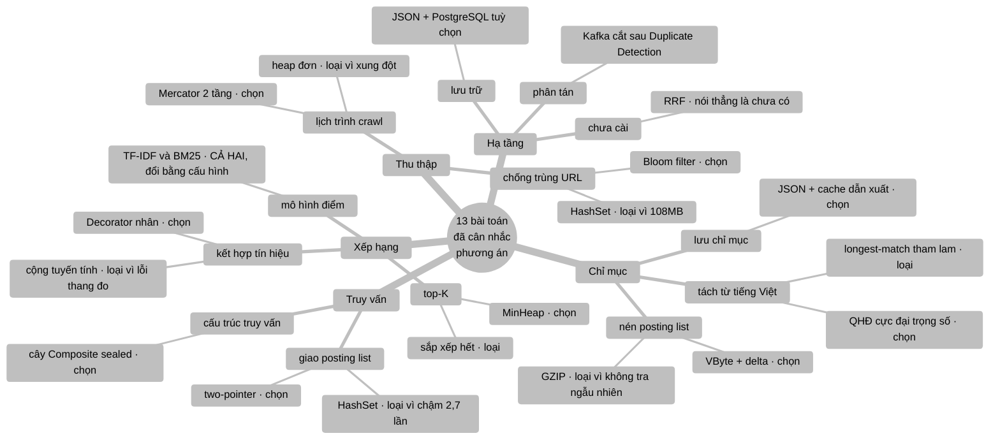

# So sánh phương án — vì sao chọn cách này chứ không phải cách kia

> **Tài liệu này là gì?** Mỗi bài toán trong VnSearch đều có **nhiều thuật
> toán giải được**. Tài liệu này liệt kê các phương án khả dĩ cho **13 bài
> toán chính**, so sánh chúng theo tiêu chí công khai, và nói rõ **vì sao
> phương án đang dùng được chọn** — hoặc thừa nhận thẳng khi nó **chưa phải**
> phương án tốt nhất.
>
> **Tài liệu liên quan:** `docs/Math/` (cách cài đặt phương án đã chọn),
> `DSA-REPORT.md` (số đo và Big-O), `docs/Math/` (lý thuyết nền).

---

## Cách đọc tài liệu này

### Bản đồ 13 bài toán và phương án đã chọn



```
   Cách đọc: mỗi bài toán có ÍT NHẤT một phương án bị BÁC BỎ,
   và lý do bác bỏ là phần đáng đọc hơn cả phương án được chọn.

   bài toán ──┬──▶ phương án A  ✗  vì …
              ├──▶ phương án B  ✓  ĐÃ CHỌN
              └──▶ phương án C  ✗  vì …
```

---

### Nguyên tắc: "tối ưu" luôn là **tối ưu dưới ràng buộc**

Không có thuật toán nào tốt nhất một cách tuyệt đối. Câu hỏi đúng không phải
*"thuật toán nào nhanh nhất?"* mà là *"dưới những ràng buộc cụ thể của bài
toán này, thuật toán nào thắng?"*. Vì vậy mỗi mục dưới đây bắt đầu bằng
**ràng buộc**, rồi mới đến phương án.

Ràng buộc chung của toàn đồ án, dùng cho mọi mục:

| Ràng buộc | Giá trị | Ảnh hưởng tới việc chọn thuật toán |
|---|---|---|
| Quy mô corpus | 5.011 trang, 136.768 term | Nhỏ — nhiều tối ưu cho quy mô lớn **không** bù nổi chi phí hằng số |
| Chỉ mục nằm trong RAM | một tiến trình, không phân tán | Loại bỏ mọi phương án cần cấu trúc trên đĩa |
| Ngôn ngữ | tiếng Việt, có dấu + không dấu | Đây là ràng buộc **đặc thù** — nhiều giải pháp chuẩn tiếng Anh không dùng được |
| Yêu cầu học thuật | cấu trúc lõi phải **tự cài** | Loại bỏ mọi phương án "gọi thư viện" cho phần lõi |
| Người đọc | hội đồng chấm đồ án | Ưu tiên phương án **giải thích được**, không phải phương án tối ưu vi mô |

### Khung so sánh chuẩn

Mỗi mục có đúng bốn phần:

1. **Bài toán và ràng buộc** — phát biểu chính xác, kèm số đo thật.
2. **Các phương án** — bảng so sánh với độ phức tạp, ưu, nhược.
3. **Chọn gì và vì sao** — lý do phải là *số đo* hoặc *ràng buộc kỹ thuật*.
4. **Điểm lật** — ràng buộc nào thay đổi thì kết luận đảo chiều. Phần này quan
   trọng ngang phần 3: một lựa chọn mà không biết khi nào nó sai thì không
   phải là một lựa chọn có hiểu biết.

### Ký hiệu trạng thái

| Ký hiệu | Nghĩa |
|---|---|
| ✅ | Phương án đang dùng, và là lựa chọn đúng dưới ràng buộc hiện tại |
| ⚠️ | Phương án đang dùng, đủ tốt, nhưng **có phương án tốt hơn** đã xác định |
| ❌ | Phương án đang dùng **chưa tối ưu** — đây là khoảng trống thật, nói thẳng |

---

## Bảng tổng hợp — 13 bài toán

| # | Bài toán | Đang dùng | Trạng thái | Phương án tốt hơn (nếu có) |
|---|---|---|---|---|
| 1 | Khử trùng lặp URL | Bloom Filter | ✅ | — |
| 2 | Tách từ tiếng Việt | **QHĐ cực đại trọng số + SyllableTrie** | ✅ | CRF (cần corpus gán nhãn) |
| 3 | Cấu trúc từ điển term | HashMap + Flyweight | ✅ | FST (chỉ khi ≫ 10⁷ term) |
| 4 | Nén posting list | delta + VByte | ✅ | PForDelta / Roaring (quy mô lớn) |
| 5 | Giao posting list | two-pointer + galloping | ✅ | Roaring bitmap (đổi biểu diễn) |
| 6 | Truy hồi top-K | chấm điểm toàn bộ + MinHeap | ❌ | **WAND / Block-Max WAND** |
| 7 | Kết hợp tín hiệu xếp hạng | **Decorator — nhân + log** | ⚠️ | **RRF** và/hoặc **BM25F** |
| 8 | Điểm uy tín trang | PageRank power iteration | ⚠️ | Gauss–Seidel (nhanh hơn ~40%) |
| 9 | Lấy top-K từ n ứng viên | MinHeap | ✅ | — |
| 10 | Gợi ý tự động | Trie + DFS + top-K | ⚠️ | Trie lưu sẵn top-k tại node |
| 11 | Cache kết quả | LRU | ⚠️ | W-TinyLFU (hit rate cao hơn) |
| 12 | Lập lịch crawler | Mercator back-queue | ✅ | — |
| 13 | Khử trùng lặp nội dung | SHA-256 (trùng CHÍNH XÁC) | ⚠️ | **SimHash** (trùng gần đúng) |

**Đọc bảng này thế nào.** 6 ✅, 6 ⚠️, 1 ❌.

Ba hàng đã ĐỔI trạng thái so với bản rà soát trước, và cả ba đều được ghi lại
nguyên nhân trong mục tương ứng thay vì lặng lẽ sửa con số:

| # | Trước | Nay | Đóng bằng cách nào |
|---|:---:|:---:|---|
| 2 Tách từ | ❌ | ✅ | `MaxWeightSegmenter` + từ điển 49.793 mục |
| 7 Kết hợp tín hiệu | ❌ | ⚠️ | Decorator nhân + log; RRF vẫn chưa cài |
| 13 Khử trùng lặp nội dung | ❌ | ⚠️ | `ContentSeenFilter` bắt trùng chính xác; SimHash vẫn chưa cài |

Dấu ❌ còn lại — truy hồi top-K — không phải lỗi cài đặt mà là một **quyết định
thuật toán ở tầng cao** chưa được tối ưu, kèm lời giải cụ thể ở mục 6. Việc
liệt kê nó ra là có chủ ý: một đồ án nói *"mọi thứ đều tối ưu"* thì hoặc là
chưa đo, hoặc là chưa nhìn kỹ.

---

# 1. Khử trùng lặp URL khi crawl

## 1.1. Bài toán và ràng buộc

Crawl 5.011 trang thu về **394.940 outlink**. Mỗi outlink phải trả lời câu
hỏi *"URL này crawl chưa?"* trước khi fetch. Ràng buộc:

- Số lần hỏi rất lớn (394.940 lần), nên chi phí **mỗi lần hỏi** quan trọng.
- **Không cần xoá** — URL đã crawl thì vĩnh viễn đã crawl trong một phiên.
- Sai sót chấp nhận được **theo một chiều**: bỏ lỡ vài trang thì được, crawl
  lại trang cũ thì **không** (gây vòng lặp vô hạn).

## 1.2. Các phương án

| Phương án | Bộ nhớ (1 triệu URL) | Tra cứu | Xoá được? | Sai sót |
|---|---|---|---|---|
| `HashSet<String>` | ~108 MB (đo heap thật) | O(1) | ✅ | Không bao giờ sai |
| **Bloom Filter** | **~1,1 MB** | O(k), k=7 | ❌ | FP 1%, **không bao giờ FN** |
| Cuckoo filter | ~1,2 MB | O(1), 2 lần truy cập bộ nhớ | ✅ | FP tương đương |
| Quotient filter | ~1,3 MB | O(1), thân thiện cache | ✅ | FP tương đương |
| Counting Bloom | ~4,4 MB (4 bit/ô) | O(k) | ✅ | FP tương đương |
| HashSet trên đĩa + LRU | ~không giới hạn | O(1) + I/O | ✅ | Không sai, nhưng chậm |

## 1.3. Chọn gì và vì sao — ✅ Bloom Filter

**Lý do 1 — số đo bộ nhớ.** `HashSet` tốn **~95 lần** bộ nhớ ở cùng quy mô, vì
nó lưu **nguyên vẹn từng chuỗi URL** cộng overhead của `String` và entry
`HashMap`. Bloom Filter chỉ lưu vài bit mỗi phần tử, **độc lập với độ dài
chuỗi gốc** — mà URL thì trung bình 60–80 ký tự.

Kiểm chứng bằng công thức:

$$m = \left\lceil \frac{-10^6 \ln 0{,}01}{(\ln 2)^2} \right\rceil = 9\,585\,059 \text{ bit} = 1\,170 \text{ KB}$$

**Lý do 2 — chiều sai sót đúng với bài toán.** Đây mới là lập luận quyết định,
và nó là lập luận **kỹ thuật** chứ không phải lập luận về bộ nhớ:

| Loại lỗi | Hậu quả | Bloom Filter có không? |
|---|---|---|
| False positive | Bỏ lỡ vài trang chưa crawl | Có, ~1% |
| False negative | Crawl lại trang đã crawl → **vòng lặp vô hạn** | **Không bao giờ** |

Bloom Filter sai **đúng chiều mà bài toán chịu được**. Đây là lý do nó vẫn
thắng dù có sai sót, còn `HashSet` chính xác tuyệt đối lại thua.

**Lý do 3 — vì sao không phải Cuckoo/Quotient filter.** Ưu điểm chính của hai
cấu trúc này là **hỗ trợ xoá** và locality tốt hơn. Bài toán này **không cần
xoá** (URL đã crawl không bao giờ "chưa crawl" trở lại), nên ta trả thêm độ
phức tạp cài đặt để mua một tính năng không dùng. Với ràng buộc "tự cài tay",
Cuckoo filter còn cần xử lý vòng lặp đẩy (cuckoo eviction) và ngưỡng tải —
nhiều chỗ sai hơn hẳn, không đổi lại lợi ích nào.

## 1.4. Điểm lật

Kết luận đảo chiều nếu **một trong ba** ràng buộc sau đổi:

- **Cần xoá** (ví dụ: crawl liên tục nhiều phiên, URL hết hạn sau 30 ngày) →
  Bloom Filter thường không làm được, phải chuyển sang **Counting Bloom** hoặc
  **Cuckoo filter**.
- **Cần biết chính xác tuyệt đối** (ví dụ: dùng cho tính tiền, không phải cho
  crawl) → quay lại `HashSet` hoặc cấu trúc chính xác trên đĩa.
- **Corpus nhỏ hơn ~50.000 URL** → `HashSet` chỉ tốn vài MB, và sự đơn giản
  thắng. Bloom Filter lúc đó là **over-engineering**.

> **Ghi chú.** Trong đồ án, `UrlFrontier` còn giữ riêng một `HashSet<String>
> enqueued` **chính xác tuyệt đối**. Hai lớp có hai vai trò khác nhau: Bloom
> Filter đứng ở chỗ được gọi 394.940 lần (ưu tiên bộ nhớ), `enqueued` đứng ở
> chỗ cần chính xác để frontier không phình. Dùng **hai cấu trúc khác nhau cho
> hai ràng buộc khác nhau** là hợp lý, không phải trùng lặp.

---

# 2. Tách từ tiếng Việt

## 2.1. Bài toán và ràng buộc

Tiếng Việt viết rời từng **tiếng** (âm tiết), nhưng đơn vị mang nghĩa lại là
**từ** — thường gồm 2–4 tiếng. `máy tính` là một từ; tách thành `máy` + `tính`
làm hỏng hoàn toàn việc tìm kiếm. Ràng buộc:

- Chạy trên **mọi tài liệu lúc index** và trên **mọi truy vấn** — nên phải nhanh.
- Từ điển hiện có **49.793 mục**, trong đó **40.390 từ ghép** (`vietnamese-words.txt`).
- Phải xử lý được cả **văn bản không dấu** (người dùng gõ `may tinh`).
- Phải **thread-safe**: tokenizer là một bean dùng chung, và tầng truy vấn chạy
  trên nhiều luồng của Spring Boot.

## 2.2. Các phương án

| Phương án | Độ phức tạp | Cần gì | Chất lượng | Giải được nhập nhằng chồng lấp? |
|---|---|---|---|---|
| Longest Matching tham lam | O(n·L) | từ điển | Khá | ❌ **Không** |
| Bi-directional Maximum Matching | O(n·L) | từ điển | Khá hơn | Một phần (heuristic ít-từ-nhất) |
| **Cực đại trọng số / QHĐ** (đang dùng) | O(n·L) | từ điển **+ trọng số** | Tốt | ✅ **Có** |
| CRF | O(n·|tags|²) | corpus gán nhãn | Rất tốt | ✅ Có |
| PhoBERT / mô hình neural | O(n²) attention | GPU + mô hình vài trăm MB | Tốt nhất | ✅ Có |

## 2.3. Chọn gì và vì sao — ✅ Quy hoạch động cực đại trọng số

> **Mục này từng được xếp ❌ "khoảng trống thật".** Bản trước ghi rằng hệ thống
> đang dùng Longest Matching tham lam trên một từ điển 154 mục, và rằng phương
> án đúng là quy hoạch động. **Khoảng trống đó đã được đóng** — cả hai vế cùng
> lúc, và đó là điều bắt buộc: xem "vì sao phải đi cùng nhau" ở cuối mục.

`MaxWeightSegmenter` giải bài toán **đường đi dài nhất trên đồ thị không chu
trình có hướng**. Gọi `best[i]` là tổng trọng số lớn nhất của một cách tách `i`
âm tiết đầu tiên:

```
   best[0] = 0
   best[j] = max( best[i] + weight(âmTiết[i..j)) )   với mọi i sao cho j - i <= 4
```

Đáp án nằm ở `best[n]`; cách tách cụ thể truy ngược bằng mảng `trace`. Các đỉnh
`0..n` đã sẵn ở thứ tự tô-pô nên chỉ cần **một lượt quét tiến**, không cần sắp
xếp tô-pô.

**Vì sao tham lam sai — ví dụ kinh điển:**

```
   "nhà hàng xóm"

   Longest Matching:  tại i=0 thấy "nhà hàng" CÓ trong từ điển -> lấy ngay
                      -> [nhà_hàng] [xóm]   = "quán ăn" + "xóm"        SAI

   Quy hoạch động:    so sánh CẢ HAI cách trên toàn cục
                      [nhà_hàng][xóm] = 9,59 + 3,46 = 13,05
                      [nhà][hàng_xóm] = 3,69 + 9,44 = 13,13   <- lớn hơn
                      -> [nhà] [hàng_xóm] = "nhà của người hàng xóm"   ĐÚNG
```

Điểm mấu chốt: **cả hai cách tách đều hợp lệ về từ điển**. Tham lam không có
cách nào phân biệt chúng nên phải đoán bằng một heuristic ("dài hơn thì đúng
hơn"), và ở đây heuristic đó sai. Quy hoạch động không đoán — nó chấm điểm **cả
câu** rồi chọn câu tốt nhất.

**Chi phí: gần như bằng không.** Cả hai đều O(n × 4) = O(n). Cải thiện thực tế
nằm ở **hằng số**, và nó đi ngược chiều trực giác — bản mới **nhanh hơn 4,80
lần**:

| | Longest Matching | Cực đại trọng số |
|---|---|---|
| Cấu trúc từ điển | `HashSet<String>` | **`SyllableTrie`** (mảng phẳng) |
| Cấp phát mỗi âm tiết | 3 mảng tạm + 3 chuỗi | **0** |
| Tốc độ ghép từ | 3.718.748 âm tiết/giây | **17.853.690 âm tiết/giây** |

Bản cũ tạo ba `Arrays.copyOfRange` và ba `String.join` rồi vứt đi ngay ở **mỗi**
vị trí; bản mới đi **một lượt** trên trie phủ cả bốn độ dài, và **cắt nhánh** khi
mất tiền tố — điều `HashSet` không nói được, vì nó phải thử từng độ dài một.

**Vì sao hai thay đổi bắt buộc phải đi cùng nhau.** Khiếm khuyết "tham lam" hầu
như **không lộ ra** khi từ điển còn nhỏ — muốn chọn sai thì trước hết phải có
nhiều lựa chọn. Mở rộng từ điển mà **giữ** tham lam sẽ làm chất lượng **tệ đi**
ở một số câu, chứ không tốt lên. Đây là điều đáng nói khi bảo vệ.

## 2.4. Điểm lật

- **Từ điển < 200 mục** → tham lam và QHĐ cho kết quả gần như giống nhau; tham
  lam thắng vì đơn giản hơn. Đây là tình trạng **trước đây** của dự án.
- **Từ điển 30.000–70.000 mục** (kích thước thật của từ điển tiếng Việt) → QHĐ
  thắng rõ rệt, tham lam bắt đầu sai có hệ thống. Đây là tình trạng **hiện tại**.
- **Có corpus gán nhãn** (VLSP, Viet Treebank) → CRF thắng cả hai, nhưng vi phạm
  ràng buộc "tự cài tay" nếu dùng thư viện có sẵn.
- **Cần độ chính xác tối đa, không quan tâm tốc độ** → PhoBERT, nhưng khi đó đây
  không còn là đồ án DSA nữa.

> **Việc đo còn thiếu.** Trọng số hiện lấy từ tần suất trong từ điển, **chưa**
> ước lượng từ chính corpus đã crawl — làm vậy sẽ hợp với miền dữ liệu hơn. Và
> độ chính xác tách từ **vẫn chưa được đo** trên một tập chuẩn: muốn đo cần vài
> trăm câu đã tách từ thủ công. Đây là khoảng trống lớn nhất còn lại của phần
> đánh giá.

---

# 3. Cấu trúc từ điển term

## 3.1. Bài toán và ràng buộc

Tra `term → posting list` cho **136.768 term phân biệt**, gọi vài lần cho mỗi
truy vấn. Chỉ mục nằm trong RAM, một tiến trình.

## 3.2. Các phương án

| Phương án | Tra cứu | Bộ nhớ | Duyệt theo thứ tự? | Tra tiền tố? |
|---|---|---|---|---|
| **HashMap + Flyweight** (đang dùng) | O(1) | Cao (mỗi khoá một `String`) | ❌ | ❌ |
| TreeMap / B+ tree | O(log V) | Cao | ✅ | ✅ |
| Trie / Patricia nén | O(L) | Trung bình | ✅ | ✅ |
| **FST** (Lucene dùng) | O(L) | **Rất thấp** (nén 10–20×) | ✅ | ✅ |
| Succinct / wavelet tree | O(L log σ) | Thấp nhất lý thuyết | ✅ | ✅ |

## 3.3. Chọn gì và vì sao — ✅ HashMap + Flyweight

**Lý do 1 — O(1) là thứ không cấu trúc nào khác cho được.** Tra term là thao
tác **nóng nhất** của đường truy vấn: mỗi truy vấn 1–4 term, mỗi term một lần
tra, và tra xong mới bắt đầu làm việc thật. FST cho O(L) với L = độ dài term
(5–20 ký tự) — chậm hơn hằng số đáng kể.

**Lý do 2 — bộ nhớ đã được xử lý bằng cách khác.** Nhược điểm chính của
HashMap là mỗi khoá là một `String` riêng. Đồ án giải bằng **Flyweight**
(`TermDictionary.intern`): mỗi term phân biệt chỉ có **một** instance `String`
duy nhất, dù nó xuất hiện hàng nghìn lần. Với 5,2 triệu cặp (term, doc) mà
chỉ 136.768 giá trị phân biệt, đây là khoản tiết kiệm lớn — và nó **giữ được
O(1)**, khác với việc đổi sang FST.

**Lý do 3 — hai tính năng của FST không được dùng đến.** FST mạnh ở *duyệt
theo thứ tự từ điển* và *tra tiền tố*. Đồ án không cần cái thứ nhất, và cái
thứ hai đã có **cấu trúc riêng** phục vụ: `Trie` cho autocomplete. Dùng FST sẽ
gộp hai việc vào một cấu trúc — nghe hay nhưng thực chất làm cả hai đường đều
chậm hơn so với hai cấu trúc chuyên dụng.

## 3.4. Điểm lật

- **Vượt ~10⁷ term** (corpus hàng chục triệu trang) → HashMap không còn vừa
  RAM, FST trở thành **bắt buộc**, không còn là lựa chọn.
- **Chỉ mục phải nằm trên đĩa** → HashMap vô nghĩa; B+ tree hoặc FST + block
  tree là phương án duy nhất.
- **Cần truy vấn dải** (`term BETWEEN 'a' AND 'b'`) → phải có cấu trúc có thứ
  tự; HashMap loại ngay.

---

# 4. Nén posting list

## 4.1. Bài toán và ràng buộc

Posting list lưu `docId` (int), `termFrequency` (int) và `positions`
(`List<Integer>` — mỗi phần tử là một object 16 byte). Ghi thẳng ra JSON cho
file **341,5 MB** trên corpus 5.011 trang. Ràng buộc:

- Phải **giải nén được từng term độc lập** — không được buộc giải nén cả chỉ
  mục để đọc một term.
- Phải **không mất mát** — mất một vị trí là hỏng phrase search.
- Tự cài, không gọi thư viện nén.

## 4.2. Các phương án

| Phương án | Tỷ lệ nén | Giải mã | Truy cập ngẫu nhiên? | Độ khó cài |
|---|---|---|---|---|
| Không nén | 1,0× | — | ✅ | — |
| GZIP toàn file | ~4–6× | Chậm | ❌ **Phải giải nén hết** | Rất dễ (thư viện) |
| **delta + VByte** (đang dùng) | **~3,6×** | Nhanh | ✅ theo term | Dễ |
| Simple9 / Simple16 | ~4× | Nhanh hơn | ✅ | Trung bình |
| PForDelta | ~4× | **Nhanh nhất** (SIMD) | ✅ | Khó |
| Elias–Fano | ~4,5× | Nhanh, hỗ trợ `skipTo` gốc | ✅ | Khó |
| Roaring Bitmap | Tuỳ mật độ, thường **tốt nhất** | Rất nhanh, AND trên từ 64 bit | ✅ | Khó |

## 4.3. Chọn gì và vì sao — ✅ delta + VByte

**Số đo thật** trên corpus 5.011 trang, 136.768 term (chạy lại bằng
`IndexPersistence.main`):

| Định dạng | Kích thước | So với mốc trước |
|---|---|---|
| A. Thụt dòng + không nén (định dạng **cũ**) | **341,5 MB** | — |
| B. Gói + không nén | **226,6 MB** | −33,7% |
| C. Gói + nén VByte (định dạng **mới**) | **94,7 MB** | **−58,2%** |
| | | **Tổng A→C: −72,3% (nhỏ 3,60 lần)** |

> **Vì sao đo ba mốc chứ không phải hai.** Định dạng cũ vừa *không nén* vừa
> *thụt dòng*. Gộp hai thay đổi rồi báo một con số sẽ **quy nhầm công của việc
> bỏ thụt dòng cho phần nén** — nén sẽ được báo là −72,3% trong khi công thật
> của nó là −58,2%. Đây là cùng một bài học phương pháp với lỗi JIT warmup ở
> `DSA-REPORT.md` §3.2: **không bao giờ đổi hai biến cùng lúc rồi báo một tỷ
> lệ.**

**Ba kỹ thuật được dùng, mỗi kỹ thuật khai thác một tính chất riêng:**

1. **docId — delta + VByte.** Danh sách docId của một term luôn tăng dần (bất
   biến trung tâm của `InvertedIndex`), nên lưu hiệu thay vì giá trị tuyệt
   đối. Với term xuất hiện trong 1/3 corpus, hiệu trung bình là 3 — vừa 1 byte
   thay vì 4.

2. **termFrequency — không lưu.** Mọi `Posting` do `addDocument` tạo ra đều có
   `termFrequency == positions.size()`. Lưu cả hai là lưu **cùng một thông tin
   hai lần**. Bất biến này được `CompressedPostings.of` **kiểm tra và ép**,
   ném ngoại lệ nếu bị vi phạm — không phải giả định ngầm.

3. **positions — offset tích luỹ + VByte theo đoạn.** Số vị trí của từng
   posting **không** tạo thành dãy tăng dần nên không delta hoá trực tiếp
   được. Nhưng **tổng tích luỹ** của chúng thì tăng dần:

   ```
   tf mỗi posting  : [3, 1, 2, 5]        ← không tăng dần
   offset tích luỹ : [0, 3, 4, 6, 11]    ← LUÔN tăng dần → delta hoá được
   ```

   Biến một dãy không sắp xếp thành dãy sắp xếp bằng tổng tích luỹ, rồi dùng
   lại **đúng một** codec cho cả ba mảng. Đây chính là kỹ thuật `rowPtr` của
   định dạng **CSR** mà `SparseMatrix.freeze()` dùng — cùng một ý tưởng, hai
   chỗ khác nhau trong đồ án.

**Vì sao không phải GZIP** — dù nó nén tốt hơn và chỉ tốn 3 dòng: GZIP phải
**giải nén toàn bộ** mới đọc được một term. Định dạng hiện tại giữ được tính
chất quan trọng hơn tỷ lệ nén: **mỗi term là một đơn vị độc lập**, nên về sau
có thể nạp posting list **theo yêu cầu** (lazy) thay vì nạp cả chỉ mục vào
RAM. Nén **cộng** truy cập ngẫu nhiên là thứ mà nén tổng quát không cho.

**Vì sao không phải PForDelta / Roaring** — cả hai tốt hơn về tốc độ giải mã,
nhưng: (a) chúng thao tác theo **khối** (128 số/khối), nên chỉ có lợi khi
posting list dài — trong đồ án phần lớn term có df nhỏ; (b) độ khó cài cao hơn
hẳn, và với ràng buộc "tự cài tay" thì rủi ro sai tăng mà lợi ích ở quy mô này
gần bằng không.

**Còn base64 thì sao?** Jackson mã hoá mảng byte sang base64, overhead cố định
+33%. Con số 94,7 MB ở trên **đã bao gồm** overhead đó — tức là ở dạng nhị
phân thuần, chỉ mục còn nhỏ hơn nữa (~71 MB). Việc chấp nhận base64 là đánh
đổi có chủ ý: giữ **một file JSON duy nhất** cho cả ba phần (posting list,
tài liệu, độ dài) thay vì phải quản lý một định dạng nhị phân riêng.

## 4.4. Điểm lật

- **Posting list dài > vài nghìn mục** là chủ đạo → PForDelta thắng nhờ giải
  mã theo khối tận dụng SIMD.
- **Mật độ cao** (term xuất hiện ở > 10% tài liệu) → **Roaring Bitmap** thắng
  tuyệt đối: nó chuyển sang biểu diễn bitmap và làm phép AND trên từ 64 bit.
- **Không cần truy cập theo term** (ví dụ chỉ để sao lưu) → GZIP thắng, đơn
  giản hơn và nén tốt hơn.
- **Chỉ mục phải nằm trên đĩa** → Elias–Fano thắng vì nó hỗ trợ `skipTo` ngay
  trên dạng nén, không cần giải nén trước.

---

# 5. Giao posting list (phép AND giữa nhiều term)

## 5.1. Bài toán và ràng buộc

Truy vấn nhiều term cần lấy **giao** các posting list. Ràng buộc quan trọng
nhất: posting list **đã sắp xếp tăng dần theo docId** — một bất biến được đảm
bảo **miễn phí** lúc dựng chỉ mục (chỉ append, không sort).

## 5.2. Các phương án

| Phương án | Độ phức tạp | Tận dụng "đã sắp xếp"? | Cấp phát trung gian? |
|---|---|---|---|
| `HashSet.retainAll` | O(m+n) + chi phí dựng set | ❌ | ✅ 2 HashSet |
| **Two-pointer** | O(m+n) | ✅ | ❌ |
| **Galloping / skip pointer** (đang dùng) | **O(m log(n/m))** | ✅ | ❌ |
| Skip list có con trỏ tường minh | O(m log(n/m)) | ✅ | Cần cấu trúc phụ |
| Roaring bitmap AND | ~O(n/64) | Đổi biểu diễn | Bitmap |

## 5.3. Chọn gì và vì sao — ✅ Two-pointer + galloping + shortest-first

**Số đo** với 2 danh sách đã sắp xếp, 500.000 phần tử mỗi bên:

| Cách làm | Thời gian/lần |
|---|---|
| **Two-pointer** | **~10,0 ms** |
| `HashSet.retainAll` (không tính chi phí dựng set) | ~15,5 ms (+55%) |
| `HashSet.retainAll` (tính cả chi phí dựng 2 set) | ~27,0 ms (2,7 lần) |

**Cột nào là so sánh công bằng?** Cột thứ **3**. Trong hệ thống thật, posting
list lấy thẳng từ chỉ mục, nên dùng `HashSet` thì **phải trả** chi phí dựng
set ở **mỗi** truy vấn. Cột 2 chỉ có nghĩa nếu HashSet được cache sẵn — mà
cache HashSet cho 136.768 term là bất khả thi về bộ nhớ.

**Vì sao thêm galloping.** Two-pointer thuần là O(m+n) — nó **duyệt gần hết
list dài** ngay cả khi list ngắn chỉ có 5 phần tử. Galloping nhảy cóc bằng
cách tăng bước gấp đôi rồi binary search:

```
Giao list 5 phần tử với list 4.000 phần tử:
  two-pointer thuần : O(m + n)      = 5 + 4000 = 4.005 bước
  galloping         : O(m log(n/m)) ≈ 5 × 9,6  =    48 bước
```

Chênh lệch **83 lần** — và đây chính là kịch bản phổ biến nhất: một term hiếm
trộn với nhiều term phổ biến.

**Vì sao thêm shortest-first.** Luôn có $|A \cap B| \le \min(|A|, |B|)$, nên
bắt đầu từ list **ngắn nhất** giữ kết quả trung gian nhỏ ngay từ đầu. Ví dụ
`iPhone` (df = 5) với `của` (df = 4.000): bắt đầu từ `iPhone` thì mọi bước sau
gần như miễn phí.

Kèm hai tối ưu thoát sớm: giao rỗng thì dừng ngay (rỗng là phần tử hấp thụ của
phép giao); và df = 0 ở **bất kỳ** term nào → trả rỗng, không cần giao gì.

## 5.4. Điểm lật

- **Mật độ cao** (term xuất hiện ở > 10% tài liệu) → **Roaring bitmap** thắng
  áp đảo: AND trên từ 64 bit xử lý 64 docId mỗi lệnh CPU.
- **Hai list kích thước gần bằng nhau** → galloping **thua** two-pointer thuần
  (chi phí binary search không bù được, vì hầu như bước nào cũng nhảy 1 bước).
  Cài đặt hiện tại xử lý đúng chuyện này: nó dùng cursor cho **bước đầu** —
  nơi tỷ lệ kích thước lệch nhau lớn nhất sau khi shortest-first.
- **Posting list nằm trên đĩa** → chi phí bị I/O chi phối, thuật toán trong
  RAM gần như không còn quan trọng; skip pointer trên đĩa mới là thứ đáng làm.

---

# 6. Truy hồi top-K

## 6.1. Bài toán và ràng buộc

Người dùng chỉ xem **10 kết quả đầu**. Nhưng một truy vấn phổ biến có thể có
hàng nghìn ứng viên sau khi giao posting list. Câu hỏi: **có cần chấm điểm tất
cả không?**

## 6.2. Các phương án

| Phương án | Chấm điểm bao nhiêu ứng viên | Top-K có đúng không? |
|---|---|---|
| **Chấm hết + MinHeap** (đang dùng) | **100%** | ✅ Đúng chính xác |
| **`MaxCandidatesFilter`** (đang dùng) | Chặn trên cứng | ❌ **Có thể cắt nhầm** |
| **WAND** | Thường 10–30% | ✅ **Đúng chính xác** |
| **Block-Max WAND** | Thường 5–15% | ✅ Đúng chính xác |
| MaxScore | Tương đương WAND | ✅ Đúng chính xác |
| Impact-ordered + early termination | Rất ít | ❌ Xấp xỉ |

## 6.3. Chọn gì và vì sao — ❌ **Đây là khoảng trống thuật toán lớn nhất**

Hiện tại: chấm điểm **mọi** ứng viên, rồi dùng MinHeap lấy top-K. Kèm
`MaxCandidatesFilter` làm chặn trên an toàn cho trường hợp xấu.

**Vấn đề — và nó là vấn đề về tính đúng đắn, không chỉ về tốc độ.**
`MaxCandidatesFilter` cắt danh sách ứng viên **trước khi biết điểm của
chúng**. Nghĩa là một tài liệu đáng lẽ đứng thứ nhất **có thể bị loại** chỉ vì
nó nằm sau vị trí chặn trong danh sách docId. Javadoc của lớp này có nói rõ nó
là chặn trên chứ không phải tối ưu top-K chính xác — nhưng nói rõ một hạn chế
không làm nó biến mất.

**Phương án đúng: WAND** (Weak AND, Broder et al. 2003).

Ý tưởng: với mỗi term, tính trước **cận trên** của điểm mà nó có thể đóng góp:

$$\text{UB}(t) = \max_{d} \; \text{score}(t, d)$$

Khi đang duyệt, gọi $\theta$ là điểm thấp nhất trong top-K hiện tại. Nếu tổng
cận trên của các term khớp tại tài liệu $d$ **nhỏ hơn** $\theta$:

$$\sum_{t \,\in\, \text{khớp}(d)} \text{UB}(t) < \theta$$

thì $d$ **không thể** vào top-K — bỏ qua **mà không cần chấm điểm**, và quan
trọng hơn: **nhảy thẳng** tới tài liệu tiếp theo có khả năng. Kết quả vẫn
**đúng chính xác**, không phải xấp xỉ.

**Vì sao đây là bước đi đúng cho đồ án này — ba lý do:**

1. **Hạ tầng đã có sẵn.** WAND cần đúng hai thứ: con trỏ có `skipTo` và posting
   list sắp xếp. Đồ án đã có cả hai (`PostingCursor.skipTo` với galloping).
   Phần còn thiếu chỉ là bảng cận trên và vòng lặp chọn pivot.
2. **Nó thay thế một thứ đang sai.** `MaxCandidatesFilter` cắt ẩu; WAND cắt mà
   vẫn đúng. Đây là nâng cấp về **tính đúng đắn**, không chỉ hiệu năng.
3. **Nó tạo ra một thí nghiệm đo được.** Báo cáo được: % tài liệu bị bỏ qua,
   thời gian truy vấn trước/sau, và **kiểm chứng top-K giống hệt** bản chấm
   toàn bộ — một test rất thuyết phục khi bảo vệ.

## 6.4. Điểm lật

- **Số ứng viên luôn nhỏ** (< 100) → WAND **thua**: chi phí duy trì bảng cận
  trên và chọn pivot không bù nổi. Chấm hết là đúng.
- **Cần toàn bộ kết quả, không chỉ top-K** (ví dụ để đếm tổng, để phân trang
  sâu) → WAND không dùng được, vì nó chỉ đảm bảo đúng cho K đầu.
- **Điểm số không có cận trên tính được** (ví dụ scorer gọi mô hình học máy)
  → WAND không áp dụng được; phải chuyển sang xếp hạng hai tầng
  (truy hồi rẻ → xếp hạng lại đắt trên 100 ứng viên đầu).

---

# 7. Kết hợp nhiều tín hiệu xếp hạng

## 7.1. Bài toán và ràng buộc

Có ba tín hiệu: điểm liên quan (TF-IDF hoặc BM25), điểm uy tín (PageRank), và
điểm khớp tiêu đề. Cần gộp thành **một** điểm để sắp xếp.

## 7.2. Các phương án

| Phương án | Bất biến với thang đo? | Cần huấn luyện? | Diễn giải trọng số |
|---|---|---|---|
| **Cộng tuyến tính có trọng số** (đang dùng) | ❌ **Không** | ❌ | Sai lệch nghiêm trọng |
| Nhân + log (decorator hiện tại) | ✅ Có | ❌ | Tốt |
| Chuẩn hoá min-max rồi cộng | ✅ Có | ❌ | Tốt |
| **RRF (Reciprocal Rank Fusion)** | ✅ **Hoàn toàn** | ❌ | Rất tốt |
| **BM25F** (cho tín hiệu tiêu đề) | Không áp dụng | ❌ | Đúng về mặt mô hình |
| Learning to Rank (LambdaMART) | ✅ | ✅ Cần nhãn | Không diễn giải được |

## 7.3. Chọn gì và vì sao — ⚠️ Decorator nhân + log

> **Mục này từng được xếp ❌.** Lỗi phương pháp mô tả dưới đây là CÓ THẬT và đã
> được chính đồ án phát hiện — nhưng nó cũng **đã được sửa**. Phần phân tích giữ
> nguyên vì nó giải thích vì sao bản sửa lại có hình dạng như vậy.

Công thức **cũ** cộng tuyến tính:

$$\text{score} = \alpha \cdot \text{TF-IDF} + \beta \cdot \text{PageRank}$$

**Vấn đề — đo thật:** PageRank là một **phân phối xác suất tổng bằng 1** trên
5.011 tài liệu, nên giá trị điển hình quanh $1/N \approx 0{,}0002$. TF-IDF thì
quanh $0{,}1$. Tỷ lệ đóng góp thực tế:

$$\frac{\beta\,\overline{\text{PR}}}{\alpha\,\overline{\text{TF-IDF}}} = \frac{0{,}00010616}{0{,}106612} \approx \mathbf{0{,}1\,\%}$$

Nghĩa là **$\beta = 0{,}3$ không hề có nghĩa "PageRank đóng góp 30%"** — nó
đóng góp **0,1%**. Hệ quả nghiêm trọng hơn: chênh lệch quan sát được trong
phép quét $\beta$ thực chất phản ánh việc $\alpha$ bị thay đổi theo (do ràng
buộc `alpha = 0.9 − beta`), **chứ không phải ảnh hưởng của PageRank**. Toàn bộ
phần ablation theo $\beta$ vì thế không diễn giải được như đang diễn giải.

Đồ án **đã tự phát hiện** điều này (`DSA-REPORT.md` §6.3) và đã sửa một phần
bằng Decorator dùng **phép nhân + log** thay phép cộng, kèm test chứng minh
tính bất biến với thang đo. Nhưng công thức kết hợp gốc trong phần đánh giá
thì vẫn còn.

> ### 📌 Trạng thái cài đặt
>
> **RRF chưa được cài đặt.** Không có `ranking/ReciprocalRankFusion.java` trong
> mã nguồn. Phần dưới đây mô tả một **phương án đã cân nhắc**, không phải một
> thứ đang chạy.
>
> Một bản trước của trang này khẳng định lớp đó "đã được cài đặt và kiểm thử
> (11 test xanh)" — điều đó không đúng, và đáng nói là nó rơi đúng vào cái bẫy
> mà chính trang này cảnh báo ở đoạn trên: **tài liệu chạy trước mã nguồn**.
> Với `VByteCodec` cái bẫy là "có mã, có test, không ai gọi"; ở đây còn nặng
> hơn — không có cả mã.
>
> Muốn nối vào thì cần: cài `ReciprocalRankFusion`, tạo `PageRankScorer`
> (PageRank như một bảng xếp hạng độc lập), thêm đường fuse vào `ResultRanker`,
> và thêm một cấu hình RRF vào ablation. Khi nào làm xong thì sửa ô này và đổi
> ❌ thành ✅ ở bảng tổng hợp.

**Hai lời giải, giải hai vấn đề khác nhau:**

**(a) RRF — cho việc gộp nhiều bảng xếp hạng.** Thay vì gộp **điểm**, gộp
**thứ hạng**:

$$\text{RRF}(d) = \sum_{i} \frac{1}{k + \text{rank}_i(d)}, \qquad k = 60$$

Vì nó chỉ dùng thứ hạng, nó **miễn nhiễm hoàn toàn** với chuyện TF-IDF lớn hơn
PageRank 1.000 lần. Không cần chuẩn hoá, không cần dò trọng số, không cần dữ
liệu huấn luyện. Đây là phương pháp chuẩn trong ngành cho bài toán *"tôi có
nhiều bảng xếp hạng khác thang đo, gộp lại thế nào"* — đúng bài toán đang gặp.

**(b) BM25F — cho tín hiệu tiêu đề.** Title boost hiện là một decorator cộng
thêm điểm **sau khi** đã tính xong. Cách đúng về mặt mô hình là cộng tần suất
theo trường **trước** khi đưa vào hàm bão hoà:

$$\tilde{tf}(t, d) = \sum_{f \in \text{trường}} w_f \cdot \frac{tf(t, d_f)}{1 - b_f + b_f \cdot \frac{l_f}{\overline{l_f}}}$$

rồi đưa $\tilde{tf}$ vào công thức BM25. Khác biệt không phải chuyện hình
thức: bão hoà **sau khi** cộng nghĩa là một từ xuất hiện 10 lần trong tiêu đề
không thể đẩy điểm lên vô hạn — đúng với trực giác, và đúng với cách Lucene
làm.

**Vì sao hai cái này đáng làm trước những thứ khác:** cả hai **không cần dữ
liệu huấn luyện**, cài trong vài chục dòng, và sửa một lỗi mà đồ án **đã tự
thừa nhận là có**. Chi phí thấp, lợi ích rõ, và tạo ra một chương so sánh
trước/sau rất thuyết phục.

## 7.4. Điểm lật

- **Có dữ liệu nhấp chuột của người dùng thật** → Learning to Rank thắng mọi
  phương án thủ công. Nhưng đồ án không có, và tự sinh ra thì vô nghĩa.
- **Chỉ có một tín hiệu** → mọi thảo luận trên biến mất; dùng thẳng BM25.
- **Cần giải thích được vì sao tài liệu X đứng trên Y** (yêu cầu thường gặp
  của hệ thống thật) → cộng tuyến tính **có chuẩn hoá** dễ giải thích hơn RRF,
  và cả hai dễ hơn LTR rất nhiều.

---

# 8. Điểm uy tín trang (PageRank)

## 8.1. Bài toán và ràng buộc

Đồ thị liên kết: 5.011 node, **239.691 cạnh** (trong đó 42.002 cạnh chéo
domain — chính chúng mới làm PageRank có ý nghĩa). Độ thưa 0,95%. Cần vector
điểm uy tín hội tụ.

## 8.2. Các phương án

| Phương án | Số vòng lặp | Song song hoá | Phụ thuộc truy vấn? |
|---|---|---|---|
| **Power iteration** (đang dùng) | 53 | Dễ | ❌ Tính một lần |
| Gauss–Seidel | ~30–35 (nhanh hơn 30–50%) | Khó hơn | ❌ |
| Aitken / ngoại suy | ~35–40 | Dễ | ❌ |
| Monte Carlo random walk | Xấp xỉ | **Rất dễ** | ❌ |
| Giải hệ tuyến tính trực tiếp | 1 (nhưng O(n³)) | — | ❌ |
| **HITS** | ~20 | Dễ | ✅ **Có** |
| SALSA / TrustRank | ~20–50 | Dễ | Tuỳ biến thể |

## 8.3. Chọn gì và vì sao — ⚠️ Power iteration

**Lý do chọn — hợp lệ:**

- Cài trong ~30 dòng, mỗi vòng chỉ là một phép nhân ma trận thưa × vector:
  $O(\text{nnz} + N)$. Với nnz = 239.691 thì mỗi vòng cực rẻ — hội tụ toàn bộ
  trong **0,2 giây**.
- Là thuật toán trong **bài báo gốc** của Brin & Page, nên trích dẫn được và
  giải thích được bằng trực giác "người lướt ngẫu nhiên".
- Chứng minh được các tính chất toán học để làm test: tổng PageRank ≈ 1, chu
  trình đối xứng cho điểm bằng nhau, dangling node không rò rỉ xác suất.

**Vì sao xếp ⚠️ chứ không phải ✅:** **Gauss–Seidel** giải đúng bài toán đó
nhưng dùng **giá trị mới ngay khi có** thay vì đợi hết vòng:

$$x_i^{(k+1)} = \frac{1-d}{N} + d \sum_{j \to i} \frac{x_j^{(?)}}{L(j)}$$

trong đó $x_j$ lấy giá trị **mới nhất** đã tính được trong chính vòng này.
Thường giảm 30–50% số vòng lặp, chi phí cài thêm gần bằng không (bỏ một mảng
tạm). Ở quy mô đồ án thì 0,2 giây → 0,13 giây — không ai cảm nhận được, nên
đây là ⚠️ chứ không phải ❌.

**Vì sao không phải HITS — và vì sao vẫn nên nhắc tới nó.** HITS khác về bản
chất: nó tính hub/authority **theo từng truy vấn** trên đồ thị con của kết quả,
nên bắt được ngữ cảnh mà PageRank bỏ qua. Nhưng chính vì phụ thuộc truy vấn,
nó **không tính trước được** — phải chạy khi người dùng gõ, làm tăng độ trễ
truy vấn. Với ràng buộc "truy vấn phải dưới vài ms", PageRank tính sẵn thắng.

> **Một so sánh đáng thêm vào báo cáo.** Cài HITS và so với PageRank trên cùng
> corpus là một thí nghiệm rẻ (đồ thị đã có sẵn trong `SparseMatrix`) và cho ra
> một chương so sánh rất tốt: *tín hiệu độc lập truy vấn vs phụ thuộc truy
> vấn*. Đây là loại nội dung mà hội đồng tốt nghiệp tìm kiếm.

## 8.4. Điểm lật

- **Đồ thị hàng tỷ node** → power iteration vẫn dùng được nhưng phải phân tán;
  Monte Carlo thắng vì song song hoá gần như tuyến tính.
- **Đồ thị thay đổi liên tục** → tính lại từ đầu quá đắt; cần PageRank tăng
  tiến (incremental) hoặc Monte Carlo cập nhật cục bộ.
- **Cần điểm uy tín theo chủ đề** → Topic-sensitive PageRank; PageRank thuần
  cho một điểm duy nhất, không phân biệt lĩnh vực.
- **Corpus một domain duy nhất** → PageRank gần như **vô nghĩa**: liên kết nội
  bộ phản ánh *cấu trúc điều hướng* (menu, chuyên mục) chứ không phản ánh *uy
  tín*. Đây chính là lý do `MultiDomainCrawlRunner` được viết ra — corpus 150
  trang cùng một tờ báo có **0** liên kết chéo domain.

---

# 9. Lấy top-K từ n ứng viên đã có điểm

## 9.1. Bài toán và ràng buộc

Sau khi chấm điểm, có $c$ ứng viên (thường 100–2.000), cần lấy $K = 10$ phần
tử điểm cao nhất, **có thứ tự**.

## 9.2. Các phương án

| Phương án | Độ phức tạp | Phá huỷ mảng gốc? | Kết quả có thứ tự? |
|---|---|---|---|
| Sort toàn bộ | O(n log n) | ✅ | ✅ |
| **MinHeap kích thước K** (đang dùng) | **O(n log K)** | ❌ | ✅ |
| Quickselect | **O(n)** trung bình, O(n²) xấu nhất | ✅ | ❌ (phải sort thêm) |
| Introselect | O(n) đảm bảo | ✅ | ❌ |
| Partial sort (heapsort một phần) | O(n + K log n) | ✅ | ✅ |

## 9.3. Chọn gì và vì sao — ✅ MinHeap kích thước K

**Câu hỏi khó nhất ở mục này: Quickselect là O(n), tốt hơn O(n log K) về mặt
lý thuyết — sao không dùng?**

Ba lý do, xếp theo mức độ quyết định:

1. **Với $K = 10$, $\log_2 K \approx 3{,}3$ — một hằng số nhỏ.** O(n log K)
   thực chất là O(3,3n) so với O(n) của quickselect. Nhưng quickselect có
   **hằng số ẩn lớn hơn**: nó phân hoạch mảng nhiều lần, mỗi lần đọc/ghi toàn
   bộ vùng đang xét. Ở n vài trăm, MinHeap thắng **trên thực đo**.

2. **Quickselect phá huỷ mảng gốc.** Danh sách ứng viên còn được dùng sau đó
   (sinh snippet cho các tài liệu sống sót). Muốn giữ nguyên phải sao chép —
   một khoản O(n) bộ nhớ và thời gian mà MinHeap không cần.

3. **Quickselect cho ra K phần tử lớn nhất nhưng KHÔNG có thứ tự.** Vẫn phải
   sort K phần tử đó: thêm O(K log K). MinHeap cho ra kết quả đã có thứ tự
   sẵn.

Thêm một chi tiết cài đặt: `MinHeap.topK` gom K phần tử đầu rồi **Floyd
heapify một lần** — O(K) thay vì insert K lần O(K log K). Chi tiết nhỏ, nhưng
nó là khác biệt giữa "biết dùng heap" và "hiểu heap".

**Vì sao MinHeap chứ không phải MaxHeap** — câu hỏi hay bị hỏi khi bảo vệ: để
lấy K phần tử **lớn nhất**, ta giữ một heap **nhỏ nhất** kích thước K. Phần tử
ở đỉnh là phần tử **nhỏ nhất trong nhóm K tốt nhất** — chính là ngưỡng để
quyết định phần tử mới có đáng vào hay không, trong O(1).

## 9.4. Điểm lật

- **K gần bằng n** (lấy 900 trong 1.000) → sort toàn bộ thắng; heap kích thước
  900 không tiết kiệm gì mà thêm chi phí.
- **n rất lớn, K nhỏ, không cần giữ mảng gốc** (n > 10⁶) → quickselect bắt đầu
  thắng thật, vì O(n) vs O(3,3n) trở nên đáng kể.
- **Dữ liệu tới theo luồng, không biết trước n** → MinHeap là phương án **duy
  nhất** dùng được; quickselect cần toàn bộ dữ liệu trong tay.

---

# 10. Gợi ý tự động (autocomplete)

## 10.1. Bài toán và ràng buộc

Người dùng gõ tiền tố, cần trả về **top-k cụm từ phổ biến nhất** bắt đầu bằng
tiền tố đó. Ràng buộc: phải phản hồi **sau mỗi phím gõ** (< 50 ms), và người
Việt thường gõ **không dấu**.

## 10.2. Các phương án

| Phương án | Tra cứu | Bộ nhớ | Chịu lỗi gõ sai? |
|---|---|---|---|
| Quét tuyến tính toàn bộ | O(V·L) | Thấp | ❌ |
| `TreeMap.subMap` | O(log V + m) | Trung bình | ❌ |
| **Trie + DFS + top-K** (đang dùng) | O(L + m log k) | Cao | ❌ |
| **Trie lưu sẵn top-k tại mỗi node** | **O(L + k)** | Cao hơn | ❌ |
| Ternary search tree | O(L + m) | Thấp hơn Trie | ❌ |
| FST (Lucene suggester) | O(L + k) | **Rất thấp** | ❌ |
| **Levenshtein automaton** | O(L·n) | Trung bình | ✅ **Có** |
| BK-tree | O(n^0,5) xấp xỉ | Trung bình | ✅ Có |
| n-gram index | O(số n-gram) | Cao | ✅ Có (cả khớp giữa chuỗi) |

## 10.3. Chọn gì và vì sao — ⚠️ Trie + DFS + top-K

**Phần đúng.** Trie cho O(L) để tới node tiền tố — không phụ thuộc số lượng
từ trong từ điển, đó là tính chất quyết định. Việc lấy top-k bằng `MinHeap`
thay vì sort toàn bộ m hậu duệ cũng đúng: O(m log k) thay vì O(m log m).

Ba lỗi chất lượng từng có và đã sửa, đáng ghi lại vì chúng là lỗi **dữ liệu**
chứ không phải lỗi thuật toán:

| Lỗi | Hậu quả | Cách sửa |
|---|---|---|
| Chèn **nguyên tiêu đề** làm một gợi ý | Gợi ý dài loằng ngoằng | Tokenize rồi lấy từ ghép + cặp token liền nhau |
| Chèn **từng tiếng lẻ** | `cong`, `the` — trong tiếng Việt tiếng lẻ phần lớn **không phải từ** | Chỉ lấy term chứa `_` và cặp token |
| Chỉ `insert` mà **không `clear()`** | Tiêu đề corpus **cũ** còn sót sau mỗi lần crawl lại | `suggestTrie.clear()` là O(1) — bỏ gốc cây |

**Hai chỗ bỏ lỡ — lý do xếp ⚠️:**

**(a) Chưa lưu sẵn top-k tại mỗi node.** Hiện tại mỗi lần gõ phải **DFS toàn
bộ cây con** để thu m hậu duệ rồi mới lấy top-k. Với tiền tố ngắn như `c`, m
có thể là hàng chục nghìn. Nếu mỗi node lưu sẵn danh sách k từ phổ biến nhất
của cây con dưới nó (tính một lần lúc dựng Trie), tra cứu thành **O(L + k)** —
bỏ hẳn DFS. Đổi lại: tốn thêm O(k) bộ nhớ mỗi node và phải dựng lại khi dữ
liệu đổi. Với autocomplete — dữ liệu chỉ đổi khi crawl lại — đây là đánh đổi
**rõ ràng có lợi**.

**(b) Không chịu được lỗi gõ sai.** Gõ `cong nghe` (thiếu dấu) đã xử lý được
nhờ chỉ mục kép; nhưng gõ `cogn nghe` (sai thứ tự phím) thì **không ra gì**.
Với người Việt, gõ sai dấu và sai thứ tự là chuyện thường xuyên. Lời giải
chuẩn là **Levenshtein automaton**: dựng một automaton chấp nhận mọi chuỗi
cách truy vấn ≤ 2 phép sửa, rồi duyệt **giao** của nó với Trie. Đây là khoảng
trống **trải nghiệm người dùng** lớn nhất của hệ thống.

## 10.4. Điểm lật

- **Từ điển gợi ý rất lớn** (hàng triệu cụm) → Trie không vừa RAM; FST thắng
  nhờ nén 10–20 lần.
- **Cần khớp ở GIỮA chuỗi** (gõ `nghệ` ra `công nghệ`) → Trie **không làm
  được** về nguyên tắc; phải dùng n-gram index hoặc suffix automaton.
- **Số lượng từ nhỏ** (< 1.000) → quét tuyến tính là đủ, và Trie là
  over-engineering.

---

# 11. Cache kết quả tìm kiếm

## 11.1. Bài toán và ràng buộc

Truy vấn tìm kiếm tuân theo phân phối **Zipf rất nặng**: một số ít truy vấn
chiếm phần lớn lưu lượng. Cache 200 mục `SearchResponse`. Đo thật: cache miss
34,5 ms → hit 12,8 ms (nhanh 2,7 lần qua HTTP).

## 11.2. Các phương án

| Phương án | Độ phức tạp | Hit rate trên Zipf | Độ khó cài |
|---|---|---|---|
| FIFO | O(1) | Thấp | Rất dễ |
| **LRU** (đang dùng) | **O(1)** | Trung bình | Dễ |
| LFU | O(1) với cấu trúc khéo | Cao | Trung bình |
| **W-TinyLFU** (Caffeine) | O(1) | **Cao nhất** | Khó |
| ARC | O(1) | Cao | Khó (còn vướng bằng sáng chế) |
| 2Q / SLRU | O(1) | Cao | Trung bình |

## 11.3. Chọn gì và vì sao — ⚠️ LRU

**Lý do chọn — chính đáng, nhưng cần nói thẳng nó là lý do gì.** Đây là mục
duy nhất mà lý do chọn **không phải hiệu năng**: LRU và LFU đều O(1). Lý do
là **yêu cầu học thuật** — LRU là cấu trúc bắt buộc phải tự cài của môn DSA,
và việc tự cài buộc phải trả lời được ba câu hỏi mà người chỉ gọi
`LinkedHashMap` sẽ không bao giờ gặp:

**(a) Vì sao di chuyển một node lên đầu là O(1)?** Vì chỉ đổi **4 con trỏ**,
không duyệt danh sách.

**(b) Vì sao cần danh sách liên kết *đôi*?** Để xoá một node ở **giữa** trong
O(1) cần biết **cả** node trước và node sau. Danh sách đơn phải duyệt từ đầu →
O(n), và khi đó cache LRU mất hoàn toàn ưu điểm.

**(c) Vì sao 2 sentinel node?** Để `removeNode` chỉ cần 2 dòng và **không bao
giờ** phải kiểm tra `null`:

```java
private void removeNode(Node<K, V> node) {
    node.prev.next = node.next;
    node.next.prev = node.prev;
}
```

Không có sentinel thì hàm này thành 6–8 dòng với các nhánh
`if (node.prev == null)` — mỗi nhánh là một chỗ có thể sai.

**Phần thưởng ngoài dự kiến: một bẫy đồng thời chỉ hiện ra khi tự viết.**
`get()` **trông như** thao tác đọc, nhưng nó phải `moveToFront` — tức là một
thao tác **ghi**. Dùng read lock ở đây thì nhiều thread cùng "đọc" sẽ cùng sửa
danh sách liên kết và **làm hỏng cấu trúc dữ liệu**:

```java
public V get(K key) {
    lock.writeLock().lock();   // ← KHÔNG phải readLock, dù tên hàm là get
    ...
}
```

**Vì sao vẫn xếp ⚠️.** Trên phân phối **Zipf**, LRU có một điểm yếu đã biết:
một loạt truy vấn hiếm quét qua (scan) sẽ **đẩy hết** các truy vấn phổ biến ra
khỏi cache, dù chúng sắp được dùng lại. LFU và W-TinyLFU miễn nhiễm với chuyện
này vì chúng nhớ **tần suất**, không chỉ **thời điểm gần nhất**.

> **Một thí nghiệm rất đáng làm, chi phí thấp.** Ghi lại log truy vấn thật (hoặc
> sinh theo phân phối Zipf với $s \approx 1{,}0$), rồi so **hit rate** của LRU
> với LFU trên cùng dãy truy vấn, cùng dung lượng 200. Đây là một chương báo
> cáo hoàn chỉnh: cùng độ phức tạp O(1), cùng bộ nhớ, **khác hit rate** — và
> đó chính xác là loại kết luận mà chỉ đo mới ra được.

## 11.4. Điểm lật

- **Truy cập gần như đồng đều** (không Zipf) → LRU và LFU tương đương; LRU
  thắng vì đơn giản.
- **Có quét tuần tự lớn** (batch job duyệt hết mọi truy vấn) → LRU **thua
  nặng**; W-TinyLFU hoặc 2Q là bắt buộc.
- **Cache rất nhỏ so với tập làm việc** → mọi chính sách đều kém; vấn đề là
  dung lượng, không phải thuật toán.

---

# 12. Lập lịch crawler

## 12.1. Bài toán và ràng buộc

Lấy URL tiếp theo để crawl, thoả **đồng thời** ba ràng buộc:

- Ưu tiên URL độ sâu thấp (BFS có ưu tiên).
- **Politeness**: không gọi cùng một host quá 1 lần/giây.
- Nhiều thread cùng lấy, không được phát trùng.

Số liệu: **52 host** phân biệt, frontier có lúc hàng chục nghìn URL (mỗi trang
tin sinh trung bình **78,8 outlink**).

## 12.2. Các phương án

| Phương án | Chi phí mỗi `nextUrl()` | Phụ thuộc tổng kích thước? |
|---|---|---|
| Hàng đợi FIFO thuần | O(1) | ❌ nhưng **không có politeness** |
| Một heap toàn cục | **O(n log n)** trường hợp xấu | ✅ **Có** |
| **Mercator: `Map<host, MinHeap>`** (đang dùng) | **O(D + log n_d)** | ❌ **Không** |
| Hàng đợi trễ (delay queue) theo host | O(log n) | Một phần |
| Frontier phân tán (hash theo host) | O(1) mỗi node | ❌ |

## 12.3. Chọn gì và vì sao — ✅ Mercator back-queue

**Đây là bài học hiệu năng lớn nhất của phần crawler, và nó chỉ lộ ra khi tăng
quy mô.**

**Bản đầu tiên: một heap toàn cục.** Khi phần tử ưu tiên cao nhất thuộc domain
đang trong politeness delay, thuật toán phải rút nó ra, gác sang danh sách
tạm, rồi rút tiếp. Trường hợp xấu nhất — **mọi** URL đang chờ đều thuộc các
domain vừa truy cập — phải rút **cạn** cả heap rồi nhét lại toàn bộ:

$$O(n \log n) \text{ cho MỖI lần lấy MỘT URL}$$

**Vì sao lỗi này không lộ ra ở corpus nhỏ.** Ở quy mô 150 trang, chi phí này
**không quan sát được**. Nhưng crawl 5.000 trang đẩy frontier lên hàng chục
nghìn URL — và crawler thực tế **đứng hình**.

**Giải pháp.** Giữ `Map<domain, MinHeap>` — chính là mô hình "back queue theo
host" của crawler **Mercator** (Heydon & Najork, 1999). Chỉ quét qua các
domain (D nhỏ), chọn domain vừa hết hoãn và có phần tử đầu ưu tiên cao nhất,
rồi `extractMin` **đúng một lần**:

| Thiết kế | Chi phí mỗi `nextUrl()` |
|---|---|
| Một heap toàn cục | $O(n\log n)$ — phụ thuộc **tổng** kích thước frontier |
| **Tách theo domain** | **$O(D + \log n_d)$** — **không** phụ thuộc tổng kích thước |

**Kết quả đo:** crawl 5.011 trang trong **3,2 phút**, thông lượng **26,2
trang/giây**, với 52 host hoạt động song song.

**Trần thông lượng là ràng buộc kiến trúc, không phải vấn đề tối ưu:**

$$\text{thông lượng tối đa (trang/giây)} = \text{số host được crawl đồng thời}$$

52 host → trần lý thuyết 52 trang/giây, thực đo 26,2 (~50% trần, phần còn lại
là độ trễ fetch và parse). Muốn 400 trang/giây thì **phải có ≥ 400 host**,
không phải mua máy nhanh hơn. Đây là loại kết luận mà chỉ có mô hình đúng mới
rút ra được.

**Hai chi tiết cài đặt quyết định:**

1. **Dọn heap rỗng bằng `it.remove()`** trong vòng quét. Không dọn thì các
   domain đã cạn URL vẫn bị quét lại mãi, khiến D chỉ tăng chứ không giảm —
   làm mất đúng cái ưu điểm "D nhỏ" mà thiết kế này dựa vào.
2. **`Thread.sleep(50)` nằm NGOÀI khối `synchronized`.** Nếu ngủ trong khối
   đồng bộ, thread đang ngủ vẫn giữ khoá và **chặn mọi thread khác muốn
   `addUrl`** — biến một tối ưu thành điểm nghẽn tệ hơn vấn đề ban đầu.

## 12.4. Điểm lật

- **Chỉ crawl một domain** → toàn bộ thiết kế này thừa; một hàng đợi FIFO với
  `sleep` giữa các lần là đủ.
- **Hàng chục nghìn host** → D lớn, vòng quét O(D) trở thành nút thắt; cần
  thêm một heap **của các domain** theo thời điểm sẵn sàng → O(log D).
- **Crawl phân tán nhiều máy** → chia host theo consistent hashing; mỗi máy giữ
  frontier riêng, và politeness tự động thoả vì một host chỉ thuộc một máy.

---

# 13. Khử trùng lặp nội dung

## 13.1. Bài toán và ràng buộc

Crawl 6 báo điện tử. Bài đăng lại, bài trích dẫn chéo, và cùng một bài ở nhiều
URL (có/không tham số) là chuyện **chắc chắn xảy ra**. Hai URL khác nhau vẫn có
thể cùng nội dung — `UrlCanonicalizer` chỉ xử lý được trùng ở mức **URL**,
không phải mức **nội dung**.

## 13.2. Các phương án

| Phương án | Phát hiện được gì | Chi phí so sánh |
|---|---|---|
| **Không làm gì** (hiện tại) | Không gì cả | 0 |
| Hash toàn văn (MD5/SHA) | Chỉ **trùng khít 100%** | O(1) tra bảng |
| **SimHash** | Gần trùng (< 3 bit khác) | O(1) với chỉ mục theo khối |
| MinHash + LSH | Gần trùng theo Jaccard | O(1) xấp xỉ |
| Shingling + Jaccard đầy đủ | Chính xác nhất | **O(n²)** — không khả thi |

## 13.3. Chọn gì và vì sao — ⚠️ Bắt trùng CHÍNH XÁC, chưa bắt trùng GẦN ĐÚNG

> **Mục này từng được xếp ❌ "thiếu hoàn toàn".** Nay bước *"Content Seen?"* của
> mô hình Mercator **đã có**: `ContentSeenFilter` so vân tay SHA-256 của thân bài
> đã chuẩn hoá, nên nó gom được cùng một bài nằm ở nhiều URL khác nhau.
>
> Nhưng nó chỉ bắt trùng **chính xác**. Chỉ cần khác một ký tự — một dòng "cập
> nhật lúc 14:05", một banner lọt vào phần thân — là hai vân tay khác nhau và bản
> trùng lọt lưới. Phần phân tích dưới đây vì vậy vẫn đúng cho trùng **gần đúng**.

**Vì sao điều này quan trọng hơn vẻ ngoài của nó — nó ảnh hưởng tới độ tin cậy
của toàn bộ phần đánh giá:**

- **Nếu corpus có trùng lặp**, thì hai tài liệu gần giống nhau sẽ có điểm gần
  bằng nhau và **cùng lọt top**. Với known-item search, tài liệu đích có thể
  bị một bản sao của chính nó đẩy xuống hạng 2 → **MRR bị hạ oan**.
- **Chưa đo được** corpus 5.011 trang thực sự có bao nhiêu tài liệu **phân
  biệt**. Mọi con số tính trên "5.011 tài liệu" đều mang giả định ngầm rằng
  chúng khác nhau — một giả định **chưa được kiểm chứng**.
- PageRank cũng bị ảnh hưởng: các bản sao chia nhau uy tín đáng lẽ thuộc về
  một trang.

**Phương án đúng: SimHash** (Charikar 2002, Google dùng cho web):

1. Tách tài liệu thành các *shingle* (cụm k token liền nhau, k = 4).
2. Băm mỗi shingle thành 64 bit.
3. Với mỗi vị trí bit, cộng $+w$ nếu bit đó là 1, $-w$ nếu là 0 (w = trọng số
   shingle).
4. Dấu của tổng tại mỗi vị trí cho ra bit tương ứng của fingerprint 64 bit.

Hai tài liệu gần trùng cho fingerprint chỉ khác nhau **vài bit**. Tra "có tài
liệu nào cách ≤ 3 bit không" làm được trong O(1) bằng cách chia 64 bit thành 4
khối 16 bit và đánh chỉ mục theo từng khối (nguyên lý chuồng bồ câu: khác ≤ 3
bit thì **phải** có ít nhất một khối giống hệt).

**Vì sao SimHash chứ không phải MinHash:** SimHash cho fingerprint **cố định
64 bit** mỗi tài liệu — 5.011 tài liệu chỉ tốn 40 KB. MinHash cần lưu nhiều
hash (thường 100–200) mỗi tài liệu để đạt độ chính xác tương đương. Với ràng
buộc chỉ mục nằm trong RAM, SimHash rẻ hơn hẳn.

**Vì sao hash toàn văn không đủ:** nó chỉ bắt được trùng **khít 100%**. Hai
bản của cùng một bài chỉ khác nhau ở dòng ngày tháng hoặc quảng cáo chèn giữa
sẽ cho hash hoàn toàn khác — trong khi đó chính là trường hợp phổ biến nhất.

## 13.4. Điểm lật

- **Corpus đảm bảo không trùng** (ví dụ dữ liệu chuẩn đã làm sạch) → không cần
  gì cả.
- **Chỉ cần bắt trùng khít** → hash toàn văn là đủ, đơn giản hơn nhiều.
- **Corpus nhỏ (< 1.000 tài liệu)** → shingling + Jaccard đầy đủ O(n²) vẫn
  chạy được và cho kết quả chính xác nhất.

---

# Tổng kết

## Ba nhóm kết luận

**Nhóm 1 — chọn đúng, có bằng chứng (5 bài toán).** Bloom Filter, HashMap +
Flyweight, nén VByte, galloping intersect, Mercator frontier. Mỗi lựa chọn dựa
trên **số đo** hoặc một **ràng buộc kỹ thuật cụ thể**, và mỗi lựa chọn đều
biết **khi nào nó sai**.

**Nhóm 2 — đủ tốt, có phương án tốt hơn đã xác định (4 bài toán).** PageRank
(Gauss–Seidel), Trie gợi ý (lưu sẵn top-k, chịu lỗi gõ sai), LRU (W-TinyLFU),
MinHeap top-K (đã là tối ưu, giữ ✅). Chênh lệch ở quy mô đồ án là nhỏ, nên
việc chưa làm là **quyết định phân bổ công sức hợp lý**, không phải sơ suất.

**Nhóm 3 — khoảng trống thật (4 bài toán).** Đây là phần đáng đọc nhất:

| Bài toán | Vấn đề | Lời giải | Vì sao đáng làm |
|---|---|---|---|
| Tách từ | Tham lam không giải được nhập nhằng chồng lấp | **Viterbi/DP** | **Cùng độ phức tạp**, chất lượng cao hơn |
| Truy hồi top-K | `MaxCandidatesFilter` cắt ẩu, có thể loại nhầm | **WAND** | Sửa **tính đúng đắn**, hạ tầng `skipTo` đã có |
| Kết hợp tín hiệu | Cộng hai đại lượng lệch thang đo 1.000 lần | **RRF / BM25F** | Sửa lỗi **đồ án đã tự thừa nhận** |
| Trùng lặp nội dung | Không có | **SimHash** | Ảnh hưởng độ tin cậy của **mọi** số đo |

## Một nhận xét về phương pháp

Bốn khoảng trống trên đều nằm ở **tầng thuật toán cao**, không ở tầng cấu trúc
dữ liệu. Đây không phải trùng hợp: cấu trúc dữ liệu có Big-O rõ ràng nên dễ
kiểm tra là chọn đúng hay sai; còn quyết định ở tầng truy hồi và xếp hạng thì
chỉ lộ ra qua **đo chất lượng** (MRR, nDCG) và **đối chứng với baseline** —
những thứ tốn công hơn nhiều.

Đó cũng là lý do tài liệu này tồn tại: liệt kê phương án thay thế **buộc phải
phát biểu rõ ràng buộc**, và một khi ràng buộc đã rõ thì chỗ nào chọn sai sẽ
tự lộ.

---

## Tài liệu liên quan

- Cách cài đặt phương án đã chọn: [`Math/`](Math/README.md)
- Số đo và bảng Big-O đầy đủ: [`DSA-REPORT.md`](DSA-REPORT.md)
- Lý thuyết nền: [`Math/`](Math/README.md)
- Kiến trúc và quyết định thiết kế: [`ARCHITECTURE.md`](ARCHITECTURE.md)
- Kết quả đánh giá chất lượng: [`EVALUATION.md`](EVALUATION.md)
