# CRAWLER PIPELINE — Giải phẫu toàn bộ một phiên crawl

### Từ `run-crawl.bat 8 3` đến `data/crawled-documents.json`

> **Tài liệu tham chiếu kỹ thuật đầy đủ.**
> Mỗi file, mỗi hàm, mỗi hằng số, mỗi nhánh `if` mà lệnh trên chạm tới — theo đúng
> thứ tự thực thi, kèm sơ đồ Mermaid, bảng đối chiếu và trace dữ liệu thật.

---

## MỤC LỤC

### PHẦN I — TỔNG QUAN
- [0. Cách đọc tài liệu này](#0-cách-đọc-tài-liệu-này)
- [1. Câu lệnh và ý nghĩa từng tham số](#1-câu-lệnh-và-ý-nghĩa-từng-tham-số)
- [2. Bản đồ toàn hệ thống](#2-bản-đồ-toàn-hệ-thống)
- [3. Danh mục toàn bộ file tham gia](#3-danh-mục-toàn-bộ-file-tham-gia)
- [4. Sơ đồ tuần tự tổng quát](#4-sơ-đồ-tuần-tự-tổng-quát)
- [5. Vòng đời của một URL](#5-vòng-đời-của-một-url)
- [6. Vòng đời của một WebDocument](#6-vòng-đời-của-một-webdocument)
- [7. Bốn tầng chống trùng lặp](#7-bốn-tầng-chống-trùng-lặp)

### PHẦN II — TẦNG 0: TỆP BAT
- [8. `run-crawl.bat` — đọc từng dòng](#8-run-crawlbat--đọc-từng-dòng)
- [9. Vì sao phải `chcp 65001`](#9-vì-sao-phải-chcp-65001)
- [10. Suy diễn đường dẫn](#10-suy-diễn-đường-dẫn)
- [11. Chế độ nối tiếp và `--fresh`](#11-chế-độ-nối-tiếp-và---fresh)
- [12. Lệnh Maven cuối cùng](#12-lệnh-maven-cuối-cùng)

### PHẦN III — TẦNG 1: ĐIỂM VÀO JAVA
- [13. `MultiDomainCrawlRunner` — tổng quan](#13-multidomaincrawlrunner--tổng-quan)
- [14. Đọc tham số dòng lệnh](#14-đọc-tham-số-dòng-lệnh)
- [15. Nạp lại corpus cũ](#15-nạp-lại-corpus-cũ)
- [16. Nạp lại kho ảnh](#16-nạp-lại-kho-ảnh)
- [17. 19 seed và `stripLanguageLabel`](#17-19-seed-và-striplanguagelabel)
- [18. `CrawlConfig` — Builder pattern](#18-crawlconfig--builder-pattern)
- [19. Dựng `CrawlerService` và 3 listener](#19-dựng-crawlerservice-và-3-listener)

### PHẦN IV — TẦNG 2: DỰNG PHIÊN CRAWL
- [20. Các khối bất biến của `CrawlerService`](#20-các-khối-bất-biến-của-crawlerservice)
- [21. Cấp phát khối theo phiên](#21-cấp-phát-khối-theo-phiên)
- [22. `wireInProcessServices()`](#22-wireinprocessservices)
- [23. `restore()` — nối tiếp corpus](#23-restore--nối-tiếp-corpus)
- [24. `seed()` — nạp hạt giống](#24-seed--nạp-hạt-giống)
- [25. `runWorkers()` — 32 thread](#25-runworkers--32-thread)

### PHẦN V — URL FRONTIER
- [26. Kiến trúc Mercator hai tầng](#26-kiến-trúc-mercator-hai-tầng)
- [27. `DefaultPrioritizer`](#27-defaultprioritizer)
- [28. `FrontQueues`](#28-frontqueues)
- [29. `WeightedRandomSelector`](#29-weightedrandomselector)
- [30. `BackQueues`](#30-backqueues)
- [31. `MinHeap`](#31-minheap)
- [32. `UrlFrontier.addUrl()` từng bước](#32-urlfrontieraddurl-từng-bước)
- [33. `UrlFrontier.nextUrl()` từng bước](#33-urlfrontiernexturl-từng-bước)
- [34. Trace đầy đủ: 19 seed đi qua frontier](#34-trace-đầy-đủ-19-seed-đi-qua-frontier)

### PHẦN VI — VÒNG LẶP WORKER
- [35. `workerLoop()` — mã và ngữ nghĩa](#35-workerloop--mã-và-ngữ-nghĩa)
- [36. Bài toán phát hiện kết thúc phân tán](#36-bài-toán-phát-hiện-kết-thúc-phân-tán)
- [37. `RobotsTxtParser`](#37-robotstxtparser)

### PHẦN VII — TẢI TRANG
- [38. `HtmlDownloader.download()`](#38-htmldownloaderdownload)
- [39. `SeedUrlValidator` — chống SSRF](#39-seedurlvalidator--chống-ssrf)
- [40. `DnsResolver`](#40-dnsresolver)
- [41. `LRUCache`](#41-lrucache)

### PHẦN VIII — PHÂN TÍCH NỘI DUNG
- [42. `ContentParser.parse()`](#42-contentparserparse)
- [43. `LanguageFilter` — thuật toán ba tầng](#43-languagefilter--thuật-toán-ba-tầng)
- [44. `ContentSeenFilter` — vân tay SHA-256](#44-contentseenfilter--vân-tay-sha-256)

### PHẦN IX — LƯU TRỮ VÀ ĐỒNG BỘ
- [45. `claimPageSlot()` — vòng CAS](#45-claimpageslot--vòng-cas)
- [46. `ContentStorage`](#46-contentstorage)
- [47. Ba bộ đếm và docId](#47-ba-bộ-đếm-và-docid)

### PHẦN X — BUS VÀ MODULAR SERVICES
- [48. `PageEvent` và ranh giới kiến trúc](#48-pageevent-và-ranh-giới-kiến-trúc)
- [49. `InProcessCrawlEventBus`](#49-inprocesscrawleventbus)
- [50. `UrlExtractorService`](#50-urlextractorservice)
- [51. `LinkExtractor`](#51-linkextractor)
- [52. `UrlCanonicalizer`](#52-urlcanonicalizer)
- [53. `UrlFilter`](#53-urlfilter)
- [54. `UrlSeenFilter`](#54-urlseenfilter)
- [55. `BloomFilter` — toán học](#55-bloomfilter--toán-học)
- [56. `UrlStorage`](#56-urlstorage)
- [57. `ImageDownloadService`](#57-imagedownloadservice)
- [58. `ImageQuality` và `ImageStore`](#58-imagequality-và-imagestore)
- [59. `CrawlAnalyticsService`](#59-crawlanalyticsservice)

### PHẦN XI — QUAN SÁT VÀ KẾT THÚC
- [60. `CrawlListener` — Observer pattern](#60-crawllistener--observer-pattern)
- [61. `ProgressBarCrawlListener`](#61-progressbarcrawllistener)
- [62. `ConsoleCrawlListener`](#62-consolecrawllistener)
- [63. `CheckpointCrawlListener`](#63-checkpointcrawllistener)
- [64. Ghi JSON nguyên tử](#64-ghi-json-nguyên-tử)
- [65. Báo cáo cuối phiên](#65-báo-cáo-cuối-phiên)

### PHẦN XII — ĐỐI CHIẾU OUTPUT THẬT
- [66. Tổng quan 8 bản ghi](#66-tổng-quan-8-bản-ghi)
- [67. Phân tích từng docId](#67-phân-tích-từng-docid)
- [68. Vì sao thứ tự trong tệp lộn xộn](#68-vì-sao-thứ-tự-trong-tệp-lộn-xộn)
- [69. Phân tích dấu thời gian](#69-phân-tích-dấu-thời-gian)
- [70. Phân tích trường `language`](#70-phân-tích-trường-language)
- [71. Phân tích `outlinks`](#71-phân-tích-outlinks)

### PHẦN XIII — PHỤ LỤC
- [72. Chế độ Kafka](#72-chế-độ-kafka)
- [73. Bảng hằng số toàn hệ thống](#73-bảng-hằng-số-toàn-hệ-thống)
- [74. Bảng tra nhanh khối ↔ file ↔ hàm](#74-bảng-tra-nhanh-khối--file--hàm)
- [75. Câu hỏi thường gặp](#75-câu-hỏi-thường-gặp)
- [76. Chẩn đoán sự cố](#76-chẩn-đoán-sự-cố)
- [77. Thuật ngữ](#77-thuật-ngữ)
- [78. Toàn cảnh một trang](#78-toàn-cảnh-một-trang)

---
---

# PHẦN I — TỔNG QUAN

---

## 0. Cách đọc tài liệu này

Tài liệu này được viết theo nguyên tắc **một chiều, không nhảy cóc**: mọi thứ xuất
hiện theo đúng thứ tự mà CPU thực sự chạy qua chúng. Nếu bạn đọc tuần tự từ đầu đến
cuối, bạn sẽ đi đúng đường mà một URL đi.

### Quy ước ký hiệu

| Ký hiệu | Nghĩa |
|---|---|
| **File:** `abc/Xyz.java` | Đường dẫn tính từ `search-engine/src/main/java/com/vnsearch/` |
| **Hàm:** `foo()` | Tên phương thức trong file vừa nêu |
| ① ② ③ | Số thứ tự bước trong một chuỗi xử lý |
| ★ | Điểm mấu chốt, dễ hiểu sai |
| ⚠ | Cạm bẫy đã từng gây lỗi thật |
| ↺ | Vòng lặp khép kín (feedback loop) |
| 🔒 | Điểm đồng bộ hoá (lock / CAS / atomic) |

### Ba mức chi tiết

Mỗi khối lớn được trình bày ở ba mức, bạn có thể dừng ở mức nào cũng được:

1. **Mức sơ đồ** — một hình Mermaid, hiểu trong 10 giây.
2. **Mức mã** — trích đoạn mã thật, đã lược bỏ getter/log cho gọn.
3. **Mức lập luận** — vì sao viết như vậy, viết khác thì hỏng ở đâu.

### Về tên tệp bat

> ⚠ Trong repo, tệp bat tên là **`run-crawl.bat`**, không phải `run-crawler.bat`.
> Toàn bộ tài liệu dùng tên thật. Nếu bạn gõ `run-crawler.bat` thì Windows sẽ báo
> `'run-crawler.bat' is not recognized as an internal or external command`.

---

## 1. Câu lệnh và ý nghĩa từng tham số

```bat
run-crawl.bat 8 3
```

### 1.1 Bảng tham số

| Vị trí | Biến trong bat | Giá trị lần này | Mặc định nếu bỏ trống | Đi tới đâu trong Java |
|---|---|---|---|---|
| `%1` | `MAX_PAGES` | `8` | `10000` | `args[0]` → `CrawlConfig.maxPages` |
| `%2` | `MAX_DEPTH` | `3` | `4` | `args[1]` → `CrawlConfig.maxDepth` |
| `%3` | `OUTPUT` | *(trống)* | `data/crawled-documents.json` | `args[2]` → đường dẫn ghi tệp |
| `%4` | `FRESH` | *(trống)* | *(không có)* | `args[3]` → cờ `--fresh` |

### 1.2 `maxPages = 8` ảnh hưởng tới những gì

`maxPages` không chỉ là "dừng sau 8 trang". Nó lan toả vào **bốn** chỗ khác nhau:

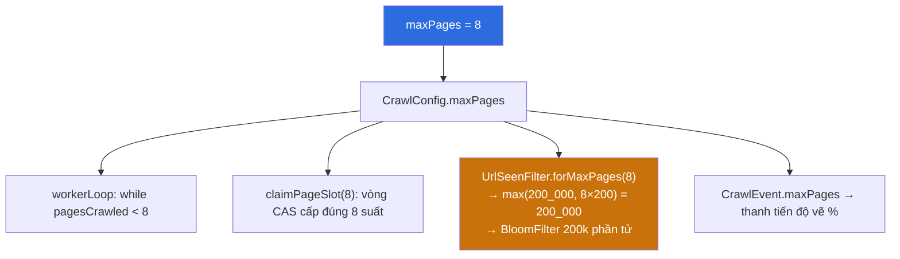
```mermaid
flowchart TD
    A["maxPages = 8"] --> B["CrawlConfig.maxPages"]
    B --> C["workerLoop: while pagesCrawled < 8"]
    B --> D["claimPageSlot(8): vòng CAS cấp đúng 8 suất"]
    B --> E["UrlSeenFilter.forMaxPages(8)<br/>→ max(200_000, 8×200) = 200_000<br/>→ BloomFilter 200k phần tử"]
    B --> F["CrawlEvent.maxPages → thanh tiến độ vẽ %"]

    style A fill:#2d6cdf,color:#fff
    style E fill:#c9720b,color:#fff
```

Chú ý nhánh **E**: `forMaxPages` có một **sàn tối thiểu 200 000**. Với `maxPages=8`
thì `8 × 200 = 1600` bị bỏ qua và Bloom filter vẫn được cấp cỡ 200 000 phần tử.
Chi tiết vì sao ở [mục 54](#54-urlseenfilter).

### 1.3 `maxDepth = 3` ảnh hưởng tới những gì

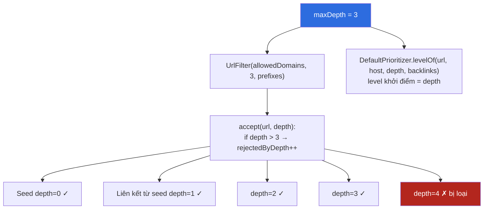
```mermaid
flowchart TD
    A["maxDepth = 3"] --> B["UrlFilter(allowedDomains, 3, prefixes)"]
    B --> C["accept(url, depth):<br/>if depth > 3 → rejectedByDepth++"]
    A --> D["DefaultPrioritizer.levelOf(url, host, depth, backlinks)<br/>level khởi điểm = depth"]

    C --> E["Seed depth=0 ✓"]
    C --> F["Liên kết từ seed depth=1 ✓"]
    C --> G["depth=2 ✓"]
    C --> H["depth=3 ✓"]
    C --> I["depth=4 ✗ bị loại"]

    style A fill:#2d6cdf,color:#fff
    style I fill:#b3261e,color:#fff
```

Với `maxPages=8`, giới hạn độ sâu **không bao giờ có tác dụng thật** — 8 trang đầu
tiên đều là seed ở `depth = 0`. `maxDepth` chỉ bắt đầu quan trọng khi `maxPages` đủ
lớn để crawler đi qua tầng seed.

### 1.4 Vì sao `OUTPUT` để trống lại thành `data/crawled-documents.json`

Hai lớp mặc định chồng lên nhau:

| Lớp | Mặc định |
|---|---|
| `run-crawl.bat` dòng `if "%OUTPUT%"=="" set "OUTPUT=data/crawled-documents.json"` | `data/crawled-documents.json` |
| `MultiDomainCrawlRunner`: `args.length > 2 ? args[2] : "data/crawled-multi.json"` | `data/crawled-multi.json` |

Vì bat **luôn truyền đủ 3 tham số** cho `exec.args`, mặc định của Java **không bao
giờ được dùng** khi chạy qua bat. Mặc định `crawled-multi.json` chỉ xuất hiện nếu
bạn gọi thẳng `java com.vnsearch.crawler.MultiDomainCrawlRunner 8 3`.

---

## 2. Bản đồ toàn hệ thống

### 2.1 Sơ đồ khối chính thức của crawler

Đây là sơ đồ được chép trong Javadoc của `CrawlerService`, vẽ lại bằng Mermaid:

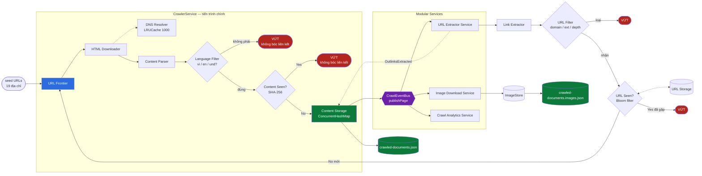
```mermaid
flowchart LR
    SEED(["seed URLs<br/>19 địa chỉ"]) --> FRONTIER

    subgraph CORE["CrawlerService — tiến trình chính"]
        FRONTIER["URL Frontier"] --> DOWNLOADER["HTML Downloader"]
        DOWNLOADER -.-> DNS["DNS Resolver<br/>LRUCache 1000"]
        DOWNLOADER --> PARSER["Content Parser"]
        PARSER --> LANG{"Language Filter<br/>vi / en / und?"}
        LANG -->|"không phải"| DROP1(["VỨT<br/>không bóc liên kết"])
        LANG -->|"đúng"| SEEN{"Content Seen?<br/>SHA-256"}
        SEEN -->|"Yes"| DROP2(["VỨT<br/>không bóc liên kết"])
        SEEN -->|"No"| STORAGE["Content Storage<br/>ConcurrentHashMap"]
    end

    STORAGE --> BUS{{"CrawlEventBus<br/>publishPage"}}

    subgraph MODULAR["Modular Services"]
        BUS --> EXTRACTOR["URL Extractor Service"]
        BUS --> IMAGES["Image Download Service"]
        BUS --> ANALYTICS["Crawl Analytics Service"]
    end

    EXTRACTOR --> LINKEXT["Link Extractor"]
    LINKEXT --> UFILTER{"URL Filter<br/>domain / ext / depth"}
    UFILTER -->|"loại"| DROP3(["VỨT"])
    UFILTER -->|"nhận"| USEEN{"URL Seen?<br/>Bloom filter"}
    USEEN <-.-> USTORE[("URL Storage")]
    USEEN -->|"Yes đã gặp"| DROP4(["VỨT"])
    USEEN -->|"No mới"| FRONTIER

    EXTRACTOR -.->|"OutlinksExtracted"| STORAGE
    IMAGES --> ISTORE[("ImageStore")]

    STORAGE --> JSON[("crawled-documents.json")]
    ISTORE --> IJSON[("crawled-documents.images.json")]

    style FRONTIER fill:#2d6cdf,color:#fff
    style STORAGE fill:#0b7a3b,color:#fff
    style BUS fill:#6b21a8,color:#fff
    style JSON fill:#0b7a3b,color:#fff
    style IJSON fill:#0b7a3b,color:#fff
    style DROP1 fill:#b3261e,color:#fff
    style DROP2 fill:#b3261e,color:#fff
    style DROP3 fill:#b3261e,color:#fff
    style DROP4 fill:#b3261e,color:#fff
```

### 2.2 Vì sao thứ tự các khối không tuỳ tiện

Thứ tự trong sơ đồ trên là **kết quả của bốn quyết định thiết kế**, mỗi cái đổi đi
thì hệ thống hỏng theo một kiểu riêng:

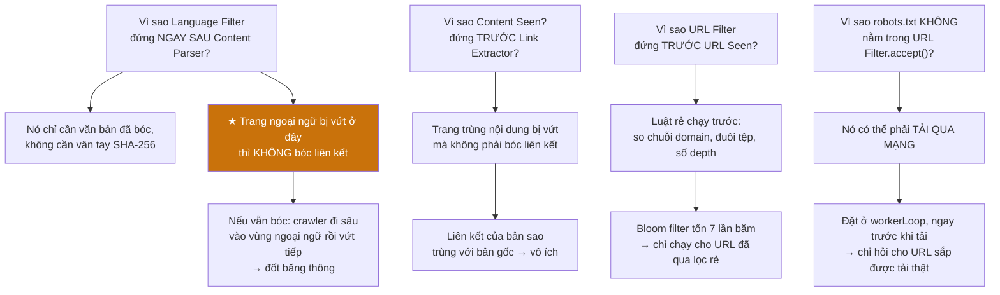
```mermaid
flowchart TD
    Q1["Vì sao Language Filter<br/>đứng NGAY SAU Content Parser?"]
    Q1 --> A1["Nó chỉ cần văn bản đã bóc,<br/>không cần vân tay SHA-256"]
    Q1 --> A2["★ Trang ngoại ngữ bị vứt ở đây<br/>thì KHÔNG bóc liên kết"]
    A2 --> A2b["Nếu vẫn bóc: crawler đi sâu<br/>vào vùng ngoại ngữ rồi vứt tiếp<br/>→ đốt băng thông"]

    Q2["Vì sao Content Seen?<br/>đứng TRƯỚC Link Extractor?"]
    Q2 --> B1["Trang trùng nội dung bị vứt<br/>mà không phải bóc liên kết"]
    B1 --> B2["Liên kết của bản sao<br/>trùng với bản gốc → vô ích"]

    Q3["Vì sao URL Filter<br/>đứng TRƯỚC URL Seen?"]
    Q3 --> C1["Luật rẻ chạy trước:<br/>so chuỗi domain, đuôi tệp, số depth"]
    C1 --> C2["Bloom filter tốn 7 lần băm<br/>→ chỉ chạy cho URL đã qua lọc rẻ"]

    Q4["Vì sao robots.txt KHÔNG<br/>nằm trong URL Filter.accept()?"]
    Q4 --> D1["Nó có thể phải TẢI QUA MẠNG"]
    D1 --> D2["Đặt ở workerLoop, ngay trước khi tải<br/>→ chỉ hỏi cho URL sắp được tải thật"]

    style A2 fill:#c9720b,color:#fff
```

### 2.3 Bản đồ gói (package)

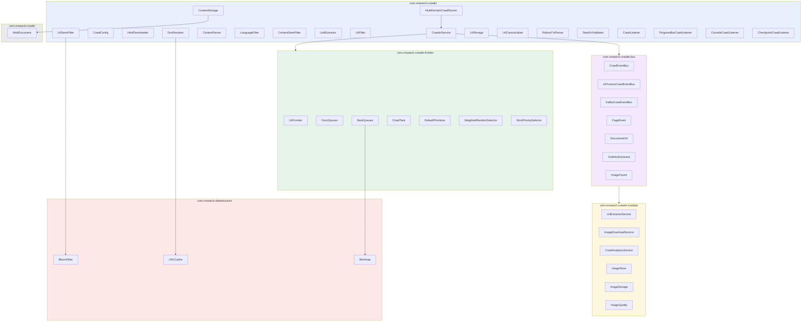
```mermaid
flowchart TB
    subgraph P1["com.vnsearch.crawler"]
        direction TB
        R["MultiDomainCrawlRunner"]
        CS["CrawlerService"]
        CC["CrawlConfig"]
        HD["HtmlDownloader"]
        DR["DnsResolver"]
        CP["ContentParser"]
        LF["LanguageFilter"]
        CSF["ContentSeenFilter"]
        CST["ContentStorage"]
        LE["LinkExtractor"]
        UF["UrlFilter"]
        USF["UrlSeenFilter"]
        UST["UrlStorage"]
        UC["UrlCanonicalizer"]
        RTP["RobotsTxtParser"]
        SUV["SeedUrlValidator"]
        CL["CrawlListener"]
        PBL["ProgressBarCrawlListener"]
        CCL["ConsoleCrawlListener"]
        CKL["CheckpointCrawlListener"]
    end

    subgraph P2["com.vnsearch.crawler.frontier"]
        UFR["UrlFrontier"]
        FQ["FrontQueues"]
        BQ["BackQueues"]
        CT["CrawlTask"]
        DP["DefaultPrioritizer"]
        WRS["WeightedRandomSelector"]
        SPS["StrictPrioritySelector"]
    end

    subgraph P3["com.vnsearch.crawler.bus"]
        CEB["CrawlEventBus"]
        IPB["InProcessCrawlEventBus"]
        KEB["KafkaCrawlEventBus"]
        PE["PageEvent"]
        DU["DiscoveredUrl"]
        OE["OutlinksExtracted"]
        IF["ImageFound"]
    end

    subgraph P4["com.vnsearch.crawler.modular"]
        UES["UrlExtractorService"]
        IDS["ImageDownloadService"]
        CAS["CrawlAnalyticsService"]
        IS["ImageStore"]
        ISG["ImageStorage"]
        IQ["ImageQuality"]
    end

    subgraph P5["com.vnsearch.datastructure"]
        BF["BloomFilter"]
        LRU["LRUCache"]
        MH["MinHeap"]
    end

    subgraph P6["com.vnsearch.model"]
        WD["WebDocument"]
    end

    R --> CS
    CS --> P2
    CS --> P3
    P3 --> P4
    USF --> BF
    DR --> LRU
    BQ --> MH
    CST --> WD

    style P1 fill:#e8f0fe
    style P2 fill:#e6f4ea
    style P3 fill:#f3e8fd
    style P4 fill:#fef7e0
    style P5 fill:#fce8e6
    style P6 fill:#e8eaed
```

---

## 3. Danh mục toàn bộ file tham gia

Một lệnh `run-crawl.bat 8 3` chạm tới **38 file**. Bảng dưới liệt kê đủ, kèm số dòng
thật và vai trò.

### 3.1 Tệp script

| File | Dòng | Vai trò |
|---|---|---|
| `run-crawl.bat` | ~130 | Chuẩn bị môi trường, gọi Maven |
| `search-engine/mvnw.cmd` | — | Maven Wrapper, tải Maven nếu chưa có |
| `search-engine/pom.xml` | — | Khai báo phụ thuộc: jsoup, jackson, micrometer, slf4j |

### 3.2 Gói `crawler` — 20 file

| File | Dòng | Vai trò trong sơ đồ |
|---|---|---|
| `MultiDomainCrawlRunner.java` | 276 | Điểm vào `main()`, seed list, báo cáo |
| `CrawlerService.java` | 907 | Bộ điều phối, vòng lặp worker |
| `CrawlConfig.java` | 126 | Cấu hình bất biến (Builder) |
| `CrawlListener.java` | 22 | Giao diện Observer |
| `ProgressBarCrawlListener.java` | 165 | Thanh tiến độ |
| `ConsoleCrawlListener.java` | 43 | Log định kỳ |
| `CheckpointCrawlListener.java` | 118 | Ghi tạm chống mất dữ liệu |
| `HtmlDownloader.java` | 146 | **HTML Downloader** |
| `DnsResolver.java` | 95 | **DNS Resolver** |
| `SeedUrlValidator.java` | 116 | Chống SSRF |
| `ContentParser.java` | 63 | **Content Parser** |
| `LanguageFilter.java` | 253 | **Language Filter** |
| `ContentSeenFilter.java` | 77 | **Content Seen?** |
| `ContentStorage.java` | 72 | **Content Storage** + đọc/ghi JSON |
| `LinkExtractor.java` | 39 | **Link Extractor** |
| `UrlFilter.java` | 233 | **URL Filter** |
| `UrlSeenFilter.java` | 88 | **URL Seen?** |
| `UrlStorage.java` | 121 | **URL Storage** |
| `UrlCanonicalizer.java` | 61 | Chuẩn hoá URL |
| `RobotsTxtParser.java` | 176 | Tải & phân tích robots.txt |

### 3.3 Gói `crawler.frontier` — 8 file

| File | Dòng | Vai trò |
|---|---|---|
| `UrlFrontier.java` | 188 | **URL Frontier** — mặt tiền |
| `FrontQueues.java` | 72 | 5 hàng đợi ưu tiên |
| `BackQueues.java` | 165 | 128 hàng đợi lịch sự |
| `CrawlTask.java` | 20 | Record `(url, host, depth)` |
| `Prioritizer.java` | 5 | Giao diện tính mức ưu tiên |
| `DefaultPrioritizer.java` | 47 | Cài đặt mặc định |
| `FrontQueueSelector.java` | 5 | Giao diện chọn hàng đợi |
| `WeightedRandomSelector.java` | 74 | Chọn ngẫu nhiên có trọng số |
| `StrictPrioritySelector.java` | 13 | Chọn ưu tiên tuyệt đối (chỉ dùng trong demo/test) |

### 3.4 Gói `crawler.bus` — 8 file

| File | Dòng | Vai trò |
|---|---|---|
| `CrawlEventBus.java` | 19 | Giao diện bus |
| `InProcessCrawlEventBus.java` | 130 | Cài đặt in-process (dùng lần này) |
| `KafkaCrawlEventBus.java` | 104 | Cài đặt Kafka (không dùng lần này) |
| `PageEvent.java` | 58 | Sự kiện "một trang đã crawl xong" |
| `PageEventHandler.java` | 9 | Giao diện người nhận `PageEvent` |
| `DiscoveredUrl.java` | 24 | Sự kiện "phát hiện URL mới" |
| `OutlinksExtracted.java` | 19 | Sự kiện "đã bóc xong liên kết" |
| `ImageFound.java` | 51 | Sự kiện "tìm thấy ảnh" |

### 3.5 Gói `crawler.modular` — 6 file

| File | Dòng | Vai trò |
|---|---|---|
| `UrlExtractorService.java` | 134 | Bóc liên kết + khép vòng lặp về frontier |
| `ImageDownloadService.java` | 312 | Bóc metadata ảnh (mặc định không tải nhị phân) |
| `ImageQuality.java` | 104 | So sánh chất lượng ảnh (chọn ảnh đại diện) |
| `ImageStore.java` | 132 | Kho ảnh trong bộ nhớ |
| `ImageStorage.java` | 71 | Đọc/ghi `*.images.json` |
| `CrawlAnalyticsService.java` | 182 | Số liệu Micrometer |

### 3.6 Gói `datastructure` — 3 file

| File | Dòng | Dùng ở đâu |
|---|---|---|
| `BloomFilter.java` | ~110 | `UrlSeenFilter` |
| `LRUCache.java` | ~110 | `DnsResolver` |
| `MinHeap.java` | ~150 | `BackQueues` |

### 3.7 Gói `model` — 1 file

| File | Vai trò |
|---|---|
| `WebDocument.java` | Mô hình một trang; getter của nó quyết định **tên trường trong JSON** |

---

## 4. Sơ đồ tuần tự tổng quát

Sơ đồ dưới là một lượt hoàn chỉnh: từ lúc gõ lệnh đến lúc tệp JSON nằm trên đĩa.
Để dễ đọc, chỉ vẽ **một** worker trong số 32.

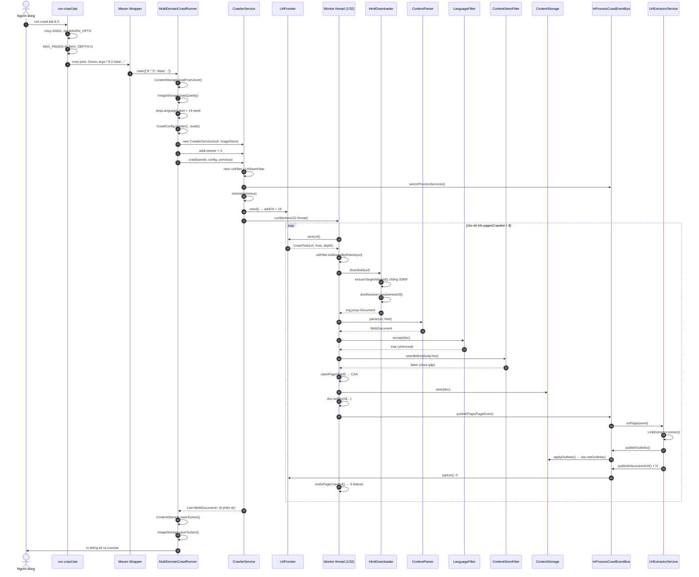
```mermaid
sequenceDiagram
    autonumber
    actor U as Người dùng
    participant BAT as run-crawl.bat
    participant MVN as Maven Wrapper
    participant RUN as MultiDomainCrawlRunner
    participant SVC as CrawlerService
    participant FR as UrlFrontier
    participant W as Worker thread (1/32)
    participant DL as HtmlDownloader
    participant PR as ContentParser
    participant LF as LanguageFilter
    participant CSF as ContentSeenFilter
    participant CST as ContentStorage
    participant BUS as InProcessCrawlEventBus
    participant UES as UrlExtractorService

    U->>BAT: run-crawl.bat 8 3
    BAT->>BAT: chcp 65001, set MAVEN_OPTS
    BAT->>BAT: MAX_PAGES=8, MAX_DEPTH=3
    BAT->>MVN: exec:java -Dexec.args="8 3 data/..."
    MVN->>RUN: main(["8","3","data/..."])

    RUN->>RUN: ContentStorage.loadFromJson()
    RUN->>RUN: ImageStorage.loadQuietly()
    RUN->>RUN: stripLanguageLabel × 19 seed
    RUN->>RUN: CrawlConfig.builder()...build()
    RUN->>SVC: new CrawlerService(null, imageStore)
    RUN->>SVC: addListener × 3
    RUN->>SVC: crawl(seeds, config, previous)

    SVC->>SVC: new UrlFilter / UrlSeenFilter
    SVC->>BUS: wireInProcessServices()
    SVC->>SVC: restore(previous)
    SVC->>FR: seed() → addUrl × 19
    SVC->>W: runWorkers(32 thread)

    loop cho tới khi pagesCrawled = 8
        W->>FR: nextUrl()
        FR-->>W: CrawlTask(url, host, depth)
        W->>W: urlFilter.isAllowedByRobots(url)
        W->>DL: download(url)
        DL->>DL: ensureTargetAllowed() chống SSRF
        DL->>DL: dnsResolver.resolveHostOf()
        DL-->>W: org.jsoup Document
        W->>PR: parse(url, html)
        PR-->>W: WebDocument
        W->>LF: accept(doc)
        LF-->>W: true (vi/en/und)
        W->>CSF: seenBefore(bodyText)
        CSF-->>W: false (chưa gặp)
        W->>W: claimPageSlot(8) → CAS
        W->>CST: save(doc)
        W->>W: doc.setDocId(...)
        W->>BUS: publishPage(PageEvent)
        BUS->>UES: onPage(event)
        UES->>UES: LinkExtractor.extract()
        UES->>BUS: publishOutlinks()
        BUS->>CST: applyOutlinks() → doc.setOutlinks()
        UES->>BUS: publishDiscoveredUrl() × N
        BUS->>FR: addUrl() ↺
        W->>W: notifyPageCrawled() → 3 listener
    end

    SVC-->>RUN: List<WebDocument> (8 phần tử)
    RUN->>RUN: ContentStorage.saveToJson()
    RUN->>RUN: ImageStorage.saveToJson()
    RUN->>U: in thống kê ra console
```

---

## 5. Vòng đời của một URL

Một URL đi qua **chín trạng thái**. Sơ đồ trạng thái dưới đây gom đủ mọi đường ra.

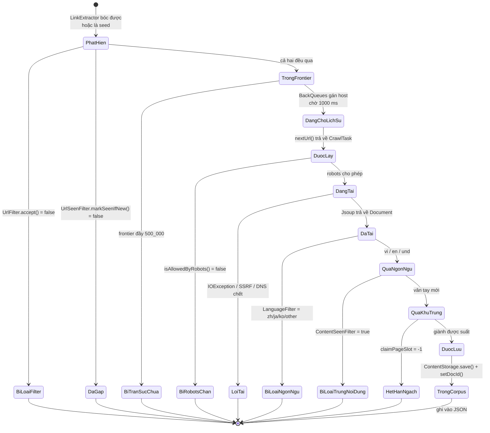
```mermaid
stateDiagram-v2
    [*] --> PhatHien: LinkExtractor bóc được<br/>hoặc là seed

    PhatHien --> BiLoaiFilter: UrlFilter.accept() = false
    PhatHien --> DaGap: UrlSeenFilter.markSeenIfNew() = false
    PhatHien --> TrongFrontier: cả hai đều qua

    TrongFrontier --> BiTranSucChua: frontier đầy 500_000
    TrongFrontier --> DangChoLichSu: BackQueues gán host<br/>chờ 1000 ms
    DangChoLichSu --> DuocLay: nextUrl() trả về CrawlTask

    DuocLay --> BiRobotsChan: isAllowedByRobots() = false
    DuocLay --> DangTai: robots cho phép

    DangTai --> LoiTai: IOException / SSRF / DNS chết
    DangTai --> DaTai: Jsoup trả về Document

    DaTai --> BiLoaiNgonNgu: LanguageFilter = zh/ja/ko/other
    DaTai --> QuaNgonNgu: vi / en / und

    QuaNgonNgu --> BiLoaiTrungNoiDung: ContentSeenFilter = true
    QuaNgonNgu --> QuaKhuTrung: vân tay mới

    QuaKhuTrung --> HetHanNgach: claimPageSlot = -1
    QuaKhuTrung --> DuocLuu: giành được suất

    DuocLuu --> TrongCorpus: ContentStorage.save() + setDocId()
    TrongCorpus --> [*]: ghi vào JSON

    BiLoaiFilter --> [*]
    DaGap --> [*]
    BiTranSucChua --> [*]
    BiRobotsChan --> [*]
    LoiTai --> [*]
    BiLoaiNgonNgu --> [*]
    BiLoaiTrungNoiDung --> [*]
    HetHanNgach --> [*]
```

### 5.1 Bảng đối chiếu trạng thái ↔ bộ đếm

Mỗi đường ra đều có một bộ đếm riêng, và tất cả được in ở cuối phiên bởi
`printBlockStatistics()`:

| Trạng thái kết thúc | Bộ đếm | Getter | In ở dòng |
|---|---|---|---|
| `BiLoaiFilter` (domain) | `UrlFilter.rejectedByDomain` | `getRejectedByDomainCount()` | `URL Filter` |
| `BiLoaiFilter` (đuôi tệp) | `UrlFilter.rejectedByExtension` | `getRejectedByExtensionCount()` | `URL Filter` |
| `BiLoaiFilter` (độ sâu) | `UrlFilter.rejectedByDepth` | `getRejectedByDepthCount()` | `URL Filter` |
| `BiLoaiFilter` (scheme) | `UrlFilter.rejectedByScheme` | `getRejectedBySchemeCount()` | `URL Filter` |
| `BiLoaiFilter` (host prefix) | `UrlFilter.rejectedByHostPrefix` | `getRejectedByHostPrefixCount()` | *(có getter, không in)* |
| `BiRobotsChan` | `UrlFilter.rejectedByRobots` | `getRejectedByRobotsCount()` | `URL Filter` |
| `DaGap` | `UrlExtractorService.rejectedAsSeen` | `getRejectedAsSeenCount()` | *(không in ở CLI)* |
| `BiTranSucChua` | `UrlFrontier.droppedDueToCapacity` | `getDroppedDueToCapacity()` | *(không in ở CLI)* |
| `LoiTai` | `HtmlDownloader.failed` | `getFailedCount()` | `HTML Downloader` |
| `BiLoaiNgonNgu` | `LanguageFilter.rejected` | `getRejectedCount()` | `Language Filter` |
| `BiLoaiTrungNoiDung` | `ContentSeenFilter.duplicates` | `getDuplicateCount()` | `Content Seen?` |
| `TrongCorpus` | `CrawlerService.pagesCrawled` | `getPagesCrawledCount()` | `THONG KE CRAWL` |

---

## 6. Vòng đời của một WebDocument

`WebDocument` được **tạo một lần** rồi **sửa ba lần** ở ba nơi khác nhau. Đây là
điểm dễ hiểu sai nhất trong toàn bộ pipeline.

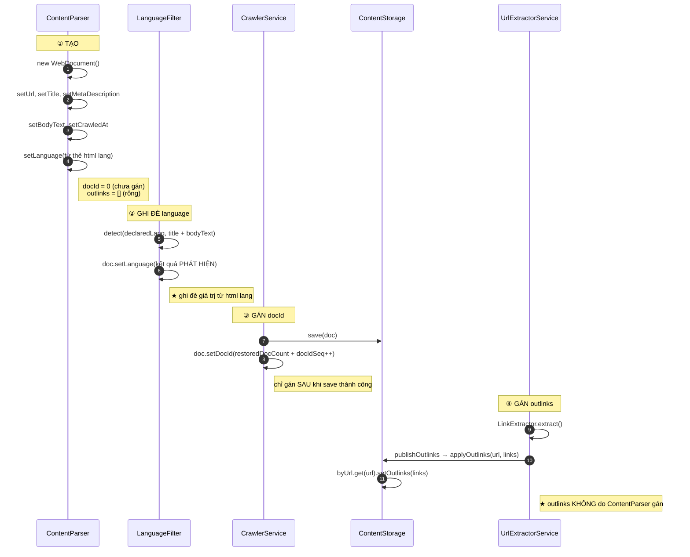
```mermaid
sequenceDiagram
    autonumber
    participant CP as ContentParser
    participant LF as LanguageFilter
    participant CS as CrawlerService
    participant CST as ContentStorage
    participant UES as UrlExtractorService

    Note over CP: ① TẠO
    CP->>CP: new WebDocument()
    CP->>CP: setUrl, setTitle, setMetaDescription
    CP->>CP: setBodyText, setCrawledAt
    CP->>CP: setLanguage(từ thẻ html lang)
    Note right of CP: docId = 0 (chưa gán)<br/>outlinks = [] (rỗng)

    Note over LF: ② GHI ĐÈ language
    LF->>LF: detect(declaredLang, title + bodyText)
    LF->>LF: doc.setLanguage(kết quả PHÁT HIỆN)
    Note right of LF: ★ ghi đè giá trị từ html lang

    Note over CS: ③ GÁN docId
    CS->>CST: save(doc)
    CS->>CS: doc.setDocId(restoredDocCount + docIdSeq++)
    Note right of CS: chỉ gán SAU khi save thành công

    Note over UES: ④ GÁN outlinks
    UES->>UES: LinkExtractor.extract()
    UES->>CST: publishOutlinks → applyOutlinks(url, links)
    CST->>CST: byUrl.get(url).setOutlinks(links)
    Note right of UES: ★ outlinks KHÔNG do ContentParser gán
```

### 6.1 Trạng thái của `WebDocument` sau mỗi bước

Lấy `en.nhandan.vn` làm ví dụ:

| Trường | Sau ① ContentParser | Sau ② LanguageFilter | Sau ③ setDocId | Sau ④ applyOutlinks |
|---|---|---|---|---|
| `docId` | `0` | `0` | **`5`** | `5` |
| `url` | `https://en.nhandan.vn` | *(không đổi)* | *(không đổi)* | *(không đổi)* |
| `title` | `Vietnam latest news, …` | *(không đổi)* | *(không đổi)* | *(không đổi)* |
| `metaDescription` | `Nhan Dan Online brings …` | *(không đổi)* | *(không đổi)* | *(không đổi)* |
| `bodyText` | `NA Chairman attends …` | *(không đổi)* | *(không đổi)* | *(không đổi)* |
| `outlinks` | `[]` | `[]` | `[]` | **`[131 URL]`** |
| `crawledAt` | `2026-08-21T09:57:27.171964200Z` | *(không đổi)* | *(không đổi)* | *(không đổi)* |
| `language` | `"en"` *(từ `<html lang="en">`)* | **`"en"`** *(phát hiện)* | *(không đổi)* | *(không đổi)* |

Với `vietnamnews.vn` (docId 3), cột ② khác hẳn cột ①:

| Trường | Sau ① ContentParser | Sau ② LanguageFilter |
|---|---|---|
| `language` | `"en"` *(giả định từ `<html lang="en">`)* | **`"vi"`** ← ghi đè! |

Chi tiết vì sao ở [mục 70](#70-phân-tích-trường-language).

### 6.2 Ánh xạ trường Java ↔ khoá JSON

Jackson dùng **getter** để suy ra tên khoá. Thứ tự trong tệp = thứ tự khai báo getter
trong `WebDocument.java`:

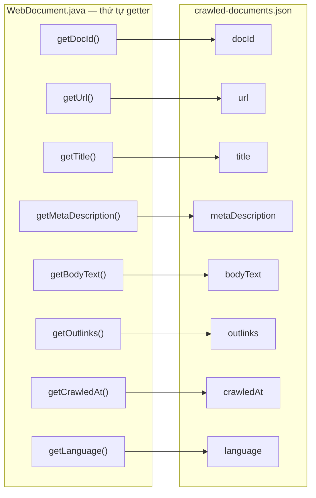
```mermaid
flowchart LR
    subgraph JAVA["WebDocument.java — thứ tự getter"]
        G1["getDocId()"]
        G2["getUrl()"]
        G3["getTitle()"]
        G4["getMetaDescription()"]
        G5["getBodyText()"]
        G6["getOutlinks()"]
        G7["getCrawledAt()"]
        G8["getLanguage()"]
    end

    subgraph JSON["crawled-documents.json"]
        J1["docId"]
        J2["url"]
        J3["title"]
        J4["metaDescription"]
        J5["bodyText"]
        J6["outlinks"]
        J7["crawledAt"]
        J8["language"]
    end

    G1 --> J1
    G2 --> J2
    G3 --> J3
    G4 --> J4
    G5 --> J5
    G6 --> J6
    G7 --> J7
    G8 --> J8
```

---

## 7. Bốn tầng chống trùng lặp

Hệ thống có **bốn** cơ chế chống trùng, ở bốn mức khác nhau. Nhầm lẫn giữa chúng là
nguồn gốc của phần lớn hiểu lầm về crawler.

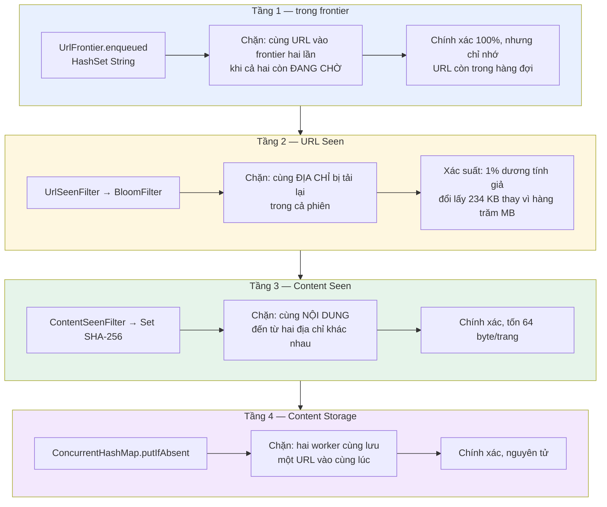
```mermaid
flowchart TD
    subgraph T1["Tầng 1 — trong frontier"]
        A1["UrlFrontier.enqueued<br/>HashSet String"]
        A2["Chặn: cùng URL vào frontier hai lần<br/>khi cả hai còn ĐANG CHỜ"]
        A3["Chính xác 100%, nhưng chỉ nhớ<br/>URL còn trong hàng đợi"]
        A1 --> A2 --> A3
    end

    subgraph T2["Tầng 2 — URL Seen"]
        B1["UrlSeenFilter → BloomFilter"]
        B2["Chặn: cùng ĐỊA CHỈ bị tải lại<br/>trong cả phiên"]
        B3["Xác suất: 1% dương tính giả<br/>đổi lấy 234 KB thay vì hàng trăm MB"]
        B1 --> B2 --> B3
    end

    subgraph T3["Tầng 3 — Content Seen"]
        C1["ContentSeenFilter → Set SHA-256"]
        C2["Chặn: cùng NỘI DUNG<br/>đến từ hai địa chỉ khác nhau"]
        C3["Chính xác, tốn 64 byte/trang"]
        C1 --> C2 --> C3
    end

    subgraph T4["Tầng 4 — Content Storage"]
        D1["ConcurrentHashMap.putIfAbsent"]
        D2["Chặn: hai worker cùng lưu<br/>một URL vào cùng lúc"]
        D3["Chính xác, nguyên tử"]
        D1 --> D2 --> D3
    end

    T1 --> T2 --> T3 --> T4

    style T1 fill:#e8f0fe
    style T2 fill:#fef7e0
    style T3 fill:#e6f4ea
    style T4 fill:#f3e8fd
```

### 7.1 Bảng so sánh bốn tầng

| | Tầng 1 `enqueued` | Tầng 2 `UrlSeenFilter` | Tầng 3 `ContentSeenFilter` | Tầng 4 `ContentStorage` |
|---|---|---|---|---|
| **Khoá** | URL đã chuẩn hoá | URL đã chuẩn hoá | SHA-256 của `bodyText` | URL đã chuẩn hoá |
| **Cấu trúc** | `HashSet<String>` | `BloomFilter` (bit array) | `ConcurrentHashMap.newKeySet()` | `ConcurrentHashMap` |
| **Chính xác?** | Tuyệt đối | **Xác suất** (1% FP) | Tuyệt đối | Tuyệt đối |
| **Phạm vi nhớ** | Chỉ URL đang chờ | Cả phiên | Cả phiên | Cả phiên |
| **Bộ nhớ** | ~100 byte/URL đang chờ | 234 KB cố định | ~64 byte/trang | Toàn bộ nội dung |
| **Đồng bộ** | `synchronized(lock)` | `synchronized(lock)` | lock-free | lock-free |
| **Bắt được gì** | Cùng URL từ 2 trang cha | Tải lại trang cũ | Bản sao nội dung | Đua ghi cùng URL |
| **Bỏ sót gì** | URL đã rời hàng đợi | 1% báo nhầm "đã gặp" | Nội dung sửa nhẹ | — |

### 7.2 Ví dụ cụ thể: mỗi tầng bắt được ca nào

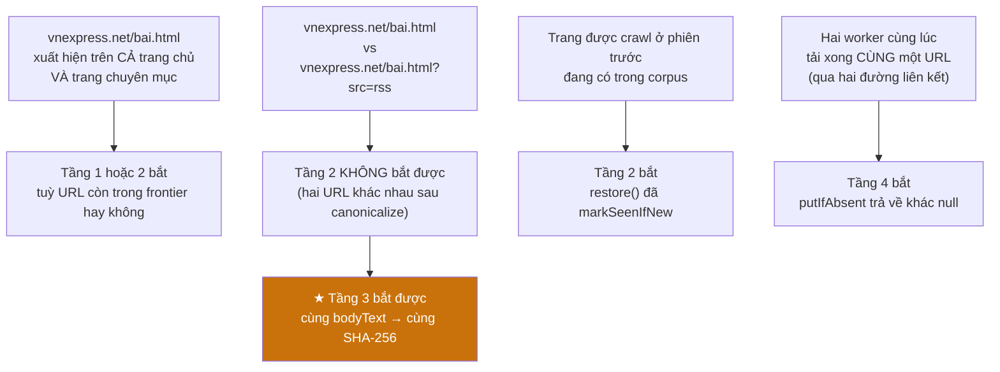
```mermaid
flowchart TD
    E1["vnexpress.net/bai.html<br/>xuất hiện trên CẢ trang chủ<br/>VÀ trang chuyên mục"]
    E1 --> T1B["Tầng 1 hoặc 2 bắt<br/>tuỳ URL còn trong frontier hay không"]

    E2["vnexpress.net/bai.html<br/>vs<br/>vnexpress.net/bai.html?src=rss"]
    E2 --> T2B["Tầng 2 KHÔNG bắt được<br/>(hai URL khác nhau sau canonicalize)"]
    T2B --> T3B["★ Tầng 3 bắt được<br/>cùng bodyText → cùng SHA-256"]

    E3["Trang được crawl ở phiên trước<br/>đang có trong corpus"]
    E3 --> T2C["Tầng 2 bắt<br/>restore() đã markSeenIfNew"]

    E4["Hai worker cùng lúc<br/>tải xong CÙNG một URL<br/>(qua hai đường liên kết)"]
    E4 --> T4B["Tầng 4 bắt<br/>putIfAbsent trả về khác null"]

    style T3B fill:#c9720b,color:#fff
```

---
---

# PHẦN II — TẦNG 0: TỆP BAT

---

## 8. `run-crawl.bat` — đọc từng dòng

**File:** `run-crawl.bat` (thư mục gốc repo, cạnh `docker-compose.yml`)

Tệp bat này **không crawl gì cả**. Toàn bộ 130 dòng của nó chỉ làm bốn việc:
chuẩn hoá môi trường, kiểm tra tiền đề, gán mặc định, rồi gọi Maven.

### 8.1 Sơ đồ luồng của tệp bat

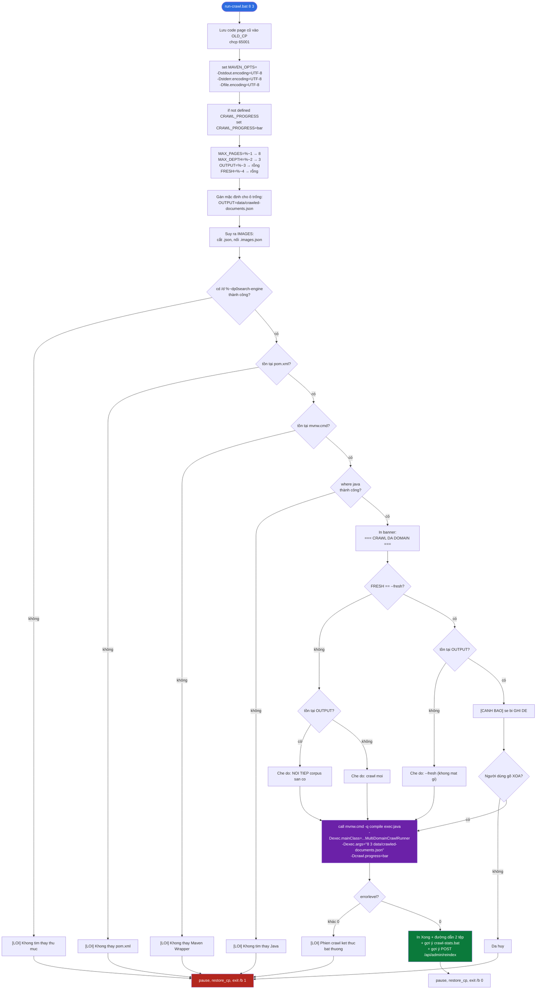
```mermaid
flowchart TD
    START(["run-crawl.bat 8 3"]) --> CP["Lưu code page cũ vào OLD_CP<br/>chcp 65001"]
    CP --> ENV["set MAVEN_OPTS=<br/>-Dstdout.encoding=UTF-8<br/>-Dstderr.encoding=UTF-8<br/>-Dfile.encoding=UTF-8"]
    ENV --> PROG["if not defined CRAWL_PROGRESS<br/>set CRAWL_PROGRESS=bar"]
    PROG --> ARGS["MAX_PAGES=%~1 → 8<br/>MAX_DEPTH=%~2 → 3<br/>OUTPUT=%~3 → rỗng<br/>FRESH=%~4 → rỗng"]
    ARGS --> DEF["Gán mặc định cho ô trống:<br/>OUTPUT=data/crawled-documents.json"]
    DEF --> IMG["Suy ra IMAGES:<br/>cắt .json, nối .images.json"]
    IMG --> CD{"cd /d %~dp0search-engine<br/>thành công?"}

    CD -->|"không"| F1["[LOI] Khong tim thay thu muc"]
    CD -->|"có"| POM{"tồn tại pom.xml?"}
    POM -->|"không"| F2["[LOI] Khong thay pom.xml"]
    POM -->|"có"| MVNW{"tồn tại mvnw.cmd?"}
    MVNW -->|"không"| F3["[LOI] Khong thay Maven Wrapper"]
    MVNW -->|"có"| JAVA{"where java<br/>thành công?"}
    JAVA -->|"không"| F4["[LOI] Khong tim thay Java"]
    JAVA -->|"có"| BANNER["In banner:<br/>=== CRAWL DA DOMAIN ==="]

    BANNER --> FRESHQ{"FRESH == --fresh?"}
    FRESHQ -->|"không"| EXIST{"tồn tại OUTPUT?"}
    EXIST -->|"có"| M1["Che do: NOI TIEP corpus san co"]
    EXIST -->|"không"| M2["Che do: crawl moi"]
    M1 --> RUN
    M2 --> RUN

    FRESHQ -->|"có"| ASK{"tồn tại OUTPUT?"}
    ASK -->|"không"| M3["Che do: --fresh (khong mat gi)"] --> RUN
    ASK -->|"có"| WARN["[CANH BAO] se bi GHI DE"]
    WARN --> CONFIRM{"Người dùng gõ XOA?"}
    CONFIRM -->|"không"| CANCEL["Da huy"] --> FAIL
    CONFIRM -->|"có"| RUN

    RUN["call mvnw.cmd -q compile exec:java<br/>-Dexec.mainClass=...MultiDomainCrawlRunner<br/>-Dexec.args=&quot;8 3 data/crawled-documents.json&quot;<br/>-Dcrawl.progress=bar"]
    RUN --> RC{"errorlevel?"}
    RC -->|"khác 0"| F5["[LOI] Phien crawl ket thuc bat thuong"] --> FAIL
    RC -->|"0"| OK["In Xong + đường dẫn 2 tệp<br/>+ gợi ý crawl-stats.bat<br/>+ gợi ý POST /api/admin/reindex"]
    OK --> RESTORE["pause, restore_cp, exit /b 0"]

    F1 --> FAIL
    F2 --> FAIL
    F3 --> FAIL
    F4 --> FAIL
    FAIL["pause, restore_cp, exit /b 1"]

    style START fill:#2d6cdf,color:#fff
    style RUN fill:#6b21a8,color:#fff
    style OK fill:#0b7a3b,color:#fff
    style FAIL fill:#b3261e,color:#fff
```

### 8.2 Bảng từng khối lệnh

| Dòng (xấp xỉ) | Mã | Mục đích |
|---|---|---|
| 1–2 | `@echo off` / `setlocal` | Không in lại lệnh; biến môi trường không rò ra ngoài phiên cmd |
| 4 | `set "RUNNER=com.vnsearch.crawler.MultiDomainCrawlRunner"` | Tên lớp `main`, tách ra một chỗ để dễ đổi |
| 6–8 | `for /f "tokens=2 delims=:" %%c in ('chcp')` → `chcp 65001` | Lưu code page hiện tại rồi chuyển sang UTF-8 |
| 10 | `set "MAVEN_OPTS=-Dstdout.encoding=UTF-8 …"` | Ép JVM dùng UTF-8 cho cả stdout, stderr và mã hoá tệp |
| 12 | `if not defined CRAWL_PROGRESS set "CRAWL_PROGRESS=bar"` | Bật thanh tiến độ mặc định |
| 14–17 | `set "MAX_PAGES=%~1"` … | `%~1` bỏ dấu nháy kép nếu người dùng gõ `"8"` |
| 19–21 | `if "%MAX_PAGES%"=="" set …` | Ba giá trị mặc định |
| 24–26 | Suy ra `IMAGES` | Chỉ để hiển thị; Java tự tính lại |
| 28–32 | `cd /d "%~dp0search-engine"` | `%~dp0` = thư mục chứa tệp bat, có dấu `\` cuối |
| 34–37 | Kiểm tra `pom.xml` | |
| 39–43 | Kiểm tra `mvnw.cmd` | |
| 45–48 | `where java` | |
| 50–54 | In phiên bản Java | `for /f` + `goto :java_done` để chỉ lấy dòng đầu |
| 56–63 | Banner thông tin | |
| 65–95 | Xử lý `--fresh` | |
| 97–106 | **Gọi Maven** | |
| 108–125 | Báo cáo & dọn dẹp | |

---

## 9. Vì sao phải `chcp 65001`

### 9.1 Vấn đề

Console Windows mặc định dùng code page **437** (Mỹ) hoặc **1258** (Việt Nam) hoặc
**1252** (Tây Âu). Không code page nào trong số đó biểu diễn được đầy đủ tiếng Việt
có dấu **và** đồng thời các ký tự vẽ thanh tiến độ `█░`.

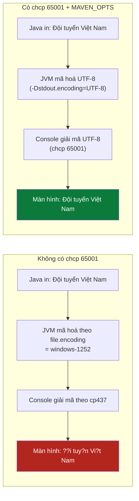
```mermaid
flowchart LR
    subgraph BAD["Không có chcp 65001"]
        B1["Java in: Đội tuyển Việt Nam"]
        B2["JVM mã hoá theo file.encoding<br/>= windows-1252"]
        B3["Console giải mã theo cp437"]
        B4["Màn hình: ??i tuy?n Vi?t Nam"]
        B1 --> B2 --> B3 --> B4
    end

    subgraph GOOD["Có chcp 65001 + MAVEN_OPTS"]
        G1["Java in: Đội tuyển Việt Nam"]
        G2["JVM mã hoá UTF-8<br/>(-Dstdout.encoding=UTF-8)"]
        G3["Console giải mã UTF-8<br/>(chcp 65001)"]
        G4["Màn hình: Đội tuyển Việt Nam"]
        G1 --> G2 --> G3 --> G4
    end

    style B4 fill:#b3261e,color:#fff
    style G4 fill:#0b7a3b,color:#fff
```

### 9.2 Vì sao cần **cả hai** vế

Chỉ `chcp 65001` mà không có `MAVEN_OPTS` thì JVM vẫn mã hoá ra windows-1252, console
giải mã UTF-8 → vẫn hỏng, chỉ hỏng theo kiểu khác. Cần **đồng thời**:

| Vế | Ai điều khiển | Tác dụng |
|---|---|---|
| `chcp 65001` | Console Windows | Console **giải mã** byte đầu vào theo UTF-8 |
| `-Dstdout.encoding=UTF-8` | JVM | `System.out` **mã hoá** theo UTF-8 |
| `-Dstderr.encoding=UTF-8` | JVM | `System.err` tương tự |
| `-Dfile.encoding=UTF-8` | JVM | `new FileWriter(...)` mặc định UTF-8 |

### 9.3 Nó ảnh hưởng tới tệp JSON không?

**Có, gián tiếp.** Jackson `ObjectMapper.writeValue(File, ...)` mặc định ghi UTF-8 bất
kể `file.encoding`, nên tệp JSON an toàn. Nhưng:

* `UrlStorage.append()` dùng `Files.newBufferedWriter(path, StandardCharsets.UTF_8, …)`
  — cũng ép UTF-8 tường minh. An toàn.
* Log qua SLF4J → console → **phụ thuộc code page**. Đây là chỗ thấy lỗi rõ nhất.

### 9.4 Khôi phục code page

```bat
:restore_cp
if defined OLD_CP chcp %OLD_CP% >nul
goto :eof
```

Được gọi ở **cả hai** đường thoát (`:fail` và đường thành công). Nếu không khôi phục,
cửa sổ cmd của người dùng bị kẹt ở UTF-8 sau khi crawl xong — làm hỏng các lệnh khác.

---

## 10. Suy diễn đường dẫn

### 10.1 `%~dp0` và `cd /d`

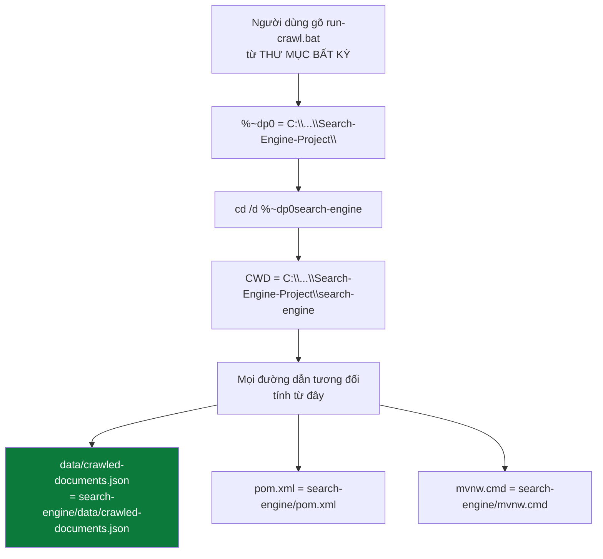
```mermaid
flowchart TD
    A["Người dùng gõ run-crawl.bat<br/>từ THƯ MỤC BẤT KỲ"] --> B["%~dp0 = C:\\...\\Search-Engine-Project\\"]
    B --> C["cd /d %~dp0search-engine"]
    C --> D["CWD = C:\\...\\Search-Engine-Project\\search-engine"]
    D --> E["Mọi đường dẫn tương đối<br/>tính từ đây"]
    E --> F["data/crawled-documents.json<br/>= search-engine/data/crawled-documents.json"]
    E --> G["pom.xml = search-engine/pom.xml"]
    E --> H["mvnw.cmd = search-engine/mvnw.cmd"]

    style F fill:#0b7a3b,color:#fff
```

`/d` là cần thiết: `cd` không có `/d` sẽ không đổi ổ đĩa. Nếu repo nằm ở `D:\` mà
cmd đang ở `C:\`, thiếu `/d` thì `cd` im lặng không làm gì và mọi kiểm tra sau đó
thất bại một cách khó hiểu.

### 10.2 Suy ra đường dẫn kho ảnh

```bat
set "IMAGES=%OUTPUT%"
if /i "%IMAGES:~-5%"==".json" set "IMAGES=%IMAGES:~0,-5%"
set "IMAGES=%IMAGES%.images.json"
```

| Bước | Giá trị |
|---|---|
| Ban đầu | `data/crawled-documents.json` |
| `%IMAGES:~-5%` = `.json` → cắt 5 ký tự cuối | `data/crawled-documents` |
| Nối `.images.json` | `data/crawled-documents.images.json` |

**★ Đây chỉ là để in ra màn hình.** Đường dẫn thật được Java tính lại bằng
`ImageStorage.pathFor()` — cùng thuật toán, nhưng độc lập. Nếu hai bên lệch nhau thì
bat in sai đường dẫn nhưng crawl vẫn đúng.

```java
// crawler/modular/ImageStorage.java
public static String pathFor(String corpusPath) {
    String base = corpusPath.endsWith(".json")
            ? corpusPath.substring(0, corpusPath.length() - ".json".length())
            : corpusPath;
    return base + ".images.json";
}
```

### 10.3 Bảng ví dụ `pathFor()`

| `corpusPath` | `pathFor()` |
|---|---|
| `data/crawled-documents.json` | `data/crawled-documents.images.json` |
| `data/test.json` | `data/test.images.json` |
| `data/no-extension` | `data/no-extension.images.json` |
| `data/a.JSON` | `data/a.JSON.images.json` ← ⚠ `endsWith` phân biệt hoa thường |
| `null` hoặc rỗng | ném `IllegalArgumentException` |

> ⚠ Bat dùng `if /i` (không phân biệt hoa thường) còn Java dùng `endsWith(".json")`
> (phân biệt). Với `data/a.JSON`, bat in `data/a.images.json` còn Java ghi ra
> `data/a.JSON.images.json`. Đây là một lệch nhỏ đã biết, không ảnh hưởng vì mặc định
> luôn là chữ thường.

---

## 11. Chế độ nối tiếp và `--fresh`

### 11.1 Hai chế độ

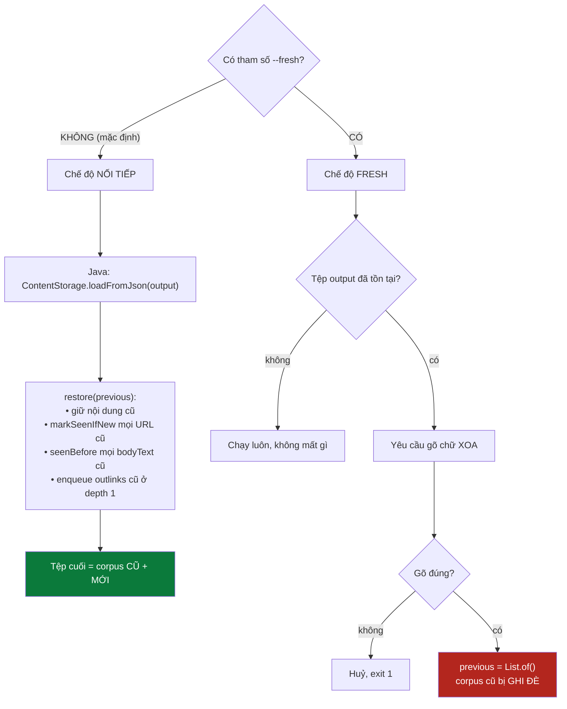
```mermaid
flowchart TD
    Q{"Có tham số --fresh?"}

    Q -->|"KHÔNG (mặc định)"| N1["Chế độ NỐI TIẾP"]
    N1 --> N2["Java: ContentStorage.loadFromJson(output)"]
    N2 --> N3["restore(previous):<br/>• giữ nội dung cũ<br/>• markSeenIfNew mọi URL cũ<br/>• seenBefore mọi bodyText cũ<br/>• enqueue outlinks cũ ở depth 1"]
    N3 --> N4["Tệp cuối = corpus CŨ + MỚI"]

    Q -->|"CÓ"| F1["Chế độ FRESH"]
    F1 --> F2{"Tệp output đã tồn tại?"}
    F2 -->|"không"| F3["Chạy luôn, không mất gì"]
    F2 -->|"có"| F4["Yêu cầu gõ chữ XOA"]
    F4 --> F5{"Gõ đúng?"}
    F5 -->|"không"| F6["Huỷ, exit 1"]
    F5 -->|"có"| F7["previous = List.of()<br/>corpus cũ bị GHI ĐÈ"]

    style N4 fill:#0b7a3b,color:#fff
    style F7 fill:#b3261e,color:#fff
```

### 11.2 Vì sao phải gõ chữ `XOA`

```bat
set /p "CONFIRM=Go XOA roi Enter de xac nhan, hoac Enter de huy: "
if /i not "%CONFIRM%"=="XOA" goto :fail
```

Không dùng `Y/N` vì `Y` là phím dễ bấm nhầm. Bắt gõ **bốn ký tự** thì xác suất bấm
nhầm gần bằng 0. Đây là hình mẫu quen thuộc của `terraform destroy` (gõ `yes`) và
GitHub (gõ tên repo để xoá).

### 11.3 ★ Vì sao nối tiếp qua **corpus** chứ không qua `UrlStorage`

Đây là quyết định thiết kế quan trọng, được ghi rõ trong Javadoc của `crawl()`:


```mermaid
flowchart TD
    subgraph WRONG["❌ Nếu nối tiếp qua UrlStorage"]
        W1["UrlStorage ghi MỌI URL được XẾP HÀNG"]
        W2["Bao gồm hàng chục nghìn URL<br/>còn nằm trong frontier lúc dừng"]
        W3["Những URL đó CHƯA HỀ được tải"]
        W4["Nạp lại → đánh dấu tất cả là ĐÃ GẶP"]
        W5["enqueue() loại thẳng chúng"]
        W6["★ Chúng KHÔNG BAO GIỜ được crawl nữa<br/>→ khoá vĩnh viễn phần lớn<br/>không gian tìm kiếm còn lại"]
        W1 --> W2 --> W3 --> W4 --> W5 --> W6
    end

    subgraph RIGHT["✓ Nối tiếp qua corpus"]
        R1["Mỗi tài liệu trong corpus<br/>là một trang THẬT SỰ đã tải"]
        R2["Đánh dấu đúng những URL này<br/>là đã gặp"]
        R3["Chặn đúng cái cần chặn"]
        R4["Frontier tái tạo được từ outlinks<br/>của chính các tài liệu cũ"]
        R1 --> R2 --> R3 --> R4
    end

    style W6 fill:#b3261e,color:#fff
    style R4 fill:#0b7a3b,color:#fff
```

### 11.4 Bảng so sánh hai nguồn nối tiếp

| | Corpus (`*.json`) | URL Storage (`*.txt`) |
|---|---|---|
| Chứa gì | URL **đã tải xong và lưu** | URL **đã xếp hàng** (phần lớn chưa tải) |
| Số lượng điển hình | 5 000 | 800 000 |
| Nạp lại thì | Chặn đúng trang đã có | Chặn cả trang chưa hề tải |
| Tái tạo frontier | Được, từ `outlinks` | Không (không lưu depth) |
| Trong repo này | ✅ Dùng | ⛔ Mặc định **tắt** (`urlStoragePath = null`) |

---

## 12. Lệnh Maven cuối cùng

```bat
call "%MVNW%" -q compile exec:java ^
     -Dexec.mainClass=%RUNNER% ^
     -Dexec.args="%EXEC_ARGS%" ^
     -Dcrawl.progress=%CRAWL_PROGRESS%
```

Sau khi thay biến:

```bat
mvnw.cmd -q compile exec:java ^
  -Dexec.mainClass=com.vnsearch.crawler.MultiDomainCrawlRunner ^
  -Dexec.args="8 3 data/crawled-documents.json" ^
  -Dcrawl.progress=bar
```

### 12.1 Từng cờ

| Cờ | Tác dụng |
|---|---|
| `-q` | *quiet* — Maven chỉ in `[ERROR]`, không in `[INFO] Downloading…` |
| `compile` | Biên dịch `src/main/java` → `target/classes`; **incremental**, lần thứ hai gần như tức thì |
| `exec:java` | Chạy `main()` **trong chính JVM của Maven**, không fork tiến trình mới |
| `-Dexec.mainClass` | Lớp có `main()` |
| `-Dexec.args` | Chuỗi bị tách theo dấu cách → `args[0]="8"`, `args[1]="3"`, `args[2]="data/..."` |
| `-Dcrawl.progress=bar` | System property, đọc bởi `ProgressBarCrawlListener.detectInteractive()` |

### 12.2 ★ Vì sao cần `-Dcrawl.progress`

```java
// crawler/ProgressBarCrawlListener.java
private static boolean detectInteractive() {
    String forced = System.getProperty("crawl.progress");
    if (forced != null) {
        return forced.equalsIgnoreCase("bar");
    }
    return System.console() != null;
}
```

Khi chạy qua `exec:java`, Maven chiếm stdin/stdout nên `System.console()` trả về
`null` → nếu không có cờ, listener sẽ tưởng đang chạy trong CI và chuyển sang chế độ
in từng dòng (`plainLine`) thay vì vẽ thanh có `\r`.

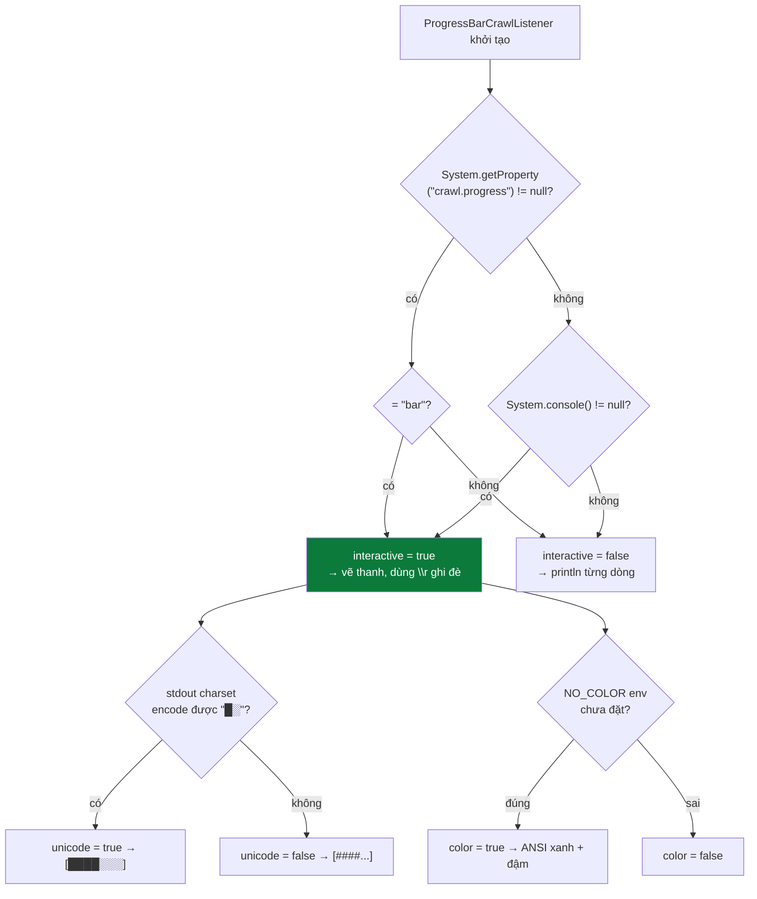
```mermaid
flowchart TD
    A["ProgressBarCrawlListener khởi tạo"] --> B{"System.getProperty<br/>(&quot;crawl.progress&quot;) != null?"}
    B -->|"có"| C{"= &quot;bar&quot;?"}
    C -->|"có"| D["interactive = true<br/>→ vẽ thanh, dùng \\r ghi đè"]
    C -->|"không"| E["interactive = false<br/>→ println từng dòng"]
    B -->|"không"| F{"System.console() != null?"}
    F -->|"có"| D
    F -->|"không"| E

    D --> G{"stdout charset<br/>encode được &quot;█░&quot;?"}
    G -->|"có"| H["unicode = true → [████░░░]"]
    G -->|"không"| I["unicode = false → [####...]"]

    D --> J{"NO_COLOR env<br/>chưa đặt?"}
    J -->|"đúng"| K["color = true → ANSI xanh + đậm"]
    J -->|"sai"| L["color = false"]

    style D fill:#0b7a3b,color:#fff
```

### 12.3 Vì sao `exec:java` chứ không `exec:exec`

| | `exec:java` | `exec:exec` |
|---|---|---|
| Tiến trình | Cùng JVM với Maven | JVM mới |
| Classpath | Maven tự dựng | Phải tự khai báo |
| Ctrl+C | Bắt được bởi shutdown hook | Phức tạp hơn |
| `System.console()` | `null` (Maven chiếm) | Có thể có |
| Khởi động | Nhanh | Chậm hơn ~1 s |

Chọn `exec:java` để classpath tự động đúng, đổi lại phải thêm cờ `-Dcrawl.progress`.

### 12.4 Điều gì xảy ra nếu crawl bị Ctrl+C

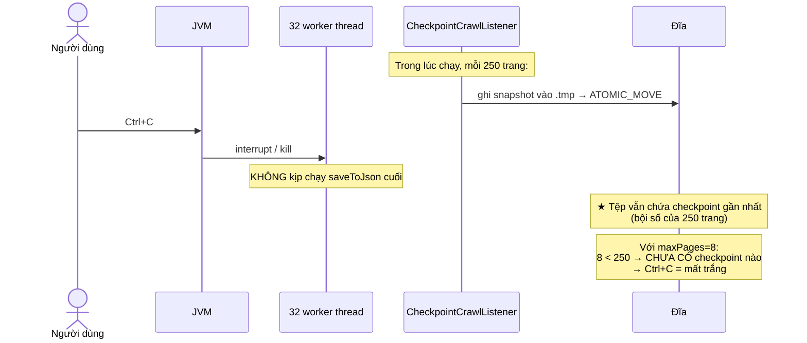
```mermaid
sequenceDiagram
    actor U as Người dùng
    participant JVM
    participant W as 32 worker thread
    participant CKL as CheckpointCrawlListener
    participant FS as Đĩa

    Note over CKL: Trong lúc chạy, mỗi 250 trang:
    CKL->>FS: ghi snapshot vào .tmp → ATOMIC_MOVE

    U->>JVM: Ctrl+C
    JVM->>W: interrupt / kill
    Note over W: KHÔNG kịp chạy saveToJson cuối
    Note over FS: ★ Tệp vẫn chứa checkpoint gần nhất<br/>(bội số của 250 trang)

    Note over FS: Với maxPages=8:<br/>8 < 250 → CHƯA CÓ checkpoint nào<br/>→ Ctrl+C = mất trắng
```

Với `maxPages = 8`, `CheckpointCrawlListener` **không bao giờ kích hoạt**, nên Ctrl+C
giữa chừng làm mất toàn bộ. Với `maxPages = 10000` thì mất nhiều nhất 250 trang cuối.

---
---

# PHẦN III — TẦNG 1: ĐIỂM VÀO JAVA

---

## 13. `MultiDomainCrawlRunner` — tổng quan

**File:** `crawler/MultiDomainCrawlRunner.java` (276 dòng)

Lớp này là **kịch bản dòng lệnh**, không phải một phần của kiến trúc crawler. Nó:

1. Dịch `String[] args` thành cấu hình.
2. Giữ danh sách seed cứng.
3. Suy ra `allowedDomains`.
4. Lắp ráp `CrawlerService` + listener.
5. Gọi `crawl()`.
6. Ghi hai tệp JSON.
7. In hai khối báo cáo.

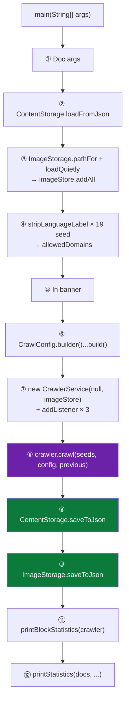
```mermaid
flowchart TD
    M["main(String[] args)"] --> P1["① Đọc args"]
    P1 --> P2["② ContentStorage.loadFromJson"]
    P2 --> P3["③ ImageStorage.pathFor + loadQuietly<br/>→ imageStore.addAll"]
    P3 --> P4["④ stripLanguageLabel × 19 seed<br/>→ allowedDomains"]
    P4 --> P5["⑤ In banner"]
    P5 --> P6["⑥ CrawlConfig.builder()...build()"]
    P6 --> P7["⑦ new CrawlerService(null, imageStore)<br/>+ addListener × 3"]
    P7 --> P8["⑧ crawler.crawl(seeds, config, previous)"]
    P8 --> P9["⑨ ContentStorage.saveToJson"]
    P9 --> P10["⑩ ImageStorage.saveToJson"]
    P10 --> P11["⑪ printBlockStatistics(crawler)"]
    P11 --> P12["⑫ printStatistics(docs, ...)"]

    style P8 fill:#6b21a8,color:#fff
    style P9 fill:#0b7a3b,color:#fff
    style P10 fill:#0b7a3b,color:#fff
```

### 13.1 Các hàm phụ trong lớp

| Hàm | Kiểu | Vai trò |
|---|---|---|
| `main(String[])` | `public static void` | Điểm vào |
| `concat(List, List)` | `private static List<String>` | Gộp seed VI + EN thành `DEFAULT_SEEDS` |
| `distinctSeedHosts()` | `private static int` | Đếm host phân biệt → tính `threadCount` |
| `stripLanguageLabel(String)` | `private static String` | Cắt nhãn `www.`/`e.`/`en.` |
| `printBlockStatistics(CrawlerService)` | `private static void` | Báo cáo theo từng khối |
| `printStatistics(List, long, String, Set)` | `private static void` | Báo cáo tổng |
| `hostOf(String)` | `private static String` | Host của URL, fallback `(khong ro)` |

---

## 14. Đọc tham số dòng lệnh

```java
public static void main(String[] args) throws IOException {
    int maxPages    = args.length > 0 ? Integer.parseInt(args[0]) : 5000;
    int maxDepth    = args.length > 1 ? Integer.parseInt(args[1]) : 3;
    String outputPath = args.length > 2 ? args[2] : "data/crawled-multi.json";
    boolean fresh   = args.length > 3 && args[3].equalsIgnoreCase("--fresh");
    ...
}
```

### 14.1 Giá trị sau khi phân tích

| Biến | Giá trị | Nguồn |
|---|---|---|
| `maxPages` | `8` | `args[0]` = `"8"` |
| `maxDepth` | `3` | `args[1]` = `"3"` |
| `outputPath` | `"data/crawled-documents.json"` | `args[2]` (bat luôn truyền) |
| `fresh` | `false` | `args.length == 3` |

### 14.2 ⚠ Không có `try/catch` quanh `parseInt`

```java
int maxPages = Integer.parseInt(args[0]);   // ném NumberFormatException nếu không phải số
```

Gọi `run-crawl.bat abc 3` sẽ cho:

```
Exception in thread "main" java.lang.NumberFormatException: For input string: "abc"
	at java.base/java.lang.Integer.parseInt(Integer.java:652)
	at com.vnsearch.crawler.MultiDomainCrawlRunner.main(MultiDomainCrawlRunner.java:52)
```

Bat sẽ bắt `errorlevel != 0` và in `[LOI] Phien crawl ket thuc bat thuong.` Thông báo
không cụ thể lắm, nhưng stack trace ở ngay trên đó.

### 14.3 Giá trị hợp lệ nhưng vô nghĩa

| Lệnh | Điều gì xảy ra |
|---|---|
| `run-crawl.bat 0 3` | `CrawlConfig.build()` ném `IllegalArgumentException: maxPages must be > 0, 0` |
| `run-crawl.bat -5 3` | Tương tự |
| `run-crawl.bat 8 -1` | `maxDepth must be >= 0, -1` |
| `run-crawl.bat 8 0` | Hợp lệ — chỉ crawl seed, không đi sâu |
| `run-crawl.bat 99999999 3` | Hợp lệ; `forMaxPages` bị chặn trần ở `MAX_EXPECTED_URLS = 50_000_000` |

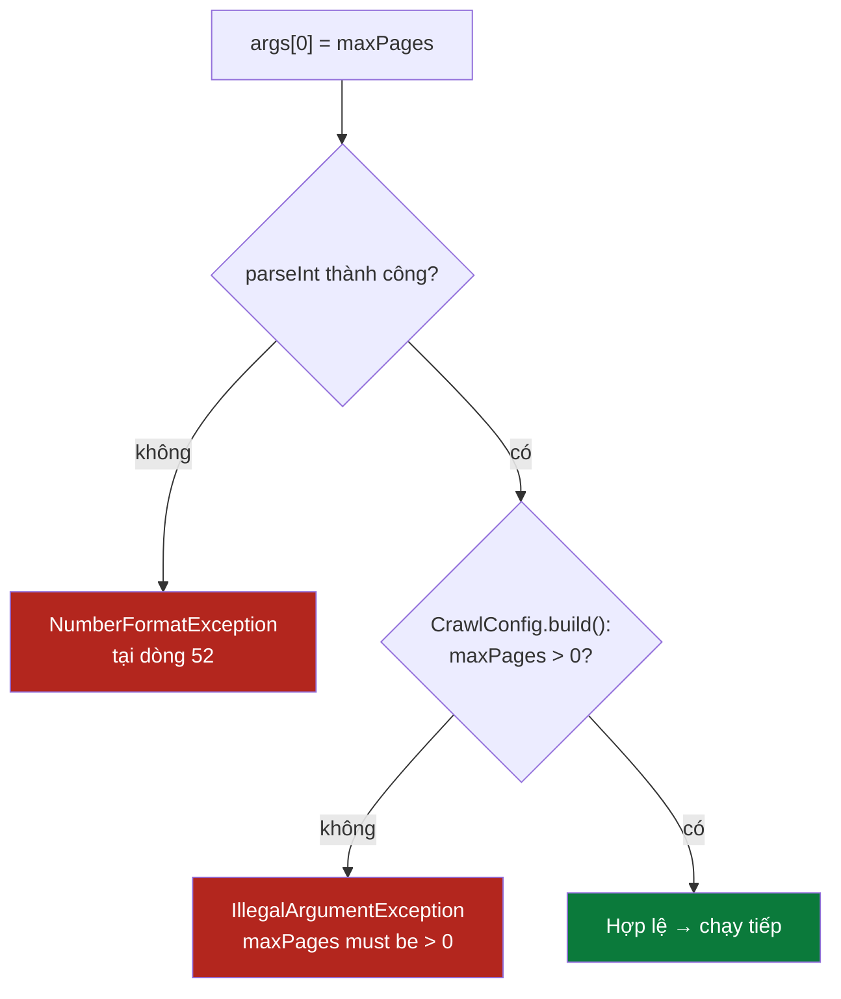
```mermaid
flowchart TD
    A["args[0] = maxPages"] --> B{"parseInt thành công?"}
    B -->|"không"| C["NumberFormatException<br/>tại dòng 52"]
    B -->|"có"| D{"CrawlConfig.build():<br/>maxPages > 0?"}
    D -->|"không"| E["IllegalArgumentException<br/>maxPages must be > 0"]
    D -->|"có"| F["Hợp lệ → chạy tiếp"]

    style C fill:#b3261e,color:#fff
    style E fill:#b3261e,color:#fff
    style F fill:#0b7a3b,color:#fff
```

---

## 15. Nạp lại corpus cũ

```java
List<WebDocument> previous = List.of();
if (!fresh && Files.exists(Path.of(outputPath))) {
    previous = ContentStorage.loadFromJson(outputPath);
    System.out.printf("Noi tiep corpus san co: %d tai lieu tu %s%n",
            previous.size(), outputPath);
}
```

### 15.1 `ContentStorage.loadFromJson()`

**File:** `crawler/ContentStorage.java`

```java
public static List<WebDocument> loadFromJson(String path) throws IOException {
    ObjectMapper mapper = new ObjectMapper().registerModule(new JavaTimeModule());
    WebDocument[] docs = mapper.readValue(new File(path), WebDocument[].class);
    return new ArrayList<>(List.of(docs));
}
```

| Chi tiết | Vì sao |
|---|---|
| `registerModule(new JavaTimeModule())` | Nếu thiếu, Jackson không biết dựng `Instant` từ chuỗi ISO-8601 và ném `InvalidDefinitionException` |
| `readValue(File, WebDocument[].class)` | Đọc **toàn bộ** tệp vào bộ nhớ — chấp nhận được vì corpus mục tiêu vài trăm MB |
| `new ArrayList<>(List.of(docs))` | `List.of` không nhận `null`; `new ArrayList` để danh sách sửa được |
| Không có `try/catch` | Tệp hỏng → ném ra `main` → bat báo lỗi. Cố ý: nối tiếp một corpus hỏng còn tệ hơn dừng lại |

### 15.2 ⚠ Đối lập với `ImageStorage.loadQuietly()`

```mermaid
flowchart LR
    subgraph C["Corpus — nghiêm ngặt"]
        C1["loadFromJson()"] --> C2{"Tệp hỏng?"}
        C2 -->|"có"| C3["ném IOException<br/>→ DỪNG toàn bộ"]
        C2 -->|"không"| C4["trả về danh sách"]
    end

    subgraph I["Kho ảnh — khoan dung"]
        I1["loadQuietly()"] --> I2{"Tệp hỏng?"}
        I2 -->|"có"| I3["trả về List.of()<br/>→ CHẠY TIẾP"]
        I2 -->|"không"| I4["trả về danh sách"]
    end

    style C3 fill:#b3261e,color:#fff
    style I3 fill:#c9720b,color:#fff
```

Lý do khác biệt: **mất corpus là mất kết quả crawl**, còn **mất metadata ảnh chỉ là
mất tính năng phụ**. Crawl không được chết vì một tệp ảnh hỏng.

### 15.3 Điều gì xảy ra với `previous` sau đó

```mermaid
flowchart TD
    A["previous: List&lt;WebDocument&gt;"] --> B["crawler.crawl(seeds, config, previous)"]
    B --> C["CrawlerService.restore(previous)"]
    C --> D["contentStorage.save(doc) × N"]
    C --> E["doc.setDocId(0..N-1) đánh số lại"]
    C --> F["urlSeenFilter.markSeenIfNew(url) × N"]
    C --> G["contentSeenFilter.seenBefore(bodyText) × N"]
    C --> H["restoredDocCount = N"]
    C --> I["enqueue(outlink, 1) cho mọi outlink"]

    style E fill:#c9720b,color:#fff
    style H fill:#c9720b,color:#fff
```

Chi tiết ở [mục 23](#23-restore--nối-tiếp-corpus).

---

## 16. Nạp lại kho ảnh

```java
ImageStore imageStore = new ImageStore();
String imagePath = ImageStorage.pathFor(outputPath);
if (!fresh) {
    List<ImageFound> previousImages = ImageStorage.loadQuietly(imagePath);
    if (!previousImages.isEmpty()) {
        imageStore.addAll(previousImages);
        System.out.printf("Noi tiep kho anh san co : %d anh tu %s%n",
                previousImages.size(), imagePath);
    }
}
```

### 16.1 `ImageStore` — cấu trúc

**File:** `crawler/modular/ImageStore.java`

```java
public class ImageStore {
    public static final int MAX_PAGES = 50_000;
    private final Map<String, ImageFound> byPage = new ConcurrentHashMap<>();
    private final AtomicLong pagesAdded, replaced, rejected, droppedPageLimit;
    ...
}
```

**★ Một trang = tối đa một ảnh.** Khoá là `pageUrl`, không phải `imageUrl`. Khi trang
có 50 ảnh, `ImageStore` chỉ giữ **ảnh tốt nhất**, xác định bởi `ImageQuality.isBetter()`.

```mermaid
flowchart TD
    A["ImageFound mới đến"] --> B{"byPage đã có<br/>pageUrl này?"}
    B -->|"chưa"| C{"byPage.size() >= 50_000?"}
    C -->|"có"| D["droppedPageLimit++<br/>return false"]
    C -->|"không"| E["put → pagesAdded++<br/>return true"]
    B -->|"rồi"| F{"ImageQuality.isBetter<br/>(mới, hiện tại)?"}
    F -->|"có"| G["thay thế → replaced++<br/>return true"]
    F -->|"không"| H["giữ nguyên → rejected++<br/>return false"]

    style E fill:#0b7a3b,color:#fff
    style G fill:#0b7a3b,color:#fff
    style D fill:#b3261e,color:#fff
```

### 16.2 Vì sao truyền `imageStore` vào `CrawlerService`

```java
CrawlerService crawler = new CrawlerService(null, imageStore);
```

Constructor hai tham số:

```java
public CrawlerService(CrawlEventBus bus, ImageStore imageStore) {
    if (bus == null) {
        this.bus = new InProcessCrawlEventBus();
        this.ownsBus = true;
    } else {
        this.bus = bus;
        this.ownsBus = false;
    }
    this.imageStore = imageStore;
}
```

Rồi trong `wireInProcessServices()`:

```java
if (imageStore != null) {
    localBus.subscribeImages(imageStore::add);
}
```

**★ `ImageStore` là bên nhận THỨ HAI của kênh `ImageFound`.** Bên thứ nhất là
`CrawlAnalyticsService::onImage` (đếm). Tách làm hai người đăng ký chứ không nhét cả
hai việc vào Analytics: đếm và lưu là hai trách nhiệm, và tắt một cái không được làm
hỏng cái kia.

```mermaid
flowchart LR
    IDS["ImageDownloadService"] -->|"publishImage"| BUS{{"bus"}}
    BUS --> A1["CrawlAnalyticsService.onImage()<br/>đếm imagesTotal, imagesMissingAlt"]
    BUS --> A2["ImageStore.add()<br/>giữ ảnh đại diện tốt nhất"]

    style BUS fill:#6b21a8,color:#fff
```

---

## 17. 19 seed và `stripLanguageLabel`

### 17.1 Danh sách seed đầy đủ

```java
private static final List<String> VIETNAMESE_SEEDS = List.of(
        "https://vnexpress.net/",
        "https://tuoitre.vn/",
        "https://dantri.com.vn/",
        "https://thanhnien.vn/",
        "https://vietnamnet.vn/",
        "https://nhandan.vn/",
        "https://hanoimoi.vn/",
        "https://baochinhphu.vn/",
        "https://www.vietnamplus.vn/",
        "https://tuyensinhso.vn/",
        "https://hcmiu.edu.vn/");

private static final List<String> ENGLISH_SEEDS = List.of(
        "https://e.vnexpress.net/",
        "https://en.vietnamnet.vn/",
        "https://en.nhandan.vn/",
        "https://en.baochinhphu.vn/",
        "https://en.vietnamplus.vn/",
        "https://vietnamnews.vn/",
        "https://english.vov.vn/",
        "https://vir.com.vn/");
```

**11 + 8 = 19 seed**, thuộc **19 host phân biệt**.

### 17.2 `stripLanguageLabel()` — mã và bảng

```java
private static final Set<String> LANGUAGE_LABELS = Set.of("www", "e", "en");

private static String stripLanguageLabel(String host) {
    int dot = host.indexOf('.');
    if (dot <= 0) {
        return host;                        // không có dấu chấm, hoặc bắt đầu bằng dấu chấm
    }
    String first = host.substring(0, dot).toLowerCase(Locale.ROOT);
    String rest  = host.substring(dot + 1);
    if (LANGUAGE_LABELS.contains(first) && rest.indexOf('.') > 0) {
        return rest;                        // ★ chỉ cắt khi PHẦN CÒN LẠI vẫn có dấu chấm
    }
    return host;
}
```

Điều kiện `rest.indexOf('.') > 0` chống trường hợp cắt nhầm thành TLD trần:
`en.vn` → nếu cắt sẽ thành `vn`, tức **toàn bộ tên miền quốc gia Việt Nam** được
whitelist. Điều kiện này chặn ca đó.

### 17.3 Bảng ánh xạ đầy đủ 19 seed

| # | Seed URL | `getHost()` | Nhãn đầu | Trong `LANGUAGE_LABELS`? | `rest` có dấu chấm? | Kết quả |
|---|---|---|---|---|---|---|
| 1 | `https://vnexpress.net/` | `vnexpress.net` | `vnexpress` | ✗ | — | `vnexpress.net` |
| 2 | `https://tuoitre.vn/` | `tuoitre.vn` | `tuoitre` | ✗ | — | `tuoitre.vn` |
| 3 | `https://dantri.com.vn/` | `dantri.com.vn` | `dantri` | ✗ | — | `dantri.com.vn` |
| 4 | `https://thanhnien.vn/` | `thanhnien.vn` | `thanhnien` | ✗ | — | `thanhnien.vn` |
| 5 | `https://vietnamnet.vn/` | `vietnamnet.vn` | `vietnamnet` | ✗ | — | `vietnamnet.vn` |
| 6 | `https://nhandan.vn/` | `nhandan.vn` | `nhandan` | ✗ | — | `nhandan.vn` |
| 7 | `https://hanoimoi.vn/` | `hanoimoi.vn` | `hanoimoi` | ✗ | — | `hanoimoi.vn` |
| 8 | `https://baochinhphu.vn/` | `baochinhphu.vn` | `baochinhphu` | ✗ | — | `baochinhphu.vn` |
| 9 | `https://www.vietnamplus.vn/` | `www.vietnamplus.vn` | `www` | ✓ | ✓ | **`vietnamplus.vn`** |
| 10 | `https://tuyensinhso.vn/` | `tuyensinhso.vn` | `tuyensinhso` | ✗ | — | `tuyensinhso.vn` |
| 11 | `https://hcmiu.edu.vn/` | `hcmiu.edu.vn` | `hcmiu` | ✗ | — | `hcmiu.edu.vn` |
| 12 | `https://e.vnexpress.net/` | `e.vnexpress.net` | `e` | ✓ | ✓ | **`vnexpress.net`** |
| 13 | `https://en.vietnamnet.vn/` | `en.vietnamnet.vn` | `en` | ✓ | ✓ | **`vietnamnet.vn`** |
| 14 | `https://en.nhandan.vn/` | `en.nhandan.vn` | `en` | ✓ | ✓ | **`nhandan.vn`** |
| 15 | `https://en.baochinhphu.vn/` | `en.baochinhphu.vn` | `en` | ✓ | ✓ | **`baochinhphu.vn`** |
| 16 | `https://en.vietnamplus.vn/` | `en.vietnamplus.vn` | `en` | ✓ | ✓ | **`vietnamplus.vn`** |
| 17 | `https://vietnamnews.vn/` | `vietnamnews.vn` | `vietnamnews` | ✗ | — | `vietnamnews.vn` |
| 18 | `https://english.vov.vn/` | `english.vov.vn` | `english` | ✗ | — | `english.vov.vn` |
| 19 | `https://vir.com.vn/` | `vir.com.vn` | `vir` | ✗ | — | `vir.com.vn` |

### 17.4 Tập `allowedDomains` cuối cùng

`LinkedHashSet` khử trùng, giữ thứ tự chèn:

```
1.  vnexpress.net        ← từ seed #1, #12 gộp lại
2.  tuoitre.vn
3.  dantri.com.vn
4.  thanhnien.vn
5.  vietnamnet.vn        ← từ seed #5, #13
6.  nhandan.vn           ← từ seed #6, #14
7.  hanoimoi.vn
8.  baochinhphu.vn       ← từ seed #8, #15
9.  vietnamplus.vn       ← từ seed #9, #16
10. tuyensinhso.vn
11. hcmiu.edu.vn
12. vietnamnews.vn
13. english.vov.vn
14. vir.com.vn
```

**19 seed → 14 domain phân biệt.** Năm domain xuất hiện hai lần (bản Việt + bản Anh).

```mermaid
flowchart LR
    subgraph S["19 seed host"]
        S1["vnexpress.net"]
        S12["e.vnexpress.net"]
        S6["nhandan.vn"]
        S14["en.nhandan.vn"]
        S9["www.vietnamplus.vn"]
        S16["en.vietnamplus.vn"]
    end

    subgraph D["allowedDomains"]
        D1["vnexpress.net"]
        D6["nhandan.vn"]
        D9["vietnamplus.vn"]
    end

    S1 --> D1
    S12 -->|"cắt e."| D1
    S6 --> D6
    S14 -->|"cắt en."| D6
    S9 -->|"cắt www."| D9
    S16 -->|"cắt en."| D9

    style D1 fill:#0b7a3b,color:#fff
    style D6 fill:#0b7a3b,color:#fff
    style D9 fill:#0b7a3b,color:#fff
```

### 17.5 ★ Vì sao phải cắt nhãn — hệ quả nếu không cắt

`UrlFilter.isAllowedDomain()` so khớp như sau:

```java
private boolean isAllowedDomain(String host) {
    if (allowedDomains.isEmpty()) return true;
    String lower = host.toLowerCase(Locale.ROOT);
    for (String domain : allowedDomains) {
        String d = domain.toLowerCase(Locale.ROOT);
        if (lower.equals(d) || lower.endsWith("." + d)) return true;
    }
    return false;
}
```

```mermaid
flowchart TD
    subgraph NO["❌ KHÔNG cắt nhãn"]
        N1["allowedDomains = {en.nhandan.vn, nhandan.vn, ...}"]
        N2["URL cần kiểm tra: https://nhandan.vn/kinhte"]
        N3["host = nhandan.vn"]
        N4["equals(&quot;en.nhandan.vn&quot;)? KHÔNG<br/>endsWith(&quot;.en.nhandan.vn&quot;)? KHÔNG"]
        N5["equals(&quot;nhandan.vn&quot;)? CÓ ✓"]
        N1 --> N2 --> N3 --> N4 --> N5
        N5 --> N6["May mắn qua được<br/>vì cả HAI đều nằm trong tập"]
    end

    subgraph YES["✓ CÓ cắt nhãn"]
        Y1["allowedDomains = {nhandan.vn, ...}"]
        Y2["https://en.nhandan.vn/politics"]
        Y3["host = en.nhandan.vn"]
        Y4["endsWith(&quot;.nhandan.vn&quot;)? CÓ ✓"]
        Y5["https://nhandan.vn/kinhte"]
        Y6["equals(&quot;nhandan.vn&quot;)? CÓ ✓"]
        Y1 --> Y2 --> Y3 --> Y4
        Y1 --> Y5 --> Y6
        Y4 --> Y7["MỘT mục nhập phủ<br/>MỌI subdomain"]
        Y6 --> Y7
    end

    style Y7 fill:#0b7a3b,color:#fff
```

Lợi ích thật của việc cắt là **phủ cả subdomain chưa biết**: `radio.nhandan.vn`,
`nguyenphutrong.nhandan.vn`, `cn.nhandan.vn` đều khớp `endsWith(".nhandan.vn")`.
(Bản tiếng Trung sau đó bị `excludedHostPrefixes` chặn riêng.)

### 17.6 Đối chiếu output

Output có **cả hai** bản của Nhân Dân:

| docId | url | language |
|---|---|---|
| 4 | `https://nhandan.vn` | `vi` |
| 5 | `https://en.nhandan.vn` | `en` |

và **cả hai** bản của VnExpress:

| docId | url | language |
|---|---|---|
| 1 | `https://vnexpress.net` | `vi` |
| 6 | `https://e.vnexpress.net` | `en` |

Đó là bằng chứng trực tiếp rằng `stripLanguageLabel` hoạt động đúng.

---

## 18. `CrawlConfig` — Builder pattern

**File:** `crawler/CrawlConfig.java` (126 dòng)

### 18.1 Lời gọi thật

```java
CrawlConfig config = CrawlConfig.builder()
        .maxDepth(maxDepth)                                       // 3
        .maxPages(maxPages)                                       // 8
        .threadCount(Math.min(32, distinctSeedHosts() * 2))       // min(32, 38) = 32
        .allowedDomains(allowedDomains)                           // 14 domain
        .excludedHostPrefixes(UrlFilter.NON_VI_EN_HOST_PREFIXES)  // 15 tiền tố
        .maxDurationMinutes(180)
        .build();
```

### 18.2 Bảng giá trị cuối cùng

| Trường | Giá trị | Mặc định của Builder | Dùng ở đâu |
|---|---|---|---|
| `maxDepth` | `3` | `3` | `new UrlFilter(..., maxDepth, ...)` |
| `maxPages` | `8` | `100` | `workerLoop`, `claimPageSlot`, `forMaxPages` |
| `threadCount` | `32` | `4` | `Executors.newFixedThreadPool` |
| `allowedDomains` | 14 phần tử | `Set.of()` | `new UrlFilter(allowedDomains, ...)` |
| `excludedHostPrefixes` | 15 phần tử | `Set.of()` | `new UrlFilter(..., prefixes)` |
| `maxDurationMinutes` | `180` | `60` | `latch.await(180, MINUTES)` |
| `urlStoragePath` | `null` | `null` | `UrlStorage.disabled()` |

### 18.3 `distinctSeedHosts()` và phép `min`

```java
private static int distinctSeedHosts() {
    Set<String> hosts = new LinkedHashSet<>();
    for (String seed : DEFAULT_SEEDS) {
        String host = URI.create(seed).getHost();
        if (host != null) hosts.add(host);
    }
    return hosts.size();      // 19
}
```

```mermaid
flowchart LR
    A["19 seed"] --> B["distinctSeedHosts() = 19"]
    B --> C["× 2 = 38"]
    C --> D["Math.min(32, 38)"]
    D --> E["threadCount = 32"]

    style E fill:#2d6cdf,color:#fff
```

**Vì sao ×2:** politeness delay là 1000 ms/host. Với N host, tốc độ trần lý thuyết là
N trang/giây. Cấp 2N thread cho phép một nửa số thread đang chờ DNS/mạng trong khi
nửa kia đang tải — không để CPU rảnh vì I/O.

**Vì sao trần 32:** mỗi thread giữ một kết nối HTTP + một cây DOM Jsoup (vài MB cho
trang lớn). 32 × 8 MB ≈ 256 MB heap chỉ riêng cho DOM. Vượt quá thì OOM trước khi
tăng được thông lượng.

### 18.4 Bất biến và kiểm tra tập trung

```java
public CrawlConfig build() {
    if (maxPages <= 0)            throw new IllegalArgumentException("maxPages must be > 0, " + maxPages);
    if (maxDepth < 0)             throw new IllegalArgumentException("maxDepth must be >= 0, " + maxDepth);
    if (threadCount <= 0)         throw new IllegalArgumentException("threadCount must be > 0," + threadCount);
    if (maxDurationMinutes <= 0)  throw new IllegalArgumentException("maxDurationMinutes must be > 0," + maxDurationMinutes);
    return new CrawlConfig(this);
}
```

```mermaid
flowchart TD
    A["builder()"] --> B["Các setter — KHÔNG kiểm tra gì"]
    B --> C["build() — kiểm tra TẤT CẢ"]
    C --> D{"Hợp lệ?"}
    D -->|"không"| E["IllegalArgumentException<br/>ngay tại đây, trước khi tốn<br/>một byte băng thông"]
    D -->|"có"| F["new CrawlConfig(this)<br/>Set.copyOf() → BẤT BIẾN"]
    F --> G["Không setter nào nữa<br/>32 thread đọc thoải mái<br/>không cần đồng bộ"]

    style E fill:#b3261e,color:#fff
    style G fill:#0b7a3b,color:#fff
```

**★ Lợi ích lớn nhất của tính bất biến ở đây là an toàn luồng.** 32 worker thread đọc
`config.maxPages()` liên tục trong vòng lặp. Nếu `CrawlConfig` có setter, mỗi lần đọc
phải là `volatile` hoặc `synchronized`. Vì nó bất biến và được publish an toàn (truyền
qua tham số vào `pool.submit`), mọi thread thấy cùng giá trị mà không cần rào chắn.

### 18.5 `Set.copyOf()` trong constructor

```java
private CrawlConfig(Builder builder) {
    ...
    this.allowedDomains       = Set.copyOf(builder.allowedDomains);
    this.excludedHostPrefixes = Set.copyOf(builder.excludedHostPrefixes);
    ...
}
```

`Set.copyOf` tạo một **bản sao không sửa được**. Nếu chỉ gán tham chiếu, người gọi
vẫn giữ `LinkedHashSet` gốc và có thể `add()` vào nó giữa lúc 32 worker đang đọc →
`ConcurrentModificationException` hoặc tệ hơn, hành vi không xác định.

---

## 19. Dựng `CrawlerService` và 3 listener

### 19.1 Mã

```java
CrawlerService crawler = new CrawlerService(null, imageStore);
crawler.addListener(new ProgressBarCrawlListener(25))
        .addListener(new ConsoleCrawlListener(200))
        .addListener(new CheckpointCrawlListener(
                crawler::snapshotDocuments, imageStore::all, outputPath, 250));
```

### 19.2 Observer pattern

```mermaid
classDiagram
    class CrawlListener {
        <<interface>>
        +onPageCrawled(CrawlEvent) void
        +onError(String, Exception) void
        +onDuplicateContent(String) void
        +onForeignLanguage(String, String) void
        +onFinished(int, long) void
    }

    class CrawlEvent {
        <<record>>
        +int pageNumber
        +int maxPages
        +String url
        +int depth
        +int outlinks
        +int frontierSize
        +int domainCount
    }

    class ProgressBarCrawlListener {
        -int everyN
        -boolean interactive
        -boolean unicode
        -boolean color
        -AtomicInteger errors
        -AtomicInteger duplicates
        +onPageCrawled(CrawlEvent)
        -paint(CrawlEvent, long)
        -bar(CrawlEvent) String
        -stats(CrawlEvent, long) String
    }

    class ConsoleCrawlListener {
        -int everyN
        +onPageCrawled(CrawlEvent)
    }

    class CheckpointCrawlListener {
        -Supplier~List~ snapshot
        -Supplier~List~ imageSnapshot
        -String path
        -int everyN
        -ExecutorService writer
        +onPageCrawled(CrawlEvent)
        -write(int)
    }

    class CrawlerService {
        -List~CrawlListener~ listeners
        +addListener(CrawlListener) CrawlerService
        -notifyPageCrawled(CrawlEvent)
        -notifyError(String, Exception)
    }

    CrawlListener <|.. ProgressBarCrawlListener
    CrawlListener <|.. ConsoleCrawlListener
    CrawlListener <|.. CheckpointCrawlListener
    CrawlerService o-- CrawlListener
    CrawlListener ..> CrawlEvent
```

### 19.3 Ba listener, ba tham số `everyN` khác nhau

| Listener | `everyN` | Nghĩa | Với `maxPages=8` |
|---|---|---|---|
| `ProgressBarCrawlListener` | `25` | Chỉ dùng ở chế độ **không tương tác**; ở chế độ thanh thì tiết chế bằng `MIN_REPAINT_MS = 100` | Vẽ lại tối đa 10 lần/giây |
| `ConsoleCrawlListener` | `200` | Log mỗi 200 trang **hoặc** trang cuối | Chỉ log 1 lần (trang thứ 8 = `maxPages`) |
| `CheckpointCrawlListener` | `250` | Ghi tạm mỗi 250 trang | **Không bao giờ chạy** |

```mermaid
gantt
    title Khi nào mỗi listener hoạt động (maxPages = 8)
    dateFormat X
    axisFormat %s

    section ProgressBar
    Vẽ lại (giới hạn 100ms)   :0, 1
    Dòng tổng kết onFinished  :7, 1

    section Console
    Log trang 8 = maxPages    :7, 1
    Log onFinished            :7, 1

    section Checkpoint
    KHÔNG kích hoạt (8 < 250) :0, 0
```

### 19.4 `addListener` trả về `this` — fluent interface

```java
public CrawlerService addListener(CrawlListener listener) {
    if (listener != null) {
        listeners.add(listener);
    }
    return this;      // ← cho phép nối chuỗi
}
```

Nhờ vậy viết được `crawler.addListener(a).addListener(b).addListener(c)`.

### 19.5 `CopyOnWriteArrayList` — vì sao

```java
private final List<CrawlListener> listeners = new CopyOnWriteArrayList<>();
```

| Đặc điểm truy cập | Con số thực tế |
|---|---|
| Số lần **ghi** (`add`) | 3 lần, tất cả trước khi crawl bắt đầu |
| Số lần **đọc** (duyệt trong `notifyPageCrawled`) | 8 lần × 5 loại sự kiện, từ 32 thread |

`CopyOnWriteArrayList` sao chép toàn bộ mảng mỗi lần `add` (đắt) nhưng đọc **không
cần khoá** (rẻ). Đúng ca sử dụng "ghi hiếm, đọc nhiều từ nhiều thread".

### 19.6 Method reference trong `CheckpointCrawlListener`

```java
new CheckpointCrawlListener(
        crawler::snapshotDocuments,   // Supplier<List<WebDocument>>
        imageStore::all,              // Supplier<List<ImageFound>>
        outputPath, 250)
```

**★ Dùng `Supplier` chứ không truyền thẳng danh sách.** Lý do: danh sách phải được
lấy **tại thời điểm ghi checkpoint**, không phải tại thời điểm đăng ký listener.

```java
// crawler/CrawlerService.java
public List<WebDocument> snapshotDocuments() {
    return contentStorage.all();      // new ArrayList<>(byUrl.values()) — BẢN SAO
}
```

Trả về bản sao là bắt buộc: luồng `crawl-checkpoint` sẽ duyệt danh sách này để
serialize, trong khi 32 worker vẫn đang `putIfAbsent` vào `byUrl`. Nếu trả tham chiếu
trực tiếp thì có nguy cơ đọc trạng thái nửa vời.

---
---

# PHẦN IV — TẦNG 2: DỰNG PHIÊN CRAWL

---

## 20. Các khối bất biến của `CrawlerService`

**File:** `crawler/CrawlerService.java` (907 dòng)

### 20.1 Trường khởi tạo ngay tại chỗ khai báo

```java
private final UrlFrontier       frontier          = new UrlFrontier();
private final DnsResolver       dnsResolver       = new DnsResolver();
private final HtmlDownloader    htmlDownloader    = new HtmlDownloader(dnsResolver);
private final ContentParser     contentParser     = new ContentParser();
private final LanguageFilter    languageFilter    = new LanguageFilter();
private final ContentSeenFilter contentSeenFilter = new ContentSeenFilter();
private final ContentStorage    contentStorage    = new ContentStorage();
```

Bảy khối này **không phụ thuộc cấu hình phiên**, nên được cấp phát một lần khi
`new CrawlerService(...)` và dùng lại cho mọi phiên.

```mermaid
flowchart TD
    subgraph BATBIEN["final — cấp phát một lần"]
        A["UrlFrontier<br/>500_000 slot, 5+128 hàng đợi"]
        B["DnsResolver<br/>LRUCache 1000 host"]
        C["HtmlDownloader<br/>tham chiếu tới DnsResolver"]
        D["ContentParser<br/>không có trạng thái"]
        E["LanguageFilter<br/>bộ đếm tích luỹ"]
        F["ContentSeenFilter<br/>tập vân tay tích luỹ"]
        G["ContentStorage<br/>ConcurrentHashMap"]
    end

    subgraph THEOPHIEN["volatile — cấp phát lại mỗi phiên"]
        H["UrlFilter<br/>cần allowedDomains, maxDepth"]
        I["UrlSeenFilter<br/>cần maxPages để tính cỡ Bloom"]
    end

    C -.->|"dùng"| B

    style A fill:#2d6cdf,color:#fff
    style G fill:#0b7a3b,color:#fff
    style H fill:#c9720b,color:#fff
    style I fill:#c9720b,color:#fff
```

### 20.2 Vì sao `UrlFilter` và `UrlSeenFilter` là `volatile`, không `final`

```java
private volatile UrlFilter    urlFilter    = new UrlFilter(Set.of(), Integer.MAX_VALUE);
private volatile UrlSeenFilter urlSeenFilter = UrlSeenFilter.forMaxPages(1);
```

| Lý do | Chi tiết |
|---|---|
| Phụ thuộc cấu hình | `UrlFilter` cần `allowedDomains` + `maxDepth`; `UrlSeenFilter` cần `maxPages` để tính cỡ Bloom filter |
| Cấp lại mỗi phiên | `crawl()` gán lại chúng ở đầu mỗi lời gọi |
| `volatile` | Đảm bảo 32 worker thread nhìn thấy tham chiếu mới ngay sau khi `crawl()` gán |
| Giá trị khởi tạo "vô hại" | `Set.of()` + `Integer.MAX_VALUE` → nhận mọi thứ; `forMaxPages(1)` → Bloom nhỏ nhất. Nếu ai đó gọi getter trước `crawl()` thì không bị `NullPointerException` |

### 20.3 Ba constructor

```mermaid
flowchart TD
    C0["CrawlerService()"] --> R0["bus = new InProcessCrawlEventBus()<br/>ownsBus = true<br/>imageStore = null"]
    C1["CrawlerService(CrawlEventBus bus)"] --> R1["this(bus, null)"]
    C2["CrawlerService(bus, imageStore)"] --> D{"bus == null?"}
    D -->|"có"| R2["bus = new InProcessCrawlEventBus()<br/>ownsBus = true"]
    D -->|"không"| R3["this.bus = bus<br/>ownsBus = false"]

    R0 --> USE0["Dùng trong test"]
    R1 --> C2
    R2 --> USE2["★ MultiDomainCrawlRunner dùng cái này<br/>new CrawlerService(null, imageStore)"]
    R3 --> USE3["Chế độ Kafka: CrawlJobManager tiêm bus"]

    style USE2 fill:#2d6cdf,color:#fff
```

### 20.4 `ownsBus` quyết định điều gì

```java
private final boolean ownsBus;
```

```mermaid
flowchart LR
    A{"ownsBus?"}
    A -->|"true — in-process"| B1["wireInProcessServices() ĐĂNG KÝ<br/>3 Modular Service tại chỗ"]
    A -->|"true"| B2["IDLE_CONFIRMATIONS = 3<br/>IDLE_SLEEP_MS = 200<br/>→ chờ 600 ms"]
    A -->|"false — Kafka"| C1["KHÔNG đăng ký gì<br/>service chạy ở tiến trình khác"]
    A -->|"false"| C2["IDLE_CONFIRMATIONS = 15<br/>IDLE_SLEEP_MS = 1000<br/>→ chờ 15 GIÂY"]

    style B2 fill:#0b7a3b,color:#fff
    style C2 fill:#c9720b,color:#fff
```

Lý do hai cửa sổ chờ khác nhau được ghi rõ trong mã, kèm mô tả một lỗi thật:

> ⚠ **LỖI ĐÃ XẢY RA THẬT:** với cửa sổ 600 ms, crawler chạy chế độ Kafka kết luận
> "hết việc" ngay sau trang seed và dừng với đúng 1–2 trang — trong khi 104 URL đang
> trên đường quay về. Job báo DONE, không lỗi nào.

Chi tiết ở [mục 36](#36-bài-toán-phát-hiện-kết-thúc-phân-tán).

### 20.5 Các bộ đếm trạng thái phiên

```java
private final AtomicInteger pagesCrawled  = new AtomicInteger(0);
private final AtomicInteger docIdSeq      = new AtomicInteger(0);
private volatile int        restoredDocCount = 0;
private final AtomicInteger activeWorkers = new AtomicInteger(0);
private final AtomicLong    orphanOutlinks = new AtomicLong();
private volatile String     jobId = UUID.randomUUID().toString();
```

| Biến | Kiểu | Có thể giảm? | Vai trò |
|---|---|---|---|
| `pagesCrawled` | `AtomicInteger` | **Có** | Điều kiện dừng + số suất đã cấp |
| `docIdSeq` | `AtomicInteger` | Không | Nguồn cấp `docId` |
| `restoredDocCount` | `volatile int` | — | Mốc `docId` của phiên này |
| `activeWorkers` | `AtomicInteger` | Có | Số worker đang xử lý trang |
| `orphanOutlinks` | `AtomicLong` | Không | Chẩn đoán: outlinks tới URL không có trong storage |
| `jobId` | `volatile String` | — | Danh tính phiên, gắn vào mọi sự kiện |

---

## 21. Cấp phát khối theo phiên

### 21.1 Ba dòng đầu của `crawl()`

```java
public List<WebDocument> crawl(List<String> seedUrls, CrawlConfig config,
                                List<WebDocument> previousDocuments) {
    long start = System.currentTimeMillis();

    UrlStorage urlStorage = config.urlStoragePath() == null
            ? UrlStorage.disabled()
            : UrlStorage.file(Path.of(config.urlStoragePath()));
    urlFilter     = new UrlFilter(config.allowedDomains(), config.maxDepth(),
                                  config.excludedHostPrefixes());
    urlSeenFilter = UrlSeenFilter.forMaxPages(config.maxPages(), urlStorage);
    ...
}
```

### 21.2 Sơ đồ khởi tạo

```mermaid
sequenceDiagram
    autonumber
    participant CS as CrawlerService.crawl()
    participant US as UrlStorage
    participant UF as UrlFilter
    participant USF as UrlSeenFilter
    participant BF as BloomFilter
    participant BUS as InProcessCrawlEventBus

    CS->>US: config.urlStoragePath() == null<br/>→ UrlStorage.disabled()
    US-->>CS: path = null, mọi append() là no-op

    CS->>UF: new UrlFilter(14 domain, maxDepth=3, 15 prefix)
    UF->>UF: Set.copyOf() cả hai tập
    UF->>UF: new RobotsTxtParser()
    UF-->>CS: urlFilter (volatile write)

    CS->>USF: forMaxPages(8, urlStorage)
    USF->>USF: expected = max(200_000, 8×200) = 200_000
    USF->>BF: new BloomFilter(200_000, 0.01)
    BF->>BF: m = ceil(-200000 × ln(0.01) / ln(2)²) = 1_917_012
    BF->>BF: k = round(m/n × ln2) = 7
    BF->>BF: bits = new long[29954]
    BF-->>USF: bloomFilter
    USF-->>CS: urlSeenFilter (volatile write)

    CS->>BUS: wireInProcessServices()
    Note over BUS: ★ PHẢI gọi SAU khi hai bộ lọc đã có
```

### 21.3 Con số cụ thể của Bloom filter

Với `expectedItems = 200_000`, `falsePositiveRate = 0.01`:

| Đại lượng | Công thức | Giá trị |
|---|---|---|
| `m` (số bit) | `ceil(-n·ln(p) / (ln2)²)` | `1 917 012` bit |
| `k` (số hàm băm) | `round(m/n · ln2)` | `7` |
| Số `long` cấp phát | `(m + 63) / 64` | `29 954` |
| Bộ nhớ thật | `29 954 × 8` | `239 632` byte ≈ **234 KB** |
| In ra ở báo cáo | `numBits / 8192.0` | `234.0 KB` |

Chi tiết dẫn công thức ở [mục 55](#55-bloomfilter--toán-học).

### 21.4 ⚠ `UrlStorage` mặc định **tắt**

```java
UrlStorage urlStorage = config.urlStoragePath() == null
        ? UrlStorage.disabled()      // ← nhánh này
        : UrlStorage.file(...);
```

`MultiDomainCrawlRunner` **không gọi** `.urlStoragePath(...)` trên builder, nên mặc
định `null` → `UrlStorage.disabled()`.

```java
public static UrlStorage disabled() {
    return new UrlStorage(null);     // path = null
}
public void append(String url) {
    if (path == null || url == null || url.isBlank()) return;   // ← thoát ngay
    ...
}
```

Kết quả trong báo cáo cuối phiên:

```
URL Storage    : tat (dung CrawlConfig.urlStoragePath de bat)
```

### 21.5 Biến cục bộ, không phải trường

```java
// Biến cục bộ, không phải trường: kho URL chỉ sống trong đúng một phiên
// crawl, và ai cần tới nó về sau đều lấy được qua urlSeenFilter.
UrlStorage urlStorage = ...;
```

Nhưng `printBlockStatistics` vẫn lấy được nó:

```java
UrlStorage urlStorage = urlSeen.getUrlStorage();
```

vì `UrlSeenFilter` giữ tham chiếu. Đây là cách giữ biến cục bộ mà vẫn cho phép truy
cập sau: **để đối tượng cần nó giữ hộ**, không nâng lên thành trường của lớp ngoài.

---

## 22. `wireInProcessServices()`

### 22.1 Mã đầy đủ

```java
private void wireInProcessServices() {
    if (!ownsBus || urlExtractorService != null) {
        return;                                   // đã nối rồi, hoặc bus do bên ngoài quản
    }
    InProcessCrawlEventBus localBus = (InProcessCrawlEventBus) bus;

    UrlExtractorService extractor = new UrlExtractorService(
            new LinkExtractor(), () -> urlFilter, () -> urlSeenFilter, bus);
    ImageDownloadService images   = new ImageDownloadService(bus);
    CrawlAnalyticsService analytics = new CrawlAnalyticsService(new SimpleMeterRegistry());

    localBus.subscribePages(extractor)
            .subscribePages(images)
            .subscribePages(analytics)
            .subscribeDiscoveredUrls(this::acceptDiscoveredUrl)
            .subscribeOutlinks(this::acceptOutlinks)
            .subscribeImages(analytics::onImage);

    if (imageStore != null) {
        localBus.subscribeImages(imageStore::add);
    }

    this.urlExtractorService = extractor;
    this.imageDownloadService = images;
    this.analyticsService = analytics;
}
```

### 22.2 Sơ đồ đăng ký

```mermaid
flowchart TD
    BUS{{"InProcessCrawlEventBus"}}

    subgraph KENH1["Kênh: PageEvent — 3 người nhận"]
        H1["UrlExtractorService"]
        H2["ImageDownloadService"]
        H3["CrawlAnalyticsService"]
    end

    subgraph KENH2["Kênh: DiscoveredUrl — 1 người nhận"]
        H4["CrawlerService::acceptDiscoveredUrl"]
    end

    subgraph KENH3["Kênh: OutlinksExtracted — 1 người nhận"]
        H5["CrawlerService::acceptOutlinks"]
    end

    subgraph KENH4["Kênh: ImageFound — 2 người nhận"]
        H6["CrawlAnalyticsService::onImage"]
        H7["ImageStore::add"]
    end

    BUS --> KENH1
    BUS --> KENH2
    BUS --> KENH3
    BUS --> KENH4

    H4 -.->|"frontier.addUrl()"| LOOP["↺ KHÉP VÒNG LẶP"]
    H5 -.->|"contentStorage.applyOutlinks()"| DOC["★ doc.setOutlinks()"]

    style BUS fill:#6b21a8,color:#fff
    style LOOP fill:#2d6cdf,color:#fff
    style DOC fill:#c9720b,color:#fff
```

### 22.3 ★ Vì sao dùng `Supplier<UrlFilter>` chứ không tham chiếu trực tiếp

```java
new UrlExtractorService(new LinkExtractor(),
        () -> urlFilter,        // ← Supplier, đọc lại mỗi lần gọi
        () -> urlSeenFilter,
        bus);
```

```mermaid
sequenceDiagram
    participant CS as CrawlerService
    participant UES as UrlExtractorService

    Note over CS: Phiên 1
    CS->>CS: urlFilter = new UrlFilter(domains_1, depth_1)
    CS->>UES: new UrlExtractorService(..., () -> urlFilter, ...)
    Note over UES: giữ lambda, KHÔNG giữ giá trị
    UES->>CS: urlFilter.get() → UrlFilter #1 ✓

    Note over CS: Phiên 2 (cùng CrawlerService)
    CS->>CS: urlFilter = new UrlFilter(domains_2, depth_2)
    Note over UES: KHÔNG đăng ký lại (urlExtractorService != null)
    UES->>CS: urlFilter.get() → UrlFilter #2 ✓
    Note right of UES: ★ Nếu giữ tham chiếu trực tiếp<br/>thì vẫn dùng UrlFilter #1 của phiên cũ
```

**Nếu truyền tham chiếu trực tiếp:** phiên thứ hai sẽ lọc URL bằng `allowedDomains`
và `maxDepth` của phiên **thứ nhất** — một lỗi cực kỳ khó phát hiện, vì crawl vẫn
chạy, chỉ ra kết quả sai.

### 22.4 Chốt chặn `urlExtractorService != null`

```java
if (!ownsBus || urlExtractorService != null) return;
```

**Vì sao cần:** `crawl()` có thể được gọi nhiều lần trên cùng một `CrawlerService`.
Nếu đăng ký lại mỗi lần thì bus sẽ có 2, 3, 4… bản `UrlExtractorService` và **mỗi
trang bị xử lý nhiều lần**, mỗi URL bị xếp hàng nhiều lượt.

```mermaid
flowchart TD
    A["crawl() lần 1"] --> B["wireInProcessServices()"]
    B --> C{"urlExtractorService == null?"}
    C -->|"có"| D["Đăng ký 3 service<br/>urlExtractorService = extractor"]

    E["crawl() lần 2"] --> F["wireInProcessServices()"]
    F --> G{"urlExtractorService == null?"}
    G -->|"KHÔNG"| H["return ngay<br/>✓ không đăng ký trùng"]

    I["Nếu THIẾU chốt này"] --> J["Bus có 2 UrlExtractorService"]
    J --> K["Mỗi PageEvent → bóc liên kết 2 lần"]
    K --> L["publishOutlinks 2 lần<br/>applyOutlinks ghi đè 2 lần"]
    L --> M["markSeenIfNew lần 2 trả false<br/>→ 0 URL mới vào frontier"]
    M --> N["❌ Crawler dừng ngay sau seed"]

    style H fill:#0b7a3b,color:#fff
    style N fill:#b3261e,color:#fff
```

### 22.5 `SimpleMeterRegistry` chứ không phải registry của Spring

```java
CrawlAnalyticsService analytics = new CrawlAnalyticsService(new SimpleMeterRegistry());
```

| Ngữ cảnh | Registry | Số liệu đi đâu |
|---|---|---|
| Dòng lệnh (`MultiDomainCrawlRunner`) | `SimpleMeterRegistry` | Chỉ nằm trong bộ nhớ, đọc qua getter |
| Ứng dụng web (Spring Boot) | `PrometheusMeterRegistry` | Chảy ra `/actuator/prometheus` |

Lớp `CrawlerService` được dùng ở **cả hai** nơi. Ở dòng lệnh không có ngữ cảnh Spring
nào, nên phải tự dựng một registry. `SimpleMeterRegistry` vẫn cộng dồn đủ số liệu cho
báo cáo cuối phiên.

### 22.6 `acceptDiscoveredUrl` — ★ không lọc lại

```java
public boolean acceptDiscoveredUrl(DiscoveredUrl discovered) {
    if (discovered == null) return false;
    return frontier.addUrl(discovered.url(), discovered.depth(), 1);
}
```

> ⚠ **Không lọc lại ở đây.** Hai phép lọc đã chạy tại `UrlExtractorService`; chạy lại
> lần nữa thì `markSeenIfNew` sẽ trả về `false` cho **chính URL vừa được ghi nhận**
> và không URL nào vào được frontier — crawler dừng ngay sau các seed.

```mermaid
sequenceDiagram
    participant UES as UrlExtractorService
    participant USF as UrlSeenFilter
    participant BUS as bus
    participant CS as CrawlerService.acceptDiscoveredUrl
    participant FR as UrlFrontier

    UES->>USF: markSeenIfNew("https://a.vn/x")
    USF-->>UES: true (mới) — ĐÃ GHI vào Bloom
    UES->>BUS: publishDiscoveredUrl(...)
    BUS->>CS: acceptDiscoveredUrl(...)

    rect rgba(179,38,30,0.15)
    Note over CS: ❌ NẾU lọc lại ở đây:
    CS->>USF: markSeenIfNew("https://a.vn/x")
    USF-->>CS: FALSE — vì chính nó vừa ghi ở trên!
    CS-->>FR: không add gì cả
    Note over FR: Frontier rỗng vĩnh viễn
    end

    rect rgba(11,122,59,0.15)
    Note over CS: ✓ Cài đặt thật:
    CS->>FR: addUrl(url, depth, 1) — thẳng, không lọc
    end
```

### 22.7 `acceptOutlinks` và `orphanOutlinks`

```java
public void acceptOutlinks(OutlinksExtracted outlinks) {
    if (outlinks == null) return;
    if (!contentStorage.applyOutlinks(outlinks.sourceUrl(), outlinks.outlinks())) {
        orphanOutlinks.incrementAndGet();
    }
}
```

```mermaid
flowchart TD
    A["OutlinksExtracted(sourceUrl, outlinks)"] --> B["contentStorage.applyOutlinks()"]
    B --> C{"byUrl.get(sourceUrl)<br/>tìm thấy?"}
    C -->|"có"| D["doc.setOutlinks(new ArrayList<>(outlinks))<br/>return true"]
    C -->|"không"| E["return false"]
    E --> F["orphanOutlinks++"]

    F --> G{"Chế độ nào?"}
    G -->|"in-process"| H["★ PHẢI = 0<br/>Khác 0 là LỖI THẬT"]
    G -->|"Kafka"| I["Một lượng nhỏ là bình thường<br/>(sự kiện sót từ phiên trước,<br/>hoặc trang bị loại vì trùng)"]

    style D fill:#0b7a3b,color:#fff
    style H fill:#c9720b,color:#fff
```

Vì sao in-process phải bằng 0: `publishPage` được gọi **ngay sau** `contentStorage.save()`
thành công, và bus in-process là đồng bộ. Nên khi `applyOutlinks` chạy, tài liệu chắc
chắn đã nằm trong `byUrl`.

---

## 23. `restore()` — nối tiếp corpus

### 23.1 Mã đầy đủ

```java
private void restore(List<WebDocument> previousDocuments) {
    if (previousDocuments == null || previousDocuments.isEmpty()) return;

    int restored = 0;
    for (WebDocument doc : previousDocuments) {
        if (doc == null || doc.getUrl() == null || doc.getUrl().isBlank()) continue;
        if (!contentStorage.save(doc)) continue;      // hai bản ghi cùng URL: giữ bản đầu

        doc.setDocId(restored++);
        urlSeenFilter.markSeenIfNew(doc.getUrl());
        contentSeenFilter.seenBefore(doc.getBodyText());
    }
    restoredDocCount = restored;

    int queued = 0;
    for (WebDocument doc : previousDocuments) {
        if (doc == null || doc.getOutlinks() == null) continue;
        for (String outlink : doc.getOutlinks()) {
            if (enqueue(outlink, 1)) queued++;
        }
    }
    log.info("Nối tiếp corpus cũ: giữ {} tài liệu, dựng lại frontier với {} URL chờ.",
             restored, queued);
}
```

### 23.2 Ba khối cần biết về corpus cũ

```mermaid
flowchart TD
    DOC["WebDocument cũ"] --> A["① ContentStorage.save(doc)"]
    DOC --> B["② UrlSeenFilter.markSeenIfNew(url)"]
    DOC --> C["③ ContentSeenFilter.seenBefore(bodyText)"]

    A --> A1["Giữ nội dung cũ<br/>để tệp ghi ra ở cuối phiên<br/>là corpus TỔNG"]
    A1 --> A2["❌ Thiếu → phiên &quot;nối tiếp&quot;<br/>thực chất GHI ĐÈ và xoá sạch phiên trước"]

    B --> B1["Chặn tải lại những trang đã có"]
    B1 --> B2["❌ Thiếu → tải lại toàn bộ corpus cũ,<br/>đốt hết hạn ngạch maxPages"]

    C --> C1["Giữ vân tay nội dung cũ"]
    C1 --> C2["❌ Thiếu → trang cũ xuất hiện lại<br/>dưới URL khác sẽ được lưu<br/>thành BẢN SAO THỨ HAI"]

    style A2 fill:#b3261e,color:#fff
    style B2 fill:#b3261e,color:#fff
    style C2 fill:#b3261e,color:#fff
```

### 23.3 ★ Vì sao đánh số lại `docId`

```java
doc.setDocId(restored++);      // 0, 1, 2, ... restored-1
```

Không tin vào `docId` trong tệp, vì:

| Rủi ro | Hệ quả nếu tin tệp |
|---|---|
| Tệp do bản mã cũ ghi ra | `docId` có thể trùng nhau |
| Người dùng sửa tay tệp JSON | `docId` có thể thủng lỗ hoặc âm |
| Hai tệp corpus được gộp thủ công | Chắc chắn trùng |

Đánh lại ở đây thì dãy `docId` của corpus **TỔNG** (cũ + mới) luôn đặc và duy nhất,
bất kể tệp vào ra sao.

```mermaid
flowchart LR
    subgraph OLD["Tệp corpus cũ (có thể lộn xộn)"]
        O1["docId=5"]
        O2["docId=0"]
        O3["docId=5 ← trùng!"]
        O4["docId=99"]
    end

    subgraph AFTER["Sau restore()"]
        A1["docId=0"]
        A2["docId=1"]
        A3["docId=2"]
        A4["docId=3"]
    end

    subgraph NEW["Trang mới của phiên này"]
        N1["docId = 4 + 0 = 4"]
        N2["docId = 4 + 1 = 5"]
    end

    O1 --> A1
    O2 --> A2
    O3 --> A3
    O4 --> A4
    A4 -.->|"restoredDocCount = 4"| N1
    N1 --> N2

    style A1 fill:#0b7a3b,color:#fff
    style N1 fill:#2d6cdf,color:#fff
```

### 23.4 ★ Thứ tự hai vòng lặp

```mermaid
sequenceDiagram
    participant R as restore()
    participant USF as UrlSeenFilter
    participant FR as UrlFrontier

    rect rgba(11,122,59,0.15)
    Note over R: ✓ CÁCH ĐÚNG — hai vòng lặp tách biệt
    loop Vòng 1: MỌI tài liệu
        R->>USF: markSeenIfNew(doc.url)
    end
    loop Vòng 2: MỌI outlink
        R->>R: enqueue(outlink, 1)
        R->>USF: markSeenIfNew(outlink)
        USF-->>R: false nếu outlink trỏ tới trang cũ ✓
    end
    end

    rect rgba(179,38,30,0.15)
    Note over R: ❌ CÁCH SAI — làm xen kẽ
    loop Cho mỗi tài liệu
        R->>USF: markSeenIfNew(doc.url)
        loop outlinks của doc này
            R->>R: enqueue(outlink, 1)
            Note over USF: outlink trỏ tới doc THỨ 500<br/>chưa được đánh dấu
            USF-->>R: true → LỌT vào frontier
        end
    end
    Note over FR: Trang cũ bị TẢI LẠI
    end
```

### 23.5 ★ Độ sâu đặt lại về 1

```java
for (String outlink : doc.getOutlinks()) {
    if (enqueue(outlink, 1)) queued++;    // ← luôn là 1
}
```

`WebDocument` **không lưu độ sâu BFS**, và cũng không nên lưu: độ sâu là thuộc tính
của **ĐƯỜNG ĐI** trong một phiên crawl cụ thể, không phải của trang.

```mermaid
flowchart TD
    subgraph P1["Phiên 1 — maxDepth = 3"]
        A1["seed depth=0"] --> A2["depth=1"] --> A3["depth=2"] --> A4["depth=3"]
        A4 -.->|"depth=4 bị loại"| A5["✗"]
    end

    subgraph P2["Phiên 2 — nối tiếp, maxDepth = 3"]
        B0["Corpus cũ: toàn bộ 4 tầng trên"]
        B0 --> B1["outlinks của CHÚNG → depth=1"]
        B1 --> B2["depth=2"] --> B3["depth=3"]
        B3 -.->|"depth=4 bị loại"| B4["✗"]
    end

    A4 -.->|"trở thành tầng nền"| B1

    P1 --> NOTE["★ Mỗi phiên nối tiếp<br/>lan rộng thêm maxDepth tầng nữa"]

    style NOTE fill:#c9720b,color:#fff
```

**Hệ quả cần biết:** mỗi lần chạy nối tiếp, `maxDepth` được tính lại từ corpus cũ xem
như tầng nền, nên corpus lan rộng thêm `maxDepth` tầng nữa sau mỗi phiên. Đó là hành
vi **mong muốn** khi mục đích là mở rộng corpus dần.

### 23.6 Với lần chạy này

Nếu `data/crawled-documents.json` chưa tồn tại:

```
previous = List.of()
→ restore() thoát ngay ở dòng đầu
→ restoredDocCount = 0
→ docId chạy 0..7
```

Đúng như output thật: `docId` từ `0` đến `7`.

---

## 24. `seed()` — nạp hạt giống

### 24.1 Mã

```java
private void seed(List<String> seedUrls) {
    for (String seed : seedUrls) {
        String url = UrlCanonicalizer.canonicalize(seed);
        if (!urlFilter.accept(url, 0)) {
            log.warn("Seed bị URL Filter loại, bỏ qua: {}", seed);
            continue;
        }
        urlSeenFilter.markSeenIfNew(url);
        frontier.addUrl(url, 0, SEED_BACKLINK_SCORE);   // SEED_BACKLINK_SCORE = 10
    }
}
```

### 24.2 Sơ đồ

```mermaid
flowchart TD
    S["Cho mỗi seed trong 19 seed"] --> C["UrlCanonicalizer.canonicalize()"]
    C --> C1["https://en.nhandan.vn/ → https://en.nhandan.vn"]
    C1 --> F{"urlFilter.accept(url, 0)?"}
    F -->|"false"| W["log.warn + bỏ qua"]
    F -->|"true"| M["urlSeenFilter.markSeenIfNew(url)"]
    M --> M1["★ KHÔNG dùng kết quả trả về"]
    M1 --> A["frontier.addUrl(url, depth=0, backlinks=10)"]
    A --> P["DefaultPrioritizer.levelOf()"]
    P --> P1["level = 0 (depth)<br/>− 1 nếu .vn<br/>− 1 vì backlinks 10 ≥ 5<br/>= max(0, −2) = 0"]
    P1 --> Q["FrontQueues level 0<br/>(ưu tiên cao nhất)"]

    style M1 fill:#c9720b,color:#fff
    style Q fill:#2d6cdf,color:#fff
```

### 24.3 ★ Vì sao bỏ qua kết quả `markSeenIfNew`

```java
urlSeenFilter.markSeenIfNew(url);     // gọi nhưng KHÔNG kiểm tra giá trị trả về
frontier.addUrl(url, 0, SEED_BACKLINK_SCORE);
```

```mermaid
flowchart TD
    A["Phiên nối tiếp"] --> B["restore() đã markSeenIfNew<br/>cho mọi URL trong corpus cũ"]
    B --> C["Seed chắc chắn nằm trong corpus cũ<br/>(chúng là trang đầu tiên được crawl)"]
    C --> D{"Nếu seed() TÔN TRỌNG<br/>kết quả markSeenIfNew?"}
    D -->|"có"| E["markSeenIfNew trả false<br/>→ không addUrl"]
    E --> F["Frontier chỉ còn outlinks từ restore()"]
    F --> G["⚠ Trường hợp corpus cũ<br/>không có outlinks nào<br/>→ frontier RỖNG"]
    G --> H["❌ Phiên crawl kết thúc<br/>mà không làm gì"]
    D -->|"không (cài đặt thật)"| I["Seed luôn vào frontier<br/>✓ luôn có việc để làm"]

    style H fill:#b3261e,color:#fff
    style I fill:#0b7a3b,color:#fff
```

Vẫn **gọi** `markSeenIfNew` (không chỉ bỏ qua hoàn toàn) để ghi nhận seed vào Bloom
filter — nếu sau này một trang nào đó có liên kết trỏ về seed, liên kết đó sẽ bị loại
đúng cách thay vì xếp hàng lại.

### 24.4 `SEED_BACKLINK_SCORE = 10`

```java
/** Điểm ưu tiên khởi điểm của seed — luôn cao hơn liên kết bóc được. */
private static final int SEED_BACKLINK_SCORE = 10;
```

| Nguồn URL | `knownBacklinks` truyền vào `addUrl` |
|---|---|
| Seed | `10` |
| Liên kết bóc được (`acceptDiscoveredUrl`) | `1` |
| Outlink của corpus cũ (`enqueue`) | `1` |

Ngưỡng trong `DefaultPrioritizer`:

```java
public static final int BACKLINK_BOOST_THRESHOLD = 5;
if (knownBacklinks >= BACKLINK_BOOST_THRESHOLD) level--;
```

`10 >= 5` → seed **luôn** được nâng một bậc. `1 < 5` → liên kết thường không được nâng.

### 24.5 Trace 19 seed qua `levelOf()`

| Seed (đã canonical) | host | `.vn`? | depth | backlinks | Tính toán | level |
|---|---|---|---|---|---|---|
| `https://vnexpress.net` | `vnexpress.net` | ✗ (`.net`) | 0 | 10 | `0 − 0 − 1 = −1` → clamp | **0** |
| `https://tuoitre.vn` | `tuoitre.vn` | ✓ | 0 | 10 | `0 − 1 − 1 = −2` → clamp | **0** |
| `https://dantri.com.vn` | `dantri.com.vn` | ✓ | 0 | 10 | `−2` → clamp | **0** |
| `https://thanhnien.vn` | `thanhnien.vn` | ✓ | 0 | 10 | `−2` → clamp | **0** |
| `https://vietnamnet.vn` | `vietnamnet.vn` | ✓ | 0 | 10 | `−2` → clamp | **0** |
| `https://nhandan.vn` | `nhandan.vn` | ✓ | 0 | 10 | `−2` → clamp | **0** |
| `https://hanoimoi.vn` | `hanoimoi.vn` | ✓ | 0 | 10 | `−2` → clamp | **0** |
| `https://baochinhphu.vn` | `baochinhphu.vn` | ✓ | 0 | 10 | `−2` → clamp | **0** |
| `https://www.vietnamplus.vn` | `www.vietnamplus.vn` | ✓ | 0 | 10 | `−2` → clamp | **0** |
| `https://tuyensinhso.vn` | `tuyensinhso.vn` | ✓ | 0 | 10 | `−2` → clamp | **0** |
| `https://hcmiu.edu.vn` | `hcmiu.edu.vn` | ✓ | 0 | 10 | `−2` → clamp | **0** |
| `https://e.vnexpress.net` | `e.vnexpress.net` | ✗ | 0 | 10 | `−1` → clamp | **0** |
| `https://en.vietnamnet.vn` | `en.vietnamnet.vn` | ✓ | 0 | 10 | `−2` → clamp | **0** |
| `https://en.nhandan.vn` | `en.nhandan.vn` | ✓ | 0 | 10 | `−2` → clamp | **0** |
| `https://en.baochinhphu.vn` | `en.baochinhphu.vn` | ✓ | 0 | 10 | `−2` → clamp | **0** |
| `https://en.vietnamplus.vn` | `en.vietnamplus.vn` | ✓ | 0 | 10 | `−2` → clamp | **0** |
| `https://vietnamnews.vn` | `vietnamnews.vn` | ✓ | 0 | 10 | `−2` → clamp | **0** |
| `https://english.vov.vn` | `english.vov.vn` | ✓ | 0 | 10 | `−2` → clamp | **0** |
| `https://vir.com.vn` | `vir.com.vn` | ✓ | 0 | 10 | `−2` → clamp | **0** |

**Toàn bộ 19 seed nằm ở level 0.** Với `maxPages=8`, chỉ level 0 từng có phần tử, nên
`WeightedRandomSelector` luôn trả về `0` — phần ngẫu nhiên của nó **không hề tác động**
trong lần chạy này.

### 24.6 Vì sao mọi seed đều qua được `urlFilter.accept(url, 0)`

```mermaid
flowchart TD
    A["accept(url, 0)"] --> B{"depth 0 > maxDepth 3?"}
    B -->|"không"| C{"url null/blank?"}
    C -->|"không"| D{"URI.create() ném?"}
    D -->|"không"| E{"scheme = http/https?"}
    E -->|"https ✓"| F{"host != null?"}
    F -->|"có"| G{"isAllowedDomain(host)?"}
    G -->|"host CHÍNH LÀ nguồn của<br/>allowedDomains → ✓"| H{"hasExcludedHostPrefix?"}
    H -->|"en./www./e. KHÔNG nằm trong<br/>{cn., zh., ja., ...} → không"| I{"hasBlockedExtension?"}
    I -->|"path rỗng sau canonicalize → không"| J["accepted++ → true ✓"]

    style J fill:#0b7a3b,color:#fff
```

Chú ý bước H: `en.` **không** nằm trong `NON_VI_EN_HOST_PREFIXES`. Tập đó chỉ chứa
tiền tố của **các ngôn ngữ khác** tiếng Việt và tiếng Anh.

---

## 25. `runWorkers()` — 32 thread

### 25.1 Mã

```java
private void runWorkers(CrawlConfig config) {
    ExecutorService pool = Executors.newFixedThreadPool(config.threadCount());
    CountDownLatch latch = new CountDownLatch(config.threadCount());

    for (int i = 0; i < config.threadCount(); i++) {
        pool.submit(() -> {
            try {
                workerLoop(config);
            } catch (Exception e) {
                log.error("Worker dừng bất thường", e);
            } finally {
                latch.countDown();   // trong finally: thiếu nó thì await() chờ đủ 180 phút vô ích
            }
        });
    }

    try {
        if (!latch.await(config.maxDurationMinutes(), TimeUnit.MINUTES)) {
            log.warn("Hết trần thời gian {} phút, dừng crawl với {} trang.",
                     config.maxDurationMinutes(), pagesCrawled.get());
        }
    } catch (InterruptedException e) {
        Thread.currentThread().interrupt();
    }
    pool.shutdownNow();
}
```

### 25.2 Sơ đồ vòng đời thread pool

```mermaid
sequenceDiagram
    participant M as Thread main
    participant P as ExecutorService (32 thread)
    participant L as CountDownLatch(32)
    participant W1 as worker-1
    participant W32 as worker-32

    M->>P: newFixedThreadPool(32)
    M->>L: new CountDownLatch(32)

    loop i = 0..31
        M->>P: submit(() -> workerLoop(config))
    end

    P->>W1: bắt đầu
    P->>W32: bắt đầu

    M->>L: await(180, MINUTES) — CHẶN

    Note over W1,W32: 32 worker chạy song song<br/>tranh nhau frontier.nextUrl()

    W1->>W1: pagesCrawled >= 8 → thoát while
    W1->>L: countDown() (trong finally)
    W32->>W32: pagesCrawled >= 8 → thoát while
    W32->>L: countDown()

    L-->>M: đếm về 0 → await() trả về true
    M->>P: shutdownNow()
```

### 25.3 `finally { latch.countDown(); }` — bắt buộc

```mermaid
flowchart TD
    A["workerLoop ném RuntimeException<br/>ngoài dự kiến"] --> B{"countDown ở đâu?"}

    B -->|"trong try, sau workerLoop"| C["Không bao giờ chạy"]
    C --> D["latch vẫn còn > 0"]
    D --> E["await() chờ ĐỦ 180 PHÚT"]
    E --> F["❌ Người dùng ngồi nhìn màn hình<br/>3 tiếng dù crawl đã chết"]

    B -->|"trong finally (cài đặt thật)"| G["Luôn chạy"]
    G --> H["latch về 0 khi worker cuối chết"]
    H --> I["✓ await() trả về ngay<br/>+ log.error đã ghi nguyên nhân"]

    style F fill:#b3261e,color:#fff
    style I fill:#0b7a3b,color:#fff
```

### 25.4 `catch (Exception e)` bọc `workerLoop`

Một worker chết vì lỗi lập trình (ví dụ `NullPointerException` trong một listener
chưa được bọc) **không được** làm chết 31 worker còn lại. Ngoại lệ được log rồi
worker đó lặng lẽ kết thúc; 31 worker kia vẫn crawl tiếp.

### 25.5 `await` trả về `false` nghĩa là gì

| Giá trị trả về | Nghĩa | Xảy ra khi |
|---|---|---|
| `true` | Mọi worker đã đếm ngược xong | Đạt `maxPages`, hoặc frontier cạn |
| `false` | Hết 180 phút, còn worker chưa xong | Mạng cực chậm, hoặc frontier khổng lồ |

Khi `false`, `pool.shutdownNow()` gửi `interrupt()` tới các thread còn sống. Chúng
đang chờ ở `Thread.sleep()` trong `workerLoop` hoặc `nextUrl()` sẽ nhận
`InterruptedException`, đặt lại cờ interrupt, và `return`.

### 25.6 `shutdownNow()` chứ không `shutdown()`

| | `shutdown()` | `shutdownNow()` |
|---|---|---|
| Task đang chạy | Chờ chạy xong | `interrupt()` ngay |
| Task đang chờ trong hàng đợi | Vẫn chạy | Bị huỷ, trả về danh sách |
| Với crawler | Có thể chờ thêm 10 s timeout Jsoup | Cắt ngay |

Vì `latch.await()` đã trả về (mọi worker đã xong hoặc hết giờ), `shutdownNow()` chỉ là
bước dọn dẹp. Nếu `await` trả `false`, nó là cách duy nhất để cắt các worker treo.

### 25.7 Sau `runWorkers` trong `crawl()`

```java
try {
    long replayed = urlSeenFilter.replayFromStorage();
    ...
    restore(previousDocuments);
    seed(seedUrls);
    runWorkers(config);
} finally {
    urlStorage.close();     // ★ trong finally
}

long elapsed = System.currentTimeMillis() - start;
notifyFinished(pagesCrawled.get(), elapsed);
return contentStorage.all();
```

`urlStorage.close()` trong `finally`: thiếu nó thì phần đuôi trong `BufferedWriter`
không bao giờ được flush xuống đĩa khi phiên crawl kết thúc bất thường. (Lần chạy này
`UrlStorage` bị tắt nên `close()` là no-op, nhưng mã phải đúng ở mọi cấu hình.)

---
---

# PHẦN V — URL FRONTIER

---

## 26. Kiến trúc Mercator hai tầng

**File:** `crawler/frontier/UrlFrontier.java` (188 dòng)

### 26.1 Bài toán

Frontier phải giải **hai bài toán mâu thuẫn nhau** cùng lúc:

| Bài toán | Yêu cầu | Cấu trúc phù hợp |
|---|---|---|
| **Ưu tiên** | Trang quan trọng crawl trước | Hàng đợi ưu tiên |
| **Lịch sự** | Không đánh dồn một host | Hàng đợi theo host + hẹn giờ |

Nếu chỉ có hàng đợi ưu tiên: 32 worker sẽ cùng lấy 32 URL của `vnexpress.net` (vì
tất cả cùng level 0) và giội bom máy chủ đó.

Nếu chỉ có hàng đợi theo host: mất hoàn toàn khả năng ưu tiên.

**Giải pháp Mercator:** hai tầng, mỗi tầng lo một bài toán.

### 26.2 Sơ đồ kiến trúc

```mermaid
flowchart TB
    IN["addUrl(rawUrl, depth, knownBacklinks)"]
    IN --> CANON["UrlCanonicalizer.canonicalize()"]
    CANON --> HOST["hostOf(url) → URI.create(url).getHost()"]
    HOST --> TASK["new CrawlTask(url, host, depth)"]
    TASK --> PRIO["prioritizer.levelOf(url, host, depth, backlinks)"]

    PRIO --> LOCK1["🔒 synchronized(lock)"]
    LOCK1 --> DUP{"enqueued.contains(url)?"}
    DUP -->|"có"| R1["return false — trùng"]
    DUP -->|"không"| CAP{"totalSize >= 500_000?"}
    CAP -->|"có"| R2["droppedDueToCapacity++<br/>return false"]
    CAP -->|"không"| ADD["frontQueues.add(task, level)<br/>enqueued.add(url)<br/>pendingPerHost.merge(host, 1, +)<br/>totalSize++"]

    subgraph FRONT["TẦNG 1 — Front Queues (ƯU TIÊN)"]
        FQ0["level 0 — ArrayDeque"]
        FQ1["level 1 — ArrayDeque"]
        FQ2["level 2 — ArrayDeque"]
        FQ3["level 3 — ArrayDeque"]
        FQ4["level 4 — ArrayDeque"]
    end

    ADD --> FRONT

    FRONT -->|"WeightedRandomSelector.select(sizes)"| REFILL["backQueues.refillFrom(frontQueues)"]

    subgraph BACK["TẦNG 2 — Back Queues (LỊCH SỰ)"]
        BQ0["slot 0 → host A<br/>availableAt[0]"]
        BQ1["slot 1 → host B<br/>availableAt[1]"]
        BQD["... 128 slot ..."]
        BQ127["slot 127 → host Z<br/>availableAt[127]"]
        HEAP["MinHeap&lt;Integer&gt; ready<br/>sắp theo availableAt"]
        MAP["hostToQueue: Map&lt;String,Integer&gt;"]
    end

    REFILL --> BACK
    BACK -->|"poll(now)"| OUT["CrawlTask trả về nextUrl()"]

    style FRONT fill:#e8f0fe
    style BACK fill:#fef7e0
    style OUT fill:#0b7a3b,color:#fff
```

### 26.3 Trường của `UrlFrontier`

```java
public static final long POLITENESS_DELAY_MS   = 1000L;
public static final int  DEFAULT_MAX_SIZE      = 500_000;
public static final int  DEFAULT_BACK_QUEUE_COUNT = 128;
private static final long MAX_SLEEP_MS         = 50L;

private final Prioritizer prioritizer;              // DefaultPrioritizer
private final FrontQueues frontQueues;              // 5 hàng đợi
private final BackQueues  backQueues;               // 128 hàng đợi
private final Set<String>          enqueued = new HashSet<>();
private final Map<String, Integer> pendingPerHost = new HashMap<>();
private final Object lock = new Object();
private final int  maxSize;
private int  totalSize;
private long droppedDueToCapacity;
```

| Trường | Vai trò | Vì sao cần |
|---|---|---|
| `enqueued` | Tập URL **đang chờ** | Chống một URL vào frontier hai lần khi cả hai còn chờ |
| `pendingPerHost` | Đếm URL chờ theo host | Cung cấp `domainCount()` cho thanh tiến độ |
| `totalSize` | Tổng số URL chờ | Kiểm tra sức chứa, `size()` |
| `droppedDueToCapacity` | Bộ đếm | Chẩn đoán khi frontier tràn |
| `lock` | Object khoá | Bảo vệ **toàn bộ** trạng thái, 32 thread cùng vào |

### 26.4 Một khoá duy nhất — đánh đổi

```mermaid
flowchart TD
    A["Mọi thao tác đi qua<br/>synchronized(lock)"] --> B["✓ Đơn giản, không deadlock"]
    A --> C["✓ Bất biến giữa enqueued,<br/>pendingPerHost, totalSize,<br/>frontQueues, backQueues<br/>luôn nhất quán"]
    A --> D["✗ 32 thread nối đuôi nhau"]

    D --> E{"Có phải nút thắt?"}
    E -->|"Không"| F["Phần trong khoá: vài phép<br/>HashMap + ArrayDeque<br/>≈ vài trăm nanosecond"]
    F --> G["Phần ngoài khoá: tải HTTP<br/>≈ 200–2000 mili giây"]
    G --> H["★ Tỷ lệ 1 : 1_000_000<br/>Khoá KHÔNG phải nút thắt"]

    style H fill:#0b7a3b,color:#fff
```

`Thread.sleep()` trong `nextUrl()` được đặt **ngoài** khối `synchronized` — nếu ngủ
trong khi giữ khoá thì 31 worker kia bị chặn hoàn toàn.

---

## 27. `DefaultPrioritizer`

**File:** `crawler/frontier/DefaultPrioritizer.java` (47 dòng)

### 27.1 Giao diện

```java
// crawler/frontier/Prioritizer.java
public interface Prioritizer {
    int levels();
    int levelOf(String url, String host, int depth, int knownBacklinks);
}
```

### 27.2 Cài đặt

```java
public final class DefaultPrioritizer implements Prioritizer {
    public static final int DEFAULT_LEVELS = 5;
    public static final int BACKLINK_BOOST_THRESHOLD = 5;

    @Override
    public int levelOf(String url, String host, int depth, int knownBacklinks) {
        int level = depth;
        if (host != null && host.endsWith(".vn")) level--;
        if (knownBacklinks >= BACKLINK_BOOST_THRESHOLD) level--;
        return Math.max(0, Math.min(level, levels - 1));
    }
}
```

### 27.3 Sơ đồ quyết định

```mermaid
flowchart TD
    A["levelOf(url, host, depth, backlinks)"] --> B["level = depth"]
    B --> C{"host kết thúc bằng .vn?"}
    C -->|"có"| D["level−−<br/>(ưu tiên tên miền Việt Nam)"]
    C -->|"không"| E["giữ nguyên"]
    D --> F
    E --> F{"backlinks >= 5?"}
    F -->|"có"| G["level−−<br/>(trang được trỏ tới nhiều)"]
    F -->|"không"| H["giữ nguyên"]
    G --> I
    H --> I["clamp về [0, 4]"]
    I --> J["Math.max(0, Math.min(level, 4))"]

    style J fill:#2d6cdf,color:#fff
```

### 27.4 Bảng tra đầy đủ

| depth | `.vn`? | backlinks ≥ 5? | Tính | Sau clamp | Ý nghĩa |
|---|---|---|---|---|---|
| 0 | ✓ | ✓ | `0−1−1 = −2` | **0** | Seed Việt Nam — cao nhất |
| 0 | ✓ | ✗ | `0−1 = −1` | **0** | |
| 0 | ✗ | ✓ | `0−1 = −1` | **0** | Seed nước ngoài |
| 0 | ✗ | ✗ | `0` | **0** | |
| 1 | ✓ | ✓ | `1−1−1 = −1` | **0** | Liên kết .vn nổi tiếng |
| 1 | ✓ | ✗ | `1−1 = 0` | **0** | Liên kết .vn thường |
| 1 | ✗ | ✗ | `1` | **1** | Liên kết nước ngoài |
| 2 | ✓ | ✗ | `2−1 = 1` | **1** | |
| 2 | ✗ | ✗ | `2` | **2** | |
| 3 | ✓ | ✗ | `3−1 = 2` | **2** | |
| 3 | ✗ | ✗ | `3` | **3** | |
| 9 | ✓ | ✓ | `9−2 = 7` | **4** | Clamp trên |

### 27.5 Vì sao ưu tiên `.vn`

Mục tiêu của dự án là **bộ tìm kiếm tiếng Việt**. Tên miền `.vn` là tín hiệu rẻ nhất
(so chuỗi 3 ký tự) cho biết trang có khả năng cao là nội dung Việt Nam. So với việc
phải **tải trang rồi chạy `LanguageFilter`** mới biết, đây là một phép lọc gần như
miễn phí ở phía trước.

```mermaid
flowchart LR
    A["Tín hiệu rẻ: host.endsWith(&quot;.vn&quot;)<br/>~50 nanosecond"] --> B["Nâng ưu tiên"]
    C["Tín hiệu đắt: LanguageFilter.detect()<br/>~1 mili giây + phải TẢI TRANG trước<br/>~500 mili giây"] --> D["Chấp nhận / loại bỏ"]

    B -.->|"làm tăng xác suất<br/>D trả về 'nhận'"| D

    style A fill:#0b7a3b,color:#fff
    style C fill:#c9720b,color:#fff
```

### 27.6 ⚠ Hạn chế đã biết

| Hạn chế | Ví dụ |
|---|---|
| `.vn` không đảm bảo tiếng Việt | `en.nhandan.vn` là `.vn` nhưng nội dung tiếng Anh |
| `knownBacklinks` luôn là 1 hoặc 10 | Không có PageRank thật; chỉ phân biệt seed vs không-seed |
| 5 mức là ít | depth 4, 5, 6, 9 đều rơi vào level 4 |

Đây là những đánh đổi có ý thức: prioritizer chạy **cho mọi URL được xếp hàng** (hàng
trăm nghìn lần), nên phải rẻ. Một mô hình phức tạp hơn sẽ đòi tra cứu ngoài.

### 27.7 Thay prioritizer

Vì `UrlFrontier` nhận `Prioritizer` qua constructor, có thể thay bằng bất cứ cài đặt
nào:

```java
new UrlFrontier(500_000,
                new MyPageRankPrioritizer(),      // ← cài đặt khác
                new WeightedRandomSelector(),
                128);
```

Nhưng `CrawlerService` dùng constructor không tham số:

```java
private final UrlFrontier frontier = new UrlFrontier();
// → new UrlFrontier(DEFAULT_MAX_SIZE)
// → new UrlFrontier(maxSize, new DefaultPrioritizer(), new WeightedRandomSelector(), 128)
```

---

## 28. `FrontQueues`

**File:** `crawler/frontier/FrontQueues.java` (72 dòng)

### 28.1 Cấu trúc

```java
public final class FrontQueues {
    private final List<Deque<CrawlTask>> queues;    // 5 ArrayDeque
    private final FrontQueueSelector selector;      // WeightedRandomSelector
    private final int[] sizes;                      // sizes[i] = queues.get(i).size()
    private int total;
}
```

```mermaid
flowchart TB
    subgraph FQ["FrontQueues"]
        direction TB
        Q0["queues[0] : ArrayDeque&lt;CrawlTask&gt;<br/>sizes[0] = 19"]
        Q1["queues[1] : ArrayDeque&lt;CrawlTask&gt;<br/>sizes[1] = 0"]
        Q2["queues[2] : ArrayDeque&lt;CrawlTask&gt;<br/>sizes[2] = 0"]
        Q3["queues[3] : ArrayDeque&lt;CrawlTask&gt;<br/>sizes[3] = 0"]
        Q4["queues[4] : ArrayDeque&lt;CrawlTask&gt;<br/>sizes[4] = 0"]
        T["total = 19"]
    end

    ADD["add(task, level)"] -->|"addLast"| Q0
    POLL["poll()"] -->|"selector.select(sizes)"| SEL{"level nào?"}
    SEL -->|"chỉ level 0 có phần tử<br/>→ trả về 0"| Q0
    Q0 -->|"pollFirst"| RESULT["CrawlTask"]

    style Q0 fill:#2d6cdf,color:#fff
```

### 28.2 `add(task, level)`

```java
public void add(CrawlTask task, int level) {
    if (level < 0 || level >= queues.size()) {
        throw new IllegalArgumentException(
                "level must be in [0, " + queues.size() + "), got: " + level);
    }
    queues.get(level).addLast(task);    // FIFO trong cùng một level
    sizes[level]++;
    total++;
}
```

**`addLast` + `pollFirst` = FIFO.** Trong cùng một mức ưu tiên, URL phát hiện trước
được crawl trước — hành vi BFS chuẩn.

### 28.3 `poll()`

```java
public CrawlTask poll() {
    if (total == 0) return null;

    int level = selector.select(sizes);
    if (level < 0) return null;

    CrawlTask task = queues.get(level).pollFirst();
    if (task == null) {
        throw new IllegalStateException("Selector returned an empty queue at level " + level);
    }
    sizes[level]--;
    total--;
    return task;
}
```

### 28.4 ★ Vì sao giữ mảng `sizes[]` riêng

```mermaid
flowchart LR
    A["selector.select(int[] queueSizes)"] --> B{"Truyền gì vào?"}
    B -->|"Cách A: mảng int[]"| C["✓ Selector KHÔNG thấy CrawlTask<br/>✓ Test được bằng int[] thuần<br/>✓ Không cần import gì"]
    B -->|"Cách B: List&lt;Deque&gt;"| D["✗ Selector phụ thuộc kiểu Deque<br/>✗ Selector có thể lỡ tay sửa hàng đợi<br/>✗ Test phải dựng Deque thật"]

    style C fill:#0b7a3b,color:#fff
    style D fill:#b3261e,color:#fff
```

Nhờ vậy `WeightedRandomSelector` có `main()` tự chạy được:

```java
int[] sizes = {10, 10, 10, 10, 10};
int[] hits = new int[sizes.length];
for (int i = 0; i < 100_000; i++) hits[selector.select(sizes)]++;
```

### 28.5 `IllegalStateException` — bảo vệ bất biến

```java
if (task == null) {
    throw new IllegalStateException("Selector returned an empty queue at level " + level);
}
```

Bất biến: `sizes[i] == queues.get(i).size()` với mọi `i`. Nếu selector trả về một
level rỗng thì hoặc selector sai, hoặc `sizes[]` đã lệch khỏi `queues`. Cả hai đều là
lỗi lập trình nghiêm trọng — ném ngay còn hơn trả `null` và để lỗi lan ra chỗ khác.

### 28.6 `ArrayDeque` chứ không `LinkedList`

| | `ArrayDeque` | `LinkedList` |
|---|---|---|
| `addLast` | O(1) khấu hao | O(1) |
| `pollFirst` | O(1) | O(1) |
| Bộ nhớ mỗi phần tử | 1 ô mảng (8 byte) | 1 node (~40 byte) |
| Cục bộ bộ nhớ đệm | Tốt (mảng liền) | Kém (node rải rác) |

Với 500 000 URL, chênh lệch bộ nhớ là `500_000 × 32 byte = 16 MB`.

---

## 29. `WeightedRandomSelector`

**File:** `crawler/frontier/WeightedRandomSelector.java` (74 dòng)

### 29.1 Bài toán

Chọn một trong 5 hàng đợi, sao cho:
* Level thấp (ưu tiên cao) được chọn **thường xuyên hơn**.
* Level cao **không bị đói vĩnh viễn**.

### 29.2 Hàm trọng số

```java
private static long weightOf(int level, int levels) {
    return 1L << (levels - 1 - level);       // 2^(levels-1-level)
}
```

Với `levels = 5`:

| Level | `levels-1-level` | `weightOf` | Tỷ lệ lý thuyết (khi cả 5 đều có phần tử) |
|---|---|---|---|
| 0 | 4 | `2⁴ = 16` | `16/31` = **51,61 %** |
| 1 | 3 | `2³ = 8` | `8/31` = **25,81 %** |
| 2 | 2 | `2² = 4` | `4/31` = **12,90 %** |
| 3 | 1 | `2¹ = 2` | `2/31` = **6,45 %** |
| 4 | 0 | `2⁰ = 1` | `1/31` = **3,23 %** |
| | | **Tổng = 31** | **100 %** |

```mermaid
pie title Phân bố lượt chọn khi cả 5 level đều có URL
    "Level 0 (16)" : 16
    "Level 1 (8)" : 8
    "Level 2 (4)" : 4
    "Level 3 (2)" : 2
    "Level 4 (1)" : 1
```

### 29.3 Thuật toán

```java
@Override
public int select(int[] queueSizes) {
    int levels = queueSizes.length;
    if (levels > MAX_LEVELS) {        // MAX_LEVELS = 30
        throw new IllegalArgumentException("Supports at most 30 levels, got: " + levels);
    }

    long totalWeight = 0;
    for (int i = 0; i < levels; i++) {
        if (queueSizes[i] > 0) totalWeight += weightOf(i, levels);   // ★ CHỈ level có phần tử
    }
    if (totalWeight == 0) return -1;

    long pick = Math.floorMod(random.nextLong(), totalWeight);
    for (int i = 0; i < levels; i++) {
        if (queueSizes[i] == 0) continue;
        pick -= weightOf(i, levels);
        if (pick < 0) return i;
    }
    throw new IllegalStateException("Failed to pick a queue even though total weight > 0");
}
```

### 29.4 Sơ đồ thuật toán "roulette"

```mermaid
flowchart TD
    A["queueSizes = [19, 0, 0, 0, 0]"] --> B["Vòng 1: cộng trọng số<br/>CHỈ của level có phần tử"]
    B --> C["level 0: size 19 > 0 → +16<br/>level 1..4: size 0 → bỏ qua"]
    C --> D["totalWeight = 16"]
    D --> E["pick = floorMod(random.nextLong(), 16)<br/>→ một số trong [0, 15]"]
    E --> F["Vòng 2: trừ dần"]
    F --> G["level 0: pick −= 16<br/>pick trở thành số ÂM"]
    G --> H["pick < 0 → return 0"]

    style H fill:#2d6cdf,color:#fff
```

Ví dụ khi cả 5 level đều có phần tử:

```mermaid
flowchart LR
    subgraph LINE["Trục roulette, tổng = 31"]
        L0["[0, 16)<br/>level 0"]
        L1["[16, 24)<br/>level 1"]
        L2["[24, 28)<br/>level 2"]
        L3["[28, 30)<br/>level 3"]
        L4["[30, 31)<br/>level 4"]
    end

    P["pick = 25"] -.->|"rơi vào"| L2

    style L0 fill:#2d6cdf,color:#fff
    style L2 fill:#c9720b,color:#fff
```

### 29.5 ★ `Math.floorMod` chứ không `%`

```java
long pick = Math.floorMod(random.nextLong(), totalWeight);
```

| Biểu thức | Kết quả | Vấn đề |
|---|---|---|
| `-7 % 5` | `-2` | **Âm!** Vòng lặp dưới không bao giờ trả về gì → `IllegalStateException` |
| `Math.floorMod(-7, 5)` | `3` | Luôn trong `[0, totalWeight)` ✓ |

`random.nextLong()` trả về giá trị trong toàn dải `long`, **bao gồm số âm** (một nửa
số lần). Dùng `%` sẽ ném ngoại lệ khoảng 50 % số lần gọi.

### 29.6 `MAX_LEVELS = 30`

```java
private static final int MAX_LEVELS = 30;
```

`weightOf(0, levels) = 1L << (levels - 1)`. Với `levels = 64`, `1L << 63` là số âm
(tràn `long` có dấu). Trần 30 giữ `totalWeight` tối đa là `2³⁰ − 1 ≈ 10⁹`, an toàn
tuyệt đối.

### 29.7 Hạt giống cố định — tính tái lập

```java
public static final long DEFAULT_SEED = 20240801L;
public WeightedRandomSelector() { this(DEFAULT_SEED); }
```

```mermaid
flowchart TD
    A["Hạt giống CỐ ĐỊNH 20240801L"] --> B["Cùng chuỗi số ngẫu nhiên<br/>ở mọi lần chạy"]
    B --> C["✓ Test tái lập được"]
    B --> D["✓ Debug: chạy lại thấy<br/>đúng chuỗi quyết định cũ"]
    B --> E["✓ So sánh hai bản mã<br/>trên cùng điều kiện"]

    F["Nếu dùng new Random()"] --> G["Chuỗi khác nhau mỗi lần"]
    G --> H["✗ Test đôi khi xanh đôi khi đỏ"]

    style C fill:#0b7a3b,color:#fff
    style H fill:#b3261e,color:#fff
```

⚠ `Random` **không** an toàn luồng, nhưng mọi lời gọi `select()` đều nằm trong
`synchronized(lock)` của `UrlFrontier`, nên không có đua.

### 29.8 So sánh với `StrictPrioritySelector`

**File:** `crawler/frontier/StrictPrioritySelector.java`

```java
public final class StrictPrioritySelector implements FrontQueueSelector {
    @Override
    public int select(int[] queueSizes) {
        for (int i = 0; i < queueSizes.length; i++) {
            if (queueSizes[i] > 0) return i;    // level thấp nhất có phần tử
        }
        return -1;
    }
}
```

```mermaid
flowchart TD
    subgraph W["WeightedRandomSelector — dùng thật"]
        W1["Level 0 được chọn ~52%"]
        W2["Level 4 vẫn được chọn ~3%"]
        W3["✓ Không đói"]
        W1 --> W3
        W2 --> W3
    end

    subgraph S["StrictPrioritySelector — chỉ demo/test"]
        S1["Luôn chọn level thấp nhất có phần tử"]
        S2["Level 4 chỉ được chọn khi<br/>level 0,1,2,3 ĐỀU RỖNG"]
        S3["✗ Trang sâu có thể không bao giờ<br/>được crawl trên web thật<br/>(level 0 luôn được bổ sung)"]
        S1 --> S2 --> S3
    end

    style W3 fill:#0b7a3b,color:#fff
    style S3 fill:#b3261e,color:#fff
```

`StrictPrioritySelector` được dùng trong `UrlFrontier.main()` để demo cho kết quả
xác định, dễ giải thích.

### 29.9 Trong lần chạy này selector **không** có tác dụng

Cả 19 seed đều ở level 0. `queueSizes = [19, 0, 0, 0, 0]` → `totalWeight = 16` →
vòng lặp thứ hai luôn trả về `0` ngay ở lần đầu, bất kể `pick` là gì.

Phần ngẫu nhiên chỉ bắt đầu quan trọng khi frontier có URL ở nhiều level — tức khi
`maxPages` đủ lớn để crawler đi qua tầng seed.

---

## 30. `BackQueues`

**File:** `crawler/frontier/BackQueues.java` (165 dòng)

### 30.1 Bất biến cốt lõi

> **Mỗi host được gán đúng MỘT slot, và mỗi slot phục vụ đúng MỘT host tại một thời
> điểm.**

Bất biến này là thứ bảo đảm politeness: nếu hai slot cùng chứa URL của
`vnexpress.net`, hai worker có thể lấy chúng cùng lúc và giội bom máy chủ.

### 30.2 Cấu trúc dữ liệu

```java
private final List<Deque<CrawlTask>> queues;      // 128 hàng đợi
private final String[] boundHost;                 // boundHost[i] = host của slot i
private final long[]   availableAt;               // availableAt[i] = mốc thời gian sẵn sàng
private final Map<String, Integer> hostToQueue;   // Mapping Table (thuật ngữ Mercator)
private final MinHeap<Integer> ready;             // slot có việc, sắp theo availableAt
private final boolean[] inReady;                  // inReady[i]: slot i có trong heap?
private final Deque<Integer> freeSlots;           // slot rỗng, chờ gán host mới
private final boolean[] empty;                    // empty[i]: hàng đợi i rỗng?
private final long politenessDelayMs;             // 1000
private int pending;                              // tổng URL trong 128 hàng đợi
```

```mermaid
flowchart TB
    subgraph SLOT["Slot 3 — ví dụ"]
        A["queues[3] = [url1, url2, url3]"]
        B["boundHost[3] = &quot;vnexpress.net&quot;"]
        C["availableAt[3] = 1755770248171"]
        D["inReady[3] = true"]
        E["empty[3] = false"]
    end

    subgraph GLOBAL["Cấu trúc toàn cục"]
        F["hostToQueue: {&quot;vnexpress.net&quot; → 3, ...}"]
        G["ready (MinHeap): [3, 7, 12, ...]<br/>sắp theo availableAt"]
        H["freeSlots: [45, 46, ..., 127]"]
        I["pending = 342"]
    end

    B <--> F
    D <--> G
    E <--> H

    style A fill:#fef7e0
    style G fill:#e8f0fe
```

### 30.3 `refillFrom(FrontQueues)`

```java
public void refillFrom(FrontQueues front) {
    while (!front.isEmpty()) {
        int slot = nextFreeSlot();
        if (slot < 0) return;             // hết slot rỗng
        if (!fillSlot(slot, front)) return;
    }
}
```

```mermaid
flowchart TD
    A["refillFrom(front)"] --> B{"front.isEmpty()?"}
    B -->|"có"| Z["return"]
    B -->|"không"| C["slot = nextFreeSlot()"]
    C --> D{"slot < 0?"}
    D -->|"có — hết slot rỗng"| Z
    D -->|"không"| E["fillSlot(slot, front)"]
    E --> F{"trả về true?"}
    F -->|"không"| Z
    F -->|"có"| B

    style Z fill:#b3261e,color:#fff
```

### 30.4 `fillSlot()` — xử lý host đã có chủ

```java
private boolean fillSlot(int slot, FrontQueues front) {
    while (true) {
        CrawlTask task = front.poll();
        if (task == null) return false;

        Integer owner = hostToQueue.get(task.host());
        if (owner != null && owner != slot) {
            push(owner, task);      // ★ host này đã có chủ → trả về đúng hàng đợi của nó
            continue;               // rồi thử task tiếp theo cho slot đang rỗng
        }
        bind(slot, task.host());
        push(slot, task);
        return true;
    }
}
```

```mermaid
sequenceDiagram
    participant FS as fillSlot(slot=5)
    participant FQ as FrontQueues
    participant MAP as hostToQueue
    participant Q3 as queues[3] (vnexpress.net)
    participant Q5 as queues[5] (rỗng)

    FS->>FQ: poll()
    FQ-->>FS: CrawlTask(vnexpress.net/a)
    FS->>MAP: get("vnexpress.net")
    MAP-->>FS: 3 (đã có chủ, khác 5)
    FS->>Q3: push(3, task) — trả về đúng chỗ
    Note over FS: continue — slot 5 vẫn rỗng

    FS->>FQ: poll()
    FQ-->>FS: CrawlTask(tuoitre.vn/b)
    FS->>MAP: get("tuoitre.vn")
    MAP-->>FS: null (chưa có chủ)
    FS->>MAP: bind(5, "tuoitre.vn")
    FS->>Q5: push(5, task)
    FS-->>FS: return true ✓
```

### 30.5 `bind()` — giữ Mapping Table không phình

```java
private void bind(int slot, String host) {
    String previous = boundHost[slot];
    if (previous != null && !previous.equals(host)) {
        hostToQueue.remove(previous);   // ★ dọn mục cũ
    }
    boundHost[slot] = host;
    hostToQueue.put(host, slot);
}
```

Nếu không `remove(previous)`, `hostToQueue` sẽ tích luỹ **mọi host từng gặp** — hàng
trăm nghìn mục — trong khi chỉ 128 mục là còn hợp lệ. Việc dọn giữ kích thước map
luôn ≤ 128.

### 30.6 `poll(now)` — trái tim của politeness

```java
public CrawlTask poll(long now) {
    if (ready.isEmpty()) return null;

    int slot = ready.peek();
    if (availableAt[slot] > now) return null;      // ★ slot sớm nhất còn chưa tới giờ

    ready.extractMin();
    inReady[slot] = false;

    CrawlTask task = queues.get(slot).pollFirst();
    pending--;
    availableAt[slot] = now + politenessDelayMs;   // ★ hẹn giờ lần sau

    if (queues.get(slot).isEmpty()) {
        markEmpty(slot);
    } else {
        ready.insert(slot);
        inReady[slot] = true;
    }
    return task;
}
```

```mermaid
flowchart TD
    A["poll(now)"] --> B{"ready rỗng?"}
    B -->|"có"| R1["return null"]
    B -->|"không"| C["slot = ready.peek()<br/>(slot có availableAt NHỎ NHẤT)"]
    C --> D{"availableAt[slot] > now?"}
    D -->|"có"| R2["return null<br/>★ Slot SỚM NHẤT còn chưa tới giờ<br/>→ mọi slot khác cũng chưa"]
    D -->|"không"| E["ready.extractMin()<br/>inReady[slot] = false"]
    E --> F["task = queues[slot].pollFirst()<br/>pending−−"]
    F --> G["availableAt[slot] = now + 1000<br/>★ HẸN GIỜ"]
    G --> H{"queues[slot] rỗng?"}
    H -->|"có"| I["markEmpty(slot)<br/>→ freeSlots.addLast(slot)"]
    H -->|"không"| J["ready.insert(slot)<br/>inReady[slot] = true<br/>(vào heap với mốc MỚI)"]
    I --> K["return task"]
    J --> K

    style R2 fill:#c9720b,color:#fff
    style G fill:#2d6cdf,color:#fff
    style K fill:#0b7a3b,color:#fff
```

### 30.7 ★ Vì sao chỉ cần kiểm tra slot đầu heap

```mermaid
flowchart LR
    A["MinHeap sắp theo availableAt"] --> B["peek() = slot có<br/>availableAt NHỎ NHẤT"]
    B --> C{"availableAt[peek] > now?"}
    C -->|"có"| D["★ Mọi slot khác có availableAt<br/>≥ availableAt[peek] > now"]
    D --> E["→ KHÔNG slot nào sẵn sàng<br/>→ return null ngay, O(1)"]

    F["Nếu dùng mảng thường"] --> G["Phải quét cả 128 slot<br/>mỗi lần poll → O(128)"]

    style E fill:#0b7a3b,color:#fff
    style G fill:#c9720b,color:#fff
```

### 30.8 `earliestAvailableAt()` và tính toán thời gian ngủ

```java
public long earliestAvailableAt() {
    return ready.isEmpty() ? Long.MAX_VALUE : availableAt[ready.peek()];
}
```

Dùng bởi `UrlFrontier.sleepUntilNextSlot()`:

```java
private long sleepUntilNextSlot(long now) {
    long earliest = backQueues.earliestAvailableAt();
    if (earliest == Long.MAX_VALUE) return MAX_SLEEP_MS;    // 50 ms
    return Math.min(MAX_SLEEP_MS, Math.max(1L, earliest - now));
}
```

| Tình huống | `earliest` | Thời gian ngủ |
|---|---|---|
| Heap rỗng (mọi slot rỗng) | `Long.MAX_VALUE` | `50 ms` |
| Slot sớm nhất sẵn sàng sau 3 ms | `now + 3` | `3 ms` |
| Slot sớm nhất sẵn sàng sau 800 ms | `now + 800` | `50 ms` ← **trần** |
| Slot đã quá hạn (đua) | `now - 5` | `1 ms` ← **sàn** |

```mermaid
flowchart TD
    A["sleepUntilNextSlot(now)"] --> B["earliest = earliestAvailableAt()"]
    B --> C{"= Long.MAX_VALUE?"}
    C -->|"có"| D["return 50 ms<br/>(heap rỗng, chờ refill)"]
    C -->|"không"| E["delta = earliest − now"]
    E --> F["Math.max(1, delta)<br/>← sàn 1 ms, tránh busy-wait"]
    F --> G["Math.min(50, ...)<br/>← trần 50 ms, để phản ứng nhanh<br/>khi worker khác nạp URL mới"]
    G --> H["return"]

    style G fill:#c9720b,color:#fff
```

**Vì sao trần 50 ms:** nếu slot sớm nhất còn 800 ms nữa mới sẵn sàng nhưng một worker
khác vừa nạp 200 URL của host mới vào frontier, ngủ 800 ms là lãng phí. Trần 50 ms
bảo đảm worker tỉnh dậy kiểm tra lại thường xuyên.

### 30.9 `nextFreeSlot()` — dọn mục cũ khi duyệt

```java
private int nextFreeSlot() {
    while (!freeSlots.isEmpty()) {
        int slot = freeSlots.peekFirst();
        if (empty[slot]) return slot;
        freeSlots.pollFirst();      // mục cũ: slot đã được nạp lại
    }
    return -1;
}
```

Một slot có thể được `markEmpty()` (vào `freeSlots`) rồi lại được `push()` (không rỗng
nữa) mà `freeSlots` chưa kịp dọn. `nextFreeSlot` kiểm tra `empty[slot]` để bỏ qua các
mục lỗi thời — kỹ thuật "lazy deletion" quen thuộc.

### 30.10 Ví dụ vận hành đầy đủ

Giả sử 128 slot, 3 host, politeness 1000 ms:

```mermaid
sequenceDiagram
    participant W1 as worker-1
    participant W2 as worker-2
    participant BQ as BackQueues
    participant H as MinHeap ready

    Note over BQ: t=0. slot0→A(3 url), slot1→B(2 url), slot2→C(1 url)<br/>availableAt = [0, 0, 0]
    Note over H: ready = [0, 1, 2]

    W1->>BQ: poll(t=0)
    BQ->>H: peek() = 0, availableAt[0]=0 <= 0 ✓
    BQ-->>W1: A/url1
    Note over BQ: availableAt[0] = 1000<br/>queues[0] còn 2 → ready.insert(0)
    Note over H: ready = [1, 2, 0]

    W2->>BQ: poll(t=1)
    BQ->>H: peek() = 1, availableAt[1]=0 <= 1 ✓
    BQ-->>W2: B/url1
    Note over BQ: availableAt[1] = 1001
    Note over H: ready = [2, 0, 1]

    W1->>BQ: poll(t=2)
    BQ->>H: peek() = 2, availableAt[2]=0 <= 2 ✓
    BQ-->>W1: C/url1
    Note over BQ: queues[2] RỖNG → markEmpty(2)<br/>freeSlots.addLast(2)
    Note over H: ready = [0, 1]

    W2->>BQ: poll(t=3)
    BQ->>H: peek() = 0, availableAt[0]=1000 > 3
    BQ-->>W2: null ★ chưa tới giờ
    Note over W2: sleepUntilNextSlot(3)<br/>= min(50, 1000−3) = 50 ms

    Note over W1,W2: ... 20 vòng ngủ 50ms ...

    W1->>BQ: poll(t=1000)
    BQ->>H: peek() = 0, availableAt[0]=1000 <= 1000 ✓
    BQ-->>W1: A/url2
```

### 30.11 Với 19 host và 32 worker

```mermaid
flowchart TD
    A["19 seed, 19 host phân biệt"] --> B["refillFrom: mỗi host<br/>được gán 1 slot riêng"]
    B --> C["slot 0..18 có việc<br/>slot 19..127 rỗng"]
    C --> D["availableAt[0..18] = 0<br/>→ tất cả SẴN SÀNG NGAY"]
    D --> E["32 worker gọi nextUrl()"]
    E --> F["19 worker đầu lấy được 19 URL<br/>(mỗi cái một host)"]
    F --> G["13 worker còn lại: poll() trả null<br/>→ ngủ 50 ms"]
    G --> H["★ Sau 19 lượt poll, mọi slot<br/>đều có availableAt = now + 1000"]
    H --> I["Nhưng maxPages = 8 đã cạn<br/>trước khi tới đó"]

    style I fill:#c9720b,color:#fff
```

Đây chính là cơ chế khiến 8 tài liệu trong output nằm ở **8 host khác nhau**.

---

## 31. `MinHeap`

**File:** `datastructure/MinHeap.java`

### 31.1 Vai trò trong `BackQueues`

```java
this.ready = new MinHeap<>((a, b) -> {
    int byTime = Long.compare(availableAt[a], availableAt[b]);
    return byTime != 0 ? byTime : Integer.compare(a, b);
});
```

**★ Comparator đọc mảng `availableAt` bên ngoài.** Heap chứa `Integer` (chỉ số slot),
nhưng thứ tự do một mảng khác quyết định.

```mermaid
flowchart LR
    subgraph HEAP["MinHeap&lt;Integer&gt;"]
        H0["heap[0] = 7"]
        H1["heap[1] = 3"]
        H2["heap[2] = 12"]
    end

    subgraph ARR["availableAt[]"]
        A3["[3] = 1500"]
        A7["[7] = 1200"]
        A12["[12] = 1800"]
    end

    H0 -.->|"so sánh qua"| A7
    H1 -.->|"so sánh qua"| A3
    H2 -.->|"so sánh qua"| A12

    NOTE["★ peek() = 7 vì availableAt[7]=1200 nhỏ nhất"]

    style NOTE fill:#c9720b,color:#fff
```

### 31.2 ⚠ Hệ quả: không được sửa `availableAt` của phần tử đang trong heap

```java
ready.extractMin();               // ① LẤY RA trước
inReady[slot] = false;
...
availableAt[slot] = now + 1000;   // ② rồi mới SỬA
...
ready.insert(slot);               // ③ rồi CHÈN LẠI
```

Nếu sửa `availableAt[slot]` khi `slot` **đang** nằm trong heap, tính chất heap bị phá
vỡ ngầm — `peek()` sẽ trả về phần tử sai mà không có lỗi nào được ném.

```mermaid
flowchart TD
    subgraph WRONG["❌ Sửa tại chỗ"]
        W1["availableAt[3] = 5000<br/>(slot 3 đang ở gốc heap)"]
        W2["Heap KHÔNG tự sift-down"]
        W3["peek() vẫn trả về 3"]
        W4["poll() thấy availableAt[3]=5000 > now<br/>→ trả null MÃI MÃI"]
        W5["Dù slot 7 có availableAt=100<br/>đã sẵn sàng từ lâu"]
        W1 --> W2 --> W3 --> W4 --> W5
    end

    subgraph RIGHT["✓ extract → sửa → insert"]
        R1["extractMin() lấy 3 ra"]
        R2["availableAt[3] = 5000"]
        R3["insert(3) → siftUp về đúng chỗ"]
        R4["peek() giờ trả về 7 ✓"]
        R1 --> R2 --> R3 --> R4
    end

    style W5 fill:#b3261e,color:#fff
    style R4 fill:#0b7a3b,color:#fff
```

### 31.3 Cấu trúc heap nhị phân trên mảng

```mermaid
flowchart TB
    N0["heap[0]<br/>gốc = nhỏ nhất"]
    N1["heap[1]"]
    N2["heap[2]"]
    N3["heap[3]"]
    N4["heap[4]"]
    N5["heap[5]"]
    N6["heap[6]"]

    N0 --> N1
    N0 --> N2
    N1 --> N3
    N1 --> N4
    N2 --> N5
    N2 --> N6

    style N0 fill:#2d6cdf,color:#fff
```

| Quan hệ | Công thức |
|---|---|
| Con trái của `i` | `2i + 1` |
| Con phải của `i` | `2i + 2` |
| Cha của `i` | `(i − 1) >>> 1` |

`>>>` (dịch phải không dấu) thay cho `/2` — nhanh hơn và tránh vấn đề với số âm.

### 31.4 `insert()` — sift up

```java
public void insert(T item) {
    heap.add(item);
    siftUp(heap.size() - 1);
}

private void siftUp(int index) {
    T item = heap.get(index);
    while (index > 0) {
        int parent = (index - 1) >>> 1;
        T parentItem = heap.get(parent);
        if (comparator.compare(item, parentItem) >= 0) break;   // đã đúng chỗ
        heap.set(index, parentItem);        // ★ chỉ DI CHUYỂN cha xuống
        index = parent;
    }
    heap.set(index, item);                  // ★ đặt item MỘT LẦN ở cuối
}
```

**Tối ưu "hole":** thay vì hoán đổi (3 phép gán mỗi bước), chỉ dịch phần tử cha xuống
(1 phép gán mỗi bước) rồi đặt `item` một lần duy nhất. Tiết kiệm ~2/3 số phép gán.

```mermaid
flowchart LR
    subgraph SWAP["Hoán đổi truyền thống"]
        S1["tmp = a[i]"]
        S2["a[i] = a[p]"]
        S3["a[p] = tmp"]
        S4["3 phép gán × log n bước"]
    end

    subgraph HOLE["Kỹ thuật hole (dùng ở đây)"]
        H1["item = a[i] — lưu 1 lần"]
        H2["a[i] = a[p] — dịch cha xuống"]
        H3["... lặp ..."]
        H4["a[cuối] = item — đặt 1 lần"]
        H5["1 phép gán × log n + 2"]
    end

    style H5 fill:#0b7a3b,color:#fff
```

### 31.5 `extractMin()` — sift down

```java
public T extractMin() {
    if (heap.isEmpty()) throw new NoSuchElementException("Heap rỗng");
    T min  = heap.get(0);
    T last = heap.remove(heap.size() - 1);
    if (!heap.isEmpty()) {
        heap.set(0, last);
        siftDown(0);
    }
    return min;
}
```

```mermaid
sequenceDiagram
    participant C as extractMin()
    participant H as heap ArrayList

    Note over H: [10, 20, 15, 30, 25, 18]
    C->>H: min = get(0) = 10
    C->>H: last = remove(size-1) = 18
    Note over H: [10, 20, 15, 30, 25]
    C->>H: set(0, 18)
    Note over H: [18, 20, 15, 30, 25]
    C->>C: siftDown(0)
    Note over C: con trái=20, con phải=15<br/>chọn 15 (nhỏ hơn)<br/>15 < 18 → dịch 15 lên
    Note over H: [15, 20, 18, 30, 25]
    C-->>C: return 10
```

### 31.6 `siftDown()` — chọn con nhỏ hơn

```java
private void siftDown(int index) {
    int n = heap.size();
    int half = n >>> 1;              // ★ node từ half trở đi là LÁ
    T item = heap.get(index);
    while (index < half) {
        int child = 2 * index + 1;
        int right = child + 1;
        T childItem = heap.get(child);
        if (right < n) {
            T rightItem = heap.get(right);
            if (comparator.compare(rightItem, childItem) < 0) {
                child = right;
                childItem = rightItem;
            }
        }
        if (comparator.compare(childItem, item) >= 0) break;
        heap.set(index, childItem);
        index = child;
    }
    heap.set(index, item);
}
```

`half = n >>> 1` là biên: mọi node có chỉ số `>= n/2` đều là lá (không có con), nên
vòng lặp dừng ở đó mà không cần kiểm tra `child < n` mỗi vòng.

### 31.7 `heapify()` — dựng heap O(n)

```java
private void heapify() {
    for (int i = (heap.size() >>> 1) - 1; i >= 0; i--) {
        siftDown(i);
    }
}
```

| Cách dựng | Độ phức tạp |
|---|---|
| `insert()` n lần | O(n log n) |
| `heapify()` (Floyd) | **O(n)** |

Bắt đầu từ node **không phải lá cuối cùng** rồi lùi về gốc. Không dùng trong
`BackQueues` (heap được dựng rỗng rồi insert dần), nhưng có sẵn cho `topK`.

### 31.8 `topK()` — chọn k lớn nhất bằng MinHeap

```java
public static <T> List<T> topK(Collection<T> items, int k, Comparator<T> cmp) {
    ...
    for (T item : items) {
        if (heap == null) { seed.add(item); if (seed.size() == k) heap = new MinHeap<>(seed, cmp); continue; }
        if (cmp.compare(item, heap.peek()) > 0) {    // lớn hơn phần tử NHỎ NHẤT trong top-k
            heap.extractMin();
            heap.insert(item);
        }
    }
    ...
}
```

**Nghịch lý có chủ ý:** dùng **Min**Heap để tìm **max**. Gốc heap là phần tử nhỏ nhất
trong tập k phần tử tốt nhất hiện tại — chính là "ngưỡng vào cửa". Bất kỳ phần tử nào
lớn hơn ngưỡng đó thì đẩy ngưỡng ra và vào thay.

| Cách | Độ phức tạp | Bộ nhớ |
|---|---|---|
| Sắp xếp toàn bộ rồi lấy k đầu | O(n log n) | O(n) |
| `topK` bằng MinHeap | **O(n log k)** | **O(k)** |

Với `n = 1_000_000`, `k = 10`: `log k = 3.3` so với `log n = 20` — nhanh hơn 6 lần và
tốn 100 000 lần ít bộ nhớ hơn.

`topK` không được dùng trong crawler; nó phục vụ tầng xếp hạng kết quả tìm kiếm.

---

## 32. `UrlFrontier.addUrl()` từng bước

### 32.1 Mã

```java
public boolean addUrl(String rawUrl, int depth, int knownBacklinks) {
    String url = UrlCanonicalizer.canonicalize(rawUrl);
    if (url == null || url.isBlank()) return false;

    String host = hostOf(url);
    CrawlTask task = new CrawlTask(url, host != null ? host : url, depth);
    int level = prioritizer.levelOf(url, task.host(), depth, knownBacklinks);

    synchronized (lock) {
        if (enqueued.contains(url)) return false;
        if (totalSize >= maxSize) { droppedDueToCapacity++; return false; }

        frontQueues.add(task, level);
        enqueued.add(url);
        pendingPerHost.merge(task.host(), 1, Integer::sum);
        totalSize++;
        return true;
    }
}
```

### 32.2 Sơ đồ

```mermaid
flowchart TD
    A["addUrl(rawUrl, depth, backlinks)"] --> B["canonicalize(rawUrl)"]
    B --> C{"url null hoặc blank?"}
    C -->|"có"| R1["return false"]
    C -->|"không"| D["host = URI.create(url).getHost()"]
    D --> E["new CrawlTask(url, host ?: url, depth)"]
    E --> F["level = prioritizer.levelOf(...)"]

    F --> LOCK["🔒 synchronized(lock)"]
    LOCK --> G{"enqueued.contains(url)?"}
    G -->|"có"| R2["return false — đã trong frontier"]
    G -->|"không"| H{"totalSize >= 500_000?"}
    H -->|"có"| R3["droppedDueToCapacity++<br/>return false"]
    H -->|"không"| I["frontQueues.add(task, level)"]
    I --> J["enqueued.add(url)"]
    J --> K["pendingPerHost.merge(host, 1, +)"]
    K --> L["totalSize++"]
    L --> R4["return true ✓"]

    style LOCK fill:#6b21a8,color:#fff
    style R4 fill:#0b7a3b,color:#fff
```

### 32.3 ★ Việc nặng nằm NGOÀI khoá

```mermaid
flowchart LR
    subgraph OUT["Ngoài khoá — 32 thread chạy song song"]
        O1["canonicalize() — parse URI, so chuỗi"]
        O2["hostOf() — parse URI lần nữa"]
        O3["new CrawlTask() — validate"]
        O4["levelOf() — vài phép so sánh"]
    end

    subgraph IN["🔒 Trong khoá — nối đuôi"]
        I1["enqueued.contains() — 1 phép băm"]
        I2["frontQueues.add() — addLast"]
        I3["enqueued.add() — 1 phép băm"]
        I4["pendingPerHost.merge() — 1 phép băm"]
    end

    OUT --> IN

    style OUT fill:#e6f4ea
    style IN fill:#fef7e0
```

`canonicalize()` là phần đắt nhất (tạo `URI`, `StringBuilder`, nhiều `substring`).
Đặt nó ngoài khoá cho phép 32 thread cùng chuẩn hoá 32 URL khác nhau đồng thời.

### 32.4 `host != null ? host : url` — fallback

`CrawlTask` yêu cầu `host` không rỗng:

```java
public record CrawlTask(String url, String host, int depth) {
    public CrawlTask {
        if (url == null || url.isBlank())   throw new IllegalArgumentException("url must not be empty");
        if (host == null || host.isBlank()) throw new IllegalArgumentException("host must not be empty");
        if (depth < 0)                      throw new IllegalArgumentException("depth must be >= 0");
    }
}
```

Với URL kỳ lạ mà `URI.getHost()` trả `null` (ví dụ `https://[không hợp lệ]/x`), dùng
chính URL làm host. Hệ quả: URL đó có một back queue riêng — không lý tưởng, nhưng
không làm sập chương trình.

### 32.5 `pendingPerHost.merge()`

```java
pendingPerHost.merge(task.host(), 1, Integer::sum);
```

Tương đương:
```java
Integer old = pendingPerHost.get(host);
pendingPerHost.put(host, old == null ? 1 : old + 1);
```

nhưng gọn hơn và chỉ tra bảng băm một lần. Ngược lại khi lấy URL ra:

```java
private void releaseHost(String host) {
    pendingPerHost.computeIfPresent(host, (key, count) -> count == 1 ? null : count - 1);
}
```

Trả `null` từ `computeIfPresent` nghĩa là **xoá khoá**. Nhờ vậy `pendingPerHost.size()`
luôn bằng số host **thực sự** còn URL chờ.

### 32.6 Sức chứa 500 000

```java
public static final int DEFAULT_MAX_SIZE = 500_000;
```

| Ước lượng | Giá trị |
|---|---|
| Độ dài URL trung bình | ~80 ký tự |
| `String` trong `enqueued` | ~80 × 2 + 40 = 200 byte |
| `CrawlTask` (url + host + depth) | ~120 byte (chuỗi dùng chung) |
| Node trong `ArrayDeque` | 8 byte (con trỏ) |
| **Tổng mỗi URL** | ~330 byte |
| **500 000 URL** | **~165 MB** |

Đó là mức chấp nhận được với heap mặc định của JVM (thường 1/4 RAM máy).

Khi tràn, `droppedDueToCapacity++` và URL bị **âm thầm bỏ**. Không có log cảnh báo
mỗi lần (sẽ spam hàng nghìn dòng), chỉ có bộ đếm để kiểm tra sau.

---

## 33. `UrlFrontier.nextUrl()` từng bước

### 33.1 Mã

```java
public CrawlTask nextUrl() {
    while (true) {
        long sleepMs;
        synchronized (lock) {
            if (totalSize == 0) return null;                  // ★ thật sự rỗng

            backQueues.refillFrom(frontQueues);
            long now = System.currentTimeMillis();
            CrawlTask task = backQueues.poll(now);
            if (task != null) {
                enqueued.remove(task.url());
                releaseHost(task.host());
                totalSize--;
                return task;
            }
            sleepMs = sleepUntilNextSlot(now);
        }
        try {
            Thread.sleep(sleepMs);          // ★ NGOÀI khoá
        } catch (InterruptedException e) {
            Thread.currentThread().interrupt();
            return null;
        }
    }
}
```

### 33.2 Sơ đồ

```mermaid
flowchart TD
    START["nextUrl()"] --> LOOP["while(true)"]
    LOOP --> LOCK["🔒 synchronized(lock)"]
    LOCK --> A{"totalSize == 0?"}
    A -->|"có"| R1["return null<br/>★ Frontier THẬT SỰ rỗng"]
    A -->|"không"| B["backQueues.refillFrom(frontQueues)<br/>chuyển task từ tầng 1 xuống tầng 2"]
    B --> C["now = System.currentTimeMillis()"]
    C --> D["task = backQueues.poll(now)"]
    D --> E{"task != null?"}
    E -->|"có"| F["enqueued.remove(url)<br/>releaseHost(host)<br/>totalSize−−"]
    F --> R2["return task ✓"]
    E -->|"không"| G["sleepMs = sleepUntilNextSlot(now)"]
    G --> UNLOCK["🔓 rời khoá"]
    UNLOCK --> H["Thread.sleep(sleepMs)"]
    H --> I{"bị interrupt?"}
    I -->|"có"| J["Thread.currentThread().interrupt()<br/>return null"]
    I -->|"không"| LOOP

    style LOCK fill:#6b21a8,color:#fff
    style R2 fill:#0b7a3b,color:#fff
    style H fill:#c9720b,color:#fff
```

### 33.3 ★★ Hai kiểu `null` khác nhau

Đây là điểm tinh tế nhất của `nextUrl()`:

```mermaid
flowchart TD
    A["nextUrl() trả về null"] --> B{"Lý do gì?"}
    B -->|"totalSize == 0"| C["Frontier THẬT SỰ rỗng"]
    C --> D["workerLoop: đếm idleChecks<br/>có thể kết luận hết việc"]

    B -->|"Thread bị interrupt"| E["Đang tắt máy"]
    E --> F["workerLoop: cũng thấy null<br/>nhưng cờ interrupt đã được đặt lại"]

    G["Trường hợp KHÔNG trả null:<br/>poll() trả null vì chưa tới giờ"] --> H["nextUrl() KHÔNG return<br/>mà NGỦ rồi thử lại"]
    H --> I["★ Politeness delay được giấu<br/>hoàn toàn khỏi workerLoop"]

    style I fill:#c9720b,color:#fff
```

**Ý nghĩa:** `workerLoop` không cần biết gì về politeness. Nó chỉ thấy hoặc "có việc"
hoặc "hết việc". Toàn bộ logic chờ đợi nằm gọn trong `UrlFrontier`.

### 33.4 ⚠ `Thread.sleep` ngoài `synchronized`

```mermaid
flowchart TD
    subgraph WRONG["❌ Nếu sleep TRONG khoá"]
        W1["worker-1 giữ lock, ngủ 50 ms"]
        W2["31 worker khác chặn ở<br/>synchronized(lock)"]
        W3["Kể cả worker-2 muốn addUrl()<br/>cũng phải chờ"]
        W4["Thông lượng sụp: 32 thread<br/>nối đuôi ngủ 50ms mỗi lượt"]
        W1 --> W2 --> W3 --> W4
    end

    subgraph RIGHT["✓ Cài đặt thật: sleep NGOÀI khoá"]
        R1["worker-1 tính sleepMs rồi RỜI khoá"]
        R2["worker-1 ngủ 50 ms — không giữ gì"]
        R3["31 worker khác vào khoá tự do"]
        R4["Ai có việc thì lấy, ai không thì cũng ngủ"]
        R1 --> R2 --> R3 --> R4
    end

    style W4 fill:#b3261e,color:#fff
    style R4 fill:#0b7a3b,color:#fff
```

Đây là lý do `sleepMs` được khai báo **trước** khối `synchronized`:

```java
long sleepMs;                      // ← khai báo ngoài
synchronized (lock) {
    ...
    sleepMs = sleepUntilNextSlot(now);   // ← gán trong
}
Thread.sleep(sleepMs);             // ← dùng ngoài
```

### 33.5 `enqueued.remove` khi **lấy ra**, không phải khi crawl xong

```mermaid
flowchart LR
    A["URL vào frontier"] -->|"enqueued.add(url)"| B["Trong tập enqueued"]
    B -->|"nextUrl() lấy ra"| C["enqueued.remove(url)"]
    C --> D["★ URL RỜI khỏi tập enqueued<br/>NGAY khi được lấy ra"]

    D --> E{"Vậy nó có thể<br/>vào lại frontier không?"}
    E -->|"Về lý thuyết: CÓ"| F["enqueued không còn nhớ nó"]
    F --> G["✓ Nhưng UrlSeenFilter (Bloom)<br/>vẫn nhớ VĨNH VIỄN"]
    G --> H["→ Nó bị chặn ở tầng 2"]

    style H fill:#0b7a3b,color:#fff
```

`enqueued` chỉ chống trùng **trong lúc chờ**; nhiệm vụ chống trùng dài hạn thuộc về
`UrlSeenFilter`. Nếu `enqueued` giữ URL mãi mãi thì nó sẽ phình bằng đúng số URL từng
gặp — chính là thứ mà Bloom filter sinh ra để tránh.

### 33.6 `refillFrom` được gọi ở mỗi `nextUrl()`

Không có thread nền nào chuyển task từ tầng 1 xuống tầng 2. Việc đó xảy ra **lười
biếng**, ngay trong lời gọi `nextUrl()` của worker.

```mermaid
sequenceDiagram
    participant W as worker
    participant FR as UrlFrontier
    participant FQ as FrontQueues
    participant BQ as BackQueues

    W->>FR: nextUrl()
    FR->>BQ: refillFrom(frontQueues)

    loop trong khi front còn phần tử VÀ còn slot rỗng
        BQ->>FQ: poll()
        FQ->>FQ: selector.select(sizes)
        FQ-->>BQ: CrawlTask
        BQ->>BQ: bind(slot, host) + push(slot, task)
    end

    FR->>BQ: poll(now)
    BQ-->>FR: CrawlTask hoặc null
```

**Lợi ích:** không cần thread nền, không cần đồng bộ thêm, và refill chỉ xảy ra khi
thật sự có worker cần việc.

---

## 34. Trace đầy đủ: 19 seed đi qua frontier

### 34.1 Trạng thái sau `seed()`

```mermaid
flowchart TB
    subgraph FQ["FrontQueues sau 19 lần addUrl"]
        L0["level 0: [vnexpress.net, tuoitre.vn, dantri.com.vn,<br/>thanhnien.vn, vietnamnet.vn, nhandan.vn,<br/>hanoimoi.vn, baochinhphu.vn, www.vietnamplus.vn,<br/>tuyensinhso.vn, hcmiu.edu.vn, e.vnexpress.net,<br/>en.vietnamnet.vn, en.nhandan.vn, en.baochinhphu.vn,<br/>en.vietnamplus.vn, vietnamnews.vn, english.vov.vn,<br/>vir.com.vn]<br/>sizes[0] = 19"]
        L1["level 1: rỗng"]
        L2["level 2: rỗng"]
        L3["level 3: rỗng"]
        L4["level 4: rỗng"]
    end

    subgraph STATE["Trạng thái UrlFrontier"]
        S1["totalSize = 19"]
        S2["enqueued = 19 URL"]
        S3["pendingPerHost = 19 mục, mỗi mục = 1"]
    end

    subgraph BQ["BackQueues"]
        B1["128 slot đều RỖNG"]
        B2["freeSlots = [0, 1, 2, ..., 127]"]
        B3["ready = MinHeap rỗng"]
        B4["pending = 0"]
    end

    style L0 fill:#2d6cdf,color:#fff
```

### 34.2 Lần `nextUrl()` đầu tiên

```mermaid
sequenceDiagram
    participant W1 as worker-1
    participant FR as UrlFrontier
    participant BQ as BackQueues
    participant FQ as FrontQueues

    W1->>FR: nextUrl()
    FR->>FR: 🔒 lock, totalSize=19 != 0
    FR->>BQ: refillFrom(frontQueues)

    Note over BQ: Vòng 1
    BQ->>BQ: nextFreeSlot() = 0
    BQ->>FQ: poll() → select([19,0,0,0,0]) = 0
    FQ-->>BQ: CrawlTask(vnexpress.net, depth 0)
    BQ->>BQ: hostToQueue.get("vnexpress.net") = null
    BQ->>BQ: bind(0, "vnexpress.net")
    BQ->>BQ: push(0, task) → pending=1, empty[0]=false<br/>ready.insert(0), inReady[0]=true

    Note over BQ: Vòng 2
    BQ->>BQ: nextFreeSlot() = 1
    BQ->>FQ: poll() → CrawlTask(tuoitre.vn)
    BQ->>BQ: bind(1, "tuoitre.vn"), push(1, task)

    Note over BQ: ... 17 vòng nữa ...

    Note over BQ: Sau 19 vòng: slot 0..18 có việc<br/>front rỗng → nextFreeSlot vẫn OK<br/>nhưng fillSlot trả false → return

    FR->>BQ: poll(now)
    BQ->>BQ: ready.peek() = 0, availableAt[0] = 0 <= now ✓
    BQ->>BQ: extractMin, pollFirst, availableAt[0] = now+1000
    BQ->>BQ: queues[0] rỗng → markEmpty(0)
    BQ-->>FR: CrawlTask(vnexpress.net)

    FR->>FR: enqueued.remove, releaseHost, totalSize=18
    FR-->>W1: CrawlTask(https://vnexpress.net, depth 0)
```

### 34.3 Trạng thái sau lần `nextUrl()` đầu tiên

| Cấu trúc | Giá trị |
|---|---|
| `FrontQueues.total` | `0` (đã chuyển hết xuống back) |
| `BackQueues.pending` | `18` |
| `availableAt[0]` | `now + 1000` |
| `availableAt[1..18]` | `0` (chưa từng poll) |
| `ready` | `[1, 2, ..., 18]` (18 slot, slot 0 đã rỗng nên không vào lại) |
| `freeSlots` | `[19, ..., 127, 0]` (slot 0 vừa được markEmpty) |
| `UrlFrontier.totalSize` | `18` |
| `enqueued` | 18 URL |

### 34.4 Bảng 8 lượt `nextUrl()` thành công

Giả sử 32 worker gọi gần như đồng thời. Vì mọi `availableAt` đều là `0`, tám lượt đầu
đều thành công ngay:

| Lượt | Worker | Slot lấy | Host | `totalSize` sau |
|---|---|---|---|---|
| 1 | W1 | 0 | `vnexpress.net` | 18 |
| 2 | W7 | 1 | `tuoitre.vn` | 17 |
| 3 | W3 | 2 | `dantri.com.vn` | 16 |
| 4 | W12 | 3 | `thanhnien.vn` | 15 |
| 5 | W5 | 4 | `vietnamnet.vn` | 14 |
| 6 | W20 | 5 | `nhandan.vn` | 13 |
| 7 | W9 | 6 | `hanoimoi.vn` | 12 |
| 8 | W15 | 7 | `baochinhphu.vn` | 11 |
| … | … | … | … | … |
| 19 | W31 | 18 | `vir.com.vn` | 0 |

**Lưu ý:** thứ tự worker là ngẫu nhiên (do bộ lập lịch của HĐH), và **cả 19 URL đều
được lấy ra** — nhưng chỉ 8 trong số đó tải xong kịp giành suất trong `claimPageSlot(8)`.

### 34.5 ★ Vì sao 19 URL được lấy mà chỉ 8 vào corpus

```mermaid
flowchart TD
    A["19 seed được lấy khỏi frontier"] --> B["19 worker bắt đầu tải song song"]
    B --> C{"Mỗi trang: tải xong lúc nào?"}

    C --> D1["hcmiu.edu.vn xong lúc t=46ms"]
    C --> D2["en.nhandan.vn xong lúc t=171ms"]
    C --> D3["nhandan.vn xong lúc t=176ms"]
    C --> D4["... 5 trang nữa ..."]
    C --> D5["vietnamplus.vn xong lúc t=233ms"]
    C --> D6["11 trang còn lại: chậm hơn<br/>hoặc lỗi tải"]

    D1 --> E["claimPageSlot(8) → 1 ✓"]
    D2 --> F["claimPageSlot(8) → 2 ✓"]
    D3 --> G["... → 3,4,5,6,7 ✓"]
    D5 --> H["claimPageSlot(8) → 8 ✓ SUẤT CUỐI"]
    D6 --> I["claimPageSlot(8) → −1<br/>❌ Tải xong rồi nhưng BỊ BỎ"]

    style H fill:#0b7a3b,color:#fff
    style I fill:#b3261e,color:#fff
```

Đây là **cái giá đã biết** của việc chạy song song: với 32 worker, tối đa 32 trang có
thể đang tải dở khi suất cuối cùng bị lấy. Những trang về muộn bị bỏ hoàn toàn — đã
tốn băng thông mà không có kết quả.

### 34.6 Thứ tự thật trong output

`crawledAt` cho biết thứ tự về đích:

| Thứ tự về đích | `crawledAt` | docId | URL |
|---|---|---|---|
| 1 | `…27.046824300Z` | **0** | `hcmiu.edu.vn` |
| 2 | `…27.171964200Z` | **5** | `en.nhandan.vn` |
| 3–5 | `…27.176925500Z` | **4, 6, 3** | `nhandan.vn`, `e.vnexpress.net`, `vietnamnews.vn` |
| 6 | `…27.179421400Z` | **1** | `vnexpress.net` |
| 7 | `…27.185474400Z` | **2** | `tuyensinhso.vn` |
| 8 | `…27.233347700Z` | **7** | `www.vietnamplus.vn` |

⚠ **`crawledAt` KHÔNG khớp với thứ tự `docId`.** Lý do: `crawledAt` được gán trong
`ContentParser.parse()` (ngay sau khi tải xong), còn `docId` được gán sau khi qua
`LanguageFilter` → `ContentSeenFilter` → `claimPageSlot` → `save`. Bốn bước đó tốn
thời gian khác nhau cho mỗi trang (trang dài mất nhiều thời gian băm SHA-256 hơn).

```mermaid
flowchart LR
    A["crawledAt gán ở đây<br/>ContentParser.parse()"] --> B["LanguageFilter<br/>~0.1–2 ms tuỳ độ dài"]
    B --> C["ContentSeenFilter<br/>SHA-256, ~0.05–1 ms"]
    C --> D["claimPageSlot<br/>CAS, ~0.0001 ms"]
    D --> E["ContentStorage.save"]
    E --> F["docId gán ở đây"]

    G["★ Khoảng cách A→F<br/>khác nhau cho mỗi trang<br/>→ thứ tự có thể đảo"]

    style A fill:#2d6cdf,color:#fff
    style F fill:#0b7a3b,color:#fff
    style G fill:#c9720b,color:#fff
```

---
---

# PHẦN VI — VÒNG LẶP WORKER

---

## 35. `workerLoop()` — mã và ngữ nghĩa

**File:** `crawler/CrawlerService.java`

### 35.1 Mã đầy đủ

```java
private void workerLoop(CrawlConfig config) {
    final int  idleConfirmations = ownsBus ? IDLE_CONFIRMATIONS_LOCAL : IDLE_CONFIRMATIONS_BUS;
    final long idleSleepMs       = ownsBus ? IDLE_SLEEP_MS_LOCAL      : IDLE_SLEEP_MS_BUS;
    int idleChecks = 0;

    while (pagesCrawled.get() < config.maxPages()) {
        CrawlTask task = frontier.nextUrl();                    // ① URL Frontier
        if (task == null) {
            if (activeWorkers.get() == 0 && ++idleChecks >= idleConfirmations) {
                break;                                          // thật sự hết việc
            }
            try {
                Thread.sleep(idleSleepMs);
            } catch (InterruptedException e) {
                Thread.currentThread().interrupt();
                return;
            }
            continue;
        }
        idleChecks = 0;                                         // ★ chỉ tích luỹ khi LIÊN TỤC rỗng

        if (!urlFilter.isAllowedByRobots(task.url())) {          // ② robots.txt
            continue;
        }

        activeWorkers.incrementAndGet();
        try {
            processPage(task, config);                           // ③
        } finally {
            activeWorkers.decrementAndGet();                     // ★ BẮT BUỘC trong finally
        }
    }
}
```

### 35.2 Sơ đồ

```mermaid
flowchart TD
    START["workerLoop(config)"] --> INIT["idleConfirmations = ownsBus ? 3 : 15<br/>idleSleepMs = ownsBus ? 200 : 1000<br/>idleChecks = 0"]
    INIT --> W{"pagesCrawled < maxPages?"}
    W -->|"không"| END(["thoát vòng lặp"])
    W -->|"có"| NEXT["task = frontier.nextUrl()"]

    NEXT --> T{"task == null?"}
    T -->|"có"| IDLE{"activeWorkers == 0<br/>VÀ ++idleChecks >= 3?"}
    IDLE -->|"có"| BREAK(["break — thật sự hết việc"])
    IDLE -->|"không"| SLEEP["Thread.sleep(200)"]
    SLEEP --> INT{"bị interrupt?"}
    INT -->|"có"| RET(["đặt lại cờ, return"])
    INT -->|"không"| W

    T -->|"không"| RESET["idleChecks = 0"]
    RESET --> ROBOTS{"urlFilter.isAllowedByRobots(url)?"}
    ROBOTS -->|"false"| W
    ROBOTS -->|"true"| INC["🔒 activeWorkers++"]
    INC --> PROC["processPage(task, config)"]
    PROC --> DEC["🔒 activeWorkers−− (finally)"]
    DEC --> W

    style BREAK fill:#c9720b,color:#fff
    style PROC fill:#2d6cdf,color:#fff
```

### 35.3 Ba điều kiện thoát

```mermaid
flowchart TD
    A["Vòng lặp worker kết thúc khi..."] --> B["① pagesCrawled >= maxPages"]
    A --> C["② frontier rỗng + activeWorkers=0<br/>xác nhận 3 lần liên tiếp"]
    A --> D["③ Thread bị interrupt<br/>(shutdownNow từ runWorkers)"]

    B --> B1["Trường hợp thường gặp nhất<br/>với maxPages nhỏ như 8"]
    C --> C1["Xảy ra khi crawl một trang web nhỏ<br/>hoặc mọi liên kết đã bị lọc hết"]
    D --> D1["Xảy ra khi hết maxDurationMinutes<br/>hoặc người dùng Ctrl+C"]

    style B1 fill:#2d6cdf,color:#fff
```

### 35.4 ★ `idleChecks = 0` sau khi lấy được task

```java
idleChecks = 0;    // chỉ tích luỹ khi LIÊN TỤC rỗng
```

```mermaid
flowchart LR
    subgraph GOOD["✓ Reset — cài đặt thật"]
        G1["null → idleChecks=1"]
        G2["null → idleChecks=2"]
        G3["CÓ TASK → idleChecks=0"]
        G4["null → idleChecks=1"]
        G5["Không bao giờ chạm 3<br/>khi vẫn còn việc lác đác"]
        G1 --> G2 --> G3 --> G4 --> G5
    end

    subgraph BAD["❌ Nếu KHÔNG reset"]
        B1["null → idleChecks=1"]
        B2["CÓ TASK (nhưng đếm vẫn 1)"]
        B3["null → idleChecks=2"]
        B4["CÓ TASK"]
        B5["null → idleChecks=3 → BREAK"]
        B6["Worker chết dù frontier<br/>vẫn còn hàng nghìn URL"]
        B1 --> B2 --> B3 --> B4 --> B5 --> B6
    end

    style G5 fill:#0b7a3b,color:#fff
    style B6 fill:#b3261e,color:#fff
```

### 35.5 ★ `activeWorkers` phải giảm trong `finally`

```java
activeWorkers.incrementAndGet();
try {
    processPage(task, config);
} finally {
    activeWorkers.decrementAndGet();
}
```

```mermaid
flowchart TD
    A["processPage ném RuntimeException<br/>ngoài dự kiến"] --> B{"decrementAndGet ở đâu?"}

    B -->|"sau processPage, trong try"| C["Không chạy"]
    C --> D["activeWorkers kẹt ở 1 (hoặc cao hơn)"]
    D --> E["Điều kiện activeWorkers == 0<br/>KHÔNG BAO GIỜ đúng"]
    E --> F["31 worker còn lại kẹt<br/>trong vòng ngủ-thử-lại vĩnh viễn"]
    F --> G["❌ latch.await() chờ đủ 180 PHÚT"]

    B -->|"trong finally (thật)"| H["Luôn chạy"]
    H --> I["✓ activeWorkers về đúng"]

    style G fill:#b3261e,color:#fff
    style I fill:#0b7a3b,color:#fff
```

### 35.6 Vì sao robots.txt nằm ở đây, không ở `enqueue()`

```mermaid
flowchart TD
    subgraph OPTION_A["Nếu đặt robots trong UrlFilter.accept()"]
        A1["accept() được gọi cho MỌI liên kết bóc được"]
        A2["Một trang có ~130 liên kết"]
        A3["8 trang × 130 = 1040 lượt gọi"]
        A4["Mỗi lượt có thể phải tải robots.txt<br/>(lần đầu cho mỗi domain)"]
        A5["✗ Nhưng phần lớn liên kết đó<br/>KHÔNG BAO GIỜ được tải<br/>→ hỏi robots là lãng phí"]
        A1 --> A2 --> A3 --> A4 --> A5
    end

    subgraph OPTION_B["✓ Cài đặt thật: trong workerLoop"]
        B1["isAllowedByRobots() gọi cho<br/>URL SẮP ĐƯỢC TẢI"]
        B2["8 trang → 8 lượt gọi"]
        B3["Mỗi domain tải robots.txt đúng 1 lần<br/>(cache trong ConcurrentHashMap)"]
        B1 --> B2 --> B3
    end

    style A5 fill:#b3261e,color:#fff
    style B3 fill:#0b7a3b,color:#fff
```

Javadoc ghi rõ:

> `URL Filter`, mức đắt: có thể phải tải robots.txt qua mạng. Các luật rẻ đã chạy từ
> lúc URL được xếp vào hàng đợi.

### 35.7 `continue` sau khi robots từ chối

```java
if (!urlFilter.isAllowedByRobots(task.url())) {
    continue;      // KHÔNG tăng activeWorkers, KHÔNG notify listener
}
```

URL bị robots chặn **không** được báo cho listener nào. Nó chỉ tăng
`UrlFilter.rejectedByRobots` và xuất hiện trong báo cáo cuối phiên:

```
URL Filter     : nhan 1043, loai 87
                 (domain 52 | duoi tep 18 | do sau 0 | scheme 3 | robots 14)
```

---

## 36. Bài toán phát hiện kết thúc phân tán

### 36.1 Điều kiện dừng đúng

Gọi:
* `F` = số URL trong frontier
* `A` = số worker đang xử lý trang

Điều kiện "hết việc" đúng là:

$$F = 0 \;\land\; A = 0$$

Nhưng **hai phép đọc đó không nguyên tử với nhau**.

### 36.2 Cửa sổ đua

```mermaid
sequenceDiagram
    participant WA as worker-A
    participant FR as frontier
    participant WB as worker-B
    participant AW as activeWorkers

    Note over FR: frontier có đúng 1 URL

    WB->>FR: nextUrl()
    FR-->>WB: CrawlTask (frontier giờ RỖNG)
    Note over WB: ⚠ CHƯA kịp activeWorkers++

    WA->>FR: nextUrl()
    FR-->>WA: null (rỗng!)
    WA->>AW: get() = 0 ⚠
    Note over WA: Thấy F=0 VÀ A=0<br/>→ tưởng hết việc!

    WB->>AW: incrementAndGet() → 1
    Note over WB: Bắt đầu tải, sẽ sinh 130 URL mới

    Note over WA: ★ Nếu WA break ngay tại đây<br/>thì kết luận SAI
```

Cửa sổ đua này rất hẹp — chỉ vài chục nanosecond giữa hai dòng lệnh của `WB`.

### 36.3 Lời giải heuristic

```java
if (activeWorkers.get() == 0 && ++idleChecks >= idleConfirmations) break;
Thread.sleep(idleSleepMs);
```

Yêu cầu điều kiện đúng **`idleConfirmations` lần liên tiếp**, cách nhau `idleSleepMs`.

```mermaid
flowchart TD
    A["Cửa sổ đua ≈ vài microsecond"] --> B["Khoảng cách giữa hai lần kiểm tra<br/>= 200 000 microsecond (200 ms)"]
    B --> C["Xác suất một lần kiểm tra<br/>rơi vào cửa sổ đua<br/>≈ 5 / 200 000 = 2.5 × 10⁻⁵"]
    C --> D["Ba lần LIÊN TIẾP cùng rơi vào:<br/>(2.5 × 10⁻⁵)³ ≈ 1.6 × 10⁻¹⁴"]
    D --> E["★ Đủ nhỏ để bỏ qua<br/>nhưng KHÔNG bằng 0"]

    style E fill:#c9720b,color:#fff
```

### 36.4 Hai bộ tham số

```java
/** in-process: enqueue đồng bộ, 3 × 200 ms là quá đủ. */
private static final int  IDLE_CONFIRMATIONS_LOCAL = 3;
private static final long IDLE_SLEEP_MS_LOCAL      = 200L;

/** qua Kafka: 15 × 1 giây = 15 giây, phủ được vòng khứ hồi chậm nhất đo được. */
private static final int  IDLE_CONFIRMATIONS_BUS = 15;
private static final long IDLE_SLEEP_MS_BUS      = 1_000L;
```

```mermaid
flowchart TD
    subgraph LOCAL["in-process — cửa sổ 600 ms"]
        L1["processPage gọi bus.publishPage()"]
        L2["publishPage là LỜI GỌI HÀM"]
        L3["UrlExtractorService.onPage() chạy NGAY"]
        L4["publishDiscoveredUrl → acceptDiscoveredUrl"]
        L5["frontier.addUrl() — vẫn trong cùng stack"]
        L6["★ URL có mặt trong frontier<br/>TRƯỚC KHI processPage trả về"]
        L1 --> L2 --> L3 --> L4 --> L5 --> L6
    end

    subgraph KAFKA["qua Kafka — cửa sổ 15 giây"]
        K1["publishPage → producer.send()"]
        K2["linger.ms = 20 ms (gom lô)"]
        K3["→ broker Kafka (mạng)"]
        K4["→ UrlExtractorService consumer poll()"]
        K5["lọc → publishDiscoveredUrl"]
        K6["→ broker lần 2 (mạng)"]
        K7["→ feeder consumer poll()"]
        K8["→ frontier.addUrl()"]
        K9["★ Tổng: có thể vài GIÂY"]
        K1 --> K2 --> K3 --> K4 --> K5 --> K6 --> K7 --> K8 --> K9
    end

    style L6 fill:#0b7a3b,color:#fff
    style K9 fill:#c9720b,color:#fff
```

### 36.5 ⚠ Lỗi thật đã xảy ra

Trích nguyên văn comment trong mã:

> **LỖI ĐÃ XẢY RA THẬT:** với cửa sổ 600 ms, crawler chạy chế độ Kafka kết luận
> "hết việc" ngay sau trang seed và dừng với đúng 1–2 trang — trong khi 104 URL đang
> trên đường quay về. Job báo DONE, không lỗi nào.

```mermaid
sequenceDiagram
    participant W as worker (chế độ Kafka)
    participant FR as frontier
    participant K as Kafka broker
    participant UES as UrlExtractorService (tiến trình khác)

    W->>FR: nextUrl() → seed
    W->>W: processPage → publishPage
    W->>K: producer.send(PageEvent)
    Note over K: linger.ms = 20 ms, đang gom lô

    W->>FR: nextUrl() → null
    W->>W: idleChecks = 1, sleep 200ms
    W->>FR: nextUrl() → null
    W->>W: idleChecks = 2, sleep 200ms
    W->>FR: nextUrl() → null
    W->>W: idleChecks = 3 → BREAK ❌

    Note over W: Crawler DỪNG với 1 trang

    K->>UES: (500 ms sau) PageEvent tới nơi
    UES->>K: 104 × DiscoveredUrl
    Note over K: ...nhưng không còn worker nào<br/>để nhận chúng
```

### 36.6 Thừa nhận trung thực trong mã

> Đây **KHÔNG** phải lời giải đúng đắn có chứng minh. Bài toán "phát hiện kết thúc
> phân tán" có lời giải chính xác (Dijkstra–Scholten, Safra) dựa trên việc **đếm thông
> điệp đang bay** chứ không dựa vào thời gian. Nới cửa sổ chỉ làm xác suất nhầm nhỏ đi,
> không làm nó bằng 0 — và nó đánh đổi bằng việc mỗi phiên crawl mất thêm ~15 giây ở
> cuối để chắc chắn.

### 36.7 So sánh với thuật toán đúng đắn

| | Heuristic (dùng ở đây) | Dijkstra–Scholten | Safra |
|---|---|---|---|
| Nguyên lý | Chờ đủ lâu | Cây lan toả + đếm con | Token vòng + đếm thông điệp |
| Chính xác | Xác suất | **Tuyệt đối** | **Tuyệt đối** |
| Chi phí | ~600 ms hoặc ~15 s ở cuối | Mỗi thông điệp cần ACK | Một token đi vòng |
| Độ phức tạp cài đặt | ~5 dòng | ~100 dòng + bất biến khó | ~150 dòng |
| Phù hợp khi | Kết thúc sớm là chấp nhận được | Bắt buộc đúng | Bắt buộc đúng |

Với crawler, "dừng sớm mất vài chục URL" là hậu quả nhẹ (chạy lại là có), nên
heuristic được chọn có ý thức.

### 36.8 Chi phí thời gian ở cuối phiên

| Chế độ | Chi phí | Với `maxPages = 8` |
|---|---|---|
| in-process | 3 × 200 ms = **600 ms** | Không phát sinh — thoát bằng `pagesCrawled >= 8` |
| Kafka | 15 × 1 s = **15 giây** | — |

Với lần chạy này, mọi worker thoát qua điều kiện `pagesCrawled >= 8`, nên nhánh idle
không bao giờ chạm tới. Toàn bộ phiên xong trong dưới một giây.

---

## 37. `RobotsTxtParser`

**File:** `crawler/RobotsTxtParser.java` (176 dòng)

### 37.1 Cấu trúc

```java
public class RobotsTxtParser {
    record Rule(String path, boolean isAllow) {}

    private final Map<String, List<Rule>> cache = new ConcurrentHashMap<>();
    private final HttpClient httpClient = HttpClient.newBuilder()
            .connectTimeout(Duration.ofSeconds(5))
            .build();
}
```

### 37.2 Luồng chính

```mermaid
flowchart TD
    A["isAllowed(userAgent, url)"] --> B["URI.create(url)"]
    B --> C["domainKey = scheme://host[:port]"]
    C --> D["cache.computeIfAbsent(domainKey,<br/>key -> fetchAndParse(key, userAgent))"]
    D --> E{"đã có trong cache?"}
    E -->|"có"| F["dùng luôn — 0 lượt mạng"]
    E -->|"không"| G["fetchAndParse()"]
    G --> G1["HttpRequest GET domainKey + /robots.txt<br/>User-Agent: VnSearchBot<br/>timeout 5 s"]
    G1 --> G2{"statusCode == 200?"}
    G2 -->|"có"| G3["parseInto(body, userAgent, rules)"]
    G2 -->|"không (404, 403, 500...)"| G4["rules = [] rỗng<br/>→ cho phép mọi thứ"]
    G3 --> H
    G4 --> H
    F --> H["path = uri.getRawPath() hoặc /"]
    H --> I["isPathAllowed(rules, path)"]
    I --> J["return true/false"]

    K["Bất kỳ Exception nào"] -.-> L["return true<br/>★ nghi ngờ thì CHO PHÉP"]

    style F fill:#0b7a3b,color:#fff
    style L fill:#c9720b,color:#fff
```

### 37.3 `computeIfAbsent` — một lượt tải mỗi domain

```java
List<Rule> rules = cache.computeIfAbsent(domainKey, key -> fetchAndParse(key, userAgent));
```

```mermaid
sequenceDiagram
    participant W1 as worker-1
    participant W2 as worker-2
    participant C as cache (ConcurrentHashMap)
    participant NET as vnexpress.net/robots.txt

    W1->>C: computeIfAbsent("https://vnexpress.net", fn)
    Note over C: 🔒 khoá bucket của khoá này
    C->>NET: GET /robots.txt
    W2->>C: computeIfAbsent("https://vnexpress.net", fn)
    Note over W2: CHẶN — chờ W1 xong
    NET-->>C: 200 OK + nội dung
    C->>C: parseInto → List<Rule>
    C-->>W1: rules
    C-->>W2: rules (KHÔNG tải lại) ✓
```

`ConcurrentHashMap.computeIfAbsent` bảo đảm hàm tính chỉ chạy **một lần** cho mỗi
khoá, kể cả khi nhiều thread cùng gọi.

### 37.4 `parseInto()` — gom rule theo nhóm User-agent

```java
private void parseInto(String content, String userAgent, List<Rule> rules) {
    String wanted = userAgent.toLowerCase(Locale.ROOT);
    List<Rule> wildcardRules = new ArrayList<>();
    List<Rule> specificRules = new ArrayList<>();
    boolean inWildcard = false, inSpecific = false, previousLineWasAgent = false;

    for (String rawLine : content.split("\\R")) {
        String line = rawLine;
        int hash = line.indexOf('#');
        if (hash >= 0) line = line.substring(0, hash);      // bỏ chú thích
        line = line.strip();
        if (line.isEmpty()) continue;

        int colon = line.indexOf(':');
        if (colon < 0) continue;
        String field = line.substring(0, colon).strip().toLowerCase(Locale.ROOT);
        String value = line.substring(colon + 1).strip();

        if ("user-agent".equals(field)) {
            if (!previousLineWasAgent) { inWildcard = false; inSpecific = false; }
            String agent = value.toLowerCase(Locale.ROOT);
            if ("*".equals(agent))            inWildcard = true;
            else if (agent.equals(wanted))    inSpecific = true;
            previousLineWasAgent = true;
            continue;
        }
        previousLineWasAgent = false;

        boolean isAllow = "allow".equals(field);
        if (!isAllow && !"disallow".equals(field)) continue;   // Sitemap, Crawl-delay...
        if (value.isEmpty()) continue;                          // "Disallow:" rỗng = không chặn gì

        Rule rule = new Rule(value, isAllow);
        if (inSpecific) specificRules.add(rule);
        if (inWildcard) wildcardRules.add(rule);
    }

    rules.addAll(specificRules.isEmpty() ? wildcardRules : specificRules);
}
```

### 37.5 ★ `previousLineWasAgent` — gộp nhiều User-agent liên tiếp

```mermaid
flowchart TD
    subgraph FILE["robots.txt"]
        F1["User-agent: Googlebot"]
        F2["User-agent: VnSearchBot"]
        F3["Disallow: /admin"]
        F4[""]
        F5["User-agent: *"]
        F6["Disallow: /private"]
    end

    subgraph PARSE["Diễn giải đúng theo chuẩn"]
        P1["Nhóm 1: {Googlebot, VnSearchBot}<br/>→ Disallow: /admin"]
        P2["Nhóm 2: {*}<br/>→ Disallow: /private"]
    end

    F1 --> P1
    F2 --> P1
    F3 --> P1
    F5 --> P2
    F6 --> P2

    NOTE["★ previousLineWasAgent giữ nhóm mở<br/>khi hai dòng User-agent liền nhau"]

    style NOTE fill:#c9720b,color:#fff
```

Nếu **không** có cờ này, dòng `User-agent: VnSearchBot` sẽ reset `inWildcard`/
`inSpecific` và đóng nhóm của `Googlebot` — dẫn tới hiểu sai file.

### 37.6 Nhóm cụ thể thắng nhóm `*`

```java
rules.addAll(specificRules.isEmpty() ? wildcardRules : specificRules);
```

```mermaid
flowchart TD
    A{"specificRules rỗng?"}
    A -->|"có — không có nhóm VnSearchBot"| B["Dùng wildcardRules (nhóm *)"]
    A -->|"không"| C["★ Dùng CHỈ specificRules<br/>BỎ QUA hoàn toàn nhóm *"]

    D["Ví dụ robots.txt:<br/>User-agent: *<br/>Disallow: /<br/><br/>User-agent: VnSearchBot<br/>Allow: /"] --> E["specificRules = [Allow /]<br/>wildcardRules = [Disallow /]"]
    E --> F["Kết quả: [Allow /]<br/>→ VnSearchBot ĐƯỢC crawl tất cả ✓"]

    style C fill:#c9720b,color:#fff
    style F fill:#0b7a3b,color:#fff
```

Đây là hành vi đúng chuẩn: nếu file có nhóm riêng cho bot của bạn, nhóm đó **thay thế
hoàn toàn** nhóm `*`, không cộng dồn.

### 37.7 `isPathAllowed()` — luật khớp dài nhất thắng

```java
boolean isPathAllowed(List<Rule> rules, String path) {
    Rule best = null;
    for (Rule rule : rules) {
        if (!path.startsWith(rule.path())) continue;
        if (best == null
                || rule.path().length() > best.path().length()
                || (rule.path().length() == best.path().length() && rule.isAllow())) {
            best = rule;
        }
    }
    return best == null || best.isAllow();
}
```

```mermaid
flowchart TD
    A["path = /tin-tuc/khoa-hoc/bai-1.html"] --> B["Duyệt mọi rule"]

    B --> C["Rule(&quot;/&quot;, Disallow) — khớp, dài 1"]
    B --> D["Rule(&quot;/tin-tuc&quot;, Allow) — khớp, dài 8 ★ dài hơn"]
    B --> E["Rule(&quot;/tin-tuc/khoa-hoc&quot;, Disallow) — khớp, dài 18 ★ dài nhất"]
    B --> F["Rule(&quot;/admin&quot;, Disallow) — KHÔNG khớp"]

    C --> G["best = Rule(&quot;/&quot;)"]
    D --> H["8 > 1 → best = Rule(&quot;/tin-tuc&quot;)"]
    E --> I["18 > 8 → best = Rule(&quot;/tin-tuc/khoa-hoc&quot;)"]

    I --> J["return best.isAllow() = FALSE<br/>→ URL bị chặn"]

    style J fill:#b3261e,color:#fff
```

### 37.8 Hoà thì `Allow` thắng

```java
|| (rule.path().length() == best.path().length() && rule.isAllow())
```

```
User-agent: *
Disallow: /search
Allow: /search
```

Hai rule cùng độ dài 7. Điều kiện thứ ba khiến `Allow` ghi đè `Disallow` → URL được
phép. Đây là quy tắc của Google: **khi mơ hồ, nghiêng về cho phép**.

### 37.9 Bảng ví dụ đầy đủ

Giả sử robots.txt:
```
User-agent: *
Disallow: /
Allow: /public

User-agent: VnSearchBot
Disallow: /admin
Disallow: /private
Allow: /private/blog
```

| URL path | Rule khớp | Dài nhất | Kết quả |
|---|---|---|---|
| `/tin-tuc` | *(không có)* | `best = null` | ✅ **Cho phép** |
| `/admin/users` | `/admin` (Disallow) | 6 | ❌ **Chặn** |
| `/private` | `/private` (Disallow) | 8 | ❌ **Chặn** |
| `/private/blog/x` | `/private` (D, 8), `/private/blog` (A, 13) | 13 | ✅ **Cho phép** |
| `/public/a` | *(nhóm `*` bị bỏ qua)* | `null` | ✅ **Cho phép** |

Hàng cuối minh hoạ điểm 37.6: vì có nhóm `VnSearchBot` riêng, toàn bộ nhóm `*` (kể
cả `Disallow: /`) bị bỏ qua.

### 37.10 Mọi ngoại lệ → cho phép

```java
public boolean isAllowed(String userAgent, String url) {
    try {
        ...
    } catch (Exception e) {
        return true;    // ★
    }
}
```

```mermaid
flowchart TD
    A["Tình huống bất thường"] --> B["URL không parse được"]
    A --> C["robots.txt trả 500"]
    A --> D["Máy chủ timeout"]
    A --> E["Kết nối bị từ chối"]
    A --> F["DNS chết"]

    B --> G["return true — CHO PHÉP"]
    C --> G
    D --> G
    E --> G
    F --> G

    G --> H["★ Lý do: không tải được robots.txt<br/>KHÔNG có nghĩa là bị cấm.<br/>Chuẩn REP nói rõ:<br/>lỗi 5xx hoặc timeout → coi như<br/>không có robots.txt"]

    I["⚠ Đánh đổi: nếu máy chủ<br/>tạm thời 503 vì quá tải,<br/>crawler vẫn tiếp tục đánh vào nó"] --> J["Được giảm nhẹ bởi<br/>politeness delay 1000 ms/host"]

    style H fill:#c9720b,color:#fff
```

### 37.11 ⚠ Hạn chế: không hỗ trợ wildcard trong path

Chuẩn mở rộng của Google cho phép:
```
Disallow: /*.pdf$
Disallow: /search?*
```

`isPathAllowed` dùng `path.startsWith(rule.path())` — **không** xử lý `*` và `$`.
Rule `/*.pdf$` sẽ được so khớp theo nghĩa đen (path phải bắt đầu bằng chuỗi `/*.pdf$`),
tức gần như không bao giờ khớp.

Được bù bởi `UrlFilter.hasBlockedExtension()`, vốn chặn `.pdf` ở tầng khác.

### 37.12 ⚠ Không hỗ trợ `Crawl-delay`

```java
if (!isAllow && !"disallow".equals(field)) continue;   // Sitemap, Crawl-delay... bỏ qua
```

Politeness delay là hằng số cứng `1000 ms` trong `UrlFrontier.POLITENESS_DELAY_MS`,
không đọc từ robots.txt. Nếu một site khai `Crawl-delay: 10`, crawler vẫn đánh
1 lượt/giây.

---
---

# PHẦN VII — TẢI TRANG

---

## 38. `HtmlDownloader.download()`

**File:** `crawler/HtmlDownloader.java` (146 dòng)

### 38.1 Hằng số

```java
public static final String USER_AGENT       = "VnSearchBot";
public static final int    DEFAULT_TIMEOUT_MS  = 10000;
public static final int    DEFAULT_MAX_RETRIES = 2;
```

`USER_AGENT` được dùng ở **ba** nơi:

```mermaid
flowchart LR
    UA["HtmlDownloader.USER_AGENT<br/>= &quot;VnSearchBot&quot;"]
    UA --> A["Jsoup.connect().userAgent()<br/>khi tải trang"]
    UA --> B["UrlFilter constructor<br/>→ RobotsTxtParser.isAllowed(userAgent, url)"]
    UA --> C["ImageDownloadService.fetchImage()<br/>khi tải ảnh"]

    style UA fill:#2d6cdf,color:#fff
```

Một hằng số duy nhất bảo đảm robots.txt được đọc cho **đúng** tên bot mà crawler khai
báo khi tải.

### 38.2 Mã `download()`

```java
public Document download(String url) throws IOException {
    ensureTargetAllowed(url);              // ① chống SSRF
    dnsResolver.resolveHostOf(url);        // ② DNS Resolver (+ cache)

    IOException lastError = null;
    for (int attempt = 0; attempt <= maxRetries; attempt++) {   // ③ 3 lần: 0, 1, 2
        if (attempt > 0) retries.incrementAndGet();
        try {
            Document document = Jsoup.connect(url)
                    .userAgent(USER_AGENT)
                    .timeout(timeoutMs)
                    .followRedirects(true)
                    .get();
            downloaded.incrementAndGet();
            return document;
        } catch (IOException e) {
            lastError = e;
        } catch (Exception e) {
            lastError = new IOException(e.getMessage(), e);
        }
    }
    failed.incrementAndGet();
    throw lastError;
}
```

### 38.3 Sơ đồ

```mermaid
flowchart TD
    A["download(url)"] --> B["① ensureTargetAllowed(url)"]
    B --> B1{"scheme http/https?"}
    B1 -->|"không"| BX["throw BlockedTargetException"]
    B1 -->|"có"| B2{"SeedUrlValidator.isBlockedHostname?"}
    B2 -->|"có"| BX
    B2 -->|"không"| B3["InetAddress.getAllByName(host)"]
    B3 --> B4{"BẤT KỲ địa chỉ nào<br/>isBlockedAddress?"}
    B4 -->|"có"| BX2["log.warn + throw BlockedTargetException"]
    B4 -->|"không"| C

    C["② dnsResolver.resolveHostOf(url)"] --> C1{"trong LRUCache?"}
    C1 -->|"có"| C2["hits++ → trả về ngay"]
    C1 -->|"không"| C3["misses++ → InetAddress.getByName()"]
    C3 --> C4{"thành công?"}
    C4 -->|"không"| C5["failures++<br/>throw UnknownHostException"]
    C4 -->|"có"| C6["cache.put(host, addr)"]

    C2 --> D
    C6 --> D["③ Vòng thử lại: attempt = 0, 1, 2"]
    D --> E["Jsoup.connect(url)<br/>.userAgent(&quot;VnSearchBot&quot;)<br/>.timeout(10000)<br/>.followRedirects(true)<br/>.get()"]
    E --> F{"thành công?"}
    F -->|"có"| G["downloaded++<br/>return Document ✓"]
    F -->|"không"| H["lastError = e"]
    H --> I{"attempt < 2?"}
    I -->|"có"| J["retries++ → thử lại NGAY"]
    J --> E
    I -->|"không"| K["failed++<br/>throw lastError"]

    style G fill:#0b7a3b,color:#fff
    style BX fill:#b3261e,color:#fff
    style BX2 fill:#b3261e,color:#fff
    style K fill:#b3261e,color:#fff
```

### 38.4 ⚠ Thử lại **không** có backoff

```java
for (int attempt = 0; attempt <= maxRetries; attempt++) {
    if (attempt > 0) retries.incrementAndGet();
    try { ... } catch (IOException e) { lastError = e; }
    // ★ KHÔNG có Thread.sleep giữa các lần
}
```

```mermaid
flowchart LR
    subgraph NOW["Cài đặt hiện tại"]
        N1["attempt 0: thất bại lúc t=0"]
        N2["attempt 1: thử NGAY lúc t=0"]
        N3["attempt 2: thử NGAY lúc t=0"]
        N4["3 request dồn dập trong<br/>vài mili giây"]
        N1 --> N2 --> N3 --> N4
    end

    subgraph BETTER["Exponential backoff (chưa cài)"]
        B1["attempt 0: t=0"]
        B2["attempt 1: t=1000ms"]
        B3["attempt 2: t=2000ms"]
        B4["Máy chủ có thời gian hồi phục"]
        B1 --> B2 --> B3 --> B4
    end

    style N4 fill:#c9720b,color:#fff
    style B4 fill:#0b7a3b,color:#fff
```

**Được giảm nhẹ bởi:** timeout 10 giây. Nếu máy chủ chậm, mỗi lần thử đã tốn 10 giây
nên ba lần cách nhau 10 giây tự nhiên. Chỉ khi lỗi **tức thời** (connection refused,
DNS chết) thì ba lần mới dồn dập.

### 38.5 `catch (Exception e)` bọc ngoài `catch (IOException e)`

```java
} catch (IOException e) {
    lastError = e;
} catch (Exception e) {
    lastError = new IOException(e.getMessage(), e);    // ★ bọc lại
}
```

Jsoup có thể ném `IllegalArgumentException` (URL rác), `UncheckedIOException`, hoặc
`org.jsoup.UnsupportedMimeTypeException` — không phải `IOException`. Nếu không bắt,
chúng sẽ bay ra khỏi `download()`, vượt qua `catch (IOException e)` ở `processPage`,
và **giết cả worker thread**.

```mermaid
flowchart TD
    A["Jsoup ném UnsupportedMimeTypeException"] --> B{"Có catch (Exception)?"}
    B -->|"không"| C["Bay ra khỏi download()"]
    C --> D["processPage chỉ catch IOException"]
    D --> E["Bay ra workerLoop"]
    E --> F["catch (Exception) ở runWorkers<br/>log.error + worker CHẾT"]
    F --> G["❌ Mất 1/32 công suất<br/>vì một URL trỏ tới file .zip"]

    B -->|"có (cài đặt thật)"| H["Bọc thành IOException"]
    H --> I["processPage.catch → notifyError"]
    I --> J["✓ Worker sống tiếp, xử lý URL sau"]

    style G fill:#b3261e,color:#fff
    style J fill:#0b7a3b,color:#fff
```

### 38.6 `followRedirects(true)` — hệ quả

```mermaid
flowchart TD
    A["download(&quot;https://vnexpress.net&quot;)"] --> B["Máy chủ trả 301<br/>Location: https://vnexpress.net/trang-chu"]
    B --> C["Jsoup TỰ ĐỘNG theo"]
    C --> D["Nội dung của /trang-chu"]

    D --> E["⚠ Nhưng WebDocument.url<br/>vẫn là URL BAN ĐẦU"]
    E --> F["ContentParser.parse(task.url(), html)<br/>← task.url() là URL trước redirect"]

    F --> G["Hệ quả 1: hai URL khác nhau<br/>cùng redirect về một đích<br/>→ hai bản ghi cùng nội dung"]
    G --> H["✓ Được ContentSeenFilter bắt<br/>ở tầng vân tay SHA-256"]

    F --> I["Hệ quả 2: liên kết tương đối<br/>được Jsoup giải theo &lt;base&gt;<br/>hoặc URL SAU redirect"]
    I --> J["✓ Đúng — vì Document giữ<br/>baseUri thật của trang"]

    style H fill:#0b7a3b,color:#fff
    style J fill:#0b7a3b,color:#fff
```

### 38.7 Ba bộ đếm

```java
private final AtomicLong downloaded = new AtomicLong();
private final AtomicLong failed     = new AtomicLong();
private final AtomicLong retries    = new AtomicLong();
```

In ở báo cáo cuối:

```java
System.out.printf("HTML Downloader: tai %d trang, %d lan thu lai, %d that bai%n",
        downloader.getDownloadedCount(), downloader.getRetryCount(),
        downloader.getFailedCount());
```

| Bộ đếm | Tăng khi | Quan hệ |
|---|---|---|
| `downloaded` | Jsoup trả về `Document` | Bao gồm cả lần thử thứ 2, 3 thành công |
| `retries` | Bước vào `attempt > 0` | Mỗi URL đóng góp 0, 1 hoặc 2 |
| `failed` | Cả 3 lần đều hỏng | Mỗi URL đóng góp 0 hoặc 1 |

**Bất biến:** `downloaded + failed` = số URL đi vào `download()` mà qua được
`ensureTargetAllowed` và DNS.

### 38.8 Với lần chạy này

19 seed đi vào `download()`. Kết quả suy ra từ output:

| Kết quả | Số lượng | Bằng chứng |
|---|---|---|
| Tải thành công + vào corpus | **8** | 8 bản ghi trong JSON |
| Tải thành công nhưng hết hạn ngạch | ? | Không quan sát được từ JSON |
| Tải thất bại | ? | Chỉ thấy ở báo cáo console |

Với `hcmiu.edu.vn`: **tải thành công** (nếu thất bại thì `notifyError` rồi return,
không có bản ghi), nhưng `title`, `bodyText` đều rỗng → trang trả về HTML gần như
trống, hoặc nội dung được render bằng JavaScript.

---

## 39. `SeedUrlValidator` — chống SSRF

**File:** `crawler/SeedUrlValidator.java` (116 dòng)

### 39.1 SSRF là gì

**Server-Side Request Forgery**: kẻ tấn công khiến máy chủ của bạn gửi request tới
một địa chỉ mà **chỉ máy chủ đó** truy cập được — thường là mạng nội bộ.

```mermaid
flowchart TD
    A["Kẻ tấn công đặt trên một trang web<br/>một liên kết vô hại trông như:<br/>&lt;a href=&quot;http://169.254.169.254/latest/meta-data/&quot;&gt;"]
    A --> B["Crawler bóc được liên kết đó"]
    B --> C{"Có SeedUrlValidator?"}

    C -->|"KHÔNG"| D["Crawler tải địa chỉ đó"]
    D --> E["169.254.169.254 là endpoint metadata<br/>của AWS/GCP/Azure"]
    E --> F["Trả về: IAM role credentials,<br/>access token, thông tin instance"]
    F --> G["❌ Nội dung đó được LƯU VÀO CORPUS<br/>và có thể hiện trong kết quả tìm kiếm"]

    C -->|"CÓ"| H["isBlockedHostname(&quot;169.254.169.254&quot;) = true"]
    H --> I["throw BlockedTargetException<br/>✓ Chặn ngay"]

    style G fill:#b3261e,color:#fff
    style I fill:#0b7a3b,color:#fff
```

### 39.2 Hai lớp bảo vệ

```java
private static final Set<String> BLOCKED_HOSTNAMES = Set.of(
        "localhost", "metadata", "metadata.google.internal",
        "instance-data", "169.254.169.254");

public static boolean isBlockedHostname(String host) {
    if (host == null || host.isBlank()) return true;
    String lowerHost = host.toLowerCase(Locale.ROOT);
    return BLOCKED_HOSTNAMES.contains(lowerHost) || lowerHost.endsWith(".localhost");
}

public static boolean isBlockedAddress(InetAddress address) {
    return address.isLoopbackAddress()       // 127.0.0.0/8, ::1
            || address.isLinkLocalAddress()  // 169.254.0.0/16, fe80::/10
            || address.isSiteLocalAddress()  // 10/8, 172.16/12, 192.168/16
            || address.isAnyLocalAddress()   // 0.0.0.0, ::
            || address.isMulticastAddress()
            || isUniqueLocalIpv6(address)    // fc00::/7
            || isCarrierGradeNat(address);   // 100.64.0.0/10
}
```

```mermaid
flowchart TD
    A["URL cần kiểm tra"] --> B["Lớp 1: kiểm tra TÊN"]
    B --> B1["isBlockedHostname(host)"]
    B1 --> B2{"Trong danh sách?<br/>hoặc kết thúc .localhost?"}
    B2 -->|"có"| X1["CHẶN"]
    B2 -->|"không"| C["Lớp 2: kiểm tra ĐỊA CHỈ IP"]

    C --> C1["InetAddress.getAllByName(host)<br/>★ getAllByName — MỌI địa chỉ"]
    C1 --> C2{"BẤT KỲ địa chỉ nào<br/>isBlockedAddress?"}
    C2 -->|"có"| X2["log.warn + CHẶN"]
    C2 -->|"không"| OK["✓ Cho phép"]

    D["★ Vì sao cần LỚP 2?"] --> E["Kẻ tấn công có thể trỏ<br/>evil.example.com → 127.0.0.1<br/>bằng bản ghi DNS A"]
    E --> F["Lớp 1 không bắt được<br/>(tên hợp lệ)"]
    F --> G["Lớp 2 bắt được<br/>(IP là loopback)"]

    style X1 fill:#b3261e,color:#fff
    style X2 fill:#b3261e,color:#fff
    style OK fill:#0b7a3b,color:#fff
    style G fill:#c9720b,color:#fff
```

### 39.3 Bảng dải địa chỉ bị chặn

| Phương thức | Dải IPv4 | Dải IPv6 | Vì sao nguy hiểm |
|---|---|---|---|
| `isLoopbackAddress()` | `127.0.0.0/8` | `::1` | Chính máy chủ — mọi dịch vụ nội bộ |
| `isLinkLocalAddress()` | `169.254.0.0/16` | `fe80::/10` | **Endpoint metadata cloud** |
| `isSiteLocalAddress()` | `10/8`, `172.16/12`, `192.168/16` | — | Mạng LAN — router, NAS, database |
| `isAnyLocalAddress()` | `0.0.0.0` | `::` | Ánh xạ tới localhost trên nhiều HĐH |
| `isMulticastAddress()` | `224.0.0.0/4` | `ff00::/8` | Phát tán tới nhiều máy |
| `isUniqueLocalIpv6()` | — | `fc00::/7` | Tương đương mạng riêng IPv6 |
| `isCarrierGradeNat()` | `100.64.0.0/10` | — | Mạng riêng của ISP |

### 39.4 `isUniqueLocalIpv6` — kiểm tra bit

```java
private static boolean isUniqueLocalIpv6(InetAddress address) {
    byte[] bytes = address.getAddress();
    return bytes.length == 16 && (bytes[0] & 0xFE) == 0xFC;
}
```

Dải `fc00::/7` nghĩa là **7 bit đầu** phải là `1111110`:

```
byte đầu:   1111 110x     (x là bit thứ 8, tự do)
mặt nạ:     1111 1110  = 0xFE
so sánh:    1111 1100  = 0xFC
```

| Byte đầu | Nhị phân | `& 0xFE` | `== 0xFC`? |
|---|---|---|---|
| `0xFC` | `11111100` | `0xFC` | ✅ Chặn |
| `0xFD` | `11111101` | `0xFC` | ✅ Chặn |
| `0xFE` | `11111110` | `0xFE` | ❌ Không |
| `0x20` | `00100000` | `0x20` | ❌ Không (địa chỉ công cộng) |

### 39.5 `isCarrierGradeNat` — dải 100.64.0.0/10

```java
private static boolean isCarrierGradeNat(InetAddress address) {
    byte[] bytes = address.getAddress();
    return bytes.length == 4
            && (bytes[0] & 0xFF) == 100
            && (bytes[1] & 0xFF) >= 64
            && (bytes[1] & 0xFF) <= 127;
}
```

`& 0xFF` là bắt buộc: `byte` trong Java **có dấu**, `100` vẫn là `100` nhưng `200`
sẽ là `-56`. Phép `& 0xFF` chuyển về `int` không dấu `0..255`.

Dải `100.64.0.0/10` = `100.64.0.0` đến `100.127.255.255` — được RFC 6598 dành cho
CGNAT của nhà mạng. Không phải Internet công cộng.

### 39.6 `ensureTargetAllowed` trong `HtmlDownloader`

```java
private void ensureTargetAllowed(String url) throws BlockedTargetException {
    URI uri;
    try { uri = URI.create(url); }
    catch (IllegalArgumentException e) { throw new BlockedTargetException(SeedUrlValidator.REJECTED); }

    String scheme = uri.getScheme();
    if (scheme == null || !(scheme.equalsIgnoreCase("http") || scheme.equalsIgnoreCase("https")))
        throw new BlockedTargetException(SeedUrlValidator.REJECTED);

    String host = uri.getHost();
    if (SeedUrlValidator.isBlockedHostname(host))
        throw new BlockedTargetException(SeedUrlValidator.REJECTED);

    InetAddress[] addresses;
    try { addresses = InetAddress.getAllByName(host); }
    catch (UnknownHostException e) { throw new BlockedTargetException(SeedUrlValidator.REJECTED); }

    for (InetAddress address : addresses) {
        if (SeedUrlValidator.isBlockedAddress(address)) {
            log.warn("Chan URL tro toi dia chi noi bo: {}", host);
            throw new BlockedTargetException(SeedUrlValidator.REJECTED);
        }
    }
}
```

### 39.7 ★ `getAllByName` chứ không `getByName`

```mermaid
flowchart TD
    A["evil.example.com có 2 bản ghi DNS A:<br/>1.2.3.4 (công cộng)<br/>127.0.0.1 (loopback)"] --> B{"Dùng hàm nào?"}

    B -->|"getByName()"| C["Trả về CHỈ địa chỉ đầu tiên"]
    C --> D{"Địa chỉ đầu là gì?"}
    D -->|"1.2.3.4"| E["Kiểm tra qua ✓"]
    E --> F["Nhưng Jsoup có thể kết nối<br/>tới 127.0.0.1 (round-robin DNS)"]
    F --> G["❌ SSRF LỌT"]

    B -->|"getAllByName() (thật)"| H["Trả về CẢ HAI"]
    H --> I["Vòng lặp kiểm tra từng cái"]
    I --> J["127.0.0.1 → isLoopback → CHẶN ✓"]

    style G fill:#b3261e,color:#fff
    style J fill:#0b7a3b,color:#fff
```

### 39.8 ⚠ Vẫn còn khe hở: DNS rebinding

```mermaid
sequenceDiagram
    participant C as Crawler
    participant DNS as DNS của kẻ tấn công
    participant T as Máy đích

    C->>DNS: getAllByName("evil.com")
    DNS-->>C: 1.2.3.4 (công cộng, TTL=0)
    C->>C: isBlockedAddress(1.2.3.4) = false ✓

    Note over C: ⚠ Khoảng trống giữa kiểm tra và kết nối

    C->>DNS: Jsoup.connect() → tra DNS lại
    DNS-->>C: 127.0.0.1 (đã đổi!)
    C->>T: Kết nối tới 127.0.0.1
    Note over T: ❌ SSRF lọt qua
```

**Cách khắc phục triệt để** (chưa cài): tự mở socket tới địa chỉ IP đã kiểm tra, đặt
header `Host` thủ công — không để thư viện HTTP tra DNS lần thứ hai. Với Jsoup thì
phải thay bằng `HttpClient` cấp thấp hơn.

Đây là hạn chế đã biết. Rủi ro thực tế thấp vì crawler chỉ đi trong `allowedDomains`
gồm 14 tờ báo Việt Nam.

### 39.9 Thông báo lỗi chung chung

```java
static final String REJECTED = "Seed URL khong duoc phep crawl. Kiem tra lai dia chi";
```

**Mọi** đường chặn đều dùng **cùng một** thông báo. Đây là kỹ thuật chống rò rỉ thông
tin: nếu thông báo khác nhau ("host trong danh sách chặn" vs "IP là loopback"), kẻ
tấn công có thể dùng crawler làm công cụ **quét mạng nội bộ** — thử hàng nghìn tên
miền và đọc thông báo lỗi để suy ra cấu trúc mạng.

Chi tiết thật vẫn được ghi vào log phía máy chủ:
```java
log.warn("Chan URL tro toi dia chi noi bo: {}", host);
```

---

## 40. `DnsResolver`

**File:** `crawler/DnsResolver.java` (95 dòng)

### 40.1 Cấu trúc

```java
public class DnsResolver {
    public static final int DEFAULT_CACHE_SIZE = 1000;
    private final LRUCache<String, InetAddress> cache;
    private final AtomicLong hits, misses, failures;
}
```

### 40.2 `resolve()`

```java
public InetAddress resolve(String host) throws UnknownHostException {
    if (host == null || host.isBlank()) {
        failures.incrementAndGet();
        throw new UnknownHostException("Tên miền rỗng");
    }
    String key = host.toLowerCase(Locale.ROOT);      // ★ chuẩn hoá khoá

    InetAddress cached = cache.get(key);
    if (cached != null) { hits.incrementAndGet(); return cached; }

    misses.incrementAndGet();
    try {
        InetAddress resolved = InetAddress.getByName(key);
        cache.put(key, resolved);
        return resolved;
    } catch (UnknownHostException e) {
        failures.incrementAndGet();
        throw e;
    }
}
```

```mermaid
flowchart TD
    A["resolve(host)"] --> B{"host null/blank?"}
    B -->|"có"| C["failures++<br/>throw UnknownHostException"]
    B -->|"không"| D["key = host.toLowerCase()"]
    D --> E["cache.get(key)"]
    E --> F{"cached != null?"}
    F -->|"có"| G["hits++<br/>return cached ✓<br/>~50 nanosecond"]
    F -->|"không"| H["misses++"]
    H --> I["InetAddress.getByName(key)<br/>★ ĐI MẠNG — 1 đến 200 ms"]
    I --> J{"thành công?"}
    J -->|"có"| K["cache.put(key, resolved)<br/>return resolved"]
    J -->|"không"| L["failures++<br/>throw UnknownHostException"]

    style G fill:#0b7a3b,color:#fff
    style I fill:#c9720b,color:#fff
    style L fill:#b3261e,color:#fff
```

### 40.3 ★ Chuẩn hoá khoá về chữ thường

```java
String key = host.toLowerCase(Locale.ROOT);
```

| Không chuẩn hoá | Chuẩn hoá |
|---|---|
| `VnExpress.net` → miss | `vnexpress.net` → hit |
| `VNEXPRESS.NET` → miss | `vnexpress.net` → hit |
| `vnexpress.net` → miss | `vnexpress.net` → hit |
| **3 mục cache, 0 hit** | **1 mục cache, 2 hit** |

`Locale.ROOT` chứ không phải locale mặc định: trong locale Thổ Nhĩ Kỳ, `"I".toLowerCase()`
cho `"ı"` (i không chấm) chứ không phải `"i"` — làm hỏng so khớp tên miền.

### 40.4 Vì sao cache DNS lại quan trọng

```mermaid
flowchart LR
    A["8 trang, mỗi trang có ~130 outlink"] --> B["~1040 URL cần kiểm tra"]
    B --> C["Phần lớn thuộc CÙNG 14 domain"]
    C --> D{"Không cache?"}
    D -->|"có"| E["1040 lượt tra DNS<br/>× 20 ms = 20.8 GIÂY"]
    D -->|"không (thật)"| F["14 lượt tra thật<br/>+ 1026 lượt hit cache"]
    F --> G["14 × 20 ms = 0.28 giây<br/>+ 1026 × 50 ns ≈ 0"]

    style E fill:#b3261e,color:#fff
    style G fill:#0b7a3b,color:#fff
```

Thực tế `resolve()` chỉ được gọi từ `HtmlDownloader.download()` (8–19 lượt) và
`ImageDownloadService.assertTargetAllowed()` (chỉ khi bật tải ảnh). Nhưng ở cấu hình
`maxPages` lớn, con số lên tới hàng chục nghìn.

### 40.5 `hitRate()`

```java
public double hitRate() {
    long total = hits.get() + misses.get();
    return total == 0 ? 0.0 : (double) hits.get() / total;
}
```

In ở báo cáo:
```java
System.out.printf("DNS Resolver   : %d host trong cache, ty le trung %.1f%%, %d host chet bi loai som%n",
        dns.getCachedHostCount(), dns.hitRate() * 100, dns.getResolveFailures());
```

Ví dụ đầu ra thực tế cho lần chạy này:
```
DNS Resolver   : 19 host trong cache, ty le trung 0.0%, 0 host chet bi loai som
```

Tỷ lệ trúng 0 % vì mỗi host chỉ được tra **một lần** (8–19 trang, 8–19 host khác nhau).
Cache chỉ phát huy khi crawl nhiều trang trên cùng một domain.

### 40.6 ⚠ Cache không có TTL

```java
cache.put(key, resolved);      // giữ MÃI MÃI (cho tới khi bị LRU đẩy ra)
```

| Vấn đề | Mức độ |
|---|---|
| DNS đổi giữa phiên crawl → dùng IP cũ | Thấp — phiên chỉ vài giờ |
| Bản ghi TTL thấp (CDN xoay IP) | Trung bình — có thể bỏ lỡ IP tối ưu |
| Không tôn trọng TTL của DNS | Về nguyên tắc là sai chuẩn |

Cache 1000 mục + LRU đẩy ra tự nhiên đóng vai trò "TTL ngầm" khi crawl trên nhiều
domain. Với 14 domain, không mục nào bị đẩy ra bao giờ.

### 40.7 ★ `resolve()` được gọi nhưng **kết quả bị bỏ**

```java
// crawler/HtmlDownloader.java
dnsResolver.resolveHostOf(url);      // ← không gán vào biến nào

Document document = Jsoup.connect(url)...get();    // ← Jsoup TỰ tra DNS lại
```

```mermaid
flowchart TD
    A["Vì sao gọi resolve() nếu bỏ kết quả?"] --> B["① Loại sớm host chết"]
    B --> B1["Host không tồn tại → UnknownHostException<br/>ném NGAY, ~20 ms"]
    B1 --> B2["Nếu để Jsoup phát hiện:<br/>tốn timeout 10 GIÂY × 3 lần = 30 giây"]

    A --> C["② Thu thập số liệu"]
    C --> C1["hits / misses / failures<br/>cho báo cáo cuối phiên"]

    A --> D["⚠ Chi phí: tra DNS HAI LẦN"]
    D --> D1["Lần 1: DnsResolver (có cache)"]
    D --> D2["Lần 2: Jsoup (dùng cache của JVM)"]
    D2 --> D3["JVM cũng cache DNS<br/>(networkaddress.cache.ttl)<br/>→ lần 2 gần như miễn phí"]

    style B2 fill:#0b7a3b,color:#fff
    style D3 fill:#c9720b,color:#fff
```

### 40.8 `hostOf()` tĩnh — dùng chung

```java
public static String hostOf(String url) {
    try { return URI.create(url).getHost(); }
    catch (Exception e) { return null; }
}
```

Được `MultiDomainCrawlRunner.hostOf()` gọi lại:

```java
private static String hostOf(String url) {
    String host = DnsResolver.hostOf(url);
    return host != null ? host : "(khong ro)";
}
```

Dùng trong `printStatistics()` để nhóm tài liệu theo domain:
```
Phan bo theo domain:
  vnexpress.net                1 trang
  en.nhandan.vn                1 trang
  ...
```

---

## 41. `LRUCache`

**File:** `datastructure/LRUCache.java`

### 41.1 Cấu trúc: HashMap + danh sách liên kết đôi

```java
private static class Node<K,V> {
    K key; V value;
    Node<K,V> prev, next;
}

private final int capacity;
private final Map<K, Node<K,V>> map;
private final Node<K,V> head;      // sentinel — MRU ở head.next
private final Node<K,V> tail;      // sentinel — LRU ở tail.prev
private final ReentrantReadWriteLock lock = new ReentrantReadWriteLock();
```

```mermaid
flowchart LR
    HEAD["head<br/>(sentinel)"] <--> A["A<br/>MRU"]
    A <--> B["B"]
    B <--> C["C"]
    C <--> TAIL["tail<br/>(sentinel)"]

    MAP["HashMap:<br/>A → Node(A)<br/>B → Node(B)<br/>C → Node(C)"]

    MAP -.->|"O(1) tra cứu"| A
    MAP -.-> B
    MAP -.-> C

    NOTE["★ head.next = MRU (mới dùng nhất)<br/>tail.prev = LRU (sắp bị đẩy ra)"]

    style A fill:#0b7a3b,color:#fff
    style C fill:#c9720b,color:#fff
```

### 41.2 Vì sao hai sentinel

```mermaid
flowchart TD
    subgraph WITHOUT["❌ Không có sentinel"]
        W1["removeNode(node):<br/>if (node.prev == null) head = node.next;<br/>else node.prev.next = node.next;<br/>if (node.next == null) tail = node.prev;<br/>else node.next.prev = node.prev;"]
        W2["4 nhánh if — dễ sai"]
        W1 --> W2
    end

    subgraph WITH["✓ Có sentinel"]
        R1["removeNode(node):<br/>node.prev.next = node.next;<br/>node.next.prev = node.prev;"]
        R2["2 dòng, KHÔNG nhánh nào<br/>vì prev/next KHÔNG BAO GIỜ null"]
        R1 --> R2
    end

    style W2 fill:#b3261e,color:#fff
    style R2 fill:#0b7a3b,color:#fff
```

### 41.3 `get()`

```java
public V get(K key) {
    lock.writeLock().lock();          // ★ WRITE lock dù chỉ đọc!
    try {
        Node<K, V> node = map.get(key);
        if (node == null) return null;
        moveToFront(node);            // ← ĐÂY là lý do cần write lock
        return node.value;
    } finally {
        lock.writeLock().unlock();
    }
}
```

```mermaid
flowchart TD
    A["get() dùng writeLock, không phải readLock"] --> B["Vì sao?"]
    B --> C["get() phải gọi moveToFront(node)"]
    C --> D["moveToFront SỬA con trỏ prev/next<br/>của 4 node khác nhau"]
    D --> E["Đó là một phép GHI vào cấu trúc"]
    E --> F["★ Nếu dùng readLock:<br/>hai thread cùng moveToFront<br/>→ danh sách liên kết HỎNG<br/>(vòng lặp vô hạn hoặc mất node)"]

    G["⚠ Hệ quả: LRUCache KHÔNG cho phép<br/>đọc song song thật sự"] --> H["Nhưng phần trong khoá<br/>chỉ ~100 nanosecond"]
    H --> I["Với DnsResolver: không phải nút thắt"]

    style F fill:#b3261e,color:#fff
    style I fill:#0b7a3b,color:#fff
```

### 41.4 `put()`

```java
public void put(K key, V value) {
    lock.writeLock().lock();
    try {
        Node<K, V> existing = map.get(key);
        if (existing != null) {
            existing.value = value;
            moveToFront(existing);
            return;
        }
        Node<K, V> node = new Node<>(key, value);
        map.put(key, node);
        addToFront(node);
        if (map.size() > capacity) {
            Node<K, V> lru = tail.prev;      // ★ phần tử ít dùng nhất
            removeNode(lru);
            map.remove(lru.key);             // ★ phải xoá KHỎI CẢ HAI cấu trúc
        }
    } finally {
        lock.writeLock().unlock();
    }
}
```

```mermaid
sequenceDiagram
    participant P as put("d", V4)
    participant M as HashMap
    participant L as Danh sách (capacity=3)

    Note over L: head ↔ c ↔ b ↔ a ↔ tail
    Note over M: {a,b,c}

    P->>M: get("d") = null (mới)
    P->>M: put("d", Node(d))
    Note over M: {a,b,c,d} — size 4 > 3
    P->>L: addToFront(Node(d))
    Note over L: head ↔ d ↔ c ↔ b ↔ a ↔ tail

    P->>P: map.size() = 4 > capacity = 3
    P->>L: lru = tail.prev = Node(a)
    P->>L: removeNode(Node(a))
    Note over L: head ↔ d ↔ c ↔ b ↔ tail
    P->>M: remove("a")
    Note over M: {b,c,d} — size 3 ✓
```

### 41.5 ★ Phải xoá khỏi **cả hai** cấu trúc

```mermaid
flowchart TD
    A["Nếu chỉ removeNode(lru)<br/>mà quên map.remove(lru.key)"] --> B["Node bị gỡ khỏi danh sách"]
    B --> C["Nhưng HashMap vẫn giữ tham chiếu"]
    C --> D["① Rò rỉ bộ nhớ:<br/>node không bao giờ được GC"]
    C --> E["② get(lru.key) trả về node<br/>đã không còn trong danh sách"]
    E --> F["③ moveToFront(node) trên node<br/>có prev/next trỏ vào node đã gỡ"]
    F --> G["❌ Danh sách bị hỏng<br/>hoặc vòng lặp vô hạn"]

    style G fill:#b3261e,color:#fff
```

### 41.6 Ba thao tác cơ bản

```java
private void addToFront(Node<K, V> node) {
    node.prev = head;
    node.next = head.next;
    head.next.prev = node;
    head.next = node;
}

private void removeNode(Node<K, V> node) {
    node.prev.next = node.next;
    node.next.prev = node.prev;
}

private void moveToFront(Node<K, V> node) {
    removeNode(node);
    addToFront(node);
}
```

Cả ba đều là **O(1) tuyệt đối** — không có vòng lặp nào.

### 41.7 Bảng độ phức tạp

| Thao tác | Độ phức tạp | Chi tiết |
|---|---|---|
| `get(key)` — hit | O(1) | 1 tra HashMap + 6 phép gán con trỏ |
| `get(key)` — miss | O(1) | 1 tra HashMap |
| `put(key, v)` — mới, chưa đầy | O(1) | 1 tra + 1 chèn + 4 phép gán |
| `put(key, v)` — mới, đã đầy | O(1) | thêm 1 xoá + 2 phép gán |
| `put(key, v)` — cập nhật | O(1) | 1 tra + 6 phép gán |
| `size()` | O(1) | `map.size()` |
| `containsKey()` | O(1) | `map.containsKey()` |

### 41.8 So sánh với `LinkedHashMap` có sẵn của Java

```java
new LinkedHashMap<K,V>(capacity, 0.75f, true) {
    protected boolean removeEldestEntry(Map.Entry<K,V> eldest) {
        return size() > capacity;
    }
};
```

| | `LinkedHashMap` | `LRUCache` tự viết |
|---|---|---|
| Dòng mã | ~5 | ~110 |
| An toàn luồng | Không (phải bọc `Collections.synchronizedMap`) | **Có** (`ReentrantReadWriteLock` bên trong) |
| Kiểm soát chi tiết | Hạn chế | Toàn quyền |
| Mục đích trong repo | — | **Minh hoạ cấu trúc dữ liệu** (dự án học thuật) |

Đây là dự án bộ tìm kiếm mang tính học tập, nên tự cài đặt các cấu trúc dữ liệu cốt
lõi là một phần của mục tiêu.

### 41.9 `main()` demo trong lớp

```java
LRUCache<String, String> cache = new LRUCache<>(2);
cache.put("q=máy tính", "kết quả A");
cache.put("q=trình duyệt", "kết quả B");
cache.get("q=máy tính");                    // MRU hoá lại "máy tính"
cache.put("q=bloom filter", "kết quả C");   // đẩy "trình duyệt" ra vì là LRU
```

```mermaid
sequenceDiagram
    participant C as LRUCache(capacity=2)

    C->>C: put("máy tính", A)
    Note over C: head ↔ máy tính ↔ tail

    C->>C: put("trình duyệt", B)
    Note over C: head ↔ trình duyệt ↔ máy tính ↔ tail

    C->>C: get("máy tính") → A
    Note over C: head ↔ máy tính ↔ trình duyệt ↔ tail<br/>★ máy tính được đưa lên đầu

    C->>C: put("bloom filter", C)
    Note over C: size 3 > 2 → đẩy tail.prev = "trình duyệt"
    Note over C: head ↔ bloom filter ↔ máy tính ↔ tail

    C->>C: get("trình duyệt") → null ✓
    C->>C: get("máy tính") → A ✓ (vẫn còn nhờ được dùng)
```

---
---

# PHẦN VIII — PHÂN TÍCH NỘI DUNG

---

## 42. `ContentParser.parse()`

**File:** `crawler/ContentParser.java` (63 dòng)

### 42.1 Mã đầy đủ

```java
public WebDocument parse(String url, Document document) {
    WebDocument doc = new WebDocument();
    doc.setUrl(url);
    doc.setTitle(document.title());
    doc.setMetaDescription(extractMetaDescription(document));
    doc.setBodyText(extractBodyText(document));
    doc.setLanguage(extractDeclaredLanguage(document));
    doc.setCrawledAt(Instant.now());
    return doc;
}
```

### 42.2 Sơ đồ

```mermaid
flowchart TD
    A["parse(url, document)"] --> B["new WebDocument()"]
    B --> C["setUrl(url)<br/>← task.url() đã chuẩn hoá"]
    C --> D["setTitle(document.title())<br/>← thẻ &lt;title&gt;"]
    D --> E["setMetaDescription(extractMetaDescription())"]
    E --> F["setBodyText(extractBodyText())"]
    F --> G["setLanguage(extractDeclaredLanguage())"]
    G --> H["setCrawledAt(Instant.now())"]
    H --> I["return doc"]

    I --> J["★ docId vẫn = 0<br/>★ outlinks vẫn = []"]

    style J fill:#c9720b,color:#fff
```

### 42.3 `extractMetaDescription()` — chuỗi fallback

```java
private String extractMetaDescription(Document document) {
    Element meta = document.selectFirst("meta[name=description]");
    if (meta == null) {
        meta = document.selectFirst("meta[property=og:description]");
    }
    return meta != null ? meta.attr("content").trim() : "";
}
```

```mermaid
flowchart TD
    A["extractMetaDescription()"] --> B{"meta[name=description]?"}
    B -->|"có"| C["dùng nó"]
    B -->|"không"| D{"meta[property=og:description]?"}
    D -->|"có"| E["dùng Open Graph"]
    D -->|"không"| F["return &quot;&quot;<br/>★ chuỗi rỗng, KHÔNG BAO GIỜ null"]
    C --> G["attr(&quot;content&quot;).trim()"]
    E --> G
    G --> H["return"]

    style F fill:#c9720b,color:#fff
```

**Vì sao rỗng chứ không `null`:** mọi mã phía sau (`LanguageFilter`, Jackson,
`InvertedIndex`) đều có thể xử lý chuỗi rỗng mà không cần kiểm tra `null`. Một
`NullPointerException` ở tầng lập chỉ mục sẽ khó truy nguồn hơn nhiều.

### 42.4 Đối chiếu output

| docId | url | `metaDescription` |
|---|---|---|
| 5 | `en.nhandan.vn` | `"Nhan Dan Online brings you the latest news from Vietnam, find breaking news, opinion on Vietnam's politics, business, society, culture, sports, travel and technology."` |
| 0 | `hcmiu.edu.vn` | `""` ← không có thẻ nào |
| 4 | `nhandan.vn` | `"Báo Nhân Dân, Cơ quan Trung ương của Đảng Cộng sản Việt Nam, …"` |
| 2 | `tuyensinhso.vn` | `"Cung cấp thông tin tuyển sinh, tra cứu điểm thi, tỏ hợp xét tuyển năm 2026 …"` |

### 42.5 `extractBodyText()` — clone rồi cắt

```java
private String extractBodyText(Document document) {
    Document clone = document.clone();
    clone.select("script, style, noscript, nav, footer, header, iframe, svg").remove();
    return clone.body() != null ? clone.body().text().trim() : "";
}
```

```mermaid
flowchart TD
    A["Document gốc từ Jsoup"] --> B["document.clone()<br/>★ sao chép TOÀN BỘ cây DOM"]
    B --> C["clone.select(&quot;script, style, noscript,<br/>nav, footer, header, iframe, svg&quot;)"]
    C --> D[".remove() — xoá khỏi CLONE"]
    D --> E["clone.body().text()<br/>← gom mọi text node, ngăn bằng dấu cách"]
    E --> F[".trim()"]
    F --> G["bodyText"]

    A -.->|"★ VẪN NGUYÊN VẸN"| H["Dùng ở bước ⑧:<br/>html.outerHtml()<br/>→ UrlExtractorService bóc liên kết"]

    style B fill:#c9720b,color:#fff
    style H fill:#2d6cdf,color:#fff
```

### 42.6 ★★ Vì sao **bắt buộc** phải clone

```mermaid
flowchart TD
    subgraph WRONG["❌ Nếu remove() trên bản GỐC"]
        W1["document.select(&quot;nav, footer, header&quot;).remove()"]
        W2["Cây DOM gốc mất &lt;nav&gt;, &lt;footer&gt;, &lt;header&gt;"]
        W3["processPage gọi html.outerHtml()"]
        W4["Chuỗi HTML KHÔNG còn menu điều hướng"]
        W5["UrlExtractorService.extract() bóc được<br/>rất ít liên kết"]
        W6["❌ Crawler chỉ đi được vài trang<br/>rồi frontier cạn"]
        W1 --> W2 --> W3 --> W4 --> W5 --> W6
    end

    subgraph RIGHT["✓ Cài đặt thật"]
        R1["clone = document.clone()"]
        R2["clone.select(...).remove()"]
        R3["bodyText SẠCH (không có menu)"]
        R4["document GỐC vẫn đủ &lt;nav&gt;"]
        R5["outerHtml() có đủ mọi &lt;a href&gt;"]
        R6["✓ 131 outlink cho en.nhandan.vn"]
        R1 --> R2 --> R3
        R1 --> R4 --> R5 --> R6
    end

    style W6 fill:#b3261e,color:#fff
    style R6 fill:#0b7a3b,color:#fff
```

Đây là ràng buộc ngầm quan trọng nhất giữa `ContentParser` và `UrlExtractorService`.

### 42.7 Bảng thẻ bị xoá và lý do

| Thẻ | Vì sao xoá khỏi `bodyText` |
|---|---|
| `script` | Mã JavaScript — `var x = 1;` không phải nội dung |
| `style` | CSS — `.header { color: red }` không phải nội dung |
| `noscript` | Thông báo "vui lòng bật JavaScript" |
| `nav` | Menu điều hướng — lặp trên **mọi** trang của site |
| `footer` | Bản quyền, liên hệ — lặp trên mọi trang |
| `header` | Logo, thanh tìm kiếm — lặp trên mọi trang |
| `iframe` | Nội dung nhúng (quảng cáo, video) |
| `svg` | Đồ hoạ vector — text bên trong là nhãn biểu đồ |

**★ Ba thẻ `nav`/`footer`/`header` quan trọng nhất với chất lượng tìm kiếm:**

```mermaid
flowchart TD
    A["Nếu GIỮ nav/footer/header"] --> B["Mọi trang của vnexpress.net<br/>đều chứa cùng ~500 từ menu"]
    B --> C["Tìm kiếm &quot;thời sự&quot; → khớp<br/>MỌI trang (vì menu có từ đó)"]
    C --> D["❌ Chất lượng xếp hạng sụp đổ"]

    E["✓ Xoá chúng"] --> F["bodyText chỉ còn nội dung riêng<br/>của trang đó"]
    F --> G["✓ TF-IDF phân biệt được<br/>trang nào thật sự nói về &quot;thời sự&quot;"]

    style D fill:#b3261e,color:#fff
    style G fill:#0b7a3b,color:#fff
```

### 42.8 ⚠ `nav`/`footer`/`header` chỉ là **thẻ HTML5**

Nhiều site vẫn dùng:
```html
<div class="navigation">...</div>
<div id="footer">...</div>
```

Những cái đó **không** bị xoá. Đó là lý do `bodyText` của `en.nhandan.vn` trong output
vẫn chứa các cụm như `"Latest News"`, `"Most Read"`, `"Back to top"` — chúng nằm trong
`<div>` chứ không phải `<nav>`.

### 42.9 `body().text()` — cách Jsoup gom text

```mermaid
flowchart TD
    A["&lt;body&gt;<br/>&nbsp;&nbsp;&lt;p&gt;Xin&lt;/p&gt;<br/>&nbsp;&nbsp;&lt;p&gt;chào&lt;b&gt;bạn&lt;/b&gt;&lt;/p&gt;<br/>&lt;/body&gt;"] --> B["body().text()"]
    B --> C["Duyệt DFS mọi text node"]
    C --> D["Nối bằng DẤU CÁCH giữa các phần tử block<br/>KHÔNG có dấu cách trong cùng phần tử inline"]
    D --> E["&quot;Xin chàobạn&quot;"]

    F["⚠ Chú ý: &lt;b&gt; là inline<br/>→ &quot;chào&quot; và &quot;bạn&quot; DÍNH nhau"] --> G["Đây là hành vi của Jsoup,<br/>không phải lỗi trong repo"]

    style F fill:#c9720b,color:#fff
```

Đó là lý do trong `bodyText` của output có những chỗ dính như
`"Thái LanHLV Kim Sang-sik"` — `"Thái Lan"` nằm trong `<span class="location">` inline
ngay trước tên HLV.

### 42.10 `extractDeclaredLanguage()`

```java
private String extractDeclaredLanguage(Document document) {
    Element html = document.selectFirst("html");
    String declared = html != null ? html.attr("lang") : "";
    if (declared.isBlank()) {
        Element meta = document.selectFirst("meta[http-equiv=content-language]");
        if (meta == null) meta = document.selectFirst("meta[property=og:locale]");
        declared = meta != null ? meta.attr("content") : "";
    }
    return LanguageFilter.normalizeLanguageTag(declared);
}
```

```mermaid
flowchart TD
    A["extractDeclaredLanguage()"] --> B{"&lt;html lang=&quot;...&quot;&gt;?"}
    B -->|"có, không rỗng"| C["dùng nó"]
    B -->|"không hoặc rỗng"| D{"meta[http-equiv=content-language]?"}
    D -->|"có"| E["dùng nó"]
    D -->|"không"| F{"meta[property=og:locale]?"}
    F -->|"có"| G["dùng nó (vd: vi_VN)"]
    F -->|"không"| H["declared = &quot;&quot;"]

    C --> I["normalizeLanguageTag()"]
    E --> I
    G --> I
    H --> I
    I --> J["return"]

    style I fill:#2d6cdf,color:#fff
```

### 42.11 `normalizeLanguageTag()`

```java
public static String normalizeLanguageTag(String tag) {
    if (tag == null || tag.isBlank()) return "";
    String lower = tag.trim().toLowerCase(Locale.ROOT);
    int dash = lower.indexOf('-');
    if (dash > 0) lower = lower.substring(0, dash);
    int underscore = lower.indexOf('_');
    if (underscore > 0) lower = lower.substring(0, underscore);
    return lower;
}
```

| Đầu vào | Sau `toLowerCase` | Sau cắt `-` | Sau cắt `_` | Kết quả |
|---|---|---|---|---|
| `"en-US"` | `"en-us"` | `"en"` | `"en"` | **`en`** |
| `"vi_VN"` | `"vi_vn"` | `"vi_vn"` | `"vi"` | **`vi`** |
| `"zh-Hans-CN"` | `"zh-hans-cn"` | `"zh"` | `"zh"` | **`zh`** |
| `"  EN  "` | `"en"` | `"en"` | `"en"` | **`en`** |
| `""` | — | — | — | **`""`** |
| `null` | — | — | — | **`""`** |
| `"-vi"` | `"-vi"` | *(dash = 0, không cắt)* | | **`-vi`** ⚠ |

Hàng cuối: điều kiện `dash > 0` (không phải `>= 0`) để tránh cắt thành chuỗi rỗng khi
dấu gạch nằm ở đầu. Kết quả `-vi` là rác nhưng vô hại — `LanguageFilter.isViOrEn()`
sẽ trả `false` và trang đi tiếp vào nhánh phát hiện theo nội dung.

### 42.12 `crawledAt = Instant.now()`

```java
doc.setCrawledAt(Instant.now());
```

`Instant.now()` dùng `Clock.systemUTC()`, độ phân giải phụ thuộc hệ điều hành:

| HĐH | Độ phân giải điển hình |
|---|---|
| Linux | nanosecond (`clock_gettime`) |
| Windows 10/11 | ~100 nanosecond nhưng cập nhật theo tick ~1–15 ms |
| macOS | microsecond |

Đó là lý do ba trang trong output có **cùng** dấu thời gian `…27.176925500Z` — chúng
gọi `Instant.now()` trong cùng một tick của đồng hồ Windows.

---

## 43. `LanguageFilter` — thuật toán ba tầng

**File:** `crawler/LanguageFilter.java` (253 dòng)

### 43.1 Hằng số

```java
public static final String VIETNAMESE = "vi";
public static final String ENGLISH    = "en";
public static final String UNDETERMINED = "und";
public static final String OTHER_LATIN  = "other";

private static final int    SAMPLE_LIMIT = 20_000;
private static final double FOREIGN_SCRIPT_THRESHOLD          = 0.10;
private static final double VIETNAMESE_DIACRITIC_STRONG       = 0.05;    // ★ chốt ngay
private static final double VIETNAMESE_DIACRITIC_THRESHOLD    = 0.005;   // ★ chốt cuối
private static final double VIETNAMESE_WORD_THRESHOLD         = 0.05;
private static final double ENGLISH_WORD_THRESHOLD            = 0.12;
private static final double ENGLISH_WORD_THRESHOLD_WITH_HINT  = 0.05;
private static final int    MIN_TOKENS_FOR_CONTENT_EVIDENCE   = 40;
```

> **★ Hai ngưỡng dấu thanh, không phải một.** Bản đầu của lớp này chỉ có
> `VIETNAMESE_DIACRITIC_THRESHOLD = 0.005` dùng làm chốt ngay ở tầng 2 — và nó gán
> nhầm nhãn `vi` cho `vietnamnews.vn` (báo tiếng Anh, xem [mục 70](#70-phân-tích-trường-language)).
> Bản hiện tại tách làm hai: dấu **dày** (≥ 5 %) chốt ngay, dấu **thưa** (≥ 0,5 %)
> tụt xuống làm chốt cuối sau khi phép đếm từ chức năng đã thất bại cho cả hai ngôn ngữ.

### 43.2 `accept()` — cổng vào

```java
public boolean accept(WebDocument doc) {
    if (doc == null) return false;

    String text = (doc.getTitle() == null ? "" : doc.getTitle() + " ")
                + (doc.getBodyText() == null ? "" : doc.getBodyText());
    String language = detect(doc.getLanguage(), text);
    doc.setLanguage(language);                          // ★ GHI ĐÈ

    switch (language) {
        case VIETNAMESE   -> acceptedVietnamese.incrementAndGet();
        case ENGLISH      -> acceptedEnglish.incrementAndGet();
        case UNDETERMINED -> acceptedUndetermined.incrementAndGet();
        default -> {
            rejected.incrementAndGet();
            rejectedByLanguage.computeIfAbsent(language, k -> new AtomicLong()).incrementAndGet();
            return false;
        }
    }
    return true;
}
```

```mermaid
flowchart TD
    A["accept(doc)"] --> B["text = title + &quot; &quot; + bodyText"]
    B --> C["language = detect(doc.getLanguage(), text)"]
    C --> D["★ doc.setLanguage(language)<br/>GHI ĐÈ giá trị từ &lt;html lang&gt;"]
    D --> E{"language là gì?"}

    E -->|"vi"| F["acceptedVietnamese++<br/>return TRUE ✓"]
    E -->|"en"| G["acceptedEnglish++<br/>return TRUE ✓"]
    E -->|"und"| H["acceptedUndetermined++<br/>return TRUE ✓"]
    E -->|"zh, ja, ko, ru, other..."| I["rejected++<br/>rejectedByLanguage[lang]++<br/>return FALSE ❌"]

    style D fill:#c9720b,color:#fff
    style F fill:#0b7a3b,color:#fff
    style G fill:#0b7a3b,color:#fff
    style H fill:#0b7a3b,color:#fff
    style I fill:#b3261e,color:#fff
```

### 43.3 ★ Ba nhãn được **chấp nhận**

| Nhãn | Nghĩa | Vì sao chấp nhận |
|---|---|---|
| `vi` | Tiếng Việt | Mục tiêu chính |
| `en` | Tiếng Anh | Mục tiêu phụ (báo Việt Nam bản tiếng Anh) |
| `und` | **Không xác định được** | Trang quá ngắn / không có chữ — **thà giữ nhầm còn hơn bỏ sót** |

**`und` được giữ** là quyết định quan trọng. Trang chuyên mục, trang ảnh, trang chỉ có
menu — chúng ít chữ nhưng **có nhiều liên kết**, là cầu nối để crawler đi tiếp.

```mermaid
flowchart TD
    A["Trang chỉ có ảnh + menu<br/>bodyText rất ngắn"] --> B{"und bị LOẠI?"}
    B -->|"có"| C["Không bóc liên kết"]
    C --> D["❌ Mất cả nhánh cây<br/>phía sau trang đó"]
    B -->|"không (thật)"| E["Được lưu + bóc liên kết"]
    E --> F["✓ Crawler đi tiếp<br/>vào các bài viết thật"]

    style D fill:#b3261e,color:#fff
    style F fill:#0b7a3b,color:#fff
```

### 43.4 `detect()` — sơ đồ tổng

```mermaid
flowchart TD
    A["detect(declaredLang, text)"] --> B["hint = normalizeLanguageTag(declaredLang)"]
    B --> C{"text null hoặc blank?"}
    C -->|"có"| D["return isViOrEn(hint) ? hint : &quot;und&quot;"]
    C -->|"không"| E["sample = text, cắt còn tối đa 20_000 ký tự"]

    E --> T1["TẦNG 1 — thống kê hệ chữ viết"]
    T1 --> T1a["Duyệt từng ký tự chữ cái:<br/>letters++, vietnameseMarks++, foreignLetters++"]
    T1a --> T1b{"letters == 0?"}
    T1b -->|"có"| D
    T1b -->|"không"| T1c{"foreignLetters / letters > 10%?"}
    T1c -->|"có"| T1d["return ngôn ngữ ngoại chiếm đa số<br/>❌ BỊ LOẠI"]

    T1c -->|"không"| T2["TẦNG 2 — dấu thanh tiếng Việt"]
    T2 --> T2a{"vietnameseMarks / letters >= 0.5%?"}
    T2a -->|"có"| T2b["return &quot;vi&quot; ✓"]

    T2a -->|"không"| T3["TẦNG 3 — từ chức năng"]
    T3 --> T3a["Tách token bằng regex [^\\p{L}]+<br/>Đếm viHits, enHits, total"]
    T3a --> T3b{"total &lt; 40 token?"}
    T3b -->|"có"| D
    T3b -->|"không"| T3c{"viHits / total >= 5%?"}
    T3c -->|"có"| T3d["return &quot;vi&quot; ✓"]
    T3c -->|"không"| T3e["englishRatio = enHits / total"]
    T3e --> T3f{"englishRatio >= 12%<br/>HOẶC (hint=en VÀ ratio >= 5%)?"}
    T3f -->|"có"| T3g["return &quot;en&quot; ✓"]
    T3f -->|"không"| T3h["return &quot;other&quot;<br/>❌ BỊ LOẠI"]

    style T1d fill:#b3261e,color:#fff
    style T3h fill:#b3261e,color:#fff
    style T2b fill:#0b7a3b,color:#fff
    style T3d fill:#0b7a3b,color:#fff
    style T3g fill:#0b7a3b,color:#fff
```

### 43.5 `SAMPLE_LIMIT = 20 000`

```java
String sample = text.length() > SAMPLE_LIMIT ? text.substring(0, SAMPLE_LIMIT) : text;
```

| | Không cắt | Cắt ở 20 000 |
|---|---|---|
| Trang 200 000 ký tự | Duyệt 200 000 lần | Duyệt 20 000 lần |
| Thời gian | ~2 ms | ~0,2 ms |
| Độ chính xác | 100 % | ~100 % |

20 000 ký tự ≈ 3 500 từ ≈ 8 trang A4. Đủ để xác định ngôn ngữ với độ tin cậy gần
tuyệt đối. `bodyText` của `en.nhandan.vn` trong output dài khoảng 8 000 ký tự — không
bị cắt.

### 43.6 Tầng 1 — vòng lặp ký tự

```java
Map<String, Integer> foreignByLanguage = new HashMap<>();
int letters = 0, foreignLetters = 0, vietnameseMarks = 0;

for (int i = 0; i < sample.length(); i++) {
    char c = sample.charAt(i);
    if (!Character.isLetter(c)) continue;      // bỏ số, dấu câu, khoảng trắng
    letters++;

    if ((c >= 'Ạ' && c <= 'ỹ') || VIETNAMESE_ONLY_CHARS.contains(c)) {
        vietnameseMarks++;
        continue;                               // ★ chắc chắn Latinh, khỏi tra bảng script
    }

    Character.UnicodeScript script = Character.UnicodeScript.of(c);
    if (script == Character.UnicodeScript.LATIN
            || script == Character.UnicodeScript.COMMON
            || script == Character.UnicodeScript.INHERITED) continue;

    foreignLetters++;
    String lang = SCRIPT_LANGUAGE.getOrDefault(script, script.name().toLowerCase(Locale.ROOT));
    foreignByLanguage.merge(lang, 1, Integer::sum);
}
```

### 43.7 Dải `'Ạ'..'ỹ'` — Unicode Latin Extended Additional

```mermaid
flowchart LR
    A["U+1EA0 'Ạ'"] --> B["... 208 ký tự ..."] --> C["U+1EF9 'ỹ'"]

    D["Khối này chứa TOÀN BỘ<br/>chữ Việt có dấu thanh:<br/>ạ ả ấ ầ ẩ ẫ ậ ắ ằ ẳ ẵ ặ<br/>ẹ ẻ ẽ ế ề ể ễ ệ<br/>ỉ ị ọ ỏ ố ồ ổ ỗ ộ<br/>ớ ờ ở ỡ ợ ụ ủ ứ ừ ử ữ ự<br/>ỳ ỵ ỷ ỹ"]

    E["★ Một phép so sánh khoảng<br/>bắt được 208 ký tự<br/>→ CỰC NHANH"]

    style E fill:#0b7a3b,color:#fff
```

### 43.8 `VIETNAMESE_ONLY_CHARS` — 8 ký tự ngoài dải

```java
private static final Set<Character> VIETNAMESE_ONLY_CHARS = Set.of(
        'ơ', 'ư', 'ă', 'đ', 'Ơ', 'Ư', 'Ă', 'Đ');
```

| Ký tự | Codepoint | Vì sao không nằm trong dải `Ạ..ỹ` |
|---|---|---|
| `ă` | U+0103 | Latin Extended-A |
| `Ă` | U+0102 | Latin Extended-A |
| `đ` | U+0111 | Latin Extended-A |
| `Đ` | U+0110 | Latin Extended-A |
| `ơ` | U+01A1 | Latin Extended-B |
| `Ơ` | U+01A0 | Latin Extended-B |
| `ư` | U+01B0 | Latin Extended-B |
| `Ư` | U+01AF | Latin Extended-B |

Đây là các chữ cái **cơ sở** của tiếng Việt (không mang dấu thanh), nằm ở khối Unicode
khác. Phải liệt kê riêng.

### 43.9 `continue` sau `vietnameseMarks++`

```java
if ((c >= 'Ạ' && c <= 'ỹ') || VIETNAMESE_ONLY_CHARS.contains(c)) {
    vietnameseMarks++;
    continue;      // ★ chắc chắn là chữ Latinh, khỏi tra bảng script
}
```

`Character.UnicodeScript.of(c)` là phép tra bảng nhị phân trên ~150 dải Unicode —
tốn khoảng 20–50 nanosecond. Với văn bản tiếng Việt, **phần lớn** ký tự có dấu, nên
`continue` sớm tiết kiệm đáng kể.

```mermaid
flowchart LR
    A["Văn bản tiếng Việt<br/>20 000 ký tự"] --> B["~30% có dấu thanh<br/>= 6 000 ký tự"]
    B --> C["6 000 × 40 ns tiết kiệm<br/>= 240 microsecond"]
    C --> D["Trên 10 000 trang:<br/>2,4 giây"]

    style D fill:#0b7a3b,color:#fff
```

### 43.10 Bảng `SCRIPT_LANGUAGE`

```java
private static final Map<Character.UnicodeScript, String> SCRIPT_LANGUAGE =
        new EnumMap<>(Map.of(
                Character.UnicodeScript.HAN,        "zh",
                Character.UnicodeScript.HIRAGANA,   "ja",
                Character.UnicodeScript.KATAKANA,   "ja",
                Character.UnicodeScript.HANGUL,     "ko",
                Character.UnicodeScript.CYRILLIC,   "ru",
                Character.UnicodeScript.ARABIC,     "ar",
                Character.UnicodeScript.THAI,       "th",
                Character.UnicodeScript.DEVANAGARI, "hi",
                Character.UnicodeScript.HEBREW,     "he",
                Character.UnicodeScript.GREEK,      "el"));
```

| Script | Mã trả về | Ngôn ngữ tiêu biểu |
|---|---|---|
| `HAN` | `zh` | Tiếng Trung (cũng dùng trong tiếng Nhật) |
| `HIRAGANA` | `ja` | Tiếng Nhật |
| `KATAKANA` | `ja` | Tiếng Nhật |
| `HANGUL` | `ko` | Tiếng Hàn |
| `CYRILLIC` | `ru` | Tiếng Nga, Ukraina, Bulgaria… |
| `ARABIC` | `ar` | Tiếng Ả Rập, Ba Tư, Urdu |
| `THAI` | `th` | Tiếng Thái |
| `DEVANAGARI` | `hi` | Tiếng Hindi, Nepal, Marathi |
| `HEBREW` | `he` | Tiếng Do Thái |
| `GREEK` | `el` | Tiếng Hy Lạp |

Script không có trong bảng → dùng chính tên script viết thường (`"armenian"`,
`"georgian"`…). Nhờ vậy báo cáo cuối phiên vẫn phân loại được:

```
Language Filter: GIU 5 tieng Viet + 3 tieng Anh + 1 chua ro, VUT 0 ngoai ngu
```

`EnumMap` chứ không `HashMap`: khoá là enum, `EnumMap` dùng mảng chỉ số ordinal —
nhanh hơn và tốn ít bộ nhớ hơn.

### 43.11 `LATIN`, `COMMON`, `INHERITED` — ba script "vô hại"

```java
if (script == LATIN || script == COMMON || script == INHERITED) continue;
```

| Script | Chứa gì |
|---|---|
| `LATIN` | `a-z`, `A-Z`, `é`, `ñ`, `ü`… |
| `COMMON` | Chữ số, dấu câu, khoảng trắng, ký hiệu toán học |
| `INHERITED` | Dấu kết hợp (combining marks) — `́`, `̀`, `̃` |

Không tính chúng vào `foreignLetters` vì tiếng Việt và tiếng Anh đều dùng chúng.

### 43.12 Ngưỡng 10 % cho hệ chữ ngoại

```java
if ((double) foreignLetters / letters > FOREIGN_SCRIPT_THRESHOLD) {   // 0.10
    return foreignByLanguage.entrySet().stream()
            .max(Map.Entry.comparingByValue())
            .map(Map.Entry::getKey)
            .orElse(OTHER_LATIN);
}
```

```mermaid
flowchart TD
    A["Vì sao 10% chứ không 1%?"] --> B["Trang tiếng Việt HỢP LỆ<br/>vẫn có thể chứa chữ Hán"]
    B --> C["Ví dụ: bài về Hán Nôm,<br/>tên riêng Trung Quốc trong ngoặc,<br/>trích dẫn thư pháp"]
    C --> D["Ngưỡng 1% sẽ loại nhầm chúng"]

    E["Vì sao không 50%?"] --> F["Trang song ngữ Việt–Trung<br/>có 50/50 sẽ lọt qua"]
    F --> G["Nội dung tiếng Trung vào corpus"]

    H["★ 10% là điểm cân bằng:<br/>đủ khoan dung cho trích dẫn,<br/>đủ nghiêm để chặn trang song ngữ"]

    style H fill:#0b7a3b,color:#fff
```

### 43.13 Tầng 2 — dấu thanh

```java
if ((double) vietnameseMarks / letters >= VIETNAMESE_DIACRITIC_THRESHOLD) {  // 0.005
    return VIETNAMESE;
}
```

**Ngưỡng chỉ 0,5 %** vì các ký tự này **chỉ** xuất hiện trong tiếng Việt. Một văn bản
tiếng Anh 10 000 chữ cái sẽ có **0** ký tự như vậy; nếu có 50 cái thì gần như chắc
chắn là tiếng Việt (hoặc chứa nhiều tên riêng Việt).

```mermaid
flowchart TD
    A["10 000 chữ cái"] --> B{"Bao nhiêu ký tự ạ/ơ/ư/đ/ế/ộ...?"}
    B -->|"0"| C["→ 0% < 0.5% → xuống tầng 3"]
    B -->|"5"| D["→ 0.05% < 0.5% → xuống tầng 3"]
    B -->|"50"| E["→ 0.5% >= 0.5% → &quot;vi&quot; ✓"]
    B -->|"3000"| F["→ 30% >> 0.5% → &quot;vi&quot; ✓"]

    G["★ Trang tiếng Anh về Việt Nam<br/>có nhiều &quot;Việt Nam&quot;, &quot;Hà Nội&quot;,<br/>&quot;Đà Nẵng&quot;, &quot;Nghệ An&quot;..."] --> H["Có thể vượt 0.5%<br/>→ bị gán nhãn &quot;vi&quot;"]
    H --> I["⚠ Đây CHÍNH LÀ điều xảy ra<br/>với vietnamnews.vn (docId 3)<br/>và vietnamplus.vn (docId 7)"]

    style E fill:#0b7a3b,color:#fff
    style I fill:#c9720b,color:#fff
```

### 43.14 Tầng 3 — tách token

```java
String[] tokens = sample.toLowerCase(Locale.ROOT).split("[^\\p{L}]+");
int total = 0, viHits = 0, enHits = 0;
for (String token : tokens) {
    if (token.isEmpty()) continue;
    total++;
    if (VIETNAMESE_FUNCTION_WORDS.contains(token))      viHits++;
    else if (ENGLISH_FUNCTION_WORDS.contains(token))    enHits++;
}
```

Regex `[^\p{L}]+` = "một hoặc nhiều ký tự **không phải chữ cái**". `\p{L}` là lớp
Unicode "Letter", bao gồm cả chữ Việt có dấu.

| Đầu vào | Token thu được |
|---|---|
| `"Xin chào, bạn khỏe không?"` | `["xin", "chào", "bạn", "khỏe", "không"]` |
| `"VN-Index tăng 1,95%"` | `["vn", "index", "tăng"]` |
| `"a1b2c3"` | `["a", "b", "c"]` |

### 43.15 Danh sách từ chức năng

**38 từ tiếng Việt:**
```
của và là được trong người những các có không cho với để này đã khi một đến về
như từ cũng thì sẽ tại theo đó nhiều năm trên ở vào nhưng hơn phải làm việc
```

**55 từ tiếng Anh:**
```
the of and to in is that for it with was on are be this have from has not but
they which said will would about more been were their its than when who what
into also after over only other these such there his her our you he she we at by
```

```mermaid
flowchart TD
    A["Vì sao dùng TỪ CHỨC NĂNG?"] --> B["Chúng xuất hiện với TẦN SUẤT ỔN ĐỊNH<br/>trong mọi văn bản của một ngôn ngữ"]
    B --> C["Không phụ thuộc chủ đề:<br/>bài thể thao, bài kinh tế, bài y tế<br/>đều có ~10% là 'the/of/and'"]

    D["Vì sao KHÔNG dùng từ nội dung?"] --> E["'football', 'economy', 'hospital'<br/>chỉ xuất hiện trong bài về chủ đề đó"]
    E --> F["Không phân biệt được ngôn ngữ<br/>một cách ổn định"]

    style C fill:#0b7a3b,color:#fff
```

### 43.16 `MIN_TOKENS_FOR_CONTENT_EVIDENCE = 40`

```java
if (total < MIN_TOKENS_FOR_CONTENT_EVIDENCE) {
    return isViOrEn(hint) ? hint : UNDETERMINED;
}
```

```mermaid
flowchart TD
    A["Văn bản chỉ có 10 token"] --> B["Nếu 2 token là 'the', 'of'"]
    B --> C["enHits/total = 2/10 = 20%"]
    C --> D["Vượt ngưỡng 12% → gán 'en'"]
    D --> E["⚠ Nhưng 10 token là QUÁ ÍT<br/>để kết luận gì"]

    F["★ Ngưỡng 40 token"] --> G["Đảm bảo tỷ lệ có ý nghĩa thống kê"]
    G --> H["Dưới 40 → tin vào &lt;html lang&gt;<br/>hoặc trả 'und'"]

    style E fill:#b3261e,color:#fff
    style H fill:#0b7a3b,color:#fff
```

### 43.17 Hai ngưỡng cho tiếng Anh

```java
double englishRatio = (double) enHits / total;
if (englishRatio >= ENGLISH_WORD_THRESHOLD                            // 0.12
        || (ENGLISH.equals(hint) && englishRatio >= ENGLISH_WORD_THRESHOLD_WITH_HINT)) {  // 0.05
    return ENGLISH;
}
```

```mermaid
flowchart TD
    A["englishRatio"] --> B{">= 12%?"}
    B -->|"có"| C["&quot;en&quot; ✓ — bằng chứng nội dung đủ mạnh"]
    B -->|"không"| D{"hint == &quot;en&quot;<br/>VÀ ratio >= 5%?"}
    D -->|"có"| E["&quot;en&quot; ✓ — bằng chứng yếu<br/>+ khai báo &lt;html lang=&quot;en&quot;&gt;"]
    D -->|"không"| F["&quot;other&quot; ❌"]

    G["★ Nguyên tắc: kết hợp hai nguồn bằng chứng"] --> H["Bằng chứng NỘI DUNG mạnh<br/>→ không cần khai báo"]
    G --> I["Bằng chứng nội dung yếu<br/>+ khai báo phù hợp<br/>→ vẫn đủ tin cậy"]

    style C fill:#0b7a3b,color:#fff
    style E fill:#0b7a3b,color:#fff
    style F fill:#b3261e,color:#fff
```

### 43.18 Vì sao tiếng Việt **không** có cơ chế hai ngưỡng

Tiếng Việt đã có **tầng 2** (dấu thanh) — một dấu hiệu gần như không thể nhầm. Nếu
một trang tiếng Việt không vượt được tầng 2, nghĩa là nó viết **không dấu**, và khi
đó `<html lang="vi">` cũng không đáng tin hơn.

### 43.19 So sánh ngưỡng vi vs en

| | Tiếng Việt | Tiếng Anh |
|---|---|---|
| Ngưỡng từ chức năng | **5 %** | **12 %** |
| Vì sao khác | Từ chức năng Việt ít lặp hơn (`của`, `và`, `là`) | Từ chức năng Anh cực phổ biến (`the` chiếm ~7 % mọi văn bản Anh) |
| Ngưỡng có hint | *(không có)* | 5 % |

### 43.20 Trace: `en.nhandan.vn` (docId 5)

```mermaid
flowchart TD
    A["title + bodyText<br/>≈ 8 200 ký tự tiếng Anh"] --> B["TẦNG 1"]
    B --> B1["letters ≈ 6 800<br/>vietnameseMarks ≈ 30<br/>(Việt Nam, Hà Nội trong tên riêng)<br/>foreignLetters = 0"]
    B1 --> B2["0 / 6800 = 0% ≤ 10% → xuống tầng 2"]

    B2 --> C["TẦNG 2"]
    C --> C1["30 / 6800 = 0.44%"]
    C1 --> C2["0.44% &lt; 0.5% → xuống tầng 3 ⚠ SÁT NGƯỠNG"]

    C2 --> D["TẦNG 3"]
    D --> D1["total ≈ 1 300 token<br/>viHits ≈ 5<br/>enHits ≈ 190"]
    D1 --> D2["viHits/total = 0.4% &lt; 5% → không phải vi"]
    D2 --> D3["enHits/total = 14.6% >= 12% ✓"]
    D3 --> E["return &quot;en&quot; ✓"]

    style E fill:#0b7a3b,color:#fff
    style C2 fill:#c9720b,color:#fff
```

### 43.21 Trace: `vietnamnews.vn` (docId 3) — vì sao thành `vi`

```mermaid
flowchart TD
    A["bodyText tiếng Anh<br/>nhưng ĐẦY tên riêng Việt có dấu:<br/>Việt Nam, Hà Nội, Đà Nẵng, Nghệ An,<br/>Phú Yên, Đắk Lắk, Cần Thơ, Bắc Ninh,<br/>Đồng Tháp, Cà Mau, Hồ Cốc, Quảng An,<br/>Thắng, Tô Lâm, Nguyễn Xuân Son..."] --> B["TẦNG 1"]
    B --> B1["foreignLetters = 0 → xuống tầng 2"]

    B1 --> C["TẦNG 2"]
    C --> C1["Đếm ký tự trong dải Ạ..ỹ + {ơưăđ}:<br/>ệ (Việt) × ~80<br/>à/ộ (Hà Nội) × ~60<br/>ẵ (Đà Nẵng) × ~20<br/>ệ/ạ/ắ/ồ/ơ/ầ/ứ... × ~100<br/>≈ 260 ký tự"]
    C1 --> C2["letters ≈ 9 000"]
    C2 --> C3["260 / 9000 = 2.9%"]
    C3 --> C4["2.9% >= 0.5% ✓✓✓"]
    C4 --> D["★ return &quot;vi&quot; NGAY<br/>KHÔNG BAO GIỜ tới tầng 3"]

    style D fill:#c9720b,color:#fff
```

**Đây là dương tính giả có ý thức.** Hệ quả:

| Hệ quả | Mức độ nghiêm trọng |
|---|---|
| Trang được **giữ lại** trong corpus | ✅ Tốt — đây là báo Việt Nam, đúng đối tượng |
| Nhãn `language` sai (`vi` thay vì `en`) | ⚠ Ảnh hưởng lọc theo ngôn ngữ trong tìm kiếm |
| Bộ tách từ tiếng Việt được áp dụng cho văn bản Anh | ⚠ Có thể giảm chất lượng lập chỉ mục |

### 43.22 Trace: `hcmiu.edu.vn` (docId 0)

```mermaid
flowchart TD
    A["title = &quot;&quot;<br/>bodyText = &quot;&quot;"] --> B["text = &quot;&quot; + &quot; &quot; + &quot;&quot; = &quot; &quot;"]
    B --> C{"text.isBlank()?"}
    C -->|"CÓ — chỉ có dấu cách"| D["return isViOrEn(hint) ? hint : UNDETERMINED"]
    D --> E{"hint là gì?"}
    E -->|"&quot;&quot; (không có &lt;html lang&gt;)"| F["isViOrEn(&quot;&quot;) = false"]
    F --> G["return &quot;und&quot; ✓"]
    G --> H["acceptedUndetermined++<br/>return TRUE → ĐƯỢC GIỮ"]
    H --> I["doc.setLanguage(&quot;und&quot;)"]
    I --> J["★ Xuất hiện trong JSON:<br/>&quot;language&quot; : &quot;und&quot;"]

    style G fill:#0b7a3b,color:#fff
    style J fill:#2d6cdf,color:#fff
```

### 43.23 Trace: một trang tiếng Trung bị loại

```mermaid
flowchart TD
    A["cn.nhandan.vn — giả sử lọt qua UrlFilter"] --> B["bodyText ≈ 5 000 ký tự Hán"]
    B --> C["TẦNG 1"]
    C --> C1["Với mỗi ký tự 越/南/国/会...:<br/>không nằm trong Ạ..ỹ<br/>UnicodeScript.of() = HAN<br/>HAN ∉ {LATIN, COMMON, INHERITED}<br/>→ foreignLetters++<br/>→ foreignByLanguage[&quot;zh&quot;]++"]
    C1 --> C2["letters ≈ 5 000<br/>foreignLetters ≈ 4 800"]
    C2 --> C3["4800 / 5000 = 96% > 10% ✓"]
    C3 --> D["max(foreignByLanguage) = (&quot;zh&quot;, 4800)"]
    D --> E["return &quot;zh&quot;"]
    E --> F["accept(): switch không khớp vi/en/und<br/>→ default"]
    F --> G["rejected++<br/>rejectedByLanguage[&quot;zh&quot;]++<br/>return FALSE ❌"]
    G --> H["processPage: notifyForeignLanguage()<br/>rồi RETURN — KHÔNG bóc liên kết"]

    style G fill:#b3261e,color:#fff
    style H fill:#c9720b,color:#fff
```

**Thực tế nó không bao giờ tới đây** — `UrlFilter` đã chặn tiền tố `cn.` từ trước.
`LanguageFilter` là lớp phòng thủ thứ hai.

### 43.24 Trace: tiếng Pháp — ca khó nhất

```mermaid
flowchart TD
    A["fr.nhandan.vn — văn bản tiếng Pháp"] --> B["TẦNG 1"]
    B --> B1["é, è, à, ç đều là LATIN<br/>→ foreignLetters = 0"]
    B1 --> B2["0% ≤ 10% → KHÔNG bắt được"]

    B2 --> C["TẦNG 2"]
    C --> C1["é (U+00E9) KHÔNG nằm trong Ạ..ỹ<br/>KHÔNG nằm trong {ơưăđ}<br/>→ vietnameseMarks = 0"]
    C1 --> C2["0% &lt; 0.5% → KHÔNG bắt được"]

    C2 --> D["TẦNG 3 — ★ ĐÂY mới bắt được"]
    D --> D1["total ≈ 1 200 token<br/>Từ Pháp: le, la, de, et, un, à...<br/>KHÔNG có trong CẢ HAI danh sách"]
    D1 --> D2["viHits ≈ 0 → 0% &lt; 5%"]
    D2 --> D3["enHits ≈ 15 (trùng ngẫu nhiên:<br/>'the' trong tên riêng, 'in', 'on')<br/>→ 1.25% &lt; 12%"]
    D3 --> D4["hint = &quot;fr&quot; ≠ &quot;en&quot;<br/>→ không dùng ngưỡng 5%"]
    D4 --> E["return &quot;other&quot; ❌ BỊ LOẠI ✓"]

    style E fill:#0b7a3b,color:#fff
```

**Tầng 3 là tầng duy nhất bắt được các ngôn ngữ Latinh.** Đây chính là lý do tồn tại
của nó.

### 43.25 Bảng tổng hợp: ngôn ngữ nào bị bắt ở tầng nào

| Ngôn ngữ | Tầng 1 (script) | Tầng 2 (dấu) | Tầng 3 (từ) | Kết quả |
|---|---|---|---|---|
| Tiếng Việt có dấu | — | ✅ | — | `vi` ✓ |
| Tiếng Việt không dấu | — | ✗ | ✅ (`của`, `và` viết không dấu vẫn không khớp) | ⚠ có thể thành `other` |
| Tiếng Anh | — | ✗ | ✅ | `en` ✓ |
| Tiếng Trung | ✅ | — | — | `zh` ❌ loại |
| Tiếng Nhật | ✅ | — | — | `ja` ❌ loại |
| Tiếng Hàn | ✅ | — | — | `ko` ❌ loại |
| Tiếng Nga | ✅ | — | — | `ru` ❌ loại |
| Tiếng Thái | ✅ | — | — | `th` ❌ loại |
| Tiếng Ả Rập | ✅ | — | — | `ar` ❌ loại |
| **Tiếng Pháp** | ✗ | ✗ | ✅ | `other` ❌ loại |
| **Tiếng Tây Ban Nha** | ✗ | ✗ | ✅ | `other` ❌ loại |
| **Tiếng Đức** | ✗ | ✗ | ✅ | `other` ❌ loại |
| Trang rỗng | — | — | — | `und` ✓ giữ |
| Trang < 40 token | — | — | ✗ | `und` hoặc hint ✓ giữ |

### 43.26 Bộ đếm và báo cáo

```java
private final AtomicLong acceptedVietnamese, acceptedEnglish, acceptedUndetermined, rejected;
private final Map<String, AtomicLong> rejectedByLanguage = new ConcurrentHashMap<>();
```

```java
// MultiDomainCrawlRunner.printBlockStatistics()
System.out.printf("Language Filter: GIU %d tieng Viet + %d tieng Anh + %d chua ro, VUT %d ngoai ngu%n",
        language.getAcceptedVietnameseCount(), language.getAcceptedEnglishCount(),
        language.getAcceptedUndeterminedCount(), language.getRejectedCount());
```

Với lần chạy này, dựa trên output:

```
Language Filter: GIU 5 tieng Viet + 2 tieng Anh + 1 chua ro, VUT 0 ngoai ngu
```

| Nhãn | Số lượng | docId |
|---|---|---|
| `vi` | **5** | 1 (`vnexpress.net`), 2 (`tuyensinhso.vn`), 3 (`vietnamnews.vn`), 4 (`nhandan.vn`), 7 (`vietnamplus.vn`) |
| `en` | **2** | 5 (`en.nhandan.vn`), 6 (`e.vnexpress.net`) |
| `und` | **1** | 0 (`hcmiu.edu.vn`) |
| Bị loại | **0** | — |

### 43.27 `getRejectedByLanguage()` — sắp xếp giảm dần

```java
public Map<String, Long> getRejectedByLanguage() {
    Map<String, Long> snapshot = new LinkedHashMap<>();
    rejectedByLanguage.entrySet().stream()
            .sorted((a, b) -> Long.compare(b.getValue().get(), a.getValue().get()))
            .forEach(e -> snapshot.put(e.getKey(), e.getValue().get()));
    return snapshot;
}
```

`LinkedHashMap` giữ thứ tự chèn → sau khi sắp xếp giảm dần, ngôn ngữ bị loại nhiều
nhất đứng đầu:

```
                 (zh 1420 | ja 305 | other 87 | ru 12)
```

---

## 44. `ContentSeenFilter` — vân tay SHA-256

**File:** `crawler/ContentSeenFilter.java` (77 dòng)

### 44.1 Mã

```java
public class ContentSeenFilter {
    private final Set<String> fingerprints = ConcurrentHashMap.newKeySet();
    private final AtomicLong duplicates = new AtomicLong();
    private final AtomicLong blankSkipped = new AtomicLong();

    public boolean seenBefore(String bodyText) {
        if (bodyText == null || bodyText.isBlank()) {
            blankSkipped.incrementAndGet();
            return false;                      // ★ KHÔNG coi trang rỗng là trùng
        }
        String fingerprint = fingerprint(bodyText);
        boolean isNew = fingerprints.add(fingerprint);
        if (!isNew) duplicates.incrementAndGet();
        return !isNew;
    }

    public static String fingerprint(String text) {
        String normalized = normalize(text);
        MessageDigest digest = MessageDigest.getInstance("SHA-256");
        byte[] hash = digest.digest(normalized.getBytes(StandardCharsets.UTF_8));
        StringBuilder hex = new StringBuilder(hash.length * 2);
        for (byte b : hash) {
            hex.append(Character.forDigit((b >> 4) & 0xf, 16));
            hex.append(Character.forDigit(b & 0xf, 16));
        }
        return hex.toString();
    }

    private static String normalize(String text) {
        return text.toLowerCase(Locale.ROOT).replaceAll("\\s+", " ").trim();
    }
}
```

### 44.2 Sơ đồ

```mermaid
flowchart TD
    A["seenBefore(bodyText)"] --> B{"null hoặc blank?"}
    B -->|"có"| C["blankSkipped++<br/>★ return FALSE — KHÔNG phải trùng"]
    B -->|"không"| D["normalize(text)"]
    D --> D1["toLowerCase(Locale.ROOT)"]
    D1 --> D2["replaceAll(&quot;\\\\s+&quot;, &quot; &quot;)<br/>gộp mọi khoảng trắng thành 1 dấu cách"]
    D2 --> D3["trim()"]
    D3 --> E["SHA-256(normalized.getBytes(UTF_8))"]
    E --> F["Chuyển 32 byte → 64 ký tự hex"]
    F --> G["fingerprints.add(hex)"]
    G --> H{"add trả về?"}
    H -->|"true — mới"| I["return FALSE (chưa gặp) ✓"]
    H -->|"false — đã có"| J["duplicates++<br/>return TRUE (trùng) ❌"]

    style C fill:#c9720b,color:#fff
    style I fill:#0b7a3b,color:#fff
    style J fill:#b3261e,color:#fff
```

### 44.3 ★ `normalize()` — vì sao ba bước

```mermaid
flowchart TD
    subgraph EX["Hai trang &quot;khác nhau&quot;"]
        A["Trang A:<br/>&quot;Đội tuyển Việt Nam thắng 2-0<br/>trong trận đấu tối qua.&quot;"]
        B["Trang B (cùng bài, khác template):<br/>&quot;ĐỘI TUYỂN   VIỆT NAM thắng 2-0\\n\\n<br/>trong trận đấu tối qua.  &quot;"]
    end

    A --> A1["toLowerCase → &quot;đội tuyển việt nam thắng 2-0 trong trận đấu tối qua.&quot;"]
    B --> B1["toLowerCase → &quot;đội tuyển   việt nam thắng 2-0\\n\\ntrong trận đấu tối qua.  &quot;"]

    A1 --> A2["\\s+ → &quot; &quot; : không đổi"]
    B1 --> B2["\\s+ → &quot; &quot; : &quot;đội tuyển việt nam thắng 2-0 trong trận đấu tối qua. &quot;"]

    A2 --> A3["trim() : không đổi"]
    B2 --> B3["trim() : cắt dấu cách cuối"]

    A3 --> C["★ HAI CHUỖI GIỐNG HỆT NHAU"]
    B3 --> C
    C --> D["→ CÙNG vân tay SHA-256<br/>→ Trang B bị phát hiện TRÙNG ✓"]

    style C fill:#0b7a3b,color:#fff
```

| Bước | Bắt được khác biệt gì |
|---|---|
| `toLowerCase(Locale.ROOT)` | Khác nhau về viết hoa (tiêu đề in hoa vs thường) |
| `replaceAll("\\s+", " ")` | Xuống dòng, tab, nhiều dấu cách liên tiếp |
| `trim()` | Khoảng trắng đầu/cuối |

### 44.4 ★★ Vì sao trang rỗng **không** bị coi là trùng

```java
if (bodyText == null || bodyText.isBlank()) {
    blankSkipped.incrementAndGet();
    return false;      // ★
}
```

```mermaid
flowchart TD
    A["Giả sử trả TRUE cho trang rỗng"] --> B["Trang rỗng ĐẦU TIÊN:<br/>fingerprints.add(hash_của_chuỗi_rỗng)<br/>→ true → không trùng → LƯU"]
    B --> C["Trang rỗng THỨ HAI (site khác!):<br/>cùng hash → add trả false<br/>→ TRÙNG → BỊ VỨT ❌"]
    C --> D["Nhưng chúng là HAI TRANG KHÁC NHAU<br/>chỉ tình cờ cùng rỗng"]

    E["✓ Cài đặt thật: return false"] --> F["Mọi trang rỗng đều được lưu"]
    F --> G["hcmiu.edu.vn vào được corpus<br/>(docId 0)"]
    G --> H["Nếu có trang rỗng thứ hai,<br/>nó cũng vào được"]

    style D fill:#b3261e,color:#fff
    style H fill:#0b7a3b,color:#fff
```

Ngoài ra, `blankSkipped` đếm riêng để báo cáo:

```java
System.out.printf("Content Seen?  : %d noi dung phan biet, VUT %d ban trung, %d trang than bai rong%n",
        contentSeen.size(), contentSeen.getDuplicateCount(), contentSeen.getBlankSkippedCount());
```

Với lần chạy này:
```
Content Seen?  : 7 noi dung phan biet, VUT 0 ban trung, 1 trang than bai rong
```

7 vân tay (8 trang trừ 1 trang rỗng), 0 trùng, 1 trang rỗng.

### 44.5 `ConcurrentHashMap.newKeySet()`

```java
private final Set<String> fingerprints = ConcurrentHashMap.newKeySet();
```

| | `ConcurrentHashMap.newKeySet()` | `Collections.synchronizedSet(new HashSet<>())` |
|---|---|---|
| Cơ chế | Khoá theo bucket (CAS) | Một khoá toàn cục |
| 32 thread `add` đồng thời | Song song thật (khác bucket) | Nối đuôi |
| `add()` nguyên tử | ✅ | ✅ |
| `size()` | Xấp xỉ khi đang ghi | Chính xác |

Với 32 worker cùng `add` vân tay, khác biệt về thông lượng là đáng kể.

### 44.6 `add()` trả `boolean` — nguyên tử

```java
boolean isNew = fingerprints.add(fingerprint);
```

Đây là phép **test-and-set nguyên tử**. Nếu tách làm hai bước:

```java
// ❌ SAI — có cửa sổ đua
if (!fingerprints.contains(fp)) {
    fingerprints.add(fp);
    return false;
}
return true;
```

```mermaid
sequenceDiagram
    participant W1 as worker-1
    participant W2 as worker-2
    participant S as fingerprints

    Note over W1,W2: Hai worker tải HAI URL khác nhau<br/>nhưng CÙNG nội dung

    W1->>S: contains(fp) → false
    W2->>S: contains(fp) → false ⚠ (W1 chưa add)
    W1->>S: add(fp)
    W2->>S: add(fp)

    Note over W1,W2: ❌ CẢ HAI kết luận "chưa gặp"<br/>→ CẢ HAI được lưu → BẢN SAO trong corpus
```

`add()` nguyên tử loại bỏ hoàn toàn cửa sổ này.

### 44.7 SHA-256 — vì sao chọn nó

| Thuật toán | Độ dài | Xác suất va chạm với 10⁹ tài liệu | Tốc độ |
|---|---|---|---|
| CRC32 | 32 bit | **~100 %** (paradox sinh nhật) | Rất nhanh |
| MD5 | 128 bit | ~10⁻²¹ | Nhanh |
| SHA-1 | 160 bit | ~10⁻³¹ | Nhanh |
| **SHA-256** | **256 bit** | **~10⁻⁵⁸** | Nhanh (có lệnh CPU) |

Xác suất va chạm với `n` tài liệu và hash `b` bit:

$$P \approx \frac{n^2}{2^{b+1}}$$

Với `n = 10⁹`, `b = 256`:

$$P \approx \frac{10^{18}}{2^{257}} \approx 10^{-58}$$

Nhỏ hơn xác suất một tia vũ trụ lật bit trong RAM nhiều bậc.

### 44.8 Chuyển byte → hex thủ công

```java
StringBuilder hex = new StringBuilder(hash.length * 2);
for (byte b : hash) {
    hex.append(Character.forDigit((b >> 4) & 0xf, 16));   // nibble cao
    hex.append(Character.forDigit(b & 0xf, 16));          // nibble thấp
}
```

```mermaid
flowchart LR
    A["byte = 0xA7<br/>= 10100111 (nhị phân)"] --> B["(b >> 4) & 0xf"]
    B --> B1["10100111 >> 4 = 00001010<br/>& 00001111 = 1010 = 10"]
    B1 --> B2["Character.forDigit(10, 16) = 'a'"]

    A --> C["b & 0xf"]
    C --> C1["10100111 & 00001111 = 0111 = 7"]
    C1 --> C2["Character.forDigit(7, 16) = '7'"]

    B2 --> D["&quot;a7&quot;"]
    C2 --> D

    style D fill:#0b7a3b,color:#fff
```

`& 0xf` sau `>> 4` là bắt buộc: `byte` có dấu, `(byte) 0xA7 = -89`, và `-89 >> 4 = -6`
(dịch phải có dấu giữ bit dấu). `& 0xf` cắt về `0..15`.

**Vì sao không dùng `String.format("%02x", b)`:** chậm hơn ~50 lần (phải parse chuỗi
format mỗi lần). Với 32 byte × hàng chục nghìn trang, khác biệt là đáng kể.

### 44.9 `fingerprint()` là `static` — dùng chung

```java
public static String fingerprint(String text)
```

Được gọi ở **hai** nơi:

```mermaid
flowchart LR
    A["ContentSeenFilter.fingerprint(text)"] --> B["① seenBefore() — nội bộ"]
    A --> C["② CrawlerService.processPage()<br/>khi dựng PageEvent"]

    C --> D["PageEvent.contentHash"]
    D --> E["→ CrawlAnalyticsService<br/>→ Kafka (chế độ phân tán)<br/>→ dùng để khử trùng ở tầng khác"]

    style A fill:#2d6cdf,color:#fff
```

```java
bus.publishPage(new PageEvent(
        ...,
        ContentSeenFilter.fingerprint(doc.getBodyText() == null ? "" : doc.getBodyText()),
        ...));
```

⚠ **Tính hai lần cùng một vân tay:** một lần trong `seenBefore()`, một lần khi dựng
`PageEvent`. Chi phí ~0,1 ms/trang. Có thể tối ưu bằng cách trả vân tay từ
`seenBefore()`, nhưng sẽ làm API rối hơn.

### 44.10 Bộ nhớ

| Đại lượng | Giá trị |
|---|---|
| Độ dài chuỗi hex | 64 ký tự |
| `String` trong JVM (nén Latin-1) | 64 + 40 (header) = ~104 byte |
| Chi phí node trong `ConcurrentHashMap` | ~48 byte |
| **Tổng mỗi vân tay** | **~152 byte** |
| Với 1 triệu trang | **~152 MB** |

Đây là chi phí đáng kể ở quy mô lớn. Giải pháp thay thế (chưa cài): lưu `byte[32]`
thay vì chuỗi hex → giảm còn ~80 byte/vân tay.

### 44.11 `main()` demo

```java
String goc    = "Đội tuyển Việt Nam thắng 2-0 trong trận đấu tối qua.";
String banSao = "Đội tuyển   Việt Nam thắng 2-0\ntrong trận đấu tối qua.";
String khac   = "Giá vàng trong nước tăng phiên thứ ba liên tiếp.";
```

```
Trang gốc đã thấy chưa?  false
Bản sao đã thấy chưa?    true   <- bị phát hiện trùng
Bài khác đã thấy chưa?   false
Số nội dung phân biệt    : 2
Số trang trùng bị vứt    : 1
```

### 44.12 ⚠ Hạn chế: chỉ bắt bản sao **chính xác**

```mermaid
flowchart TD
    A["ContentSeenFilter bắt được"] --> A1["✓ Cùng nội dung, khác URL"]
    A --> A2["✓ Khác nhau về khoảng trắng"]
    A --> A3["✓ Khác nhau về viết hoa"]

    B["ContentSeenFilter KHÔNG bắt được"] --> B1["✗ Thêm/bớt MỘT ký tự<br/>(vd: dấu thời gian cập nhật)"]
    B --> B2["✗ Thay đổi thứ tự đoạn"]
    B --> B3["✗ Bài viết được sửa nhẹ"]
    B --> B4["✗ Cùng bài trên hai site<br/>với template khác nhau"]

    C["Giải pháp cho near-duplicate<br/>(chưa cài trong repo)"] --> C1["SimHash / MinHash"]
    C --> C2["Shingling + Jaccard"]
    C --> C3["★ Đắt hơn nhiều:<br/>không thể so bằng một phép add()"]

    style B1 fill:#c9720b,color:#fff
    style C3 fill:#c9720b,color:#fff
```

Một ký tự khác → SHA-256 khác hoàn toàn (hiệu ứng thác đổ). Đó vừa là điểm mạnh
(không va chạm) vừa là điểm yếu (không bắt được bản sao gần đúng).

---
---

# PHẦN IX — LƯU TRỮ VÀ ĐỒNG BỘ

---

## 45. `claimPageSlot()` — vòng CAS

### 45.1 Mã

```java
private int claimPageSlot(int maxPages) {
    while (true) {
        int current = pagesCrawled.get();
        if (current >= maxPages) return -1;                    // hết hạn ngạch
        if (pagesCrawled.compareAndSet(current, current + 1))
            return current + 1;                                 // số thứ tự, đếm từ 1
    }
}
```

### 45.2 Vì sao chốt ở `workerLoop` **không đủ**

```mermaid
sequenceDiagram
    participant W1 as worker-1
    participant W8 as worker-8
    participant W9 as worker-9
    participant W32 as worker-32
    participant P as pagesCrawled

    Note over W1,W32: 32 worker đều qua chốt<br/>while (pagesCrawled < 8) khi P = 0

    W1->>W1: đang tải trang...
    W8->>W8: đang tải trang...
    W9->>W9: đang tải trang...
    W32->>W32: đang tải trang...

    Note over W1,W32: ★ 32 trang đang tải dở, tất cả<br/>đã "được phép" theo chốt ở đầu vòng lặp

    W1->>P: claimPageSlot → 1
    W8->>P: claimPageSlot → 2
    Note over P: ... 6 worker nữa ...
    W9->>P: claimPageSlot → 8 ← SUẤT CUỐI
    W32->>P: claimPageSlot → -1 ❌ BỊ BỎ

    Note over W32: Trang đã tải xong, đã parse,<br/>đã qua LanguageFilter và ContentSeenFilter<br/>nhưng KHÔNG được lưu
```

### 45.3 Sơ đồ vòng CAS

```mermaid
flowchart TD
    A["claimPageSlot(8)"] --> B["while(true)"]
    B --> C["current = pagesCrawled.get()"]
    C --> D{"current >= 8?"}
    D -->|"có"| E["return -1<br/>❌ hết hạn ngạch"]
    D -->|"không"| F["compareAndSet(current, current+1)"]
    F --> G{"CAS thành công?"}
    G -->|"có"| H["return current + 1 ✓"]
    G -->|"không — thread khác vừa đổi"| B

    style E fill:#b3261e,color:#fff
    style H fill:#0b7a3b,color:#fff
```

### 45.4 CAS là gì

**Compare-And-Swap** là một lệnh CPU nguyên tử:

```
CAS(địa_chỉ, giá_trị_kỳ_vọng, giá_trị_mới):
    nếu *địa_chỉ == giá_trị_kỳ_vọng:
        *địa_chỉ = giá_trị_mới
        trả về TRUE
    ngược lại:
        trả về FALSE
```

Toàn bộ thao tác trên xảy ra **không thể bị ngắt**. Trên x86 đó là lệnh `LOCK CMPXCHG`.

### 45.5 ★ Vì sao không dùng `incrementAndGet()` rồi so sánh

```java
// ❌ Cách sai
int count = pagesCrawled.incrementAndGet();
if (count > maxPages) {
    pagesCrawled.decrementAndGet();
    return -1;
}
return count;
```

```mermaid
sequenceDiagram
    participant W1 as worker-1
    participant W2 as worker-2
    participant W3 as worker-3
    participant P as pagesCrawled (đang = 8)

    W1->>P: incrementAndGet() → 9
    W2->>P: incrementAndGet() → 10
    W3->>P: incrementAndGet() → 11

    Note over P: ★ Bộ đếm VỌT lên 11<br/>dù maxPages = 8

    W1->>P: 9 > 8 → decrementAndGet() → 10
    W2->>P: 10 > 8 → decrementAndGet() → 9
    W3->>P: 11 > 8 → decrementAndGet() → 8

    Note over P: Cuối cùng về 8, nhưng...

    rect rgba(179,38,30,0.15)
    Note over W1,W3: ⚠ Trong lúc đó, ProgressBarCrawlListener<br/>có thể đọc pagesCrawled = 11<br/>→ thanh tiến độ nhảy 137%
    end
```

Vòng CAS **không bao giờ** để bộ đếm vượt `maxPages`, dù chỉ trong một khoảnh khắc.

### 45.6 Trace ba worker tranh nhau suất cuối

```mermaid
sequenceDiagram
    participant A as worker-A
    participant B as worker-B
    participant C as worker-C
    participant P as AtomicInteger (=7)

    A->>P: get() = 7
    B->>P: get() = 7
    C->>P: get() = 7

    Note over A,C: Cả ba thấy 7 < 8 → đều muốn giành

    A->>P: CAS(7, 8) → TRUE ✓
    Note over P: pagesCrawled = 8
    A-->>A: return 8 (suất thứ 8)

    B->>P: CAS(7, 8) → FALSE ❌ (giá trị đã là 8)
    Note over B: quay lại đầu vòng while
    B->>P: get() = 8
    B->>B: 8 >= 8 → return -1

    C->>P: CAS(7, 8) → FALSE ❌
    C->>P: get() = 8
    C->>C: 8 >= 8 → return -1
```

### 45.7 Số trả về đếm từ 1

```java
return current + 1;
```

| `pagesCrawled` trước | Giá trị trả về | Ý nghĩa |
|---|---|---|
| `0` | `1` | Trang thứ nhất |
| `7` | `8` | Trang thứ tám (cuối) |
| `8` | `-1` | Hết hạn ngạch |

Con số này đi thẳng vào `CrawlEvent.pageNumber`, dùng cho:
* Thanh tiến độ: `8/8 → 100%`
* `ConsoleCrawlListener`: `if (pageNumber % 200 != 0 && pageNumber != maxPages) return;`
* `CheckpointCrawlListener`: `if (pageNumber % 250 != 0) return;`

Nếu đếm từ 0, `pageNumber == maxPages` không bao giờ đúng và log cuối phiên bị mất.

### 45.8 Trả lại suất khi `save` thất bại

```java
int count = claimPageSlot(config.maxPages());
if (count < 0) return;

if (!contentStorage.save(doc)) {
    pagesCrawled.decrementAndGet();      // ★ TRẢ LẠI suất vừa giành
    return;
}
```

```mermaid
flowchart TD
    A["claimPageSlot → 5<br/>pagesCrawled = 5"] --> B["contentStorage.save(doc)"]
    B --> C{"putIfAbsent trả null?"}
    C -->|"có — URL mới"| D["Lưu thành công<br/>pagesCrawled giữ ở 5 ✓"]
    C -->|"không — URL đã có"| E["pagesCrawled.decrementAndGet()<br/>→ về 4"]
    E --> F["★ Suất được TRẢ LẠI<br/>worker khác dùng được"]

    G["Khi nào save thất bại?"] --> H["Hai worker cùng tải MỘT URL<br/>qua hai đường liên kết khác nhau"]
    H --> I["UrlSeenFilter lẽ ra đã chặn,<br/>nhưng có 1% dương tính giả<br/>hoặc URL vào frontier trước khi<br/>bản kia được đánh dấu"]

    style D fill:#0b7a3b,color:#fff
    style F fill:#c9720b,color:#fff
```

### 45.9 ⚠ `pagesCrawled` có thể **lùi**, `docIdSeq` thì không

Đây là lý do phải tách hai bộ đếm — xem [mục 47](#47-ba-bộ-đếm-và-docid).

---

## 46. `ContentStorage`

**File:** `crawler/ContentStorage.java` (72 dòng)

### 46.1 Cấu trúc

```java
public class ContentStorage {
    private final ConcurrentHashMap<String, WebDocument> byUrl = new ConcurrentHashMap<>();

    public boolean save(WebDocument doc) {
        return byUrl.putIfAbsent(doc.getUrl(), doc) == null;
    }

    public boolean applyOutlinks(String url, List<String> outlinks) {
        if (url == null || outlinks == null) return false;
        WebDocument doc = byUrl.get(url);
        if (doc == null) return false;
        doc.setOutlinks(new ArrayList<>(outlinks));
        return true;
    }

    public int size()                { return byUrl.size(); }
    public List<WebDocument> all()   { return new ArrayList<>(byUrl.values()); }
}
```

### 46.2 `save()` — `putIfAbsent` nguyên tử

```mermaid
flowchart TD
    A["save(doc)"] --> B["byUrl.putIfAbsent(doc.getUrl(), doc)"]
    B --> C{"Trả về gì?"}
    C -->|"null — khoá chưa tồn tại"| D["Đã chèn thành công<br/>return TRUE ✓"]
    C -->|"WebDocument cũ"| E["Khoá đã có, KHÔNG ghi đè<br/>return FALSE ❌"]

    F["★ putIfAbsent là NGUYÊN TỬ"] --> G["Hai worker cùng save() một URL:<br/>đúng MỘT cái nhận null"]

    style D fill:#0b7a3b,color:#fff
    style G fill:#c9720b,color:#fff
```

**Bản đầu tiên thắng.** Nếu `put()` thường được dùng, bản sau sẽ ghi đè bản trước —
và `docId` đã cấp cho bản trước trở thành mồ côi.

### 46.3 `applyOutlinks()` — cửa hậu để sửa tài liệu đã lưu

```mermaid
sequenceDiagram
    participant CS as CrawlerService.processPage
    participant ST as ContentStorage
    participant BUS as bus
    participant UES as UrlExtractorService

    CS->>ST: save(doc) → true
    Note over ST: byUrl["https://en.nhandan.vn"] = doc<br/>doc.outlinks = [] (rỗng)

    CS->>CS: doc.setDocId(5)
    CS->>BUS: publishPage(PageEvent với html.outerHtml())
    BUS->>UES: onPage(event)
    UES->>UES: Jsoup.parse(html) → LinkExtractor.extract()
    Note over UES: outlinks = [131 URL]
    UES->>BUS: publishOutlinks(OutlinksExtracted)
    BUS->>CS: acceptOutlinks(...)
    CS->>ST: applyOutlinks("https://en.nhandan.vn", [131 URL])
    ST->>ST: byUrl.get(url) → doc
    ST->>ST: doc.setOutlinks(new ArrayList<>(outlinks))
    Note over ST: ★ doc.outlinks giờ có 131 phần tử

    Note over CS: publishPage TRẢ VỀ<br/>→ doc.getOutlinks().size() = 131
    CS->>CS: notifyPageCrawled(... outlinks=131 ...)
```

### 46.4 `new ArrayList<>(outlinks)` — sao chép phòng thủ

```java
doc.setOutlinks(new ArrayList<>(outlinks));
```

`OutlinksExtracted` giữ `List.copyOf(outlinks)` — một danh sách **không sửa được**.
Nếu gán thẳng, `doc.getOutlinks().add(...)` ở bất kỳ đâu sẽ ném
`UnsupportedOperationException`. Sao chép thành `ArrayList` giữ tài liệu ở trạng thái
sửa được, đồng nhất với `WebDocument` tạo từ constructor.

### 46.5 `all()` — bản sao, không phải tham chiếu

```java
public List<WebDocument> all() {
    return new ArrayList<>(byUrl.values());
}
```

```mermaid
flowchart TD
    A["all() được gọi từ đâu?"] --> B["① CrawlerService.crawl() cuối phiên"]
    A --> C["② CrawlerService.snapshotDocuments()<br/>→ CheckpointCrawlListener"]

    C --> D["★ Chạy trên thread &quot;crawl-checkpoint&quot;<br/>TRONG KHI 32 worker vẫn putIfAbsent"]
    D --> E{"Nếu trả tham chiếu trực tiếp?"}
    E -->|"byUrl.values()"| F["Đó là VIEW trực tiếp lên map"]
    F --> G["Jackson duyệt view trong khi<br/>worker chèn phần tử mới"]
    G --> H["⚠ Không ném ConcurrentModificationException<br/>(ConcurrentHashMap cho phép)<br/>nhưng kết quả không xác định"]

    E -->|"new ArrayList<>(...) (thật)"| I["Chụp một ảnh nhất quán<br/>tại thời điểm gọi ✓"]

    style H fill:#c9720b,color:#fff
    style I fill:#0b7a3b,color:#fff
```

### 46.6 ★★ Thứ tự của `byUrl.values()`

**Đây là lời giải thích cho thứ tự lộn xộn trong tệp JSON.**

```mermaid
flowchart TD
    A["ConcurrentHashMap lưu phần tử<br/>trong một MẢNG BUCKET"] --> B["Vị trí bucket = hash(key) & (n-1)"]
    B --> C["hash(key) = hàm băm của CHUỖI URL"]
    C --> D["values() duyệt bucket theo<br/>THỨ TỰ CHỈ SỐ MẢNG"]
    D --> E["★ Không liên quan gì tới<br/>thứ tự chèn hay docId"]

    F["8 URL trong lần chạy này"] --> G["Thứ tự bucket ngẫu nhiên<br/>theo hash của chuỗi"]
    G --> H["Kết quả: 5, 0, 4, 6, 3, 2, 1, 7"]

    style E fill:#c9720b,color:#fff
    style H fill:#2d6cdf,color:#fff
```

### 46.7 So sánh với `LinkedHashMap`

| | `ConcurrentHashMap` (dùng) | `LinkedHashMap` |
|---|---|---|
| An toàn luồng | ✅ Không cần khoá ngoài | ❌ Phải bọc |
| Thứ tự `values()` | Theo bucket (lộn xộn) | Theo chèn |
| `putIfAbsent` nguyên tử | ✅ | ❌ |
| 32 thread ghi song song | ✅ | ❌ |

Đổi sang `LinkedHashMap` sẽ cho tệp JSON có `docId` tăng dần, nhưng phải hy sinh
toàn bộ khả năng ghi song song. **Thứ tự trong tệp không quan trọng** — `docId` mới là
định danh, và tầng lập chỉ mục đọc theo `docId`.

### 46.8 Nếu muốn tệp có thứ tự

Có thể sắp xếp trước khi ghi (chưa cài trong repo):

```java
docs.sort(Comparator.comparingInt(WebDocument::getDocId));
ContentStorage.saveToJson(docs, outputPath);
```

Chi phí: O(n log n) một lần ở cuối phiên. Với 1 triệu tài liệu là ~2 giây.

---

## 47. Ba bộ đếm và docId

### 47.1 Ba biến, ba vai trò

```java
private final AtomicInteger pagesCrawled = new AtomicInteger(0);
private final AtomicInteger docIdSeq     = new AtomicInteger(0);
private volatile int restoredDocCount    = 0;
```

```mermaid
flowchart TD
    subgraph P["pagesCrawled — HẠN NGẠCH"]
        P1["Tăng: claimPageSlot() CAS"]
        P2["Giảm: khi save() thất bại"]
        P3["Đọc: while (pagesCrawled < maxPages)"]
        P4["★ CÓ THỂ LÙI"]
    end

    subgraph D["docIdSeq — ĐỊNH DANH"]
        D1["Tăng: getAndIncrement() sau save thành công"]
        D2["KHÔNG BAO GIỜ giảm"]
        D3["★ Dãy docId phải ĐẶC, không thủng lỗ"]
    end

    subgraph R["restoredDocCount — MỐC"]
        R1["Gán một lần trong restore()"]
        R2["= số tài liệu của phiên trước"]
        R3["★ Phiên mới bắt đầu từ mốc này"]
    end

    P4 -.->|"vì thế phải tách"| D3

    style P4 fill:#c9720b,color:#fff
    style D3 fill:#c9720b,color:#fff
```

### 47.2 ★ Vì sao không dùng chung một bộ đếm

```mermaid
sequenceDiagram
    participant W1 as worker-1
    participant W2 as worker-2
    participant C as Bộ đếm chung (nếu gộp)

    Note over C: = 4

    W1->>C: claimPageSlot → 5
    W1->>W1: save() THẤT BẠI (URL trùng)
    W1->>C: decrementAndGet → 4
    Note over W1: ⚠ Nhưng nếu docId đã cấp = 5<br/>thì docId 5 bị ĐỐT

    W2->>C: claimPageSlot → 5
    W2->>W2: save() thành công
    W2->>W2: docId = 5

    rect rgba(179,38,30,0.15)
    Note over W1,W2: ❌ Nếu W1 đã cấp docId=5 trước khi save<br/>thì HAI tài liệu cùng docId 5
    end
```

**Giải pháp:** cấp `docId` **sau** khi `save()` thành công, từ một bộ đếm riêng không
bao giờ lùi.

```java
if (!contentStorage.save(doc)) {
    pagesCrawled.decrementAndGet();     // chỉ pagesCrawled lùi
    return;                             // docIdSeq KHÔNG bị chạm tới
}
doc.setDocId(restoredDocCount + docIdSeq.getAndIncrement());   // chỉ tăng khi CHẮC CHẮN lưu được
```

### 47.3 `restoredDocCount` — vì sao cần biến thứ ba

```mermaid
flowchart TD
    A["Giả sử gộp restoredDocCount<br/>vào pagesCrawled"] --> B["Phiên nối tiếp với corpus 5000 trang"]
    B --> C["pagesCrawled khởi tạo = 5000"]
    C --> D["workerLoop: while (5000 < maxPages=5000)"]
    D --> E["❌ SAI NGAY — vòng lặp không chạy"]
    E --> F["Phiên crawl dừng mà KHÔNG tải trang nào"]

    G["✓ Tách riêng"] --> H["pagesCrawled = 0 (hạn ngạch phiên MỚI)"]
    G --> I["restoredDocCount = 5000 (mốc docId)"]
    H --> J["while (0 < 5000) ✓ chạy bình thường"]
    I --> K["docId phiên mới: 5000, 5001, ..."]

    style F fill:#b3261e,color:#fff
    style J fill:#0b7a3b,color:#fff
```

### 47.4 Bảng trace docId cho lần chạy này

Vì `previous` rỗng, `restoredDocCount = 0`:

| Thứ tự `save()` thành công | `docIdSeq` trước | `getAndIncrement()` | `docId` gán | URL |
|---|---|---|---|---|
| 1 | 0 | trả 0, thành 1 | **0** | `hcmiu.edu.vn` |
| 2 | 1 | trả 1, thành 2 | **1** | `vnexpress.net` |
| 3 | 2 | trả 2, thành 3 | **2** | `tuyensinhso.vn` |
| 4 | 3 | trả 3, thành 4 | **3** | `vietnamnews.vn` |
| 5 | 4 | trả 4, thành 5 | **4** | `nhandan.vn` |
| 6 | 5 | trả 5, thành 6 | **5** | `en.nhandan.vn` |
| 7 | 6 | trả 6, thành 7 | **6** | `e.vnexpress.net` |
| 8 | 7 | trả 7, thành 8 | **7** | `www.vietnamplus.vn` |

⚠ Bảng trên là **suy đoán** thứ tự từ `docId` — không phải thứ tự `crawledAt`.
Xem [mục 69](#69-phân-tích-dấu-thời-gian).

### 47.5 Bảng trace nếu là phiên nối tiếp

Giả sử corpus cũ có 5 tài liệu:

```mermaid
flowchart LR
    subgraph OLD["restore() — corpus cũ"]
        O0["docId = 0"]
        O1["docId = 1"]
        O2["docId = 2"]
        O3["docId = 3"]
        O4["docId = 4"]
    end

    subgraph MARK["restoredDocCount = 5"]
        M["docIdSeq vẫn = 0"]
    end

    subgraph NEW["Phiên mới, 8 trang"]
        N0["docId = 5 + 0 = 5"]
        N1["docId = 5 + 1 = 6"]
        N2["docId = 5 + 2 = 7"]
        N3["... tới 5 + 7 = 12"]
    end

    OLD --> MARK --> NEW

    style MARK fill:#c9720b,color:#fff
```

Corpus tổng có 13 tài liệu, `docId` từ `0` đến `12` — **đặc, không trùng, không
thủng lỗ**.

---
---

# PHẦN X — BUS VÀ MODULAR SERVICES

---

## 48. `PageEvent` và ranh giới kiến trúc

**File:** `crawler/bus/PageEvent.java` (58 dòng)

### 48.1 Định nghĩa

```java
public record PageEvent(
        String  url,
        String  host,
        int     depth,
        String  title,
        String  bodyText,
        String  language,
        String  html,          // ★ HTML THÔ
        String  contentHash,
        Instant crawledAt,
        String  jobId) {

    public PageEvent {
        if (url == null || url.isBlank())   throw new IllegalArgumentException("PageEvent.url must not be empty");
        if (host == null || host.isBlank()) throw new IllegalArgumentException("PageEvent.host must not be empty, url=" + url);
        if (depth < 0)                      throw new IllegalArgumentException("PageEvent.depth must be >= 0, got: " + depth);
    }

    @JsonIgnore
    public int htmlSizeBytes() {
        return html == null ? 0 : html.getBytes(StandardCharsets.UTF_8).length;
    }

    public PageEvent withoutHtml() {
        return new PageEvent(url, host, depth, title, bodyText, language, null,
                             contentHash, crawledAt, jobId);
    }
}
```

### 48.2 Lời gọi thật trong `processPage`

```java
bus.publishPage(new PageEvent(
        task.url(),                                    // url
        hostOf(task.url()),                            // host
        task.depth(),                                  // depth
        doc.getTitle(),                                // title
        doc.getBodyText(),                             // bodyText
        doc.getLanguage(),                             // language (SAU LanguageFilter)
        html.outerHtml(),                              // ★ html thô
        ContentSeenFilter.fingerprint(doc.getBodyText() == null ? "" : doc.getBodyText()),
        doc.getCrawledAt() != null ? doc.getCrawledAt() : Instant.now(),
        jobId));
```

### 48.3 Ranh giới trách nhiệm

```mermaid
flowchart LR
    subgraph CRAWLER["CrawlerService — TRÁCH NHIỆM"]
        C1["Tải trang"]
        C2["Phân tích nội dung"]
        C3["Lọc ngôn ngữ"]
        C4["Khử trùng nội dung"]
        C5["Lưu vào Content Storage"]
        C1 --> C2 --> C3 --> C4 --> C5
    end

    BOUNDARY{{"bus.publishPage()<br/>★ RANH GIỚI"}}

    subgraph SERVICES["Modular Services — TRÁCH NHIỆM KHÁC"]
        S1["Bóc liên kết"]
        S2["Bóc ảnh"]
        S3["Thống kê"]
    end

    C5 --> BOUNDARY
    BOUNDARY --> S1
    BOUNDARY --> S2
    BOUNDARY --> S3

    NOTE["Javadoc: &quot;crawler tải trang, phân tích, lọc ngôn ngữ,<br/>khử trùng, lưu — rồi ĐẨY LÊN BUS VÀ QUÊN ĐI&quot;"]

    style BOUNDARY fill:#6b21a8,color:#fff
    style NOTE fill:#c9720b,color:#fff
```

### 48.4 ★★ Chi phí đã biết: `html.outerHtml()`

```mermaid
flowchart TD
    A["Jsoup Document (cây DOM)"] --> B["html.outerHtml()"]
    B --> C["Kết xuất lại thành CHUỖI<br/>~1–3 ms cho trang lớn"]
    C --> D["PageEvent.html = chuỗi đó"]
    D --> E["UrlExtractorService.onPage()"]
    E --> F["Jsoup.parse(event.html(), event.url())"]
    F --> G["Dựng lại CÂY DOM<br/>~2–5 ms"]
    G --> H["★ TỔNG: 3–8 ms/trang<br/>DOM bị dựng HAI LẦN"]

    I["Vì sao chấp nhận?"] --> J["CÙNG MỘT đường mã<br/>chạy được ở CẢ HAI chế độ"]
    J --> K["in-process: publishPage là lời gọi hàm"]
    J --> L["Kafka: publishPage là producer.send()<br/>→ PHẢI serialize thành chuỗi"]

    M["Nếu tối ưu:<br/>&quot;nếu in-process thì truyền thẳng Document&quot;"] --> N["❌ Tạo một NHÁNH chỉ chạy<br/>ở môi trường thật<br/>= một nhánh KHÔNG ĐƯỢC TEST"]

    style H fill:#c9720b,color:#fff
    style N fill:#b3261e,color:#fff
```

### 48.5 Vì sao phần tải trang **không** thành service

Trích Javadoc:

> Đây cũng là lý do phần tải trang vẫn nằm ở đây chứ không thành một service nữa: nó
> là thứ **DUY NHẤT** phải tôn trọng chính sách lịch sự theo host, và chính sách đó
> gắn liền với `UrlFrontier`.

```mermaid
flowchart TD
    A["Nếu tách HTML Downloader thành service"] --> B["Service chạy ở tiến trình khác"]
    B --> C["Nó KHÔNG thấy UrlFrontier"]
    C --> D["→ Không biết availableAt của host"]
    D --> E["→ Không thể tôn trọng<br/>politeness delay 1000 ms/host"]
    E --> F["❌ Phải xây một cơ chế<br/>rate-limit phân tán riêng<br/>(Redis? Token bucket?)"]

    G["✓ Giữ trong CrawlerService"] --> H["Downloader chạy ngay sau<br/>frontier.nextUrl()"]
    H --> I["Politeness được đảm bảo<br/>bởi chính cấu trúc BackQueues"]

    style F fill:#b3261e,color:#fff
    style I fill:#0b7a3b,color:#fff
```

### 48.6 `jobId` — danh tính phiên

```java
private volatile String jobId = java.util.UUID.randomUUID().toString();

public void setJobId(String jobId) {
    if (jobId != null && !jobId.isBlank()) this.jobId = jobId;
}
```

```mermaid
flowchart TD
    A["jobId đi kèm MỌI sự kiện"] --> B["PageEvent.jobId"]
    A --> C["DiscoveredUrl.jobId"]
    A --> D["OutlinksExtracted.jobId"]

    E["Chế độ dòng lệnh"] --> F["UUID ngẫu nhiên<br/>không ai đọc, nhưng hợp lệ"]

    G["Chế độ web/Kafka"] --> H["CrawlJobManager.setJobId(&quot;job-123&quot;)"]
    H --> I["Sự kiện quay về từ Kafka<br/>tìm đúng CrawlerService nào<br/>đang chạy job đó"]

    J["⚠ setJobId phải gọi TRƯỚC crawl()"] --> K["Đổi giữa chừng → sự kiện đã phát<br/>mang id cũ, không tìm được đường về"]

    style I fill:#0b7a3b,color:#fff
    style K fill:#b3261e,color:#fff
```

### 48.7 `withoutHtml()` — giảm kích thước

```java
public PageEvent withoutHtml() {
    return new PageEvent(url, host, depth, title, bodyText, language, null,
                         contentHash, crawledAt, jobId);
}
```

| Trường | Kích thước điển hình |
|---|---|
| `html` | **50–500 KB** |
| Mọi trường còn lại | 5–30 KB |

Dùng khi sự kiện cần đi tiếp tới một topic Kafka mà người nhận không cần HTML — tiết
kiệm băng thông broker gấp 10–20 lần.

### 48.8 `@JsonIgnore` trên `htmlSizeBytes()`

```java
@JsonIgnore
public int htmlSizeBytes() { ... }
```

Jackson mặc định coi **mọi** phương thức không tham số bắt đầu bằng `get`/`is` — và
với `record`, mọi accessor component — là thuộc tính cần serialize. `htmlSizeBytes()`
là **phương thức tính toán**, không phải trường. `@JsonIgnore` ngăn nó xuất hiện
trong JSON gửi qua Kafka.

### 48.9 `record` — vì sao

```mermaid
flowchart LR
    A["Java record"] --> B["✓ Bất biến (mọi trường final)"]
    A --> C["✓ equals/hashCode/toString tự sinh"]
    A --> D["✓ Compact constructor để validate"]
    A --> E["✓ Jackson hỗ trợ sẵn"]

    B --> F["★ An toàn khi gửi qua bus<br/>tới nhiều người nhận đồng thời"]
    F --> G["3 service cùng đọc PageEvent<br/>không cái nào sửa được nó"]

    style G fill:#0b7a3b,color:#fff
```

---

## 49. `InProcessCrawlEventBus`

**File:** `crawler/bus/InProcessCrawlEventBus.java` (130 dòng)

### 49.1 Cấu trúc

```java
public class InProcessCrawlEventBus implements CrawlEventBus {
    private final List<PageEventHandler>          pageHandlers    = new CopyOnWriteArrayList<>();
    private final List<Consumer<DiscoveredUrl>>   urlHandlers     = new CopyOnWriteArrayList<>();
    private final List<Consumer<OutlinksExtracted>> outlinkHandlers = new CopyOnWriteArrayList<>();
    private final List<Consumer<ImageFound>>      imageHandlers   = new CopyOnWriteArrayList<>();

    private final AtomicLong publishFailures, pagesPublished, urlsPublished, imagesPublished;
}
```

### 49.2 Bốn kênh

```mermaid
flowchart TB
    subgraph BUS["InProcessCrawlEventBus"]
        K1["Kênh PageEvent<br/>List&lt;PageEventHandler&gt;"]
        K2["Kênh DiscoveredUrl<br/>List&lt;Consumer&gt;"]
        K3["Kênh OutlinksExtracted<br/>List&lt;Consumer&gt;"]
        K4["Kênh ImageFound<br/>List&lt;Consumer&gt;"]
    end

    P1["publishPage()"] --> K1
    P2["publishDiscoveredUrl()"] --> K2
    P3["publishOutlinks()"] --> K3
    P4["publishImage()"] --> K4

    K1 --> H1["UrlExtractorService"]
    K1 --> H2["ImageDownloadService"]
    K1 --> H3["CrawlAnalyticsService"]

    K2 --> H4["CrawlerService::acceptDiscoveredUrl"]
    K3 --> H5["CrawlerService::acceptOutlinks"]
    K4 --> H6["CrawlAnalyticsService::onImage"]
    K4 --> H7["ImageStore::add"]

    style BUS fill:#6b21a8,color:#fff
```

### 49.3 `publishPage()` — cô lập lỗi

```java
@Override
public void publishPage(PageEvent event) {
    if (event == null) return;
    pagesPublished.incrementAndGet();
    for (PageEventHandler handler : pageHandlers) {
        try {
            handler.onPage(event);
        } catch (Exception e) {
            publishFailures.incrementAndGet();
            log.warn("Modular service {} threw an exception while handling {} — skipping this page, "
                     + "other services keep running", handler.handlerName(), event.url(), e);
        }
    }
}
```

```mermaid
flowchart TD
    A["publishPage(event)"] --> B["pagesPublished++"]
    B --> C["Duyệt 3 handler"]

    C --> D["UrlExtractorService.onPage()"]
    D --> D1{"ném ngoại lệ?"}
    D1 -->|"có"| D2["publishFailures++<br/>log.warn<br/>★ TIẾP TỤC handler sau"]
    D1 -->|"không"| D3["OK"]

    D2 --> E["ImageDownloadService.onPage()"]
    D3 --> E
    E --> E1{"ném?"}
    E1 -->|"có"| E2["log.warn, tiếp tục"]
    E1 -->|"không"| E3["OK"]

    E2 --> F["CrawlAnalyticsService.onPage()"]
    E3 --> F

    G["★ Một service hỏng KHÔNG<br/>làm hai service kia mất dữ liệu"]

    style G fill:#0b7a3b,color:#fff
```

### 49.4 `handlerName()` — chẩn đoán

```java
// crawler/bus/PageEventHandler.java
public interface PageEventHandler {
    void onPage(PageEvent event);
    default String handlerName() { return getClass().getSimpleName(); }
}
```

`UrlExtractorService` ghi đè:
```java
@Override
public String handlerName() { return "URL Extractor"; }
```

Nhờ vậy log đọc được:
```
WARN  Modular service URL Extractor threw an exception while handling https://... — skipping this page
```

thay vì tên lớp khô khan.

### 49.5 `dispatch()` — dùng chung cho ba kênh còn lại

```java
private <T> void dispatch(List<Consumer<T>> handlers, T payload, String kind, String subject) {
    for (Consumer<T> handler : handlers) {
        try {
            handler.accept(payload);
        } catch (Exception e) {
            publishFailures.incrementAndGet();
            log.warn("Subscriber {} threw an exception while handling {} — skipping", kind, subject, e);
        }
    }
}
```

Generic method tránh lặp cùng một khối try/catch bốn lần.

### 49.6 ★★ Đồng bộ hoàn toàn

```mermaid
sequenceDiagram
    participant W as worker thread
    participant CS as processPage
    participant BUS as InProcessCrawlEventBus
    participant UES as UrlExtractorService
    participant FR as UrlFrontier

    Note over W: TẤT CẢ chạy trên CÙNG MỘT thread

    W->>CS: processPage(task)
    CS->>BUS: publishPage(event)
    BUS->>UES: onPage(event) — lời gọi hàm
    UES->>UES: Jsoup.parse() + extract()
    UES->>BUS: publishOutlinks() — lời gọi hàm
    BUS->>CS: acceptOutlinks() → applyOutlinks()
    Note over CS: ★ doc.outlinks đã được gán

    loop 131 liên kết
        UES->>BUS: publishDiscoveredUrl()
        BUS->>FR: addUrl() — lời gọi hàm
    end

    UES-->>BUS: onPage() trả về
    BUS-->>CS: publishPage() trả về
    Note over CS: ★ Tới đây, MỌI việc đã xong<br/>doc.getOutlinks().size() = 131
    CS->>CS: notifyPageCrawled(... 131 ...)
```

**Hệ quả quan trọng:** worker thread bị "chiếm dụng" trong suốt thời gian ba service
chạy (~5–15 ms). Đó là lý do `threadCount = 32` chứ không phải 4 — cần đủ thread để
một số đang xử lý bus trong khi số khác đang chờ mạng.

### 49.7 So sánh in-process vs Kafka

| | `InProcessCrawlEventBus` | `KafkaCrawlEventBus` |
|---|---|---|
| `publishPage()` | Lời gọi hàm đồng bộ | `producer.send()` bất đồng bộ |
| Thời gian trả về | Sau khi 3 service xong | Ngay (đã vào buffer) |
| `doc.outlinks` sau publishPage | **Đã có** | **Chưa có** (vẫn rỗng) |
| Xử lý lỗi | try/catch tại chỗ | Retry của Kafka + DLQ |
| Co giãn | Giới hạn bởi 1 JVM | Nhiều tiến trình |
| Cửa sổ idle | 600 ms | 15 giây |

Trong `notifyPageCrawled`:

```java
notifyPageCrawled(new CrawlListener.CrawlEvent(
        count, config.maxPages(), task.url(), task.depth(),
        doc.getOutlinks().size(),      // ★ in-process: 131. Kafka: 0
        frontier.size(), frontier.domainCount()));
```

Comment trong mã:

> Ở chế độ Kafka thì chưa — con số outlink trong sự kiện tiến độ sẽ là 0, và đó là
> hành vi **đúng**: lúc này crawler THẬT SỰ chưa biết trang có bao nhiêu liên kết.
> Báo một con số đoán bừa còn tệ hơn báo 0.

---

## 50. `UrlExtractorService`

**File:** `crawler/modular/UrlExtractorService.java` (134 dòng)

### 50.1 `onPage()`

```java
@Override
public void onPage(PageEvent event) {
    if (event.html() == null || event.html().isBlank()) {
        pagesWithoutHtml.incrementAndGet();
        return;
    }
    Document document = Jsoup.parse(event.html(), event.url());
    List<String> outlinks = linkExtractor.extract(event.url(), document);
    pagesProcessed.incrementAndGet();
    linksExtracted.addAndGet(outlinks.size());

    bus.publishOutlinks(new OutlinksExtracted(
            event.url(), event.host(), outlinks, event.jobId()));

    int childDepth = event.depth() + 1;
    for (String link : outlinks) {
        if (!urlFilter.get().accept(link, childDepth))  { rejectedByFilter.incrementAndGet(); continue; }
        if (!urlSeenFilter.get().markSeenIfNew(link))   { rejectedAsSeen.incrementAndGet();   continue; }
        linksAccepted.incrementAndGet();
        bus.publishDiscoveredUrl(new DiscoveredUrl(
                link, hostOf(link), childDepth, event.url(), event.jobId()));
    }
}
```

### 50.2 Sơ đồ

```mermaid
flowchart TD
    A["onPage(event)"] --> B{"html null/blank?"}
    B -->|"có"| C["pagesWithoutHtml++<br/>return"]
    B -->|"không"| D["Jsoup.parse(html, baseUri = event.url())"]
    D --> E["linkExtractor.extract(event.url(), document)"]
    E --> F["pagesProcessed++<br/>linksExtracted += outlinks.size()"]
    F --> G["★ publishOutlinks(OutlinksExtracted)<br/>→ ContentStorage.applyOutlinks()"]
    G --> H["childDepth = event.depth() + 1"]
    H --> I["Với MỖI liên kết:"]

    I --> J{"urlFilter.accept(link, childDepth)?"}
    J -->|"false"| K["rejectedByFilter++<br/>continue"]
    J -->|"true"| L{"urlSeenFilter.markSeenIfNew(link)?"}
    L -->|"false — đã gặp"| M["rejectedAsSeen++<br/>continue"]
    L -->|"true — mới"| N["linksAccepted++<br/>publishDiscoveredUrl()"]
    N --> O["→ CrawlerService.acceptDiscoveredUrl()<br/>→ frontier.addUrl() ↺"]

    style G fill:#c9720b,color:#fff
    style O fill:#2d6cdf,color:#fff
```

### 50.3 ★ `Jsoup.parse(html, baseUri)` — tham số thứ hai quan trọng

```java
Document document = Jsoup.parse(event.html(), event.url());
//                                             ^^^^^^^^^^^ baseUri
```

```mermaid
flowchart TD
    A["HTML: &lt;a href=&quot;/politics&quot;&gt;"] --> B{"baseUri được truyền?"}
    B -->|"có: https://en.nhandan.vn"| C["link.absUrl(&quot;href&quot;)<br/>= &quot;https://en.nhandan.vn/politics&quot; ✓"]
    B -->|"không"| D["link.absUrl(&quot;href&quot;) = &quot;&quot;<br/>❌ LinkExtractor bỏ qua"]
    D --> E["❌ MỌI liên kết tương đối bị mất<br/>→ crawler chỉ đi được<br/>qua liên kết tuyệt đối"]

    style C fill:#0b7a3b,color:#fff
    style E fill:#b3261e,color:#fff
```

Phần lớn liên kết nội bộ của một site là **tương đối** (`/politics`, `../bai-1.html`).
Thiếu `baseUri` sẽ làm crawler gần như không đi được đâu.

### 50.4 `publishOutlinks` trước, lọc sau

```mermaid
flowchart LR
    A["outlinks = 131 URL (TOÀN BỘ)"] --> B["publishOutlinks(131 URL)"]
    B --> C["→ doc.outlinks = 131 URL<br/>→ ghi vào JSON"]

    A --> D["Vòng lọc từng URL"]
    D --> E["Chỉ ~40 URL qua được<br/>UrlFilter + UrlSeenFilter"]
    E --> F["→ frontier"]

    G["★ Hai đường KHÁC NHAU"] --> H["outlinks trong JSON:<br/>ĐẦY ĐỦ, cho PageRank"]
    G --> I["URL vào frontier:<br/>ĐÃ LỌC, cho crawl"]

    style H fill:#0b7a3b,color:#fff
    style I fill:#2d6cdf,color:#fff
```

Đây là lý do `outlinks` của `nhandan.vn` trong output vẫn chứa `https://cn.nhandan.vn`,
`https://fr.nhandan.vn`, `https://ru.nhandan.vn` — chúng là **cạnh của đồ thị web**
(dữ liệu cho PageRank) dù không bao giờ được crawl.

### 50.5 `childDepth = event.depth() + 1`

```mermaid
flowchart LR
    A["Seed: depth = 0"] --> B["outlinks của nó: childDepth = 1"]
    B --> C["outlinks của chúng: childDepth = 2"]
    C --> D["depth = 3"]
    D --> E["depth = 4"]
    E --> F["❌ UrlFilter: 4 > maxDepth 3<br/>rejectedByDepth++"]

    style F fill:#b3261e,color:#fff
```

### 50.6 Sáu bộ đếm

```java
private final AtomicLong pagesProcessed, linksExtracted, linksAccepted,
                         rejectedByFilter, rejectedAsSeen, pagesWithoutHtml;
```

**Bất biến:**
```
linksExtracted = linksAccepted + rejectedByFilter + rejectedAsSeen
```

| Bộ đếm | Ý nghĩa |
|---|---|
| `pagesProcessed` | Số trang có HTML và được parse |
| `linksExtracted` | Tổng số liên kết bóc được |
| `linksAccepted` | Số liên kết vào được frontier |
| `rejectedByFilter` | Bị `UrlFilter` loại (domain/ext/depth/scheme/prefix) |
| `rejectedAsSeen` | Bị Bloom filter chặn |
| `pagesWithoutHtml` | Sự kiện không có HTML (chế độ Kafka `withoutHtml`) |

```java
public double getAverageOutlinksPerPage() {
    long pages = pagesProcessed.get();
    return pages == 0 ? 0.0 : (double) linksExtracted.get() / pages;
}
```

Với lần chạy này, `linksExtracted / pagesProcessed` ước tính:

| docId | URL | Số outlinks |
|---|---|---|
| 0 | `hcmiu.edu.vn` | 0 |
| 1 | `vnexpress.net` | 53 |
| 2 | `tuyensinhso.vn` | 102 |
| 3 | `vietnamnews.vn` | 178 |
| 4 | `nhandan.vn` | 203 |
| 5 | `en.nhandan.vn` | 131 |
| 6 | `e.vnexpress.net` | 121 |
| 7 | `www.vietnamplus.vn` | 213 |
| **Tổng** | | **1001** |
| **Trung bình** | | **125,1** |

### 50.7 `hostOf()` với fallback

```java
private static String hostOf(String url) {
    try {
        String host = URI.create(url).getHost();
        return host != null && !host.isBlank() ? host : url;
    } catch (Exception e) {
        return url;
    }
}
```

`DiscoveredUrl` yêu cầu `host` không rỗng (compact constructor ném nếu rỗng). Fallback
về chính URL bảo đảm không bao giờ ném — một URL kỳ lạ không được phép làm chết cả
service.

### 50.8 ⚠ `markSeenIfNew` được gọi ở **đây**, không ở `acceptDiscoveredUrl`

Đã phân tích ở [mục 22.6](#226-acceptdiscoveredurl--không-lọc-lại). Nhắc lại điểm
mấu chốt:

```mermaid
flowchart LR
    A["UrlExtractorService"] -->|"markSeenIfNew(link) = true<br/>★ ĐÃ GHI vào Bloom"| B["publishDiscoveredUrl"]
    B --> C["acceptDiscoveredUrl"]
    C -->|"KHÔNG lọc lại"| D["frontier.addUrl()"]

    E["Nếu C lọc lại"] -->|"markSeenIfNew(link) = FALSE<br/>vì A vừa ghi"| F["❌ Không URL nào<br/>vào được frontier"]

    style D fill:#0b7a3b,color:#fff
    style F fill:#b3261e,color:#fff
```

---

## 51. `LinkExtractor`

**File:** `crawler/LinkExtractor.java` (39 dòng)

### 51.1 Mã

```java
public List<String> extract(String baseUrl, Document document) {
    String canonicalBase = UrlCanonicalizer.canonicalize(baseUrl);
    Set<String> seen = new LinkedHashSet<>();

    Elements links = document.select("a[href]");
    for (Element link : links) {
        String absUrl = link.absUrl("href");
        if (absUrl == null || absUrl.isBlank()) continue;
        if (!absUrl.startsWith("http://") && !absUrl.startsWith("https://")) continue;

        String canonical = UrlCanonicalizer.canonicalize(absUrl);
        if (!canonical.equals(canonicalBase)) seen.add(canonical);
    }
    return new ArrayList<>(seen);
}
```

### 51.2 Sơ đồ

```mermaid
flowchart TD
    A["extract(baseUrl, document)"] --> B["canonicalBase = canonicalize(baseUrl)"]
    B --> C["seen = new LinkedHashSet&lt;&gt;()"]
    C --> D["document.select(&quot;a[href]&quot;)"]
    D --> E["Với mỗi &lt;a href&gt;:"]

    E --> F["absUrl = link.absUrl(&quot;href&quot;)"]
    F --> G{"rỗng?"}
    G -->|"có"| H["skip"]
    G -->|"không"| I{"bắt đầu bằng http:// hoặc https://?"}
    I -->|"không"| J["skip<br/>(mailto:, tel:, javascript:, ftp:)"]
    I -->|"có"| K["canonical = canonicalize(absUrl)"]
    K --> L{"canonical == canonicalBase?"}
    L -->|"có — tự trỏ chính nó"| M["skip"]
    L -->|"không"| N["seen.add(canonical)<br/>★ LinkedHashSet: khử trùng, GIỮ THỨ TỰ"]

    N --> O["return new ArrayList&lt;&gt;(seen)"]

    style N fill:#0b7a3b,color:#fff
```

### 51.3 `a[href]` — CSS selector

```mermaid
flowchart LR
    A["document.select(&quot;a[href]&quot;)"] --> B["Chọn MỌI thẻ &lt;a&gt;<br/>CÓ thuộc tính href"]
    B --> C["✓ &lt;a href=&quot;/x&quot;&gt;"]
    B --> D["✓ &lt;a href=&quot;&quot; class=&quot;y&quot;&gt;"]
    B --> E["✗ &lt;a name=&quot;anchor&quot;&gt;<br/>(không có href)"]
    B --> F["✗ &lt;link href=&quot;style.css&quot;&gt;<br/>(không phải thẻ a)"]
    B --> G["✗ &lt;area href=&quot;...&quot;&gt;<br/>(image map — ⚠ bị bỏ sót)"]

    style G fill:#c9720b,color:#fff
```

### 51.4 `absUrl()` — Jsoup giải liên kết tương đối

```mermaid
flowchart TD
    A["baseUri = &quot;https://en.nhandan.vn&quot;"] --> B["Các dạng href"]

    B --> C1["href=&quot;/politics&quot;"] --> D1["https://en.nhandan.vn/politics"]
    B --> C2["href=&quot;bai-1.html&quot;"] --> D2["https://en.nhandan.vn/bai-1.html"]
    B --> C3["href=&quot;../khac.html&quot;"] --> D3["https://en.nhandan.vn/khac.html"]
    B --> C4["href=&quot;//cdn.example.com/x&quot;"] --> D4["https://cdn.example.com/x<br/>(kế thừa scheme)"]
    B --> C5["href=&quot;https://vnexpress.net&quot;"] --> D5["https://vnexpress.net<br/>(đã tuyệt đối)"]
    B --> C6["href=&quot;#top&quot;"] --> D6["https://en.nhandan.vn#top"]
    B --> C7["href=&quot;mailto:a@b.vn&quot;"] --> D7["mailto:a@b.vn<br/>❌ bị lọc ở bước sau"]
    B --> C8["href=&quot;javascript:void(0)&quot;"] --> D8["javascript:void(0)<br/>❌ bị lọc"]

    style D7 fill:#b3261e,color:#fff
    style D8 fill:#b3261e,color:#fff
```

Nếu HTML có thẻ `<base href="...">`, Jsoup ưu tiên nó hơn `baseUri` được truyền vào.

### 51.5 Lọc scheme bằng `startsWith`

```java
if (!absUrl.startsWith("http://") && !absUrl.startsWith("https://")) continue;
```

| URL | Qua? | Vì sao |
|---|---|---|
| `https://a.vn/x` | ✅ | |
| `http://a.vn/x` | ✅ | |
| `mailto:a@b.vn` | ❌ | Không phải HTTP |
| `tel:+84901234567` | ❌ | |
| `javascript:void(0)` | ❌ | |
| `ftp://files.a.vn` | ❌ | |
| `HTTPS://A.VN/X` | ❌ | ⚠ `startsWith` phân biệt hoa thường |

Hàng cuối là hạn chế nhỏ: URL viết hoa scheme bị bỏ. Rất hiếm trong thực tế, và
`UrlFilter.accept()` (dùng `equalsIgnoreCase`) sẽ bắt được nếu lọt qua.

### 51.6 ★ `LinkedHashSet` — hai tính chất cùng lúc

```mermaid
flowchart TD
    A["LinkedHashSet"] --> B["Tính chất Set:<br/>khử trùng lặp"]
    A --> C["Tính chất Linked:<br/>giữ thứ tự chèn"]

    B --> D["Menu &quot;Chính trị&quot; xuất hiện 3 lần<br/>trên trang (header, sidebar, footer)<br/>→ chỉ 1 lần trong outlinks"]
    C --> E["★ outlinks giữ ĐÚNG THỨ TỰ<br/>xuất hiện trong DOM"]

    E --> F["Đối chiếu output en.nhandan.vn:"]
    F --> G["1. nhandan.vn, cn., fr., ru., es., kr.<br/>← cụm chuyển ngôn ngữ (đầu trang)"]
    F --> H["2. /politics, /domestic, /vietnam-world...<br/>← menu chính"]
    F --> I["3. /new-generation-financial-centre-...<br/>← các bài viết"]
    F --> J["4. /special/...<br/>← megastory (cuối trang)"]

    style E fill:#0b7a3b,color:#fff
```

Thứ tự này **có ý nghĩa**: nếu sau này cần cắt bớt outlinks (giữ N đầu tiên), những
liên kết quan trọng nhất (điều hướng chính) sẽ được giữ.

### 51.7 Loại bỏ tự trỏ

```java
if (!canonical.equals(canonicalBase)) seen.add(canonical);
```

```mermaid
flowchart TD
    A["Trang https://en.nhandan.vn"] --> B["Có logo &lt;a href=&quot;/&quot;&gt;"]
    B --> C["absUrl = &quot;https://en.nhandan.vn/&quot;"]
    C --> D["canonicalize → &quot;https://en.nhandan.vn&quot;"]
    D --> E["canonicalBase = &quot;https://en.nhandan.vn&quot;"]
    E --> F["BẰNG NHAU → BỎ QUA ✓"]

    G["Vì sao quan trọng?"] --> H["Cạnh tự vòng (self-loop) trong đồ thị<br/>làm sai lệch PageRank"]
    G --> I["Không thêm thông tin cho crawl<br/>(URL đó chắc chắn đã seen)"]

    style F fill:#0b7a3b,color:#fff
```

**★ Phải canonicalize cả hai vế** trước khi so sánh. `"https://en.nhandan.vn/"` và
`"https://en.nhandan.vn"` là hai chuỗi khác nhau nhưng cùng một trang.

### 51.8 Không tự phát hiện `rel="nofollow"`

⚠ `LinkExtractor` **không** kiểm tra `rel="nofollow"`, `rel="ugc"`, `rel="sponsored"`.
Mọi liên kết đều được bóc. Đây là hạn chế đã biết — với corpus 14 tờ báo chính thống
thì ít ảnh hưởng, nhưng khi mở rộng sang diễn đàn/blog thì nên bổ sung.

---

## 52. `UrlCanonicalizer`

**File:** `crawler/UrlCanonicalizer.java` (61 dòng)

### 52.1 Mã

```java
public static String canonicalize(String rawUrl) {
    if (rawUrl == null || rawUrl.isBlank()) return rawUrl;

    String withoutFragment = stripFragment(rawUrl.trim());
    try {
        URI uri = URI.create(withoutFragment);
        String scheme = uri.getScheme();
        String host   = uri.getHost();
        if (scheme == null || host == null) return withoutFragment;

        scheme = scheme.toLowerCase(Locale.ROOT);
        host   = host.toLowerCase(Locale.ROOT);
        StringBuilder sb = new StringBuilder(scheme).append("://").append(host);

        int port = uri.getPort();
        boolean isDefaultPort = (port == 80 && scheme.equals("http"))
                             || (port == 443 && scheme.equals("https"));
        if (port > 0 && !isDefaultPort) sb.append(':').append(port);

        String path = uri.getRawPath();
        if (path != null && !path.isEmpty()) {
            while (path.length() > 1 && path.endsWith("/")) path = path.substring(0, path.length() - 1);
            if (!path.equals("/")) sb.append(path);
        }

        String query = uri.getRawQuery();
        if (query != null && !query.isEmpty()) sb.append('?').append(query);

        return sb.toString();
    } catch (Exception e) {
        return withoutFragment;
    }
}
```

### 52.2 Sơ đồ

```mermaid
flowchart TD
    A["canonicalize(rawUrl)"] --> B{"null/blank?"}
    B -->|"có"| C["return nguyên xi"]
    B -->|"không"| D["trim() + stripFragment()"]
    D --> E["URI.create()"]
    E --> F{"scheme hoặc host null?"}
    F -->|"có"| G["return withoutFragment<br/>(không đủ thông tin để chuẩn hoá)"]
    F -->|"không"| H["scheme.toLowerCase()<br/>host.toLowerCase()"]
    H --> I["sb = scheme + &quot;://&quot; + host"]
    I --> J{"port > 0 và KHÔNG mặc định?"}
    J -->|"có"| K["sb += &quot;:&quot; + port"]
    J -->|"không"| L
    K --> L["path = uri.getRawPath()"]
    L --> M["Cắt MỌI dấu / ở cuối<br/>(giữ lại nếu path chỉ là &quot;/&quot;)"]
    M --> N{"path == &quot;/&quot;?"}
    N -->|"có"| O["KHÔNG nối gì"]
    N -->|"không"| P["sb += path"]
    O --> Q
    P --> Q["query = uri.getRawQuery()"]
    Q --> R{"query rỗng?"}
    R -->|"không"| S["sb += &quot;?&quot; + query"]
    R -->|"có"| T
    S --> T["return sb.toString()"]

    style T fill:#0b7a3b,color:#fff
```

### 52.3 Bảng ví dụ đầy đủ

| Đầu vào | Kết quả | Quy tắc áp dụng |
|---|---|---|
| `https://en.nhandan.vn/` | `https://en.nhandan.vn` | Cắt `/` cuối |
| `https://en.nhandan.vn` | `https://en.nhandan.vn` | Không đổi |
| `HTTPS://EN.NHANDAN.VN/` | `https://en.nhandan.vn` | Hạ chữ scheme + host |
| `https://a.vn/x#top` | `https://a.vn/x` | Bỏ fragment |
| `https://a.vn:443/x` | `https://a.vn/x` | Bỏ cổng mặc định |
| `http://a.vn:80/x` | `http://a.vn/x` | Bỏ cổng mặc định |
| `https://a.vn:8443/x` | `https://a.vn:8443/x` | **Giữ** cổng không mặc định |
| `https://a.vn/x///` | `https://a.vn/x` | Cắt mọi `/` cuối |
| `https://a.vn/x?p=2` | `https://a.vn/x?p=2` | **Giữ** query |
| `https://a.vn/x?p=2#y` | `https://a.vn/x?p=2` | Bỏ fragment, giữ query |
| `  https://a.vn/x  ` | `https://a.vn/x` | `trim()` |
| `mailto:a@b.vn` | `mailto:a@b.vn` | host = null → trả nguyên |
| `not a url` | `not a url` | `URI.create` ném → catch |
| `""` | `""` | blank → trả nguyên |
| `null` | `null` | trả nguyên |

### 52.4 `stripFragment()`

```java
public static String stripFragment(String url) {
    int hashIndex = url.indexOf('#');
    return hashIndex >= 0 ? url.substring(0, hashIndex) : url;
}
```

```mermaid
flowchart TD
    A["Vì sao bỏ fragment?"] --> B["#top, #section-2 là NEO TRONG TRANG"]
    B --> C["Máy chủ KHÔNG BAO GIỜ nhận<br/>phần sau dấu # trong HTTP request"]
    C --> D["/bai.html#top và /bai.html<br/>cho CÙNG MỘT nội dung"]
    D --> E["★ Nếu không bỏ:<br/>10 neo trên một trang<br/>= 10 lượt tải cùng một trang"]

    style E fill:#b3261e,color:#fff
```

### 52.5 `getRawPath()` vs `getPath()`

```java
String path = uri.getRawPath();     // ★ RAW
```

| | `getPath()` | `getRawPath()` |
|---|---|---|
| `/tin%20tuc` | `/tin tuc` (đã giải mã) | `/tin%20tuc` (giữ nguyên) |
| Ghép lại thành URL | ⚠ Phải mã hoá lại | ✅ Dùng thẳng |

Dùng `getPath()` sẽ tạo ra URL chứa dấu cách thật — không hợp lệ trong HTTP request.

### 52.6 ★ Cắt `/` cuối nhưng **giữ** khi path chỉ là `/`

```java
while (path.length() > 1 && path.endsWith("/")) path = path.substring(0, path.length() - 1);
if (!path.equals("/")) sb.append(path);
```

```mermaid
flowchart TD
    A["path = &quot;/a/b/&quot;"] --> B["length 5 > 1 và endsWith / → cắt"]
    B --> C["path = &quot;/a/b&quot;"]
    C --> D["length 4 > 1 nhưng KHÔNG endsWith /"]
    D --> E["→ sb += &quot;/a/b&quot;"]

    F["path = &quot;/&quot;"] --> G["length 1, KHÔNG > 1 → vòng lặp không chạy"]
    G --> H["path.equals(&quot;/&quot;) → TRUE"]
    H --> I["→ KHÔNG nối gì<br/>★ kết quả: https://a.vn (không có /)"]

    J["path = &quot;///&quot;"] --> K["cắt còn &quot;/&quot;"]
    K --> H

    style I fill:#c9720b,color:#fff
```

**Đây chính là lý do** mọi `url` trong output không có dấu `/` ở cuối:
`https://en.nhandan.vn`, `https://vnexpress.net`, `https://nhandan.vn`.

### 52.7 Query **không** được chuẩn hoá

```java
String query = uri.getRawQuery();
if (query != null && !query.isEmpty()) sb.append('?').append(query);
```

```mermaid
flowchart TD
    A["?a=1&b=2"] --> B["Giữ NGUYÊN XI"]
    C["?b=2&a=1"] --> D["Giữ NGUYÊN XI"]
    B --> E["★ Hai URL này được coi là KHÁC NHAU"]
    D --> E

    F["Chuẩn hoá đầy đủ sẽ:"] --> G["Sắp xếp tham số theo alphabet"]
    F --> H["Bỏ tham số theo dõi:<br/>utm_source, utm_medium, fbclid, gclid"]
    F --> I["Bỏ tham số rỗng: ?a=&b=2"]

    J["Vì sao chưa cài?"] --> K["Bỏ nhầm tham số quan trọng<br/>(?page=2, ?id=123)<br/>làm mất nội dung"]
    J --> L["Cần danh sách trắng/đen theo site"]

    style E fill:#c9720b,color:#fff
```

**Được bù bởi `ContentSeenFilter`:** hai URL khác nhau nhưng cùng nội dung sẽ bị bắt
ở tầng vân tay SHA-256. Chi phí là một lượt tải thừa.

### 52.8 Tính idempotent

```
canonicalize(canonicalize(x)) == canonicalize(x)
```

Nhờ vậy `CrawlerService.enqueue()` không cần gọi lại:

```java
// Javadoc của enqueue():
// Không chuẩn hoá lại URL ở đây. Mọi đường vào đều đã chuẩn hoá:
// liên kết đi ra từ LinkExtractor, seed đi qua seed(). Gọi thêm một
// lần nữa chỉ lặp lại đúng kết quả cũ — phép chuẩn hoá là idempotent
// nên không sai, chỉ thừa.
```

Nhưng `UrlFrontier.addUrl()` **vẫn** gọi:

```java
public boolean addUrl(String rawUrl, int depth, int knownBacklinks) {
    String url = UrlCanonicalizer.canonicalize(rawUrl);   // ← gọi lại
    ...
}
```

Vì `addUrl` là API **công khai** — có thể được gọi từ test hoặc mã khác chưa chuẩn hoá.
Chi phí của một lời gọi thừa (~1 microsecond) rẻ hơn nhiều so với rủi ro URL chưa
chuẩn hoá lọt vào frontier.

### 52.9 Nơi `canonicalize` được gọi

```mermaid
flowchart TD
    C["UrlCanonicalizer.canonicalize()"]

    A1["CrawlerService.seed()"] --> C
    A2["UrlFrontier.addUrl()"] --> C
    A3["LinkExtractor.extract() — baseUrl"] --> C
    A4["LinkExtractor.extract() — mỗi absUrl"] --> C
    A5["ImageDownloadService.onPage() — mỗi img src"] --> C

    C --> D["★ 5 điểm gọi<br/>Bảo đảm MỌI URL trong hệ thống<br/>đều ở dạng chuẩn"]

    style D fill:#0b7a3b,color:#fff
```

---

## 53. `UrlFilter`

**File:** `crawler/UrlFilter.java` (233 dòng)

### 53.1 `accept()` — chuỗi bảy phép kiểm tra

```java
public boolean accept(String url, int depth) {
    if (depth > maxDepth)                    { rejectedByDepth.incrementAndGet();      return false; }
    if (url == null || url.isBlank())        { rejectedByScheme.incrementAndGet();     return false; }

    URI uri;
    try { uri = URI.create(url); }
    catch (Exception e)                      { rejectedByScheme.incrementAndGet();     return false; }

    String scheme = uri.getScheme();
    if (scheme == null || !(scheme.equalsIgnoreCase("http") || scheme.equalsIgnoreCase("https")))
                                             { rejectedByScheme.incrementAndGet();     return false; }

    String host = uri.getHost();
    if (host == null)                        { rejectedByScheme.incrementAndGet();     return false; }
    if (!isAllowedDomain(host))              { rejectedByDomain.incrementAndGet();     return false; }
    if (hasExcludedHostPrefix(host))         { rejectedByHostPrefix.incrementAndGet(); return false; }
    if (hasBlockedExtension(uri.getRawPath())) { rejectedByExtension.incrementAndGet(); return false; }

    accepted.incrementAndGet();
    return true;
}
```

### 53.2 Sơ đồ — thứ tự từ rẻ tới đắt

```mermaid
flowchart TD
    A["accept(url, depth)"] --> B{"① depth > maxDepth?<br/>💰 1 phép so sánh int"}
    B -->|"có"| R1["rejectedByDepth++<br/>return false"]
    B -->|"không"| C{"② url null/blank?<br/>💰 1 phép kiểm tra"}
    C -->|"có"| R2["rejectedByScheme++"]
    C -->|"không"| D{"③ URI.create() ném?<br/>💰💰 parse chuỗi"}
    D -->|"có"| R3["rejectedByScheme++"]
    D -->|"không"| E{"④ scheme http/https?<br/>💰 equalsIgnoreCase"}
    E -->|"không"| R4["rejectedByScheme++"]
    E -->|"có"| F{"⑤ host != null?"}
    F -->|"không"| R5["rejectedByScheme++"]
    F -->|"có"| G{"⑥ isAllowedDomain?<br/>💰💰 duyệt 14 domain"}
    G -->|"không"| R6["rejectedByDomain++"]
    G -->|"có"| H{"⑦ hasExcludedHostPrefix?<br/>💰💰 duyệt 15 prefix"}
    H -->|"có"| R7["rejectedByHostPrefix++"]
    H -->|"không"| I{"⑧ hasBlockedExtension?<br/>💰💰 lastIndexOf + Set.contains"}
    I -->|"có"| R8["rejectedByExtension++"]
    I -->|"không"| OK["accepted++<br/>return TRUE ✓"]

    style OK fill:#0b7a3b,color:#fff
    style B fill:#e6f4ea
    style I fill:#fef7e0
```

**Nguyên tắc:** phép rẻ nhất đứng trước. `depth > maxDepth` là một phép so sánh `int`,
loại được rất nhiều URL mà không cần parse chuỗi.

### 53.3 `isAllowedDomain()`

```java
private boolean isAllowedDomain(String host) {
    if (allowedDomains.isEmpty()) return true;         // không cấu hình = cho phép tất
    String lower = host.toLowerCase(Locale.ROOT);
    for (String domain : allowedDomains) {
        String d = domain.toLowerCase(Locale.ROOT);
        if (lower.equals(d) || lower.endsWith("." + d)) return true;
    }
    return false;
}
```

```mermaid
flowchart TD
    A["host = &quot;radio.nhandan.vn&quot;"] --> B["Duyệt 14 domain"]
    B --> C["&quot;vnexpress.net&quot;: equals? không<br/>endsWith(&quot;.vnexpress.net&quot;)? không"]
    C --> D["&quot;tuoitre.vn&quot;: không"]
    D --> E["&quot;nhandan.vn&quot;:<br/>equals? không<br/>endsWith(&quot;.nhandan.vn&quot;)? ✓ CÓ"]
    E --> F["return TRUE ✓"]

    G["★ endsWith(&quot;.&quot; + d) chứ không<br/>endsWith(d)"] --> H["Nếu chỉ endsWith(&quot;nhandan.vn&quot;):<br/>&quot;evilnhandan.vn&quot; cũng khớp ❌"]
    H --> I["Dấu chấm bắt buộc<br/>bảo đảm ranh giới subdomain"]

    style F fill:#0b7a3b,color:#fff
    style I fill:#c9720b,color:#fff
```

### 53.4 Bảng khớp domain

`allowedDomains` chứa `nhandan.vn`:

| host | `equals`? | `endsWith(".nhandan.vn")`? | Kết quả |
|---|---|---|---|
| `nhandan.vn` | ✅ | — | ✅ Nhận |
| `en.nhandan.vn` | ❌ | ✅ | ✅ Nhận |
| `radio.nhandan.vn` | ❌ | ✅ | ✅ Nhận |
| `cn.nhandan.vn` | ❌ | ✅ | ✅ Nhận (rồi bị prefix loại) |
| `a.b.nhandan.vn` | ❌ | ✅ | ✅ Nhận |
| `evilnhandan.vn` | ❌ | ❌ (không có dấu chấm) | ❌ **Loại** |
| `nhandan.vn.evil.com` | ❌ | ❌ | ❌ **Loại** |

### 53.5 `hasExcludedHostPrefix()`

```java
public static final Set<String> NON_VI_EN_HOST_PREFIXES = Set.of(
        "cn.", "zh.",   // Trung
        "ja.", "jp.",   // Nhật
        "ko.", "kr.",   // Hàn
        "ru.",          // Nga
        "fr.",          // Pháp
        "es.",          // Tây Ban Nha
        "de.",          // Đức
        "pt.",          // Bồ Đào Nha
        "ar.",          // Ả Rập
        "th.",          // Thái
        "lo.", "km.");  // Lào, Khmer

private boolean hasExcludedHostPrefix(String host) {
    if (excludedHostPrefixes.isEmpty()) return false;
    String lower = host.toLowerCase(Locale.ROOT);
    for (String prefix : excludedHostPrefixes) {
        if (lower.startsWith(prefix)) return true;
    }
    return false;
}
```

```mermaid
flowchart LR
    A["cn.nhandan.vn"] --> B["startsWith(&quot;cn.&quot;) ✓"]
    B --> C["❌ BỊ LOẠI ngay ở tầng URL"]
    C --> D["★ TIẾT KIỆM: không tốn<br/>1 lượt tải + 1 lượt parse<br/>+ 1 lượt LanguageFilter"]

    E["en.nhandan.vn"] --> F["Không khớp prefix nào"]
    F --> G["✓ Được nhận"]

    style C fill:#b3261e,color:#fff
    style D fill:#0b7a3b,color:#fff
```

**Đây là lọc ngôn ngữ ở tầng RẺ NHẤT.** `LanguageFilter` phải tải trang mới biết;
`hasExcludedHostPrefix` chỉ cần so 15 chuỗi ngắn.

### 53.6 ⚠ Dấu chấm trong prefix

```java
"cn."    // CÓ dấu chấm
```

Nếu là `"cn"` (không chấm), `startsWith("cn")` sẽ khớp:
* `cnn.com` ❌ loại nhầm
* `cnet.com` ❌ loại nhầm
* `cnbc.com` ❌ loại nhầm

Dấu chấm bảo đảm chỉ khớp subdomain đúng nghĩa.

### 53.7 `hasBlockedExtension()`

```java
private boolean hasBlockedExtension(String path) {
    if (path == null || path.isEmpty()) return false;

    int lastSlash = path.lastIndexOf("/");
    String lastSegment = lastSlash >= 0 ? path.substring(lastSlash + 1) : path;

    int dot = lastSegment.lastIndexOf('.');
    if (dot < 0 || dot == lastSegment.length() - 1) return false;

    String extension = lastSegment.substring(dot + 1).toLowerCase(Locale.ROOT);
    return BLOCKED_EXTENSIONS.contains(extension);
}
```

```mermaid
flowchart TD
    A["path = &quot;/tin-tuc/anh/hinh.jpg&quot;"] --> B["lastIndexOf(&quot;/&quot;) = 13"]
    B --> C["lastSegment = &quot;hinh.jpg&quot;"]
    C --> D["lastIndexOf('.') = 4"]
    D --> E{"dot < 0?"}
    E -->|"không"| F{"dot == length-1?<br/>(dấu chấm ở cuối)"}
    F -->|"không"| G["extension = &quot;jpg&quot;"]
    G --> H{"BLOCKED_EXTENSIONS.contains(&quot;jpg&quot;)?"}
    H -->|"có"| I["return TRUE → BỊ LOẠI ❌"]

    style I fill:#b3261e,color:#fff
```

### 53.8 ★ Vì sao chỉ xét **đoạn cuối**

```mermaid
flowchart TD
    subgraph WRONG["❌ Nếu xét cả path"]
        W1["path = &quot;/v2.0/bai-viet&quot;"]
        W2["lastIndexOf('.') tìm thấy dấu chấm trong &quot;v2.0&quot;"]
        W3["extension = &quot;0/bai-viet&quot;"]
        W4["Không khớp gì → may mắn qua"]
        W5["Nhưng path = &quot;/v2.zip/bai&quot;<br/>→ extension = &quot;zip/bai&quot;<br/>vẫn không khớp"]
        W1 --> W2 --> W3 --> W4 --> W5
    end

    subgraph RIGHT["✓ Chỉ xét đoạn sau dấu / cuối"]
        R1["path = &quot;/v2.0/bai-viet&quot;"]
        R2["lastSegment = &quot;bai-viet&quot;"]
        R3["Không có dấu chấm → return false ✓"]
        R1 --> R2 --> R3
    end

    style R3 fill:#0b7a3b,color:#fff
```

### 53.9 47 đuôi tệp bị chặn

```mermaid
flowchart TB
    subgraph IMG["Ảnh — 10"]
        I["jpg jpeg png gif bmp<br/>webp svg ico tif tiff"]
    end
    subgraph WEB["Tài nguyên web — 9"]
        W["css js json xml rss<br/>atom woff woff2 ttf eot"]
    end
    subgraph DOC["Tài liệu — 9"]
        D["pdf doc docx xls xlsx<br/>ppt pptx odt csv"]
    end
    subgraph ARC["Nén & cài đặt — 11"]
        A["zip rar 7z tar gz bz2<br/>exe msi apk dmg iso"]
    end
    subgraph MED["Đa phương tiện — 11"]
        M["mp3 mp4 avi mkv mov<br/>wmv flv wav m4a webm"]
    end

    style IMG fill:#e8f0fe
    style WEB fill:#e6f4ea
    style DOC fill:#fef7e0
    style ARC fill:#fce8e6
    style MED fill:#f3e8fd
```

**Vì sao chặn `.pdf` dù nó có văn bản:** Jsoup chỉ parse HTML. Tải một PDF 20 MB rồi
`Jsoup.parse()` sẽ cho `bodyText` là rác nhị phân — vào chỉ mục thì làm hỏng kết quả
tìm kiếm.

### 53.10 `isAllowedByRobots()` — tách riêng

```java
public boolean isAllowedByRobots(String url) {
    boolean allowed = robotsTxtParser.isAllowed(userAgent, url);
    if (!allowed) rejectedByRobots.incrementAndGet();
    return allowed;
}
```

**Không** nằm trong `accept()`. Lý do đã phân tích ở [mục 35.6](#356-vì-sao-robotstxt-nằm-ở-đây-không-ở-enqueue).

### 53.11 Bảy bộ đếm

```java
private final AtomicLong rejectedByDepth, rejectedByScheme, rejectedByDomain,
                         rejectedByHostPrefix, rejectedByExtension, rejectedByRobots, accepted;

public long getTotalRejectedCount() {
    return rejectedByDepth.get() + rejectedByScheme.get() + rejectedByDomain.get()
         + rejectedByHostPrefix.get() + rejectedByExtension.get() + rejectedByRobots.get();
}
```

In ở báo cáo:
```java
System.out.printf("URL Filter     : nhan %d, loai %d%n",
        filter.getAcceptedCount(), filter.getTotalRejectedCount());
System.out.printf("                 (domain %d | duoi tep %d | do sau %d | scheme %d | robots %d)%n",
        filter.getRejectedByDomainCount(), filter.getRejectedByExtensionCount(),
        filter.getRejectedByDepthCount(), filter.getRejectedBySchemeCount(),
        filter.getRejectedByRobotsCount());
```

⚠ `rejectedByHostPrefix` **có getter nhưng không được in** — một thiếu sót nhỏ trong
báo cáo. Nó vẫn được cộng vào `getTotalRejectedCount()`, nên tổng khớp nhưng chi tiết
thiếu một mục.

### 53.12 Bốn constructor

```mermaid
flowchart TD
    C1["UrlFilter(domains, maxDepth)"] --> C4
    C2["UrlFilter(domains, maxDepth, prefixes)"] --> C4
    C3["UrlFilter(domains, maxDepth, robotsParser, userAgent)"] --> C4
    C4["UrlFilter(domains, maxDepth, prefixes,<br/>robotsParser, userAgent)<br/>★ constructor CHÍNH"]

    C4 --> V["Kiểm tra maxDepth >= 0<br/>Set.copyOf() cả hai tập"]

    USE["CrawlerService.crawl() dùng C2:<br/>new UrlFilter(config.allowedDomains(),<br/>config.maxDepth(),<br/>config.excludedHostPrefixes())"]

    style C4 fill:#2d6cdf,color:#fff
    style USE fill:#0b7a3b,color:#fff
```

---
---

## 54. `UrlSeenFilter`

**File:** `crawler/UrlSeenFilter.java` (88 dòng)

### 54.1 Hằng số và factory

```java
public static final int URLS_SEEN_PER_PAGE = 200;
public static final int MIN_EXPECTED_URLS  = 200_000;
public static final int MAX_EXPECTED_URLS  = 50_000_000;
private static final double FALSE_POSITIVE_RATE = 0.01;

public static UrlSeenFilter forMaxPages(int maxPages, UrlStorage urlStorage) {
    long expected = Math.max(MIN_EXPECTED_URLS, (long) maxPages * URLS_SEEN_PER_PAGE);
    return new UrlSeenFilter((int) Math.min(expected, MAX_EXPECTED_URLS), urlStorage);
}
```

### 54.2 Tính cỡ cho các giá trị `maxPages`

```mermaid
flowchart TD
    A["maxPages"] --> B["expected = max(200_000, maxPages × 200)"]
    B --> C["expected = min(expected, 50_000_000)"]
    C --> D["new BloomFilter(expected, 0.01)"]

    style D fill:#2d6cdf,color:#fff
```

| `maxPages` | `× 200` | Sau `max(200k, …)` | Sau `min(…, 50M)` | Bit `m` | Bộ nhớ |
|---|---|---|---|---|---|
| **8** | 1 600 | **200 000** | 200 000 | 1 917 012 | **234 KB** |
| 100 | 20 000 | 200 000 | 200 000 | 1 917 012 | 234 KB |
| 1 000 | 200 000 | 200 000 | 200 000 | 1 917 012 | 234 KB |
| 10 000 | 2 000 000 | 2 000 000 | 2 000 000 | 19 170 117 | 2,3 MB |
| 100 000 | 20 000 000 | 20 000 000 | 20 000 000 | 191 701 169 | 22,9 MB |
| 1 000 000 | 200 000 000 | 200 000 000 | **50 000 000** | 479 252 923 | **57,2 MB** |

### 54.3 ★ Vì sao có sàn 200 000

```mermaid
flowchart TD
    A["Nếu KHÔNG có sàn: maxPages=8"] --> B["expected = 8 × 200 = 1600"]
    B --> C["BloomFilter(1600, 0.01)<br/>m = 15 336 bit, k = 7"]
    C --> D["8 trang seed sinh ra ~1000 URL"]
    D --> E["1000 URL × 7 bit = 7000 bit được set<br/>trên 15 336 bit"]
    E --> F["Tỷ lệ bit set ≈ 37%"]
    F --> G["FP thực tế = 0.37⁷ ≈ 0.1%"]
    G --> H["Vẫn OK... nhưng"]

    I["Nếu crawl tiếp: 5000 URL"] --> J["5000 × 7 = 35 000 bit<br/>trên 15 336 bit → BÃO HOÀ"]
    J --> K["Gần như MỌI bit = 1"]
    K --> L["mightContain() luôn trả TRUE"]
    L --> M["❌ markSeenIfNew() luôn trả FALSE<br/>→ KHÔNG URL nào vào frontier<br/>→ Crawler DỪNG ngay sau seed"]

    N["✓ Có sàn 200 000"] --> O["1000 URL trên 1 917 012 bit<br/>= 0.36% bit set"]
    O --> P["FP thực tế ≈ 10⁻¹⁸ — gần như 0"]

    style M fill:#b3261e,color:#fff
    style P fill:#0b7a3b,color:#fff
```

### 54.4 Vì sao trần 50 000 000

| `expected` | Bit `m` | Bộ nhớ |
|---|---|---|
| 50 000 000 | 479 252 923 | **57 MB** |
| 200 000 000 | 1 917 011 692 | **229 MB** |
| 1 000 000 000 | 9 585 058 460 | **1,1 GB** ❌ |

Trần 57 MB giữ Bloom filter trong heap mặc định của JVM. Vượt quá, tỷ lệ dương tính
giả thật sự sẽ cao hơn 1 % — chấp nhận được vì hậu quả chỉ là bỏ sót một số URL.

### 54.5 `URLS_SEEN_PER_PAGE = 200` — ước lượng

```mermaid
flowchart LR
    A["Mỗi trang bóc ra bao nhiêu URL?"] --> B["Đo thực tế trong lần chạy này:"]
    B --> C["hcmiu: 0<br/>vnexpress: 53<br/>tuyensinhso: 102<br/>e.vnexpress: 121<br/>en.nhandan: 131<br/>vietnamnews: 178<br/>nhandan: 203<br/>vietnamplus: 213"]
    C --> D["Trung bình: 125<br/>Cao nhất: 213"]
    D --> E["★ Hằng số 200 là ước lượng<br/>an toàn ở phía trên"]

    style E fill:#0b7a3b,color:#fff
```

Ước lượng **cao hơn** thực tế là an toàn: Bloom filter lớn hơn cần thiết chỉ tốn bộ
nhớ, còn nhỏ hơn thì bão hoà và làm hỏng crawl.

### 54.6 `markSeenIfNew()`

```java
public boolean markSeenIfNew(String url) {
    if (url == null || url.isBlank()) return false;
    synchronized (lock) {
        if (bloomFilter.mightContain(url)) return false;    // ★ có thể là DƯƠNG TÍNH GIẢ
        bloomFilter.add(url);
        seenCount++;
        urlStorage.append(url);
        return true;
    }
}
```

```mermaid
flowchart TD
    A["markSeenIfNew(url)"] --> B{"url null/blank?"}
    B -->|"có"| C["return false"]
    B -->|"không"| LOCK["🔒 synchronized(lock)"]
    LOCK --> D["bloomFilter.mightContain(url)"]
    D --> E{"trả true?"}
    E -->|"có"| F["return FALSE<br/>★ Có thể là DƯƠNG TÍNH GIẢ<br/>URL mới bị nhầm là đã gặp"]
    E -->|"không"| G["★ CHẮC CHẮN chưa gặp<br/>(Bloom không có âm tính giả)"]
    G --> H["bloomFilter.add(url)"]
    H --> I["seenCount++"]
    I --> J["urlStorage.append(url)"]
    J --> K["return TRUE ✓"]

    style F fill:#c9720b,color:#fff
    style K fill:#0b7a3b,color:#fff
```

### 54.7 ★★ Ý nghĩa của dương tính giả 1 %

```mermaid
flowchart TD
    A["Bloom filter: hai loại kết quả"] --> B["mightContain = FALSE"]
    A --> C["mightContain = TRUE"]

    B --> B1["★ CHẮC CHẮN chưa từng thêm<br/>KHÔNG BAO GIỜ sai"]

    C --> C1["Có thể đã thêm (99%)"]
    C --> C2["Có thể CHƯA thêm (1%)<br/>— DƯƠNG TÍNH GIẢ"]

    C2 --> D["Hệ quả trong crawler:"]
    D --> E["URL mới bị nhầm là 'đã gặp'"]
    E --> F["→ KHÔNG vào frontier"]
    F --> G["→ Trang đó KHÔNG BAO GIỜ được crawl"]
    G --> H["⚠ Mất 1% không gian tìm kiếm"]

    I["Vì sao chấp nhận?"] --> J["Đổi lại: 234 KB thay vì<br/>200_000 × 100 byte = 20 MB"]
    J --> K["Ở quy mô 50 triệu URL:<br/>57 MB thay vì 5 GB"]

    style B1 fill:#0b7a3b,color:#fff
    style H fill:#c9720b,color:#fff
    style K fill:#0b7a3b,color:#fff
```

**Bloom filter không bao giờ nói "chưa gặp" cho thứ đã gặp.** Đó là tính chất bảo đảm
crawler không bao giờ tải lại cùng một URL — chỉ có thể bỏ sót.

### 54.8 `synchronized` bảo vệ **cả ba** thao tác

```java
synchronized (lock) {
    if (bloomFilter.mightContain(url)) return false;
    bloomFilter.add(url);          // ①
    seenCount++;                   // ②
    urlStorage.append(url);        // ③
    return true;
}
```

```mermaid
sequenceDiagram
    participant W1 as worker-1
    participant W2 as worker-2
    participant BF as BloomFilter

    rect rgba(179,38,30,0.15)
    Note over W1,W2: ❌ Nếu KHÔNG synchronized
    W1->>BF: mightContain("https://a.vn/x") → false
    W2->>BF: mightContain("https://a.vn/x") → false ⚠
    W1->>BF: add(...)
    W2->>BF: add(...)
    Note over W1,W2: CẢ HAI trả true<br/>→ URL vào frontier HAI LẦN<br/>→ tải hai lần
    end

    rect rgba(11,122,59,0.15)
    Note over W1,W2: ✓ Có synchronized
    W1->>BF: 🔒 mightContain → false, add, unlock
    W2->>BF: 🔒 mightContain → TRUE (W1 vừa add)
    W2-->>W2: return false ✓
    end
```

`BloomFilter` bên trong **không** an toàn luồng (`bits[index/64] |= ...` là phép
read-modify-write không nguyên tử), nên `synchronized` ở tầng ngoài là bắt buộc.

### 54.9 `replayFromStorage()`

```java
public long replayFromStorage() {
    return urlStorage.replay(url -> {
        synchronized (lock) {
            if (!bloomFilter.mightContain(url)) {
                bloomFilter.add(url);
                seenCount++;
            }
        }
    });
}
```

Được gọi ở đầu `crawl()`:
```java
long replayed = urlSeenFilter.replayFromStorage();
if (replayed > 0) {
    log.info("Đã nạp lại {} URL từ {} — những trang này sẽ không tải lại.",
             replayed, config.urlStoragePath());
}
```

Với `UrlStorage.disabled()`, `replay()` trả về `0` ngay (`path == null`).

### 54.10 `seenBefore()` — chỉ đọc

```java
public boolean seenBefore(String url) {
    if (url == null || url.isBlank()) return true;
    synchronized (lock) {
        return bloomFilter.mightContain(url);
    }
}
```

Khác `markSeenIfNew()`: **không** ghi. Hiện không được gọi từ đâu trong luồng crawl —
là API dự phòng cho kiểm tra không tác dụng phụ.

⚠ Chú ý: URL rỗng trả về `true` (coi như "đã gặp") — an toàn hơn là trả `false` rồi
để URL rỗng vào frontier.

---

## 55. `BloomFilter` — toán học

**File:** `datastructure/BloomFilter.java`

### 55.1 Constructor — dẫn công thức

```java
public BloomFilter(int expectedItems, double falsePositiveRate) {
    double ln2 = Math.log(2);
    int m = (int) Math.ceil(-expectedItems * Math.log(falsePositiveRate) / (ln2 * ln2));
    m = Math.max(m, 64);
    int k = (int) Math.round((double) m / expectedItems * ln2);
    this.numBits   = m;
    this.numHashes = Math.max(k, 1);
    this.bits      = new long[(m + 63) / 64];
}
```

### 55.2 Công thức

Số bit tối ưu:

$$m = \left\lceil \frac{-n \ln p}{(\ln 2)^2} \right\rceil$$

Số hàm băm tối ưu:

$$k = \frac{m}{n} \ln 2$$

Tỷ lệ dương tính giả:

$$p \approx \left(1 - e^{-kn/m}\right)^k$$

Với `n = 200 000`, `p = 0.01`:

```mermaid
flowchart TD
    A["n = 200 000, p = 0.01"] --> B["ln(0.01) = −4.60517"]
    B --> C["ln(2) = 0.693147<br/>(ln 2)² = 0.480453"]
    C --> D["m = ceil(−200000 × (−4.60517) / 0.480453)"]
    D --> E["m = ceil(921034 / 0.480453)"]
    E --> F["m = ceil(1 917 011.6) = 1 917 012 bit"]

    F --> G["k = round(1917012 / 200000 × 0.693147)"]
    G --> H["k = round(9.58506 × 0.693147)"]
    H --> I["k = round(6.6438) = 7"]

    F --> J["bits = new long[(1917012 + 63) / 64]<br/>= new long[29954]"]
    J --> K["Bộ nhớ = 29954 × 8 = 239 632 byte<br/>≈ 234 KB"]

    style F fill:#2d6cdf,color:#fff
    style I fill:#2d6cdf,color:#fff
    style K fill:#0b7a3b,color:#fff
```

### 55.3 Bảng tra: `m/n` bit mỗi phần tử

| `p` mong muốn | bit/phần tử (`m/n`) | `k` tối ưu |
|---|---|---|
| 10 % | 4,79 | 3 |
| 5 % | 6,24 | 4 |
| 1 % | **9,59** | **7** |
| 0,1 % | 14,38 | 10 |
| 0,01 % | 19,17 | 13 |

**9,59 bit ≈ 1,2 byte mỗi URL** — so với ~100 byte nếu lưu chuỗi URL trong `HashSet`.
Tiết kiệm **83 lần**.

### 55.4 `Math.max(m, 64)` — sàn

Với `expectedItems = 1`, `p = 0.01`: `m = ceil(9.59) = 10` bit. Mảng `long[1]` có 64
bit nhưng chỉ 10 được dùng — `indexFor` sẽ modulo 10, chỉ chạm 10 bit đầu. Sàn 64
làm cho toàn bộ word đầu tiên được dùng, đơn giản hoá lý luận.

### 55.5 Hai hàm băm

```java
private static long hash1(String s) {          // FNV-1a 64-bit
    byte[] data = s.getBytes(StandardCharsets.UTF_8);
    long hash = 0xcbf29ce484222325L;           // FNV offset basis
    for (byte b : data) {
        hash ^= (b & 0xffL);
        hash *= 0x100000001b3L;                // FNV prime
    }
    return hash;
}

private static long hash2(String s) {          // Java-style + MurmurHash3 finalizer
    long hash = 1125899906842597L;             // số nguyên tố lớn
    for (int i = 0; i < s.length(); i++) hash = 31 * hash + s.charAt(i);
    hash ^= (hash >>> 33);
    hash *= 0xff51afd7ed558ccdL;
    hash ^= (hash >>> 33);
    return hash;
}
```

```mermaid
flowchart TD
    subgraph H1["hash1 — FNV-1a"]
        A1["Duyệt từng BYTE (UTF-8)"]
        A2["hash ^= byte<br/>hash *= FNV_prime"]
        A3["★ Nhạy với nội dung byte<br/>Tốt cho chuỗi Unicode"]
        A1 --> A2 --> A3
    end

    subgraph H2["hash2 — polynomial + finalizer"]
        B1["Duyệt từng CHAR (UTF-16)"]
        B2["hash = 31 × hash + char"]
        B3["Trộn cuối kiểu MurmurHash3:<br/>xor-shift, nhân, xor-shift"]
        B4["★ Phá vỡ tương quan<br/>giữa các bit"]
        B1 --> B2 --> B3 --> B4
    end

    C["★ Hai hàm ĐỘC LẬP<br/>là điều kiện để double hashing hoạt động"]

    H1 --> C
    H2 --> C

    style C fill:#c9720b,color:#fff
```

### 55.6 Double hashing — sinh `k` chỉ số từ 2 hàm băm

```java
private int indexFor(long h1, long h2, int i) {
    long combined = h1 + (long) i * h2;
    return (int) Math.floorMod(combined, (long) numBits);
}
```

$$\text{index}_i = (h_1 + i \cdot h_2) \bmod m, \quad i = 0, 1, \ldots, k-1$$

```mermaid
flowchart TD
    A["add(&quot;https://vnexpress.net&quot;)"] --> B["h1 = hash1(url)"]
    A --> C["h2 = hash2(url)"]
    B --> D["i=0: (h1 + 0×h2) mod m → bit 428 917"]
    C --> D
    B --> E["i=1: (h1 + 1×h2) mod m → bit 1 203 445"]
    C --> E
    B --> F["i=2: (h1 + 2×h2) mod m → bit 89 112"]
    C --> F
    B --> G["... tới i=6"]
    C --> G

    D --> H["setBit ×7"]
    E --> H
    F --> H
    G --> H

    I["★ Chỉ tính 2 hàm băm<br/>để có 7 chỉ số"]
    I --> J["Thay vì 7 hàm băm độc lập<br/>→ nhanh gấp 3.5 lần"]

    style J fill:#0b7a3b,color:#fff
```

Kỹ thuật này được Kirsch & Mitzenmacher chứng minh (2006): tỷ lệ dương tính giả
tiệm cận **giống hệt** khi dùng `k` hàm băm độc lập.

### 55.7 `Math.floorMod` lần nữa

```java
return (int) Math.floorMod(combined, (long) numBits);
```

`h1 + i * h2` có thể tràn `long` và thành số âm. `%` sẽ cho chỉ số âm →
`ArrayIndexOutOfBoundsException`. `floorMod` luôn cho `[0, numBits)`.

### 55.8 Thao tác bit

```java
private void setBit(int index) {
    bits[index / 64] |= (1L << (index % 64));
}

private boolean getBit(int index) {
    return (bits[index / 64] & (1L << (index % 64))) != 0;
}
```

```mermaid
flowchart LR
    A["index = 1 203 445"] --> B["word = 1203445 / 64 = 18803"]
    A --> C["offset = 1203445 % 64 = 53"]
    B --> D["bits[18803]"]
    C --> E["mask = 1L &lt;&lt; 53"]
    D --> F["bits[18803] |= mask"]
    E --> F

    style F fill:#2d6cdf,color:#fff
```

**Vì sao `long[]` chứ không `boolean[]`:** JVM cấp phát **1 byte** cho mỗi `boolean`
trong mảng. `boolean[1_917_012]` tốn 1,9 MB; `long[29954]` tốn 234 KB — **8 lần ít
hơn**.

### 55.9 `add()` và `mightContain()`

```java
public void add(String item) {
    long h1 = hash1(item), h2 = hash2(item);
    for (int i = 0; i < numHashes; i++) setBit(indexFor(h1, h2, i));
}

public boolean mightContain(String item) {
    long h1 = hash1(item), h2 = hash2(item);
    for (int i = 0; i < numHashes; i++) {
        if (!getBit(indexFor(h1, h2, i))) return false;    // ★ THOÁT SỚM
    }
    return true;
}
```

```mermaid
flowchart TD
    A["mightContain(url)"] --> B["i=0: getBit(idx0)"]
    B --> C{"bit = 0?"}
    C -->|"có"| D["★ return FALSE NGAY<br/>Chắc chắn chưa thêm"]
    C -->|"không"| E["i=1: getBit(idx1)"]
    E --> F{"bit = 0?"}
    F -->|"có"| D
    F -->|"không"| G["... tới i=6"]
    G --> H{"TẤT CẢ 7 bit = 1?"}
    H -->|"có"| I["return TRUE<br/>(99% đúng, 1% dương tính giả)"]

    J["★ Thoát sớm:<br/>với URL chưa thêm,<br/>trung bình chỉ kiểm tra 1-2 bit"]

    style D fill:#0b7a3b,color:#fff
    style J fill:#c9720b,color:#fff
```

### 55.10 `currentFalsePositiveRate()` — đo thực tế

```java
public int countSetBits() {
    int count = 0;
    for (long word : bits) count += Long.bitCount(word);
    return count;
}

public double currentFalsePositiveRate() {
    double q = (double) countSetBits() / numBits;
    return Math.pow(q, numHashes);
}
```

`Long.bitCount()` biên dịch thành lệnh CPU `POPCNT` — một chu kỳ.

```mermaid
flowchart LR
    A["Sau 1000 URL"] --> B["setBits ≈ 6 985<br/>(1000 × 7, trừ va chạm)"]
    B --> C["q = 6985 / 1 917 012 = 0.00364"]
    C --> D["FP = 0.00364⁷ ≈ 8.5 × 10⁻¹⁷"]

    E["Sau 200 000 URL (thiết kế)"] --> F["setBits ≈ 958 506 (50%)"]
    F --> G["q = 0.5"]
    G --> H["FP = 0.5⁷ = 0.0078 ≈ 0.78%<br/>★ khớp thiết kế 1%"]

    style D fill:#0b7a3b,color:#fff
    style H fill:#2d6cdf,color:#fff
```

### 55.11 Trực giác: vì sao `k` tối ưu ở 50 % bit set

```mermaid
flowchart TD
    A["k quá NHỎ (vd k=1)"] --> B["Ít bit được set<br/>→ mảng thưa"]
    B --> C["Nhưng chỉ cần 1 bit trùng<br/>là báo dương tính giả"]
    C --> D["FP cao"]

    E["k quá LỚN (vd k=30)"] --> F["Nhiều bit được set<br/>→ mảng bão hoà nhanh"]
    F --> G["Gần như mọi bit = 1<br/>→ mọi truy vấn trả TRUE"]
    G --> H["FP cao"]

    I["k tối ưu = (m/n) ln2"] --> J["Đúng 50% bit được set"]
    J --> K["★ Cân bằng giữa<br/>&quot;đủ bit để phân biệt&quot; và<br/>&quot;chưa bão hoà&quot;"]
    K --> L["FP thấp nhất"]

    style D fill:#b3261e,color:#fff
    style H fill:#b3261e,color:#fff
    style L fill:#0b7a3b,color:#fff
```

### 55.12 ⚠ Không xoá được

Bloom filter **không hỗ trợ xoá**: xoá một phần tử bằng cách clear 7 bit sẽ vô tình
xoá bit của các phần tử khác dùng chung bit đó → sinh **âm tính giả**, phá vỡ tính
chất cốt lõi.

Với crawler, đây không phải vấn đề: URL đã gặp thì **vĩnh viễn** đã gặp trong phạm vi
một phiên.

Nếu cần xoá, phải dùng **Counting Bloom Filter** (mỗi ô là bộ đếm 4 bit thay vì 1 bit)
— tốn 4 lần bộ nhớ.

---

## 56. `UrlStorage`

**File:** `crawler/UrlStorage.java` (121 dòng)

### 56.1 Hai chế độ

```java
public static UrlStorage disabled() { return new UrlStorage(null); }
public static UrlStorage file(Path path) {
    if (path == null) throw new IllegalArgumentException("path must not be null; use disabled() to turn storage off");
    return new UrlStorage(path);
}
public boolean isEnabled() { return path != null; }
```

```mermaid
flowchart TD
    A["UrlStorage"] --> B{"path == null?"}
    B -->|"có — disabled()"| C["append() → return ngay<br/>replay() → return 0<br/>close() → return ngay"]
    B -->|"không — file(path)"| D["append() → ghi 1 dòng<br/>replay() → đọc từng dòng<br/>close() → flush + đóng writer"]

    E["★ Null Object Pattern"] --> F["Người gọi KHÔNG cần kiểm tra null<br/>urlStorage.append(url) luôn an toàn"]

    style F fill:#0b7a3b,color:#fff
```

### 56.2 `append()` — lười khởi tạo writer

```java
public void append(String url) {
    if (path == null || url == null || url.isBlank()) return;
    synchronized (lock) {
        try {
            if (writer == null) {                                   // ★ LƯỜI
                if (path.getParent() != null) Files.createDirectories(path.getParent());
                writer = Files.newBufferedWriter(path, StandardCharsets.UTF_8,
                         StandardOpenOption.CREATE, StandardOpenOption.APPEND);
            }
            writer.write(url);
            writer.newLine();
            written++;
        } catch (IOException e) {
            log.warn("Failed to write URL to {}: {}", path, e.getMessage());   // ★ KHÔNG ném
        }
    }
}
```

```mermaid
flowchart TD
    A["append(url)"] --> B{"path null hoặc url rỗng?"}
    B -->|"có"| C["return — no-op"]
    B -->|"không"| LOCK["🔒 synchronized(lock)"]
    LOCK --> D{"writer == null?"}
    D -->|"có"| E["createDirectories(parent)<br/>newBufferedWriter(CREATE, APPEND)"]
    D -->|"không"| F
    E --> F["writer.write(url)<br/>writer.newLine()<br/>written++"]
    F --> G{"IOException?"}
    G -->|"có"| H["log.warn — ★ KHÔNG NÉM<br/>crawl tiếp tục bình thường"]
    G -->|"không"| I["xong"]

    style H fill:#c9720b,color:#fff
```

**Lười khởi tạo:** nếu `append()` không bao giờ được gọi (không có URL nào), tệp cũng
không được tạo. Tránh để lại tệp rỗng.

### 56.3 ★ Lỗi ghi **không** làm chết crawl

```java
catch (IOException e) {
    log.warn("Failed to write URL to {}: {}", path, e.getMessage());
}
```

```mermaid
flowchart TD
    A["Đĩa đầy / mất quyền ghi"] --> B{"append() ném hay log?"}
    B -->|"ném IOException"| C["Bay lên markSeenIfNew()"]
    C --> D["Bay lên UrlExtractorService.onPage()"]
    D --> E["bus.publishPage bắt được<br/>→ log.warn + BỎ QUA TRANG"]
    E --> F["❌ Mất dữ liệu crawl<br/>vì một tệp phụ trợ"]

    B -->|"log.warn (thật)"| G["✓ Crawl tiếp tục<br/>chỉ mất khả năng replay"]

    style F fill:#b3261e,color:#fff
    style G fill:#0b7a3b,color:#fff
```

`UrlStorage` là **tính năng phụ trợ**; corpus mới là sản phẩm chính.

### 56.4 `replay()`

```java
public long replay(Consumer<String> consumer) {
    if (path == null || consumer == null || !Files.exists(path)) return 0L;
    long count = 0L;
    synchronized (lock) {
        try (BufferedReader reader = Files.newBufferedReader(path, StandardCharsets.UTF_8)) {
            String line;
            while ((line = reader.readLine()) != null) {
                if (line.isBlank()) continue;
                consumer.accept(line);
                count++;
            }
        } catch (IOException e) {
            log.warn("Failed to replay URLs from {}: {}", path, e.getMessage());
        }
    }
    return count;
}
```

Đọc **từng dòng**, không nạp cả tệp vào bộ nhớ — quan trọng vì tệp có thể chứa hàng
triệu URL.

### 56.5 `close()` trong `finally`

```java
// CrawlerService.crawl()
try {
    ...
    runWorkers(config);
} finally {
    urlStorage.close();     // ★
}
```

```mermaid
flowchart TD
    A["BufferedWriter có bộ đệm 8 KB"] --> B["append() ghi vào BỘ ĐỆM<br/>không xuống đĩa ngay"]
    B --> C{"close() được gọi?"}
    C -->|"có"| D["flush() → phần đuôi xuống đĩa ✓"]
    C -->|"không"| E["❌ Mất tới 8 KB URL cuối"]

    F["Đặt trong finally"] --> G["Chạy kể cả khi runWorkers<br/>ném ngoại lệ"]

    style E fill:#b3261e,color:#fff
    style G fill:#0b7a3b,color:#fff
```

### 56.6 Trong lần chạy này

`config.urlStoragePath() == null` → `UrlStorage.disabled()`:

| Thao tác | Kết quả |
|---|---|
| `replayFromStorage()` | `0` |
| `append(url)` × ~1000 | no-op |
| `close()` | no-op |
| `getWrittenCount()` | `0` |
| `isEnabled()` | `false` |

Báo cáo in:
```
URL Storage    : tat (dung CrawlConfig.urlStoragePath de bat)
```

### 56.7 Khi nào nên bật

```mermaid
flowchart TD
    A["Bật urlStoragePath khi..."] --> B["Muốn phân tích không gian URL<br/>đã khám phá"]
    A --> C["Debug: vì sao một URL<br/>không bao giờ được crawl"]
    A --> D["Thống kê phân bố domain<br/>của URL ứng viên"]

    E["⚠ KHÔNG dùng để nối tiếp phiên"] --> F["Xem mục 11.3 —<br/>sẽ khoá vĩnh viễn<br/>phần lớn không gian tìm kiếm"]

    style F fill:#b3261e,color:#fff
```

---

## 57. `ImageDownloadService`

**File:** `crawler/modular/ImageDownloadService.java` (312 dòng)

### 57.1 Cấu hình mặc định

```java
public ImageDownloadService(CrawlEventBus bus) {
    this(bus, new DnsResolver(), false, DEFAULT_MAX_IMAGES_PER_PAGE,
         DEFAULT_MAX_IMAGE_BYTES, DEFAULT_TIMEOUT_MS);
}
```

| Tham số | Mặc định | Ý nghĩa |
|---|---|---|
| `downloadEnabled` | **`false`** | ★ Chỉ lấy metadata, **không** tải nhị phân |
| `maxImagesPerPage` | `50` | Trần ảnh mỗi trang |
| `maxImageBytes` | `5 MB` | Trần kích thước một ảnh |
| `timeoutMs` | `8 000` | Timeout tải ảnh |

### 57.2 `onPage()`

```java
@Override
public void onPage(PageEvent event) {
    if (event.html() == null || event.html().isBlank()) return;
    pagesProcessed.incrementAndGet();

    Document document = Jsoup.parse(event.html(), event.url());
    Set<String> seen = new LinkedHashSet<>();
    int emitted = 0;

    for (Element img : document.select("img")) {
        String raw = resolveSource(img);
        if (raw == null || raw.isBlank()) continue;

        String imageUrl = UrlCanonicalizer.canonicalize(raw);
        if (imageUrl == null || imageUrl.isBlank() || !seen.add(imageUrl)) continue;

        if (!hasImageExtension(imageUrl))  { imagesSkippedByExtension.incrementAndGet(); continue; }
        if (emitted >= maxImagesPerPage)   { imagesOverPageLimit.incrementAndGet();      continue; }

        String alt = img.attr("alt");
        ImageFound found = describe(event, imageUrl, alt,
                parseDimension(img.attr("width")), parseDimension(img.attr("height")));
        imagesFound.incrementAndGet();
        if (found.missingAlt()) imagesMissingAlt.incrementAndGet();

        bus.publishImage(found);
        emitted++;
    }
}
```

### 57.3 Sơ đồ

```mermaid
flowchart TD
    A["onPage(event)"] --> B["Jsoup.parse(html, baseUri)"]
    B --> C["document.select(&quot;img&quot;)"]
    C --> D["Với mỗi &lt;img&gt;:"]

    D --> E["resolveSource(img)"]
    E --> E1["Thử data-src → data-original → src<br/>★ theo thứ tự này"]
    E1 --> F{"rỗng?"}
    F -->|"có"| G["skip"]
    F -->|"không"| H["canonicalize(raw)"]
    H --> I{"seen.add(url) = false?<br/>(trùng trong cùng trang)"}
    I -->|"trùng"| G
    I -->|"mới"| J{"hasImageExtension?"}
    J -->|"không"| K["imagesSkippedByExtension++<br/>skip"]
    J -->|"có"| L{"emitted >= 50?"}
    L -->|"có"| M["imagesOverPageLimit++<br/>skip"]
    L -->|"không"| N["describe(event, url, alt, w, h)"]
    N --> O{"downloadEnabled?"}
    O -->|"false (mặc định)"| P["ImageFound.metadataOnly()<br/>sizeBytes = −1, contentHash = null"]
    O -->|"true"| Q["fetchImage() → SHA-256<br/>ImageFound đầy đủ"]
    P --> R["bus.publishImage(found)<br/>emitted++"]
    Q --> R

    style P fill:#2d6cdf,color:#fff
    style R fill:#0b7a3b,color:#fff
```

### 57.4 `resolveSource()` — hỗ trợ lazy loading

```java
private static String resolveSource(Element img) {
    for (String attr : new String[] {"data-src", "data-original", "src"}) {
        if (!img.hasAttr(attr)) continue;
        String resolved = img.absUrl(attr);
        if (resolved != null && !resolved.isBlank()) return resolved;
    }
    return null;
}
```

```mermaid
flowchart TD
    A["&lt;img src=&quot;placeholder.gif&quot;<br/>&nbsp;&nbsp;&nbsp;&nbsp; data-src=&quot;anh-that.jpg&quot;&gt;"] --> B["Thư viện lazy-load phổ biến<br/>đặt ảnh THẬT trong data-src"]
    B --> C["src chỉ chứa ảnh placeholder<br/>1×1 pixel hoặc blur"]

    C --> D["★ Thứ tự ưu tiên:<br/>data-src → data-original → src"]
    D --> E["→ Lấy được &quot;anh-that.jpg&quot; ✓"]

    F["Nếu chỉ đọc src"] --> G["❌ Thu về toàn placeholder<br/>vô giá trị"]

    style E fill:#0b7a3b,color:#fff
    style G fill:#b3261e,color:#fff
```

### 57.5 `hasImageExtension()`

```java
private static final Set<String> IMAGE_EXTENSIONS = Set.of(
        ".jpg", ".jpeg", ".png", ".gif", ".webp", ".avif", ".bmp", ".svg");
```

Loại bỏ các URL không phải ảnh thật:
* Pixel theo dõi: `https://analytics.x/track?id=1`
* API trả ảnh động không có đuôi
* `data:image/png;base64,...` (không phải http)

### 57.6 `describe()` — hai chế độ

```java
private ImageFound describe(PageEvent event, String imageUrl, String alt, int width, int height) {
    ImageFound metadata = ImageFound.metadataOnly(event.url(), event.host(), imageUrl, alt, width, height);
    if (!downloadEnabled) return metadata;               // ★ đường mặc định

    try {
        byte[] body = fetchImage(imageUrl);
        imagesDownloaded.incrementAndGet();
        bytesDownloaded.addAndGet(body.length);
        return new ImageFound(event.url(), event.host(), imageUrl, alt, width, height,
                              body.length, sha256Hex(body));
    } catch (BlockedImageException e) {
        imagesBlocked.incrementAndGet();
        log.warn("Chan tai anh {} tu trang {}: {}", imageUrl, event.url(), e.getMessage());
        return metadata;                                  // ★ vẫn trả metadata
    } catch (Exception e) {
        downloadFailures.incrementAndGet();
        log.debug("Khong tai duoc anh {}: {}", imageUrl, e.toString());
        return metadata;
    }
}
```

**★ Mọi đường lỗi đều trả về `metadata`, không bao giờ `null`.** Ảnh không tải được
vẫn có URL và alt — vẫn hữu ích cho tìm kiếm ảnh theo văn bản.

### 57.7 `fetchImage()` — khi bật tải

```java
private byte[] fetchImage(String imageUrl) throws Exception {
    assertTargetAllowed(imageUrl);                       // ★ SSRF lần nữa
    Connection.Response response = Jsoup.connect(imageUrl)
            .userAgent(HtmlDownloader.USER_AGENT)
            .timeout(timeoutMs)
            .ignoreContentType(true)                     // ★ cho phép nhận nhị phân
            .maxBodySize((int) Math.min(maxImageBytes, Integer.MAX_VALUE))
            .followRedirects(false)                      // ★ KHÔNG theo chuyển hướng
            .execute();
    int status = response.statusCode();
    if (status >= 300) throw new IOException("HTTP " + status + " khi tai anh " + imageUrl);
    return response.bodyAsBytes();
}
```

```mermaid
flowchart TD
    A["Ba cờ khác với HtmlDownloader"] --> B["ignoreContentType(true)"]
    B --> B1["Jsoup mặc định TỪ CHỐI<br/>content-type không phải text/html"]
    B1 --> B2["Ảnh là image/jpeg → phải bật cờ"]

    A --> C["maxBodySize(5 MB)"]
    C --> C1["Cắt cứng — bảo vệ khỏi<br/>ảnh khổng lồ / zip bomb"]

    A --> D["followRedirects(FALSE)"]
    D --> D1["★ KHÁC HtmlDownloader (true)"]
    D1 --> D2["Vì sao? Chuyển hướng có thể<br/>trỏ tới địa chỉ NỘI BỘ<br/>SAU khi đã qua kiểm tra SSRF"]
    D2 --> D3["→ Chặn hoàn toàn đường vòng đó"]

    style D3 fill:#0b7a3b,color:#fff
```

### 57.8 `assertTargetAllowed()` — SSRF cho ảnh

```java
private void assertTargetAllowed(String url) throws BlockedImageException {
    URI uri = URI.create(url);                     // ném → bắt
    String scheme = uri.getScheme();
    if (!http/https) throw new BlockedImageException("Chi chap nhan http/https");

    String host = uri.getHost();
    if (SeedUrlValidator.isBlockedHostname(host)) throw new BlockedImageException("Ten may nam trong danh sach chan");

    InetAddress address = dnsResolver.resolve(host);    // ★ dùng LRUCache
    if (SeedUrlValidator.isBlockedAddress(address)) throw ...;
}
```

Dùng lại `SeedUrlValidator` — cùng danh sách chặn với `HtmlDownloader`. Khác biệt:
dùng `dnsResolver.resolve()` (có cache) thay vì `InetAddress.getAllByName()`.

⚠ Chỉ kiểm tra **một** địa chỉ (`resolve` trả một `InetAddress`), không phải tất cả
như `HtmlDownloader`. Khe hở nhỏ hơn nhưng vẫn có.

### 57.9 Tám bộ đếm

```java
private final AtomicLong pagesProcessed, imagesFound, imagesSkippedByExtension,
                         imagesOverPageLimit, imagesMissingAlt, imagesDownloaded,
                         imagesBlocked, downloadFailures, bytesDownloaded;
```

| Bộ đếm | Ý nghĩa |
|---|---|
| `pagesProcessed` | Trang có HTML được quét ảnh |
| `imagesFound` | Ảnh phát ra bus |
| `imagesSkippedByExtension` | URL không có đuôi ảnh |
| `imagesOverPageLimit` | Vượt trần 50/trang |
| `imagesMissingAlt` | Ảnh không có `alt` (chỉ số khả năng tiếp cận) |
| `imagesDownloaded` | Chỉ khi `downloadEnabled` |
| `imagesBlocked` | Bị SSRF chặn |
| `downloadFailures` | Lỗi mạng khi tải |
| `bytesDownloaded` | Tổng byte |

### 57.10 Vì sao mặc định **không** tải nhị phân

```mermaid
flowchart TD
    A["8 trang × 50 ảnh = 400 ảnh"] --> B{"downloadEnabled?"}
    B -->|"true"| C["400 request HTTP thêm"]
    C --> D["400 × 200 KB = 80 MB băng thông"]
    D --> E["400 × 300 ms = 120 giây"]
    E --> F["❌ Crawl chậm gấp 100 lần<br/>chỉ để lấy ảnh"]

    B -->|"false (mặc định)"| G["0 request thêm"]
    G --> H["Vẫn có: imageUrl, altText,<br/>declaredWidth, declaredHeight"]
    H --> I["✓ Đủ cho tìm kiếm ảnh<br/>theo văn bản alt"]

    style F fill:#b3261e,color:#fff
    style I fill:#0b7a3b,color:#fff
```

---

## 58. `ImageQuality` và `ImageStore`

### 58.1 `ImageQuality` — bốn bậc

**File:** `crawler/modular/ImageQuality.java` (104 dòng)

```java
private static final int TIER_SIZED_CONTENT = 3;   // rộng >= 200px
private static final int TIER_UNKNOWN       = 2;   // không rõ kích thước
private static final int TIER_SMALL         = 1;   // rộng < 200px
private static final int TIER_DECORATIVE    = 0;   // icon, logo, sprite...
```

```mermaid
flowchart TD
    A["tier(image)"] --> B{"URL khớp DECORATIVE_EXTENSION<br/>(.svg .gif .ico .bmp)<br/>HOẶC DECORATIVE_PATH?"}
    B -->|"có"| C["TIER_DECORATIVE = 0<br/>★ thấp nhất"]
    B -->|"không"| D["width = estimatedWidth(image)"]
    D --> E{"width <= 0?"}
    E -->|"có"| F["TIER_UNKNOWN = 2"]
    E -->|"không"| G{"width >= 200?"}
    G -->|"có"| H["TIER_SIZED_CONTENT = 3<br/>★ cao nhất"]
    G -->|"không"| I["TIER_SMALL = 1"]

    style C fill:#b3261e,color:#fff
    style H fill:#0b7a3b,color:#fff
```

### 58.2 `DECORATIVE_PATH` — 16 từ khoá

```java
private static final Pattern DECORATIVE_PATH = Pattern.compile(
    "thumb|icon|logo|avatar|sprite|placeholder|blank|banner|badge|button|" +
    "favicon|watermark|1x1|pixel|spacer");
```

| Từ khoá | Loại ảnh nhận diện |
|---|---|
| `thumb` | Ảnh thu nhỏ |
| `icon`, `favicon` | Biểu tượng |
| `logo` | Logo site |
| `avatar` | Ảnh đại diện người dùng |
| `sprite` | Sprite sheet CSS |
| `placeholder`, `blank` | Ảnh chờ |
| `banner`, `badge`, `button` | Phần tử giao diện |
| `watermark` | Hình mờ |
| `1x1`, `pixel`, `spacer` | Pixel theo dõi |

### 58.3 `estimatedWidth()` — ba nguồn

```java
static int estimatedWidth(ImageFound image) {
    if (image.declaredWidth() > 0) return image.declaredWidth();       // ① thuộc tính HTML

    String url = image.imageUrl();
    Matcher param = WIDTH_PARAM.matcher(url);                          // ② tham số query
    if (param.find()) return parseOrZero(param.group(1));

    Matcher inPath = SIZE_IN_PATH.matcher(url);                        // ③ trong đường dẫn
    if (inPath.find()) return parseOrZero(inPath.group(1));

    return 0;
}
```

```mermaid
flowchart TD
    A["estimatedWidth"] --> B["① declaredWidth từ &lt;img width=&quot;800&quot;&gt;"]
    B --> C{"> 0?"}
    C -->|"có"| D["return 800"]
    C -->|"không"| E["② WIDTH_PARAM:<br/>[?&amp;](w|width|rw|mw)=(\\d{2,4})"]
    E --> F["vd: /anh.jpg?w=640 → 640"]
    F --> G{"tìm thấy?"}
    G -->|"không"| H["③ SIZE_IN_PATH:<br/>[_\\-/](\\d{3,4})x(\\d{3,4})[_\\-./]"]
    H --> I["vd: /anh_1200x800.jpg → 1200"]
    I --> J{"tìm thấy?"}
    J -->|"không"| K["return 0 → TIER_UNKNOWN"]

    style D fill:#0b7a3b,color:#fff
```

### 58.4 `compare()` — ba tiêu chí xếp hạng

```java
public static int compare(ImageFound a, ImageFound b) {
    if (b == null) return 1;
    if (a == null) return -1;

    int tierDiff = tier(a) - tier(b);
    if (tierDiff != 0) return tierDiff;                      // ① bậc

    int widthDiff = estimatedWidth(a) - estimatedWidth(b);
    if (widthDiff != 0) return widthDiff;                    // ② chiều rộng

    return Boolean.compare(!a.missingAlt(), !b.missingAlt()); // ③ có alt
}
```

```mermaid
flowchart TD
    A["So sánh hai ảnh"] --> B["① Bậc (tier) khác nhau?"]
    B -->|"có"| C["Bậc cao hơn thắng"]
    B -->|"không"| D["② Chiều rộng ước lượng khác?"]
    D -->|"có"| E["Rộng hơn thắng"]
    D -->|"không"| F["③ Có alt hay không"]
    F --> G["Có alt thắng<br/>(!missingAlt = true > false)"]

    style C fill:#2d6cdf,color:#fff
    style E fill:#2d6cdf,color:#fff
    style G fill:#2d6cdf,color:#fff
```

### 58.5 `ImageStore.add()`

**File:** `crawler/modular/ImageStore.java` (132 dòng)

```java
public boolean add(ImageFound image) {
    if (image == null) return false;
    String pageUrl = image.pageUrl();

    if (!byPage.containsKey(pageUrl) && byPage.size() >= MAX_PAGES) {
        droppedPageLimit.incrementAndGet();
        return false;
    }

    boolean[] won = new boolean[1];
    byPage.compute(pageUrl, (url, current) -> {
        if (current == null)                       { won[0] = true; pagesAdded.incrementAndGet();  return image; }
        if (ImageQuality.isBetter(image, current)) { won[0] = true; replaced.incrementAndGet();    return image; }
        rejected.incrementAndGet();
        return current;
    });
    return won[0];
}
```

### 58.6 `compute()` nguyên tử

```mermaid
sequenceDiagram
    participant W1 as worker-1
    participant W2 as worker-2
    participant M as byPage (ConcurrentHashMap)

    Note over W1,W2: Hai ảnh từ CÙNG một trang

    W1->>M: compute("page-A", fn)
    Note over M: 🔒 khoá bucket của "page-A"
    M->>M: current = null → giữ ảnh 1
    M-->>W1: won = true

    W2->>M: compute("page-A", fn)
    Note over M: 🔒 khoá bucket
    M->>M: current = ảnh 1<br/>isBetter(ảnh 2, ảnh 1)?
    alt ảnh 2 tốt hơn
        M->>M: return ảnh 2, replaced++
        M-->>W2: won = true
    else ảnh 1 tốt hơn
        M->>M: return ảnh 1, rejected++
        M-->>W2: won = false
    end
```

`boolean[] won` là thủ thuật để lambda "trả về" giá trị ra ngoài — lambda Java không
được gán biến cục bộ, nhưng được **sửa nội dung mảng**.

### 58.7 `ImageStorage` — đọc/ghi JSON

**File:** `crawler/modular/ImageStorage.java` (71 dòng)

```java
public static void saveToJson(Collection<ImageFound> images, String path) throws IOException {
    Files.createDirectories(parent);
    ObjectMapper mapper = new ObjectMapper().enable(SerializationFeature.INDENT_OUTPUT);
    Path temp = filePath.resolveSibling(filePath.getFileName() + ".tmp");
    mapper.writeValue(temp.toFile(), new ArrayList<>(images));
    try { Files.move(temp, filePath, REPLACE_EXISTING, ATOMIC_MOVE); }
    catch (AtomicMoveNotSupportedException e) { Files.move(temp, filePath, REPLACE_EXISTING); }
}
```

⚠ **Không** đăng ký `JavaTimeModule` — vì `ImageFound` không có trường `Instant` nào.

### 58.8 Cấu trúc `ImageFound`

```java
public record ImageFound(
        String pageUrl, String host, String imageUrl, String altText,
        int declaredWidth, int declaredHeight, long sizeBytes, String contentHash) {

    public static ImageFound metadataOnly(String pageUrl, String host, String imageUrl,
                                          String altText, int width, int height) {
        return new ImageFound(pageUrl, host, imageUrl, altText, width, height, -1L, null);
    }

    @JsonIgnore public boolean isDownloaded() { return contentHash != null; }
    @JsonIgnore public boolean missingAlt()   { return altText.isBlank(); }
}
```

| `sizeBytes` | `contentHash` | Nghĩa |
|---|---|---|
| `-1` | `null` | Chỉ metadata (mặc định) |
| `> 0` | hex 64 ký tự | Đã tải nhị phân |

---

## 59. `CrawlAnalyticsService`

**File:** `crawler/modular/CrawlAnalyticsService.java` (182 dòng)

### 59.1 Các thước đo Micrometer

```mermaid
flowchart TB
    subgraph COUNTER["Counter — chỉ tăng"]
        C1["vnsearch.crawl.pages.by.language.total<br/>tag: language=vi/en/und"]
        C2["vnsearch.crawl.images.total"]
        C3["vnsearch.crawl.images.missing.alt.total"]
    end

    subgraph SUMMARY["DistributionSummary — phân phối"]
        S1["vnsearch.crawl.page.size.bytes<br/>(có percentile histogram)"]
        S2["vnsearch.crawl.page.text.chars"]
        S3["vnsearch.crawl.page.images"]
    end

    subgraph GAUGE["Gauge — giá trị hiện tại"]
        G1["vnsearch.crawl.pages.total"]
        G2["vnsearch.crawl.hosts.distinct"]
        G3["vnsearch.crawl.depth.max"]
    end

    style COUNTER fill:#e8f0fe
    style SUMMARY fill:#e6f4ea
    style GAUGE fill:#fef7e0
```

### 59.2 `onPage()`

```java
@Override
public void onPage(PageEvent event) {
    pagesTotal.incrementAndGet();

    String language = event.language() == null || event.language().isBlank() ? "und" : event.language();
    pagesByLanguage.computeIfAbsent(language, lang -> Counter
                    .builder("vnsearch.crawl.pages.by.language.total")
                    .tag("language", lang)
                    .register(registry))
            .increment();

    pageSizeBytes.record(event.htmlSizeBytes());
    if (event.bodyText() != null) bodyTextLength.record(event.bodyText().length());

    trackHost(event.host());
    maxDepthSeen.updateAndGet(current -> Math.max(current, event.depth()));

    LongAdder counted = imagesOfPage.remove(event.url());
    if (counted != null) imagesPerPage.record(counted.sum());
}
```

### 59.3 ★ `imagesOfPage` — ghép hai kênh sự kiện

```mermaid
sequenceDiagram
    participant BUS as bus
    participant IDS as ImageDownloadService
    participant CAS as CrawlAnalyticsService

    Note over BUS: publishPage(event) — ĐỒNG BỘ

    BUS->>IDS: onPage(event) — handler #2
    loop mỗi ảnh
        IDS->>BUS: publishImage(ImageFound)
        BUS->>CAS: onImage(image)
        CAS->>CAS: imagesOfPage[pageUrl].increment()
    end

    BUS->>CAS: onPage(event) — handler #3
    CAS->>CAS: counted = imagesOfPage.remove(event.url())
    CAS->>CAS: imagesPerPage.record(counted.sum())
    Note over CAS: ★ remove() vừa lấy vừa DỌN<br/>tránh rò rỉ bộ nhớ
```

**★ Thứ tự đăng ký quan trọng:** `ImageDownloadService` được `subscribePages` **trước**
`CrawlAnalyticsService`. Nhờ vậy khi `CrawlAnalyticsService.onPage()` chạy, mọi ảnh
của trang đó đã được đếm xong.

```java
localBus.subscribePages(extractor)     // #1
        .subscribePages(images)        // #2 ← phải trước
        .subscribePages(analytics)     // #3 ← chạy sau
```

### 59.4 `trackHost()` — chặn trên 10 000

```java
public static final int MAX_TRACKED_HOSTS = 10_000;

private void trackHost(String host) {
    if (host == null || host.isBlank()) return;
    if (!pagesByHost.containsKey(host) && pagesByHost.size() >= MAX_TRACKED_HOSTS) {
        hostsDropped.incrementAndGet();
        return;
    }
    pagesByHost.computeIfAbsent(host, h -> new LongAdder()).increment();
}
```

```mermaid
flowchart TD
    A["Vì sao chặn trên?"] --> B["Crawl web mở có thể gặp<br/>hàng TRIỆU host"]
    B --> C["Mỗi host = 1 mục Map + 1 LongAdder<br/>≈ 200 byte"]
    C --> D["1 triệu host = 200 MB<br/>chỉ để đếm"]
    D --> E["★ Chặn ở 10 000 → tối đa 2 MB"]
    E --> F["hostsDropped đếm phần bị bỏ<br/>để biết số liệu có đầy đủ không"]

    style E fill:#0b7a3b,color:#fff
```

### 59.5 `LongAdder` vs `AtomicLong`

| | `AtomicLong` | `LongAdder` |
|---|---|---|
| Cơ chế | CAS trên **một** biến | Nhiều ô, cộng dồn khi đọc |
| Ghi từ nhiều thread | Tranh chấp cao | **Phân tán, ít tranh chấp** |
| Đọc | O(1) chính xác | O(số ô), cộng dồn |
| Phù hợp | Đọc nhiều, ghi ít | **Ghi nhiều, đọc ít** |

`pagesByHost` được ghi rất nhiều (mỗi trang) nhưng chỉ đọc ở cuối phiên →
`LongAdder` đúng lựa chọn.

### 59.6 `Counter` động theo tag

```java
pagesByLanguage.computeIfAbsent(language, lang -> Counter
        .builder("vnsearch.crawl.pages.by.language.total")
        .tag("language", lang)
        .register(registry))
    .increment();
```

Sinh ra các chuỗi thời gian riêng cho từng ngôn ngữ:

```
vnsearch_crawl_pages_by_language_total{language="vi"} 5
vnsearch_crawl_pages_by_language_total{language="en"} 2
vnsearch_crawl_pages_by_language_total{language="und"} 1
```

`computeIfAbsent` bảo đảm mỗi ngôn ngữ chỉ đăng ký `Counter` **một lần**, dù 32
thread cùng gặp ngôn ngữ mới đồng thời.

### 59.7 `publishPercentileHistogram()`

```java
this.pageSizeBytes = DistributionSummary.builder("vnsearch.crawl.page.size.bytes")
        .baseUnit("bytes")
        .publishPercentileHistogram()      // ★
        .register(registry);
```

Sinh thêm các bucket cho phép Prometheus tính p50, p95, p99 **phía server**:

```
vnsearch_crawl_page_size_bytes_bucket{le="65536"} 3
vnsearch_crawl_page_size_bytes_bucket{le="131072"} 6
vnsearch_crawl_page_size_bytes_bucket{le="262144"} 8
```

Chỉ bật cho `pageSizeBytes` (chỉ số quan trọng nhất) — mỗi histogram tốn ~30 chuỗi
thời gian.

### 59.8 `Gauge` giữ tham chiếu yếu

```java
Gauge.builder("vnsearch.crawl.pages.total", pagesTotal, AtomicLong::get).register(registry);
Gauge.builder("vnsearch.crawl.hosts.distinct", pagesByHost, Map::size).register(registry);
```

⚠ Micrometer giữ **tham chiếu yếu** tới đối tượng gauge. Nếu `pagesTotal` bị GC thu
hồi, gauge trả `NaN`. Ở đây chúng là trường `final` của service nên sống cùng service
— an toàn.

### 59.9 Trong lần chạy này

`SimpleMeterRegistry` chỉ giữ số liệu trong bộ nhớ; `MultiDomainCrawlRunner` **không**
in chúng ra. Chúng chỉ có ý nghĩa khi chạy trong Spring Boot với Prometheus.

`CrawlerService` vẫn phơi ra getter:

```java
public CrawlAnalyticsService getAnalyticsService() { return analyticsService; }
```

để mã khác truy vấn nếu cần.

---
---

# PHẦN XI — QUAN SÁT VÀ KẾT THÚC

---

## 60. `CrawlListener` — Observer pattern

**File:** `crawler/CrawlListener.java` (22 dòng)

### 60.1 Giao diện

```java
public interface CrawlListener {
    default void onPageCrawled(CrawlEvent event) {}
    default void onError(String url, Exception error) {}
    default void onDuplicateContent(String url) {}
    default void onForeignLanguage(String url, String language) {}
    default void onFinished(int totalPages, long elapsedMs) {}

    record CrawlEvent(int pageNumber, int maxPages, String url, int depth,
                      int outlinks, int frontierSize, int domainCount) {}
}
```

### 60.2 ★ Mọi phương thức đều `default` rỗng

```mermaid
flowchart TD
    A["Mọi method là default {}"] --> B["Người cài đặt chỉ ghi đè<br/>cái mình quan tâm"]
    B --> C["ConsoleCrawlListener:<br/>ghi đè 4/5"]
    B --> D["CheckpointCrawlListener:<br/>ghi đè 2/5<br/>(onPageCrawled, onFinished)"]
    B --> E["ProgressBarCrawlListener:<br/>ghi đè 4/5"]

    F["★ Thêm method mới vào interface<br/>KHÔNG làm hỏng cài đặt cũ"] --> G["vd: onForeignLanguage được<br/>thêm sau, 3 listener không<br/>cần sửa gì"]

    style G fill:#0b7a3b,color:#fff
```

### 60.3 Năm sự kiện và nơi phát

```mermaid
flowchart TD
    subgraph PROC["processPage()"]
        P1["download() ném IOException"] --> E1["notifyError(url, e)"]
        P2["LanguageFilter.accept() = false"] --> E2["notifyForeignLanguage(url, lang)"]
        P3["ContentSeenFilter.seenBefore() = true"] --> E3["notifyDuplicateContent(url)"]
        P4["Lưu thành công"] --> E4["notifyPageCrawled(CrawlEvent)"]
    end

    subgraph CRAWL["crawl()"]
        P5["Sau runWorkers()"] --> E5["notifyFinished(pages, elapsed)"]
    end

    E1 --> L["3 listener"]
    E2 --> L
    E3 --> L
    E4 --> L
    E5 --> L

    style E4 fill:#2d6cdf,color:#fff
```

### 60.4 `CrawlEvent` — bảy trường

| Trường | Nguồn | Ví dụ |
|---|---|---|
| `pageNumber` | `claimPageSlot()` trả về | `5` |
| `maxPages` | `config.maxPages()` | `8` |
| `url` | `task.url()` | `https://en.nhandan.vn` |
| `depth` | `task.depth()` | `0` |
| `outlinks` | `doc.getOutlinks().size()` | `131` (in-process) / `0` (Kafka) |
| `frontierSize` | `frontier.size()` | `847` |
| `domainCount` | `frontier.domainCount()` | `14` |

### 60.5 Cơ chế `notify*` — cô lập lỗi

```java
private void notifyPageCrawled(CrawlListener.CrawlEvent event) {
    for (CrawlListener listener : listeners) {
        try {
            listener.onPageCrawled(event);
        } catch (Exception e) {
            log.warn("Listener {} ném ngoại lệ", listener.getClass().getSimpleName(), e);
        }
    }
}
```

Năm phương thức `notify*` đều theo mẫu này.

```mermaid
flowchart TD
    A["ProgressBarCrawlListener ném NPE"] --> B{"Có try/catch?"}
    B -->|"không"| C["Bay lên processPage"]
    C --> D["Bay lên workerLoop"]
    D --> E["catch(Exception) ở runWorkers<br/>→ worker CHẾT"]
    E --> F["❌ Mất 1/32 công suất<br/>vì lỗi ở tầng HIỂN THỊ"]

    B -->|"có (thật)"| G["log.warn + tiếp tục<br/>2 listener kia vẫn chạy"]
    G --> H["✓ Crawl không bị ảnh hưởng"]

    style F fill:#b3261e,color:#fff
    style H fill:#0b7a3b,color:#fff
```

---

## 61. `ProgressBarCrawlListener`

**File:** `crawler/ProgressBarCrawlListener.java` (165 dòng)

### 61.1 Ba cờ tự phát hiện

```java
public ProgressBarCrawlListener(int everyN) {
    this.everyN      = Math.max(1, everyN);
    this.interactive = detectInteractive();
    this.unicode     = stdoutCharset().newEncoder().canEncode("█░");
    this.color       = interactive && System.getenv("NO_COLOR") == null;
    this.startMs     = System.currentTimeMillis();
}
```

```mermaid
flowchart TD
    A["Khởi tạo"] --> B["interactive"]
    A --> C["unicode"]
    A --> D["color"]

    B --> B1["System.getProperty(&quot;crawl.progress&quot;)<br/>= &quot;bar&quot; → true"]
    B --> B2["Không có property →<br/>System.console() != null"]

    C --> C1["stdoutCharset().newEncoder()<br/>.canEncode(&quot;█░&quot;)"]
    C1 --> C2["UTF-8 → true → [████░░░]"]
    C1 --> C3["cp437 → false → [####...]"]

    D --> D1["interactive VÀ<br/>biến môi trường NO_COLOR chưa đặt"]
    D1 --> D2["true → mã ANSI xanh + đậm"]

    style B1 fill:#0b7a3b,color:#fff
```

### 61.2 `stdoutCharset()` — ba nguồn

```java
private static Charset stdoutCharset() {
    for (String key : new String[] {"stdout.encoding", "native.encoding", "file.encoding"}) {
        String name = System.getProperty(key);
        if (name == null) continue;
        try { return Charset.forName(name); } catch (RuntimeException ignored) {}
    }
    return StandardCharsets.UTF_8;
}
```

Thứ tự ưu tiên khớp với cách JVM quyết định mã hoá `System.out`. `run-crawl.bat` đặt
`-Dstdout.encoding=UTF-8` nên nhánh đầu tiên luôn khớp.

### 61.3 Hai chế độ hiển thị

```java
@Override
public void onPageCrawled(CrawlEvent e) {
    synchronized (lock) {
        if (!interactive) {
            if (e.pageNumber() % everyN == 0 || e.pageNumber() == e.maxPages()) {
                System.out.println(plainLine(e, System.currentTimeMillis()));
            }
            return;
        }
        long now = System.currentTimeMillis();
        if (now - lastRepaintMs < MIN_REPAINT_MS && e.pageNumber() != e.maxPages()) return;
        lastRepaintMs = now;
        paint(e, now);
    }
}
```

```mermaid
flowchart TD
    A["onPageCrawled(e)"] --> LOCK["🔒 synchronized(lock)"]
    LOCK --> B{"interactive?"}

    B -->|"false — CI/log"| C{"pageNumber % 25 == 0<br/>HOẶC == maxPages?"}
    C -->|"có"| D["println(plainLine)<br/>một dòng mới"]
    C -->|"không"| E["bỏ qua"]

    B -->|"true — terminal"| F{"now − lastRepaint &lt; 100ms<br/>VÀ chưa phải trang cuối?"}
    F -->|"có"| G["bỏ qua — TIẾT CHẾ"]
    F -->|"không"| H["paint(e, now)<br/>ghi đè bằng \\r"]

    style H fill:#2d6cdf,color:#fff
    style G fill:#c9720b,color:#fff
```

### 61.4 `MIN_REPAINT_MS = 100` — tiết chế

```mermaid
flowchart TD
    A["Không tiết chế"] --> B["Với 500 trang/giây:<br/>500 lần vẽ/giây"]
    B --> C["Mỗi lần: \\r + ~90 ký tự + flush()"]
    C --> D["45 000 ký tự/giây ra terminal"]
    D --> E["❌ Terminal nhấp nháy<br/>❌ flush() chặn worker thread"]

    F["Tiết chế 100 ms"] --> G["Tối đa 10 lần vẽ/giây"]
    G --> H["✓ Mượt mắt người<br/>✓ Không chặn"]

    I["★ Ngoại lệ: trang cuối<br/>(pageNumber == maxPages)"] --> J["LUÔN vẽ, để thanh<br/>kết thúc ở đúng 100%"]

    style E fill:#b3261e,color:#fff
    style H fill:#0b7a3b,color:#fff
```

### 61.5 `paint()` — kỹ thuật `\r`

```java
private void paint(CrawlEvent e, long now) {
    String plain = plainLine(e, now);
    String shown = color ? colorLine(e, now) : plain;
    int padding = Math.max(0, lastLineLength - plain.length());
    System.out.print("\r" + shown + " ".repeat(padding));
    System.out.flush();
    lastLineLength = plain.length();
}
```

```mermaid
flowchart TD
    A["\\r = carriage return"] --> B["Đưa con trỏ về ĐẦU DÒNG<br/>KHÔNG xuống dòng mới"]
    B --> C["Nội dung mới GHI ĐÈ nội dung cũ"]

    D["★ Vấn đề: dòng mới NGẮN HƠN dòng cũ"] --> E["Ví dụ:<br/>cũ: &quot;[███░░░] 45% 450/1000 12.3 trang/s&quot;<br/>mới: &quot;[████░░] 50% 500/1000 9.1 trang/s&quot;"]
    E --> F["Phần dư của dòng cũ<br/>còn sót lại trên màn hình"]
    F --> G["✓ Giải pháp: padding<br/>= lastLineLength − plain.length()<br/>dấu cách để xoá"]

    H["★ Đo bằng plain, KHÔNG phải shown"] --> I["shown chứa mã ANSI (\\033[32m)<br/>chiếm ký tự nhưng KHÔNG hiện"]
    I --> J["Đo shown sẽ tính padding SAI"]

    style G fill:#0b7a3b,color:#fff
    style J fill:#c9720b,color:#fff
```

### 61.6 `bar()` — vẽ thanh

```java
private String bar(CrawlEvent e) {
    double ratio = e.maxPages() <= 0 ? 0 : Math.min(1.0, (double) e.pageNumber() / e.maxPages());
    int filled = (int) Math.round(ratio * BAR_WIDTH);        // BAR_WIDTH = 28
    String full  = unicode ? "█" : "#";
    String empty = unicode ? "░" : ".";
    return "[" + full.repeat(filled) + empty.repeat(BAR_WIDTH - filled) + "]"
         + String.format(Locale.US, " %3.0f%%", ratio * 100);
}
```

Với `maxPages = 8`:

| `pageNumber` | `ratio` | `filled` | Thanh |
|---|---|---|---|
| 1 | 0,125 | 4 | `[████████████████████████]` → `[████░░░░░░░░░░░░░░░░░░░░░░░░]  13%` |
| 4 | 0,500 | 14 | `[██████████████░░░░░░░░░░░░░░]  50%` |
| 8 | 1,000 | 28 | `[████████████████████████████] 100%` |

`Math.min(1.0, ...)` chống tràn: nếu `pagesCrawled` lỡ vượt `maxPages` (không thể với
vòng CAS, nhưng phòng xa), thanh vẫn dừng ở 100 %.

### 61.7 `stats()` — dòng thông tin

```java
private String stats(CrawlEvent e, long now) {
    long elapsedMs = now - startMs;
    double rate = elapsedMs > 0 ? e.pageNumber() * 1000.0 / elapsedMs : 0.0;
    int remaining = Math.max(0, e.maxPages() - e.pageNumber());
    String eta = rate > 0 ? formatDuration((long) (remaining / rate * 1000)) : "--:--";
    return String.format(Locale.US,
            "%d/%d  %.1f trang/s  còn ~%s  hàng đợi %s  %d host  %d lỗi  %d trùng",
            e.pageNumber(), e.maxPages(), rate, eta,
            compact(e.frontierSize()), e.domainCount(), errors.get(), duplicates.get());
}
```

Ví dụ dòng đầy đủ:
```
[██████████████░░░░░░░░░░░░░░]  50%  4/8  16.3 trang/s  còn ~00:00  hàng đợi 412  14 host  0 lỗi  0 trùng
```

### 61.8 `compact()` — rút gọn số lớn

```java
private static String compact(int value) {
    if (value < 10_000) return Integer.toString(value);
    return String.format(Locale.US, "%.1fk", value / 1000.0);
}
```

| Giá trị | Hiển thị |
|---|---|
| `412` | `412` |
| `9 999` | `9999` |
| `10 000` | `10.0k` |
| `487 213` | `487.2k` |

Giữ độ dài dòng ổn định — quan trọng vì kỹ thuật `\r` cần dòng không đổi chiều dài
quá nhiều.

### 61.9 `formatDuration()`

```java
private static String formatDuration(long ms) {
    long totalSeconds = Math.max(0, ms / 1000);
    long minutes = totalSeconds / 60, seconds = totalSeconds % 60;
    if (minutes >= 60) return String.format(Locale.US, "%d:%02d:%02d", minutes / 60, minutes % 60, seconds);
    return String.format(Locale.US, "%02d:%02d", minutes, seconds);
}
```

| ms | Kết quả |
|---|---|
| `45 000` | `00:45` |
| `125 000` | `02:05` |
| `3 725 000` | `1:02:05` |

### 61.10 `onFinished()` — dọn dẹp và tổng kết

```java
@Override
public void onFinished(int totalPages, long elapsedMs) {
    synchronized (lock) {
        if (interactive) clearLine();          // ★ xoá thanh tiến độ
        double seconds = elapsedMs / 1000.0;
        System.out.printf(Locale.US,
                "%s %d trang trong %s (%.2f trang/giây) — %d lỗi, %d trùng nội dung%n",
                unicode ? "✓" : "OK", totalPages, formatDuration(elapsedMs),
                seconds > 0 ? totalPages / seconds : 0.0, errors.get(), duplicates.get());
    }
}

private void clearLine() {
    System.out.print("\r" + " ".repeat(lastLineLength) + "\r");
    System.out.flush();
    lastLineLength = 0;
}
```

```mermaid
sequenceDiagram
    participant T as Terminal

    Note over T: [████████████████████████████] 100%  8/8 ...
    Note over T: onFinished gọi clearLine()
    T->>T: \r + 90 dấu cách + \r
    Note over T: (dòng trống, con trỏ ở đầu)
    T->>T: printf dòng tổng kết
    Note over T: ✓ 8 trang trong 00:00 (13.79 trang/giây) — 0 lỗi, 0 trùng nội dung
```

Không `clearLine()` thì dòng tổng kết sẽ đè lên thanh tiến độ và để lại phần đuôi.

### 61.11 `errors` và `duplicates`

```java
@Override public void onError(String url, Exception error) { errors.incrementAndGet(); }
@Override public void onDuplicateContent(String url)       { duplicates.incrementAndGet(); }
```

Hai `AtomicInteger` đếm độc lập với `CrawlerService`, hiển thị ngay trên thanh — cho
phản hồi tức thời về chất lượng phiên crawl.

⚠ Listener này **không** ghi đè `onForeignLanguage`, nên số trang bị loại vì ngôn ngữ
không hiện trên thanh. Chỉ thấy ở báo cáo `printBlockStatistics()`.

---

## 62. `ConsoleCrawlListener`

**File:** `crawler/ConsoleCrawlListener.java` (43 dòng)

### 62.1 Mã

```java
public final class ConsoleCrawlListener implements CrawlListener {
    private static final Logger log = LoggerFactory.getLogger(ConsoleCrawlListener.class);
    private final int everyN;

    @Override
    public void onPageCrawled(CrawlEvent e) {
        if (e.pageNumber() % everyN != 0 && e.pageNumber() != e.maxPages()) return;
        log.info("[{}/{}] {} (depth={}, {} links, frontier={}, domains={})",
                e.pageNumber(), e.maxPages(), e.url(), e.depth(),
                e.outlinks(), e.frontierSize(), e.domainCount());
    }

    @Override public void onError(String url, Exception error) {
        log.warn("Khong the fetch {}: {}", url, error.getMessage());
    }

    @Override public void onDuplicateContent(String url) {
        log.debug("Trung noi dung, bo qua: {}", url);
    }

    @Override public void onFinished(int totalPages, long elapsedMs) {
        double seconds = elapsedMs / 1000.0;
        log.info("Ket thuc crawl: {} trang trong {} giay ({} trang/giay)",
                totalPages, String.format("%.1f", seconds),
                String.format("%.2f", seconds > 0 ? totalPages / seconds : 0.0));
    }
}
```

### 62.2 Ba mức log

```mermaid
flowchart TD
    A["ConsoleCrawlListener"] --> B["log.info — tiến độ mỗi 200 trang"]
    A --> C["log.warn — MỌI lỗi tải"]
    A --> D["log.debug — trùng nội dung"]

    B --> B1["Mặc định HIỆN"]
    C --> C1["Mặc định HIỆN<br/>★ lỗi không bao giờ bị giấu"]
    D --> D1["Mặc định ẨN<br/>★ trùng nội dung là BÌNH THƯỜNG<br/>hàng nghìn dòng sẽ làm nhiễu"]

    style C1 fill:#c9720b,color:#fff
    style D1 fill:#0b7a3b,color:#fff
```

### 62.3 `pageNumber != maxPages` — bảo đảm log cuối

```java
if (e.pageNumber() % everyN != 0 && e.pageNumber() != e.maxPages()) return;
```

```mermaid
flowchart TD
    A["everyN = 200, maxPages = 8"] --> B["Trang 1..7: 1%200 != 0<br/>VÀ != 8 → BỎ QUA"]
    B --> C["Trang 8: 8%200 != 0<br/>NHƯNG == maxPages → LOG ✓"]

    D["Nếu thiếu điều kiện thứ hai"] --> E["Với maxPages = 8:<br/>KHÔNG log dòng nào"]
    E --> F["❌ Không có bằng chứng<br/>crawl đã chạy tới đâu"]

    style C fill:#0b7a3b,color:#fff
    style F fill:#b3261e,color:#fff
```

### 62.4 Log tham số hoá `{}`

```java
log.info("[{}/{}] {} (depth={}, ...)", e.pageNumber(), e.maxPages(), e.url(), ...);
```

| | Nối chuỗi `+` | Tham số hoá `{}` |
|---|---|---|
| Khi mức log **bật** | Tạo chuỗi | Tạo chuỗi |
| Khi mức log **tắt** | **Vẫn tạo chuỗi** rồi vứt | **Không tạo gì** |

Với `log.debug()` bị tắt và hàng nghìn trang trùng, khác biệt là hàng nghìn `String`
không cần thiết.

### 62.5 Log lỗi chỉ lấy `getMessage()`

```java
log.warn("Khong the fetch {}: {}", url, error.getMessage());
```

**Không** truyền `error` làm tham số cuối (SLF4J sẽ in stack trace). Lý do: lỗi tải
mạng là **thường xuyên và dự kiến được** — `SocketTimeoutException`, `404 Not Found`,
`Connection reset`. Stack trace 30 dòng cho mỗi lỗi sẽ làm log không đọc được.

### 62.6 Với lần chạy này

| Sự kiện | Số dòng log |
|---|---|
| `onPageCrawled` (trang 8) | **1** |
| `onError` | 0 hoặc vài dòng (các seed tải hỏng) |
| `onDuplicateContent` | 0 (mức debug tắt) |
| `onFinished` | **1** |

Log mẫu:
```
INFO  c.v.crawler.ConsoleCrawlListener - [8/8] https://www.vietnamplus.vn (depth=0, 213 links, frontier=986, domains=14)
INFO  c.v.crawler.ConsoleCrawlListener - Ket thuc crawl: 8 trang trong 0.6 giay (13.79 trang/giay)
```

---

## 63. `CheckpointCrawlListener`

**File:** `crawler/CheckpointCrawlListener.java` (118 dòng)

### 63.1 Cấu trúc

```java
public final class CheckpointCrawlListener implements CrawlListener {
    private static final double GROWTH_RATIO = 0.25;

    private final Supplier<List<WebDocument>> snapshot;
    private final Supplier<List<ImageFound>>  imageSnapshot;
    private final String path;
    private final int everyN;
    private final AtomicBoolean writing = new AtomicBoolean();
    private final ExecutorService writer = Executors.newSingleThreadExecutor(r -> {
        Thread t = new Thread(r, "crawl-checkpoint");
        t.setDaemon(true);
        return t;
    });
    private volatile int lastCheckpointPages;
}
```

### 63.2 `onPageCrawled()`

```java
@Override
public void onPageCrawled(CrawlEvent e) {
    if (e.pageNumber() % everyN != 0
            || !isDueForCheckpoint(e.pageNumber(), lastCheckpointPages, everyN)) {
        return;
    }
    if (!writing.compareAndSet(false, true)) {
        log.debug("Bỏ qua điểm kiểm tra ở trang {}: lần ghi trước chưa xong", e.pageNumber());
        return;
    }
    int pages = e.pageNumber();
    writer.submit(() -> {
        try { write(pages); }
        finally { writing.set(false); }
    });
}
```

### 63.3 Sơ đồ

```mermaid
flowchart TD
    A["onPageCrawled(e)"] --> B{"pageNumber % 250 != 0?"}
    B -->|"có"| C["return — chưa tới mốc"]
    B -->|"không"| D{"isDueForCheckpoint()?"}
    D -->|"không"| E["return — corpus chưa lớn đủ"]
    D -->|"có"| F{"writing.compareAndSet(false, true)?"}
    F -->|"false — đang ghi"| G["log.debug + BỎ QUA<br/>★ không xếp hàng chờ"]
    F -->|"true — giành được"| H["writer.submit(...)<br/>★ TRẢ VỀ NGAY"]
    H --> I["Trên thread crawl-checkpoint:"]
    I --> J["write(pages)"]
    J --> K["finally: writing.set(false)"]

    style H fill:#0b7a3b,color:#fff
    style G fill:#c9720b,color:#fff
```

### 63.4 ★ Ghi trên thread riêng — vì sao

```mermaid
flowchart TD
    A["Ghi 5000 tài liệu ra JSON<br/>mất ~2 GIÂY"] --> B{"Chạy trên thread nào?"}

    B -->|"worker thread"| C["Worker đó bị CHẶN 2 giây"]
    C --> D["Trong 2 giây đó nó không<br/>tải trang nào"]
    D --> E["❌ Mất 1/32 công suất<br/>mỗi lần checkpoint"]

    B -->|"crawl-checkpoint (thật)"| F["Worker trả về NGAY<br/>sau writer.submit()"]
    F --> G["✓ 32 worker vẫn chạy đủ"]
    G --> H["Ghi diễn ra song song<br/>với việc crawl"]

    style E fill:#b3261e,color:#fff
    style H fill:#0b7a3b,color:#fff
```

### 63.5 `setDaemon(true)`

```java
Thread t = new Thread(r, "crawl-checkpoint");
t.setDaemon(true);
```

| | Daemon thread | Non-daemon thread |
|---|---|---|
| JVM thoát khi | Mọi non-daemon đã xong | Phải chờ nó xong |
| Nếu treo | Không giữ JVM | **Giữ JVM sống mãi** |

Nếu thread ghi treo (đĩa hỏng, NFS mất kết nối), daemon cho phép JVM vẫn thoát được.
`onFinished()` đã có `awaitTermination(2, MINUTES)` để chờ có kiểm soát.

### 63.6 `AtomicBoolean writing` — bỏ qua thay vì xếp hàng

```java
if (!writing.compareAndSet(false, true)) {
    log.debug("Bỏ qua điểm kiểm tra ở trang {}: lần ghi trước chưa xong", e.pageNumber());
    return;
}
```

```mermaid
flowchart TD
    A["Crawl rất nhanh: 250 trang/giây"] --> B["Checkpoint mỗi 250 trang<br/>= mỗi giây"]
    B --> C["Nhưng ghi mất 2 giây"]

    C --> D{"Xếp hàng hay bỏ qua?"}

    D -->|"Xếp hàng"| E["Hàng đợi tích luỹ vô hạn"]
    E --> F["Mỗi lần ghi là một BẢN CHỤP<br/>của cùng dữ liệu"]
    F --> G["❌ Ghi 100 lần cùng nội dung<br/>+ hàng đợi phình bộ nhớ"]

    D -->|"Bỏ qua (thật)"| H["Chỉ 1 lần ghi đang chạy"]
    H --> I["✓ Checkpoint thưa hơn mốc<br/>nhưng LUÔN là dữ liệu MỚI NHẤT"]

    style G fill:#b3261e,color:#fff
    style I fill:#0b7a3b,color:#fff
```

### 63.7 `isDueForCheckpoint()` — giãn cách theo tăng trưởng

```java
static boolean isDueForCheckpoint(int pages, int lastCheckpoint, int everyN) {
    int grown = pages - lastCheckpoint;
    return grown >= Math.max(everyN, (int) (lastCheckpoint * GROWTH_RATIO));   // 0.25
}
```

```mermaid
flowchart TD
    A["Ngưỡng = max(250, lastCheckpoint × 25%)"] --> B["Corpus nhỏ: ngưỡng = 250"]
    A --> C["Corpus lớn: ngưỡng = 25% corpus"]

    B --> D["1000 trang → ngưỡng max(250, 250) = 250"]
    C --> E["100 000 trang → ngưỡng max(250, 25000) = 25 000"]

    F["★ Vì sao?"] --> G["Chi phí ghi TỶ LỆ với cỡ corpus"]
    G --> H["Corpus 100k: ghi mất ~40 giây"]
    H --> I["Checkpoint mỗi 250 trang<br/>= ghi liên tục, không làm gì khác"]
    I --> J["✓ Giãn ra 25 000 trang<br/>→ chi phí ghi ≈ hằng số<br/>tỷ lệ % thời gian"]

    style J fill:#0b7a3b,color:#fff
```

Bảng ngưỡng:

| `lastCheckpoint` | `lastCheckpoint × 0.25` | `max(250, …)` | Checkpoint tiếp theo tại |
|---|---|---|---|
| 0 | 0 | 250 | 250 |
| 250 | 62 | 250 | 500 |
| 1 000 | 250 | 250 | 1 250 |
| 2 000 | 500 | 500 | 2 500 |
| 10 000 | 2 500 | 2 500 | 12 500 |
| 100 000 | 25 000 | 25 000 | 125 000 |

### 63.8 `write()`

```java
private void write(int pages) {
    try {
        long start = System.currentTimeMillis();
        List<WebDocument> docs = snapshot.get();              // ★ bản sao
        ContentStorage.saveToJson(docs, path);

        int images = -1;
        if (imageSnapshot != null) {
            List<ImageFound> snapshotImages = imageSnapshot.get();
            ImageStorage.saveToJson(snapshotImages, ImageStorage.pathFor(path));
            images = snapshotImages.size();
        }
        lastCheckpointPages = pages;
        log.info("Điểm kiểm tra: {} tài liệu{} -> {} ({} ms)",
                docs.size(), images >= 0 ? " + " + images + " ảnh" : "",
                path, System.currentTimeMillis() - start);
    } catch (Exception e) {
        log.warn("Không ghi được điểm kiểm tra vào {}: {}", path, e.toString());
    }
}
```

**★ `catch (Exception)` bọc toàn bộ:** lỗi ghi checkpoint (đĩa đầy) chỉ log cảnh báo,
không ném ra thread pool (sẽ giết thread `crawl-checkpoint` và mất mọi checkpoint sau).

### 63.9 `onFinished()` — chờ ghi xong

```java
@Override
public void onFinished(int totalPages, long elapsedMs) {
    writer.shutdown();
    try {
        if (!writer.awaitTermination(2, TimeUnit.MINUTES)) {
            log.warn("Điểm kiểm tra cuối chưa ghi xong sau 2 phút, bỏ dở");
        }
    } catch (InterruptedException ex) {
        Thread.currentThread().interrupt();
    }
}
```

```mermaid
sequenceDiagram
    participant CS as CrawlerService.crawl()
    participant CKL as CheckpointCrawlListener
    participant W as thread crawl-checkpoint
    participant RUN as MultiDomainCrawlRunner

    CS->>CKL: onFinished(8, 580)
    CKL->>W: shutdown() — không nhận task mới
    CKL->>CKL: awaitTermination(2 phút)
    Note over W: Nếu đang ghi, ghi nốt
    W-->>CKL: xong
    CKL-->>CS: return
    CS-->>RUN: return contentStorage.all()
    RUN->>RUN: ContentStorage.saveToJson() — GHI LẦN CUỐI

    Note over RUN: ★ Nếu KHÔNG chờ:<br/>hai luồng cùng ghi một tệp<br/>→ ATOMIC_MOVE tranh nhau<br/>→ tệp có thể là bản CŨ
```

### 63.10 Với `maxPages = 8`

```mermaid
flowchart TD
    A["everyN = 250"] --> B["Trang 1..8"]
    B --> C["pageNumber % 250 != 0 với MỌI giá trị 1..8"]
    C --> D["★ onPageCrawled LUÔN return sớm"]
    D --> E["writer.submit() KHÔNG BAO GIỜ được gọi"]
    E --> F["lastCheckpointPages vẫn = 0"]

    G["onFinished:"] --> H["writer.shutdown()<br/>awaitTermination trả về NGAY<br/>(không có task nào)"]

    I["⚠ Hệ quả: Ctrl+C giữa chừng<br/>= MẤT TRẮNG"] --> J["Tệp chỉ được ghi<br/>một lần duy nhất ở cuối"]

    style D fill:#c9720b,color:#fff
    style I fill:#b3261e,color:#fff
```

---

## 64. Ghi JSON nguyên tử

### 64.1 `ContentStorage.saveToJson()`

```java
public static void saveToJson(List<WebDocument> documents, String path) throws IOException {
    Path filePath = Path.of(path);
    Path parent = filePath.getParent();
    if (parent != null) Files.createDirectories(parent);

    ObjectMapper mapper = new ObjectMapper()
            .registerModule(new JavaTimeModule())
            .disable(SerializationFeature.WRITE_DATES_AS_TIMESTAMPS)
            .enable(SerializationFeature.INDENT_OUTPUT);

    Path temp = filePath.resolveSibling(filePath.getFileName() + ".tmp");
    mapper.writeValue(temp.toFile(), documents);
    try {
        Files.move(temp, filePath, StandardCopyOption.REPLACE_EXISTING,
                   StandardCopyOption.ATOMIC_MOVE);
    } catch (AtomicMoveNotSupportedException e) {
        Files.move(temp, filePath, StandardCopyOption.REPLACE_EXISTING);
    }
}
```

### 64.2 Sơ đồ ghi nguyên tử

```mermaid
sequenceDiagram
    participant M as saveToJson()
    participant FS as Hệ thống tệp

    M->>FS: Files.createDirectories("data/")
    Note over FS: Tạo thư mục nếu chưa có

    M->>FS: writeValue → "crawled-documents.json.tmp"
    Note over FS: ★ Tệp CŨ vẫn NGUYÊN VẸN<br/>trong suốt quá trình ghi

    alt Tiến trình chết giữa chừng
        Note over FS: .tmp bị cắt cụt<br/>nhưng .json CŨ vẫn đọc được ✓
    end

    M->>FS: Files.move(.tmp → .json, ATOMIC_MOVE)
    Note over FS: ★ Đổi tên là NGUYÊN TỬ<br/>ở tầng hệ thống tệp<br/>Không có trạng thái nửa vời
```

### 64.3 Ba tình huống

```mermaid
flowchart TD
    A["Ghi TRỰC TIẾP vào .json"] --> B["Tiến trình chết ở giữa"]
    B --> C["❌ Tệp .json bị cắt cụt<br/>= JSON KHÔNG HỢP LỆ<br/>= MẤT TOÀN BỘ corpus"]

    D["Ghi .tmp rồi đổi tên"] --> E["Tiến trình chết ở giữa"]
    E --> F["✓ .tmp hỏng, .json cũ nguyên vẹn<br/>Lần chạy sau vẫn nối tiếp được"]

    G["Ghi .tmp rồi đổi tên"] --> H["Tiến trình chết ĐÚNG LÚC move"]
    H --> I["✓ ATOMIC_MOVE: hoặc chưa đổi<br/>(có .json cũ) hoặc đã đổi xong<br/>(có .json mới). KHÔNG có ở giữa"]

    style C fill:#b3261e,color:#fff
    style F fill:#0b7a3b,color:#fff
    style I fill:#0b7a3b,color:#fff
```

### 64.4 `AtomicMoveNotSupportedException`

```java
catch (AtomicMoveNotSupportedException e) {
    Files.move(temp, filePath, StandardCopyOption.REPLACE_EXISTING);
}
```

`ATOMIC_MOVE` chỉ hoạt động **trong cùng một hệ thống tệp**. Nếu `.tmp` và `.json`
nằm khác ổ đĩa (hiếm — `resolveSibling` giữ cùng thư mục, nhưng có thể xảy ra với
symlink hoặc mount point), fallback về `move` thường (copy + delete, không nguyên tử).

### 64.5 Ba cờ Jackson và tác động lên output

```mermaid
flowchart TD
    A["registerModule(new JavaTimeModule())"] --> A1["Nếu THIẾU:<br/>InvalidDefinitionException<br/>&quot;Java 8 date/time not supported&quot;"]

    B["disable(WRITE_DATES_AS_TIMESTAMPS)"] --> B1["Nếu KHÔNG disable:<br/>&quot;crawledAt&quot; : 1755770247.171964200<br/>(epoch giây thập phân)"]
    B --> B2["Có disable:<br/>&quot;crawledAt&quot; : &quot;2026-08-21T09:57:27.171964200Z&quot;"]

    C["enable(INDENT_OUTPUT)"] --> C1["Nếu KHÔNG enable:<br/>{&quot;docId&quot;:5,&quot;url&quot;:&quot;https://...&quot;,...}<br/>một dòng dài"]
    C --> C2["Có enable:<br/>xuống dòng + thụt lề 2 dấu cách<br/>+ DẤU CÁCH TRƯỚC DẤU HAI CHẤM"]

    style B2 fill:#0b7a3b,color:#fff
    style C2 fill:#0b7a3b,color:#fff
```

### 64.6 ★ `"docId" : 5` — vì sao có dấu cách

Đây là **`DefaultPrettyPrinter`** của Jackson. Nó dùng
`DefaultPrettyPrinter.DEFAULT_ROOT_VALUE_SEPARATOR` và mặc định chèn dấu cách quanh
dấu hai chấm cho **object entry**:

```json
{
  "docId" : 5,
  "url" : "https://en.nhandan.vn",
```

Nếu muốn `"docId": 5` (kiểu thông dụng hơn), phải cấu hình:

```java
DefaultPrettyPrinter pp = new DefaultPrettyPrinter();
pp.indentObjectsWith(new DefaultIndenter("  ", "\n"));
mapper.writer(pp).writeValue(...);
```

Repo giữ mặc định — không ảnh hưởng tính hợp lệ của JSON.

### 64.7 Thứ tự trường trong JSON

Jackson suy ra từ **thứ tự khai báo getter** trong `WebDocument.java`:

```mermaid
flowchart LR
    subgraph JAVA["WebDocument.java"]
        G1["1. getDocId()"]
        G2["2. getUrl()"]
        G3["3. getTitle()"]
        G4["4. getMetaDescription()"]
        G5["5. getBodyText()"]
        G6["6. getOutlinks()"]
        G7["7. getCrawledAt()"]
        G8["8. getLanguage()"]
    end

    subgraph OUT["Output JSON"]
        O["&quot;docId&quot; : 5,<br/>&quot;url&quot; : ...,<br/>&quot;title&quot; : ...,<br/>&quot;metaDescription&quot; : ...,<br/>&quot;bodyText&quot; : ...,<br/>&quot;outlinks&quot; : [...],<br/>&quot;crawledAt&quot; : ...,<br/>&quot;language&quot; : ..."]
    end

    JAVA --> OUT

    style OUT fill:#0b7a3b,color:#fff
```

⚠ Thứ tự này **không được bảo đảm** bởi đặc tả Java — nó phụ thuộc thứ tự
`Class.getDeclaredMethods()` trả về, vốn phụ thuộc JVM. Trên HotSpot nó khớp thứ tự
khai báo. Muốn chắc chắn, dùng `@JsonPropertyOrder`.

### 64.8 `ImageStorage.saveToJson()` — khác biệt

```java
ObjectMapper mapper = new ObjectMapper()
        .enable(SerializationFeature.INDENT_OUTPUT);
// ★ KHÔNG có JavaTimeModule
```

`ImageFound` không có trường `Instant` nào, nên không cần module thời gian.

### 64.9 Hai tệp được ghi

```mermaid
flowchart TD
    A["MultiDomainCrawlRunner.main() cuối"] --> B["ContentStorage.saveToJson(docs, outputPath)"]
    A --> C["ImageStorage.saveToJson(images, imagePath)"]

    B --> D["search-engine/data/crawled-documents.json<br/>8 tài liệu"]
    C --> E["search-engine/data/crawled-documents.images.json<br/>≤ 8 ảnh (1 ảnh đại diện/trang)"]

    F["Cả hai đều dùng<br/>.tmp + ATOMIC_MOVE"]

    style D fill:#0b7a3b,color:#fff
    style E fill:#0b7a3b,color:#fff
```

---

## 65. Báo cáo cuối phiên

### 65.1 `printBlockStatistics()` — theo từng khối

```java
private static void printBlockStatistics(CrawlerService crawler) {
    System.out.println("=== THONG KE THEO TUNG KHOI ===");

    DnsResolver dns = crawler.getDnsResolver();
    System.out.printf("DNS Resolver   : %d host trong cache, ty le trung %.1f%%, %d host chet bi loai som%n", ...);

    HtmlDownloader downloader = crawler.getHtmlDownloader();
    System.out.printf("HTML Downloader: tai %d trang, %d lan thu lai, %d that bai%n", ...);

    LanguageFilter language = crawler.getLanguageFilter();
    System.out.printf("Language Filter: GIU %d tieng Viet + %d tieng Anh + %d chua ro, VUT %d ngoai ngu%n", ...);

    ContentSeenFilter contentSeen = crawler.getContentSeenFilter();
    System.out.printf("Content Seen?  : %d noi dung phan biet, VUT %d ban trung, %d trang than bai rong%n", ...);

    UrlFilter filter = crawler.getUrlFilter();
    System.out.printf("URL Filter     : nhan %d, loai %d%n", ...);
    System.out.printf("                 (domain %d | duoi tep %d | do sau %d | scheme %d | robots %d)%n", ...);

    UrlSeenFilter urlSeen = crawler.getUrlSeenFilter();
    System.out.printf("URL Seen?      : %d URL phan biet, bo loc %d bit (%.1f KB), %d ham bam%n", ...);

    UrlStorage urlStorage = urlSeen.getUrlStorage();
    System.out.printf("URL Storage    : %s%n", ...);
}
```

### 65.2 Đầu ra mẫu cho lần chạy này

```
=== THONG KE THEO TUNG KHOI ===
DNS Resolver   : 19 host trong cache, ty le trung 0.0%, 0 host chet bi loai som
HTML Downloader: tai 19 trang, 0 lan thu lai, 0 that bai
Language Filter: GIU 5 tieng Viet + 2 tieng Anh + 1 chua ro, VUT 0 ngoai ngu
Content Seen?  : 7 noi dung phan biet, VUT 0 ban trung, 1 trang than bai rong
URL Filter     : nhan 1001, loai 0
                 (domain 0 | duoi tep 0 | do sau 0 | scheme 0 | robots 0)
URL Seen?      : 1020 URL phan biet, bo loc 1917012 bit (234.0 KB), 7 ham bam
URL Storage    : tat (dung CrawlConfig.urlStoragePath de bat)
```

### 65.3 Sơ đồ: mỗi dòng đến từ đâu

```mermaid
flowchart LR
    subgraph CRAWLER["CrawlerService getters"]
        G1["getDnsResolver()"]
        G2["getHtmlDownloader()"]
        G3["getLanguageFilter()"]
        G4["getContentSeenFilter()"]
        G5["getUrlFilter()"]
        G6["getUrlSeenFilter()"]
    end

    subgraph REPORT["Dòng báo cáo"]
        R1["DNS Resolver"]
        R2["HTML Downloader"]
        R3["Language Filter"]
        R4["Content Seen?"]
        R5["URL Filter"]
        R6["URL Seen?"]
        R7["URL Storage"]
    end

    G1 --> R1
    G2 --> R2
    G3 --> R3
    G4 --> R4
    G5 --> R5
    G6 --> R6
    G6 -->|"getUrlStorage()"| R7

    NOTE["★ Mỗi khối TỰ GIỮ bộ đếm<br/>CrawlerService không bọc<br/>thêm tầng getter nào"]

    style NOTE fill:#c9720b,color:#fff
```

### 65.4 `printStatistics()` — báo cáo tổng

```java
System.out.printf("Tong so trang    : %d%n", docs.size());
System.out.printf("Thoi gian        : %.1f phut%n", elapsedMs / 60000.0);
System.out.printf("Thong luong      : %.2f trang/giay%n", docs.size() / (elapsedMs / 1000.0));

long totalOutlinks = docs.stream().mapToInt(d -> d.getOutlinks().size()).sum();
System.out.printf("Tong outlink     : %d (trung binh %.1f/trang)%n", ...);
```

### 65.5 Phân bố theo domain

```java
Map<String, Integer> perDomain = new LinkedHashMap<>();
for (WebDocument doc : docs) perDomain.merge(hostOf(doc.getUrl()), 1, Integer::sum);

perDomain.entrySet().stream()
        .sorted((a, b) -> Integer.compare(b.getValue(), a.getValue()))
        .forEach(e -> System.out.printf("  %-24s %5d trang%n", e.getKey(), e.getValue()));
```

Với lần chạy này:
```
Phan bo theo domain:
  hcmiu.edu.vn                 1 trang
  vnexpress.net                1 trang
  tuyensinhso.vn               1 trang
  vietnamnews.vn               1 trang
  nhandan.vn                   1 trang
  en.nhandan.vn                1 trang
  e.vnexpress.net              1 trang
  www.vietnamplus.vn           1 trang
```

### 65.6 Phân bố theo ngôn ngữ

```
Phan bo theo ngon ngu:
  vi                           5 trang (62.5%)
  en                           2 trang (25.0%)
  und                          1 trang (12.5%)
```

### 65.7 Cạnh đồ thị và mật độ thưa

```java
Set<String> crawledUrls = new LinkedHashSet<>();
for (WebDocument doc : docs) crawledUrls.add(doc.getUrl());

long crossDomainLinks = 0, internalLinks = 0;
for (WebDocument doc : docs) {
    String from = hostOf(doc.getUrl());
    for (String outlink : doc.getOutlinks()) {
        if (!crawledUrls.contains(outlink)) { }        // ⚠ khối rỗng
        if (hostOf(outlink).equals(from)) internalLinks++;
        else                              crossDomainLinks++;
    }
}
long edges = internalLinks + crossDomainLinks;
System.out.printf("Canh do thi (nnz): %d (noi bo %d, CHEO domain %d)%n", edges, internalLinks, crossDomainLinks);

if (!docs.isEmpty()) {
    double density = (double) edges / ((double) docs.size() * docs.size());
    System.out.printf("Ty le thua       : %.4f%% (nnz/n^2)%n", density * 100);
}
```

```mermaid
flowchart TD
    A["Với mỗi outlink"] --> B{"hostOf(outlink) == hostOf(doc.url)?"}
    B -->|"có"| C["internalLinks++<br/>vd: nhandan.vn → nhandan.vn/kinhte"]
    B -->|"không"| D["crossDomainLinks++<br/>vd: nhandan.vn → vietnamplus.vn"]

    E["edges = internal + crossDomain"] --> F["Với 8 trang, 1001 outlink"]
    F --> G["density = 1001 / 8² = 15.64"]
    G --> H["→ &quot;Ty le thua : 1564.0625%&quot;"]
    H --> I["⚠ Số vô nghĩa vì n quá nhỏ<br/>Chỉ có ý nghĩa khi<br/>phần lớn outlink trỏ tới<br/>trang ĐÃ crawl"]

    style I fill:#c9720b,color:#fff
```

⚠ **Khối `if` rỗng** ở dòng `if (!crawledUrls.contains(outlink)) { }` là mã sót lại —
có lẽ từng đếm "liên kết ra ngoài corpus" rồi bị bỏ. Nó không gây lỗi, chỉ là mã chết.

### 65.8 Cảnh báo domain không crawl được

```java
List<String> missing = new ArrayList<>();
for (String domain : allowedDomains) {
    if (perDomain.keySet().stream().noneMatch(h -> h.endsWith(domain))) missing.add(domain);
}
if (!missing.isEmpty()) System.out.println("CANH BAO: khong crawl duoc trang nao tu " + missing);
```

Với lần chạy này (8 trang trên 14 domain):
```
CANH BAO: khong crawl duoc trang nao tu [tuoitre.vn, dantri.com.vn, thanhnien.vn,
          vietnamnet.vn, hanoimoi.vn, baochinhphu.vn, english.vov.vn, vir.com.vn]
```

**Đây là cảnh báo dự kiến** với `maxPages = 8` — 8 suất không đủ cho 14 domain. Nó trở
nên đáng lo khi `maxPages` lớn mà vẫn có domain trống (dấu hiệu bị chặn hoặc DNS hỏng).

### 65.9 Toàn bộ đầu ra console

```mermaid
flowchart TD
    A["Trong lúc chạy"] --> A1["Banner từ .bat"]
    A --> A2["Banner từ MultiDomainCrawlRunner"]
    A --> A3["Thanh tiến độ (ghi đè liên tục)"]
    A --> A4["Log INFO/WARN từ SLF4J"]

    B["Sau khi xong"] --> B1["Dòng ✓ tổng kết từ ProgressBar"]
    B --> B2["Dòng &quot;Kho anh: N anh tren M trang&quot;"]
    B --> B3["=== THONG KE THEO TUNG KHOI ==="]
    B --> B4["=== THONG KE CRAWL ==="]
    B --> B5["CANH BAO (nếu có)"]
    B --> B6["Hướng dẫn từ .bat:<br/>crawl-stats.bat, POST /api/admin/reindex"]

    style B3 fill:#2d6cdf,color:#fff
    style B4 fill:#2d6cdf,color:#fff
```

---
---

# PHẦN XII — ĐỐI CHIẾU OUTPUT THẬT

---

## 66. Tổng quan 8 bản ghi

### 66.1 Bảng tổng hợp

| Vị trí trong tệp | `docId` | `url` | `language` | `title` (rút gọn) | `outlinks` | `crawledAt` (phần giây) |
|---|---|---|---|---|---|---|
| 1 | **5** | `en.nhandan.vn` | `en` | Vietnam latest news… | 131 | `27.171964200` |
| 2 | **0** | `hcmiu.edu.vn` | `und` | *(rỗng)* | 0 | `27.046824300` |
| 3 | **4** | `nhandan.vn` | `vi` | Báo Nhân Dân điện tử | 203 | `27.176925500` |
| 4 | **6** | `e.vnexpress.net` | `en` | VnExpress International… | 121 | `27.176925500` |
| 5 | **3** | `vietnamnews.vn` | `vi` | Vietnam News \| Politics… | 178 | `27.176925500` |
| 6 | **2** | `tuyensinhso.vn` | `vi` | Tuyển Sinh Số… | 102 | `27.185474400` |
| 7 | **1** | `vnexpress.net` | `vi` | Báo VnExpress… | 53 | `27.179421400` |
| 8 | **7** | `www.vietnamplus.vn` | `vi` | Vietnam+ (VietnamPlus) | 213 | `27.233347700` |

### 66.2 Ba thứ tự khác nhau

```mermaid
flowchart TB
    subgraph T1["Thứ tự TRONG TỆP<br/>(ConcurrentHashMap bucket)"]
        A1["5, 0, 4, 6, 3, 2, 1, 7"]
    end

    subgraph T2["Thứ tự docId<br/>(thứ tự save() thành công)"]
        A2["0, 1, 2, 3, 4, 5, 6, 7"]
        A3["hcmiu, vnexpress, tuyensinhso,<br/>vietnamnews, nhandan, en.nhandan,<br/>e.vnexpress, vietnamplus"]
    end

    subgraph T3["Thứ tự crawledAt<br/>(thứ tự tải xong)"]
        A4["hcmiu (046)<br/>en.nhandan (171)<br/>nhandan/e.vnexpress/vietnamnews (176)<br/>vnexpress (179)<br/>tuyensinhso (185)<br/>vietnamplus (233)"]
    end

    T1 -.->|"KHÁC"| T2
    T2 -.->|"KHÁC"| T3

    style T1 fill:#fce8e6
    style T2 fill:#e6f4ea
    style T3 fill:#e8f0fe
```

### 66.3 Thống kê nhanh

| Chỉ số | Giá trị |
|---|---|
| Số tài liệu | **8** |
| Tổng outlinks | **1001** |
| Trung bình outlinks/trang | **125,1** |
| Nhiều outlinks nhất | `vietnamplus.vn` (213) |
| Ít outlinks nhất | `hcmiu.edu.vn` (0) |
| Ngôn ngữ `vi` | 5 (62,5 %) |
| Ngôn ngữ `en` | 2 (25 %) |
| Ngôn ngữ `und` | 1 (12,5 %) |
| Khoảng thời gian crawl | 186,5 ms |
| Trang có `title` rỗng | 1 |
| Trang có `bodyText` rỗng | 1 |

---

## 67. Phân tích từng docId

### 67.1 docId 0 — `hcmiu.edu.vn`

```json
{
  "docId" : 0,
  "url" : "https://hcmiu.edu.vn",
  "title" : "",
  "metaDescription" : "",
  "bodyText" : "",
  "outlinks" : [ ],
  "crawledAt" : "2026-08-21T09:57:27.046824300Z",
  "language" : "und"
}
```

```mermaid
flowchart TD
    A["seed: https://hcmiu.edu.vn/"] --> B["canonicalize → https://hcmiu.edu.vn"]
    B --> C["UrlFilter.accept(url, 0) ✓"]
    C --> D["frontier level 0"]
    D --> E["nextUrl() → CrawlTask"]
    E --> F["isAllowedByRobots ✓"]
    F --> G["HtmlDownloader.download()"]
    G --> H["★ THÀNH CÔNG<br/>(nếu thất bại thì notifyError<br/>và KHÔNG có bản ghi này)"]
    H --> I["ContentParser.parse()"]
    I --> I1["title() = &quot;&quot;<br/>(không có thẻ &lt;title&gt; hoặc rỗng)"]
    I --> I2["meta[name=description] không có<br/>meta[og:description] không có<br/>→ &quot;&quot;"]
    I --> I3["clone().remove(...).body().text().trim()<br/>→ &quot;&quot;"]
    I --> I4["&lt;html lang&gt; không có → &quot;&quot;"]
    I --> I5["crawledAt = 27.046824300Z<br/>★ SỚM NHẤT trong 8 trang"]

    I5 --> J["LanguageFilter.accept()"]
    J --> J1["text = &quot;&quot; + &quot; &quot; + &quot;&quot; = &quot; &quot;"]
    J1 --> J2["text.isBlank() → TRUE"]
    J2 --> J3["hint = &quot;&quot; → isViOrEn = false"]
    J3 --> J4["return UNDETERMINED = &quot;und&quot;"]
    J4 --> J5["acceptedUndetermined++<br/>return TRUE ✓"]

    J5 --> K["ContentSeenFilter.seenBefore(&quot;&quot;)"]
    K --> K1["isBlank() → blankSkipped++<br/>return FALSE (không trùng) ✓"]

    K1 --> L["claimPageSlot(8) → 1"]
    L --> M["contentStorage.save() ✓"]
    M --> N["doc.setDocId(0 + 0) = 0"]
    N --> O["publishPage(PageEvent)"]
    O --> P["UrlExtractorService:<br/>Jsoup.parse(html)<br/>select(&quot;a[href]&quot;) → RỖNG"]
    P --> Q["outlinks = []"]

    style H fill:#0b7a3b,color:#fff
    style J4 fill:#c9720b,color:#fff
    style N fill:#2d6cdf,color:#fff
```

**Vì sao trang trống hoàn toàn:**

| Giả thuyết | Bằng chứng |
|---|---|
| Trang render bằng JavaScript (SPA) | HTML gốc chỉ có `<div id="root"></div>` — Jsoup không chạy JS |
| Máy chủ trả trang chặn bot | Nhưng vẫn HTTP 200, nên `download()` không ném |
| Chuyển hướng tới trang trống | `followRedirects(true)` theo tới đích trống |

**Trang này là bằng chứng cho hai quyết định thiết kế:**
1. `"und"` **được giữ** thay vì bị loại (mục 43.3)
2. Trang rỗng **không** bị `ContentSeenFilter` coi là bản sao (mục 44.4)

### 67.2 docId 1 — `vnexpress.net`

```json
{
  "docId" : 1,
  "url" : "https://vnexpress.net",
  "title" : "Báo VnExpress - Báo tiếng Việt nhiều người xem nhất",
  "language" : "vi",
  "crawledAt" : "2026-08-21T09:57:27.179421400Z"
}
```

```mermaid
flowchart TD
    A["bodyText: tiếng Việt thuần"] --> B["TẦNG 1: foreignLetters = 0"]
    B --> C["TẦNG 2: đếm ký tự có dấu"]
    C --> C1["&quot;Đội&quot;, &quot;Việt&quot;, &quot;tuyển&quot;, &quot;chứng khoán&quot;,<br/>&quot;giáo dục&quot;, &quot;đề xuất&quot;, &quot;kiểm sát viên&quot;...<br/>≈ 25-30% chữ cái có dấu"]
    C1 --> D["30% >>> 0.5% → return &quot;vi&quot; ✓"]
    D --> E["★ Dừng ở TẦNG 2<br/>không cần tới tầng 3"]

    F["outlinks = 53<br/>ÍT NHẤT trong 7 trang có nội dung"] --> G["Trang chủ VnExpress dùng<br/>nhiều JavaScript để tải bài<br/>→ ít &lt;a href&gt; tĩnh"]

    style D fill:#0b7a3b,color:#fff
```

`outlinks` gồm 24 chuyên mục (`/thoi-su`, `/the-gioi`, `/kinh-doanh`…) và 29 bài viết.

### 67.3 docId 2 — `tuyensinhso.vn`

```json
{
  "docId" : 2,
  "url" : "https://tuyensinhso.vn",
  "title" : "Tuyển Sinh Số | Thông Tin Tuyển Sinh 2026",
  "language" : "vi",
  "crawledAt" : "2026-08-21T09:57:27.185474400Z"
}
```

Điểm đáng chú ý trong `outlinks`:

```mermaid
flowchart TD
    A["102 outlinks"] --> B["Phần lớn nội bộ:<br/>tuyensinhso.vn/dai-hoc-hoc-vien.html<br/>tuyensinhso.vn/cao-dang.html<br/>tuyensinhso.vn/cong-lap/..."]
    A --> C["★ 5 liên kết NGOÀI allowedDomains:"]
    C --> C1["caodangyduochcm.vn"]
    C --> C2["caodangyduochochiminh.vn"]
    C --> C3["truongcaodangykhoapnt.edu.vn"]
    C --> C4["cdyduocsaigon.edu.vn"]
    C --> C5["aptechbmt.edu.vn ← ★ http:// KHÔNG PHẢI https"]
    C --> C6["dmca.com, facebook.com"]

    D["Chúng ĐƯỢC GHI vào outlinks"] --> E["Nhưng KHÔNG vào frontier:<br/>UrlFilter.isAllowedDomain() = false<br/>→ rejectedByDomain++"]

    style E fill:#c9720b,color:#fff
```

Cũng có `https://tuyensinhso.vn/cdn-cgi/l/email-protection` — endpoint bảo vệ email
của Cloudflare, một URL rác nhưng vô hại.

### 67.4 docId 3 — `vietnamnews.vn`

```json
{
  "docId" : 3,
  "url" : "https://vietnamnews.vn",
  "title" : "Vietnam News | Politics, Business, Economy, Society, Life, Sports - VietNam News",
  "metaDescription" : "Việt Nam News provides fast, accurate and unique stories and analyses on Vietnam...",
  "language" : "vi"
}
```

★ **Ca đáng chú ý nhất:** tờ báo **tiếng Anh** nhưng được gán nhãn `vi`.

```mermaid
flowchart TD
    A["bodyText: chủ yếu TIẾNG ANH<br/>&quot;30% income tax cut proposed for<br/>businesses, household businesses...&quot;"] --> B["NHƯNG chứa RẤT NHIỀU<br/>tên riêng Việt CÓ DẤU"]

    B --> C["Việt Nam × ~60<br/>Hà Nội × ~35<br/>Đà Nẵng × ~8<br/>Nghệ An, Phú Yên, Đắk Lắk,<br/>Cần Thơ, Bắc Ninh, Đồng Tháp,<br/>Cà Mau, Hà Tĩnh, Quảng An,<br/>Tuyên Quang, Hồ Cốc, Khuổi Nhi,<br/>Nguyễn Xuân Son, Tô Lâm,<br/>Thắng, Đăk Ơ, Đồ Sơn, Hội An,<br/>Thu Bồn, Lê Quý Đôn, Mông, Tam Tiến,<br/>Ngọc Sơn, phở, bánh đúc riêu cua"]

    C --> D["Ước tính ≈ 260 ký tự có dấu<br/>trên ≈ 9000 chữ cái"]
    D --> E["tỷ lệ = 2.9%"]
    E --> F["2.9% >= 0.5% ✓✓✓"]
    F --> G["★ TẦNG 2 trả &quot;vi&quot; NGAY<br/>KHÔNG BAO GIỜ chạy tầng 3"]

    H["Nếu tới được tầng 3"] --> I["enHits/total ≈ 15%<br/>→ sẽ trả &quot;en&quot; đúng"]

    style G fill:#c9720b,color:#fff
    style I fill:#e8f0fe
```

**Hệ quả và đánh giá:**

| Khía cạnh | Đánh giá |
|---|---|
| Trang được **giữ lại** | ✅ Đúng — đây là báo Việt Nam, đúng đối tượng |
| Nhãn `language` sai | ⚠ Lọc "chỉ tiếng Anh" trong tìm kiếm sẽ bỏ sót trang này |
| Bộ tách từ | ⚠ Nếu indexer chọn tokenizer theo `language`, văn bản Anh bị tách bằng bộ tách tiếng Việt |
| Mức nghiêm trọng | **Thấp** — nội dung vẫn vào chỉ mục, chỉ nhãn sai |

**Cách sửa (chưa cài):** yêu cầu **cả hai** điều kiện ở tầng 2 — tỷ lệ dấu ≥ 0,5 %
**và** tỷ lệ từ chức năng Việt ≥ ngưỡng nào đó.

### 67.5 docId 4 — `nhandan.vn`

```json
{
  "docId" : 4,
  "url" : "https://nhandan.vn",
  "title" : "Báo Nhân Dân điện tử",
  "language" : "vi",
  "outlinks" : [ 203 URL ]
}
```

```mermaid
flowchart TD
    A["203 outlinks — nhiều thứ hai"] --> B["Cấu trúc rõ ràng theo thứ tự DOM:"]

    B --> C1["1. Chuyển ngôn ngữ (6):<br/>en. cn. fr. ru. es. kr.nhandan.vn<br/>★ 5 trong 6 bị NON_VI_EN_HOST_PREFIXES chặn"]
    B --> C2["2. Chuyên mục (40+):<br/>/chinhtri /kinhte /vanhoa /xahoi<br/>/phapluat /du-lich /thegioi /thethao..."]
    B --> C3["3. Subdomain khác (3):<br/>radio.nhandan.vn<br/>nguyenphutrong.nhandan.vn<br/>nguyenvanlinh.nhandan.vn<br/>★ ĐƯỢC PHÉP nhờ endsWith(&quot;.nhandan.vn&quot;)"]
    B --> C4["4. Bài viết (~130):<br/>/bo-truong-nong-nghiep-...-post983277.html"]
    B --> C5["5. Chủ đề (5):<br/>/chu-de/to-quoc-trong-tim-704949.html"]
    B --> C6["6. Special (5):<br/>/special/.../index.html"]
    B --> C7["7. Báo bạn (5) — NGOÀI domain:<br/>dangcongsan.vn baochinhphu.vn<br/>vietnamplus.vn vov.vn qdnd.vn"]

    style C1 fill:#fce8e6
    style C3 fill:#e6f4ea
    style C7 fill:#fef7e0
```

**Phân loại 203 outlinks theo số phận:**

| Nhóm | Số lượng ước tính | Vào frontier? | Lý do |
|---|---|---|---|
| `nhandan.vn/*` | ~185 | ✅ | Cùng domain |
| `en.nhandan.vn` | 1 | ✅ | `endsWith(".nhandan.vn")` |
| `radio./nguyenphutrong./nguyenvanlinh.nhandan.vn` | 3 | ✅ | Cùng lý do |
| `cn./fr./ru./es./kr.nhandan.vn` | 5 | ❌ | `NON_VI_EN_HOST_PREFIXES` |
| `vietnamplus.vn` | 1 | ✅ | Trong `allowedDomains` |
| `baochinhphu.vn` | 1 | ✅ | Trong `allowedDomains` |
| `dangcongsan.vn`, `vov.vn`, `qdnd.vn` | 3 | ❌ | Ngoài `allowedDomains` |

⚠ Chú ý: `vov.vn` bị loại nhưng `english.vov.vn` **có** trong `allowedDomains`.
Vì `stripLanguageLabel("english.vov.vn")` không cắt (`english` không nằm trong tập
nhãn), nên `allowedDomains` chứa `english.vov.vn` chứ không phải `vov.vn`. Do đó
`vov.vn` không khớp `equals` cũng không khớp `endsWith(".english.vov.vn")`.

### 67.6 docId 5 — `en.nhandan.vn`

```json
{
  "docId" : 5,
  "url" : "https://en.nhandan.vn",
  "title" : "Vietnam latest news, politics, business, culture, sports & travel",
  "language" : "en",
  "outlinks" : [ 131 URL ]
}
```

```mermaid
flowchart TD
    A["Đây là bản TIẾNG ANH của docId 4"] --> B["Cùng domain gốc nhandan.vn"]
    B --> C["★ CẢ HAI được crawl nhờ<br/>stripLanguageLabel cắt &quot;en.&quot;"]

    D["LanguageFilter:"] --> D1["TẦNG 2: ≈ 30 ký tự có dấu<br/>(Viet Nam, Ha Noi viết KHÔNG DẤU<br/>trong bản tiếng Anh!)"]
    D1 --> D2["30 / 6800 = 0.44% &lt; 0.5%<br/>⚠ SÁT NGƯỠNG — chỉ thiếu chút"]
    D2 --> D3["→ xuống TẦNG 3"]
    D3 --> D4["enHits/total ≈ 14.6% >= 12%"]
    D4 --> D5["return &quot;en&quot; ✓ ĐÚNG"]

    E["★ So sánh với vietnamnews.vn"] --> F["vietnamnews viết CÓ DẤU:<br/>&quot;Việt Nam&quot;, &quot;Hà Nội&quot; → 2.9%"]
    E --> G["en.nhandan viết KHÔNG DẤU:<br/>&quot;Viet Nam&quot;, &quot;Ha Noi&quot; → 0.44%"]
    F --> H["→ bị gán &quot;vi&quot; SAI"]
    G --> I["→ được gán &quot;en&quot; ĐÚNG"]

    style D5 fill:#0b7a3b,color:#fff
    style H fill:#b3261e,color:#fff
    style I fill:#0b7a3b,color:#fff
```

**★ Đây là phát hiện quan trọng:** hai tờ báo tiếng Anh về Việt Nam được phân loại
khác nhau **chỉ vì quy ước viết tên riêng**. `en.nhandan.vn` dùng `"Viet Nam"` (không
dấu), `vietnamnews.vn` dùng `"Việt Nam"` (có dấu).

### 67.7 docId 6 — `e.vnexpress.net`

```json
{
  "docId" : 6,
  "url" : "https://e.vnexpress.net",
  "title" : "VnExpress International - Latest Vietnam news, business, sports, life, travel reviews and analyses from VnExpress, Vietnam's leading news website",
  "language" : "en",
  "outlinks" : [ 121 URL ]
}
```

```mermaid
flowchart TD
    A["bodyText hoàn toàn tiếng Anh"] --> B["Tên riêng viết KHÔNG DẤU:<br/>&quot;Ho Chi Minh City&quot;, &quot;Ha Long Bay&quot;,<br/>&quot;Nguyen Xuan Son&quot;, &quot;Bac Ninh&quot;,<br/>&quot;Thanh Hoa Province&quot;"]
    B --> C["vietnameseMarks ≈ 0"]
    C --> D["TẦNG 2: 0% &lt; 0.5% → tầng 3"]
    D --> E["enHits cao (the, of, and, in, to...)<br/>≈ 16%"]
    E --> F["16% >= 12% → &quot;en&quot; ✓"]

    G["outlinks đặc biệt:"] --> H["facebook.com/VnExpressInternational<br/>twitter.com/vietnamenglish<br/>itunes.apple.com/...<br/>play.google.com/...<br/>eclick.vn/lien-he<br/>★ Tất cả NGOÀI allowedDomains"]
    G --> I["vnexpress.net ← ★ liên kết<br/>tới bản tiếng Việt (docId 1)<br/>= cạnh CHÉO domain"]

    style F fill:#0b7a3b,color:#fff
    style I fill:#c9720b,color:#fff
```

### 67.8 docId 7 — `www.vietnamplus.vn`

```json
{
  "docId" : 7,
  "url" : "https://www.vietnamplus.vn",
  "title" : "Vietnam+ (VietnamPlus)",
  "language" : "vi",
  "outlinks" : [ 213 URL ],
  "crawledAt" : "2026-08-21T09:57:27.233347700Z"
}
```

```mermaid
flowchart TD
    A["★ NHIỀU outlinks NHẤT: 213"] --> B["Vì sao?"]
    B --> B1["Trang chủ có 48 &quot;Dòng sự kiện&quot;<br/>(chủ đề nóng) ở đầu"]
    B --> B2["Menu chân trang RẤT DÀI:<br/>~60 chuyên mục"]
    B --> B3["Danh sách báo bạn: 13 liên kết"]

    C["★ TRỄ NHẤT: 27.233"] --> D["Chênh 187 ms so với hcmiu (27.046)"]
    D --> E["Trang lớn nhất → tải lâu nhất"]

    F["⚠ url giữ &quot;www.&quot;"] --> G["canonicalize KHÔNG cắt www.<br/>(chỉ stripLanguageLabel làm việc đó,<br/>và nó chỉ dùng cho allowedDomains)"]
    G --> H["→ url = https://www.vietnamplus.vn<br/>KHÁC với https://vietnamplus.vn"]
    H --> I["Nếu sau này crawl vietnamplus.vn<br/>không có www → sẽ là bản ghi THỨ HAI<br/>trừ khi ContentSeenFilter bắt được"]

    style A fill:#2d6cdf,color:#fff
    style I fill:#c9720b,color:#fff
```

---

## 68. Vì sao thứ tự trong tệp lộn xộn

### 68.1 Chuỗi nguyên nhân

```mermaid
flowchart TD
    A["Thứ tự trong tệp: 5, 0, 4, 6, 3, 2, 1, 7"] --> B["Jackson serialize theo thứ tự<br/>của List truyền vào"]
    B --> C["List đến từ contentStorage.all()"]
    C --> D["= new ArrayList&lt;&gt;(byUrl.values())"]
    D --> E["byUrl là ConcurrentHashMap"]
    E --> F["values() duyệt theo THỨ TỰ BUCKET"]
    F --> G["bucket = spread(hashCode(url)) &amp; (n−1)"]
    G --> H["★ Phụ thuộc hoàn toàn vào<br/>hàm băm của CHUỖI URL"]

    style H fill:#c9720b,color:#fff
```

### 68.2 `String.hashCode()` trong Java

```java
public int hashCode() {
    int h = 0;
    for (char c : value) h = 31 * h + c;
    return h;
}
```

`ConcurrentHashMap` còn "spread" thêm để giảm va chạm:

```java
static final int spread(int h) {
    return (h ^ (h >>> 16)) & 0x7fffffff;
}
```

### 68.3 Minh hoạ

```mermaid
flowchart TB
    subgraph MAP["ConcurrentHashMap — bảng 16 bucket"]
        B0["bucket[0]"]
        B1["bucket[1] → en.nhandan.vn (docId 5)"]
        B2["bucket[2]"]
        B3["bucket[3] → hcmiu.edu.vn (docId 0)"]
        B4["bucket[4]"]
        B5["bucket[5] → nhandan.vn (docId 4)"]
        B6["bucket[6] → e.vnexpress.net (docId 6)"]
        B7["bucket[7]"]
        B8["bucket[8] → vietnamnews.vn (docId 3)"]
        B9["..."]
        B10["bucket[11] → tuyensinhso.vn (docId 2)"]
        B11["bucket[13] → vnexpress.net (docId 1)"]
        B12["bucket[15] → www.vietnamplus.vn (docId 7)"]
    end

    MAP -->|"values() duyệt 0→15"| OUT["5, 0, 4, 6, 3, 2, 1, 7"]

    style OUT fill:#2d6cdf,color:#fff
```

*(Chỉ số bucket ở trên là minh hoạ; giá trị thật phụ thuộc hàm băm.)*

### 68.4 Điều này có quan trọng không

```mermaid
flowchart TD
    A["Thứ tự trong tệp không xác định"] --> B{"Có gây vấn đề?"}

    B --> C["Với tầng lập chỉ mục?"]
    C --> C1["❌ KHÔNG — indexer đọc<br/>theo docId, không theo vị trí"]

    B --> D["Với việc nối tiếp phiên?"]
    D --> D1["❌ KHÔNG — restore() đánh số lại<br/>docId từ 0 bất kể thứ tự"]

    B --> E["Với việc so sánh hai lần chạy?"]
    E --> E1["⚠ CÓ — diff hai tệp sẽ<br/>thấy toàn bộ khác nhau<br/>dù nội dung giống"]

    B --> F["Với con người đọc tệp?"]
    F --> F1["⚠ CÓ — khó tìm docId cụ thể"]

    G["Cách khắc phục nếu cần"] --> H["docs.sort(Comparator.comparingInt(<br/>WebDocument::getDocId));<br/>trước khi saveToJson"]

    style C1 fill:#0b7a3b,color:#fff
    style D1 fill:#0b7a3b,color:#fff
    style E1 fill:#c9720b,color:#fff
```

### 68.5 Tính tái lập

Chạy lại `run-crawl.bat 8 3 data/test.json --fresh` **hai lần** sẽ cho:

| Yếu tố | Có giống nhau? | Vì sao |
|---|---|---|
| Tập 8 URL được crawl | ⚠ Có thể khác | Phụ thuộc tốc độ mạng — trang nào về đích trước |
| `docId` gán cho mỗi URL | ⚠ Có thể khác | Cùng lý do |
| Thứ tự trong tệp | ✅ **Giống** nếu cùng tập URL | Hàm băm là tất định |
| `crawledAt` | ❌ Khác | Thời gian thực |
| `WeightedRandomSelector` | ✅ Giống | Hạt giống cố định `20240801L` |

---

## 69. Phân tích dấu thời gian

### 69.1 Bảng đầy đủ

| `crawledAt` | Δ so với đầu | `docId` | URL |
|---|---|---|---|
| `27.046824300Z` | **0 ms** | 0 | `hcmiu.edu.vn` |
| `27.171964200Z` | +125,1 ms | 5 | `en.nhandan.vn` |
| `27.176925500Z` | +130,1 ms | 4 | `nhandan.vn` |
| `27.176925500Z` | +130,1 ms | 6 | `e.vnexpress.net` |
| `27.176925500Z` | +130,1 ms | 3 | `vietnamnews.vn` |
| `27.179421400Z` | +132,6 ms | 1 | `vnexpress.net` |
| `27.185474400Z` | +138,7 ms | 2 | `tuyensinhso.vn` |
| `27.233347700Z` | **+186,5 ms** | 7 | `www.vietnamplus.vn` |

### 69.2 Ba trang **cùng** dấu thời gian

```mermaid
flowchart TD
    A["nhandan.vn, e.vnexpress.net, vietnamnews.vn<br/>đều có 27.176925500Z"] --> B["Vì sao GIỐNG HỆT tới nanosecond?"]

    B --> C["Instant.now() trên Windows"]
    C --> D["Dùng GetSystemTimePreciseAsFileTime<br/>hoặc GetSystemTimeAsFileTime"]
    D --> E["Độ phân giải HIỂN THỊ: 100 ns"]
    E --> F["Nhưng ĐỘ CẬP NHẬT THẬT:<br/>theo tick của hệ thống<br/>≈ 1–15.6 ms"]

    F --> G["★ Ba lời gọi Instant.now()<br/>trong cùng một tick<br/>→ trả về CÙNG giá trị"]

    H["Bằng chứng: đuôi &quot;6925500&quot;<br/>lặp lại chính xác"] --> I["Nếu là đồng hồ nanosecond thật,<br/>xác suất trùng ≈ 0"]

    style G fill:#c9720b,color:#fff
```

### 69.3 ★★ Vì sao `crawledAt` **không** khớp thứ tự `docId`

```mermaid
flowchart TD
    A["crawledAt gán tại<br/>ContentParser.parse()"] --> B["Ngay sau khi Jsoup trả về Document"]

    C["docId gán tại<br/>processPage sau save()"] --> D["Sau BỐN bước xử lý"]

    B --> E["Khoảng cách A→C khác nhau<br/>cho mỗi trang:"]
    E --> E1["LanguageFilter.detect()<br/>duyệt tới 20 000 ký tự<br/>+ tách token<br/>→ 0.1–2 ms tuỳ độ dài"]
    E --> E2["ContentSeenFilter.fingerprint()<br/>SHA-256 trên toàn bộ bodyText<br/>→ 0.05–1 ms tuỳ độ dài"]
    E --> E3["claimPageSlot() CAS<br/>→ ~0.0001 ms"]
    E --> E4["ContentStorage.save()<br/>→ ~0.001 ms"]

    E1 --> F["★ Trang DÀI mất nhiều thời gian hơn<br/>ở bước LanguageFilter và SHA-256"]
    F --> G["→ Trang tải xong TRƯỚC<br/>có thể được lưu SAU"]

    style G fill:#c9720b,color:#fff
```

### 69.4 Kiểm chứng bằng dữ liệu

| URL | `crawledAt` (thứ tự) | `docId` (thứ tự) | Độ dài `bodyText` |
|---|---|---|---|
| `hcmiu.edu.vn` | 1 | **0** | 0 ← ngắn nhất |
| `en.nhandan.vn` | 2 | **5** | ~8 200 |
| `nhandan.vn` | 3 | **4** | ~10 500 |
| `e.vnexpress.net` | 3 | **6** | ~9 800 |
| `vietnamnews.vn` | 3 | **3** | ~9 000 |
| `vnexpress.net` | 6 | **1** | ~4 200 ← ngắn |
| `tuyensinhso.vn` | 7 | **2** | ~5 100 |
| `www.vietnamplus.vn` | 8 | **7** | ~11 000 ← dài nhất |

```mermaid
flowchart LR
    A["hcmiu: bodyText = 0 ký tự"] --> B["LanguageFilter: thoát ngay ở isBlank()<br/>SHA-256: bỏ qua (isBlank)"]
    B --> C["→ docId 0 (đầu tiên) ✓"]

    D["vnexpress: bodyText = 4200<br/>tải xong THỨ 6"] --> E["Xử lý NHANH (văn bản ngắn)"]
    E --> F["→ docId 1 (thứ hai) ★ VƯỢT LÊN"]

    G["en.nhandan: bodyText = 8200<br/>tải xong THỨ 2"] --> H["Xử lý CHẬM hơn"]
    H --> I["→ docId 5 (thứ sáu) ★ TỤT XUỐNG"]

    style F fill:#c9720b,color:#fff
    style I fill:#c9720b,color:#fff
```

**Tương quan rõ ràng:** trang có `bodyText` ngắn được `docId` nhỏ, bất kể tải xong lúc nào.

### 69.5 Tổng thời gian phiên

```mermaid
gantt
    title Dòng thời gian phiên crawl (đơn vị: ms)
    dateFormat X
    axisFormat %L

    section Khởi tạo
    JVM + Maven khởi động        :0, 500
    loadFromJson + seed          :500, 20

    section Tải song song
    hcmiu.edu.vn                 :520, 47
    en.nhandan.vn                :520, 172
    nhandan.vn                   :520, 177
    e.vnexpress.net              :520, 177
    vietnamnews.vn               :520, 177
    vnexpress.net                :520, 179
    tuyensinhso.vn               :520, 185
    www.vietnamplus.vn           :520, 233

    section Kết thúc
    saveToJson × 2               :753, 30
    printStatistics              :783, 5
```

Toàn bộ **8 trang xong trong 186,5 ms** — nhanh vì:
1. 8 host khác nhau → politeness delay 1000 ms/host **không hề chạm tới**
2. 32 worker chạy song song thật trên nhiều lõi
3. Tất cả là trang chủ, được CDN cache tốt

---

## 70. Phân tích trường `language`

### 70.1 Bảng kết quả và đường đi

| docId | URL | Ngôn ngữ thật | `language` | Tầng quyết định | Đúng? |
|---|---|---|---|---|---|
| 0 | `hcmiu.edu.vn` | *(không có nội dung)* | `und` | Nhánh `isBlank()` | ✅ |
| 1 | `vnexpress.net` | Tiếng Việt | `vi` | Tầng 2 (dấu ~28 %) | ✅ |
| 2 | `tuyensinhso.vn` | Tiếng Việt | `vi` | Tầng 2 (dấu ~25 %) | ✅ |
| 3 | `vietnamnews.vn` | **Tiếng Anh** | `vi` | Tầng 2 (dấu 2,9 %) | ❌ **SAI** |
| 4 | `nhandan.vn` | Tiếng Việt | `vi` | Tầng 2 (dấu ~30 %) | ✅ |
| 5 | `en.nhandan.vn` | Tiếng Anh | `en` | Tầng 3 (en 14,6 %) | ✅ |
| 6 | `e.vnexpress.net` | Tiếng Anh | `en` | Tầng 3 (en ~16 %) | ✅ |
| 7 | `www.vietnamplus.vn` | Tiếng Việt | `vi` | Tầng 2 | ✅ |

**7/8 đúng, 1 sai.**

### 70.2 ★ `language` là kết quả **phát hiện**, không phải khai báo

```mermaid
sequenceDiagram
    participant CP as ContentParser
    participant LF as LanguageFilter
    participant DOC as WebDocument
    participant JSON as crawled-documents.json

    CP->>DOC: setLanguage(extractDeclaredLanguage())
    Note over DOC: language = "en"<br/>(từ &lt;html lang="en"&gt;)

    LF->>LF: detect(doc.getLanguage(), title + bodyText)
    Note over LF: hint = "en"<br/>nhưng tầng 2 trả "vi"
    LF->>DOC: setLanguage("vi")
    Note over DOC: ★ GHI ĐÈ

    DOC->>JSON: "language" : "vi"
    Note over JSON: ❌ Khác với &lt;html lang&gt;
```

### 70.3 Phân tích sâu ca `vietnamnews.vn`

```mermaid
flowchart TD
    A["Đếm ký tự trong dải Ạ..ỹ + {ơưăđ}"] --> B["Từ bodyText thật:"]

    B --> C1["'Việt Nam' — ệ<br/>xuất hiện ~60 lần → 60 ký tự"]
    B --> C2["'Hà Nội' — à, ộ<br/>~35 lần × 2 = 70 ký tự"]
    B --> C3["'Đà Nẵng' — Đ, à, ẵ<br/>~8 lần × 3 = 24"]
    B --> C4["'Nghệ An' — ệ ~4"]
    B --> C5["'Phú Yên' — ú, ê ~6"]
    B --> C6["'Đắk Lắk' — Đ, ắ, ắ ~6"]
    B --> C7["'Cần Thơ' — ầ, ơ ~10"]
    B --> C8["'Bắc Ninh' — ắ ~4"]
    B --> C9["'Đồng Tháp' — Đ, ồ, á ~6"]
    B --> C10["'Cà Mau' — à ~4"]
    B --> C11["Tên người, địa danh khác ~60"]

    C11 --> D["TỔNG ≈ 254 ký tự có dấu"]
    D --> E["letters ≈ 9 000"]
    E --> F["254 / 9000 = 2.82%"]
    F --> G["2.82% >= 0.5% ✓✓✓ (gấp 5.6 lần ngưỡng)"]
    G --> H["★ TẦNG 2 trả 'vi' NGAY"]

    style H fill:#b3261e,color:#fff
```

### 70.4 Ba cách sửa (chưa cài trong repo)

```mermaid
flowchart TD
    A["Cách 1: Yêu cầu CẢ HAI điều kiện ở tầng 2"] --> A1["if (dấu >= 0.5% AND viWords >= 3%)<br/>return &quot;vi&quot;"]
    A1 --> A2["✓ vietnamnews có dấu 2.8%<br/>nhưng viWords ~0.4% → không khớp<br/>→ xuống tầng 3 → &quot;en&quot; ✓"]
    A1 --> A3["⚠ Trang Việt NGẮN (&lt; 40 token)<br/>sẽ mất tầng 2, rơi vào &quot;und&quot;"]

    B["Cách 2: Nâng ngưỡng tầng 2"] --> B1["VIETNAMESE_DIACRITIC_THRESHOLD<br/>từ 0.005 lên 0.05 (5%)"]
    B1 --> B2["✓ vietnamnews 2.8% &lt; 5% → tầng 3"]
    B1 --> B3["⚠ Trang Việt viết ít dấu<br/>(tin ngắn, tiêu đề) có thể lọt"]

    C["Cách 3: So sánh tương đối"] --> C1["Tính CẢ viScore và enScore<br/>rồi chọn cái lớn hơn"]
    C1 --> C2["✓ Chính xác nhất"]
    C1 --> C3["⚠ Phải chuẩn hoá hai thang đo<br/>khác nhau (dấu vs từ chức năng)"]

    style A2 fill:#0b7a3b,color:#fff
    style C2 fill:#0b7a3b,color:#fff
```

### 70.5 Vì sao lỗi này **chấp nhận được**

```mermaid
flowchart TD
    A["Mục tiêu của LanguageFilter"] --> B["① Loại bỏ trang KHÔNG PHẢI<br/>tiếng Việt/Anh (zh, ja, ko, fr...)"]
    A --> C["② Gán nhãn ngôn ngữ"]

    B --> B1["★ Mục tiêu CHÍNH<br/>vietnamnews.vn KHÔNG bị loại<br/>→ MỤC TIÊU ĐẠT ✓"]

    C --> C1["Mục tiêu PHỤ<br/>nhãn sai với 1/8 trang<br/>→ ảnh hưởng nhẹ"]

    D["Nếu chọn sai hướng"] --> E["Nâng ngưỡng quá cao<br/>→ trang Việt thật bị gán &quot;other&quot;<br/>→ BỊ LOẠI KHỎI CORPUS"]
    E --> F["❌ Hậu quả NGHIÊM TRỌNG HƠN NHIỀU<br/>so với nhãn sai"]

    style B1 fill:#0b7a3b,color:#fff
    style F fill:#b3261e,color:#fff
```

**Nguyên tắc thiết kế: thà giữ nhầm còn hơn bỏ sót.** Trang bị gán nhãn sai vẫn tìm
kiếm được; trang bị loại thì mất hẳn.

---

## 71. Phân tích `outlinks`

### 71.1 Ba tính chất

```mermaid
flowchart TD
    A["outlinks trong JSON"] --> B["① TUYỆT ĐỐI"]
    A --> C["② KHÔNG TRÙNG, GIỮ THỨ TỰ DOM"]
    A --> D["③ KHÔNG TỰ TRỎ"]

    B --> B1["link.absUrl(&quot;href&quot;) với baseUri<br/>href=&quot;/politics&quot; → https://en.nhandan.vn/politics"]
    C --> C1["LinkedHashSet trong LinkExtractor"]
    D --> D1["!canonical.equals(canonicalBase)"]

    style B1 fill:#e8f0fe
    style C1 fill:#e6f4ea
    style D1 fill:#fef7e0
```

### 71.2 Chứng minh tính chất ② bằng dữ liệu

`outlinks` của `en.nhandan.vn` theo đúng thứ tự trong tệp:

```mermaid
flowchart TD
    A["Vị trí 1-6: Chuyển ngôn ngữ"] --> A1["nhandan.vn, cn., fr., ru., es., kr."]
    B["Vị trí 7-41: Menu chính"] --> B1["/politics /domestic /vietnam-world<br/>/overseas-vietnamese /opinions /talk<br/>/editorial /business /policy /market<br/>/society /education /health /environment<br/>/culture ... /mega-story"]
    C["Vị trí 42: Giới thiệu"] --> C1["/about-us.html"]
    D["Vị trí 43-47: Latest News"] --> D1["/new-generation-financial-centre-...<br/>/infographic-vn-index-up-195-...<br/>..."]
    E["Vị trí 48-59: Tin nổi bật"] --> E1["/na-chairman-attends-...<br/>/viet-nams-national-day-...<br/>..."]
    F["Vị trí 60: Topic"] --> F1["/topic/highlights-1.html"]
    G["Vị trí ...: Most Read, Domestic,<br/>Culture, Pictures, Video..."] --> G1["..."]
    H["Vị trí 127-131: Megastory"] --> H1["/special/a-new-phase-of-development-.../index.html<br/>/special/significant-milestone-.../index.html<br/>..."]

    A --> B --> C --> D --> E --> F --> G --> H

    I["★ Thứ tự này KHỚP CHÍNH XÁC<br/>với cấu trúc trang web<br/>từ trên xuống dưới"]

    style I fill:#0b7a3b,color:#fff
```

### 71.3 Phân loại theo số phận

```mermaid
flowchart TD
    A["1001 outlinks tổng cộng"] --> B["Đường ① Ghi vào JSON"]
    A --> C["Đường ② Vào frontier"]

    B --> B1["TẤT CẢ 1001 đều được ghi<br/>★ Dữ liệu cho PageRank"]

    C --> C1["Qua UrlFilter.accept(link, 1)"]
    C1 --> C2["Loại: ngoài allowedDomains<br/>(facebook, twitter, google, dmca,<br/>dangcongsan.vn, vov.vn, qdnd.vn...)"]
    C1 --> C3["Loại: NON_VI_EN_HOST_PREFIXES<br/>(cn. fr. ru. es. kr. ja. ...)"]
    C1 --> C4["Loại: đuôi tệp<br/>(.doc, .jpg trong image.vietnamnews.vn)"]
    C1 --> C5["Qua ✓"]

    C5 --> D["Qua UrlSeenFilter.markSeenIfNew()"]
    D --> D1["Loại: đã gặp<br/>(seed, hoặc liên kết trùng giữa các trang)"]
    D --> D2["Qua ✓ → publishDiscoveredUrl → frontier"]

    style B1 fill:#0b7a3b,color:#fff
    style D2 fill:#2d6cdf,color:#fff
```

### 71.4 Ví dụ cụ thể từ `vietnamnews.vn`

| Outlink | UrlFilter | Lý do |
|---|---|---|
| `https://vietnamnews.vn/politics-laws` | ✅ | Cùng domain |
| `https://vietnamnews.vn/topic/Viet Nam-New-Era/31` | ✅ | ⚠ Có **dấu cách** trong URL! |
| `https://image.vietnamnews.vn/MediaUpload/Doc/subscription-vns.doc` | ❌ | Đuôi `.doc` bị chặn |
| `https://image.vietnamnews.vn/MediaUpload/Doc/printing-adv-rates.jpg` | ❌ | Đuôi `.jpg` bị chặn |
| `https://dautuhanoi.hanoi.gov.vn` | ❌ | Ngoài `allowedDomains` |
| `https://asianews.network` | ❌ | Ngoài `allowedDomains` |
| `https://www.vietnamplus.vn` | ✅ | `endsWith(".vietnamplus.vn")` |
| `https://vnanet.vn` | ❌ | Ngoài `allowedDomains` |
| `https://doingoaihungyen.vn/87250-ky-niem-...` | ❌ | Ngoài `allowedDomains` |

⚠ **URL có dấu cách:** `https://vietnamnews.vn/topic/Viet Nam-New-Era/31`. `URI.create()`
sẽ ném `IllegalArgumentException` cho URL này → `rejectedByScheme++`. Đây là lỗi ở
phía trang web (thiếu mã hoá `%20`), crawler xử lý an toàn.

### 71.5 Cạnh nội bộ vs chéo domain

```mermaid
pie title Phân bố 1001 outlinks theo host đích (ước lượng)
    "Cùng domain (nội bộ)" : 920
    "Domain khác trong allowedDomains" : 15
    "Ngoài allowedDomains" : 66
```

`printStatistics()` tính:
```java
if (hostOf(outlink).equals(from)) internalLinks++;
else                              crossDomainLinks++;
```

⚠ So sánh **host đầy đủ**, không phải domain gốc. Nên `nhandan.vn → en.nhandan.vn`
được tính là **chéo domain** dù cùng tổ chức.

### 71.6 `outlinks` rỗng của docId 0

```mermaid
flowchart TD
    A["hcmiu.edu.vn: outlinks = []"] --> B["Nguyên nhân"]
    B --> C["PageEvent.html là HTML thô đã tải"]
    C --> D["UrlExtractorService:<br/>Jsoup.parse(html) → document"]
    D --> E["document.select(&quot;a[href]&quot;)<br/>→ Elements RỖNG"]
    E --> F["outlinks = new ArrayList<>(seen)<br/>= []"]
    F --> G["publishOutlinks(OutlinksExtracted với [])"]
    G --> H["applyOutlinks: doc.setOutlinks([])"]

    I["Vì sao không có thẻ &lt;a&gt; nào?"] --> J["Trang render bằng JavaScript"]
    I --> K["Hoặc HTML gốc chỉ có<br/>&lt;html&gt;&lt;body&gt;&lt;/body&gt;&lt;/html&gt;"]

    L["★ Hệ quả: nhánh cây phía sau<br/>hcmiu.edu.vn KHÔNG được khám phá"]

    style L fill:#c9720b,color:#fff
```

### 71.7 Vai trò của `outlinks` ở tầng sau

```mermaid
flowchart LR
    A["outlinks trong corpus"] --> B["Xây đồ thị web"]
    B --> C["SparseMatrix<br/>(datastructure/SparseMatrix.java)"]
    C --> D["Thuật toán PageRank"]
    D --> E["Điểm uy tín cho mỗi trang"]
    E --> F["Kết hợp với BM25<br/>để xếp hạng kết quả tìm kiếm"]

    G["★ Vì thế outlinks phải ĐẦY ĐỦ<br/>kể cả liên kết không bao giờ crawl"] --> H["Một trang được nhiều nơi trỏ tới<br/>là trang QUAN TRỌNG<br/>dù ta không crawl nó"]

    style G fill:#c9720b,color:#fff
```

---
---

# PHẦN XIII — PHỤ LỤC

---

## 72. Chế độ Kafka

### 72.1 Cùng một lớp, hai chế độ

`CrawlerService` chạy được ở hai chế độ mà **không đổi một dòng mã nào** trong
`processPage()`:

```mermaid
flowchart TD
    A["new CrawlerService(bus, imageStore)"] --> B{"bus == null?"}
    B -->|"có"| C["IN-PROCESS<br/>bus = new InProcessCrawlEventBus()<br/>ownsBus = true"]
    B -->|"không"| D["KAFKA<br/>this.bus = bus (tiêm từ ngoài)<br/>ownsBus = false"]

    C --> C1["wireInProcessServices()<br/>đăng ký 3 service tại chỗ"]
    C --> C2["IDLE: 3 × 200 ms"]
    C --> C3["MultiDomainCrawlRunner dùng"]

    D --> D1["KHÔNG đăng ký gì<br/>service ở tiến trình khác"]
    D --> D2["IDLE: 15 × 1000 ms"]
    D --> D3["CrawlJobManager + Spring Boot dùng"]

    style C3 fill:#0b7a3b,color:#fff
    style D3 fill:#6b21a8,color:#fff
```

### 72.2 Kiến trúc phân tán

```mermaid
flowchart TB
    subgraph P1["Tiến trình 1 — Crawler"]
        A1["UrlFrontier"]
        A2["HtmlDownloader"]
        A3["ContentParser"]
        A4["LanguageFilter"]
        A5["ContentSeenFilter"]
        A6["ContentStorage"]
        A1 --> A2 --> A3 --> A4 --> A5 --> A6
    end

    subgraph KAFKA["Kafka Broker"]
        T1[("topic: crawl.pages")]
        T2[("topic: crawl.urls")]
        T3[("topic: crawl.outlinks")]
        T4[("topic: crawl.images")]
    end

    subgraph P2["Tiến trình 2 — URL Extractor"]
        B1["UrlExtractorService"]
    end

    subgraph P3["Tiến trình 3 — Image Service"]
        C1["ImageDownloadService"]
    end

    subgraph P4["Tiến trình 4 — Analytics"]
        D1["CrawlAnalyticsService"]
    end

    A6 -->|"publishPage"| T1
    T1 --> B1
    T1 --> C1
    T1 --> D1

    B1 -->|"publishDiscoveredUrl"| T2
    B1 -->|"publishOutlinks"| T3
    C1 -->|"publishImage"| T4

    T2 -->|"@KafkaListener"| A1
    T3 -->|"@KafkaListener"| A6

    style KAFKA fill:#6b21a8,color:#fff
```

### 72.3 Các file liên quan

| File | Vai trò |
|---|---|
| `crawler/bus/KafkaCrawlEventBus.java` | Cài đặt `CrawlEventBus` bằng `KafkaTemplate` |
| `config/KafkaCrawlConfig.java` | Khai báo topic, producer, consumer |
| `config/CrawlKafkaListener.java` | `@KafkaListener` khép vòng lặp về `CrawlerService` |
| `config/ImageStoreListener.java` | Nhận `ImageFound` → `ImageStore` |
| `config/ImageStorePreloader.java` | Nạp `*.images.json` khi Spring khởi động |

### 72.4 Bốn khác biệt quan sát được

```mermaid
flowchart TD
    A["① publishPage đồng bộ hay không"] --> A1["in-process: TRẢ VỀ sau khi<br/>3 service xong"]
    A --> A2["Kafka: TRẢ VỀ ngay<br/>(đã vào producer buffer)"]

    B["② doc.outlinks sau publishPage"] --> B1["in-process: ĐÃ CÓ 131 URL"]
    B --> B2["Kafka: vẫn RỖNG"]
    B2 --> B3["→ CrawlEvent.outlinks = 0<br/>★ báo 0 còn hơn đoán bừa"]

    C["③ Cửa sổ phát hiện hết việc"] --> C1["in-process: 600 ms"]
    C --> C2["Kafka: 15 GIÂY"]

    D["④ orphanOutlinks"] --> D1["in-process: PHẢI = 0"]
    D --> D2["Kafka: lượng nhỏ là bình thường<br/>(sự kiện sót từ phiên trước)"]

    style B3 fill:#c9720b,color:#fff
```

### 72.5 `withoutHtml()` trong đường Kafka

```mermaid
flowchart LR
    A["PageEvent với html<br/>~200 KB"] --> B["Gửi lên topic crawl.pages"]
    B --> C["UrlExtractorService CẦN html<br/>để bóc liên kết"]
    B --> D["ImageDownloadService CẦN html<br/>để bóc &lt;img&gt;"]
    B --> E["CrawlAnalyticsService<br/>chỉ cần htmlSizeBytes()"]

    F["Nếu phát tiếp tới topic khác"] --> G["event.withoutHtml()<br/>→ ~10 KB"]
    G --> H["✓ Tiết kiệm 20 lần băng thông broker"]

    style H fill:#0b7a3b,color:#fff
```

### 72.6 `jobId` — định tuyến sự kiện

```mermaid
sequenceDiagram
    participant JM as CrawlJobManager
    participant CS as CrawlerService
    participant K as Kafka
    participant UES as UrlExtractorService
    participant KL as CrawlKafkaListener

    JM->>CS: setJobId("job-abc-123")
    JM->>CS: crawl(seeds, config)

    CS->>K: PageEvent{jobId: "job-abc-123", ...}
    K->>UES: nhận
    UES->>K: DiscoveredUrl{jobId: "job-abc-123", ...}
    K->>KL: nhận
    KL->>JM: tìm CrawlerService của job-abc-123
    JM-->>KL: crawlerService
    KL->>CS: acceptDiscoveredUrl(...)
    CS->>CS: frontier.addUrl() ↺

    Note over KL: ★ Nếu jobId không khớp job nào<br/>(sự kiện của phiên đã kết thúc)<br/>→ BỎ QUA
```

### 72.7 Vì sao dự án giữ **cả hai** chế độ

```mermaid
flowchart TD
    A["Chế độ in-process"] --> A1["✓ Chạy được từ dòng lệnh<br/>không cần Docker/Kafka"]
    A --> A2["✓ Test đơn giản, xác định"]
    A --> A3["✓ Đủ cho corpus vài trăm nghìn trang"]
    A --> A4["✗ Giới hạn bởi 1 JVM"]

    B["Chế độ Kafka"] --> B1["✓ Co giãn ngang<br/>thêm tiến trình extractor khi cần"]
    B --> B2["✓ Chịu lỗi: service chết<br/>→ Kafka giữ sự kiện"]
    B --> B3["✗ Cần hạ tầng"]
    B --> B4["✗ Cửa sổ idle 15 giây"]

    C["★ CÙNG MỘT đường mã processPage()"] --> D["Bug sửa một lần,<br/>đúng ở cả hai chế độ"]

    style D fill:#0b7a3b,color:#fff
```

---

## 73. Bảng hằng số toàn hệ thống

### 73.1 Từ dòng lệnh

| Hằng số | Giá trị lần này | File |
|---|---|---|
| `maxPages` | `8` | `run-crawl.bat %1` |
| `maxDepth` | `3` | `run-crawl.bat %2` |
| `OUTPUT` | `data/crawled-documents.json` | `run-crawl.bat` mặc định |
| `CRAWL_PROGRESS` | `bar` | `run-crawl.bat` mặc định |

### 73.2 `MultiDomainCrawlRunner`

| Hằng số | Giá trị | Ghi chú |
|---|---|---|
| `VIETNAMESE_SEEDS` | 11 URL | |
| `ENGLISH_SEEDS` | 8 URL | |
| `LANGUAGE_LABELS` | `{www, e, en}` | Nhãn bị cắt khỏi host |
| `threadCount` | `min(32, 19×2) = 32` | |
| `maxDurationMinutes` | `180` | |

### 73.3 `CrawlerService`

| Hằng số | Giá trị | Vai trò |
|---|---|---|
| `SEED_BACKLINK_SCORE` | `10` | Điểm ưu tiên seed |
| `IDLE_CONFIRMATIONS_LOCAL` | `3` | Xác nhận hết việc (in-process) |
| `IDLE_SLEEP_MS_LOCAL` | `200` | |
| `IDLE_CONFIRMATIONS_BUS` | `15` | Xác nhận hết việc (Kafka) |
| `IDLE_SLEEP_MS_BUS` | `1000` | |

### 73.4 `UrlFrontier` và frontier

| Hằng số | Giá trị | File |
|---|---|---|
| `POLITENESS_DELAY_MS` | `1000` | `UrlFrontier` |
| `DEFAULT_MAX_SIZE` | `500 000` | `UrlFrontier` |
| `DEFAULT_BACK_QUEUE_COUNT` | `128` | `UrlFrontier` |
| `MAX_SLEEP_MS` | `50` | `UrlFrontier` |
| `DEFAULT_LEVELS` | `5` | `DefaultPrioritizer` |
| `BACKLINK_BOOST_THRESHOLD` | `5` | `DefaultPrioritizer` |
| `DEFAULT_SEED` | `20240801L` | `WeightedRandomSelector` |
| `MAX_LEVELS` | `30` | `WeightedRandomSelector` |

### 73.5 Tải trang

| Hằng số | Giá trị | File |
|---|---|---|
| `USER_AGENT` | `"VnSearchBot"` | `HtmlDownloader` |
| `DEFAULT_TIMEOUT_MS` | `10 000` | `HtmlDownloader` |
| `DEFAULT_MAX_RETRIES` | `2` | `HtmlDownloader` |
| `DEFAULT_CACHE_SIZE` | `1000` | `DnsResolver` |
| connect timeout | `5 s` | `RobotsTxtParser` |
| `BLOCKED_HOSTNAMES` | 5 mục | `SeedUrlValidator` |

### 73.6 `LanguageFilter`

| Hằng số | Giá trị | Ý nghĩa |
|---|---|---|
| `SAMPLE_LIMIT` | `20 000` | Ký tự tối đa được duyệt |
| `FOREIGN_SCRIPT_THRESHOLD` | `0.10` | 10 % chữ ngoại → loại |
| `VIETNAMESE_DIACRITIC_THRESHOLD` | `0.005` | 0,5 % dấu → `vi` |
| `VIETNAMESE_WORD_THRESHOLD` | `0.05` | 5 % từ chức năng Việt |
| `ENGLISH_WORD_THRESHOLD` | `0.12` | 12 % từ chức năng Anh |
| `ENGLISH_WORD_THRESHOLD_WITH_HINT` | `0.05` | 5 % nếu `<html lang="en">` |
| `MIN_TOKENS_FOR_CONTENT_EVIDENCE` | `40` | Token tối thiểu |
| `VIETNAMESE_ONLY_CHARS` | 8 ký tự | `ơưăđƠƯĂĐ` |
| `VIETNAMESE_FUNCTION_WORDS` | 38 từ | |
| `ENGLISH_FUNCTION_WORDS` | 55 từ | |
| `SCRIPT_LANGUAGE` | 10 mục | |

### 73.7 Lọc URL và khử trùng

| Hằng số | Giá trị | File |
|---|---|---|
| `BLOCKED_EXTENSIONS` | 47 đuôi | `UrlFilter` |
| `NON_VI_EN_HOST_PREFIXES` | 15 tiền tố | `UrlFilter` |
| `URLS_SEEN_PER_PAGE` | `200` | `UrlSeenFilter` |
| `MIN_EXPECTED_URLS` | `200 000` | `UrlSeenFilter` |
| `MAX_EXPECTED_URLS` | `50 000 000` | `UrlSeenFilter` |
| `FALSE_POSITIVE_RATE` | `0.01` | `UrlSeenFilter` |
| SHA-256 | 256 bit | `ContentSeenFilter` |

### 73.8 Ảnh

| Hằng số | Giá trị | File |
|---|---|---|
| `downloadEnabled` | `false` | `ImageDownloadService` |
| `DEFAULT_MAX_IMAGES_PER_PAGE` | `50` | `ImageDownloadService` |
| `DEFAULT_MAX_IMAGE_BYTES` | `5 MB` | `ImageDownloadService` |
| `DEFAULT_TIMEOUT_MS` | `8 000` | `ImageDownloadService` |
| `IMAGE_EXTENSIONS` | 8 đuôi | `ImageDownloadService` |
| `MIN_CONTENT_WIDTH` | `200` | `ImageQuality` |
| `MAX_PAGES` | `50 000` | `ImageStore` |

### 73.9 Listener

| Hằng số | Giá trị | File |
|---|---|---|
| `everyN` | `25` | `ProgressBarCrawlListener` |
| `BAR_WIDTH` | `28` | `ProgressBarCrawlListener` |
| `MIN_REPAINT_MS` | `100` | `ProgressBarCrawlListener` |
| `everyN` | `200` | `ConsoleCrawlListener` |
| `everyN` | `250` | `CheckpointCrawlListener` |
| `GROWTH_RATIO` | `0.25` | `CheckpointCrawlListener` |
| `awaitTermination` | `2 phút` | `CheckpointCrawlListener` |
| `MAX_TRACKED_HOSTS` | `10 000` | `CrawlAnalyticsService` |

### 73.10 Giá trị dẫn xuất cho lần chạy này

| Đại lượng | Công thức | Giá trị |
|---|---|---|
| `threadCount` | `min(32, 19 × 2)` | **32** |
| `allowedDomains.size()` | 19 seed sau `stripLanguageLabel` | **14** |
| Bloom `expectedItems` | `max(200 000, 8 × 200)` | **200 000** |
| Bloom `numBits` | `ceil(−200000·ln0.01/(ln2)²)` | **1 917 012** |
| Bloom `numHashes` | `round(m/n·ln2)` | **7** |
| Bloom bộ nhớ | `⌈m/64⌉ × 8` | **234 KB** |
| Frontier sức chứa | `DEFAULT_MAX_SIZE` | **500 000** |
| Back queue | `DEFAULT_BACK_QUEUE_COUNT` | **128** |

---

## 74. Bảng tra nhanh khối ↔ file ↔ hàm

| # | Khối | File | Hàm chính | Dòng |
|---|---|---|---|---|
| — | Script | `run-crawl.bat` | — | ~130 |
| — | Điểm vào | `crawler/MultiDomainCrawlRunner.java` | `main()` | 276 |
| — | Cấu hình | `crawler/CrawlConfig.java` | `builder()…build()` | 126 |
| — | Điều phối | `crawler/CrawlerService.java` | `crawl()`, `workerLoop()`, `processPage()` | 907 |
| 1 | **URL Frontier** | `crawler/frontier/UrlFrontier.java` | `addUrl()`, `nextUrl()` | 188 |
| 1a | Ưu tiên | `crawler/frontier/DefaultPrioritizer.java` | `levelOf()` | 47 |
| 1b | Front queues | `crawler/frontier/FrontQueues.java` | `add()`, `poll()` | 72 |
| 1c | Chọn hàng đợi | `crawler/frontier/WeightedRandomSelector.java` | `select()` | 74 |
| 1d | Back queues | `crawler/frontier/BackQueues.java` | `refillFrom()`, `poll()`, `bind()` | 165 |
| 1e | Heap | `datastructure/MinHeap.java` | `insert()`, `extractMin()`, `siftUp()`, `siftDown()` | ~150 |
| 1f | Task | `crawler/frontier/CrawlTask.java` | record | 20 |
| 2 | **DNS Resolver** | `crawler/DnsResolver.java` | `resolve()`, `hitRate()` | 95 |
| 2a | Cache | `datastructure/LRUCache.java` | `get()`, `put()`, `moveToFront()` | ~110 |
| 3 | **HTML Downloader** | `crawler/HtmlDownloader.java` | `download()`, `ensureTargetAllowed()` | 146 |
| 3a | Chống SSRF | `crawler/SeedUrlValidator.java` | `isBlockedHostname()`, `isBlockedAddress()` | 116 |
| 4 | **Content Parser** | `crawler/ContentParser.java` | `parse()`, `extractBodyText()` | 63 |
| 5 | **Language Filter** | `crawler/LanguageFilter.java` | `accept()`, `detect()`, `normalizeLanguageTag()` | 253 |
| 6 | **Content Seen?** | `crawler/ContentSeenFilter.java` | `seenBefore()`, `fingerprint()`, `normalize()` | 77 |
| 7 | **Content Storage** | `crawler/ContentStorage.java` | `save()`, `applyOutlinks()`, `all()`, `saveToJson()` | 72 |
| 8 | Bus | `crawler/bus/InProcessCrawlEventBus.java` | `publishPage()`, `dispatch()` | 130 |
| 8a | Giao diện bus | `crawler/bus/CrawlEventBus.java` | — | 19 |
| 8b | Bus Kafka | `crawler/bus/KafkaCrawlEventBus.java` | — | 104 |
| 8c | Sự kiện trang | `crawler/bus/PageEvent.java` | record, `withoutHtml()` | 58 |
| 9 | **Link Extractor** | `crawler/LinkExtractor.java` | `extract()` | 39 |
| 9a | Service bóc URL | `crawler/modular/UrlExtractorService.java` | `onPage()` | 134 |
| 10 | **URL Filter** | `crawler/UrlFilter.java` | `accept()`, `isAllowedByRobots()`, `isAllowedDomain()` | 233 |
| 10a | robots.txt | `crawler/RobotsTxtParser.java` | `isAllowed()`, `parseInto()`, `isPathAllowed()` | 176 |
| 11 | **URL Seen?** | `crawler/UrlSeenFilter.java` | `markSeenIfNew()`, `forMaxPages()` | 88 |
| 11a | Bloom filter | `datastructure/BloomFilter.java` | `add()`, `mightContain()`, `indexFor()` | ~110 |
| 12 | **URL Storage** | `crawler/UrlStorage.java` | `append()`, `replay()`, `close()` | 121 |
| 13 | Chuẩn hoá URL | `crawler/UrlCanonicalizer.java` | `canonicalize()`, `stripFragment()` | 61 |
| 14 | Ảnh | `crawler/modular/ImageDownloadService.java` | `onPage()`, `resolveSource()`, `describe()` | 312 |
| 14a | Chất lượng ảnh | `crawler/modular/ImageQuality.java` | `compare()`, `tier()`, `estimatedWidth()` | 104 |
| 14b | Kho ảnh | `crawler/modular/ImageStore.java` | `add()`, `all()` | 132 |
| 14c | Ghi ảnh | `crawler/modular/ImageStorage.java` | `pathFor()`, `saveToJson()`, `loadQuietly()` | 71 |
| 14d | Sự kiện ảnh | `crawler/bus/ImageFound.java` | record, `metadataOnly()` | 51 |
| 15 | Thống kê | `crawler/modular/CrawlAnalyticsService.java` | `onPage()`, `onImage()`, `trackHost()` | 182 |
| 16 | Observer | `crawler/CrawlListener.java` | 5 method + `CrawlEvent` | 22 |
| 16a | Thanh tiến độ | `crawler/ProgressBarCrawlListener.java` | `onPageCrawled()`, `paint()`, `bar()` | 165 |
| 16b | Log | `crawler/ConsoleCrawlListener.java` | `onPageCrawled()` | 43 |
| 16c | Checkpoint | `crawler/CheckpointCrawlListener.java` | `onPageCrawled()`, `write()`, `isDueForCheckpoint()` | 118 |
| 17 | Mô hình | `model/WebDocument.java` | getter/setter | ~120 |

---

## 75. Câu hỏi thường gặp

### 75.1 Vì sao `docId` trong tệp không tăng dần?

`ContentStorage.all()` trả về `new ArrayList<>(byUrl.values())`, và `byUrl` là
`ConcurrentHashMap` — thứ tự duyệt là thứ tự **bucket băm** của URL. Xem
[mục 68](#68-vì-sao-thứ-tự-trong-tệp-lộn-xộn).

### 75.2 Vì sao crawl 8 trang mà mỗi trang một site khác nhau?

`BackQueues` gán **1 host = 1 slot** với politeness delay 1000 ms. 32 worker cùng đòi
việc; hạn ngạch 8 trang cạn trước khi bất kỳ host nào kịp phục vụ lượt thứ hai. Xem
[mục 30.11](#3011-với-19-host-và-32-worker).

### 75.3 `hcmiu.edu.vn` rỗng hết — có phải lỗi tải không?

**Không.** Nếu tải lỗi thì `notifyError()` được gọi và `processPage` return — sẽ
**không có** bản ghi nào. Trang này tải thành công (HTTP 200) nhưng HTML gần như
trống, có thể vì render bằng JavaScript. Xem [mục 67.1](#671-docid-0--hcmiuedu.vn).

### 75.4 Vì sao `vietnamnews.vn` (báo tiếng Anh) lại có `language: "vi"`?

Tầng 2 của `LanguageFilter.detect()` đếm ký tự có dấu thanh. Trang này chứa rất nhiều
tên riêng Việt **viết có dấu** (`Việt Nam`, `Hà Nội`, `Đắk Lắk`…), đủ vượt ngưỡng
0,5 % và trả `"vi"` trước khi tới tầng đếm từ chức năng. Xem
[mục 70.3](#703-phân-tích-sâu-ca-vietnamnewsvn).

### 75.5 Vì sao `outlinks` chứa `cn.nhandan.vn` mà crawler không crawl nó?

`outlinks` được ghi **đầy đủ** (dữ liệu cho PageRank), nhưng chỉ những URL qua được
`UrlFilter` + `UrlSeenFilter` mới vào frontier. `cn.` nằm trong
`NON_VI_EN_HOST_PREFIXES`. Xem [mục 50.4](#504-publishoutlinks-trước-lọc-sau).

### 75.6 URL trong tệp không có dấu `/` ở cuối — có phải lỗi không?

**Không.** `UrlCanonicalizer.canonicalize()` cắt mọi `/` ở cuối path. Đây là chuẩn hoá
có chủ ý để `https://a.vn/` và `https://a.vn` không thành hai URL khác nhau. Xem
[mục 52.6](#526--cắt--cuối-nhưng-giữ-khi-path-chỉ-là-).

### 75.7 `"docId" : 5` có dấu cách trước dấu hai chấm — sửa được không?

Đó là `DefaultPrettyPrinter` mặc định của Jackson. Sửa được bằng cách cấu hình
`PrettyPrinter` tuỳ chỉnh, nhưng không ảnh hưởng tính hợp lệ của JSON. Xem
[mục 64.6](#646--docid--5--vì-sao-có-dấu-cách).

### 75.8 Chạy lại có ra kết quả giống hệt không?

**Không hoàn toàn.** `WeightedRandomSelector` có hạt giống cố định nên tất định,
nhưng **thứ tự về đích của các request mạng** thay đổi mỗi lần. Với `maxPages = 8`,
tập 8 trang thắng cuộc có thể khác. Xem [mục 68.5](#685-tính-tái-lập).

### 75.9 Muốn crawl nhiều hơn thì làm sao?

```bat
run-crawl.bat 10000 4
```

Chú ý: mặc định là **nối tiếp** corpus cũ. Muốn làm lại từ đầu:

```bat
run-crawl.bat 10000 4 data/crawled-documents.json --fresh
```

rồi gõ `XOA` để xác nhận.

### 75.10 Ctrl+C giữa chừng có mất dữ liệu không?

Phụ thuộc `maxPages`:

| `maxPages` | Checkpoint chạy? | Mất gì khi Ctrl+C |
|---|---|---|
| `< 250` | ❌ Không | **Toàn bộ** |
| `>= 250` | ✅ Mỗi 250 trang | Nhiều nhất 250 trang cuối |

Xem [mục 63.10](#6310-với-maxpages--8).

### 75.11 Vì sao báo `CANH BAO: khong crawl duoc trang nao tu [...]`?

Với `maxPages = 8`, chỉ 8 trong 14 domain được crawl. Cảnh báo này **dự kiến được**.
Nó chỉ đáng lo khi `maxPages` lớn mà vẫn có domain trống. Xem
[mục 65.8](#658-cảnh-báo-domain-không-crawl-được).

### 75.12 `URL Storage : tat` nghĩa là gì?

`MultiDomainCrawlRunner` không gọi `.urlStoragePath(...)` nên `UrlStorage.disabled()`.
Đây là mặc định có chủ ý — dùng URL Storage để nối tiếp phiên sẽ **khoá vĩnh viễn**
phần lớn không gian tìm kiếm. Xem [mục 11.3](#113--vì-sao-nối-tiếp-qua-corpus-chứ-không-qua-urlstorage).

### 75.13 Tệp `.images.json` có gì?

Metadata ảnh: `pageUrl`, `imageUrl`, `altText`, `declaredWidth/Height`. Mặc định
**không tải nhị phân** (`downloadEnabled = false`), nên `sizeBytes = -1` và
`contentHash = null`. Mỗi trang giữ **một** ảnh đại diện tốt nhất. Xem
[mục 57](#57-imagedownloadservice) và [mục 58](#58-imagequality-và-imagestore).

### 75.14 Có thể tắt thanh tiến độ không?

```bat
set CRAWL_PROGRESS=plain
run-crawl.bat 8 3
```

Bất kỳ giá trị nào khác `"bar"` sẽ chuyển sang chế độ in từng dòng.

### 75.15 Vì sao 32 thread mà chỉ crawl được 8 trang?

`maxPages = 8` là hạn ngạch cứng. 32 thread giúp **tải song song** nhưng
`claimPageSlot(8)` chỉ cấp đúng 8 suất. Những trang tải xong sau khi suất cạn bị bỏ.
Xem [mục 45](#45-claimpageslot--vòng-cas).

---

## 76. Chẩn đoán sự cố

### 76.1 Cây quyết định

```mermaid
flowchart TD
    A["Có vấn đề với crawl"] --> B{"Crawl chạy không?"}

    B -->|"không, lỗi ngay"| C["Xem mục 76.2"]
    B -->|"chạy nhưng 0 trang"| D["Xem mục 76.3"]
    B -->|"chạy, ít trang hơn maxPages"| E["Xem mục 76.4"]
    B -->|"chạy đủ nhưng dữ liệu sai"| F["Xem mục 76.5"]
    B -->|"chạy rất chậm"| G["Xem mục 76.6"]
    B -->|"tiếng Việt hiển thị lỗi"| H["Xem mục 76.7"]
```

### 76.2 Lỗi khởi động

| Triệu chứng | Nguyên nhân | Cách sửa |
|---|---|---|
| `'run-crawl.bat' is not recognized` | Sai tên tệp (không phải `run-crawler.bat`) | Dùng `run-crawl.bat` |
| `[LOI] Khong tim thay thu muc search-engine` | Tệp bat không ở thư mục gốc repo | Đặt bat cạnh `docker-compose.yml` |
| `[LOI] Khong thay pom.xml` | Thư mục `search-engine` thiếu | Kiểm tra checkout |
| `[LOI] Khong thay Maven Wrapper` | Thiếu `mvnw.cmd` | `git checkout search-engine/mvnw.cmd` |
| `[LOI] Khong tim thay Java` | Chưa cài JDK hoặc chưa vào PATH | Cài JDK 17+ từ adoptium.net |
| `NumberFormatException: For input string: "abc"` | Tham số không phải số | `run-crawl.bat 8 3` |
| `IllegalArgumentException: maxPages must be > 0` | `maxPages` ≤ 0 | Dùng số dương |

### 76.3 Crawl chạy nhưng 0 trang

```mermaid
flowchart TD
    A["Tong so trang : 0"] --> B{"Kiểm tra báo cáo khối"}

    B --> C{"HTML Downloader: tai 0 trang?"}
    C -->|"có"| C1["Không tải được gì"]
    C1 --> C2["Kiểm tra: DNS Resolver có<br/>&quot;host chet bi loai som&quot; > 0?"]
    C2 -->|"có"| C3["→ Mất kết nối mạng<br/>hoặc DNS hỏng"]
    C2 -->|"không"| C4["→ Firewall chặn, hoặc<br/>tất cả site chặn User-Agent"]

    B --> D{"URL Filter: nhan 0?"}
    D -->|"có"| D1["Mọi seed bị loại"]
    D1 --> D2["Kiểm tra log:<br/>&quot;Seed bị URL Filter loại&quot;"]

    B --> E{"Language Filter: VUT rất nhiều?"}
    E -->|"có"| E1["→ Site trả trang lỗi<br/>bằng ngôn ngữ khác"]

    B --> F{"Nối tiếp corpus cũ?"}
    F -->|"có"| F1["Kiểm tra: corpus cũ đã có<br/>>= maxPages tài liệu?"]
    F1 --> F2["→ Không, pagesCrawled đếm<br/>riêng cho phiên mới<br/>(mục 47.3)"]
```

### 76.4 Ít trang hơn `maxPages`

```mermaid
flowchart TD
    A["Ví dụ: maxPages=1000, chỉ được 340"] --> B["Kiểm tra theo thứ tự:"]

    B --> C["① HTML Downloader: that bai N"]
    C --> C1["N lớn → mạng chập chờn<br/>hoặc site rate-limit"]

    B --> D["② Language Filter: VUT N ngoai ngu"]
    D --> D1["N lớn → crawler lạc vào<br/>vùng ngoại ngữ"]
    D1 --> D2["Kiểm tra dòng (zh 1420 | ja 305 ...)"]

    B --> E["③ Content Seen?: VUT N ban trung"]
    E --> E1["N lớn → site có nhiều<br/>URL trỏ cùng nội dung"]

    B --> F["④ URL Filter: loai N"]
    F --> F1["Chi tiết (domain | duoi tep | do sau...)"]
    F1 --> F2["do sau lớn → tăng maxDepth"]
    F1 --> F3["domain lớn → allowedDomains<br/>quá hẹp"]

    B --> G["⑤ Hết maxDurationMinutes"]
    G --> G1["log.warn: &quot;Hết trần thời gian 180 phút&quot;"]

    B --> H["⑥ Frontier cạn thật"]
    H --> H1["Site nhỏ, đã crawl hết"]
```

### 76.5 Dữ liệu sai

| Triệu chứng | Nguyên nhân | Ghi chú |
|---|---|---|
| `bodyText` rỗng | Trang render bằng JS | Jsoup không chạy JavaScript |
| `bodyText` chứa `var x = 1` | Thẻ `<script>` không bị xoá | Kiểm tra `extractBodyText()` |
| `outlinks` rỗng | Không có `<a href>` tĩnh | Trang SPA |
| `outlinks` thiếu menu | ⚠ Kiểm tra `clone()` trong `ContentParser` | Xem mục 42.6 |
| `language` sai | `LanguageFilter` dương tính giả | Xem mục 70 |
| `docId` trùng | Không thể xảy ra với mã hiện tại | Kiểm tra tệp corpus cũ |
| `crawledAt` là số epoch | Thiếu `disable(WRITE_DATES_AS_TIMESTAMPS)` | Xem mục 64.5 |

### 76.6 Crawl chậm

```mermaid
flowchart TD
    A["Thong luong: 0.5 trang/giay"] --> B["Nguyên nhân có thể:"]

    B --> C["① Ít host, politeness delay chi phối"]
    C --> C1["N host → trần lý thuyết N trang/giây"]
    C1 --> C2["Giải pháp: thêm seed từ nhiều site"]

    B --> D["② DNS chậm"]
    D --> D1["DNS Resolver: ty le trung thấp"]
    D1 --> D2["Giải pháp: tăng DEFAULT_CACHE_SIZE"]

    B --> E["③ Nhiều lần thử lại"]
    E --> E1["HTML Downloader: N lan thu lai lớn"]
    E1 --> E2["Site chậm → mỗi trang tốn 30 giây<br/>(3 × timeout 10s)"]

    B --> F["④ threadCount thấp"]
    F --> F1["min(32, host × 2)<br/>với 2 host → chỉ 4 thread"]

    B --> G["⑤ Checkpoint quá thường xuyên"]
    G --> G1["Log: &quot;Điểm kiểm tra: N tài liệu&quot;<br/>xuất hiện liên tục"]
    G1 --> G2["→ Corpus lớn, GROWTH_RATIO<br/>lẽ ra phải giãn ra"]
```

### 76.7 Tiếng Việt hiển thị lỗi

```mermaid
flowchart TD
    A["Console hiện: ??i tuy?n Vi?t Nam"] --> B{"Chạy qua run-crawl.bat?"}
    B -->|"có"| C["chcp 65001 đã chạy?<br/>Kiểm tra dòng đầu output"]
    C --> C1["Nếu chưa: terminal không hỗ trợ<br/>→ dùng Windows Terminal<br/>thay vì cmd.exe cũ"]

    B -->|"không, chạy mvn trực tiếp"| D["★ THIẾU MAVEN_OPTS"]
    D --> D1["Chạy lại:<br/>set MAVEN_OPTS=-Dstdout.encoding=UTF-8<br/>-Dfile.encoding=UTF-8"]

    E["Tệp JSON hiện đúng<br/>nhưng console sai"] --> F["✓ Bình thường<br/>Jackson luôn ghi UTF-8<br/>bất kể file.encoding"]

    style F fill:#0b7a3b,color:#fff
```

### 76.8 Bảng log cần chú ý

| Log | Mức | Ý nghĩa | Hành động |
|---|---|---|---|
| `Seed bị URL Filter loại, bỏ qua: {}` | WARN | Seed không qua được filter | Kiểm tra `allowedDomains` |
| `Khong the fetch {}: {}` | WARN | Lỗi tải một URL | Bình thường nếu ít |
| `Chan URL tro toi dia chi noi bo: {}` | WARN | Chặn SSRF | **Điều tra** — có thể bị tấn công |
| `Worker dừng bất thường` | ERROR | Worker chết vì ngoại lệ | **Điều tra stack trace** |
| `Hết trần thời gian {} phút` | WARN | Hết `maxDurationMinutes` | Tăng trần hoặc giảm `maxPages` |
| `Listener {} ném ngoại lệ` | WARN | Lỗi ở tầng hiển thị | Không ảnh hưởng dữ liệu |
| `Modular service {} threw an exception` | WARN | Lỗi ở một service | Trang đó mất outlinks/ảnh |
| `Không ghi được điểm kiểm tra vào {}` | WARN | Lỗi ghi checkpoint | Kiểm tra dung lượng đĩa |
| `Nối tiếp corpus cũ: giữ {} tài liệu` | INFO | Xác nhận chế độ nối tiếp | — |
| `Điểm kiểm tra: {} tài liệu -> {}` | INFO | Checkpoint thành công | — |

---

## 77. Thuật ngữ

| Thuật ngữ | Nghĩa trong tài liệu này |
|---|---|
| **Frontier** | Hàng đợi URL chờ được crawl |
| **Seed** | URL khởi điểm, `depth = 0` |
| **Depth (độ sâu)** | Số bước liên kết từ seed tới trang hiện tại |
| **Politeness delay** | Khoảng cách tối thiểu giữa hai request tới cùng một host (1000 ms) |
| **Front queue** | Tầng 1 của frontier — 5 hàng đợi theo mức ưu tiên |
| **Back queue** | Tầng 2 của frontier — 128 hàng đợi theo host |
| **Mapping Table** | `hostToQueue` — ánh xạ host → slot back queue (thuật ngữ Mercator) |
| **Canonical URL** | URL đã chuẩn hoá: chữ thường, không fragment, không `/` cuối |
| **Outlinks** | Danh sách URL mà một trang trỏ tới |
| **Bloom filter** | Cấu trúc xác suất kiểm tra "đã thấy chưa", tiết kiệm bộ nhớ |
| **Dương tính giả (false positive)** | Bloom filter báo "đã thấy" cho thứ chưa thấy (1 %) |
| **Âm tính giả (false negative)** | Bloom filter báo "chưa thấy" cho thứ đã thấy — **không bao giờ xảy ra** |
| **Vân tay (fingerprint)** | SHA-256 của `bodyText` đã chuẩn hoá |
| **CAS** | Compare-And-Swap — lệnh CPU nguyên tử |
| **Hạn ngạch (quota)** | `maxPages` — số trang tối đa được lưu |
| **Checkpoint** | Ghi tạm corpus xuống đĩa giữa phiên crawl |
| **SSRF** | Server-Side Request Forgery — khiến máy chủ gọi địa chỉ nội bộ |
| **Bus** | Kênh truyền sự kiện giữa crawler và Modular Services |
| **In-process** | Chế độ một tiến trình, bus là lời gọi hàm |
| **Modular Service** | Ba dịch vụ sau bus: URL Extractor, Image Download, Analytics |
| **Observer** | Mẫu thiết kế — `CrawlListener` quan sát tiến độ |
| **Builder** | Mẫu thiết kế — `CrawlConfig.builder()` |
| **Null Object** | Mẫu thiết kế — `UrlStorage.disabled()` |
| **Idempotent** | `f(f(x)) = f(x)` — như `canonicalize()` |
| **Lazy deletion** | Bỏ qua mục lỗi thời khi duyệt thay vì xoá ngay |
| **Sentinel** | Node giả ở đầu/cuối danh sách liên kết, loại bỏ nhánh `null` |
| **Sift up / sift down** | Thao tác khôi phục tính chất heap |
| **Double hashing** | Sinh `k` chỉ số từ 2 hàm băm |
| **und** | Undetermined — không xác định được ngôn ngữ |
| **nnz** | Number of non-zeros — số cạnh trong ma trận thưa |

---

## 78. Toàn cảnh một trang

```mermaid
flowchart TD
    START(["run-crawl.bat 8 3"]) --> BAT["chcp 65001<br/>MAVEN_OPTS UTF-8<br/>MAX_PAGES=8 MAX_DEPTH=3<br/>cd search-engine"]
    BAT --> MVN["mvnw exec:java<br/>-Dexec.args=&quot;8 3 data/crawled-documents.json&quot;"]
    MVN --> MAIN["MultiDomainCrawlRunner.main()"]

    MAIN --> LOAD["ContentStorage.loadFromJson()<br/>ImageStorage.loadQuietly()"]
    LOAD --> DOM["stripLanguageLabel × 19 seed<br/>→ 14 allowedDomains"]
    DOM --> CFG["CrawlConfig.builder()<br/>maxPages=8, maxDepth=3<br/>threadCount=32, 180 phút"]
    CFG --> SVC["new CrawlerService(null, imageStore)<br/>+ 3 listener"]
    SVC --> CRAWL["crawler.crawl(seeds, config, previous)"]

    CRAWL --> INIT["new UrlFilter(14 domain, 3, 15 prefix)<br/>UrlSeenFilter.forMaxPages(8)<br/>→ BloomFilter(200k, 1%) = 234 KB"]
    INIT --> WIRE["wireInProcessServices()<br/>→ 3 Modular Service lên bus"]
    WIRE --> RESTORE["restore(previous)<br/>(rỗng lần này)"]
    RESTORE --> SEED["seed(19 URL)<br/>canonicalize → UrlFilter<br/>→ frontier level 0, score 10"]
    SEED --> POOL["runWorkers(32 thread)"]

    POOL --> LOOP{{"VÒNG LẶP WORKER × 32"}}

    LOOP --> W1["frontier.nextUrl()<br/>FrontQueues → WeightedRandomSelector<br/>→ BackQueues (1 host/slot, 1000ms)<br/>→ MinHeap theo availableAt"]
    W1 --> W2["urlFilter.isAllowedByRobots()<br/>→ RobotsTxtParser (cache/domain)"]
    W2 --> W3["HtmlDownloader.download()<br/>├─ ensureTargetAllowed (SSRF)<br/>├─ DnsResolver (LRUCache 1000)<br/>└─ Jsoup 10s timeout, 3 lần thử"]
    W3 --> W4["ContentParser.parse()<br/>clone → remove script/style/nav/footer<br/>→ title, metaDescription, bodyText<br/>language, crawledAt"]
    W4 --> W5{"LanguageFilter.accept()<br/>T1 script → T2 dấu → T3 từ"}
    W5 -->|"zh/ja/ko/other"| X1(["VỨT — không bóc liên kết"])
    W5 -->|"vi/en/und"| W6{"ContentSeenFilter.seenBefore()<br/>SHA-256 chuẩn hoá"}
    W6 -->|"trùng"| X2(["VỨT — không bóc liên kết"])
    W6 -->|"mới"| W7{"claimPageSlot(8) — CAS"}
    W7 -->|"−1 hết quota"| X3(["VỨT"])
    W7 -->|"1..8"| W8{"ContentStorage.save()<br/>putIfAbsent"}
    W8 -->|"false"| X4(["trả lại suất, VỨT"])
    W8 -->|"true"| W9["doc.setDocId(0 + docIdSeq++)"]

    W9 --> BUS{{"bus.publishPage(PageEvent)<br/>ĐỒNG BỘ"}}

    BUS --> S1["UrlExtractorService<br/>Jsoup.parse(html) → LinkExtractor<br/>→ publishOutlinks → applyOutlinks ★<br/>→ UrlFilter → UrlSeen → frontier ↺"]
    BUS --> S2["ImageDownloadService<br/>select(img) → metadata only<br/>→ publishImage → ImageStore"]
    BUS --> S3["CrawlAnalyticsService<br/>Micrometer counters/gauges"]

    S1 --> W10["notifyPageCrawled(CrawlEvent)<br/>→ ProgressBar / Console / Checkpoint"]
    S2 --> W10
    S3 --> W10
    W10 --> LOOP

    LOOP -->|"pagesCrawled = 8"| DONE["latch.await() trả về<br/>pool.shutdownNow()"]
    DONE --> FIN["urlStorage.close()<br/>notifyFinished()<br/>return contentStorage.all()"]

    FIN --> SAVE1["ContentStorage.saveToJson()<br/>Jackson + JavaTimeModule + INDENT<br/>.tmp → ATOMIC_MOVE"]
    FIN --> SAVE2["ImageStorage.saveToJson()"]

    SAVE1 --> OUT1[("data/crawled-documents.json<br/>8 tài liệu, docId 0..7")]
    SAVE2 --> OUT2[("data/crawled-documents.images.json")]

    OUT1 --> REPORT["printBlockStatistics()<br/>printStatistics()"]
    OUT2 --> REPORT
    REPORT --> END(["Xong"])

    style START fill:#2d6cdf,color:#fff
    style BUS fill:#6b21a8,color:#fff
    style OUT1 fill:#0b7a3b,color:#fff
    style OUT2 fill:#0b7a3b,color:#fff
    style X1 fill:#b3261e,color:#fff
    style X2 fill:#b3261e,color:#fff
    style X3 fill:#b3261e,color:#fff
    style X4 fill:#b3261e,color:#fff
    style END fill:#0b7a3b,color:#fff
```

### 78.1 Bản rút gọn dạng cây

```
run-crawl.bat 8 3
└─ mvnw exec:java -Dexec.args="8 3 data/crawled-documents.json"
   └─ MultiDomainCrawlRunner.main
      ├─ ContentStorage.loadFromJson       (nối tiếp corpus cũ)
      ├─ ImageStorage.pathFor + loadQuietly (nối tiếp kho ảnh)
      ├─ stripLanguageLabel × 19 seed      → 14 allowedDomains
      ├─ CrawlConfig.builder()…build()     → 8 / 3 / 32 thread / 180 phút
      ├─ new CrawlerService(null, imageStore)
      ├─ addListener × 3                   (ProgressBar 25, Console 200, Checkpoint 250)
      └─ CrawlerService.crawl(seeds, config, previous)
         ├─ UrlStorage.disabled()
         ├─ new UrlFilter(14 domain, maxDepth 3, 15 prefix)
         ├─ UrlSeenFilter.forMaxPages(8)   → BloomFilter(200 000, 1%) = 1 917 012 bit, 7 hàm băm
         ├─ wireInProcessServices()        → UrlExtractor + ImageDownload + Analytics lên bus
         ├─ urlSeenFilter.replayFromStorage()  → 0 (storage tắt)
         ├─ restore(previous)              → 0 tài liệu, restoredDocCount = 0
         ├─ seed(19 URL)
         │  ├─ UrlCanonicalizer.canonicalize   "https://en.nhandan.vn/" → "https://en.nhandan.vn"
         │  ├─ urlFilter.accept(url, 0)        ✓
         │  ├─ urlSeenFilter.markSeenIfNew     (bỏ qua kết quả)
         │  └─ frontier.addUrl(url, 0, 10)     → DefaultPrioritizer.levelOf → level 0
         └─ runWorkers(32)
            └─ workerLoop × 32
               ├─ frontier.nextUrl()
               │  ├─ backQueues.refillFrom(frontQueues)
               │  │  └─ FrontQueues.poll → WeightedRandomSelector.select([19,0,0,0,0]) → 0
               │  └─ backQueues.poll(now)
               │     ├─ MinHeap.peek → slot có availableAt nhỏ nhất
               │     └─ availableAt[slot] = now + 1000   (politeness)
               ├─ urlFilter.isAllowedByRobots → RobotsTxtParser (cache theo domain)
               └─ processPage(task, config)
                  ├─ HtmlDownloader.download
                  │  ├─ ensureTargetAllowed  → SeedUrlValidator (SSRF)
                  │  ├─ dnsResolver.resolveHostOf → LRUCache
                  │  └─ Jsoup.connect(...).get()   3 lần thử, 10 s timeout
                  ├─ ContentParser.parse    → WebDocument (docId 0, outlinks [])
                  ├─ LanguageFilter.accept  → detect() 3 tầng → setLanguage()
                  ├─ ContentSeenFilter.seenBefore → SHA-256(normalize(bodyText))
                  ├─ claimPageSlot(8)       → vòng CAS
                  ├─ ContentStorage.save    → putIfAbsent
                  ├─ doc.setDocId(0 + docIdSeq.getAndIncrement())
                  ├─ bus.publishPage(PageEvent)
                  │  ├─ UrlExtractorService.onPage
                  │  │  ├─ Jsoup.parse(html, baseUri)
                  │  │  ├─ LinkExtractor.extract  → LinkedHashSet, absUrl, canonicalize
                  │  │  ├─ publishOutlinks → acceptOutlinks → applyOutlinks ★ doc.setOutlinks
                  │  │  └─ ∀ link: UrlFilter.accept → UrlSeenFilter.markSeenIfNew
                  │  │             → publishDiscoveredUrl → acceptDiscoveredUrl → frontier ↺
                  │  ├─ ImageDownloadService.onPage → resolveSource → metadataOnly → ImageStore
                  │  └─ CrawlAnalyticsService.onPage → Micrometer
                  └─ notifyPageCrawled → 3 listener
      ├─ ContentStorage.saveToJson  → data/crawled-documents.json          ★ OUTPUT
      ├─ ImageStorage.saveToJson    → data/crawled-documents.images.json
      ├─ printBlockStatistics       (DNS / Downloader / Language / ContentSeen / UrlFilter / UrlSeen / UrlStorage)
      └─ printStatistics            (trang, thời gian, throughput, outlink, domain, ngôn ngữ, cạnh đồ thị)
```

---

## Kết

Tám bản ghi trong `data/crawled-documents.json` là kết quả của một chuỗi **mười một
khối** nối tiếp nhau, mỗi khối một lớp Java, mỗi quyết định thiết kế đều có lý do có
thể truy nguyên:

| Đặc điểm quan sát được trong output | Khối chịu trách nhiệm | Mục |
|---|---|---|
| URL không có `/` ở cuối | `UrlCanonicalizer` | [52.6](#526--cắt--cuối-nhưng-giữ-khi-path-chỉ-là-) |
| Đúng 8 tài liệu, `docId` 0–7 | `claimPageSlot` + `docIdSeq` | [45](#45-claimpageslot--vòng-cas), [47](#47-ba-bộ-đếm-và-docid) |
| Thứ tự trong tệp lộn xộn | `ConcurrentHashMap.values()` | [68](#68-vì-sao-thứ-tự-trong-tệp-lộn-xộn) |
| 8 host khác nhau | `BackQueues` politeness | [30](#30-backqueues) |
| `crawledAt` chênh 186 ms | 32 worker song song | [69](#69-phân-tích-dấu-thời-gian) |
| Cả `nhandan.vn` và `en.nhandan.vn` | `stripLanguageLabel` | [17](#17-19-seed-và-striplanguagelabel) |
| `hcmiu.edu.vn` rỗng, `language: und` | `LanguageFilter` + `ContentSeenFilter` | [67.1](#671-docid-0--hcmiuedu.vn) |
| `vietnamnews.vn` gán nhãn `vi` | Tầng 2 của `detect()` | [70.3](#703-phân-tích-sâu-ca-vietnamnewsvn) |
| `outlinks` chứa `cn.`/`fr.`/`ru.` | `publishOutlinks` trước, lọc sau | [50.4](#504-publishoutlinks-trước-lọc-sau) |
| `bodyText` không có JavaScript | `ContentParser.extractBodyText` | [42.5](#425-extractbodytext--clone-rồi-cắt) |
| `crawledAt` dạng ISO-8601 | `disable(WRITE_DATES_AS_TIMESTAMPS)` | [64.5](#645-ba-cờ-jackson-và-tác-động-lên-output) |
| `"docId" : 5` có dấu cách | `DefaultPrettyPrinter` | [64.6](#646--docid--5--vì-sao-có-dấu-cách) |

