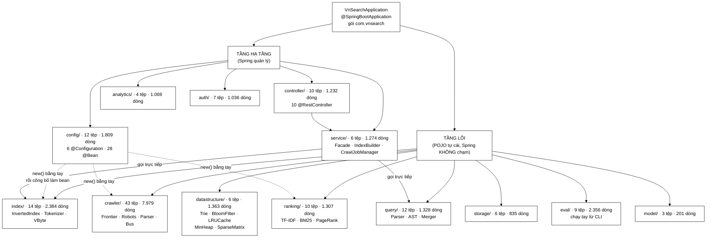
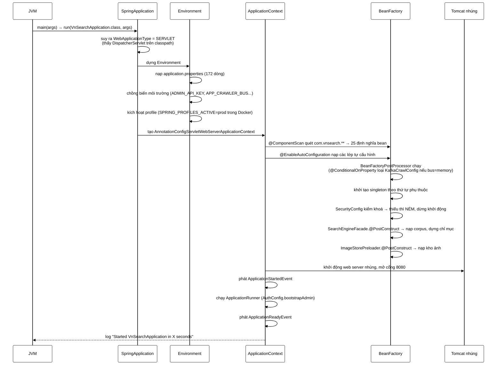

# VnSearchApplication — 22 dòng quyết định 143 lớp nào được sinh ra, theo thứ tự nào, và ứng dụng có khởi động nổi hay không

**File nguồn:** `search-engine/src/main/java/com/vnsearch/VnSearchApplication.java` (22 dòng)
**Gói:** `com.vnsearch` — **gói gốc**, và đó không phải chi tiết thẩm mỹ mà là một quyết định kiến trúc có hiệu lực thi hành
**Loại:** `public class` mang `@SpringBootApplication`, chứa đúng một `public static void main`
**Vị trí trong sơ đồ:** tầng **KHỞI ĐỘNG** — nằm trước mọi thứ khác. Không có lớp nào ở "phía trên" nó. Mọi bean, mọi controller, mọi bộ lọc trong hệ thống đều tồn tại vì dòng 19 của tệp này được thực thi.
**Đọc kèm:** [`config/SecurityConfig.md`](./config/SecurityConfig.md) · [`config/SearchConfig.md`](./config/SearchConfig.md) · [`config/KafkaCrawlConfig.md`](./config/KafkaCrawlConfig.md) · [`config/AuthConfig.md`](./config/AuthConfig.md) · [`service/SearchEngineFacade.md`](./service/SearchEngineFacade.md) · [`../../../../test/java/com/vnsearch/VnSearchApplicationTests.md`](../../../../test/java/com/vnsearch/VnSearchApplicationTests.md)

---

## 📌 Hiểu trong 30 giây

Đây là tệp **ngắn nhất** trong toàn bộ 143 tệp `.java` của backend, và là tệp
**quan trọng nhất** để hiểu hệ thống. Nghịch lý ấy có lời giải rất gọn: tệp này
gần như không chứa mã, nó chứa **một vị trí** và **một annotation**. Vị trí —
gói `com.vnsearch` — quyết định phạm vi quét. Annotation — `@SpringBootApplication`
— quyết định cơ chế quét. Toàn bộ phần còn lại của backend chỉ là hệ quả.

Toàn bộ thân tệp, không cắt bớt:

```java
package com.vnsearch;

import org.springframework.boot.SpringApplication;
import org.springframework.boot.autoconfigure.SpringBootApplication;

@SpringBootApplication
public class VnSearchApplication {

	public static void main(String[] args) {
		SpringApplication.run(VnSearchApplication.class, args);
	}

}
```

```
   VÌ SAO 22 DÒNG NÀY SINH RA MỘT ỨNG DỤNG 24.195 DÒNG

   ┌──────────────────────────────────────────────────────────────────┐
   │  package com.vnsearch;         ← GỐC CỦA CÂY QUÉT                 │
   │         │                                                        │
   │         │  @SpringBootApplication ngầm chứa @ComponentScan        │
   │         │  KHÔNG có tham số basePackages, nên Spring lấy MẶC ĐỊNH:│
   │         │  "gói chứa chính lớp được đánh dấu, và mọi gói con".    │
   │         ▼                                                        │
   │  com.vnsearch.**  ──────────────────────────────────────────┐    │
   │      analytics/ auth/ config/ controller/ crawler/           │    │
   │      datastructure/ eval/ index/ model/ query/ ranking/      │    │
   │      service/ storage/                                       │    │
   │                                                              │    │
   │  → 143 tệp .java được nạp lên classpath và SOI annotation    │    │
   │  → 25 lớp mang stereotype được biến thành bean:              │    │
   │        6 @Configuration · 10 @RestController                 │    │
   │        1 @RestControllerAdvice · 2 @Service · 6 @Component    │    │
   │  → 28 phương thức @Bean bên trong 5 lớp cấu hình chạy tiếp   │    │
   │  → phần còn lại (datastructure, index, query, ranking lõi,   │    │
   │    crawler lõi) là POJO THUẦN, KHÔNG bean, được new() bằng   │    │
   │    tay ở tầng cấu hình — đó là chủ ý, xem mục 4.4            │    │
   └──────────────────────────────────────────────────────────────────┘

   HỆ QUẢ TRỰC TIẾP, VÀ LÀ CÁI BẪY SỐ MỘT CỦA SPRING BOOT:

        Đặt một lớp @Service vào gói  com.vnsearch.service   → ĐƯỢC QUÉT
        Đặt đúng lớp ấy vào gói       com.example.service    → KHÔNG BAO GIỜ
                                                              được quét,
                                                              không có lỗi
                                                              biên dịch,
                                                              không có cảnh báo,
                                                              chỉ có một
                                                              NoSuchBeanDefinitionException
                                                              lúc chạy — hoặc tệ hơn,
                                                              một tính năng lặng lẽ
                                                              không hoạt động.
```

Javadoc gốc của lớp nói đúng một điều mà toàn bộ đồ án dựa vào, và đáng chép lại:

> Toàn bộ cấu trúc dữ liệu và thuật toán lõi (Trie, BloomFilter, LRUCache,
> MinHeap, InvertedIndex, PageRank, ...) được tự cài đặt trong các package con:
> `datastructure`, `crawler`, `index`, `ranking`, `query`. Spring Boot chỉ đóng
> vai trò **lớp hạ tầng** (REST controller, dependency injection), không thay
> thế cho bất kỳ thuật toán nào.

Câu ấy là **ranh giới bảo vệ** của cả đồ án. Nó nói: Spring ở đây là dây điện,
không phải động cơ. Mục 4.4 kiểm chứng lại lời tuyên bố ấy bằng số liệu thật.

---

## Sơ đồ tư duy — bản đồ toàn bộ ứng dụng nhìn từ điểm khởi động



<details><summary>Xem bản chữ (ASCII)</summary>

```
                     VnSearchApplication
                   @SpringBootApplication
                     gói  com.vnsearch
                              │
          ┌───────────────────┴────────────────────┐
          ▼                                        ▼
   TẦNG HẠ TẦNG (Spring quản lý)          TẦNG LÕI (POJO tự cài)
   ────────────────────────────           ──────────────────────
   config/       12 tệp  1.809 d          datastructure/  6 tệp  1.363 d
     6 @Configuration, 28 @Bean             Trie, BloomFilter, LRUCache,
   controller/   10 tệp  1.232 d            MinHeap, SparseMatrix
     10 @RestController                   crawler/       43 tệp  7.979 d
   service/       6 tệp  1.274 d            Frontier, Robots, Parser, Bus
     Facade, IndexBuilder,                index/         14 tệp  2.384 d
     CrawlJobManager, Suggestion            InvertedIndex, Tokenizer, VByte
   analytics/     4 tệp  1.069 d          query/         12 tệp  1.328 d
   auth/          7 tệp  1.036 d            QueryParser, AST, Merger
                                          ranking/       10 tệp  1.307 d
                                            TF-IDF, BM25, PageRank
                                          storage/        6 tệp    835 d
                                          eval/           9 tệp  2.356 d
                                          model/          3 tệp    201 d

   QUAN HỆ:
     config/  ──(new() bằng tay, rồi công bố làm bean)──▶ index, ranking, crawler
     service/ ──(gọi trực tiếp, không qua Spring)──────▶ query, index
     controller/ ──▶ service/

   TỔNG: 143 tệp .java, 24.195 dòng, 13 gói con.
   Trong đó CHỈ 25 lớp là bean stereotype. Phần còn lại Spring không biết tới.
```

</details>

---

## Sơ đồ trình tự — điều gì xảy ra giữa `run()` và dòng "Started VnSearchApplication"



<details><summary>Xem bản chữ (ASCII)</summary>

```
   main(args)
      │
      ▼
   SpringApplication.run(VnSearchApplication.class, args)
      │
      ├─① SUY RA KIỂU ỨNG DỤNG
      │     Thấy spring-webmvc + DispatcherServlet trên classpath
      │     → WebApplicationType.SERVLET (không phải REACTIVE, không phải NONE)
      │
      ├─② DỰNG ENVIRONMENT  (chưa có bean nào tồn tại)
      │     application.properties (172 dòng)
      │        ⊕ biến môi trường:  ADMIN_API_KEY, APP_CRAWLER_BUS,
      │                             APP_STORAGE_POSTGRES_ENABLED, ...
      │        ⊕ tham số dòng lệnh: --server.port=9090
      │        ⊕ system property:   -Dapp.security.rate-limit.enabled=false
      │     → kích hoạt profile: SPRING_PROFILES_ACTIVE=prod (docker-compose)
      │
      ├─③ TẠO APPLICATION CONTEXT
      │     AnnotationConfigServletWebServerApplicationContext
      │
      ├─④ ĐĂNG KÝ ĐỊNH NGHĨA BEAN  (mới là ĐỊNH NGHĨA, chưa new() gì)
      │     @ComponentScan  → quét com.vnsearch.**  → 25 lớp stereotype
      │     @EnableAutoConfiguration → hàng trăm lớp tự cấu hình ứng viên
      │
      ├─⑤ BEAN FACTORY POST PROCESSOR
      │     ConfigurationClassPostProcessor đọc 6 @Configuration,
      │     đăng ký 28 phương thức @Bean.
      │     @ConditionalOnProperty được ĐÁNH GIÁ Ở ĐÂY:
      │        app.crawler.bus=memory → KafkaCrawlConfig, CrawlKafkaListeners,
      │                                  ImageStoreListener bị LOẠI HOÀN TOÀN
      │        app.crawler.bus=kafka  → cả ba được giữ, 18 @Bean của Kafka chạy
      │
      ├─⑥ KHỞI TẠO SINGLETON  (đây là chỗ mã của ta thật sự chạy)
      │     SecurityConfig  : thiếu ADMIN_API_KEY → IllegalStateException,
      │                       DỪNG KHỞI ĐỘNG NGAY. Cố ý.
      │     SearchEngineFacade.@PostConstruct : nạp corpus theo chuỗi dự phòng,
      │                       dựng InvertedIndex, tính PageRank → CHẬM NHẤT
      │     ImageStorePreloader.@PostConstruct : nạp kho ảnh từ JSON
      │     MetricsConfig.@PostConstruct       : đăng ký MeterBinder
      │
      ├─⑦ KHỞI ĐỘNG WEB SERVER NHÚNG
      │     Tomcat bind cổng 8080 (server.port)
      │     ⚠ Cổng chỉ mở Ở BƯỚC NÀY — mọi việc nặng ở ⑥ xảy ra TRƯỚC,
      │       nên container "chưa healthy" trong suốt thời gian dựng chỉ mục.
      │
      ├─⑧ ApplicationStartedEvent
      │     → chạy ApplicationRunner / CommandLineRunner
      │       (repo có ĐÚNG MỘT: AuthConfig.bootstrapAdmin)
      │
      └─⑨ ApplicationReadyEvent
            → log: "Started VnSearchApplication in X.XXX seconds"
            Từ giây này, /api/search bắt đầu trả lời.
```

</details>

---

## Mục lục

- [1. `@SpringBootApplication` — ba annotation trong một](#1-springbootapplication--ba-annotation-trong-một)
- [2. Quét component: vì sao vị trí gói là một quyết định kiến trúc](#2-quét-component-vì-sao-vị-trí-gói-là-một-quyết-định-kiến-trúc)
- [3. Vòng đời `SpringApplication.run` — chín bước, và bước nào tốn thời gian](#3-vòng-đời-springapplicationrun--chín-bước-và-bước-nào-tốn-thời-gian)
- [4. Bản đồ 13 gói và luồng dữ liệu crawl → index → query → rank → serve](#4-bản-đồ-13-gói-và-luồng-dữ-liệu-crawl--index--query--rank--serve)
- [5. Cấu hình: `application.properties`, profile, và biến môi trường](#5-cấu-hình-applicationproperties-profile-và-biến-môi-trường)
- [6. Chạy thật — bốn cách, và cách nào dùng khi nào](#6-chạy-thật--bốn-cách-và-cách-nào-dùng-khi-nào)
- [7. Chẩn đoán lỗi khởi động](#7-chẩn-đoán-lỗi-khởi-động)
- [8. Hướng dẫn về code](#8-hướng-dẫn-về-code)
- [9. Độ phức tạp & chi phí](#9-độ-phức-tạp--chi-phí)
- [10. Kiểm thử liên quan](#10-kiểm-thử-liên-quan)
- [11. Liên kết](#11-liên-kết)

---

## 1. `@SpringBootApplication` — ba annotation trong một

Đây là annotation duy nhất trong tệp, và nó là một **annotation tổng hợp**:
bản thân nó được đánh dấu bằng ba annotation khác. Viết ra cho tường minh, dòng
15 tương đương chính xác với:

```java
@SpringBootConfiguration      // ① tôi là một lớp cấu hình, và là lớp GỐC
@EnableAutoConfiguration      // ② hãy đoán cấu hình từ những gì có trên classpath
@ComponentScan                // ③ hãy quét gói của tôi và mọi gói con
public class VnSearchApplication { ... }
```

```
   ┌──────────────────────────────────────────────────────────────────┐
   │ ① @SpringBootConfiguration                                        │
   │                                                                  │
   │   Là @Configuration + một dấu hiệu "ĐÂY LÀ LỚP CẤU HÌNH GỐC".    │
   │                                                                  │
   │   Dấu hiệu ấy KHÔNG trang trí. @SpringBootTest dùng đúng nó để   │
   │   tìm ứng dụng: nó đi NGƯỢC lên cây gói từ lớp test cho tới khi  │
   │   gặp một lớp mang @SpringBootConfiguration.                     │
   │                                                                  │
   │   Cụ thể ở repo này: VnSearchApplicationTests nằm ở              │
   │   src/test/java/com/vnsearch/ — cùng gói com.vnsearch — nên      │
   │   nó tìm thấy ngay ở bước đầu. 60+ bài test dùng @SpringBootTest │
   │   ở các gói con cũng tìm được, vì đường đi ngược luôn dẫn tới    │
   │   com.vnsearch.                                                  │
   │                                                                  │
   │   ⚠ Chỉ được có ĐÚNG MỘT lớp mang annotation này trên classpath. │
   │     Hai lớp → "Found multiple @SpringBootConfiguration".         │
   ├──────────────────────────────────────────────────────────────────┤
   │ ② @EnableAutoConfiguration                                        │
   │                                                                  │
   │   Đọc danh sách các lớp tự cấu hình mà mỗi starter đăng ký, rồi  │
   │   giữ lại những lớp có ĐIỀU KIỆN thoả. Mỗi starter trong         │
   │   pom.xml biến thành một nhóm bean:                              │
   │                                                                  │
   │     spring-boot-starter-web        → Tomcat nhúng, DispatcherServlet,
   │                                       Jackson, chuyển đổi JSON     │
   │     spring-boot-starter-security   → chuỗi bộ lọc bảo mật         │
   │     spring-boot-starter-validation → @Valid ở biên controller     │
   │     spring-boot-starter-actuator   → /actuator/health|metrics     │
   │     micrometer-registry-prometheus → /actuator/prometheus         │
   │     spring-kafka                   → hạ tầng producer/consumer    │
   │     postgresql (driver trần)       → KHÔNG có starter-jdbc, nên   │
   │                                       KHÔNG có DataSource tự sinh │
   │                                                                  │
   │   Chi tiết cuối cùng là một quyết định CỐ Ý, ghi trong pom.xml:  │
   │   không dùng starter-jdbc/JPA để ứng dụng KHỞI ĐỘNG ĐƯỢC KHI     │
   │   KHÔNG CÓ CSDL. Nếu dùng starter, tự cấu hình DataSource sẽ     │
   │   đòi một URL hợp lệ và làm sập khởi động trên máy chưa cài       │
   │   PostgreSQL — tức là phá hỏng cả test lẫn demo nhanh.           │
   │                                                                  │
   │   Và có một phép LOẠI TRỪ tường minh trong application.properties:│
   │     spring.autoconfigure.exclude=...UserDetailsServiceAutoConfiguration
   │   Lý do ghi ngay tại chỗ: không loại thì mỗi lần khởi động in ra │
   │   "Using generated security password: ..." — một dòng log GỢI Ý  │
   │   SAI rằng có tài khoản đăng nhập, trong khi hệ thống xác thực   │
   │   bằng header X-API-Key.                                         │
   ├──────────────────────────────────────────────────────────────────┤
   │ ③ @ComponentScan                                                  │
   │                                                                  │
   │   KHÔNG có tham số basePackages. Đó là điểm mấu chốt của mục 2.  │
   │   Không tham số ⇒ Spring lấy gói của lớp được đánh dấu làm gốc:  │
   │   "com.vnsearch", rồi quét đệ quy toàn bộ gói con.               │
   └──────────────────────────────────────────────────────────────────┘
```

### 1.1 Vì sao gộp ba thành một lại là thiết kế tốt

```
   BA ANNOTATION NÀY GẦN NHƯ LUÔN ĐI CÙNG NHAU, VÀ LUÔN Ở CÙNG MỘT LỚP.

   Nếu tách rời, mỗi dự án Spring Boot phải chép ba dòng giống hệt nhau,
   và sớm muộn sẽ có người:
        • quên @ComponentScan   → không controller nào được nạp,
                                  ứng dụng chạy và trả 404 cho mọi thứ;
        • đặt @ComponentScan lên một lớp Ở GÓI KHÁC → phạm vi quét lệch;
        • bỏ @EnableAutoConfiguration → không có Tomcat, tiến trình
                                  khởi động rồi THOÁT NGAY.

   Gộp thành một annotation biến ba lỗi ấy thành KHÔNG THỂ XẢY RA.
   Đây là ví dụ sách giáo khoa của nguyên tắc "làm cho trạng thái
   sai trở nên không biểu diễn được".

   ⚠ CÁI GIÁ: một annotation duy nhất che giấu rất nhiều hành vi.
     Người mới đọc 22 dòng này KHÔNG THỂ đoán ra rằng nó sẽ mở một
     cổng TCP, dựng một chỉ mục ngược, và có thể ném ngoại lệ vì
     thiếu một biến môi trường. Đó chính là lý do tài liệu này dài.
```

---

## 2. Quét component: vì sao vị trí gói là một quyết định kiến trúc

### 2.1 Quy tắc, phát biểu chính xác

```
   @ComponentScan KHÔNG THAM SỐ  ⟹  basePackage = gói khai báo của lớp mang nó

   Ở đây:   package com.vnsearch;        (dòng 1 của tệp)
   ⟹ quét:  com.vnsearch
             com.vnsearch.analytics
             com.vnsearch.auth
             com.vnsearch.config
             com.vnsearch.controller
             com.vnsearch.crawler        (và mọi gói con: bus, frontier, modular)
             com.vnsearch.datastructure
             com.vnsearch.eval
             com.vnsearch.index
             com.vnsearch.model
             com.vnsearch.query          (và query.ast)
             com.vnsearch.ranking
             com.vnsearch.service
             com.vnsearch.storage

   ⟹ KHÔNG quét: bất cứ gói nào không bắt đầu bằng "com.vnsearch."
```

### 2.2 Cái bẫy, và vì sao nó im lặng đến nguy hiểm

```
   ┌──────────────────────────────────────────────────────────────────┐
   │  TÌNH HUỐNG:  ai đó thêm  com.vnsearch.util.CacheWarmer          │
   │               có @Component.  → ĐƯỢC QUÉT. Mọi thứ bình thường.  │
   │                                                                  │
   │  TÌNH HUỐNG:  ai đó thêm  com.vnsearch2.util.CacheWarmer         │
   │               (gõ nhầm một ký tự) có @Component.                 │
   │                                                                  │
   │  ĐIỀU GÌ XẢY RA:                                                 │
   │     javac       → biên dịch SẠCH, không cảnh báo                 │
   │     khởi động   → KHÔNG có lỗi, KHÔNG có log nào nhắc tới lớp đó │
   │     lúc chạy    → nếu ai đó @Autowired nó: NoSuchBeanDefinitionException
   │                   nếu KHÔNG ai tiêm nó : tính năng đơn giản là   │
   │                                          KHÔNG BAO GIỜ CHẠY,     │
   │                                          và không ai biết.       │
   │                                                                  │
   │  Trường hợp thứ hai là loại lỗi tốn nhiều giờ nhất trong Spring: │
   │  không có ngoại lệ, không có stack trace, chỉ có một hành vi      │
   │  vắng mặt.                                                       │
   └──────────────────────────────────────────────────────────────────┘

   CÁCH TỰ BẢO VỆ — đặt lớp khởi động ở GÓC CAO NHẤT có thể.
   Repo này làm đúng: VnSearchApplication.java là tệp .java DUY NHẤT
   nằm trực tiếp trong com/vnsearch/. Không có lớp nghiệp vụ nào lẫn
   ở đó. Nhờ vậy gói gốc là một điểm neo sạch, và mọi gói mới thêm sau
   này tự động nằm trong phạm vi quét.
```

### 2.3 Bảng đối chiếu: lớp nào thành bean, lớp nào không

| Gói | Tệp `.java` | Dòng | Lớp thành bean | Ghi chú |
|---|---:|---:|---|---|
| `config` | 12 | 1.809 | 6 `@Configuration`, 3 `@Component`, 1 `@RestControllerAdvice` | Nơi 28 phương thức `@Bean` sống |
| `controller` | 10 | 1.232 | 10 `@RestController` | Toàn bộ biên HTTP |
| `service` | 6 | 1.274 | 1 `@Service`, 3 `@Component` | `SearchEngineFacade`, `IndexBuilder`, `CrawlJobManager`, `SuggestionService` |
| `analytics` | 4 | 1.069 | 1 `@Service` | `UsageAnalyticsService` |
| `auth` | 7 | 1.036 | **0** | Được `AuthConfig` `new()` rồi công bố qua `@Bean` |
| `ranking` | 10 | 1.307 | 1 `@Component` | Chỉ `ScorerFactory`; các scorer là POJO |
| `crawler` | 43 | 7.979 | **0** | POJO thuần — chạy được từ CLI, test bằng JUnit thuần |
| `index` | 14 | 2.384 | **0** | `InvertedIndex`, `VietnameseTokenizer`, `VByteCodec`... |
| `query` | 12 | 1.328 | **0** | `QueryParser`, AST, `PostingListMerger` |
| `datastructure` | 6 | 1.363 | **0** | Trie, BloomFilter, LRUCache, MinHeap, SparseMatrix |
| `storage` | 6 | 835 | **0** | Truy cập JDBC thuần |
| `eval` | 9 | 2.356 | **0** | Runner CLI, bị loại khỏi đo độ phủ |
| `model` | 3 | 201 | **0** | DTO |
| **Tổng** | **143** | **24.195** | **25 lớp** | 17,5 % số tệp; 82,5 % còn lại Spring không biết tới |

```
   CON SỐ ĐÁNG SUY NGHĨ:  25 / 143  =  17,5 %

   Chỉ 17,5 % số lớp là bean. Đây KHÔNG phải thiếu sót — nó là bằng
   chứng định lượng cho câu Javadoc "Spring Boot chỉ đóng vai trò lớp
   hạ tầng". Ba gói nặng nhất về thuật toán — crawler (7.979 dòng),
   index (2.384), query (1.328) — có ĐÚNG 0 bean.

   ⚠ NHƯNG con số ấy cũng nói một điều khác: quét component đang đi
     qua 118 lớp mà nó không bao giờ dùng tới. Chi phí thật, đo được,
     và có cách cắt — xem mục 9.2 và đề xuất 2.
```

---

## 3. Vòng đời `SpringApplication.run` — chín bước, và bước nào tốn thời gian

### 3.1 Bước ② — Environment được dựng TRƯỚC mọi bean

Đây là điều gây bất ngờ nhiều nhất cho người mới: **cấu hình có trước bean**.
Không thể đọc `application.properties` bằng một bean, vì lúc đọc chưa có bean nào.

```
   THỨ TỰ ƯU TIÊN CỦA NGUỒN CẤU HÌNH  (cao đè thấp)

   ┌────────────────────────────────────────────────────────────┐
   │ 1. Tham số dòng lệnh   --server.port=9090                   │  CAO NHẤT
   │ 2. System property     -Dapp.security.rate-limit.enabled=…  │
   │ 3. Biến môi trường     ADMIN_API_KEY, APP_CRAWLER_BUS       │
   │ 4. application-{profile}.properties                         │
   │ 5. application.properties  (172 dòng, trong classpath)      │  THẤP NHẤT
   └────────────────────────────────────────────────────────────┘

   VÀ CÚ PHÁP ${TÊN:mặc-định} TRONG CHÍNH TỆP PROPERTIES:

        app.crawler.bus=${APP_CRAWLER_BUS:memory}
                          └────┬────┘  └──┬──┘
                        biến môi trường  giá trị dùng khi biến không có

   Repo dùng cú pháp này 12 lần. Nó là điểm nối giữa tệp cấu hình
   (commit lên Git) và bí mật/khác biệt môi trường (KHÔNG commit).

   ⚠ MỘT CHI TIẾT DỄ SAI: Spring Boot tự ánh xạ APP_CRAWLER_BUS
     (SCREAMING_SNAKE) sang app.crawler.bus. Nhưng ở ĐÂY phép ánh xạ
     ấy được viết TAY và tường minh. Viết tay có lợi: đọc tệp
     properties là biết ngay biến môi trường nào chi phối khoá nào,
     không phải nhớ quy tắc chuyển đổi.
```

Điểm này cũng giải thích một quyết định trong `pom.xml` mà rất ít đồ án nghĩ tới:
cấu hình chỉ dành cho lúc chạy test được đặt trong `<systemPropertyVariables>`
của `maven-surefire-plugin`, **không** đặt ở `src/test/resources/application.properties`.
Lý do ghi ngay trong pom: tệp trong `src/test/resources` sẽ **che hẳn** tệp cùng
tên trong `src/main/resources` (Spring lấy tệp đầu tiên trên classpath, không
hợp nhất hai tệp), nên mọi khoá không được chép lại đều biến mất — và hậu quả
đã xảy ra thật là `CorsConfig` không tìm thấy `app.cors.allowed-origins`.

### 3.2 Bước ⑤ — `@ConditionalOnProperty` được đánh giá trước khi bean tồn tại

```java
@Configuration
@ConditionalOnProperty(name = "app.crawler.bus", havingValue = "kafka")
public class KafkaCrawlConfig {   // 18 phương thức @Bean bên trong
```

```
   ĐIỀU KIỆN ĐƯỢC ĐÁNH GIÁ Ở TẦNG ĐỊNH NGHĨA BEAN, KHÔNG PHẢI LÚC CHẠY.

   app.crawler.bus = memory   (MẶC ĐỊNH)
        ┌──────────────────────────────────────────────────────────┐
        │ KafkaCrawlConfig      → không đăng ký, 18 @Bean biến mất  │
        │ CrawlKafkaListeners   → không đăng ký                     │
        │ ImageStoreListener    → không đăng ký                     │
        │                                                          │
        │ ⇒ Không có ProducerFactory, không có KafkaAdmin,          │
        │   không có kết nối nào tới localhost:9092.                │
        │ ⇒ Ứng dụng khởi động BÌNH THƯỜNG khi KHÔNG CÓ BROKER.     │
        └──────────────────────────────────────────────────────────┘

   app.crawler.bus = kafka
        → cả ba lớp được đăng ký; nếu broker không sống, khởi động
          vẫn qua nhưng log đầy cảnh báo kết nối.

   VÌ SAO MẶC ĐỊNH LÀ `memory` — application.properties nói thẳng:
        "Mot he thong khong khoi dong duoc khi thieu broker la mot he
         thong khong demo duoc, khong test duoc, va khong ai chay thu
         duoc. Kafka phai la thu BAT THEM khi can quy mo, khong phai
         dieu kien de chay duoc dong dau tien."

   Đây là nguyên tắc "mặc định phải chạy được trên máy trống", và nó
   được áp dụng NHẤT QUÁN ở ba chỗ: bus (memory), Postgres (enabled=false),
   và driver JDBC trần thay vì starter.
```

### 3.3 Bước ⑥ — nơi thời gian khởi động thật sự bị tiêu

```
   BA @PostConstruct CHẠY Ở BƯỚC NÀY, VÀ CHÚNG KHÔNG NGANG NHAU VỀ CHI PHÍ

   ┌──────────────────────────────────────────────────────────────────┐
   │ SearchEngineFacade.init()                          ██████ 90–98 % │
   │    ① searchCache = new LRUCache<>(cacheSize)   — tức thời         │
   │    ② loadCorpus() theo CHUỖI DỰ PHÒNG:                            │
   │         a. có data/index.json  → IndexPersistence.load  ← NHANH   │
   │         b. không có           → đọc corpus, IndexBuilder.build     │
   │                                  (tokenize + dựng chỉ mục ngược)   │
   │    ③ refreshDerivedState()  → PageRank, thống kê corpus            │
   │                                                                   │
   │    ⚠ Nhánh (a) vs (b) chênh nhau MỘT BẬC ĐỘ LỚN. Đây là biến      │
   │      quyết định thời gian khởi động, không phải Spring.           │
   ├──────────────────────────────────────────────────────────────────┤
   │ ImageStorePreloader.preload()                      ██      2–8 %  │
   │    Đọc JSON ảnh; không có tệp → log INFO và trả về, KHÔNG lỗi.    │
   ├──────────────────────────────────────────────────────────────────┤
   │ MetricsConfig.vnsearchMetrics(...)                 ▏      < 0,1 % │
   │    Chỉ đăng ký MeterBinder, chưa đo gì.                           │
   └──────────────────────────────────────────────────────────────────┘

   VÀ MỘT NHÁNH KHÔNG TỐN THỜI GIAN NHƯNG QUYẾT ĐỊNH SỐNG CHẾT:

        SecurityConfig kiểm app.security.admin-api-key
             rỗng      → IllegalStateException, DỪNG
             < 16 ký tự → IllegalStateException, DỪNG

        Đây là "fail fast" đúng nghĩa: thà không khởi động còn hơn
        khởi động với /api/admin/** không được bảo vệ. Đối chiếu với
        BOOTSTRAP_ADMIN_PASSWORD — thiếu thì CHỈ CẢNH BÁO, vì thiếu
        tài khoản chỉ nghĩa là chưa ai đăng nhập được, còn máy tìm
        kiếm vẫn phục vụ bình thường. Hai mức độ nghiêm trọng khác
        nhau, hai xử lý khác nhau. Chi tiết này rất đáng khen.
```

### 3.4 Bước ⑦ — cổng mở SAU khi việc nặng đã xong

```
   ┌──────────────────────────────────────────────────────────────────┐
   │  THỨ TỰ NÀY LÀ THIẾT KẾ CỦA SPRING, KHÔNG PHẢI CỦA TA,           │
   │  NHƯNG NÓ CÓ HỆ QUẢ VẬN HÀNH TRỰC TIẾP:                          │
   │                                                                  │
   │  t=0s      tiến trình bắt đầu                                    │
   │  t=0,4s    context dựng xong định nghĩa bean                     │
   │  t=0,5s ─┐                                                       │
   │          │ SearchEngineFacade dựng chỉ mục                       │
   │  t=3,5s ─┘ (cổng 8080 VẪN ĐÓNG suốt đoạn này)                    │
   │  t=3,6s    Tomcat bind 8080 — request đầu tiên được nhận         │
   │  t=3,7s    ApplicationReadyEvent                                 │
   │                                                                  │
   │  ⇒ Health check của Docker phải cho phép start_period đủ dài.    │
   │    Đặt quá ngắn thì orchestrator giết container ngay giữa lúc    │
   │    nó đang dựng chỉ mục, rồi khởi động lại — và vòng lặp ấy      │
   │    KHÔNG BAO GIỜ THOÁT, vì mỗi lần khởi động lại đều mất đúng    │
   │    ngần ấy thời gian.                                            │
   │                                                                  │
   │  ⇒ MẶT TỐT: cổng chỉ mở khi chỉ mục ĐÃ SẴN SÀNG. Không có cửa    │
   │    sổ nào mà /api/search trả kết quả rỗng vì chỉ mục chưa dựng.  │
   └──────────────────────────────────────────────────────────────────┘
```

### 3.5 Bước ⑧ — repo có đúng một `ApplicationRunner`

```java
// AuthConfig.java
@Bean
public ApplicationRunner bootstrapAdmin(...) { ... }
```

```
   ĐÂY LÀ VÍ DỤ DUY NHẤT TRONG REPO VỀ "CHẠY MỘT VIỆC SAU KHI CONTEXT
   SẴN SÀNG", VÀ NÓ ĐƯỢC DÙNG ĐÚNG CHỖ:

        tạo tài khoản quản trị đầu tiên nếu chưa tồn tại.

   VÌ SAO KHÔNG ĐẶT VIỆC NÀY TRONG @PostConstruct CỦA UserService:
        @PostConstruct chạy khi bean ĐÓ được khởi tạo — có thể lúc
        các bean khác chưa xong. ApplicationRunner chạy khi TOÀN BỘ
        context đã sẵn sàng. Với một việc ghi tệp và cần đầy đủ phụ
        thuộc, đó là điểm đúng.

   VÌ SAO KHÔNG TẠO MẶC ĐỊNH admin/admin — application.properties
   liệt kê thẳng ba phương án và lý do loại hai:
        • mật khẩu mặc định trong mã  → mọi bản triển khai cùng một
                                        mật khẩu ai cũng biết → LOẠI
        • người đăng ký ĐẦU TIÊN thành admin → kẻ nào tìm thấy máy chủ
                                        trước chủ nhân thì chiếm quyền → LOẠI
        • biến môi trường, không mặc định → phải cấu hình thêm một
                                        bước → CHỌN
```

---

## 4. Bản đồ 13 gói và luồng dữ liệu crawl → index → query → rank → serve

### 4.1 Đường dữ liệu, từ một URL tới một trang kết quả

```
   ┌─ GIAI ĐOẠN 1: THU THẬP (crawler/ — 43 tệp, 7.979 dòng) ──────────┐
   │                                                                  │
   │   seed URL                                                       │
   │      │                                                           │
   │      ▼                                                           │
   │   UrlFrontier ──► chọn URL theo ưu tiên + politeness theo host    │
   │      │              (front queues + back queues, MinHeap hoãn)    │
   │      ▼                                                           │
   │   RobotsTxtParser ──► được phép? ──no──► bỏ                       │
   │      │ yes                                                       │
   │      ▼                                                           │
   │   tải HTTP ──► ContentParser (jsoup) ──► WebDocument              │
   │      │                                                           │
   │      ├──► LinkExtractor ──► UrlCanonicalizer ──► UrlFilter        │
   │      │       ──► UrlSeenFilter (BloomFilter) ──► quay lại Frontier│
   │      │                                                           │
   │      ├──► ContentSeenFilter ──► loại trang trùng nội dung         │
   │      │                                                           │
   │      └──► CrawlEventBus ──► ba Modular Service                    │
   │              (memory: gọi trực tiếp | kafka: 4 topic riêng)       │
   └──────────────────────────────────────────────────────────────────┘
                              │
                              ▼  data/crawled-documents.json
   ┌─ GIAI ĐOẠN 2: LẬP CHỈ MỤC (index/ + service/IndexBuilder) ────────┐
   │                                                                  │
   │   WebDocument[]                                                  │
   │      │                                                           │
   │      ▼  sắp theo docId rồi CẤP LẠI docId liên tục 0..n-1          │
   │   VietnameseTokenizer ──► tách từ ghép tiếng Việt                 │
   │      │   (MaxWeightSegmenter + từ điển + stopwords)               │
   │      ▼                                                           │
   │   InvertedIndex: term ──► posting list                            │
   │      │   nén VByte (VByteCodec), nén văn bản (CompressedText)     │
   │      ▼                                                           │
   │   IndexPersistence.save ──► data/index.json                       │
   └──────────────────────────────────────────────────────────────────┘
                              │
                              ▼
   ┌─ GIAI ĐOẠN 3: TRUY VẤN (query/ — 12 tệp) ────────────────────────┐
   │   chuỗi truy vấn ──► QueryParser ──► AST (AND/OR/NOT/PHRASE)      │
   │      ──► CandidateResolver ──► PostingListMerger ──► docId[]      │
   └──────────────────────────────────────────────────────────────────┘
                              │
                              ▼
   ┌─ GIAI ĐOẠN 4: XẾP HẠNG (ranking/ — 10 tệp) ──────────────────────┐
   │   ScorerFactory đọc app.ranking.scorer  (tfidf | bm25)            │
   │      ──► scorer cơ sở                                             │
   │      ──► bọc Decorator theo app.ranking.beta / gamma              │
   │            beta  = 0,30  → TitleBoostScorer                       │
   │            gamma = 0,10  → PageRankBoostScorer                    │
   │            đặt 0 ⇒ lớp bọc KHÔNG được tạo, không tốn chi phí      │
   │      ──► ResultRanker + MinHeap top-k                             │
   └──────────────────────────────────────────────────────────────────┘
                              │
                              ▼
   ┌─ GIAI ĐOẠN 5: PHỤC VỤ (controller/ + config/) ───────────────────┐
   │   SearchController  → GET /api/search                             │
   │   SuggestController → gợi ý (Trie / SyllableTrie)                 │
   │   ImageSearchController, FeedController, EventController,          │
   │   HealthController, AuthController, 3 controller Admin            │
   │      qua chuỗi bộ lọc: RateLimitFilter → ApiKeyAuthFilter         │
   │                        → SecurityFilterChain → CORS               │
   │      lỗi được GlobalExceptionHandler chuẩn hoá thành JSON         │
   └──────────────────────────────────────────────────────────────────┘
```

### 4.2 Hai vai trò tiến trình từ cùng một `main`

```
   app.crawler.role = api      (mặc định)
   app.crawler.role = worker

   CÙNG MỘT ẢNH DOCKER, CÙNG MỘT LỚP VnSearchApplication,
   HAI HÀNH VI KHÁC NHAU.  docker-compose.yml dựng cả hai:

        backend         (role=api)     → phục vụ /api/**, giữ ImageStore
        crawler-worker  (role=worker)  → chỉ tiêu thụ Kafka

   VÌ SAO PHẢI TÁCH: ImageStore nằm TRONG BỘ NHỚ TIẾN TRÌNH. Nếu cả
   hai tiến trình cùng nạp nó, có hai bản sao không đồng bộ, và
   GET /api/images trả kết quả khác nhau tuỳ tiến trình nào nhận
   request. Cấu hình chọn ĐÚNG MỘT nơi nạp — và nơi đó phải là tiến
   trình phục vụ API.

   ⚠ ĐIỂM ĐÁNG BÀN: hai vai trò được phân biệt bằng PROPERTY chứ
     không bằng PROFILE. Xem mục 5.3 và đề xuất 1.
```

### 4.3 Chín container mà `run-backend.bat` dựng lên

```
   docker-compose.yml định nghĩa:

     postgres        kho tài liệu (tuỳ chọn, mặc định ứng dụng không cần)
     backend         VnSearchApplication, role=api, SPRING_PROFILES_ACTIVE=prod
     crawler-worker  VnSearchApplication, role=worker, SPRING_PROFILES_ACTIVE=prod
     kafka           broker cho bus sự kiện
     kafka-ui        giao diện xem topic
     kafka-exporter  xuất chỉ số Kafka cho Prometheus
     prometheus      thu chỉ số từ /actuator/prometheus
     grafana         bảng điều khiển
     alertmanager    cảnh báo
     football-service dịch vụ phụ cho tab Thể thao của giao diện

   ⇒ HAI trong chín container là chính lớp này, chạy hai vai trò.
```

### 4.4 Kiểm chứng lời tuyên bố của Javadoc

```
   Javadoc nói: "Spring Boot chỉ đóng vai trò lớp hạ tầng, không thay
   thế cho bất kỳ thuật toán nào."  ĐÂY LÀ BẰNG CHỨNG:

   ┌──────────────────────────────────────────────────────────────────┐
   │ THUẬT TOÁN / CẤU TRÚC       │ TỰ CÀI?  │ CÓ SẴN TRONG SPRING?     │
   │ ────────────────────────────┼──────────┼───────────────────────── │
   │ Trie, SyllableTrie          │   CÓ     │ không                    │
   │ BloomFilter                 │   CÓ     │ không                    │
   │ LRUCache                    │   CÓ     │ có (@Cacheable) — KHÔNG DÙNG
   │ MinHeap                     │   CÓ     │ có (PriorityQueue) — KHÔNG DÙNG
   │ SparseMatrix                │   CÓ     │ không                    │
   │ InvertedIndex               │   CÓ     │ không                    │
   │ VByteCodec                  │   CÓ     │ không                    │
   │ VietnameseTokenizer         │   CÓ     │ không                    │
   │ PageRank                    │   CÓ     │ không                    │
   │ TF-IDF / BM25               │   CÓ     │ không                    │
   │ URL Frontier + politeness   │   CÓ     │ không                    │
   │ robots.txt parser           │   CÓ     │ không                    │
   └──────────────────────────────────────────────────────────────────┘

   Hai dòng "KHÔNG DÙNG" là hai chỗ mà việc tự cài phải được BIỆN MINH,
   vì có sẵn thay thế. Với một đồ án DSA thì lý do hiển nhiên: chính
   cấu trúc ấy là nội dung cần chứng minh. Với một sản phẩm thương mại
   thì lập luận đó KHÔNG đứng vững — và tài liệu nên nói thẳng điều đó
   thay vì để người chấm tự phát hiện.
```

---

## 5. Cấu hình: `application.properties`, profile, và biến môi trường

### 5.1 Không có `application.yml` — repo dùng `.properties`

```
   ⚠ ĐÍNH CHÍNH MỘT GIẢ ĐỊNH PHỔ BIẾN:

     Repo này KHÔNG có application.yml, KHÔNG có application-dev.yml,
     KHÔNG có application-prod.yml.

     Toàn bộ cấu hình nằm trong ĐÚNG MỘT tệp:
         search-engine/src/main/resources/application.properties   (172 dòng)

     Và cấu hình riêng cho test nằm trong pom.xml, ở
         maven-surefire-plugin → <systemPropertyVariables>
     chứ không nằm ở src/test/resources — lý do đã giải thích ở mục 3.1.

   ĐÁNH GIÁ: với 172 dòng và cấu trúc phẳng, .properties là lựa chọn
   HỢP LÝ. YAML thắng khi có lồng sâu và danh sách; ở đây không có.
   Đổi lại, .properties không nhóm được theo profile trong CÙNG một
   tệp (YAML làm được bằng `---`), nên nếu sau này cần ba profile thì
   sẽ phải tách thành ba tệp.
```

### 5.2 Các khoá quan trọng, nhóm theo mục đích

| Khoá | Giá trị mặc định | Ý nghĩa với việc khởi động |
|---|---|---|
| `spring.application.name` | `search-engine` | Nhãn trong log và chỉ số |
| `server.port` | `8080` | Cổng Tomcat nhúng bind ở bước ⑦ |
| `spring.autoconfigure.exclude` | `UserDetailsServiceAutoConfiguration` | Tắt log "generated security password" gây hiểu nhầm |
| `app.security.admin-api-key` | `${ADMIN_API_KEY:}` | **Rỗng ⇒ KHÔNG khởi động được.** Cố ý |
| `app.auth.bootstrap-admin.password` | `${BOOTSTRAP_ADMIN_PASSWORD:}` | Rỗng ⇒ chỉ cảnh báo, vẫn khởi động |
| `app.security.rate-limit.enabled` | `true` | Test tắt qua system property trong pom |
| `app.security.trust-proxy` | `false` | Bật khi không có proxy = vô hiệu hoá giới hạn tần suất |
| `app.cors.allowed-origins` | `http://localhost:5173` | Dev server Vite của Electron |
| `management.endpoints.web.exposure.include` | `health,metrics,prometheus` | **Không dùng `*`**: nhóm mặc định lộ `/actuator/env` (chứa `ADMIN_API_KEY`) và `/actuator/heapdump` |
| `app.ranking.scorer` | `tfidf` | `ScorerFactory` đọc lúc dựng bean |
| `app.ranking.beta` / `gamma` | `0.30` / `0.10` | Đặt `0` ⇒ lớp Decorator tương ứng không được tạo |
| `app.index.data-path` | `data/index.json` | Có tệp ⇒ khởi động nhanh; không có ⇒ dựng lại chỉ mục |
| `app.crawler.data-path` | `data/crawled-documents.json` | Nguồn dự phòng khi không có chỉ mục dựng sẵn |
| `app.search.cache-size` | `200` | Kích thước `LRUCache` dựng trong `@PostConstruct` |
| `app.storage.postgres.enabled` | `false` | **Mặc định tắt để chạy được khi không có CSDL** |
| `app.crawler.bus` | `memory` | `kafka` ⇒ kích hoạt 18 `@Bean` của `KafkaCrawlConfig` |
| `app.crawler.role` | `api` | `worker` ⇒ chỉ tiêu thụ Kafka |
| `app.crawler.images.download` | `false` | Mặc định chỉ ghi siêu dữ liệu ảnh |

```
   BA MẶC ĐỊNH LÀM NÊN TÍNH "CHẠY ĐƯỢC TRÊN MÁY TRỐNG":

        app.storage.postgres.enabled = false
        app.crawler.bus              = memory
        app.crawler.images.download  = false

   Cả ba đều nghiêng về phía "ít phụ thuộc ngoài nhất có thể".
   Cộng với việc pom.xml cố ý KHÔNG dùng starter-jdbc, kết quả là:

        git clone → đặt ADMIN_API_KEY → mvn spring-boot:run → CHẠY

   không cần Docker, không cần PostgreSQL, không cần Kafka.
   Đây là một trong những điểm mạnh nhất của repo, và nó không tự
   nhiên mà có — nó là bốn quyết định riêng biệt cùng hướng.
```

### 5.3 Profile — chỉ có `prod`, và chỉ ảnh hưởng tới log

```
   TÌM KIẾM TOÀN REPO CHO PROFILE, KẾT QUẢ THẬT:

        @Profile trong mã Java                 →  0 chỗ
        tệp application-{profile}.properties   →  0 tệp
        <springProfile> trong logback-spring   →  2 khối: "!prod" và "prod"
        SPRING_PROFILES_ACTIVE                 →  2 chỗ trong docker-compose.yml
                                                  (backend, crawler-worker)

   ⇒ PROFILE DUY NHẤT TỒN TẠI LÀ `prod`, VÀ NÓ ĐỔI ĐÚNG MỘT THỨ:

        !prod  → log dạng văn xuôi, đọc bằng mắt, có màu
        prod   → log dạng JSON (logstash-logback-encoder)

   LÝ DO ghi trong pom.xml: "Log dang van xuoi khong truy van duoc:
   mot su co luc 3 gio sang can loc theo truong, khong phai doc bang mat."

   ⇒ Mọi khác biệt môi trường KHÁC (bus, vai trò, CSDL) được điều
     khiển bằng PROPERTY chứ không bằng PROFILE. Đó là một lựa chọn
     có thể bảo vệ được — property mịn hơn profile và tổ hợp tự do —
     nhưng nó khiến "chạy ở chế độ nào" bị rải ra 6 biến môi trường
     thay vì gói trong một cái tên. Xem đề xuất 1.
```

---

## 6. Chạy thật — bốn cách, và cách nào dùng khi nào

### 6.1 Cách 1 — Maven, chạy trực tiếp trên máy (vòng lặp phát triển)

```bash
cd search-engine

# Bắt buộc: thiếu khoá thì SecurityConfig chặn khởi động.
# PowerShell:
#   $env:ADMIN_API_KEY = -join ((1..64) | % { '{0:x}' -f (Get-Random -Max 16) })
export ADMIN_API_KEY=$(openssl rand -hex 32)

./mvnw spring-boot:run
```

```
   BIẾN THỂ HAY DÙNG:

   # Đổi cổng mà không sửa tệp nào
   ./mvnw spring-boot:run -Dspring-boot.run.arguments=--server.port=9090

   # Bật profile prod để xem log JSON
   ./mvnw spring-boot:run -Dspring-boot.run.profiles=prod

   # Chạy từ jar đã đóng gói (gần với môi trường thật nhất)
   ./mvnw -DskipTests package
   java -jar target/search-engine-0.0.1-SNAPSHOT.jar --server.port=9090
```

### 6.2 Cách 2 — `run-backend.bat` (toàn hệ thống bằng Docker)

```
   Tệp nằm ở THƯ MỤC GỐC repo, cạnh docker-compose.yml.

     run-backend.bat                 FULL — 9 container, ~4 GB RAM  (mặc định)
     run-backend.bat --kafka         backend + postgres + cụm Kafka  ~3 GB
     run-backend.bat --core          backend + postgres              ~1,5 GB
     run-backend.bat --no-football   bỏ football-service
     run-backend.bat --no-build      dùng ảnh đã có, không build lại
     run-backend.bat --logs          bám theo log backend sau khi lên
     run-backend.bat --help          in hướng dẫn

     end-backend.bat                 tắt và giải phóng RAM

   ⚠ Tệp này KHÔNG chạy Maven trên máy thật nữa. Mọi thứ chạy trong
     container, nên "bản chạy giống hệt bản sẽ chấm điểm" — không còn
     cảnh "trên máy em nó chạy được".

   ⚠ Chú thích trong chính tệp .bat cảnh báo một điều rất thật:
     KHÔNG viết tiếng Việt có dấu trong tệp .bat, vì cmd.exe phân
     tích tệp theo byte offset và ký tự đa byte làm lệch con trỏ đọc,
     cắt vụn các dòng lệnh phía sau — kể cả khi đã `chcp 65001`.
     Đây là NGOẠI LỆ duy nhất với quy ước "tiếng Việt có dấu" của repo.
```

### 6.3 Cách 3 — `run-crawl.bat` (chế độ crawl, KHÔNG qua lớp này)

```
   run-crawl.bat KHÔNG khởi động VnSearchApplication.

   Nó làm:
        cd /d "%~dp0search-engine"
        mvnw -q compile exec:java
             -Dexec.mainClass=com.vnsearch.crawler.MultiDomainCrawlRunner
             -Dexec.args="..."
             -Dcrawl.progress=...

   ⇒ MỘT main() KHÁC HOÀN TOÀN. Không có Spring context, không có
     Tomcat, không có cổng nào mở.

   ⇒ ĐIỀU NÀY CHỈ KHẢ THI VÌ gói crawler/ là POJO thuần, 0 bean.
     Nếu CrawlerService là một @Service phụ thuộc vào context, runner
     CLI sẽ phải dựng cả ứng dụng chỉ để crawl — chậm hơn, nặng hơn,
     và kéo theo cả yêu cầu ADMIN_API_KEY.

   ⇒ Đây là phần thưởng cụ thể, đo được, cho quyết định "không đánh
     @Component lên lớp lõi" ở mục 4.4. Mục 8.4 bàn tiếp việc tách
     chế độ crawl khỏi chế độ web một cách tường minh hơn.

   crawl-stats.bat / crawl-stats.ps1 : xem thống kê phiên crawl.
   run-frontend.bat                  : khởi động giao diện Electron.
```

### 6.4 Cách 4 — trong test

```java
@SpringBootTest
class VnSearchApplicationTests {
    @Test
    void contextLoads() { }
}
```

`@SpringBootTest` không cần chỉ ra lớp nào: nó đi ngược cây gói từ
`com.vnsearch` (gói của lớp test) và gặp ngay `@SpringBootConfiguration` trên
`VnSearchApplication`. Xem mục 10.

---

## 7. Chẩn đoán lỗi khởi động

| Triệu chứng trong log | Nguyên nhân thật | Cách sửa |
|---|---|---|
| `IllegalStateException: Thieu app.security.admin-api-key` | Chưa đặt `ADMIN_API_KEY` | `export ADMIN_API_KEY=$(openssl rand -hex 32)`; trong test surefire đã đặt sẵn |
| `app.security.admin-api-key qua ngan` | Khoá dưới 16 ký tự | Sinh khoá đủ dài, đừng dùng `"test"` |
| `Web server failed to start. Port 8080 was already in use` | Một tiến trình cũ chưa tắt | `end-backend.bat`, hoặc `--server.port=9090` |
| `NoSuchBeanDefinitionException` cho một lớp mới viết | Lớp nằm **ngoài** `com.vnsearch.**`, hoặc thiếu stereotype | Chuyển vào gói con của `com.vnsearch`; thêm `@Component`/`@Service` |
| Tính năng mới **không chạy**, không lỗi nào | Cùng nguyên nhân trên nhưng không ai tiêm bean | Kiểm tra bằng `/actuator/health` + đếm bean, hoặc thêm một log ở constructor |
| `Found multiple @SpringBootConfiguration` khi chạy test | Có lớp thứ hai mang `@SpringBootApplication` (thường trong `src/test`) | Giữ đúng một lớp; test dùng `@SpringBootTest(classes=...)` nếu cần cô lập |
| Log đầy `Connection to node -1 could not be established` | `app.crawler.bus=kafka` mà broker chưa sống | Đặt lại `memory`, hoặc `run-backend.bat --kafka` |
| Khởi động rất chậm (chục giây) lần đầu | Không có `data/index.json` ⇒ dựng lại chỉ mục từ corpus | Bình thường; lần sau đã có chỉ mục dựng sẵn |
| Container bị giết rồi khởi động lại vô hạn | Health check `start_period` ngắn hơn thời gian dựng chỉ mục | Nới `start_period` trong `docker-compose.yml` |
| `Using generated security password: ...` xuất hiện trở lại | Ai đó xoá dòng `spring.autoconfigure.exclude` | Khôi phục dòng đó trong `application.properties` |
| `Tests run: 0 ... BUILD SUCCESS` khi chạy `-Pkafka-it` | Mẫu tên mặc định của surefire không nhận hậu tố `IT` | Đã sửa bằng `<includes>**/*IT.java</includes>` — đừng xoá |
| Ứng dụng khởi động nhưng `/api/images` luôn rỗng | Chạy ở `role=worker`, hoặc chưa có tệp ảnh | Xem `ImageStorePreloader`, `ImageStoreListener` |

```
   BA CÔNG CỤ CHẨN ĐOÁN NÊN BIẾT

   ① In toàn bộ điều kiện tự cấu hình đã thoả / không thoả:
        ./mvnw spring-boot:run -Dspring-boot.run.arguments=--debug
      → "CONDITIONS EVALUATION REPORT": trả lời chính xác câu hỏi
        "vì sao bean X không tồn tại".

   ② Xem cấu hình HIỆU LỰC (sau khi chồng mọi nguồn):
      /actuator/env — NHƯNG endpoint này KHÔNG được phơi ra ở đây,
      cố ý, vì nó lộ ADMIN_API_KEY và mật khẩu CSDL. Muốn dùng thì
      bật TẠM ở máy cá nhân, và nhớ bỏ lại.

   ③ Đo thời gian khởi động từng bean:
        --spring.main.banner-mode=off
      cùng với log mức DEBUG của org.springframework.boot.
```

---

## 8. Hướng dẫn về code

### 8.1 Thêm một profile mới (ví dụ `dev` với cấu hình riêng)

Repo hiện chỉ có `prod` và chỉ dùng nó cho log. Muốn thêm một profile thật:

```properties
# search-engine/src/main/resources/application-dev.properties
# Nạp CHỒNG lên application.properties khi profile `dev` được kích hoạt.
# Chỉ ghi những khoá KHÁC mặc định — mọi khoá không nhắc tới vẫn giữ nguyên.

server.port=9090
app.search.cache-size=20
app.storage.postgres.enabled=false
app.crawler.bus=memory

# Khoá quản trị dùng riêng cho máy cá nhân. KHÔNG bao giờ đặt giá trị
# thật vào tệp được commit — ở đây chấp nhận được vì `dev` không bao
# giờ chạy ngoài máy lập trình viên; nếu không chắc, để trống và dùng
# biến môi trường như application.properties đang làm.
app.security.admin-api-key=dev-only-key-0123456789abcdef
```

```bash
# Kích hoạt: ba cách, ưu tiên từ cao xuống thấp
./mvnw spring-boot:run -Dspring-boot.run.profiles=dev
java -jar target/search-engine-0.0.1-SNAPSHOT.jar --spring.profiles.active=dev
export SPRING_PROFILES_ACTIVE=dev
```

Nếu cần một bean chỉ tồn tại ở `dev`:

```java
// Đặt trong com.vnsearch.config — bắt buộc nằm dưới com.vnsearch để được quét.
@Configuration
@Profile("dev")
public class DevOnlyConfig {

    /**
     * Nạp một corpus mẫu nhỏ để khởi động nhanh khi phát triển.
     *
     * <p>KHÔNG dùng @Profile("!prod"): phủ định khiến bean xuất hiện ở
     * MỌI môi trường chưa đặt tên, kể cả một môi trường staging mới
     * mà không ai nhớ đánh dấu. Liệt kê tường minh an toàn hơn.
     */
    @Bean
    public ApplicationRunner napCorpusMau(SearchEngineFacade facade) {
        return args -> LoggerFactory.getLogger(DevOnlyConfig.class)
                .warn("Profile dev: dùng corpus mẫu, KHÔNG phản ánh dữ liệu thật");
    }
}
```

```
   ⚠ ĐỪNG chuyển app.crawler.role sang @Profile chỉ vì nó "giống profile".
     Profile là NHỊ PHÂN theo tên; property là giá trị. `role` có đúng
     hai giá trị hôm nay nhưng có thể có ba ngày mai (ví dụ `indexer`),
     và lúc đó tổ hợp profile sẽ nổ tung. Xem đề xuất 1 cho cách làm đúng.
```

### 8.2 Đổi cổng — bốn cách, xếp theo thứ tự ưu tiên

```bash
# ① Tham số dòng lệnh — CAO NHẤT, không sửa tệp nào. Dùng cho chạy tạm.
java -jar target/search-engine-0.0.1-SNAPSHOT.jar --server.port=9090

# ② System property
java -Dserver.port=9090 -jar target/search-engine-0.0.1-SNAPSHOT.jar

# ③ Biến môi trường — cách dùng trong Docker
export SERVER_PORT=9090
```

```properties
# ④ Sửa application.properties — THẤP NHẤT. Chỉ làm khi đây là
#    mặc định MỚI của dự án, không phải để chạy thử một lần.
server.port=9090
```

```java
// ⑤ Cổng NGẪU NHIÊN trong test tích hợp — tránh xung đột khi chạy song song.
@SpringBootTest(webEnvironment = SpringBootTest.WebEnvironment.RANDOM_PORT)
class MotBaiTestTichHop {
    @LocalServerPort int cong;   // Spring tiêm cổng thật đã bind
}
```

```
   ⚠ NẾU ĐỔI CỔNG, PHẢI ĐỔI ĐỒNG BỘ BA CHỖ KHÁC:
        • docker-compose.yml       — ánh xạ cổng và health check
        • app.cors.allowed-origins — nếu giao diện gọi qua cổng mới
        • prometheus scrape config — đích /actuator/prometheus
     Quên một trong ba thì hệ thống "chạy" nhưng một mảnh im lặng hỏng.
```

### 8.3 Thêm một `CommandLineRunner`

Repo đã có đúng một `ApplicationRunner` (`AuthConfig.bootstrapAdmin`). Thêm cái
thứ hai:

```java
// com/vnsearch/config/WarmupConfig.java
package com.vnsearch.config;

import com.vnsearch.service.SearchEngineFacade;
import org.slf4j.Logger;
import org.slf4j.LoggerFactory;
import org.springframework.boot.CommandLineRunner;
import org.springframework.context.annotation.Bean;
import org.springframework.context.annotation.Configuration;
import org.springframework.core.annotation.Order;

/**
 * Làm ấm bộ nhớ đệm truy vấn ngay sau khi context sẵn sàng.
 *
 * <p>VÌ SAO LÀ CommandLineRunner CHỨ KHÔNG PHẢI @PostConstruct: việc
 * này cần SearchEngineFacade đã nạp xong corpus. @PostConstruct của
 * một bean khác KHÔNG bảo đảm điều đó — thứ tự khởi tạo singleton chỉ
 * bảo đảm theo quan hệ phụ thuộc trực tiếp. Runner chạy sau khi TOÀN
 * BỘ context đã sẵn sàng, nên tiền đề luôn đúng.
 *
 * <p>VÌ SAO @Order: repo đã có bootstrapAdmin. Không đánh số thì thứ
 * tự giữa hai runner là KHÔNG XÁC ĐỊNH — và một thứ tự không xác định
 * sẽ đúng trên máy này, sai trên máy khác, đúng loại lỗi tốn nhiều
 * giờ nhất để truy.
 */
@Configuration
public class WarmupConfig {

    private static final Logger log = LoggerFactory.getLogger(WarmupConfig.class);

    /** Vài truy vấn phổ biến, đủ để JIT biên dịch đường nóng. */
    private static final String[] TRUY_VAN_LAM_AM = {
            "tin tức", "bóng đá", "công nghệ", "thời tiết"
    };

    @Bean
    @Order(100) // chạy SAU bootstrapAdmin (mặc định Ordered.LOWEST_PRECEDENCE)
    public CommandLineRunner lamAmBoNhoDem(SearchEngineFacade facade) {
        return args -> {
            long batDau = System.currentTimeMillis();
            for (String q : TRUY_VAN_LAM_AM) {
                try {
                    facade.search(q, 10);
                } catch (RuntimeException e) {
                    // KHÔNG để việc làm ấm làm sập ứng dụng: ngoại lệ ném ra
                    // từ một runner sẽ LAN LÊN và dừng cả tiến trình.
                    // Làm ấm là tối ưu, không phải điều kiện đúng đắn.
                    log.warn("Bỏ qua lỗi khi làm ấm truy vấn \"{}\"", q, e);
                }
            }
            log.info("Đã làm ấm {} truy vấn trong {} ms",
                    TRUY_VAN_LAM_AM.length, System.currentTimeMillis() - batDau);
        };
    }
}
```

```
   ┌──────────────────────────────────────────────────────────────────┐
   │ CommandLineRunner vs ApplicationRunner — KHÁC BIỆT DUY NHẤT       │
   │                                                                  │
   │   CommandLineRunner.run(String... args)                          │
   │        → nhận tham số THÔ, đúng như trên dòng lệnh.               │
   │                                                                  │
   │   ApplicationRunner.run(ApplicationArguments args)                │
   │        → nhận tham số ĐÃ PHÂN TÍCH: args.containsOption("x"),     │
   │          args.getOptionValues("x"), args.getNonOptionArgs().      │
   │                                                                  │
   │   Cần đọc cờ → ApplicationRunner. Không cần → cái nào cũng được.  │
   │   AuthConfig.bootstrapAdmin dùng ApplicationRunner, dù không đọc  │
   │   cờ nào — vô hại, và là mặc định hợp lý.                         │
   ├──────────────────────────────────────────────────────────────────┤
   │ ⚠ CẢ HAI ĐỀU CHẶN: cổng 8080 ĐÃ MỞ ở bước ⑦, nhưng                │
   │   ApplicationReadyEvent chỉ phát SAU khi mọi runner xong.         │
   │   Một runner chạy 30 giây ⇒ health check báo chưa sẵn sàng        │
   │   suốt 30 giây đó. Việc dài phải chạy trên luồng riêng.           │
   └──────────────────────────────────────────────────────────────────┘
```

### 8.4 Tách chế độ crawl khỏi chế độ web

Hiện tại việc tách được làm bằng **một `main()` khác** (`MultiDomainCrawlRunner`,
gọi qua `run-crawl.bat`). Cách đó hoạt động tốt và có ưu điểm lớn là không cần
Spring. Nếu muốn một chế độ crawl **có** dependency injection nhưng **không** mở
cổng web:

```java
// com/vnsearch/config/CrawlModeConfig.java
package com.vnsearch.config;

import org.springframework.boot.CommandLineRunner;
import org.springframework.boot.autoconfigure.condition.ConditionalOnProperty;
import org.springframework.context.ConfigurableApplicationContext;
import org.springframework.context.annotation.Bean;
import org.springframework.context.annotation.Configuration;

/**
 * Chế độ CHỈ CRAWL: dựng context đầy đủ, chạy một phiên crawl, rồi thoát.
 *
 * <p>Bật bằng:  --app.mode=crawl
 *
 * <p>Dùng @ConditionalOnProperty chứ không phải một if trong main(): điều
 * kiện được đánh giá ở TẦNG ĐỊNH NGHĨA BEAN (bước ⑤), nên khi tắt thì bean
 * này KHÔNG TỒN TẠI — không phải "tồn tại nhưng không làm gì". Đó là cùng
 * cơ chế mà KafkaCrawlConfig đang dùng, nên nó nhất quán với repo.
 */
@Configuration
@ConditionalOnProperty(name = "app.mode", havingValue = "crawl")
public class CrawlModeConfig {

    @Bean
    public CommandLineRunner chayPhienCrawl(ConfigurableApplicationContext ctx) {
        return args -> {
            // ... gọi CrawlerService ở đây ...

            // Thoát với mã trạng thái ĐÚNG. SpringApplication.exit chạy
            // hook tắt (đóng Kafka, xả buffer log) rồi trả mã; System.exit
            // trần sẽ bỏ qua toàn bộ phần đó và có thể mất log cuối cùng.
            System.exit(org.springframework.boot.SpringApplication.exit(ctx, () -> 0));
        };
    }
}
```

Và muốn chế độ ấy **không mở cổng 8080** — cách gọn nhất là đổi kiểu ứng dụng
ngay trong `main`, chỗ duy nhất của cả repo mà 22 dòng nguồn phải sửa:

```java
public static void main(String[] args) {
    // Đọc cờ TRƯỚC khi dựng SpringApplication: WebApplicationType phải
    // được quyết định trước bước ① của vòng đời, không sửa được sau.
    boolean cheDoCrawl = java.util.Arrays.asList(args).contains("--app.mode=crawl");

    SpringApplication app = new SpringApplication(VnSearchApplication.class);
    if (cheDoCrawl) {
        // NONE = không Tomcat, không cổng, context vẫn đầy đủ DI.
        app.setWebApplicationType(org.springframework.boot.WebApplicationType.NONE);
    }
    app.run(args);
}
```

```
   ⚠ ĐÁNH ĐỔI PHẢI NÓI RÕ: sửa như trên biến 22 dòng "không thể sai"
     thành ~12 dòng có LOGIC — tức là có thể sai, và cần test.

     TRƯỚC KHI LÀM, HÃY HỎI: MultiDomainCrawlRunner đã giải quyết
     đúng bài toán này, không cần Spring, khởi động tức thời, và
     không kéo theo yêu cầu ADMIN_API_KEY. Chỉ nên chuyển sang cách
     trên nếu crawler THẬT SỰ cần tiêm các bean của tầng hạ tầng
     (chỉ số Micrometer, DocumentRepository dùng chung...).

     Nói cách khác: đây là hướng dẫn cho một nhu cầu CHƯA TỒN TẠI.
     Ghi lại để khi nhu cầu xuất hiện thì có sẵn cách đúng, không
     phải để làm ngay.
```

### 8.5 Cạm bẫy khi sửa lớp này

| Ý định | Hậu quả |
|---|---|
| Đổi `package com.vnsearch` thành gói khác | Toàn bộ 143 lớp rơi ra ngoài phạm vi quét; ứng dụng khởi động và trả 404 cho mọi endpoint |
| Thêm `@ComponentScan("com.vnsearch.controller")` cho "rõ ràng hơn" | **Thay thế** phạm vi mặc định chứ không cộng thêm — mất toàn bộ `service`, `config` |
| Đặt một lớp nghiệp vụ vào thẳng `com/vnsearch/` | Gói gốc mất tính "điểm neo sạch"; lần refactor sau dễ kéo theo lỗi phạm vi quét |
| Tạo lớp thứ hai mang `@SpringBootApplication` (kể cả trong `src/test`) | `Found multiple @SpringBootConfiguration` — mọi bài `@SpringBootTest` đỏ cùng lúc |
| Thêm `spring-boot-starter-data-jpa` "cho tiện" | Tự cấu hình `DataSource` bật lên, đòi CSDL hợp lệ; ứng dụng hết khởi động được trên máy trống — phá đúng tính chất mà pom cố ý giữ |
| Bỏ dòng `spring.autoconfigure.exclude` | Log "generated security password" quay lại, gợi ý sai về cơ chế xác thực |
| Đổi `management.endpoints.web.exposure.include` thành `*` | Phơi `/actuator/env` (lộ `ADMIN_API_KEY`, mật khẩu CSDL) và `/actuator/heapdump` |
| Đặt giá trị thật cho `app.security.admin-api-key` trong tệp properties | Khoá bị commit lên Git vĩnh viễn |
| Chuyển việc nặng vào một `CommandLineRunner` không đồng bộ | Cổng mở trước khi chỉ mục sẵn sàng — `/api/search` trả rỗng một cách khó hiểu |
| Ném ngoại lệ trong một runner mà không bắt | Cả tiến trình dừng vì một việc phụ trợ |
| Dùng `System.exit()` trần thay `SpringApplication.exit(ctx, ...)` | Bỏ qua hook tắt: mất log cuối, không đóng sạch producer Kafka |
| Đặt `@Profile("!prod")` thay vì liệt kê tường minh | Bean xuất hiện ở mọi môi trường chưa đặt tên, kể cả staging mới |

---

## 9. Độ phức tạp & chi phí

### 9.1 Thời gian khởi động

| Giai đoạn | Chi phí điển hình | Phụ thuộc vào |
|---|---:|---|
| Nạp JVM + classpath | 0,2–0,4 s | Kích thước classpath, đĩa |
| Dựng `Environment`, đọc 172 dòng properties | < 20 ms | Không đáng kể |
| `@ComponentScan` quét 143 lớp | 0,1–0,3 s | **Số lớp trên đường quét**, không phải số bean |
| Tự cấu hình (web, security, actuator, kafka…) | 0,3–0,8 s | Số starter trong `pom.xml` |
| Khởi tạo 25 bean stereotype + 28 `@Bean` | < 0,1 s | Trừ ba `@PostConstruct` dưới đây |
| `SearchEngineFacade.init()` — có `index.json` | 0,3–1 s | Kích thước chỉ mục |
| `SearchEngineFacade.init()` — **không** có `index.json` | **5–30 s** | Số tài liệu × chi phí tách từ |
| `ImageStorePreloader.preload()` | 0,05–0,5 s | Số ảnh trong JSON |
| Tomcat bind cổng 8080 | 0,2–0,4 s | — |
| `bootstrapAdmin` runner | < 50 ms | Ghi tệp JSON |

```
   HAI KỊCH BẢN, VÀ KHOẢNG CÁCH GIỮA CHÚNG

   ┌──────────────────────────────────────────────────────────────────┐
   │  CÓ data/index.json  (lần khởi động thứ hai trở đi)               │
   │     JVM ▓▓  quét ▓▓  autoconfig ▓▓▓▓  facade ▓▓▓▓  tomcat ▓▓      │
   │     ≈ 2–3 giây                                                   │
   ├──────────────────────────────────────────────────────────────────┤
   │  KHÔNG có index.json  (repo mới clone, hoặc sau khi crawl)        │
   │     JVM ▓▓  quét ▓▓  autoconfig ▓▓▓▓                              │
   │     facade ████████████████████████████████████████  ← dựng chỉ mục│
   │     tomcat ▓▓                                                    │
   │     ≈ 10–35 giây, TRONG ĐÓ >85 % là dựng chỉ mục                 │
   └──────────────────────────────────────────────────────────────────┘

   ⇒ KẾT LUẬN VẬN HÀNH: thời gian khởi động của hệ thống này KHÔNG
     phải là "chi phí Spring". Nó là chi phí DỰNG CHỈ MỤC, và Spring
     chỉ đóng góp 1–2 giây cố định.

   ⇒ Muốn khởi động nhanh: đảm bảo data/index.json tồn tại và hợp lệ.
     Không phải tối ưu Spring.
```

### 9.2 Chi phí của việc quét toàn bộ `com.vnsearch.**`

```
   QUÉT PHẢI ĐỌC SIÊU DỮ LIỆU CỦA MỌI LỚP TRÊN ĐƯỜNG ĐI,
   KHÔNG CHỈ NHỮNG LỚP RỐT CUỘC TRỞ THÀNH BEAN.

        lớp bị soi annotation :  143
        lớp trở thành bean    :   25
        lớp soi rồi bỏ        :  118   (82,5 %)

   Chi phí: khoảng 0,5–2 ms mỗi lớp ⇒ ~0,1–0,3 giây lãng phí một phần.

   THU HẸP PHẠM VI SẼ TIẾT KIỆM ĐƯỢC PHẦN LỚN CON SỐ ĐÓ:

        @SpringBootApplication(scanBasePackages = {
            "com.vnsearch.config",
            "com.vnsearch.controller",
            "com.vnsearch.service",
            "com.vnsearch.analytics",
            "com.vnsearch.ranking"        // vì ScorerFactory
        })

   ⚠ NHƯNG ĐỪNG LÀM. Lợi ~0,2 giây trên một lần khởi động mất 2–30
     giây (tức 1–10 %), đổi lấy một cái bẫy vĩnh viễn: lớp @Component
     đầu tiên đặt vào một gói không có trong danh sách sẽ IM LẶNG
     không được nạp — đúng cái bẫy ở mục 2.2, nhưng lần này do CHÍNH
     TA tự đặt ra.

     Đây là ví dụ điển hình của "tối ưu đúng về số học, sai về kỹ
     thuật". Mặc định rộng là đúng.
```

### 9.3 Bộ nhớ

| Thành phần | Bậc độ lớn | Ghi chú |
|---|---:|---|
| JVM cơ bản + metaspace | ~80–120 MB | Hàng nghìn lớp Spring được nạp |
| Tomcat nhúng + luồng | ~30–60 MB | Kích thước pool luồng mặc định |
| Bean của ứng dụng | < 5 MB | 25 bean, phần lớn không trạng thái |
| `InvertedIndex` | **chi phối** | Tỷ lệ thuận với corpus |
| `LRUCache` truy vấn | nhỏ | `app.search.cache-size=200` |
| `ImageStore` | nhỏ–vừa | Siêu dữ liệu ảnh, không nội dung (mặc định) |
| Hạ tầng Kafka (khi `bus=kafka`) | ~30–80 MB | Buffer producer/consumer |

```
   docker-compose.yml đặt các mức RAM cho từng chế độ:
        FULL  9 container  ≈ 4,0 GB
        --kafka            ≈ 3,0 GB
        --core             ≈ 1,5 GB

   ⇒ Bản thân backend chiếm phần nhỏ. Phần lớn RAM thuộc về Kafka,
     Prometheus, Grafana — hạ tầng quan sát, không phải máy tìm kiếm.

   ⇒ eval/MemoryBreakdown là công cụ đo phân bổ bộ nhớ của chính chỉ
     mục; nó chạy tay từ CLI và bị loại khỏi đo độ phủ trong pom.xml.
```

---

## 10. Kiểm thử liên quan

| Bộ test | Kiểm gì |
|---|---|
| [`VnSearchApplicationTests`](../../../../test/java/com/vnsearch/VnSearchApplicationTests.md) | Một bài duy nhất: `contextLoads()` — toàn bộ context dựng được |
| [`config/CorsPreflightTest`](../../../../test/java/com/vnsearch/config/CorsPreflightTest.md) | Chuỗi bộ lọc CORS hoạt động trong context thật |
| [`auth/AccountAuthorizationTest`](../../../../test/java/com/vnsearch/auth/AccountAuthorizationTest.md) | Phân quyền qua chuỗi bộ lọc |
| [`analytics/AnalyticsAuthorizationTest`](../../../../test/java/com/vnsearch/analytics/AnalyticsAuthorizationTest.md) | Bảo vệ endpoint quản trị |
| [`crawler/CrawlerServiceBusWiringTest`](../../../../test/java/com/vnsearch/crawler/CrawlerServiceBusWiringTest.md) | Nối bus theo `app.crawler.bus` |

### 10.1 Vì sao một bài test rỗng lại có giá trị

```java
@SpringBootTest
class VnSearchApplicationTests {
    @Test
    void contextLoads() { }
}
```

```
   ┌──────────────────────────────────────────────────────────────────┐
   │  THÂN HÀM RỖNG. KHÔNG MỘT assert NÀO.                            │
   │  VÀ NÓ VẪN LÀ MỘT TRONG NHỮNG BÀI TEST GIÁ TRỊ NHẤT REPO.        │
   │                                                                  │
   │  Vì phép khẳng định KHÔNG nằm trong thân hàm — nó nằm trong       │
   │  @SpringBootTest. Annotation đó dựng TOÀN BỘ ApplicationContext.  │
   │  Nếu bất cứ điều gì trong chín bước của vòng đời thất bại, bài    │
   │  test ĐỎ trước khi thân hàm được gọi.                            │
   │                                                                  │
   │  NHỮNG LỖI NÓ BẮT ĐƯỢC — TẤT CẢ ĐỀU LÀ LỖI THẬT, HAY XẢY RA:     │
   │    • phụ thuộc vòng giữa hai bean                                │
   │    • một @Bean thiếu tham số không tiêm được                     │
   │    • hai bean cùng kiểu, không đánh @Primary → mơ hồ             │
   │    • một @Value trỏ tới khoá không tồn tại và không có mặc định  │
   │    • một @PostConstruct ném ngoại lệ                             │
   │    • SecurityConfig chặn vì thiếu khoá                           │
   │    • xung đột đường dẫn giữa hai @RequestMapping                 │
   │                                                                  │
   │  ⇒ Chi phí viết: 6 dòng. Phạm vi bảo vệ: toàn bộ sơ đồ nối dây.  │
   └──────────────────────────────────────────────────────────────────┘

   ⚠ VÀ NÓ CHỈ CHẠY ĐƯỢC NHỜ MỘT DÒNG TRONG pom.xml:

        <ADMIN_API_KEY>test-only-key-0123456789abcdef</ADMIN_API_KEY>

     Thiếu dòng đó, SecurityConfig ném ở bước ⑥ và MỌI bài
     @SpringBootTest trong repo đỏ cùng lúc. Chú thích trong pom nói
     rõ: khoá GIẢ, đủ 16 ký tự để qua phép kiểm tra độ dài, KHÔNG BAO
     GIỜ dùng ở môi trường thật.
```

### 10.2 Hai bài test nên có thêm

```java
// 1. Bài contextLoads() hiện tại chạy với cấu hình MẶC ĐỊNH (bus=memory).
//    Nhánh bus=kafka đăng ký 18 @Bean và ba lớp @Component — TOÀN BỘ
//    nhánh ấy chưa từng được chứng minh là DỰNG ĐƯỢC ngoài các bài
//    @Tag("kafka-it") vốn bị loại khỏi lần chạy thường ngày.
//    Bài này không cần broker: nó chỉ kiểm context dựng xong.
@SpringBootTest(properties = {
        "app.crawler.bus=kafka",
        "app.crawler.kafka.bootstrap-servers=localhost:19092" // cổng chắc chắn không có ai
})
class ContextDungDuocOCheDoKafkaTest {
    @Test
    void contextLoads() {
        // Không assert gì: chính việc dựng được context LÀ phép khẳng định.
        // Broker không sống nên sẽ có log cảnh báo kết nối — đó là kỳ vọng,
        // KHÔNG phải lỗi: KafkaAdmin không chặn khởi động.
    }
}

// 2. Bất biến ở mục 2 — mọi lớp mang stereotype phải nằm dưới com.vnsearch —
//    hiện KHÔNG có gì bảo vệ. Một lớp đặt nhầm gói sẽ im lặng không được nạp.
//    Bài test này biến cái bẫy im lặng thành một bản build đỏ.
@SpringBootTest
class MoiBeanPhaiNamDuoiGoiGocTest {

    @Autowired
    private org.springframework.context.ApplicationContext ctx;

    @Test
    void moiBeanCuaUngDungDeuThuocGoiComVnsearch() {
        for (String ten : ctx.getBeanDefinitionNames()) {
            Class<?> loai = ctx.getType(ten);
            if (loai == null) {
                continue;
            }
            String goi = loai.getPackageName();
            // Bỏ qua bean của chính Spring và các thư viện.
            if (!goi.startsWith("com.vnsearch")) {
                continue;
            }
            org.junit.jupiter.api.Assertions.assertTrue(
                    goi.equals("com.vnsearch") || goi.startsWith("com.vnsearch."),
                    "bean " + ten + " nằm ở " + goi
                            + " — ngoài phạm vi quét, sẽ im lặng biến mất");
        }
    }
}
```

---

## 11. Liên kết

- Nơi khởi động bị chặn nếu thiếu khoá quản trị: [`config/SecurityConfig.md`](./config/SecurityConfig.md)
- Bean dùng chung của tầng tìm kiếm (`Tokenizer`, `PageRankService`, `ImageStore`): [`config/SearchConfig.md`](./config/SearchConfig.md)
- 18 `@Bean` chỉ tồn tại khi `app.crawler.bus=kafka`: [`config/KafkaCrawlConfig.md`](./config/KafkaCrawlConfig.md)
- `ApplicationRunner` duy nhất của repo (tạo tài khoản quản trị đầu): [`config/AuthConfig.md`](./config/AuthConfig.md)
- CORS cho renderer Electron: [`config/CorsConfig.md`](./config/CorsConfig.md) · Giới hạn tần suất: [`config/RateLimitFilter.md`](./config/RateLimitFilter.md)
- Chỉ số Micrometer đăng ký lúc khởi động: [`config/MetricsConfig.md`](./config/MetricsConfig.md)
- `@PostConstruct` tốn nhiều thời gian khởi động nhất: [`service/SearchEngineFacade.md`](./service/SearchEngineFacade.md) · [`service/IndexBuilder.md`](./service/IndexBuilder.md)
- Nạp kho ảnh lúc khởi động: [`config/ImageStorePreloader.md`](./config/ImageStorePreloader.md) · [`config/ImageStoreListener.md`](./config/ImageStoreListener.md)
- `main()` thứ hai — chế độ crawl không cần Spring: [`crawler/MultiDomainCrawlRunner.md`](./crawler/MultiDomainCrawlRunner.md)
- Chọn scorer từ `app.ranking.scorer` / `beta` / `gamma`: [`ranking/ScorerFactory.md`](./ranking/ScorerFactory.md)
- Bài test dựng toàn bộ context: [`VnSearchApplicationTests.md`](../../../../test/java/com/vnsearch/VnSearchApplicationTests.md)
- Cấu hình gốc: `search-engine/src/main/resources/application.properties` (172 dòng)
- Phiên bản, cổng chặn build, hồ sơ `kafka-it`: `search-engine/pom.xml` (Spring Boot 3.5.16, Java 17)
- Chín container và biến môi trường thật: `docker-compose.yml`
- Kịch bản chạy: `run-backend.bat` · `end-backend.bat` · `run-crawl.bat` · `crawl-stats.bat` · `run-frontend.bat`
- Tổng quan kiến trúc: `docs/ARCHITECTURE.md`
