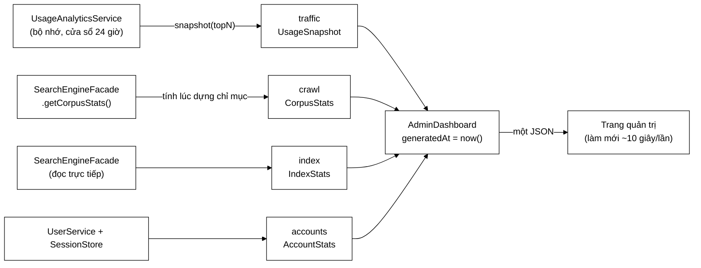

# AdminDashboard — một phản hồi, một khoảnh khắc

**File nguồn:** `search-engine/src/main/java/com/vnsearch/analytics/AdminDashboard.java`
**Gói:** `com.vnsearch.analytics` · **Loại:** `record` (DTO chỉ đọc, không có logic nghiệp vụ)
**Người dùng chính:** `controller/AdminAnalyticsController.java` → `GET /api/admin/dashboard`
**Đọc kèm:** [`UsageSnapshot.md`](./UsageSnapshot.md) · [`CorpusStats.md`](./CorpusStats.md) · [`UsageAnalyticsService.md`](./UsageAnalyticsService.md)

---

## 📌 Hiểu trong 30 giây

`AdminDashboard` là **cái khay** bưng toàn bộ nội dung của trang quản trị ra trong
**một** lời gọi HTTP. Nó không tính gì cả — mọi con số đều do ba nguồn khác nhau
sinh ra; việc duy nhất của nó là **đóng gói chúng lại cùng một mốc thời gian**.



```
   VÌ SAO MỘT LỜI GỌI CHỨ KHÔNG PHẢI BỐN

   ── Phương án A: bốn endpoint ────────────────────────────────────
   t=0.00s  GET /traffic   → 3.000 lượt tìm
   t=0.12s  GET /crawl     → 31.030 trang
   t=0.25s  GET /index     → 31.104 trang   ← LỆCH! chỉ mục vừa dựng lại
   t=0.31s  GET /accounts  → 12 tài khoản
            người xem thấy 4 con số của 4 thời điểm, tự tính tỉ lệ → sai

   ── Phương án B: một endpoint (đang dùng) ────────────────────────
   t=0.00s  GET /api/admin/dashboard
            └─ generatedAt = 2026-08-14T09:15:03Z
               traffic / crawl / index / accounts  ← CÙNG một khoảnh khắc
```

---

## 1. Vấn đề lớp này giải quyết

Trang quản trị hiển thị khoảng 40 con số cạnh nhau. Người đọc **luôn** so sánh
chúng: "31.030 trang mà chỉ 12.000 đích liên kết phân biệt à?", "3.000 lượt tìm,
900 lượt bấm, vậy CTR 30%". Những phép tính nhẩm đó chỉ đúng khi các con số
**thuộc về cùng một thời điểm**.

Bốn endpoint riêng phá vỡ điều đó theo ba cách:

| Vấn đề | Hệ quả cụ thể |
|---|---|
| Bốn thời điểm khác nhau | Người xem tính ra tỉ lệ chưa từng tồn tại |
| Bốn lần kiểm tra khoá | Bốn lần chạy `TokenAuthFilter` + `ApiKeyAuthFilter` mỗi chu kỳ |
| Bốn round-trip mạng | Với chu kỳ 10 giây và 3 quản trị viên: 72 request/phút thay vì 18 |

Giải pháp là một *aggregate root* cho tầng đọc: một kiểu duy nhất mô tả toàn bộ
màn hình, kèm `generatedAt` để giao diện hiện "cập nhật lúc 09:15:03" thay vì để
người xem đoán dữ liệu cũ tới đâu.

> **Đây là mẫu CQRS ở dạng nhẹ nhất.** Mô hình *ghi* (các service) và mô hình
> *đọc* (record này) tách nhau. Record không phải là entity, không map với bảng
> nào, và được phép có hình dạng đúng bằng hình dạng màn hình.

---

## 2. Bản đồ kiểu

```
AdminDashboard
├── generatedAt   : Instant                 ← mốc thời gian chung
├── traffic       : UsageSnapshot           ← người dùng LÀM gì
├── crawl         : CorpusStats             ← máy tìm kiếm BIẾT gì
├── index         : AdminDashboard.IndexStats   ← chỉ mục ĐANG thế nào
└── accounts      : AdminDashboard.AccountStats ← tài khoản & phiên đăng nhập
```

Ba khối lớn được tách theo **nguồn dữ liệu**, không phải theo vị trí trên màn
hình. Đây là lựa chọn có chủ ý: vị trí trên màn hình sẽ đổi khi thiết kế đổi,
còn nguồn dữ liệu thì không.

### 2.1 `IndexStats` — dòng 55–62

```java
public record IndexStats(
        int documents,
        int terms,
        long sizeBytes,
        double cacheHitRate,
        String scorer,
        long bloomFilterBits) {
}
```

| Trường | Ý nghĩa | Đọc thế nào cho đúng |
|---|---|---|
| `documents` | Số tài liệu trong `InvertedIndex` | Phải khớp `crawl.documents()`; lệch = chỉ mục đang dựng dở |
| `terms` | Số từ khoá phân biệt trong `TermDictionary` | Tăng theo luật Heaps: $V \approx K \cdot N^{\beta}$, $\beta \approx 0{,}5$ |
| `sizeBytes` | Ước lượng bộ nhớ chỉ mục | So với heap tối đa để biết còn bao nhiêu dư địa |
| `cacheHitRate` | Tỉ lệ trúng `LRUCache`, miền $[0,1]$ | Thấp bất thường ⇒ truy vấn quá tản mát, hoặc cache quá nhỏ |
| `scorer` | Tên bộ chấm điểm đang bật (`BM25`, `TFIDF`…) | Giúp đọc số liệu độ trễ đúng ngữ cảnh |
| `bloomFilterBits` | Số bit Bloom Filter của lần crawl gần nhất | `0` khi tiến trình này chưa chạy crawl lần nào |

`bloomFilterBits = 0` **không** phải lỗi. Bloom Filter thuộc về `CrawlerService`
và chỉ tồn tại trong tiến trình đã chạy crawl; một máy chủ chỉ phục vụ tìm kiếm
sẽ luôn báo `0`.

### 2.2 `AccountStats` — dòng 42–43

```java
public record AccountStats(int total, int admins, int disabled, int activeSessions) {
}
```

Javadoc ở dòng 32–41 giải thích một điểm rất dễ đọc nhầm, và nó đáng được nhắc
lại vì đây là loại lỗi không bao giờ lộ ra dưới dạng exception:

```
   activeSessions  ≠  traffic.signedInVisitors()

   ┌ activeSessions (AccountStats) ─────────┐  ┌ signedInVisitors (UsageSnapshot) ┐
   │ PHIÊN ĐĂNG NHẬP còn hiệu lực           │  │ PHIÊN THEO DÕI SỐ LIỆU có gắn   │
   │ nguồn: SessionStore                    │  │ tài khoản                        │
   │ hết hạn theo TTL đăng nhập             │  │ nguồn: UsageAnalyticsService     │
   │ mất khi máy chủ khởi động lại          │  │ sống 24 giờ, mất khi khởi động   │
   └────────────────────────────────────────┘  └──────────────────────────────────┘
        "còn bao nhiêu người đang đăng nhập"       "bao nhiêu phiên duyệt web
                                                    gắn được với một tài khoản"
```

Hai số này **được phép lệch nhau**, và cả hai đều được hiển thị. Ẩn bớt một cái
sẽ khiến người đọc mặc định cái còn lại trả lời câu hỏi kia — sai lệch tệ hơn.

---

## 3. Hướng dẫn về code

### 3.1 Vì sao là `record`, không phải class hay `Map<String,Object>`

```java
// ❌ Cách tưởng là linh hoạt
Map<String, Object> dashboard = new HashMap<>();
dashboard.put("documents", index.documents());   // gõ nhầm "document" → không lỗi biên dịch
// Lỗi chỉ lộ ra ở trình duyệt, dưới dạng "undefined"

// ✅ Cách đang dùng
new AdminDashboard.IndexStats(docs, terms, bytes, hit, scorer, bits);
// Thiếu/thừa/sai thứ tự tham số → gãy ngay lúc biên dịch
```

Record biến **lược đồ JSON thành kiểu Java**. Jackson tuần tự hoá record theo
đúng tên thành phần, nên hợp đồng API được trình biên dịch canh giữ.

### 3.2 Cách thêm một con số mới vào bảng điều khiển

Đây là thao tác hay gặp nhất trên file này. Trình tự bắt buộc:

1. **Xác định nguồn.** Nếu là hành vi người dùng → thêm vào `UsageSnapshot`.
   Nếu là đặc tính corpus → thêm vào `CorpusStats`. Chỉ khi là "sức khoẻ chỉ mục"
   hoặc "tài khoản" mới sửa file này.
2. **Thêm thành phần vào record con** (`IndexStats` / `AccountStats`).
3. **Sửa nơi khởi tạo** trong `AdminAnalyticsController` — biên dịch sẽ chỉ đúng
   chỗ, không cần đi tìm.
4. **Cập nhật giao diện** `frontend/` đọc trường mới.
5. **Cập nhật test** `analytics/AnalyticsAuthorizationTest.java` nếu trường mới
   nhạy cảm về quyền.

> ⚠️ **Không thêm trường tính toán vào record này.** Ví dụ đừng thêm
> `double indexPerDoc()` tính từ `sizeBytes / documents`. Record là DTO; phép
> tính thuộc về nơi có đủ ngữ cảnh để xử lý mẫu số bằng 0. Giao diện tự tính
> được, và tính sai thì hỏng một ô chứ không hỏng cả endpoint.

### 3.3 Cạm bẫy khi mở rộng

| Cạm bẫy | Vì sao nguy hiểm | Cách đúng |
|---|---|---|
| Thêm trường chứa dữ liệu cá nhân (IP, truy vấn theo từng người) | Phá ranh giới riêng tư đã tuyên bố ở `UsageSnapshot` | Chỉ thêm số tổng hợp |
| Đặt `generatedAt` bằng `Instant.now()` ở nhiều chỗ | Mỗi khối một mốc thời gian ⇒ mất đúng cái lợi của gộp | Chụp **một lần** ở controller, truyền xuống |
| Trả `null` cho một khối khi nguồn chưa sẵn sàng | Giao diện phải kiểm tra `null` ở mọi ô | Dùng `CorpusStats.empty()` / snapshot rỗng |
| Đổi tên thành phần record | Gãy JSON của giao diện lúc chạy, không lúc biên dịch | Đổi tên đồng thời cả hai phía, hoặc thêm `@JsonProperty` |

---

## 4. Độ phức tạp & chi phí

Bản thân record là $O(1)$ — chỉ giữ tham chiếu. Chi phí thật nằm ở nơi sinh dữ liệu:

| Khối | Chi phí mỗi lần gọi | Ghi chú |
|---|---|---|
| `traffic` | $O(S + Q\log k + L\log k)$ | $S$ = số phiên (≤ 20.000), $Q,L$ = bảng truy vấn/liên kết |
| `crawl` | $O(1)$ | Đã tính sẵn lúc dựng chỉ mục — **đây là mấu chốt** |
| `index` | $O(1)$ | Đọc bộ đếm có sẵn |
| `accounts` | $O(U + P)$ | $U$ = tài khoản, $P$ = phiên đăng nhập |

Nếu `crawl` được tính lại mỗi lần gọi, endpoint này sẽ là $O(N \cdot \bar{L})$ —
duyệt toàn bộ 31.030 tài liệu và danh sách liên kết của chúng, **10 giây một
lần**. Chi tiết ở [`CorpusStats.md`](./CorpusStats.md).

---

## 5. Kiểm thử liên quan

| Test | Bảo vệ điều gì |
|---|---|
| `test/java/com/vnsearch/analytics/AnalyticsAuthorizationTest.java` | Chỉ vai trò `ADMIN` gọi được endpoint này |
| `test/java/com/vnsearch/analytics/CorpusStatsTest.java` | Khối `crawl` đúng |
| `test/java/com/vnsearch/analytics/UsageAnalyticsServiceTest.java` | Khối `traffic` đúng |

Chạy nhanh:

```powershell
cd search-engine
.\mvnw.cmd -q -Dtest='*Analytics*,CorpusStatsTest' test
```

Kiểm tra bằng tay:

```powershell
curl -H "Authorization: Bearer <token-admin>" http://localhost:8080/api/admin/dashboard | jq .generatedAt
```

---

## 6. Liên kết

- Nguồn khối `traffic`: [`UsageAnalyticsService.md`](./UsageAnalyticsService.md) → [`UsageSnapshot.md`](./UsageSnapshot.md)
- Nguồn khối `crawl`: [`CorpusStats.md`](./CorpusStats.md)
- Nơi lắp ráp: `docs2/main/java/com/vnsearch/controller/AdminAnalyticsController.md`
- Tổng quan hệ thống: `docs/ARCHITECTURE.md`, `docs/ACCOUNTS-AND-DASHBOARD.md`
