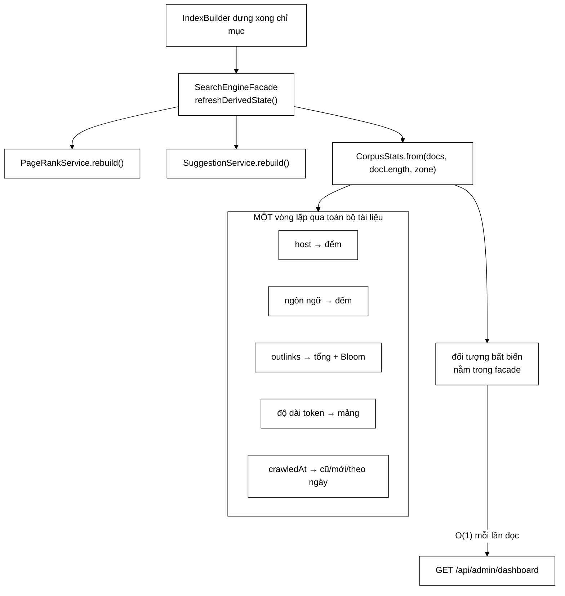

# CorpusStats — chân dung corpus trong một lượt duyệt

**File nguồn:** `search-engine/src/main/java/com/vnsearch/analytics/CorpusStats.java`
**Gói:** `com.vnsearch.analytics` · **Loại:** `record` + nhà máy tĩnh `from(...)`
**Được gọi từ:** `SearchEngineFacade.refreshDerivedState()` (một lần mỗi lần dựng chỉ mục)
**Phụ thuộc:** `datastructure/BloomFilter`, `datastructure/MinHeap`, `model/WebDocument`
**Đọc kèm:** [`AdminDashboard.md`](./AdminDashboard.md) · [`UsageSnapshot.md`](./UsageSnapshot.md)

---

## 📌 Hiểu trong 30 giây

Lớp này trả lời câu hỏi **"máy tìm kiếm đang biết những gì"**: bao nhiêu trang,
thuộc bao nhiêu tên miền, thấy bao nhiêu liên kết, viết bằng ngôn ngữ nào, trang
dài bao nhiêu, crawl vào những ngày nào.

Toàn bộ tính trong **một** lượt duyệt corpus, tại **một** thời điểm duy nhất —
lúc chỉ mục được dựng lại — rồi giữ nguyên cho tới lần dựng sau.



```
   TRẠNG THÁI DẪN XUẤT ĐƯỢC LÀM MỚI CÙNG NGUỒN CỦA NÓ

   ❌ Tính khi CÓ NGƯỜI HỎI                  ✅ Tính khi NGUỒN ĐỔI (đang dùng)
   ┌──────────────────────────┐             ┌──────────────────────────┐
   │ GET /dashboard  →  duyệt │             │ crawl xong → dựng chỉ mục│
   │   31.030 tài liệu        │             │   → tính CorpusStats 1 lần│
   │ 10 giây/lần, 3 admin     │             │ GET /dashboard → đọc O(1)│
   │ = 18 lượt duyệt/phút     │             │ = 0 lượt duyệt/phút      │
   └──────────────────────────┘             └──────────────────────────┘
        endpoint hiển thị kéo theo                cùng khuôn với PageRank
        khối lượng tỉ lệ kích thước chỉ mục       và SuggestionService
```

---

## 1. Hai quyết định thiết kế quan trọng nhất

### 1.1 Tính một lần, không tính theo yêu cầu

Mọi con số ở đây đòi hỏi **một lượt duyệt toàn bộ corpus**. Thân bài trong chỉ
mục lưu ở dạng nén, nên "duyệt" nghĩa là còn phải giải nén. Nếu tính lại mỗi lần
bảng điều khiển làm mới (mặc định 10 giây/lần), ta đặt một khối lượng công việc
tỉ lệ với kích thước chỉ mục lên một endpoint **chỉ để hiển thị**.

Nhưng corpus chỉ đổi ở đúng một thời điểm: khi chỉ mục được dựng lại. Vậy nên
tính ngay tại đó. Đây là cùng một khuôn mẫu với `PageRankService` và
`SuggestionService`: **trạng thái dẫn xuất được làm mới cùng nguồn của nó, không
phải khi có người hỏi**.

### 1.2 Bloom Filter thay `HashSet` — một lỗi thật đã xảy ra

Javadoc dòng 191–216 kể lại nguyên văn:

> Bản đầu tiên giữ một `HashSet<String>` mọi đích liên kết. Trên corpus thật —
> 31.030 trang, trung bình 69 liên kết mỗi trang — đó là **2,1 triệu chuỗi URL**
> nằm trong heap chỉ để hiện đúng một con số. Nó đã làm **hết bộ nhớ** khi hai
> `ApplicationContext` cùng sống trong một JVM lúc chạy kiểm thử.

Phép so sánh bộ nhớ:

$$
\text{HashSet}: \; 2.1\times10^6 \times (\underbrace{40}_{\text{header+char[]}} + \underbrace{2\times|url|}_{\approx 120}) \approx \textbf{340 MB}
$$

$$
\text{BloomFilter}: \; m = -\frac{n\ln p}{(\ln 2)^2} = -\frac{2.1\times10^6 \times \ln 0{,}01}{0{,}4805} \approx 2\times10^7 \text{ bit} \approx \textbf{2,5 MB}
$$

Rẻ hơn **136 lần**. Cái giá là con số trở thành xấp xỉ — và điều quyết định là
**sai số đi về một phía**:

```
   Bloom Filter chỉ có DƯƠNG TÍNH GIẢ, không có ÂM TÍNH GIẢ

   mightContain(x) = false  →  chắc chắn x CHƯA gặp     (không bao giờ sai)
   mightContain(x) = true   →  x CÓ THỂ đã gặp          (sai với xác suất p)

   ⇒ distinctLinkTargets chỉ có thể ĐẾM THIẾU, không bao giờ ĐẾM THỪA
   ⇒ với p = 0,01, sai số dưới 1%
```

Một thống kê hiển thị lệch 1% **theo hướng biết trước** thì dùng được; một lần
`OutOfMemoryError` thì không.

---

## 2. Bản đồ trường dữ liệu

| Trường | Kiểu | Ý nghĩa | Đọc thế nào |
|---|---|---|---|
| `documents` | `int` | Số trang trong chỉ mục | Mẫu số của mọi tỉ lệ bên dưới |
| `distinctHosts` | `int` | Số tên miền phân biệt | Thấp ⇒ crawler bị kẹt trong vài site |
| `totalOutlinks` | `long` | Tổng liên kết đi ra (**tính cả trùng**) | Cạnh của đồ thị PageRank |
| `distinctLinkTargets` | `int` | Số **đích** phân biệt (xấp xỉ) | Chênh với `documents` = phần web đã *thấy* mà chưa crawl |
| `avgOutlinks` | `double` | `totalOutlinks / documents` | Corpus tin tức Việt Nam thường 50–90 |
| `danglingDocuments` | `int` | Trang không có liên kết đi ra | Xem mục 4 — ảnh hưởng trực tiếp PageRank |
| `avgDocLength` | `double` | Độ dài trung bình theo **token** | Chính là $\text{avgdl}$ trong công thức BM25 |
| `medianDocLength` | `int` | Trung vị | Lệch nhiều so với trung bình ⇒ có vài trang khổng lồ |
| `oldestCrawledAt` / `newestCrawledAt` | `Instant` | Biên thời gian corpus | `null` khi corpus rỗng |
| `languages` | `List<Counted>` | Phân bố ngôn ngữ, nhiều nhất trước | `"und"` = không xác định |
| `topHosts` | `List<Counted>` | 10 tên miền nhiều trang nhất | Lấy bằng `MinHeap.topK` |
| `crawledPerDay` | `List<DayCount>` | 14 ngày gần nhất, **liên tục** | Xem mục 3.4 |

---

## 3. Hướng dẫn về code — đi qua từng khối

### 3.1 Tham số `docLength` — và lý do nó không phải `getBodyText().length()`

Đây là chi tiết dễ làm sai nhất trong cả file, và Javadoc dòng 113–121 nói rất
thẳng:

```java
public static CorpusStats from(Collection<WebDocument> documents,
                                ToIntFunction<WebDocument> docLength,
                                ZoneId zone) {
```

```
   ❌ document.getBodyText().length()
      WebDocument lấy ra từ chỉ mục KHÔNG mang theo thân bài — thân bài nằm ở
      dạng nén, chỉ giải nén khi sinh đoạn trích.
      ⇒ trả về 0 cho MỌI tài liệu
      ⇒ avgDocLength = 0,0 — một con số TRÔNG NHƯ THẬT mà sai hoàn toàn

   ✅ docLength = index::getDocLength   (O(1), đọc từ chỉ mục)
      ⇒ đúng, rẻ, và cùng đơn vị (token) mà BM25 dùng để chuẩn hoá
```

Tiêm hàm đo độ dài từ ngoài vào (dependency injection ở mức hàm) khiến lớp này
**không cần biết** chỉ mục lưu độ dài ở đâu — và khiến test dựng được corpus giả
mà không cần cả một `InvertedIndex`.

### 3.2 Vòng lặp hợp nhất — dòng 144–169

Một vòng lặp làm năm việc:

```java
for (WebDocument document : documents) {
    hostCounts.merge(hostOf(document.getUrl()), 1L, Long::sum);          // 1. host
    languageCounts.merge(language, 1L, Long::sum);                       // 2. ngôn ngữ
    if (outlinks == null || outlinks.isEmpty()) { dangling++; }          // 3. nút cụt
    else { totalOutlinks += outlinks.size();
           distinctTargets += countDistinctTargets(outlinks, seenTargets); }
    lengths[index++] = length; totalTokens += length;                     // 4. độ dài
    if (crawledAt != null) { /* oldest/newest/perDay */ }                 // 5. thời gian
}
```

Năm lượt duyệt riêng vẫn cho kết quả đúng, nhưng mỗi lượt thừa là một lần đọc
lại toàn bộ danh sách liên kết — thứ nặng nhất trong `WebDocument`. Với 31.030
trang × 69 liên kết, mỗi lượt thừa là **2,1 triệu** lần truy cập.

### 3.3 Trung vị bằng cách sắp mảng — dòng 171, 182

```java
java.util.Arrays.sort(lengths);
...
lengths[size / 2],
```

$O(N\log N)$ cho trung vị. Có thuật toán $O(N)$ (quickselect / `MinHeap` cỡ
$N/2$), nhưng ở đây $N$ vài chục nghìn và hàm chạy **một lần mỗi lần dựng chỉ
mục** — tối ưu chỗ này là tối ưu sai chỗ. Ghi nhận đánh đổi, không sửa.

> **Lưu ý về định nghĩa:** với `size` chẵn, `lengths[size/2]` là phần tử trên
> của cặp giữa, không phải trung bình cộng của hai phần tử giữa. Đây là "trung
> vị trên" — chấp nhận được cho mục đích hiển thị, nhưng nếu đưa số này vào báo
> cáo thống kê thì phải nói rõ.

### 3.4 Chuỗi ngày liên tục — dòng 237–251

```java
for (int back = DAYS_TRACKED - 1; back >= 0; back--) {
    LocalDate date = today.minusDays(back);
    days.add(new DayCount(date.toString(), perDay.getOrDefault(date, 0L)));
}
```

```
   ❌ Chỉ trả ngày CÓ dữ liệu          ✅ Trả đủ 14 ngày, ngày trống = 0
   ┌────────────────────────┐         ┌──────────────────────────────┐
   │ 08-01: 5.000           │         │ 08-01 ██████ 5.000           │
   │ 08-08: 4.800           │         │ 08-02 ‥ 0                    │
   └────────────────────────┘         │  …                           │
     hai cột đứng cạnh nhau           │ 08-08 █████  4.800           │
     trông như hai ngày liên tiếp     └──────────────────────────────┘
     → TRỤC THỜI GIAN NÓI DỐI              khoảng trống hiện đúng
```

### 3.5 `hostOf` — chuẩn hoá và không bao giờ ném ngoại lệ — dòng 265–278

```java
String host = URI.create(url).getHost();
return host.startsWith("www.") ? host.substring(4) : host;
```

Ba hành vi đáng chú ý:

1. **Bỏ `www.`** để `www.vnexpress.net` và `vnexpress.net` không thành hai dòng.
2. **Bắt `IllegalArgumentException`** — một URL méo trong corpus không được phép
   làm hỏng cả bảng điều khiển.
3. **Trả `"(không rõ)"`** thay vì `null` — `null` sẽ thành khoá `null` trong
   `HashMap` rồi thành `"null"` trên giao diện.

### 3.6 Định cỡ bộ lọc — dòng 231–235

```java
long estimated = (long) documentCount * ESTIMATED_LINKS_PER_PAGE;   // 64
int capacity = (int) Math.min(Math.max(estimated, 1_000), MAX_FILTER_ITEMS); // 5.000.000
```

Ba lớp bảo vệ trong ba dòng:

| Ràng buộc | Chống điều gì |
|---|---|
| `Math.max(estimated, 1_000)` | Corpus tí hon ⇒ bộ lọc quá nhỏ ⇒ FPR thực tế vọt lên |
| `Math.min(…, MAX_FILTER_ITEMS)` | Corpus khổng lồ ⇒ bộ nhớ không phụ thuộc kích thước corpus |
| `(long)` trước phép nhân | **Tràn `int`**: `documentCount * 64` vượt $2^{31}$ khi corpus > 33 triệu trang |

Ép kiểu `(long)` ở dòng 232 là chi tiết nhỏ nhưng đúng — nếu quên, con số sẽ âm
và `BloomFilter` nhận capacity vô nghĩa.

---

## 4. Vì sao `danglingDocuments` đáng có một trường riêng

Trang không có liên kết đi ra là **nút cụt** (dangling node) trong đồ thị web.
PageRank phải xử lý riêng chúng: nếu bỏ mặc, tổng điểm rò rỉ dần về 0 vì không
có cạnh nào mang điểm của nút đó đi tiếp.

$$
PR(p) = \frac{1-d}{N} + d\left(\sum_{q \to p} \frac{PR(q)}{L(q)} + \underbrace{\frac{1}{N}\sum_{q \in \text{dangling}} PR(q)}_{\text{phân phối lại}}\right)
$$

Tỉ lệ nút cụt cao mang một thông điệp vận hành cụ thể: **crawler đã dừng ở độ
sâu tối đa chứ chưa đi hết**. Các trang ở tầng cuối được tải về nhưng liên kết
của chúng chưa bao giờ được bóc.

| `danglingDocuments / documents` | Chẩn đoán |
|---|---|
| < 5% | Bình thường |
| 5–20% | `maxDepth` hơi thấp, hoặc nhiều trang là PDF/ảnh |
| > 20% | Crawl bị cắt giữa chừng, hoặc `LinkExtractor` đang lọc quá tay |

---

## 5. Độ phức tạp & chi phí

| Giai đoạn | Thời gian | Bộ nhớ |
|---|---|---|
| Vòng lặp chính | $O(N \cdot \bar{L})$ | — |
| Bloom Filter | $O(1)$ mỗi liên kết ($k$ hàm băm) | $\le$ 6 MB (trần 5 triệu phần tử) |
| Sắp mảng độ dài | $O(N\log N)$ | $4N$ byte |
| `MinHeap.topK` cho host | $O(H\log 10)$ | $O(10)$ |
| Tổng | $O(N\log N + N\bar{L})$ | $O(N + H + G)$ |

Với $N = 31.030$, $\bar{L} = 69$: khoảng 2,1 triệu phép băm + 31 nghìn phép so —
dưới một giây, chạy **một lần** sau mỗi lần dựng chỉ mục.

---

## 6. Thực hành

### 6.1 Chạy test

```powershell
cd search-engine
.\mvnw.cmd -q -Dtest=CorpusStatsTest test
```

### 6.2 Xem số liệu thật

```powershell
curl -H "Authorization: Bearer <token-admin>" http://localhost:8080/api/admin/dashboard `
  | jq '.crawl | {documents, distinctHosts, avgOutlinks, danglingDocuments, avgDocLength, medianDocLength}'
```

### 6.3 Thêm một chỉ số mới — checklist

1. Thêm thành phần vào record (dòng 64–77) **và** Javadoc `@param` tương ứng.
2. Cập nhật `empty()` (dòng 102–105) — quên bước này thì corpus rỗng gãy biên dịch, may mắn là gãy sớm.
3. Tính trong **vòng lặp đã có** (dòng 144–169), đừng thêm vòng lặp mới.
4. Truyền vào constructor ở dòng 174–188 đúng thứ tự.
5. Thêm case vào `CorpusStatsTest`.

### 6.4 Chỉnh tham số

| Hằng số | Dòng | Đổi khi nào |
|---|---|---|
| `DAYS_TRACKED = 14` | 80 | Muốn biểu đồ dài hơn; nhớ sửa cả trục giao diện |
| `TOP_HOSTS = 10` | 83 | Corpus nhiều tên miền và bảng cần dài hơn |
| `TARGET_FILTER_FPR = 0.01` | 89 | Giảm còn `0.001` ⇒ bộ nhớ tăng ~1,5 lần, sai số giảm 10 lần |
| `ESTIMATED_LINKS_PER_PAGE = 64` | 92 | Đo `avgOutlinks` thực tế rồi chỉnh cho khớp |

---

## 7. Liên kết

- Cấu trúc dùng bên trong: `docs2/main/java/com/vnsearch/datastructure/BloomFilter.md`, `docs2/main/java/com/vnsearch/datastructure/MinHeap.md`
- Nơi gọi: `docs2/main/java/com/vnsearch/service/SearchEngineFacade.md`
- Kiểu chứa: [`AdminDashboard.md`](./AdminDashboard.md)
- Lý thuyết Bloom Filter đầy đủ: `docs/Math/01-crawler/BloomFilter.md`
- Ảnh hưởng nút cụt tới PageRank: `docs/Math/04-ranking/`
