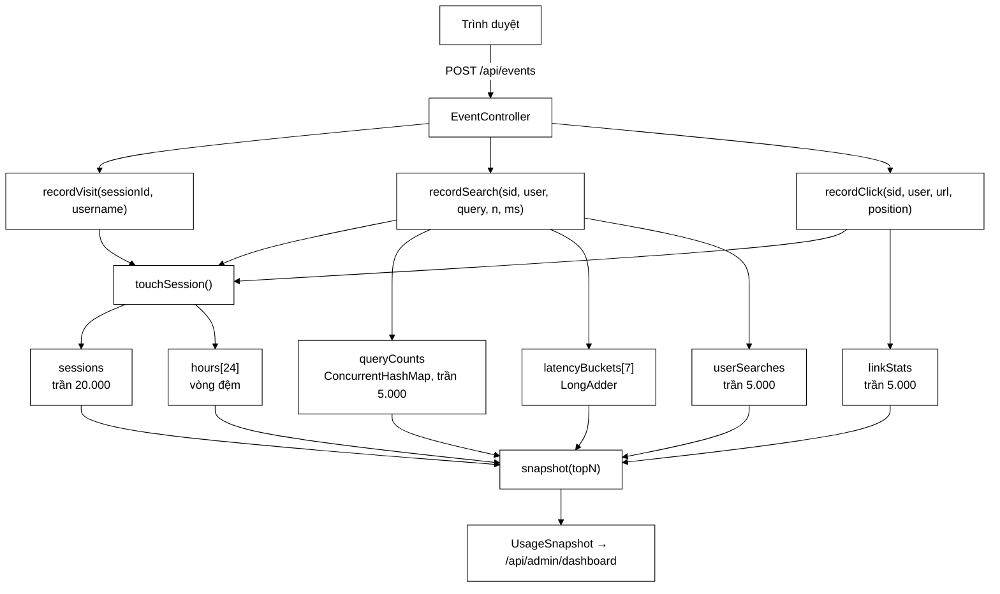

# UsageAnalyticsService — đo hành vi người dùng, có trần, không khoá

**File nguồn:** `search-engine/src/main/java/com/vnsearch/analytics/UsageAnalyticsService.java` (617 dòng)
**Gói:** `com.vnsearch.analytics` · **Loại:** `@Service` singleton, **thread-safe**
**Đầu vào:** `POST /api/events` (công khai) qua `controller/EventController`
**Đầu ra:** [`UsageSnapshot`](./UsageSnapshot.md) → [`AdminDashboard`](./AdminDashboard.md)
**Phụ thuộc:** `datastructure/MinHeap`

---

## 📌 Hiểu trong 30 giây

Đây là **bộ đếm trong bộ nhớ** cho mọi hành vi người dùng: mở trang, tìm kiếm,
bấm kết quả. Ba tính chất định hình toàn bộ thiết kế:

1. **Nằm trên đường đi nóng** — mỗi lượt tìm kiếm gọi vào đây, nên không được có
   khoá toàn cục, không được ghi đĩa.
2. **Đầu vào do bên ngoài điều khiển** — nên **mọi bảng đều có trần**.
3. **Chỉ nhìn 24 giờ** — nên vòng đệm cố định 24 ô, không có tác vụ dọn dẹp.



```
   HAI LỚP "ANALYTICS" — ĐỪNG LẪN

   ┌ CrawlAnalyticsService ─────────────┐  ┌ UsageAnalyticsService (file này) ┐
   │ Máy tìm kiếm BIẾT gì               │  │ Người dùng LÀM gì                │
   │ trang đã crawl, host, ngôn ngữ, ảnh│  │ phiên, truy vấn, click, độ trễ   │
   │ nguồn: bus sự kiện của crawler     │  │ nguồn: POST /api/events từ UI    │
   └────────────────────────────────────┘  └──────────────────────────────────┘
```

---

## 1. Bốn quyết định kiến trúc

### 1.1 Bộ nhớ, không phải cơ sở dữ liệu (dòng 42–50)

Bảng điều khiển trả lời "chuyện gì đang xảy ra **lúc này**", tầm nhìn tối đa 24
giờ. Một bảng SQL cho việc đó kéo theo lược đồ, migration, và **một phép ghi đĩa
nằm ngay trên đường đi của mỗi lượt tìm kiếm**.

Cái giá được chấp nhận có ý thức: **khởi động lại là mất số liệu**. Số liệu cần
sống lâu hơn tiến trình đã có đường khác — `/actuator/prometheus`, nơi Prometheus
lưu bền.

### 1.2 Mọi bảng đều có trần (dòng 52–65) — đây là phần quan trọng nhất

```java
public static final int MAX_TRACKED_QUERIES  = 5_000;
public static final int MAX_TRACKED_LINKS    = 5_000;
public static final int MAX_TRACKED_SESSIONS = 20_000;
public static final int MAX_TRACKED_USERS    = 5_000;
```

```
   VÌ SAO ĐÂY LÀ VẤN ĐỀ BẢO MẬT, KHÔNG CHỈ LÀ VẤN ĐỀ HIỆU NĂNG

   POST /api/events  { "sessionId": "<chuỗi ngẫu nhiên>" }   ← không cần đăng nhập
        │
        └─ ConcurrentHashMap không trần
             ├─ 1.000 req/s × 64 byte khoá + object header
             ├─ ≈ 15 MB/phút
             └─ OutOfMemoryError sau vài giờ → LỖ RÒ BỘ NHỚ KẺ TẤN CÔNG ĐIỀU KHIỂN ĐƯỢC

   Có trần:  khoá thứ 5.001 bị bỏ qua, dropped++, truncated = true
             → dịch vụ vẫn sống, số liệu thiếu phần đuôi và NÓI RÕ điều đó
```

**Vì sao giữ khoá cũ chứ không thay bằng khoá mới?** Vì các truy vấn phổ biến
gần như luôn xuất hiện sớm. Một bảng xếp hạng thiếu phần đuôi vẫn đúng ở phần
đầu — thứ duy nhất được hiển thị. Nếu thay khoá cũ bằng khoá mới, kẻ tấn công
**xoá sạch** được bảng xếp hạng thật chỉ bằng cách gửi rác.

### 1.3 Không khoá toàn cục

| Thành phần | Cấu trúc | Vì sao |
|---|---|---|
| `searches`, `clicks`, `zeroResultSearches` | `AtomicLong` | Cần đọc chính xác giá trị hiện tại |
| `latencySumMs`, `latencySamples`, các bucket | `LongAdder` | Ghi rất nhiều, đọc hiếm — `LongAdder` tách ô đếm theo luồng, giảm tranh chấp |
| `queryCounts`, `linkStats`, `sessions` | `ConcurrentHashMap` | Ghi song song không khoá bảng |
| `hours[i]` | `synchronized (hour)` | Chỉ khoá **một ô**, và chỉ khi xoay vòng giờ |

> **`AtomicLong` hay `LongAdder`?** `AtomicLong` dùng CAS trên **một** ô nhớ —
> nhiều luồng cùng ghi thì CAS thất bại và thử lại liên tục. `LongAdder` phân
> tán ra nhiều ô rồi cộng lại lúc đọc: ghi nhanh hơn nhiều, đọc chậm hơn chút.
> Ở đây ghi gấp hàng nghìn lần đọc, nên chọn đúng.

### 1.4 Riêng tư theo thiết kế (dòng 67–73)

Lớp này **không** nhận và không lưu địa chỉ IP, không lưu cookie. `sessionId` là
chuỗi ngẫu nhiên do **chính máy khách** sinh ra: nó gom hành động của một phiên
lại với nhau nhưng không chỉ tới một con người nào.

Khi người dùng đăng nhập, ranh giới đổi — và Javadoc dòng 173–179 nói thẳng điều
đó, kèm hệ quả: bảng `topUsers` **chỉ hiện tên và số lượt**, không hiện truy vấn
của từng người.

---

## 2. Bản đồ API công khai

| Phương thức | Chữ ký | Độ phức tạp | Ghi chú |
|---|---|---|---|
| `recordVisit` | `(String sessionId)` / `(sessionId, username)` | $O(1)$ | Chỉ đăng ký phiên |
| `recordSearch` | `(sid, [user], query, resultCount, tookMs)` | $O(1)$ | Đường đi nóng nhất |
| `recordClick` | `(sid, [user], url, position)` | $O(1)$ | `position ≤ 0` = không rõ |
| `snapshot` | `(int topN)` → `UsageSnapshot` | $O(S + Q\log k + L\log k)$ | Chỉ `/api/admin/**` gọi |
| `reset` | `()` | $O(S+Q+L)$ | Nút "đặt lại" của trang quản trị |

Cặp overload `(…)` / `(…, username)` tồn tại để nơi gọi cũ (và test) không phải
truyền `null` thủ công. Bản không có `username` uỷ quyền cho bản đầy đủ với
`null` — người dùng ẩn danh là **mặc định**, vì tìm kiếm không đòi đăng nhập.

---

## 3. Hướng dẫn về code — các khối đáng học

### 3.1 Vòng đệm 24 giờ và double-checked locking (dòng 407–428)

```java
private Hour hourNow() {
    long epochHour = clock.millis() / 3_600_000L;
    Hour hour = hours[(int) Math.floorMod(epochHour, HOURS_TRACKED)];
    if (hour.epochHour != epochHour) {
        synchronized (hour) {
            // Kiểm tra lại BÊN TRONG khoá
            if (hour.epochHour != epochHour) {
                hour.reset(epochHour);
            }
        }
    }
    return hour;
}
```

```
   VÒNG ĐỆM 24 Ô — giờ thứ 25 tự ghi đè giờ thứ 1

   epochHour:  ... 1000  1001  1002 ...
   chỉ số   :  floorMod(epochHour, 24)

   hours[]  ┌────┬────┬────┬─ ... ─┬────┐
            │ 0  │ 1  │ 2  │       │ 23 │
            └────┴────┴────┴─ ... ─┴────┘
              ▲
              giờ 1024 và giờ 1000 dùng CHUNG ô 8
              → khi bước sang 1024, ô phải được XOÁ trước khi dùng

   Lợi: bộ nhớ CỐ ĐỊNH, không cần tác vụ dọn dẹp định kỳ
        (bản thân tác vụ dọn dẹp là một nguồn lỗi riêng)
```

**Ba chi tiết đồng thời phải đúng cùng lúc:**

1. `Math.floorMod` chứ không phải `%` — `%` trong Java trả số âm với số bị chia
   âm; `clock.millis()` âm chỉ xảy ra khi test đẩy đồng hồ về trước 1970, nhưng
   `floorMod` làm điều đó không bao giờ thành lỗi chỉ số mảng.
2. **Kiểm tra lại bên trong khoá** — hai luồng cùng thấy ô cũ thì chỉ một luồng
   được xoá; luồng kia sẽ xoá mất số liệu mà luồng đầu vừa ghi.
3. **`epochHour` ghi sau cùng** trong `reset` (dòng 606–614):

```java
void reset(long newEpochHour) {
    searches.reset();
    clicks.reset();
    sessions.clear();
    // Ghi epochHour SAU CÙNG: nó là cờ báo "ô đã sẵn sàng".
    epochHour = newEpochHour;
}
```

`epochHour` là `volatile`. Ghi nó **sau** tạo ra một *happens-before*: luồng nào
đọc thấy giá trị mới thì chắc chắn cũng thấy các bộ đếm đã được xoá xong. Ghi
trước thì một luồng khác có thể thấy ô thuộc giờ mới trong khi các bộ đếm còn
đang bị xoá, và số nó vừa ghi biến mất.

### 3.2 Đọc ô giờ — phân biệt ô "tươi" và ô sót lại (dòng 430–450)

```java
boolean fresh = hour.epochHour == epochHour;
points.add(new UsageSnapshot.HourPoint(
        label,
        fresh ? hour.sessions.size() : 0,
        fresh ? hour.searches.sum()  : 0,
        fresh ? hour.clicks.sum()    : 0));
```

Ô nào mang mốc giờ **khác** là ô của một ngày trước còn sót lại trong vòng đệm.
Nó phải hiện bằng 0 chứ không phải bằng số liệu cũ — nếu không, biểu đồ 24 giờ
sẽ có một cột dữ liệu của hôm qua chen vào.

### 3.3 `bump` — tăng đếm có tôn trọng trần (dòng 500–512)

```java
private void bump(Map<String, LongAdder> table, String key, int cap) {
    LongAdder counter = table.get(key);
    if (counter != null) { counter.increment(); return; }   // đường nhanh: khoá đã có
    if (table.size() >= cap) { dropped.incrementAndGet(); return; }
    table.computeIfAbsent(key, ignored -> new LongAdder()).increment();
}
```

Thứ tự ba bước là cố ý: **khoá đã tồn tại luôn được đếm tiếp**, kể cả khi bảng
đã chạm trần. Chỉ khoá **mới** mới bị chặn. Nhờ vậy, khi bị dội rác, các truy
vấn thật (đã có mặt từ trước) vẫn tiếp tục được đếm chính xác.

> **Điểm cần biết:** `table.size()` trên `ConcurrentHashMap` là ước lượng và có
> thể có đua giữa `size()` và `computeIfAbsent` — bảng có thể vượt trần vài mục.
> Đây là đánh đổi có ý thức: chặn chính xác đòi hỏi khoá, và trần 5.000 vượt
> thành 5.003 thì không ai quan tâm.

### 3.4 `snapshot` — một vòng lặp cho ba con số (dòng 293–303)

```java
for (Session session : sessions.values()) {
    if (session.lastSeenMillis >= activeCutoff) { active++; }
    if (session.username != null) { signedIn++; }
    durationSumMillis += session.lastSeenMillis - session.firstSeenMillis;
}
```

Bảng phiên là thứ lớn nhất phải duyệt ở đây (tới 20.000 mục) và duyệt nó ba lần
không thêm được gì.

Javadoc dòng 270–277 cũng nói rõ **snapshot không đồng bộ với phần ghi**: một
request đang chạy song song có thể được tính vào ô này mà chưa vào ô kia. Với
bảng điều khiển làm mới mỗi vài giây, sai lệch đó không quan sát được; còn một
khoá bao quanh toàn bộ phần ghi thì đặt một điểm tranh chấp lên **đúng đường đi
của mọi truy vấn tìm kiếm**. Cái giá không đáng.

### 3.5 Top-K bằng min-heap, không sắp cả bảng (dòng 461–475)

```java
return MinHeap.topK(all, k, Comparator.comparingLong(UsageSnapshot.Counted::count));
```

$$
\text{sort}: O(n\log n) = 5000 \times 12{,}3 \approx 61.000 \text{ phép so}
$$
$$
\text{topK}: O(n\log k) = 5000 \times 3{,}3 \approx 16.500 \text{ phép so}
$$

Nhanh hơn ~3,7 lần và **không cấp phát một bản sao đã sắp của cả bảng**. Đây
cũng đúng là thuật toán mà tầng xếp hạng dùng để lấy top kết quả — dùng lại một
khái niệm thay vì thêm một khái niệm mới.

### 3.6 Chuẩn hoá truy vấn (dòng 514–527)

```java
String collapsed = raw.trim().replaceAll("\\s+", " ").toLowerCase(Locale.ROOT);
return collapsed.isEmpty() ? null : trimTo(collapsed, MAX_QUERY_CHARS);
```

```
   Không chuẩn hoá                     Có chuẩn hoá
   "Hà Nội"    → 300                   "hà nội" → 900   ← lọt top
   "hà nội  "  → 300
   "hà  nội"   → 300
   ba dòng, không dòng nào lọt top
```

`Locale.ROOT` chứ không phải `toLowerCase()` trần: locale mặc định của máy có
thể làm chuyện bất ngờ (nổi tiếng nhất là tiếng Thổ Nhĩ Kỳ, `"I".toLowerCase()`
cho `"ı"`). Cùng lý do với `UrlCanonicalizer` và `ContentSeenFilter`.

### 3.7 `Clock` tiêm từ ngoài (dòng 138–155)

```java
public UsageAnalyticsService() { this(Clock.systemDefaultZone()); }
public UsageAnalyticsService(Clock clock) { ... }
```

Không có nó thì bài kiểm thử cho vòng đệm 24 giờ chỉ còn hai lựa chọn:
`Thread.sleep` một tiếng, hoặc không kiểm gì cả.

```java
// Trong test: nhảy 3 giờ chỉ bằng một dòng
Clock t0 = Clock.fixed(Instant.parse("2026-08-14T10:00:00Z"), ZoneOffset.UTC);
Clock t3 = Clock.offset(t0, Duration.ofHours(3));
```

### 3.8 Cắt chuỗi đầu vào (dòng 97–100, 529–538)

```java
private static final int MAX_QUERY_CHARS      = 120;
private static final int MAX_URL_CHARS        = 300;
private static final int MAX_SESSION_ID_CHARS = 64;
```

Trần **số lượng** khoá chưa đủ — còn phải chặn **kích thước** mỗi khoá. Không có
`trimTo`, một request duy nhất mang chuỗi 10 MB sẽ nằm lại trong heap.

---

## 4. Cấu trúc dữ liệu nội bộ

| Lớp | Trường | Ghi chú đồng thời |
|---|---|---|
| `Session` | `firstSeenMillis` (final), `lastSeenMillis` (volatile), `username` (volatile), `searches`, `clicks` | Ghi không đồng bộ; hai luồng cùng cập nhật `lastSeen` thì giá trị lớn hơn có thể bị ghi đè — sai lệch mili giây, không đáng khoá |
| `LinkStat` | `host` (final), `count`, `positionSum`, `positionSamples` | Ba `LongAdder`; `position` trung bình = `positionSum / positionSamples` |
| `Hour` | `epochHour` (volatile), `searches`, `clicks`, `sessions` (concurrent set) | Xem 3.1 |

`attachUser` (dòng 383–397) chỉ gắn tài khoản **một lần**, ở lần đầu biết được:

> Nếu ghi đè mỗi lần, hai người cùng dùng chung một máy (đăng nhập rồi đăng
> xuất) sẽ làm phiên đổi chủ và số "người dùng đã đăng nhập" nhảy lung tung.

---

## 5. Chi phí bộ nhớ ở mức trần

$$
\begin{aligned}
\text{sessions} &: 20.000 \times (64\text{B khoá} + \approx 120\text{B object}) &&\approx 3{,}7\text{ MB}\\
\text{queryCounts} &: 5.000 \times (120\text{B} + 40\text{B}) &&\approx 0{,}8\text{ MB}\\
\text{linkStats} &: 5.000 \times (300\text{B} + 3\times\text{LongAdder}) &&\approx 2{,}0\text{ MB}\\
\text{userSearches} &: 5.000 \times 100\text{B} &&\approx 0{,}5\text{ MB}\\
\text{hours} &: 24 \times 5.000 \times 64\text{B} &&\approx 7{,}7\text{ MB}\\
\hline
\textbf{Tổng chặn trên} &&&\approx \textbf{15 MB}
\end{aligned}
$$

Con số này **không phụ thuộc lưu lượng**. Đó là điều duy nhất cần chứng minh cho
một thành phần nhận đầu vào công khai.

---

## 6. Thực hành

### 6.1 Chạy test

```powershell
cd search-engine
.\mvnw.cmd -q -Dtest=UsageAnalyticsServiceTest test
```

### 6.2 Thử trần bằng tay

```powershell
# Bơm 6.000 truy vấn khác nhau rồi xem cờ truncated
1..6000 | ForEach-Object {
  curl -s -X POST http://localhost:8080/api/events -H "Content-Type: application/json" `
    -d "{`"type`":`"search`",`"sessionId`":`"s$_`",`"query`":`"q$_`",`"resultCount`":1,`"tookMs`":5}" | Out-Null
}
curl -H "Authorization: Bearer <token-admin>" http://localhost:8080/api/admin/dashboard | jq '.traffic.truncated'
```

### 6.3 Thêm một loại sự kiện mới — checklist

1. Thêm phương thức `recordX(...)` ở khối "Ghi nhận" (dòng 157–264).
2. **Bắt buộc**: mọi bảng mới phải có hằng số trần và đi qua `bump(...)`.
3. **Bắt buộc**: mọi chuỗi từ ngoài phải qua `trimTo(...)`.
4. Cộng vào `dropped` khi bỏ dữ liệu, để `truncated` phản ánh đúng.
5. Thêm trường tương ứng vào `UsageSnapshot` và cập nhật `snapshot(...)`.
6. Xoá trong `reset()` (dòng 330–350) — quên bước này thì nút "đặt lại" nói dối.

### 6.4 Cạm bẫy khi sửa

| Cạm bẫy | Hệ quả |
|---|---|
| Thêm `ConcurrentHashMap` không trần | Lỗ rò bộ nhớ do bên ngoài điều khiển |
| Dùng `synchronized` cho cả service | Điểm tranh chấp trên đường đi của mọi truy vấn |
| Ghi `epochHour` trước khi xoá bộ đếm | Mất số liệu do đua |
| Dùng `%` thay `Math.floorMod` | Chỉ số mảng âm khi đồng hồ trước 1970 |
| Quên `Locale.ROOT` | Bảng xếp hạng khác nhau giữa hai máy |
| Lưu IP hoặc truy vấn theo từng người | Phá ranh giới riêng tư đã tuyên bố |

---

## 7. Chấm theo chuẩn doanh nghiệp

| Tiêu chí | Điểm | Nhận xét |
|---|---|---|
| An toàn đồng thời | 9/10 | Đúng ở những chỗ khó (double-check, volatile ghi sau); sai lệch nhỏ được ghi nhận có ý thức |
| Chống lạm dụng | 10/10 | Trần số lượng **và** trần kích thước cho mọi đầu vào công khai |
| Hiệu năng đường nóng | 10/10 | $O(1)$, `LongAdder`, không khoá toàn cục, không I/O |
| Riêng tư | 9/10 | Không IP/cookie; ranh giới đăng nhập được tuyên bố rõ |
| Khả năng kiểm thử | 9/10 | `Clock` tiêm từ ngoài — vòng đệm 24 giờ test được |
| Độ bền dữ liệu | 5/10 | **Mất hết khi khởi động lại** — có ý thức, nhưng vẫn là hạn chế |
| Khả năng quan sát | 7/10 | Có `dropped` nhưng chưa đẩy ra Prometheus |

**Bốn đề xuất nâng lên mức sản phẩm:**

1. **Đẩy `dropped` ra Micrometer** (`Counter` tên `vnsearch.analytics.dropped`)
   để có cảnh báo khi hệ thống bị dội rác, thay vì chỉ hiện một cờ boolean.
2. **Rate limit theo `sessionId`** ở `EventController` — hiện `RateLimitFilter`
   chặn theo IP, nhưng chính `/api/events` là nơi đáng chặn theo phiên nhất.
3. **Xuất định kỳ ra Prometheus** những chỉ số cần lịch sử (CTR,
   `zeroResultRate`), để mất khi khởi động lại chỉ ảnh hưởng bảng thời gian thực.
4. **Loại bỏ đua ở trần**: dùng `AtomicInteger` đếm kích thước thay cho
   `map.size()` nếu muốn trần chính xác tuyệt đối (hiện chưa cần).

---

## 8. Liên kết

- Kiểu kết quả: [`UsageSnapshot.md`](./UsageSnapshot.md)
- Kiểu chứa: [`AdminDashboard.md`](./AdminDashboard.md)
- Nguồn sự kiện: `docs2/main/java/com/vnsearch/controller/EventController.md`
- Top-K: `docs2/main/java/com/vnsearch/datastructure/MinHeap.md`
- Đối trọng phía crawler: `docs2/main/java/com/vnsearch/crawler/modular/CrawlAnalyticsService.md`
- Tổng quan: `docs/ACCOUNTS-AND-DASHBOARD.md`, `docs/SECURITY.md`
