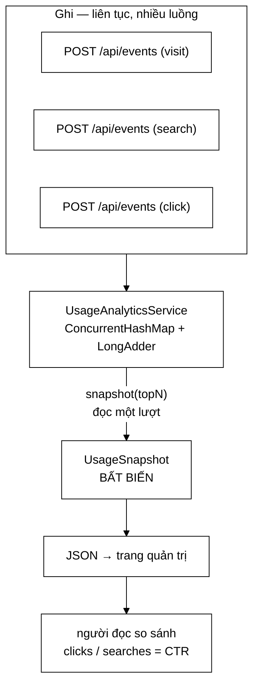

# UsageSnapshot — ảnh chụp đông cứng của số liệu sử dụng

**File nguồn:** `search-engine/src/main/java/com/vnsearch/analytics/UsageSnapshot.java`
**Gói:** `com.vnsearch.analytics` · **Loại:** `record` bất biến + 4 record lồng
**Sinh ra bởi:** `UsageAnalyticsService.snapshot(int topN)`
**Đọc kèm:** [`UsageAnalyticsService.md`](./UsageAnalyticsService.md) · [`AdminDashboard.md`](./AdminDashboard.md)

---

## 📌 Hiểu trong 30 giây

`UsageSnapshot` là **một khoảnh khắc đông cứng** của tất cả số liệu hành vi
người dùng. Nó không có setter, không có tham chiếu ngược về service, và mọi
danh sách bên trong đều bất biến.

Toàn bộ lý do tồn tại của nó nằm ở một câu: **người đọc bảng điều khiển sẽ tự
chia hai con số cho nhau**, và phép chia đó chỉ đúng khi hai con số cùng thuộc
một thời điểm.



```
   VÌ SAO CHỤP MỘT LẦN CHỨ KHÔNG PHẢI BA GETTER

   ❌ getSearches(); getClicks(); getZeroResults();
      t=0.000  searches = 3.000
      t=0.001  (một request mới bay vào: searches=3.001, clicks=901)
      t=0.002  clicks   = 901
      → người đọc tính CTR = 901/3.000 = 30,03%  ← một tỉ lệ CHƯA TỪNG TỒN TẠI

   ✅ snapshot(10) → đọc lần lượt rồi ĐÓNG BĂNG
      mọi con số trên cùng một màn hình nhất quán với nhau
```

---

## 1. Vì sao `record` chứ không phải `Map<String,Object>`

Javadoc dòng 16–19 nói thẳng:

> Map thì Jackson vẫn tuần tự hoá được, nhưng khi đó **lược đồ JSON chỉ tồn tại
> trong đầu người viết**: đổi tên một khoá không làm gãy phép biên dịch nào, và
> lỗi lộ ra ở giao diện, lúc chạy. Record biến lược đồ thành kiểu.

| | `Map<String,Object>` | `record UsageSnapshot` |
|---|---|---|
| Gõ nhầm tên khoá | Không lỗi biên dịch → `undefined` trên UI | Gãy ngay lúc biên dịch |
| Thiếu một trường | Trường biến mất im lặng | Constructor bắt buộc đủ tham số |
| Kiểu sai (`long` vs `String`) | Không ai chặn | Trình biên dịch chặn |
| IDE gợi ý trường | Không | Có |
| Tìm nơi dùng một trường | Grep chuỗi | "Find usages" chính xác |

---

## 2. Bản đồ trường

### 2.1 Nhóm đếm người

| Trường | Ý nghĩa | Bẫy khi đọc |
|---|---|---|
| `visitors` | Số **phiên** phân biệt đang theo dõi | Không phải số *người*; một người mở 2 trình duyệt = 2 |
| `signedInVisitors` | Số phiên gắn với **tài khoản đã đăng nhập** | Phần chênh so với `visitors` là người ẩn danh — **trạng thái bình thường** |
| `activeVisitors` | Phiên có hoạt động trong `activeWindowMinutes` phút gần nhất | Mặc định 5 phút |
| `activeWindowMinutes` | Độ dài cửa sổ "đang hoạt động" | Trả kèm để UI không hard-code số 5 |

> **Vì sao trả cả `activeWindowMinutes`?** Vì nhãn trên giao diện phải viết
> "đang hoạt động (5 phút)". Nếu UI tự ghi hằng số 5 mà backend đổi thành 10,
> nhãn nói dối và không có gì báo lỗi.

### 2.2 Nhóm chất lượng tìm kiếm

| Trường | Công thức | Ngưỡng đáng lo |
|---|---|---|
| `searches` | Tổng lượt tìm | — |
| `clicks` | Tổng lượt bấm kết quả | — |
| `clickThroughRate` | $\dfrac{\text{clicks}}{\text{searches}}$, bằng 0 khi mẫu số 0 | < 0,2 ⇒ kết quả không hấp dẫn |
| `zeroResultSearches` | Truy vấn không ra kết quả nào | — |
| `zeroResultRate` | $\dfrac{\text{zeroResults}}{\text{searches}}$ | > 0,15 ⇒ corpus quá hẹp hoặc tokenizer sai |
| `avgLatencyMs` | Trung bình độ trễ máy chủ báo | Xem `latency` để hiểu đuôi phân bố |
| `avgSessionMinutes` | Trung bình `(lastSeen − firstSeen)` | Phiên một sự kiện = 0 phút |

`avgSessionMinutes` có một quyết định trung thực đáng chú ý (Javadoc dòng 37–40):
phiên chỉ có **một** sự kiện tính là **0 phút**, không suy đoán thời gian người
dùng ngồi đọc sau hành động cuối — **vì không có gì đo được điều đó**. Nhiều hệ
thống analytics cộng thêm một hằng số "thời gian đọc giả định"; ở đây thì không,
và con số vì thế là *chặn dưới* của thời lượng thật.

### 2.3 Nhóm chuỗi và bảng xếp hạng

```
UsageSnapshot
├── hourly     : List<HourPoint>     24 điểm, cũ nhất trước
├── latency    : List<LatencyBucket> 7 khoảng, tăng theo cấp số nhân
├── topQueries : List<Counted>       truy vấn phổ biến
├── topLinks   : List<LinkCount>     liên kết được bấm + THỨ HẠNG TRUNG BÌNH
├── topHosts   : List<Counted>       gộp topLinks theo tên miền
└── topUsers   : List<Counted>       tài khoản tìm nhiều nhất — CHỈ tên + số lượt
```

---

## 3. Bốn record lồng — hướng dẫn về code

### 3.1 `Counted(String label, long count)` — dòng 74–75

Cặp nhãn–số đếm dùng lại cho **bốn** bảng khác nhau (`topQueries`, `topHosts`,
`topUsers`, và cả `CorpusStats.languages`). Một kiểu chung thay vì bốn kiểu gần
giống nhau: giao diện viết **một** component bảng xếp hạng dùng cho tất cả.

```java
public record Counted(String label, long count) { }
```

> Đây là điểm hiếm hoi nên dùng kiểu chung thay vì kiểu chuyên biệt: hai bảng
> khác nhau *về ngữ nghĩa* nhưng **giống hệt nhau về hình dạng và cách hiển
> thị**. Khi ngữ nghĩa khác kéo theo trường khác (như `topLinks`), lập tức tách
> ra kiểu riêng — xem ngay dưới.

### 3.2 `LinkCount(url, host, count, position)` — dòng 86–87

Đây là record đáng giá nhất trong file, vì trường `position`:

```java
public record LinkCount(String url, String host, long count, double position) { }
```

`position` = **thứ hạng trung bình của liên kết lúc được bấm**. Nó không đo lưu
lượng, nó đo **chất lượng xếp hạng**:

```
   phân bố position của toàn bảng topLinks

   position ≈ 1,4   ██████████████████  người dùng bấm ngay 1–3
                    → bộ xếp hạng đang đặt đúng thứ tự

   position ≈ 6,8   ████                bấm rải tới hạng 8–10
                    → người dùng phải TỰ ĐI TÌM trong trang kết quả
                    → cùng nghĩa với MRR thấp trong docs/EVALUATION.md
```

Liên hệ với chỉ số đánh giá offline: nếu gọi $r_i$ là thứ hạng được bấm ở lượt
thứ $i$, thì `position` là $\bar{r}$, còn MRR là $\frac{1}{n}\sum \frac{1}{r_i}$.
Hai chỉ số cùng chiều nhưng MRR phạt nặng hơn các thứ hạng sâu. `position` được
chọn vì **giải thích được cho người không chuyên** — "trung bình người ta bấm ở
vị trí thứ mấy".

### 3.3 `HourPoint(hour, visitors, searches, clicks)` — dòng 95–96

`hour` là **nhãn giờ địa phương** dạng `"14:00"`, không phải timestamp. Lý do:
giao diện chỉ vẽ trục, không cần tính toán thời gian, và múi giờ đã được quy đổi
một lần ở máy chủ thay vì mỗi trình duyệt tự quy đổi một kiểu.

### 3.4 `LatencyBucket(label, count)` — dòng 109–110

Javadoc dòng 98–105 giải thích vì sao cần **phân bố** chứ không chỉ trung bình:

$$
\text{độ trễ có đuôi dài:}\quad P(X > 500\text{ms}) \ll P(X < 10\text{ms}), \quad \text{nhưng } \mathbb{E}[X] \text{ nằm giữa và không mô tả nhóm nào}
$$

```
   phần lớn truy vấn TRÚNG CACHE      vài truy vấn phải chấm điểm
   → vài mili giây                     hàng nghìn ứng viên → hàng trăm ms

   < 10ms   ████████████████████████ 8.400
   10–50    ██████ 1.900
   50–100   ██ 420
   100–200  █ 130
   200–500  ▌ 44          ← ngưỡng SLO nằm ở đây
   500ms–1s ▏ 9
   > 1s     ▏ 2           ← 2 người thật sự phải chờ. Trung bình 18ms giấu mất điều này.
```

---

## 4. Trường `truncated` — nói thật với người xem

```java
boolean truncated
```

Mọi bảng theo dõi trong `UsageAnalyticsService` đều có **trần bộ nhớ** (5.000
truy vấn, 5.000 liên kết, 20.000 phiên, 5.000 người dùng). Khi chạm trần, khoá
**mới** bị bỏ qua và cờ này bật lên.

```
   truncated = false → bảng xếp hạng là ĐẦY ĐỦ trong cửa sổ 24 giờ
   truncated = true  → một bảng nào đó đã chạm trần; phần ĐUÔI bị thiếu,
                       phần ĐẦU (thứ duy nhất hiển thị) vẫn đúng
```

Điều này quan trọng vì **toàn bộ dữ liệu vào đây do bên ngoài quyết định**: ai
gọi được `POST /api/events` cũng tự chọn chuỗi truy vấn và mã phiên. Không có
trần thì đó là một lỗ rò bộ nhớ mà kẻ tấn công điều khiển được. Có trần mà không
báo thì bảng điều khiển hiển thị số liệu thiếu như thể nó đầy đủ — cũng là nói
dối, chỉ là im lặng hơn.

---

## 5. Ranh giới riêng tư — một lựa chọn, không phải thiếu sót

Javadoc dòng 46–50 tuyên bố rõ về `topUsers`:

> **Chỉ tên và số lượt** — cố ý không kèm truy vấn của từng người: bảng điều
> khiển trả lời "ai dùng nhiều", **không** trả lời "người này tìm gì".

```
   ĐƯỢC PHÉP HIỆN                        CỐ Ý KHÔNG HIỆN
   ┌──────────────────────────┐          ┌──────────────────────────────┐
   │ topUsers: kiet → 340 lượt│          │ truy vấn của riêng "kiet"    │
   │ topQueries: "hà nội" 890 │          │ địa chỉ IP                   │
   │   (gộp toàn hệ thống)    │          │ cookie / vân tay trình duyệt │
   └──────────────────────────┘          └──────────────────────────────┘
```

Khi mở rộng record này, **mọi trường mới phải trả lời được câu hỏi**: nó có cho
phép ghép một hành vi cụ thể với một con người cụ thể không? Nếu có, nó không
thuộc về đây.

---

## 6. Thực hành

### 6.1 Xem snapshot thật

```powershell
curl -H "Authorization: Bearer <token-admin>" http://localhost:8080/api/admin/dashboard `
  | jq '.traffic | {visitors, searches, clicks, clickThroughRate, zeroResultRate, truncated}'
```

### 6.2 Sinh dữ liệu để thử

```powershell
curl -X POST http://localhost:8080/api/events -H "Content-Type: application/json" `
  -d '{"type":"search","sessionId":"demo-1","query":"hà nội","resultCount":12,"tookMs":37}'
curl -X POST http://localhost:8080/api/events -H "Content-Type: application/json" `
  -d '{"type":"click","sessionId":"demo-1","url":"https://vnexpress.net/abc","position":2}'
```

### 6.3 Thêm một trường — checklist

1. Thêm thành phần vào record (dòng 53–71) **kèm `@param`** giải thích *cách đọc
   đúng*, không chỉ *nó là gì*.
2. Kiểm tra ranh giới riêng tư ở mục 5.
3. Tính trong `UsageAnalyticsService.snapshot(...)` — nhớ dùng chung vòng lặp đã
   có nếu cần duyệt bảng phiên.
4. Xử lý mẫu số 0 tại chỗ tính, **không** để giao diện tự lo.
5. Bổ sung `UsageAnalyticsServiceTest`.

### 6.4 Cạm bẫy

| Cạm bẫy | Hệ quả |
|---|---|
| Trả `List` có thể thay đổi | Record "bất biến" chỉ trên danh nghĩa; hãy dùng `List.of` / `MinHeap.topK` (đã trả list mới) |
| Tính tỉ lệ ở giao diện | Mỗi UI tự xử lý chia cho 0 một kiểu |
| Đổi tên thành phần | Gãy JSON lúc chạy — cần test hợp đồng |
| Thêm trường suy đoán (thời gian đọc giả định) | Phá nguyên tắc "chỉ báo cái đo được" |

---

## 7. Liên kết

- Nơi sinh ra: [`UsageAnalyticsService.md`](./UsageAnalyticsService.md)
- Kiểu chứa: [`AdminDashboard.md`](./AdminDashboard.md)
- Nguồn sự kiện: `docs2/main/java/com/vnsearch/controller/EventController.md`
- Top-K bằng min-heap: `docs2/main/java/com/vnsearch/datastructure/MinHeap.md`
- Chỉ số đánh giá xếp hạng: `docs/EVALUATION.md`
