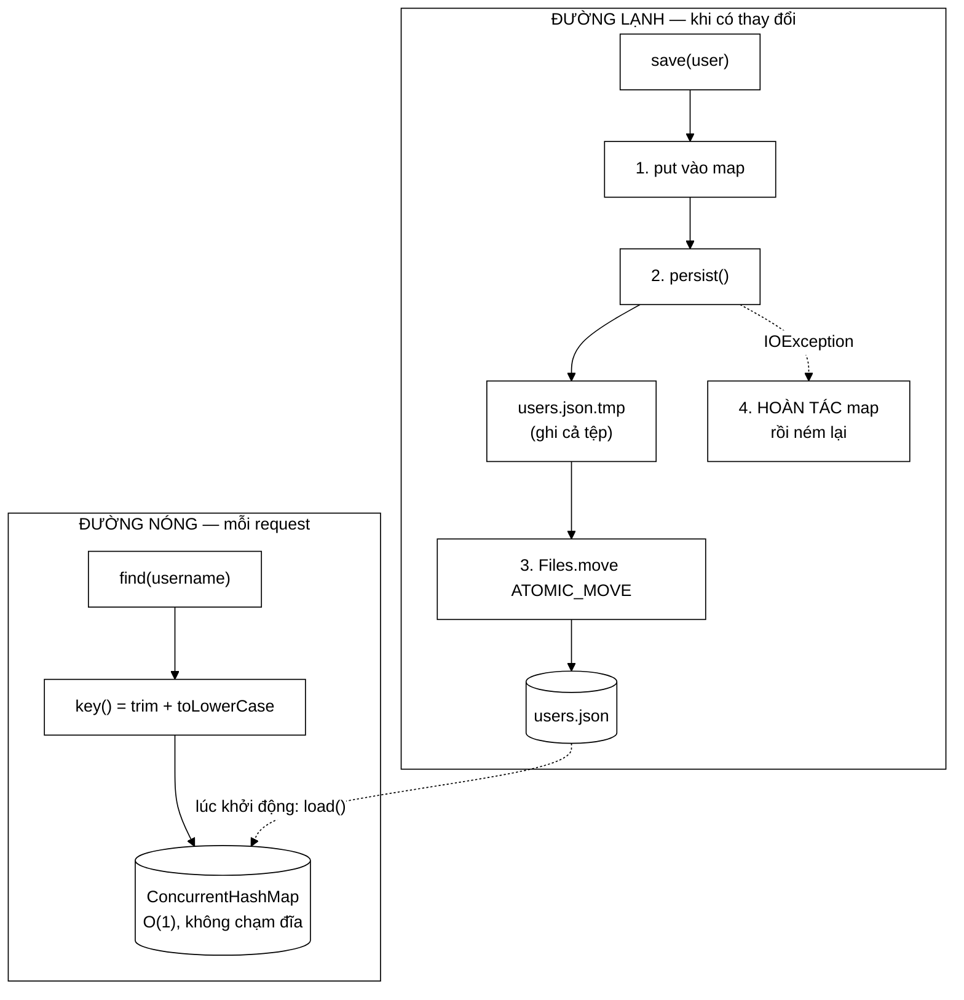

# JsonUserStore — một tệp JSON, nhưng không mất tài khoản khi mất điện

**File nguồn:** `search-engine/src/main/java/com/vnsearch/auth/JsonUserStore.java` (171 dòng)
**Gói:** `com.vnsearch.auth` · **Loại:** `final class implements UserStore`
**Cấu trúc dữ liệu:** `ConcurrentHashMap<String, User>` trong RAM + một tệp JSON trên đĩa
**Đọc kèm:** [`UserStore.md`](./UserStore.md) · [`User.md`](./User.md) · [`UserService.md`](./UserService.md)

---

## 📌 Hiểu trong 30 giây

Ba quyết định làm nên lớp này, và cả ba đều xoay quanh **tỉ lệ đọc/ghi**:

1. **Đọc từ RAM, ghi xuống đĩa.** Đọc xảy ra ở mỗi request có xác thực; ghi chỉ
   khi đăng ký / đổi vai trò / đăng nhập thành công. Tỉ lệ hàng nghìn trên một.
2. **Ghi ra tệp tạm rồi đổi tên.** Ghi đè trực tiếp có một cửa sổ mà mất điện
   sẽ để lại JSON cụt — tức là **mất toàn bộ tài khoản**.
3. **Bộ nhớ và đĩa phải luôn khớp.** Nếu ghi đĩa hỏng, bảng trong RAM được
   **hoàn tác** về đúng trạng thái đã ghi bền được.



```
   VÌ SAO KHÔNG GHI THẲNG ĐÈ LÊN users.json

   ── Ghi đè trực tiếp ─────────────────────────────────────────────
   t0  mở users.json ở chế độ ghi  → tệp bị CẮT VỀ 0 BYTE
   t1  ghi 4 KB đầu...
   t2  ✖ MẤT ĐIỆN
   t3  khởi động lại → users.json là JSON cụt → parse lỗi
       → KHÔNG AI ĐĂNG NHẬP ĐƯỢC, kể cả admin
       cửa sổ chết: toàn bộ thời gian ghi

   ── Tệp tạm + đổi tên (đang dùng) ────────────────────────────────
   t0  ghi users.json.tmp          → users.json KHÔNG BỊ ĐỘNG TỚI
   t1  ghi xong .tmp
   t2  ✖ MẤT ĐIỆN
   t3  khởi động lại → users.json vẫn là bản CŨ NGUYÊN VẸN
       → mất đúng thay đổi cuối, không mất kho tài khoản
       cửa sổ chết: gần bằng 0 (rename là nguyên tử)
```

---

## 1. Vấn đề lớp này giải quyết

Một hệ tài khoản có ba yêu cầu mâu thuẫn nhau:

| Yêu cầu | Nếu chỉ dùng tệp | Nếu chỉ dùng RAM | Cách kết hợp ở đây |
|---|---|---|---|
| Đọc nhanh (mỗi request) | ✗ mỗi lần mở tệp + parse | ✓ $O(1)$ | Đọc từ `ConcurrentHashMap` |
| Sống sót qua khởi động lại | ✓ | ✗ mất sạch | Ghi xuống JSON mỗi lần đổi |
| Chạy được ngay sau clone | ✓ | ✓ | Không cần CSDL ngoài |

Lớp này chọn giữ **cả hai bản sao** và chấp nhận trách nhiệm khó nhất: giữ
chúng khớp nhau, kể cả khi đĩa hỏng giữa chừng.

---

## 2. Bản đồ lớp

```
JsonUserStore
├── path    : Path                        ── vị trí users.json
├── mapper  : ObjectMapper                ── cấu hình 4 tuỳ chọn, mục 2.1
├── users   : ConcurrentHashMap<String,User>  ── khoá = tên đã hạ chữ thường
│
├── <init>(String)      ── dựng mapper rồi gọi load()
├── load()      private ── nạp tệp, BỎ QUA bản ghi hỏng
├── find        O(1)    ── không khoá, không chạm đĩa
├── findAll     O(n log n) ── sao chép + sắp theo createdAt (nullsLast)
├── save        synchronized ── put → persist → hoàn tác nếu hỏng
├── delete      synchronized ── remove → persist → hoàn tác nếu hỏng
├── count       O(1)
├── persist()   private ── ghi .tmp rồi ATOMIC_MOVE, có đường lui
└── key()       static  ── trim + toLowerCase(Locale.ROOT)
```

### 2.1 Bốn tuỳ chọn của `ObjectMapper` — dòng 68–76

Mỗi dòng cấu hình chặn một lỗi cụ thể, không dòng nào là thói quen:

```java
.registerModule(new JavaTimeModule())
.disable(SerializationFeature.WRITE_DATES_AS_TIMESTAMPS)
.disable(DeserializationFeature.FAIL_ON_UNKNOWN_PROPERTIES)
.enable(SerializationFeature.INDENT_OUTPUT);
```

| Dòng | Chặn lỗi gì | Nếu thiếu thì hỏng lúc nào |
|---|---|---|
| `JavaTimeModule` | `Instant` không tuần tự hoá được | **Lúc chạy**, ở lần đăng ký đầu tiên — không phải lúc biên dịch |
| `WRITE_DATES_AS_TIMESTAMPS` tắt | `createdAt` ghi thành `1755158400.000000000` | Tệp không đọc được bằng mắt, khó chẩn đoán sự cố |
| `FAIL_ON_UNKNOWN_PROPERTIES` tắt | Một trường lạ làm hỏng cả kho tài khoản | Khi hạ cấp phiên bản, hoặc ai đó sửa tay tệp |
| `INDENT_OUTPUT` | Tệp một dòng dài | `git diff` vô dụng, sửa tay không nổi |

Cấu hình thứ ba đáng nói nhất — nó là **chính sách tương thích ngược**:

```
   Phiên bản 2 thêm trường "mfaSecret" → users.json có trường đó
        │
        ├─ hạ cấp về phiên bản 1
        │
        ├─ FAIL_ON_UNKNOWN_PROPERTIES = true  → ✖ ứng dụng KHÔNG KHỞI ĐỘNG
        │                                        vì một trường nó không hiểu
        │
        └─ FAIL_ON_UNKNOWN_PROPERTIES = false → ✓ bỏ qua trường lạ, chạy tiếp
                                                  (trường đó mất khi ghi lại)
```

Nói cách khác: **không hiểu thì bỏ qua, đừng chết**. Đúng nguyên tắc Postel cho
dữ liệu cấu hình.

### 2.2 `load()` — bỏ qua bản ghi hỏng thay vì chết

```java
if (user.username() != null && user.passwordHash() != null) {
    users.put(key(user.username()), user);
} else {
    log.warn("Bo qua mot ban ghi tai khoan thieu truong trong {}", path);
}
```

Comment dòng 91–92 giải thích chính xác vì sao **bỏ qua** chứ không phải **nạp
rồi để đó**:

```
   Bản ghi thiếu passwordHash mà vẫn nạp:
        ├─ chiếm chỗ tên "admin" trong bảng
        ├─ authenticate() luôn thất bại (không có hash để so)
        └─ đăng ký lại "admin" cũng không được — tên đã bị chiếm
        ⇒ tài khoản ZOMBIE: không dùng được, không thay được

   Bỏ qua:
        └─ tên được giải phóng, đăng ký lại là xong
```

Nhưng chú ý: **`load()` vẫn ném `IOException` nếu cả tệp là JSON hỏng.** Dung
thứ ở mức từng bản ghi, không dung thứ ở mức cả tệp. Ranh giới này đúng — một
tệp không parse được nghĩa là ta *không biết* có bao nhiêu tài khoản, và khởi
động im lặng với kho rỗng thì `UserService` sẽ tạo tài khoản mồi, ghi đè lên
tệp, **xoá vĩnh viễn** dữ liệu đang hỏng nhưng có thể cứu được.

### 2.3 `key()` — 3 dòng chặn một lỗ hổng mạo danh

```java
private static String key(String username) {
    return username.trim().toLowerCase(Locale.ROOT);
}
```

```
   KHÔNG chuẩn hoá khoá:
        đã có tài khoản "admin" (quản trị viên thật)
        kẻ xấu đăng ký " Admin"  → hệ thống coi là tên khác → cho phép
        → hai dòng gần giống nhau trong danh sách quản trị
        → thao tác nhầm, tin nhắn mạo danh, kỹ thuật xã hội

   CÓ chuẩn hoá:
        key(" Admin") == key("admin")  → "tên đã tồn tại" → chặn
```

Chi tiết dễ bỏ sót: **`Locale.ROOT`**, không phải `toLowerCase()` không tham số.

```
   Máy đặt ngôn ngữ Thổ Nhĩ Kỳ (tr-TR):
        "ADMIN".toLowerCase()            → "admın"   (chữ i không chấm!)
        "ADMIN".toLowerCase(Locale.ROOT) → "admin"   ✓

   ⇒ Cùng một tệp users.json, hai máy khác locale hiểu khác nhau.
      Lỗi này nổi tiếng tới mức có tên riêng: "Turkish i problem".
```

Đây là loại chi tiết đáng nêu trong buổi bảo vệ: nó cho thấy tác giả phân biệt
được *chuẩn hoá để hiển thị* và *chuẩn hoá để làm khoá*.

### 2.4 `findAll()` — sắp xếp với `nullsLast`

```java
all.sort(Comparator.comparing(User::createdAt,
        Comparator.nullsLast(Comparator.naturalOrder())));
```

`createdAt` về nguyên tắc luôn có, nhưng tệp có thể do phiên bản cũ ghi ra hoặc
do người sửa tay. Không có `nullsLast`, một `null` duy nhất làm trang quản trị
gãy bằng `NullPointerException` — **sau khi** đã qua xác thực, tức là lỗi 500
chứ không phải lỗi hiển thị.

Lưu ý phụ: `findAll()` cũng là hàm mà `persist()` dùng để sinh nội dung tệp.
Nên tệp trên đĩa **luôn được sắp thứ tự** — `git diff` trên `users.json` chỉ
hiện đúng dòng thay đổi, không xáo trộn cả tệp.

---

## 3. Hướng dẫn về code

### 3.1 `persist()` — đọc từng dòng

```java
private void persist() throws IOException {
    Path parent = path.toAbsolutePath().getParent();
    if (parent != null) {
        Files.createDirectories(parent);        // ① thư mục có thể chưa tồn tại
    }
    Path temp = path.resolveSibling(path.getFileName() + ".tmp");   // ② CÙNG thư mục
    mapper.writeValue(temp.toFile(), findAll());                    // ③ ghi bản đầy đủ
    try {
        Files.move(temp, path,
                StandardCopyOption.REPLACE_EXISTING,
                StandardCopyOption.ATOMIC_MOVE);                    // ④ nguyên tử
    } catch (AtomicMoveNotSupportedException e) {
        Files.move(temp, path, StandardCopyOption.REPLACE_EXISTING); // ⑤ đường lui
    }
}
```

**② `resolveSibling` — vì sao tệp tạm phải nằm cùng thư mục.** Đây là chi tiết
kỹ thuật quyết định tính đúng đắn của toàn bộ cơ chế:

```
   .tmp ở %TEMP% (khác ổ đĩa / khác phân vùng):
        rename giữa hai hệ thống tệp là KHÔNG THỂ nguyên tử
        → hệ điều hành âm thầm biến nó thành copy + delete
        → quay lại đúng cửa sổ chết mà ta muốn tránh

   .tmp ở cùng thư mục (đang dùng):
        cùng phân vùng → rename chỉ là đổi một con trỏ trong bảng thư mục
        → nguyên tử thật
```

**⑤ Đường lui khi không nguyên tử được.** Comment dòng 162–163 nói rõ đánh đổi:
một số hệ thống tệp (ổ mạng, vài cấu hình Windows) không hứa nguyên tử. Lựa
chọn ở đây là **vẫn ghi được, chỉ mất bảo đảm** — thay vì từ chối hoạt động.
Đúng cho một hệ tài khoản: không ghi được nghĩa là không ai đăng ký được.

> ⚠️ **Giới hạn còn lại:** `ATOMIC_MOVE` bảo đảm *thứ tự nhìn thấy được* của
> thao tác đổi tên, nhưng **không** ép dữ liệu của `.tmp` xuống đĩa vật lý.
> Trong kịch bản mất điện đột ngột, vẫn có khả năng tệp mới rỗng. Muốn chặt
> chẽ hoàn toàn cần `FileChannel.force(true)` trên tệp tạm **và** trên thư mục
> cha trước khi đổi tên. Xem đề xuất 1 ở mục 6.

### 3.2 Hoàn tác khi ghi hỏng — bất biến quan trọng nhất của lớp

```java
public synchronized void save(User user) throws IOException {
    User previous = users.put(key(user.username()), user);
    try {
        persist();
    } catch (IOException e) {
        if (previous == null) {
            users.remove(key(user.username()));   // vốn chưa có → xoá đi
        } else {
            users.put(key(user.username()), previous);  // vốn đã có → trả về bản cũ
        }
        throw e;
    }
}
```

Bất biến được giữ: **bảng trong RAM luôn bằng nội dung tệp trên đĩa.**

```
   KHÔNG hoàn tác (bug kinh điển):
        t0  đăng ký "kiet" → map có "kiet"
        t1  persist() hỏng (đĩa đầy) → IOException
        t2  RAM: có "kiet"        ĐĨA: không có "kiet"   ← LỆCH
        t3  kiet đăng nhập được, dùng bình thường cả ngày
        t4  khởi động lại máy chủ → "kiet" BIẾN MẤT
            → người dùng mất tài khoản mà không hiểu vì sao

   CÓ hoàn tác:
        t2  RAM: không có "kiet"  ĐĨA: không có "kiet"   ← khớp
        t2' controller nhận IOException → trả 500 → người dùng thử lại
            Thất bại NGAY và RÕ, tốt hơn thành công giả rồi mất sau.
```

Cùng logic ở `delete()`. Đây là ví dụ sạch của **compensating action** — không
có transaction thật thì tự viết đường lui.

### 3.3 Mô hình đồng bộ: hai cơ chế cho hai loại truy cập

| | Đọc (`find`, `count`, `findAll`) | Ghi (`save`, `delete`) |
|---|---|---|
| Cơ chế | Không khoá — `ConcurrentHashMap` tự lo | `synchronized` trên chính đối tượng |
| Vì sao | Chạy ở mọi request, không được chờ nhau | Phải tuần tự hoá việc ghi tệp |
| Hệ quả | Nhiều luồng đọc song song thoải mái | Hai lần ghi không bao giờ chồng lên nhau |

Nếu `save` **không** `synchronized`:

```
   Luồng A: writeValue(.tmp)  ─────────┐
   Luồng B:      writeValue(.tmp) ─────┤ ← hai luồng ghi CÙNG một tệp .tmp
   Luồng A:            move(.tmp → json)
   Luồng B:                 move(.tmp → json)  ← tệp đã bị A chuyển đi
                                                 → NoSuchFileException
                                                 hoặc tệp lai giữa hai bản
```

Đọc **không** bị `synchronized` chặn (chúng không vào khối đồng bộ), nên đường
nóng không bao giờ phải chờ một lần ghi đĩa. Đây là điểm mấu chốt của thiết kế:
**đúng khoá ở đúng chỗ, không khoá cả lớp.**

### 3.4 Cạm bẫy khi sửa lớp này

| Cạm bẫy | Hậu quả | Cách đúng |
|---|---|---|
| Bỏ `synchronized` khỏi `save` để "nhanh hơn" | Hỏng tệp lúc ghi đồng thời | Giữ nguyên; ghi vốn đã hiếm |
| Đặt tệp `.tmp` ở `System.getProperty("java.io.tmpdir")` | Mất tính nguyên tử | Luôn dùng `resolveSibling` |
| Thêm `users.put` ở nơi khác ngoài `save` | Phá bất biến RAM = đĩa | Mọi đường ghi phải qua `save` |
| Trả thẳng `users.values()` trong `findAll` | Người gọi sửa được bảng nội bộ | Giữ `new ArrayList<>(...)` như hiện tại |
| Nuốt `IOException` trong `save` | Thành công giả — mục 3.2 | Để nó nổi lên tầng trên |
| `toLowerCase()` không có `Locale.ROOT` | Lỗi Turkish i — mục 2.3 | Luôn ghi rõ `Locale.ROOT` |

---

## 4. Độ phức tạp & chi phí

Gọi $n$ = số tài khoản (thực tế: hàng chục).

| Thao tác | Thời gian | Chạm đĩa | Tần suất thực tế |
|---|---|---|---|
| `find` | $O(1)$ | Không | **Mỗi request có xác thực** |
| `count` | $O(1)$ | Không | Một lần lúc khởi động |
| `findAll` | $O(n\log n)$ | Không | Mỗi lần mở trang quản trị |
| `save` | $O(n\log n)$ + ghi cả tệp | 1 lần ghi + 1 rename | Đăng ký, đổi vai trò, mỗi lần đăng nhập |
| `delete` | $O(n\log n)$ + ghi cả tệp | 1 lần ghi + 1 rename | Rất hiếm |
| `load` (khởi động) | $O(n)$ | 1 lần đọc | Một lần |

**Ghi lại toàn bộ tệp mỗi lần thay đổi** là đánh đổi có ý thức (Javadoc dòng
42–49). Nó chỉ đúng ở quy mô nhỏ:

```
   n = 50 tài khoản   → ~12 KB   → ~1 ms      ✓ không ai nhận ra
   n = 5.000          → ~1,2 MB  → ~50 ms     ⚠ bắt đầu thấy khi đăng nhập
   n = 500.000        → ~120 MB  → ~5 s       ✖ hoàn toàn không dùng được

   Chi phí ghi là O(n) cho MỘT thay đổi — tổng cộng O(n²) cho n lần đăng ký.
```

Ngưỡng đổi sang PostgreSQL nằm ở khoảng **vài nghìn tài khoản**, và nhờ
[`UserStore`](./UserStore.md) là interface, việc đổi chỉ là thêm một lớp.

Một chi tiết dễ bỏ qua về tần suất: **đăng nhập thành công cũng ghi tệp** (vì
`UserService` cập nhật `lastLoginAt`). Nghĩa là `save` không hiếm như cảm giác
ban đầu — nó chạy ở **mỗi lần đăng nhập**, không chỉ khi đăng ký.

Bộ nhớ: $n \times$ (~200 byte cho `User` + chuỗi) — 50 tài khoản ≈ 10 KB, không
đáng kể so với chỉ mục.

---

## 5. Kiểm thử liên quan

| Test | Bảo vệ điều gì |
|---|---|
| `test/java/com/vnsearch/auth/JsonUserStoreTest.java` | Ghi rồi đọc lại đúng; không phân biệt hoa thường; `delete` trả đúng `boolean` |
| `test/java/com/vnsearch/auth/UserServiceTest.java` | Tầng trên dùng store đúng hợp đồng |
| `test/java/com/vnsearch/auth/AccountAuthorizationTest.java` | Đường đi đầy đủ từ HTTP |

```powershell
cd search-engine
.\mvnw.cmd -q -Dtest='JsonUserStoreTest' test
```

Kiểm tra bằng tay tính nguyên tử — cần một tệp lớn để kịp ngắt:

```powershell
# 1. Tạo nhiều tài khoản, rồi trong lúc đăng ký lần cuối, kết thúc tiến trình
Get-Content search-engine\data\users.json | ConvertFrom-Json | Measure-Object
# 2. Khởi động lại và xác nhận tệp vẫn parse được
# Đúng: số tài khoản là con số cũ. Sai: exception lúc khởi động.
```

Hai kịch bản **chưa** có test tự động, và đáng được bổ sung:

```java
// 1. persist() hỏng thì map phải được hoàn tác
JsonUserStore store = new JsonUserStore(thuMucChiDoc + "/users.json");
assertThrows(IOException.class, () -> store.save(user));
assertTrue(store.find("kiet").isEmpty());   // ← bất biến RAM = đĩa

// 2. Bản ghi hỏng bị bỏ qua, không làm chết load()
Files.writeString(p, """[{"username":"a"},{"username":"b","passwordHash":"x"}]""");
assertEquals(1, new JsonUserStore(p.toString()).count());
```

---

## 6. Liên kết

- Hợp đồng phải tuân thủ: [`UserStore.md`](./UserStore.md)
- Kiểu được lưu: [`User.md`](./User.md) · [`Role.md`](./Role.md)
- Người gọi duy nhất: [`UserService.md`](./UserService.md)
- Khuôn mẫu ghi nguyên tử tương tự ở tầng chỉ mục: `docs2/main/java/com/vnsearch/index/IndexPersistence.md`
- Cấu hình đường dẫn tệp: `docs/CONFIGURATION.md`
