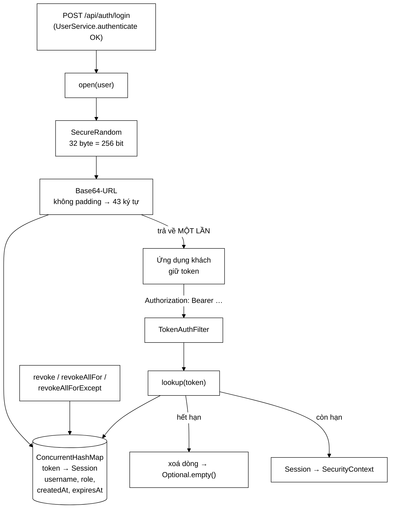

# SessionStore — vì sao dự án này cố tình *không* dùng JWT

**File nguồn:** `search-engine/src/main/java/com/vnsearch/auth/SessionStore.java` (210 dòng)
**Gói:** `com.vnsearch.auth` · **Loại:** `class` giữ trạng thái, an toàn đa luồng
**Cấu trúc dữ liệu:** `ConcurrentHashMap<String token, Session>` — chỉ trong RAM, không ghi đĩa
**Người dùng:** `AuthController`, `AdminUserController`, `TokenAuthFilter`, `AdminAnalyticsController`
**Đọc kèm:** [`TokenAuthFilter.md`](./TokenAuthFilter.md) · [`UserService.md`](./UserService.md) · [`User.md`](./User.md)

---

## 📌 Hiểu trong 30 giây

Một bảng băm ánh xạ **token ngẫu nhiên 256 bit → thông tin phiên**. Không ký,
không mã hoá, không tự mô tả: token là một chuỗi **vô nghĩa** (opaque), mọi ý
nghĩa nằm ở bảng phía máy chủ.

Đó là lựa chọn đi ngược mặc định của ngành (JWT), và Javadoc dòng 17–50 dành
hẳn một bảng để bảo vệ nó. Lý do gói gọn trong một câu: **cái lợi duy nhất của
JWT là xác minh không cần trạng thái, mà lợi ích đó chỉ có giá trị khi có nhiều
bản sao máy chủ — hệ thống này chỉ có một.**



```
   ĐĂNG XUẤT: KHÁC BIỆT CỐT LÕI

   ── JWT ──────────────────────────────────────────────────────────
   t0   người dùng bấm "Đăng xuất"
   t0   máy chủ… không làm được gì. Token đã ký vẫn hợp lệ.
   t0+  kẻ đã sao chép token vẫn dùng được tới khi HẾT HẠN
        muốn thu hồi ngay → phải có danh sách đen
        → danh sách đen LÀ TRẠNG THÁI → mất đúng ưu điểm của JWT

   ── Token mờ (đang dùng) ─────────────────────────────────────────
   t0   sessions.remove(token)
   t0+  request tiếp theo với token đó → 401
        Một phép xoá. Hiệu lực tức thì.
```

---

## 1. Vấn đề lớp này giải quyết

Hệ thống có một trang quản trị **điều khiển được crawler**: bấm nút là hàng
chục nghìn request đi ra Internet. Hai năng lực trở thành yêu cầu bắt buộc, chứ
không phải tính năng cho đẹp:

| Năng lực cần | JWT làm được? | Vì sao ở đây bắt buộc |
|---|---|---|
| **Thu hồi tức thì** | ✗ (cần danh sách đen) | Máy tính của quản trị viên bị mất/bị chiếm → phải cắt ngay |
| **Hạ quyền tức thì** | ✗ (vai trò nằm trong token) | Hạ một người từ ADMIN xuống USER mà họ vẫn chạy được crawl tới 12 tiếng sau là không chấp nhận được |

Bảng so sánh trong Javadoc rất thẳng thắn ở chỗ nó **cũng liệt kê cái mất**:

> Nhiều bản sao máy chủ: JWT chạy được ngay; token mờ cần kho dùng chung (Redis)
> — *chưa* cần ở đây.

Và hệ quả được nói toạc ra ở dòng 48–50:

> **Khởi động lại máy chủ là mọi người bị đăng xuất.** Đúng chỗ để sửa khi cần
> là thay bảng băm này bằng Redis, không phải đổi sang JWT.

Câu cuối là phần giá trị nhất của cả đoạn: nó chỉ sẵn **đường nâng cấp** và nói
rõ đường nào là sai. Với một hội đồng chấm, "tôi biết giới hạn của mình ở đâu
và biết sửa thế nào" mạnh hơn hẳn "tôi dùng JWT vì ai cũng dùng".

---

## 2. Bản đồ lớp

```
SessionStore
├── SESSION_HOURS = 12       ── public: TokenAuthFilter/UI đọc để hiển thị
├── MAX_SESSIONS  = 10_000   ── trần chống rò bộ nhớ
├── TOKEN_BYTES   = 32       ── private: 32 byte = 256 bit
│
├── record Session(username, role, createdAt, expiresAt)
│
├── random   : SecureRandom            ── nguồn ngẫu nhiên mã hoá
├── sessions : ConcurrentHashMap       ── token → Session
├── clock    : Clock                   ── TIÊM VÀO, không dùng Instant.now()
│
├── open(User)                 → String token   ── có kiểm tra trần
├── lookup(String)             → Optional<Session>  ── dọn phiên hết hạn tại chỗ
├── revoke(String)             → boolean        ── đăng xuất một phiên
├── revokeAllFor(String)       → int            ── hạ quyền / vô hiệu hoá / xoá
├── revokeAllForExcept(String, String) → int    ── đổi mật khẩu
├── activeCount()              → int            ── bảng điều khiển
├── activeSessions()           → List<Session>  ── KHÔNG kèm token
└── purgeExpired(Instant)      private
```

### 2.1 Sinh token — ba cách sai và một cách đúng

```java
byte[] bytes = new byte[TOKEN_BYTES];       // 32 byte
random.nextBytes(bytes);                     // SecureRandom
String token = Base64.getUrlEncoder().withoutPadding().encodeToString(bytes);
```

Javadoc dòng 54–59 loại bỏ từng phương án thay thế, và mỗi lý do là một lỗ hổng
thật:

| Cách | Số bit | Vì sao sai |
|---|---|---|
| `new Random().nextLong()` | 64 | **Sinh giả ngẫu nhiên**: đoán được trạng thái nội bộ sau vài mẫu ⇒ đoán được token tiếp theo |
| `UUID.randomUUID()` | 122 | Nguồn an toàn nhưng có **cấu trúc cố định** (phiên bản, biến thể) và ngắn hơn; nó là *định danh*, không phải *bí mật* |
| `System.nanoTime()` + hash | ~vài chục | Đoán được trong cửa sổ hẹp nếu biết thời điểm đăng nhập |
| **`SecureRandom` 256 bit** | 256 | ✓ |

Vì sao 256 bit là "đủ mãi mãi":

```
   Không gian: 2^256 ≈ 1,16 × 10^77 token

   Giả sử kẻ tấn công thử 1 TỈ token mỗi giây, liên tục:
        thời gian để quét 1% không gian ≈ 3,7 × 10^58 NĂM
        tuổi vũ trụ                      ≈ 1,4 × 10^10 năm

   ⇒ dò ngẫu nhiên không phải là một hướng tấn công.
      Điểm yếu thật nằm ở chỗ khác: token bị lộ khi truyền, khi lưu, khi ghi log.
```

Chi tiết nhỏ nhưng thiết thực: **`getUrlEncoder().withoutPadding()`**.

```
   Base64 thường:      "ab+cd/ef=="   ← có +, /, = → phải mã hoá URL
                        └ dán vào URL hoặc header là hỏng, khó chẩn đoán

   Base64-URL không padding: "ab-cd_ef"  ← chỉ A–Z a–z 0–9 - _
                        └ an toàn trong URL, header, cookie, tên tệp
                        43 ký tự cho 32 byte
```

### 2.2 `Clock` được tiêm — và vì sao đó là quyết định về **khả năng kiểm thử**

```java
private final Clock clock;
public SessionStore(Clock clock) { this.clock = clock; }
```

Không có `Instant.now()` nào trong lớp. Hệ quả:

```
   Dùng Instant.now() trực tiếp:
        muốn test "phiên hết hạn sau 12 giờ"
        → Thread.sleep(12 * 3600 * 1000)   ← 12 TIẾNG cho một test
        → hoặc dùng thư viện chỉnh giờ hệ thống → mong manh, chậm, hay hỏng CI

   Dùng Clock tiêm vào:
        Clock gia = Clock.fixed(t0, ZoneOffset.UTC);
        ... mở phiên ...
        gia = Clock.fixed(t0.plus(13, HOURS), ZoneOffset.UTC);
        assertTrue(store.lookup(token).isEmpty());   ← chạy trong 0 mili giây
```

Đây chính là cách `SessionStoreTest.java` kiểm tra hết hạn. Một dòng thiết kế
đổi lấy toàn bộ khả năng test hành vi theo thời gian.

### 2.3 `MAX_SESSIONS` — chống rò bộ nhớ, và cách chạm trần cho đúng

Javadoc dòng 71–75 mô tả chính xác vấn đề: mỗi lần đăng nhập tạo một dòng, và
**không có gì bắt người dùng phải đăng xuất**. Đóng tab trình duyệt không gọi
`revoke`. Nên nếu không có trần, bảng lớn mãi theo tổng số lần đăng nhập từ lúc
khởi động.

```java
if (sessions.size() >= MAX_SESSIONS) {
    purgeExpired(now);                        // ① thử dọn trước
    if (sessions.size() >= MAX_SESSIONS) {
        throw new IllegalStateException(...); // ② vẫn đầy → TỪ CHỐI phiên mới
    }
}
```

Bước ② là chỗ đáng bàn nhất. Có hai cách xử lý khi chạm trần, và lựa chọn ở đây
là có chủ đích:

```
   ── Đẩy phiên cũ nhất ra (LRU) — KHÔNG chọn ──────────────────────
   người dùng đang làm việc bỗng bị đăng xuất giữa chừng
   không có thông báo, không có lý do, mất dữ liệu đang nhập dở
   người bị ảnh hưởng là NGƯỜI VÔ TỘI, kẻ gây đầy bảng thì vẫn ở trong

   ── Từ chối phiên mới (đang dùng) ────────────────────────────────
   người mới đăng nhập nhận thông báo RÕ RÀNG
   người đang làm việc không bị ảnh hưởng
   quản trị viên nhìn thấy vấn đề và xử lý được
```

Nguyên tắc: **khi phải từ chối, hãy từ chối việc chưa bắt đầu, đừng huỷ việc
đang diễn ra.**

> ⚠️ Nhưng có một cái bẫy vận hành: nếu bảng đầy vì bị tấn công (10.000 lần
> đăng nhập thành công), thì **quản trị viên cũng không đăng nhập được** để xử
> lý. Xem đề xuất 2 ở mục 6.

Ước tính bộ nhớ ở trần: `10.000 × (43 ký tự token + Session ~120 byte) ≈ 2 MB`
— không đáng kể, nên trần này rộng rãi một cách thoải mái.

### 2.4 Dọn phiên hết hạn "khi bị tra tới" (lazy expiration)

Javadoc dòng 120–123 giải thích vì sao không có luồng dọn dẹp định kỳ:

| | Dọn lười (đang dùng) | Luồng dọn định kỳ |
|---|---|---|
| Số luồng thêm | 0 | 1 (+ vòng đời, + tắt đúng cách) |
| Chi phí | $O(1)$ ghép vào `lookup` sẵn có | $O(n)$ mỗi chu kỳ, kể cả khi rỗng |
| Phiên không ai tra tới | Nằm lại tới khi `activeCount()`/trần dọn | Bị dọn đúng hạn |
| Độ chính xác của `activeCount()` | Chính xác — có gọi `purgeExpired` trước | Chính xác |

Phiên hết hạn nằm lại **không phải lỗ hổng bảo mật**: `lookup` kiểm tra
`expiresAt` trước khi trả về, nên nó không dùng được. Nó chỉ chiếm một dòng
bảng, và `MAX_SESSIONS` đã chặn phần đó.

Chú ý thứ tự kiểm tra trong `lookup`:

```java
if (!clock.instant().isBefore(session.expiresAt())) {   // "KHÔNG trước" = đã tới hoặc quá hạn
    sessions.remove(token);
    return Optional.empty();
}
```

`!now.isBefore(expiresAt)` thay vì `now.isAfter(expiresAt)` — khác nhau đúng
một trường hợp: `now == expiresAt`. Cách viết hiện tại coi thời điểm đó là **đã
hết hạn**. Đúng hướng: khi lưỡng lự về ranh giới của một phiên bảo mật, nghiêng
về phía đóng.

### 2.5 Ba mức thu hồi — và tình huống nào dùng mức nào

```
   revoke(token)                        ── 1 phiên
        └ "Đăng xuất" trên thiết bị này          AuthController:113

   revokeAllForExcept(username, keep)   ── mọi phiên TRỪ phiên hiện tại
        └ Đổi mật khẩu                          AuthController:167
        └ "Đăng xuất khỏi thiết bị khác"

   revokeAllFor(username)               ── TẤT CẢ, kể cả phiên hiện tại
        └ Hạ vai trò                            AdminUserController:78
        └ Vô hiệu hoá tài khoản                 AdminUserController:90
        └ Xoá tài khoản                         AdminUserController:124
        └ "Đăng xuất mọi nơi" do chính chủ bấm  AuthController:187
```

Lý lẽ cho `revokeAllForExcept` ở Javadoc dòng 169–173 rất đáng đọc:

> Lý do phổ biến nhất để đổi mật khẩu là *nghi ngờ có người khác đang dùng tài
> khoản của mình*. Đổi mật khẩu mà không đóng phiên khác thì kẻ kia vẫn ở
> trong, và người dùng tưởng mình đã an toàn.

Vế cuối là mấu chốt: **cảm giác an toàn sai còn tệ hơn không an toàn**, vì nó
làm người dùng ngừng đề phòng.

Và vì sao *trừ* phiên hiện tại: đá luôn người vừa đổi mật khẩu ra khỏi chính
thiết bị họ đang ngồi là một thao tác gây bực bội mà **không** tăng chút an
toàn nào — phiên đó vừa mới xác thực lại bằng mật khẩu cũ.

### 2.6 `activeSessions()` — "KHÔNG kèm token"

```java
public List<Session> activeSessions() {
    purgeExpired(clock.instant());
    return List.copyOf(sessions.values());   // values(), KHÔNG phải entrySet()
}
```

Token là **khoá** của bảng; trả `values()` nghĩa là khoá không đi kèm. Cùng
tinh thần với `User.toPublic()` ở [`User.md`](./User.md): dữ liệu nhạy cảm
không có đường đi ra ngoài, chứ không phải "nhớ đừng gửi".

`List.copyOf` cho danh sách bất biến — người gọi không sửa được, và cũng không
bị `ConcurrentModificationException` nếu có luồng khác đang mở phiên mới.

---

## 3. Hướng dẫn về code

### 3.1 Quy tắc số một: token không bao giờ vào log

Javadoc dòng 96–97 ghi rõ: token "tương đương mật khẩu cho tới lúc hết hạn".

```java
// ❌ Mọi dòng dưới đây đều là lỗ hổng
log.info("Mo phien: token={}", token);
log.debug("Request headers: {}", request.getHeaderNames());   // gián tiếp
throw new IllegalStateException("Token khong hop le: " + token);

// ✅
log.info("Mo phien cho '{}'", forLog(username));
```

Vì sao nghiêm trọng: file log thường có quyền đọc rộng hơn CSDL, được gửi cho
bên thứ ba để phân tích, và **được giữ lâu hơn tuổi thọ của token**.

Cách kiểm tra:

```powershell
Select-String -Path search-engine\src\main\java\com\vnsearch\**\*.java -Pattern 'log\.\w+\(.*token'
# Không có kết quả = đúng
```

### 3.2 Đọc `revokeAllFor` — vì sao dùng `Iterator` chứ không `removeIf`

```java
Iterator<Map.Entry<String, Session>> it = sessions.entrySet().iterator();
while (it.hasNext()) {
    if (it.next().getValue().username().equalsIgnoreCase(username)) {
        it.remove();
        removed++;
    }
}
```

`sessions.entrySet().removeIf(...)` ngắn hơn nhưng **không trả về số phần tử đã
xoá** — nó chỉ trả `boolean`. Con số đó lại là thứ giao diện hiển thị ("đã đóng
3 phiên"), nên `Iterator` là lựa chọn đúng chứ không phải cổ lỗ.

Chú ý `equalsIgnoreCase`: nhất quán với quy tắc "tên không phân biệt hoa
thường" của [`UserStore`](./UserStore.md). `SessionStoreTest:123` có test riêng
cho điều này.

> ⚠️ **Sao không so bằng khoá đã chuẩn hoá?** `Session.username` được lưu từ
> `User.username()` — vốn đã hạ chữ thường bởi `UserService.normalize`. Nên
> `equalsIgnoreCase` ở đây là lớp bảo vệ thứ hai, không phải lớp duy nhất. Giữ
> nó là đúng: chi phí bằng không, và nó bảo vệ cả trường hợp có người mở phiên
> bằng đường khác trong tương lai.

### 3.3 Cạm bẫy khi sửa lớp này

| Cạm bẫy | Hậu quả | Cách đúng |
|---|---|---|
| Cho `Session` thêm trường `token` | Token lọt vào `activeSessions()` → ra API quản trị | Giữ token chỉ làm khoá |
| Dùng `Instant.now()` cho tiện | Không test được hành vi hết hạn | Luôn qua `clock` |
| Bỏ kiểm tra `MAX_SESSIONS` | Rò bộ nhớ theo số lần đăng nhập | Giữ nguyên |
| So token bằng `String.equals` trong vòng lặp tuyến tính | Về lý thuyết lộ thông tin qua thời gian | Hiện tại tra bằng hash — không có vòng lặp; đừng đổi |
| Rút `SESSION_HOURS` xuống rất ngắn "cho an toàn" | Người dùng bị đăng xuất liên tục → họ tìm cách lách | 12 giờ là cân bằng hợp lý cho công cụ nội bộ |
| Đổi `!isBefore` thành `isAfter` | Phiên sống thêm đúng một khoảnh khắc ở biên | Giữ nguyên — xem 2.4 |

### 3.4 Nâng cấp sang Redis (khi thật sự cần nhiều bản sao)

Đường nâng cấp mà Javadoc chỉ ra, cụ thể hoá:

```java
public interface SessionRepository {
    void put(String token, Session s, Duration ttl);
    Optional<Session> get(String token);
    boolean remove(String token);
    int removeByUsername(String username, String keepToken);
}
```

Rồi `SessionStore` giữ nguyên **toàn bộ** phần logic (sinh token, kiểm tra
trần, chính sách thu hồi) và chỉ đổi chỗ lưu. Lưu ý khi cài Redis:

- Dùng `SETEX` với TTL = `SESSION_HOURS` ⇒ Redis tự dọn, bỏ được `purgeExpired`.
- `removeByUsername` cần một chỉ mục phụ `user:<name> → set<token>`; quét toàn
  bộ khoá bằng `KEYS *` là điều **không** được làm trên Redis sản phẩm.
- `MAX_SESSIONS` chuyển thành giới hạn theo từng tài khoản, hợp lý hơn khi có
  nhiều bản sao.

---

## 4. Độ phức tạp & chi phí

Gọi $n$ = số phiên đang mở (trần 10.000).

| Thao tác | Thời gian | Ghi chú |
|---|---|---|
| `open` | $O(1)$ trung bình | Cộng ~1 µs cho `SecureRandom`; **$O(n)$ khi chạm trần** vì phải dọn |
| `lookup` | $O(1)$ | **Đường nóng — mỗi request có xác thực** |
| `revoke` | $O(1)$ | |
| `revokeAllFor` / `…Except` | $O(n)$ | Quét toàn bảng; hiếm khi gọi |
| `activeCount` / `activeSessions` | $O(n)$ | Có `purgeExpired` bên trong |
| `purgeExpired` | $O(n)$ | |

Đặt cạnh nhau để thấy tỉ lệ đúng:

```
   lookup      ~ 0,0001 ms   × hàng nghìn lần/phút     ← phải là O(1)
   open        ~ 0,01 ms     × vài lần/giờ
   BCrypt      ~ 250 ms      × vài lần/giờ   ← chi phí THẬT của đăng nhập
   revokeAllFor ~ 0,1 ms     × vài lần/ngày

   ⇒ Chi phí toàn bộ SessionStore nhỏ hơn MỘT lần băm BCrypt.
```

Bộ nhớ: mỗi phiên ≈ 43 byte token + `Session` (2 tham chiếu + 2 `Instant`) +
chi phí `ConcurrentHashMap` ≈ **200 byte**. Ở trần: ~2 MB.

**Điểm dừng của thiết kế:** khi cần chạy nhiều hơn một bản sao máy chủ. Không
phải khi $n$ lớn — bảng băm chịu được hàng triệu dòng — mà khi hai tiến trình
không thấy bảng của nhau.

---

## 5. Kiểm thử liên quan

| Test | Bảo vệ điều gì |
|---|---|
| `test/java/com/vnsearch/auth/SessionStoreTest.java` | Hết hạn theo `Clock` giả; `revoke` trả đúng `boolean`; `revokeAllFor` không phân biệt hoa thường (dòng 123); `revokeAllForExcept` giữ đúng phiên (dòng 144) và xử lý `keepToken = null` (dòng 157) |
| `test/java/com/vnsearch/auth/AccountAuthorizationTest.java` | Đường đi đầy đủ: đăng nhập → gọi API → đăng xuất → 401 |

```powershell
cd search-engine
.\mvnw.cmd -q -Dtest='SessionStoreTest' test
```

Kiểm tra bằng tay tính thu hồi tức thì — đây là *lý do tồn tại* của thiết kế:

```powershell
$t = (curl -s -X POST http://localhost:8080/api/auth/login `
      -H "Content-Type: application/json" `
      -d '{"username":"kiet","password":"matkhau123"}' | ConvertFrom-Json).token

curl -s -H "Authorization: Bearer $t" http://localhost:8080/api/auth/me      # 200
curl -s -X POST -H "Authorization: Bearer $t" http://localhost:8080/api/auth/logout
curl -s -i -H "Authorization: Bearer $t" http://localhost:8080/api/auth/me   # 401 NGAY
#                                                    ↑ với JWT, dòng này vẫn 200
```

Kịch bản **chưa** có test tự động và đáng bổ sung: chạm trần `MAX_SESSIONS`.

```java
// Với MAX_SESSIONS tiêm vào được, test này chỉ vài dòng
for (int i = 0; i < MAX_SESSIONS; i++) store.open(user);
assertThrows(IllegalStateException.class, () -> store.open(user));
```

Hiện `MAX_SESSIONS` là hằng số `public static final`, nên test phải mở 10.000
phiên thật — chậm nhưng vẫn khả thi (~vài trăm mili giây).

---

## 6. Chấm theo chuẩn doanh nghiệp

| Tiêu chí | Điểm | Nhận xét |
|---|---|---|
| Mức độ an toàn mã hoá | 10/10 | 256 bit từ `SecureRandom`; loại bỏ đúng ba cách sai phổ biến |
| Lập luận thiết kế | 10/10 | Bảng so sánh JWT nêu cả cái mất, và chỉ sẵn đường nâng cấp |
| Chính sách thu hồi | 9/10 | Ba mức phủ đúng các tình huống thật; `…Except` cho đổi mật khẩu rất chỉn chu |
| Khả năng kiểm thử | 9/10 | `Clock` tiêm vào biến test hết hạn thành tức thời |
| Sẵn sàng vận hành | 5/10 | Chỉ trong RAM: khởi động lại = đăng xuất toàn bộ; không chạy nhiều bản sao được |
| Chống lạm dụng | 7/10 | Có trần, nhưng chạm trần thì admin cũng bị chặn |
| Hiệu năng | 10/10 | $O(1)$ trên đường nóng, chi phí không đáng kể |

**Ba đề xuất nâng lên mức sản phẩm:**

1. **Tách `SessionRepository`** (mục 3.4) để bản Redis vào được mà không đụng
   logic. Đây là bước duy nhất chặn hệ thống khỏi chạy nhiều bản sao — cũng là
   giới hạn mà chính Javadoc đã tự nhận.
2. **Trần theo từng tài khoản** (ví dụ 20 phiên/người) song song với trần tổng.
   Hiện tại một tài khoản bị lạm dụng có thể chiếm hết 10.000 dòng và **khoá cả
   quản trị viên ra ngoài** — kịch bản từ chối dịch vụ ở mục 2.3.
3. **Gia hạn trượt (sliding expiration)**: người đang dùng liên tục không nên
   bị đá ra đúng giờ thứ 12. Cách làm: `lookup` gia hạn `expiresAt` nếu phiên
   còn dưới một ngưỡng, kèm **trần tuyệt đối** (ví dụ 7 ngày) để phiên không
   sống mãi.

---

## 7. Liên kết

- Nơi token được đọc từ header: [`TokenAuthFilter.md`](./TokenAuthFilter.md)
- Nơi phiên được mở sau khi xác thực: [`UserService.md`](./UserService.md)
- Dữ liệu trong phiên: [`User.md`](./User.md) · [`Role.md`](./Role.md)
- Endpoint đăng nhập/đăng xuất/đổi mật khẩu: `docs2/main/java/com/vnsearch/controller/AuthController.md`
- Nơi gọi `revokeAllFor` khi hạ quyền: `docs2/main/java/com/vnsearch/controller/AdminUserController.md`
- `activeSessions` hiện ở đâu trên bảng điều khiển: `docs2/main/java/com/vnsearch/analytics/AdminDashboard.md`
- Tổng quan: `docs/SECURITY.md`, `docs/ACCOUNTS-AND-DASHBOARD.md`
