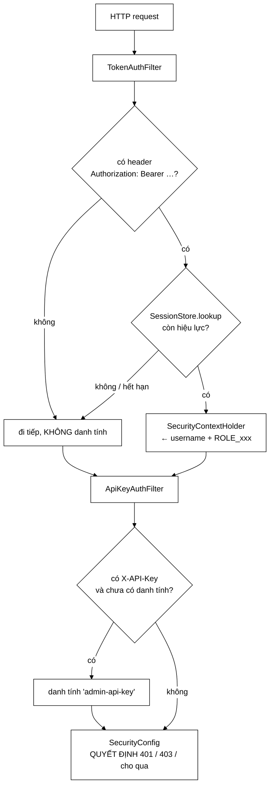

# TokenAuthFilter — 30 dòng code, và một quyết định kiến trúc lớn

**File nguồn:** `search-engine/src/main/java/com/vnsearch/auth/TokenAuthFilter.java` (82 dòng)
**Gói:** `com.vnsearch.auth` · **Loại:** `class extends OncePerRequestFilter`
**Vị trí trong chuỗi:** chạy **trước** `ApiKeyAuthFilter`, cả hai trước `SecurityConfig`
**Đọc kèm:** [`SessionStore.md`](./SessionStore.md) · [`Role.md`](./Role.md) · `docs2/main/java/com/vnsearch/config/ApiKeyAuthFilter.md`

---

## 📌 Hiểu trong 30 giây

Filter này làm đúng ba việc: **đọc** header `Authorization: Bearer <token>`,
**tra** [`SessionStore`](./SessionStore.md), và nếu hợp lệ thì **gắn** danh
tính vào `SecurityContextHolder`.

Điều đáng chú ý nhất là việc nó **không** làm: token sai hoặc hết hạn thì nó
**không chặn**. Nó đi tiếp, chỉ là không mang theo danh tính. Quyết định 401
hay cho qua thuộc về `SecurityConfig`, ở tầng sau.



```
   VÌ SAO KHÔNG CHẶN NGAY TẠI FILTER

   ── Nếu filter tự trả 401 khi token sai ──────────────────────────
   token hết hạn (sau 12 giờ) → người dùng mở tab tìm kiếm
        GET /api/search?q=ha+noi   → 401
        ↑ nhưng đây là ĐƯỜNG CÔNG KHAI, ai cũng gọi được!
        → mang một token cũ còn TỆ HƠN không mang token nào

   ── Đi tiếp không danh tính (đang dùng) ──────────────────────────
        GET /api/search?q=ha+noi      → 200, tìm kiếm bình thường
        GET /api/admin/dashboard      → 401, đúng như phải thế
        ↑ SecurityConfig biết đường nào cần quyền gì; filter thì không.
```

---

## 1. Vấn đề lớp này giải quyết

Giữa `SessionStore` (biết token nào hợp lệ) và Spring Security (biết đường nào
cần quyền gì) có một khoảng trống: **ai đó phải dịch từ header HTTP sang đối
tượng danh tính của Spring**. Đó là toàn bộ nhiệm vụ của lớp này.

```
   SessionStore              TokenAuthFilter              SecurityConfig
   ─────────────             ────────────────             ──────────────
   "token abc → kiet,        "header Authorization        "/api/admin/**
    vai trò ADMIN,            có 'Bearer abc'              cần hasRole('ADMIN')"
    hết hạn 21:00"            → tra → gắn vào
                              SecurityContext"

   biết CÁI GÌ hợp lệ    →   biết ĐỌC TỪ ĐÂU        →    biết CẦN QUYỀN GÌ
```

Ba trách nhiệm, ba lớp. Gộp lại thì mỗi lần thêm một endpoint phải sửa code xác
thực — đúng thứ không ai muốn.

---

## 2. Hai đường vào: người và máy

Javadoc dòng 19–38 giải thích vì sao hệ thống có **hai** cơ chế xác thực song
song thay vì một:

| | `TokenAuthFilter` (người) | `ApiKeyAuthFilter` (công cụ) |
|---|---|---|
| Header | `Authorization: Bearer <token>` | `X-API-Key: <khoá>` |
| Nguồn | Đăng nhập bằng tài khoản/mật khẩu | Cấu hình tĩnh |
| Danh tính | Có — biết **ai** đã làm gì | Không — chỉ là `admin-api-key` |
| Hết hạn | 12 giờ | Không bao giờ |
| Thu hồi | Tức thì, xoá một dòng | Phải khởi động lại |
| Dùng cho | Trình duyệt, trang quản trị | `curl`, job cron, healthcheck, script triển khai |

### 2.1 Vì sao không bỏ hẳn khoá API đi cho gọn

Javadoc dòng 34–38 đưa ra lý do quyết định, và nó không phải "cho tiện":

> Khoá tĩnh là thứ duy nhất dùng được ở những nơi không có ai ngồi đăng nhập:
> script triển khai, job cron, và — quan trọng nhất — **lối vào dự phòng khi
> kho tài khoản hỏng**.

```
   Kịch bản tự khoá mình ra ngoài:
        users.json hỏng / ổ đĩa đầy / bug trong JsonUserStore
             │
             ├─ CHỈ có đăng nhập  → không ai vào được
             │                       → không sửa được từ xa
             │                       → phải SSH vào máy chủ, sửa tay, khởi động lại
             │
             └─ CÓ khoá API       → vẫn gọi được API quản trị để chẩn đoán
                                     và khôi phục
```

Đây là nguyên tắc vận hành: **luôn có một đường vào không phụ thuộc vào thứ có
thể hỏng**. Cái giá là một bí mật tĩnh phải được bảo vệ cẩn thận — đánh đổi có
ý thức, được nói rõ.

### 2.2 Thứ tự filter — phiên có danh tính thắng

Javadoc dòng 40–44: filter này chạy **trước** `ApiKeyAuthFilter`. Cả hai chỉ
hành động khi header của mình có mặt, nên chúng không giẫm lên nhau. Nhưng nếu
một request mang **cả hai**:

```
   Authorization: Bearer <token của kiet>
   X-API-Key: <khoá quản trị>

   → TokenAuthFilter chạy trước, gắn danh tính "kiet"
   → ApiKeyAuthFilter thấy đã có danh tính → không ghi đè
   → Nhật ký ghi: "kiet đã khởi động crawl"     ← truy vết được
     thay vì:      "admin-api-key đã khởi động crawl"  ← không biết là ai
```

Lựa chọn đúng, vì **danh tính cụ thể luôn có giá trị hơn danh tính chung** khi
cần điều tra. Nếu đảo thứ tự, mọi thao tác của người dùng có mang khoá API sẽ
mất dấu vết cá nhân.

---

## 3. Hướng dẫn về code

### 3.1 `extractToken` — bốn chi tiết trong sáu dòng

```java
private static Optional<String> extractToken(HttpServletRequest request) {
    String header = request.getHeader(HEADER);
    if (header == null || !header.regionMatches(true, 0, PREFIX, 0, PREFIX.length())) {
        return Optional.empty();                    // ①②
    }
    String token = header.substring(PREFIX.length()).trim();   // ③
    return token.isEmpty() ? Optional.empty() : Optional.of(token);   // ④
}
```

| # | Chi tiết | Vì sao |
|---|---|---|
| ① | `header == null` kiểm tra trước | Không có header là **trường hợp thường gặp nhất** (mọi request công khai), không phải lỗi |
| ② | `regionMatches(true, ...)` — tham số `true` = **không phân biệt hoa thường** | RFC 7235 nói scheme không phân biệt hoa thường. Một số ứng dụng khách gửi `bearer`, `BEARER`. Dùng `startsWith("Bearer ")` sẽ từ chối chúng, và lỗi hiện ra dưới dạng "đăng nhập được nhưng gọi API nào cũng 401" — cực khó chẩn đoán |
| ③ | `.trim()` sau khi cắt tiền tố | Khoảng trắng thừa do sao chép/dán, hoặc do proxy chèn |
| ④ | `Bearer ` mà không có gì sau → `empty` | Không có dòng này thì chuỗi rỗng được đưa xuống `lookup`. Ở đó vẫn an toàn (`isBlank()` chặn), nhưng dừng sớm ở đây rõ ràng hơn |

Chú ý `regionMatches` thay vì `toLowerCase().startsWith(...)`: không cấp phát
chuỗi mới. Trên một đường chạy ở **mỗi request**, đó là lựa chọn đúng — dù ở
quy mô này khác biệt không đo được, nó là thói quen tốt và không tốn gì về độ
đọc hiểu.

### 3.2 `doFilterInternal` — luồng chính

```java
Optional<SessionStore.Session> session = extractToken(request).flatMap(sessions::lookup);

session.ifPresent(value -> SecurityContextHolder.getContext().setAuthentication(
        new UsernamePasswordAuthenticationToken(
                value.username(),                                    // principal
                null,                                                // ← credentials
                AuthorityUtils.createAuthorityList(value.role().authority()))));

chain.doFilter(request, response);
```

**`flatMap` gộp hai bước "có thể rỗng" thành một.** Không có token → rỗng;
token không tra được → rỗng. Cùng một nhánh xử lý, không cần `if` lồng nhau.

**Tham số `null` ở vị trí credentials là chủ ý.** Đây là chỗ đặt mật khẩu trong
luồng đăng nhập thông thường của Spring Security. Ở đây xác thực **đã xong rồi**
(token chứng minh điều đó), nên không có gì để giữ. Đặt token vào chỗ này là
sai lầm:

```java
// ❌ Không bao giờ làm
new UsernamePasswordAuthenticationToken(username, token, authorities);
//                                                 ↑ token vào SecurityContext
//   → mọi chỗ log Authentication đều lộ token
//   → mọi trang lỗi hiển thị principal đều có nguy cơ
```

**`role().authority()`** trả `"ROLE_ADMIN"` — tiền tố `ROLE_` chỉ được viết ở
một chỗ duy nhất trong toàn dự án, xem [`Role.md`](./Role.md) mục 2.

**Dùng hàm dựng 3 tham số**, không phải 2. Hàm dựng 2 tham số tạo một
`Authentication` với `authenticated = false` — Spring sẽ coi request là chưa
xác thực và mọi endpoint cần quyền đều trả 401. Hàm dựng 3 tham số đặt
`authenticated = true`. Đây là cái bẫy kinh điển khi tự viết filter xác thực.

### 3.3 Vì sao `OncePerRequestFilter` chứ không phải `Filter`

Một request có thể đi qua chuỗi filter **nhiều lần**: `forward` sang trang lỗi,
`include` từ JSP, gọi lại nội bộ. `OncePerRequestFilter` đánh dấu request đã xử
lý và bỏ qua các lần sau.

Ở đây tra bảng băm hai lần cũng vô hại, nhưng thói quen đúng vẫn quan trọng:
nếu sau này thêm ghi nhật ký truy cập hay đếm số liệu vào filter, chạy hai lần
sẽ **nhân đôi mọi con số** — một lỗi rất khó nhận ra vì nó không gây hỏng gì,
chỉ làm sai số liệu.

### 3.4 Cạm bẫy khi sửa lớp này

| Cạm bẫy | Hậu quả | Cách đúng |
|---|---|---|
| Ghi log token khi tra thất bại | Token tương đương mật khẩu — comment dòng 67 cấm rõ | Ghi tên tài khoản khi **thành công**, không ghi gì khi thất bại |
| Trả 401 ngay tại filter | Đường công khai gãy khi mang token cũ — mục đầu | Để `SecurityConfig` quyết định |
| Dùng hàm dựng 2 tham số của `UsernamePasswordAuthenticationToken` | `authenticated = false` → 401 ở mọi nơi | Luôn dùng bản 3 tham số |
| Đặt token vào ô credentials | Token lọt vào log và trang lỗi | Giữ `null` |
| Đổi sang `startsWith("Bearer ")` | Từ chối ứng dụng khách gửi `bearer` | Giữ `regionMatches(true, ...)` |
| Quên `SecurityContextHolder.clearContext()` | Không cần ở đây — Spring tự dọn theo luồng; **nhưng** nếu tự quản lý pool luồng thì phải dọn | Để Spring lo |
| Gia hạn phiên ngay trong filter | Phiên không bao giờ hết hạn nếu có ứng dụng khách hỏi liên tục | Nếu muốn gia hạn trượt, làm trong `SessionStore` kèm trần tuyệt đối |

### 3.5 Thêm một cơ chế xác thực thứ ba

Nếu một ngày cần OAuth2 hay mTLS, khuôn mẫu đã có sẵn:

1. Viết filter mới, chỉ hành động khi **header riêng của nó** có mặt.
2. Kiểm tra `SecurityContextHolder.getContext().getAuthentication() == null`
   trước khi ghi đè — đúng cách `ApiKeyAuthFilter` đang làm.
3. Đặt vào chuỗi theo thứ tự **ưu tiên danh tính cụ thể nhất trước**.
4. Không chặn; luôn `chain.doFilter`.

Bốn quy tắc đó là toàn bộ giao ước giữa các filter xác thực trong dự án. Chúng
chưa được viết thành tài liệu ở đâu ngoài Javadoc của lớp này — đó là một điểm
yếu nhỏ, xem đề xuất 3.

---

## 4. Độ phức tạp & chi phí

| Bước | Chi phí | Ghi chú |
|---|---|---|
| `getHeader` | $O(1)$ | Tra bảng có sẵn của servlet container |
| `regionMatches` | $O(7)$ | Độ dài `"Bearer "` — hằng số |
| `substring` + `trim` | $O(43)$ | Độ dài token — hằng số |
| `SessionStore.lookup` | $O(1)$ | Tra `ConcurrentHashMap` |
| `createAuthorityList` | $O(1)$ | Một phần tử |
| **Tổng** | **$O(1)$, ~1 µs** | |

Đặt vào bối cảnh một request tìm kiếm:

```
   TokenAuthFilter        ~     1 µs
   Phân tích truy vấn     ~   200 µs
   Duyệt posting list     ~ 5.000 µs
   Chấm điểm + sắp xếp    ~ 2.000 µs
   ──────────────────────────────────
   Xác thực chiếm ~0,014% tổng thời gian.
```

Con số này giải thích vì sao **không cần cache** kết quả tra token: `lookup` đã
là một phép tra bảng băm trong bộ nhớ, thêm một tầng cache chỉ làm phức tạp
thêm mà không tiết kiệm được gì đo được.

Bộ nhớ: một `Optional` + một `UsernamePasswordAuthenticationToken` mỗi request
có xác thực, đều chết ngay sau request. Không giữ trạng thái nào giữa các
request — filter là **stateless**, mọi trạng thái nằm ở `SessionStore`.

---

## 5. Kiểm thử liên quan

| Test | Bảo vệ điều gì |
|---|---|
| `test/java/com/vnsearch/auth/AccountAuthorizationTest.java` | Đường đầy đủ: đăng nhập → gọi API quản trị → 200; không token → 401; vai trò `USER` → 403 |
| `test/java/com/vnsearch/analytics/AnalyticsAuthorizationTest.java` | Danh tính gắn ở đây được `SecurityConfig` dùng đúng |
| `test/java/com/vnsearch/auth/SessionStoreTest.java` | Tầng dưới |

```powershell
cd search-engine
.\mvnw.cmd -q -Dtest='AccountAuthorizationTest,AnalyticsAuthorizationTest' test
```

Kiểm tra bằng tay bốn tình huống:

```powershell
$t = "<token lay tu /api/auth/login>"

# 1. Token hợp lệ → 200
curl -s -i -H "Authorization: Bearer $t" http://localhost:8080/api/auth/me

# 2. Không phân biệt hoa thường ở scheme → cũng 200
curl -s -i -H "Authorization: bearer $t" http://localhost:8080/api/auth/me

# 3. Token rác → 401 (do SecurityConfig, KHÔNG phải do filter)
curl -s -i -H "Authorization: Bearer rac" http://localhost:8080/api/auth/me

# 4. Token rác trên đường CÔNG KHAI → vẫn 200 — đây là điểm mấu chốt
curl -s -i -H "Authorization: Bearer rac" "http://localhost:8080/api/search?q=ha+noi"
```

Tình huống 4 là hành vi dễ bị "sửa nhầm" nhất. Nó **chưa** có test tự động và
nên có:

```java
@Test
void tokenHongKhongChanDuongCongKhai() throws Exception {
    mockMvc.perform(get("/api/search").param("q", "ha noi")
            .header("Authorization", "Bearer token-khong-ton-tai"))
           .andExpect(status().isOk());
}
```

---

## 6. Chấm theo chuẩn doanh nghiệp

| Tiêu chí | Điểm | Nhận xét |
|---|---|---|
| Đúng đắn của tích hợp Spring Security | 10/10 | Hàm dựng 3 tham số, credentials `null`, `OncePerRequestFilter` — không sai chi tiết nào |
| Tách trách nhiệm | 10/10 | Xác thực và phân quyền tách sạch; filter không biết đường nào cần quyền gì |
| Xử lý đầu vào bất thường | 9/10 | Bốn ca của `extractToken` đều đúng, kể cả scheme viết hoa |
| Bảo mật | 9/10 | Không ghi log token, không đặt token vào `Authentication` |
| Lập luận thiết kế | 10/10 | Javadoc giải thích rõ vì sao có **hai** đường vào và vì sao giữ cả hai |
| Khả năng kiểm thử | 7/10 | Có test đường đầy đủ; thiếu test cho ca "token hỏng trên đường công khai" |
| Quan sát được (observability) | 5/10 | Không có số liệu nào: bao nhiêu request có token hợp lệ / hết hạn / hỏng |

**Ba đề xuất nâng lên mức sản phẩm:**

1. **Thêm số liệu Micrometer**: `auth.token.valid`, `auth.token.expired`,
   `auth.token.invalid`. Đây là điểm mù lớn nhất hiện nay — một đợt dò token
   sẽ **hoàn toàn vô hình** với người vận hành, vì filter cố tình không ghi log
   khi thất bại. Đếm số liệu cho thấy tín hiệu mà không lộ giá trị token.
2. **Test cho ca "token hỏng trên đường công khai"** (mục 5). Hành vi đó là kết
   quả của một quyết định thiết kế có chủ ý, nhưng hiện chỉ có comment dòng
   67–70 bảo vệ nó — người bảo trì kế tiếp rất dễ "sửa" thành trả 401.
3. **Viết bốn quy tắc ở mục 3.5 thành một `interface AuthenticationStrategy`**
   hoặc ít nhất một mục trong `docs/SECURITY.md`. Giao ước giữa các filter hiện
   chỉ tồn tại trong Javadoc của một lớp, nên filter thứ ba rất dễ vi phạm nó.

---

## 7. Liên kết

- Nơi token được sinh và tra: [`SessionStore.md`](./SessionStore.md)
- Nơi vai trò thành `ROLE_ADMIN`: [`Role.md`](./Role.md)
- Nơi mở phiên sau khi xác thực: [`UserService.md`](./UserService.md)
- Đường vào thứ hai (công cụ): `docs2/main/java/com/vnsearch/config/ApiKeyAuthFilter.md`
- Nơi quyết định 401/403: `docs2/main/java/com/vnsearch/config/SecurityConfig.md`
- Nơi lắp chuỗi filter: `docs2/main/java/com/vnsearch/config/AuthConfig.md`
- Tổng quan: `docs/SECURITY.md`
