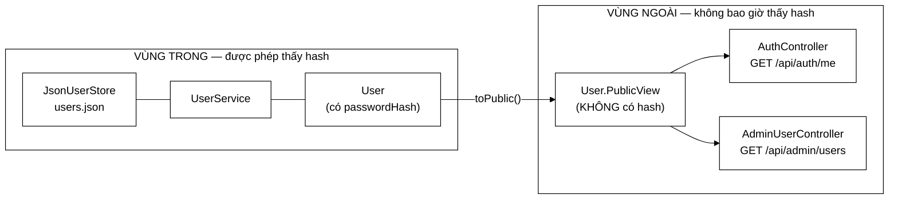

# User — bản ghi tài khoản, và một ranh giới không được phép rò

**File nguồn:** `search-engine/src/main/java/com/vnsearch/auth/User.java`
**Gói:** `com.vnsearch.auth` · **Loại:** `record` bất biến, chứa một `record` lồng bên trong (`PublicView`)
**Dùng bởi:** `UserService`, `JsonUserStore`, `AdminUserController`, `AuthController`, `TokenAuthFilter`
**Đọc kèm:** [`Role.md`](./Role.md) · [`UserStore.md`](./UserStore.md) · [`UserService.md`](./UserService.md)

---

## 📌 Hiểu trong 30 giây

`User` là bản ghi đầy đủ của một tài khoản — **bao gồm hash mật khẩu**. Vì thế
nó là kiểu **chỉ được dùng bên trong**. Mọi đường đi ra ngoài (JSON của REST,
log, thông báo lỗi) phải đi qua `toPublic()`, trả về `PublicView` — cùng nội
dung nhưng **không có trường hash**.

Điều đáng chú ý nhất lại là một trường **không tồn tại**: không có
`String password`. Mật khẩu thô không có chỗ nào để cư trú trong hệ thống.



```
   VÌ SAO PHẢI CÓ KIỂU RIÊNG CHO ĐƯỜNG RA

   ── Cách sai: trả thẳng User, dựa vào @JsonIgnore ────────────────
   record User(String username, @JsonIgnore String passwordHash, ...)
        └─ đúng cho tới khi:
           • ai đó log.info("user={}", user)        → hash vào file log
           • một exception in ra toString()          → hash vào stack trace
           • một endpoint mới dùng mapper khác cấu hình → hash vào JSON
           một chú thích ĐỀ NGHỊ Jackson bỏ qua; nó không NGĂN được gì khác

   ── Cách đang dùng: hai kiểu khác nhau ───────────────────────────
   User        ── chỉ sống trong auth/ + service
   PublicView  ── kiểu duy nhất mà controller cầm được
        └─ muốn rò hash ra ngoài thì phải CỐ TÌNH sửa chữ ký hàm,
           và người review sẽ thấy dòng đó trong diff
```

---

## 1. Trường không tồn tại: `password`

Javadoc dòng 8–13 phát biểu một bất biến rất mạnh:

> Mật khẩu thô không tồn tại ở bất kỳ đâu trong hệ thống quá vài mili giây.

Hãy theo dấu vòng đời của nó:

```
   POST /api/auth/login  { "username": "kiet", "password": "bimat123" }
        │
        ├─ 1. Jackson dựng LoginRequest  ── chuỗi mật khẩu nằm trên heap
        │
        ├─ 2. UserService.authenticate(username, password)
        │        └─ encoder.matches(password, user.passwordHash())
        │                 └─ BCrypt băm lại rồi so sánh
        │
        ├─ 3. hàm trả về  ── khung ngăn xếp biến mất
        │                    LoginRequest không còn ai tham chiếu
        │
        └─ 4. GC dọn  ── chuỗi biến mất khỏi heap

   KHÔNG có bước nào ghi nó vào một trường của đối tượng sống lâu.
```

Vì `User` không có chỗ chứa mật khẩu thô, các đường rò kinh điển bị chặn **từ
gốc**, không phải bằng kỷ luật của người viết code:

| Đường rò kinh điển | Vì sao ở đây không xảy ra |
|---|---|
| Ghi log cả đối tượng người dùng | Đối tượng không chứa mật khẩu để mà ghi |
| Tuần tự hoá vào `users.json` | Trường không tồn tại ⇒ Jackson không có gì để ghi |
| Heap dump lúc điều tra sự cố | Chỉ thấy hash BCrypt, không thấy mật khẩu |
| Thông báo lỗi in ra state | `toString()` của record không có trường đó |

> **Nguyên tắc rút ra:** an toàn tốt nhất không đến từ việc *nhớ* xoá dữ liệu
> nhạy cảm, mà từ việc **không tạo ra chỗ để nó nằm lại**. Đây là điểm mà một
> đồ án tốt nghiệp có thể ghi điểm rõ so với một bài tập lớn thông thường.

---

## 2. Bản đồ trường

```
User (record, bất biến)
├── username     : String    ← định danh, chữ thường, duy nhất
├── passwordHash : String    ← BCrypt; salt nằm SẴN trong chuỗi
├── role         : Role      ← USER | ADMIN  (xem Role.md)
├── enabled      : boolean   ← false = khoá, KHÔNG xoá dữ liệu
├── createdAt    : Instant   ← dùng để sắp thứ tự trong findAll()
└── lastLoginAt  : Instant?  ← null khi chưa đăng nhập lần nào

User.PublicView (record lồng)
├── username, role, enabled, createdAt, lastLoginAt
└──  ✂  passwordHash bị cắt
```

### 2.1 `passwordHash` — vì sao một chuỗi là đủ

Chuỗi BCrypt tự mô tả, không cần cột `salt` riêng:

```
   $2a$10$N9qo8uLOickgx2ZMRZoMye  IjZAgcfl7p92ldGxad68LJZdL17lhWy
   ─┬─ ─┬─ ────────┬─────────────  ──────────────┬────────────────
    │   │          │                             │
    │   │          └ salt 22 ký tự               └ hash 31 ký tự
    │   └ chi phí: 2^10 = 1024 vòng
    └ phiên bản thuật toán
```

Hệ quả thực tế: **đổi tham số chi phí không cần migrate dữ liệu**. Tài khoản cũ
vẫn kiểm tra được bằng chi phí cũ ghi trong chuỗi; tài khoản mới dùng chi phí
mới. Nếu salt nằm ở một cột riêng thì mọi thay đổi cấu hình đều là một cuộc di
trú CSDL.

### 2.2 `enabled` — khoá mềm thay vì xoá

| | `enabled = false` | `delete(username)` |
|---|---|---|
| Dữ liệu lịch sử | Còn | Mất |
| Tên tài khoản | Vẫn bị chiếm ⇒ không ai đăng ký lại để mạo danh | Được giải phóng |
| Khôi phục nhầm lẫn | Một lần bật lại | Không khôi phục được |
| Phù hợp cho | Nghỉ việc, tạm đình chỉ, nghi ngờ | Yêu cầu xoá dữ liệu cá nhân |

Cả hai đều tồn tại vì chúng trả lời hai câu hỏi khác nhau. Chỉ có `delete` thì
không khoá tạm được; chỉ có `enabled` thì không đáp ứng được yêu cầu xoá.

### 2.3 `lastLoginAt` có thể `null`

`null` ở đây **mang nghĩa**: "chưa đăng nhập lần nào". Nó không phải giá trị
thiếu do lỗi. Vì thế `JsonUserStore.findAll()` sắp xếp bằng
`Comparator.nullsLast(...)` trên `createdAt` chứ không giả định mọi mốc thời
gian đều có mặt.

Nếu muốn tránh `null` hoàn toàn, lựa chọn đúng là `Optional<Instant>` — nhưng
`Optional` trong trường của record thì Jackson tuần tự hoá thành
`{"present":true,"value":...}` trừ khi thêm module, và đó là cái giá không đáng
cho một trường hiển thị.

---

## 3. Hướng dẫn về code

### 3.1 `toPublic()` — ranh giới, không phải tiện ích

```java
public PublicView toPublic() {
    return new PublicView(username, role, enabled, createdAt, lastLoginAt);
}
```

Ba dòng, nhưng vai trò của nó là **kiểu học** (type-level), không phải tiết
kiệm code. Quy tắc để đọc mọi controller trong dự án:

```java
// ❌ Không bao giờ được xuất hiện trong một controller
public User me(...) { ... }
public List<User> list(...) { ... }

// ✅ Chữ ký đúng — trình biên dịch giữ ranh giới
public User.PublicView me(...) { ... }
public List<User.PublicView> list(...) { ... }
```

Muốn kiểm tra dự án có tuân thủ không, một lệnh là đủ:

```powershell
# Không dòng nào được trả về User trần từ tầng controller
Select-String -Path search-engine\src\main\java\com\vnsearch\controller\*.java -Pattern 'User\b(?!\.PublicView)'
```

### 3.2 Bốn hàm `withX` — sao chép thay vì sửa tại chỗ

```java
public User withRole(Role newRole) {
    return new User(username, passwordHash, newRole, enabled, createdAt, lastLoginAt);
}
```

Record không có setter, nên đây là cách duy nhất "thay đổi" một tài khoản: tạo
một bản ghi mới khác đúng một trường. Ba lợi ích cụ thể, không trừu tượng:

```
   1. AN TOÀN ĐA LUỒNG KHÔNG CẦN KHOÁ
      Luồng A đang đọc user cũ, luồng B "đổi" vai trò
      → B tạo đối tượng mới; đối tượng A đang cầm không đổi giữa chừng
      → không có trạng thái nửa vời (đã đổi role, chưa đổi enabled)

   2. GHI ĐĨA CÓ THỂ THẤT BẠI MÀ KHÔNG HỎNG DỮ LIỆU
      JsonUserStore.save() ghi hỏng → chỉ cần đặt lại tham chiếu cũ
      → nếu sửa tại chỗ, bản gốc đã bị ghi đè, không có gì để quay về

   3. ĐỌC DIỄN RA TỰ NHIÊN
      store.save(user.withEnabled(false));
      ↑ đọc thành câu: "lưu người dùng này, với enabled = false"
```

Cạm bẫy duy nhất: **giá trị trả về phải được dùng**.

```java
// ❌ Không làm gì cả — đối tượng mới bị vứt đi ngay
user.withRole(Role.ADMIN);

// ✅
store.save(user.withRole(Role.ADMIN));
```

Đây là lỗi im lặng (không cảnh báo biên dịch, không exception). Nếu dùng
ErrorProne/SpotBugs trong CI, đánh dấu các hàm `withX` bằng
`@CheckReturnValue` sẽ biến nó thành lỗi biên dịch.

### 3.3 Cách thêm một trường mới

| Bước | Việc phải làm | Vì sao |
|---|---|---|
| 1 | Thêm thành phần vào `User` | |
| 2 | Quyết định: trường này có ra ngoài không? | Nếu **không** → đừng đụng `PublicView` |
| 3 | Nếu có → thêm vào `PublicView` **và** `toPublic()` | Quên `toPublic()` ⇒ trình biên dịch báo lỗi ngay |
| 4 | Thêm hàm `withX` nếu trường thay đổi được | |
| 5 | Không cần migrate `users.json` | `FAIL_ON_UNKNOWN_PROPERTIES` đã tắt; tệp cũ vẫn nạp được, trường mới nhận giá trị mặc định |

Bước 5 là lợi ích trực tiếp của cấu hình trong [`JsonUserStore.md`](./JsonUserStore.md).

> ⚠️ **Không thêm trường nhạy cảm rồi trông cậy vào `@JsonIgnore`.** Nếu trường
> mới là bí mật (khoá TOTP, token khôi phục), nó thuộc về `User` và **tuyệt đối
> không** thuộc về `PublicView` — đúng như cách `passwordHash` đang được xử lý.

---

## 4. Độ phức tạp & chi phí

| Thao tác | Chi phí | Ghi chú |
|---|---|---|
| Tạo `User` / gọi `withX` | $O(1)$, một lần cấp phát ~64 byte | 6 tham chiếu + header đối tượng |
| `toPublic()` | $O(1)$, một lần cấp phát | Chỉ sao chép tham chiếu, không sao chép chuỗi |
| `equals` / `hashCode` sinh tự động | $O(L)$ với $L$ = độ dài chuỗi | So sánh cả `passwordHash` — hiếm khi cần |

Cấp phát thêm mỗi lần cập nhật nghe có vẻ lãng phí, nhưng hãy đặt cạnh chi phí
thật của thao tác đi kèm:

```
   user.withLastLoginAt(now)   ~ 64 byte, vài chục nanô giây
   BCrypt.matches(...)         ~ 100.000.000 nanô giây  (cost 10, ~100 ms)
   persist() ghi cả users.json ~   1.000.000 nanô giây

   Chi phí cấp phát nhỏ hơn phần còn lại KHOẢNG MỘT TRIỆU LẦN.
```

Tối ưu ở đây là tối ưu nhầm chỗ. Con số 100 ms của BCrypt cũng **là chủ đích**:
nó khiến dò mật khẩu ngoại tuyến trở nên đắt đỏ.

---

## 5. Kiểm thử liên quan

| Test | Bảo vệ điều gì |
|---|---|
| `test/java/com/vnsearch/auth/UserServiceTest.java` | Vòng đời tài khoản, băm và kiểm tra mật khẩu |
| `test/java/com/vnsearch/auth/JsonUserStoreTest.java` | Ghi/đọc lại đúng mọi trường, kể cả `lastLoginAt = null` |
| `test/java/com/vnsearch/auth/AccountAuthorizationTest.java` | Endpoint trả `PublicView`, không rò hash |

Chạy nhanh:

```powershell
cd search-engine
.\mvnw.cmd -q -Dtest='UserServiceTest,JsonUserStoreTest,AccountAuthorizationTest' test
```

Kiểm tra bằng tay — không được thấy `passwordHash` trong phản hồi:

```powershell
curl -H "Authorization: Bearer <token-admin>" http://localhost:8080/api/admin/users | Select-String passwordHash
# Không in ra gì = đúng
```

---

## 6. Chấm theo chuẩn doanh nghiệp

| Tiêu chí | Điểm | Nhận xét |
|---|---|---|
| Thiết kế mô hình miền | 9/10 | Bất biến, `withX` rõ ràng, `PublicView` tách đúng ranh giới |
| Bảo mật | 9/10 | Không có chỗ chứa mật khẩu thô; hash không lọt ra ngoài theo kiểu học |
| Tài liệu trong mã | 9/10 | Javadoc nói **vì sao**, không nhắc lại tên trường |
| Khả năng tiến hoá | 7/10 | Thêm trường dễ; nhưng `PublicView` phải sửa tay, dễ quên khi vội |
| Khả năng kiểm thử | 9/10 | Record thuần, dựng trong một dòng, không cần mock |
| Tuân thủ riêng tư | 7/10 | Có cả khoá mềm lẫn `delete`; nhưng số liệu sử dụng vẫn ghi theo tên tài khoản, xoá tài khoản không xoá phần đó |

**Ba đề xuất nâng lên mức sản phẩm:**

1. **Test kiến trúc** (ArchUnit): "không lớp nào trong `controller` được có
   `User` trong chữ ký công khai". Biến quy ước thành luật do CI canh giữ.
2. **`@CheckReturnValue`** cho bốn hàm `withX`, chặn lỗi vứt kết quả.
3. **`passwordChangedAt`** — mốc thời gian phục vụ kiểm toán ("mật khẩu này đã
   dùng bao lâu rồi?") và làm nền cho chính sách buộc đổi định kỳ. Việc đóng
   các phiên khác khi đổi mật khẩu thì **đã có rồi** —
   `SessionStore.revokeAllForExcept` được `AuthController` gọi; xem
   [`SessionStore.md`](./SessionStore.md).

---

## 7. Liên kết

- Vai trò của trường `role`: [`Role.md`](./Role.md)
- Nơi `User` được lưu: [`UserStore.md`](./UserStore.md) → [`JsonUserStore.md`](./JsonUserStore.md)
- Nơi mật khẩu được băm và kiểm tra: [`UserService.md`](./UserService.md)
- Nơi `PublicView` được trả ra: `docs2/main/java/com/vnsearch/controller/AuthController.md`
- Tổng quan: `docs/ACCOUNTS-AND-DASHBOARD.md`, `docs/SECURITY.md`
