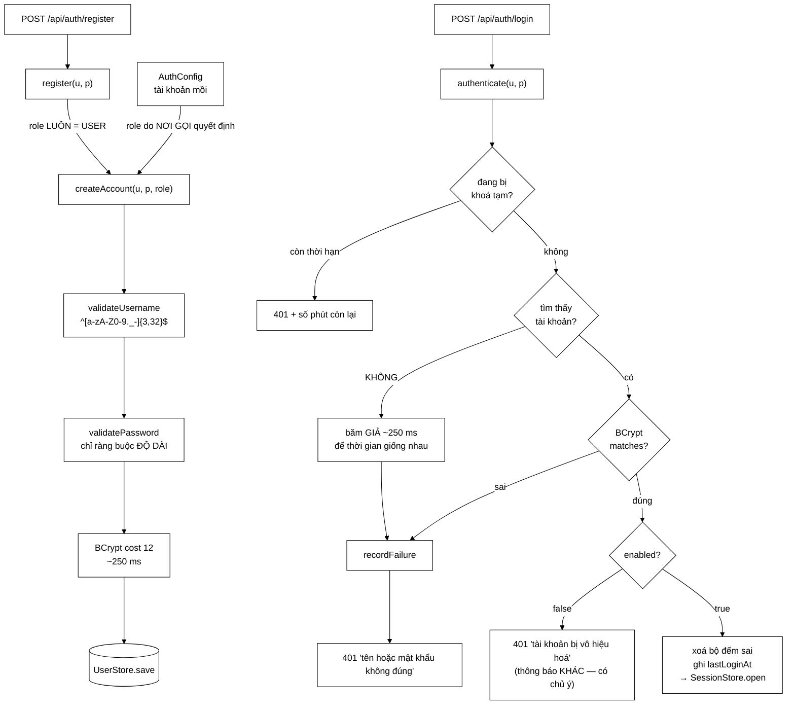

# UserService — nơi tập trung mọi luật về tài khoản, và bốn quyết định bảo mật

**File nguồn:** `search-engine/src/main/java/com/vnsearch/auth/UserService.java` (401 dòng)
**Gói:** `com.vnsearch.auth` · **Loại:** `class` nghiệp vụ, phụ thuộc [`UserStore`](./UserStore.md) qua interface
**Người dùng:** `AuthController`, `AdminUserController`, `AuthConfig` (tạo tài khoản mồi)
**Đọc kèm:** [`User.md`](./User.md) · [`SessionStore.md`](./SessionStore.md) · [`Role.md`](./Role.md)

---

## 📌 Hiểu trong 30 giây

Lớp này là **tầng nghiệp vụ** của hệ tài khoản: `UserStore` biết *lưu ở đâu*,
`SessionStore` biết *ai đang đăng nhập*, còn lớp này biết *luật*.

Bốn quyết định định hình toàn bộ file, và mỗi cái chặn một kiểu tấn công khác
nhau:

| Quyết định | Chặn tấn công gì |
|---|---|
| **BCrypt cost 12**, không phải SHA-256 | Dò mật khẩu ngoại tuyến sau khi lộ tệp hash |
| **Khoá tạm theo tài khoản**, không phải theo địa chỉ | Botnet thử một mật khẩu phổ biến trên hàng nghìn tài khoản |
| **Thông báo lỗi mơ hồ** + băm giả | Liệt kê tài khoản (kể cả qua **thời gian phản hồi**) |
| **`register` không nhận `role`** | Leo thang quyền bằng cách thêm `"role":"ADMIN"` vào JSON |



```
   BỐN CON SỐ ĐIỀU KHIỂN TOÀN BỘ CHÍNH SÁCH

   BCRYPT_COST         = 12    → 2^12 = 4096 vòng ≈ 250 ms mỗi lần băm
   MAX_FAILED_ATTEMPTS =  5    → sai 5 lần liên tiếp thì khoá
   LOCKOUT_MINUTES     = 15    → khoá TẠM, không vĩnh viễn
   MIN_PASSWORD_LENGTH =  8    → không có luật "phải có chữ hoa + số + ký tự đặc biệt"
```

---

## 1. Quyết định 1 — BCrypt, không phải SHA-256

Javadoc dòng 22–38 gọi đây là "chỗ dễ làm sai nhất và hậu quả nặng nhất". Bảng
số dưới đây cho thấy vì sao:

```
   Kẻ tấn công lấy được tệp hash, dò bằng một GPU phổ thông:

   SHA-256          ~ 10.000.000.000 lần thử / giây
   BCrypt cost 12   ~             45 lần thử / giây     (chậm hơn 200 TRIỆU lần)

   Dò một mật khẩu 8 ký tự chữ thường (26^8 ≈ 2×10^11 khả năng):
        SHA-256        ≈  21 giây
        BCrypt cost 12 ≈ 145 NĂM

   Cùng một mật khẩu. Chỉ khác thuật toán băm.
```

### 1.1 Hai tính chất của BCrypt, và mỗi tính chất chặn gì

| Tính chất | Chặn gì | Nếu thiếu |
|---|---|---|
| **Chậm có kiểm soát** (tham số cost) | Dò hàng loạt | Mọi mật khẩu yếu bị phá trong vài phút |
| **Salt tự sinh, nhúng trong chuỗi** | Bảng tra ngược (rainbow table) | Hai người cùng mật khẩu → cùng hash; phá một lần được cả hai, **và biết luôn là họ trùng mật khẩu** |

Vế in đậm cuối bảng là điểm Javadoc dòng 31–33 nhấn mạnh và hay bị bỏ qua: rò
rỉ *quan hệ* giữa các bản ghi cũng là rò rỉ.

### 1.2 Vì sao cost = 12 chứ không phải 10 hay 15

```
   cost   số vòng   thời gian/lần   trải nghiệm đăng nhập      độ an toàn
   ────────────────────────────────────────────────────────────────────────
    10      1.024      ~60 ms        không nhận ra              mặc định Spring
    12      4.096     ~250 ms        chấp nhận được  ← ĐANG DÙNG   tốt
    14     16.384    ~1.000 ms       thấy rõ độ trễ             thừa cho quy mô này
    15     32.768    ~2.000 ms       người dùng tưởng bị treo   phản tác dụng
```

Nguyên tắc chọn: **chậm nhất mà người dùng còn chịu được**. 250 ms một lần mỗi
phiên là không đáng kể với một người; nhân với hàng tỉ lần thử thì nó là bức
tường.

Và nhờ salt + cost nằm **trong** chuỗi hash (xem [`User.md`](./User.md) mục
2.1), tăng cost sau này **không cần di trú dữ liệu**: tài khoản cũ vẫn kiểm tra
được bằng cost cũ.

---

## 2. Quyết định 2 — khoá tạm theo *tài khoản*

### 2.1 Lỗ hổng mà `RateLimitFilter` không bịt được

Javadoc dòng 40–45 mô tả chính xác:

```
   ── Tấn công dọc: 1 tài khoản, nhiều mật khẩu ────────────────────
   1 địa chỉ IP → 10.000 lần thử vào "admin"
        └ RateLimitFilter (giới hạn theo ĐỊA CHỈ) chặn được ✓

   ── Tấn công ngang (password spraying): 1 mật khẩu, nhiều tài khoản ─
   5.000 địa chỉ IP (botnet) → mỗi địa chỉ thử "Password123!" vài lần
        └ RateLimitFilter thấy mỗi IP rất hiền → KHÔNG chặn ✗
        └ Bộ đếm theo TÀI KHOẢN ở đây → chặn ✓

   Hai bộ lọc bịt hai chiều khác nhau của cùng một ma trận.
   Thiếu một trong hai là để hở một chiều.
```

Đây là ví dụ tốt về **phòng thủ nhiều lớp**: không lớp nào đủ một mình, và cả
hai đều rẻ.

### 2.2 Vì sao khoá *tạm* 15 phút, không khoá vĩnh viễn

```
   Khoá vĩnh viễn:
        kẻ xấu gõ sai 5 lần vào tài khoản của MỘT NGƯỜI KHÁC
        → người đó bị khoá ra ngoài MÃI MÃI
        → cần quản trị viên can thiệp thủ công
        → công cụ chống dò mật khẩu TRỞ THÀNH công cụ từ chối dịch vụ

   Khoá tạm 15 phút:
        tối đa 5 lần thử / 15 phút = 20 lần thử / giờ
        → dò một mật khẩu 8 ký tự cần hàng triệu NĂM
        → người bị hại chỉ mất 15 phút, tự hồi phục
```

Tính lại cho rõ: với `MAX_FAILED_ATTEMPTS = 5` và `LOCKOUT_MINUTES = 15`, tốc
độ dò trực tuyến bị ghìm ở **20 lần/giờ ≈ 175.000 lần/năm**. So với không gian
mật khẩu tối thiểu 8 ký tự, đó là con số không đáng kể — **kể cả khi bỏ qua
BCrypt**.

### 2.3 `recordFailure` — bên trong bộ đếm

```java
private void recordFailure(String username, Instant now) {
    Attempts attempts = failures.computeIfAbsent(username, key -> new Attempts());
    synchronized (attempts) {              // ← khoá trên TỪNG bản ghi
        attempts.count++;
        if (attempts.count >= MAX_FAILED_ATTEMPTS) {
            attempts.lockedUntil = now.plus(Duration.ofMinutes(LOCKOUT_MINUTES));
            attempts.count = 0;            // ← đặt lại để đếm chu kỳ sau
            log.warn(...);
        }
    }
}
```

Hai chi tiết đáng chú ý:

**`synchronized (attempts)` chứ không phải `synchronized` cả phương thức.**
`ConcurrentHashMap` bảo đảm tra/thêm an toàn, nhưng `attempts.count++` là thao
tác *đọc–sửa–ghi* trên một đối tượng thường, không nguyên tử. Khoá trên chính
bản ghi cho phép hai tài khoản khác nhau đếm song song — chỉ các lần thử vào
**cùng một** tài khoản mới phải xếp hàng.

```
   ❌ synchronized cả phương thức
        mọi lần đăng nhập sai trong toàn hệ thống xếp hàng qua một cửa
        → chính nó thành điểm nghẽn khi bị tấn công

   ✅ synchronized (attempts)
        tài khoản A và tài khoản B đếm độc lập
        cạnh tranh chỉ xảy ra khi cùng nhắm một tài khoản — đúng chỗ cần
```

**`attempts.count = 0` sau khi khoá** biến bộ đếm thành *chu kỳ*: hết 15 phút,
người dùng lại có đủ 5 lần. Không có dòng này, lần sai thứ 6 sẽ khoá tiếp ngay
lập tức, và tài khoản không bao giờ mở lại được.

### 2.4 Ba giới hạn đã biết của bộ đếm

| Giới hạn | Hệ quả | Có nghiêm trọng không |
|---|---|---|
| `failures` chỉ nằm trong RAM | Khởi động lại máy chủ là xoá sạch bộ đếm | Có — kẻ tấn công gây khởi động lại được sẽ bỏ qua được khoá |
| Bảng `failures` không có trần | Dò 1 triệu tên khác nhau → 1 triệu dòng | Có — rò bộ nhớ; xem đề xuất 2 mục 8 |
| Bản ghi không tự dọn khi hết khoá | Dòng nằm lại vô hạn | Vừa; đi kèm với giới hạn trên |

Điểm thứ hai đáng chú ý: `recordFailure` được gọi **cả khi tài khoản không tồn
tại** (dòng 175). Đó là *đúng* về mặt chống dò tên (xem mục 3), nhưng nghĩa là
kẻ tấn công điều khiển được khoá của bảng.

---

## 3. Quyết định 3 — thông báo mơ hồ, và băm giả để giấu cả *thời gian*

### 3.1 Vì sao cùng một thông báo

Javadoc dòng 52–57:

> Phân biệt hai ca ("tài khoản không tồn tại" / "mật khẩu sai") biến trang đăng
> nhập thành một công cụ *liệt kê tài khoản*.

```
   Thông báo phân biệt:
        thử 10.000 tên phổ biến → biết CHÍNH XÁC 37 tên có thật
        → tập trung toàn bộ sức dò vào 37 tài khoản đó
        → còn dùng danh sách đó để lừa đảo qua email

   Thông báo chung:
        không phân biệt được → phải dò cả 10.000 tên × mọi mật khẩu
```

### 3.2 Chi tiết tinh tế nhất của cả file: băm giả — dòng 170–174

```java
if (found.isEmpty()) {
    encoder.encode(password == null ? "" : password);   // ← băm một chuỗi VÔ ÍCH
    recordFailure(normalized, now);
    throw new InvalidCredentialsException("Tên tài khoản hoặc mật khẩu không đúng.");
}
```

Dòng `encoder.encode(...)` này **không dùng kết quả**. Nhìn qua tưởng là code
thừa cần dọn. Thực ra bỏ nó đi là mở lại đúng lỗ hổng mà thông báo mơ hồ vừa
bịt:

```
   KHÔNG có băm giả — đo thời gian phản hồi:
        tên KHÔNG tồn tại →   2 ms   (trả về ngay sau khi tra bảng)
        tên CÓ tồn tại    → 250 ms   (phải chạy BCrypt.matches)
        ────────────────────────────
        chênh lệch 125 LẦN — đo được qua Internet, không cần công cụ đặc biệt
        ⇒ thông báo mơ hồ trở thành VÔ NGHĨA: thời gian đã tiết lộ câu trả lời

   CÓ băm giả:
        tên KHÔNG tồn tại → 250 ms
        tên CÓ tồn tại    → 250 ms
        ⇒ không phân biệt được
```

Đây là **timing attack**, và cách xử lý ở đây là mẫu mực. Điểm đáng học: một
biện pháp bảo mật chỉ mạnh bằng kênh rò rỉ yếu nhất của nó — bịt nội dung thông
báo mà quên bịt thời gian thì coi như chưa bịt.

> ⚠️ **Không bao giờ "dọn dẹp" dòng này.** Nó cần một comment giải thích ngay
> tại chỗ — và đã có, dòng 170–173. Đây chính là lý do vì sao comment nói *vì
> sao* có giá trị hơn comment nói *cái gì*: không có nó, người bảo trì kế tiếp
> sẽ xoá dòng này với thông điệp commit "remove unused call".

### 3.3 Ba chỗ *cố tình* nói thật — và vì sao đúng

Nguyên tắc mơ hồ không được áp dụng máy móc. Có ba ngoại lệ, mỗi cái có lý lẽ
riêng:

| Vị trí | Thông báo | Vì sao nói thật là đúng |
|---|---|---|
| `createAccount` dòng 135 | "Tên tài khoản đã tồn tại" | Trang đăng ký **không dùng được** nếu không nói. Comment dòng 131–134 thừa nhận nó cho phép dò tên, và lập luận rằng biết một tên tồn tại **không mở được cánh cửa nào** |
| `authenticate` dòng 188 | "Tài khoản đã bị vô hiệu hoá" | Người này **đã chứng minh biết mật khẩu**. Giấu lý do chỉ làm họ bối rối, không thêm an toàn (comment dòng 186–187) |
| `authenticate` dòng 163–165 | "Khoá tạm, thử lại sau N phút" | Không nói thì người dùng thử lại liên tục, kéo dài khoá vô hạn trong cảm nhận của họ |

Nhận xét: cả ba đều theo cùng một quy tắc — **chỉ tiết lộ khi người nhận đã
chứng minh được quyền biết, hoặc khi việc giấu gây hại nhiều hơn lợi.** Đó là
một chính sách nhất quán, không phải bốn ngoại lệ rời rạc.

---

## 4. Quyết định 4 — `register` không nhận `role`

```java
public User register(String username, String password) throws IOException {
    return createAccount(username, password, Role.USER);   // ← đóng cứng
}

public User createAccount(String username, String password, Role role) { ... }
//                                                          ↑ chỉ nơi gọi nội bộ mới truyền được
```

Javadoc dòng 115–118 gọi tên lỗ hổng được chặn:

```
   Nếu register nhận role từ thân request:
        POST /api/auth/register
        { "username": "kiet", "password": "...", "role": "ADMIN" }
                                                  ↑ thêm 17 ký tự = chiếm quyền quản trị

   Đây là "mass assignment" / leo thang quyền — nằm trong OWASP Top 10,
   và là một trong những lỗi hay gặp nhất ở ứng dụng web sinh viên.
```

Cách phòng ở đây mạnh vì nó **thuộc về chữ ký hàm**, không phải một câu lệnh
kiểm tra có thể bị quên:

```java
// ❌ Kiểu phòng thủ yếu — dựa vào việc nhớ kiểm tra
public User register(String u, String p, Role role) {
    if (role == Role.ADMIN) throw new AuthException("...");  // ai đó sẽ xoá dòng này
    ...
}

// ✅ Kiểu phòng thủ mạnh — không có tham số để mà truyền
public User register(String u, String p) { return createAccount(u, p, Role.USER); }
```

Cùng triết lý với `User.PublicView`: **làm cho điều sai trở nên không biểu đạt
được**, thay vì kiểm tra rồi từ chối.

---

## 5. Hai chi tiết dễ bỏ qua nhưng rất "sản phẩm"

### 5.1 `forLog()` — chống *log injection*, dòng 338–362

Đây là phần Javadoc dài nhất file dành cho một hàm 5 dòng, và xứng đáng.

```java
private static String forLog(String username) {
    if (username == null) return "(rong)";
    String safe = username.replaceAll("[^a-zA-Z0-9._-]", "?");
    return safe.length() <= 64 ? safe : safe.substring(0, 64) + "...";
}
```

Vấn đề: `register` ép tên qua `USERNAME_PATTERN`, nhưng `changePassword`,
`changeRole`, `delete` nhận tên từ **tham số đường dẫn** và chỉ qua
`normalize()` (cắt khoảng trắng + hạ chữ thường). Ký tự xuống dòng đi lọt.

```
   Kẻ tấn công gọi:
        DELETE /api/admin/users/a%0A2026-01-01%20ERROR%20Da%20xoa%20toan%20bo%20tai%20khoan

   KHÔNG có forLog — nhật ký thật sự trông như thế này:
        2026-08-14 09:15:02 INFO  Da xoa tai khoan 'a
        2026-01-01 ERROR Da xoa toan bo tai khoan'
        └─ MỘT DÒNG LOG GIẢ HOÀN CHỈNH, đúng định dạng, sai ngày, sai mức độ
           → người vận hành điều tra sự cố tin vào nó
           → công cụ phân tích log đếm nó như một sự kiện thật

   CÓ forLog:
        2026-08-14 09:15:02 INFO  Da xoa tai khoan 'a?2026-01-01?ERROR?Da?xoa?...'
        └─ một dòng, xấu nhưng THẬT
```

Javadoc dòng 350–351 nói đúng chỗ đau: *"nhật ký là thứ người vận hành tin
tưởng nhất khi điều tra sự cố"*. Làm hỏng niềm tin đó là làm hỏng công cụ điều
tra.

Chi tiết phụ: cắt ở 64 ký tự. Một tên vài nghìn ký tự không phá được gì nhưng
làm trang log không đọc nổi — và trong lúc xử lý sự cố, đọc được log là tất cả.

**Danh sách CHO PHÉP, không phải danh sách CẤM.** Cùng nguyên tắc với
`USERNAME_PATTERN` (Javadoc dòng 75–77): cấm thì luôn thiếu một ký tự chưa ai
nghĩ tới.

### 5.2 Ghi `lastLoginAt` hỏng **không** được chặn đăng nhập — dòng 193–199

```java
try {
    store.save(updated);
} catch (IOException e) {
    log.warn("Khong ghi duoc moc dang nhap cho '{}': {}", forLog(normalized), e.toString());
}
```

Đây là chỗ **đúng** để nuốt một `IOException` — hiếm khi đúng, nên đáng nói.

```
   Xác thực đã XONG: mật khẩu đúng, tài khoản bật, không bị khoá.
   lastLoginAt chỉ là thông tin hiển thị trên trang quản trị.

   ❌ Để exception nổi lên:
        đĩa đầy → KHÔNG AI ĐĂNG NHẬP ĐƯỢC, kể cả admin vào để dọn đĩa
        một trường trang trí làm sập chức năng cốt lõi

   ✅ Ghi log rồi đi tiếp:
        đăng nhập vẫn chạy, mốc thời gian hiển thị hơi cũ
        có dòng cảnh báo cho người vận hành thấy vấn đề
```

So sánh với [`UserStore`](./UserStore.md) mục 2.1 điều khoản 2, nơi nuốt
`IOException` bị coi là **sai**: khác biệt nằm ở chỗ dữ liệu bị mất là *cốt
lõi* (tài khoản mới) hay *phụ trợ* (mốc đăng nhập). Cùng một kỹ thuật, hai kết
luận ngược nhau — và cả hai đều đúng trong ngữ cảnh của mình. Đây là loại phân
biệt mà một đồ án tốt nghiệp cần thể hiện được.

---

## 6. Hướng dẫn về code

### 6.1 `changePassword` — vì sao vẫn hỏi mật khẩu hiện tại

Javadoc dòng 219–232. Nghe thừa (người gọi đã có token hợp lệ), nhưng đó chính
là kịch bản cần chặn:

```
   Token bị đánh cắp (máy bỏ quên không khoá, XSS):
        ── KHÔNG hỏi mật khẩu cũ ────────────────────────────────────
        kẻ cầm token đổi mật khẩu → CHỦ NHÂN BỊ KHOÁ RA NGOÀI
        một phiên bị lộ tạm thời  →  MẤT TÀI KHOẢN VĨNH VIỄN

        ── CÓ hỏi mật khẩu cũ (đang dùng) ───────────────────────────
        token không chứa mật khẩu → kẻ tấn công không đổi được
        thiệt hại giới hạn trong thời gian phiên còn hiệu lực
```

Mật khẩu hiện tại là **thứ mà token không chứa**, nên hỏi nó biến bước này
thành một lần *xác thực lại* thật sự.

Ba chi tiết phụ trong hàm này, mỗi cái đáng một dòng:

| Dòng | Việc | Vì sao |
|---|---|---|
| 245–249 | Kiểm tra khoá tạm **trước** khi so mật khẩu | Không có thì endpoint này là máy dò mật khẩu không giới hạn cho bất kỳ ai có token |
| 252 | Sai mật khẩu cũ cũng `recordFailure` | Cùng bộ đếm với đăng nhập — không có cửa sau |
| 257–261 | Chặn đổi mật khẩu thành **chính nó** | Không phải lỗi kỹ thuật, nhưng người dùng đang định làm việc khác; báo rõ hơn là im lặng thành công |

Và thông báo lỗi ở dòng 239–243 rất chu đáo: nếu phiên đang dùng **khoá quản
trị tĩnh** (`ApiKeyAuthFilter`), principal là `admin-api-key` — không có tài
khoản nào phía sau. Thông báo giải thích đúng tình huống đó thay vì chỉ nói
"không tìm thấy tài khoản".

### 6.2 Luật mật khẩu: chỉ ràng buộc độ dài — dòng 372–384

Đây là quyết định đi ngược trực giác phổ biến, và có căn cứ:

```
   Luật "phải có chữ hoa + số + ký tự đặc biệt":
        đẩy người dùng tới ĐÚNG MỘT khuôn:  Password1!   Matkhau@2026
        entropy thực tế thấp — kẻ tấn công BIẾT khuôn đó và dò theo nó
        người dùng ghi ra giấy vì khó nhớ

   Chỉ ràng buộc độ dài ≥ 8 (đang dùng, theo NIST SP 800-63B từ 2017):
        "conmeotrangnhaytuongraovao"  — 26 ký tự
        dễ nhớ hơn, entropy cao hơn NHIỀU LẦN
```

Trần 200 ký tự là để chặn tấn công làm nghẽn: gửi một chuỗi vài megabyte cho
BCrypt băm. Javadoc còn ghi một sự thật kỹ thuật đúng và ít người biết: **BCrypt
chỉ dùng 72 byte đầu**, nên chuỗi dài hơn không tăng độ mạnh.

> Nếu muốn nâng lên chuẩn NIST đầy đủ, phần còn thiếu là **kiểm tra mật khẩu
> với danh sách đã bị lộ** (Have I Been Pwned k-anonymity API hoặc một danh
> sách cục bộ). Xem đề xuất 3 mục 8.

### 6.3 Cạm bẫy khi sửa lớp này

| Cạm bẫy | Hậu quả | Cách đúng |
|---|---|---|
| Xoá `encoder.encode(...)` ở dòng 174 vì "không dùng kết quả" | Mở lại timing attack — mục 3.2 | Giữ nguyên, giữ cả comment |
| Thêm tham số `role` vào `register` | Leo thang quyền — mục 4 | Dùng `createAccount` từ nơi gọi nội bộ |
| Phân biệt "không có tài khoản" và "sai mật khẩu" cho "thân thiện" | Liệt kê tài khoản — mục 3.1 | Giữ chung một thông báo |
| Ghi log tên tài khoản trực tiếp | Log injection — mục 5.1 | Luôn qua `forLog()` |
| Hạ `BCRYPT_COST` để test chạy nhanh | Sản phẩm mất sức đề kháng | Tiêm `PasswordEncoder` để test dùng bản rẻ (đề xuất 1) |
| Để `changeRole` mà quên đóng phiên | Người bị hạ quyền vẫn giữ vai trò cũ | Đã xử lý ở `AdminUserController` bằng `revokeAllFor` |
| Nuốt `IOException` trong `createAccount` | Thành công giả | Chỉ nuốt ở chỗ dữ liệu phụ trợ — mục 5.2 |

### 6.4 Điểm nối với `SessionStore` — trách nhiệm được tách sạch

`UserService` **không** biết gì về token. Nó trả về `User`; `AuthController`
mới gọi `SessionStore.open(user)`. Ranh giới đó cho phép:

- Test `UserService` mà không cần `SessionStore` nào.
- Đổi cơ chế phiên (sang Redis, sang JWT nếu một ngày cần) mà không đụng luật
  tài khoản.
- Dùng lại `authenticate` cho một kênh khác (CLI, dịch vụ nội bộ) không có phiên.

Nhưng nó cũng là nguồn của một **khoảng trống đã biết**: hạ quyền hay vô hiệu
hoá tài khoản phải **nhớ** gọi `revokeAllFor` ở tầng controller. Hiện
`AdminUserController` có gọi (dòng 78, 90, 124), nhưng không có gì trong
`UserService` bắt buộc điều đó. Xem đề xuất 4.

---

## 7. Độ phức tạp & chi phí

Gọi $n$ = số tài khoản, $f$ = số dòng trong bảng `failures`.

| Thao tác | Thời gian | Thành phần chi phối |
|---|---|---|
| `register` / `createAccount` | ~250 ms | **BCrypt.encode** (cộng ghi cả `users.json`) |
| `authenticate` thành công | ~250 ms | **BCrypt.matches** + một lần ghi tệp cho `lastLoginAt` |
| `authenticate` sai tên | ~250 ms | **BCrypt.encode giả** — cố ý bằng nhau |
| `authenticate` khi đang bị khoá | ~0,01 ms | Trả về trước khi băm — không tốn CPU cho kẻ đang dò |
| `changePassword` | ~750 ms | **Ba** lần BCrypt: kiểm tra cũ, so trùng, băm mới |
| `changeRole` / `setEnabled` / `delete` | $O(n)$ ghi tệp | Không băm |
| `find` / `count` | $O(1)$ | |

Ba nhận xét về bảng này:

```
   1. CPU là tài nguyên bị tấn công.
      Mỗi lần đăng nhập ăn ~250 ms CPU. 4 lõi = ~16 lần đăng nhập/giây tối đa.
      → RateLimitFilter không chỉ chống dò mật khẩu, nó còn chống làm nghẽn.

   2. Khoá tạm trả về SỚM, trước BCrypt.
      Kẻ đang dò một tài khoản bị khoá không tiêu tốn CPU của máy chủ nữa.
      Thứ tự kiểm tra trong authenticate() là một quyết định hiệu năng.

   3. changePassword tốn GẤP BA lần đăng nhập.
      Lần thứ hai (so mật khẩu mới với hash cũ, dòng 257) là để chặn đổi
      thành chính nó. Có thể bỏ nếu cần, nhưng thao tác này rất hiếm.
```

Bộ nhớ: `failures` là $O(f)$ với $f$ = số tên **đã từng** đăng nhập sai — do kẻ
tấn công điều khiển, và không có trần. Xem đề xuất 2.

---

## 8. Kiểm thử liên quan

| Test | Bảo vệ điều gì |
|---|---|
| `test/java/com/vnsearch/auth/UserServiceTest.java` | Đăng ký, đăng nhập, khoá tạm theo `Clock` giả, đổi mật khẩu, kiểm tra đầu vào |
| `test/java/com/vnsearch/auth/AccountAuthorizationTest.java` | `register` không tạo được ADMIN; endpoint quản trị chặn `USER` |
| `test/java/com/vnsearch/auth/JsonUserStoreTest.java` | Tầng dưới |

```powershell
cd search-engine
.\mvnw.cmd -q -Dtest='UserServiceTest,AccountAuthorizationTest' test
```

Kiểm tra bằng tay tính chống liệt kê tài khoản — **đo thời gian**, không đọc
thông báo:

```powershell
# Tên CÓ thật, mật khẩu sai
Measure-Command { curl -s -X POST http://localhost:8080/api/auth/login `
  -H "Content-Type: application/json" -d '{"username":"kiet","password":"sai"}' }

# Tên KHÔNG có thật
Measure-Command { curl -s -X POST http://localhost:8080/api/auth/login `
  -H "Content-Type: application/json" -d '{"username":"khongtontai","password":"sai"}' }

# Hai con số phải xấp xỉ nhau (~250 ms). Chênh lệch lớn = băm giả đã bị xoá.
```

Ba kịch bản **chưa** có test tự động, và đều đáng có:

```java
// 1. Băm giả — bảo vệ dòng 174 khỏi bị "dọn dẹp"
long tCo     = do(() -> thu("kiet",       "sai"));
long tKhong  = do(() -> thu("khongtontai","sai"));
assertTrue(Math.abs(tCo - tKhong) < tCo * 0.5);   // ngưỡng rộng để CI không chập chờn

// 2. forLog cắt ký tự xuống dòng
assertFalse(forLogQuaPhanXa("a\nFAKE LOG").contains("\n"));

// 3. Bộ đếm khoá tạm ĐẶT LẠI sau khi hết hạn
```

---

## 9. Liên kết

- Nơi lưu tài khoản: [`UserStore.md`](./UserStore.md) → [`JsonUserStore.md`](./JsonUserStore.md)
- Kiểu dữ liệu: [`User.md`](./User.md) · [`Role.md`](./Role.md)
- Phiên đăng nhập được mở sau `authenticate`: [`SessionStore.md`](./SessionStore.md)
- Nơi token được đọc lại ở mỗi request: [`TokenAuthFilter.md`](./TokenAuthFilter.md)
- Lớp giới hạn theo địa chỉ (bổ trợ cho khoá tạm): `docs2/main/java/com/vnsearch/config/RateLimitFilter.md`
- Khoá quản trị tĩnh nhắc tới ở `changePassword`: `docs2/main/java/com/vnsearch/config/ApiKeyAuthFilter.md`
- Endpoint: `docs2/main/java/com/vnsearch/controller/AuthController.md` · `AdminUserController.md`
- Tổng quan: `docs/SECURITY.md`, `docs/ACCOUNTS-AND-DASHBOARD.md`
