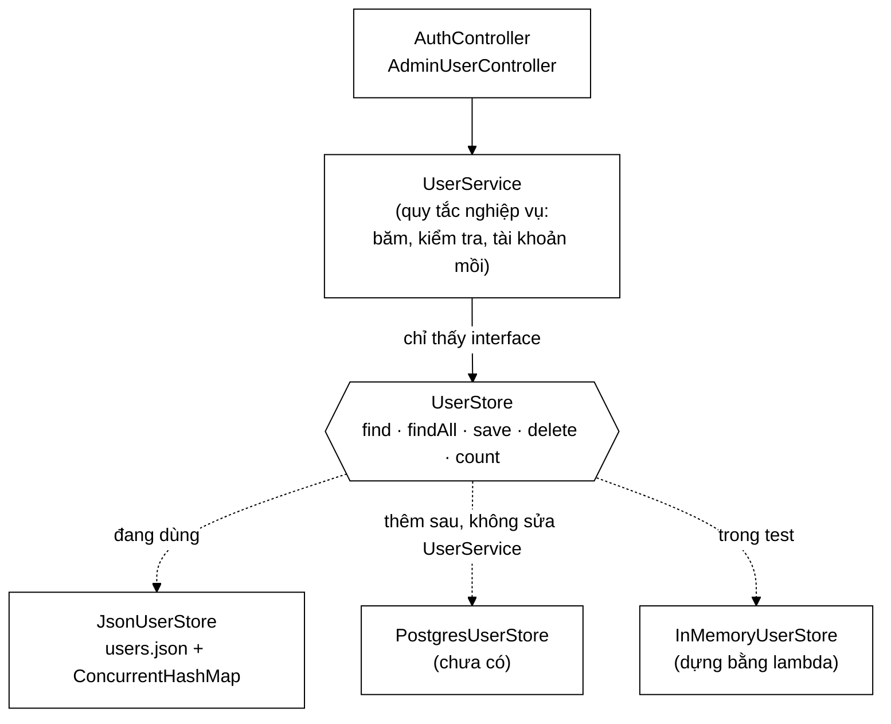

# UserStore — cái cổng để không ai phải cài PostgreSQL mới chạy được đồ án

**File nguồn:** `search-engine/src/main/java/com/vnsearch/auth/UserStore.java`
**Gói:** `com.vnsearch.auth` · **Loại:** `interface` (Strategy pattern), 5 phương thức
**Bản cài đặt hiện có:** [`JsonUserStore`](./JsonUserStore.md) · **Người dùng duy nhất:** [`UserService`](./UserService.md)
**Đọc kèm:** [`User.md`](./User.md) · `docs2/main/java/com/vnsearch/storage/DocumentStore.md`

---

## 📌 Hiểu trong 30 giây

Năm phương thức, không một dòng cài đặt. Vai trò của nó là **cắt đứt** sự phụ
thuộc giữa "logic tài khoản" và "nơi tài khoản được lưu".

Điều cần chú ý không nằm ở việc *có* một interface — ai cũng biết viết
interface. Nó nằm ở chỗ interface này **cố tình rất hẹp**: không có `update`,
không có `findByRole`, không có phân trang, không có transaction. Mỗi phương
thức vắng mặt đều là một quyết định.



```
   VÌ SAO KHÔNG DÙNG THẲNG SPRING DATA JPA

   ── Với JPA ──────────────────────────────────────────────────────
   git clone → mvnw spring-boot:run
        └─ FAIL: không kết nối được datasource
           → cài PostgreSQL → tạo database → sửa application.yml
           → chạy migration → mới thấy được trang đăng nhập
           NGƯỜI CHẤM KHÔNG LÀM TỚI BƯỚC 3.

   ── Với UserStore + JsonUserStore ────────────────────────────────
   git clone → mvnw spring-boot:run
        └─ CHẠY. users.json tự tạo ở lần đăng ký đầu tiên.
           Muốn PostgreSQL? Thêm MỘT lớp, không sửa UserService.
```

---

## 1. Vấn đề interface này giải quyết

Javadoc dòng 16–20 nói thẳng ràng buộc thiết kế của cả dự án:

> Cả dự án này được thiết kế để chạy không cần dịch vụ ngoài nào
> (`app.storage.postgres.enabled=false` là mặc định).

Đây không phải sự lười biếng mà là một **yêu cầu phi chức năng** có thật với đồ
án: thời gian từ lúc `git clone` tới lúc thấy sản phẩm chạy quyết định phần lớn
ấn tượng của người chấm. Interface này là cách thoả mãn yêu cầu đó mà không tự
nhốt mình vào một lựa chọn tạm bợ.

| | Không có interface (gọi thẳng JSON) | Có `UserStore` |
|---|---|---|
| Chạy ngay sau clone | ✅ | ✅ |
| Đổi sang PostgreSQL | Sửa rải rác trong `UserService` | Thêm 1 lớp, sửa 1 dòng `@Bean` |
| Test `UserService` | Phải tạo tệp thật, dọn tệp sau test | Lambda 5 dòng trong bộ nhớ |
| Chi phí | 0 | 47 dòng interface |

Cùng khuôn với `DocumentStore` ở tầng corpus — dự án dùng **một quy ước nhất
quán** cho mọi ranh giới lưu trữ, chứ không phải mỗi chỗ một kiểu.

---

## 2. Bản đồ hợp đồng

```
UserStore
├── find(String)      : Optional<User>   ── đọc nóng, gọi ở MỌI request
├── findAll()         : List<User>       ── trang quản trị, sắp theo createdAt
├── save(User)        : void  throws IOException   ── thêm HOẶC ghi đè
├── delete(String)    : boolean throws IOException ── true nếu có xoá thật
└── count()           : int              ── quyết định tạo tài khoản mồi
```

### 2.1 Ba điều khoản bắt buộc, không nằm trong chữ ký

Chữ ký Java chỉ nói được kiểu. Ba ràng buộc quan trọng nhất nằm ở Javadoc, và
bản cài đặt nào vi phạm cũng sẽ gây lỗi rất khó lần ra:

```
   ĐIỀU KHOẢN 1 — Tên KHÔNG phân biệt hoa thường  (dòng 27)
        find("Admin") và find("admin") phải trả về CÙNG một tài khoản.
        Vi phạm ⇒ kẻ xấu đăng ký "Admin" để mạo danh "admin".

   ĐIỀU KHOẢN 2 — save() ném IOException là THẤT BẠI THẬT  (dòng 36-38)
        Người gọi không được báo "đăng ký thành công" cho một tài khoản
        chỉ tồn tại trong RAM. Khởi động lại là mất.

   ĐIỀU KHOẢN 3 — An toàn đa luồng  (dòng 22-23)
        Đăng ký và đăng nhập đến từ các luồng HTTP khác nhau.
        Không có khoá bên ngoài nào bọc lại giúp.
```

Điều khoản 2 đáng chú ý nhất, vì nó đi ngược quán tính lập trình thông thường:

```java
// ❌ Quán tính: "ghi log rồi đi tiếp cho mượt"
try {
    store.save(user);
} catch (IOException e) {
    log.warn("Khong ghi duoc", e);
}
return "Đăng ký thành công!";   // ← nói dối người dùng

// ✅ Đúng hợp đồng
store.save(user);               // để exception nổi lên
return "Đăng ký thành công!";   // chỉ chạy khi đã ghi bền được
```

### 2.2 `count()` — vì sao không dùng `findAll().size()`

Có vẻ thừa: `count()` làm được bằng `findAll().size()`. Nhưng hai hàm này khác
nhau **về độ phức tạp** ở bản cài đặt tương lai:

| | `JsonUserStore` (hiện tại) | `PostgresUserStore` (giả định) |
|---|---|---|
| `count()` | $O(1)$ — `map.size()` | `SELECT COUNT(*)` — không tải dữ liệu |
| `findAll().size()` | $O(n\log n)$ — sao chép + **sắp xếp** | `SELECT *` — tải toàn bộ hàng về RAM |

`count()` được gọi lúc khởi động để quyết định có tạo tài khoản mồi hay không.
Dùng `findAll().size()` ở đó là kéo cả bảng về chỉ để đọc một con số.

### 2.3 `delete` trả `boolean`, `save` trả `void`

Sự bất đối xứng này có chủ đích:

- `delete("khong-ton-tai")` → `false`, **không** ném exception. Xoá cái không
  có là *bình thường* (bấm hai lần, hai tab quản trị). Controller cần phân biệt
  để trả `404` hay `204`.
- `save` luôn thành công hoặc ném. Không có trạng thái thứ ba nào để mà trả về.

### 2.4 Câu vắng mặt đáng chú ý: "Xoá tài khoản không xoá phiên đang mở"

Dòng 42 ghi rõ điều này. Đó là một **giới hạn đã biết**, không phải bỏ sót:

```
   admin xoá tài khoản "kiet" lúc 10:00
        │
        ├─ users.json: không còn "kiet"
        └─ SessionStore: token của kiet VẪN CÒN HIỆU LỰC
                └─ tới khi TTL hết hạn (xem SessionStore.md)

   ⇒ Trong cửa sổ đó, kiet vẫn gọi được API.
   ⇒ Muốn đóng ngay: TokenAuthFilter phải tra lại UserStore mỗi request.
      Đó là đánh đổi giữa "đá ra ngay" và "một lần tra bảng băm mỗi request".
```

Đây chính là loại chi tiết mà một hội đồng chấm đồ án tốt nghiệp sẽ hỏi. Tài
liệu hoá nó, kèm phương án khắc phục và cái giá của phương án đó, mạnh hơn
nhiều so với im lặng.

---

## 3. Hướng dẫn về code

### 3.1 Viết một bản cài đặt mới

Danh sách kiểm tra cho `PostgresUserStore` — theo đúng ba điều khoản ở trên:

| Yêu cầu | Cách làm |
|---|---|
| Không phân biệt hoa thường | Cột `username CITEXT`, hoặc chỉ mục trên `lower(username)` |
| `save` = thêm hoặc ghi đè | `INSERT ... ON CONFLICT (username) DO UPDATE` |
| An toàn đa luồng | Connection pool lo giúp; **đừng** dùng chung một `Connection` |
| `save` thất bại phải ném | Bọc `SQLException` thành `IOException`, đừng nuốt |
| `findAll` sắp theo `createdAt` | `ORDER BY created_at NULLS LAST` |

Đăng ký bean, không sửa `UserService`:

```java
@Bean
@ConditionalOnProperty(name = "app.auth.store", havingValue = "postgres")
UserStore postgresUserStore(DataSource ds) {
    return new PostgresUserStore(ds);
}
```

### 3.2 Bản giả trong test — vì sao không cần Mockito

Interface hẹp nên bản giả viết tay ngắn hơn cả cấu hình mock:

```java
final class InMemoryUserStore implements UserStore {
    private final Map<String, User> map = new ConcurrentHashMap<>();
    private String key(String u) { return u.trim().toLowerCase(Locale.ROOT); }

    public Optional<User> find(String u) { return Optional.ofNullable(map.get(key(u))); }
    public List<User> findAll() { return List.copyOf(map.values()); }
    public void save(User u) { map.put(key(u.username()), u); }
    public boolean delete(String u) { return map.remove(key(u)) != null; }
    public int count() { return map.size(); }
}
```

Để test đường thất bại của `save`, một lớp con 3 dòng là đủ:

```java
UserStore hongDia = new InMemoryUserStore() {
    @Override public void save(User u) throws IOException {
        throw new IOException("dia day");
    }
};
```

> ⚠️ Bản giả **phải** hạ chữ thường như bản thật. Bỏ qua chi tiết đó thì test
> xanh trong khi sản phẩm có lỗ hổng mạo danh — đúng loại test tệ nhất: test
> tạo cảm giác an toàn sai.

### 3.3 Cạm bẫy khi mở rộng interface

| Cám dỗ | Vì sao khoan đã | Cách đúng |
|---|---|---|
| Thêm `findByRole(Role)` | Mọi bản cài phải viết thêm; hiện chỉ dùng cho một chỗ đếm admin | Lọc từ `findAll()` cho tới khi số tài khoản đủ lớn |
| Thêm `findPage(int, int)` | Phân trang chỉ có nghĩa khi hàng nghìn tài khoản | Đợi tới khi có nhu cầu thật |
| Thêm `update(User)` | Trùng với `save`; hai đường ghi = hai chỗ để sai | Giữ `save` là điểm ghi duy nhất |
| Trả `List<User>` sửa được | Người gọi vô tình sửa danh sách nội bộ | Trả bản sao hoặc `List.copyOf` |

Nguyên tắc: **interface phải hẹp bằng đúng nhu cầu hiện tại**. Mỗi phương thức
thêm vào là gánh nặng cho *mọi* bản cài đặt tương lai, kể cả bản giả trong test.

---

## 4. Độ phức tạp & chi phí

Interface không có chi phí lúc chạy (JIT khử ảo hoá lời gọi khi chỉ có một bản
cài). Bảng dưới là chi phí **hợp đồng yêu cầu**, để bản cài đặt mới biết mục tiêu:

| Phương thức | Kỳ vọng | `JsonUserStore` đạt được | Vì sao quan trọng |
|---|---|---|---|
| `find` | $O(1)$ | $O(1)$ — `ConcurrentHashMap` | Chạy ở **mỗi** request có xác thực |
| `count` | $O(1)$ | $O(1)$ | Gọi lúc khởi động |
| `findAll` | $O(n\log n)$ | $O(n\log n)$ — có sắp xếp | Chỉ trang quản trị |
| `save` | $O(n)$ ghi đĩa | $O(n)$ — ghi lại cả tệp | Hiếm; $n$ hàng chục |
| `delete` | $O(n)$ ghi đĩa | $O(n)$ | Rất hiếm |

`find` phải là $O(1)$ **không thoả hiệp**. Nó nằm trên đường nóng: mỗi request
có `Authorization` đều đi qua nó. Một bản cài đặt đọc tệp trong `find` sẽ biến
mỗi request thành một lần chạm đĩa.

---

## 5. Kiểm thử liên quan

| Test | Bảo vệ điều gì |
|---|---|
| `test/java/com/vnsearch/auth/JsonUserStoreTest.java` | Bản cài đặt hiện có tuân thủ hợp đồng |
| `test/java/com/vnsearch/auth/UserServiceTest.java` | `UserService` chỉ dựa vào hợp đồng, không vào chi tiết JSON |
| `test/java/com/vnsearch/auth/AccountAuthorizationTest.java` | Đường đi từ HTTP xuống store |

```powershell
cd search-engine
.\mvnw.cmd -q -Dtest='JsonUserStoreTest,UserServiceTest' test
```

---

## 6. Chấm theo chuẩn doanh nghiệp

| Tiêu chí | Điểm | Nhận xét |
|---|---|---|
| Thiết kế trừu tượng | 9/10 | Hẹp đúng nhu cầu, cùng khuôn với `DocumentStore` |
| Rõ ràng của hợp đồng | 8/10 | Ba điều khoản viết rõ trong Javadoc — nhưng chỉ Javadoc canh giữ |
| Khả năng kiểm thử | 10/10 | Bản giả 10 dòng, không cần framework mock |
| Khả năng tiến hoá | 9/10 | Thêm PostgreSQL không đụng tầng nghiệp vụ |
| Xử lý lỗi | 8/10 | `IOException` bắt buộc bắt — ép người gọi nghĩ |
| Đầy đủ chức năng | 6/10 | Không có transaction; xoá tài khoản không đá phiên |

**Ba đề xuất nâng lên mức sản phẩm:**

1. **Bộ test hợp đồng dùng chung** — một lớp `abstract UserStoreContractTest`
   mà mọi bản cài đặt phải kế thừa và chạy qua. Ba điều khoản trở thành test,
   không còn là lời hứa trong Javadoc.
2. **`Optional<User> saveIfAbsent(User)`** để đăng ký đồng thời cùng một tên
   không bị đè lên nhau. Hiện `UserService` kiểm tra rồi mới ghi — có khe hở
   TOCTOU, tuy nhỏ vì `save` đã `synchronized`.
3. **`void deleteAllSessionsFor(String)` ở tầng phối hợp** — đóng lại khoảng
   trống "xoá tài khoản nhưng phiên còn sống" đã nêu ở mục 2.4.

---

## 7. Liên kết

- Bản cài đặt duy nhất hiện có: [`JsonUserStore.md`](./JsonUserStore.md)
- Người dùng duy nhất: [`UserService.md`](./UserService.md)
- Kiểu dữ liệu được lưu: [`User.md`](./User.md) · [`Role.md`](./Role.md)
- Khuôn mẫu tương tự ở tầng corpus: `docs2/main/java/com/vnsearch/storage/DocumentStore.md`
- Khoảng trống phiên đăng nhập: [`SessionStore.md`](./SessionStore.md)
