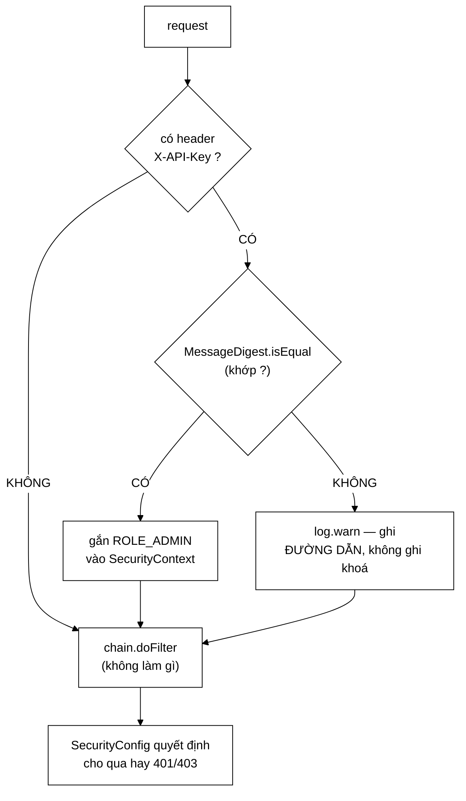

# ApiKeyAuthFilter — vì sao một phép so sánh chuỗi lại là quyết định bảo mật

**File nguồn:** `search-engine/src/main/java/com/vnsearch/config/ApiKeyAuthFilter.java` (76 dòng)
**Gói:** `com.vnsearch.config` · **Loại:** `OncePerRequestFilter` của Spring Security, bất biến sau khi dựng ⇒ an toàn đa luồng
**Vị trí trong luồng:** đứng trong chuỗi filter, **sau** [`TokenAuthFilter`](../auth/TokenAuthFilter.md), **trước** `UsernamePasswordAuthenticationFilter`
**Đọc kèm:** [`SecurityConfig.md`](./SecurityConfig.md) · [`../auth/TokenAuthFilter.md`](../auth/TokenAuthFilter.md) · [`CorsConfig.md`](./CorsConfig.md)

---

## 📌 Hiểu trong 30 giây

Lớp này làm đúng **một việc**: nếu request mang header `X-API-Key` khớp với khoá
quản trị, nó gắn vai trò `ROLE_ADMIN` vào `SecurityContext`. Nó **không** từ chối
ai cả — việc từ chối là của bảng phân quyền trong [`SecurityConfig`](./SecurityConfig.md).

```java
String provided = request.getHeader(HEADER);

if (provided != null && MessageDigest.isEqual(
        provided.getBytes(StandardCharsets.UTF_8), expectedKey)) {
    SecurityContextHolder.getContext().setAuthentication(
            new UsernamePasswordAuthenticationToken(
                    "admin-api-key", null,
                    AuthorityUtils.createAuthorityList("ROLE_ADMIN")));
} else if (provided != null) {
    log.warn("Tu choi {} {}: API key khong dung", request.getMethod(),
            request.getRequestURI());
}

chain.doFilter(request, response);
```



```
   ⭐ ĐIỂM KIẾN TRÚC QUAN TRỌNG NHẤT CỦA LỚP NÀY:
     NÓ KHÔNG BAO GIỜ GỌI response.setStatus(401).

   Filter chỉ CẤP vai trò. Bảng phân quyền TIÊU THỤ vai trò.
   ⇒ Hai việc tách hẳn nhau.

   Nếu filter tự từ chối, thì mỗi khi thêm một endpoint công khai
   ta phải sửa filter. Hiện tại chỉ sửa MỘT dòng trong
   SecurityConfig. Xem SecurityConfig.md mục 2.
```

---

## 1. `MessageDigest.isEqual` — tại sao `equals` là một lỗ hổng thật

Javadoc dòng 30–35 nêu thẳng vấn đề:

> *"Phép so `String.equals` thoát ra ngay tại ký tự đầu tiên khác nhau, nên thời
> gian chạy rò rỉ **độ dài tiền tố đúng** của khoá đoán. Đo độ chênh lệch này qua
> nhiều lần request, kẻ tấn công đoán được từng ký tự một — biến không gian tìm
> kiếm từ `62^32` xuống còn `62*32`."*

```
   CON SỐ NÀY LÀ TOÀN BỘ CÂU CHUYỆN

   Khoá 32 ký tự, bảng chữ [a-zA-Z0-9] = 62 ký tự.

   Vét cạn mù (blind brute force):
     62^32 ≈ 2,3 × 10^57 phép thử
     ⇒ không khả thi trên bất kỳ phần cứng nào

   Vét cạn có kênh phụ thời gian:
     đoán ký tự 1: thử 62 giá trị, giá trị nào chậm hơn = đúng
     đoán ký tự 2: thử 62 giá trị nữa
     ...
     62 × 32 = 1.984 phép thử
     ⇒ vài phút với một script

   ⇒ 10^57 xuống 10^3. Đây không phải "an toàn hơn một chút".
     Đây là ranh giới giữa BẤT KHẢ THI và MỘT BUỔI CHIỀU.
```

```
   VÌ SAO String.equals RÒ RỈ

   "abcdefgh".equals("aXXXXXXX")
     so sánh vị trí 0: 'a' == 'a' → tiếp
     so sánh vị trí 1: 'b' != 'X' → TRẢ VỀ FALSE NGAY

   "abcdefgh".equals("abcXXXXX")
     so sánh 3 vị trí trước khi trả false

   ⇒ Lần thứ hai chậm hơn lần thứ nhất khoảng 2 phép so sánh.
   ⇒ Chênh lệch cỡ nano-giây, nhưng có thể ĐO ĐƯỢC bằng
     thống kê trên hàng nghìn mẫu — nhiễu mạng là ngẫu nhiên
     và triệt tiêu khi lấy trung bình, còn độ lệch do thuật
     toán thì KHÔNG triệt tiêu.
```

```
   MessageDigest.isEqual LÀM GÌ KHÁC

   Nó duyệt HẾT độ dài, tích luỹ hiệu vào một biến:

     int result = 0;
     for (int i = 0; i < len; i++) {
         result |= a[i] ^ b[i];     // KHÔNG có break
     }
     return result == 0;

   ⇒ Thời gian chạy chỉ phụ thuộc ĐỘ DÀI, không phụ thuộc
     NỘI DUNG.
   ⇒ Tên lớp (`MessageDigest`) gây hiểu nhầm: nó không băm gì
     cả ở đây, chỉ là nơi JDK đặt sẵn hàm so sánh hằng thời gian.
```

```
   ⚠️ GIỚI HẠN CÒN LẠI: ĐỘ DÀI VẪN RÒ RỈ

   isEqual của JDK trả false NGAY nếu hai mảng khác độ dài
   (thực tế bản JDK hiện đại đã làm phẳng cả nhánh này, nhưng
   không phải bản nào cũng vậy, và tài liệu không hứa).

   ⇒ Kẻ tấn công có thể đoán được ĐỘ DÀI khoá.
   ⇒ Với khoá sinh bằng `openssl rand -hex 32` (luôn 64 ký tự)
     thì độ dài không phải bí mật — nó là hằng số công khai.
   ⇒ Nên rò rỉ này vô hại Ở ĐÂY. Nhưng nó vô hại vì
     HOÀN CẢNH, không phải vì mã.
```

---

## 2. Vì sao là API key chứ không phải OAuth

Javadoc dòng 22–28:

> *"Hệ thống này không có **người dùng** nào cả. Các endpoint `/api/admin/**`
> được gọi bởi một công cụ vận hành — một dòng lệnh `curl`, một job định kỳ —
> chứ không phải bởi con người ngồi trước màn hình đăng nhập."*

```
   LẬP LUẬN NÀY ĐÚNG Ở THỜI ĐIỂM VIẾT — VÀ ĐÃ LẠC HẬU

   Javadoc nói "hệ thống này không có người dùng nào cả".
   Nhưng repo hiện có:
     ../auth/UserService.md    — tài khoản, mật khẩu, khoá tạm
     ../auth/SessionStore.md   — phiên đăng nhập
     ../auth/TokenAuthFilter.md — xác thực bằng token phiên
     ../controller/AuthController.md — /api/auth/register, /login

   ⇒ Hệ thống ĐÃ CÓ người dùng.
   ⇒ Javadoc này chưa được cập nhật sau khi tầng tài khoản
     ra đời. Xem đề xuất 2.
```

```
   NHƯNG KẾT LUẬN VẪN ĐÚNG, VÌ MỘT LÝ DO KHÁC

   Bây giờ có HAI ĐƯỜNG cấp ROLE_ADMIN:

     TokenAuthFilter   → người thật, đăng nhập tài khoản/mật khẩu
     ApiKeyAuthFilter  → công cụ, header X-API-Key

   Hai đường này phục vụ hai KIỂU chủ thể khác nhau:

     Người thật cần:  đổi mật khẩu, đăng xuất, khoá tạm khi
                      sai nhiều lần, danh tính ghi được vào log
     Công cụ cần:     không trạng thái, không hết hạn,
                      cấu hình một lần qua biến môi trường,
                      chạy được trong healthcheck của Docker

   ⇒ Ép công cụ đăng nhập bằng tài khoản nghĩa là script
     phải xử lý token hết hạn, phải lưu mật khẩu ở đâu đó
     ⇒ phức tạp hơn, và MẬT KHẨU nằm trong script còn tệ hơn
       khoá API nằm trong biến môi trường.

   ⇒ Hai cơ chế cho hai kiểu chủ thể là ĐÚNG.
     Chỉ có lý do ghi trong Javadoc là đã cũ.
```

---

## 3. Ghi log khoá sai — và điều cố ý **không** ghi

```java
} else if (provided != null) {
    // Ghi log khoa SAI (khong ghi gia tri khoa) — mot loat dong nay la
    // dau hieu co nguoi dang do khoa.
    log.warn("Tu choi {} {}: API key khong dung", request.getMethod(),
            request.getRequestURI());
}
```

```
   BA QUYẾT ĐỊNH NÉN TRONG BA DÒNG

   ① `else if (provided != null)` — KHÔNG log khi thiếu hẳn header
     Vì sao: /api/search là công khai và không ai gửi X-API-Key.
     Log mỗi request công khai = log ngập, cảnh báo thật chìm nghỉm.
     ⇒ Chỉ log khi có người CỐ Ý gửi khoá mà khoá sai.

   ② KHÔNG ghi giá trị khoá được gửi lên
     Nghe hiển nhiên, nhưng đây là lỗi rất phổ biến:
     log.warn("API key sai: {}", provided)
     ⇒ khoá ĐÚNG sẽ lọt vào log ngay lần đầu ai đó gõ nhầm
       một ký tự thừa rồi sửa lại.
     ⇒ Log thường được gom về hệ thống tập trung, phân quyền
       lỏng hơn hẳn biến môi trường.
     Cùng nguyên tắc với ../auth/SessionStore.md mục 3.1.

   ③ CÓ ghi phương thức + đường dẫn
     Vì đó là thứ giúp phân biệt "một người gõ nhầm"
     với "một script đang dò": một loạt dòng cùng đường dẫn,
     cách nhau mili-giây.
```

```
   ⚠️ NHƯNG THIẾU THỨ QUAN TRỌNG NHẤT ĐỂ DÒ RA KẺ TẤN CÔNG

   Dòng log KHÔNG chứa địa chỉ IP nguồn.

   Với dòng log hiện tại:
     "Tu choi POST /api/admin/crawl: API key khong dung"  × 2.000

   Câu hỏi không trả lời được:
     - Hai nghìn dòng này từ MỘT nguồn hay từ hai nghìn nguồn?
     - Chặn ai ở tường lửa?

   RateLimitFilter ĐÃ có sẵn logic lấy IP đúng cách
   (kể cả X-Forwarded-For có kiểm soát) — xem RateLimitFilter.md mục 3.
   ⇒ Thông tin đã có trong hệ thống, chỉ không tới được đây.
   ⇒ Xem đề xuất 1.
```

---

## 4. Vì sao filter này không bị "giẫm" lên `TokenAuthFilter`

[`SecurityConfig`](./SecurityConfig.md) dòng 176–182 xếp thứ tự:

```java
.addFilterBefore(new ApiKeyAuthFilter(key),
        UsernamePasswordAuthenticationFilter.class)
.addFilterBefore(new TokenAuthFilter(sessions), ApiKeyAuthFilter.class)
```

```
   ĐỌC HAI DÒNG NÀY CHO ĐÚNG

   Dòng 1: ApiKeyAuthFilter đặt TRƯỚC UsernamePassword...
   Dòng 2: TokenAuthFilter  đặt TRƯỚC ApiKeyAuthFilter

   ⇒ Thứ tự cuối cùng:
     TokenAuthFilter → ApiKeyAuthFilter → UsernamePassword...

   Nghịch lý bề mặt: dòng khai báo SAU lại chạy TRƯỚC.
   Đây là nguồn nhầm lẫn kinh điển khi đọc cấu hình Spring Security.
```

```
   VÌ SAO TOKEN ĐI TRƯỚC — LÝ DO LÀ KHẢ NĂNG TRUY VẾT

   Bình luận trong SecurityConfig nói rõ:
   "mot request mang ca hai header thi phien CO DANH TINH thang,
    vi no ghi lai duoc ai da goi"

   Với X-API-Key:  principal = "admin-api-key"  (một chuỗi cố định)
   Với token phiên: principal = tên tài khoản thật

   ⇒ Nếu một người vừa đăng nhập vừa có khoá API, ta muốn
     nhật ký ghi TÊN HỌ, không phải "admin-api-key".
   ⇒ Đây là quyết định về TRÁCH NHIỆM GIẢI TRÌNH, không phải
     về bảo mật.
```

```
   VÀ VÌ SAO CHÚNG KHÔNG GIẪM LÊN NHAU

   Cả hai filter đều có dạng:
     if (header của tôi vắng mặt) → không làm gì, đi tiếp

   ⇒ Filter thứ hai chỉ ghi đè khi filter thứ nhất KHÔNG ghi gì.

   ⚠️ Nhưng điều này KHÔNG được kiểm chứng bằng test nào.
     Nó đúng vì đọc mã thấy đúng, không phải vì có gì canh giữ.
     Một lần sửa TokenAuthFilter thành "luôn setAuthentication,
     kể cả anonymous" sẽ vô hiệu hoá lặng lẽ đường khoá API.
```

---

## 5. Hướng dẫn thực hành

### 5.1 Gọi endpoint quản trị

```bash
# Sinh khoa (mot lan, luc trien khai)
openssl rand -hex 32

# Dat vao bien moi truong truoc khi chay
export ADMIN_API_KEY=<khoa vua sinh>

# Goi
curl -H "X-API-Key: $ADMIN_API_KEY" http://localhost:8080/api/admin/stats
```

### 5.2 Đọc mã trả về cho đúng

```
   401 Unauthorized
     ⇒ Không gửi header, hoặc khoá SAI.
     ⇒ ApiKeyAuthFilter không gắn vai trò nào,
       SecurityConfig rơi vào HttpStatusEntryPoint(401).

   403 Forbidden
     ⇒ ĐÃ xác thực (bằng token phiên) nhưng vai trò không đủ.
     ⇒ Tức là bạn đăng nhập bằng tài khoản USER, không phải ADMIN.
     ⇒ Nếu thấy 403 khi dùng X-API-Key: khoá ĐÚNG nhưng
       đường dẫn cần quyền khác — hầu như không xảy ra vì
       khoá API cấp thẳng ROLE_ADMIN.

   200 nhưng dữ liệu rỗng
     ⇒ KHÔNG phải vấn đề xác thực. Chỉ mục đang rỗng.
       Xem ../service/SearchEngineFacade.md.
```

### 5.3 Cạm bẫy

```
   ① Header phân biệt hoa thường ở phía CLIENT, không ở phía server.
     `request.getHeader` của servlet không phân biệt hoa thường,
     nên `x-api-key` cũng chạy. Nhưng đừng dựa vào điều đó —
     dùng đúng hằng ApiKeyAuthFilter.HEADER.

   ② Khoá phải nằm trong DANH SÁCH HEADER CỦA CORS.
     CorsConfig có `ApiKeyAuthFilter.HEADER` trong allowedHeaders.
     Bỏ nó ⇒ trình duyệt chặn ở bước preflight, máy chủ
     KHÔNG nhận được gì, log sạch tinh, còn `curl` vẫn 200.
     Xem CorsConfig.md mục 3.

   ③ Filter này KHÔNG giới hạn tần suất.
     RateLimitFilter đứng trước nó (order = Integer.MIN_VALUE)
     và chặn ở mức 120 req/phút cho mọi /api/*.
     ⇒ Dò khoá bằng kênh phụ thời gian cần hàng nghìn mẫu
       ⇒ rate limit là lớp phòng thủ thứ hai, và nó có thật.

   ④ Khoá nằm trong bộ nhớ dưới dạng byte[] SUỐT VÒNG ĐỜI ứng dụng.
     Không thể xoá khỏi heap. Với mô hình đe doạ ở đây
     (kẻ tấn công qua mạng) thì không sao; với mô hình
     "kẻ tấn công đọc được heap dump" thì đã thua từ lâu rồi.

   ⑤ Đổi khoá = KHỞI ĐỘNG LẠI ứng dụng.
     Không có cơ chế nạp lại nóng. Với một khoá vận hành
     thì chấp nhận được, nhưng phải biết trước khi cần
     thu hồi khẩn cấp.
```

---

## 6. Độ phức tạp & chi phí

| Thao tác | Chi phí |
|---|---|
| `doFilterInternal` — không có header | $O(1)$, không cấp phát |
| `doFilterInternal` — có header | $O(K)$ thời gian, $O(K)$ bộ nhớ tạm ($K$ = độ dài khoá) |

```
   PHÂN TÍCH — K = 64 (khoá hex 32 byte)

   request.getHeader(HEADER)          O(1) tra bảng
   provided.getBytes(UTF_8)           O(K), CẤP PHÁT mảng mới
   MessageDigest.isEqual              O(K), không cấp phát
   ─────────────────────────────────────────────────────────
   O(K) ≈ 64 phép so sánh byte

   ⇒ Với K = 64, chi phí này VÔ NGHĨA so với chi phí phân giải
     một request HTTP. Không có gì để tối ưu.

   ⚠️ Nhưng lưu ý: expectedKey được chuyển sang byte[] MỘT LẦN
     trong hàm dựng, không phải mỗi request. Đó là chi tiết
     đúng — nếu làm ngược lại thì mỗi request sinh thêm rác,
     và tệ hơn: `String` khoá sẽ sống trong pool chuỗi.
```

---

## 7. Kiểm thử liên quan

```
   ⚠️ KHÔNG CÓ FILE TEST TRỰC TIẾP CHO LỚP NÀY.

   Phủ gián tiếp:
     ../../../../../test/.../analytics/AnalyticsAuthorizationTest.md
     ../../../../../test/.../auth/AccountAuthorizationTest.md
   ⇒ Cả hai kiểm PHÂN QUYỀN (bảng của SecurityConfig),
     không kiểm CƠ CHẾ so sánh khoá.
```

```
   NHỮNG TÍNH CHẤT KHÔNG ĐƯỢC CANH GIỮ

   ✗ Khoá đúng      → ROLE_ADMIN có mặt trong SecurityContext
   ✗ Khoá sai       → KHÔNG có authentication nào được gắn
   ✗ Thiếu header   → KHÔNG có log.warn nào (tránh ngập log)
   ✗ Có header sai  → CÓ log.warn, và log KHÔNG chứa giá trị khoá
   ✗ Chuỗi rỗng     → coi như sai
   ✗ Khoá đúng nhưng dài hơn (thừa khoảng trắng) → sai

   ⇒ Tính chất thứ tư đặc biệt đáng test: nó là loại lỗi
     KHÔNG BAO GIỜ lộ ra khi chạy, chỉ lộ ra khi có người
     đọc log sáu tháng sau và thấy khoá thật nằm đó.

   ⇒ Còn "hằng thời gian" thì KHÔNG test được bằng unit test
     (đo nano-giây trên JVM có JIT là vô vọng). Cách canh giữ
     duy nhất khả thi: một test tĩnh cấm `equals` xuất hiện
     trong lớp này — xem đề xuất 3.
```

---

## 8. Liên kết

- Bảng phân quyền tiêu thụ vai trò do filter này cấp: [`SecurityConfig.md`](./SecurityConfig.md)
- Đường xác thực thứ hai, chạy **trước** filter này: [`../auth/TokenAuthFilter.md`](../auth/TokenAuthFilter.md)
- Nơi `HEADER` phải được khai lại, thiếu là hỏng âm thầm: [`CorsConfig.md`](./CorsConfig.md)
- Lớp phòng thủ đứng trước, có sẵn logic lấy IP: [`RateLimitFilter.md`](./RateLimitFilter.md)
- Kho phiên của đường xác thực người thật: [`../auth/SessionStore.md`](../auth/SessionStore.md)
- Cùng nguyên tắc "bí mật không bao giờ vào log": [`../auth/SessionStore.md`](../auth/SessionStore.md) mục 3.1
- Các endpoint được lớp này bảo vệ: [`../controller/AdminController.md`](../controller/AdminController.md) · [`../controller/AdminUserController.md`](../controller/AdminUserController.md) · [`../controller/AdminAnalyticsController.md`](../controller/AdminAnalyticsController.md)
