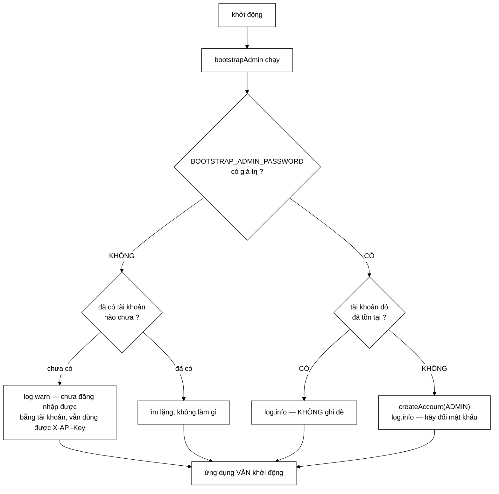

# AuthConfig — vì sao ba lớp `auth` cố tình **không** có `@Service`

**File nguồn:** `search-engine/src/main/java/com/vnsearch/config/AuthConfig.java` (103 dòng)
**Gói:** `com.vnsearch.config` · **Loại:** `@Configuration`
**Vị trí trong luồng:** dựng tầng tài khoản lúc khởi động, và tạo tài khoản quản trị đầu tiên
**Đọc kèm:** [`../auth/UserService.md`](../auth/UserService.md) · [`../auth/SessionStore.md`](../auth/SessionStore.md) · [`../auth/JsonUserStore.md`](../auth/JsonUserStore.md) · [`SecurityConfig.md`](./SecurityConfig.md)

---

## 📌 Hiểu trong 30 giây

Bốn bean. Ba bean đầu chỉ là dây nối; bean thứ tư — `bootstrapAdmin` — chứa toàn
bộ phần đáng đọc.

```java
@Bean public UserStore   userStore(...)   { return new JsonUserStore(path); }
@Bean public UserService userService(...) { return new UserService(userStore, Clock.systemUTC()); }
@Bean public SessionStore sessionStore()  { return new SessionStore(Clock.systemUTC()); }

@Bean public ApplicationRunner bootstrapAdmin(...) { /* xem mục 2 */ }
```



```
   ⭐ MŨI TÊN CUỐI CÙNG LÀ ĐIỂM ĐỐI LẬP VỚI SecurityConfig.

   SecurityConfig: thiếu ADMIN_API_KEY  ⇒ KHÔNG khởi động
   AuthConfig:     thiếu mật khẩu mồi   ⇒ VẪN khởi động

   Hai lớp cấu hình cạnh nhau, hai xử lý ngược nhau
   cho cùng một loại tình huống "thiếu bí mật".
   ⇒ Sự khác biệt đó có lý do, và lý do được ghi ra.
     Xem mục 3.
```

---

## 1. Vì sao không đánh `@Service` lên `UserService`, `SessionStore`

Javadoc dòng 21–27:

> *"Cả ba lớp nhận `Clock` qua hàm dựng để kiểm thử điều khiển được thời gian
> (hết hạn phiên, khoá tạm tài khoản). Một lớp có `@Service` thì Spring phải tự
> dựng nó, và khi đó `Clock` lại phải thành một bean **toàn cục** — thứ ảnh
> hưởng tới mọi nơi khác chỉ vì hai lớp cần nó."*

```
   CHUỖI HỆ QUẢ KHI ĐÁNH @Service

   ① @Service class SessionStore {
        SessionStore(Clock clock) { ... }
      }
   ② Spring phải tìm một bean Clock để tiêm
   ③ ⇒ phải khai @Bean Clock clock() { return Clock.systemUTC(); }
   ④ ⇒ Clock trở thành bean TOÀN CỤC
   ⑤ ⇒ Bất kỳ lớp nào sau này tiêm Clock đều nhận CÙNG một bản
   ⑥ ⇒ Một test muốn tua thời gian cho SessionStore
       sẽ tua luôn cho MỌI lớp khác

   ⇒ Một chi tiết kiểm thử của HAI lớp lan ra thành
     một quyết định kiến trúc của CẢ ứng dụng.
```

```
   ⭐ NGUYÊN TẮC TỔNG QUÁT ĐỨNG SAU

   "Phạm vi của một quyết định phải khớp với phạm vi
    của lý do tạo ra nó."

   Lý do:   hai lớp cần điều khiển thời gian trong test
   Phạm vi: hai lớp
   ⇒ Giải pháp phải nằm ở HAI LỚP đó, không phải ở
     container của cả ứng dụng.

   Cùng lập luận với SearchConfig.md khi nó giải thích vì sao
   ImageStore khai ở tầng cấu hình chứ không @Component
   trên chính lớp đó.
```

```
   LỢI ÍCH THỨ HAI, LỚN HƠN: CÁC LỚP auth LÀ POJO THUẦN

   SessionStore, UserService, JsonUserStore:
     - không import gì của Spring
     - dựng được bằng `new`
     - test được bằng JUnit thuần, không @SpringBootTest

   Đối chiếu thời gian chạy test:
     @SpringBootTest        ~3–8 giây khởi động context
     JUnit thuần            ~5 mili-giây

   ⇒ SessionStoreTest, UserServiceTest, JsonUserStoreTest
     đều là JUnit thuần. Xem
     ../../../../../test/java/com/vnsearch/auth/SessionStoreTest.md

   ⇒ Đây không phải "sạch về lý thuyết" — nó là chênh lệch
     ba bậc độ lớn trong vòng lặp phản hồi khi phát triển.
```

```
   ⚠️ CÁI GIÁ: PHỤ THUỘC KHÔNG CÒN ĐỌC ĐƯỢC TỪ LỚP

   Với @Service, mở SessionStore.java là thấy ngay nó là bean.
   Ở đây, phải biết mà tìm sang AuthConfig.

   ⇒ Với ba lớp trong một gói thì chi phí này nhỏ.
   ⇒ Với ba mươi lớp thì tầng cấu hình thành một tệp
     khổng lồ mà không ai đọc.
   ⇒ Ranh giới đó không được nêu ở đâu.
```

---

## 2. `bootstrapAdmin` — ba cách tạo admin đầu tiên

Javadoc dòng 53–66 dựng thẳng một bảng so sánh:

| Cách | Vấn đề |
|---|---|
| Mật khẩu mặc định ghi trong mã (`admin/admin`) | **Loại bỏ ngay.** Mọi bản triển khai đều có cùng một mật khẩu ai cũng biết, và phần lớn không ai đổi |
| Người đăng ký **đầu tiên** tự động thành admin | Kẻ nào tìm thấy máy chủ trước chủ nhân thì chiếm được quyền quản trị. Một cửa sổ nhỏ nhưng mở toang |
| **Biến môi trường, không có mặc định** (chọn) | Phải cấu hình thêm một bước — cái giá chấp nhận được |

```
   ⭐ VÌ SAO PHƯƠNG ÁN ② HẤP DẪN MÀ VẪN SAI

   "Người đăng ký đầu tiên thành admin" là mẫu rất phổ biến
   (GitLab, Sonarqube, nhiều CMS đều từng dùng).

   Nó nghe an toàn vì cửa sổ tấn công RẤT hẹp:
   chỉ từ lúc khởi động tới lúc chủ nhân đăng ký.

   Nhưng ba điều biến cửa sổ hẹp thành cửa sổ rộng:
     ① Máy chủ thường khởi động TRƯỚC khi ai đó nhớ ra
       phải vào đăng ký (triển khai lúc 2 giờ sáng)
     ② Bộ quét cổng tự động tìm ra dịch vụ mới trong
       vài phút, không phải vài ngày
     ③ Một lần KHỞI ĐỘNG LẠI với dữ liệu rỗng
       (đổi volume, mount sai đường dẫn) mở lại cửa sổ
       mà KHÔNG ai biết

   ⇒ Điều ③ là điều nguy hiểm nhất: cửa sổ mở lại
     mà không có sự kiện nào báo hiệu.
```

```
   VÌ SAO PHƯƠNG ÁN ① TỆ HƠN CẢ KHÔNG CÓ BẢO VỆ

   Cùng lập luận với ApiKeyAuthFilter.md Javadoc dòng 37–40:
   "mot he thong 'co bao ve' ma bao ve bang khoa mac dinh
    ai cung biet thi con nguy hiem hon he thong khong bao ve,
    vi no tao cam giac an toan sai"

   Người vận hành nhìn thấy màn hình đăng nhập ⇒ kết luận
   "hệ thống có bảo vệ" ⇒ không đặt thêm lớp nào ở tầng mạng.
```

---

## 3. Cảnh báo chứ **không** chặn khởi động — và ranh giới đó ở đâu

Javadoc dòng 68–74:

> *"Thiếu cấu hình thì cảnh báo, **KHÔNG** chặn khởi động — khác với
> `ADMIN_API_KEY`. Hai thứ khác nhau ở chỗ: thiếu khoá API nghĩa là các endpoint
> quản trị *không có gì bảo vệ* (phải chặn), còn thiếu tài khoản mồi chỉ nghĩa là
> *chưa có ai đăng nhập được bằng tài khoản*."*

```
   PHÉP THỬ ĐỂ QUYẾT ĐỊNH "CHẶN HAY CẢNH BÁO"

   Câu hỏi: thiếu cấu hình này thì hệ thống ở trạng thái nào?

   ADMIN_API_KEY thiếu:
     ⇒ /api/admin/** KHÔNG CÒN GÌ BẢO VỆ
     ⇒ trạng thái KHÔNG AN TOÀN
     ⇒ CHẶN khởi động

   BOOTSTRAP_ADMIN_PASSWORD thiếu:
     ⇒ chưa ai đăng nhập được bằng tài khoản
     ⇒ nhưng /api/admin/** VẪN được X-API-Key bảo vệ
     ⇒ và /api/search VẪN phục vụ bình thường
     ⇒ trạng thái AN TOÀN nhưng THIẾU TIỆN NGHI
     ⇒ CẢNH BÁO

   ⇒ Quy tắc: chặn khi thiếu làm hệ thống KHÔNG AN TOÀN,
     cảnh báo khi thiếu chỉ làm nó KÉM TIỆN.
```

```
   ⭐ CÂU QUAN TRỌNG NHẤT CỦA JAVADOC NÀY

   "Chan khoi dong o day se lam hong CHUC NANG CHINH
    vi mot TINH NANG PHU chua cau hinh."

   Máy tìm kiếm mà không có tài khoản quản trị vẫn là
   một máy tìm kiếm hoạt động được.
   Máy tìm kiếm không khởi động thì không là gì cả.

   ⇒ Đây là lỗi thiết kế rất hay gặp: siết chặt một tính
     năng phụ tới mức nó có quyền phủ quyết tính năng chính.
```

```
   VÀ ĐIỀU KIỆN `if (userService.count() == 0)` QUANH log.warn

   Chỉ cảnh báo khi CHƯA CÓ tài khoản nào.

   Vì sao: sau khi ai đó đã tạo tài khoản thủ công, biến
   BOOTSTRAP_ADMIN_PASSWORD trở nên KHÔNG CẦN THIẾT.
   Cảnh báo tiếp sẽ là cảnh báo SAI, và cảnh báo sai lặp
   lại mỗi lần khởi động sẽ dạy người vận hành bỏ qua
   TẤT CẢ cảnh báo.

   ⇒ Cùng nguyên tắc với ApiKeyAuthFilter.md mục 3 (chỉ log
     khi khoá SAI, không log khi vắng header): giữ cho
     cảnh báo còn sức nặng.
```

---

## 4. **Không** ghi đè tài khoản đã tồn tại

```java
if (userService.find(username).isPresent()) {
    // Đã có thì KHÔNG ghi đè: nếu ghi đè, mỗi lần khởi động sẽ đặt
    // lại mật khẩu về giá trị trong biến môi trường, và mọi lần
    // người quản trị tự đổi mật khẩu đều bị nuốt mất một cách âm thầm.
    log.info("Tai khoan quan tri moi '{}' da ton tai — khong ghi de", username);
    return;
}
```

```
   TÍNH BẤT BIẾN QUA NHIỀU LẦN CHẠY (IDEMPOTENCE)

   bootstrapAdmin chạy MỖI LẦN khởi động.
   ⇒ Nó phải cho cùng kết quả dù chạy 1 lần hay 100 lần.

   Nếu ghi đè:
     ① Người quản trị đổi mật khẩu qua giao diện
     ② Container khởi động lại (cập nhật, sập, đổi máy)
     ③ Mật khẩu QUAY VỀ giá trị trong biến môi trường
     ④ Người quản trị đăng nhập bằng mật khẩu mới → thất bại
     ⑤ Không có log nào giải thích

   ⇒ Và tệ hơn: mật khẩu cũ trong biến môi trường có thể
     đã bị lộ, đó chính là lý do họ đổi.
   ⇒ Ghi đè sẽ HOÀN TÁC một phép sửa bảo mật, âm thầm.
```

```
   ⚠️ NHƯNG CÓ MỘT MẶT TRÁI KHÔNG ĐƯỢC NÊU:
     QUÊN MẬT KHẨU LÀ KHÔNG CÓ ĐƯỜNG NÀO

   Kịch bản:
     - Chỉ có một tài khoản ADMIN
     - Quên mật khẩu
     - Đặt lại BOOTSTRAP_ADMIN_PASSWORD → KHÔNG có tác dụng
       (tài khoản đã tồn tại)

   Đường thoát duy nhất hiện tại:
     sửa tay data/users.json rồi khởi động lại.

   ⇒ Đó là một quy trình vận hành THẬT nhưng KHÔNG được
     ghi ở đâu, kể cả trong log.info đang in ra.
   ⇒ Xem đề xuất 2.
```

---

## 5. Ba lớp `Clock.systemUTC()` — và một chi tiết bị bỏ lỡ

```java
@Bean public UserService  userService(UserStore s) { return new UserService(s, Clock.systemUTC()); }
@Bean public SessionStore sessionStore()           { return new SessionStore(Clock.systemUTC()); }
```

```
   HAI BẢN Clock KHÁC NHAU CHO HAI LỚP

   Clock.systemUTC() trả về một đối tượng MỚI mỗi lần gọi,
   nhưng cả hai đều đọc cùng đồng hồ hệ thống.

   ⇒ Về chức năng: không khác gì nhau.
   ⇒ Về kiểm thử: cũng không khác, vì test không đi qua đây.

   ⇒ Nên đây KHÔNG phải lỗi. Nhưng nó bỏ lỡ một cơ hội:
     nếu muốn có một chế độ "tua thời gian" cho toàn hệ
     thống khi chạy demo/đánh giá, thì hai dòng này là nơi
     duy nhất phải sửa — và việc đó dễ hơn nhiều nếu chúng
     dùng chung một biểu thức có tên.
```

```
   ⚠️ MỘT ĐIỂM KHÔNG NHẤT QUÁN CÓ THẬT

   userStore()  → khai báo `throws IOException`
   sessionStore() → không

   JsonUserStore đọc tệp lúc dựng, nên có thể ném.
   Nếu tệp data/users.json hỏng (json sai cú pháp):
     ⇒ IOException ⇒ context không dựng được
     ⇒ ứng dụng KHÔNG khởi động

   ⇒ Đây là "chặn khởi động" — đúng mức nghiêm trọng?
     Tệp tài khoản hỏng nghĩa là KHÔNG AI đăng nhập được,
     và cũng KHÔNG BIẾT ai đang có quyền gì.
     ⇒ Chặn là đúng.
   ⇒ Nhưng nó xảy ra do một `throws` lan lên, KHÔNG phải
     do một quyết định được ghi. Thông báo lỗi sẽ là
     stack trace của Jackson, không phải một câu tiếng Việt
     nói cho người vận hành biết phải làm gì.
   ⇒ Đối lập hẳn với thông báo bốn phần ở
     SecurityConfig.md mục 5.
```

---

## 6. Hướng dẫn thực hành

### 6.1 Tạo admin đầu tiên

```bash
export ADMIN_API_KEY=$(openssl rand -hex 32)      # BAT BUOC, thieu -> khong khoi dong
export BOOTSTRAP_ADMIN_PASSWORD='mat-khau-du-dai-va-ngau-nhien'
export BOOTSTRAP_ADMIN_USERNAME=quantri            # tuy chon, mac dinh "admin"

./run-backend.bat
# Log mong doi:
#   Da tao tai khoan quan tri moi 'quantri'. Hay doi mat khau sau lan dang nhap dau.
```

### 6.2 Đọc log lúc khởi động

```
   "Da tao tai khoan quan tri moi 'X'"
     ⇒ Tài khoản VỪA được tạo. Đăng nhập rồi đổi mật khẩu ngay.

   "Tai khoan quan tri moi 'X' da ton tai — khong ghi de"
     ⇒ Bình thường ở mọi lần khởi động thứ hai trở đi.
     ⇒ Nếu bạn đang MONG mật khẩu được đặt lại thì
       dòng này nghĩa là KHÔNG. Xem mục 4.

   "Chua co tai khoan nao va cung chua khai bao ..."
     ⇒ Chưa đăng nhập được bằng tài khoản.
     ⇒ Nhưng X-API-Key VẪN dùng được cho mọi endpoint quản trị.
     ⇒ Đây là cảnh báo, không phải lỗi.

   (không có dòng nào của AuthConfig)
     ⇒ Đã có tài khoản và không khai mật khẩu mồi.
       Trạng thái bình thường của một hệ thống đang chạy.
```

### 6.3 Cạm bẫy

```
   ① BOOTSTRAP_ADMIN_PASSWORD KHÔNG đặt lại mật khẩu
     của tài khoản đã tồn tại. Nó chỉ TẠO MỚI.

   ② Quên mật khẩu admin duy nhất = phải sửa tay
     data/users.json. Không có lệnh nào cho việc này.

   ③ Mật khẩu nằm trong biến môi trường ⇒ nó có trong
     `docker inspect`, trong `/proc/<pid>/environ`,
     và trong lịch sử shell nếu gõ trực tiếp.
     ⇒ Dùng tệp env với quyền 600, hoặc secret của
       hệ điều phối.

   ④ userStore ném IOException nếu data/users.json hỏng
     ⇒ ứng dụng không khởi động, và thông báo là stack
     trace của Jackson chứ không phải câu giải thích.

   ⑤ app.auth.users-path mặc định "data/users.json" —
     đường dẫn TƯƠNG ĐỐI với thư mục làm việc.
     Chạy từ thư mục khác ⇒ tạo tệp mới ⇒ MẤT hết
     tài khoản một cách âm thầm.

   ⑥ Ba bean này KHÔNG có @Service, nên tìm "ai dựng
     SessionStore?" bằng cách đọc SessionStore.java sẽ
     không ra. Phải tìm ở đây.
```

---

## 7. Độ phức tạp & chi phí

| Thao tác | Chi phí |
|---|---|
| Dựng ba bean | $O(N)$ với $N$ = số tài khoản (đọc `users.json`) |
| `bootstrapAdmin` — đã có tài khoản | $O(1)$ tra bảng |
| `bootstrapAdmin` — tạo mới | $O(1)$ + một lần băm mật khẩu |

```
   PHÂN TÍCH — CHI PHÍ KHỞI ĐỘNG

   JsonUserStore đọc toàn bộ tệp     O(N)
   userService.count()               O(1)
   userService.find(username)        O(1) (HashMap)
   createAccount → băm mật khẩu      ~100–300 ms

   ⇒ Băm mật khẩu là phần ĐẮT NHẤT, và nó ĐẮT CÓ CHỦ Ý
     (xem ../auth/UserService.md — hàm băm chậm là biện
     pháp chống dò mật khẩu).
   ⇒ Nhưng nó chỉ chạy MỘT LẦN, ở lần khởi động đầu tiên.

   ⇒ Với N vài chục tài khoản, toàn bộ tầng này thêm
     chưa tới nửa giây vào thời gian khởi động —
     so với ~40 giây nạp chỉ mục thì không đáng kể.
```

---

## 8. Kiểm thử liên quan

| Tệp test | Kiểm gì |
|---|---|
| [`UserServiceTest`](../../../../../test/java/com/vnsearch/auth/UserServiceTest.md) | `UserService` (JUnit thuần — nhờ chính quyết định ở mục 1) |
| [`SessionStoreTest`](../../../../../test/java/com/vnsearch/auth/SessionStoreTest.md) | `SessionStore` với `Clock` giả |
| [`JsonUserStoreTest`](../../../../../test/java/com/vnsearch/auth/JsonUserStoreTest.md) | Đọc/ghi tệp tài khoản |

```
   ⚠️ KHÔNG CÓ TEST NÀO CHO CHÍNH bootstrapAdmin.

   Ba tệp trên test các lớp ĐƯỢC DỰNG ở đây,
   không test LOGIC DỰNG.
```

```
   NHỮNG THỨ KHÔNG ĐƯỢC CANH GIỮ

   ✗ Chạy hai lần KHÔNG ghi đè mật khẩu đã đổi
     — đây là bất biến quan trọng nhất của bean này, và
     việc mất nó sẽ HOÀN TÁC một phép sửa bảo mật, âm thầm.

   ✗ Thiếu mật khẩu + chưa có tài khoản → CÓ cảnh báo
   ✗ Thiếu mật khẩu + đã có tài khoản → KHÔNG cảnh báo
     (cảnh báo sai lặp lại sẽ dạy người ta bỏ qua cảnh báo)

   ✗ Thiếu mật khẩu KHÔNG chặn khởi động
     — đối lập có chủ ý với ADMIN_API_KEY, và không gì
     ngăn ai đó "sửa cho nhất quán" rồi làm hỏng
     chức năng chính.

   ✗ Tài khoản tạo ra có đúng vai trò ADMIN

   ⇒ Bốn tính chất, và cả bốn đều kiểm được bằng
     ApplicationContextRunner trong vài mili-giây.
     Xem đề xuất 1.
```

---

## 9. Chấm theo chuẩn doanh nghiệp

| Tiêu chí | Điểm | Nhận xét |
|---|---|---|
| **Bảng ba phương án tạo admin đầu tiên** | 10/10 | Nêu cả hai phương án bị loại **và vấn đề cụ thể** của từng cái, không chỉ tuyên bố lựa chọn |
| **Ranh giới "chặn" và "cảnh báo" có lý do rõ** | 10/10 | "Chặn khởi động ở đây sẽ làm hỏng **chức năng chính** vì một **tính năng phụ** chưa cấu hình" |
| **Không ghi đè tài khoản đã tồn tại** | 10/10 | Bất biến qua nhiều lần chạy; nếu sai, nó sẽ **hoàn tác một phép sửa bảo mật** một cách âm thầm |
| Chỉ cảnh báo khi chưa có tài khoản nào | 9/10 | Tránh cảnh báo sai lặp lại — thứ dạy người vận hành bỏ qua mọi cảnh báo |
| Lý do không dùng `@Service` | 9/10 | "Phạm vi quyết định khớp phạm vi lý do" — và kết quả là ba tệp test chạy bằng JUnit thuần |
| Nội dung cảnh báo chỉ đúng lối thoát | 9/10 | Nói rõ *"vẫn dùng được X-API-Key cho các endpoint quản trị"* — người đọc biết ngay phải làm gì tiếp |
| **Kiểm thử chính logic khởi tạo** | **0/10** | Bốn bất biến, **không một test nào**, dù `ApplicationContextRunner` chạy trong mili-giây |
| **Không có đường đặt lại mật khẩu** | **3/10** | Quên mật khẩu admin duy nhất ⇒ sửa tay `users.json`; quy trình này không được ghi ở đâu |
| `IOException` lan lên không kiểm soát | 4/10 | Tệp `users.json` hỏng ⇒ không khởi động, kèm stack trace Jackson thay vì thông báo bốn phần |
| Đường dẫn tương đối mặc định | 5/10 | `data/users.json` phụ thuộc thư mục làm việc — chạy sai chỗ là **mất sạch tài khoản** âm thầm |
| Phụ thuộc không đọc được từ lớp | 6/10 | Đánh đổi có ý thức, nhưng không nêu ranh giới nào để biết khi nào cách này thôi hợp lý |
| Hai `Clock.systemUTC()` riêng | 7/10 | Không sai, nhưng bỏ lỡ điểm duy nhất để sau này điều khiển thời gian toàn hệ thống |

**Ba đề xuất nâng lên mức sản phẩm:**

1. **Test `bootstrapAdmin` bằng `ApplicationContextRunner`.** Bốn bất biến của
   bean này đều rẻ để kiểm, và bất biến quan trọng nhất — *chạy lần hai không ghi
   đè* — nếu hỏng sẽ **hoàn tác một phép sửa bảo mật** mà không để lại dấu vết
   nào:
   ```java
   class AuthConfigTest {

       private final ApplicationContextRunner runner = new ApplicationContextRunner()
               .withUserConfiguration(AuthConfig.class);

       @Test
       void chayLanHaiKhongGhiDeMatKhauDaDoi(@TempDir Path thuMuc) {
           String duongDan = thuMuc.resolve("users.json").toString();

           runner.withPropertyValues(
                   "app.auth.users-path=" + duongDan,
                   "app.auth.bootstrap-admin.password=mat-khau-ban-dau")
                 .run(ctx -> ctx.getBean(ApplicationRunner.class).run(null));

           // Nguoi quan tri tu doi mat khau
           new UserService(new JsonUserStore(duongDan), Clock.systemUTC())
                   .changePassword("admin", "mat-khau-ban-dau", "mat-khau-moi");

           // Khoi dong lai voi CUNG bien moi truong cu
           runner.withPropertyValues(
                   "app.auth.users-path=" + duongDan,
                   "app.auth.bootstrap-admin.password=mat-khau-ban-dau")
                 .run(ctx -> ctx.getBean(ApplicationRunner.class).run(null));

           UserService sau = new UserService(new JsonUserStore(duongDan), Clock.systemUTC());
           assertTrue(sau.authenticate("admin", "mat-khau-moi").isPresent(),
                   "khoi dong lai KHONG duoc dat lai mat khau ve gia tri bien moi truong");
       }

       @Test
       void thieuMatKhauMoiKhongDuocChanKhoiDong() {
           runner.withPropertyValues("app.auth.users-path=" + tempPath())
                 .run(ctx -> assertFalse(ctx.getStartupFailure() != null,
                         "thieu tinh nang phu khong duoc pha chuc nang chinh"));
       }
   }
   ```
   Test thứ hai đặc biệt đáng có: nó ghim lại **sự khác biệt có chủ ý** với
   `ADMIN_API_KEY`, thứ mà một người muốn "sửa cho nhất quán" rất dễ phá.

2. **Cho phép đặt lại mật khẩu qua biến môi trường riêng, và nói ra trong log.**
   Hiện tại quên mật khẩu admin duy nhất là bế tắc — đường thoát duy nhất là sửa
   tay `data/users.json`, một quy trình không được ghi ở đâu kể cả trong dòng
   `log.info` đang in ra đúng lúc người vận hành cần nó nhất:
   ```java
   @Value("${app.auth.bootstrap-admin.force-reset:false}") boolean datLai

   if (userService.find(username).isPresent()) {
       if (datLai) {
           userService.resetPassword(username, password);
           log.warn("DA DAT LAI mat khau cua '{}' theo yeu cau"
                   + " (app.auth.bootstrap-admin.force-reset=true)."
                   + " HAY BO bien nay ngay sau khi dang nhap duoc,"
                   + " neu khong moi lan khoi dong deu dat lai mat khau.", username);
           return;
       }
       log.info("Tai khoan quan tri '{}' da ton tai — khong ghi de."
               + " Neu can dat lai mat khau: dat"
               + " app.auth.bootstrap-admin.force-reset=true cho MOT lan khoi dong.",
               username);
       return;
   }
   ```
   Mặc định `false` giữ nguyên bất biến ở mục 4; cờ này là một hành động **có ý
   thức, một lần**, và chính dòng log dạy người vận hành cách dùng nó.

3. **Bọc lỗi đọc `users.json` thành thông báo bốn phần.** `SecurityConfig` đã đặt
   chuẩn: *cái gì thiếu, ở đâu, vì sao quan trọng, làm sao sửa*. Tệp tài khoản
   hỏng là tình huống **nghiêm trọng hơn** thiếu khoá API (không ai đăng nhập
   được, và không biết ai đang có quyền gì), nhưng nó hiện ra dưới dạng một stack
   trace của Jackson:
   ```java
   @Bean
   public UserStore userStore(@Value("${app.auth.users-path:data/users.json}") String path) {
       try {
           return new JsonUserStore(path);
       } catch (IOException e) {
           throw new IllegalStateException(
                   "Khong doc duoc tep tai khoan '" + Path.of(path).toAbsolutePath() + "'. "
                           + "Day la noi luu TOAN BO tai khoan va vai tro, nen chay tiep"
                           + " se khong ai dang nhap duoc va cung khong biet ai co quyen gi. "
                           + "Kiem tra: (1) duong dan — app.auth.users-path la duong dan TUONG DOI"
                           + " voi thu muc lam viec hien tai; (2) cu phap JSON cua tep. "
                           + "Muon bat dau lai tu dau: doi ten tep cu roi dat"
                           + " BOOTSTRAP_ADMIN_PASSWORD.", e);
       }
   }
   ```
   In ra **đường dẫn tuyệt đối** là chi tiết quan trọng nhất ở đây: nó gỡ luôn cạm
   bẫy ⑤ ở mục 6.3, vì phần lớn các lần gặp lỗi này thực ra là chạy nhầm thư mục
   làm việc chứ không phải tệp hỏng.

---

## 10. Liên kết

- Lớp dịch vụ tài khoản được dựng ở đây: [`../auth/UserService.md`](../auth/UserService.md)
- Kho phiên, cũng nhận `Clock` qua hàm dựng: [`../auth/SessionStore.md`](../auth/SessionStore.md)
- Kho tài khoản trên tệp JSON: [`../auth/JsonUserStore.md`](../auth/JsonUserStore.md) · [`../auth/UserStore.md`](../auth/UserStore.md)
- Vai trò được gán cho tài khoản mồi: [`../auth/Role.md`](../auth/Role.md)
- Xử lý đối lập với cùng loại tình huống "thiếu bí mật": [`SecurityConfig.md`](./SecurityConfig.md) mục 5
- Đường xác thực thứ hai vẫn dùng được khi chưa có tài khoản: [`ApiKeyAuthFilter.md`](./ApiKeyAuthFilter.md)
- Nơi tài khoản được dùng để đăng nhập: [`../controller/AuthController.md`](../controller/AuthController.md)
- Nơi vai trò được đổi sau này: [`../controller/AdminUserController.md`](../controller/AdminUserController.md)
- Cùng nguyên tắc "khai bean ở tầng cấu hình để lớp nghiệp vụ là POJO thuần": [`SearchConfig.md`](./SearchConfig.md)
