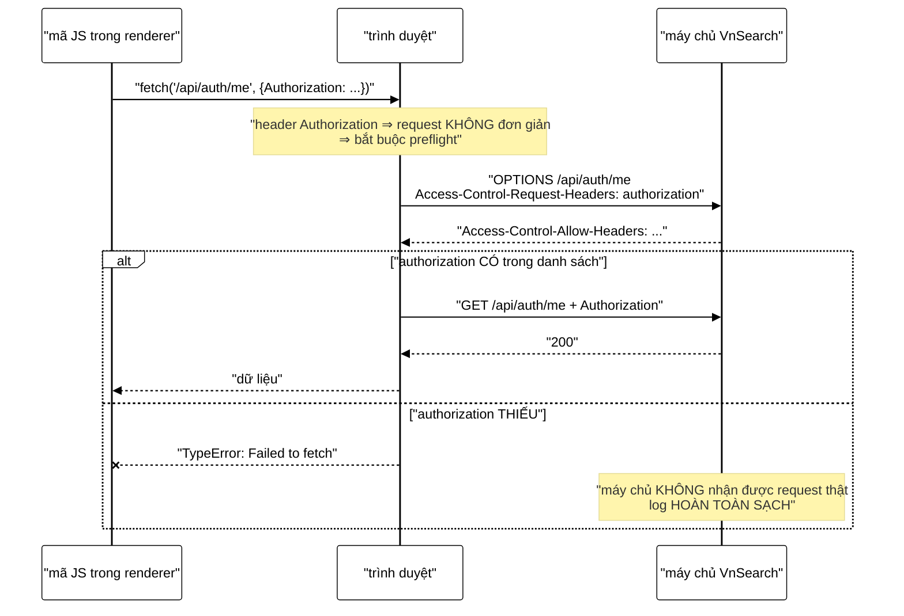

# CorsConfig — lớp cấu hình mà mọi lỗi đều im lặng ở phía máy chủ

**File nguồn:** `search-engine/src/main/java/com/vnsearch/config/CorsConfig.java` (82 dòng)
**Gói:** `com.vnsearch.config` · **Loại:** `@Configuration implements WebMvcConfigurer`
**Vị trí trong luồng:** quyết định **trình duyệt nào đọc được phản hồi** — không nằm trên đường bảo vệ dữ liệu
**Đọc kèm:** [`SecurityConfig.md`](./SecurityConfig.md) · [`ApiKeyAuthFilter.md`](./ApiKeyAuthFilter.md) · [`../auth/TokenAuthFilter.md`](../auth/TokenAuthFilter.md)

---

## 📌 Hiểu trong 30 giây

```java
registry.addMapping("/api/**")
        .allowedOriginPatterns(allowedOrigins, "file://*", "null")
        .allowedMethods("GET", "POST", "DELETE", "OPTIONS")
        .allowedHeaders("Accept", "Content-Type", "Authorization",
                ApiKeyAuthFilter.HEADER)
        .allowCredentials(false)
        .maxAge(3600);
```

Sáu dòng, và **năm trong sáu** đều có bình luận kể lại một sự cố thật.



```
   ⭐ NHÁNH `else` LÀ LÝ DO TỆP NÀY CẦN MỘT TÀI LIỆU RIÊNG.

   Mọi lỗi cấu hình CORS đều có cùng một triệu chứng:
     - Giao diện: "không kết nối được"
     - Log máy chủ: KHÔNG CÓ GÌ
     - curl: 200, hoàn toàn bình thường

   ⇒ Ba nguồn thông tin, và hai trong ba đều nói "mọi thứ ổn".
   ⇒ Đây là lý do các bình luận trong tệp này dài bất thường:
     người viết đã mất thời gian lần ra từng lỗi một.
```

---

## 1. Gốc `"null"` — mục đáng ngờ nhất, và vì sao vẫn phải giữ

Javadoc dòng 11–18:

> *"Nhìn qua thì đây là mục đáng ngờ nhất của cả tệp — gốc `null` cũng được gửi
> bởi iframe sandbox và trang `data:`, nên nó rộng hơn mọi mục khác. Nhưng bỏ nó
> đi thì **bản đóng gói của browser-app ngừng hoạt động**."*

```
   VÌ SAO ORIGIN LẠI LÀ "null"

   browser-app có HAI chế độ chạy:

   ① Phát triển:  Vite dev server
     renderer nạp qua http://localhost:5173
     ⇒ Origin: http://localhost:5173

   ② Đóng gói:    Electron production build
     renderer nạp qua file:///.../index.html
     ⇒ Chromium KHÔNG gửi Origin: file://...
       vì đặc tả nói gốc của file:// là "mờ đục" (opaque)
     ⇒ nó gửi đúng chuỗi   Origin: null

   ⇒ "null" ở đây KHÔNG phải giá trị thiếu.
     Nó là một giá trị THẬT, do đặc tả quy định.
```

```
   ⚠️ AI KHÁC CŨNG GỬI Origin: null

   - iframe có thuộc tính sandbox (không có allow-same-origin)
   - trang data: URI
   - trang được nạp bằng srcdoc
   - một số trường hợp chuyển hướng chéo gốc

   ⇒ Cho phép "null" nghĩa là cho phép TẤT CẢ nhóm đó.
   ⇒ Đây là mục RỘNG NHẤT trong danh sách, rộng hơn cả
     một tên miền cụ thể.
```

```
   VÌ SAO VẪN CHẤP NHẬN ĐƯỢC — VÀ ĐIỀU KIỆN ĐỦ

   Rủi ro của một gốc lạ đọc được API chỉ thành THẬT khi
   trình duyệt tự động đính kèm thông tin xác thực.

   Ở đây:
     allowCredentials(false)  ⇒ KHÔNG đính cookie
     xác thực bằng HEADER     ⇒ mã JS phải TỰ đặt vào

   ⇒ Một trang data: độc hại gọi /api/search sẽ đọc được
     kết quả tìm kiếm CÔNG KHAI — thứ nó cũng lấy được
     bằng một request từ máy chủ của chính nó.
   ⇒ Nó KHÔNG đọc được /api/admin/** vì nó không có khoá.

   ⇒ Nên đánh đổi này an toàn CHỪNG NÀO allowCredentials
     còn là false. Hai dòng cách nhau bốn dòng trong cùng
     một tệp — và mối liên hệ đó được ghi rõ. Tốt.
```

---

## 2. `allowCredentials(false)` — dòng biến cấu hình rộng thành lỗ hổng

Javadoc dòng 23–27:

> *"Đây mới là thứ biến một cấu hình CORS rộng thành một lỗ hổng: không có nó,
> trình duyệt **TỰ ĐỘNG** đính kèm cookie của nạn nhân."*

```
   PHÂN BIỆT HAI THỨ NGƯỜI TA HAY GỘP

   "Cho phép gốc X gọi API"
     ⇒ mã JS ở gốc X gửi được request và ĐỌC được phản hồi

   "Cho phép gốc X gọi API KÈM THÔNG TIN XÁC THỰC"
     ⇒ trình duyệt đính cookie/chứng chỉ của NGƯỜI DÙNG
       vào request đó, TỰ ĐỘNG, không cần mã JS làm gì

   ⇒ Chỉ điều thứ hai mới là lỗ hổng nghiêm trọng:
     một trang độc hại hành động NHÂN DANH nạn nhân.

   ⇒ Với allowCredentials(false), trang độc hại vẫn gọi được,
     nhưng nó gọi với tư cách VÔ DANH.
```

```
   ⭐ VÌ SAO GHI TƯỜNG MINH DÙ ĐÂY LÀ MẶC ĐỊNH CỦA SPRING

   Bình luận dòng 74–76:
   "TUONG MINH, du day la mac dinh cua Spring... Ghi ro de mot
    thay doi sau nay phai la mot quyet dinh co y thuc chu khong
    phai mot dong them vao cho tien."

   Kịch bản mà dòng này ngăn chặn:
     Sáu tháng sau, ai đó cần cookie cho một tính năng mới.
     - Nếu dòng KHÔNG có: họ thêm .allowCredentials(true)
       ⇒ một dòng thêm vào, không xoá gì, review dễ bỏ qua
     - Nếu dòng CÓ: họ phải SỬA false → true
       ⇒ diff hiện ra một phép đảo ngược, và bình luận
         ngay trên đó giải thích hậu quả

   ⇒ Ghi tường minh giá trị mặc định là một kỹ thuật:
     nó biến "thêm" thành "sửa", và "sửa" khó lọt review hơn.
```

```
   ⚠️ VÀ NÓ LÀ ĐIỀU KIỆN THỨ BA CỦA VIỆC TẮT CSRF

   SecurityConfig.md mục 6 liệt kê ba điều kiện đủ để
   csrf().disable() an toàn:
     ① không dùng cookie          (SecurityConfig)
     ② SessionCreationPolicy.STATELESS (SecurityConfig)
     ③ CORS không cho credentials      ← Ở ĐÂY

   ⇒ Đổi dòng này thành true sẽ mở lại lỗ hổng CSRF
     mà KHÔNG chạm vào SecurityConfig.
   ⇒ Không có gì trong mã ràng buộc hai tệp lại với nhau.
     Xem đề xuất 2.
```

---

## 3. `allowedHeaders` — thiếu một chuỗi là hỏng cả tầng đăng nhập

Bình luận dòng 62–71, dài nhất tệp:

> *"THIẾU DÒNG NÀY LÀ HỎNG CẢ TẦNG ĐĂNG NHẬP, và nó hỏng theo kiểu khó lần nhất:
> trình duyệt chặn request ở bước PREFLIGHT, nên máy chủ không nhận được gì và
> log hoàn toàn sạch. Mọi phép thử bằng `curl` đều 200 — curl không bị CORS ràng
> buộc."*

```
   TRIỆU CHỨNG CHÍNH XÁC KHI THIẾU "Authorization"

   ✓ Đăng nhập THÀNH CÔNG
     POST /api/auth/login chỉ gửi Content-Type: application/json
     ⇒ nằm trong danh sách ⇒ preflight qua

   ✗ GET /api/auth/me   → "không kết nối được"
   ✗ Mọi endpoint quản trị → "không kết nối được"
   ✗ Tải lại trang → phiên KHÔNG khôi phục được

   ⇒ Triệu chứng này gây hiểu nhầm nghiêm trọng:
     "đăng nhập được nhưng không dùng được gì"
     nghe giống lỗi PHÂN QUYỀN, nên người sửa sẽ đi lục
     SecurityConfig — sai chỗ hoàn toàn.
```

```
   VÌ SAO Content-Type ĐỦ MÀ Authorization THÌ KHÔNG

   Đặc tả CORS có khái niệm "request đơn giản" (simple request),
   không cần preflight. Điều kiện:
     - phương thức GET / HEAD / POST
     - VÀ chỉ dùng các header trong danh sách trắng cố định
       (Accept, Accept-Language, Content-Language, Content-Type)
     - VÀ Content-Type ∈ {text/plain, multipart/form-data,
                          application/x-www-form-urlencoded}

   POST /api/auth/login với Content-Type: application/json
     ⇒ KHÔNG đơn giản (json không nằm trong ba giá trị trên)
     ⇒ CÓ preflight, nhưng "content-type" nằm trong
       allowedHeaders nên qua

   GET /api/auth/me với Authorization
     ⇒ Authorization KHÔNG bao giờ nằm trong danh sách trắng
     ⇒ LUÔN cần preflight, và luôn cần khai tường minh

   ⇒ Đây là lý do lỗi này chỉ đánh vào các endpoint CẦN
     xác thực — tức là đúng những endpoint quan trọng nhất.
```

```
   VÌ SAO KHÔNG DÙNG "*"

   Javadoc dòng 32–34: «"*" cho qua ca nhung header chua ai
   nghi toi. Ba header duoi la toan bo nhung gi tang goi
   that su gui.»

   Thêm một lý do kỹ thuật mà Javadoc không nêu:
   với allowCredentials(true), "*" bị đặc tả CẤM —
   trình duyệt từ chối. Ở đây allowCredentials là false
   nên "*" vẫn chạy, nhưng nó là một quả bom hẹn giờ:
   ngày nào đó bật credentials lên, "*" sẽ hỏng
   ĐỒNG THỜI với việc mở lỗ hổng.

   ⇒ Danh sách cụ thể tránh được cả hai.
```

---

## 4. `allowedMethods` — cùng một bài học, lần thứ hai

Bình luận dòng 51–60:

> *"DELETE được thêm cùng lúc với `DELETE /api/admin/users/{tên}`. Nhớ bài học
> của chính tệp này: một phương thức thiếu ở đây bị trình duyệt chặn ở bước
> PREFLIGHT, máy chủ không nhận được gì, log sạch tinh, và `curl` vẫn 200."*

```
   ⭐ ĐÂY LÀ LẦN THỨ HAI CÙNG MỘT LỖI XẢY RA TRONG CÙNG MỘT TỆP.

   Lần 1: thiếu "Authorization" trong allowedHeaders
   Lần 2: thiếu "DELETE"        trong allowedMethods

   Cùng triệu chứng, cùng cách lần ra, cùng độ khó.

   ⇒ Khi một loại lỗi lặp lại, bình luận KHÔNG còn là
     giải pháp — nó chỉ là cảnh báo cho người đọc mã.
     Người THÊM endpoint mới thường không đọc tệp này.
   ⇒ Cần một cơ chế TỰ ĐỘNG. Xem đề xuất 1.
```

```
   VÌ SAO KHÔNG CÓ PUT/PATCH — VÀ ĐÂY LÀ QUYẾT ĐỊNH ĐÚNG

   Bình luận dòng 59–60: "PUT/PATCH van khong co: khong
   endpoint nao dung chung. Quyen thua khong dung den van
   la quyen thua."

   Đối chiếu với bảng endpoint trong SecurityConfig:
     GET     — search, suggest, health, images, feed, me,
               admin/stats, admin/users, admin/analytics
     POST    — events, register, login, logout, admin/crawl,
               admin/reindex, admin/users/{ten}/role
     DELETE  — admin/users/{ten}
     PUT     — (không có)
     PATCH   — (không có)

   ⇒ Danh sách bốn phương thức khớp CHÍNH XÁC với thực tế.
   ⇒ Kiểm chứng được bằng cách đọc hai tệp — và đó chính là
     việc nên tự động hoá.
```

---

## 5. CORS **không** phải lớp bảo vệ

Javadoc dòng 37–39:

> *"CORS **không phải** lớp bảo vệ của `/api/admin/**` — lớp đó là
> `ApiKeyAuthFilter`. CORS chỉ quyết định trình duyệt nào đọc được phản hồi; một
> lệnh `curl` không bị CORS ràng buộc chút nào."*

```
   HIỂU NHẦM PHỔ BIẾN NHẤT VỀ CORS

   Sai:  "CORS chặn không cho ai gọi API của tôi"
   Đúng: "CORS chặn không cho MÃ JS Ở GỐC KHÁC ĐỌC phản hồi"

   Ba hệ quả:
     ① curl, Python requests, một máy chủ khác
        ⇒ KHÔNG bị CORS ràng buộc chút nào
     ② Request THẬT có thể đã tới máy chủ và đã THỰC THI
        rồi mới bị trình duyệt giấu phản hồi
        (đúng với request "đơn giản" không cần preflight)
     ③ ⇒ CORS KHÔNG bảo vệ tác dụng phụ, chỉ bảo vệ dữ liệu đọc

   ⇒ Với /api/admin/**, thứ chặn kẻ tấn công là
     ApiKeyAuthFilter. CORS chỉ là chuyện của giao diện.
```

```
   BẢNG PHÂN CÔNG BA LỚP — AI CHẶN AI

   RateLimitFilter    chặn: trận lũ request (mọi nguồn)
   ApiKeyAuthFilter   chặn: kẻ không có khoá (mọi nguồn)
   TokenAuthFilter    chặn: kẻ không có phiên (mọi nguồn)
   CorsConfig         chặn: mã JS ở gốc lạ ĐỌC phản hồi
                            (chỉ trong trình duyệt)

   ⇒ Ba lớp đầu bảo vệ HỆ THỐNG.
   ⇒ Lớp thứ tư bảo vệ NGƯỜI DÙNG khỏi trang web khác,
     và chỉ khi họ dùng trình duyệt.
```

---

## 6. `maxAge(3600)` — cái giá của việc sửa cấu hình

```java
.maxAge(3600);   // trinh duyet nho ket qua preflight 1 gio
```

```
   LỢI ÍCH

   Không có maxAge (mặc định của Spring là 1800 giây):
     mỗi POST/DELETE tốn HAI vòng mạng thay vì một

   Với 3600:
     preflight cho mỗi (gốc, đường dẫn, phương thức)
     chỉ hỏi một lần mỗi giờ

   ⇒ Với giao diện gọi /api/search liên tục thì không đổi gì
     (GET đơn giản, không preflight).
   ⇒ Với /api/events (POST, json) thì tiết kiệm thật.
```

```
   ⚠️ CÁI GIÁ ÍT AI NGHĨ TỚI

   Sửa cấu hình CORS ⇒ trình duyệt của người đang mở ứng dụng
   VẪN DÙNG kết quả preflight cũ tới một giờ.

   Kịch bản thật:
     ① Phát hiện thiếu "DELETE", thêm vào, triển khai lại
     ② Thử lại trên trình duyệt đang mở → VẪN HỎNG
     ③ Kết luận sai: "phép sửa không có tác dụng"
     ④ Đi tìm nguyên nhân khác trong một giờ

   ⇒ Cách thoát: mở tab ẩn danh, hoặc DevTools →
     "Disable cache" (Chromium cũng bỏ qua cache preflight
     khi DevTools mở với tuỳ chọn đó).

   ⇒ Điều này KHÔNG được ghi ở đâu cả, và nó chính là
     cái bẫy tiếp theo sau khi đã lần ra được lỗi thật.
```

---

## 7. Hướng dẫn thực hành

### 7.1 Kiểm tra preflight bằng `curl`

```bash
# Mo phong dung thu trinh duyet gui
curl -i -X OPTIONS http://localhost:8080/api/auth/me \
  -H "Origin: null" \
  -H "Access-Control-Request-Method: GET" \
  -H "Access-Control-Request-Headers: authorization"

# Phai thay trong phan hoi:
#   Access-Control-Allow-Origin: null
#   Access-Control-Allow-Headers: ...authorization...
# Thieu mot trong hai -> trinh duyet se chan
```

```
   ⭐ ĐÂY LÀ CÁCH DUY NHẤT DÙNG curl ĐỂ KIỂM CORS.

   `curl http://localhost:8080/api/auth/me -H "Authorization: ..."`
   LUÔN trả 200 dù cấu hình CORS sai hoàn toàn.

   Phải gửi ĐÚNG request OPTIONS với đủ hai header
   Access-Control-Request-* thì máy chủ mới trả lời như
   nó trả lời cho trình duyệt.
```

### 7.2 Thêm endpoint mới — danh mục kiểm

```
   ① Phương thức đã có trong allowedMethods chưa?
     GET/POST/DELETE/OPTIONS — nếu là PUT/PATCH thì PHẢI thêm.

   ② Header mới nào không? (X-Request-Id, X-Trace...)
     Nếu có, phải thêm vào allowedHeaders.

   ③ Đường dẫn có nằm dưới /api/** không?
     Nếu đặt ngoài (ví dụ /internal/**) thì KHÔNG có CORS.

   ④ Đã thêm vào bảng của SecurityConfig chưa?
     Hai tệp, hai việc khác nhau, phải làm cả hai.

   ⇒ Bốn bước, không có gì tự động kiểm. Xem đề xuất 1.
```

### 7.3 Cạm bẫy

```
   ① Lỗi CORS KHÔNG xuất hiện trong log máy chủ.
     Nơi duy nhất thấy được là Console của DevTools.

   ② curl KHÔNG phát hiện được lỗi CORS (trừ khi mô phỏng
     OPTIONS đúng cách như 7.1).

   ③ Sau khi sửa, trình duyệt còn nhớ preflight cũ tới 1 giờ.

   ④ allowedOriginPatterns ≠ allowedOrigins.
     Phải dùng `Patterns` vì có ký tự đại diện ("file://*").
     `allowedOrigins` với "*" sẽ ném lỗi khi
     allowCredentials(true) — hiện không xảy ra vì là false.

   ⑤ app.cors.allowed-origins KHÔNG có giá trị mặc định.
     @Value("${app.cors.allowed-origins}") thiếu dấu ":"
     ⇒ thiếu thuộc tính thì ứng dụng KHÔNG khởi động.
     Cùng triết lý "hỏng to hơn hỏng âm thầm" với
     SecurityConfig.requireAdminApiKey — nhưng ở đây nó
     KHÔNG được ghi ra, nên trông giống một thiếu sót
     hơn là một quyết định.

   ⑥ Thuộc tính là MỘT chuỗi, không phải danh sách.
     Muốn nhiều gốc phải dựa vào cách Spring tách chuỗi
     — hoặc đổi kiểu thành String[]. Xem đề xuất 3.
```

---

## 8. Độ phức tạp & chi phí

| Thao tác | Chi phí |
|---|---|
| Khởi động — `addCorsMappings` | $O(1)$, một lần |
| Preflight (OPTIONS) | một vòng mạng, không chạm controller |
| Request thật | $O(P)$ so khớp mẫu gốc, $P$ = số mẫu (3) |

```
   PHÂN TÍCH

   Với maxAge(3600), số preflight thực tế:
     N gốc × M (đường dẫn, phương thức) khác nhau, mỗi giờ

   Với browser-app: 1 gốc × ~6 tổ hợp = 6 request/giờ
   ⇒ hoàn toàn không đáng kể.

   So khớp gốc là so chuỗi có ký tự đại diện, P = 3
   ⇒ vô nghĩa so với chi phí phân giải HTTP.

   ⇒ Tệp này KHÔNG có vấn đề hiệu năng nào.
     Toàn bộ rủi ro của nó là rủi ro ĐÚNG/SAI.
```

---

## 9. Kiểm thử liên quan

| Tệp test | Kiểm gì |
|---|---|
| [`CorsPreflightTest`](../../../../../test/java/com/vnsearch/config/CorsPreflightTest.md) | Preflight `OPTIONS` trả đúng các header cho phép |

```
   NHỮNG THỨ KHÔNG ĐƯỢC CANH GIỮ

   ✗ allowCredentials PHẢI là false — đây là điều kiện thứ ba
     của việc tắt CSRF, và nó nằm ở tệp khác với hai điều kiện
     còn lại. Một test một dòng ghim nó lại.

   ✗ Origin "null" được chấp nhận — bỏ nó đi thì bản đóng gói
     Electron chết, và KHÔNG có cách nào phát hiện trong CI.

   ✗ Mọi phương thức xuất hiện trong controller đều có mặt
     trong allowedMethods — đây là bất biến đã hỏng HAI LẦN.

   ✗ "Authorization" có trong allowedHeaders — mất nó thì
     cả tầng đăng nhập hỏng, log sạch.

   ⇒ Bốn tính chất, và hai trong số đó đã từng gây sự cố thật.
```

---

## 10. Chấm theo chuẩn doanh nghiệp

| Tiêu chí | Điểm | Nhận xét |
|---|---|---|
| **Bình luận kể lại sự cố thật, không giảng lý thuyết** | 10/10 | Năm trong sáu dòng cấu hình có bình luận nêu **triệu chứng chính xác** khi thiếu |
| **Chỉ rõ vì sao lỗi CORS khó lần** | 10/10 | "log sạch tinh, curl vẫn 200" — nêu đúng hai nguồn thông tin gây hiểu nhầm |
| **Phân biệt CORS với lớp bảo vệ** | 10/10 | Nói thẳng rằng `curl` không bị CORS ràng buộc, chống lại hiểu nhầm phổ biến nhất |
| Ghi tường minh `allowCredentials(false)` dù là mặc định | 10/10 | Biến "thêm một dòng" thành "sửa một giá trị" — khó lọt review hơn hẳn |
| Giữ `"null"` kèm lý do và điều kiện an toàn | 9/10 | Mục rộng nhất trong danh sách, và nó được giải thích chứ không giấu đi |
| Danh sách header cụ thể thay `"*"` | 9/10 | Tránh cả rủi ro hiện tại lẫn quả bom hẹn giờ khi bật credentials sau này |
| Không có `PUT`/`PATCH` thừa | 9/10 | Khớp chính xác với bảng endpoint thật — "quyền thừa không dùng đến vẫn là quyền thừa" |
| **Cùng một lỗi xảy ra hai lần** | **4/10** | Thiếu `Authorization`, rồi thiếu `DELETE` — bình luận không ngăn được vì người thêm endpoint không đọc tệp này |
| **Phụ thuộc ngầm với `SecurityConfig`** | **4/10** | `allowCredentials` là điều kiện thứ ba để tắt CSRF an toàn, nhưng không gì ràng buộc hai tệp |
| Không test bất biến quan trọng nhất | 5/10 | `CorsPreflightTest` kiểm preflight chạy được, không kiểm `allowCredentials == false` |
| `app.cors.allowed-origins` không mặc định | 6/10 | Thiếu thuộc tính ⇒ không khởi động — đúng triết lý, nhưng không ghi ra nên trông như sơ suất |
| Cấu hình gốc là `String`, không phải danh sách | 6/10 | Nhiều gốc phải dựa vào cách Spring tách chuỗi, không có gì trong mã nói ra điều đó |

**Ba đề xuất nâng lên mức sản phẩm:**

1. **Một test tự sinh danh sách phương thức từ chính các controller.** Bất biến
   "mọi phương thức HTTP có trong controller đều phải có trong `allowedMethods`"
   đã hỏng **hai lần**, và cả hai lần đều mất hàng giờ để lần ra vì log máy chủ
   sạch. Bình luận không giải quyết được, vì người thêm endpoint mới không mở tệp
   này ra. Cần một phép kiểm chạy trong CI:
   ```java
   @SpringBootTest
   class CorsPhaiPhuHetPhuongThucCuaControllerTest {

       @Autowired RequestMappingHandlerMapping mapping;

       private static final Set<String> KHAI_BAO =
               Set.of("GET", "POST", "DELETE", "OPTIONS");

       @Test
       void moiPhuongThucDuoiApiDeuPhaiNamTrongAllowedMethods() {
           Set<String> dangDung = mapping.getHandlerMethods().keySet().stream()
                   .filter(info -> info.getPatternValues().stream()
                           .anyMatch(p -> p.startsWith("/api/")))
                   .flatMap(info -> info.getMethodsCondition().getMethods().stream())
                   .map(Enum::name)
                   .collect(Collectors.toSet());

           assertTrue(KHAI_BAO.containsAll(dangDung),
                   "Phuong thuc co trong controller nhung THIEU trong CorsConfig: "
                           + Sets.difference(dangDung, KHAI_BAO)
                           + ". Trieu chung se la: giao dien 'khong ket noi duoc',"
                           + " log may chu SACH, curl van 200.");
       }
   }
   ```
   Thông báo lỗi cố ý nêu **triệu chứng** chứ không chỉ nêu tên phương thức thiếu
   — vì triệu chứng mới là thứ giúp người đọc nhận ra họ đang gặp đúng lỗi này.

2. **Ghim `allowCredentials(false)` bằng một test, và trỏ ngược về `SecurityConfig`.**
   Việc tắt CSRF ở [`SecurityConfig`](./SecurityConfig.md) chỉ an toàn khi cả ba
   điều kiện cùng đúng, mà điều kiện thứ ba nằm ở tệp này. Hiện không có gì ràng
   buộc chúng, nên một phép sửa hợp lý ở đây (bật cookie cho một tính năng mới)
   sẽ mở lại một lỗ hổng ở tệp khác **mà không ai chạm vào tệp khác đó**:
   ```java
   @Test
   void khongDuocPhepChoGuiThongTinXacThuc() {
       CorsConfiguration c = cauHinhCua("/api/search");
       assertNotEquals(Boolean.TRUE, c.getAllowCredentials(),
               "Bat credentials se MO LAI lo hong CSRF, vi SecurityConfig da"
                       + " csrf().disable() dua tren gia dinh nay. Neu that su can"
                       + " cookie, phai bat lai CSRF cung luc.");
   }
   ```
   Kèm theo, thêm một dòng dẫn chiếu hai chiều trong bình luận của cả hai tệp —
   phụ thuộc ngầm chỉ an toàn khi nó thôi ngầm.

3. **Đổi `app.cors.allowed-origins` thành danh sách, và ghi rõ vì sao không có mặc định.**
   Hiện thuộc tính là một `String` đơn, nên "nhiều gốc" phụ thuộc vào cách Spring
   tách chuỗi — một hành vi không được nói ra trong mã, và sẽ hỏng lặng lẽ nếu ai
   đó viết `"http://a, http://b"` (có khoảng trắng). Việc thiếu giá trị mặc định
   là một quyết định **đúng** nhưng đang trông như sơ suất:
   ```java
   /**
    * Danh sach goc duoc phep, phan cach bang dau phay.
    *
    * <p>KHONG co gia tri mac dinh, va do la co y — cung triet ly voi
    * {@code SecurityConfig.requireAdminApiKey}: mot mac dinh kieu
    * {@code "*"} se lam moi ban trien khai deu mo toang ma khong ai
    * nhan ra. Thieu thuoc tinh thi ung dung KHONG khoi dong, va do la
    * cach hong ON AO nhat co the.
    */
   @Value("${app.cors.allowed-origins}")
   private String[] allowedOrigins;   // String[] — Spring tu tach va trim

   registry.addMapping("/api/**")
           .allowedOriginPatterns(ghepThem(allowedOrigins, "file://*", "null"))
   ```
   Kiểu `String[]` khiến Spring tự tách theo dấu phẩy **và** cắt khoảng trắng, gỡ
   luôn cạm bẫy ⑥ ở mục 7.3.

---

## 11. Liên kết

- Bảng phân quyền, và ba điều kiện tắt CSRF: [`SecurityConfig.md`](./SecurityConfig.md) mục 6
- Nguồn hằng `ApiKeyAuthFilter.HEADER` được khai lại ở đây: [`ApiKeyAuthFilter.md`](./ApiKeyAuthFilter.md)
- Header `Authorization` thuộc về filter này: [`../auth/TokenAuthFilter.md`](../auth/TokenAuthFilter.md)
- Endpoint `DELETE` duy nhất, lý do `DELETE` được thêm vào: [`../controller/AdminUserController.md`](../controller/AdminUserController.md)
- Endpoint `POST` công khai mà giao diện gọi thường xuyên: [`../controller/EventController.md`](../controller/EventController.md)
- Test preflight hiện có: [`../../../../../test/java/com/vnsearch/config/CorsPreflightTest.md`](../../../../../test/java/com/vnsearch/config/CorsPreflightTest.md)
