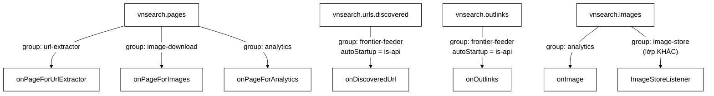
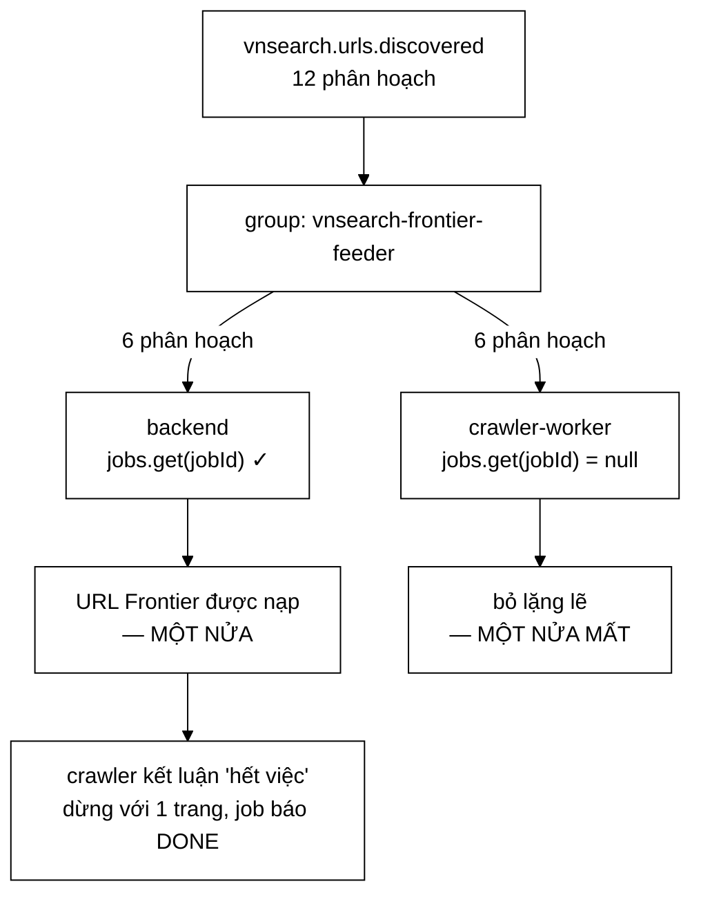

# CrawlKafkaListeners — sáu dòng `groupId` quyết định hai phần ba công việc có được làm hay không

**File nguồn:** `search-engine/src/main/java/com/vnsearch/config/CrawlKafkaListeners.java` (164 dòng, trong đó **hơn 60 dòng là bình luận**)
**Gói:** `com.vnsearch.config` · **Loại:** `@Component @ConditionalOnProperty(name = "app.crawler.bus", havingValue = "kafka")`
**Vị trí trong luồng:** lớp duy nhất trong dự án mang chú giải `@KafkaListener` cho ba Modular Service
**Đọc kèm:** [`KafkaCrawlConfig.md`](./KafkaCrawlConfig.md) · [`ImageStoreListener.md`](./ImageStoreListener.md) · [`../service/CrawlJobManager.md`](../service/CrawlJobManager.md) · [`../crawler/bus/CrawlEventBus.md`](../crawler/bus/CrawlEventBus.md)

---

## 📌 Hiểu trong 30 giây

Sáu phương thức, mỗi phương thức **một dòng thân**.

```java
@KafkaListener(topics = "${app.crawler.kafka.topic.pages}",
               groupId = "${app.crawler.kafka.group.url-extractor}",
               containerFactory = "crawlListenerContainerFactory")
public void onPageForUrlExtractor(PageEvent event) {
    urlExtractor.onPage(event);
}
```

Javadoc dòng 20–26:

> *"**Cố ý mỏng đến mức nhàm chán.** [...] Đó là toàn bộ chiến lược: nhốt mọi thứ
> dính tới Kafka vào *một* lớp **không cần test**, để ba service kia không biết
> Kafka tồn tại và test được bằng JUnit thuần."*



```
   ⭐ HAI THUỘC TÍNH ĐIỀU KHIỂN MỌI THỨ:

   groupId     — quyết định AI nhận được thông điệp
   autoStartup — quyết định TIẾN TRÌNH NÀO chạy listener

   Sai một trong hai ⇒ dữ liệu bị CHIA ĐÔI âm thầm,
   không lỗi, không cảnh báo.

   Và cả hai loại sai đó ĐÃ XẢY RA THẬT trong dự án này.
```

---

## 1. Lớp mỏng — vì sao "không cần test" là mục tiêu, không phải sự lười

```
   ĐƯỜNG BIÊN ĐƯỢC VẼ Ở ĐÂU

   Thứ dính tới Kafka:
     @KafkaListener, groupId, containerFactory,
     tên topic, autoStartup
   ⇒ TẤT CẢ nằm trong lớp này.

   Thứ là nghiệp vụ:
     bóc liên kết, lọc URL, tải ảnh, đếm số liệu
   ⇒ nằm trong ba Modular Service, KHÔNG import gì của Kafka.

   ⇒ Ba service đó test được bằng JUnit thuần, không cần
     Testcontainers, không cần broker.
   ⇒ Xem ../crawler/modular/UrlExtractorService.md.
```

```
   ⭐ "KHÔNG CẦN TEST" LÀ MỘT LỜI HỨA, KHÔNG PHẢI MỘT LỜI BÀO CHỮA.

   Nó chỉ đúng khi lớp này thật sự KHÔNG có logic.

   Kiểm chứng: đọc sáu thân phương thức.
     urlExtractor.onPage(event);
     imageDownload.onPage(event);
     analytics.onPage(event);
     jobManager.feedDiscoveredUrl(url);
     jobManager.feedOutlinks(outlinks);
     analytics.onImage(image);

   ⇒ Sáu dòng, không một câu `if` nào.
   ⇒ Lời hứa được giữ.

   ⚠️ NHƯNG: phần KHÔNG phải mã — các thuộc tính của chú giải
     — mới là chỗ chứa toàn bộ rủi ro. Và đó chính xác là
     phần mà "lớp mỏng nên không cần test" KHÔNG bao phủ.
   ⇒ Hai sự cố ở mục 3 và 4 đều nằm trong chú giải,
     không nằm trong thân phương thức.
```

---

## 2. Ba `groupId` khác nhau trên cùng một topic

Javadoc dòng 38–43:

> *"Nếu ba listener này dùng chung một `groupId` thì mỗi trang chỉ đến *một*
> trong ba service, chọn ngẫu nhiên — một lỗi cấu hình **một dòng**, hậu quả là
> **hai phần ba công việc âm thầm không được làm**."*

```
   CƠ CHẾ KAFKA, PHÁT BIỂU CHÍNH XÁC

   Trong MỘT consumer group:
     mỗi phân hoạch được giao cho ĐÚNG MỘT consumer
   ⇒ ba consumer cùng group = chia nhau 12 phân hoạch
   ⇒ mỗi thông điệp tới ĐÚNG MỘT consumer

   Giữa CÁC group khác nhau:
     mỗi group giữ offset riêng, đọc độc lập
   ⇒ ba group = mỗi group nhận TRỌN VẸN luồng

   ⇒ Ba listener, ba group ⇒ mỗi trang được xử lý ba lần,
     bởi ba service khác nhau. ĐÚNG.
   ⇒ Ba listener, một group ⇒ mỗi trang được xử lý một lần,
     bởi một service NGẪU NHIÊN. SAI.
```

```
   VÌ SAO LỖI NÀY GẦN NHƯ KHÔNG THỂ PHÁT HIỆN BẰNG QUAN SÁT

   Với một group chung:
     - Không lỗi nào được ném
     - Cả ba service ĐỀU nhận được thông điệp (một phần ba)
     - Log của cả ba đều có hoạt động
     - Số liệu crawl vẫn tăng
     - Ảnh vẫn được tải (một phần ba)
     - URL vẫn được bóc (một phần ba)

   ⇒ Mọi dấu hiệu đều nói "đang chạy".
   ⇒ Chỉ SỐ LƯỢNG là sai, và không ai biết con số ĐÚNG
     phải là bao nhiêu.

   ⇒ Đây là lý do Javadoc dùng từ "AM THAM" — cùng từ
     xuất hiện ở mọi quyết định quan trọng của gói config.
```

```
   VÀ MỘT ĐIỂM TINH TẾ: onImage DÙNG CHUNG GROUP VỚI
   onPageForAnalytics

   @KafkaListener(topics = "...images",
                  groupId = "${...group.analytics}")   ← CÙNG group
   public void onImage(ImageFound image) { analytics.onImage(image); }

   ⇒ Đúng, vì hai listener này đọc HAI TOPIC KHÁC NHAU.
   ⇒ Chia sẻ group giữa các topic khác nhau không gây
     chia luồng — chỉ chia sẻ trong CÙNG topic mới có vấn đề.
   ⇒ Và nó có lợi: cả hai thuộc về cùng một "người tiêu thụ
     logic" (Analytics), nên offset của chúng gom về một chỗ.

   ⇒ Chi tiết này ĐÚNG nhưng không được giải thích, và nó
     trông giống một sự thiếu nhất quán với quy tắc
     "mỗi service một group".
```

---

## 3. Sự cố thứ nhất — hai tiến trình chia đôi luồng URL

Khối bình luận dòng 100–121 là phần đáng đọc nhất của cả tệp:

```
   ╔═══════════════════════════════════════════════════════════════════╗
   ║  QUY TẮC: listener nào ghi vào TRẠNG THÁI TRONG BỘ NHỚ của tiến   ║
   ║  trình API thì CHỈ được chạy ở tiến trình API.                    ║
   ╚═══════════════════════════════════════════════════════════════════╝
```

> *"**LỖI ĐÃ XẢY RA THẬT.** Không có `autoStartup`, cả backend lẫn crawler-worker
> đều chạy hai listener này, và vì chúng dùng **CHUNG** một `groupId` nên Kafka
> **CHIA ĐÔI** luồng URL giữa hai tiến trình. Nửa đi về worker gặp
> `jobs.get(jobId) == null` và bị bỏ lặng lẽ."*



```
   TRIỆU CHỨNG QUAN SÁT ĐƯỢC — TRÍCH NGUYÊN

   "frontier khong bao gio duoc nap du, crawler ket luan
    'het viec' va dung voi 1 trang, job bao DONE"

   ⇒ Đọc lại vế cuối: job báo DONE.
   ⇒ Hệ thống báo THÀNH CÔNG cho một phiên crawl
     chỉ lấy được 1 trang.
   ⇒ Không lỗi, không cảnh báo, trạng thái cuối là "xong".

   ⇒ Đây là hình thái tệ nhất của lỗi im lặng: nó không chỉ
     im lặng, nó còn KHẲNG ĐỊNH SAI rằng mọi thứ ổn.
```

```
   ⭐ CÁCH KIỂM CHỨNG ĐƯỢC GHI THẲNG VÀO MÃ

   kafka-consumer-groups.sh --describe --group vnsearch-frontier-feeder
   → HAI địa chỉ consumer khác nhau cùng giữ các phân hoạch

   ⇒ Một lệnh, một câu trả lời dứt khoát.
   ⇒ Ghi lại CÁCH CHẨN ĐOÁN, không chỉ ghi nguyên nhân,
     là điều phân biệt một bình luận hữu ích với một
     bình luận kể chuyện.
```

```
   VÀ MỘT THANG ĐO ĐƯỢC SINH RA TỪ CHÍNH SỰ CỐ NÀY

   "Day dung la ca hong ma
    CrawlJobManager.getUnroutableEventCount() sinh ra de
    lo dien — con so do khac 0 chinh la dau hieu."

   ⇒ Một sự cố im lặng được chuyển thành một CON SỐ.
   ⇒ Đây là mẫu đúng: sau mỗi sự cố im lặng, câu hỏi phải là
     "con số nào lẽ ra phải khác 0?", không phải
     "thêm log ở đâu?".

   ⇒ Cùng gia đình với vnsearch.crawl.bus.publish.failures
     (KafkaCrawlConfig.md mục 8) và với đề xuất
     "chỉ mục rỗng" ở MetricsConfig.md.
```

```
   PHÉP SỬA: autoStartup = "${app.crawler.role.is-api:true}"

   @KafkaListener(..., autoStartup = "${app.crawler.role.is-api:true}")

   ⇒ Ở tiến trình worker, is-api = false ⇒ listener KHÔNG chạy
   ⇒ Ở backend,          is-api = true  ⇒ listener chạy
   ⇒ Chỉ MỘT consumer trong group ⇒ không chia luồng

   ⚠️ Mặc định là `true`. Nghĩa là quên đặt biến ở worker
     sẽ TÁI TẠO chính sự cố này.
   ⇒ Chọn mặc định `true` là đúng cho chế độ một tiến trình
     (chạy thử cục bộ), nhưng nó đặt gánh nặng lên cấu hình
     triển khai — và không có gì kiểm tra.
```

---

## 4. Sự cố thứ hai — kho ảnh phải có group riêng

```java
public void onImage(ImageFound image) {
    analytics.onImage(image);
    // Kho anh KHONG duoc nap o day — no co consumer group rieng, xem
    // ImageStoreListener. Dung chung group nay se khien hai ben CHIA NHAU
    // luong thay vi moi ben nhan du.
}
```

```
   MỘT DÒNG BÌNH LUẬN NGĂN MỘT PHÉP SỬA HỢP LÝ

   Người đọc sau sẽ nghĩ rất tự nhiên:
     "onImage đã nhận ImageFound rồi, thêm
      imageStore.add(image) vào đây là xong,
      đỡ phải một lớp riêng."

   ⇒ Phép sửa đó SAI, và nó sai theo cách không lộ ra:
     ImageStore sẽ chỉ nhận được phần thông điệp mà
     group `analytics` được giao — nhưng vì đây là cùng
     một listener nên thực ra nó vẫn nhận đủ...

   ⇒ Vấn đề thật nằm ở chỗ khác: ImageStoreListener có
     autoStartup theo vai trò, còn onImage thì KHÔNG.
   ⇒ Gộp lại nghĩa là kho ảnh sẽ được nạp ở CẢ worker
     lẫn backend, và khi đó group `analytics` bị chia đôi
     giữa hai tiến trình ⇒ mỗi bên một nửa ảnh.

   ⇒ Xem ImageStoreListener.md để thấy lập luận đầy đủ.
```

```
   ⚠️ VÀ ĐÂY LÀ MỘT ĐIỂM CHƯA NHẤT QUÁN CÓ THẬT

   onPageForAnalytics / onImage:  KHÔNG có autoStartup
   ⇒ chạy ở CẢ backend lẫn worker
   ⇒ group `vnsearch-analytics` bị CHIA ĐÔI giữa hai tiến trình

   Hậu quả: CrawlAnalyticsService ở backend chỉ đếm
   một nửa, ở worker đếm nửa kia.

   ⇒ Điều này có sao không? Tuỳ CrawlAnalyticsService ghi
     vào đâu: nếu nó ghi vào MeterRegistry của từng tiến
     trình, thì Prometheus thu thập CẢ HAI và cộng lại
     ⇒ tổng vẫn đúng.
   ⇒ Nhưng nếu ai đó đọc số liệu từ MỘT tiến trình
     (ví dụ qua /api/admin/analytics của backend), họ thấy
     MỘT NỬA.

   ⇒ Đây đúng là cùng khuôn lỗi mà quy tắc trong khung
     ╔══╗ ở mục 3 nói tới, và nó CHƯA được áp cho analytics.
   ⇒ Xem đề xuất 2.
```

---

## 5. Ngoại lệ được để bay ra — có chủ đích

Javadoc dòng 45–48:

> *"Không có `try/catch` nào ở đây, có chủ đích: `DefaultErrorHandler` bắt, thử
> lại có giãn cách, rồi đẩy sang dead-letter topic. Bắt và nuốt ở đây sẽ **vô
> hiệu hoá toàn bộ cơ chế đó** và biến mọi lỗi thành một dòng log."*

```
   PHẢN XẠ SAI MÀ ĐOẠN NÀY NGĂN CHẶN

   Người viết listener thường bọc mọi thứ:
     try {
         urlExtractor.onPage(event);
     } catch (Exception e) {
         log.error("Loi xu ly trang", e);      // ← PHÁ HỎNG MỌI THỨ
     }

   Hậu quả cụ thể:
     ① DefaultErrorHandler KHÔNG BAO GIỜ được gọi
     ② Không có thử lại có giãn cách
     ③ Dead-letter topic LUÔN RỖNG
     ④ Cảnh báo VnSearchDeadLetterGrowing KHÔNG BAO GIỜ kêu
     ⑤ Offset vẫn được chốt ⇒ thông điệp MẤT VĨNH VIỄN

   ⇒ Điểm ⑤ là điểm chết người: bắt ngoại lệ biến
     "hoãn xử lý" thành "mất dữ liệu".

   ⇒ Toàn bộ hạ tầng xử lý lỗi ở KafkaCrawlConfig.md mục 6
     (backoff 2 phút, DLT giữ 30 ngày) chỉ hoạt động
     khi KHÔNG ai bắt ngoại lệ ở đây.
```

```
   ⭐ NGUYÊN TẮC TỔNG QUÁT

   Trong một hệ thống có cơ chế xử lý lỗi ở TẦNG KHUNG,
   việc bắt ngoại lệ ở TẦNG ỨNG DỤNG là một hành vi
   VÔ HIỆU HOÁ, không phải một hành vi phòng thủ.

   ⇒ Và nó trông y hệt như mã cẩn thận.
   ⇒ Nên nó phải được ghi ra. Ở đây nó được ghi.
```

---

## 6. Chuyển tiếp qua `CrawlJobManager` chứ không giữ crawler

Javadoc dòng 127–132:

> *"Chuyển tiếp qua `CrawlJobManager` chứ không giữ tham chiếu thẳng tới một
> `CrawlerService`: crawler được cấp phát **theo từng job** và job thì đến rồi
> đi, còn listener này sống suốt vòng đời ứng dụng. Giữ tham chiếu thẳng nghĩa là
> giữ mãi crawler của job đầu tiên — kèm toàn bộ corpus của nó trong bộ nhớ."*

```
   XUNG ĐỘT VÒNG ĐỜI — VẼ RA

   listener:  |════════════════════════════════════| suốt đời ứng dụng
   job 1:     |═══════|
   job 2:               |════════|
   job 3:                          |══════|

   Listener phải nói chuyện với "job đang chạy", một thứ
   THAY ĐỔI theo thời gian.

   Giữ tham chiếu thẳng:
     listener → CrawlerService của job 1
     ⇒ job 1 kết thúc nhưng KHÔNG được thu hồi
     ⇒ toàn bộ corpus của nó nằm lại trong heap MÃI MÃI
     ⇒ job 2, job 3 không nhận được URL nào

   Qua CrawlJobManager:
     listener → jobManager → jobs.get(jobId)
     ⇒ tra CỨU tại thời điểm gọi
     ⇒ job xong thì bị gỡ khỏi map, không ai giữ nó
```

```
   VÀ RÒ RỈ NÀY ĐÃ XẢY RA MỘT LẦN

   "dung ro ri ma CrawlJobManager.releaseCrawler() da phai
    sua mot lan"

   ⇒ Đây là lần thứ ba trong tệp mà một quyết định được
     biện minh bằng một sự cố ĐÃ xảy ra, không bằng
     một khả năng lý thuyết.

   ⇒ Ba sự cố, ba bài học, và cả ba đều thuộc cùng một họ:
     ① trạng thái trong bộ nhớ + nhiều tiến trình  (mục 3)
     ② trạng thái trong bộ nhớ + nhiều tiến trình  (mục 4)
     ③ trạng thái theo job     + listener sống mãi (mục 6)

   ⇒ Họ chung: TRẠNG THÁI CÓ VÒNG ĐỜI NGẮN HƠN
     THỨ ĐANG THAM CHIẾU TỚI NÓ.
```

---

## 7. Hướng dẫn thực hành

### 7.1 Cấu hình vai trò tiến trình

```properties
# backend (phuc vu API)
app.crawler.bus=kafka
app.crawler.role=api
app.crawler.role.is-api=true

# crawler-worker (chi tieu thu Kafka)
app.crawler.bus=kafka
app.crawler.role=worker
app.crawler.role.is-api=false      # QUEN DONG NAY = tai tao su co muc 3
```

### 7.2 Chẩn đoán "crawl xong với 1 trang, job báo DONE"

```bash
# 1. Co HAI consumer trong group frontier khong?
kafka-consumer-groups --bootstrap-server kafka:9092 \
  --describe --group vnsearch-frontier-feeder
# HAI dia chi CONSUMER-ID khac nhau => dung su co muc 3

# 2. Con so canh giu
curl -s localhost:8080/api/admin/crawl/{id}/status | jq .unroutableEventCount
# Khac 0 => URL dang bi bo lang le

# 3. Kiem bien moi truong cua worker
docker exec crawler-worker env | grep -i is.api
# Khong thay => dang dung mac dinh `true` => SAI cho worker
```

### 7.3 Cạm bẫy

```
   ① KHÔNG BAO GIỜ dùng chung groupId cho hai listener trên
     CÙNG một topic. Hậu quả: mỗi service nhận một phần,
     không lỗi nào.

   ② KHÔNG BAO GIỜ bọc try/catch quanh thân listener.
     Nó vô hiệu hoá thử lại + dead-letter, và biến
     "hoãn xử lý" thành "mất vĩnh viễn".

   ③ autoStartup mặc định `true`. Quên đặt ở worker =
     tái tạo sự cố mục 3.

   ④ Thêm listener mới ghi vào trạng thái trong bộ nhớ của
     backend thì PHẢI có autoStartup theo vai trò.
     Quy tắc nằm trong khung ╔══╗ ở dòng 100–103.

   ⑤ onPageForAnalytics và onImage hiện KHÔNG có autoStartup
     ⇒ group analytics đang bị chia giữa hai tiến trình.
     Xem mục 4.

   ⑥ Kiểu tham số phương thức là hợp đồng giải mã
     (StringJsonMessageConverter lấy kiểu từ chữ ký).
     Đổi kiểu = lỗi lúc CHẠY, không lúc biên dịch.

   ⑦ Cả lớp nằm sau @ConditionalOnProperty. Ở chế độ
     in-process, không listener nào tồn tại — luồng đi qua
     InProcessCrawlEventBus.
```

---

## 8. Độ phức tạp & chi phí

| Thao tác | Chi phí |
|---|---|
| Mỗi phương thức listener | $O(1)$ — một lời gọi uỷ nhiệm |
| Chi phí thật | nằm hoàn toàn trong ba Modular Service |
| Bộ nhớ | 6 container × 1 luồng × `max.poll.records=50` |

```
   PHÂN TÍCH

   Lớp này không có chi phí tính toán nào đáng kể.
   Toàn bộ chi phí nằm ở:
     - giải mã JSON (do StringJsonMessageConverter)
     - ba Modular Service

   ⚠️ Nhưng nó có một chi phí ẨN: SÁU container listener,
     mỗi cái một luồng, mỗi cái giữ tối đa 50 bản ghi.

   Với ba listener trên topic `pages` (HTML thô ~150 KB):
     3 × 50 × 150 KB ≈ 22 MB thường trực

   ⇒ Cùng một trang được giữ trong bộ nhớ BA LẦN cùng lúc,
     vì ba consumer group đọc độc lập.
   ⇒ Đó là cái giá của phát tán một-tới-nhiều, và nó
     KHÔNG được nêu ở đâu.
```

---

## 9. Kiểm thử liên quan

| Tệp test | Kiểm gì |
|---|---|
| [`KafkaCrawlBusIT`](../../../../../test/java/com/vnsearch/crawler/bus/KafkaCrawlBusIT.md) | Gửi/nhận qua Kafka thật (Testcontainers) |
| [`CrawlerServiceBusWiringTest`](../../../../../test/java/com/vnsearch/crawler/CrawlerServiceBusWiringTest.md) | Crawler có phát sự kiện lên bus không |

```
   ⚠️ NHƯNG CẢ HAI ĐỀU KHÔNG CHẠM TỚI PHẦN RỦI RO NHẤT.

   Rủi ro nằm trong THUỘC TÍNH CỦA CHÚ GIẢI:
     - ba groupId có thực sự khác nhau không?
     - autoStartup có mặt ở đúng các listener cần không?

   Cả hai đều là dữ liệu tĩnh, đọc được bằng phản chiếu,
   KHÔNG cần broker nào.

   ⇒ Và cả hai đều đã từng SAI trong thực tế.
```

```
   NHỮNG TÍNH CHẤT KHÔNG ĐƯỢC CANH GIỮ

   ✗ Ba listener trên topic `pages` có BA groupId phân biệt
     — sai ⇒ hai phần ba công việc âm thầm không được làm

   ✗ Mọi listener ghi vào trạng thái trong bộ nhớ của backend
     đều có autoStartup theo vai trò
     — sai ⇒ luồng bị chia đôi giữa hai tiến trình

   ✗ Không thân phương thức nào chứa try/catch
     — sai ⇒ vô hiệu hoá dead-letter, mất dữ liệu vĩnh viễn

   ✗ Không thân phương thức nào dài hơn một dòng
     — đây là chính lời hứa "mỏng nên không cần test";
       một luật tĩnh biến lời hứa thành ràng buộc

   ⇒ Bốn tính chất, cả bốn kiểm được bằng phản chiếu
     trong vài mili-giây. Xem đề xuất 1.
```

---

## 10. Liên kết

- Nhà máy container, chính sách thử lại và dead-letter mà lớp này dựa vào: [`KafkaCrawlConfig.md`](./KafkaCrawlConfig.md) mục 6
- Listener kho ảnh, lớp riêng vì đúng lý do ở mục 4: [`ImageStoreListener.md`](./ImageStoreListener.md)
- Nơi `feedDiscoveredUrl` / `feedOutlinks` được xử lý, và `getUnroutableEventCount()`: [`../service/CrawlJobManager.md`](../service/CrawlJobManager.md)
- Ba Modular Service không biết Kafka tồn tại: [`../crawler/modular/UrlExtractorService.md`](../crawler/modular/UrlExtractorService.md) · [`../crawler/modular/ImageDownloadService.md`](../crawler/modular/ImageDownloadService.md) · [`../crawler/modular/CrawlAnalyticsService.md`](../crawler/modular/CrawlAnalyticsService.md)
- Bốn kiểu sự kiện làm hợp đồng giải mã: [`../crawler/bus/PageEvent.md`](../crawler/bus/PageEvent.md) · [`../crawler/bus/DiscoveredUrl.md`](../crawler/bus/DiscoveredUrl.md) · [`../crawler/bus/OutlinksExtracted.md`](../crawler/bus/OutlinksExtracted.md) · [`../crawler/bus/ImageFound.md`](../crawler/bus/ImageFound.md)
- Lý do tách bus thành giao diện: [`../crawler/bus/CrawlEventBus.md`](../crawler/bus/CrawlEventBus.md)
- Đường đi thay thế ở chế độ một tiến trình: [`../crawler/bus/InProcessCrawlEventBus.md`](../crawler/bus/InProcessCrawlEventBus.md)
- Cùng họ "sự cố im lặng được chuyển thành một con số": [`MetricsConfig.md`](./MetricsConfig.md) mục 1 · [`KafkaCrawlConfig.md`](./KafkaCrawlConfig.md) mục 8
