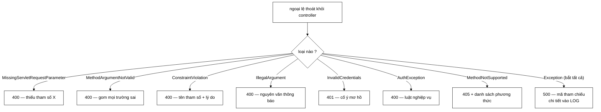

# GlobalExceptionHandler — lỗi của người gọi thì nói rõ, lỗi của hệ thống thì giấu

**File nguồn:** `search-engine/src/main/java/com/vnsearch/config/GlobalExceptionHandler.java` (185 dòng)
**Gói:** `com.vnsearch.config` · **Loại:** `@RestControllerAdvice`
**Vị trí trong luồng:** bắt mọi ngoại lệ thoát ra khỏi controller, biến thành JSON
**Đọc kèm:** [`../auth/UserService.md`](../auth/UserService.md) · [`RateLimitFilter.md`](./RateLimitFilter.md) · [`SecurityConfig.md`](./SecurityConfig.md)

---

## 📌 Hiểu trong 30 giây

Một nguyên tắc, tám handler.

> **Lỗi của NGƯỜI GỌI thì nói rõ, lỗi của HỆ THỐNG thì giấu.**

```java
@ExceptionHandler(Exception.class)
public ResponseEntity<Map<String, Object>> handleGeneric(Exception e, HttpServletRequest request) {
    String reference = UUID.randomUUID().toString().substring(0, 8);
    // Toan bo chi tiet — ke ca stack trace — o day, KHONG o phan hoi.
    log.error("Loi he thong [ma {}] khi xu ly {} {}",
            reference, request.getMethod(), request.getRequestURI(), e);
    return errorResponse(HttpStatus.INTERNAL_SERVER_ERROR,
            "Da xay ra loi he thong. Vui long cung cap ma tham chieu khi bao loi.",
            reference);
}
```



```
   ⭐ SÁU HANDLER Ở GIỮA ĐỀU TỒN TẠI ĐỂ NGOẠI LỆ KHÔNG
     RƠI XUỐNG Ô CUỐI CÙNG.

   Nhánh bắt-tất-cả không sai. Vấn đề là nó NUỐT mọi ngoại lệ
   của Spring MVC vốn ĐÃ MANG SẴN một mã trạng thái đúng,
   rồi báo tất cả thành 500.

   Javadoc dòng 134–136 gọi tên đúng khuôn lỗi này, sau khi
   nó đã xảy ra HAI LẦN.
```

---

## 1. Vì sao `e.getMessage()` là "bản đồ miễn phí"

Javadoc dòng 30–36:

> *"Trước đây mọi ngoại lệ đều được trả nguyên văn ra ngoài:
> `errorResponse(INTERNAL_SERVER_ERROR, "Loi he thong: " + e.getMessage())`.
> `e.getMessage()` của một `SQLException` chứa chuỗi kết nối và tên bảng; của một
> `IOException` chứa đường dẫn tuyệt đối trên máy chủ. Đó là **bản đồ miễn phí**
> cho người đang dò hệ thống."*

```
   NHỮNG GÌ e.getMessage() THỰC SỰ LỘ RA

   SQLException:
     "FATAL: password authentication failed for user 'vnsearch'
      (jdbc:postgresql://db-prod-01.internal:5432/vnsearch)"
     ⇒ tên máy chủ nội bộ, cổng, tên CSDL, tên tài khoản

   IOException:
     "/opt/vnsearch/data/index/postings.bin (Permission denied)"
     ⇒ cấu trúc thư mục, vị trí dữ liệu

   NullPointerException (JDK 14+, thông báo hữu ích):
     "Cannot invoke String.length() because
      the return value of WebDocument.getTitle() is null"
     ⇒ tên lớp, tên phương thức, cấu trúc mã

   ClassNotFoundException:
     ⇒ phiên bản thư viện đang dùng
     ⇒ tra được CVE tương ứng
```

```
   ⭐ PHÂN BIỆT HAI CÂU HỎI

   "Thông tin này có phải bí mật không?"
     → thường là KHÔNG. Tên bảng không phải mật khẩu.

   "Thông tin này có rút ngắn công sức của kẻ tấn công không?"
     → CÓ, rất nhiều.

   Trinh sát là bước ĐẦU TIÊN và TỐN THỜI GIAN NHẤT của
   một cuộc tấn công. Mỗi mẩu thông tin lộ ra là một bước
   họ không phải tự làm.

   ⇒ Đây là lý do "che thông tin lỗi" là biện pháp chuẩn,
     dù từng mẩu riêng lẻ trông vô hại.
```

---

## 2. Mã tham chiếu — giữ được cả hai phía

Javadoc dòng 38–41:

> *"Nay lỗi hệ thống trả về một **mã tham chiếu** ngẫu nhiên, còn nội dung đầy đủ
> thì vào log kèm đúng mã đó. Người vận hành tra log bằng mã; người ngoài không
> biết thêm gì. Người dùng báo lỗi vẫn có thứ để đọc cho bộ phận hỗ trợ — điều mà
> một câu "Đã có lỗi xảy ra" trần không làm được."*

```
   BA PHƯƠNG ÁN, VÀ VÌ SAO PHƯƠNG ÁN BA THẮNG

   ① Trả nguyên e.getMessage()
     ✓ gỡ lỗi dễ
     ✗ lộ thông tin nội bộ

   ② Trả "Đã có lỗi xảy ra"
     ✓ không lộ gì
     ✗ người dùng báo lỗi mà không có gì để nói
     ✗ log có hàng nghìn dòng lỗi, không biết dòng nào
       ứng với báo cáo nào

   ③ Trả mã tham chiếu, log chi tiết kèm mã   ← chọn
     ✓ không lộ gì (mã là UUID ngẫu nhiên)
     ✓ tra log bằng mã ⇒ tìm ra ĐÚNG một dòng
     ✓ người dùng có thứ cụ thể để báo

   ⇒ Điểm mấu chốt: phương án ② nghe an toàn nhưng nó
     ĐÁNH ĐỔI khả năng vận hành lấy sự an toàn — mà
     phương án ③ cho cả hai.
```

```
   VÌ SAO CẮT UUID CÒN 8 KÝ TỰ

   UUID.randomUUID().toString().substring(0, 8)
   ⇒ "3f2a9c1b" — 8 ký tự hex = 32 bit

   Lý do: người dùng phải ĐỌC nó qua điện thoại hoặc gõ lại
   vào một biểu mẫu. 36 ký tự đầy đủ thì không ai chép đúng.

   Rủi ro trùng mã: với 32 bit, hai lỗi trùng mã bắt đầu
   có khả năng đáng kể sau ~65.000 lỗi (nghịch lý ngày sinh).

   ⇒ Với một hệ thống có vài chục lỗi 500 mỗi ngày,
     phải mất nhiều năm.
   ⇒ Và kể cả trùng: log còn có TIMESTAMP và ĐƯỜNG DẪN
     để phân biệt.

   ⇒ Đánh đổi đúng. Nhưng lý do chọn 8 (chứ không phải 6
     hay 12) không được ghi ra.
```

```
   ⚠️ MÃ THAM CHIẾU CHỈ CÓ Ở 500, KHÔNG CÓ Ở 4xx

   Với 4xx, người dùng đã biết mình sai gì ⇒ không cần mã.

   ⇒ Hợp lý. Nhưng nó cũng nghĩa là KHÔNG có cách nào
     nối một request 4xx cụ thể với dòng log của nó —
     và các lỗi 400 lặp lại bất thường cũng là tín hiệu
     đáng điều tra (một client tích hợp sai).

   ⇒ Một trace-id cho MỌI request giải được cả hai bài toán.
     Xem đề xuất 3.
```

---

## 3. Cùng một khuôn lỗi, hai lần

Javadoc dòng 131–139 nói thẳng:

> *"Không bắt riêng thì loại này rơi xuống `handleGeneric` và trả **500** — báo
> rằng máy chủ hỏng, trong khi thực tế nó đang chạy đúng. Đây là **lần thứ hai**
> cùng một khuôn lỗi xuất hiện trong lớp này (lần trước là
> `ConstraintViolationException`), và cả hai đều có chung gốc: *một nhánh
> bắt-tất-cả cho 500 sẽ nuốt mọi ngoại lệ của Spring MVC vốn đã mang sẵn một mã
> trạng thái đúng*."*

```
   ⭐ VIỆC GỌI TÊN ĐƯỢC KHUÔN LỖI QUAN TRỌNG HƠN
     VIỆC SỬA TỪNG CA MỘT.

   Lần 1: ConstraintViolationException  → 500 thay vì 400
   Lần 2: HttpRequestMethodNotSupported → 500 thay vì 405

   Nếu chỉ sửa từng ca, sẽ có lần 3, lần 4:
     HttpMediaTypeNotSupportedException      → nên 415
     HttpMessageNotReadableException         → nên 400
     MissingRequestHeaderException           → nên 400
     NoHandlerFoundException                 → nên 404
     MaxUploadSizeExceededException          → nên 413

   ⇒ Cả năm loại này HIỆN VẪN trả 500.
   ⇒ Javadoc đã chẩn đoán đúng gốc bệnh nhưng phép chữa
     vẫn là chữa triệu chứng. Xem đề xuất 1.
```

```
   HẬU QUẢ CỤ THỂ CỦA 500 THAY VÌ 4xx

   Javadoc dòng 77–79:
   "Hau qua khong chi la ma trang thai xau — nguoi goi khong
    biet minh gui sai nen se THU LAI Y NGUYEN, con nguoi van
    hanh thi thay bao dong loi 5xx cho mot chuyen khong phai
    su co."

   Ba hậu quả tách bạch:
     ① Client THỬ LẠI (5xx thường được coi là lỗi tạm thời)
       ⇒ tự tạo ra lưu lượng vô ích, có thể thành vòng lặp
     ② Cảnh báo 5xx kêu cho một chuyện không phải sự cố
       ⇒ dạy người trực bỏ qua cảnh báo 5xx
     ③ Người gọi không biết sửa gì
       ⇒ báo lỗi cho đội vận hành, tốn thời gian hai bên

   ⇒ Hậu quả ② là hậu quả lâu dài nguy hiểm nhất, và nó
     cùng loại với lý do AuthConfig.md mục 3 chỉ cảnh báo
     khi CHƯA CÓ tài khoản nào.
```

---

## 4. Thứ tự handler — lớp con phải đứng trước lớp cha

```java
@ExceptionHandler(UserService.InvalidCredentialsException.class)   // lop CON
public ResponseEntity<...> handleInvalidCredentials(...) { → 401 }

@ExceptionHandler(UserService.AuthException.class)                 // lop CHA
public ResponseEntity<...> handleAuth(...) { → 400 }
```

Javadoc dòng 107–110:

> *"Bắt **TRƯỚC** `UserService.AuthException` (lớp cha) vì Spring chọn handler
> khớp **cụ thể nhất**; để chung một chỗ thì một lần đăng nhập sai sẽ trả 400 —
> mà 400 nói "request của bạn sai định dạng", không phải "thông tin đăng nhập
> không đúng"."*

```
   MỘT CHI TIẾT CẦN LÀM RÕ: THỨ TỰ NGUỒN KHÔNG QUAN TRỌNG

   Spring chọn handler theo ĐỘ CỤ THỂ của kiểu ngoại lệ,
   không theo thứ tự khai báo trong tệp.

   ⇒ Đặt handleAuth lên trên handleInvalidCredentials
     vẫn cho kết quả ĐÚNG.
   ⇒ Nhưng đặt đúng thứ tự làm mã DỄ ĐỌC hơn: người đọc
     thấy ngay quan hệ cha–con.

   ⇒ Javadoc nói "bat TRUOC" có thể gây hiểu nhầm rằng
     thứ tự dòng mới là thứ quyết định. Điều quyết định
     là SỰ TỒN TẠI của handler cụ thể hơn.
```

```
   VÌ SAO 401 KHÁC 400 Ở ĐÂY — KHÔNG CHỈ LÀ CHUYỆN ĐẸP

   400 = "request của bạn sai định dạng"
     ⇒ giao diện hiển thị "Dữ liệu không hợp lệ"
     ⇒ người dùng đi kiểm tra xem mình gõ thiếu trường nào

   401 = "thông tin đăng nhập không đúng"
     ⇒ giao diện hiển thị "Sai tên đăng nhập hoặc mật khẩu"
     ⇒ người dùng thử lại mật khẩu

   ⇒ Sai mã trạng thái ở đây dẫn người dùng đi SAI HƯỚNG
     hoàn toàn.
```

```
   THÔNG BÁO CỐ Ý MƠ HỒ — VÀ NÓ ĐẾN TỪ TẦNG DƯỚI

   Javadoc dòng 112–113: "Thong bao lay nguyen tu ngoai le
   va no CO Y mo ho ('ten tai khoan hoac mat khau khong dung')"

   Vì sao mơ hồ: "tài khoản không tồn tại" và "mật khẩu sai"
   là HAI thông tin khác nhau. Phân biệt chúng cho phép
   kẻ tấn công LIỆT KÊ tài khoản có thật.

   ⇒ Điểm đáng chú ý về kiến trúc: quyết định mơ hồ hoá
     nằm ở ../auth/UserService.md, KHÔNG ở đây.
   ⇒ Handler này chỉ chuyển tiếp `e.getMessage()`.
   ⇒ Đúng chỗ: đó là luật NGHIỆP VỤ của tầng tài khoản,
     không phải luật trình bày của tầng HTTP.
```

---

## 5. `lastNode` — cắt tên phương thức khỏi đường dẫn

```java
/**
 * {@code dashboard.top} -> {@code top}.
 *
 * <p>Duong dan day du cua Bean Validation gom ca ten phuong thuc controller
 * — mot chi tiet noi bo khong giup nguoi goi sua request, va la thu khong
 * nen phoi ra ngoai.
 */
private static String lastNode(String propertyPath) {
    int dot = propertyPath.lastIndexOf('.');
    return dot < 0 ? propertyPath : propertyPath.substring(dot + 1);
}
```

```
   BỐN DÒNG, VÀ NÓ PHỤC VỤ CẢ HAI MỤC TIÊU CỦA LỚP

   Không có nó:
     "dashboard.top: phai <= 50"
     ⇒ lộ tên phương thức controller (thông tin nội bộ)
     ⇒ VÀ người gọi bối rối: "dashboard.top" không phải
       tên tham số họ gửi

   Có nó:
     "top: phai <= 50"
     ⇒ khớp CHÍNH XÁC với ?top=100 mà họ đã gửi

   ⇒ Cùng một phép cắt vừa giấu thông tin nội bộ vừa làm
     thông báo HỮU ÍCH HƠN.
   ⇒ Đây là dấu hiệu của một quyết định đúng: nó không
     đánh đổi gì cả.
```

---

## 6. Bình luận về SpotBugs — gọi hàm hai lần

```java
// Goi getSupportedHttpMethods() MOT lan roi giu lai. Ban dau ham nay
// goi hai lan — kiem null o lan mot, dung ket qua o lan hai — va
// SpotBugs bat dung: khong co gi bao dam hai lan goi tra ve cung mot
// thu, nen phep kiem null o lan dau khong bao ve duoc lan sau.
Set<HttpMethod> supported = e.getSupportedHttpMethods();
String allowed = supported == null ? "" : supported.stream()...;
```

```
   KHUÔN LỖI: KIỂM MỘT THỨ, DÙNG MỘT THỨ KHÁC

   SAI:
     if (e.getSupportedHttpMethods() != null) {
         ... e.getSupportedHttpMethods().stream() ...
     }
     ⇒ Hai lời gọi KHÁC NHAU.
     ⇒ Phép kiểm null ở lời gọi thứ nhất KHÔNG nói gì
       về lời gọi thứ hai.

   ĐÚNG:
     Set<HttpMethod> supported = e.getSupportedHttpMethods();
     if (supported != null) { ... supported ... }
     ⇒ Kiểm và dùng CÙNG một tham chiếu.

   ⇒ Với lớp này của Spring, hai lời gọi thực tế trả về
     cùng một thứ. Nhưng "thực tế đúng" ≠ "được bảo đảm đúng"
     — cùng đúng cái phân biệt mà SearchConfig.md mục 1
     dựng lên với từ "tình cờ".
```

```
   ⭐ ĐÁNG CHÚ Ý: BÌNH LUẬN GHI LẠI CÔNG CỤ ĐÃ BẮT LỖI.

   "SpotBugs bat dung"

   ⇒ Người đọc sau biết dự án có chạy phân tích tĩnh,
     và biết luật đó là luật nào.
   ⇒ Nếu sau này ai đó "gộp lại cho gọn", SpotBugs sẽ
     kêu lại — và bình luận này giải thích vì sao.

   ⇒ Ghi lại NGUỒN của một quyết định (công cụ, review,
     sự cố) làm cho quyết định đó chống được việc bị
     hoàn tác vô tình.
```

---

## 7. `errorResponse` — hình dạng chung của mọi phản hồi lỗi

```java
private ResponseEntity<Map<String, Object>> errorResponse(
        HttpStatus status, String message, String reference) {
    Map<String, Object> body = new LinkedHashMap<>();
    body.put("timestamp", Instant.now().toString());
    body.put("status", status.value());
    body.put("error", status.getReasonPhrase());
    body.put("message", message == null ? "" : message);
    if (reference != null) {
        body.put("reference", reference);
    }
    return ResponseEntity.status(status).body(body);
}
```

```
   VÌ SAO LinkedHashMap CHỨ KHÔNG PHẢI HashMap

   LinkedHashMap giữ THỨ TỰ CHÈN.
   ⇒ JSON luôn ra theo thứ tự timestamp, status, error,
     message, reference.
   ⇒ HashMap sẽ cho thứ tự tuỳ ý và có thể ĐỔI giữa các
     lần chạy JVM.

   Vì sao quan trọng: log và ảnh chụp màn hình so sánh
   được với nhau; test dựa trên chuỗi JSON không chập chờn.

   ⇒ Một chi tiết nhỏ, đúng, và KHÔNG có bình luận nào
     giải thích — nên rất dễ bị "tối ưu" thành HashMap.
```

```
   ⚠️ HÌNH DẠNG NÀY KHÔNG ĐƯỢC ĐỊNH KIỂU

   Map<String, Object> nghĩa là:
     - không có lớp nào mô tả hợp đồng lỗi
     - không sinh được tài liệu OpenAPI chính xác
     - gõ sai tên trường ("mesage") vẫn biên dịch được
     - RateLimitFilter dựng một hình dạng KHÁC bằng tay
       (thiếu "timestamp") mà không gì phát hiện

   ⇒ Xem RateLimitFilter.md mục 5 để thấy hậu quả
     đã xảy ra.
   ⇒ Xem đề xuất 2.
```

---

## 8. Hướng dẫn thực hành

### 8.1 Đọc phản hồi lỗi

```
   { "status": 400, "message": "top: phai <= 50" }
     ⇒ Bạn gửi sai. Thông báo nói đúng tham số nào.

   { "status": 401, "message": "Ten tai khoan hoac mat khau khong dung" }
     ⇒ CỐ Ý mơ hồ. Không suy ra được tài khoản có tồn tại hay không.

   { "status": 405, "message": "Phuong thuc PUT khong duoc ho tro...
                                Cho phep: GET, POST." }
     ⇒ Sai phương thức. Danh sách cho phép nằm ngay trong thông báo.

   { "status": 500, "reference": "3f2a9c1b" }
     ⇒ Lỗi hệ thống. Gửi mã "3f2a9c1b" cho đội vận hành.
     ⇒ Đừng thử lại ngay — 500 ở đây thường KHÔNG tạm thời.

   { "status": 429, ... KHONG co "timestamp" }
     ⇒ Không đến từ lớp này. RateLimitFilter tự dựng.
```

### 8.2 Tra log bằng mã tham chiếu

```bash
grep "ma 3f2a9c1b" logs/vnsearch.log
# Loi he thong [ma 3f2a9c1b] khi xu ly GET /api/search
#   java.lang.NullPointerException: ...
#   at com.vnsearch...
```

### 8.3 Cạm bẫy

```
   ① Thêm handler mới phải đặt kiểu CỤ THỂ NHẤT.
     Spring chọn theo độ cụ thể, không theo thứ tự dòng.

   ② Năm loại ngoại lệ Spring MVC VẪN đang trả 500:
     HttpMediaTypeNotSupported (nên 415)
     HttpMessageNotReadable    (nên 400)
     MissingRequestHeader      (nên 400)
     NoHandlerFound            (nên 404)
     MaxUploadSizeExceeded     (nên 413)

   ③ Filter KHÔNG đi qua lớp này.
     RateLimitFilter chạy trước DispatcherServlet nên phải
     tự dựng JSON — và định dạng của nó đã lệch.

   ④ 401 do Spring Security (thiếu xác thực) KHÔNG đi qua
     đây — nó do HttpStatusEntryPoint dựng, và thân phản hồi
     RỖNG. Chỉ 401 từ InvalidCredentialsException mới có JSON.
     ⇒ Hai kiểu 401 với hai hình dạng thân khác nhau.

   ⑤ handleIllegalArgument trả nguyên e.getMessage() ra ngoài.
     Một IllegalArgumentException từ THƯ VIỆN (không phải
     từ mã kiểm tra đầu vào của ta) có thể lộ chi tiết
     nội bộ — đây là kẽ hở của chính nguyên tắc ở mục 1.

   ⑥ Mã tham chiếu chỉ có ở 500. Không nối được request 4xx
     với dòng log của nó.
```

---

## 9. Độ phức tạp & chi phí

| Thao tác | Chi phí |
|---|---|
| Chọn handler | $O(1)$ tra bảng của Spring |
| `handleValidation` | $O(F)$ với $F$ = số trường sai |
| `handleGeneric` | $O(1)$ + chi phí ghi log kèm stack trace |
| `errorResponse` | $O(1)$, 5 mục `LinkedHashMap` |

```
   PHÂN TÍCH — CHỖ ĐẮT DUY NHẤT

   log.error(..., e) ghi cả stack trace.
   ⇒ Dựng chuỗi stack trace là O(D) với D = độ sâu ngăn xếp
   ⇒ Với Spring, D thường 50–120 khung
   ⇒ ~10–50 micro-giây mỗi lần

   Bình thường không đáng kể. Nhưng:
   ⚠️ Nếu một lỗi 500 xảy ra với MỌI request (ví dụ CSDL
     sập), lớp này ghi stack trace cho từng request.
   ⇒ Ở 1.000 req/giây, đó là 1.000 stack trace/giây
     ⇒ I/O log trở thành nút thắt, và nó xảy ra ĐÚNG LÚC
       hệ thống đang gặp sự cố.

   ⇒ Không có cơ chế gộp/giảm tần suất log nào.
   ⇒ RateLimitFilter đứng trước có giúp phần nào, nhưng nó
     giới hạn theo IP chứ không theo tổng lưu lượng.
```

---

## 10. Kiểm thử liên quan

```
   ⚠️ KHÔNG CÓ FILE TEST NÀO CHO LỚP NÀY.

   Phủ gián tiếp một phần:
     ../../../../../test/.../auth/AccountAuthorizationTest.md
     ⇒ chạm tới 401/403 nhưng không kiểm HÌNH DẠNG thân lỗi
```

```
   NHỮNG TÍNH CHẤT KHÔNG ĐƯỢC CANH GIỮ

   ✗ 500 KHÔNG chứa e.getMessage() — đây là bất biến bảo mật
     trung tâm của lớp, và một dòng "thêm chi tiết cho dễ
     gỡ lỗi" sẽ phá nó mà không ai để ý

   ✗ 500 CÓ trường "reference", và mã đó xuất hiện trong log

   ✗ InvalidCredentials → 401, AuthException → 400
     (nếu ai đó xoá handler cụ thể, mọi lần đăng nhập sai
      thành 400 — và triệu chứng chỉ là giao diện hiển thị
      sai thông báo)

   ✗ Sai phương thức → 405 kèm danh sách cho phép
     (đã từng là 500)

   ✗ @Max/@Min trên @RequestParam → 400
     (đã từng là 500)

   ✗ Mọi phản hồi lỗi có đủ timestamp/status/error/message
     theo ĐÚNG thứ tự đó

   ⇒ Sáu tính chất; hai trong số đó đã từng hỏng thật,
     và cả sáu đều kiểm được bằng MockMvc trong một tệp.
```

---

## 11. Chấm theo chuẩn doanh nghiệp

| Tiêu chí | Điểm | Nhận xét |
|---|---|---|
| **Nguyên tắc "lỗi người gọi nói rõ, lỗi hệ thống giấu"** | 10/10 | Một câu, và mọi handler đều đọc được qua lăng kính đó |
| **Mã tham chiếu thay cho `getMessage()`** | 10/10 | Giữ được **cả hai** phía: người ngoài không biết thêm gì, người vận hành tra được đúng một dòng log |
| **Nêu cụ thể `getMessage()` lộ những gì** | 10/10 | Chuỗi kết nối, tên bảng, đường dẫn tuyệt đối — "bản đồ miễn phí cho người đang dò hệ thống" |
| **Gọi tên được khuôn lỗi lặp lại** | 10/10 | *"Một nhánh bắt-tất-cả sẽ nuốt mọi ngoại lệ Spring MVC vốn đã mang sẵn mã trạng thái đúng"* |
| Nêu ba hậu quả của 500 sai chỗ | 10/10 | Client thử lại, cảnh báo 5xx kêu oan, người gọi không biết sửa gì — không chỉ "mã trạng thái xấu" |
| `lastNode` cắt tên phương thức | 9/10 | Vừa giấu thông tin nội bộ vừa làm thông báo **hữu ích hơn** — quyết định không đánh đổi gì |
| Bình luận ghi lại SpotBugs đã bắt lỗi | 9/10 | Ghi **nguồn** của quyết định làm nó chống được việc bị hoàn tác vô tình |
| Thứ tự lớp con trước lớp cha | 8/10 | Kết quả đúng và dễ đọc; Javadoc nói "bắt trước" hơi gây hiểu nhầm về cơ chế chọn của Spring |
| **Kiểm thử** | **0/10** | **Không một test nào**, kể cả bất biến "500 không chứa `getMessage()`" |
| **Năm ngoại lệ MVC vẫn trả 500** | **4/10** | Gốc bệnh đã được chẩn đoán đúng nhưng phép chữa vẫn là chữa từng triệu chứng |
| Thân lỗi không được định kiểu | 4/10 | `Map<String, Object>` ⇒ không hợp đồng, không OpenAPI, và `RateLimitFilter` đã dựng lệch một hình dạng khác |
| `handleIllegalArgument` trả nguyên thông báo | 5/10 | Kẽ hở của chính nguyên tắc mục 1: ngoại lệ này có thể đến từ thư viện, không chỉ từ mã kiểm tra đầu vào |
| Hai kiểu 401 với hai hình dạng thân | 5/10 | 401 của Spring Security có thân **rỗng**, 401 ở đây có JSON — giao diện phải xử lý cả hai |
| Không giảm tần suất log khi lỗi hàng loạt | 6/10 | CSDL sập ⇒ một stack trace mỗi request, đúng lúc hệ thống đang yếu nhất |

**Ba đề xuất nâng lên mức sản phẩm:**

1. **Kế thừa `ResponseEntityExceptionHandler` để chữa gốc bệnh, không chữa từng
   ca.** Javadoc đã chẩn đoán chính xác — *nhánh bắt-tất-cả nuốt mọi ngoại lệ
   Spring MVC vốn đã mang sẵn mã trạng thái đúng* — nhưng cách chữa hiện tại là
   thêm một handler mỗi khi phát hiện một ca mới, nên vẫn còn **năm** loại đang trả
   500. Spring có sẵn lớp cơ sở xử lý toàn bộ nhóm đó:
   ```java
   @RestControllerAdvice
   public class GlobalExceptionHandler extends ResponseEntityExceptionHandler {

       /**
        * Moi ngoai le CUA SPRING MVC deu di qua day voi ma trang thai DUNG
        * do lop cha xac dinh (400/404/405/415/413...). Ta chi dung lai than
        * phan hoi cho khop dinh dang chung — KHONG dong toi ma trang thai.
        *
        * <p>Nho vay nhanh bat-tat-ca ben duoi chi con nhan ngoai le THAT SU
        * ngoai du kien, dung nhu ten goi cua no.
        */
       @Override
       protected ResponseEntity<Object> handleExceptionInternal(
               Exception e, Object body, HttpHeaders headers,
               HttpStatusCode status, WebRequest request) {
           return new ResponseEntity<>(
                   errorBody(HttpStatus.valueOf(status.value()), moTaNgan(e), null),
                   headers, status);
       }
   }
   ```
   Sau thay đổi này, `handleConstraintViolation` và `handleMethodNotSupported` có
   thể giữ lại để làm đẹp thông báo, nhưng chúng thôi là **điều kiện cần** cho mã
   trạng thái đúng — và lần thứ ba của cùng khuôn lỗi sẽ không xảy ra.

2. **Định kiểu thân lỗi, và dùng chung với `RateLimitFilter`.** `Map<String,
   Object>` đã cho phép hai hình dạng lỗi song song tồn tại trong cùng một API —
   [`RateLimitFilter`](./RateLimitFilter.md) dựng JSON bằng tay và thiếu trường
   `timestamp`, mà không gì phát hiện:
   ```java
   public record ErrorBody(
           String timestamp, int status, String error, String message, String reference) {

       public static ErrorBody cua(HttpStatus s, String message, String reference) {
           return new ErrorBody(Instant.now().toString(), s.value(),
                   s.getReasonPhrase(), message == null ? "" : message, reference);
       }
   }
   ```
   ```java
   // Trong RateLimitFilter — dung CHUNG mot khuon, tuan tu hoa bang Jackson
   response.setContentType("application/json;charset=UTF-8");
   objectMapper.writeValue(response.getWriter(),
           ErrorBody.cua(HttpStatus.TOO_MANY_REQUESTS,
                   "Vuot qua gioi han " + capacity + " request/phut", null));
   ```
   Record cũng gỡ luôn lý do phải dùng `LinkedHashMap` (thứ tự trường trở thành
   thứ tự khai báo, được bảo đảm), sinh được OpenAPI chính xác, và làm cho một lỗi
   gõ sai tên trường trở thành lỗi biên dịch.

3. **Một `trace-id` cho mọi request, thay vì mã tham chiếu chỉ ở 500.** Mã hiện tại
   giải đúng bài toán của nó nhưng chỉ giải cho 500 — các lỗi 4xx lặp lại bất
   thường (một client tích hợp sai, một cuộc dò) cũng đáng lần ra, và hiện không
   có cách nào nối một request 4xx với dòng log của nó:
   ```java
   // Mot filter dat sau RateLimitFilter, truoc chuoi Security
   public class TraceIdFilter extends OncePerRequestFilter {
       public static final String HEADER = "X-Trace-Id";

       @Override
       protected void doFilterInternal(HttpServletRequest req, HttpServletResponse res,
                                        FilterChain chain) throws ServletException, IOException {
           String traceId = UUID.randomUUID().toString().substring(0, 8);
           MDC.put("traceId", traceId);
           res.setHeader(HEADER, traceId);      // client LUON nhan duoc, ke ca khi 200
           try {
               chain.doFilter(req, res);
           } finally {
               MDC.remove("traceId");           // BAT BUOC: luong duoc dung lai
           }
       }
   }
   ```
   Với `%X{traceId}` trong mẫu log, **mọi** dòng log của một request đều mang mã
   đó — không chỉ dòng lỗi. `handleGeneric` khi ấy chỉ cần đọc lại mã từ `MDC` thay
   vì sinh mã riêng, và cùng một mã sẽ có mặt trong phản hồi 429 của
   `RateLimitFilter`, thứ hiện nằm hoàn toàn ngoài tầm truy vết.

---

## 12. Liên kết

- Nguồn của `AuthException`/`InvalidCredentialsException`, và lý do thông báo cố ý mơ hồ: [`../auth/UserService.md`](../auth/UserService.md)
- Lớp dựng phản hồi lỗi **ngoài** tầm của handler này, với định dạng lệch: [`RateLimitFilter.md`](./RateLimitFilter.md) mục 5
- Nơi 401 "thiếu xác thực" được dựng với thân rỗng: [`SecurityConfig.md`](./SecurityConfig.md)
- Endpoint đăng nhập, nơi 401 có JSON được sinh ra: [`../controller/AuthController.md`](../controller/AuthController.md)
- Endpoint có `@Max` trên tham số, ca đã từng trả 500: [`../controller/AdminAnalyticsController.md`](../controller/AdminAnalyticsController.md)
- Endpoint `DELETE`, ca 405 đã từng trả 500: [`../controller/AdminUserController.md`](../controller/AdminUserController.md)
- Cùng phân biệt "đúng vì bảo đảm" với "đúng vì tình cờ": [`SearchConfig.md`](./SearchConfig.md) mục 1
