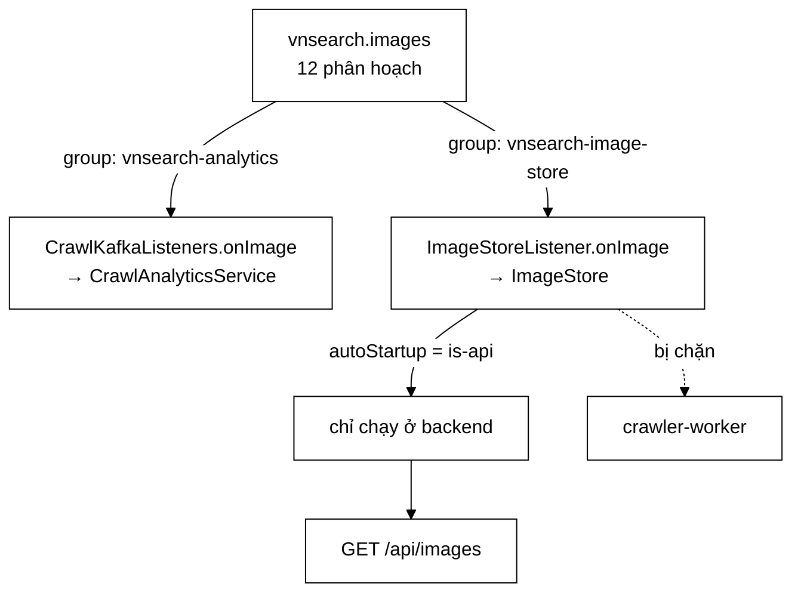

# ImageStoreListener — hai ràng buộc gặp nhau, và hỏng theo kiểu "chỉ mất một nửa"

**File nguồn:** `search-engine/src/main/java/com/vnsearch/config/ImageStoreListener.java` (87 dòng, trong đó **44 dòng Javadoc** cho **1 dòng thân hàm**)
**Gói:** `com.vnsearch.config` · **Loại:** `@Component @ConditionalOnProperty(name = "app.crawler.bus", havingValue = "kafka")`
**Vị trí trong luồng:** đổ ảnh từ topic `vnsearch.images` vào `ImageStore`, phục vụ `GET /api/images`
**Đọc kèm:** [`CrawlKafkaListeners.md`](./CrawlKafkaListeners.md) · [`../crawler/modular/ImageStore.md`](../crawler/modular/ImageStore.md) · [`ImageStorePreloader.md`](./ImageStorePreloader.md) · [`SearchConfig.md`](./SearchConfig.md)

---

## 📌 Hiểu trong 30 giây

Một dòng thân hàm. Bốn mươi bốn dòng giải thích vì sao nó phải là **một lớp
riêng** thay vì một dòng thêm vào [`CrawlKafkaListeners`](./CrawlKafkaListeners.md).

```java
@KafkaListener(
        topics = "${app.crawler.kafka.topic.images}",
        groupId = "${app.crawler.kafka.group.image-store}",   // ① group RIÊNG
        containerFactory = "crawlListenerContainerFactory",
        autoStartup = "${app.crawler.role.is-api:true}")       // ② MỘT tiến trình
public void onImage(ImageFound image) {
    imageStore.add(image);
}
```

Javadoc dòng 16–18:

> *"Hai ràng buộc gặp nhau ở đây, và bỏ qua một trong hai thì tính năng hỏng theo
> kiểu **chỉ mất một phần dữ liệu** — loại hỏng khó thấy nhất vì giao diện vẫn có
> ảnh để hiện."*



```
   ⭐ NẾU DÙNG CHUNG group `vnsearch-analytics`:

   Kafka giao mỗi phân hoạch cho ĐÚNG MỘT consumer
   trong một group.
   ⇒ Analytics nhận 6 phân hoạch, ImageStore nhận 6
   ⇒ Kho ảnh chỉ có MỘT NỬA số ảnh
   ⇒ Số liệu analytics cũng chỉ đếm MỘT NỬA

   Triệu chứng: lưới ảnh vẫn hiện, chỉ là thiếu một nửa.
   Không lỗi, không cảnh báo.
```

---

## 1. Ràng buộc thứ nhất — consumer group riêng

Javadoc dòng 22–28:

> *"`CrawlAnalyticsService` cũng đọc topic ảnh, ở group `vnsearch-analytics`. Nếu
> kho ảnh dùng chung group đó thì hai bên **chia nhau** thông điệp thay vì mỗi bên
> nhận đủ [...] Group riêng thì cả hai cùng nhận trọn luồng. Đó chính là cơ chế
> phát tán một-tới-nhiều mà cả kiến trúc này dựa vào."*

```
   HAI NGƯỜI TIÊU THỤ, HAI MỤC ĐÍCH KHÁC HẲN NHAU

   CrawlAnalyticsService.onImage(image)
     ⇒ ĐẾM: bao nhiêu ảnh, kích thước ra sao
     ⇒ chỉ cần con số

   ImageStore.add(image)
     ⇒ LƯU: giữ lại để phục vụ GET /api/images
     ⇒ cần TOÀN BỘ dữ liệu

   ⇒ Với việc đếm, mất một nửa nghĩa là con số sai một nửa
     — vẫn xấu, nhưng ít nhất tỷ lệ giữa các chỉ số còn giữ.
   ⇒ Với việc lưu, mất một nửa nghĩa là NGƯỜI DÙNG mất
     một nửa kết quả tìm kiếm ảnh.

   ⇒ Hai mức nghiêm trọng khác nhau, cùng một nguyên nhân.
```

```
   VÌ SAO KHÔNG GỘP HAI VIỆC VÀO MỘT LISTENER

   Cách nghe hợp lý nhất:
     public void onImage(ImageFound image) {
         analytics.onImage(image);
         imageStore.add(image);          // them mot dong
     }

   ⇒ Không chia luồng (cùng một listener, cùng một group)
   ⇒ Nghe như tiết kiệm được một lớp

   NHƯNG nó phá vỡ ràng buộc THỨ HAI:
     listener đó KHÔNG có autoStartup theo vai trò
     ⇒ chạy ở cả backend lẫn worker
     ⇒ group `analytics` bị chia đôi GIỮA HAI TIẾN TRÌNH
     ⇒ mỗi tiến trình giữ một nửa ảnh
     ⇒ API chỉ đọc được nửa của backend

   ⇒ Tức là phép gộp "tiết kiệm" đó tái tạo đúng lỗi
     mà lớp này sinh ra để tránh.
   ⇒ Bình luận trong CrawlKafkaListeners.onImage chặn
     đúng suy nghĩ này.
```

---

## 2. Ràng buộc thứ hai — chỉ chạy ở **một** tiến trình

Javadoc dòng 30–39:

> *"`ImageStore` nằm **trong bộ nhớ tiến trình**. Ở chế độ phân tán, backend và
> crawler-worker đều đặt `app.crawler.bus=kafka`, nên nếu listener này chạy ở cả
> hai thì chúng lại vào chung một group và chia đôi luồng — mỗi tiến trình giữ
> một nửa số ảnh, còn API thì chỉ đọc được nửa của backend."*

| `app.crawler.role` | Tiến trình | Có giữ kho ảnh? |
|---|---|---|
| `api` (mặc định) | backend — phục vụ truy vấn | **Có** |
| `worker` | crawler-worker — tiêu thụ Kafka | Không |

```
   ⭐ ĐÂY LÀ ĐÚNG QUY TẮC ĐÃ ĐƯỢC PHÁT BIỂU TRONG KHUNG
     Ở CrawlKafkaListeners.md MỤC 3:

   "Listener nao ghi vao TRANG THAI TRONG BO NHO cua tien
    trinh API thi CHI duoc chay o tien trinh API."

   ImageStore là trạng thái trong bộ nhớ ⇒ áp quy tắc.

   ⇒ Việc quy tắc đó được áp NHẤT QUÁN ở hai lớp khác nhau
     là dấu hiệu nó đã trở thành một nguyên tắc thật,
     không phải một phép vá cho một ca cụ thể.
```

```
   VÌ SAO autoStartup CHỨ KHÔNG PHẢI @ConditionalOnProperty

   Javadoc dòng 73–77:
   "bean VAN duoc tao o ca hai vai tro, nen
    ImageSearchController LUON co ImageStore de tiem —
    chi la o vai tro `worker` thi khong co thong diep nao
    chay vao. Cach nay TRANH MOT CHUOI BEAN VANG MAT
    lan sang cho khac."

   So sánh hai cách:

   @ConditionalOnProperty trên LỚP:
     vai trò worker ⇒ ImageStoreListener KHÔNG tồn tại
     ⇒ (nếu ai đó tiêm nó) NoSuchBeanDefinitionException
     ⇒ và mỗi bean phụ thuộc lại cần @ConditionalOnBean
     ⇒ chuỗi điều kiện lan ra

   autoStartup trên PHƯƠNG THỨC:
     bean luôn tồn tại, chỉ container listener không khởi động
     ⇒ đồ thị bean GIỐNG NHAU ở cả hai vai trò
     ⇒ chỉ hành vi lúc chạy khác

   ⇒ Nguyên tắc: giữ cho CẤU TRÚC giống nhau, chỉ đổi
     HÀNH VI. Điều kiện ở tầng cấu trúc có xu hướng lan.
```

```
   ⚠️ NHƯNG NÓ TẠO RA MỘT TRẠNG THÁI GÂY BỐI RỐI

   Ở vai trò worker:
     - bean ImageStoreListener TỒN TẠI
     - log lúc dựng vẫn in: "Kho anh se duoc nap tu Kafka
       (vai tro: api)"
     - nhưng listener KHÔNG chạy

   ⇒ Dòng log đó nói SAI ở đúng tiến trình mà người ta
     sẽ đi tìm khi kho ảnh trống.
   ⇒ Nó được viết trong hàm dựng, nơi chưa biết vai trò.
   ⇒ Xem đề xuất 2.
```

---

## 3. "Chỉ mất một phần" — vì sao đây là loại hỏng khó nhất

```
   BA MỨC ĐỘ HỎNG, VÀ ĐỘ KHÓ PHÁT HIỆN NGƯỢC VỚI
   MỨC NGHIÊM TRỌNG BỀ MẶT

   ① Hỏng hoàn toàn (kho ảnh RỖNG)
     ⇒ tab Hình ảnh trống trơn
     ⇒ có người báo trong vòng một ngày
     ⇒ DỄ phát hiện

   ② Hỏng có ngoại lệ
     ⇒ log đỏ, cảnh báo kêu
     ⇒ DỄ NHẤT

   ③ Mất một nửa                                   ← ở đây
     ⇒ lưới ảnh vẫn đầy màn hình
     ⇒ người dùng không biết đáng lẽ có bao nhiêu
     ⇒ không ai báo, KHÔNG BAO GIỜ
     ⇒ KHÓ NHẤT

   ⇒ Javadoc gọi đúng tên: "loai hong kho thay nhat vi
     giao dien VAN CO ANH DE HIEN".
```

```
   VÀ KHÔNG CÓ THANG ĐO NÀO BẮT ĐƯỢC

   Để phát hiện "mất một nửa", phải biết con số ĐÚNG.

   Nguồn có thể so sánh:
     CrawlAnalyticsService đếm số ảnh trên bus
     ImageStore.size() đếm số ảnh trong kho

   ⇒ Hai con số này LẼ RA phải bằng nhau (sau khử trùng).
   ⇒ Chênh lệch đáng kể = đúng dấu hiệu của lỗi này.
   ⇒ Nhưng KHÔNG có gì so sánh chúng, và ImageStore.size()
     không được phơi ra Prometheus.

   ⇒ Cùng gia đình với CrawlJobManager.getUnroutableEventCount()
     ở CrawlKafkaListeners.md mục 3: một sự cố im lặng cần
     được chuyển thành MỘT CON SỐ.
   ⇒ Xem đề xuất 1.
```

---

## 4. Giới hạn được ghi thẳng — một bản sao backend

Javadoc dòng 50–54:

> *"**Giới hạn phải nêu rõ:** vì kho nằm trong bộ nhớ, chạy *nhiều bản sao
> backend* sẽ lại chia luồng và mỗi bản chỉ có một phần ảnh. Lời giải đúng ở quy
> mô đó là đưa kho ảnh xuống PostgreSQL — cùng bước mà `UrlSeenFilter` sẽ phải đi
> khi cần bộ lọc lưu bền. Ở quy mô đồ án, một bản sao backend là đủ và giới hạn
> này được **ghi ra đây thay vì giấu đi**."*

```
   ⭐ BỐN PHẦN CỦA MỘT GIỚI HẠN ĐƯỢC GHI TỬ TẾ

   ① Giới hạn là gì
     một bản sao backend, không hơn

   ② Vì sao có giới hạn đó
     kho nằm trong bộ nhớ tiến trình

   ③ Lời giải đúng ở quy mô lớn hơn
     đưa xuống PostgreSQL

   ④ Vì sao chưa làm bây giờ
     ở quy mô đồ án, một bản sao là đủ

   ⇒ Phần ④ là phần biến "nợ kỹ thuật" thành
     "quyết định có thời hạn".
   ⇒ Và nó chỉ ra rằng UrlSeenFilter sẽ phải đi CÙNG bước
     — tức là hai giới hạn khác nhau có CÙNG lời giải,
       nên chúng nên được giải cùng lúc.
```

```
   ⚠️ NHƯNG GIỚI HẠN NÀY KHÔNG ĐƯỢC PHÁT BIỂU RA NGOÀI MÃ

   Nó nằm trong Javadoc của một lớp mà người triển khai
   không có lý do gì để mở ra.

   Người mở rộng hệ thống sẽ:
     kubectl scale deployment backend --replicas=3

   ⇒ Không lỗi, không cảnh báo.
   ⇒ Mỗi bản sao có một phần ba số ảnh.
   ⇒ Kết quả tìm ảnh ĐỔI theo từng request, tuỳ bản sao nào
     nhận được — một hành vi cực kỳ khó lần vì nó
     KHÔNG TÁI HIỆN ĐƯỢC ổn định.

   ⇒ Ràng buộc kiến trúc phải nằm ở nơi hành động vi phạm
     nó xảy ra — tức là manifest triển khai, hoặc một phép
     kiểm lúc khởi động. Xem đề xuất 3.
```

---

## 5. Quan hệ với `ImageStorePreloader` và `SearchConfig`

```
   BA ĐƯỜNG GHI VÀO CÙNG MỘT ImageStore

   ① Chế độ in-process:  CrawlJobManager đổ trực tiếp
   ② Chế độ Kafka:       ImageStoreListener (lớp này)
   ③ Lúc khởi động:      ImageStorePreloader nạp từ đĩa

   MỘT đường đọc: GET /api/images

   ⇒ SearchConfig.md mục 4 đã nêu ràng buộc "một bản duy
     nhất cho cả ứng dụng" cho hai đường đầu.
   ⇒ Đường thứ ba (preloader) làm ràng buộc đó CÀNG chặt:
     nếu có hai bản ImageStore, preloader nạp vào bản A
     còn listener ghi vào bản B.
```

```
   VÀ MỘT TƯƠNG TÁC ĐÚNG GIỮA ② VÀ ③

   ImageStorePreloader dùng addAll (nạp GỘP, không nạp ĐÈ),
   và ImageStore.add khử trùng theo imageUrl.

   ⇒ Nếu một phiên crawl đã kịp đổ ảnh vào kho TRƯỚC khi
     preloader chạy, ảnh cũ trên đĩa chỉ BỔ SUNG.
   ⇒ Không có cửa sổ đua nào gây mất dữ liệu.

   ⇒ Xem ImageStorePreloader.md mục "Nạp GỘP, không nạp ĐÈ".
```

---

## 6. Hướng dẫn thực hành

### 6.1 Cấu hình đúng cho hai tiến trình

```properties
# backend
app.crawler.bus=kafka
app.crawler.role=api
app.crawler.role.is-api=true
app.crawler.kafka.group.image-store=vnsearch-image-store   # KHAC group analytics

# crawler-worker
app.crawler.bus=kafka
app.crawler.role=worker
app.crawler.role.is-api=false
```

### 6.2 Chẩn đoán "tab Hình ảnh thiếu ảnh"

```bash
# 1. Group image-store co MAY consumer?
kafka-consumer-groups --bootstrap-server kafka:9092 \
  --describe --group vnsearch-image-store
# HAI CONSUMER-ID khac nhau => dang chia doi luong (muc 2)

# 2. Group image-store co TRUNG ten voi group analytics khong?
docker exec backend env | grep -i kafka.group
# Trung => hai ben chia nhau (muc 1)

# 3. So anh tren bus vs so anh trong kho
curl -s localhost:8080/api/admin/analytics | jq '.crawl.imagesFound'
curl -s localhost:8080/api/images | jq '.total'
# Chenh lech lon => dung loi "mat mot nua"

# 4. Backend co may ban sao?
kubectl get deployment backend -o jsonpath='{.spec.replicas}'
# > 1 => vi pham gioi han o muc 4
```

### 6.3 Cạm bẫy

```
   ① groupId của lớp này PHẢI khác group analytics.
     Trùng ⇒ hai bên chia nhau, mỗi bên một nửa.

   ② autoStartup PHẢI theo vai trò tiến trình.
     Thiếu ⇒ backend và worker chia nhau, mỗi bên một nửa.

   ③ Backend PHẢI chỉ có MỘT bản sao.
     Nhiều bản ⇒ mỗi bản một phần, và kết quả tìm ảnh
     ĐỔI theo request — không tái hiện được.

   ④ Cả ba lỗi trên cho CÙNG một triệu chứng: thiếu ảnh,
     không lỗi, không cảnh báo.

   ⑤ Log lúc khởi động in "vai tro: api" ở CẢ hai vai trò —
     nó được viết trong hàm dựng, chưa biết vai trò thật.

   ⑥ Cả lớp nằm sau @ConditionalOnProperty(bus=kafka).
     Ở chế độ in-process, ảnh đi qua CrawlJobManager.

   ⑦ Kho ảnh nằm trong RAM. Khởi động lại ⇒ mất, trừ khi
     ImageStorePreloader nạp lại được từ đĩa.
```

---

## 7. Độ phức tạp & chi phí

| Thao tác | Chi phí |
|---|---|
| `onImage` | $O(1)$ — một lời gọi `ImageStore.add` |
| `ImageStore.add` | $O(1)$ trung bình (khử trùng theo `imageUrl`) |
| Bộ nhớ | $O(A)$ với $A$ = số ảnh, **thường trực trong heap backend** |

```
   PHÂN TÍCH BỘ NHỚ — RÀNG BUỘC THẬT SỰ

   ImageFound giữ SIÊU DỮ LIỆU (URL, kích thước, trang nguồn),
   KHÔNG giữ byte ảnh.

   Ước lượng mỗi mục:
     imageUrl   ~100 byte
     pageUrl    ~100 byte
     các trường số/chuỗi khác ~100 byte
     phần đầu đối tượng + map ~100 byte
   ────────────────────────────────
     ≈ 400 byte/ảnh

   Với 30.017 trang × ~10 ảnh/trang = 300.000 ảnh
   ⇒ ~120 MB thường trực trong heap backend

   ⇒ Đây là chi phí ĐÁNG KỂ, và nó cạnh tranh trực tiếp
     với chỉ mục tìm kiếm trong cùng một heap.
   ⇒ Không có trần nào cho ImageStore (đối lập với
     RateLimitFilter.MAX_TRACKED_CLIENTS, nơi trần được
     đặt CHÍNH VÌ lý do này).
   ⇒ Con số này không xuất hiện trong ../eval/MemoryBreakdown.md
     lẫn trong Javadoc của lớp.
```

---

## 8. Kiểm thử liên quan

| Tệp test | Kiểm gì |
|---|---|
| [`ImageStoreTest`](../../../../../test/java/com/vnsearch/crawler/modular/ImageStoreTest.md) | `ImageStore.add`/`addAll`, khử trùng |
| [`KafkaCrawlBusIT`](../../../../../test/java/com/vnsearch/crawler/bus/KafkaCrawlBusIT.md) | Luồng Kafka thật (Testcontainers) |

```
   ⚠️ KHÔNG CÓ TEST NÀO CHO CHÍNH LỚP NÀY.

   Và cả hai test trên đều KHÔNG chạm tới hai ràng buộc
   mà cả lớp tồn tại để bảo đảm.
```

```
   NHỮNG TÍNH CHẤT KHÔNG ĐƯỢC CANH GIỮ

   ✗ groupId của lớp này KHÁC groupId của mọi listener khác
     đọc cùng topic `images`
     — kiểm được bằng phản chiếu, không cần broker

   ✗ autoStartup của lớp này trỏ tới app.crawler.role.is-api

   ✗ Thân phương thức KHÔNG chứa gì ngoài imageStore.add
     — gộp thêm việc vào đây là cách phá vỡ tự nhiên nhất

   ✗ Ở vai trò worker, container listener KHÔNG khởi động
     nhưng bean VẪN tồn tại
     — chính lời hứa của việc chọn autoStartup thay
       @ConditionalOnProperty

   ⇒ Bốn tính chất, ba trong bốn kiểm được bằng phản chiếu
     trong vài mili-giây.
```

---

## 9. Chấm theo chuẩn doanh nghiệp

| Tiêu chí | Điểm | Nhận xét |
|---|---|---|
| **Nêu đúng loại hỏng: "chỉ mất một phần"** | 10/10 | *"Loại hỏng khó thấy nhất vì giao diện vẫn có ảnh để hiện"* — chẩn đoán chính xác vì sao nó không bao giờ được báo |
| **Hai ràng buộc được tách bạch và đánh số** | 10/10 | Mỗi ràng buộc có tiêu đề riêng, cơ chế riêng, hậu quả riêng — người đọc không thể gộp nhầm |
| **Lý do chọn `autoStartup` thay `@ConditionalOnProperty`** | 10/10 | *"Tránh một chuỗi bean vắng mặt lan sang chỗ khác"* — giữ cấu trúc giống nhau, chỉ đổi hành vi |
| **Ghi giới hạn kèm lời giải và thời hạn** | 10/10 | Bốn phần đầy đủ, và chỉ ra `UrlSeenFilter` cần **cùng** lời giải nên nên giải cùng lúc |
| Bảng vai trò tiến trình | 9/10 | Hai dòng, trả lời dứt khoát câu hỏi "tiến trình nào giữ kho ảnh" |
| Áp nhất quán quy tắc từ `CrawlKafkaListeners` | 9/10 | Cùng quy tắc ở hai lớp khác nhau ⇒ nó đã là nguyên tắc, không phải phép vá |
| **Kiểm thử hai ràng buộc trung tâm** | **0/10** | Ba trong bốn tính chất kiểm được bằng phản chiếu, và **không cái nào có test** |
| **Không có thang đo phát hiện "mất một nửa"** | **3/10** | `CrawlAnalyticsService` và `ImageStore` lẽ ra phải cho cùng con số; không gì so sánh chúng |
| **Giới hạn một bản sao không ra khỏi Javadoc** | **3/10** | `kubectl scale --replicas=3` không gây lỗi nào, và hậu quả **không tái hiện được ổn định** |
| Log khởi động nói sai ở vai trò worker | 4/10 | *"Kho ảnh sẽ được nạp từ Kafka (vai trò: api)"* in ra ở cả worker — đúng chỗ người ta đi tìm khi kho trống |
| Không có trần cho `ImageStore` | 5/10 | ~120 MB thường trực ở quy mô hiện tại, cạnh tranh heap với chỉ mục; `RateLimitFilter` đã đặt trần vì đúng lý do này |
| Ba đường ghi vào một kho | 6/10 | Ràng buộc "một bản duy nhất" càng chặt hơn, nhưng chỉ được nêu ở `SearchConfig`, không nhắc lại ở đây |

**Ba đề xuất nâng lên mức sản phẩm:**

1. **Chuyển "mất một nửa" thành một con số so sánh được.** Lỗi trung tâm của lớp
   này không có triệu chứng nào — và dự án đã có sẵn **hai** nguồn đếm lẽ ra phải
   khớp nhau. Việc còn thiếu chỉ là phơi cả hai ra rồi so sánh, đúng mẫu mà
   `getUnroutableEventCount()` đã dùng cho sự cố frontier:
   ```java
   @Bean
   public MeterBinder imageStoreMetrics(ImageStore store, CrawlAnalyticsService analytics) {
       return registry -> {
           Gauge.builder("vnsearch.images.stored", store, ImageStore::size)
                   .description("So anh dang giu trong kho (nguon cua GET /api/images)")
                   .register(registry);

           // Chenh lech giua "so anh di qua bus" va "so anh vao duoc kho" la
           // dau hieu DUY NHAT cua loi chia doi luong o muc 1 va muc 2 — loai
           // loi ma giao dien VAN co anh de hien nen khong ai bao.
           Gauge.builder("vnsearch.images.store.miss.ratio", store,
                           s -> {
                               long quaBus = analytics.getImagesFoundCount();
                               return quaBus == 0 ? 0.0 : 1.0 - (double) s.size() / quaBus;
                           })
                   .description("Ty le anh di qua bus nhung KHONG vao duoc kho")
                   .register(registry);
       };
   }
   ```
   ```yaml
   # Ty le nay > 0,2 gan nhu chac chan la loi cau hinh consumer group hoac
   # autoStartup, KHONG phai loi du lieu. Kiem chung bang:
   #   kafka-consumer-groups --describe --group vnsearch-image-store
   - alert: KhoAnhMatDuLieu
     expr: vnsearch_images_store_miss_ratio > 0.2
     for: 15m
   ```

2. **Sửa dòng log để nó nói đúng vai trò thật.** Câu *"Kho ảnh sẽ được nạp từ
   Kafka (vai trò: api)"* hiện in ra ở **cả** worker, tức là nó khẳng định sai ở
   đúng tiến trình mà người ta sẽ soi khi kho ảnh trống. Vai trò đã có sẵn trong
   cấu hình, chỉ là chưa được đọc:
   ```java
   public ImageStoreListener(ImageStore imageStore,
                              @Value("${app.crawler.role.is-api:true}") boolean laApi) {
       this.imageStore = imageStore;
       if (laApi) {
           log.info("Kho anh SE duoc nap tu Kafka (vai tro: api)");
       } else {
           log.info("Kho anh KHONG duoc nap o tien trinh nay (vai tro: worker)."
                   + " Day la co y: ImageStore nam trong bo nho, chay listener o ca hai"
                   + " tien trinh se lam Kafka chia doi luong va moi ben chi giu mot nua anh.");
       }
   }
   ```
   Nhánh `else` quan trọng hơn nhánh `if`: nó biến một sự **vắng mặt** (không có
   log nào về kho ảnh) thành một **khẳng định có lý do**, nên người đọc log ở
   worker biết ngay đây là thiết kế chứ không phải hỏng.

3. **Đưa ràng buộc "một bản sao backend" ra khỏi Javadoc.** Giới hạn được ghi rất
   tử tế, nhưng nó nằm ở nơi người chạy `kubectl scale` không bao giờ mở ra — và
   vi phạm nó tạo ra một lỗi **không tái hiện được ổn định** (kết quả tìm ảnh đổi
   theo bản sao nào nhận request), tức là loại lỗi tốn nhiều giờ nhất để lần:
   ```java
   @Bean
   public ApplicationRunner kiemTraSoBanSaoBackend(
           @Value("${app.crawler.role.is-api:true}") boolean laApi,
           @Value("${app.deployment.backend-replicas:1}") int soBanSao) {
       return args -> {
           if (laApi && soBanSao > 1) {
               throw new IllegalStateException(
                       "Backend dang chay " + soBanSao + " ban sao, nhung ImageStore nam"
                               + " TRONG BO NHO tien trinh. Kafka se chia luong anh giua cac"
                               + " ban sao, moi ban chi giu mot phan, va ket qua GET /api/images"
                               + " se DOI theo tung request tuy ban sao nao nhan duoc — mot loi"
                               + " KHONG tai hien duoc on dinh. Muon chay nhieu ban sao thi phai"
                               + " dua kho anh xuong PostgreSQL truoc (cung buoc ma UrlSeenFilter"
                               + " can). Tam thoi: dat replicas=1.");
           }
       };
   }
   ```
   Kèm theo, manifest triển khai nên mang một bình luận trỏ ngược về đây — ràng
   buộc kiến trúc chỉ hiệu quả khi nó nằm ở nơi hành động vi phạm xảy ra, và ở đây
   hành động đó là sửa một con số trong tệp YAML, không phải sửa mã Java.

---

## 10. Liên kết

- Lớp chuyển tiếp Kafka chính, và bình luận chặn phép gộp: [`CrawlKafkaListeners.md`](./CrawlKafkaListeners.md) mục 4
- Kho ảnh được ghi vào: [`../crawler/modular/ImageStore.md`](../crawler/modular/ImageStore.md)
- Đường ghi thứ ba, nạp lại từ đĩa lúc khởi động: [`ImageStorePreloader.md`](./ImageStorePreloader.md)
- Nơi `ImageStore` được khai là bean dùng chung: [`SearchConfig.md`](./SearchConfig.md) mục 4
- Kiểu sự kiện được tiêu thụ: [`../crawler/bus/ImageFound.md`](../crawler/bus/ImageFound.md)
- Người tiêu thụ thứ hai của cùng topic: [`../crawler/modular/CrawlAnalyticsService.md`](../crawler/modular/CrawlAnalyticsService.md)
- Endpoint đọc kho ảnh: [`../controller/ImageSearchController.md`](../controller/ImageSearchController.md)
- Cấu hình topic, group và nhà máy container: [`KafkaCrawlConfig.md`](./KafkaCrawlConfig.md)
- Giới hạn cùng loại, cần cùng lời giải lưu bền: [`../crawler/UrlSeenFilter.md`](../crawler/UrlSeenFilter.md)
- Đường ghi ở chế độ in-process: [`../service/CrawlJobManager.md`](../service/CrawlJobManager.md)
