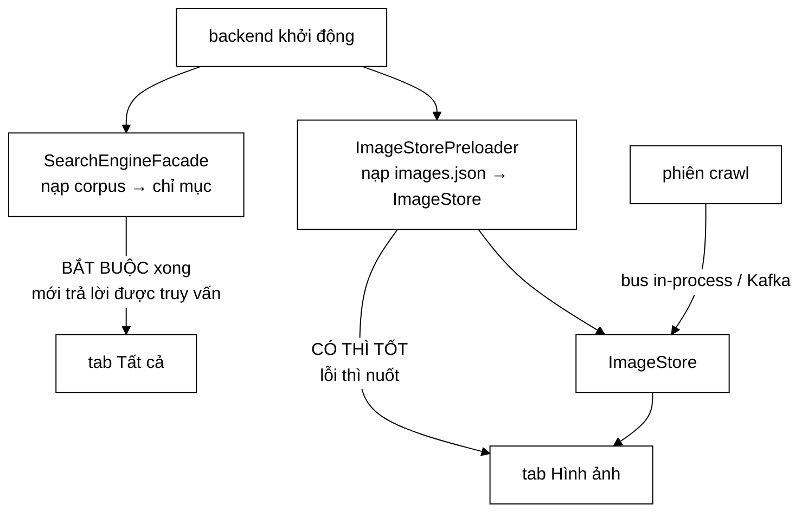

# ImageStorePreloader — hai tab của cùng một giao diện, hai nguồn dữ liệu, một cái biến mất

**File nguồn:** `search-engine/src/main/java/com/vnsearch/config/ImageStorePreloader.java` (98 dòng)
**Gói:** `com.vnsearch.config` · **Loại:** `@Component` với một `@PostConstruct`
**Vị trí trong luồng:** nạp kho ảnh từ đĩa vào `ImageStore` lúc backend khởi động — **không** phụ thuộc chế độ bus
**Đọc kèm:** [`../crawler/modular/ImageStorage.md`](../crawler/modular/ImageStorage.md) · [`../crawler/modular/ImageStore.md`](../crawler/modular/ImageStore.md) · [`ImageStoreListener.md`](./ImageStoreListener.md) · [`../service/SearchEngineFacade.md`](../service/SearchEngineFacade.md)

---

## 📌 Hiểu trong 30 giây

Một `@PostConstruct` đọc tệp ảnh từ đĩa và gộp vào kho. Toàn bộ giá trị nằm ở
việc nó bịt một **bất đối xứng** giữa hai tab của cùng một giao diện.

| Tab | Nguồn | Sau khi khởi động lại, chưa crawl |
|---|---|---|
| Tất cả | `index.json` / corpus trên đĩa | **Có dữ liệu** |
| Hình ảnh | `ImageStore` trong RAM | Không — trống trơn |

```java
@PostConstruct
public void preload() {
    String path = ImageStorage.pathFor(crawledDataPath);
    List<ImageFound> images = ImageStorage.loadQuietly(path);
    if (images.isEmpty()) {
        log.info("Chua co kho anh tai {} — tab Hinh anh se trong cho toi phien crawl tiep theo", path);
        return;
    }
    int added = imageStore.addAll(images);
    log.info("Da nap kho anh tu {}: {} anh tren {} trang ({} ms)", ...);
}
```



```
   ⭐ HAI MŨI TÊN TỪ "khởi động" CÓ HAI MỨC QUAN TRỌNG
     KHÁC HẲN NHAU — VÀ ĐÓ LÀ LÝ DO LỚP NÀY ĐỨNG RIÊNG.

   Nạp corpus:  BẮT BUỘC. Hỏng ⇒ không trả lời được truy vấn.
   Nạp ảnh:     CÓ THÌ TỐT. Hỏng ⇒ một tab nghèo đi.

   Trộn hai mức đó vào một hàm nghĩa là MỘT TỆP ẢNH HỎNG
   có thể kéo sập cả phần tìm kiếm văn bản.
```

---

## 1. Lỗ hổng được bịt — và vì sao nó "đúng hành vi, sai nguyên nhân"

Javadoc dòng 34–37:

> *"Người dùng gõ một truy vấn, tab "Tất cả" trả về 40 kết quả, tab "Hình ảnh" báo
> "không tìm thấy ảnh nào". Không có lỗi, không có log, và lời khuyên mà giao diện
> đưa ra ("hãy chạy một phiên crawl mới") lại **đúng về hành vi nhưng sai về
> nguyên nhân** — ảnh đã từng được crawl, chỉ là không ai lưu."*

```
   ⭐ CỤM "ĐÚNG VỀ HÀNH VI NHƯNG SAI VỀ NGUYÊN NHÂN"
     ĐÁNG ĐỌC KỸ.

   Lời khuyên "hãy chạy một phiên crawl mới":
     - Làm theo ⇒ tab Hình ảnh CÓ ảnh trở lại   ✓ hiệu quả
     - Nhưng nó ngụ ý "chưa từng crawl ảnh"     ✗ sai

   ⇒ Đây là loại thông báo NGUY HIỂM NHẤT trong giao diện:
     nó chữa được triệu chứng nên không ai nghi ngờ nó,
     và vì thế nguyên nhân thật (không có cơ chế lưu bền)
     KHÔNG BAO GIỜ được phát hiện.

   ⇒ Người dùng sẽ crawl lại sau MỖI lần khởi động lại,
     mãi mãi, và coi đó là chuyện bình thường.
```

```
   CÁI GIÁ THẬT CỦA "CRAWL LẠI"

   Một phiên crawl:
     - hàng nghìn request ra Internet
     - hàng chục phút
     - làm phiền các máy chủ bị crawl

   ⇒ Để lấy lại một tệp JSON siêu dữ liệu vài MB
     mà lẽ ra đã nằm sẵn trên đĩa.

   ⇒ Cùng đúng lập luận với retention.ms ở
     KafkaCrawlConfig.md mục 3.1: dữ liệu đã có rồi thì
     đừng đi lấy lại từ nguồn.
```

```
   VÌ SAO BẤT ĐỐI XỨNG NÀY TỒN TẠI ĐƯỢC LÂU

   Chỉ mục có đường lưu bền TỪ ĐẦU (index.json, corpus).
   Kho ảnh là tính năng thêm SAU, và nó được nối vào
   luồng crawl đang chạy — chỗ tự nhiên nhất để nối.

   ⇒ Không ai đặt câu hỏi "sau khi khởi động lại thì sao?"
     vì lúc phát triển, người ta luôn vừa crawl xong.
   ⇒ Lỗi chỉ lộ ra ở lần khởi động lại ĐẦU TIÊN mà
     KHÔNG crawl — tức là ở môi trường triển khai thật.

   ⇒ Khuôn lỗi: TÍNH NĂNG MỚI THỪA KẾ VÒNG ĐỜI CỦA
     LUỒNG MÀ NÓ ĐƯỢC NỐI VÀO, chứ không phải vòng đời
     mà nó CẦN.
```

---

## 2. Vì sao là lớp riêng, không nhét vào `SearchEngineFacade`

Javadoc dòng 41–47:

> *"Facade nạp corpus và dựng chỉ mục — một việc **bắt buộc** phải xong thì ứng
> dụng mới trả lời được truy vấn. Nạp ảnh là việc **có thì tốt**: hỏng nó thì tab
> "Hình ảnh" nghèo đi, còn mọi thứ khác vẫn chạy. Trộn hai mức quan trọng đó vào
> một hàm nghĩa là một tệp ảnh hỏng có thể kéo sập cả phần tìm kiếm văn bản."*

```
   PHÂN LOẠI KHỞI ĐỘNG THEO MỨC BẮT BUỘC

   BẮT BUỘC (hỏng ⇒ ứng dụng vô dụng):
     nạp corpus, dựng chỉ mục
     kiểm ADMIN_API_KEY        (SecurityConfig)
     kết nối broker Kafka      (KafkaCrawlConfig)
   ⇒ Hỏng thì PHẢI chặn khởi động

   CÓ THÌ TỐT (hỏng ⇒ mất một tính năng phụ):
     tạo tài khoản mồi         (AuthConfig)
     nạp kho ảnh               (ở đây)
   ⇒ Hỏng thì CẢNH BÁO, không chặn

   ⇒ Đây là lần thứ ba trong gói config cùng một phép phân
     loại, và cả ba lần đều cho ra quyết định NHẤT QUÁN.
   ⇒ Phép thử của AuthConfig.md mục 3 giải thích được cả ba.
```

```
   NUỐT LỖI — VÀ VÌ SAO Ở ĐÂY LÀ ĐÚNG

   ImageStorage.loadQuietly(path)
   ⇒ tên hàm nói thẳng: nó nuốt lỗi

   Bình thường "nuốt lỗi" là mã xấu. Ở đây nó đúng vì:
     ① Mức quan trọng đã được phân loại rõ (có thì tốt)
     ② Tên hàm KHẲNG ĐỊNH hành vi đó, không giấu
     ③ Có nhánh xử lý rỗng với log giải thích

   ⚠️ Nhưng "nuốt lặng lẽ" và "nuốt có ghi lại" là hai
     việc khác nhau. Hiện tại một tệp images.json HỎNG
     (JSON sai cú pháp) cho ra CÙNG một dòng log với
     một tệp KHÔNG TỒN TẠI:

       "Chua co kho anh tai ... — tab Hinh anh se trong"

   ⇒ Hai nguyên nhân hoàn toàn khác nhau, cùng một thông báo.
   ⇒ Trường hợp "tệp hỏng" là bất thường và đáng cảnh báo;
     trường hợp "chưa có tệp" là bình thường.
   ⇒ Xem đề xuất 2.
```

---

## 3. Nạp **gộp**, không nạp **đè**

Javadoc dòng 51–54:

> *"Dùng `ImageStore#addAll` nên nếu một phiên crawl đã kịp đổ ảnh vào kho trước
> khi bean này chạy, ảnh cũ trên đĩa chỉ *bổ sung* chứ không xoá gì. Khử trùng
> theo `imageUrl` nằm sẵn trong `add`, nên nạp hai lần cũng không sinh bản ghi
> trùng."*

```
   CỬA SỔ ĐUA CÓ THẬT, VÀ NÓ ĐƯỢC XỬ LÝ ĐÚNG

   @PostConstruct của ImageStorePreloader chạy khi nào?
     → sau khi ImageStore được dựng, trước khi ứng dụng
       sẵn sàng nhận request

   ImageStoreListener bắt đầu nhận thông điệp khi nào?
     → khi container Kafka khởi động, thường SAU
       @PostConstruct nhưng KHÔNG có gì bảo đảm thứ tự

   ⇒ Về lý thuyết, listener có thể đã ghi vài ảnh vào kho
     trước khi preloader chạy.

   Nếu dùng `set`/`replaceAll`:
     ⇒ preloader XOÁ những ảnh listener vừa ghi
     ⇒ mất dữ liệu, im lặng, và PHỤ THUỘC THỜI ĐIỂM
       (không tái hiện được)

   Với `addAll` + khử trùng theo imageUrl:
     ⇒ thứ tự KHÔNG quan trọng
     ⇒ nạp hai lần cũng không sao

   ⇒ Đây là tính GIAO HOÁN + LUỸ ĐẲNG, và nó làm cho
     một lỗi đua trở nên KHÔNG BIỂU DIỄN ĐƯỢC.
```

```
   ⭐ CÙNG KỸ THUẬT VỚI bootstrapAdmin Ở AuthConfig.md MỤC 4.

   Ở đó: "đã có thì KHÔNG ghi đè"
   Ở đây: "gộp chứ không đè"

   Cả hai đều nhắm tới cùng một tính chất: chạy nhiều lần
   cho cùng kết quả.

   ⇒ Và cả hai đều bảo vệ chống lại cùng một hậu quả:
     một phép ghi tự động HOÀN TÁC âm thầm một thứ
     mà nguồn khác vừa tạo ra.
```

---

## 4. Dùng chung khoá cấu hình — chống lệch nguồn dữ liệu

```java
/**
 * <p>Dùng chung khoá cấu hình với {@code SearchEngineFacade} chứ không thêm
 * một khoá {@code app.images.data-path} riêng. Hai khoá độc lập thì sẽ có
 * ngày chúng trỏ lệch nhau, và khi đó kho ảnh nạp từ phiên crawl này còn
 * chỉ mục nạp từ phiên khác — số liệu hai tab không khớp mà không ai biết
 * vì sao.
 */
@Value("${app.crawler.data-path}")
private String crawledDataPath;
```

```
   HAI KHOÁ ĐỘC LẬP SẼ LỆCH — VÌ SAO ĐÓ LÀ TẤT YẾU

   Không phải vì ai đó cẩu thả. Vì:
     - đổi đường dẫn dữ liệu là thao tác vận hành bình thường
     - người đổi tìm khoá bằng cách grep tên mình nhớ
     - grep "data-path" ra hai kết quả ⇒ có thể đổi cả hai
     - grep "crawler.data-path" ra một ⇒ đổi một

   ⇒ Xác suất lệch không bằng 0, và hậu quả IM LẶNG:
     tab Tất cả cho kết quả của corpus A
     tab Hình ảnh cho ảnh của corpus B
     ⇒ hai tab nói về hai tập dữ liệu khác nhau

   ⇒ Giải pháp ở đây triệt tiêu khả năng đó về mặt CẤU TRÚC:
     một khoá thì không thể lệch với chính nó.
```

```
   VÀ ImageStorage.pathFor() LÀ MẢNH GHÉP CÒN LẠI

   String path = ImageStorage.pathFor(crawledDataPath);

   ⇒ Quy tắc suy ra tên tệp ảnh từ đường dẫn corpus nằm
     trong MỘT hàm dùng chung.
   ⇒ Nơi GHI (ImageStorage.save) và nơi ĐỌC (ở đây) dùng
     CÙNG hàm đó.
   ⇒ Nên chúng không thể trỏ lệch nhau.

   ⇒ Cùng đúng kỹ thuật "điểm bất động" về mặt tinh thần
     với ../service/LanguageDetector.md mục 5: định nghĩa
     phép kiểm BẰNG chính phép biến đổi, thay vì viết lại
     một bản song song có thể trôi lệch.
```

---

## 5. Hai dòng log — và chúng nói được gì

```java
// Truong hop rong
log.info("Chua co kho anh tai {} — tab Hinh anh se trong cho toi phien crawl tiep theo", path);

// Truong hop co du lieu
log.info("Da nap kho anh tu {}: {} anh tren {} trang ({} ms)",
        path, added, imageStore.pageCount(), System.currentTimeMillis() - start);
```

```
   DÒNG THỨ NHẤT LÀM ĐÚNG BA VIỆC

   ① In ĐƯỜNG DẪN cụ thể
     "Noi ro tep nao bi thieu de nguoi doc log khong phai doan"
     ⇒ Phần lớn các lần gặp lỗi này thực ra là chạy sai
       thư mục làm việc, và đường dẫn nói ngay điều đó.

   ② Nói TRIỆU CHỨNG sẽ thấy ở giao diện
     "tab Hinh anh se trong"
     ⇒ Nối dòng log với thứ người dùng nhìn thấy.

   ③ Nói CÁCH KHẮC PHỤC
     "cho toi phien crawl tiep theo"
     ⇒ Và nói rõ đây KHÔNG phải lỗi.

   ⚠️ Nhưng nó in đường dẫn TƯƠNG ĐỐI, không tuyệt đối.
     Cùng cạm bẫy với AuthConfig.md mục 6.3 ⑤.
```

```
   DÒNG THỨ HAI CÓ MỘT SỐ ĐO KHÔNG AI DÙNG

   "({} ms)" — thời gian nạp

   Nó hữu ích khi: tệp ảnh lớn tới mức nạp chậm
   ⇒ nhưng KHÔNG có ngưỡng nào, không cảnh báo nào

   ⇒ So sánh với ../eval/MemoryBreakdown.md, nơi mọi con số
     đo được đều dẫn tới một kết luận.
   ⇒ Ở đây con số này chỉ là thông tin, và đó là mức phù hợp.

   ⚠️ Điều đáng chú ý hơn: `added` (số ảnh THÊM ĐƯỢC) khác
     với images.size() (số ảnh ĐỌC ĐƯỢC), vì addAll khử trùng.
   ⇒ Nếu added < images.size() nghĩa là kho đã có sẵn một
     phần — tức là cửa sổ đua ở mục 3 ĐÃ xảy ra.
   ⇒ Log không nêu cả hai con số nên không phát hiện được
     điều đó.
```

---

## 6. Điều lớp này **không** làm

```
   ⚠️ NÓ NẠP, NHƯNG KHÔNG AI GHI Ở PHÍA NÀY

   ImageStorePreloader  → ĐỌC images.json
   ImageStorage.save    → GHI images.json, được gọi từ đâu?

   Ghi xảy ra trong luồng crawl (ContentStorage / phiên crawl),
   KHÔNG có gì ghi lại khi ứng dụng tắt.

   ⇒ Hệ quả: ảnh nhận qua Kafka SAU khi phiên crawl kết thúc
     (ví dụ khi worker xử lý tồn đọng) có thể nằm trong
     ImageStore nhưng KHÔNG bao giờ xuống đĩa.
   ⇒ Khởi động lại ⇒ mất phần đó.

   ⇒ Đây là lỗ hổng CÙNG LOẠI với lỗ hổng mà lớp này bịt,
     chỉ nhỏ hơn. Và nó không được nêu.
```

```
   VÀ NÓ KHÔNG CÓ ĐIỀU KIỆN THEO VAI TRÒ

   ImageStoreListener có autoStartup = is-api.
   ImageStorePreloader thì KHÔNG có điều kiện nào.

   ⇒ Ở crawler-worker, preloader VẪN chạy và nạp toàn bộ
     tệp ảnh vào heap của worker.
   ⇒ Worker KHÔNG phục vụ GET /api/images ⇒ dữ liệu đó
     hoàn toàn vô dụng ở đó.
   ⇒ ~120 MB heap bị chiếm vô ích (xem
     ImageStoreListener.md mục 7).

   ⇒ Không gây sai kết quả, chỉ lãng phí. Nhưng nó là một
     điểm KHÔNG NHẤT QUÁN với lớp anh em ngay bên cạnh.
   ⇒ Xem đề xuất 3.
```

---

## 7. Hướng dẫn thực hành

### 7.1 Kiểm tra kho ảnh sau khi khởi động

```bash
# 1. Doc log khoi dong
grep "kho anh" logs/vnsearch.log
# "Da nap kho anh tu data/images.json: 28431 anh tren 30017 trang (312 ms)"
# hoac
# "Chua co kho anh tai data/images.json — tab Hinh anh se trong..."

# 2. Tep co ton tai khong
ls -la data/images.json

# 3. Kho co du lieu chua
curl -s localhost:8080/api/images?q=test | jq '.total'
```

### 7.2 Cạm bẫy

```
   ① Đường dẫn TƯƠNG ĐỐI với thư mục làm việc.
     Chạy từ thư mục khác ⇒ "chưa có kho ảnh" dù tệp có thật.

   ② Tệp images.json HỎNG cho ra CÙNG một dòng log với
     tệp KHÔNG TỒN TẠI. Hai nguyên nhân, một thông báo.

   ③ Preloader chạy ở CẢ backend lẫn worker (không có
     điều kiện vai trò), chiếm heap vô ích ở worker.

   ④ Không có gì GHI images.json lúc tắt ứng dụng.
     Ảnh nhận sau khi phiên crawl kết thúc có thể không
     bao giờ xuống đĩa.

   ⑤ `added` trong log là số ảnh THÊM ĐƯỢC sau khử trùng,
     không phải số ảnh đọc từ tệp. Hai con số có thể khác.

   ⑥ Lớp này KHÔNG nằm sau @ConditionalOnProperty —
     nó chạy ở cả chế độ in-process lẫn Kafka. Đó là đúng:
     lỗ hổng nó bịt tồn tại ở cả hai chế độ.
```

---

## 8. Độ phức tạp & chi phí

| Thao tác | Chi phí |
|---|---|
| `loadQuietly` | $O(A)$ đọc + phân tích JSON, $A$ = số ảnh |
| `addAll` | $O(A)$ trung bình (khử trùng bằng bảng băm) |
| Bộ nhớ | $O(A)$ thường trực trong heap |

```
   PHÂN TÍCH — ĐÓNG GÓP VÀO THỜI GIAN KHỞI ĐỘNG

   Với 300.000 ảnh, ~400 byte siêu dữ liệu mỗi ảnh:
     đọc + phân tích JSON  ~300–500 ms
     addAll + khử trùng    ~100 ms
   ────────────────────────────────────
     ~0,5 giây

   So với ~40 giây nạp chỉ mục ⇒ ~1 % thời gian khởi động.

   ⇒ Không đáng kể, và log đã in con số này ra để kiểm chứng.

   ⚠️ Chi phí THẬT là bộ nhớ: ~120 MB thường trực,
     và nó bị trả CẢ Ở WORKER nơi dữ liệu đó vô dụng.
```

---

## 9. Kiểm thử liên quan

| Tệp test | Kiểm gì |
|---|---|
| [`ImageStoreTest`](../../../../../test/java/com/vnsearch/crawler/modular/ImageStoreTest.md) | `addAll`, khử trùng theo `imageUrl` |
| [`ImageStorageTest`](../../../../../test/java/com/vnsearch/crawler/modular/ImageStorageTest.md) | Đọc/ghi tệp, `pathFor`, `loadQuietly` |

```
   ⚠️ KHÔNG CÓ TEST NÀO CHO CHÍNH LỚP NÀY.

   Hai lớp mà nó gọi đều được test kỹ.
   Bản thân việc NỐI chúng lại thì không.
```

```
   NHỮNG TÍNH CHẤT KHÔNG ĐƯỢC CANH GIỮ

   ✗ Chạy preload HAI LẦN không sinh bản ghi trùng
     — chính lời hứa "nạp gộp, không nạp đè"

   ✗ Ảnh có sẵn trong kho trước khi preload chạy KHÔNG bị xoá
     — đây là bảo vệ chống cửa sổ đua ở mục 3, và việc mất
       nó gây mất dữ liệu PHỤ THUỘC THỜI ĐIỂM (không tái
       hiện được)

   ✗ Tệp không tồn tại ⇒ KHÔNG ném, ứng dụng vẫn khởi động
     — phân loại "có thì tốt" ở mục 2

   ✗ Tệp HỎNG ⇒ cũng không ném, nhưng PHẢI phân biệt được
     với tệp không tồn tại

   ✗ Dùng cùng khoá cấu hình với SearchEngineFacade
     — kiểm được bằng phản chiếu trường @Value

   ⇒ Năm tính chất, và tính chất thứ hai là loại khó gỡ nhất
     nếu hỏng. Tất cả đều kiểm được bằng @TempDir + JUnit
     thuần trong vài mili-giây.
```

---

## 10. Liên kết

- Lớp đọc/ghi tệp ảnh, và hàm `pathFor` dùng chung: [`../crawler/modular/ImageStorage.md`](../crawler/modular/ImageStorage.md)
- Kho ảnh được nạp vào, và phép khử trùng theo `imageUrl`: [`../crawler/modular/ImageStore.md`](../crawler/modular/ImageStore.md)
- Đường ghi thứ hai vào cùng kho, có điều kiện theo vai trò: [`ImageStoreListener.md`](./ImageStoreListener.md)
- Đường ghi thứ ba, ở chế độ in-process: [`../service/CrawlJobManager.md`](../service/CrawlJobManager.md)
- Nơi khoá `app.crawler.data-path` cũng được đọc: [`../service/SearchEngineFacade.md`](../service/SearchEngineFacade.md)
- Nơi kho ảnh được khai là bean dùng chung: [`SearchConfig.md`](./SearchConfig.md) mục 4
- Endpoint tiêu thụ kho ảnh: [`../controller/ImageSearchController.md`](../controller/ImageSearchController.md)
- Cùng kỹ thuật "chạy nhiều lần cho cùng kết quả": [`AuthConfig.md`](./AuthConfig.md) mục 4
- Cùng phép phân loại "bắt buộc" và "có thì tốt": [`AuthConfig.md`](./AuthConfig.md) mục 3
