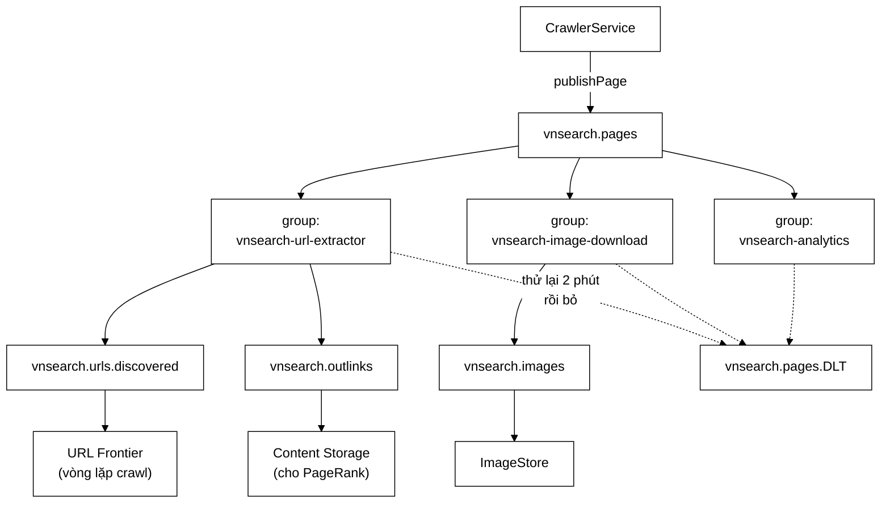

# KafkaCrawlConfig — cả một kiến trúc phân tán nằm sau một dòng `@ConditionalOnProperty`

**File nguồn:** `search-engine/src/main/java/com/vnsearch/config/KafkaCrawlConfig.java` (512 dòng — tệp cấu hình dài nhất dự án)
**Gói:** `com.vnsearch.config` · **Loại:** `@Configuration @EnableKafka @ConditionalOnProperty(name = "app.crawler.bus", havingValue = "kafka")`
**Vị trí trong luồng:** nối dây toàn bộ chế độ phân tán — topic, producer, consumer, dead-letter, và các Modular Service
**Đọc kèm:** [`../crawler/bus/KafkaCrawlEventBus.md`](../crawler/bus/KafkaCrawlEventBus.md) · [`CrawlKafkaListeners.md`](./CrawlKafkaListeners.md) · [`../crawler/bus/CrawlEventBus.md`](../crawler/bus/CrawlEventBus.md) · [`MetricsConfig.md`](./MetricsConfig.md)

---

## 📌 Hiểu trong 30 giây

Toàn bộ tệp nằm sau **một điều kiện**. Ở cấu hình mặc định, không một bean Kafka
nào được tạo, không một kết nối nào được mở.

```java
@Configuration
@EnableKafka
@ConditionalOnProperty(name = "app.crawler.bus", havingValue = "kafka")
public class KafkaCrawlConfig { ... }
```

Javadoc dòng 53–57:

> *"Điều đó quan trọng hơn vẻ ngoài của nó: một dự án mà "chạy thử" đòi hỏi dựng
> broker trước là một dự án **không ai chạy thử**."*



```
   ⭐ BA CONSUMER GROUP TRÊN CÙNG MỘT TOPIC LÀ TOÀN BỘ
     LÝ DO CHỌN KAFKA.

   Mỗi group giữ OFFSET RIÊNG.
   ⇒ Cả ba nhận TRỌN VẸN luồng trang.
   ⇒ Một service chậm KHÔNG chặn hai service kia.

   Với một hàng đợi công việc (RabbitMQ dạng work queue):
     mỗi thông điệp đi tới ĐÚNG MỘT consumer
   ⇒ phải nhân bản thông điệp ba lần ở phía gửi
   ⇒ và thêm service thứ tư = sửa mã của người GỬI

   ⇒ Ở đây thêm service thứ tư = thêm một consumer group.
     Người gửi không biết gì cả.
```

---

## 1. `@ConditionalOnProperty` — điều kiện đắt giá nhất tệp

```
   ĐIỀU KIỆN NÀY BẢO VỆ CÁI GÌ

   Không có nó:
     ① `./run-backend.bat` đòi một broker Kafka đang chạy
     ② Test đơn vị phải dựng Testcontainers
     ③ Một người mới clone repo về không chạy được gì
       trong 30 phút đầu

   Với nó:
     app.crawler.bus mặc định = "in-process"
     ⇒ InProcessCrawlEventBus (một hàng đợi trong bộ nhớ)
     ⇒ chạy được ngay, không hạ tầng nào

   ⇒ "Chạy thử được trong 30 giây" là một thuộc tính
     KIẾN TRÚC, không phải tiện nghi.
```

```
   NHƯNG NÓ TẠO RA MỘT NGHĨA VỤ: HAI ĐƯỜNG PHẢI TƯƠNG ĐƯƠNG

   Chế độ in-process → CrawlJobManager đổ ảnh vào ImageStore
   Chế độ Kafka      → CrawlKafkaListeners đổ ảnh vào ImageStore

   ⇒ Hai đường mã HOÀN TOÀN khác nhau phải cho cùng kết quả.
   ⇒ Xem SearchConfig.md mục 4 ("hai đường ghi, một kho đọc").

   ⚠️ Và điều đó KHÔNG được kiểm bởi test nào so sánh hai
     chế độ với nhau. Một tính năng thêm vào một đường mà
     quên đường kia sẽ hỏng chỉ ở chế độ triển khai thật —
     tức là chỗ khó phát hiện nhất.
```

---

## 2. `KafkaAdmin` — lỗi đã xảy ra thật, và không test nào bắt được

Javadoc dòng 130–157, đoạn đáng đọc nhất cả tệp:

> *"`KafkaAutoConfiguration` có tạo sẵn một `KafkaAdmin`, nhưng nó đọc địa chỉ
> broker từ `spring.kafka.bootstrap-servers`. Cấu hình của dự án này lại nằm ở
> `app.crawler.kafka.bootstrap-servers` — mọi khoá đều dưới tiền tố `app.` để một
> chỗ duy nhất mô tả hành vi ứng dụng."*

```
   CHUỖI HỆ QUẢ — ĐỌC TỪNG BƯỚC

   ① Thiếu bean crawlKafkaAdmin
   ② KafkaAdmin mặc định của Spring Boot đọc
     spring.kafka.bootstrap-servers → KHÔNG có
   ③ ⇒ rơi về mặc định localhost:9092
   ④ Trong container, localhost = chính container đó
   ⑤ ⇒ không có broker nào ở đó
   ⑥ ⇒ KHÔNG TOPIC NÀO ĐƯỢC TẠO
   ⑦ fatalIfBrokerNotAvailable mặc định FALSE
   ⑧ ⇒ ứng dụng VẪN KHỞI ĐỘNG BÌNH THƯỜNG
```

```
   ⭐ TRIỆU CHỨNG QUAN SÁT ĐƯỢC — TRÍCH NGUYÊN JAVADOC

   docker ps           -> crawler-worker: healthy
   log                 -> sáu consumer group đăng ký thành công
   log                 -> UNKNOWN_TOPIC_OR_PARTITION, lặp mãi ở mức WARN
   kafka-topics --list -> chỉ có __consumer_offsets

   ⇒ Ba trong bốn nguồn thông tin nói "mọi thứ ổn".
   ⇒ Nguồn thứ ba (WARN) bị chìm trong log, và mức WARN
     dạy người đọc rằng "không nghiêm trọng".

   "Tức là: mọi thứ trông như đang chạy, nhưng không một
    trang nào đi qua được bus."
```

```
   VÀ CÂU QUAN TRỌNG NHẤT:

   "Loi nay da xay ra that o lan chay Docker dau tien,
    va khong bai test nao bat duoc — ca bo test tich hop
    cung khong, vi o do topic duoc tao TU DONG boi cau hinh
    cua Testcontainers."

   ⇒ Testcontainers bật auto.create.topics.enable
   ⇒ Môi trường thật thì KHÔNG
   ⇒ Test tích hợp XANH, sản phẩm ĐỎ

   ⇒ Đây là lần thứ hai trong gói config cùng một kiểu
     vùng mù (lần trước: DispatcherType.ERROR mà MockMvc
     không mô phỏng — SecurityConfig.md mục 3).

   ⇒ BÀI HỌC CHUNG: mọi thứ mà môi trường test làm HỘ
     là một chỗ mà môi trường thật sẽ không làm.
```

```
   VÌ SAO fatalIfBrokerNotAvailable(true)

   Javadoc dòng 160–164:
   "Dat app.crawler.bus=kafka la mot TUYEN BO CO CHU DICH:
    nguoi van hanh noi rang he thong nay chay phan tan.
    Neu broker khong co that thi ung dung phai TU CHOI
    khoi dong, chu khong phai chay tiep trong mot trang thai
    nua voi ma moi thang do deu xanh."

   ⇒ Lần thứ ba trong gói config cùng triết lý
     "hỏng to hơn hỏng âm thầm":
       SecurityConfig  — thiếu ADMIN_API_KEY  ⇒ không khởi động
       AuthConfig      — thiếu mật khẩu mồi   ⇒ CHỈ cảnh báo
       ở đây           — thiếu broker         ⇒ không khởi động

   ⇒ Và phép thử của AuthConfig.md mục 3 giải thích được
     cả ba: thiếu broker khi ĐÃ TUYÊN BỐ chạy Kafka nghĩa là
     chức năng CHÍNH không hoạt động, không phải một tiện
     nghi phụ.
```

---

## 3. Topic — mỗi tham số là một quyết định

### 3.1 `retention.ms = 7 ngày` là **cửa sổ chạy lại**

Javadoc dòng 185–189:

> *"`retention.ms` 7 ngày chứ không phải mặc định 7 ngày cho vui: đó là cửa sổ để
> **chạy lại**. Sửa luật lọc URL rồi tua offset về đầu là bóc lại toàn bộ liên kết
> của một tuần crawl, **không phải tải lại trang nào**."*

```
   ⭐ ĐÂY LÀ NĂNG LỰC MÀ HÀNG ĐỢI CÔNG VIỆC KHÔNG CÓ.

   Với RabbitMQ dạng work queue:
     thông điệp được TIÊU THỤ ⇒ biến mất
     ⇒ sửa luật lọc URL = phải CRAWL LẠI cả tuần
     ⇒ tốn băng thông, tốn thời gian, và làm phiền
       các máy chủ bị crawl

   Với Kafka:
     thông điệp NẰM LẠI 7 ngày
     ⇒ tua offset về đầu ⇒ bóc lại liên kết từ HTML đã có
     ⇒ 0 request ra Internet

   ⇒ Javadoc gọi đây là "MỘT NỬA lý do chọn Kafka".
     Nửa còn lại là ba consumer group (mục 📌).
```

```
   ⚠️ CÁI GIÁ KHÔNG ĐƯỢC ĐỊNH LƯỢNG

   Topic pages mang HTML THÔ.
   Với 30.017 trang × ~150 KB trung bình ≈ 4,5 GB
   Nén lz4 6–8 lần ⇒ ~600–750 MB

   ⇒ Với 7 ngày crawl liên tục ở tốc độ cao hơn,
     con số này lớn hơn nhiều.
   ⇒ Javadoc gọi đây là "topic tốn đĩa nhất" nhưng
     KHÔNG đưa ra ước lượng nào.
   ⇒ Trong khi dự án CÓ ../eval/MemoryBreakdown.md
     đo bộ nhớ rất kỹ — chỗ trống này dễ lấp.
```

### 3.2 `MAX_MESSAGE_BYTES = 4 MB` và ràng buộc hai phía

```java
/**
 * <p>Giá trị này phải khớp với {@code message.max.bytes} ở phía broker,
 * nếu không producer gửi được mà broker từ chối — xem docker-compose.yml.
 */
private static final int MAX_MESSAGE_BYTES = 4 * 1024 * 1024;
```

```
   VÌ SAO 4 MB CHỨ KHÔNG PHẢI MẶC ĐỊNH 1 MB

   "phan lon trang nam duoi 200 KB nhung DUOI PHAN BO
    cham vai MB (trang luu tru, trang co bang khong lo).
    Voi tran 1 MB thi DUNG NHUNG TRANG GIAU NOI DUNG NHAT
    bi rot."

   ⇒ Lập luận theo ĐUÔI PHÂN BỐ, không theo trung bình.
   ⇒ Và nó chỉ ra rằng lỗi này có THIÊN KIẾN: nó không
     rơi ngẫu nhiên, nó rơi đúng vào nhóm trang có giá trị
     nhất cho chỉ mục.

   ⇒ Đây là kiểu suy nghĩ phân biệt "đặt một con số"
     với "hiểu dữ liệu".
```

```
   ⚠️ RÀNG BUỘC LIÊN TỆP, KHÔNG ĐƯỢC KIỂM

   MAX_MESSAGE_BYTES ở đây     = 4 MB
   message.max.bytes ở broker  = phải ≥ 4 MB (docker-compose.yml)
   max.request.size (producer) = 4 MB  ✓ (dòng 314)
   max.partition.fetch.bytes   = 4 MB  ✓ (dòng 354)

   ⇒ BỐN nơi phải khớp, ba nơi trong tệp này (tốt),
     một nơi ở tệp khác hoàn toàn (rủi ro).

   Triệu chứng khi lệch: producer gửi thành công về phía
   ứng dụng, broker từ chối, và lỗi xuất hiện dưới dạng
   RecordTooLargeException ở callback — dễ chìm.

   ⇒ Cùng loại phụ thuộc ngầm liên tệp với
     CorsConfig.md mục 2 (allowCredentials ↔ csrf.disable).
```

### 3.3 Dead-letter topic — vì sao không "log rồi bỏ qua"

Javadoc dòng 232–236:

> *"Một thông điệp bị bỏ qua là một trang **biến mất không dấu vết**. Đưa nó sang
> một topic riêng thì nó vẫn còn nguyên, đếm được, xem được, và **phát lại được**
> sau khi sửa lỗi."*

```
   BA THUỘC TÍNH, VÀ CHÚNG TĂNG DẦN VỀ GIÁ TRỊ

   ① Đếm được  → biết CÓ vấn đề (cảnh báo dựa vào đây)
   ② Xem được  → biết vấn đề LÀ GÌ (mở thông điệp ra đọc)
   ③ Phát lại  → SỬA được hậu quả sau khi sửa nguyên nhân

   Ghi log rồi bỏ qua chỉ cho ①, và cho ① một cách tệ
   (một dòng WARN trong hàng triệu dòng log).

   ⇒ Điểm ③ mới là điểm phân biệt: nó biến "mất dữ liệu"
     thành "hoãn xử lý dữ liệu".
```

```
   HAI CHI TIẾT NHỎ ĐỀU ĐÚNG

   retention.ms = 30 ngày (dài hơn topic chính 4 lần)
     ⇒ vì phải có thời gian cho con người phát hiện,
       điều tra, sửa, rồi phát lại.
     ⇒ 7 ngày như topic chính là quá ngắn cho một chu trình
       có con người tham gia.

   partitions = 1
     "neu topic nay co luu luong dang ke thi van de nam o
      cho khac chu khong phai o thong luong cua no"
     ⇒ Một câu vừa giải thích lựa chọn vừa nêu một
       nguyên tắc chẩn đoán.
```

---

## 4. Producer — bảng bốn tham số

| Tham số | Lý do (rút gọn từ Javadoc) |
|---|---|
| `acks=all` | Chờ mọi bản sao ISR xác nhận. Crawler tải một trang mất **cả giây** — mất rồi tải lại đắt hơn nhiều so với chờ vài mili-giây |
| `enable.idempotence=true` | Không có nó, lần thử lại khi mạng chớp sinh ra **bản trùng** ⇒ một trang bị bóc liên kết hai lần và đếm hai lần |
| `compression.type=lz4` | HTML lặp nhiều nên nén 6–8 lần. lz4 chứ không gzip: nhanh hơn nhiều, và producer nằm trên **đường nóng** của crawler |
| `linger.ms=20` | Kafka nén theo **lô**; nhiều trang cùng site chia nhau rất nhiều chuỗi giống nhau ⇒ gom lô nén tốt hơn hẳn |

```
   ⭐ MỖI LÝ DO ĐỀU NEO VÀO MỘT ĐẶC ĐIỂM CỦA CHÍNH BÀI TOÁN NÀY.

   acks=all           neo vào: tải một trang mất cả giây
   idempotence        neo vào: bản trùng = đếm hai lần
   lz4 thay gzip      neo vào: producer trên đường nóng
   linger.ms=20       neo vào: trang cùng site giống nhau

   ⇒ Không có dòng nào kiểu "đây là thực hành tốt".
   ⇒ Đây là khác biệt giữa cấu hình SAO CHÉP và cấu hình
     ĐƯỢC SUY RA.
```

```
   MỘT LIÊN HỆ BỊ BỎ LỠ

   linger.ms=20 gom lô để nén tốt hơn.
   batch.size = 64 KB (dòng 315) — KHÔNG có lý do nào ghi.

   Hai tham số này làm việc CÙNG NHAU: lô được gửi khi
   ĐẠT batch.size HOẶC hết linger.ms, cái nào tới trước.

   ⇒ Với thông điệp ~150 KB (HTML một trang), một thông điệp
     ĐÃ vượt 64 KB.
   ⇒ Tức là batch.size gần như KHÔNG BAO GIỜ gom được
     nhiều hơn một thông điệp, và linger.ms=20 cũng
     ít có tác dụng như Javadoc mô tả.

   ⇒ Đây có thể là một cấu hình chưa khớp với dữ liệu thật.
     Xem đề xuất 3.
```

```
   setAddTypeInfo(false) — MỘT QUYẾT ĐỊNH VỀ TƯƠNG THÍCH

   Bình luận dòng 317–320:
   "Ghi them chi buoc chat hai ben vao cung TEN GOI JAVA,
    nen doi ten goi la hong ca luong dang chay, KE CA
    nhung thong diep DA NAM SAN tren topic."

   ⇒ Vế cuối là vế quan trọng nhất: thông điệp trên topic
     là dữ liệu ĐÃ GHI, không sửa được.
   ⇒ Nhúng tên lớp Java vào đó biến một phép tái cấu trúc
     nội bộ (đổi tên gói) thành một thay đổi PHÁ VỠ
     dữ liệu lịch sử.

   ⇒ Nguyên tắc: định dạng trên đường truyền không được
     phụ thuộc vào cấu trúc mã của một bên.
```

---

## 5. Consumer — `String` + converter thay vì `JsonDeserializer`

Javadoc dòng 330–335:

> *"Vì sao không dùng thẳng `JsonDeserializer`: nó cần biết trước kiểu đích, mà ở
> đây **bốn topic mang bốn kiểu khác nhau** qua cùng một nhà máy container. Bộ
> chuyển đổi thì lấy kiểu từ **chữ ký phương thức** của từng `@KafkaListener`."*

```
   SO SÁNH HAI CÁCH

   JsonDeserializer với kiểu cấu hình sẵn:
     ⇒ một ConsumerFactory cho MỖI kiểu
     ⇒ bốn factory, bốn container factory
     ⇒ thêm topic mới = thêm hai bean

   StringJsonMessageConverter:
     ⇒ MỘT factory cho tất cả
     ⇒ mỗi listener khai kiểu trong chữ ký của nó:
         void onPage(PageEvent event)
     ⇒ thêm topic mới = thêm MỘT phương thức

   ⇒ Và không có "cấu hình toàn cục phải giữ đồng bộ" —
     tức là không có chỗ nào để lệch.
```

```
   BA THAM SỐ CONSUMER, BA LÝ DO

   auto.offset.reset=earliest
     "mot consumer group MOI phai doc tu dau topic"
     ⇒ Với `latest` (mặc định Kafka), thêm service mới sẽ
       BỎ QUA toàn bộ dữ liệu đã có.
     ⇒ Mà "thêm service mới rồi cho nó đọc lại lịch sử"
       chính là một trong hai lý do chọn Kafka.
     ⇒ Tức là mặc định của Kafka sẽ VÔ HIỆU HOÁ một nửa
       lý do dùng Kafka.

   max.poll.records=50
     "moi thong diep mang HTML tho, nen lo 500 ban ghi mac
      dinh co the la 40 MB trong bo nho cung luc"
     ⇒ 500 × 80 KB ≈ 40 MB. Con số CÓ TÍNH.

   enable.auto.commit=false
     "voi chot tu dong theo chu ky, mot tien trinh chet giua
      chung se chot MAT nhung thong diep chua xu ly xong —
      mat trang mot cach IM LANG"
     ⇒ Lại là "im lặng". Từ này xuất hiện ở mọi quyết định
       quan trọng của gói config.
```

```
   AckMode.RECORD (dòng 416–417)

   Chốt offset sau MỖI bản ghi, không phải sau mỗi lô.

   ⇒ Tiến trình chết giữa lô ⇒ chỉ xử lý lại các bản ghi
     CHƯA chốt.
   ⇒ Cái giá: nhiều lần chốt hơn ⇒ tốn hơn.

   ⚠️ Với max.poll.records=50, AckMode.BATCH sẽ chốt
     một lần cho 50 bản ghi ⇒ rẻ hơn ~50 lần, đổi lại
     xử lý lại tối đa 50 bản ghi khi chết.

   ⇒ Chọn RECORD ưu tiên "ít xử lý lại" hơn "ít chi phí chốt".
   ⇒ Với việc xử lý lại nghĩa là bóc liên kết + tải ảnh
     (đắt), lựa chọn này hợp lý.
   ⇒ Nhưng nó KHÔNG có bình luận giải thích, trong một tệp
     mà mọi thứ khác đều được giải thích.
```

---

## 6. Chính sách hỏng — thử lại có giãn cách

```java
ExponentialBackOff backOff = new ExponentialBackOff(1_000L, 2.0);
backOff.setMaxInterval(30_000L);
backOff.setMaxElapsedTime(120_000L);

DefaultErrorHandler errorHandler = new DefaultErrorHandler(
        new DeadLetterPublishingRecoverer(crawlKafkaTemplate), backOff);
```

```
   DÃY THỜI GIAN CHỜ THỰC TẾ

   1s → 2s → 4s → 8s → 16s → 30s → 30s → 30s → ...
                              ↑ chạm maxInterval

   Tổng dồn: 1+2+4+8+16+30+30+30 = 121s > 120s
   ⇒ Khoảng 8 lần thử trong 2 phút, rồi vào DLT.

   Javadoc dòng 383–385:
   "phan lon loi o day la loi TAM THOI (co so du lieu dang
    khoi dong lai, mang chop), va thu lai NGAY LAP TUC
    10 lan chi lam nang them dung thu dang om"

   ⇒ Lập luận đúng và quan trọng: thử lại dồn dập là
     một cách tự khuếch đại sự cố.
```

```
   concurrency = 1 — VÀ LÝ DO RẤT CỤ THỂ

   Javadoc dòng 391–395:
   "Tang luong trong mot tien trinh lam mat tinh
    'MOT PHAN HOACH MOT LUONG' ma bo loc Bloom theo host
    dua vao."

   ⇒ Đây là ràng buộc BẮT BUỘC, không phải sở thích.

   Chuỗi phụ thuộc:
     topic phân hoạch theo `host`
     ⇒ mỗi host luôn về cùng một phân hoạch
     ⇒ mỗi phân hoạch một consumer
     ⇒ worker đó là nguồn sự thật ĐẦY ĐỦ cho các host của nó
     ⇒ bộ lọc Bloom trong bộ nhớ đủ đúng

   Tăng concurrency ⇒ nhiều luồng chia phân hoạch trong
   CÙNG tiến trình ⇒ vẫn đúng (mỗi phân hoạch vẫn một luồng).

   ⚠️ Nhưng Javadoc nói nó "lam mat tinh mot phan hoach
     mot luong", điều này KHÔNG chính xác về mặt Kafka —
     ConcurrentKafkaListenerContainerFactory vẫn giữ
     một phân hoạch cho một luồng.
   ⇒ Lý do THẬT có lẽ là: các bean workerUrlSeenFilter
     dùng CHUNG một bộ lọc Bloom cho mọi luồng trong tiến
     trình, nên nhiều luồng ⇒ tranh chấp trên một cấu trúc
     có thể không an toàn đa luồng.
   ⇒ Kết luận đúng, lý do ghi ra chưa chính xác.
     Xem đề xuất 2.
```

---

## 7. Modular Service — khác biệt bản chất với chế độ in-process

Javadoc dòng 426–428:

> *"Khác chế độ in-process ở một điểm **bản chất**: ở đó bộ lọc được cấp phát
> *theo từng phiên crawl* từ `CrawlConfig`; ở đây worker sống **lâu hơn mọi
> phiên**, nên luật lọc đến từ cấu hình triển khai."*

```
   HAI MÔ HÌNH VÒNG ĐỜI

   In-process:
     một phiên crawl = một CrawlConfig = một UrlFilter mới
     ⇒ mỗi phiên có luật riêng, độc lập

   Kafka worker:
     worker sống mãi, phục vụ MỌI phiên
     ⇒ luật phải đến từ cấu hình triển khai
     ⇒ đổi luật = triển khai lại worker

   ⇒ Đây KHÔNG phải chi tiết kỹ thuật — nó đổi cả
     mô hình vận hành:
     in-process: người dùng đặt luật khi bấm "Crawl"
     Kafka:      người vận hành đặt luật khi triển khai

   ⇒ Và giao diện quản trị vẫn cho nhập luật ở cả hai
     chế độ... nhưng ở chế độ Kafka thì luật đó bị BỎ QUA.
   ⇒ Hệ quả này KHÔNG được ghi ở đâu.
```

```
   ⭐ GIỚI HẠN BLOOM ĐƯỢC GHI RẤT ĐÚNG MỰC

   Javadoc dòng 452–455:
   "khi worker khoi dong lai, bo loc RONG va mot so URL se
    duoc xep hang lai. KHONG MAT MAT DU LIEU, chi ton them
    it bang thong. Dong han khoang nay can mot bo loc luu ben
    — CONG VIEC CUA BUOC SAU, khong phai mot lo hong bi
    bo quen."

   Ba phần, và cả ba đều cần:
     ① hành vi khi hỏng   — bộ lọc rỗng, xếp hàng lại
     ② mức nghiêm trọng   — không mất dữ liệu, chỉ tốn băng thông
     ③ trạng thái quyết định — đã biết, đã cân nhắc, hoãn lại

   ⇒ Phần ③ là phần biến "lỗ hổng" thành "quyết định".
   ⇒ Đối lập hẳn với ../service/LanguageDetector.md mục 3,
     nơi các giới hạn KHÔNG được ghi.
```

---

## 8. `crawlBusMetrics` — thang đo bắt đúng lỗi im lặng nhất

```java
@Bean
public MeterBinder crawlBusMetrics(CrawlEventBus crawlEventBus) {
    return registry -> Gauge.builder("vnsearch.crawl.bus.publish.failures",
                    crawlEventBus, CrawlEventBus::getPublishFailureCount)
            .description("So lan khong gui duoc su kien len bus ke tu khi khoi dong")
            .register(registry);
}
```

Javadoc dòng 495–498:

> *"Nó đo đúng thứ khó thấy nhất: crawler **vẫn chạy bình thường**, vẫn tải
> trang, vẫn lưu corpus — nhưng không có gì tới được các Modular Service. Mọi
> thang đo khác đều xanh; chỉ con số này đỏ."*

```
   ⭐ CÙNG ĐÚNG LẬP LUẬN VỚI MetricsConfig.md MỤC 1.

   MetricsConfig: chỉ mục rỗng ⇒ mọi thang đo kỹ thuật xanh
   Ở đây:         bus hỏng     ⇒ mọi thang đo crawl xanh

   Và cả hai đều xanh theo hướng "đẹp hơn bình thường":
   crawler không phải chờ Kafka nữa ⇒ NHANH HƠN.

   ⇒ Đây là lần thứ hai trong dự án cùng một nghịch lý:
     hỏng theo kiểu "mất dữ liệu" làm số liệu hiệu năng
     TỐT LÊN.
```

```
   ⚠️ NHƯNG Gauge LÀ SAI KIỂU CHO ĐẠI LƯỢNG NÀY

   getPublishFailureCount() là một bộ đếm TÍCH LUỸ
   ("ke tu khi khoi dong" — chính mô tả nói vậy).

   Với Gauge:
     - Prometheus không biết đây là counter
     - rate() trên gauge KHÔNG xử lý đúng việc reset
       khi tiến trình khởi động lại (giá trị tụt về 0
       sẽ bị đọc thành tốc độ ÂM)
     - không có hậu tố _total theo quy ước

   ⇒ Đúng kiểu phải là FunctionCounter.
   ⇒ Cảnh báo VnSearchCrawlBusFailing dựa trên thang đo này
     có thể đang tính sai sau mỗi lần khởi động lại.
   ⇒ Xem đề xuất 1.
```

---

## 9. Hướng dẫn thực hành

### 9.1 Bật chế độ Kafka

```properties
app.crawler.bus=kafka
app.crawler.kafka.bootstrap-servers=kafka:9092
app.crawler.kafka.topic.pages=vnsearch.pages
app.crawler.kafka.topic.urls=vnsearch.urls.discovered
app.crawler.kafka.topic.outlinks=vnsearch.outlinks
app.crawler.kafka.topic.images=vnsearch.images
app.crawler.kafka.partitions=12
app.crawler.kafka.replication-factor=1
```

### 9.2 Chẩn đoán "mọi thứ xanh nhưng không có gì đi qua"

```bash
# 1. Topic co ton tai khong?
kafka-topics --bootstrap-server kafka:9092 --list
# Chi thay __consumer_offsets => KafkaAdmin khong tao duoc topic (muc 2)

# 2. Co thong diep nao khong?
kafka-run-class kafka.tools.GetOffsetShell \
  --broker-list kafka:9092 --topic vnsearch.pages

# 3. Consumer co tut hau khong?
kafka-consumer-groups --bootstrap-server kafka:9092 \
  --describe --group vnsearch-url-extractor

# 4. Dead-letter co gi khong?
kafka-console-consumer --bootstrap-server kafka:9092 \
  --topic vnsearch.pages.DLT --from-beginning --max-messages 5

# 5. Bus co gui hong khong?
curl -s localhost:8080/actuator/prometheus | grep crawl_bus
```

### 9.3 Cạm bẫy

```
   ① Đổi tên khoá cấu hình sang `spring.kafka.*` sẽ làm
     bean crawlKafkaAdmin trông "thừa" — xoá nó là tái tạo
     đúng lỗi ở mục 2.

   ② MAX_MESSAGE_BYTES phải khớp với message.max.bytes của
     broker (docker-compose.yml). Bốn nơi, một nơi ở tệp khác.

   ③ Ở chế độ Kafka, luật lọc URL đến từ CẤU HÌNH TRIỂN KHAI,
     không từ CrawlConfig của phiên. Luật nhập trên giao diện
     quản trị bị BỎ QUA.

   ④ Bộ lọc Bloom của worker nằm trong bộ nhớ. Khởi động lại
     ⇒ xếp hàng lại một số URL. Không mất dữ liệu.

   ⑤ Testcontainers tự tạo topic; môi trường thật thì KHÔNG.
     Test tích hợp xanh không chứng minh được gì về việc
     tạo topic.

   ⑥ concurrency = 1 là RÀNG BUỘC. Tăng lên sẽ làm nhiều
     luồng dùng chung một UrlSeenFilter.

   ⑦ setAddTypeInfo(false) ⇒ consumer PHẢI khai đúng kiểu
     trong chữ ký. Sai kiểu = lỗi lúc chạy, không lúc biên dịch.

   ⑧ Thang đo bus dùng Gauge cho một đại lượng tích luỹ.
```

---

## 10. Độ phức tạp & chi phí

| Thao tác | Chi phí |
|---|---|
| Khởi động — tạo 5 topic | một vòng tới broker, chặn (`fatalIfBrokerNotAvailable`) |
| Gửi một `PageEvent` | $O(S)$ tuần tự hoá + $O(S)$ nén, $S$ = kích thước HTML |
| Nhận một thông điệp | $O(S)$ giải nén + $O(S)$ phân tích JSON |
| Bộ nhớ mỗi consumer | tối đa $50 \times 4$ MB = 200 MB (trần lý thuyết) |

```
   PHÂN TÍCH BỘ NHỚ — TRẦN THẬT

   max.poll.records = 50
   max.partition.fetch.bytes = 4 MB

   Trần lý thuyết: 50 × 4 MB = 200 MB mỗi consumer
   Ba consumer group trong một tiến trình ⇒ 600 MB

   ⇒ Nhưng đó là trần LÝ THUYẾT (mọi thông điệp đều 4 MB).
   ⇒ Thực tế: 50 × 150 KB ≈ 7,5 MB mỗi consumer.

   ⚠️ Javadoc tính "500 × 80 KB ≈ 40 MB" để biện minh cho
     max.poll.records=50, nhưng KHÔNG tính trần theo
     max.partition.fetch.bytes.
   ⇒ Một đợt trang lớn bất thường (nhiều trang lưu trữ
     liên tiếp) có thể đẩy bộ nhớ lên cao hơn nhiều so với
     con số 40 MB đang được dùng làm cơ sở.
```

---

## 11. Kiểm thử liên quan

| Tệp test | Kiểm gì |
|---|---|
| [`KafkaCrawlBusIT`](../../../../../test/java/com/vnsearch/crawler/bus/KafkaCrawlBusIT.md) | Gửi/nhận qua Kafka thật bằng Testcontainers |

```
   ⚠️ VÀ CHÍNH TEST NÀY CÓ MỘT VÙNG MÙ ĐƯỢC GHI RÕ TRONG
     JAVADOC CỦA LỚP:

   Testcontainers bật auto.create.topics.enable
   ⇒ topic tự sinh ra
   ⇒ toàn bộ phần "tạo topic" của tệp này KHÔNG được kiểm

   Đây là lỗi đã xảy ra thật ở lần chạy Docker đầu tiên.
```

```
   NHỮNG THỨ KHÔNG ĐƯỢC CANH GIỮ

   ✗ Năm NewTopic bean tồn tại, với đúng tên từ cấu hình
     — kiểm được bằng ApplicationContextRunner, không cần broker

   ✗ crawlKafkaAdmin dùng app.crawler.kafka.bootstrap-servers
     chứ KHÔNG phải mặc định localhost:9092
     — đây là chính lỗi đã xảy ra thật

   ✗ fatalIfBrokerNotAvailable = true

   ✗ Không bean Kafka nào tồn tại khi app.crawler.bus khác "kafka"
     — bất biến "chạy thử được không cần hạ tầng"

   ✗ ObjectMapper có JavaTimeModule (thiếu ⇒ ném ngay ở
     thông điệp ĐẦU TIÊN, chỉ lộ ra lúc chạy thật)

   ✗ MAX_MESSAGE_BYTES khớp ở cả ba nơi trong tệp

   ⇒ Sáu tính chất, và năm trong sáu kiểm được KHÔNG CẦN
     broker nào. Xem đề xuất 1.
```

---

## 12. Liên kết

- Bản cài đặt bus mà tệp này dựng: [`../crawler/bus/KafkaCrawlEventBus.md`](../crawler/bus/KafkaCrawlEventBus.md)
- Giao diện bus, và bản in-process đối ứng: [`../crawler/bus/CrawlEventBus.md`](../crawler/bus/CrawlEventBus.md) · [`../crawler/bus/InProcessCrawlEventBus.md`](../crawler/bus/InProcessCrawlEventBus.md)
- Các `@KafkaListener` dùng nhà máy container ở đây: [`CrawlKafkaListeners.md`](./CrawlKafkaListeners.md)
- Bốn kiểu sự kiện đi qua bốn topic: [`../crawler/bus/PageEvent.md`](../crawler/bus/PageEvent.md) · [`../crawler/bus/DiscoveredUrl.md`](../crawler/bus/DiscoveredUrl.md) · [`../crawler/bus/OutlinksExtracted.md`](../crawler/bus/OutlinksExtracted.md) · [`../crawler/bus/ImageFound.md`](../crawler/bus/ImageFound.md)
- Ba Modular Service được dựng ở đây: [`../crawler/modular/UrlExtractorService.md`](../crawler/modular/UrlExtractorService.md) · [`../crawler/modular/ImageDownloadService.md`](../crawler/modular/ImageDownloadService.md) · [`../crawler/modular/CrawlAnalyticsService.md`](../crawler/modular/CrawlAnalyticsService.md)
- Bộ lọc Bloom mà ràng buộc `concurrency=1` bảo vệ: [`../crawler/UrlSeenFilter.md`](../crawler/UrlSeenFilter.md) · [`../datastructure/BloomFilter.md`](../datastructure/BloomFilter.md)
- Cùng lập luận `MeterBinder`, và cùng nghịch lý "hỏng thì số liệu đẹp lên": [`MetricsConfig.md`](./MetricsConfig.md) mục 1
- Cùng triết lý "hỏng to hơn hỏng âm thầm": [`SecurityConfig.md`](./SecurityConfig.md) mục 5 · [`AuthConfig.md`](./AuthConfig.md) mục 3
- Test tích hợp, và vùng mù của nó: [`../../../../../test/java/com/vnsearch/crawler/bus/KafkaCrawlBusIT.md`](../../../../../test/java/com/vnsearch/crawler/bus/KafkaCrawlBusIT.md)
