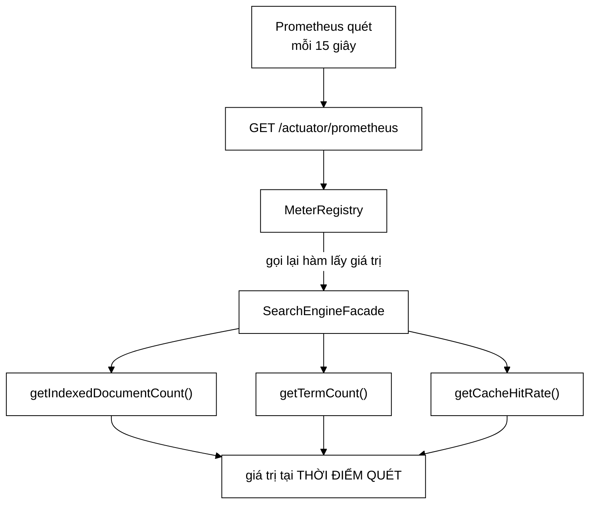

# MetricsConfig — phân biệt "hệ thống còn sống" với "hệ thống còn phục vụ được"

**File nguồn:** `search-engine/src/main/java/com/vnsearch/config/MetricsConfig.java` (61 dòng)
**Gói:** `com.vnsearch.config` · **Loại:** `@Configuration` khai một `MeterBinder`
**Vị trí trong luồng:** phơi ba thang đo nghiệp vụ qua `/actuator/prometheus`
**Đọc kèm:** [`../service/SearchEngineFacade.md`](../service/SearchEngineFacade.md) · [`SecurityConfig.md`](./SecurityConfig.md) · [`../controller/HealthController.md`](../controller/HealthController.md)

---

## 📌 Hiểu trong 30 giây

Ba `Gauge`, và cả ba đều trả lời câu hỏi mà **không một thang đo kỹ thuật nào**
trả lời được.

```java
@Bean
public MeterBinder vnsearchMetrics(SearchEngineFacade facade) {
    return registry -> {
        Gauge.builder("vnsearch.index.documents", facade,
                        SearchEngineFacade::getIndexedDocumentCount)
                .description("So tai lieu dang co trong chi muc").register(registry);

        Gauge.builder("vnsearch.index.terms", facade,
                        SearchEngineFacade::getTermCount)
                .description("So term phan biet trong chi muc").register(registry);

        Gauge.builder("vnsearch.cache.hit.rate", facade,
                        SearchEngineFacade::getCacheHitRate)
                .description("Ty le trung cache tim kiem, tu 0 den 1").register(registry);
    };
}
```

```
   Actuator tự có                 Chỉ lớp này biết
   ─────────────────────────      ─────────────────────────
   Heap đang dùng bao nhiêu?      Chỉ mục đang có bao nhiêu tài liệu?
   Request/giây là bao nhiêu?     Tỷ lệ trúng cache là bao nhiêu?
   GC chạy bao lâu?               Chỉ mục có RỖNG không?
```



```
   ⭐ MŨI TÊN "gọi lại hàm lấy giá trị" LÀ CẢ MỤC 2.

   Gauge không LƯU một con số. Nó lưu một CÁCH LẤY số.
   ⇒ Mỗi lần Prometheus hỏi, giá trị được tính LẠI.
   ⇒ Sau một lần reindex, số liệu đúng ngay lập tức.
```

---

## 1. Câu hỏi phân biệt "còn sống" với "còn phục vụ được"

Javadoc dòng 25–27:

> *"Câu hỏi bên phải mới là câu hỏi phân biệt được "hệ thống còn sống" với "hệ
> thống còn phục vụ được". Một bản sao có heap khoẻ mạnh nhưng chỉ mục rỗng thì
> trả về 0 kết quả cho **MỌI** truy vấn — và mọi thang đo kỹ thuật đều xanh."*

```
   KỊCH BẢN "XANH TOÀN TẬP NHƯNG VÔ DỤNG"

   Một bản sao khởi động với volume gắn sai:
     - JVM khởi động thành công          ✓
     - heap dùng 200 MB / 2 GB           ✓
     - GC gần như không chạy             ✓ (vì không có gì)
     - CPU 2 %                           ✓ (vì không làm gì)
     - HTTP 200 cho mọi request          ✓
     - độ trễ p99 = 3 ms                 ✓ (nhanh KỶ LỤC)
     - /actuator/health = UP             ✓

   ⇒ MỌI biển báo đều xanh, và vài cái còn ĐẸP HƠN BÌNH THƯỜNG.
   ⇒ Người dùng: mọi truy vấn trả 0 kết quả.

   vnsearch.index.documents = 0
   ⇒ MỘT con số, và nó là con số duy nhất nói ra sự thật.

   (Lưu ý: /api/health CŨNG dùng chính con số này và trả
    503 — xem cuối mục này. Nhưng /actuator/health, thứ mà
    Kubernetes thăm dò theo mặc định, thì vẫn UP.)
```

```
   ⭐ NGHỊCH LÝ ĐÁNG NHỚ NHẤT CỦA GIÁM SÁT

   Khi hệ thống HỎNG theo kiểu "không có dữ liệu",
   các thang đo hiệu năng KHÔNG xấu đi — chúng TỐT LÊN.

   Độ trễ giảm, CPU giảm, heap giảm.

   ⇒ Cảnh báo dạng "cảnh báo khi p99 > 500 ms" sẽ KHÔNG
     bao giờ kêu.
   ⇒ Tệ hơn: một bảng điều khiển hiệu năng sẽ trông
     TỐT HƠN bình thường, củng cố niềm tin sai.

   ⇒ Đây là lý do thang đo NGHIỆP VỤ không phải thứ
     "thêm cho đủ" — nó là loại thang đo duy nhất bắt được
     nhóm sự cố này.
```

```
   ĐỐI CHIẾU VỚI /api/health — CÙNG SỐ LIỆU, HAI VAI TRÒ

   ../controller/HealthController.md ĐÃ dùng đúng con số này:

     int documents = facade.getIndexedDocumentCount();
     boolean ready = documents > 0;
     ⇒ chỉ mục rỗng ⇒ 503 OUT_OF_SERVICE

   ⇒ Nên bản sao chỉ mục rỗng KHÔNG nhận lưu lượng: bộ cân
     bằng tải rút nó ra.

   Vậy ba thang đo ở đây thêm gì?
     /api/health  → HÀNH ĐỘNG tức thời, nhị phân (có/không)
     Gauge        → LỊCH SỬ liên tục, có xu hướng

   ⇒ Healthcheck trả lời "bây giờ có phục vụ được không".
   ⇒ Thang đo trả lời "nó đã rỗng từ khi nào, và con số
     đang đi lên hay đi xuống".
   ⇒ Cái đầu cứu hệ thống, cái sau cho biết vì sao.

   ⚠️ Nhưng /actuator/health (nhóm readiness của Spring)
     thì KHÔNG biết gì về chỉ mục — nó vẫn UP.
   ⇒ Kubernetes thăm dò /actuator/health/readiness theo mặc
     định, không thăm dò /api/health.
   ⇒ Nên bảo vệ này chỉ hoạt động nếu manifest trỏ ĐÚNG
     đường dẫn. Xem đề xuất 1.
```

---

## 2. `Gauge` nhận **hàm**, không nhận **số**

Javadoc dòng 29–32:

> *"Gauge nhận một *hàm lấy giá trị*, và Micrometer gọi lại hàm đó mỗi lần bị
> hỏi. Nếu đẩy giá trị vào một biến lúc khởi động thì số liệu sẽ đóng băng ở thời
> điểm đó — sau một lần reindex, bảng điều khiển vẫn báo con số cũ."*

```
   HAI CÁCH VIẾT, VÀ CHÚNG TRÔNG GẦN GIỐNG NHAU

   SAI:
     registry.gauge("vnsearch.index.documents",
                    facade.getIndexedDocumentCount());
     ⇒ getIndexedDocumentCount() được gọi NGAY BÂY GIỜ
     ⇒ kết quả (một con số) được đăng ký
     ⇒ con số đó KHÔNG BAO GIỜ đổi nữa

   ĐÚNG:
     Gauge.builder("vnsearch.index.documents", facade,
                   SearchEngineFacade::getIndexedDocumentCount)
     ⇒ đăng ký (đối tượng, cách lấy số từ nó)
     ⇒ Micrometer gọi lại mỗi lần quét

   ⇒ Khác biệt: một cặp dấu ngoặc và một tham chiếu phương thức.
   ⇒ Cả hai đều biên dịch. Cả hai đều "chạy".
   ⇒ Bản sai cho số liệu ĐÓNG BĂNG ở thời điểm khởi động.
```

```
   VÌ SAO BẢN SAI RẤT KHÓ PHÁT HIỆN

   Lúc khởi động, chỉ mục đã được nạp ⇒ con số ĐÚNG.
   ⇒ Kiểm tra ngay sau khi triển khai: mọi thứ đúng.
   ⇒ Chỉ SAU một lần POST /api/admin/reindex số liệu mới
     bắt đầu nói dối — và nó nói dối bằng cách giữ nguyên
     một con số HỢP LÝ.

   ⇒ Một thang đo đóng băng ở giá trị hợp lý còn tệ hơn
     một thang đo biến mất: cái biến mất thì có người hỏi,
     cái đóng băng thì không ai nghi.

   ⇒ Cùng đúng gia đình lỗi với SearchConfig.md mục 2
     (0 kết quả là câu trả lời hợp lệ) — hệ thống nói dối
     một cách thuyết phục.
```

```
   ⚠️ HỆ QUẢ CÒN LẠI: HÀM LẤY GIÁ TRỊ CHẠY TRÊN LUỒNG QUÉT

   Micrometer gọi ba hàm này trong lúc phục vụ
   GET /actuator/prometheus.

   ⇒ Nếu getTermCount() là O(V) duyệt toàn bộ từ vựng,
     mỗi lần Prometheus quét (15 giây/lần) sẽ tốn chi phí đó.
   ⇒ Với ../index/TermDictionary.md thì đây là O(1) tra kích
     thước — không sao.
   ⇒ Nhưng ràng buộc "ba hàm này PHẢI rẻ và PHẢI không chặn"
     KHÔNG được ghi ở đâu, và nó là ràng buộc lên
     SearchEngineFacade chứ không lên tệp này.
     Xem đề xuất 3.
```

---

## 3. `MeterBinder` thay vì `@PostConstruct`

Javadoc dòng 34–37:

> *"MeterBinder là điểm mở rộng chính thức: Spring gọi nó **SAU** khi registry đã
> sẵn sàng, nên không có chuyện thứ tự khởi tạo bean làm mất thang đo một cách im
> lặng."*

```
   VẤN ĐỀ THỨ TỰ KHỞI TẠO BEAN

   Cách hay gặp:
     @Autowired MeterRegistry registry;
     @PostConstruct void dangKy() { ... }

   ⇒ Phụ thuộc vào việc MeterRegistry đã được cấu hình ĐẦY ĐỦ
     tại thời điểm @PostConstruct chạy.
   ⇒ Với Spring Boot, registry được tuỳ biến bởi nhiều
     MeterRegistryCustomizer chạy ở các giai đoạn khác nhau
     (thêm nhãn chung, bộ lọc, đổi tên...).
   ⇒ Đăng ký quá sớm ⇒ thang đo thiếu nhãn chung, hoặc
     bị bộ lọc đăng ký sau đó loại bỏ.

   ⇒ Và khi điều đó xảy ra, triệu chứng là:
     thang đo KHÔNG XUẤT HIỆN trong /actuator/prometheus.
     Không lỗi, không log. Chỉ là vắng mặt.

   ⇒ MeterBinder được Spring gọi ĐÚNG lúc, theo hợp đồng.
     Không phải "may mắn đúng thứ tự".
```

```
   ⭐ LẦN THỨ HAI TRONG GÓI config CÙNG MỘT KIỂU LẬP LUẬN

   SearchConfig.md mục 1: mã cũ đúng vì "tình cờ", một bean
     dùng chung làm cho sai lệch KHÔNG BIỂU DIỄN ĐƯỢC.

   Ở đây: @PostConstruct có thể đúng vì "may mắn thứ tự",
     MeterBinder làm cho thứ tự là MỘT HỢP ĐỒNG.

   ⇒ Cùng một chuyển dịch: từ "chạy đúng" sang
     "không thể chạy sai".
```

---

## 4. Ba thang đo — và chúng nói được gì

| Thang đo | Kiểu | Cảnh báo nên đặt |
|---|---|---|
| `vnsearch.index.documents` | đếm | `== 0` trong 5 phút ⇒ **nghiêm trọng** |
| `vnsearch.index.terms` | đếm | tụt đột ngột ⇒ chỉ mục bị dựng lại thiếu dữ liệu |
| `vnsearch.cache.hit.rate` | tỷ lệ 0–1 | tụt sâu ⇒ cache bị dọn, hoặc mẫu truy vấn đổi |

```
   VÌ SAO CẢ documents LẪN terms — TƯỞNG THỪA MÀ KHÔNG THỪA

   Hai con số này thường đi cùng nhau, nhưng TỶ LỆ giữa
   chúng mới là thứ có ý nghĩa:

     terms / documents ≈ số term phân biệt trên mỗi tài liệu

   Với corpus báo chí tiếng Việt, tỷ lệ này khá ổn định.

   ⇒ documents tăng mà terms KHÔNG tăng
     ⇒ đang index trùng lặp, hoặc tài liệu rỗng
   ⇒ terms tăng vọt mà documents không đổi
     ⇒ tokenizer đang sinh rác (ví dụ tách nhầm
       chuỗi Hán tự — đúng ca ở
       ../service/LanguageDetector.md mục 2)

   ⇒ Hai thang đo cho ra một dấu hiệu mà không cái nào
     tự cho được.
   ⇒ Nhưng KHÔNG có gì trong mô tả nói ra điều này —
     người vận hành phải tự nghĩ ra.
```

```
   ⚠️ BA THANG ĐO NÀY ĐỀU LÀ TRẠNG THÁI, KHÔNG CÓ THANG ĐO
     NÀO VỀ HÀNH VI.

   Không có:
     - số truy vấn trả 0 kết quả  (dấu hiệu tokenizer lệch,
       xem SearchConfig.md mục 2)
     - phân bố độ trễ tìm kiếm    (Actuator có độ trễ HTTP
       tổng, không tách riêng phần tìm kiếm)
     - số truy vấn theo thời gian

   ⇒ ../analytics/UsageAnalyticsService.md ĐÃ thu thập
     phần lớn những thứ này, nhưng qua một đường khác
     (/api/admin/analytics), không qua Prometheus.
   ⇒ Hai hệ thống giám sát song song, không nối với nhau.
     Xem đề xuất 2.
```

---

## 5. `/actuator/prometheus` công khai — ràng buộc kèm theo

[`SecurityConfig`](./SecurityConfig.md) dòng 152 mở endpoint này:

```java
.requestMatchers("/actuator/health/**", "/actuator/prometheus").permitAll()
```

```
   LÝ DO (Javadoc cua SecurityConfig, dong 52–56)

   "Bo thu thap so lieu (Prometheus) khong gui duoc header
    tuy y trong cau hinh mac dinh, va endpoint nay chi phoi
    bay so lieu tong hop, khong co du lieu nguoi dung."

   ⇒ Ràng buộc kỹ thuật thật: Prometheus scrape config
     có hỗ trợ header tuỳ ý, nhưng nó không phải mặc định
     và nhiều bản triển khai không bật.

   ⇒ Và ba thang đo ở đây ĐÚNG là không có dữ liệu người dùng:
     ba con số tổng hợp về chỉ mục và cache.
```

```
   ⚠️ NHƯNG CHÚNG VẪN LÀ THÔNG TIN TÌNH BÁO

   vnsearch.index.documents = 30017
   ⇒ tiết lộ quy mô hệ thống

   vnsearch.cache.hit.rate  = 0.03
   ⇒ tiết lộ hệ thống đang bị truy vấn với mẫu lạ
     (dấu hiệu của một cuộc dò, hoặc của việc cache
      vừa bị dọn — kẻ tấn công đọc được điều đó)

   ⇒ Javadoc của SecurityConfig thừa nhận: "trong mot trien
     khai that, no nen duoc chan o tang mang".
   ⇒ Đó là một ràng buộc TRIỂN KHAI mà đọc mã KHÔNG ra được,
     và nó không có mặt trong tệp cấu hình Docker nào.
```

---

## 6. Hướng dẫn thực hành

### 6.1 Xem thang đo

```bash
curl -s http://localhost:8080/actuator/prometheus | grep vnsearch

# vnsearch_index_documents 30017.0
# vnsearch_index_terms 412883.0
# vnsearch_cache_hit_rate 0.73
```

```
   LƯU Ý VỀ TÊN: dấu chấm thành dấu gạch dưới.

   Trong mã:      "vnsearch.index.documents"
   Trong output:  vnsearch_index_documents

   Micrometer đổi tên theo quy ước của TỪNG hệ thu thập.
   ⇒ Viết cảnh báo Prometheus phải dùng tên có gạch dưới.
   ⇒ Đây là nguồn nhầm lẫn kinh điển khi đặt cảnh báo
     lần đầu: tên trong mã không tìm thấy gì.
```

### 6.2 Cảnh báo đáng đặt nhất

```yaml
# Chi muc rong = he thong tra 0 ket qua cho MOI truy van,
# trong khi moi thang do ky thuat deu xanh (va con dep hon
# binh thuong vi khong co gi de lam).
- alert: ChiMucRong
  expr: vnsearch_index_documents == 0
  for: 5m
  labels: { severity: critical }
  annotations:
    summary: "Chi muc RONG — moi truy van tra 0 ket qua"
    description: "Kiem tra volume du lieu va log khoi dong."
```

### 6.3 Cạm bẫy

```
   ① Dấu chấm trong mã → gạch dưới trong Prometheus.

   ② Gauge gọi LẠI hàm mỗi lần quét ⇒ ba hàm này phải RẺ
     và KHÔNG được chặn. Một ngày nào đó getTermCount()
     đổi thành phép duyệt O(V) sẽ làm mỗi lần quét
     (15 giây/lần) tốn chi phí đó — âm thầm.

   ③ Đăng ký Gauge với một GIÁ TRỊ thay vì một HÀM sẽ
     làm số liệu đóng băng. Cả hai bản đều biên dịch.

   ④ /actuator/prometheus CÔNG KHAI. Phải chặn ở tầng mạng
     trong triển khai thật — điều này không có trong mã.

   ⑤ Ba thang đo đều là TRẠNG THÁI. Không có thang đo nào
     về tốc độ truy vấn hay tỷ lệ truy vấn 0 kết quả.

   ⑥ Micrometer giữ tham chiếu YẾU tới đối tượng của Gauge.
     Ở đây `facade` là bean singleton nên không sao, nhưng
     đăng ký Gauge cho một đối tượng cục bộ sẽ làm thang đo
     BIẾN MẤT sau một lần GC — không lỗi, không log.
```

---

## 7. Độ phức tạp & chi phí

| Thao tác | Chi phí |
|---|---|
| Đăng ký ba Gauge | $O(1)$, một lần lúc khởi động |
| Mỗi lần Prometheus quét | $3 \times$ chi phí của ba hàm lấy giá trị |

```
   PHÂN TÍCH — CHI PHÍ MỖI LẦN QUÉT

   getIndexedDocumentCount()  O(1) — đọc kích thước
   getTermCount()             O(1) — đọc kích thước từ điển
   getCacheHitRate()          O(1) — hai bộ đếm chia nhau

   ⇒ Tổng: O(1), vài chục nano-giây.
   ⇒ Với chu kỳ quét 15 giây, chi phí này BẰNG KHÔNG.

   ⚠️ Nhưng điều đó đúng vì ba hàm HIỆN TẠI là O(1).
     Không có gì trong mã hay tài liệu ràng buộc chúng
     phải giữ nguyên tính chất đó, và người sửa
     SearchEngineFacade không có lý do gì để biết rằng
     ba hàm này bị gọi định kỳ từ một nơi khác.
```

---

## 8. Kiểm thử liên quan

```
   ⚠️ KHÔNG CÓ TEST NÀO CHO LỚP NÀY.
```

```
   NHỮNG THỨ KHÔNG ĐƯỢC CANH GIỮ

   ✗ Ba thang đo CÓ MẶT trong registry sau khi khởi động
     — mất một cái thì cảnh báo dựa trên nó im lặng
     MÃI MÃI, và sự im lặng đó trông y hệt "mọi thứ ổn".

   ✗ Gauge trả giá trị MỚI sau khi chỉ mục đổi
     — đây là bất biến phân biệt bản đúng với bản đóng băng
     ở mục 2, và nó kiểm được trong vài dòng.

   ✗ Tên thang đo không đổi
     — tên là HỢP ĐỒNG với các cảnh báo và bảng điều khiển
     nằm NGOÀI repo này. Đổi tên là một thay đổi phá vỡ,
     nhưng trong mã nó chỉ là sửa một chuỗi.

   ✗ Ba hàm lấy giá trị là O(1) và không chặn

   ⇒ Bốn tính chất, không một test nào — cho lớp mà
     giá trị duy nhất của nó là NÓI THẬT khi mọi thứ khác
     đang nói dối.
```

---

## 9. Chấm theo chuẩn doanh nghiệp

| Tiêu chí | Điểm | Nhận xét |
|---|---|---|
| **Nêu đúng khoảng trống mà thang đo kỹ thuật để lại** | 10/10 | Bảng hai cột "Actuator tự có / chỉ lớp này biết" là cách trình bày sắc gọn nhất có thể |
| **Chỉ ra nghịch lý "hỏng thì số liệu đẹp lên"** | 10/10 | Chỉ mục rỗng ⇒ độ trễ giảm, CPU giảm ⇒ mọi cảnh báo hiệu năng **không bao giờ kêu** |
| **`Gauge` nhận hàm chứ không nhận số** | 10/10 | Nêu đúng loại lỗi mà cả hai bản đều biên dịch được, và bản sai đóng băng ở một giá trị **hợp lý** |
| Lý do dùng `MeterBinder` | 9/10 | Biến "may mắn đúng thứ tự khởi tạo" thành một hợp đồng — cùng chuyển dịch với `SearchConfig` |
| Mô tả (`description`) cho từng thang đo | 8/10 | Có mặt và bằng tiếng Việt, nhưng không nêu **ngưỡng** hay ý nghĩa của tỷ lệ giữa các thang đo |
| **Kiểm thử** | **0/10** | **Không một test nào**, kể cả phép kiểm "ba thang đo có mặt" chỉ tốn vài dòng |
| **Không có thang đo về hành vi** | **4/10** | Không có tỷ lệ truy vấn 0 kết quả, không có độ trễ tìm kiếm — đúng nhóm bắt được lỗi tokenizer lệch |
| Nối với healthcheck chỉ nửa chừng | 5/10 | `/api/health` đã trả 503 khi chỉ mục rỗng, nhưng `/actuator/health/readiness` — thứ Kubernetes thăm dò mặc định — thì không |
| Tên thang đo là hợp đồng ngoài repo | 5/10 | Đổi tên phá vỡ mọi cảnh báo và bảng điều khiển bên ngoài, nhưng trong mã chỉ là sửa một chuỗi |
| Ràng buộc "hàm phải rẻ" không được ghi | 5/10 | Ràng buộc nằm lên `SearchEngineFacade`, mà người sửa lớp đó không có cách nào biết |
| Hai hệ giám sát song song | 5/10 | `UsageAnalyticsService` đã có phần lớn số liệu hành vi, nhưng qua đường khác, không nối vào Prometheus |

**Ba đề xuất nâng lên mức sản phẩm:**

1. **Đưa phép kiểm "chỉ mục rỗng" vào đúng đường dẫn mà hệ điều phối thăm dò.**
   [`HealthController`](../controller/HealthController.md) **đã** làm đúng việc này
   ở `/api/health` (503 `OUT_OF_SERVICE` khi chỉ mục rỗng), nhưng đó là một endpoint
   riêng của ứng dụng. Kubernetes thăm dò `/actuator/health/readiness` theo mặc
   định, và nhóm đó không biết gì về chỉ mục — nên bảo vệ hiện có chỉ hoạt động nếu
   manifest được trỏ tay sang `/api/health`, một ràng buộc không ghi ở đâu. Một
   `HealthIndicator` đưa cùng phép kiểm đó vào đúng chỗ Spring đã chuẩn hoá:
   ```java
   @Bean
   public HealthIndicator chiMucHealthIndicator(SearchEngineFacade facade) {
       return () -> {
           long soTaiLieu = facade.getIndexedDocumentCount();
           if (soTaiLieu == 0) {
               return Health.down()
                       .withDetail("indexedDocuments", 0)
                       .withDetail("hauQua", "moi truy van tra 0 ket qua")
                       .withDetail("kiemTra", "volume du lieu, log khoi dong,"
                               + " va POST /api/admin/reindex")
                       .build();
           }
           return Health.up().withDetail("indexedDocuments", soTaiLieu).build();
       };
   }
   ```
   Lưu ý ranh giới: cái này phải đặt ở nhóm **readiness**, không phải liveness —
   một bản sao chỉ mục rỗng cần bị **rút khỏi lưu lượng**, không cần bị **giết**,
   vì `POST /api/admin/reindex` có thể chữa nó tại chỗ. Nhầm hai nhóm này sẽ tạo
   đúng vòng lặp khởi động lại vô hạn đã được kể ở
   [`SecurityConfig.md`](./SecurityConfig.md) mục 4.1.

2. **Thêm thang đo về hành vi, đặc biệt là tỷ lệ truy vấn 0 kết quả.** Ba thang đo
   hiện tại đều là **trạng thái**, nên chúng bắt được "chỉ mục rỗng" nhưng
   **không** bắt được "chỉ mục đầy đủ mà tokenizer lệch" — lỗi trung tâm mà
   [`SearchConfig`](./SearchConfig.md) tồn tại để ngăn. Với lỗi đó,
   `index.documents` vẫn 30.017 và mọi thứ vẫn xanh:
   ```java
   Counter truyVanRong = Counter.builder("vnsearch.search.empty.total")
           .description("So truy van tra ve 0 ket qua").register(registry);
   Counter truyVan = Counter.builder("vnsearch.search.total")
           .description("Tong so truy van").register(registry);

   Timer.builder("vnsearch.search.duration")
           .description("Do tre cua rieng phan tim kiem, khong ke phan giai HTTP")
           .publishPercentiles(0.5, 0.95, 0.99)
           .register(registry);
   ```
   ```yaml
   # Ty le truy van 0 ket qua tang vot = dau hieu tokenizer lech giua
   # tang index va tang truy van (SearchConfig.md muc 1). Loi nay KHONG
   # nem ngoai le va KHONG lam xau bat ky thang do ky thuat nao.
   - alert: TyLeTruyVanRongCao
     expr: rate(vnsearch_search_empty_total[10m]) / rate(vnsearch_search_total[10m]) > 0.5
     for: 10m
   ```
   Phần lớn dữ liệu này đã được [`UsageAnalyticsService`](../analytics/UsageAnalyticsService.md)
   thu thập rồi — việc cần làm chủ yếu là phơi nó qua **cùng một** đường thay vì
   duy trì hai hệ giám sát song song.

3. **Test sự có mặt của thang đo, và ghi ràng buộc "hàm phải rẻ" lên đúng chỗ.**
   Một thang đo biến mất gây ra sự im lặng **không phân biệt được** với "mọi thứ
   ổn" — đó là kiểu hỏng tệ nhất mà một hệ giám sát có thể mắc:
   ```java
   @SpringBootTest
   class MetricsConfigTest {

       @Autowired MeterRegistry registry;
       @Autowired SearchEngineFacade facade;

       @ParameterizedTest
       @ValueSource(strings = {"vnsearch.index.documents", "vnsearch.index.terms",
                               "vnsearch.cache.hit.rate"})
       void thangDoPhaiCoMat(String ten) {
           assertNotNull(registry.find(ten).gauge(),
                   "Ten thang do la HOP DONG voi cac canh bao nam NGOAI repo nay."
                           + " Mat no thi canh bao im lang MAI MAI, va su im lang do"
                           + " trong y het 'moi thu on'.");
       }

       @Test
       void gaugePhaiDocLaiGiaTriChuKhongDongBang() {
           double truoc = registry.get("vnsearch.index.documents").gauge().value();
           facade.buildIndex(List.of(taiLieuMau()));
           double sau = registry.get("vnsearch.index.documents").gauge().value();
           assertNotEquals(truoc, sau,
                   "Gauge phai goi LAI ham lay gia tri; neu dang ky bang mot SO thi"
                           + " so lieu dong bang o thoi diem khoi dong sau moi lan reindex.");
       }
   }
   ```
   Song song, ràng buộc *"ba hàm này bị gọi mỗi 15 giây từ luồng quét, nên phải
   $O(1)$ và không được chặn"* nên nằm trong Javadoc của chính ba phương thức
   trong [`SearchEngineFacade`](../service/SearchEngineFacade.md) — người sửa lớp
   đó không có cách nào biết rằng chúng có một người gọi định kỳ ở tệp khác.

---

## 10. Liên kết

- Nguồn của cả ba giá trị: [`../service/SearchEngineFacade.md`](../service/SearchEngineFacade.md)
- Luật mở `/actuator/prometheus` và ràng buộc chặn ở tầng mạng: [`SecurityConfig.md`](./SecurityConfig.md) mục 4.1
- Healthcheck của Docker, trả lời một câu hỏi khác: [`../controller/HealthController.md`](../controller/HealthController.md)
- Hệ số liệu song song, thu thập hành vi người dùng: [`../analytics/UsageAnalyticsService.md`](../analytics/UsageAnalyticsService.md) · [`../analytics/AdminDashboard.md`](../analytics/AdminDashboard.md)
- Nguồn của `getTermCount()`: [`../index/TermDictionary.md`](../index/TermDictionary.md)
- Lỗi mà ba thang đo hiện tại **không** bắt được: [`SearchConfig.md`](./SearchConfig.md) mục 2
- Endpoint kích hoạt reindex, thời điểm số liệu phải đổi: [`../controller/AdminController.md`](../controller/AdminController.md)
