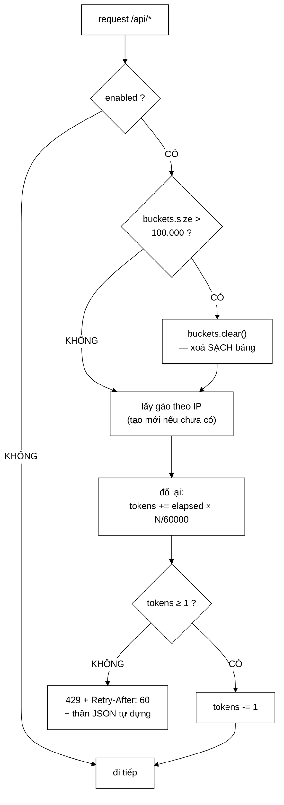

# RateLimitFilter — token bucket, và một tối ưu "thông minh" đã bị gỡ bỏ

**File nguồn:** `search-engine/src/main/java/com/vnsearch/config/RateLimitFilter.java` (169 dòng)
**Gói:** `com.vnsearch.config` · **Loại:** `OncePerRequestFilter`, đăng ký qua `FilterRegistrationBean` với `order = Integer.MIN_VALUE`
**Vị trí trong luồng:** filter **đầu tiên** của mọi request `/api/*`, trước cả chuỗi Spring Security
**Đọc kèm:** [`SecurityConfig.md`](./SecurityConfig.md) · [`ApiKeyAuthFilter.md`](./ApiKeyAuthFilter.md) · [`GlobalExceptionHandler.md`](./GlobalExceptionHandler.md)

---

## 📌 Hiểu trong 30 giây

Mỗi địa chỉ IP có một **gáo** chứa tối đa $N$ token, được đổ lại đều đặn theo
thời gian thực. Mỗi request lấy một token; gáo cạn thì trả **429**.

```java
synchronized boolean tryConsume(long nowMillis) {
    long elapsed = Math.max(0, nowMillis - lastRefillMillis);
    lastRefillMillis = nowMillis;
    tokens = Math.min(capacity, tokens + elapsed * tokensPerMilli);

    if (tokens < 1.0) {
        return false;
    }
    tokens -= 1.0;
    return true;
}
```



```
   ⭐ HAI Ô ĐÁNG CHÚ Ý NHẤT:

   ① "buckets.clear() — xoá SẠCH bảng"
     Một biện pháp THÔ có chủ ý. Xem mục 3.

   ② "thân JSON tự dựng"
     Filter này nằm NGOÀI Spring MVC, nên nó KHÔNG dùng
     được GlobalExceptionHandler. Xem mục 5.
```

---

## 1. Vì sao token bucket, không phải "đếm theo phút lịch"

Javadoc dòng 23–28:

> *"Đếm theo phút lịch ("tối đa 120 request mỗi phút") có lỗi **biên cửa sổ**:
> 120 request lúc 10:00:59 và 120 request nữa lúc 10:01:00 đều hợp lệ, tức 240
> request trong một giây."*

```
   LỖI BIÊN CỬA SỔ — VẼ RA CHO RÕ

   Cửa sổ cố định:  |....120....||....120....|
                              ^^ biên
                    10:00:00   10:01:00   10:02:00

   Kẻ tấn công chờ tới 10:00:59, bắn 120 request,
   chờ một giây, bắn tiếp 120.
   ⇒ 240 request trong ~1 giây, KHÔNG vi phạm luật nào.
   ⇒ Hạn mức thực tế bị NHÂN ĐÔI ở đúng thời điểm
     tồi tệ nhất.

   Token bucket:    gáo chứa tối đa N token,
                    đổ lại N/60 token mỗi giây

   ⇒ Tại 10:00:59, gáo đã cạn sau 120 request.
   ⇒ Tại 10:01:00, gáo chỉ có thêm 2 token (120/60).
   ⇒ Không có biên nào để lợi dụng.
```

```
   ĐIỀU MÀ TOKEN BUCKET VẪN CHO PHÉP — VÀ ĐÓ LÀ TÍNH NĂNG

   Gáo đầy = 120 token.
   ⇒ Một client im lặng 5 phút rồi bắn 120 request LIÊN TIẾP
     sẽ ĐƯỢC CHẤP NHẬN hết.

   Đây KHÔNG phải lỗ hổng — đó là mục đích:
     "van cho phep mot cum ngan bang dung suc chua cua gao"

   Vì sao cần: giao diện tải một trang kết quả có thể gọi
   /api/search + /api/suggest + /api/images + /api/events
   gần như đồng thời. Một bộ giới hạn "đúng 2 request/giây,
   không hơn" sẽ chặn chính người dùng bình thường.

   ⇒ Sức chứa gáo = mức bùng nổ cho phép
   ⇒ Tốc độ đổ lại  = tốc độ trung bình bị chặn
   ⇒ Hai tham số cho hai mục đích, và ở đây chúng bị
     GỘP thành một (capacity = requestsPerMinute).
     Xem mục 6.
```

---

## 2. `synchronized` thay vì CAS — một tối ưu bị gỡ

Javadoc dòng 37–43 kể lại phiên bản trước:

> *"Ban đầu lớp này gói cả trạng thái vào một `AtomicLong` để tránh khoá. Cách đó
> **sai**: nó nhồi mốc thời gian từ `System.nanoTime()` vào một trường bit, mà
> `nanoTime()` có gốc **TUỲ Ý** theo đặc tả — giá trị có thể âm, và phép dịch bit
> khi đó cho kết quả vô nghĩa."*

```
   ⭐ ĐÂY LÀ MỘT LỖI RẤT KHÓ THẤY, VÌ NÓ PHỤ THUỘC NỀN TẢNG.

   Đặc tả của System.nanoTime():
   "gia tri tra ve la thoi gian tuong doi so voi mot MOC GOC
    TUY Y, thuong la thoi diem may khoi dong"

   ⇒ Trên Linux x86 điển hình: giá trị dương, lớn
   ⇒ Trên một số JVM/nền tảng khác: có thể ÂM

   Khi nhồi vào một trường bit:
     long packed = (timestamp << 20) | tokens;

   Với timestamp âm, phép dịch trái làm mất bit dấu vào
   vùng token, và phép giải nén cho ra số token vô nghĩa
   (có thể rất lớn ⇒ KHÔNG BAO GIỜ chặn ai,
    hoặc rất nhỏ ⇒ chặn TẤT CẢ).

   ⇒ Test trên máy phát triển: PASS
   ⇒ Chạy trên một nền tảng khác: hỏng theo cách không ai
     nghĩ tới, và không có ngoại lệ nào được ném.
```

```
   CÂU ĐÁNH GIÁ TỰ THÂN, ĐÁNG HỌC NHẤT TRONG CẢ TỆP

   "Doi lai duoc gi? O muc 120 request/phut, tranh chap tren
    mot gao gan nhu bang khong, nen khoa khong ton gi ca.
    Mot toi uu khong do duoc khong dang doi lay mot loi kho thay."

   Ba bước lập luận:
     ① Tối ưu này giải quyết vấn đề gì? — tranh chấp khoá
     ② Vấn đề đó có thật không?         — ĐO đi: ở 120 req/phút,
                                          gần như bằng không
     ③ Cái giá là gì?                   — một lỗi phụ thuộc nền
                                          tảng, không test bắt được

   ⇒ Bước ② là bước hầu hết người ta bỏ qua.
   ⇒ Và ở đây câu trả lời cho ② khiến toàn bộ tối ưu
     trở nên vô nghĩa TRƯỚC KHI cần bàn tới bước ③.
```

```
   VÌ SAO synchronized Ở ĐÂY THỰC SỰ RẺ

   Khoá nằm trên TỪNG Bucket, không phải trên cả bảng.
   ⇒ Hai IP khác nhau KHÔNG tranh chấp gì với nhau.
   ⇒ Chỉ hai request CÙNG MỘT IP đến CÙNG một mili-giây
     mới chạm nhau.

   Với 120 req/phút = 2 req/giây cho mỗi IP,
   xác suất hai request cùng IP chồng lên nhau ≈ 0.

   ⇒ Và JVM hiện đại còn có "biased locking"/khoá mỏng cho
     đúng trường hợp này: khoá không tranh chấp gần như
     miễn phí.

   ⇒ ConcurrentHashMap vẫn lo phần đồng thời ở mức BẢNG,
     nên hai cơ chế bổ sung cho nhau đúng chỗ.
```

---

## 3. `MAX_TRACKED_CLIENTS` — bộ giới hạn tự nó là một lỗ rò rỉ

```java
/**
 * Tran so dia chi theo doi cung luc.
 *
 * <p>Khong co tran thi chinh bo gioi han tan suat tro thanh mot lo ro ri bo
 * nho: moi dia chi gia mao them mot muc vao bang, va bang khong bao gio
 * duoc don.
 */
private static final int MAX_TRACKED_CLIENTS = 100_000;

if (buckets.size() > MAX_TRACKED_CLIENTS) {
    buckets.clear();
}
```

```
   ⭐ NGHỊCH LÝ: CƠ CHẾ BẢO VỆ TRỞ THÀNH VECTOR TẤN CÔNG

   Bộ giới hạn tần suất chống lại việc lạm dụng tài nguyên.
   Nhưng chính nó cấp phát một mục bảng cho MỖI địa chỉ mới.

   ⇒ Kẻ tấn công giả mạo IP nguồn (hoặc dùng botnet):
     mỗi request tạo một Bucket mới
   ⇒ Bảng phình ra không giới hạn
   ⇒ OutOfMemoryError

   ⇒ Bộ chống DoS trở thành đường DoS.

   ⇒ Đây là loại lỗi chỉ thấy được khi hỏi
     "cơ chế bảo vệ này TỰ NÓ tiêu tốn gì?"
```

```
   VÌ SAO clear() SẠCH CHỨ KHÔNG PHẢI DỌN THEO LRU

   Javadoc: "Cham tran thi bang bi xoa sach — tho, nhung
   chan tren bo nho la dieu BAT BUOC, con do chinh xac cua
   han muc thi KHONG."

   Phân loại hai thuộc tính:
     Chặn trên bộ nhớ  → BẮT BUỘC (mất nó = sập tiến trình)
     Độ chính xác hạn mức → MONG MUỐN (mất nó = vài request
                            lọt qua trong chốc lát)

   ⇒ Khi hai thuộc tính xung đột, hy sinh cái MONG MUỐN.
   ⇒ Và nói rõ ra rằng mình đang hy sinh cái gì.

   ⇒ Cùng lối tư duy "chọn chiều sai an toàn" với
     SecurityConfig.md mục 2 và
     ../datastructure/BloomFilter.md mục 1.
```

```
   ⚠️ HẬU QUẢ CỦA clear(): MỘT CỬA SỔ MỞ TOANG

   Ngay sau clear(), MỌI client — kể cả kẻ đang tấn công —
   nhận một gáo ĐẦY 120 token.

   ⇒ Nếu kẻ tấn công kiểm soát được thời điểm chạm trần
     (bơm 100.001 IP giả), họ có thể ÉP reset liên tục:

     bơm 100k IP → clear() → gáo đầy → bắn 120 req thật
     → bơm tiếp 100k IP → clear() → ...

   ⇒ Hạn mức bị vô hiệu hoá một cách có hệ thống.
   ⇒ Javadoc thừa nhận cách này "thô" nhưng KHÔNG nêu
     kịch bản này. Xem đề xuất 1.

   ⇒ Lưu ý: điều này chỉ khả thi khi kẻ tấn công đặt được
     IP nguồn tuỳ ý — tức là qua X-Forwarded-For với
     trust-proxy bật sai, hoặc qua một botnet thật.
```

```
   VÀ MỘT LỖI ĐUA NHỎ, KHÔNG NGHIÊM TRỌNG

   if (buckets.size() > MAX) { buckets.clear(); }

   Hai luồng cùng thấy size > MAX ⇒ cùng gọi clear().
   ⇒ clear() lần hai xoá luôn các mục vừa được tạo giữa
     hai lần gọi.
   ⇒ Vô hại: chỉ làm vài client được reset gáo sớm.

   ⇒ Nhưng nó là ví dụ cho thấy tính đúng ở đây được
     đánh giá theo HẬU QUẢ, không theo tính chặt chẽ hình thức.
     Đó là quyết định hợp lý — và nó không được ghi ra.
```

---

## 4. `X-Forwarded-For` — chỉ tin khi được bảo là tin được

```java
private String clientIp(HttpServletRequest request) {
    if (trustProxy) {
        String forwarded = request.getHeader("X-Forwarded-For");
        if (forwarded != null && !forwarded.isBlank()) {
            int comma = forwarded.indexOf(',');
            return (comma > 0 ? forwarded.substring(0, comma) : forwarded).trim();
        }
    }
    return request.getRemoteAddr();
}
```

Javadoc dòng 152–157:

> *"`X-Forwarded-For` do **CLIENT** gửi lên được, nên tin nó một cách vô điều
> kiện sẽ khiến bộ giới hạn bị vô hiệu hoàn toàn: chỉ cần đổi header mỗi request
> là mỗi request thành một "địa chỉ" mới với gáo đầy."*

```
   VÌ SAO MẶC ĐỊNH trustProxy = false LÀ ĐÚNG

   Chuỗi triển khai thật:
     Internet → nginx → ứng dụng
     ⇒ request.getRemoteAddr() = IP của nginx (127.0.0.1)
     ⇒ MỌI người dùng dùng CHUNG một gáo
     ⇒ hạn mức 120 req/phút cho TOÀN BỘ hệ thống
     ⇒ hỏng theo hướng QUÁ CHẶT

   Nếu tin X-Forwarded-For vô điều kiện:
     ⇒ kẻ tấn công tự đặt header mỗi request
     ⇒ hạn mức bị vô hiệu HOÀN TOÀN
     ⇒ hỏng theo hướng QUÁ LỎNG

   ⇒ Mặc định chọn hướng QUÁ CHẶT: hệ thống vẫn được bảo vệ,
     chỉ là bảo vệ thô hơn cần thiết, và triệu chứng
     (người dùng bị 429 oan) sẽ ỒN ÀO.
   ⇒ Hướng quá lỏng thì IM LẶNG hoàn toàn.
```

```
   VÌ SAO LẤY PHẦN TỬ ĐẦU TIÊN

   X-Forwarded-For: <client>, <proxy1>, <proxy2>

   Quy ước: proxy nối thêm vào CUỐI, nên phần tử ĐẦU là
   client gốc.

   ⚠️ Nhưng phần tử đầu cũng là phần DUY NHẤT mà client
     tự viết được. Với đúng MỘT proxy tin cậy đằng trước
     thì lấy phần tử đầu là đúng.

   ⇒ Với HAI tầng proxy (CDN → nginx → ứng dụng),
     client vẫn tự đặt được phần tử đầu, và
     trust-proxy=true sẽ tin nó.
   ⇒ Cách đúng khi có nhiều tầng: đếm ngược từ CUỐI
     đúng số proxy tin cậy đã biết.
   ⇒ Giới hạn này KHÔNG được nêu.
```

---

## 5. Phản hồi 429 tự dựng bằng tay

```java
response.setStatus(HttpStatus.TOO_MANY_REQUESTS.value());
response.setHeader("Retry-After", "60");
response.setContentType("application/json;charset=UTF-8");
response.getWriter().write(
        "{\"status\":429,\"error\":\"Too Many Requests\","
                + "\"message\":\"Vuot qua gioi han " + capacity + " request/phut\"}");
```

```
   VÌ SAO KHÔNG DÙNG GlobalExceptionHandler

   GlobalExceptionHandler là @RestControllerAdvice —
   nó chỉ bắt ngoại lệ phát sinh TRONG Spring MVC.

   Filter này chạy ở tầng servlet, TRƯỚC DispatcherServlet.
   ⇒ Ném ngoại lệ ở đây sẽ KHÔNG tới được handler đó.
   ⇒ Nó sẽ đi tới trang lỗi mặc định của container.

   ⇒ Nên việc tự dựng JSON là BẮT BUỘC, không phải lười.
```

```
   ⚠️ NHƯNG NÓ TẠO RA HAI ĐỊNH DẠNG LỖI SONG SONG

   GlobalExceptionHandler (mọi lỗi khác):
     { "timestamp": "...", "status": 400,
       "error": "Bad Request", "message": "..." }

   Ở đây (429):
     { "status": 429, "error": "Too Many Requests",
       "message": "..." }

   ⇒ THIẾU trường "timestamp".
   ⇒ Giao diện phân tích lỗi phải xử lý hai hình dạng.
   ⇒ Và không có gì giữ cho chúng đồng bộ: sửa định dạng
     ở GlobalExceptionHandler sẽ KHÔNG đụng tới dòng này.

   ⇒ Ghép chuỗi JSON bằng tay cũng là một rủi ro nhỏ:
     `capacity` là int nên an toàn, nhưng khuôn mẫu này
     mời gọi người sau chèn một chuỗi chưa thoát vào đó.
   ⇒ Xem đề xuất 3.
```

```
   ĐIỂM LÀM ĐÚNG: Retry-After

   Header Retry-After: 60 là phần khác biệt giữa
   "từ chối" và "từ chối có hướng dẫn".

   ⇒ Client biết chờ bao lâu, thay vì thử lại ngay
     và làm tình hình tệ hơn.

   ⚠️ Nhưng "60" là hằng số cứng, trong khi thời gian chờ
     THẬT phụ thuộc gáo: cần 1 token thì chỉ phải chờ
     60/capacity giây (0,5 giây ở mức 120 req/phút).
   ⇒ Nói 60 giây là quá bi quan gấp 120 lần, và nó dạy
     client chờ lâu hơn cần thiết rất nhiều.
```

---

## 6. Một tham số điều khiển hai thứ

```java
public RateLimitFilter(int requestsPerMinute, boolean enabled, boolean trustProxy) {
    this.capacity = requestsPerMinute;      // suc chua gao
    ...
}

Bucket(int requestsPerMinute, long nowMillis) {
    this.capacity = requestsPerMinute;
    this.tokensPerMilli = requestsPerMinute / 60_000.0;   // toc do do lai
    this.tokens = requestsPerMinute;                       // bat dau day
}
```

```
   HAI KHÁI NIỆM ĐỘC LẬP BỊ GỘP LÀM MỘT

   Sức chứa gáo  = mức BÙNG NỔ cho phép
   Tốc độ đổ lại = tốc độ TRUNG BÌNH bị chặn

   Ở đây cả hai đều lấy từ requestsPerMinute = 120.
   ⇒ Bùng nổ tối đa = 120 request tức thì
   ⇒ Trung bình     = 120 request/phút

   Với giao diện tải một trang (4–6 request đồng thời),
   sức chứa 120 là THỪA rất nhiều.

   ⇒ Cấu hình mong muốn có thể là:
     trung bình 120/phút, bùng nổ tối đa 20
     ⇒ vẫn phục vụ tốt người dùng thật
     ⇒ nhưng chặn nhanh hơn hẳn một script bắn liên tục

   ⇒ Hiện KHÔNG biểu diễn được cấu hình đó.
   ⇒ Đây là hạn chế THIẾT KẾ, không phải lỗi — và nó
     không được nêu trong danh sách "giới hạn đã biết".
```

---

## 7. Hai giới hạn đã biết, được ghi thẳng

Javadoc dòng 45–53:

| Giới hạn | Hệ quả |
|---|---|
| **Theo từng tiến trình** | Chạy hai bản sao thì hạn mức thực tế **nhân đôi** |
| **Định danh bằng IP** | IP giả mạo được, và nhiều người dùng có thể dùng chung một NAT |

```
   ⭐ VIỆC GHI RA GIỚI HẠN LÀ ĐIỂM MẠNH LỚN NHẤT CỦA TỆP NÀY.

   Một giới hạn ĐƯỢC GHI là một quyết định.
   Một giới hạn KHÔNG GHI là một lỗi chưa được phát hiện.

   Cùng lập luận với ../service/LanguageDetector.md mục 3,
   nơi các giới hạn của heuristic KHÔNG được ghi và
   tài liệu đó phải trừ điểm nặng.

   ⇒ Ở đây chúng được ghi, kèm cả HƯỚNG GIẢI QUYẾT
     ("dung sau, khi that su co nhieu ban sao") và
     ĐIỀU KIỆN kích hoạt hướng đó.
```

```
   HỆ QUẢ THỰC TẾ CỦA GIỚI HẠN "CHUNG NAT"

   Một trường đại học sau NAT: hàng nghìn sinh viên
   dùng chung một IP công cộng.
   ⇒ Cả trường chia nhau 120 request/phút.
   ⇒ Với một máy tìm kiếm phục vụ sinh viên, đây là
     kịch bản RẤT có thể xảy ra.

   ⇒ Giới hạn này không chỉ là lý thuyết cho hệ thống này.
   ⇒ Đường gỡ: định danh theo TÀI KHOẢN khi đã đăng nhập,
     chỉ rơi về IP khi vô danh. Tầng auth đã có sẵn mọi
     thứ cần thiết.
```

---

## 8. Hướng dẫn thực hành

### 8.1 Cấu hình

```properties
app.security.rate-limit.enabled=true
app.security.rate-limit.requests-per-minute=120
# Chi bat khi THAT SU co nginx/CDN dat truoc ung dung.
# Bat sai = bo gioi han bi vo hieu hoan toan, va IM LANG.
app.security.trust-proxy=false
```

### 8.2 Kiểm tra nhanh

```bash
# Bat 130 request lien tiep, dem ma tra ve
for i in $(seq 1 130); do
  curl -s -o /dev/null -w "%{http_code}\n" "http://localhost:8080/api/search?q=test"
done | sort | uniq -c

# Mong doi: ~120 dong "200", ~10 dong "429"
```

### 8.3 Cạm bẫy

```
   ① Đằng sau nginx mà KHÔNG bật trust-proxy
     ⇒ mọi người dùng chung một gáo (IP của nginx)
     ⇒ 120 req/phút cho TOÀN hệ thống.
     Triệu chứng: 429 tràn lan khi có vài người dùng.

   ② Bật trust-proxy khi KHÔNG có proxy
     ⇒ bộ giới hạn bị vô hiệu HOÀN TOÀN, im lặng.
     Đây là hướng hỏng nguy hiểm hơn hẳn ①.

   ③ Chỉ áp cho /api/* (addUrlPatterns trong SecurityConfig).
     /actuator/** KHÔNG được giới hạn.

   ④ Hạn mức theo TỪNG tiến trình. Hai bản sao = 240 req/phút.

   ⑤ Chạm trần 100.000 IP ⇒ bảng bị XOÁ SẠCH ⇒ mọi client
     nhận gáo đầy trong chốc lát.

   ⑥ MockMvc KHÔNG chạy filter này (đăng ký qua
     FilterRegistrationBean, thuộc servlet container).
     ⇒ Không test tích hợp nào hiện tại đi qua đây.

   ⑦ Retry-After: 60 là hằng số cứng, bi quan gấp ~120 lần
     so với thời gian chờ thật.

   ⑧ Trả 429 KHÔNG ghi log gì. Một trận lũ đi qua mà
     không để lại dấu vết nào ở phía máy chủ.
```

---

## 9. Độ phức tạp & chi phí

| Thao tác | Chi phí |
|---|---|
| `doFilterInternal` — trường hợp thường | $O(1)$ |
| `tryConsume` | $O(1)$, có khoá trên **một** gáo |
| `buckets.clear()` khi chạm trần | $O(C)$ với $C$ = 100.000 |
| Bộ nhớ | $O(C)$, tối đa ~100.000 mục |

```
   PHÂN TÍCH BỘ NHỚ — TRẦN THẬT SỰ LÀ BAO NHIÊU

   Mỗi mục:
     khoá String (IPv4 "255.255.255.255")  ~56 byte
     Bucket: 2 double + 1 double + 1 long  ~48 byte
     phần đầu mục của ConcurrentHashMap    ~48 byte
   ────────────────────────────────────────────────
     ≈ 150 byte/mục

   100.000 mục × 150 byte ≈ 15 MB

   ⇒ Chấp nhận được với heap 2 GB.
   ⇒ Với IPv6 (chuỗi dài hơn) thì cao hơn, cỡ 20–25 MB.
   ⇒ Con số này KHÔNG có trong Javadoc, nên việc chọn
     đúng 100.000 trông như một số tròn tuỳ ý — trong khi
     thực ra nó tương ứng với một trần bộ nhớ hợp lý.
```

---

## 10. Kiểm thử liên quan

```
   ⚠️ KHÔNG CÓ FILE TEST NÀO CHO LỚP NÀY.

   Và nó nằm ngoài tầm của MockMvc (mục 8.3 ⑥),
   nên cũng không được phủ gián tiếp bởi test tích hợp nào.
```

```
   NHƯNG LỚP NÀY ĐƯỢC THIẾT KẾ ĐỂ DỄ TEST

   Bucket.tryConsume(long nowMillis) nhận thời gian TỪ NGOÀI.

   Javadoc dòng 104–107 nói rõ vì sao:
   "nho vay kiem thu dieu khien duoc thoi gian va khong phai
    Thread.sleep — mot bai kiem thu ngu that la mot bai kiem
    thu cham va chap chon"

   Bucket còn là `static final class` với khả năng truy cập
   ở mức gói ⇒ test cùng gói dựng thẳng được.

   ⇒ Mọi thứ cần thiết để test đã sẵn sàng.
   ⇒ Và vẫn không có test nào. Đây là loại chỗ trống
     khó biện minh nhất: chi phí thấp nhất, giá trị cao nhất.
```

```
   NHỮNG TÍNH CHẤT KHÔNG ĐƯỢC CANH GIỮ

   ✗ Đúng N request đầu qua được, request N+1 trả 429
   ✗ Chờ 60/N giây thì có thêm đúng một token
   ✗ Gáo KHÔNG vượt quá sức chứa dù chờ bao lâu
     (Math.min — nếu mất, một client im lặng một ngày
      sẽ có gáo khổng lồ)
   ✗ elapsed âm (đồng hồ bị chỉnh lùi) KHÔNG làm mất token
     (Math.max(0, ...) — cả hai phép kẹp này đều là
      phòng thủ, và không gì canh giữ chúng)
   ✗ Hai IP khác nhau có gáo ĐỘC LẬP
   ✗ trustProxy=false thì X-Forwarded-For bị BỎ QUA
     — đây là bất biến bảo mật quan trọng nhất của lớp
   ✗ requestsPerMinute <= 0 thì ném IllegalArgumentException

   ⇒ Bảy tính chất, mỗi cái vài dòng test, không cần
     Spring context. Xem đề xuất 2.
```

---

## 11. Chấm theo chuẩn doanh nghiệp

| Tiêu chí | Điểm | Nhận xét |
|---|---|---|
| **Chọn token bucket và giải thích lỗi biên cửa sổ** | 10/10 | Có sơ đồ ASCII, có con số cụ thể (240 request quanh biên), nêu cả **lợi ích** của việc cho bùng nổ |
| **Gỡ bỏ tối ưu CAS kèm lý do ba bước** | 10/10 | "Một tối ưu **không đo được** không đáng đổi lấy một lỗi khó thấy" — và lỗi đó phụ thuộc nền tảng |
| **Nhận ra bộ giới hạn tự nó là lỗ rò rỉ bộ nhớ** | 10/10 | Loại lỗi chỉ thấy khi hỏi *"cơ chế bảo vệ này tự nó tiêu tốn gì?"* |
| **`trustProxy` mặc định `false`** | 10/10 | Hỏng theo hướng **quá chặt** (ồn ào) thay vì **quá lỏng** (im lặng) — đúng chiều |
| Ghi thẳng hai giới hạn đã biết | 10/10 | Kèm cả hướng giải quyết **và điều kiện** kích hoạt hướng đó |
| Tiêm thời gian từ ngoài vào `tryConsume` | 9/10 | "Một bài kiểm thử ngủ thật là một bài kiểm thử chậm và chập chờn" — thiết kế sẵn cho test |
| Phân loại "bắt buộc" vs "mong muốn" khi `clear()` | 9/10 | Chặn trên bộ nhớ là bắt buộc, độ chính xác hạn mức thì không — và nói rõ mình hy sinh cái gì |
| Có `Retry-After` | 8/10 | Phân biệt "từ chối" với "từ chối có hướng dẫn"; trừ điểm vì hằng số cứng |
| **Kiểm thử** | **0/10** | **Không một test nào**, dù lớp được thiết kế sẵn để test và bảy tính chất đều rẻ để kiểm |
| **`clear()` mở cửa sổ ép reset** | **4/10** | Kẻ điều khiển được IP nguồn có thể ép reset liên tục để vô hiệu hạn mức — kịch bản không được nêu |
| Định dạng lỗi 429 lệch với phần còn lại | 5/10 | Thiếu `timestamp`, ghép JSON bằng tay, không gì giữ đồng bộ với `GlobalExceptionHandler` |
| Sức chứa và tốc độ đổ lại bị gộp | 5/10 | Không biểu diễn được "trung bình 120/phút, bùng nổ tối đa 20" — hạn chế thiết kế, không được nêu |
| Không log khi trả 429 | 5/10 | Một trận lũ đi qua **không để lại dấu vết nào**; `ApiKeyAuthFilter` log khoá sai, ở đây thì không |
| `Retry-After` bi quan gấp ~120 lần | 6/10 | Thời gian chờ thật là `60/capacity` giây, nói 60 giây dạy client chờ lâu vô ích |

**Ba đề xuất nâng lên mức sản phẩm:**

1. **Thay `clear()` bằng phép dọn theo mục cũ nhất, và ghi log khi chạm trần.**
   Cách hiện tại có một kịch bản mà Javadoc không nêu: kẻ điều khiển được IP nguồn
   bơm 100.001 địa chỉ để **ép** reset, rồi bắn lưu lượng thật vào cửa sổ gáo đầy
   vừa mở ra — lặp lại tuỳ ý. Việc dọn theo tuổi giữ nguyên chặn trên bộ nhớ
   nhưng không cấp gáo đầy cho ai:
   ```java
   if (buckets.size() > MAX_TRACKED_CLIENTS) {
       long nguong = now - GIU_LAI_MILLIS;                 // 2 phut
       int truoc = buckets.size();
       buckets.entrySet().removeIf(e -> e.getValue().moiNhat() < nguong);
       if (buckets.size() > MAX_TRACKED_CLIENTS) {
           buckets.clear();                                 // phuong an cuoi
       }
       log.warn("Bang gao cham tran {} muc, con {} sau khi don."
               + " Mot loat dia chi moi bat thuong la dau hieu bi bom IP gia mao.",
               truoc, buckets.size());
   }
   ```
   Dòng `log.warn` quan trọng ngang phần dọn: hiện tại việc chạm trần — tín hiệu
   rõ ràng nhất của một cuộc tấn công — **không để lại dấu vết nào**. Cũng nên
   thêm một `Counter` cho số lần trả 429 và phơi qua
   [`MetricsConfig`](./MetricsConfig.md), vì đó đúng là loại thang đo **hành vi**
   mà tài liệu đó đã chỉ ra là còn thiếu.

2. **Viết test cho `Bucket` — mọi thứ cần thiết đã sẵn sàng.** `Bucket` là lớp
   tĩnh ở mức gói, nhận thời gian từ ngoài, không cần Spring. Bảy tính chất ở mục
   10 kiểm được trong vài chục dòng, không có `Thread.sleep` nào:
   ```java
   class RateLimitFilterTest {

       @Test
       void dungNRequestDauQuaDuocVaRequestThuNPlus1BiChan() {
           var gao = new RateLimitFilter.Bucket(120, 0L);
           for (int i = 0; i < 120; i++) {
               assertTrue(gao.tryConsume(0L), "request thu " + (i + 1) + " phai qua");
           }
           assertFalse(gao.tryConsume(0L), "request thu 121 phai bi chan");
       }

       @Test
       void doLaiDungTheoThoiGianThuc() {
           var gao = new RateLimitFilter.Bucket(120, 0L);
           for (int i = 0; i < 120; i++) gao.tryConsume(0L);

           assertFalse(gao.tryConsume(499L));   // 499 ms < 500 ms cho 1 token
           assertTrue(gao.tryConsume(500L));    // du 1 token
       }

       @Test
       void gaoKhongVuotSucChuaDuChoRatLau() {
           var gao = new RateLimitFilter.Bucket(120, 0L);
           long motNgay = 86_400_000L;
           for (int i = 0; i < 120; i++) assertTrue(gao.tryConsume(motNgay));
           assertFalse(gao.tryConsume(motNgay), "cho mot ngay KHONG duoc cho gao vo han");
       }

       @Test
       void dongHoBiChinhLuiKhongLamMatToken() {
           var gao = new RateLimitFilter.Bucket(120, 10_000L);
           assertTrue(gao.tryConsume(5_000L), "elapsed am phai duoc kep ve 0");
       }

       @Test
       void khongTinXForwardedForKhiTrustProxyTat() throws Exception {
           var filter = new RateLimitFilter(1, true, false);
           var chain = new MockFilterChain();
           for (int i = 0; i < 5; i++) {
               var req = new MockHttpServletRequest("GET", "/api/search");
               req.addHeader("X-Forwarded-For", "10.0.0." + i);   // moi lan mot "IP" khac
               req.setRemoteAddr("203.0.113.7");
               filter.doFilter(req, new MockHttpServletResponse(), chain);
           }
           var cuoi = new MockHttpServletResponse();
           var req = new MockHttpServletRequest("GET", "/api/search");
           req.addHeader("X-Forwarded-For", "10.0.0.99");
           req.setRemoteAddr("203.0.113.7");
           filter.doFilter(req, cuoi, new MockFilterChain());
           assertEquals(429, cuoi.getStatus(),
                   "trust-proxy=false thi X-Forwarded-For PHAI bi bo qua;"
                           + " tin no se lam bo gioi han bi vo hieu HOAN TOAN");
       }
   }
   ```
   Test cuối là quan trọng nhất: nó ghim bất biến bảo mật trung tâm của lớp, và
   đó chính là bất biến mà một phép "sửa cho tiện" (bỏ điều kiện `trustProxy`) sẽ
   phá vỡ mà không gây ra triệu chứng nào.

3. **Tách sức chứa khỏi tốc độ, và tính `Retry-After` thật.** Hai tham số này điều
   khiển hai thứ khác nhau — mức bùng nổ và tốc độ trung bình — nhưng đang bị gộp,
   nên không biểu diễn được cấu hình hợp lý nhất cho một máy tìm kiếm (*cho phép
   một trang tải 20 request đồng thời, nhưng chặn nhanh một script bắn liên tục*):
   ```java
   public RateLimitFilter(int soRequestMoiPhut, int sucChua, boolean enabled, boolean trustProxy) {
       this.tocDo = soRequestMoiPhut;
       this.sucChua = sucChua > 0 ? sucChua : soRequestMoiPhut;   // giu tuong thich
       ...
   }

   // Trong nhanh 429: noi dung thoi gian cho THAT
   long choMilli = gao.milliDenKhiCoMotToken(now);
   response.setHeader("Retry-After",
           String.valueOf(Math.max(1, (choMilli + 999) / 1000)));
   ```
   Đồng thời nên dựng thân JSON bằng cùng một khuôn với
   [`GlobalExceptionHandler`](./GlobalExceptionHandler.md) (tách một lớp
   `ErrorBody` dùng chung, tuần tự hoá bằng Jackson) — hiện có **hai** định dạng
   lỗi song song, khác nhau ở trường `timestamp`, và không gì giữ chúng đồng bộ.

---

## 12. Liên kết

- Nơi filter được đăng ký và lý do `order = Integer.MIN_VALUE`: [`SecurityConfig.md`](./SecurityConfig.md) mục 7
- Định dạng lỗi của phần còn lại, mà 429 hiện lệch với nó: [`GlobalExceptionHandler.md`](./GlobalExceptionHandler.md)
- Lớp phòng thủ tiếp theo, cũng cần IP nguồn nhưng không lấy được: [`ApiKeyAuthFilter.md`](./ApiKeyAuthFilter.md) mục 3
- Nơi nên phơi số lần trả 429 thành thang đo: [`MetricsConfig.md`](./MetricsConfig.md)
- Danh tính tài khoản có thể thay IP làm khoá gáo: [`../auth/SessionStore.md`](../auth/SessionStore.md) · [`../auth/UserService.md`](../auth/UserService.md)
- Endpoint đắt nhất mà filter này bảo vệ: [`../controller/SearchController.md`](../controller/SearchController.md) · [`../service/SearchEngineFacade.md`](../service/SearchEngineFacade.md)
- Cùng nguyên tắc "chọn chiều sai an toàn": [`../datastructure/BloomFilter.md`](../datastructure/BloomFilter.md) mục 1
