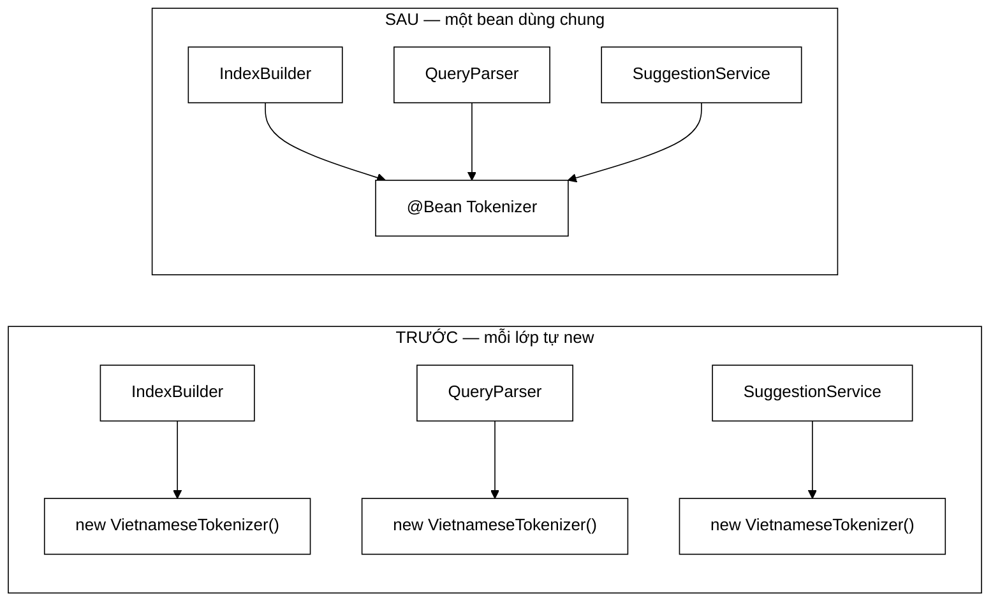

# SearchConfig — một bean duy nhất đóng lại cánh cửa cho lỗi im lặng nhất của hệ thống

**File nguồn:** `search-engine/src/main/java/com/vnsearch/config/SearchConfig.java` (62 dòng)
**Gói:** `com.vnsearch.config` · **Loại:** `@Configuration`
**Vị trí trong luồng:** dựng ba bean dùng chung — `Tokenizer`, `PageRankService`, `ImageStore`
**Đọc kèm:** [`../index/VietnameseTokenizer.md`](../index/VietnameseTokenizer.md) · [`../index/Tokenizer.md`](../index/Tokenizer.md) · [`../ranking/PageRankService.md`](../ranking/PageRankService.md) · [`../crawler/modular/ImageStore.md`](../crawler/modular/ImageStore.md)

---

## 📌 Hiểu trong 30 giây

Ba `@Bean`, 62 dòng, và **hơn một nửa là Javadoc**. Lý do: bean đầu tiên bảo vệ
bất biến quan trọng nhất của cả máy tìm kiếm.

```java
@Bean public Tokenizer       tokenizer()       { return new VietnameseTokenizer(); }
@Bean public PageRankService pageRankService() { return new PageRankService(); }
@Bean public ImageStore      imageStore()      { return new ImageStore(); }
```

```
   BẤT BIẾN: TÁCH TỪ LÚC INDEX PHẢI GIỐNG HỆT LÚC TRUY VẤN

   Lúc index:    "máy tính" → [máy_tính]
   Lúc truy vấn: "máy tính" → [máy_tính]      ✓ khớp

   Nếu hai tokenizer khác nhau:
   Lúc index:    "máy tính" → [máy_tính]
   Lúc truy vấn: "máy tính" → [máy, tính]     ✗ KHÔNG BAO GIỜ KHỚP

   ⇒ Không ngoại lệ nào được ném.
   ⇒ Không log nào được ghi.
   ⇒ Chỉ là 0 kết quả, cho một truy vấn hoàn toàn hợp lệ.
```



---

## 1. "Ở quy mô hiện tại chúng **tình cờ** vẫn đúng"

Javadoc dòng 19–23:

> *"Trước đây mỗi lớp tự gọi `new VietnameseTokenizer()` trong constructor không
> tham số. Ở quy mô hiện tại chúng đều nạp cùng một file resource nên **tình cờ**
> vẫn đúng, nhưng đó là một cánh cửa mở: chỉ cần một ngày tokenizer nhận tham số
> cấu hình là hai instance khác nhau và bất biến vỡ mà không ai nhận ra."*

```
   ⭐ TỪ QUAN TRỌNG NHẤT TRONG CẢ TỆP LÀ "TÌNH CỜ".

   Mã cũ KHÔNG SAI. Nó chạy đúng.
   Nhưng nó đúng vì HOÀN CẢNH, không phải vì THIẾT KẾ.

   Phân biệt hai loại "đang chạy đúng":
     ① Đúng vì có gì đó BẢO ĐẢM nó đúng
     ② Đúng vì chưa có ai làm cái việc phá vỡ nó

   ⇒ Loại ② là nợ kỹ thuật ở dạng nguy hiểm nhất:
     nó không có triệu chứng nào cho tới ngày nó vỡ.
```

```
   KỊCH BẢN PHÁ VỠ CỤ THỂ — VÀ NÓ RẤT HỢP LÝ

   Ngày nào đó có nhu cầu:
     new VietnameseTokenizer(boolean tachTuGhep)

   Người sửa cập nhật IndexBuilder:
     new VietnameseTokenizer(true)      ← nhớ sửa

   Nhưng QueryParser ở gói khác:
     new VietnameseTokenizer()          ← QUÊN, mặc định false

   ⇒ Index có [máy_tính], truy vấn ra [máy, tính]
   ⇒ Mọi truy vấn từ ghép trả 0 kết quả
   ⇒ Test đơn vị của CẢ HAI lớp vẫn xanh
     (mỗi lớp tự nhất quán với chính nó)
   ⇒ Chỉ test ĐẦU-CUỐI mới bắt được, và chỉ khi nó
     dùng đúng một truy vấn từ ghép
```

```
   VÌ SAO MỘT BEAN ĐÓNG ĐƯỢC CÁNH CỬA ĐÓ

   Với @Bean, chỉ có MỘT nơi gọi `new`.
   ⇒ Thêm tham số = sửa MỘT dòng
   ⇒ Không thể có hai cấu hình khác nhau, về mặt CẤU TRÚC.

   ⇒ Đây là kiểu sửa lỗi tốt nhất: không phải "cẩn thận hơn",
     mà là làm cho lỗi đó KHÔNG BIỂU DIỄN ĐƯỢC.
```

---

## 2. Lỗi im lặng — vì sao nó tệ hơn lỗi ném ngoại lệ

Javadoc dòng 13–17:

> *"Nếu lúc index tạo ra `máy_tính` mà lúc truy vấn tạo ra `máy` + `tính` thì
> **không bao giờ khớp** — và lỗi này IM LẶNG, không ném ngoại lệ nào, chỉ là kết
> quả rỗng một cách khó hiểu."*

```
   BA MỨC ĐỘ "DỄ PHÁT HIỆN" CỦA MỘT LỖI

   ① Không biên dịch được      → phát hiện trong vài giây
   ② Ném ngoại lệ khi chạy     → phát hiện ở lần chạy đầu,
                                 có stack trace chỉ thẳng chỗ
   ③ Trả kết quả SAI, im lặng  → phát hiện khi nào?

   Lỗi này thuộc loại ③, và nó còn tệ hơn mức ③ thông thường:

   "0 kết quả" là một CÂU TRẢ LỜI HỢP LỆ của máy tìm kiếm.
   ⇒ Người dùng nghĩ "chắc không có bài nào về chủ đề này"
   ⇒ Người phát triển nghĩ "chắc corpus chưa đủ lớn"
   ⇒ Không ai nghĩ tới tokenizer

   ⇒ Hệ thống nói dối một cách RẤT THUYẾT PHỤC.
```

```
   ĐỐI CHIẾU VỚI CÁC LỖI IM LẶNG KHÁC ĐÃ GẶP TRONG DỰ ÁN

   ../service/LanguageDetector.md mục 2
     bỏ sót lọc ngôn ngữ ⇒ truy vấn đánh giá vô nghĩa
     ⇒ THỔI PHỒNG số đo chất lượng

   CorsConfig.md mục 3
     thiếu header ⇒ trình duyệt chặn, log máy chủ SẠCH

   Ở đây
     tokenizer lệch ⇒ 0 kết quả cho truy vấn hợp lệ

   ⇒ Ba lỗi, ba tầng khác nhau, cùng một đặc điểm:
     KHÔNG có tín hiệu nào ở nơi người ta sẽ đi tìm.
   ⇒ Và cả ba đều được chống bằng cách làm cho tình huống
     đó không xảy ra được, chứ không bằng cách thêm kiểm tra.
```

---

## 3. Lợi ích thứ hai: nạp tài nguyên **một lần**

Javadoc dòng 30–32:

> *"Nạp từ điển từ ghép và danh sách từ dừng từ classpath **một lần duy nhất**
> (trước đây mỗi `new VietnameseTokenizer()` đều đọc lại hai file)."*

```
   ĐO LƯỜNG — CHI PHÍ THẬT CỦA MÃ CŨ

   VietnameseTokenizer nạp lúc dựng:
     - từ điển từ ghép (~vài chục nghìn mục)
     - danh sách từ dừng

   Số nơi từng gọi `new`: ít nhất 3
     IndexBuilder, QueryParser, SuggestionService

   ⇒ 3 lần đọc classpath + 3 bản từ điển trong heap

   ⇒ Đây là lợi ích PHỤ, và Javadoc đặt nó ở vị trí phụ
     — đúng thứ tự ưu tiên: tính ĐÚNG trước, chi phí sau.
```

```
   ⚠️ NHƯNG NÓ TẠO MỘT RÀNG BUỘC MỚI KHÔNG ĐƯỢC GHI

   Một bean dùng chung ⇒ nó bị gọi ĐỒNG THỜI từ nhiều luồng:
     - luồng phục vụ HTTP (truy vấn)
     - luồng crawl/index (nền)

   ⇒ VietnameseTokenizer PHẢI an toàn đa luồng.

   Mã cũ (mỗi lớp một bản) KHÔNG cần điều kiện đó.
   ⇒ Việc gộp thành một bean đã ÂM THẦM thêm một yêu cầu
     lên lớp khác, và không có gì ghi lại điều đó —
     không @ThreadSafe, không một câu Javadoc, không test.

   ⇒ Thực tế nó an toàn (từ điển chỉ đọc sau khi nạp),
     nhưng lại là "đúng vì hoàn cảnh" — đúng thứ mà
     chính tệp này đang chống lại ở mục 1.
   ⇒ Xem đề xuất 2.
```

---

## 4. `ImageStore` — cùng lập luận, ở tầng khác

Javadoc dòng 46–56:

> *"Khai ở đây, **KHÔNG** đánh `@Component` trên chính lớp đó: các lớp trong
> package `crawler` đều là POJO thuần, không biết gì về Spring. Nhờ vậy chúng
> chạy được từ công cụ dòng lệnh (`MultiDomainCrawlRunner`) và test được bằng
> JUnit thuần."*

```
   ĐÂY LÀ LÝ DO MẠNH HƠN LÝ DO CỦA AuthConfig

   AuthConfig.md mục 1: không @Service để tránh Clock
   thành bean toàn cục — một lý do về KIỂM THỬ.

   Ở đây có thêm một lý do về CHỨC NĂNG:
     MultiDomainCrawlRunner là công cụ DÒNG LỆNH.
     Nó chạy KHÔNG có Spring context.
     ⇒ Nếu ImageStore cần Spring để dựng, công cụ đó
       không chạy được.

   ⇒ Ràng buộc này không phải sở thích kiến trúc.
     Nó là điều kiện để một chương trình tồn tại.
```

```
   "MỘT BẢN DUY NHẤT CHO CẢ ỨNG DỤNG, VÀ ĐÓ LÀ ĐIỀU BẮT BUỘC"

   Javadoc dòng 53–56:
     che do in-process → CrawlJobManager đổ ảnh vào
     che do Kafka      → CrawlKafkaListeners đổ ảnh vào
     GET /api/images   → đọc ra

   ⇒ HAI đường ghi, MỘT kho đọc.

   Nếu có hai bản ImageStore:
     - crawl ghi vào bản A
     - controller đọc từ bản B
     ⇒ /api/images LUÔN rỗng
     ⇒ và lại là một lỗi IM LẶNG: 200 OK, mảng rỗng

   ⇒ Cùng đúng một loại lỗi với tokenizer ở mục 2,
     và cùng được chống bằng cùng một cách.
```

---

## 5. `PageRankService` — bean không có Javadoc

```java
@Bean
public PageRankService pageRankService() {
    return new PageRankService();
}
```

```
   ⚠️ BEAN DUY NHẤT KHÔNG ĐƯỢC GIẢI THÍCH.

   Hai bean kia đều có lý do dài. Bean này không có gì.

   Câu hỏi không trả lời được từ tệp này:
     - PageRankService có TRẠNG THÁI không?
       (nếu có, một bản dùng chung là bắt buộc,
        cùng lập luận với ImageStore)
     - Nó có an toàn đa luồng không?
     - Vì sao không @Component?
       (chắc cùng lý do POJO thuần, nhưng KHÔNG ai nói)

   ⇒ Trong một tệp mà mọi dòng khác đều được biện minh,
     một dòng KHÔNG được biện minh nổi bật lên như
     một thiếu sót — chứ không phải như "chuyện hiển nhiên".

   ⇒ Và nó CÓ trạng thái: PageRankService giữ bảng điểm
     PageRank sau khi tính. Xem ../ranking/PageRankService.md.
     ⇒ Tức là lý do cần một bản duy nhất ở đây MẠNH ngang
       ImageStore, chỉ là không ai viết ra.
```

---

## 6. Hướng dẫn thực hành

### 6.1 Dùng tokenizer dùng chung

```java
// DUNG — nhan qua ham dung
public class IndexBuilder {
    private final Tokenizer tokenizer;

    public IndexBuilder(Tokenizer tokenizer) {
        this.tokenizer = tokenizer;
    }
}

// SAI — pha vo chinh bat bien ma SearchConfig dung len
public class IndexBuilder {
    private final Tokenizer tokenizer = new VietnameseTokenizer();
}
```

### 6.2 Chẩn đoán "truy vấn hợp lệ nhưng 0 kết quả"

```
   ① Kiểm chỉ mục có rỗng không
     GET /api/admin/stats → indexedDocuments
     Nếu 0 ⇒ vấn đề ở crawl/index, không phải tokenizer.

   ② So sánh token của HAI phía
     Tách cùng một chuỗi bằng chính bean đang chạy,
     và tra thẳng vào TermDictionary xem term đó có không.
     Xem ../index/TermDictionary.md.

   ③ Nếu term trong index là "máy_tính" mà truy vấn
     sinh ra "máy" + "tính" ⇒ ĐÚNG lỗi ở mục 1.
     Tìm ngay xem có `new VietnameseTokenizer()` nào
     lọt vào mã không:
       grep -rn "new VietnameseTokenizer" search-engine/src/main
     Kết quả ĐÚNG chỉ có MỘT dòng — trong SearchConfig.java.
```

### 6.3 Cạm bẫy

```
   ① Không bao giờ `new VietnameseTokenizer()` ngoài tệp này.
     Một dòng như vậy KHÔNG gây lỗi biên dịch, KHÔNG gây
     ngoại lệ, và có thể chạy đúng nhiều tháng.

   ② Bean dùng chung ⇒ VietnameseTokenizer bị gọi đồng thời
     từ luồng HTTP và luồng crawl. Mọi thay đổi thêm trạng
     thái có thể ghi vào lớp đó là một lỗi đua.

   ③ ImageStore là MỘT bản cho cả ứng dụng — hai đường ghi
     (in-process và Kafka), một đường đọc. Đừng dựng thêm bản.

   ④ Ba lớp này KHÔNG có @Component/@Service, nên đọc
     VietnameseTokenizer.java sẽ không thấy nó là bean.

   ⑤ Bean `tokenizer()` trả kiểu Tokenizer (giao diện),
     không phải VietnameseTokenizer. Đó là chủ ý — nơi
     tiêm không được phụ thuộc vào bản cài đặt cụ thể.
     Cần một hàm chỉ có ở lớp con? Sửa giao diện,
     đừng ép kiểu.
```

---

## 7. Độ phức tạp & chi phí

| Thao tác | Chi phí |
|---|---|
| `tokenizer()` | $O(D)$ một lần, $D$ = số mục từ điển |
| `pageRankService()` | $O(1)$ lúc dựng |
| `imageStore()` | $O(1)$ lúc dựng |

```
   PHÂN TÍCH — LỢI ÍCH BỘ NHỚ CỦA VIỆC GỘP

   Mã cũ:  3 bản từ điển  ⇒ 3 × M byte
   Mã mới: 1 bản          ⇒ 1 × M byte

   Với từ điển từ ghép vài chục nghìn mục, M cỡ vài MB.
   ⇒ Tiết kiệm vài MB heap và hai lần đọc classpath.

   ⇒ Con số này KHÔNG PHẢI lý do chính để sửa —
     lý do chính là tính đúng ở mục 1.
   ⇒ Nhưng nó là lợi ích kèm theo, và Javadoc trình bày
     đúng thứ tự ưu tiên đó.

   ⚠️ Không có số đo thật nào trong Javadoc (kích thước từ
     điển, thời gian nạp). Trong một dự án có
     ../eval/MemoryBreakdown.md đo bộ nhớ rất kỹ, đây là
     một chỗ trống dễ lấp.
```

---

## 8. Kiểm thử liên quan

```
   ⚠️ KHÔNG CÓ TEST NÀO CHO CHÍNH TỆP NÀY.

   Phủ gián tiếp:
     ../../../../../test/.../index/VietnameseTokenizerTest.md
     ⇒ test bản CÀI ĐẶT, không test việc nó là bean DÙNG CHUNG
```

```
   BẤT BIẾN TRUNG TÂM KHÔNG ĐƯỢC CANH GIỮ

   ✗ Chỉ có ĐÚNG MỘT nơi gọi `new VietnameseTokenizer()`
     — đây là toàn bộ lý do tệp này tồn tại, và nó
     KIỂM ĐƯỢC bằng một luật tĩnh.

   ✗ Tokenizer tiêm vào IndexBuilder và vào QueryParser
     là CÙNG MỘT đối tượng (assertSame).

   ✗ Tách cùng một chuỗi ở hai đầu cho cùng kết quả —
     đây là phát biểu trực tiếp của bất biến, và là
     test có giá trị nhất trong ba cái.

   ✗ ImageStore là một bản duy nhất, và cả hai đường ghi
     (CrawlJobManager, CrawlKafkaListeners) cùng ghi vào nó.

   ⇒ Bốn tính chất, không một test nào — cho tệp
     canh giữ bất biến quan trọng nhất của máy tìm kiếm.
```

---

## 9. Chấm theo chuẩn doanh nghiệp

| Tiêu chí | Điểm | Nhận xét |
|---|---|---|
| **Nêu đúng tên lỗi mà bean này ngăn chặn** | 10/10 | "Lỗi này IM LẶNG... chỉ là kết quả rỗng một cách khó hiểu" — mô tả đúng triệu chứng người đọc sẽ gặp |
| **Phân biệt "đúng vì thiết kế" với "đúng vì tình cờ"** | 10/10 | Từ *"tình cờ"* là chẩn đoán chính xác nhất trong cả tệp: mã cũ **không sai**, chỉ là chưa vỡ |
| **Làm cho lỗi không biểu diễn được** | 10/10 | Một `new` duy nhất ⇒ hai cấu hình lệch nhau là **bất khả thi về cấu trúc**, không phải "cần cẩn thận" |
| Lý do `ImageStore` không `@Component` | 10/10 | Không phải sở thích kiến trúc — `MultiDomainCrawlRunner` chạy **không có Spring context** |
| Trả về kiểu giao diện `Tokenizer` | 9/10 | Nơi tiêm không phụ thuộc bản cài đặt cụ thể; đúng hướng cho việc thay tokenizer sau này |
| Xếp lợi ích tính đúng **trước** lợi ích chi phí | 9/10 | Việc nạp một lần chỉ được nhắc ở vị trí phụ — đúng thứ tự ưu tiên |
| Nêu rõ "hai đường ghi, một kho đọc" | 9/10 | Ràng buộc kiến trúc thật giữa chế độ in-process và chế độ Kafka, ghi ở đúng nơi cần |
| **Kiểm thử bất biến trung tâm** | **0/10** | Bốn tính chất, **không một test nào** — cho chính bất biến mà tệp này tồn tại để bảo vệ |
| **Yêu cầu an toàn đa luồng thêm vào âm thầm** | **4/10** | Gộp thành một bean buộc `VietnameseTokenizer` phải an toàn đa luồng; không ghi ở đâu, không test |
| `PageRankService` không có Javadoc | 5/10 | Bean duy nhất không được biện minh, dù nó **có trạng thái** nên lý do cần bản duy nhất mạnh ngang `ImageStore` |
| Không có số đo cho lợi ích nạp một lần | 6/10 | "3 lần đọc file" không kèm kích thước hay thời gian, trong một dự án đo bộ nhớ rất kỹ ở nơi khác |
| Không có gì chặn `new` lọt vào mã mới | 6/10 | Toàn bộ giá trị của tệp phụ thuộc vào việc **không ai** viết lại dòng đó, mà điều đó chỉ dựa vào ý thức |

**Ba đề xuất nâng lên mức sản phẩm:**

1. **Một luật tĩnh cấm `new VietnameseTokenizer()` ngoài tệp này.** Toàn bộ giá
   trị của `SearchConfig` nằm ở chỗ chỉ có **một** nơi gọi `new` — nhưng hiện
   không gì bảo đảm điều đó. Một dòng `new VietnameseTokenizer()` thêm vào ngày
   mai sẽ biên dịch được, chạy được, và có thể đúng nhiều tháng trước khi vỡ:
   ```java
   @AnalyzeClasses(packages = "com.vnsearch")
   class TokenizerDungChungTest {

       @ArchTest
       static final ArchRule chiSearchConfigDuocKhoiTaoTokenizer =
           noClasses().that().resideOutsideOfPackage("com.vnsearch.config")
               .should().callConstructor(VietnameseTokenizer.class)
               .because("Tach tu luc index PHAI giong het luc truy van."
                       + " Hai ban tokenizer khac cau hinh se lam moi truy van tu ghep"
                       + " tra 0 ket qua, KHONG nem ngoai le, KHONG ghi log."
                       + " Nhan tokenizer qua ham dung thay vi tu new.");
   }
   ```
   Nếu không muốn thêm phụ thuộc ArchUnit, một bước `grep` trong CI cũng đủ — điều
   quan trọng là phép kiểm phải **tự giải thích triệu chứng**, vì người chạm vào
   nó sáu tháng sau sẽ không đọc tệp này.

2. **Ghi lại yêu cầu an toàn đa luồng mà chính bean này tạo ra.** Việc gộp ba bản
   thành một đã âm thầm thêm một điều kiện lên
   [`VietnameseTokenizer`](../index/VietnameseTokenizer.md): nó bị gọi đồng thời
   từ luồng HTTP và luồng crawl. Hiện nó **thoả mãn** điều kiện đó (từ điển chỉ
   đọc sau khi nạp), nhưng lại thoả mãn *"vì hoàn cảnh"* — đúng thứ mà mục 1 của
   chính tệp này lên án:
   ```java
   /**
    * Tokenizer dung chung cho CA tang chi muc lan tang truy van.
    *
    * <p><b>Rang buoc do chinh viec dung chung tao ra:</b> bean nay bi goi
    * DONG THOI tu luong phuc vu HTTP (truy van) va luong crawl/index (nen),
    * nen {@link VietnameseTokenizer} BAT BUOC phai an toan da luong. Hien tai
    * no thoa man vi tu dien chi doc sau khi nap xong trong ham dung — moi
    * thay doi them trang thai ghi duoc vao lop do se tao ra loi dua ma
    * KHONG test don vi nao bat duoc.
    */
   @Bean
   public Tokenizer tokenizer() { return new VietnameseTokenizer(); }
   ```

3. **Test trực tiếp bất biến, chứ không chỉ chặn cách vi phạm.** Đề xuất 1 chặn
   *một cách* làm vỡ bất biến; phép kiểm dưới đây phát biểu **chính bất biến** đó,
   nên nó còn bắt được cả những cách vỡ chưa nghĩ tới (ví dụ một bean `Tokenizer`
   thứ hai với `@Qualifier`):
   ```java
   @SpringBootTest
   class BatBienTachTuTest {

       @Autowired IndexBuilder indexBuilder;
       @Autowired QueryParser  queryParser;
       @Autowired Tokenizer    tokenizer;

       @Test
       void indexVaTruyVanDungCHUNG_MOT_tokenizer() {
           assertSame(tokenizer, indexBuilder.getTokenizer());
           assertSame(tokenizer, queryParser.getTokenizer());
       }

       @ParameterizedTest
       @ValueSource(strings = {"máy tính", "hà nội", "trí tuệ nhân tạo", "công nghệ thông tin"})
       void cungMotChuoiChoCungKetQuaOHaiDau(String cauTruyVan) {
           assertEquals(indexBuilder.getTokenizer().tokenize(cauTruyVan),
                   queryParser.getTokenizer().tokenize(cauTruyVan),
                   "Lech o day nghia la truy van nay se LUON tra 0 ket qua,"
                           + " khong ngoai le, khong log.");
       }
   }
   ```
   Các chuỗi thử được chọn có chủ đích: cả bốn đều là **từ ghép**, tức là đúng
   nhóm bị ảnh hưởng — một truy vấn một âm tiết sẽ cho cùng kết quả kể cả khi bất
   biến đã vỡ, nên nó không canh giữ được gì.

---

## 10. Liên kết

- Bản cài đặt tokenizer được dựng ở đây: [`../index/VietnameseTokenizer.md`](../index/VietnameseTokenizer.md)
- Giao diện mà bean trả về: [`../index/Tokenizer.md`](../index/Tokenizer.md)
- Bean thứ hai, giữ bảng điểm PageRank: [`../ranking/PageRankService.md`](../ranking/PageRankService.md)
- Kho ảnh một bản, hai đường ghi: [`../crawler/modular/ImageStore.md`](../crawler/modular/ImageStore.md)
- Đường ghi ảnh chế độ in-process: [`../service/CrawlJobManager.md`](../service/CrawlJobManager.md)
- Đường ghi ảnh chế độ Kafka: [`CrawlKafkaListeners.md`](./CrawlKafkaListeners.md)
- Đường đọc ảnh: [`../controller/ImageSearchController.md`](../controller/ImageSearchController.md)
- Công cụ dòng lệnh chạy **không có** Spring: [`../crawler/MultiDomainCrawlRunner.md`](../crawler/MultiDomainCrawlRunner.md)
- Hai phía tiêu thụ tokenizer: [`../service/IndexBuilder.md`](../service/IndexBuilder.md) · [`../query/QueryParser.md`](../query/QueryParser.md)
- Cùng nguyên tắc "khai bean ở tầng cấu hình để lớp nghiệp vụ là POJO thuần": [`AuthConfig.md`](./AuthConfig.md) mục 1
