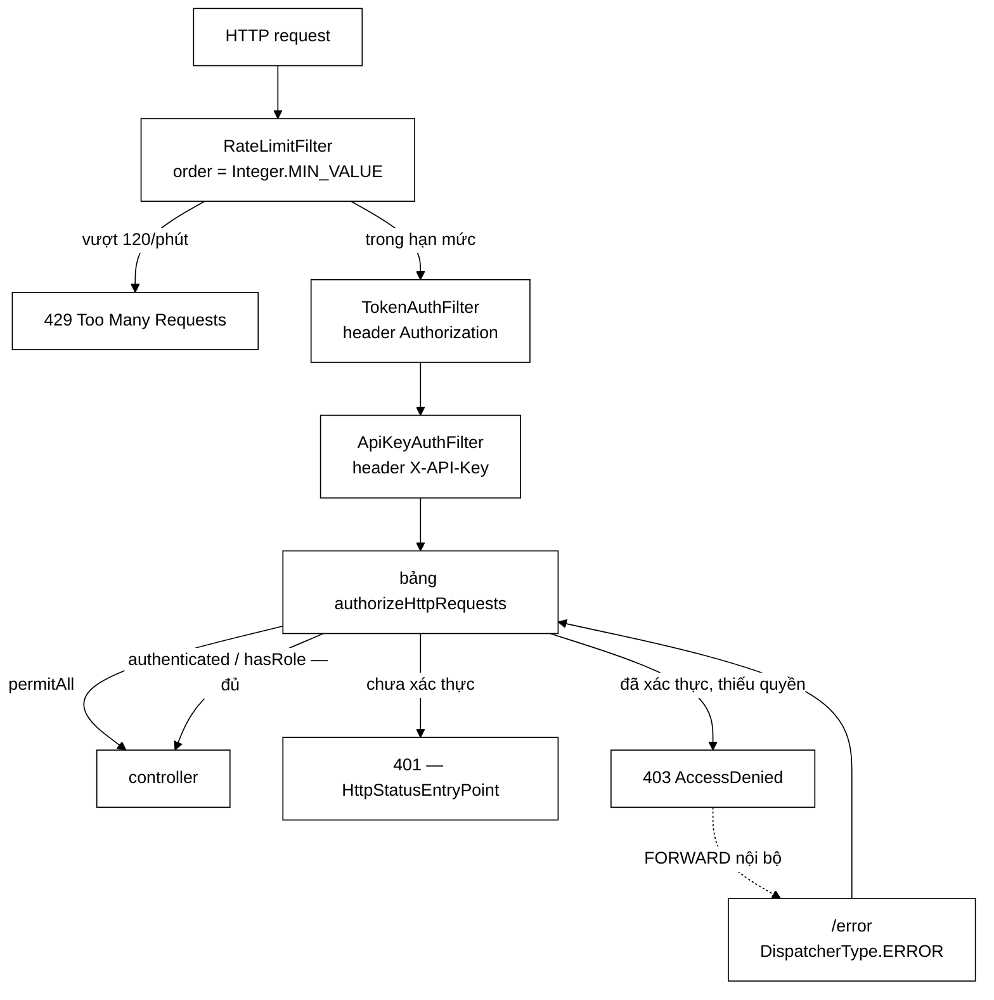
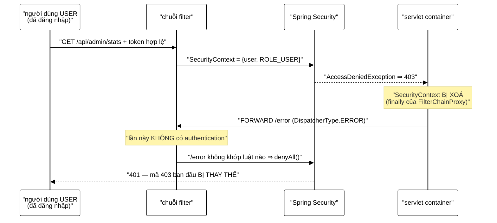

# SecurityConfig — bảng phân quyền, và ba lỗi chỉ lộ ra khi chạy thật

**File nguồn:** `search-engine/src/main/java/com/vnsearch/config/SecurityConfig.java` (210 dòng)
**Gói:** `com.vnsearch.config` · **Loại:** `@Configuration @EnableWebSecurity`
**Vị trí trong luồng:** trung tâm — mọi request HTTP đều đi qua bảng luật ở đây
**Đọc kèm:** [`ApiKeyAuthFilter.md`](./ApiKeyAuthFilter.md) · [`../auth/TokenAuthFilter.md`](../auth/TokenAuthFilter.md) · [`RateLimitFilter.md`](./RateLimitFilter.md) · [`CorsConfig.md`](./CorsConfig.md)

---

## 📌 Hiểu trong 30 giây

Một bảng ba cột. Vai trò `ADMIN` do **một trong hai** filter cấp, và bảng
**không quan tâm** vai trò đến từ đâu.

```
   CÔNG KHAI                    ĐÃ ĐĂNG NHẬP        VAI TRÒ ADMIN
   ───────────────────────      ──────────────      ─────────────────────────
   GET  /api/search             GET  /api/auth/me   POST /api/admin/crawl
   GET  /api/suggest            POST /api/auth/     POST /api/admin/reindex
   GET  /api/health                  logout         GET  /api/admin/stats
   GET  /api/images                                 GET  /api/admin/crawl/{id}/status
   GET  /api/feed                                   GET  /api/admin/analytics
   POST /api/events                                 POST /api/admin/analytics/reset
   POST /api/auth/register                          GET  /api/admin/users
   POST /api/auth/login                             POST /api/admin/users/{tên}/role
   GET  /actuator/health                            GET  /actuator/**  (còn lại)
   GET  /actuator/prometheus
```



```
   ⭐ MŨI TÊN ĐỨT NÉT LÀ TOÀN BỘ MỤC 3 CỦA TÀI LIỆU NÀY.

   Nó là một vòng quay LẠI qua chuỗi filter, sau khi
   SecurityContext đã bị xoá. Không có dòng
   `.dispatcherTypeMatchers(DispatcherType.ERROR).permitAll()`
   thì mọi mã 403 biến thành 401 — và giao diện đẩy người
   dùng vào vòng lặp đăng nhập vô tận.
```

---

## 1. Phân quyền theo **vai trò**, không theo **cơ chế đăng nhập**

Javadoc dòng 39–44:

> *"Vai trò ADMIN được cấp bởi **một trong hai** filter: `TokenAuthFilter`
> (người thật, đăng nhập bằng tài khoản/mật khẩu) hoặc `ApiKeyAuthFilter`
> (công cụ, header `X-API-Key`). Bảng trên không quan tâm vai trò đến từ đâu."*

```
   ĐÂY LÀ MỘT ÁP DỤNG CỦA NGUYÊN TẮC ĐẢO NGƯỢC PHỤ THUỘC,
   Ở TẦNG CẤU HÌNH.

   Cách làm SAI (rất phổ biến):
     .requestMatchers("/api/admin/**").access(
         (auth, ctx) -> coApiKey(ctx) || daDangNhapVaLaAdmin(ctx))

   ⇒ Bảng phân quyền BIẾT về cơ chế đăng nhập.
   ⇒ Thêm cách xác thực thứ ba (mTLS, OIDC…) phải sửa
     MỌI DÒNG trong bảng.

   Cách làm ở đây:
     filter  →  cấp ROLE_ADMIN vào SecurityContext
     bảng    →  chỉ hỏi "có ROLE_ADMIN không?"

   ⇒ Thêm cách xác thực thứ ba = thêm MỘT filter,
     KHÔNG sửa một dòng nào trong bảng.
```

```
   ĐỌC BẢNG THEO CHIỀU NGƯỢC LẠI ĐỂ KIỂM CHỨNG

   Câu hỏi: "endpoint nào bị ảnh hưởng nếu bỏ ApiKeyAuthFilter?"

   Trả lời từ bảng: KHÔNG endpoint nào cả — bảng không nhắc
   tới nó. Chỉ là không còn ai cấp được ROLE_ADMIN qua header
   X-API-Key, nên toàn bộ cột thứ ba chỉ còn truy cập được
   bằng tài khoản.

   ⇒ Khả năng trả lời câu hỏi đó bằng cách đọc MỘT chỗ
     chính là giá trị của thiết kế này.
```

---

## 2. `anyRequest().denyAll()` — mặc định là **đóng**

```java
.requestMatchers("/api/admin/**", "/actuator/**").hasRole("ADMIN")
.anyRequest().denyAll())
```

```
   HAI MẶC ĐỊNH KHẢ DĨ, VÀ HẬU QUẢ CỦA MỖI CÁI

   ① anyRequest().permitAll()  — mở trước, đóng sau
     Quên một dòng ⇒ endpoint MỚI bị PHƠI RA Internet.
     Lỗi này IM LẶNG: mọi thứ chạy, không ai biết.
     Phát hiện: khi bị khai thác.

   ② anyRequest().denyAll()   — đóng trước, mở sau  ← chọn
     Quên một dòng ⇒ endpoint MỚI trả 401.
     Lỗi này ỒN ÀO: người đầu tiên gọi thử sẽ báo ngay.
     Phát hiện: trong vòng vài phút.

   ⇒ Cùng nguyên tắc "chọn chiều sai an toàn" ở
     ../datastructure/BloomFilter.md mục 1 và
     ../service/LanguageDetector.md mục 3.
```

Bình luận dòng 136–139 xác nhận điều này **đã thực sự xảy ra**:

```
   "Them mot endpoint doc du lieu ma quen dong nay thi no tra 401
    — dung mac dinh cua Spring Security (chan truoc, mo sau),
    va la ly do /api/images tra 401 o lan chay dau tien."
```

```
   ⭐ MỘT DÒNG BÌNH LUẬN KỂ LẠI MỘT LỖI THẬT ĐÃ XẢY RA
     ĐÁNG GIÁ HƠN MƯỜI DÒNG GIẢI THÍCH LÝ THUYẾT.

   Nó biến "nguyên tắc" thành "kinh nghiệm kiểm chứng được":
   người đọc sau này biết rằng cái bẫy đó CÓ THẬT, không phải
   một khả năng lý thuyết.
```

---

## 3. `DispatcherType.ERROR` — lỗi chỉ lộ ra khi chạy thật

Đây là phần đáng học nhất của cả tệp. Bình luận dòng 116–134:

> *"Khi một người **đã đăng nhập** gọi endpoint không đủ quyền, Spring Security
> ném `AccessDeniedException` và trả 403. Spring Boot sau đó **FORWARD nội bộ**
> tới `/error` để dựng thân phản hồi — và lần forward đó đi qua chuỗi filter một
> lần nữa, lúc này `SecurityContext` **đã bị xoá**."*



```java
.dispatcherTypeMatchers(DispatcherType.ERROR).permitAll()
```

```
   VÌ SAO HẬU QUẢ NGHIÊM TRỌNG HƠN "SAI MÃ TRẠNG THÁI"

   Bình luận dòng 126–130 nói rõ:

   403 nghĩa là "bạn là ai đó hợp lệ, nhưng không đủ quyền"
     ⇒ giao diện hiển thị "Bạn không có quyền xem trang này"

   401 nghĩa là "tôi không biết bạn là ai"
     ⇒ giao diện ĐẨY VỀ MÀN HÌNH ĐĂNG NHẬP

   Với người dùng USER gọi nhầm endpoint admin:
     ① bị đẩy về đăng nhập
     ② đăng nhập lại THÀNH CÔNG (tài khoản vẫn hợp lệ)
     ③ quay lại trang đó
     ④ lại bị đẩy về đăng nhập
     ⇒ VÒNG LẶP KHÔNG LỐI THOÁT

   ⇒ Và nó chỉ xảy ra với người đăng nhập ĐÚNG nhưng
     KHÔNG ĐỦ QUYỀN — tức là đúng nhóm người khó nghi ngờ nhất.
```

```
   ⚠️ VÌ SAO TEST TÍCH HỢP KHÔNG BẮT ĐƯỢC

   Bình luận dòng 132–134:
   "Loi nay CHI lo ra khi chay that: MockMvc mac dinh khong
    thuc hien lan gui ERROR, nen bai kiem thu tich hop van
    thay 403 va van xanh."

   MockMvc mô phỏng servlet container, và nó BỎ QUA bước
   forward tới /error trừ khi bật rõ:

     MockMvcBuilders.webAppContextSetup(ctx)
         .addFilters(springSecurityFilterChain)
         .build();
     // ⇒ khong co ERROR dispatch

   ⇒ Đây là ví dụ mẫu mực của "test xanh, sản phẩm đỏ".
   ⇒ Bài học chung: mọi thứ MockMvc KHÔNG mô phỏng đều là
     vùng mù, và danh sách đó dài hơn người ta tưởng
     (ERROR dispatch, async timeout, chuỗi filter servlet
     đăng ký qua FilterRegistrationBean — tức là cả
     RateLimitFilter cũng nằm ngoài tầm MockMvc).
```

```
   PHẢN BIỆN: permitAll() CHO /error CÓ AN TOÀN KHÔNG?

   Lo ngại hợp lý: "mở /error thì kẻ tấn công gọi thẳng
   /error được không?"

   Trả lời: dispatcherTypeMatchers(ERROR) KHÔNG mở đường dẫn
   /error. Nó mở KIỂU GỬI (dispatch type) — và kiểu ERROR
   chỉ do chính container sinh ra trong một lần forward nội bộ.

   Một request từ ngoài vào luôn mang DispatcherType.REQUEST,
   kể cả khi URL là /error. Nó vẫn rơi vào denyAll().

   ⇒ Luật này hẹp hơn nhiều so với vẻ ngoài của nó.
   ⇒ Nhưng điều đó KHÔNG hiển nhiên khi đọc, và bình luận
     hiện tại không nói ra. Xem đề xuất 2.
```

---

## 4. Ba luật "phải công khai" và lý do của từng cái

### 4.1 `/api/health` — vì sao không dùng `/api/admin/stats`

Javadoc dòng 46–50:

> *"Trước đây healthcheck của `docker-compose.yml` gọi `/api/admin/stats`. Khoá
> đường dẫn admin lại mà không tách một endpoint sức khoẻ công khai sẽ làm
> container bị đánh dấu *unhealthy* ngay lập tức, rồi `restart: unless-stopped`
> khởi động lại vô hạn."*

```
   MỘT PHÉP SỬA BẢO MẬT KÉO THEO MỘT SỰ CỐ VẬN HÀNH

   Trình tự:
     ① Khoá /api/admin/** lại bằng API key      (đúng)
     ② Healthcheck của Docker gọi /api/admin/stats
        ⇒ nhận 401
     ③ Docker đánh dấu container unhealthy
     ④ restart: unless-stopped → khởi động lại
     ⑤ Ứng dụng khởi động (mất ~40 giây nạp chỉ mục)
     ⑥ Healthcheck lại 401
     ⑦ → ③

   ⇒ Vòng lặp khởi động lại vô hạn. Ứng dụng KHÔNG HỀ hỏng.
   ⇒ Nó chỉ không chứng minh được với Docker rằng nó khoẻ.

   BÀI HỌC: mọi phép siết quyền phải kèm câu hỏi
   "AI ĐANG GỌI đường dẫn này mà tôi chưa nghĩ tới?"
   — và câu trả lời thường là hạ tầng, không phải con người.
```

### 4.2 `POST /api/events` — công khai theo **phương thức**, không theo đường dẫn

```java
.requestMatchers(HttpMethod.POST, "/api/events").permitAll()
```

```
   HAI CHIỀU CỦA CÙNG MỘT TÀI NGUYÊN, HAI MỨC QUYỀN

   GHI (POST /api/events)              → CÔNG KHAI
     Mọi người dùng đều phải báo được hành vi.
     Bắt xác thực ở đây = không còn số liệu nào.

   ĐỌC (GET /api/admin/analytics)      → ROLE_ADMIN
     Số liệu tổng hợp là thông tin nội bộ.

   ⇒ Ràng buộc theo PHƯƠNG THỨC chứ không theo đường dẫn:
     một `GET /api/events` thêm vào sau này sẽ KHÔNG tự
     thừa kế quyền công khai. Nó rơi vào denyAll().

   ⇒ Đây là chi tiết dễ làm sai nhất trong cả tệp, và nó
     được làm đúng.
```

### 4.3 `POST /api/auth/logout` — phép sửa sau review

Bình luận dòng 157–168:

> *"Trước đó nó nằm trong nhóm `.authenticated()`, nên một người có token **đã
> hết hạn** bấm "Đăng xuất" sẽ nhận 401 — đúng lúc họ muốn dọn dẹp phiên thì hệ
> thống từ chối."*

```
   MÂU THUẪN GIỮA HAI LỜI HỨA, VÀ CÁCH GỠ

   AuthController.logout hứa: "tra 204 KE CA khi token
   khong con hieu luc"
   Bảng phân quyền lại nói: "phai .authenticated()"

   ⇒ Hai chỗ mâu thuẫn nhau. Chỗ nào thắng?
     Bảng phân quyền thắng — nó chạy TRƯỚC controller.
   ⇒ Lời hứa trong Javadoc của controller KHÔNG BAO GIỜ
     có cơ hội được thực hiện.

   BÀI HỌC: một hằng số/lời hứa ghi ở tầng controller có thể
   bị VÔ HIỆU HOÁ âm thầm bởi cấu hình ở tầng trên. Javadoc
   không tự kiểm chứng được; chỉ test đầu-cuối mới bắt được.
```

```
   VÌ SAO MỞ RA KHÔNG THÊM RỦI RO

   Bình luận dòng 165–168:
   "handler chi thu hoi dung token duoc gui len, khong co
    token thi khong co gi de thu hoi"

   ⇒ Không có leo thang quyền: kẻ tấn công chỉ "đăng xuất"
     được token mà HỌ ĐÃ CÓ.

   ⚠️ Nhưng có một mặt còn lại: nếu kẻ tấn công đánh cắp
     được token, họ có thể gọi logout để ĐUỔI nạn nhân ra.
     Đó là phiền toái, không phải leo thang quyền —
     và nếu họ đã có token thì họ đã có mọi thứ rồi.

   ⇒ Còn /api/auth/logout-all VẪN cần xác thực, vì nó hành
     động trên TÀI KHOẢN chứ không trên một token.
     Ranh giới này đúng và tinh tế.
```

---

## 5. `requireAdminApiKey()` — hỏng to hơn hỏng âm thầm

```java
private String requireAdminApiKey() {
    if (adminApiKey == null || adminApiKey.isBlank()) {
        throw new IllegalStateException(
                "Thieu app.security.admin-api-key (bien moi truong ADMIN_API_KEY). "
                        + "Cac endpoint /api/admin/** dieu khien crawler va co the tai URL tuy y, "
                        + "nen KHONG duoc phep chay ma khong co khoa. "
                        + "Sinh khoa: openssl rand -hex 32");
    }
    if (adminApiKey.length() < MIN_KEY_LENGTH) { ... }
    return adminApiKey;
}
```

```
   ⭐ THÔNG BÁO LỖI NÀY LÀ MẪU MỰC — BỐN PHẦN

   ① CÁI GÌ thiếu:  app.security.admin-api-key
   ② Ở ĐÂU đặt:     biến môi trường ADMIN_API_KEY
   ③ VÌ SAO quan trọng: "dieu khien crawler va co the
                        tai URL tuy y"
   ④ LÀM SAO sửa:   openssl rand -hex 32

   Phần ③ là phần hầu hết thông báo lỗi bỏ qua, và là phần
   ngăn người vận hành "sửa nhanh" bằng cách đặt khoá là
   "12345678901234567890".
```

```
   VÌ SAO KHÔNG SINH KHOÁ NGẪU NHIÊN RỒI IN RA LOG

   Javadoc dòng 78–82 loại phương án này:
   "nghe than thien hon nhung tao ra mot he thong CO VE dang
    chay binh thuong trong khi khong ai biet khoa la gi,
    va lan trien khai sau lai sinh khoa khac"

   Hai hậu quả cụ thể:
     ① Khoá nằm trong log ⇒ vi phạm chính nguyên tắc mà
       ApiKeyAuthFilter.md mục 3 dựng lên.
     ② Khởi động lại = khoá mới ⇒ mọi script vận hành hỏng
       vào một thời điểm ngẫu nhiên trong tương lai.

   ⇒ "Hỏng to còn hơn hỏng âm thầm" — và ở đây "to" nghĩa là
     ứng dụng KHÔNG khởi động, tức là phát hiện trong
     30 giây thay vì 6 tháng.
```

```
   ⚠️ MIN_KEY_LENGTH = 16 CHỈ KIỂM ĐỘ DÀI, KHÔNG KIỂM ENTROPY

   "aaaaaaaaaaaaaaaa"  → 16 ký tự → QUA
   "adminadminadmin1"  → 16 ký tự → QUA
   "1234567890123456"  → 16 ký tự → QUA

   ⇒ Cả ba đều nằm trong mọi danh sách mật khẩu phổ biến.
   ⇒ Kiểm độ dài là phép kiểm RẺ NHẤT có tác dụng, nhưng nó
     tạo cảm giác an toàn không tương xứng.
   ⇒ Không có gợi ý nào trong mã rằng nó chỉ là sàn tối thiểu.
     Xem đề xuất 3.
```

---

## 6. CSRF tắt — và vì sao lần này là đúng

Javadoc dòng 58–61:

> *"Đây là API không trạng thái, xác thực bằng header chứ không bằng cookie. Tấn
> công CSRF dựa trên việc trình duyệt **tự động** đính kèm thông tin xác thực;
> header `X-API-Key` thì không bao giờ được đính kèm tự động, nên không có gì để
> giả mạo."*

```
   ĐIỀU KIỆN ĐỦ ĐỂ TẮT CSRF AN TOÀN — BA ĐIỀU, PHẢI ĐỦ CẢ BA

   ① Không dùng cookie cho xác thực            ✓ (dùng header)
   ② SessionCreationPolicy.STATELESS           ✓ (dòng 110–111)
   ③ CORS không cho gửi credentials            ✓ (CorsConfig,
                                                  allowCredentials(false))

   ⇒ Cả ba đều được ghim TƯỜNG MINH trong mã, không cái nào
     dựa vào mặc định.

   ⚠️ Nhưng chúng nằm ở BA TỆP KHÁC NHAU:
     điều ① và ② ở đây, điều ③ ở CorsConfig.

   ⇒ Một lần sửa CorsConfig thành allowCredentials(true)
     sẽ mở lại lỗ hổng CSRF mà KHÔNG chạm vào tệp này,
     và không có gì cảnh báo.

   ⇒ Đây là phụ thuộc ngầm giữa hai tệp cấu hình.
     CorsConfig.md mục 2 nói về nó từ phía bên kia.
```

---

## 7. `RateLimitFilter` đăng ký ngoài chuỗi Spring Security

```java
@Bean
public FilterRegistrationBean<RateLimitFilter> rateLimitFilter(...) {
    FilterRegistrationBean<RateLimitFilter> registration = new FilterRegistrationBean<>(
            new RateLimitFilter(requestsPerMinute, enabled, trustProxy));
    registration.addUrlPatterns("/api/*");
    registration.setOrder(Integer.MIN_VALUE); // truoc moi filter khac
    return registration;
}
```

```
   HAI QUYẾT ĐỊNH, HAI LÝ DO KHÁC NHAU

   ① setOrder(Integer.MIN_VALUE) — chặn TRƯỚC khi tốn chi phí
     Javadoc dòng 193–195: "mot tran request khong hop le phai
     bi chan TRUOC khi ton chi phi phan giai xac thuc"

     Với X-API-Key, chi phí xác thực là ~64 phép so byte —
     không đáng kể. Nhưng với TokenAuthFilter thì phải tra
     SessionStore, và với một trận lũ 10.000 req/giây thì
     chi phí đó là thật.

   ② FilterRegistrationBean thay vì @Component
     Javadoc dòng 195–197: "de khong bi Spring Boot tu dong
     gan vao chuoi filter servlet HAI LAN"

     Đây là cái bẫy kinh điển: một `@Component` kế thừa
     `Filter` được Spring Boot tự đăng ký vào servlet container,
     VÀ nếu nó cũng nằm trong chuỗi Security thì nó chạy hai lần.
     ⇒ Với rate limit, chạy hai lần nghĩa là hạn mức thực tế
       chỉ còn MỘT NỬA — và không ai nhận ra vì nó vẫn "hoạt động".
```

```
   ⚠️ HỆ QUẢ: RateLimitFilter NẰM NGOÀI TẦM CỦA MockMvc

   MockMvc chỉ dựng chuỗi filter của Spring Security.
   Filter đăng ký qua FilterRegistrationBean thuộc về
   servlet container, nên MockMvc KHÔNG chạy nó.

   ⇒ Không một test tích hợp nào hiện tại đi qua rate limit.
   ⇒ Cùng loại vùng mù với DispatcherType.ERROR ở mục 3 —
     và đây đã là lần THỨ HAI trong cùng một tệp.
```

---

## 8. Hướng dẫn thực hành

### 8.1 Thêm một endpoint mới

```
   ① Endpoint ĐỌC dữ liệu công khai?
     → thêm vào .requestMatchers("/api/search", ..., "/api/moi")
     → VÀ kiểm CorsConfig có đủ phương thức chưa

   ② Endpoint cần đăng nhập?
     → nằm dưới /api/auth/** thì đã tự động .authenticated()
     → ngoài ra phải thêm dòng riêng

   ③ Endpoint quản trị?
     → đặt dưới /api/admin/** ⇒ tự động hasRole("ADMIN")
     → KHÔNG cần sửa gì ở đây. Đây là lợi ích của việc
       phân quyền theo TIỀN TỐ đường dẫn.

   ④ Quên hết? → 401. Đó là mặc định đóng, và nó ồn ào
     đúng như thiết kế.
```

### 8.2 Cạm bẫy

```
   ① Thứ tự khai báo filter NGƯỢC với thứ tự chạy.
     addFilterBefore(A, X); addFilterBefore(B, A);
     ⇒ chạy B → A → X.

   ② Thêm phương thức HTTP mới phải sửa CẢ CorsConfig.
     Thiếu ⇒ trình duyệt chặn ở preflight, log máy chủ SẠCH,
     curl vẫn 200. Xem CorsConfig.md mục 3.

   ③ MockMvc KHÔNG chạy: ERROR dispatch, RateLimitFilter.
     Hai vùng mù đã gây ra lỗi thật trong chính tệp này.

   ④ /actuator/prometheus CÔNG KHAI.
     Javadoc nói "trong mot trien khai that, no nen duoc chan
     o tang mang" — tức là ứng dụng KHÔNG tự bảo vệ được nó.
     Đây là ràng buộc phải ghi vào tài liệu triển khai,
     không phải thứ đọc mã ra được.

   ⑤ .hasRole("ADMIN") tự thêm tiền tố "ROLE_".
     Filter phải cấp "ROLE_ADMIN", không phải "ADMIN".
     Sai chỗ này ⇒ 403 cho khoá đúng, và rất khó lần.

   ⑥ Đổi ADMIN_API_KEY = phải khởi động lại.
     Không có nạp nóng.
```

---

## 9. Độ phức tạp & chi phí

| Thao tác | Chi phí |
|---|---|
| Khởi động — `requireAdminApiKey` | $O(1)$, một lần |
| Mỗi request — duyệt bảng luật | $O(M)$ với $M$ = số dòng luật (~12) |
| Mỗi request — chuỗi filter | $O(F)$ với $F$ = số filter (~10 của Spring + 3 riêng) |

```
   PHÂN TÍCH

   Bảng luật được duyệt TUẦN TỰ, dừng ở dòng khớp đầu tiên.
   ⇒ Endpoint công khai (/api/search) khớp ở dòng thứ 4
     ⇒ rẻ nhất, và đó là endpoint được gọi nhiều nhất.
   ⇒ Endpoint admin khớp ở dòng gần cuối ⇒ đắt nhất,
     nhưng được gọi hiếm nhất.

   ⇒ Thứ tự hiện tại TÌNH CỜ tối ưu cho phân bố lưu lượng thật.
   ⇒ Nhưng thứ tự này bị RÀNG BUỘC bởi ngữ nghĩa (dòng cụ thể
     phải đứng trước dòng tổng quát), nên không được sắp xếp lại
     vì lý do hiệu năng. Với M ≈ 12 thì chi phí này vô nghĩa
     so với việc phân giải HTTP.
```

---

## 10. Kiểm thử liên quan

| Tệp test | Kiểm gì |
|---|---|
| [`AnalyticsAuthorizationTest`](../../../../../test/java/com/vnsearch/analytics/AnalyticsAuthorizationTest.md) | Cột ADMIN của bảng, phần `/api/admin/analytics` |
| [`AccountAuthorizationTest`](../../../../../test/java/com/vnsearch/auth/AccountAuthorizationTest.md) | Cột "đã đăng nhập", và ranh giới USER/ADMIN |
| [`CorsPreflightTest`](../../../../../test/java/com/vnsearch/config/CorsPreflightTest.md) | Luật `OPTIONS /** permitAll` |

```
   NHỮNG THỨ KHÔNG ĐƯỢC CANH GIỮ

   ✗ DispatcherType.ERROR: bỏ dòng đó ra thì 403 thành 401.
     MockMvc mặc định KHÔNG bắt được — cần
     `.dispatchOptions(true)` cùng một cấu hình đặc biệt,
     hoặc một test @SpringBootTest(webEnvironment = RANDOM_PORT)
     với TestRestTemplate. Xem đề xuất 1.

   ✗ RateLimitFilter có thực sự chạy trước không:
     nằm ngoài chuỗi Security ⇒ MockMvc không thấy.

   ✗ Thứ tự TokenAuthFilter trước ApiKeyAuthFilter:
     request mang CẢ HAI header phải cho ra principal là
     TÊN TÀI KHOẢN, không phải "admin-api-key".

   ✗ requireAdminApiKey ném khi thiếu khoá / khoá ngắn:
     đây là ràng buộc khởi động, kiểm bằng
     ApplicationContextRunner rất rẻ.

   ✗ anyRequest().denyAll(): một đường dẫn bịa
     (/api/khong-ton-tai) phải trả 401, không phải 404.

   ⇒ Năm tính chất, và ba trong số đó đã từng gây ra
     lỗi thật được ghi trong chính các bình luận của tệp.
```

---

## 11. Liên kết

- Filter cấp `ROLE_ADMIN` bằng khoá API: [`ApiKeyAuthFilter.md`](./ApiKeyAuthFilter.md)
- Filter cấp vai trò bằng token phiên, chạy **trước**: [`../auth/TokenAuthFilter.md`](../auth/TokenAuthFilter.md)
- Lớp phòng thủ đứng trước cả hai: [`RateLimitFilter.md`](./RateLimitFilter.md)
- Cấu hình CORS mà tệp này phụ thuộc ngầm vào: [`CorsConfig.md`](./CorsConfig.md)
- Nơi mã lỗi được dựng thành thân phản hồi: [`GlobalExceptionHandler.md`](./GlobalExceptionHandler.md)
- Tài khoản mồi và các bean của tầng tài khoản: [`AuthConfig.md`](./AuthConfig.md)
- Kho phiên mà `TokenAuthFilter` tra: [`../auth/SessionStore.md`](../auth/SessionStore.md)
- Các endpoint trong cột ADMIN: [`../controller/AdminController.md`](../controller/AdminController.md) · [`../controller/AdminUserController.md`](../controller/AdminUserController.md) · [`../controller/AdminAnalyticsController.md`](../controller/AdminAnalyticsController.md)
- Endpoint ghi số liệu công khai theo phương thức: [`../controller/EventController.md`](../controller/EventController.md)
- Cùng nguyên tắc "chọn chiều sai an toàn": [`../datastructure/BloomFilter.md`](../datastructure/BloomFilter.md) mục 1
