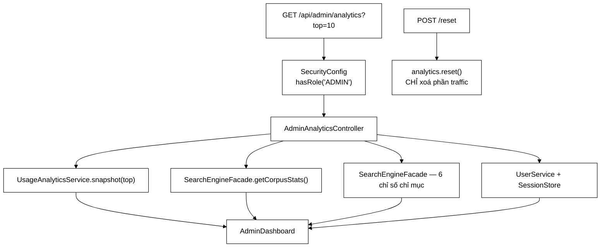

# AdminAnalyticsController — tách "quan sát" khỏi "điều khiển", vì một lý do chưa dùng tới

**File nguồn:** `search-engine/src/main/java/com/vnsearch/controller/AdminAnalyticsController.java` (116 dòng)
**Gói:** `com.vnsearch.controller` · **Loại:** `@RestController @RequestMapping("/api/admin/analytics") @Validated`
**Vị trí trong luồng:** nguồn dữ liệu cho bảng điều khiển quản trị của browser-app
**Đọc kèm:** [`../analytics/AdminDashboard.md`](../analytics/AdminDashboard.md) · [`../analytics/UsageAnalyticsService.md`](../analytics/UsageAnalyticsService.md) · [`EventController.md`](./EventController.md) · [`AdminController.md`](./AdminController.md)

---

## 📌 Hiểu trong 30 giây

Hai endpoint. Một gom số liệu từ **bốn nguồn** khác nhau, một xoá sạch phần
traffic.

```java
@GetMapping
public AdminDashboard dashboard(@RequestParam(defaultValue = "10")
                                 @Min(1) @Max(50) int top) {
    return new AdminDashboard(
            Instant.now(),
            analytics.snapshot(top),        // ① hành vi người dùng
            facade.getCorpusStats(),        // ② corpus
            new AdminDashboard.IndexStats(...),  // ③ chỉ mục
            accountStats());                 // ④ tài khoản
}
```



```
   ⭐ BỐN NGUỒN, VÀ CHÚNG CÓ BỐN VÒNG ĐỜI KHÁC NHAU:

   ① traffic  — trong RAM, XOÁ ĐƯỢC bằng /reset
   ② corpus   — dẫn xuất từ dữ liệu trên đĩa
   ③ chỉ mục  — dẫn xuất từ corpus
   ④ tài khoản— lưu bền trong users.json

   ⇒ Chỉ ① được /reset chạm tới, và Javadoc nói rõ vì sao:
     "khoi crawl va khoi chi muc la TRANG THAI DAN XUAT tu
      corpus, khong phai thu lop nay duoc phep vut di"
```

---

## 1. Tách khỏi `AdminController` — vì một lý do **chưa** dùng tới

Javadoc dòng 33–39:

> *"Lớp kia *điều khiển* hệ thống — chạy crawl, lập chỉ mục lại; lớp này chỉ *quan
> sát*. [...] Giữ chúng riêng để nếu sau này cần vai trò "chỉ đọc số liệu" (một
> người vận hành xem bảng nhưng không được phép khởi động crawl) thì chỉ việc đổi
> luật cho đúng đường dẫn này."*

```
   ⭐ TÁCH LỚP VÌ MỘT NHU CẦU TƯƠNG LAI THƯỜNG LÀ
     MỘT LÝ DO YẾU. Ở ĐÂY NÓ MẠNH, VÌ MỘT LÝ DO CỤ THỂ.

   Lý do yếu thường gặp:
     "biết đâu sau này cần" ⇒ trừu tượng hoá sớm
     ⇒ thêm phức tạp cho một nhu cầu không bao giờ tới

   Ở đây khác:
     việc tách KHÔNG tốn gì cả (hai lớp, không thêm
     giao diện, không thêm tầng)
     và nó mở ra một khả năng CỤ THỂ, DỄ HÌNH DUNG
     (vai trò "chỉ đọc"), chỉ bằng cách sửa MỘT dòng:

       .requestMatchers("/api/admin/analytics/**")
           .hasAnyRole("ADMIN", "VIEWER")

   ⇒ Phép thử: nếu gộp chung, việc thêm vai trò VIEWER
     đòi hỏi chuyển từ phân quyền theo TIỀN TỐ sang
     phân quyền theo TỪNG ENDPOINT.
   ⇒ Và ../config/SecurityConfig.md mục 2 đã chỉ ra rằng
     mỗi luật lẻ là một chỗ có thể quên.
```

```
   VÀ SỰ KHÁC BIỆT VỀ RỦI RO ĐƯỢC ĐỊNH LƯỢNG

   "mot sai sot o lop kia DI TAI NOI DUNG TU INTERNET VE,
    con o lop nay thi nhieu nhat la HIEN SAI MOT CON SO"

   ⇒ AdminController có ba lớp bảo vệ (API key,
     SeedUrlValidator, trần tài nguyên) — xem
     AdminController.md mục 2.
   ⇒ Lớp này chỉ cần một (API key) + một chặn trên `top`.

   ⇒ Mức bảo vệ tỷ lệ với mức rủi ro, và việc TÁCH LỚP
     là thứ cho phép hai mức đó khác nhau.
```

```
   ⚠️ NHƯNG /reset PHÁ VỠ SỰ PHÂN LOẠI ĐÓ

   Lớp này "chi QUAN SAT" — trừ POST /reset, một thao tác
   có hậu quả không hoàn tác được.

   ⇒ Với vai trò VIEWER giả định ở trên:
     .hasAnyRole("ADMIN", "VIEWER") cho cả tiền tố
     ⇒ VIEWER cũng XOÁ được số liệu

   ⇒ Tức là lý do tách lớp (mở đường cho vai trò chỉ đọc)
     bị chính endpoint thứ hai của lớp làm hỏng.
   ⇒ Không được nêu ở đâu. Xem đề xuất 1.
```

---

## 2. `@Max(50)` trên `top` — và ngoại lệ từng trả 500

Javadoc dòng 65–68:

> *"Chặn trên vì đây là tham số do bên gọi chọn và mỗi dòng thêm là một phần tử nữa
> phải tuần tự hoá; không chặn thì `?top=1000000` biến một endpoint hiển thị thành
> một phép cấp phát lớn."*

```
   VÌ SAO top=1000000 LÀ VẤN ĐỀ THẬT

   analytics.snapshot(top) dựng CÁC BẢNG XẾP HẠNG:
     - top truy vấn
     - top kết quả được bấm
     - ...

   Với top = 1.000.000:
     ⇒ mỗi bảng cố lấy 1 triệu dòng
     ⇒ dù dữ liệu thật chỉ có vài nghìn, việc cấp phát
       cấu trúc và tuần tự hoá vẫn tốn
     ⇒ và JSON trả về có thể hàng chục MB

   ⇒ Endpoint này cần ADMIN, nên đây không phải vector
     tấn công từ bên ngoài.
   ⇒ Nhưng một lỗi gõ (?top=100000 thay vì ?top=10) từ
     chính giao diện là chuyện xảy ra được.
```

```
   ⭐ VÀ CHÍNH LỚP NÀY LÀ NGUỒN CỦA MỘT LỖI ĐÃ ĐƯỢC SỬA
     Ở TỆP KHÁC.

   ../config/GlobalExceptionHandler.md mục 3 kể:
   "@RequestParam @Max(50) int top chang han, tren mot lop
    co @Validated" sinh ra ConstraintViolationException,
   và ngoại lệ đó từng rơi xuống nhánh bắt-tất-cả
   ⇒ trả 500 thay vì 400.

   ⇒ Người gọi gửi ?top=1000 nhận "loi he thong"
     kèm mã tham chiếu, trong khi lỗi là của họ.
   ⇒ Và cảnh báo 5xx kêu cho một chuyện không phải sự cố.

   ⇒ Tức là hai tệp ở hai gói khác nhau nối với nhau bằng
     một loại ngoại lệ, và mối nối đó chỉ được ghi ở
     MỘT phía.
```

```
   VÀ `lastNode` CŨNG SINH RA VÌ ENDPOINT NÀY

   GlobalExceptionHandler.lastNode() cắt "dashboard.top"
   thành "top".

   "dashboard" chính là TÊN PHƯƠNG THỨC ở dòng 71 của tệp này.

   ⇒ Không có phép cắt đó, người gọi nhận:
     "dashboard.top: top toi da 50"
   ⇒ vừa lộ tên phương thức nội bộ, vừa khó hiểu.

   ⇒ Một hàm bốn dòng ở gói config tồn tại vì hình dạng
     của một chữ ký phương thức ở gói controller.
```

---

## 3. `accountStats()` — bốn con số, ba lần duyệt

```java
private AdminDashboard.AccountStats accountStats() {
    List<User> all = users.findAll();
    return new AdminDashboard.AccountStats(
            all.size(),
            (int) all.stream().filter(user -> user.role() == Role.ADMIN).count(),
            (int) all.stream().filter(user -> !user.enabled()).count(),
            sessions.activeCount());
}
```

```
   HAI PHÉP DUYỆT RIÊNG BIỆT TRÊN CÙNG MỘT DANH SÁCH

   Với N tài khoản: O(2N) thay vì O(N).

   ⇒ Với vài chục tài khoản: hoàn toàn không đáng kể.
   ⇒ Việc gộp lại (một vòng lặp đếm cả hai) sẽ làm mã
     KHÓ ĐỌC hơn để đổi lấy một khoản tiết kiệm vô nghĩa.

   ⇒ Đây là ví dụ về một "tối ưu" ĐÚNG KHI KHÔNG LÀM.
   ⇒ Cùng tinh thần với ../config/RateLimitFilter.md mục 2,
     nơi một tối ưu CAS bị gỡ bỏ vì "không đo được".
```

```
   ⚠️ NHƯNG users.findAll() LÀ CHỖ ĐÁNG LO

   ../auth/JsonUserStore.md giữ toàn bộ tài khoản trong
   bộ nhớ, nên findAll() rẻ.

   ⇒ Đúng ở quy mô hiện tại.
   ⇒ Nhưng nếu kho tài khoản chuyển sang PostgreSQL
     (bước mà ../config/ImageStoreListener.md mục 4 đã
      nêu cho một kho khác), findAll() thành một truy vấn
      SELECT * — và nó chạy MỖI LẦN bảng điều khiển tải lại.

   ⇒ Ba con số này đều là phép ĐẾM, và CSDL đếm rẻ hơn
     nhiều so với tải toàn bộ hàng rồi đếm trong Java.
   ⇒ Ràng buộc "findAll phải rẻ" không được ghi ở đâu.
```

```
   sessions.activeCount() — MỘT ĐIỂM NHẤT QUÁN TỐT

   ../auth/SessionStore.md mục 2.6 nói activeSessions()
   "KHONG kem token".

   ⇒ Ở đây chỉ lấy activeCount() — một con số.
   ⇒ Không có cách nào token lọt vào bảng điều khiển.
   ⇒ Đúng nguyên tắc "bí mật chỉ tồn tại ở nơi nó được DÙNG"
     đã nêu ở AuthController.md mục 4.
```

---

## 4. Gom bốn nguồn — và cái giá không được nêu

```
   MỘT REQUEST, BỐN NGUỒN, KHÔNG CÓ XỬ LÝ LỖI NÀO

   analytics.snapshot(top)      — trong RAM, không ném
   facade.getCorpusStats()      — ?
   facade.getIndexedDocumentCount() ... — ?
   users.findAll()              — có thể chạm đĩa

   ⇒ Nếu MỘT nguồn ném ngoại lệ, TOÀN BỘ bảng điều khiển
     trả 500.
   ⇒ Người vận hành mất luôn cả ba khối còn lại — đúng
     lúc họ cần nhìn số liệu nhất (khi có gì đó đang hỏng).

   ⇒ Cùng khuôn lập luận với
     ../config/ImageStorePreloader.md mục 2:
     "mot tep anh hong co the keo sap ca phan tim kiem
      van ban"
   ⇒ Ở đó vấn đề được nhận ra và giải quyết bằng cách
     tách lớp. Ở đây thì không.
```

```
   ⚠️ VÀ SỐ LIỆU KHÔNG NHẤT QUÁN VỀ THỜI ĐIỂM

   Instant.now()                  ← thời điểm A
   analytics.snapshot(top)        ← thời điểm A + 1 ms
   facade.getCorpusStats()        ← thời điểm A + 3 ms
   users.findAll()                ← thời điểm A + 5 ms

   ⇒ Bốn khối được đọc ở bốn thời điểm khác nhau.
   ⇒ Với dữ liệu đổi chậm (corpus, tài khoản) thì vô hại.
   ⇒ Với traffic đang chạy, một sự kiện có thể được đếm
     ở khối này mà không ở khối kia.

   ⇒ Không quan trọng với một bảng điều khiển.
   ⇒ Nhưng `Instant.now()` ở đầu tạo ấn tượng rằng đây là
     một ẢNH CHỤP tại một thời điểm, và nó không phải vậy.
```

---

## 5. `POST /reset` — hai quyết định đúng trong một endpoint năm dòng

Javadoc dòng 100–109:

> *"Chỉ xoá phần *traffic*: khối crawl và khối chỉ mục là trạng thái dẫn xuất từ
> corpus, không phải thứ lớp này được phép vứt đi."*
>
> *"`POST` chứ không phải `GET`: đây là thao tác có hậu quả, và một thao tác có hậu
> quả **không được nằm sau một đường dẫn mà trình duyệt hay công cụ giám sát có thể
> gọi khi chỉ định đọc**."*

```
   ⭐ VẾ THỨ HAI NÊU ĐÚNG MỐI NGUY THẬT.

   Không phải "GET nên là read-only theo REST" (một lý do
   hình thức), mà là một mối nguy CỤ THỂ:

   Ai gọi GET mà không có ý định gây hậu quả?
     - trình duyệt tải trước (prefetch) một liên kết
     - bộ thu thập liên kết trong một công cụ giám sát
     - một bot kiểm tra liên kết hỏng
     - chính người dùng bấm nhầm rồi bấm F5

   ⇒ Với GET /api/admin/analytics/reset, chỉ cần ai đó
     dán liên kết đó vào một ô chat có tính năng xem trước
     là số liệu bị xoá.

   ⇒ Lý do hình thức ("REST nói vậy") không thuyết phục ai.
     Lý do cụ thể thì có.
```

```
   VÀ VÌ SAO CÓ NÚT NÀY

   "so lieu nam trong bo nho va MOT BUOI THU NGHIEM
    (hoac mot lan DEMO) lam lech han moi ti le"

   ⇒ Lý do rất thật với một đồ án: buổi bảo vệ trước hội đồng
     sẽ sinh ra hàng chục truy vấn thử, và chúng làm hỏng
     mọi con số thống kê.

   ⇒ Đây là loại tính năng chỉ xuất hiện khi người viết
     ĐÃ dùng chính hệ thống của mình.
```

```
   ⚠️ NHƯNG KHÔNG CÓ XÁC NHẬN, KHÔNG CÓ GHI LOG

   analytics.reset();
   return ResponseEntity.noContent().build();

   ⇒ Một lời gọi, dữ liệu biến mất, không dấu vết.
   ⇒ Không log ai đã xoá, lúc nào, xoá mất bao nhiêu.

   ⇒ Với AdminUserController.delete (xoá một tài khoản)
     cũng không log — nhưng ở đó dữ liệu còn trong
     users.json trước khi ghi đè.
   ⇒ Ở đây dữ liệu chỉ có trong RAM, nên xoá là VĨNH VIỄN.

   ⇒ Endpoint phá huỷ dữ liệu không hoàn tác được mà
     không ghi lại gì. Xem đề xuất 2.
```

---

## 6. Hướng dẫn thực hành

### 6.1 Lấy số liệu

```bash
curl -H "X-API-Key: $ADMIN_API_KEY" \
  'http://localhost:8080/api/admin/analytics?top=20' | jq

# Bon khoi:
#   .usage        — hanh vi nguoi dung (xoa duoc)
#   .corpus       — thong ke corpus
#   .index        — 6 chi so chi muc
#   .accounts     — 4 con so tai khoan

curl -X POST -H "X-API-Key: $ADMIN_API_KEY" \
  http://localhost:8080/api/admin/analytics/reset
# 204 — CHI xoa khoi .usage
```

### 6.2 Cạm bẫy

```
   ① ?top=100 → 400 "top toi da 50" (KHÔNG kẹp về 50).
     Khác hẳn SearchController, nơi tham số ngoài khoảng
     bị kẹp âm thầm. Hai triết lý trong cùng một gói.

   ② POST /reset xoá VĨNH VIỄN (dữ liệu chỉ có trong RAM),
     không xác nhận, không ghi log.

   ③ /reset CHỈ xoá khối traffic. Ba khối kia là dẫn xuất.

   ④ Một nguồn ném ngoại lệ ⇒ TOÀN BỘ bảng trả 500.

   ⑤ Instant.now() gợi ý một ảnh chụp tại một thời điểm,
     nhưng bốn khối được đọc ở bốn thời điểm khác nhau.

   ⑥ users.findAll() tải toàn bộ tài khoản mỗi lần bảng
     tải lại. Rẻ với JsonUserStore, không rẻ nếu chuyển
     sang CSDL.

   ⑦ Lớp này "chỉ quan sát" — trừ /reset, endpoint phá vỡ
     chính sự phân loại đó.
```

---

## 7. Độ phức tạp & chi phí

| Thao tác | Chi phí |
|---|---|
| `analytics.snapshot(top)` | $O(K \log K + top)$ với $K$ = số mục trong bảng thống kê |
| `facade.getCorpusStats()` | tuỳ `SearchEngineFacade` |
| Sáu chỉ số chỉ mục | $O(1)$ mỗi cái |
| `accountStats()` | $O(2N)$, $N$ = số tài khoản |
| `POST /reset` | $O(K)$ |

```
   PHÂN TÍCH — CHỖ ĐẮT NHẤT LÀ snapshot(top)

   Dựng bảng xếp hạng nghĩa là SẮP XẾP các mục theo số lần.
   ⇒ O(K log K) với K = số truy vấn phân biệt đã ghi

   Và K bị chặn bởi trần bộ nhớ của UsageAnalyticsService
   (điểm ③ trong ba lớp bảo vệ của EventController).

   ⇒ Nên chi phí này có trần, và đó là nhờ một quyết định
     ở lớp khác.

   ⚠️ Bảng điều khiển của browser-app có thể tự tải lại
     định kỳ. Nếu chu kỳ là 5 giây, endpoint này chạy
     sắp xếp + tuần tự hoá 12 lần mỗi phút.
   ⇒ Không có cơ chế nhớ đệm nào.
   ⇒ Với K vài nghìn thì vẫn rẻ, nhưng đây là chi phí
     LẶP LẠI cho dữ liệu gần như không đổi giữa hai lần.
```

---

## 8. Kiểm thử liên quan

| Tệp test | Kiểm gì |
|---|---|
| [`AnalyticsAuthorizationTest`](../../../../../test/java/com/vnsearch/analytics/AnalyticsAuthorizationTest.md) | Endpoint này cần `ROLE_ADMIN` |
| [`UsageAnalyticsServiceTest`](../../../../../test/java/com/vnsearch/analytics/UsageAnalyticsServiceTest.md) | `snapshot`, `reset` |
| [`CorpusStatsTest`](../../../../../test/java/com/vnsearch/analytics/CorpusStatsTest.md) | Khối thống kê corpus |

```
   ⭐ ĐÂY LÀ CONTROLLER ĐƯỢC PHỦ TỐT NHẤT TRONG CẢ GÓI.

   Ba tệp test chạm tới: phân quyền, lớp dịch vụ chính,
   và một trong bốn khối dữ liệu.
```

```
   NHỮNG TÍNH CHẤT VẪN CHƯA ĐƯỢC CANH GIỮ

   ✗ ?top=51 → 400 (KHÔNG phải 500)
     — đây chính là ca đã từng trả 500, và phép sửa
       nằm ở GlobalExceptionHandler chứ không ở đây,
       nên không gì ngăn nó tái diễn

   ✗ ?top=0 → 400
   ✗ Không truyền top → mặc định 10

   ✗ Thông báo lỗi là "top: ..." chứ KHÔNG phải
     "dashboard.top: ..." — mối nối với lastNode()

   ✗ POST /reset CHỈ xoá khối usage, ba khối kia còn nguyên
     — đây là bất biến quan trọng nhất của /reset

   ✗ GET /api/admin/analytics/reset → 405, không xoá gì
     — bảo vệ chống prefetch/bot

   ⇒ Sáu tính chất; hai trong số đó (400 thay vì 500,
     và 405 cho GET) bảo vệ chống những chuyện đã hoặc
     có thể xảy ra thật.
```

---

## 9. Chấm theo chuẩn doanh nghiệp

| Tiêu chí | Điểm | Nhận xét |
|---|---|---|
| **Tách "quan sát" khỏi "điều khiển"** | 10/10 | Tách không tốn gì, mở ra một khả năng cụ thể (vai trò chỉ đọc) chỉ bằng cách sửa một dòng luật |
| **Không nhắc lại luật phân quyền** | 10/10 | *"Mỗi lần nhắc lại là một chỗ nữa có thể quên khi luật đổi"* |
| **Lý do `POST` thay `GET` là mối nguy cụ thể** | 10/10 | Không viện dẫn REST mà nêu đúng người gọi vô ý: prefetch, bot, công cụ giám sát |
| **`/reset` chỉ xoá phần được phép xoá** | 10/10 | Phân biệt trạng thái **dẫn xuất** với trạng thái **sở hữu** — ranh giới thẩm quyền của một lớp |
| Định lượng khác biệt rủi ro giữa hai lớp | 9/10 | *"Đi tải nội dung từ Internet về"* so với *"hiện sai một con số"* — cơ sở để hai mức bảo vệ khác nhau |
| Chặn trên `top` kèm lý do | 9/10 | Nêu đúng cơ chế (mỗi dòng là một phần tử phải tuần tự hoá), không chỉ tuyên bố "để an toàn" |
| Không "tối ưu" hai phép duyệt thành một | 9/10 | Một tối ưu đúng khi **không** làm — cùng tinh thần với việc gỡ CAS ở `RateLimitFilter` |
| Chỉ lấy `activeCount()`, không lấy phiên | 9/10 | Không có cách nào token lọt vào bảng điều khiển |
| Kiểm thử | 7/10 | Controller được phủ tốt nhất gói; nhưng ca `?top=51 → 400` — ca đã từng hỏng — vẫn không có test |
| **`/reset` không ghi log gì** | **3/10** | Dữ liệu chỉ có trong RAM nên xoá là **vĩnh viễn**, và không ai biết ai đã xoá, lúc nào, mất bao nhiêu |
| **`/reset` phá vỡ chính sự phân loại của lớp** | **4/10** | Lý do tách lớp là mở đường cho vai trò "chỉ đọc", mà endpoint thứ hai lại không phải chỉ đọc |
| Một nguồn hỏng ⇒ cả bảng 500 | 5/10 | Người vận hành mất cả ba khối còn lại đúng lúc cần nhìn số liệu nhất |
| `Instant.now()` gợi ý một ảnh chụp | 6/10 | Bốn khối đọc ở bốn thời điểm; vô hại nhưng nhãn thời gian đang hứa nhiều hơn thực tế |
| Ràng buộc "`findAll()` phải rẻ" không được ghi | 6/10 | Ba con số đều là phép đếm; chuyển kho tài khoản sang CSDL biến nó thành `SELECT *` mỗi lần tải bảng |
| Không có nhớ đệm | 6/10 | Bảng tự tải lại định kỳ ⇒ sắp xếp + tuần tự hoá lặp lại cho dữ liệu gần như không đổi |

**Ba đề xuất nâng lên mức sản phẩm:**

1. **Đưa `/reset` ra khỏi tiền tố "chỉ quan sát", hoặc ghi rõ ngoại lệ.** Javadoc
   biện minh việc tách lớp bằng khả năng cấp một vai trò "chỉ đọc số liệu" chỉ bằng
   cách đổi luật cho tiền tố `/api/admin/analytics/**` — nhưng luật đó sẽ trao cho
   vai trò ấy cả quyền **xoá sạch** số liệu, làm hỏng chính lý do tách:
   ```java
   // Trong SecurityConfig — luat CU THE phai dat TRUOC luat tien to
   .requestMatchers(HttpMethod.POST, "/api/admin/analytics/reset").hasRole("ADMIN")
   .requestMatchers("/api/admin/analytics/**").hasAnyRole("ADMIN", "VIEWER")
   ```
   Kèm một dòng trong Javadoc của `reset()` nói rõ nó là **ngoại lệ** của phân loại
   "chỉ quan sát", để người sửa luật sau này không vô tình gộp nó lại. Đây đúng là
   loại "luật lẻ" mà Javadoc lớp cảnh báo — nhưng ở đây nó **bắt buộc**, và việc
   thừa nhận sự căng thẳng đó tốt hơn là để nó ngầm.

2. **Ghi log mọi lần `/reset`.** Đây là endpoint duy nhất trong dự án phá huỷ dữ
   liệu **không hoàn tác được** (số liệu chỉ tồn tại trong RAM), và nó không để lại
   dấu vết nào — nên câu hỏi *"vì sao bảng điều khiển về 0 lúc 3 giờ chiều?"* hiện
   không có cách nào trả lời:
   ```java
   @PostMapping("/reset")
   public ResponseEntity<Void> reset(Authentication authentication) {
       UsageSnapshot truoc = analytics.snapshot(0);   // chi lay cac con so tong
       analytics.reset();
       // So lieu chi ton tai trong RAM nen xoa la VINH VIEN — khong co ban sao nao
       // de doi chieu sau. Dong log nay la thu duy nhat con lai de tra loi cau hoi
       // "vi sao bang dieu khien ve 0 luc 3 gio chieu".
       log.warn("Da XOA SACH so lieu su dung theo yeu cau cua '{}': "
                       + "{} phien, {} luot tim kiem, {} luot bam bi xoa vinh vien.",
               authentication == null ? "api-key" : authentication.getName(),
               truoc.totalSessions(), truoc.totalSearches(), truoc.totalClicks());
       return ResponseEntity.noContent().build();
   }
   ```
   Mức `warn` là chủ ý: đây không phải thao tác thường ngày, và nó xứng đáng nổi bật
   trong log.

3. **Test ca `?top=51` — ca đã từng trả 500.** Phép sửa cho ngoại lệ này nằm ở
   [`GlobalExceptionHandler`](../config/GlobalExceptionHandler.md), tức là ở một gói
   khác, nên không gì ngăn ai đó gỡ handler ấy đi (nó trông như một handler thừa nếu
   không biết lịch sử) và tái tạo nguyên vẹn lỗi cũ:
   ```java
   @WebMvcTest(AdminAnalyticsController.class)
   @AutoConfigureMockMvc(addFilters = false)
   @Import(GlobalExceptionHandler.class)     // BAT BUOC: loi nam o cho noi hai lop
   class AdminAnalyticsControllerTest {

       @Autowired MockMvc mockMvc;
       @MockBean UsageAnalyticsService analytics;
       @MockBean SearchEngineFacade facade;
       @MockBean UserService users;
       @MockBean SessionStore sessions;

       @Test
       void topVuotTranPhaiTra400ChuKhongPhai500() throws Exception {
           mockMvc.perform(get("/api/admin/analytics").param("top", "51"))
                  .andExpect(status().isBadRequest())
                  // "top", KHONG phai "dashboard.top" — GlobalExceptionHandler.lastNode
                  .andExpect(jsonPath("$.message").value(startsWith("top:")));
       }

       @Test
       void getVaoResetPhaiTra405() throws Exception {
           mockMvc.perform(get("/api/admin/analytics/reset"))
                  .andExpect(status().isMethodNotAllowed());
           verify(analytics, never()).reset();
       }
   }
   ```
   Dòng `@Import(GlobalExceptionHandler.class)` là phần quan trọng nhất: lỗi cũ nằm
   ở **chỗ nối** giữa hai lớp, nên một test chỉ dựng controller sẽ bỏ lọt nó y hệt
   như lần đầu.

---

## 10. Liên kết

- Hình dạng dữ liệu trả về: [`../analytics/AdminDashboard.md`](../analytics/AdminDashboard.md) · [`../analytics/UsageSnapshot.md`](../analytics/UsageSnapshot.md) · [`../analytics/CorpusStats.md`](../analytics/CorpusStats.md)
- Lớp dịch vụ cung cấp khối traffic: [`../analytics/UsageAnalyticsService.md`](../analytics/UsageAnalyticsService.md)
- Chiều **ghi** của cùng dữ liệu, công khai: [`EventController.md`](./EventController.md)
- Lớp "điều khiển" mà tệp này cố tình tách khỏi: [`AdminController.md`](./AdminController.md)
- Nguồn của khối chỉ mục và khối corpus: [`../service/SearchEngineFacade.md`](../service/SearchEngineFacade.md)
- Nguồn của khối tài khoản: [`../auth/UserService.md`](../auth/UserService.md) · [`../auth/SessionStore.md`](../auth/SessionStore.md)
- Bảng phân quyền mà lớp này thừa hưởng: [`../config/SecurityConfig.md`](../config/SecurityConfig.md)
- Nơi `ConstraintViolationException` của `@Max` được xử lý, và hàm `lastNode` sinh ra vì tệp này: [`../config/GlobalExceptionHandler.md`](../config/GlobalExceptionHandler.md) mục 3 và mục 5
- Cùng lập luận "một phần hỏng không được kéo sập phần khác": [`../config/ImageStorePreloader.md`](../config/ImageStorePreloader.md) mục 2
