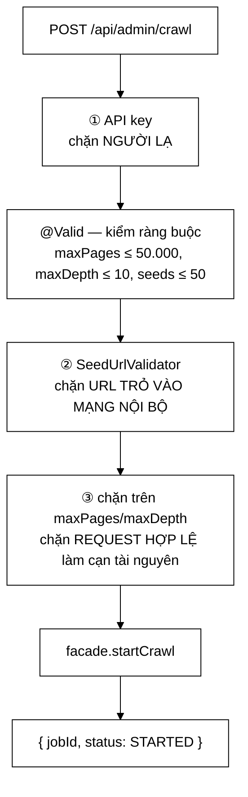

# AdminController — ba lớp bảo vệ, và endpoint từng là một lỗ hổng SSRF đầy đủ

**File nguồn:** `search-engine/src/main/java/com/vnsearch/controller/AdminController.java` (119 dòng)
**Gói:** `com.vnsearch.controller` · **Loại:** `@RestController @RequestMapping("/api/admin") @Validated`
**Vị trí trong luồng:** cửa điều khiển crawler — `POST /crawl`, `GET /crawl/{id}/status`, `POST /reindex`, `GET /stats`
**Đọc kèm:** [`../crawler/SeedUrlValidator.md`](../crawler/SeedUrlValidator.md) · [`../config/SecurityConfig.md`](../config/SecurityConfig.md) · [`../config/ApiKeyAuthFilter.md`](../config/ApiKeyAuthFilter.md) · [`../service/CrawlJobManager.md`](../service/CrawlJobManager.md)

---

## 📌 Hiểu trong 30 giây

Javadoc dòng 27–31 nói thẳng vì sao endpoint này khác mọi endpoint khác:

> *"Trước đây chúng mở hoàn toàn, và vì `POST /crawl` khiến máy chủ đi tải một URL
> **tuỳ ý** rồi đưa nội dung vào chỉ mục **công khai**, đó là một lỗ hổng SSRF đầy
> đủ chứ không chỉ là "API không có xác thực"."*



```
   ⭐ BA LỚP, VÀ MỖI LỚP CHẶN MỘT THỨ KHÁC NHAU.

   ① API key           → người lạ
   ② SeedUrlValidator  → URL nội bộ, KỂ CẢ khi có khoá đúng
   ③ chặn trên tham số → request hợp lệ làm cạn tài nguyên

   Điểm mấu chốt của lớp ②: nó KHÔNG tin người đã qua lớp ①.
   "khoa co the ro ri, va mot phep SAI SOT cua chinh nguoi
    van hanh cung khong nen tai duoc metadata dam may"
```

---

## 1. Vì sao đây là SSRF, không phải chỉ "thiếu xác thực"

```
   CHUỖI TẤN CÔNG ĐẦY ĐỦ KHI CHƯA CÓ BẢO VỆ

   ① POST /api/admin/crawl
      { "seedUrls": ["http://169.254.169.254/latest/meta-data/iam/
                      security-credentials/"] }

   ② Máy chủ (đang chạy trong đám mây) TỰ đi tải URL đó
      ⇒ 169.254.169.254 là endpoint metadata của AWS/GCP/Azure
      ⇒ chỉ truy cập được TỪ BÊN TRONG máy ảo
      ⇒ trả về khoá truy cập tạm thời của vai trò IAM

   ③ Nội dung được đưa vào CHỈ MỤC CÔNG KHAI

   ④ GET /api/search?q=AccessKeyId
      ⇒ kẻ tấn công đọc được khoá đám mây

   ⇒ Không cần vào được máy chủ.
   ⇒ Không cần khai thác lỗi bộ nhớ nào.
   ⇒ Chỉ cần gọi ĐÚNG một API hoàn toàn hợp lệ.
```

```
   VÌ SAO "MÁY CHỦ TỰ ĐI TẢI" LÀ ĐIỂM MẤU CHỐT

   Kẻ tấn công ở ngoài Internet KHÔNG gọi được:
     - 169.254.169.254 (metadata đám mây)
     - 10.0.0.0/8, 172.16/12, 192.168/16 (mạng nội bộ)
     - localhost:5432 (PostgreSQL), localhost:9092 (Kafka)
     - localhost:8080/api/admin/* (chính nó!)

   Nhưng MÁY CHỦ thì gọi được tất cả.

   ⇒ SSRF biến máy chủ thành một proxy có đặc quyền mạng.
   ⇒ Và ở đây nó còn tệ hơn proxy: kết quả được LƯU LẠI
     và phơi ra qua một endpoint công khai.

   ⇒ Đây là lý do lớp ② tồn tại ĐỘC LẬP với lớp ①.
```

---

## 2. Ba lớp bảo vệ — và vì sao lớp ② không tin lớp ①

Javadoc dòng 33–41:

| Lớp | Chặn gì | Lý do tồn tại riêng |
|---|---|---|
| ① API key | người lạ | xác thực cơ bản |
| ② `SeedUrlValidator` | URL trỏ vào mạng nội bộ | *"khoá có thể rò rỉ, và một phép sai sót của chính người vận hành cũng không nên tải được metadata đám mây"* |
| ③ chặn trên `maxPages`/`maxDepth` | request **hợp lệ** làm cạn tài nguyên | người có quyền vẫn gõ nhầm được |

```
   ⭐ CÂU BIỆN MINH CHO LỚP ② LÀ CÂU HAY NHẤT CỦA TỆP.

   "mot phep SAI SOT cua chinh nguoi van hanh cung khong nen
    tai duoc metadata dam may"

   ⇒ Nó thừa nhận rằng mối đe doạ không chỉ đến từ
     KẺ ĐỊCH mà còn từ NGƯỜI DÙNG HỢP PHÁP.
   ⇒ Người vận hành dán nhầm một URL, hoặc thử
     "http://localhost:8080" để xem crawler có chạy không.

   ⇒ Đây là khác biệt giữa "phòng thủ theo chiều sâu"
     hiểu đúng và hiểu sai:
     Hiểu sai: "thêm nhiều lớp cho chắc"
     Hiểu đúng: "mỗi lớp chặn một MÔ HÌNH ĐE DOẠ khác nhau"
```

```
   KIỂM CHỨNG: BỎ TỪNG LỚP THÌ MẤT GÌ

   Bỏ ①: người lạ crawl được ⇒ SSRF + tốn tài nguyên
   Bỏ ②: người có khoá (hoặc khoá bị rò) đọc được
         mạng nội bộ ⇒ SSRF vẫn còn nguyên
   Bỏ ③: người có khoá gõ maxPages=100000000
         ⇒ máy chủ chạy tới hết bộ nhớ

   ⇒ Không lớp nào thay được lớp nào.
   ⇒ Đó là phép thử để biết một kiến trúc nhiều lớp
     có thật sự nhiều lớp hay chỉ là lặp lại.
```

---

## 3. Kiểm SSRF **trước** khi vào hàng đợi

```java
// Kiem tra SSRF cho TUNG seed truoc khi khoi dong job: mot seed xau
// khong duoc phep di vao hang doi roi moi bi phat hien.
for (String seedUrl : request.seedUrls()) {
    SeedUrlValidator.validate(seedUrl);
}
```

```
   VÌ SAO THỜI ĐIỂM QUAN TRỌNG

   Kiểm SAU khi vào hàng đợi:
     ① 50 seed vào frontier
     ② crawler bắt đầu chạy, tải seed 1..19
     ③ seed 20 bị chặn
     ⇒ job ĐÃ chạy, ĐÃ crawl 19 trang
     ⇒ trạng thái nửa vời: huỷ job? giữ 19 trang đã crawl?
     ⇒ và nếu bộ kiểm nằm trong crawler, một seed xấu
       có thể đã được TẢI trước khi bị kiểm

   Kiểm TRƯỚC:
     ⇒ hoặc TOÀN BỘ job chạy, hoặc KHÔNG GÌ chạy
     ⇒ ném ngoại lệ ⇒ GlobalExceptionHandler → 400
     ⇒ người gọi biết ngay seed nào sai

   ⇒ Đây là tính "toàn phần hoặc không" (all-or-nothing)
     áp cho một thao tác không có giao dịch.
```

```
   ⚠️ NHƯNG VÒNG LẶP NÀY DỪNG Ở SEED SAI ĐẦU TIÊN

   SeedUrlValidator.validate ném ngay khi gặp seed xấu.

   ⇒ Người gửi 50 seed với 3 seed sai phải sửa và gửi lại
     BA LẦN.
   ⇒ Đối lập với cách @Valid xử lý:
     MethodArgumentNotValidException gom MỌI trường sai
     (xem ../config/GlobalExceptionHandler.md).

   ⇒ Hai cơ chế hợp thức hoá trong CÙNG một phương thức,
     hai hành vi báo lỗi khác nhau.
   ⇒ Xem đề xuất 2.
```

---

## 4. `MAX_PAGES_LIMIT = 50.000` — và lối thoát được chỉ ra

Javadoc dòng 49–56:

> *"Trước đây không có trần nào: `maxPages` chỉ bị `CrawlConfig` kiểm tra là `> 0`,
> nên một request với `maxPages=100000000` được chấp nhận và chạy cho tới khi hết
> bộ nhớ. Muốn crawl lớn hơn trần này thì dùng `MultiDomainCrawlRunner` từ dòng
> lệnh — nơi người chạy **chịu trách nhiệm trực tiếp** và **nhìn thấy tiến độ**,
> chứ không phải qua một lời gọi HTTP rồi bỏ đi."*

```
   ⭐ ĐẶT TRẦN KÈM MỘT LỐI THOÁT LÀ ĐIỀU HIẾM THẤY.

   Trần không kèm lối thoát ⇒ người dùng bị chặn
   ⇒ họ sẽ tìm cách lách (sửa hằng số, gọi nhiều lần)
   ⇒ và cách lách đó KHÔNG được kiểm soát

   Trần kèm lối thoát ⇒ nhu cầu lớn được chuyển sang
   một kênh PHÙ HỢP HƠN với nó.

   Và lý do kênh kia phù hợp hơn được nêu cụ thể:
     "nguoi chay CHIU TRACH NHIEM TRUC TIEP va NHIN THAY
      TIEN DO, chu khong phai qua mot loi goi HTTP roi BO DI"

   ⇒ Sự khác biệt không phải kỹ thuật (cùng mã crawler).
   ⇒ Nó là về TRÁCH NHIỆM và KHẢ NĂNG QUAN SÁT.
```

```
   VÌ SAO "GỌI HTTP RỒI BỎ ĐI" LÀ VẤN ĐỀ THẬT

   POST /api/admin/crawl trả về NGAY với một jobId.
   ⇒ Job chạy nền, có thể hàng giờ.
   ⇒ Người gọi đóng terminal, đi về.
   ⇒ Không ai theo dõi.
   ⇒ Nếu nó ăn hết RAM, nó ăn hết RAM của MÁY CHỦ ĐANG
     PHỤC VỤ TÌM KIẾM.

   Với MultiDomainCrawlRunner:
   ⇒ chạy ở một tiến trình riêng
   ⇒ người chạy nhìn thanh tiến độ
   ⇒ Ctrl+C dừng được
   ⇒ hết RAM thì chết tiến trình ĐÓ, không chết máy chủ

   ⇒ Đây là lập luận về CÔ LẬP TÀI NGUYÊN, và nó mạnh hơn
     lập luận về trách nhiệm.
   ⇒ Nhưng Javadoc chỉ nêu lập luận thứ hai.
```

```
   ⚠️ BA HẰNG SỐ, MỘT CÓ JAVADOC

   MAX_PAGES_LIMIT = 50_000   ← Javadoc 8 dòng
   MAX_DEPTH_LIMIT = 10       ← không có gì
   MAX_SEEDS       = 50       ← không có gì

   Với maxDepth, con số 10 đáng được giải thích hơn cả:
   số trang tăng theo HÀM MŨ theo độ sâu.
   Với ~50 liên kết ra mỗi trang, depth=10 nghĩa là
   50^10 ≈ 10^17 trang khả dĩ.

   ⇒ Tức là maxDepth=10 là một trần gần như VÔ NGHĨA —
     maxPages=50.000 mới là thứ thật sự chặn.
   ⇒ Điều đó đúng và ổn, nhưng một người đọc sẽ tưởng
     hai trần này tương đương nhau.
```

---

## 5. `@Validated` + `@Valid` — và điều nó kéo theo

```java
@RestController
@RequestMapping("/api/admin")
@Validated                          // ← cho tham so phuong thuc
public class AdminController {

    public record CrawlRequest(
            @NotEmpty(message = "seedUrls khong duoc de rong")
            @Size(max = MAX_SEEDS, message = "Toi da " + MAX_SEEDS + " seed URL moi lan")
            List<String> seedUrls, ...) {}

    @PostMapping("/crawl")
    public Map<String, String> crawl(@Valid @RequestBody CrawlRequest request) { ... }
```

```
   THÔNG BÁO LỖI ĐƯỢC VIẾT BẰNG TIẾNG VIỆT VÀ CỤ THỂ

   "Toi da 50 seed URL moi lan"
   "maxPages toi da 50000"

   ⇒ Không dùng thông báo mặc định của Bean Validation
     ("size must be between 0 and 50")
   ⇒ Người gọi biết CHÍNH XÁC giới hạn là bao nhiêu

   ⚠️ Nhưng chúng không nói LÀM GÌ TIẾP.
   ⇒ Javadoc CÓ nêu lối thoát (MultiDomainCrawlRunner),
     nhưng lối thoát đó không tới được người gọi API —
     họ chỉ thấy "maxPages toi da 50000".
   ⇒ Xem đề xuất 3.
```

```
   VÀ @Validated TRÊN LỚP CHÍNH LÀ NGUYÊN NHÂN CỦA MỘT LỖI
   ĐÃ ĐƯỢC SỬA Ở CHỖ KHÁC

   ../config/GlobalExceptionHandler.md mục 3 kể:
   ConstraintViolationException (do @Validated sinh ra trên
   THAM SỐ phương thức) từng rơi xuống nhánh bắt-tất-cả
   và trả 500 thay vì 400.

   ⇒ Lớp này là một trong những nơi sinh ra ngoại lệ đó.
   ⇒ Hai tệp ở hai gói khác nhau, nối với nhau bằng một
     loại ngoại lệ — và mối nối đó không được ghi ở
     tệp nào.
```

---

## 6. Bốn endpoint, bốn mức chăm sóc

| Endpoint | Hợp thức hoá | Xử lý lỗi | Javadoc |
|---|---|---|---|
| `POST /crawl` | `@Valid` + SSRF + trần | ngoại lệ → 400 | đầy đủ |
| `GET /crawl/{id}/status` | không | `null` → 404 | không |
| `POST /reindex` | không | `throws IOException` → 500 | không |
| `GET /stats` | không | không | không |

```
   ⚠️ POST /reindex LÀ ENDPOINT ĐÁNG LO NHẤT

   public Map<String, String> reindex() throws IOException {
       facade.reindex();
       return Map.of("status", "OK");
   }

   ① Nó CHẶN cho tới khi reindex xong
     ⇒ với 30.017 tài liệu, có thể ~40 giây
     ⇒ giữ một luồng phục vụ HTTP suốt thời gian đó
     ⇒ client có thể timeout, nhưng reindex VẪN chạy tiếp
     ⇒ người gọi không biết nó thành công hay không

   ② Không có bảo vệ chống gọi ĐỒNG THỜI
     ⇒ hai request reindex cùng lúc?
     ⇒ hành vi tuỳ SearchEngineFacade, không ghi ở đây

   ③ Đối lập hoàn toàn với POST /crawl — endpoint kia
     trả jobId ngay và cho tra trạng thái

   ⇒ Hai thao tác nặng, hai mô hình bất đồng bộ khác nhau,
     trong cùng một lớp, không lời giải thích.
```

```
   GET /stats TRẢ THẲNG facade.getStats()

   public Map<String, Object> stats() {
       return facade.getStats();
   }

   ⇒ Bất kỳ trường nào facade thêm vào sẽ TỰ ĐỘNG phơi ra
     qua API.
   ⇒ Endpoint này cần ADMIN nên rủi ro thấp.
   ⇒ Nhưng nó là một hợp đồng API được định nghĩa ở
     MỘT LỚP KHÁC, và không ai kiểm soát nó ở đây.
```

---

## 7. Hướng dẫn thực hành

### 7.1 Khởi động một phiên crawl

```bash
curl -X POST http://localhost:8080/api/admin/crawl \
  -H "X-API-Key: $ADMIN_API_KEY" \
  -H "Content-Type: application/json" \
  -d '{"seedUrls":["https://vnexpress.net"],"maxDepth":2,"maxPages":500}'
# { "jobId": "a3f9...", "status": "STARTED" }

curl -H "X-API-Key: $ADMIN_API_KEY" \
  http://localhost:8080/api/admin/crawl/a3f9.../status
```

### 7.2 Đọc mã lỗi

```
   400 + "seedUrls khong duoc de rong"     → @NotEmpty
   400 + "maxPages toi da 50000"           → @Max
   400 + thông báo của SeedUrlValidator    → SSRF bị chặn
   401                                     → thiếu/sai X-API-Key
   404 (GET status)                        → jobId không tồn tại
   429                                     → RateLimitFilter
   500 + mã tham chiếu (POST /reindex)     → IOException
```

### 7.3 Cạm bẫy

```
   ① SeedUrlValidator dừng ở seed SAI ĐẦU TIÊN.
     Gửi 50 seed với 3 seed sai ⇒ phải sửa ba lần.

   ② maxDepth=10 là trần gần như vô nghĩa (tăng theo hàm mũ).
     maxPages mới là thứ thật sự chặn.

   ③ POST /reindex CHẶN tới khi xong (~40 giây với corpus
     hiện tại). Client timeout không dừng được nó.

   ④ Không có bảo vệ chống hai reindex đồng thời.

   ⑤ Giá trị mặc định (maxDepth=3, maxPages=100) nằm trong
     THÂN HÀM dưới dạng số trần, không phải hằng số có tên —
     trái ngược với ba trần ngay phía trên.

   ⑥ GET /stats trả thẳng facade.getStats() — hợp đồng API
     do lớp khác định nghĩa.

   ⑦ Ở chế độ Kafka, luật lọc URL đến từ cấu hình triển khai
     chứ không từ request này. Xem
     ../config/KafkaCrawlConfig.md mục 7.
```

---

## 8. Độ phức tạp & chi phí

| Thao tác | Chi phí |
|---|---|
| `POST /crawl` | $O(S)$ kiểm seed, $S \le 50$ — trả về **ngay** |
| `GET /crawl/{id}/status` | $O(1)$ tra bảng |
| `POST /reindex` | $O(D \times L)$ — **chặn**, $D$ = số tài liệu |
| `GET /stats` | tuỳ `SearchEngineFacade` |

```
   PHÂN TÍCH — HAI THAO TÁC NẶNG, HAI MÔ HÌNH

   POST /crawl:
     controller trả về sau ~vài mili-giây
     job chạy nền hàng giờ
     ⇒ BẤT ĐỒNG BỘ, có jobId, tra được trạng thái

   POST /reindex:
     controller chặn ~40 giây
     ⇒ ĐỒNG BỘ, không có cách theo dõi

   ⇒ Chi phí của reindex thấp hơn crawl RẤT NHIỀU
     (không có I/O mạng), nên chọn đồng bộ là hợp lý.
   ⇒ Nhưng 40 giây vẫn vượt xa timeout mặc định của
     nhiều client HTTP (30 giây là phổ biến).
   ⇒ Ranh giới "bao lâu thì phải bất đồng bộ" không được
     bàn tới, và 40 giây nằm ngay tại ranh giới đó.
```

---

## 9. Kiểm thử liên quan

| Tệp test | Kiểm gì |
|---|---|
| [`SsrfProtectionTest`](../../../../../test/java/com/vnsearch/crawler/SsrfProtectionTest.md) | `SeedUrlValidator` — lớp bảo vệ ② |
| [`CrawlStatusTest`](../../../../../test/java/com/vnsearch/service/CrawlStatusTest.md) | Mô hình trạng thái job |

```
   ⚠️ KHÔNG CÓ TEST NÀO CHO CHÍNH CONTROLLER.

   SsrfProtectionTest test SeedUrlValidator độc lập —
   nó KHÔNG kiểm rằng controller CÓ GỌI validator đó.

   ⇒ Xoá vòng lặp validate ở dòng 90-92 sẽ làm mọi test
     hiện có VẪN XANH, và mở lại lỗ hổng SSRF.
```

```
   NHỮNG TÍNH CHẤT KHÔNG ĐƯỢC CANH GIỮ

   ✗ POST /crawl với seed trỏ vào 169.254.169.254 → 400
     — đây là bất biến bảo mật quan trọng nhất của cả tệp,
       và việc mất nó KHÔNG gây triệu chứng nào

   ✗ Seed xấu KHÔNG được vào hàng đợi (không có job nào
     được tạo khi validate thất bại)

   ✗ maxPages > 50.000 → 400 với thông báo nêu đúng trần
   ✗ maxDepth > 10 → 400
   ✗ Quá 50 seed → 400
   ✗ seedUrls rỗng → 400

   ✗ Mọi endpoint dưới /api/admin cần X-API-Key → 401 nếu thiếu
     — nối với bảng phân quyền của SecurityConfig

   ✗ jobId không tồn tại → 404, không phải 500

   ⇒ Tám tính chất; tất cả kiểm được bằng một lớp
     @WebMvcTest, và tính chất đầu tiên là thứ phân biệt
     một hệ thống an toàn với một proxy có đặc quyền mạng.
```

---

## 10. Liên kết

- Lớp bảo vệ ② — chặn SSRF: [`../crawler/SeedUrlValidator.md`](../crawler/SeedUrlValidator.md)
- Lớp bảo vệ ① — khoá API và so sánh hằng thời gian: [`../config/ApiKeyAuthFilter.md`](../config/ApiKeyAuthFilter.md)
- Bảng phân quyền cho `/api/admin/**`: [`../config/SecurityConfig.md`](../config/SecurityConfig.md)
- Nơi job crawl được quản lý và tra trạng thái: [`../service/CrawlJobManager.md`](../service/CrawlJobManager.md) · [`../service/CrawlStatus.md`](../service/CrawlStatus.md)
- Lớp điều phối được uỷ nhiệm: [`../service/SearchEngineFacade.md`](../service/SearchEngineFacade.md)
- Lối thoát cho crawl quy mô lớn: [`../crawler/MultiDomainCrawlRunner.md`](../crawler/MultiDomainCrawlRunner.md)
- Cấu hình một phiên crawl: [`../crawler/CrawlConfig.md`](../crawler/CrawlConfig.md)
- Nơi `ConstraintViolationException` do `@Validated` sinh ra được xử lý: [`../config/GlobalExceptionHandler.md`](../config/GlobalExceptionHandler.md) mục 3
- Ở chế độ Kafka, luật lọc đến từ cấu hình triển khai chứ không từ request: [`../config/KafkaCrawlConfig.md`](../config/KafkaCrawlConfig.md) mục 7
- Endpoint quản trị anh em: [`AdminUserController.md`](./AdminUserController.md) · [`AdminAnalyticsController.md`](./AdminAnalyticsController.md)
