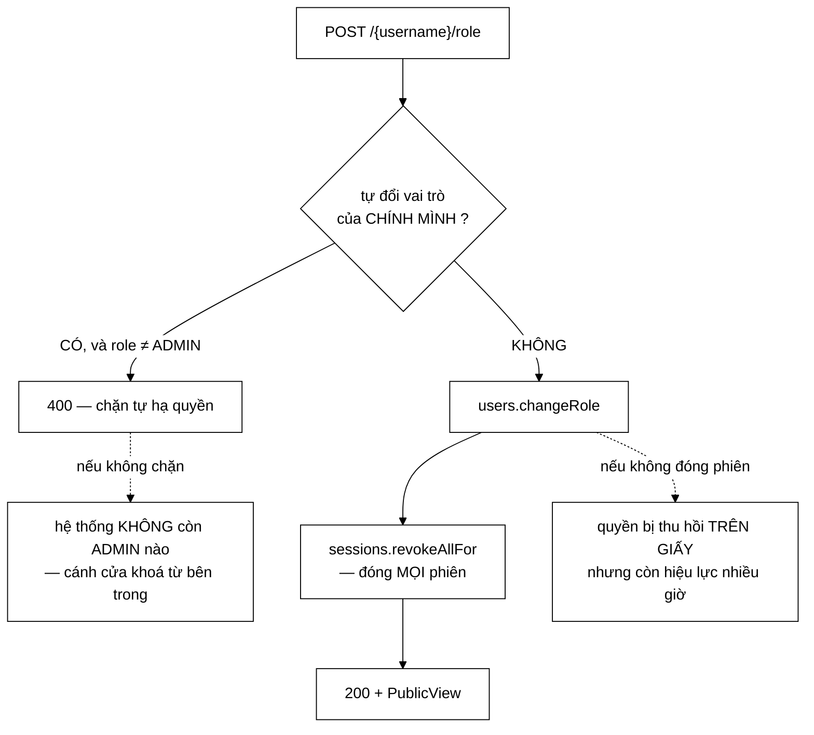

# AdminUserController — "một cánh cửa khoá từ bên trong", và quyền bị thu hồi trên giấy

**File nguồn:** `search-engine/src/main/java/com/vnsearch/controller/AdminUserController.java` (127 dòng)
**Gói:** `com.vnsearch.controller` · **Loại:** `@RestController @RequestMapping("/api/admin/users")`
**Vị trí trong luồng:** quản lý tài khoản — liệt kê, đổi vai trò, khoá/mở, xoá
**Đọc kèm:** [`../auth/UserService.md`](../auth/UserService.md) · [`../auth/SessionStore.md`](../auth/SessionStore.md) · [`../auth/User.md`](../auth/User.md) · [`../auth/Role.md`](../auth/Role.md) · [`../config/SecurityConfig.md`](../config/SecurityConfig.md)

---

## 📌 Hiểu trong 30 giây

Javadoc dòng 25–26 nói điều quan trọng nhất về lớp này:

> *"Nằm dưới `/api/admin/**` nên thừa hưởng nguyên luật phân quyền của
> `SecurityConfig`; **không có một dòng kiểm tra quyền nào trong lớp này**."*

Nhưng nó **có** hai bảo vệ khác — đến từ nghiệp vụ, không từ phân quyền:

```java
// ① Khong tu ha quyen chinh minh
if (authentication != null && authentication.getName().equalsIgnoreCase(username)
        && request.role() != Role.ADMIN) {
    return ResponseEntity.badRequest().build();
}

User updated = users.changeRole(username, request.role());

// ② Doi vai tro => dong MOI phien cua nguoi do
sessions.revokeAllFor(updated.username());
```



```
   ⭐ HAI MŨI TÊN ĐỨT NÉT LÀ HAI LOẠI LỖI KHÁC HẲN NHAU:

   ① "cánh cửa khoá từ bên trong"
     ⇒ mất khả năng VẬN HÀNH, không mất bảo mật
     ⇒ hỏng ỒN ÀO (phát hiện ngay)

   ② "quyền bị thu hồi trên giấy"
     ⇒ mất BẢO MẬT, không mất khả năng vận hành
     ⇒ hỏng IM LẶNG (giao diện báo thành công)

   ⇒ Loại ② nguy hiểm hơn nhiều, và nó là loại mà
     phần lớn hệ thống bỏ sót.
```

---

## 1. "Một cánh cửa khoá từ bên trong"

Javadoc dòng 31–35:

> *"Nếu người quản trị cuối cùng hạ vai trò của chính họ, hệ thống không còn ADMIN
> nào và **không ai nâng lại được** — một cánh cửa khoá từ bên trong. (Khoá API vẫn
> là lối vào dự phòng, nhưng **dựa vào lối dự phòng cho một thao tác thường ngày là
> thiết kế tồi**.)"*

```
   VÌ SAO ĐÂY LÀ MỘT BẾ TẮC THẬT

   Chỉ ADMIN mới gọi được POST /api/admin/users/{ten}/role
   ⇒ Không còn ADMIN nào ⇒ không ai gọi được endpoint đó
   ⇒ Không ai tạo ra được ADMIN mới

   Và AuthConfig.bootstrapAdmin KHÔNG cứu được:
   nó chỉ TẠO tài khoản mới, không đổi vai trò tài khoản
   đã tồn tại (xem ../config/AuthConfig.md mục 4).

   ⇒ Đường thoát duy nhất: sửa tay data/users.json.
```

```
   ⭐ DẤU NGOẶC ĐƠN LÀ PHẦN ĐÁNG HỌC NHẤT.

   "Khoa API van la loi vao du phong, nhung DUA VAO LOI
    DU PHONG CHO MOT THAO TAC THUONG NGAY LA THIET KE TOI."

   Lập luận này ngăn đúng một phản biện rất hợp lý:
     "Không sao, vẫn còn X-API-Key mà."

   Vì sao phản biện đó sai:
     ① Khoá API là cơ chế cho CÔNG CỤ, không cho người
       (xem ../config/ApiKeyAuthFilter.md mục 2)
     ② Nó không có danh tính ⇒ mọi hành động ghi log
       thành "admin-api-key", mất khả năng truy vết
     ③ Nếu ai cũng dùng nó cho việc thường ngày, nó sẽ
       được chia sẻ rộng ⇒ mất luôn giá trị bảo mật
     ④ Một lối thoát hiểm được dùng hàng ngày thì
       không còn là lối thoát hiểm

   ⇒ Nguyên tắc: cơ chế dự phòng phải hiếm khi được dùng,
     nếu không nó trở thành cơ chế chính và thừa hưởng
     mọi nhược điểm của việc đó.
```

```
   ⚠️ NHƯNG PHÉP CHẶN NÀY KHÔNG ĐỦ

   Điều kiện hiện tại: "không tự hạ quyền CHÍNH MÌNH"

   Nó KHÔNG chặn:
     - ADMIN A hạ quyền ADMIN B
     - rồi ADMIN B (đã bị hạ) không làm gì được
     - rồi A hạ quyền... không, A không tự hạ được

   Nhưng với HAI admin:
     A hạ B → còn A
     ⇒ A không tự hạ được ⇒ vẫn còn ít nhất một ADMIN ✓

   Và với XOÁ:
     A xoá B → còn A
     A không tự xoá được ✓

   ⇒ Bất biến "luôn còn ít nhất một ADMIN" ĐƯỢC giữ,
     nhưng nó được giữ một cách GIÁN TIẾP.
   ⇒ Có một kẽ hở: disable.
     A khoá B (setEnabled false), rồi... A vẫn không tự
     khoá được. ✓

   ⇒ Bất biến đúng, nhưng nó là hệ quả của ba phép chặn
     riêng lẻ chứ không được phát biểu ở đâu. Xem đề xuất 1.
```

---

## 2. Thu hồi phiên — "quyền bị thu hồi trên giấy"

Javadoc dòng 36–39:

> *"Không làm vậy thì người vừa bị hạ vẫn giữ một phiên mang vai trò ADMIN cho tới
> khi phiên hết hạn — tức là quyền bị thu hồi **trên giấy** nhưng còn hiệu lực thêm
> nhiều giờ."*

```
   VÌ SAO PHIÊN GIỮ VAI TRÒ CŨ

   ../auth/SessionStore.md: phiên lưu (username, role)
   tại thời điểm ĐĂNG NHẬP.

   TokenAuthFilter đọc vai trò TỪ PHIÊN, không tra lại
   UserStore mỗi request.

   ⇒ Đó là quyết định về HIỆU NĂNG (tránh tra kho tài khoản
     mỗi request).
   ⇒ Cái giá: vai trò trong phiên là một BẢN SAO, và bản sao
     có thể lỗi thời.

   ⇒ Mọi hệ thống dùng token có trạng thái đều có đánh đổi này.
   ⇒ Với JWT thì còn tệ hơn: KHÔNG THU HỒI ĐƯỢC.
     Đó chính là lý do ../auth/SessionStore.md giải thích
     vì sao dự án này cố tình KHÔNG dùng JWT.
```

```
   ⭐ ĐÂY LÀ CHỖ MỘT QUYẾT ĐỊNH KIẾN TRÚC ĐƯỢC HOÀN VỐN.

   SessionStore.md lập luận: không dùng JWT vì cần
   thu hồi được.

   Ba dòng ở đây là NƠI DUY NHẤT trong toàn bộ dự án mà
   khả năng thu hồi đó thật sự được dùng tới:

     sessions.revokeAllFor(updated.username());

   ⇒ Một quyết định kiến trúc chỉ chứng minh được giá trị
     khi có một chỗ CẦN nó.
   ⇒ Nếu không có ba dòng này, lập luận chống JWT sẽ chỉ
     là lý thuyết.
```

```
   VÀ ĐÓNG PHIÊN CẢ KHI *NÂNG* QUYỀN

   // Dong phien ca khi NANG quyen: phien cu mang vai tro cu,
   // nen nguoi vua duoc nang se khong hieu vi sao van bi 401
   // — bat dang nhap lai la hanh vi de hieu hon.

   ⇒ Về BẢO MẬT, nâng quyền không cần đóng phiên.
   ⇒ Về TRẢI NGHIỆM, không đóng thì:
     người vừa được nâng lên ADMIN bấm vào menu quản trị
     ⇒ 403
     ⇒ họ nghĩ "chưa được nâng"
     ⇒ đi hỏi lại người quản trị
     ⇒ người kia kiểm tra: "tôi nâng rồi mà"
     ⇒ cả hai bối rối

   ⇒ Đóng phiên biến một trạng thái KHÓ HIỂU thành một
     yêu cầu RÕ RÀNG ("hãy đăng nhập lại").
   ⇒ Nhất quán hai chiều dễ giải thích hơn tối ưu một chiều.
```

---

## 3. Bốn phép chặn "tự thao tác lên chính mình" — và một chỗ thiếu

| Endpoint | Chặn tự thao tác? | Đóng phiên? |
|---|---|---|
| `POST /{username}/role` | **có** (chỉ khi hạ xuống non-ADMIN) | **có** |
| `POST /{username}/disable` | **có** | **có** |
| `POST /{username}/enable` | không cần | **không** |
| `DELETE /{username}` | **có** | **có** |

```
   ⭐ enable KHÔNG CẦN CẢ HAI, VÀ ĐÓ LÀ ĐÚNG.

   Không cần chặn tự thao tác:
     tự mở khoá cho chính mình? Nếu đang bị khoá thì
     đã không đăng nhập được để gọi endpoint này.
     ⇒ tình huống không xảy ra được

   Không cần đóng phiên:
     enable là NỚI quyền (từ "không dùng được" sang
     "dùng được"). Phiên cũ... nhưng người bị khoá
     không có phiên nào (disable đã đóng hết).
     ⇒ không có phiên cũ để đóng

   ⇒ Ba endpoint kia đều đối xứng, endpoint này bất đối xứng
     một cách CÓ LÝ.
   ⇒ Nhưng lý do đó không được ghi, nên nó trông giống
     một thiếu sót.
```

```
   ⚠️ MỘT KHÁC BIỆT TINH TẾ Ở changeRole

   if (... equalsIgnoreCase(username) && request.role() != Role.ADMIN)

   ⇒ Điều kiện có THÊM vế `&& role != ADMIN`
   ⇒ Nghĩa là: tự đổi vai trò của mình THÀNH ADMIN
     (tức là giữ nguyên) thì ĐƯỢC PHÉP

   Vì sao: đó là thao tác vô hại (không đổi gì).

   ⚠️ Nhưng nó VẪN gọi sessions.revokeAllFor!
   ⇒ Một ADMIN "đổi vai trò của mình thành ADMIN"
     sẽ bị ĐĂNG XUẤT khỏi mọi thiết bị.
   ⇒ Một thao tác không đổi gì lại có tác dụng phụ đáng kể.

   ⇒ Không nguy hiểm, nhưng là hành vi gây bất ngờ,
     và không ai lường trước.
```

```
   VÀ equalsIgnoreCase — MỘT LỰA CHỌN ĐÚNG

   authentication.getName().equalsIgnoreCase(username)

   Nếu dùng equals():
     tài khoản "Admin" gọi POST /api/admin/users/admin/role
     ⇒ "Admin".equals("admin") = false
     ⇒ phép chặn KHÔNG kích hoạt
     ⇒ tự hạ quyền thành công

   ⇒ Chỉ đúng nếu UserService cũng coi tên là không phân
     biệt hoa thường. Nếu nó phân biệt, thì "Admin" và
     "admin" là HAI tài khoản, và equalsIgnoreCase sẽ
     chặn NHẦM.

   ⇒ Tính đúng ở đây phụ thuộc vào một quy ước ở lớp khác,
     và quy ước đó không được nhắc tới.
   ⇒ Cùng loại phụ thuộc ngầm mà SearchController.md mục 1
     lên án.
```

---

## 4. `User.PublicView` — không bao giờ trả hash mật khẩu

```java
/** Danh sách tài khoản — dạng công khai, KHÔNG có hash mật khẩu. */
@GetMapping
public List<User.PublicView> list() {
    return users.findAll().stream().map(User::toPublic).toList();
}
```

```
   VÌ SAO MỘT KIỂU RIÊNG THAY VÌ @JsonIgnore

   Cách thường thấy:
     public class User {
         @JsonIgnore private String passwordHash;
     }
   ⇒ Bảo vệ bằng CHÚ GIẢI
   ⇒ Quên đánh dấu một trường mới ⇒ nó lọt ra ngay
   ⇒ Và không có gì báo

   Cách ở đây:
     record PublicView(...)  — chỉ chứa trường an toàn
     User.toPublic()         — phép chuyển đổi tường minh
   ⇒ Bảo vệ bằng KIỂU DỮ LIỆU
   ⇒ Thêm trường vào User KHÔNG tự động phơi ra
   ⇒ Muốn phơi phải sửa PublicView — một hành động CÓ Ý THỨC

   ⇒ Cùng nguyên tắc với ../config/SearchConfig.md mục 1:
     làm cho lỗi KHÔNG BIỂU DIỄN ĐƯỢC, thay vì
     "cẩn thận hơn".
```

```
   ⚠️ NHƯNG DANH SÁCH NÀY KHÔNG PHÂN TRANG

   users.findAll().stream()...toList()

   ⇒ Trả TOÀN BỘ tài khoản trong một phản hồi.
   ⇒ Với vài chục tài khoản của một đồ án: không sao.
   ⇒ Với vài nghìn: phản hồi hàng MB, và JsonUserStore
     phải đọc/giữ toàn bộ trong bộ nhớ.

   ⇒ Đây là giới hạn quy mô cùng loại với
     ../config/ImageStoreListener.md mục 4, nhưng ở đây
     nó KHÔNG được ghi ra.
```

---

## 5. `DELETE` chứ không phải `POST /delete`

Javadoc dòng 103–105:

> *"Phương thức HTTP mô tả đúng việc đang làm, và nó là *idempotent*: gọi hai lần
> cho cùng một tên thì lần sau trả `404` chứ không gây thêm hậu quả nào."*

```
   TÍNH IDEMPOTENT — VÌ SAO NÓ THẬT SỰ QUAN TRỌNG Ở ĐÂY

   Mạng chớp ⇒ client không biết request có tới không
   ⇒ client thử lại

   Với POST /delete không idempotent:
     lần 1: xoá "an" ✓
     lần 2 (thử lại): xoá... ai? Nếu có ai đó vừa tạo
     tài khoản "an" mới thì xoá NHẦM người đó.

   Với DELETE:
     lần 1: 204 No Content
     lần 2: 404 Not Found
   ⇒ Client biết chắc: đã xoá rồi.
   ⇒ Không hậu quả phụ.

   ⚠️ Nhưng lưu ý mã trả về KHÁC nhau giữa hai lần.
     Idempotent nói về TÁC DỤNG PHỤ, không về PHẢN HỒI.
     Một client thử lại tự động sẽ thấy 404 và có thể
     báo lỗi — dù thao tác đã thành công.
```

```
   VÀ MỘT HỆ QUẢ Ở TẦNG CẤU HÌNH

   DELETE là phương thức DUY NHẤT ngoài GET/POST trong
   toàn bộ API.

   ⇒ Nó phải có mặt trong CorsConfig.allowedMethods.
   ⇒ Bình luận trong ../config/CorsConfig.md mục 4 kể lại:
     nó ĐÃ BỊ QUÊN một lần, và triệu chứng là
     "endpoint không dùng được từ giao diện, log máy chủ
      sạch, curl vẫn 200".

   ⇒ Tức là chính endpoint này đã gây ra một trong hai
     sự cố CORS được ghi trong dự án.
```

```
   THỨ TỰ THAO TÁC TRONG delete() — ĐÚNG

   if (!users.delete(username)) return notFound();   // ① xoá
   sessions.revokeAllFor(username);                   // ② đóng phiên
   return noContent();

   ⇒ Xoá trước, đóng phiên sau.
   ⇒ Nếu ngược lại: đóng phiên rồi xoá thất bại
     ⇒ người dùng bị đăng xuất nhưng tài khoản còn nguyên
     ⇒ trạng thái nửa vời

   ⇒ Với thứ tự hiện tại, thất bại ở bước ① không gây
     tác dụng phụ nào.

   ⚠️ Nhưng thất bại ở bước ② (sau khi ① thành công) để lại
     đúng trạng thái mà Javadoc dòng 111-113 nói "không nên
     tồn tại": token cũ tra ra phiên hợp lệ mang vai trò cũ,
     trong khi tài khoản đã biến mất.
   ⇒ Không có giao dịch nào bao hai bước này.
```

---

## 6. Hướng dẫn thực hành

### 6.1 Quản lý tài khoản

```bash
TOKEN=<token phien admin>

# Liet ke
curl -H "Authorization: Bearer $TOKEN" \
  http://localhost:8080/api/admin/users

# Nang len ADMIN (nguoi do se bi dang xuat, phai dang nhap lai)
curl -X POST -H "Authorization: Bearer $TOKEN" -H "Content-Type: application/json" \
  -d '{"role":"ADMIN"}' \
  http://localhost:8080/api/admin/users/an/role

# Khoa tam
curl -X POST -H "Authorization: Bearer $TOKEN" \
  http://localhost:8080/api/admin/users/an/disable

# Xoa han
curl -X DELETE -H "Authorization: Bearer $TOKEN" \
  http://localhost:8080/api/admin/users/an
```

### 6.2 Cạm bẫy

```
   ① Đổi vai trò ⇒ người đó bị ĐĂNG XUẤT khỏi mọi thiết bị,
     kể cả khi NÂNG quyền.

   ② Tự đổi vai trò của mình thành ADMIN (không đổi gì)
     VẪN làm bạn bị đăng xuất.

   ③ Không tự hạ quyền / khoá / xoá chính mình được — 400.
     Thông báo lỗi RỖNG (badRequest().build()), nên người
     dùng không biết vì sao.

   ④ Bất biến "luôn còn ít nhất một ADMIN" được giữ GIÁN TIẾP
     qua ba phép chặn riêng lẻ, không được phát biểu ở đâu.

   ⑤ GET danh sách KHÔNG phân trang.

   ⑥ DELETE gọi hai lần: 204 rồi 404. Client thử lại tự động
     có thể hiểu nhầm là thất bại.

   ⑦ equalsIgnoreCase giả định UserService coi tên tài khoản
     là không phân biệt hoa thường. Nếu không, phép chặn
     có thể sai cả hai chiều.

   ⑧ DELETE là phương thức duy nhất ngoài GET/POST — nó phải
     có trong CorsConfig, và nó ĐÃ từng bị quên.
```

---

## 7. Độ phức tạp & chi phí

| Thao tác | Chi phí |
|---|---|
| `GET /` | $O(N)$ với $N$ = số tài khoản, **không phân trang** |
| `POST /{u}/role` | $O(1)$ + ghi tệp + $O(S)$ thu hồi phiên |
| `DELETE /{u}` | $O(1)$ + ghi tệp + $O(S)$ thu hồi phiên |

```
   PHÂN TÍCH — revokeAllFor LÀ THAO TÁC ĐẮT NHẤT

   ../auth/SessionStore.md: revokeAllFor duyệt TOÀN BỘ
   bảng phiên bằng Iterator để tìm phiên của một người.

   ⇒ O(S) với S = tổng số phiên đang hoạt động
   ⇒ Với MAX_SESSIONS (xem SessionStore.md mục 2.3),
     S bị chặn trên

   ⇒ Không phải vấn đề ở quy mô này, và thao tác đổi vai trò
     rất hiếm.

   ⚠️ Chi phí thật là GHI TỆP: JsonUserStore ghi lại TOÀN BỘ
     tệp users.json mỗi lần đổi một trường.
   ⇒ O(N) I/O cho một thay đổi O(1).
   ⇒ Xem ../auth/JsonUserStore.md.
```

---

## 8. Kiểm thử liên quan

| Tệp test | Kiểm gì |
|---|---|
| [`AccountAuthorizationTest`](../../../../../test/java/com/vnsearch/auth/AccountAuthorizationTest.md) | Phân quyền quanh các endpoint tài khoản |
| [`UserServiceTest`](../../../../../test/java/com/vnsearch/auth/UserServiceTest.md) | `changeRole`, `setEnabled`, `delete` |
| [`SessionStoreTest`](../../../../../test/java/com/vnsearch/auth/SessionStoreTest.md) | `revokeAllFor` |

```
   ⚠️ BA TỆP TEST, VÀ KHÔNG TỆP NÀO KIỂM ĐIỀU QUAN TRỌNG NHẤT:
     RẰNG changeRole CÓ GỌI revokeAllFor.

   Cả hai lớp được test kỹ, riêng lẻ.
   Việc NỐI chúng lại — bảo vệ ② của Javadoc — thì không.

   ⇒ Xoá dòng sessions.revokeAllFor sẽ làm mọi test hiện có
     VẪN XANH, và tạo ra đúng lỗ hổng "quyền bị thu hồi
     trên giấy" mà Javadoc mô tả.

   ⇒ Cùng khuôn khoảng trống với AdminController.md mục 9
     (SeedUrlValidator được test, việc GỌI nó thì không).
```

```
   NHỮNG TÍNH CHẤT KHÔNG ĐƯỢC CANH GIỮ

   ✗ changeRole → revokeAllFor được gọi
   ✗ disable    → revokeAllFor được gọi
   ✗ delete     → revokeAllFor được gọi
     — ba lần cùng một bất biến bảo mật

   ✗ Tự hạ quyền chính mình → 400, và vai trò KHÔNG đổi
   ✗ Tự khoá chính mình → 400
   ✗ Tự xoá chính mình → 400
   ✗ Tự đổi thành ADMIN (không đổi gì) → cho phép

   ✗ GET / không bao giờ chứa passwordHash trong JSON
     — bảo vệ bằng kiểu, nhưng một lần thêm trường vào
       PublicView có thể phá nó

   ✗ DELETE hai lần → 204 rồi 404
   ✗ Luôn còn ít nhất một ADMIN sau mọi chuỗi thao tác

   ⇒ Mười tính chất; ba tính chất đầu là bảo mật, và
     cả ba đều mất đi mà không gây triệu chứng nào.
```

---

## 9. Chấm theo chuẩn doanh nghiệp

| Tiêu chí | Điểm | Nhận xét |
|---|---|---|
| **"Quyền bị thu hồi trên giấy nhưng còn hiệu lực nhiều giờ"** | 10/10 | Nêu đúng loại lỗ hổng mà phần lớn hệ thống bỏ sót, và sửa nó bằng ba dòng |
| **"Một cánh cửa khoá từ bên trong"** | 10/10 | Hình ảnh chính xác, kèm phản biện được chặn sẵn trong dấu ngoặc đơn |
| **"Dựa vào lối dự phòng cho thao tác thường ngày là thiết kế tồi"** | 10/10 | Ngăn đúng phản biện hợp lý nhất, bằng một nguyên tắc dùng lại được |
| **Không có dòng kiểm quyền nào trong lớp** | 10/10 | Thừa hưởng trọn vẹn bảng phân quyền — đúng lợi ích của phân quyền theo tiền tố đường dẫn |
| Đóng phiên cả khi **nâng** quyền | 10/10 | Ưu tiên nhất quán hai chiều hơn tối ưu một chiều, kèm lý do về trải nghiệm cụ thể |
| `User.PublicView` — bảo vệ bằng kiểu | 10/10 | Thêm trường vào `User` không tự động phơi ra; lỗi trở nên **không biểu diễn được** |
| `DELETE` với lý do idempotent | 9/10 | Phương thức mô tả đúng việc, và tính idempotent được giải thích chứ không chỉ tuyên bố |
| **Không test mối nối `changeRole → revokeAllFor`** | **0/10** | Xoá dòng đó ⇒ mọi test vẫn xanh, và lỗ hổng mà Javadoc mô tả quay lại nguyên vẹn |
| **`badRequest().build()` — thân rỗng** | **3/10** | Người quản trị nhận 400 trống trơn, không biết vì sao; ba chỗ đều vậy |
| Bất biến "luôn còn một ADMIN" không được phát biểu | 4/10 | Được giữ **gián tiếp** qua ba phép chặn riêng lẻ; không ai kiểm, không ai ghi |
| Tự đổi thành ADMIN vẫn bị đăng xuất | 5/10 | Thao tác không đổi gì lại có tác dụng phụ đáng kể — hành vi gây bất ngờ |
| `GET /` không phân trang | 5/10 | Trả toàn bộ tài khoản; giới hạn quy mô không được ghi ra |
| `equalsIgnoreCase` dựa vào quy ước ở lớp khác | 5/10 | Tính đúng phụ thuộc việc `UserService` coi tên là không phân biệt hoa thường — không nhắc tới |
| Không giao dịch bao "xoá + thu hồi phiên" | 6/10 | Thất bại ở bước hai để lại đúng trạng thái mà Javadoc nói "không nên tồn tại" |

**Ba đề xuất nâng lên mức sản phẩm:**

1. **Test mối nối giữa hai lớp — thứ mà cả ba tệp test hiện có đều bỏ trống.**
   `UserService` và `SessionStore` đều được test kỹ **riêng lẻ**; điều Javadoc gọi
   là bảo vệ ② lại nằm ở chỗ chúng được **gọi cùng nhau**, và không gì canh giữ
   điều đó:
   ```java
   @WebMvcTest(AdminUserController.class)
   @AutoConfigureMockMvc(addFilters = false)
   class AdminUserControllerTest {

       @Autowired MockMvc mockMvc;
       @MockBean UserService users;
       @MockBean SessionStore sessions;

       @Test
       void haQuyenPhaiDongMOIphienCuaNguoiDo() throws Exception {
           when(users.changeRole("an", Role.USER)).thenReturn(nguoiDung("an", Role.USER));

           mockMvc.perform(post("/api/admin/users/an/role")
                          .contentType(APPLICATION_JSON).content("{\"role\":\"USER\"}")
                          .with(user("quantri")))
                  .andExpect(status().isOk());

           verify(sessions).revokeAllFor("an");   // ← bat bien BAO MAT
       }

       @ParameterizedTest
       @CsvSource({"disable,", "role,{\"role\":\"USER\"}"})
       void khongTuHaQuyenHoacKhoaChinhMinh(String duong, String than) throws Exception {
           mockMvc.perform(post("/api/admin/users/quantri/" + duong)
                          .contentType(APPLICATION_JSON).content(than == null ? "" : than)
                          .with(user("quantri")))
                  .andExpect(status().isBadRequest());

           verifyNoInteractions(users);   // KHONG duoc cham toi kho tai khoan
       }

       @Test
       void danhSachKhongBaoGioChuaHashMatKhau() throws Exception {
           when(users.findAll()).thenReturn(List.of(nguoiDungCoHash("an")));
           mockMvc.perform(get("/api/admin/users"))
                  .andExpect(content().string(not(containsString("$2a$"))))   // tien to BCrypt
                  .andExpect(jsonPath("$[0].passwordHash").doesNotExist());
       }
   }
   ```

2. **Trả lý do thay vì `badRequest().build()` rỗng.** Ba chỗ chặn tự thao tác đều
   trả 400 với thân **trống trơn**, nên người quản trị thấy giao diện báo lỗi mà
   không biết vì sao — và lý do ở đây là một quyết định thiết kế đáng giải thích,
   không phải một lỗi dữ liệu:
   ```java
   if (authentication != null && authentication.getName().equalsIgnoreCase(username)
           && request.role() != Role.ADMIN) {
       throw new IllegalArgumentException(
               "Khong the tu ha vai tro cua chinh minh. Neu nguoi quan tri cuoi cung"
                       + " ha quyen chinh ho, he thong khong con ADMIN nao va khong ai"
                       + " nang lai duoc. Hay nho MOT quan tri vien KHAC thuc hien"
                       + " thao tac nay.");
   }
   ```
   Ném `IllegalArgumentException` để [`GlobalExceptionHandler`](../config/GlobalExceptionHandler.md)
   dựng thân JSON đúng khuôn chung — hiện `badRequest().build()` tạo ra một **hình
   dạng lỗi thứ ba** trong API, bên cạnh khuôn của handler và khuôn tự dựng của
   [`RateLimitFilter`](../config/RateLimitFilter.md).

3. **Phát biểu và canh giữ bất biến "luôn còn ít nhất một ADMIN".** Bất biến này
   hiện đúng, nhưng đúng **gián tiếp** — nó là hệ quả tình cờ của ba phép chặn "tự
   thao tác" riêng lẻ, và không ở đâu nói ra rằng đó mới là thứ thật sự cần bảo vệ.
   Một thay đổi hợp lý trong tương lai (thêm endpoint xoá hàng loạt, hoặc nới phép
   chặn tự thao tác) sẽ phá nó mà không ai nhận ra:
   ```java
   /**
    * Kiem tra bat bien: he thong LUON con it nhat mot ADMIN dang hoat dong.
    *
    * <p>Ba phep chan "tu thao tac len chinh minh" o cac endpoint tren giu duoc
    * bat bien nay mot cach GIAN TIEP, va do la mot su trung hop khong ben:
    * chung chan theo DANH TINH nguoi goi, con dieu can bao ve la mot tinh chat
    * cua TOAN BO kho tai khoan.
    */
   private void baoDamConAdmin(String usernameSapBiAnhHuong) {
       long conLai = users.findAll().stream()
               .filter(u -> u.role() == Role.ADMIN && u.enabled())
               .filter(u -> !u.username().equalsIgnoreCase(usernameSapBiAnhHuong))
               .count();
       if (conLai == 0) {
           throw new IllegalArgumentException(
                   "Thao tac nay se lam he thong khong con quan tri vien nao dang hoat"
                           + " dong — mot canh cua khoa tu ben trong. Hay nang mot tai"
                           + " khoan khac len ADMIN truoc.");
       }
   }
   ```
   Gọi nó ở cả ba endpoint (`role` khi hạ xuống non-ADMIN, `disable`, `delete`) thay
   cho phép so tên hiện tại: phép kiểm mới **bao trùm** phép cũ (tự hạ quyền khi là
   admin duy nhất vẫn bị chặn) và đồng thời chặn được ca mà phép cũ bỏ lọt —
   admin A hạ quyền admin B khi B là người duy nhất còn `enabled`.

---

## 10. Liên kết

- Lớp thực hiện `changeRole`/`setEnabled`/`delete`: [`../auth/UserService.md`](../auth/UserService.md)
- Kho phiên và `revokeAllFor` — khả năng mà lớp này hoàn vốn cho: [`../auth/SessionStore.md`](../auth/SessionStore.md)
- `PublicView` và phép chuyển đổi tường minh: [`../auth/User.md`](../auth/User.md)
- Kiểu vai trò: [`../auth/Role.md`](../auth/Role.md)
- Kho tài khoản, nơi mỗi thay đổi ghi lại toàn bộ tệp: [`../auth/JsonUserStore.md`](../auth/JsonUserStore.md)
- Bảng phân quyền mà lớp này thừa hưởng: [`../config/SecurityConfig.md`](../config/SecurityConfig.md)
- Nơi tài khoản quản trị đầu tiên ra đời, và vì sao nó không cứu được bế tắc ở mục 1: [`../config/AuthConfig.md`](../config/AuthConfig.md) mục 4
- Sự cố CORS do chính `DELETE` của endpoint này gây ra: [`../config/CorsConfig.md`](../config/CorsConfig.md) mục 4
- Lối vào dự phòng được nhắc tới trong dấu ngoặc đơn: [`../config/ApiKeyAuthFilter.md`](../config/ApiKeyAuthFilter.md)
- Cùng khoảng trống "lớp được test, việc gọi nó thì không": [`AdminController.md`](./AdminController.md) mục 9
