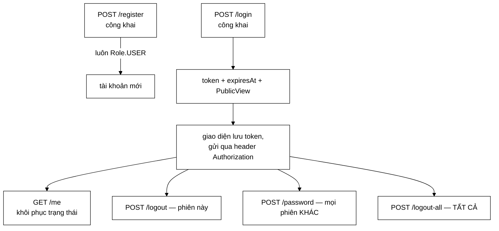

# AuthController — bốn cách đăng xuất, và mỗi cách ứng với một nỗi lo khác nhau

**File nguồn:** `search-engine/src/main/java/com/vnsearch/controller/AuthController.java` (216 dòng — controller dài nhất dự án)
**Gói:** `com.vnsearch.controller` · **Loại:** `@RestController @RequestMapping("/api/auth")`
**Vị trí trong luồng:** cửa vào của tầng tài khoản — đăng ký, đăng nhập, đăng xuất, đổi mật khẩu, "tôi là ai"
**Đọc kèm:** [`../auth/UserService.md`](../auth/UserService.md) · [`../auth/SessionStore.md`](../auth/SessionStore.md) · [`../auth/TokenAuthFilter.md`](../auth/TokenAuthFilter.md) · [`../config/SecurityConfig.md`](../config/SecurityConfig.md)

---

## 📌 Hiểu trong 30 giây

Sáu endpoint, và **ba trong sáu** đều là biến thể của "đóng phiên" — mỗi biến thể
ứng với một nỗi lo khác nhau.

| Endpoint | Đóng phiên nào | Nỗi lo tương ứng |
|---|---|---|
| `POST /logout` | **phiên hiện tại** | "tôi rời máy này" |
| `POST /password` | **mọi phiên khác** | "có người khác đang dùng tài khoản tôi" |
| `POST /logout-all` | **tất cả, kể cả phiên này** | "phiên của tôi bị lộ ở đâu đó tôi không nhớ" |



```
   ⭐ CẢ BA THAO TÁC ĐÓNG PHIÊN CHỈ TỒN TẠI ĐƯỢC VÌ MỘT
     QUYẾT ĐỊNH KIẾN TRÚC: TOKEN CÓ TRẠNG THÁI.

   Với JWT, không cái nào trong ba làm được:
     - JWT không thu hồi được
     - "đăng xuất" chỉ là xoá token ở phía client
     - kẻ đã cắp token vẫn dùng được tới khi hết hạn

   ⇒ ../auth/SessionStore.md lập luận vì sao KHÔNG dùng JWT.
   ⇒ Lớp này là nơi lập luận đó được hoàn vốn ba lần.
```

---

## 1. Token trong thân phản hồi, không trong cookie

Javadoc dòng 33–38:

> *"Cookie sẽ được trình duyệt *tự động* đính kèm vào mọi request tới máy chủ, và
> chính tính tự động đó là thứ làm nên tấn công CSRF — lúc đó phải dựng thêm cả bộ
> chống CSRF. [...] Đây cũng là lý do `SecurityConfig` tắt CSRF một cách **có cơ
> sở** chứ không phải cho tiện."*

```
   CHUỖI QUYẾT ĐỊNH, ĐỌC THEO ĐÚNG THỨ TỰ NHÂN QUẢ

   ① Token trả trong thân JSON (ở đây)
   ② Giao diện tự đặt vào header Authorization
   ③ Trình duyệt KHÔNG tự đính kèm nó
   ④ ⇒ không có gì để giả mạo
   ⑤ ⇒ csrf().disable() ở SecurityConfig là AN TOÀN

   ⇒ Quyết định ở bước ① là NGUYÊN NHÂN, quyết định ở bước
     ⑤ là HỆ QUẢ.

   ⚠️ Nhưng chúng nằm ở hai tệp khác nhau, và chỉ tệp này
     nói ra mối liên hệ.
   ⇒ ../config/SecurityConfig.md mục 6 liệt kê ba điều kiện
     để tắt CSRF an toàn; điều kiện thứ nhất ("không dùng
     cookie") được BẢO ĐẢM bởi chính dòng mã ở đây.
   ⇒ Đổi sang cookie ở tệp này sẽ mở lỗ hổng CSRF ở tệp kia.
```

```
   CÁI GIÁ CỦA VIỆC KHÔNG DÙNG COOKIE — KHÔNG ĐƯỢC NÊU

   Token nằm ở đâu phía client?
     - localStorage  ⇒ đọc được bằng JavaScript
                     ⇒ một lỗ XSS lấy được token
     - cookie HttpOnly ⇒ JavaScript KHÔNG đọc được
                       ⇒ XSS không lấy được token

   ⇒ Cookie HttpOnly + SameSite=Strict thật ra CHỐNG XSS
     tốt hơn, và SameSite cũng chống được phần lớn CSRF.

   ⇒ Nên đây là đánh đổi CSRF ↔ XSS, không phải một lựa
     chọn thắng tuyệt đối.
   ⇒ Với một ứng dụng Electron (browser-app) thì cookie
     qua file:// rất phiền, nên lựa chọn hiện tại vẫn hợp lý.
   ⇒ Nhưng Javadoc trình bày nó như một thắng lợi đơn phương.
```

---

## 2. `/register` không có trường `role` — và vì sao đó là chủ ý

Javadoc dòng 76–80:

> *"Thân request **không có** trường `role` — không phải vì quên, mà vì nếu có thì
> bất kỳ ai cũng tự cấp cho mình quyền quản trị bằng cách thêm một dòng vào JSON."*

```
   LỖ HỔNG "MASS ASSIGNMENT", GỌI ĐÚNG TÊN

   Nếu record Credentials có thêm `Role role`:
     POST /api/auth/register
     { "username":"ke-tan-cong", "password":"...", "role":"ADMIN" }
   ⇒ Jackson tự gán
   ⇒ tài khoản ADMIN được tạo bởi một request CÔNG KHAI

   ⇒ Và nó không cần khai thác gì cả: chỉ là thêm một
     trường mà API "tình cờ" chấp nhận.

   ⇒ Cách chống ở đây là mạnh nhất: trường KHÔNG TỒN TẠI
     trong kiểu.
   ⇒ Không phải @JsonIgnore, không phải kiểm tra lúc chạy.
   ⇒ Cùng nguyên tắc "làm cho lỗi không biểu diễn được"
     với User.PublicView ở AdminUserController.md mục 4.
```

```
   ⚠️ VÀ MỘT PHÉP THỬ ĐỂ BIẾT MÌNH CÓ AN TOÀN KHÔNG

   Câu hỏi: "nếu ai đó thêm role vào Credentials để dùng
   cho một mục đích khác thì sao?"

   Credentials được dùng ở CẢ /register LẪN /login.
   ⇒ Một trường thêm vào vì nhu cầu của /login sẽ tự động
     xuất hiện ở /register.
   ⇒ Dùng chung một record cho hai endpoint có ngữ nghĩa
     bảo mật khác nhau là một rủi ro nhỏ nhưng có thật.

   ⇒ Hiện tại hai endpoint cần đúng cùng hai trường nên
     dùng chung là hợp lý. Nhưng ranh giới đó mỏng.
```

---

## 3. Chặn độ dài **trước** BCrypt

```java
public record Credentials(
        @NotBlank @Size(max = 32) String username,
        @NotBlank @Size(max = 200) String password) {}
```

Javadoc dòng 55–57:

> *"Chặn độ dài ngay tại đây, **TRƯỚC** khi chuỗi tới BCrypt: băm là phép tính cố ý
> chậm (~200 ms), nên một chuỗi khổng lồ gửi lặp lại là cách rẻ tiền để làm nghẽn
> máy chủ."*

```
   ⭐ NGHỊCH LÝ: MỘT BIỆN PHÁP BẢO MẬT TRỞ THÀNH
     VECTOR TẤN CÔNG.

   BCrypt CHẬM CÓ CHỦ Ý (~200 ms) để chống dò mật khẩu.
   ⇒ Kẻ dò phải trả 200 ms cho mỗi lần đoán.
   ⇒ Nhưng MÁY CHỦ cũng trả 200 ms cho mỗi lần đó.

   Với RateLimitFilter cho phép 120 req/phút mỗi IP:
     120 × 200 ms = 24 giây CPU mỗi phút, từ MỘT IP
   ⇒ Năm IP là chiếm trọn một lõi CPU
   ⇒ Trên máy 4 lõi, 20 IP làm nghẽn hoàn toàn

   ⇒ Đây là cùng gia đình nghịch lý với
     ../config/RateLimitFilter.md mục 3 (bộ giới hạn tự nó
     là lỗ rò rỉ bộ nhớ).
```

```
   ⚠️ NHƯNG @Size(max = 200) KHÔNG GIẢI QUYẾT ĐƯỢC
     VẤN ĐỀ ĐÓ.

   BCrypt có một đặc điểm ít người biết: nó chỉ dùng
   72 BYTE ĐẦU của mật khẩu. Chuỗi dài hơn không làm nó
   chậm hơn.

   ⇒ Chi phí băm là HẰNG SỐ (~200 ms), bất kể độ dài
     đầu vào là 8 hay 200 hay 100.000 ký tự.

   ⇒ Nên @Size(max = 200) KHÔNG chống được tấn công CPU.
     Nó chỉ chống được việc phân tích JSON một thân
     request khổng lồ — một chi phí nhỏ hơn nhiều.

   ⇒ Lập luận trong Javadoc ĐÚNG VỀ HƯỚNG nhưng SAI VỀ
     CƠ CHẾ, và phép chặn thật sự cần thiết là một hạn mức
     tần suất RIÊNG cho /login. Xem đề xuất 2.
```

```
   VÀ @Size(max = 200) CÓ MỘT TÁC DỤNG PHỤ TỐT KHÔNG ĐƯỢC NÊU

   Cũng vì BCrypt chỉ dùng 72 byte đầu, một mật khẩu
   250 ký tự và một mật khẩu 300 ký tự có 72 byte đầu
   giống nhau sẽ được coi là NHƯ NHAU.

   ⇒ Chặn ở 200 không sửa được điều đó, nhưng nó giới hạn
     mức độ ngạc nhiên.
   ⇒ Giới hạn thật đáng nêu là 72, và nó không ở đâu cả.
```

---

## 4. `bearerToken` — đọc lại từ request, không lấy từ `Authentication`

```java
/**
 * <p>Đọc lại từ request thay vì lấy từ {@link Authentication}: đối tượng
 * xác thực cố ý KHÔNG mang theo token (nó là bí mật, và một thứ bí mật nằm
 * trong đối tượng được truyền khắp nơi thì sớm muộn cũng vào log).
 */
private static String bearerToken(HttpServletRequest request) {
    String header = request.getHeader("Authorization");
    if (header == null || !header.regionMatches(true, 0, "Bearer ", 0, 7)) {
        return null;
    }
    String token = header.substring(7).trim();
    return token.isEmpty() ? null : token;
}
```

```
   ⭐ "MỘT THỨ BÍ MẬT NẰM TRONG ĐỐI TƯỢNG ĐƯỢC TRUYỀN
     KHẮP NƠI THÌ SỚM MUỘN CŨNG VÀO LOG."

   Cơ chế cụ thể:
     Authentication được truyền vào mọi controller
     ⇒ ai đó viết log.debug("auth = {}", authentication)
     ⇒ toString() của UsernamePasswordAuthenticationToken
       in cả credentials
     ⇒ token vào log

   Và Spring Security BIẾT điều này: nó có
   `eraseCredentials()` để xoá credentials sau khi xác thực.
   ⇒ Ở đây, TokenAuthFilter đơn giản là KHÔNG BAO GIỜ đặt
     token vào đó.

   ⇒ Nguyên tắc: bí mật chỉ nên tồn tại ở nơi nó được DÙNG,
     không ở nơi nó được TRUYỀN QUA.
   ⇒ Cùng nguyên tắc với ../config/ApiKeyAuthFilter.md mục 3
     (không ghi giá trị khoá vào log).
```

```
   HAI CHI TIẾT NHỎ ĐỀU ĐÚNG

   regionMatches(true, 0, "Bearer ", 0, 7)
     ⇒ tham số `true` = KHÔNG phân biệt hoa thường
     ⇒ RFC 7235 nói scheme của Authorization là
       case-insensitive
     ⇒ "bearer abc" và "Bearer abc" đều hợp lệ
     ⇒ Một client viết "bearer" thường sẽ hoạt động

   token.isEmpty() ? null : token
     ⇒ "Bearer " (chỉ có tiền tố) trả null thay vì chuỗi rỗng
     ⇒ tránh việc sessions.revoke("") tra một khoá rỗng

   ⇒ Cả hai đều là loại chi tiết chỉ xuất hiện khi có ai đó
     đã thật sự gặp lỗi tương ứng.
```

---

## 5. Ba mức đóng phiên — và tại sao cần cả ba

### 5.1 `/logout` — trả 204 kể cả khi token đã chết

Javadoc dòng 105–107:

> *"Trả `204` kể cả khi token đã hết hạn hoặc không tồn tại: người dùng bấm "đăng
> xuất" thì kết quả họ mong đợi là *đã đăng xuất*, và báo lỗi cho một trạng thái vốn
> đã đúng chỉ gây bối rối."*

```
   ⭐ LỜI HỨA NÀY TỪNG BỊ VÔ HIỆU HOÁ BỞI MỘT TỆP KHÁC.

   ../config/SecurityConfig.md mục 4.3 kể lại:
   /api/auth/logout từng nằm trong nhóm .authenticated()
   ⇒ token hết hạn ⇒ 401 TRƯỚC KHI tới controller
   ⇒ lời hứa "trả 204 kể cả khi token đã hết hạn"
     KHÔNG BAO GIỜ có cơ hội thực hiện

   ⇒ Bài học: một lời hứa ghi ở tầng controller có thể bị
     một luật ở tầng cấu hình phủ quyết ÂM THẦM.
   ⇒ Javadoc không tự kiểm chứng được. Chỉ test đầu-cuối
     mới bắt được.

   ⇒ Và phép sửa nằm ở SecurityConfig, không ở đây —
     nghĩa là người đọc tệp này không có cách nào biết
     lời hứa đang được giữ hay không.
```

### 5.2 `/password` — đóng mọi phiên **khác**

Javadoc dòng 149–153:

> *"Giữ lại đúng phiên đang gọi [...] Nhưng mọi phiên khác phải chết, vì lý do phổ
> biến nhất để đổi mật khẩu là *nghi có người khác đang dùng tài khoản của mình* —
> không đóng thì kẻ kia vẫn ở trong, và người dùng **tưởng mình đã an toàn**."*

```
   VÌ SAO ĐÂY LÀ LỖI PHỔ BIẾN NHẤT VỀ ĐỔI MẬT KHẨU

   Mô hình sai (rất nhiều hệ thống mắc):
     đổi mật khẩu ⇒ chỉ cập nhật hash
     ⇒ phiên cũ VẪN sống (nó không kiểm mật khẩu nữa)
     ⇒ kẻ tấn công đã đăng nhập vẫn ở trong

   ⇒ Người dùng làm đúng thứ mà mọi hướng dẫn bảo mật
     khuyên, và KHÔNG đạt được kết quả họ tưởng.
   ⇒ "Tưởng mình đã an toàn" tệ hơn "biết mình không an toàn".

   ⇒ revokeAllForExcept giải quyết đúng vấn đề đó, và
     việc GIỮ LẠI phiên hiện tại là chi tiết làm cho
     tính năng dùng được (không tự đá mình ra).
```

```
   VÀ PHẢN HỒI TRẢ VỀ SỐ PHIÊN ĐÃ ĐÓNG

   return ResponseEntity.ok(Map.of(
           "status", "OK",
           "closedOtherSessions", closed));

   ⇒ Con số này là BẰNG CHỨNG cho người dùng.
   ⇒ "closedOtherSessions: 3" khi họ chỉ nhớ đăng nhập ở
     một máy ⇒ nghi ngờ của họ được XÁC NHẬN.
   ⇒ "closedOtherSessions: 0" ⇒ yên tâm.

   ⇒ Một con số biến một thao tác vô hình thành một
     thông tin có hành động.
   ⇒ Cùng tinh thần với `reference` ở
     ../config/GlobalExceptionHandler.md mục 2.
```

### 5.3 `/logout-all` — kể cả phiên đang gọi

```
   VÌ SAO CẦN CÁI THỨ BA

   /password đã đóng mọi phiên khác rồi. Vậy /logout-all
   thừa?

   Không:
     /password ĐÒI mật khẩu hiện tại
     /logout-all thì không

   Tình huống: người dùng ở một máy công cộng, nhớ ra
   mình quên đăng xuất ở đó, nhưng không muốn đổi mật khẩu.
   ⇒ /logout-all giải quyết đúng việc đó.

   ⚠️ Nhưng nó cũng đóng phiên ĐANG GỌI, nên người dùng
     bị đăng xuất khỏi thiết bị hiện tại.
   ⇒ Javadoc nói đúng: "thu ho can la KHONG CON PHIEN NAO
     SONG SOT, ke ca nhung phien ho khong nho da mo o dau".
   ⇒ Đó là lựa chọn đúng cho một nút "khẩn cấp".
```

```
   ⚠️ MỘT ĐIỂM KHÔNG NHẤT QUÁN NHỎ

   logout-all khi authentication == null:
     return Map.of("closedSessions", 0);   ← 200 OK

   changePassword khi authentication == null:
     return ResponseEntity.status(UNAUTHORIZED).build();  ← 401

   me khi authentication == null:
     return ResponseEntity.status(UNAUTHORIZED).build();  ← 401

   ⇒ Ba endpoint, hai hành vi.
   ⇒ Thực ra cả ba đều nằm dưới /api/auth/** nên
     SecurityConfig đã yêu cầu .authenticated()
     ⇒ authentication KHÔNG THỂ null khi tới controller
     ⇒ cả ba nhánh này đều là mã CHẾT

   ⇒ Chúng vô hại, nhưng chúng che giấu một giả định:
     "luật phân quyền ở tệp khác đang bảo vệ tôi".
   ⇒ Và nếu luật đó đổi (như đã đổi với /logout), mã chết
     bỗng sống lại với ba hành vi khác nhau.
```

---

## 6. `GET /me` — nguồn sự thật là máy chủ

Javadoc dòng 193–196:

> *"Nguồn sự thật là **máy chủ**, không phải thứ giao diện nhớ trong `localStorage`.
> Nếu tin bản sao ở máy khách, một người đã bị hạ quyền vẫn thấy giao diện quản trị
> đầy đủ cho tới lần gọi API đầu tiên thất bại — trông như một lỗi, và tệ hơn, **che
> mất việc quyền đã bị thu hồi**."*

```
   NỐI VỚI AdminUserController

   AdminUserController.changeRole gọi revokeAllFor
   ⇒ phiên bị đóng
   ⇒ lần gọi /me tiếp theo trả 401
   ⇒ giao diện đưa về màn hình đăng nhập
   ⇒ đăng nhập lại ⇒ /me trả vai trò MỚI

   ⇒ Ba lớp phối hợp để một thay đổi quyền có hiệu lực
     THẤY ĐƯỢC ngay:
       AdminUserController (thu hồi phiên)
       SessionStore        (thực hiện thu hồi)
       AuthController./me  (nguồn sự thật khi đăng nhập lại)

   ⇒ Thiếu bất kỳ mắt xích nào, "hạ quyền" trở thành
     một thao tác chỉ có hiệu lực trên giấy.
```

```
   ⭐ NHÁNH "api-key" LÀ MỘT CHI TIẾT TRUNG THỰC HIẾM THẤY

   // Phien do API key cap khong co tai khoan dung sau —
   // noi that dieu do thay vi bia ra mot nguoi dung ten
   // "admin-api-key".

   .orElseGet(() -> Map.of(
           "authenticated", true,
           "via", "api-key",
           "user", Map.of("username", name, "role", Role.ADMIN)))

   ⇒ Trường "via" phân biệt hai đường xác thực.
   ⇒ Giao diện có thể hiển thị khác nhau (ví dụ ẩn nút
     "đổi mật khẩu" khi via = api-key — thao tác đó vô nghĩa
     với một khoá tĩnh).

   ⇒ Bịa ra một User giả sẽ làm giao diện hiện nút "đổi
     mật khẩu", người dùng bấm, và nhận lỗi khó hiểu.
```

```
   ⚠️ NHƯNG HAI NHÁNH TRẢ VỀ HAI HÌNH DẠNG KHÁC NHAU

   via = "session":  "user" là User.PublicView
                     (có username, role, enabled, createdAt...)
   via = "api-key":  "user" là Map với ĐÚNG hai khoá

   ⇒ Giao diện phải xử lý hai hình dạng cho cùng một trường.
   ⇒ Với Map<String, Object> thì trình biên dịch không
     nói gì.
   ⇒ Cùng vấn đề "không định kiểu" đã gặp ở
     ../config/GlobalExceptionHandler.md mục 7 và
     SuggestController.md mục 4.
```

---

## 7. Hướng dẫn thực hành

### 7.1 Vòng đời một phiên

```bash
# Dang ky (luon tao Role.USER)
curl -X POST http://localhost:8080/api/auth/register \
  -H "Content-Type: application/json" \
  -d '{"username":"an","password":"mat-khau-du-dai"}'
# 201 + PublicView

# Dang nhap
TOKEN=$(curl -s -X POST http://localhost:8080/api/auth/login \
  -H "Content-Type: application/json" \
  -d '{"username":"an","password":"mat-khau-du-dai"}' | jq -r .token)

# Toi la ai
curl -H "Authorization: Bearer $TOKEN" http://localhost:8080/api/auth/me

# Doi mat khau (dong MOI phien khac)
curl -X POST -H "Authorization: Bearer $TOKEN" -H "Content-Type: application/json" \
  -d '{"currentPassword":"mat-khau-du-dai","newPassword":"mat-khau-moi-dai"}' \
  http://localhost:8080/api/auth/password
# { "status":"OK", "closedOtherSessions": 2 }

# Dang xuat khoi MOI thiet bi
curl -X POST -H "Authorization: Bearer $TOKEN" \
  http://localhost:8080/api/auth/logout-all
```

### 7.2 Cạm bẫy

```
   ① /logout trả 204 KỂ CẢ khi token đã chết — nhưng lời hứa
     đó phụ thuộc vào luật permitAll ở SecurityConfig, và
     luật đó đã từng sai.

   ② Đổi mật khẩu ⇒ MỌI phiên khác bị đóng. Người dùng đang
     mở ứng dụng trên điện thoại sẽ bị đăng xuất ở đó.

   ③ /logout-all đóng CẢ phiên đang gọi.

   ④ @Size(max = 200) trên mật khẩu KHÔNG chống được tấn công
     CPU: BCrypt chỉ dùng 72 byte đầu nên chi phí là hằng số.

   ⑤ Mật khẩu dài hơn 72 byte: phần dư bị BCrypt BỎ QUA.
     Hai mật khẩu khác nhau từ ký tự thứ 73 là NHƯ NHAU.
     Không ghi ở đâu.

   ⑥ /me trả hai hình dạng "user" khác nhau tuỳ "via".

   ⑦ Ba nhánh `authentication == null` là mã CHẾT (phân
     quyền đã chặn trước), và ba nhánh đó có hai hành vi
     khác nhau.

   ⑧ Credentials dùng chung cho /register và /login — thêm
     một trường vì nhu cầu của endpoint này sẽ tự động
     xuất hiện ở endpoint kia.
```

---

## 8. Độ phức tạp & chi phí

| Thao tác | Chi phí |
|---|---|
| `POST /register` | ~200 ms băm BCrypt + ghi toàn bộ `users.json` |
| `POST /login` | ~200 ms băm BCrypt + $O(1)$ mở phiên |
| `POST /logout` | $O(1)$ |
| `POST /password` | ~400 ms (kiểm cũ + băm mới) + $O(S)$ thu hồi |
| `GET /me` | $O(1)$ |

```
   PHÂN TÍCH — /login LÀ ENDPOINT ĐẮT NHẤT HỆ THỐNG

   200 ms CPU thuần (không I/O, không chờ được).

   So sánh:
     GET /api/search (không cache)  ~10–50 ms
     GET /api/suggest               ~1–5 ms
     POST /api/auth/login           ~200 ms

   ⇒ Một request đăng nhập tốn CPU bằng 4–20 truy vấn tìm kiếm.
   ⇒ Và nó KHÔNG cache được (theo thiết kế).
   ⇒ Và nó CÔNG KHAI (phải thế, đó là cửa vào).

   ⇒ Ba tính chất đó cộng lại làm /login thành mục tiêu
     tự nhiên cho một cuộc tấn công cạn CPU.
   ⇒ RateLimitFilter chung 120 req/phút là quá rộng cho
     riêng endpoint này. Xem đề xuất 2.

   ⚠️ Và UserService còn có cơ chế KHOÁ TẠM tài khoản sau
     nhiều lần sai (xem ../auth/UserService.md) — nhưng khoá
     đó theo TÀI KHOẢN, không theo IP, nên nó không chặn
     được việc bắn vào 1.000 tên tài khoản khác nhau.
```

---

## 9. Kiểm thử liên quan

| Tệp test | Kiểm gì |
|---|---|
| [`AccountAuthorizationTest`](../../../../../test/java/com/vnsearch/auth/AccountAuthorizationTest.md) | Phân quyền quanh `/api/auth/**` |
| [`UserServiceTest`](../../../../../test/java/com/vnsearch/auth/UserServiceTest.md) | `register`, `authenticate`, `changePassword` |
| [`SessionStoreTest`](../../../../../test/java/com/vnsearch/auth/SessionStoreTest.md) | `open`, `revoke`, `revokeAllForExcept` |

```
   NHỮNG TÍNH CHẤT KHÔNG ĐƯỢC CANH GIỮ

   ✗ /register KHÔNG chấp nhận trường "role" trong JSON
     — đây là bất biến bảo mật quan trọng nhất của tệp,
       và một test gửi thẳng {"role":"ADMIN"} là hai dòng

   ✗ /password đóng mọi phiên KHÁC nhưng GIỮ phiên hiện tại
     — mối nối giữa controller và SessionStore, cùng khuôn
       khoảng trống với AdminUserController.md mục 8

   ✗ /logout trả 204 với token không tồn tại / đã hết hạn
     — lời hứa đã từng bị SecurityConfig phủ quyết

   ✗ /me trả 401 khi không có token, và "via" đúng cho
     cả hai đường xác thực

   ✗ Phản hồi /login KHÔNG chứa passwordHash

   ✗ closedOtherSessions trả về đúng số phiên đã đóng

   ⇒ Sáu tính chất; tính chất đầu và tính chất thứ ba đều
     là những thứ đã hoặc có thể hỏng âm thầm.
```

---

## 10. Liên kết

- Lớp thực hiện `register`/`authenticate`/`changePassword`, và cơ chế khoá tạm: [`../auth/UserService.md`](../auth/UserService.md)
- Kho phiên — nơi ba mức đóng phiên được thực hiện: [`../auth/SessionStore.md`](../auth/SessionStore.md)
- Filter đọc header `Authorization` và cấp vai trò: [`../auth/TokenAuthFilter.md`](../auth/TokenAuthFilter.md)
- `PublicView` — hình dạng an toàn của tài khoản: [`../auth/User.md`](../auth/User.md) · [`../auth/Role.md`](../auth/Role.md)
- Luật phân quyền, và lần lời hứa của `/logout` bị phủ quyết: [`../config/SecurityConfig.md`](../config/SecurityConfig.md) mục 4.3
- Ba điều kiện để tắt CSRF an toàn, mà điều kiện đầu do tệp này bảo đảm: [`../config/SecurityConfig.md`](../config/SecurityConfig.md) mục 6
- Nơi header `Authorization` phải được khai trong CORS: [`../config/CorsConfig.md`](../config/CorsConfig.md) mục 3
- Nơi vai trò bị đổi và phiên bị thu hồi từ phía quản trị: [`AdminUserController.md`](./AdminUserController.md)
- Đường xác thực thứ hai, tương ứng với `via: "api-key"`: [`../config/ApiKeyAuthFilter.md`](../config/ApiKeyAuthFilter.md)
- Nơi tài khoản quản trị đầu tiên được tạo: [`../config/AuthConfig.md`](../config/AuthConfig.md)
