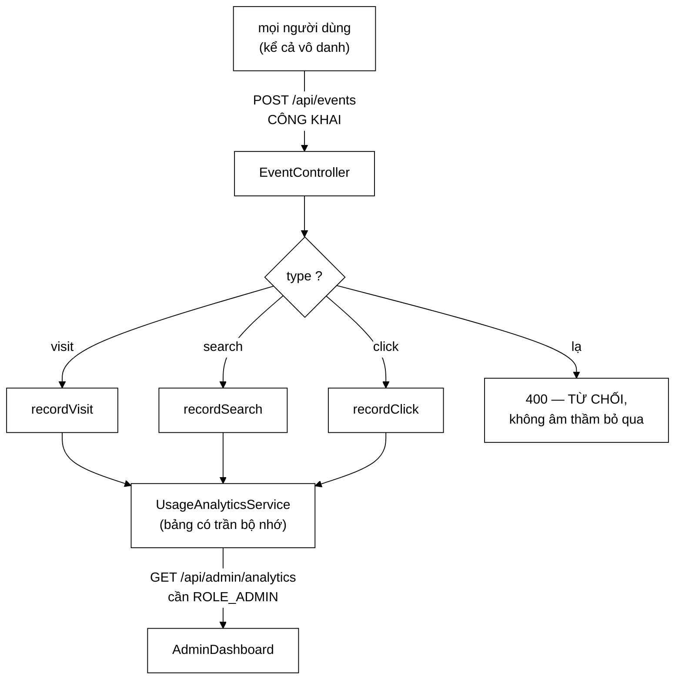

# EventController — ranh giới nằm **giữa hai chiều** dữ liệu, không ở một trong hai

**File nguồn:** `search-engine/src/main/java/com/vnsearch/controller/EventController.java` (136 dòng)
**Gói:** `com.vnsearch.controller` · **Loại:** `@RestController @RequestMapping("/api")`
**Vị trí trong luồng:** `POST /api/events` — nơi giao diện báo lại hành vi người dùng
**Đọc kèm:** [`../analytics/UsageAnalyticsService.md`](../analytics/UsageAnalyticsService.md) · [`AdminAnalyticsController.md`](./AdminAnalyticsController.md) · [`../config/SecurityConfig.md`](../config/SecurityConfig.md) · [`../config/RateLimitFilter.md`](../config/RateLimitFilter.md)

---

## 📌 Hiểu trong 30 giây

Javadoc dòng 20–36 giải quyết đúng câu hỏi mà mọi người đọc sẽ hỏi đầu tiên:
*"vì sao một endpoint ghi số liệu lại công khai?"*

```
   GHI (POST /api/events)          ĐỌC (GET /api/admin/analytics)
   ──────────────────────          ──────────────────────────────
   ai cũng gọi được                cần X-API-Key, vai trò ADMIN
   vì mọi người dùng đều           vì số liệu tổng hợp phơi bày
   phải báo được hành vi           người dùng đang tìm gì
```

> *"Bắt endpoint ghi phải xác thực thì chỉ còn *quản trị viên* đóng góp được số
> liệu — tức là không còn số liệu nào đáng đọc. Ngược lại, để endpoint đọc mở ra
> thì bất kỳ ai cũng xem được toàn bộ truy vấn của mọi người dùng khác. **Ranh giới
> đúng nằm giữa hai chiều, không phải ở một trong hai.**"*



```
   ⭐ LUẬT PHÂN QUYỀN CHO ENDPOINT NÀY RÀNG BUỘC THEO
     PHƯƠNG THỨC, KHÔNG THEO ĐƯỜNG DẪN:

   .requestMatchers(HttpMethod.POST, "/api/events").permitAll()

   ⇒ Một `GET /api/events` thêm vào sau này sẽ KHÔNG
     thừa kế quyền công khai. Nó rơi vào denyAll().
   ⇒ Xem ../config/SecurityConfig.md mục 4.2.
   ⇒ Đây là chi tiết dễ làm sai nhất, và nó được làm đúng.
```

---

## 1. Thừa nhận thẳng: số liệu này **không** đáng tin

Javadoc dòng 40–42:

> *"Endpoint công khai nghĩa là **số liệu ở đây không đáng tin để tính tiền hay để
> ra quyết định pháp lý** — bất kỳ ai cũng gửi được sự kiện giả. Nó đủ tin cho đúng
> việc nó phục vụ: nhìn xu hướng sử dụng của chính ứng dụng mình."*

```
   ⭐ HAI CÂU NÀY LÀM MỘT VIỆC HIẾM: GIỚI HẠN PHẠM VI
     TIN CẬY CỦA DỮ LIỆU, NGAY TẠI NƠI SINH RA NÓ.

   Không có nó, chuỗi sự việc rất dễ đoán:
     ① bảng điều khiển hiện "1.200 lượt tìm kiếm hôm nay"
     ② con số được đưa vào một báo cáo
     ③ ai đó ra quyết định dựa trên nó
     ④ không ai còn nhớ nó đến từ một endpoint công khai

   ⇒ Một con số không kèm mức tin cậy sẽ được dùng như
     một con số CHÍNH XÁC.

   ⇒ Cùng loại vấn đề mà ../service/LanguageDetector.md
     mục 2 nêu về số đo chất lượng bị thổi phồng: dữ liệu
     xấu không tự khai báo mình là xấu.
```

```
   BA THỨ GIỮ CHO NÓ KHÔNG THÀNH CỬA TẤN CÔNG

   ① RateLimitFilter đã bọc /api/*
      ⇒ 120 req/phút mỗi IP, KHÔNG cần thêm gì ở đây

   ② Chặn độ dài ở CẢ HAI tầng
      Bean Validation ở lớp này
      + cắt lại lần nữa trong UsageAnalyticsService
      "lop dich vu KHONG TIN lop goi no, vi no con duoc goi
       tu test va co the tu cho khac sau nay"

   ③ Mọi bảng thống kê đều có trần bộ nhớ
      ⇒ luồng sự kiện rác làm số liệu NHIỄU,
        không làm HẾT HEAP

   ⇒ Ba lớp, ba mối lo khác nhau — cùng khuôn phân tích
     với AdminController.md mục 2.
```

```
   ⭐ ĐIỂM ② ĐÁNG ĐỌC KỸ: "LỚP DỊCH VỤ KHÔNG TIN LỚP GỌI NÓ"

   Đây là câu trả lời cho phản biện "kiểm hai lần là thừa".

   Không thừa, vì hai phép kiểm bảo vệ hai thứ khác nhau:
     - @Size ở controller bảo vệ HỢP ĐỒNG API
       (người gọi biết ngay mình gửi sai, nhận 400)
     - cắt chuỗi ở service bảo vệ BẤT BIẾN CỦA SERVICE
       (bảng thống kê không phình ra vì một khoá khổng lồ)

   Và người gọi service KHÔNG chỉ có controller:
     - test gọi thẳng
     - một luồng nội bộ có thể gọi sau này

   ⇒ Bỏ phép kiểm ở service = tính đúng của service phụ
     thuộc vào việc MỌI người gọi đều cẩn thận.
   ⇒ Đúng loại phụ thuộc ngầm mà SearchController.md mục 1
     lên án.
```

---

## 2. Danh tính lấy từ ngữ cảnh bảo mật, không từ thân request

```java
// Danh tinh lay tu NGU CANH BAO MAT, khong phai tu than request. Neu
// de may khach tu khai ten minh trong JSON thi bat ky ai cung gan duoc
// hanh vi cho nguoi khac — mot endpoint cong khai ma tin loi tu khai
// thi bang "ai dung nhieu" tro thanh thu gia mao duoc bang mot dong curl.
String username = authentication == null ? null : authentication.getName();
```

```
   NẾU LÀM SAI, KỊCH BẢN CỤ THỂ

   EventRequest có thêm trường `username`:
     curl -X POST /api/events -d '{
       "type":"search", "username":"giam-doc",
       "query":"cach nghi viec"
     }'

   ⇒ Bảng "truy vấn theo người dùng" hiện tên giám đốc
     kèm truy vấn do kẻ khác bịa.
   ⇒ Endpoint CÔNG KHAI ⇒ không cần tài khoản nào.

   ⇒ Đây không chỉ là "số liệu sai" — nó là VU KHỐNG
     có thể xảy ra bằng một dòng lệnh.

   ⇒ Và trường `username` KHÔNG có trong record.
     Cùng cách chống mass assignment với
     AuthController.md mục 2.
```

```
   VÀ `authentication` CÓ THỂ null Ở ĐÂY — KHÁC MỌI CHỖ KHÁC

   Ở AuthController, ba nhánh `authentication == null` là
   MÃ CHẾT (phân quyền đã chặn).

   Ở đây thì KHÔNG: endpoint công khai nên người vô danh
   gọi được thật.

   ⇒ `username = null` là trạng thái BÌNH THƯỜNG, không
     phải trạng thái lỗi.
   ⇒ Đây là lần duy nhất trong gói controller mà phép kiểm
     null đó thật sự cần thiết, và nó không được nói ra.
```

```
   sessionId — MÃ PHIÊN DO MÁY KHÁCH SINH

   Javadoc: "chuoi ngau nhien do may khach sinh; khong nhan
   dang nguoi dung"

   Và dòng 55-56: "Khong nhan va khong ghi dia chi IP:
   bang dieu khien dem PHIEN, va ma phien la chuoi ngau
   nhien do may khach sinh."

   ⇒ Một quyết định về QUYỀN RIÊNG TƯ được ghi rõ.
   ⇒ Cái giá: sessionId giả mạo được ⇒ "số phiên" thổi
     phồng được tuỳ ý.
   ⇒ Nhưng điều đó ĐÃ được thừa nhận ở mục 1 rồi.

   ⇒ Hai quyết định (không ghi IP, số liệu không đáng tin)
     nhất quán với nhau: nếu đã không tin số liệu thì
     không cần định danh chặt.
```

---

## 3. Kiểu lạ bị **từ chối**, không âm thầm bỏ qua

```java
default -> {
    return ResponseEntity.badRequest().build();
}
```

Bình luận dòng 127–129:

> *"Kiểu lạ bị **TỪ CHỐI** chứ không âm thầm bỏ qua: một phiên bản giao diện mới
> gửi sai tên sự kiện sẽ thấy 400 **ngay khi thử**, thay vì thấy một bảng điều khiển
> trống rỗng vài tuần sau và không hiểu vì sao."*

```
   ⭐ ĐÂY LÀ NGUYÊN TẮC "HỎNG TO HƠN HỎNG ÂM THẦM"
     ÁP CHO MỘT ENDPOINT "BẮN RỒI QUÊN".

   Nghe nghịch lý: phía gửi KHÔNG ĐỌC phản hồi
   (Javadoc dòng 101-103 nói rõ), vậy trả 400 để làm gì?

   Trả lời: người ĐỌC 400 không phải mã sản phẩm —
   mà là LẬP TRÌNH VIÊN đang mở DevTools lúc phát triển.

   ⇒ 400 hiện đỏ trong tab Network ngay lần thử đầu.
   ⇒ 204 âm thầm ⇒ mọi thứ trông ổn ⇒ lỗi được phát hiện
     ba tuần sau, khi ai đó hỏi "sao bảng này trống".

   ⇒ Một mã trạng thái có thể phục vụ MỘT NGƯỜI ĐỌC
     KHÁC với người mà API được thiết kế cho.
```

```
   ⚠️ NHƯNG 400 Ở ĐÂY CÓ THÂN RỖNG

   ResponseEntity.badRequest().build()

   ⇒ Không nói type nào không hợp lệ
   ⇒ Không nói những type nào được chấp nhận

   Với một lỗi mà đối tượng đọc là LẬP TRÌNH VIÊN đang gỡ lỗi,
   thông báo là thứ có giá trị nhất.

   ⇒ Và nó tạo ra hình dạng lỗi thứ ba trong API
     (bên cạnh GlobalExceptionHandler và RateLimitFilter).
   ⇒ Cùng vấn đề với AdminUserController.md mục 9.
```

```
   VÀ `type` ĐƯỢC CHUẨN HOÁ TRƯỚC KHI SO KHỚP

   String type = request.type().trim().toLowerCase(Locale.ROOT);

   ⇒ "SEARCH", " search ", "Search" đều được chấp nhận
   ⇒ Locale.ROOT chứ không phải toLowerCase() không tham số

   Vì sao Locale quan trọng: với Locale thổ nhĩ kỳ,
   "I".toLowerCase() cho ra "ı" (i không chấm), nên
   "VISIT".toLowerCase() sẽ KHÔNG khớp "visit".

   ⇒ Lỗi này chỉ xảy ra khi máy chủ chạy với locale tr-TR
   ⇒ Một trong những lỗi khó tin nhất của Java, và nó
     được tránh đúng cách ở đây — nhưng không có bình luận.
```

---

## 4. Một record cho ba loại sự kiện

Javadoc dòng 71–75:

> *"Các trường phụ thuộc vào `type`: `search` dùng `query`/`resultCount`/`tookMs`,
> `click` dùng `url`/`position`, `visit` không dùng gì thêm. Dùng một kiểu chung cho
> cả ba thay vì ba endpoint riêng vì phía gửi là **một hàm duy nhất**, và ba đường
> dẫn gần giống nhau chỉ nhân ba chỗ phải nhớ cập nhật."*

```
   ĐÁNH ĐỔI ĐƯỢC NÊU RÕ, VÀ NÓ CÓ HAI MẶT

   Lợi:
     - phía gửi (TypeScript) có MỘT hàm sendEvent()
     - thêm loại sự kiện = thêm một `case`, không thêm
       endpoint, không sửa CORS, không sửa SecurityConfig

   Hại:
     - record có 7 trường, mỗi loại chỉ dùng 2-3
     - không có gì bắt buộc `search` phải có `query`
     - gửi {"type":"search"} không kèm query ⇒ HỢP LỆ
       ⇒ recordSearch(sessionId, user, null, 0, -1)

   ⇒ Bean Validation KHÔNG thể diễn đạt "nếu type=search
     thì query bắt buộc" bằng chú giải đơn giản.
   ⇒ Nên tính đúng ở đây phụ thuộc vào việc phía gửi
     gửi đúng.
```

```
   GIÁ TRỊ THAY THẾ KHI THIẾU — HAI QUY ƯỚC KHÁC NHAU

   resultCount == null → 0
   tookMs      == null → -1     ← khác!
   position    == null → 0

   ⇒ -1 cho tookMs là một giá trị SENTINEL nghĩa là
     "không biết", phân biệt với 0 ms (rất nhanh).
   ⇒ Đó là lựa chọn ĐÚNG: 0 ms là một giá trị hợp lệ,
     nên không dùng nó làm "thiếu dữ liệu" được.

   ⚠️ Nhưng resultCount = 0 thì KHÔNG phân biệt được
     "truy vấn trả 0 kết quả" với "giao diện quên gửi".
   ⇒ Và "tỷ lệ truy vấn 0 kết quả" chính là thang đo mà
     ../config/MetricsConfig.md mục 4 nói là còn thiếu,
     và là dấu hiệu duy nhất của lỗi tokenizer lệch.

   ⇒ Tức là một quy ước thiếu nhất quán ở đây làm hỏng
     một tín hiệu chẩn đoán quan trọng ở chỗ khác.
```

---

## 5. `204 No Content` — "bắn rồi quên"

Javadoc dòng 100–103:

> *"Không trả về thân phản hồi: phía gửi là một lời gọi "bắn rồi quên", không đọc gì
> cả, nên mọi byte trả về đều là byte thừa."*

```
   PHÉP TÍNH

   Mỗi phiên người dùng: ~1 visit + N search + M click
   Với một phiên tích cực: ~20 sự kiện

   Nếu trả {"status":"OK"} (16 byte + header):
     ⇒ vài trăm byte mỗi phiên
     ⇒ không đáng kể về băng thông

   ⇒ Nên lý do THẬT không phải tiết kiệm byte.
   ⇒ Lý do thật là NGỮ NGHĨA: 204 nói rõ với mọi client
     rằng "không có gì để đọc", nên không ai viết mã
     phân tích một thân phản hồi vô nghĩa.

   ⇒ Javadoc chọn lý do yếu hơn (byte thừa) cho một
     quyết định đúng vì lý do mạnh hơn (hợp đồng rõ ràng).
```

---

## 6. Hướng dẫn thực hành

### 6.1 Gửi sự kiện

```bash
# Mo ung dung
curl -X POST http://localhost:8080/api/events \
  -H "Content-Type: application/json" \
  -d '{"type":"visit","sessionId":"s-abc123"}'
# 204

# Tim kiem
curl -X POST http://localhost:8080/api/events \
  -H "Content-Type: application/json" \
  -d '{"type":"search","sessionId":"s-abc123","query":"máy tính",
       "resultCount":42,"tookMs":18}'
# 204

# Bam vao ket qua
curl -X POST http://localhost:8080/api/events \
  -H "Content-Type: application/json" \
  -d '{"type":"click","sessionId":"s-abc123",
       "url":"https://vnexpress.net/...","position":3}'
# 204

# Kieu la
curl -X POST http://localhost:8080/api/events \
  -H "Content-Type: application/json" -d '{"type":"hover"}'
# 400 (than RONG — khong noi vi sao)
```

### 6.2 Cạm bẫy

```
   ① Endpoint CÔNG KHAI theo PHƯƠNG THỨC. Một `GET /api/events`
     thêm sau này sẽ trả 401.

   ② Số liệu KHÔNG đáng tin để ra quyết định — bất kỳ ai
     cũng gửi được sự kiện giả.

   ③ `username` KHÔNG lấy từ thân request. Đừng thêm trường
     đó vào record.

   ④ `authentication` CÓ THỂ null ở đây (khác mọi controller
     khác) — đó là trạng thái bình thường.

   ⑤ Không có gì bắt buộc `search` phải kèm `query`.
     {"type":"search"} là hợp lệ.

   ⑥ tookMs thiếu → -1 (sentinel), resultCount thiếu → 0
     (không phân biệt được với "0 kết quả thật").

   ⑦ 400 có thân RỖNG — không nói type nào sai.

   ⑧ Chuỗi bị chặn độ dài ở CẢ hai tầng. Đừng bỏ tầng nào
     vì "thừa".
```

---

## 7. Độ phức tạp & chi phí

| Thao tác | Chi phí |
|---|---|
| Hợp thức hoá + chuẩn hoá `type` | $O(L)$, $L \le 16$ |
| `recordVisit`/`recordSearch`/`recordClick` | tuỳ `UsageAnalyticsService` |

```
   PHÂN TÍCH — ENDPOINT NÀY CÓ TẦN SUẤT CAO THỨ HAI

   /api/suggest  — mỗi ký tự người dùng gõ (cao nhất)
   /api/events   — mỗi visit + mỗi search + mỗi click
   /api/search   — mỗi lần bấm Enter

   ⇒ Cả ba chia CHUNG hạn mức 120 req/phút mỗi IP.

   ⇒ Một phiên tích cực: 20 sự kiện + 30 gợi ý + 5 tìm kiếm
     = 55 request
   ⇒ Hai phiên trong một phút là chạm trần.

   ⇒ Javadoc nói "RateLimitFilter da boc san... KHONG CAN
     THEM GI O DAY" — đúng về mặt bảo vệ, nhưng nó bỏ qua
     việc endpoint này TIÊU THỤ hạn mức của endpoint khác.
   ⇒ Xem SuggestController.md mục 3 cho phía bên kia của
     cùng vấn đề.
```

---

## 8. Kiểm thử liên quan

| Tệp test | Kiểm gì |
|---|---|
| [`UsageAnalyticsServiceTest`](../../../../../test/java/com/vnsearch/analytics/UsageAnalyticsServiceTest.md) | Lớp dịch vụ bên dưới |
| [`AnalyticsAuthorizationTest`](../../../../../test/java/com/vnsearch/analytics/AnalyticsAuthorizationTest.md) | Phân quyền hai chiều ghi/đọc |

```
   ⭐ AnalyticsAuthorizationTest LÀ TRƯỜNG HỢP HIẾM:
     MỘT TEST KIỂM ĐÚNG BẤT BIẾN TRUNG TÂM CỦA TÀI LIỆU NÀY.

   Nó kiểm rằng chiều GHI công khai và chiều ĐỌC cần ADMIN.
   ⇒ Đây là bất biến quan trọng nhất, và nó CÓ test.
   ⇒ Khác hẳn phần lớn các lớp khác trong gói controller.
```

```
   NHỮNG TÍNH CHẤT VẪN CHƯA ĐƯỢC CANH GIỮ

   ✗ `username` gửi trong thân JSON bị BỎ QUA
     — bất biến chống vu khống, và một test hai dòng

   ✗ type lạ → 400, và KHÔNG có sự kiện nào được ghi

   ✗ type được chuẩn hoá: "SEARCH", " search " đều nhận
   ✗ Chuẩn hoá dùng Locale.ROOT (lỗi locale Thổ Nhĩ Kỳ)

   ✗ tookMs thiếu → -1, resultCount thiếu → 0

   ✗ GET /api/events trả 401 (không thừa kế quyền công khai
     của POST)

   ⇒ Sáu tính chất; tính chất đầu là loại lỗi mà hậu quả
     không phải "số liệu sai" mà là VU KHỐNG.
```

---

## 9. Chấm theo chuẩn doanh nghiệp

| Tiêu chí | Điểm | Nhận xét |
|---|---|---|
| **"Ranh giới đúng nằm giữa hai chiều"** | 10/10 | Giải quyết dứt điểm câu hỏi khó nhất về endpoint này, bằng bảng hai cột và lý do cho từng chiều |
| **Thừa nhận giới hạn tin cậy của số liệu** | 10/10 | *"Không đáng tin để tính tiền hay ra quyết định pháp lý"* — ghi ngay tại nơi sinh ra dữ liệu |
| **Danh tính lấy từ ngữ cảnh bảo mật** | 10/10 | Hậu quả nếu làm sai không phải "số liệu sai" mà là **vu khống bằng một dòng curl** |
| **"Lớp dịch vụ không tin lớp gọi nó"** | 10/10 | Câu trả lời chính xác cho phản biện "kiểm hai lần là thừa": hai phép kiểm bảo vệ hai thứ khác nhau |
| **Từ chối `type` lạ thay vì bỏ qua** | 10/10 | Nhận ra người đọc 400 là **lập trình viên đang gỡ lỗi**, không phải mã sản phẩm |
| Ràng buộc công khai theo phương thức | 10/10 | `GET /api/events` sau này không thừa kế quyền — chi tiết dễ sai nhất, làm đúng |
| Quyết định không ghi IP | 9/10 | Quyền riêng tư được ghi rõ, và nhất quán với việc đã thừa nhận số liệu không đáng tin |
| `Locale.ROOT` khi chuẩn hoá | 9/10 | Tránh đúng lỗi locale Thổ Nhĩ Kỳ; trừ điểm vì không có bình luận nên dễ bị "đơn giản hoá" |
| **`400` có thân rỗng** | **4/10** | Đối tượng đọc là lập trình viên gỡ lỗi, mà thông báo là thứ có giá trị nhất — và nó bị bỏ trống |
| **`resultCount` thiếu → 0** | **4/10** | Không phân biệt được với "0 kết quả thật", làm hỏng đúng tín hiệu chẩn đoán lỗi tokenizer lệch |
| Một record cho ba loại sự kiện | 5/10 | Đánh đổi được nêu, nhưng `{"type":"search"}` không kèm `query` vẫn hợp lệ và không gì bắt được |
| Không nêu việc tiêu thụ hạn mức chung | 5/10 | *"Không cần thêm gì ở đây"* đúng về bảo vệ, nhưng endpoint này ăn hạn mức của `/api/search` |
| Kiểm thử controller | 6/10 | `AnalyticsAuthorizationTest` canh giữ bất biến trung tâm — hiếm trong gói này; các bất biến còn lại thì không |

**Ba đề xuất nâng lên mức sản phẩm:**

1. **Cho `400` một thông báo — đối tượng đọc nó là người đang gỡ lỗi.** Javadoc lập
   luận rất đúng rằng từ chối `type` lạ giúp lập trình viên thấy lỗi *ngay khi thử*
   thay vì ba tuần sau, rồi trả về một thân **rỗng** — bỏ mất chính thứ giúp họ hiểu
   chuyện gì đang xảy ra:
   ```java
   private static final Set<String> KIEU_HOP_LE = Set.of("visit", "search", "click");

   default -> throw new IllegalArgumentException(
           "type='" + request.type() + "' khong hop le. Cac gia tri duoc chap nhan: "
                   + String.join(", ", KIEU_HOP_LE) + ".");
   ```
   Ném `IllegalArgumentException` để [`GlobalExceptionHandler`](../config/GlobalExceptionHandler.md)
   dựng thân JSON đúng khuôn chung — `badRequest().build()` hiện tạo ra hình dạng
   lỗi **thứ ba** trong API, bên cạnh khuôn của handler và khuôn tự dựng của
   [`RateLimitFilter`](../config/RateLimitFilter.md).

2. **Phân biệt "0 kết quả" với "không gửi `resultCount`".** Quy ước hiện tại dùng
   `-1` làm sentinel cho `tookMs` (đúng, vì 0 ms là giá trị hợp lệ) nhưng lại dùng
   `0` cho `resultCount` — mà `0` cũng là giá trị hợp lệ, và là **giá trị có ý nghĩa
   nhất**: tỷ lệ truy vấn trả 0 kết quả là dấu hiệu duy nhất của lỗi tokenizer lệch
   mà [`MetricsConfig`](../config/MetricsConfig.md) mục 4 chỉ ra là còn thiếu:
   ```java
   case "search" -> analytics.recordSearch(
           request.sessionId(),
           username,
           request.query(),
           // -1 = "giao dien khong gui", phan biet voi 0 = "truy van tra 0 ket qua".
           // Phan biet nay quan trong: ty le truy van 0 ket qua la dau hieu DUY NHAT
           // cua loi tokenizer lech giua tang index va tang truy van, va gop hai
           // truong hop lam mot se lam tin hieu do vo nghia.
           request.resultCount() == null ? -1 : request.resultCount(),
           request.tookMs() == null ? -1 : request.tookMs());
   ```
   Kèm theo, `@Min(0)` trên `resultCount` và `position` trong record sẽ chặn được
   giá trị âm gửi từ ngoài, để `-1` giữ nguyên nghĩa sentinel nội bộ.

3. **Test hai bất biến bảo mật còn lại của lớp.** `AnalyticsAuthorizationTest` đã
   canh giữ bất biến trung tâm (ranh giới ghi/đọc) — hiếm thấy trong gói này — nhưng
   bất biến chống vu khống thì chưa:
   ```java
   @WebMvcTest(EventController.class)
   @AutoConfigureMockMvc(addFilters = false)
   class EventControllerTest {

       @Autowired MockMvc mockMvc;
       @MockBean UsageAnalyticsService analytics;

       @Test
       void usernameGuiTrongThanJsonPhaiBiBoQua() throws Exception {
           mockMvc.perform(post("/api/events").contentType(APPLICATION_JSON)
                          .content("{\"type\":\"search\",\"sessionId\":\"s1\","
                                  + "\"query\":\"abc\",\"username\":\"giam-doc\"}"))
                  .andExpect(status().isNoContent());

           // username phai la null (goi vo danh), KHONG phai "giam-doc":
           // tin loi tu khai o mot endpoint cong khai bien bang "ai dung nhieu"
           // thanh mot cong cu vu khong.
           verify(analytics).recordSearch("s1", null, "abc", anyInt(), anyLong());
       }

       @ParameterizedTest
       @ValueSource(strings = {"SEARCH", " search ", "Search"})
       void typeDuocChuanHoaTruocKhiSoKhop(String type) throws Exception {
           mockMvc.perform(post("/api/events").contentType(APPLICATION_JSON)
                          .content("{\"type\":\"" + type + "\",\"query\":\"a\"}"))
                  .andExpect(status().isNoContent());
       }

       @Test
       void kieuLaKhongDuocGhiSuKienNao() throws Exception {
           mockMvc.perform(post("/api/events").contentType(APPLICATION_JSON)
                          .content("{\"type\":\"hover\"}"))
                  .andExpect(status().isBadRequest());
           verifyNoInteractions(analytics);
       }
   }
   ```

---

## 10. Liên kết

- Lớp nhận và tổng hợp sự kiện, nơi chuỗi bị cắt lần thứ hai: [`../analytics/UsageAnalyticsService.md`](../analytics/UsageAnalyticsService.md)
- Chiều **đọc** của cùng dữ liệu, cần vai trò ADMIN: [`AdminAnalyticsController.md`](./AdminAnalyticsController.md)
- Hình dạng số liệu tổng hợp: [`../analytics/UsageSnapshot.md`](../analytics/UsageSnapshot.md) · [`../analytics/AdminDashboard.md`](../analytics/AdminDashboard.md)
- Luật `permitAll` ràng buộc theo **phương thức**: [`../config/SecurityConfig.md`](../config/SecurityConfig.md) mục 4.2
- Lớp bảo vệ ① được nhắc tới trong Javadoc: [`../config/RateLimitFilter.md`](../config/RateLimitFilter.md)
- Endpoint cùng chia hạn mức và cũng có tần suất cao: [`SuggestController.md`](./SuggestController.md) mục 3
- Nơi tỷ lệ truy vấn 0 kết quả lẽ ra phải trở thành một thang đo: [`../config/MetricsConfig.md`](../config/MetricsConfig.md) mục 4
- Cùng cách chống mass assignment bằng kiểu dữ liệu: [`AuthController.md`](./AuthController.md) mục 2
- Test canh giữ bất biến trung tâm: [`../../../../../test/java/com/vnsearch/analytics/AnalyticsAuthorizationTest.md`](../../../../../test/java/com/vnsearch/analytics/AnalyticsAuthorizationTest.md)
