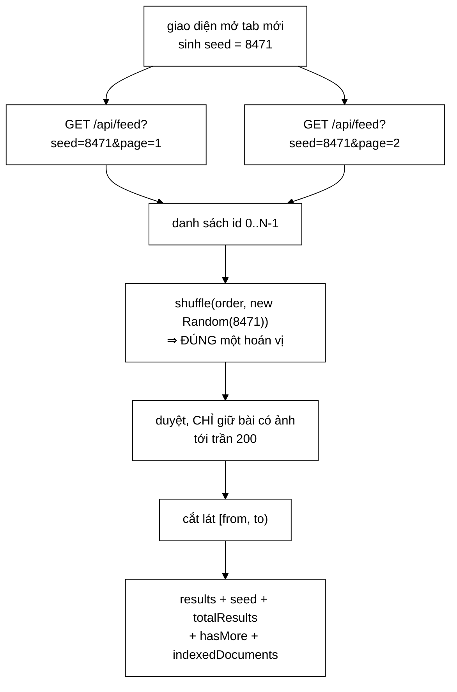

# FeedController — ngẫu nhiên nhưng ổn định: toàn bộ "phiên" nằm gọn trong một con số

**File nguồn:** `search-engine/src/main/java/com/vnsearch/controller/FeedController.java` (182 dòng)
**Gói:** `com.vnsearch.controller` · **Loại:** `@RestController @RequestMapping("/api")`
**Vị trí trong luồng:** `GET /api/feed?seed=&page=&size=` — dòng tin cho trang tab mới của browser-app
**Đọc kèm:** [`ImageSearchController.md`](./ImageSearchController.md) · [`../crawler/modular/ImageStore.md`](../crawler/modular/ImageStore.md) · [`../model/WebDocument.md`](../model/WebDocument.md) · [`../service/SearchEngineFacade.md`](../service/SearchEngineFacade.md)

---

## 📌 Hiểu trong 30 giây

Javadoc dòng 22–26 nói ngay điều phân biệt endpoint này với mọi endpoint khác:

> *"Khác `/api/search` ở một điểm căn bản: **không có truy vấn**. Người dùng vừa mở
> tab mới, chưa gõ gì cả — nên không có điểm liên quan nào để xếp hạng. Đây là bài
> toán *duyệt* chỉ mục, không phải *truy vấn* chỉ mục, và mọi đường đi qua
> `SearchEngineFacade.search` đều không dùng được."*

```java
Collections.shuffle(order, new Random(seed));
```

```
   tab mới  -> seed = 8471  -> lô 1, 2, 3... cùng một hoán vị -> cuộn liền mạch
   tab khác -> seed = 2059  -> hoán vị khác hẳn               -> nội dung mới
```



```
   ⭐ HAI REQUEST KHÁC NHAU ĐI QUA CÙNG MỘT Ô shuffle
     VÀ CHO RA CÙNG MỘT HOÁN VỊ.

   ⇒ Máy chủ KHÔNG giữ trạng thái phiên nào.
   ⇒ "Toan bo phien nam gon trong MOT CON SO do giao dien
      gui len."
```

---

## 1. Ngẫu nhiên thuần **phá** phân trang — bài học đã trả giá một lần

Javadoc dòng 30–32:

> *"Yêu cầu là mỗi lần mở tab mới thấy một tập bài khác nhau. Nhưng **ngẫu nhiên
> thuần thì phá phân trang** — **đúng lỗi mà tab Hình ảnh đã vấp**: lô 2 xáo lại từ
> đầu, nên bài vừa lặp vừa thiếu khi cuộn xuống."*

```
   ⭐ MỘT THAM CHIẾU CHÉO CÓ GIÁ TRỊ HIẾM:
     TỆP NÀY HỌC TỪ SỰ CỐ CỦA TỆP KHÁC.

   ImageSearchController.md mục 3 mô tả cùng lỗi:
     "neu so trang quet thay doi theo `page` thi tap anh nen
      cung doi, va anh se VUA LAP VUA THIEU giua cac lo"

   ⇒ Hai endpoint, hai nguyên nhân kỹ thuật khác nhau:
     tab Ảnh: danh sách nền đổi vì SỐ TRANG QUÉT phụ thuộc page
     tab Feed: danh sách nền đổi vì XÁO TRỘN lại mỗi lần

   ⇒ Nhưng cùng MỘT khuôn lỗi:
     "danh sách nền không ổn định giữa các lô".

   ⇒ Và cùng một lời giải về nguyên tắc:
     làm cho danh sách nền TẤT ĐỊNH, rồi mới cắt lát.
```

```
   VÌ SAO Random(seed) GIẢI ĐƯỢC

   Collections.shuffle(list, new Random(seed))

   java.util.Random là bộ sinh giả ngẫu nhiên TẤT ĐỊNH:
   cùng hạt giống ⇒ cùng dãy số ⇒ cùng hoán vị.

   Và thuật toán shuffle (Fisher–Yates) được ĐẶC TẢ trong
   javadoc của Collections, nên hoán vị là như nhau:
     - qua nhiều lần gọi
     - qua nhiều tiến trình
     - qua nhiều lần khởi động lại

   ⇒ Javadoc nói đúng: "bat ke goi bao nhieu lan va tu
     TIEN TRINH NAO".
   ⇒ Điểm cuối quan trọng: nhiều bản sao backend vẫn cho
     cùng kết quả — khác hẳn ImageStore, thứ KHÔNG chịu
     được nhiều bản sao (../config/ImageStoreListener.md mục 4).
```

```
   ⚠️ NHƯNG CÓ MỘT RÀNG BUỘC NGẦM: totalDocs PHẢI ỔN ĐỊNH

   for (int i = 0; i < totalDocs; i++) order.add(i);
   Collections.shuffle(order, new Random(seed));

   ⇒ Hoán vị phụ thuộc CẢ seed LẪN kích thước danh sách.
   ⇒ Nếu một phiên crawl thêm tài liệu giữa lô 1 và lô 2:
     totalDocs đổi ⇒ hoán vị đổi HOÀN TOÀN
     ⇒ lô 2 lại vừa lặp vừa thiếu

   ⇒ Đây chính là lỗi mà lớp này sinh ra để tránh, và nó
     vẫn xảy ra được — chỉ là qua một đường khác.
   ⇒ Không được nêu ở đâu. Xem đề xuất 1.
```

---

## 2. Xáo trộn **id**, không xáo trộn **tài liệu**

```java
// Xao tron DANH SACH ID, khong phai danh sach tai lieu: id la so
// nguyen, nen hoan vi 30.000 phan tu la gan nhu mien phi, con nap
// 30.000 tai lieu ra roi moi xao thi khong.
List<Integer> order = new ArrayList<>(totalDocs);
```

```
   PHÉP TÍNH

   Xáo 30.000 Integer:
     30.000 phép hoán đổi tham chiếu ⇒ ~microgiây
     bộ nhớ: 30.000 × 16 byte ≈ 480 KB (Integer đã đóng hộp)

   Nạp 30.000 WebDocument rồi xáo:
     30.000 lần getDocumentAt ⇒ có thể giải nén văn bản
     bộ nhớ: hàng trăm MB

   ⇒ Chênh lệch ba bậc độ lớn.

   ⚠️ Nhưng vẫn cấp phát 480 KB MỖI REQUEST.
     Với bảng điều khiển tự tải lại hoặc nhiều người dùng
     cùng mở tab, đó là rác đều đặn.
   ⇒ Xem mục 7.
```

```
   VÀ VÒNG LẶP DỪNG SỚM Ở TRẦN 200

   for (int docId : order) {
       if (items.size() >= MAX_FEED_ITEMS) break;
       ...
   }

   ⇒ Duyệt hoán vị theo thứ tự, dừng khi đủ 200 thẻ.
   ⇒ Với corpus mà 50% bài có ảnh, chỉ duyệt ~400 id.

   ⇒ Nên chi phí THẬT không phải O(totalDocs) mà là
     O(số id phải duyệt để gom đủ 200 bài có ảnh).

   ⚠️ Trừ khi kho ảnh RỖNG: khi đó vòng lặp duyệt HẾT
     30.000 id, gọi getDocumentAt 30.000 lần, và trả về
     danh sách rỗng.
   ⇒ Đúng ca xảy ra ngay sau khi khởi động lại backend —
     và đó cũng là lúc hệ thống đang bận nạp chỉ mục.
   ⇒ Xem đề xuất 2.
```

---

## 3. Chỉ lấy bài **có ảnh** — và hệ quả được ghi thẳng

Javadoc dòng 49–58:

> *"Một dòng tin mà phần lớn ô là khối màu xám trông như đang hỏng. Nên bài không có
> ảnh bị bỏ qua hoàn toàn chứ không hiện kèm ảnh giữ chỗ."*
>
> *"**Hệ quả phải biết:** ngay sau khi khởi động lại backend, `ImageStore` rỗng nên
> dòng tin cũng rỗng — dù chỉ mục vẫn đầy đủ."*

```
   ⭐ HỆ QUẢ NÀY LÀ MỘT TRONG HAI LÝ DO
     ImageStorePreloader RA ĐỜI.

   ../config/ImageStorePreloader.md mục 1 kể cùng vấn đề
   từ phía tab "Hình ảnh":
     "tab Tat ca tra ve 40 ket qua, tab Hinh anh bao
      'khong tim thay anh nao'"

   Ở đây nó nặng hơn: TRANG CHỦ trống trơn.
   ⇒ Người dùng mở ứng dụng và không thấy gì.

   ⇒ Preloader nạp lại kho ảnh từ đĩa lúc khởi động,
     nên hệ quả này đã được bịt phần lớn.
   ⇒ Nhưng Javadoc ở đây chưa được cập nhật sau khi
     preloader ra đời — nó vẫn mô tả trạng thái CŨ.
```

```
   TRƯỜNG indexedDocuments — PHÂN BIỆT HAI CA

   response.put("indexedDocuments", totalDocs);

   totalDocs = 0      → chỉ mục rỗng
                      → "hãy chạy crawl để có dữ liệu"
   totalDocs > 0 nhưng results rỗng
                      → có chỉ mục, chưa có ảnh
                      → "hãy chạy crawl để thu thập ảnh"

   ⇒ Cùng kỹ thuật với `pagesScanned` ở
     ImageSearchController.md mục 5.
   ⇒ Hai endpoint, cùng bài toán "kết quả rỗng vì hai lý do
     khác nhau", cùng lời giải: thêm một con số cho giao diện
     phân biệt.

   ⇒ Đây là dấu hiệu một khuôn thiết kế đã hình thành,
     không phải một phép vá lẻ.
```

```
   VÀ PHÉP LỌC LÀ TẤT ĐỊNH

   "Phep loc nay TAT DINH (cung seed, cung kho anh thi cung
    ket qua) nen no khong pha tinh on dinh cua phan trang."

   ⇒ Câu này quan trọng: một phép lọc KHÔNG tất định
     (ví dụ "bỏ qua ngẫu nhiên 10% để đa dạng") sẽ phá
     phân trang y hệt như xáo trộn không hạt giống.

   ⚠️ Nhưng "cung kho anh" là điều kiện KHÔNG được bảo đảm:
     một phiên crawl đang chạy đổ ảnh vào ImageStore liên tục.
   ⇒ Lô 1 thấy 150 bài có ảnh, lô 2 thấy 160
   ⇒ danh sách nền đổi ⇒ phân trang lệch

   ⇒ Cùng dạng rủi ro với totalDocs ở mục 1.
```

---

## 4. `snippetOf` — một NPE ở đúng đường chạy nóng nhất

```java
/**
 * <p>Ưu tiên {@code metaDescription} vì nó do chính trang viết ra để tóm
 * tắt mình. Chỉ khi thiếu mới cắt từ thân bài — và thân bài CÓ THỂ null:
 * tài liệu trong chỉ mục là bản {@code withoutBodyText()}, phần văn bản
 * được giữ riêng ở dạng đã nén. Quên điều đó là một NPE ở đúng đường chạy
 * nóng nhất của trang chủ.
 */
private static String snippetOf(WebDocument doc) {
    String text = doc.getMetaDescription();
    if (text == null || text.isBlank()) {
        text = doc.getBodyText();
    }
    if (text == null || text.isBlank()) {
        return "";
    }
    ...
}
```

```
   ⭐ HAI CÂU CUỐI LÀ MỘT CẢNH BÁO ĐƯỢC ĐẶT ĐÚNG CHỖ.

   "tai lieu trong chi muc la ban withoutBodyText(), phan
    van ban duoc giu RIENG o dang DA NEN"

   ⇒ Một tối ưu bộ nhớ ở tầng chỉ mục
     (xem ../index/CompressedText.md, ../model/WebDocument.md)
     tạo ra một cạm bẫy ở tầng controller.

   ⇒ getBodyText() trả null là hành vi ĐÚNG của
     WebDocument sau tối ưu đó — không phải lỗi.
   ⇒ Nhưng mọi nơi gọi nó phải biết, và không có gì
     trong kiểu dữ liệu nói ra điều đó
     (getBodyText() trả String, không phải Optional<String>).

   ⇒ Đây là loại tri thức chỉ truyền được bằng tài liệu,
     và ở đây nó được truyền đúng chỗ: ngay tại nơi
     có thể vấp.
```

```
   VÀ THỨ TỰ ƯU TIÊN CÓ LÝ DO

   metaDescription trước, bodyText sau.

   "vi no do CHINH TRANG viet ra de TOM TAT MINH"

   ⇒ metaDescription là tóm tắt do con người viết
   ⇒ 160 ký tự đầu của thân bài thường là ngày tháng,
     tên tác giả, hoặc một câu dẫn cụt

   ⇒ Với báo chí Việt Nam, metaDescription gần như luôn có
     (SEO), nên nhánh dự phòng hiếm khi chạy.
   ⇒ Nhưng khi nó chạy, chất lượng đoạn trích tệ hơn hẳn —
     và không có cách nào phân biệt hai nguồn từ phía
     giao diện.
```

```
   SNIPPET_LENGTH = 160 — "du hai dong tren the tin"

   ⇒ Con số neo vào THIẾT KẾ GIAO DIỆN, không vào thuật toán.
   ⇒ Đúng loại lý do nên có cho một hằng số ở tầng controller.

   ⚠️ Nhưng nó cắt giữa từ:
     clean.substring(0, 160).trim() + "…"
   ⇒ "...máy tính xách tay giá r…"
   ⇒ Cắt ở ranh giới khoảng trắng gần nhất sẽ đẹp hơn,
     và ../ranking/SnippetBuilder.md đã có logic đó cho
     tab tìm kiếm.
   ⇒ Hai bộ dựng đoạn trích, hai chất lượng khác nhau.
```

---

## 5. So sánh với `ImageSearchController` — cùng khuôn, hai lời giải

| | `ImageSearchController` | `FeedController` |
|---|---|---|
| Nguồn thứ tự | xếp hạng TF-IDF/BM25 | xáo trộn có hạt giống |
| Danh sách nền ổn định nhờ | `MAX_SCANNED_PAGES` cố định | `seed` từ giao diện |
| Trần | 300 ảnh | 200 bài |
| Ảnh mỗi mục | `forPages` (một ảnh/trang) | `forPage(url).get(0)` |
| Trường phân biệt ca rỗng | `pagesScanned` | `indexedDocuments` |
| Trạng thái ở máy chủ | không | không |

```
   ⭐ CẢ HAI ĐỀU KHÔNG GIỮ TRẠNG THÁI, BẰNG HAI CÁCH
     KHÁC NHAU.

   Tab Ảnh: trạng thái nằm trong TRUY VẤN (q)
            ⇒ cùng q ⇒ cùng danh sách nền

   Tab Feed: không có truy vấn, nên trạng thái được
             DỰNG RA dưới dạng seed
            ⇒ cùng seed ⇒ cùng danh sách nền

   ⇒ Nhận xét chung: phân trang không trạng thái đòi hỏi
     mọi lô phải TÁI TẠO ĐƯỢC cùng một danh sách nền từ
     các tham số của request.
   ⇒ Khi bài toán không tự cung cấp đủ tham số để làm điều
     đó, phải TẠO THÊM một tham số — và đó chính là `seed`.
```

```
   VÀ items.subList(from, to) — MỘT CHI TIẾT CẦN LƯU Ý

   response.put("results", items.subList(from, to));

   subList trả về một VIEW, không phải bản sao.
   ⇒ Nó giữ tham chiếu tới `items` (danh sách 200 phần tử)
   ⇒ Jackson tuần tự hoá view đó ⇒ vẫn đúng

   ⇒ Không có lỗi. Nhưng ImageSearchController ở cùng tình
     huống lại dựng một ArrayList mới (`items`), nên hai tệp
     không nhất quán.
   ⇒ Với vòng đời ngắn của một request thì cả hai đều ổn.
```

---

## 6. Hướng dẫn thực hành

### 6.1 Gọi endpoint

```bash
# Giao dien sinh seed MOT LAN khi mo tab, gui kem MOI lo
SEED=8471

curl -s "http://localhost:8080/api/feed?seed=$SEED&page=1&size=12" | jq
curl -s "http://localhost:8080/api/feed?seed=$SEED&page=2&size=12" | jq
# Hai lo NOI DUNG vao nhau, khong lap, khong thieu

# Seed khac => hoan vi khac han
curl -s "http://localhost:8080/api/feed?seed=2059&page=1&size=12" | jq
```

### 6.2 Chẩn đoán dòng tin rỗng

```
   results = [], indexedDocuments = 0
     ⇒ Chỉ mục rỗng. "Hãy chạy crawl."

   results = [], indexedDocuments = 30017
     ⇒ Chỉ mục đầy đủ nhưng KHÔNG bài nào có ảnh.
     ⇒ Kho ảnh rỗng.
     ⇒ Kiểm log của ImageStorePreloader:
       "Chua co kho anh tai data/images.json"
     ⇒ Xem ../config/ImageStorePreloader.md mục 6.1.

   Lô 2 lặp bài của lô 1
     ⇒ seed KHÁC nhau giữa hai request, hoặc
     ⇒ totalDocs đã đổi giữa hai lô (crawl đang chạy).
```

### 6.3 Cạm bẫy

```
   ① Giao diện PHẢI gửi CÙNG seed cho mọi lô của một tab.
     Mặc định seed=0 nghĩa là mọi tab thấy cùng một hoán vị.

   ② Hoán vị phụ thuộc CẢ seed LẪN totalDocs. Một phiên
     crawl đang chạy sẽ phá phân trang.

   ③ Kho ảnh đổi giữa hai lô cũng phá phân trang (phép lọc
     "chỉ bài có ảnh" tất định theo kho ảnh HIỆN TẠI).

   ④ Kho ảnh RỖNG ⇒ vòng lặp duyệt HẾT 30.000 id rồi trả
     về rỗng — chi phí cao nhất ở đúng ca vô ích nhất.

   ⑤ Mỗi request cấp phát một List<Integer> cỡ totalDocs
     (~480 KB với 30.000 tài liệu).

   ⑥ doc.getBodyText() CÓ THỂ null — tài liệu trong chỉ mục
     là bản withoutBodyText().

   ⑦ Đoạn trích cắt GIỮA TỪ. SnippetBuilder của tab tìm kiếm
     làm tốt hơn.

   ⑧ Trả Map<String, Object> — không hợp đồng, giống
     ImageSearchController và khác /api/search.

   ⑨ seed là `long` từ tham số — không kiểm gì. seed âm,
     seed khổng lồ đều chấp nhận (và đều hoạt động đúng).
```

---

## 7. Độ phức tạp & chi phí

| Thao tác | Chi phí |
|---|---|
| Dựng danh sách id | $O(D)$ thời gian và bộ nhớ, $D$ = số tài liệu |
| `shuffle` | $O(D)$ |
| Duyệt gom thẻ | $O(K)$ với $K$ = số id phải duyệt để đủ 200 bài có ảnh |
| `snippetOf` | $O(L)$, $L \le$ độ dài văn bản |

```
   PHÂN TÍCH — CHI PHÍ PHỤ THUỘC MẠNH VÀO TỶ LỆ BÀI CÓ ẢNH

   Gọi r = tỷ lệ bài có ảnh trong corpus.

   r = 80%  ⇒ K ≈ 250 id  ⇒ rất nhanh
   r = 20%  ⇒ K ≈ 1.000   ⇒ vẫn nhanh
   r = 1%   ⇒ K ≈ 20.000  ⇒ chậm rõ rệt
   r = 0%   ⇒ K = D = 30.000 ⇒ CHẬM NHẤT, và trả về RỖNG

   ⇒ Chi phí TỶ LỆ NGHỊCH với giá trị thu được.
   ⇒ Ca xấu nhất (kho ảnh rỗng) chính là ca sau khi
     khởi động lại — đúng lúc hệ thống đang bận.

   ⇒ Javadoc của MAX_FEED_ITEMS nói:
     "Cat som giu cho moi lo ve trong vai mili-giay BAT KE
      corpus lon den dau"
   ⇒ Câu này đúng khi r đủ lớn, và KHÔNG đúng khi r nhỏ.
   ⇒ Trần 200 chặn số THẺ, không chặn số ID PHẢI DUYỆT.
```

```
   VÀ CHI PHÍ LẶP LẠI MỖI LÔ

   Ba bước đầu (dựng id, shuffle, gom thẻ) chạy lại
   HOÀN TOÀN cho mỗi lô, y hệt ImageSearchController.

   Người dùng cuộn 5 lô ⇒ 5 lần shuffle 30.000 phần tử
   + 5 lần gom 200 thẻ.

   ⇒ Với r lớn thì rẻ. Với r nhỏ thì nhân 5 lần cái ca
     xấu nhất.
   ⇒ Không có nhớ đệm nào theo (seed, totalDocs) — mà đó
     lại chính là cặp khoá tự nhiên cho một cache.
```

---

## 8. Kiểm thử liên quan

| Tệp test | Kiểm gì |
|---|---|
| [`ImageStoreTest`](../../../../../test/java/com/vnsearch/crawler/modular/ImageStoreTest.md) | `forPage` — nguồn ảnh cho mỗi thẻ |

```
   ⚠️ KHÔNG CÓ TEST NÀO CHO CHÍNH CONTROLLER.

   Và bất biến trung tâm — phân trang ổn định theo seed —
   chỉ kiểm được ở tầng này.
```

```
   NHỮNG TÍNH CHẤT KHÔNG ĐƯỢC CANH GIỮ

   ✗ Cùng seed, hai lô liên tiếp KHÔNG lặp và KHÔNG thiếu
     — bất biến trung tâm, và là lỗi tab Hình ảnh ĐÃ vấp

   ✗ Seed khác ⇒ hoán vị khác (nếu không thì "tab mới thấy
     nội dung mới" không còn đúng)

   ✗ Cùng seed gọi hai lần cho ĐÚNG cùng kết quả
     — tính tất định, nền tảng của mọi thứ còn lại

   ✗ Chỉ bài CÓ ảnh xuất hiện trong results

   ✗ doc.getBodyText() == null KHÔNG gây NPE
     — chính cạm bẫy mà Javadoc cảnh báo

   ✗ indexedDocuments phân biệt được hai ca rỗng

   ✗ hasMore = false khi total chia hết cho pageSize
     — cùng ca biên mà ImageSearchController đã nêu

   ⇒ Bảy tính chất; tính chất thứ ba là nền tảng của
     sáu tính chất kia, và nó kiểm được bằng hai dòng.
```

---

## 9. Chấm theo chuẩn doanh nghiệp

| Tiêu chí | Điểm | Nhận xét |
|---|---|---|
| **Nhận ra đây là bài toán *duyệt*, không phải *truy vấn*** | 10/10 | Phân loại đúng ngay từ đầu, và giải thích vì sao mọi đường qua `facade.search` không dùng được |
| **Xáo trộn có hạt giống — trạng thái nằm ở client** | 10/10 | Máy chủ không nhớ gì; *"toàn bộ phiên nằm gọn trong một con số"* |
| **Học từ sự cố của tệp khác** | 10/10 | *"Đúng lỗi mà tab Hình ảnh đã vấp"* — tham chiếu chéo biến một sự cố thành tri thức dùng lại được |
| **Cảnh báo NPE đặt đúng nơi có thể vấp** | 10/10 | Tri thức về `withoutBodyText()` chỉ truyền được bằng tài liệu, và nó được truyền đúng chỗ |
| Xáo id thay vì xáo tài liệu | 10/10 | Chênh lệch ba bậc độ lớn, lý do ghi ngay tại chỗ |
| Ghi thẳng hệ quả "kho ảnh rỗng ⇒ dòng tin rỗng" | 9/10 | Kèm cả cách giao diện phân biệt; trừ điểm vì chưa cập nhật sau khi `ImageStorePreloader` ra đời |
| `indexedDocuments` phân biệt hai ca rỗng | 9/10 | Cùng khuôn với `pagesScanned` — dấu hiệu một mẫu thiết kế đã hình thành |
| Hằng số neo vào thiết kế giao diện | 9/10 | `SNIPPET_LENGTH = 160` *"đủ hai dòng trên thẻ tin"* — đúng loại lý do cho tầng controller |
| **Kiểm thử** | **0/10** | **Không một test nào**, kể cả cho tính tất định — nền tảng của mọi tính chất khác, kiểm bằng hai dòng |
| **Hoán vị phụ thuộc cả `totalDocs`** | **3/10** | Một phiên crawl đang chạy phá đúng bất biến mà lớp này sinh ra để bảo vệ; không được nêu |
| **Kho ảnh rỗng ⇒ duyệt hết corpus rồi trả rỗng** | **4/10** | Chi phí cao nhất ở đúng ca vô ích nhất, và đúng lúc sau khởi động lại; trần 200 không chặn được |
| Kho ảnh đổi giữa hai lô cũng phá phân trang | 4/10 | *"Cùng kho ảnh"* là điều kiện được nêu nhưng không được bảo đảm |
| Đoạn trích cắt giữa từ | 5/10 | `SnippetBuilder` của tab tìm kiếm đã làm tốt hơn — hai bộ dựng đoạn trích, hai chất lượng |
| Trả `Map<String, Object>` | 5/10 | Không hợp đồng; giống `ImageSearchController` và khác `/api/search` |
| Không nhớ đệm theo `(seed, totalDocs)` | 6/10 | Đó chính là cặp khoá tự nhiên cho cache, và ba bước đầu chạy lại nguyên vẹn mỗi lô |

**Ba đề xuất nâng lên mức sản phẩm:**

1. **Đưa `totalDocs` vào hạt giống, để corpus thay đổi không phá phân trang.** Toàn
   bộ giá trị của lớp này là danh sách nền tất định, nhưng hoán vị phụ thuộc **cả**
   `seed` **lẫn** kích thước danh sách — nên một phiên crawl chạy giữa hai lô sẽ tái
   tạo đúng lỗi *"vừa lặp vừa thiếu"* mà Javadoc mở đầu bằng việc lên án:
   ```java
   int totalDocs = facade.getIndexedDocumentCount();

   // Xao tren mot kich thuoc CO DINH thay vi tren totalDocs: neu mot phien crawl
   // them tai lieu giua lo 1 va lo 2, `Collections.shuffle` tren mot danh sach
   // dai hon se cho ra hoan vi KHAC HAN, va cac lo lai vua lap vua thieu — dung
   // loi ma ca lop nay sinh ra de tranh.
   //
   // Chot o MAX_SHUFFLE_POOL id dau tien: chung on dinh giua cac lo, va 5.000 la
   // qua du de gom 200 the.
   int poolSize = Math.min(totalDocs, MAX_SHUFFLE_POOL);   // 5_000
   List<Integer> order = new ArrayList<>(poolSize);
   for (int i = 0; i < poolSize; i++) order.add(i);
   Collections.shuffle(order, new Random(seed));
   ```
   Việc chốt kích thước pool giải quyết **ba** vấn đề cùng lúc: phân trang ổn định
   khi corpus lớn lên, bộ nhớ mỗi request giảm từ ~480 KB xuống ~80 KB, và ca xấu
   nhất ở mục 7 (kho ảnh rỗng) chỉ còn duyệt 5.000 id thay vì 30.000. Cái giá là dòng
   tin chỉ lấy từ 5.000 tài liệu đầu — chấp nhận được với một trang tab mới, nhưng
   phải được ghi ra.

2. **Dừng sớm khi kho ảnh rỗng.** Trần `MAX_FEED_ITEMS = 200` chặn số **thẻ**, không
   chặn số **id phải duyệt** — nên khi không bài nào có ảnh, vòng lặp gọi
   `getDocumentAt` cho toàn bộ corpus rồi trả về danh sách rỗng, đúng vào lúc ngay
   sau khởi động lại khi hệ thống đang bận nhất:
   ```java
   // Kho anh rong thi khong the co the nao — kiem MOT lan thay vi duyet het
   // 30.000 id de phat hien dieu do. Day la ca xay ra ngay sau khi khoi dong lai,
   // truoc khi ImageStorePreloader kip nap xong.
   if (imageStore.isEmpty()) {
       return phanHoiRong(seed, safePage, safeSize, totalDocs, start);
   }

   int daDuyet = 0;
   for (int docId : order) {
       if (items.size() >= MAX_FEED_ITEMS || ++daDuyet > MAX_SCANNED_DOCS) break;
       ...
   }
   ```
   `MAX_SCANNED_DOCS` (ví dụ 2.000) chặn ca kho ảnh **thưa** — khác với ca kho ảnh
   **rỗng** mà phép kiểm đầu bắt được. Hai phép chặn cho hai tình huống khác nhau,
   và cả hai đều biến một chi phí tỷ lệ nghịch với giá trị thu được thành một chi phí
   có trần.

3. **Test tính tất định — hai dòng, và nó là nền tảng của mọi thứ còn lại.** Sáu bất
   biến khác của lớp (không lặp, không thiếu, seed khác cho nội dung khác) đều **suy
   ra** từ tính tất định của `shuffle`, nên nếu tính chất đó mất thì tất cả sụp cùng
   lúc:
   ```java
   @WebMvcTest(FeedController.class)
   @AutoConfigureMockMvc(addFilters = false)
   class FeedControllerTest {

       @Autowired MockMvc mockMvc;
       @MockBean SearchEngineFacade facade;
       @MockBean ImageStore imageStore;

       @Test
       void cungSeedChoDungCungKetQua() throws Exception {
           dungCorpusGia(100);
           assertEquals(urlCuaLo(8471, 1), urlCuaLo(8471, 1),
                   "cung seed PHAI cho cung hoan vi — moi bat bien khac deu suy ra tu day");
       }

       @Test
       void haiLoLienTiepKhongLapVaKhongThieu() throws Exception {
           dungCorpusGia(100);   // 100 bai, deu co anh
           var lo1 = urlCuaLo(8471, 1);
           var lo2 = urlCuaLo(8471, 2);
           assertTrue(Collections.disjoint(lo1, lo2), "khong duoc lap");
           assertEquals(24, Set.copyOf(concat(lo1, lo2)).size(), "khong duoc thieu");
       }

       @Test
       void seedKhacChoHoanViKhac() throws Exception {
           dungCorpusGia(100);
           assertNotEquals(urlCuaLo(8471, 1), urlCuaLo(2059, 1),
                   "moi tab moi phai thay noi dung khac");
       }

       @Test
       void bodyTextNullKhongGayNPE() throws Exception {
           when(facade.getDocumentAt(0)).thenReturn(taiLieuKhongCoThanBai());
           mockMvc.perform(get("/api/feed")).andExpect(status().isOk());
           // Tai lieu trong chi muc la ban withoutBodyText() — getBodyText()
           // tra null la hanh vi DUNG, va moi noi goi no phai biet.
       }
   }
   ```

---

## 10. Liên kết

- Cùng bài toán phân trang ổn định, lời giải khác: [`ImageSearchController.md`](./ImageSearchController.md) mục 3
- Kho ảnh và `forPage` — nguồn ảnh cho mỗi thẻ: [`../crawler/modular/ImageStore.md`](../crawler/modular/ImageStore.md)
- Kiểu dữ liệu của ảnh: [`../crawler/bus/ImageFound.md`](../crawler/bus/ImageFound.md)
- `withoutBodyText()` — nguồn của cạm bẫy NPE ở mục 4: [`../model/WebDocument.md`](../model/WebDocument.md) · [`../index/CompressedText.md`](../index/CompressedText.md)
- `getDocumentAt` và `getIndexedDocumentCount`: [`../service/SearchEngineFacade.md`](../service/SearchEngineFacade.md)
- Bộ dựng đoạn trích tốt hơn, dùng cho tab tìm kiếm: [`../ranking/SnippetBuilder.md`](../ranking/SnippetBuilder.md)
- Hai đường nạp kho ảnh, và lý do dòng tin có thể rỗng: [`../config/ImageStorePreloader.md`](../config/ImageStorePreloader.md) mục 1 · [`../config/ImageStoreListener.md`](../config/ImageStoreListener.md)
- Luật cho phép `/api/feed` công khai: [`../config/SecurityConfig.md`](../config/SecurityConfig.md)
