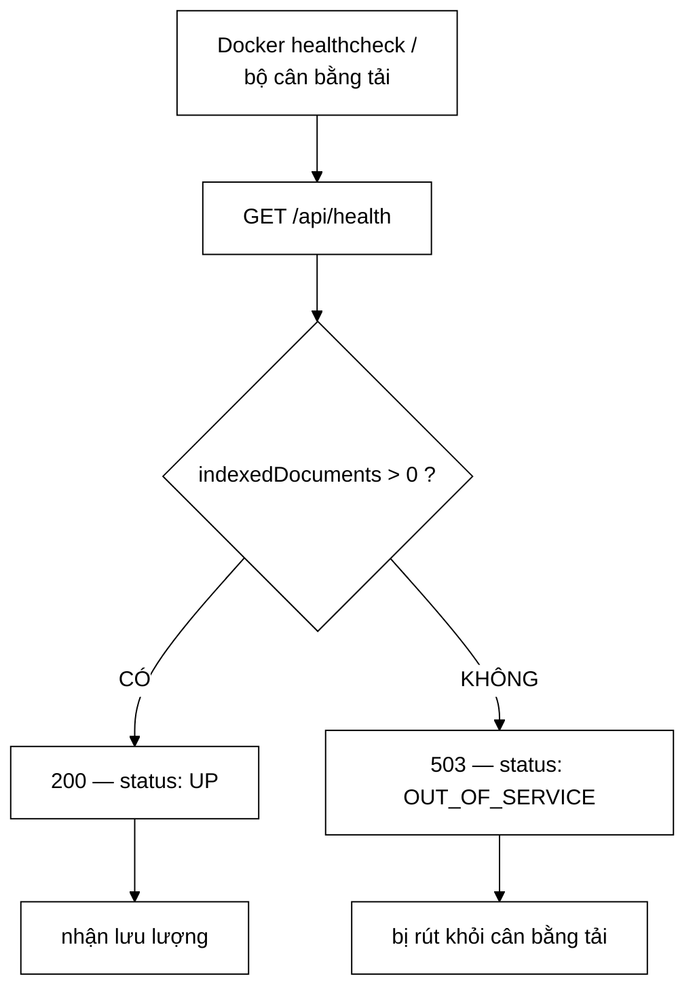

# HealthController — phân biệt "đang chạy" với "phục vụ được", và ranh giới của một endpoint công khai

**File nguồn:** `search-engine/src/main/java/com/vnsearch/controller/HealthController.java` (55 dòng)
**Gói:** `com.vnsearch.controller` · **Loại:** `@RestController @RequestMapping("/api")`
**Vị trí trong luồng:** `GET /api/health` — công khai, dành cho healthcheck của Docker/Kubernetes
**Đọc kèm:** [`../config/SecurityConfig.md`](../config/SecurityConfig.md) · [`../config/MetricsConfig.md`](../config/MetricsConfig.md) · [`AdminController.md`](./AdminController.md) · [`../service/SearchEngineFacade.md`](../service/SearchEngineFacade.md)

---

## 📌 Hiểu trong 30 giây

Một phép kiểm, hai mã trạng thái.

```java
@GetMapping("/health")
public ResponseEntity<Map<String, Object>> health() {
    int documents = facade.getIndexedDocumentCount();
    boolean ready = documents > 0;

    Map<String, Object> body = new LinkedHashMap<>();
    body.put("status", ready ? "UP" : "OUT_OF_SERVICE");
    body.put("indexedDocuments", documents);

    return ready ? ResponseEntity.ok(body) : ResponseEntity.status(503).body(body);
}
```

Javadoc dòng 27–30:

> *"Trả về `503` khi chỉ mục rỗng: khi đó ứng dụng **đang chạy nhưng không phục vụ
> được** — và đó chính là thứ healthcheck cần phân biệt. Trả `200` vô điều kiện sẽ
> khiến bộ cân bằng tải gửi lưu lượng tới một bản sao không thể trả về kết quả
> nào."*



```
   ⭐ ĐIỂM QUAN TRỌNG NHẤT LÀ THỨ ENDPOINT NÀY KHÔNG TRẢ VỀ:

   ✗ kích thước chỉ mục theo byte
   ✗ tỷ lệ trúng cache
   ✗ số term
   ✗ trạng thái kết nối CSDL/Kafka
   ✗ phiên bản, thời gian khởi động

   "Mot endpoint CONG KHAI duoc phep noi HE THONG CON SONG,
    khong duoc phep noi HE THONG DANG CHUA NHUNG GI."
```

---

## 1. Lý do tồn tại — một phép sửa bảo mật gây ra sự cố vận hành

Javadoc dòng 15–19:

> *"Trước đây `docker-compose.yml` thăm dò sức khoẻ bằng chính endpoint quản trị.
> Khi `/api/admin/**` được khoá lại bằng API key, healthcheck sẽ nhận 401, container
> bị đánh dấu *unhealthy*, và `restart: unless-stopped` khởi động lại vô hạn — một
> vòng lặp hỏng do chính phép sửa bảo mật gây ra."*

```
   VÒNG LẶP, TỪNG BƯỚC

   ① Siết quyền /api/admin/**             (đúng)
   ② healthcheck gọi /api/admin/stats → 401
   ③ Docker đánh dấu container unhealthy
   ④ restart: unless-stopped → khởi động lại
   ⑤ nạp chỉ mục ~40 giây
   ⑥ healthcheck lại 401
   ⑦ → ③

   ⇒ Ứng dụng KHÔNG hề hỏng. Nó chỉ không chứng minh được
     với Docker rằng nó khoẻ.
   ⇒ Và mỗi vòng lặp tốn 40 giây nạp chỉ mục — tức là
     container dành gần như toàn bộ thời gian sống để
     khởi động.
```

```
   ⭐ BÀI HỌC TỔNG QUÁT

   Mọi phép siết quyền phải kèm câu hỏi:
   "AI ĐANG GỌI đường dẫn này mà tôi chưa nghĩ tới?"

   Và câu trả lời thường là HẠ TẦNG, không phải con người:
     - healthcheck của Docker/Kubernetes
     - bộ thu thập số liệu (Prometheus)
     - job sao lưu định kỳ
     - bộ cân bằng tải

   ⇒ Nhóm này không bao giờ "báo lỗi" — nó chỉ âm thầm
     đánh giá hệ thống là hỏng.

   ⇒ Cùng lập luận đã được ghi ở
     ../config/SecurityConfig.md mục 4.1, từ phía bên kia.
```

---

## 2. Ranh giới thông tin — câu đáng nhớ nhất của tệp

Javadoc dòng 21–25:

> *"Chỉ phơi bày đúng những gì cần để biết "có phục vụ được không". Không có số
> liệu vận hành chi tiết (kích thước chỉ mục, tỷ lệ trúng cache) — những thứ đó ở
> `/api/admin/stats` và cần xác thực. Ranh giới: một endpoint công khai được phép
> nói *hệ thống còn sống*, không được phép nói *hệ thống đang chứa những gì*."*

```
   ÁP DỤNG RANH GIỚI VÀO TỪNG TRƯỜNG

   "status": "UP" / "OUT_OF_SERVICE"
     ⇒ "còn sống"       → ĐƯỢC PHÉP

   "indexedDocuments": 30017
     ⇒ "đang chứa những gì"  → ??? 

   ⇒ Trường thứ hai vi phạm chính ranh giới mà Javadoc
     vừa đặt ra, ở dòng ngay sau đó.
```

```
   ⚠️ ĐÂY LÀ MỘT MÂU THUẪN CÓ THẬT, VÀ NÓ ĐÁNG ĐƯỢC BÀN.

   Lập luận BÊNH VỰC việc giữ indexedDocuments:
     ① Nó là LÝ DO của mã trạng thái. Trả 503 mà không nói
       vì sao thì người vận hành phải đi tra chỗ khác.
     ② Nó biến một healthcheck nhị phân thành một công cụ
       chẩn đoán: `curl /api/health` trả lời ngay
       "chỉ mục rỗng" thay vì "có gì đó sai".
     ③ Số tài liệu trong một chỉ mục web công khai không
       phải bí mật — nội dung đã công khai qua /api/search.

   Lập luận CHỐNG:
     ① Nó tiết lộ QUY MÔ hệ thống cho bất kỳ ai
     ② Theo dõi con số này theo thời gian cho biết tốc độ
       crawl, thời điểm reindex, thời điểm mất dữ liệu
     ③ Và chính Javadoc đã tự đặt ra ranh giới loại trừ nó

   ⇒ Kết luận hợp lý: giữ nó là ĐÚNG, nhưng ranh giới
     phải được phát biểu lại cho khớp.
   ⇒ Xem đề xuất 2.
```

```
   ĐỐI CHIẾU VỚI /actuator/prometheus

   ../config/SecurityConfig.md mở /actuator/prometheus công khai,
   và nó phơi CHÍNH con số này qua vnsearch.index.documents,
   cộng thêm tỷ lệ trúng cache và số term.

   ⇒ Tức là ranh giới "không nói đang chứa gì" ĐÃ bị phá
     ở một endpoint công khai khác, rộng hơn nhiều.
   ⇒ Javadoc của SecurityConfig thừa nhận điều đó và nói
     nó "nen duoc chan o tang mang".

   ⇒ Nên việc giữ indexedDocuments ở đây không thêm rủi ro
     nào mới. Nhưng lý do đó không nằm trong tệp này.
```

---

## 3. `503` — mã trạng thái đúng, và vì sao không phải mã khác

```
   BỐN LỰA CHỌN, VÀ HỆ QUẢ CỦA TỪNG CÁI

   200 OK
     ⇒ bộ cân bằng tải gửi lưu lượng tới bản sao vô dụng
     ⇒ người dùng nhận 0 kết quả cho mọi truy vấn
     ⇒ SAI

   500 Internal Server Error
     ⇒ ngụ ý "có lỗi xảy ra"
     ⇒ nhưng không có lỗi nào — ứng dụng chạy hoàn hảo
     ⇒ và 500 kích hoạt cảnh báo 5xx cho một chuyện
       không phải sự cố phần mềm
     ⇒ SAI (cùng lập luận với
       ../config/GlobalExceptionHandler.md mục 3)

   404 Not Found
     ⇒ vô nghĩa, endpoint tồn tại

   503 Service Unavailable                          ← chọn
     ⇒ đúng nghĩa: "tôi hoạt động, nhưng tạm thời không
       phục vụ được"
     ⇒ đây là mã mà mọi bộ cân bằng tải hiểu là
       "rút khỏi vòng quay, thử lại sau"
     ⇒ ĐÚNG
```

```
   ⭐ VÀ 503 CÒN CÓ MỘT TÍNH CHẤT QUAN TRỌNG:
     NÓ NGỤ Ý "TẠM THỜI".

   Chỉ mục rỗng là trạng thái CHỮA ĐƯỢC:
     POST /api/admin/reindex

   ⇒ Bản sao này không cần bị GIẾT, nó cần bị RÚT RA
     khỏi lưu lượng cho tới khi chỉ mục có dữ liệu.
   ⇒ Đó chính là ngữ nghĩa của readiness (sẵn sàng)
     đối lập với liveness (còn sống).

   ⚠️ Nhưng Docker healthcheck KHÔNG phân biệt hai khái niệm đó.
     Với docker-compose + restart: unless-stopped, một
     healthcheck thất bại dẫn tới KHỞI ĐỘNG LẠI — tức là
     đúng cái hành vi mà 503 muốn tránh.

   ⇒ Endpoint làm đúng phần của nó; phần còn lại phụ thuộc
     vào cách hạ tầng diễn giải, và đó là ràng buộc
     KHÔNG được ghi ở đâu.
   ⇒ Xem đề xuất 1.
```

---

## 4. `LinkedHashMap` — cùng chi tiết đúng, cùng thiếu giải thích

```java
Map<String, Object> body = new LinkedHashMap<>();
body.put("status", ...);
body.put("indexedDocuments", documents);
```

```
   GIỮ THỨ TỰ CHÈN ⇒ JSON LUÔN RA:
     { "status": ..., "indexedDocuments": ... }

   Với HashMap, thứ tự tuỳ ý và có thể ĐỔI giữa các lần
   chạy JVM.

   ⇒ Quan trọng cho: so sánh ảnh chụp màn hình, đọc log,
     test dựa trên chuỗi JSON.

   ⇒ Cùng chi tiết đúng — và cùng KHÔNG có bình luận —
     với ../config/GlobalExceptionHandler.md mục 7.
   ⇒ Hai tệp, cùng một quyết định thầm lặng, và cả hai
     đều dễ bị "tối ưu" thành HashMap.
```

```
   ⚠️ VÀ CÙNG VẤN ĐỀ KIỂU DỮ LIỆU

   Map<String, Object> ⇒ không có hợp đồng.

   Với endpoint này thì hậu quả LỚN HƠN chỗ khác:
   khoá "status" và giá trị "UP" là thứ mà cấu hình
   Docker/Kubernetes CÓ THỂ đang so khớp bằng chuỗi:

     healthcheck:
       test: ["CMD", "sh", "-c",
              "curl -sf localhost:8080/api/health | grep -q '\"UP\"'"]

   ⇒ Đổi "UP" thành "READY" là một thay đổi PHÁ VỠ hạ tầng,
     nhưng trong mã Java nó chỉ là sửa một chuỗi.
   ⇒ Và không có test nào canh giữ.
```

---

## 5. Điều endpoint này **không** kiểm

```
   NÓ CHỈ KIỂM MỘT THỨ: CHỈ MỤC CÓ RỖNG KHÔNG.

   Những thứ có thể hỏng mà nó vẫn báo UP:
     ✗ Kafka broker mất kết nối (chế độ phân tán)
       ⇒ crawl không hoạt động, tìm kiếm vẫn chạy
       ⇒ báo UP là ĐÚNG cho một endpoint tìm kiếm

     ✗ PostgreSQL mất kết nối
       ⇒ tuỳ kiến trúc, có thể ảnh hưởng hoặc không

     ✗ Đĩa đầy
       ⇒ tìm kiếm vẫn chạy (chỉ mục trong RAM),
         nhưng crawl và ghi log hỏng

     ✗ Chỉ mục có dữ liệu nhưng SAI
       (tokenizer lệch — xem ../config/SearchConfig.md mục 2)
       ⇒ documents = 30017 ⇒ báo UP
       ⇒ nhưng MỌI truy vấn trả 0 kết quả

   ⇒ Ca cuối cùng là ca đáng lo nhất: nó là đúng loại hỏng
     mà endpoint này sinh ra để bắt, nhưng phép kiểm
     "documents > 0" không đủ mạnh để bắt nó.
```

```
   MỘT PHÉP KIỂM MẠNH HƠN, VẪN RẺ

   Thay vì đếm tài liệu, chạy MỘT truy vấn thật:
     facade.search("a", 1, 1)  → có kết quả không?

   ⇒ Bắt được cả "chỉ mục rỗng" LẪN "tokenizer lệch"
   ⇒ Nhưng nó tốn hơn, và healthcheck chạy mỗi 10-30 giây

   ⇒ Đánh đổi thật, và không có dấu vết nào cho thấy nó
     đã được cân nhắc.
   ⇒ Xem đề xuất 3.
```

---

## 6. Hướng dẫn thực hành

### 6.1 Gọi và đọc kết quả

```bash
curl -i http://localhost:8080/api/health

# HTTP/1.1 200
# {"status":"UP","indexedDocuments":30017}

# hoac
# HTTP/1.1 503
# {"status":"OUT_OF_SERVICE","indexedDocuments":0}
```

### 6.2 Cấu hình healthcheck

```yaml
# docker-compose.yml
healthcheck:
  test: ["CMD", "curl", "-f", "http://localhost:8080/api/health"]
  interval: 30s
  timeout: 5s
  # start_period PHAI du dai: nap chi muc mat ~40 giay,
  # va trong khoang do endpoint nay tra 503 mot cach DUNG DAN.
  # Thieu start_period => container bi giet TRONG LUC dang khoi dong,
  # va vong lap khoi dong lai vo han quay tro lai (muc 1).
  start_period: 90s
  retries: 3
```

```yaml
# Kubernetes — PHAI la readinessProbe, KHONG phai livenessProbe
readinessProbe:
  httpGet: { path: /api/health, port: 8080 }
  initialDelaySeconds: 60
  periodSeconds: 15
# Dat o livenessProbe se GIET pod moi lan chi muc rong,
# trong khi POST /api/admin/reindex co the chua duoc no tai cho.
```

### 6.3 Cạm bẫy

```
   ① Endpoint này CÔNG KHAI. Mọi trường thêm vào là phơi
     ra Internet.

   ② Chuỗi "UP" là hợp đồng với cấu hình hạ tầng có thể
     đang grep nó. Đổi chuỗi = thay đổi phá vỡ.

   ③ 503 trong lúc khởi động là ĐÚNG ĐẮN. Thiếu
     start_period ⇒ container bị giết khi đang nạp chỉ mục.

   ④ Ở Kubernetes phải là readinessProbe, không phải
     livenessProbe.

   ⑤ Nó KHÔNG kiểm Kafka, PostgreSQL, đĩa.

   ⑥ Chỉ mục có dữ liệu nhưng SAI (tokenizer lệch) vẫn
     báo UP.

   ⑦ /actuator/health (thứ Kubernetes thăm dò theo mặc định)
     KHÔNG dùng phép kiểm này — nó là một cơ chế khác,
     và nó luôn UP. Trỏ nhầm đường dẫn = mất toàn bộ
     bảo vệ này.
```

---

## 7. Độ phức tạp & chi phí

| Thao tác | Chi phí |
|---|---|
| `getIndexedDocumentCount()` | $O(1)$ — đọc kích thước |
| Dựng thân phản hồi | $O(1)$, 2 mục |

```
   PHÂN TÍCH — VÌ SAO O(1) LÀ RÀNG BUỘC, KHÔNG PHẢI MAY MẮN

   Healthcheck chạy mỗi 10-30 giây, MÃI MÃI, trên MỌI
   bản sao.

   ⇒ Nếu phép kiểm tốn 100 ms, đó là 100 ms mỗi 15 giây
     mỗi bản sao — nhỏ, nhưng nó chiếm một luồng phục vụ
     đúng lúc hệ thống có thể đang quá tải.

   ⚠️ Và cùng ràng buộc đã nêu ở ../config/MetricsConfig.md
     mục 2: getIndexedDocumentCount() bị gọi định kỳ từ
     HAI nơi khác nhau (Prometheus và healthcheck), nhưng
     người sửa SearchEngineFacade không có cách nào biết.

   ⇒ Đây là lần thứ hai cùng một ràng buộc không được ghi
     lên đúng phương thức mà nó áp vào.
```

---

## 8. Kiểm thử liên quan

| Tệp test | Kiểm gì |
|---|---|
| [`EmptyCorpusFallbackTest`](../../../../../test/java/com/vnsearch/service/EmptyCorpusFallbackTest.md) | Hành vi của facade khi chỉ mục rỗng |

```
   ⚠️ KHÔNG CÓ TEST NÀO CHO CHÍNH CONTROLLER.

   EmptyCorpusFallbackTest kiểm lớp bên dưới, không đi qua
   tầng HTTP nên không chạm tới mã trạng thái.
```

```
   NHỮNG TÍNH CHẤT KHÔNG ĐƯỢC CANH GIỮ

   ✗ Chỉ mục rỗng → 503, KHÔNG phải 200
     — mất nó thì bộ cân bằng tải gửi lưu lượng tới
       bản sao vô dụng, và không có triệu chứng nào ở
       phía máy chủ

   ✗ Chỉ mục có dữ liệu → 200

   ✗ Chuỗi status là đúng "UP" / "OUT_OF_SERVICE"
     — hợp đồng với cấu hình hạ tầng bên ngoài repo

   ✗ Endpoint truy cập được KHÔNG cần xác thực
     — chính lý do lớp này ra đời; mất nó thì vòng lặp
       khởi động lại vô hạn ở mục 1 quay lại

   ⇒ Bốn tính chất, tất cả kiểm được bằng một lớp
     @WebMvcTest chạy trong ~1 giây.
   ⇒ Và tính chất thứ tư đã từng gây sự cố thật.
```

---

## 9. Liên kết

- Nguồn của `getIndexedDocumentCount()`, và ràng buộc "phải rẻ": [`../service/SearchEngineFacade.md`](../service/SearchEngineFacade.md)
- Luật mở endpoint này công khai, và sự cố dẫn tới nó: [`../config/SecurityConfig.md`](../config/SecurityConfig.md) mục 4.1
- Người dùng thứ hai của cùng con số, cũng gọi định kỳ: [`../config/MetricsConfig.md`](../config/MetricsConfig.md) mục 1
- Endpoint số liệu chi tiết, nằm sau xác thực: [`AdminController.md`](./AdminController.md)
- Endpoint chữa được trạng thái 503: [`AdminController.md`](./AdminController.md) (`POST /api/admin/reindex`)
- Lỗi mà phép kiểm hiện tại **không** bắt được: [`../config/SearchConfig.md`](../config/SearchConfig.md) mục 2
- Cùng lập luận "mã trạng thái phải nói đúng loại lỗi": [`../config/GlobalExceptionHandler.md`](../config/GlobalExceptionHandler.md) mục 3
- Cùng chi tiết `LinkedHashMap` thầm lặng: [`../config/GlobalExceptionHandler.md`](../config/GlobalExceptionHandler.md) mục 7
